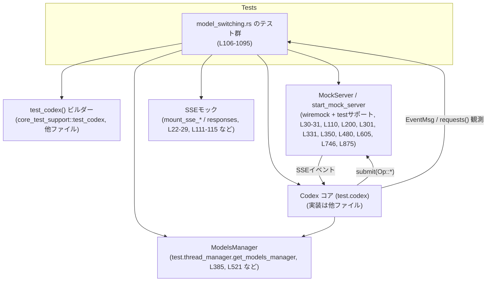
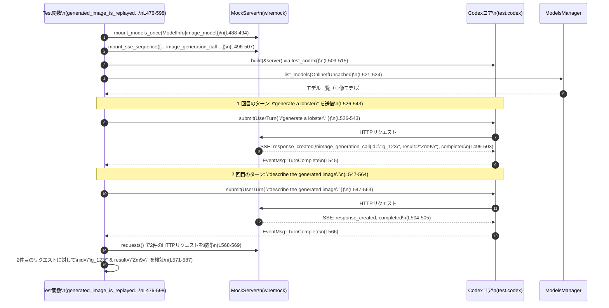

# core/tests/suite/model_switching.rs

## 0. ざっくり一言

Codex の「モデル切り替え」まわりの挙動（モデル／パーソナリティ／サービスティア／画像機能／トークンコンテキストウィンドウ／スレッドロールバック）を、HTTP リクエスト内容とイベントストリームを通じて検証する非同期テスト群です（`core/tests/suite/model_switching.rs:L106-1095`）。

---

## 1. このモジュールの役割

### 1.1 概要

このモジュールは、Codex セッションにおける以下のような振る舞いを検証するためのテストを提供します。

- モデル変更時に、モデル向けの説明（developer メッセージ）が正しく挿入されるか（`<model_switch>` など）（`L106-194`, `L196-295`）。
- サービスティア指定（Fast/Flex）が HTTP リクエストの `service_tier` に期待通りマッピングされるか（`L297-344`）。
- 画像入力対応モデルとテキスト専用モデルを切り替えたときの、過去の画像コンテンツ／生成済み画像の扱い（`L346-740`, `L742-869`）。
- モデルのコンテキストウィンドウ（トークン上限）がモデル切り替え時に更新され、イベントに正しく反映されるか（`L871-1095`）。

### 1.2 アーキテクチャ内での位置づけ

このファイルは **テスト層** に属し、実際の Codex コアやモデル管理ロジックに対して、モックサーバーとテストサポートユーティリティを通じて振る舞いを検証しています。

- Codex コアそのもの（`test.codex` や `thread_manager` など）は他ファイルに定義されており、このチャンクには実装は現れません。
- HTTP レベルのやりとりは `wiremock::MockServer` と `core_test_support::responses::*` によってモックされます（`L22-31`, `L37`, `L350-377` など）。
- モデルメタデータは `ModelInfo`（`codex_protocol::openai_models`）をローカルで構築してモック API に登録しています（`L63-104`, `L886-925`）。
- イベント駆動の挙動は `wait_for_event` と `EventMsg` によって観測します（`L33`, `L140`, `L237`, `L416`, `L545`, `L677`, `L811`, `L997` など）。



### 1.3 設計上のポイント

- **完全非同期テスト**  
  すべて `#[tokio::test(flavor = "multi_thread", worker_threads = 2)]` で定義され、非同期 I/O と並行タスクを前提にしています（`L106`, `L196`, `L297`, `L327`, `L347`, `L477`, `L600`, `L742`, `L872`）。

- **テストサポートの徹底利用**  
  - Codex インスタンス構築に `test_codex()`（`L117`, `L207`, `L308`, `L334`, `L379`, `L509`, `L641`, `L775`, `L950`）。
  - SSE／HTTP モックに `mount_sse_sequence`, `mount_sse_once`, `mount_models_once`（`L111-115`, `L201-205`, `L302-306`, `L331-333`, `L365-371`, `L488-507`, `L620-639`, `L754-773`, `L927-948`）。

- **イベント駆動の同期**  
  Codex コア内の非同期処理完了を `wait_for_event` と `EventMsg` を通して同期させてから HTTP リクエストの検証を行う設計です（例: `TurnComplete`, `TokenCount`, `TurnStarted`, `ThreadRolledBack` の待機、`L140`, `L237`, `L416`, `L545`, `L677`, `L811`, `L997`, `L1018`, `L1063`, `L1092`）。

- **ファイルシステム副作用の整理**  
  画像生成アーティファクトのパスを一意に求めるヘルパー `image_generation_artifact_path` を定義し、テスト前後で `std::fs::remove_file` によりクリーンアップしています（`L39-61`, `L515-521`, `L647-652`, `L781-786` など）。

---

## 2. 主要な機能一覧

このテストモジュールが検証している主要な振る舞いは次の通りです。

- モデル変更時の developer メッセージ付加:
  - `<model_switch>` タグと「以前とは違うモデル」説明文が含まれること（`L182-191`）。
- モデル＋パーソナリティ同時変更時の動作:
  - モデル変更のメッセージのみ追加され、`<personality_spec>` が重複して入らないこと（`L279-292`）。
- サービスティアの HTTP 反映:
  - `ServiceTier::Fast` → `"priority"`、`ServiceTier::Flex` → `"flex"` にシリアライズされ、指定を外したターンではフィールド自体が消えること（`L310-323`, `L336-342`）。
- 画像入力からテキスト専用モデルへの切り替え:
  - 過去の画像入力を HTTP リクエストから削除し、代わりに「image content omitted ...」や画像タグ用テキストを挿入すること（`L392-471`）。
- 画像生成履歴の再生（同じ画像対応モデル使用時）:
  - 過去の `image_generation_call` が入力として再送信され、ID と画像ペイロードが保持されること（`L496-507`, `L571-587`）。
- 画像生成済みからテキスト専用モデルへの切り替え:
  - `image_generation_call` のメタデータのみ維持し、画像バイトは空にし、プレースホルダーテキストも挿入しないこと（`L703-722`）。
- スレッドロールバック後の画像関連履歴削除:
  - ロールバックしたターンのユーザーメッセージ・生成画像メッセージ・画像呼び出し入力がすべて削除されること（`L842-865`）。
- 小さいコンテキストウィンドウのモデルへの切り替え:
  - `TurnStarted` と `TokenCount` イベントに載る `model_context_window` が新しいモデルの有効ウィンドウサイズに更新されること（`L886-895`, `L916-920`, `L997-1017`, `L1056-1071`, `L1072-1091`）。

---

## 3. 公開 API と詳細解説

### 3.1 型一覧（このファイルで利用している主な型）

このファイル自身は新しい型定義を持ちませんが、重要な外部型をいくつか利用しています。

| 名前 | 種別 | 役割 / 用途 | 定義元 / 備考 | 使用箇所 |
|------|------|-------------|---------------|----------|
| `ModelInfo` | 構造体 | モデルメタデータ（コンテキストウィンドウ、入力モダリティなど）をモック構築する | `codex_protocol::openai_models`（このチャンクには定義なし） | `L63-104`, `L886-920` ほか |
| `InputModality` | 列挙体 | モデルが受け付ける入力種別（Text / Image 等）を表現する | 同上 | `L67`, `L353-364`, `L481-487`, `L607-619` |
| `UserInput` | 列挙体 | ユーザーターンで送る入力（Text / Image）を表現する | `codex_protocol::user_input`（定義は他ファイル） | `L121-137`, `L218-235`, `L392-402`, `L526-531`, `L659-663`, `L793-801`, `L977-983`, `L1037-1041` |
| `Op` | 列挙体 | Codex への操作（UserTurn, OverrideTurnContext, ThreadRollback 等）を表す | `codex_protocol::protocol` | `L121`, `L142-155`, `L218`, `L239-252`, `L392`, `L419`, `L526`, `L548`, `L658`, `L680`, `L792`, `L813`, `L977`, `L1020`, `L1037` |
| `EventMsg` | 列挙体 | Codex からのイベント（TurnComplete, TokenCount, TurnStarted, ThreadRolledBack 等） | 同上 | `L140`, `L177`, `L237`, `L274`, `L416`, `L437`, `L545`, `L566`, `L677`, `L698`, `L811`, `L840`, `L997-1005`, `L1018`, `L1056-1061`, `L1072-1080`, `L1092` |
| `ServiceTier` | 列挙体 | Fast / Flex などのサービスティアを表す | `codex_protocol::config_types` | `L310-313`, `L336-337`, `L526-561`, `L659-672`, `L792-806`, `L977-991`, `L1037-1051` |
| `RefreshStrategy` | 列挙体 | モデル情報取得時の更新戦略（Online / OnlineIfUncached） | `codex_models_manager::manager` | `L385-388`, `L521-524`, `L653-656`, `L787-790`, `L958` |
| `MockServer` | 構造体 | wiremock サーバー (HTTP モック) | `wiremock` | `L37`, `L110`, `L350`, `L480`, `L605`, `L746` |

> これらの型の詳細な定義はこのチャンクには現れません。ここでは **どのように使われているか** のみを説明します。

### 3.2 関数詳細（主要 7 件）

#### `image_generation_artifact_path(codex_home: &Path, session_id: &str, call_id: &str) -> PathBuf`

**概要**

画像生成の結果を保存するためのファイルパスを、Codex のホームディレクトリとセッション ID／コール ID から組み立てるヘルパー関数です（`core/tests/suite/model_switching.rs:L39-61`）。

内部でネスト関数 `sanitize` を用いて ID 文字列をファイル名として安全な形に変換します（`L40-55`）。

**引数**

| 引数名 | 型 | 説明 |
|--------|----|------|
| `codex_home` | `&Path` | Codex のホームディレクトリルートパス |
| `session_id` | `&str` | セッション固有の ID 文字列。ファイルパス中のサブディレクトリ名に使われる（`L57-60`）。 |
| `call_id` | `&str` | 画像生成コールの ID。ファイル名（`<sanitized_call_id>.png`）に使われる（`L59-60`）。 |

**戻り値**

- `PathBuf`  
  - `codex_home/generated_images/<sanitized_session_id>/<sanitized_call_id>.png` という構造のパスを返します（`L57-60`）。

**内部処理の流れ**

1. ネスト関数 `sanitize` で引数の文字列を走査し、英数字・`-`・`_` のみ残し、それ以外の文字を `_` に置換します（`L41-49`）。
2. 置換後の文字列が空であれば `"generated_image"` に置き換えます（`L51-53`）。
3. `codex_home` に対し順に:
   - `"generated_images"` ディレクトリ、
   - `sanitize(session_id)` によるディレクトリ、
   - `format!("{}.png", sanitize(call_id))` によるファイル名  
   を `join` で連結し、`PathBuf` として返します（`L57-60`）。

**Examples（使用例）**

```rust
use std::path::Path;
use core::tests::suite::model_switching::image_generation_artifact_path;

// Codex ホームディレクトリ仮定
let home = Path::new("/tmp/codex_home");

// 生の ID。スラッシュなどは sanitize により '_' に変換される
let path = image_generation_artifact_path(home, "session/1", "ig:123");
// => /tmp/codex_home/generated_images/session_1/ig_123.png のようなパスになる
```

この関数は、画像生成関連テスト内で保存先パスの推定とクリーンアップに使用されています（`L515-521`, `L647-652`, `L781-786`）。

**Errors / Panics**

- この関数自体はエラーや panic を発生させるコードを含みません（単純な文字処理と `PathBuf` 構築のみ、`L39-60`）。
- 戻り値を用いたファイル操作（削除など）は呼び出し側で実施されます（`std::fs::remove_file` の使用は `L520`, `L652`, `L786`, `L595`, `L737`, `L866`）。

**Edge cases（エッジケース）**

- `session_id` / `call_id` が空文字列の場合:
  - `sanitize` により `"generated_image"` に置き換えられます（`L51-53`）。
- `session_id` / `call_id` にパス区切りやピリオドなどが含まれる場合:
  - `is_ascii_alphanumeric` / `'-'` / `'_'` 以外はすべて `'_'` になるため、`"../secret"` などのパストラバーサル的な文字列も `"__secret"` のような安全な形に変換されます（`L41-49`）。

**使用上の注意点**

- 返されるパスはディレクトリの存在や書き込み可能性を検証しません。実際にファイル操作を行う前に、必要であればディレクトリ作成などを行う必要があります。
- ファイルシステムと OS に依存する許容文字はより広い場合がありますが、この関数はあえて制限的なホワイトリストでサニタイズしており、その設計意図は「安全だが多少冗長なパス生成」と解釈できます（コード上の根拠は変換ルールのみで、意図自体はこのチャンクには書かれていません）。

---

#### `model_change_appends_model_instructions_developer_message() -> Result<()>`

（`#[tokio::test]` 非同期テスト、`core/tests/suite/model_switching.rs:L106-194`）

**概要**

同一セッション内でモデルを変更した際、**2 回目の HTTP リクエストの developer ロールのメッセージに、モデル切り替えを示す `<model_switch>` タグと説明文が追加されること**を検証するテストです。

**引数**

- なし（テスト関数のため）。

**戻り値**

- `anyhow::Result<()>`  
  - テストが成功すれば `Ok(())` を返し、途中の `?` で生じたエラーがあれば `Err` で伝播します（`L117-119`, `L138-139`, `L142-156`, `L158-176`）。

**内部処理の流れ**

1. ネットワークが利用できない環境ではテストをスキップ（`skip_if_no_network!(Ok(()))`、`L108`）。
2. `MockServer::start().await` で wiremock サーバーを起動し（`L110`）、`mount_sse_sequence` により 2 回の SSE 完了レスポンスを登録します（`L111-115`）。
3. `test_codex().with_model("gpt-5.2-codex")` で Codex テストインスタンスのビルダーを作成し、`build(&server).await` で起動（`L117-119`）。
4. 1 回目のユーザーターンを、初期モデルで送信（`Op::UserTurn`, `L121-138`）し、`EventMsg::TurnComplete` を待ちます（`L140`）。
5. `Op::OverrideTurnContext` でモデルを `"gpt-5.1-codex-max"` に変更（`L142-155`）。
6. 2 回目のユーザーターンを新モデルで送信し（`L158-175`）、再び `TurnComplete` を待ちます（`L177`）。
7. モックサーバーに記録されたリクエストを取得し、2 件あることを確認（`L179-180`）。
8. 2 回目のリクエストに対して:
   - `message_input_texts("developer")` で developer ロールのメッセージ群を取得（`L182-183`）。
   - その中から `<model_switch>` を含むメッセージを探し（`L184-187`）、「The user was previously using a different model.」という文言を含むことを `assert!` で検証します（`L188-191`）。

**Examples（使用例）**

このテスト自体が、モデル変更＋ HTTP リクエスト検証の典型例です。

```rust
// テスト中でのモデル変更と検証（抜粋）
test.codex.submit(Op::OverrideTurnContext {
    model: Some(next_model.to_string()),
    // その他のフィールドは None / 既定
}).await?;

// 次のターンでは model フィールドも新しいスラッグを指定
test.codex.submit(Op::UserTurn { model: next_model.to_string(), /*...*/ }).await?;

let requests = resp_mock.requests();
let second_request = requests.last().unwrap();
let developer_texts = second_request.message_input_texts("developer");

// <model_switch> を含むメッセージが存在することを検証
assert!(developer_texts.iter().any(|t| t.contains("<model_switch>")));
```

**Errors / Panics**

- Codex 本体やモックサーバーでエラーが発生した場合、`build` や `submit` が `Err` を返し `?` でテスト失敗となります（`L118-119`, `L138-139`, `L156`, `L176`）。
- `requests.last().expect("expected second request")` などの `expect` は、期待した件数のリクエストがなかった場合に panic します（`L182-187`）。

**Edge cases（エッジケース）**

- モデルを変更しても HTTP リクエストが 2 件発行されない（タイムアウトなどで中断）の場合:
  - `assert_eq!(requests.len(), 2, ...)` が失敗してテストは即座に fail します（`L179-180`）。
- `<model_switch>` メッセージ自体は存在するが、説明文が変わった場合:
  - 文言 `"The user was previously using a different model."` に依存しているため、このテストは失敗します（`L188-191`）。

**使用上の注意点**

- このテストの形を参考に、新しいモデル切り替えロジックを追加する場合も、**必ず 1 回目のターン完了を待ってから Override + 2 回目のターン**というシーケンスを守ると、期待する履歴挿入が検証しやすくなります。
- developer メッセージの文言に強く依存しているため、国際化やメッセージテンプレート変更時にはテスト修正が必須です。

---

#### `model_change_from_image_to_text_strips_prior_image_content() -> Result<()>`

（画像入力対応モデルからテキスト専用モデルへ変更したときの履歴処理を検証するテスト、`L346-474`）

**概要**

1 回目のターンで **画像＋テキスト** を画像対応モデルに送り、その後テキスト専用モデルに切り替えて 2 回目のターンを送った際に、

- 2 回目の HTTP リクエストには、過去の画像 URL が一切含まれないこと、
- 代わりにユーザーメッセージに「画像コンテンツ省略」用のプレースホルダーと画像開始／終了タグテキストが挿入されていること、

を検証します。

**引数・戻り値**

- 引数なし、戻り値 `Result<()>`（エラー処理は前述のテストと同様）。

**内部処理の流れ（概要）**

1. `MockServer` 起動（`L350`）。
2. 画像対応モデルとテキスト専用モデルの `ModelInfo` を `test_model_info` で作成し（`L353-364`）、`mount_models_once` でモックサーバーに登録（`L365-371`）。
3. 2 回分の SSE 完了レスポンスをモック登録（`L373-377`）。
4. `test_codex` に画像モデルスラッグを設定して Codex を構築（`L379-384`）。
5. モデル一覧を取得し、モデルメタデータのキャッシュを更新（`list_models`, `L385-388`）。
6. 1 回目のターンで `UserInput::Image` と `UserInput::Text` を送信（`L392-402`）、`TurnComplete` を待つ（`L415-416`）。
7. 2 回目のターンをテキスト専用モデルスラッグで送信（`L418-435`）、再度 `TurnComplete` を待つ（`L437`）。
8. モックサーバーのリクエスト一覧を取得し（`L439-440`）:
   - 1 回目のリクエストには少なくとも 1 つの画像 URL が含まれることを確認（`L442-446`）。
   - 2 回目のリクエストでは `message_input_image_urls("user")` が空であることを確認（`L448-452`）。
   - 2 回目のユーザーテキスト群から、以下の 3 種類が含まれることを確認（`L453-471`）:
     - `"image content omitted because you do not support image input"`
     - `codex_protocol::models::image_open_tag_text()`
     - `codex_protocol::models::image_close_tag_text()`

**Examples（使用例）**

画像 → テキスト専用モデルへの切り替えテストパターンのテンプレートとして利用できます。

```rust
// 1. 画像対応モデルで画像＋テキストターン
test.codex.submit(Op::UserTurn {
    items: vec![
        UserInput::Image { image_url: image_url.clone() },
        UserInput::Text { text: "first turn".into(), text_elements: vec![] },
    ],
    model: image_model_slug.to_string(),
    // ...
}).await?;

// 2. テキスト専用モデルに切り替えつつ 2 回目のターン
test.codex.submit(Op::UserTurn {
    items: vec![UserInput::Text { text: "second turn".into(), text_elements: vec![] }],
    model: text_model_slug.to_string(),
    // ...
}).await?;
```

**Errors / Panics**

- SSE モックの登録順や回数が実際の HTTP リクエスト回数と異なると、`requests.len()` のアサーションによりテストが失敗します（`L439-440`）。
- `first_request` / `second_request` の `.expect()` 呼び出しも、期待したリクエストが存在しない場合に panic します（`L442`, `L448`）。

**Edge cases**

- 画像モデルにもかかわらず、`message_input_image_urls("user")` が空だった場合:
  - テストは「1 回目のリクエストには画像 URL があるべき」という前提で失敗します（`L442-446`）。
- テキスト専用モデル側の仕様変更により、画像省略用プレースホルダー文言が変わった場合:
  - 文字列 `"image content omitted because you do not support image input"` に依存しているためテストが失敗します（`L455-458`）。

**使用上の注意点**

- 画像入力の履歴変換処理は Codex コア側の実装であり、このテストでは **HTTP リクエストの最終形** のみを検証しています。変換の詳細アルゴリズムはこのチャンクには現れません。
- 画像タグのオープン／クローズテキストは `codex_protocol::models::*` に依存しており（`L463-469`）、その実装詳細は不明です。

---

#### `generated_image_is_replayed_for_image_capable_models() -> Result<()>`

（生成済み画像を同じ画像対応モデルで再利用する際の挙動を検証、`L476-598`）

**概要**

1 回目のターンで画像生成（`image_generation_call` イベント）を行い、その後のターンで同じ画像対応モデルを使って「生成した画像について説明して」と依頼したときに、

- 2 回目の HTTP リクエストの `inputs_of_type("image_generation_call")` に元の画像生成呼び出しが 1 件含まれること、
- その `id` と `result`（画像ペイロード）が保存されていること、
- さらに developer メッセージに「Generated images are saved to ...」という保存先に関する説明が含まれること、

を検証するテストです。

**内部処理の流れ（概要）**

1. 画像モデルを 1 件だけ登録（`test_model_info`＋`mount_models_once`, `L481-487`, `L488-494`）。
2. SSE シーケンスとして、1 回目のレスポンスで `image_generation_call` を含むイベント群、2 回目は単純な完了イベントを登録（`L496-507`）。
3. Codex を画像モデルで起動し（`L509-515`）、期待されるアーティファクトパスを `image_generation_artifact_path` で算出した上で、事前に削除（`L515-521`）。
4. モデル一覧を取得してキャッシュを準備（`L521-524`）。
5. 1 回目のターンとして `"generate a lobster"` を送信（`L526-543`）、`TurnComplete` を待機（`L545`）。
6. 2 回目のターンに `"describe the generated image"` を送信（`L547-564`）、再度 `TurnComplete` を待機（`L566`）。
7. 2 回目の HTTP リクエストを取り出し（`L571`）、以下を確認:
   - `inputs_of_type("image_generation_call")` が長さ 1（`L572-576`）。
   - その `id` が `"ig_123"`（`L579-582`）。
   - `result` が `"Zm9v"`（元の SSE イベントと同じ Base64 文字列、`L584-587`）。
   - developer メッセージに `"Generated images are saved to"` を含むテキストがあること（`L588-593`）。
8. テスト後にアーティファクトパスの削除を試みて終了（`L595`）。

**Examples（使用例）**

このテストは「生成済み画像を履歴に再注入する」仕様の確認テンプレートとして利用できます。

```rust
// 1 回目: 画像生成を行うターン
test.codex.submit(Op::UserTurn {
    items: vec![UserInput::Text { text: "generate a lobster".into(), text_elements: vec![] }],
    model: image_model_slug.to_string(),
    // ...
}).await?;

// 2 回目: 生成済み画像に言及するターン
test.codex.submit(Op::UserTurn {
    items: vec![UserInput::Text { text: "describe the generated image".into(), text_elements: vec![] }],
    model: image_model_slug.to_string(),
    // ...
}).await?;
```

**Errors / Panics**

- SSE 側の `image_generation_call` が送られてこない場合や ID／result が異なる場合、対応する `assert_eq!` が失敗します（`L573-587`）。
- アーティファクトパスの削除 (`remove_file`) エラーは `let _ =` で無視されているため、ここでは panic 要因にはなりません（`L520`, `L595`）。

**Edge cases**

- 画像生成が未完了（`status` が `"completed"` 以外）なケースは、このテストでは扱っていません（SSE モックでは常に `"completed"` を渡している、`L501-502`）。
- `inputs_of_type("image_generation_call")` の戻り値型や JSON 構造の詳細はこのチャンクでは不明ですが、添字アクセス `image_generation_calls[0]["id"]` を行っているので、`serde_json::Value` 互換のインタフェースであると推測できます（`L579-585`）。

**使用上の注意点**

- 生成済み画像の保存ロジック自体はこのチャンクには現れません。テストは developer メッセージ中のテキストと再送される入力 JSON のみを根拠にしています。
- Base64 文字列 `"Zm9v"` はテスト専用のダミー値であり、実際の画像データを意味するものではありません（`L501-502`）。

---

#### `model_change_from_generated_image_to_text_preserves_prior_generated_image_call() -> Result<()>`

（画像生成済みの履歴をテキスト専用モデルへ引き継ぐ挙動の検証、`L600-740`）

**概要**

画像対応モデルで画像生成を行った後、テキスト専用モデルに切り替えて「生成した画像について説明して」と依頼したときに、

- テキスト専用モデルへの HTTP リクエストでは、過去の生成画像が **`image_generation_call` として 1 件保持** されること、
- ただし `result` フィールド（画像バイト）は空文字列となること、
- ユーザーへのプレースホルダーテキスト（「image content omitted ...」）は挿入されないこと、
- developer メッセージには引き続き「Generated images are saved to ...」説明が含まれること、

を検証するテストです。

**内部処理の流れ（概要）**

1. 画像モデル／テキスト専用モデルを登録（`L606-619`, `L620-625`）。
2. 1 回目の SSE シーケンスに `image_generation_call("ig_123", "completed", ...)` を含めてモック（`L628-639`）。
3. Codex を画像モデルで起動し、アーティファクトパスのクリーンアップとモデル一覧更新（`L641-656`）。
4. 1 回目のターン（画像生成依頼）を画像モデルで送信し、`TurnComplete` を待機（`L658-677`）。
5. 2 回目のターン（説明依頼）を **テキスト専用モデル** で送信し、`TurnComplete` を待機（`L679-698`）。
6. 2 回目 HTTP リクエストについて以下を検証（`L703-736`）:
   - `message_input_image_urls("user")` が空（生成済み画像を input image に変換していない、`L705-708`）。
   - `inputs_of_type("image_generation_call")` が 1 件（`L710-712`）。
   - その `id` が `"ig_123"` である（`L713-717`）。
   - `result` が空文字 `""` である（`L718-721`）。
   - ユーザーメッセージには `"image content omitted because you do not support image input"` が一切含まれない（`L723-728`）。
   - developer メッセージには `"Generated images are saved to"` を含むものがある（`L730-735`）。

**Errors / Panics**

- 画像対応版との違いとして、ここでは `result` が空であることを強く要求しているため、仕様変更で「テキスト専用モデルにも Base64 を渡す」ようになった場合にはテストが必ず失敗します（`L718-721`）。

**Edge cases**

- `image_generation_call` が複数件あるケースや、部分的に失敗しているケースなどはこのテストでは扱っていません。全体として 1 件のみを想定しています（`L628-639`, `L710-712`）。
- `inputs_of_type` が返す値の JSON 構造が変わった場合（`id` や `result` が別の階層に移動するなど）は、このテストの添字アクセスが失敗します。

**使用上の注意点**

- 「生成済み画像のメタデータは渡すが、中身は削る」という仕様の検証なので、別のポリシー（たとえば URL のみ渡す）に変更する場合は新しいテストを追加し、このテストはその仕様に合わせて書き換える必要があります。

---

#### `thread_rollback_after_generated_image_drops_entire_image_turn_history() -> Result<()>`

（スレッドロールバックが画像生成ターンとその副産物をすべて削除することの検証、`L742-869`）

**概要**

画像生成を行ったターンの後で `Op::ThreadRollback { num_turns: 1 }` を実行し、その後のターンを送信したときに、

- ロールバックされたターンのユーザーメッセージが履歴から消えていること、
- そのターンに紐づいていた「Generated images are saved to ...」メッセージが developer ロールから消えていること、
- `inputs_of_type("image_generation_call")` にも画像生成呼び出しが残っていないこと、

を検証するテストです。

**内部処理の流れ（概要）**

1. 画像モデルを登録し、SSE に画像生成を含むレスポンスを設定（`L747-753`, `L754-773`）。
2. Codex を画像モデルで起動し、アーティファクトパス削除とモデル一覧取得（`L775-790`）。
3. 1 回目のターンで `"generate a lobster"` と依頼し、画像生成を行う（`L792-809`）、`TurnComplete` を待つ（`L811`）。
4. `Op::ThreadRollback { num_turns: 1 }` を送信し（`L813-815`）、`EventMsg::ThreadRolledBack` を待機（`L816-819`）。
5. その後 `"after rollback"` という新しいターンを送信し、`TurnComplete` を待機（`L821-840`）。
6. 2 回目の HTTP リクエストを取得し（`L842-843`）、以下を確認（`L845-865`）:
   - ユーザーメッセージに `"generate a lobster"` が含まれない（`L846-851`）。
   - developer メッセージに `"Generated images are saved to"` を含むものがない（`L853-858`）。
   - `inputs_of_type("image_generation_call")` が空（`L860-864`）。

**Errors / Panics**

- ロールバックイベント `EventMsg::ThreadRolledBack(_)` が届かない場合、`wait_for_event` がどう挙動するかはこのチャンクでは不明ですが、一般的にはタイムアウトなどでテストが失敗すると考えられます（`L816-819`）。

**Edge cases**

- `num_turns: 1` のみをテストしており、複数ターンのロールバックやロールバック不能なケースは検証していません。
- 画像生成を含まないターンに対するロールバックの挙動は、このファイルでは別途テストされていません（このチャンクには現れません）。

**使用上の注意点**

- ロールバック後の履歴が完全に消えることを前提にして新機能を実装する場合、このテストと矛盾しないか注意が必要です。たとえば「生成済み画像だけは残す」といった仕様を導入したい場合は、このテストを更新する必要があります。

---

#### `model_switch_to_smaller_model_updates_token_context_window() -> Result<()>`

（モデル切り替え時にトークンコンテキストウィンドウが更新されることの検証、`L871-1095`）

**概要**

コンテキストウィンドウの大きいモデルから小さいモデルに切り替えた際に、`EventMsg::TurnStarted` と `EventMsg::TokenCount` に含まれる `model_context_window` が、

- 元モデル使用時には大きい有効コンテキストウィンドウ（`large_context_window * effective_context_window_percent / 100`）になっていること、
- 切り替え後のターンでは小さい有効コンテキストウィンドウになっていること、

を検証するテストです。

**内部処理の流れ（概要）**

1. 大きいモデル／小さいモデルのスラッグとコンテキストウィンドウを定義（`L877-884`）。
2. `ModelInfo` ベースインスタンスを構築し、`context_window: Some(large_context_window)` として定義（`L886-920`）。
3. `base_model.clone()` から小さいモデル版をつくり、`slug`・`display_name`・`description`・`context_window` を小さい値に上書き（`L921-925`）。
4. 2 モデルを `mount_models_once` で登録（`L927-933`）。
5. SSE シーケンスで 2 回のレスポンスを用意し、それぞれ `total_tokens` を 100／120 に設定（`L935-948`）。
6. Codex を大きいモデルスラッグで起動（`L950-955`）。
7. `models_manager.list_models(RefreshStrategy::Online)` でモデル一覧を取得し、小さいモデルが含まれることを確認（`L957-964`）。
8. 両モデルの `context_window` が期待どおりであることを `get_model_info` で確認（`L965-975`）。
9. 1 回目のターンを大きいモデルで送信し（`L977-994`）、
   - `EventMsg::TokenCount`（`total_tokens == 100`）の `model_context_window` が `Some(large_effective_window)` であることを確認（`L997-1017`）。
   - `TurnComplete` を待機（`L1018`）。
10. `Op::OverrideTurnContext` で小さいモデルに切り替え（`L1020-1034`）。
11. 2 回目のターンを小さいモデルで送信し（`L1036-1053`）、
    - `EventMsg::TurnStarted` に含まれる `model_context_window` が `Some(smaller_effective_window)` であることを確認（`L1056-1070`）。
    - `EventMsg::TokenCount`（`total_tokens == 120`）の `model_context_window` が `Some(smaller_effective_window)` であり、かつ `Some(large_effective_window)` とは異なることを確認（`L1072-1091`）。
    - `TurnComplete` を待機して終了（`L1092`）。

**Errors / Panics**

- モデル管理側で context_window 情報が返ってこない場合や `effective_context_window_percent` の扱いが変わった場合、`assert_eq!` と `assert_ne!` が失敗します（`L968-975`, `L1011-1017`, `L1086-1091`）。

**Edge cases**

- `effective_context_window_percent` が 95 以外の場合の挙動はこのテストでは検証していません（`L881`, `L917-919`）。
- `model_context_window` が `None` となるモデルの扱いもこのテストには含まれません。ここでは両モデルとも `Some(...)` であることを前提としています。

**使用上の注意点**

- コンテキストウィンドウの計算は **モデルメタデータ × パーセンテージ** で行われている前提でテストされています。計算式を変えるとこのテストも調整が必要です。
- `TokenCount` イベント内の `info` フィールドが `Option` であることを前提に、`as_ref().and_then(...)` でアクセスしています（`L1001-1015`, `L1076-1089`）。この構造が変わった場合にはテストの更新が必要です。

---

### 3.3 その他の関数

このファイルに定義されているその他の補助関数／テストの一覧です。

| 関数名 | 種別 | 役割（1 行） | 行範囲 |
|--------|------|--------------|--------|
| `test_model_info(...) -> ModelInfo` | 補助関数 | モック用の `ModelInfo` 構造体を組み立てる（`L63-104`）。 | `core/tests/suite/model_switching.rs:L63-104` |
| `model_and_personality_change_only_appends_model_instructions() -> Result<()>` | テスト | モデルとパーソナリティを同時変更しても、developer メッセージにはモデル切り替えの説明のみが挿入されることを検証（`L196-295`）。 | `L196-295` |
| `service_tier_change_is_applied_on_next_http_turn() -> Result<()>` | テスト | `ServiceTier::Fast` の指定が次の HTTP リクエストの `service_tier: "priority"` に反映され、その後のターンではフィールドが消えることを検証（`L297-325`）。 | `L297-325` |
| `flex_service_tier_is_applied_to_http_turn() -> Result<()>` | テスト | `ServiceTier::Flex` が HTTP リクエストの `service_tier: "flex"` にシリアライズされることを検証（`L327-344`）。 | `L327-344` |
| `model_change_appends_model_instructions_developer_message() -> Result<()>` | テスト | 上述の詳細解説参照。 | `L106-194` |
| `model_change_from_image_to_text_strips_prior_image_content() -> Result<()>` | テスト | 上述の詳細解説参照。 | `L346-474` |
| `generated_image_is_replayed_for_image_capable_models() -> Result<()>` | テスト | 上述の詳細解説参照。 | `L476-598` |
| `model_change_from_generated_image_to_text_preserves_prior_generated_image_call() -> Result<()>` | テスト | 上述の詳細解説参照。 | `L600-740` |
| `thread_rollback_after_generated_image_drops_entire_image_turn_history() -> Result<()>` | テスト | 上述の詳細解説参照。 | `L742-869` |
| `model_switch_to_smaller_model_updates_token_context_window() -> Result<()>` | テスト | 上述の詳細解説参照。 | `L871-1095` |

---

## 4. データフロー

ここでは、代表的なシナリオとして **生成済み画像の再利用（`generated_image_is_replayed_for_image_capable_models`, `L476-598`）** のデータフローを説明します。

### 4.1 処理の要点

- テストコードが MockServer に対して **モデル一覧 API** と **SSE ストリーム** を設定します（`L488-494`, `L496-507`）。
- Codex コア（`test.codex`）は 1 回目のターンで画像生成を行い、その SSE イベントの中で `image_generation_call` を受け取ります（`L499-503`）。
- 2 回目のターンで「生成した画像について説明して」と依頼すると、Codex は過去の `image_generation_call` を **HTTP リクエストの入力の一部として再送信**します（`L571-587`）。

### 4.2 シーケンス図



> Codex コア内部での「イベント → 履歴保存 → 次回リクエストへの埋め込み」の実装は、このチャンクには現れません。上記の図は「テストから観測できる I/O の流れ」に基づくものです。

---

## 5. 使い方（How to Use）

このファイルはテストコードですが、Codex コアの API をどのようにドライブしているかという観点で見ると、**実際の利用方法のサンプル**になっています。

### 5.1 基本的な使用方法

- Codex コアに対する基本的な操作パターンは、次の 3 ステップに整理できます。

1. **モックサーバーとモデル情報のセットアップ**
2. **`test_codex()` による Codex インスタンスの構築**
3. **`submit(Op::UserTurn { ... })` と `wait_for_event` による対話**

```rust
// 1. モックサーバー起動
let server = start_mock_server().await; // core_test_support::responses, L301 など

// 2. SSE/モデルモックのセットアップ
let _sse = mount_sse_sequence(
    &server,
    vec![sse_completed("resp-1"), sse_completed("resp-2")],
).await; // L302-306 など

// 3. Codex インスタンス構築
let mut builder = test_codex().with_model("gpt-5.2-codex"); // L117 など
let test = builder.build(&server).await?;

// 4. ユーザーターン送信
test.codex.submit(Op::UserTurn {
    items: vec![UserInput::Text { text: "hello".into(), text_elements: vec![] }],
    cwd: test.cwd_path().to_path_buf(),
    approval_policy: AskForApproval::Never,
    sandbox_policy: SandboxPolicy::new_read_only_policy(),
    model: test.session_configured.model.clone(),
    effort: test.config.model_reasoning_effort,
    // その他フィールドは None
    .. /* 実際のコードでは明示的に全フィールド指定 */
}).await?;

// 5. 必要なイベントが届くまで待機
wait_for_event(&test.codex, |ev| matches!(ev, EventMsg::TurnComplete(_))).await;
```

> `test_codex` や `build` の内部実装は他ファイルにあり、このチャンクには現れませんが、**「ビルダー → build → submit → wait_for_event」**という呼び出し順序が繰り返し登場します（`L117-140`, `L207-238`, `L308-315` など）。

### 5.2 よくある使用パターン

- **モデルの動的切り替え**

  ```rust
  // モデルを変更する前の通常ターン
  test.codex.submit(Op::UserTurn { model: "gpt-5.2-codex".into(), /*...*/ }).await?;
  wait_for_event(&test.codex, |ev| matches!(ev, EventMsg::TurnComplete(_))).await;

  // コンテキストのみ先に上書き
  test.codex.submit(Op::OverrideTurnContext {
      model: Some("gpt-5.1-codex-max".into()),
      // 他は None
      ..Default::default() // 実際のコードでは明示的にフィールド指定
  }).await?;

  // 新しいモデルでのターン
  test.codex.submit(Op::UserTurn { model: "gpt-5.1-codex-max".into(), /*...*/ }).await?;
  ```

  このパターンは `model_change_appends_model_instructions_developer_message` などで利用されています（`L121-139`, `L142-155`, `L158-176`）。

- **サービスティアの指定**

  テストではヘルパーメソッド `submit_turn_with_service_tier` が使われています（`L310-313`, `L336-337`）。実装はこのチャンクにはありませんが、内部的には `Op::UserTurn` の `service_tier` フィールドを設定していると考えられます。

- **モデルメタデータの確認**

  `model_switch_to_smaller_model_updates_token_context_window` では `thread_manager.get_models_manager()` を利用して、利用可能なモデルの一覧と `context_window` を事前に検証しています（`L957-975`）。

### 5.3 よくある間違い

このファイルのテストパターンから、誤りやすい点を整理すると次のようになります。

```rust
// 誤り例: OverrideTurnContext でモデルを変更したが、次の UserTurn の model フィールドを古いままにしてしまう
test.codex.submit(Op::OverrideTurnContext {
    model: Some("new-model".into()),
    // ...
}).await?;
test.codex.submit(Op::UserTurn {
    model: "old-model".into(), // ← テストコードでは常に新モデルに合わせている（L169, L266, L429, L559 など）
    // ...
}).await?;

// 正しい例: UserTurn 側の model フィールドも新しいスラッグに更新する
test.codex.submit(Op::UserTurn {
    model: "new-model".into(),
    // ...
}).await?;
```

- テストコードでは、**`OverrideTurnContext` と次の `UserTurn` で指定するモデルスラッグを一致させている**ため（`L169`, `L266`, `L429`, `L559`, `L669`, `L803`, `L989`, `L1047`）、実装側も同様の前提で動いている可能性があります。

- また、`wait_for_event` を呼ぶ前に `resp_mock.requests()` を参照すると、HTTP リクエストがまだ記録されていない可能性が高く、テストの不安定要因になります。すべてのテストは **ターン完了や特定イベントを待ってから** リクエストを取り出しています（`L140`, `L177`, `L237`, `L274`, `L416`, `L437`, `L545`, `L566`, `L677`, `L698`, `L811`, `L840`, `L1018`, `L1092`）。

### 5.4 使用上の注意点（まとめ）

- **非同期とイベントの整合性**  
  `submit` は非同期であり、即座に HTTP リクエストが完了するとは限りません。`wait_for_event` と `EventMsg` を利用して、**期待する状態になったことを確認した後** に HTTP リクエスト内容を検証する必要があります。

- **ネットワーク依存テストのスキップ**  
  すべてのテストが `skip_if_no_network!(Ok(()))` を最初に呼び出しています（`L108`, `L198`, `L299`, `L329`, `L348`, `L478`, `L603`, `L744`, `L873`）。実際の CI やローカル環境でネットワークが使えない場合にテストがフェイルではなくスキップされることを前提にしています。

- **ファイルシステム副作用のクリーンアップ**  
  画像生成アーティファクトパスはテスト前後に `remove_file` で削除を試みており（`L520`, `L652`, `L786`, `L595`, `L737`, `L866`）、これによりテストの再実行時に古いファイルが残っていても影響が出にくいようにしています。

---

## 6. 変更の仕方（How to Modify）

### 6.1 新しい機能を追加する場合（新テストの追加）

新しいモデル切り替えロジックや履歴処理をテストしたい場合、次のステップでこのファイルにテストを追加するのが自然です。

1. **必要なモデルやモックデータの定義**
   - `test_model_info` で `ModelInfo` を構築し（`L63-104`）、`mount_models_once` で登録します。
   - HTTP/SSE の応答パターンを `mount_sse_sequence` や `mount_sse_once` で設定します（`L111-115`, `L373-377`, `L496-507` など）。

2. **Codex インスタンスの構築**
   - 既存テスト同様に `test_codex()` からビルダーを作成し、必要に応じて `with_model`, `with_config`, `with_auth` を呼び出します（`L117-119`, `L207-215`, `L379-384`, `L509-513`, `L641-645`, `L775-779`, `L950-954`）。

3. **操作シーケンスの記述**
   - `Op::UserTurn`, `Op::OverrideTurnContext`, `Op::ThreadRollback` を組み合わせて、目的のシナリオを構成します。
   - 各ステップ後に `wait_for_event` で必要なイベントを待機します。

4. **検証**
   - HTTP リクエストのボディ (`body_json`) やメッセージ入力 (`message_input_texts`, `message_input_image_urls`, `inputs_of_type`) を用いて、期待するフィールド／タグの有無を `assert_eq!`／`assert!` で検証します。

### 6.2 既存の機能を変更する場合（テスト更新のポイント）

- **契約条件の確認**
  - たとえば「モデル変更時に必ず `<model_switch>` メッセージを入れる」という仕様を変える場合、`model_change_appends_model_instructions_developer_message`（`L106-194`）と `model_and_personality_change_only_appends_model_instructions`（`L196-295`）の両方が影響を受けます。
  - 画像関連の仕様変更（省略メッセージ、タグ有無、`image_generation_call` の取り扱い）は、`L346-740` と `L742-869` の 4 つのテストをセットで確認する必要があります。

- **テストの影響範囲**
  - モデルメタデータ（`context_window`, `effective_context_window_percent` 等）の意味を変える場合、`model_switch_to_smaller_model_updates_token_context_window`（`L871-1095`）が影響を受けます。
  - サービスティアの文字列表現を変える場合、`service_tier_change_is_applied_on_next_http_turn`（`L297-325`）と `flex_service_tier_is_applied_to_http_turn`（`L327-344`）を更新する必要があります。

- **関連テスト・使用箇所の再確認**
  - このファイルは単体で完結していますが、同じ API（`Op::UserTurn`, `Op::OverrideTurnContext`, `EventMsg::TokenCount` など）を使う他のテストファイルが存在する可能性があります（このチャンクには現れません）。仕様変更時には、そちらも含めて grep や IDE の検索で使用箇所を確認するのが安全です。

---

## 7. 関連ファイル

このモジュールと密接に関係する外部モジュール／ファイルは、インポートと使用箇所から次のように推測できます。

| パス / モジュール | 役割 / 関係 |
|------------------|------------|
| `core_test_support::test_codex` | Codex コアのテスト用ビルダーを提供し、`test_codex().build(&server)` でテスト用インスタンスを構築します（`L32`, `L117`, `L207`, `L308`, `L334`, `L379`, `L509`, `L641`, `L775`, `L950`）。定義はこのチャンクには現れません。 |
| `core_test_support::responses` | SSE／HTTP モックヘルパー群。`mount_models_once`, `mount_sse_sequence`, `mount_sse_once`, `sse`, `sse_completed`, `ev_image_generation_call`, `ev_completed_with_tokens`, `ev_response_created`, `start_mock_server` などを提供しています（`L22-30`, `L111-115`, `L201-205`, `L302-306`, `L331-333`, `L365-377`, `L488-507`, `L620-639`, `L754-773`, `L927-948`）。 |
| `core_test_support::wait_for_event` | `EventMsg` をポーリング／待機するヘルパー。ターン完了やトークンカウントなど、特定のイベントが届くまで待機するために使われています（`L33`, `L140`, `L177`, `L237`, `L274`, `L416`, `L437`, `L545`, `L566`, `L677`, `L698`, `L811`, `L840`, `L997`, `L1018`, `L1056`, `L1072`, `L1092`）。実装はこのチャンクにはありません。 |
| `codex_protocol::protocol` | `Op`, `EventMsg`, `SandboxPolicy`, `AskForApproval` など、Codex と外部とのプロトコル定義を含むモジュール（`L17-20`）。ここでの使用はテスト対象 API の呼び出しとイベント受信です。 |
| `codex_protocol::openai_models` | `ModelInfo`, `ModelVisibility`, `ReasoningEffort`, `InputModality`, `TruncationPolicyConfig` など、モデルメタデータを表現する型の定義元（`L8-16`, `L63-104`, `L886-920`）。 |
| `codex_models_manager::manager::RefreshStrategy` | モデル情報取得時の更新戦略を表す型。`list_models` や `get_model_info` の呼び出しに使用されています（`L5`, `L385-388`, `L521-524`, `L653-656`, `L787-790`, `L957-958`）。 |
| `wiremock::MockServer` / `core_test_support::responses::start_mock_server` | HTTP モックサーバーの起動を行い、Codex の HTTP リクエストを受けて記録する役割を持ちます（`L37`, `L110`, `L200`, `L301`, `L331`, `L350`, `L480`, `L605`, `L746`, `L875`）。 |

> これらの関連ファイル／モジュールの実装詳細はこのチャンクには現れませんが、このテストファイルはそれらを組み合わせることで、モデル切り替えと履歴処理の外部契約を網羅的に検証しています。
