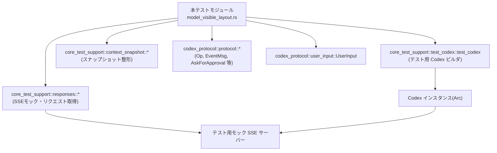
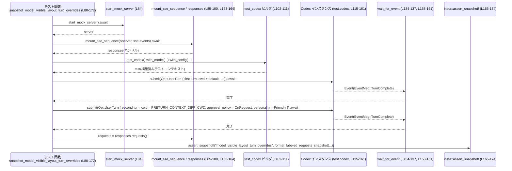
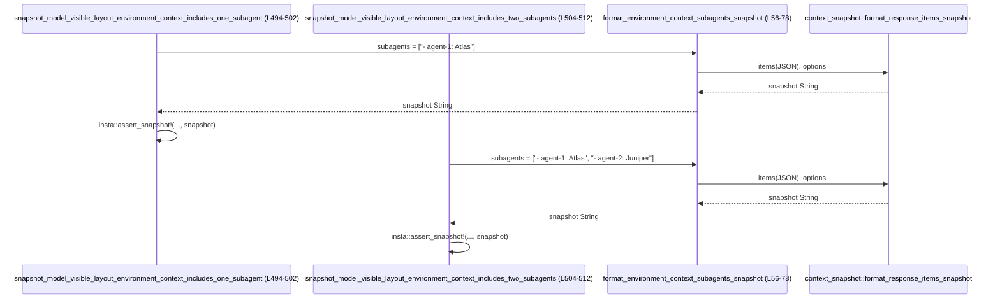

# core/tests/suite/model_visible_layout.rs コード解説

> 注: 以下の行番号は、このチャンク内の先頭行を 1 として上から順にカウントしたものです。  
> 例: `model_visible_layout.rs:L80-177` は、このファイル内のおおよその位置を示します。

---

## 0. ざっくり一言

- Codex セッションの「モデルから見えるリクエストレイアウト（model-visible layout）」が、  
  - ターンごとのコンテキストオーバーライド  
  - `cwd` 変更と `AGENTS.md`  
  - セッションの resume 時の model / personality 変更  
  - environment_context の subagents 表現  
 について期待どおりにシリアライズされているかを、スナップショットテストと SSE モックサーバーで検証するテストモジュールです。

---

## 1. このモジュールの役割

### 1.1 概要

- このモジュールは **Codex のリクエスト内容（model-visible layout）** が、セッション状態やターンごとのオーバーライドに応じて正しく構成されているかを検証するためのテスト群です。
- `core_test_support` クレートのテスト用ユーティリティ（モック SSE サーバー、コンテキストスナップショット）を利用し、  
  実際に Codex に `Op::UserTurn` / `Op::UserInput` / `Op::OverrideTurnContext` を送って生成されたリクエストをスナップショットとして保存・比較します。
- Personality 機能、`cwd` に紐づく `AGENTS.md`、resume 後の model/personality 変更、environment_context の subagents などが「モデルに見える入力」にどう反映されるか（または反映されないか）をテストします。

### 1.2 アーキテクチャ内での位置づけ

このテストファイルが関わる主要コンポーネントの関係を簡略図で示します。



- テスト関数は `test_codex()`（`core_test_support::test_codex`）を通じて Codex インスタンスを生成し、`codex.submit(Op::...)` で操作します（例: `model_visible_layout.rs:L102-132`, `L139-156`, `L353-370`）。
- モックサーバーは `start_mock_server`, `mount_sse_once`, `mount_sse_sequence` で起動し、決め打ちの SSE イベントを返します（例: `L84-100`, `L185-201`, `L309-339`, `L409-439`）。
- 実際に送られた HTTP リクエストは `ResponsesHandle::requests()` / `single_request()` 経由で取得し（例: `L163-164`, `L266-267`, `L329-330`, `L429-430`, `L377-378`, `L479-480`）、  
  `context_snapshot` のユーティリティで人間が比較しやすいテキストに整形したうえで `insta::assert_snapshot!` に渡します（例: `L165-174`, `L278-287`, `L378-387`, `L480-489`）。

### 1.3 設計上のポイント

- **責務の分割**
  - スナップショット整形ロジックはヘルパー関数に切り出し:
    - `format_labeled_requests_snapshot`（ラベル付きリクエスト群の整形, `L37-46`）
    - `format_environment_context_subagents_snapshot`（environment_context + subagents の整形, `L56-78`）
  - AGENTS 関連の検査は `user_instructions_wrapper_count` にカプセル化（`L48-54`）。
- **状態管理**
  - `test_codex()` ビルダでセッションを構築し、その `codex`（`Arc`）を通じて状態を持つ Codex に命令を送ります（`L102-112`, `L297-305`, `L397-405`）。
  - resume シナリオでは、初期セッションから `home` と `rollout_path` を取得し、別のビルダで `resume` することで状態を引き継ぎます（`L300-307`, `L349-350`, `L400-407`, `L444-446`）。
- **エラーハンドリング**
  - テスト関数はすべて `anyhow::Result<()>` を返し、`?` 演算子で I/O や Codex 操作のエラーを伝播させます（例: `L111-113`, `L218-235` など）。
  - 期待されるテスト前提が崩れた場合は `expect` で即座に panic:
    - Personality 機能有効化 (`L105-108`, `L342-347`)
    - `rollout_path` の存在 (`L303-307`, `L403-407`)
- **並行性**
  - 全テストは `#[tokio::test(flavor = "multi_thread", worker_threads = 2)]` で実行され、Tokio マルチスレッドランタイム上の async テストになっています（`L80`, `L179`, `L292`, `L392`, `L494`, `L504`）。
  - `Arc::clone` により Codex インスタンスを安全に共有しますが（`L301-302`, `L401-402`）、このファイル内では明示的な並列 submit は行っていません。
- **外部依存**
  - `core_test_support` / `codex_protocol` / `codex_features` / `codex_config` などのクレートに強く依存しつつも、テスト側はあくまで公開 API（`Op`, `UserInput`, 各種ポリシー）を呼び出すだけで内部実装には立ち入りません。

---

## 2. 主要な機能一覧

このモジュールが提供するテスト機能を箇条書きで示します。

- ターンオーバーライドの検証  
  - `snapshot_model_visible_layout_turn_overrides`  
    - 2 ターン目で `cwd` / `approval_policy` / `personality` を変更したときのリクエストレイアウトをスナップショットで確認（`L80-177`）。
- `cwd` 変更と `AGENTS.md` の関係の検証  
  - `snapshot_model_visible_layout_cwd_change_does_not_refresh_agents`  
    - 初期セッション後に `cwd` を文書付きのディレクトリへ変えても、ユーザーインストラクションラッパが再送されないことを `user_instructions_wrapper_count` で検証（`L179-290`）。
- resume + personality 変更の検証  
  - `snapshot_model_visible_layout_resume_with_personality_change`  
    - rollout 時の model と異なる model + Personality 機能有効化で resume した後、最初のターンで personality を変更したときのレイアウトをスナップショットで比較（`L292-390`）。
- resume + pre-turn model override の検証  
  - `snapshot_model_visible_layout_resume_override_matches_rollout_model`  
    - resume 後に `Op::OverrideTurnContext` で model を rollout model に合わせた場合、モデル変更のアップデートが model-visible layout に現れないことをスナップショットで確認（`L392-492`）。
- environment_context の subagents 表示の検証  
  - `snapshot_model_visible_layout_environment_context_includes_one_subagent` / `...two_subagents`  
    - `format_environment_context_subagents_snapshot` に 1 件 / 2 件の subagent を渡したとき、整形されたスナップショット文字列が期待どおりかを検証（`L494-512`）。
- 共通スナップショット整形ヘルパー
  - `format_labeled_requests_snapshot`  
    - リクエスト配列 + ラベルの組を context snapshot フォーマットに整形（`L37-46`）。
  - `format_environment_context_subagents_snapshot`  
    - environment_context + subagents の JSON から snapshot テキストを生成（`L56-78`）。
  - `user_instructions_wrapper_count`  
    - `ResponsesRequest` から、AGENTS.md 由来と思われる user instructions ラッパの出現数をカウント（`L48-54`）。

---

## 3. 公開 API と詳細解説

### 3.1 型・定数一覧

このファイルで定義されている新規の型はありません。定数と関数のみです。

#### 定数

| 名前 | 種別 | 役割 / 用途 | 定義位置 |
|------|------|-------------|----------|
| `PRETURN_CONTEXT_DIFF_CWD` | `&'static str` 定数 | テスト内で「ターン前コンテキスト差分用の cwd」ディレクトリ名として使用。`cwd` の変更によるコンテキスト差分を分かりやすくするためのタグ的なディレクトリ名です。 | `model_visible_layout.rs:L30` |

#### 関数・テスト関数インベントリー

| 名前 | 種別 | 役割 / 用途 | 定義位置 |
|------|------|-------------|----------|
| `context_snapshot_options()` | ヘルパー関数 | context snapshot 系ユーティリティへの共通オプション（レンダリングモード）を生成。 | `L32-35` |
| `format_labeled_requests_snapshot(...)` | ヘルパー関数 | 複数リクエストをラベル付きでスナップショット文字列に整形。 | `L37-46` |
| `user_instructions_wrapper_count(...)` | ヘルパー関数 | `ResponsesRequest` 内の user メッセージから、AGENTS ラッパとみなせるテキスト数を集計。 | `L48-54` |
| `format_environment_context_subagents_snapshot(...)` | ヘルパー関数 | environment_context メッセージ + subagents 情報を JSON 経由で snapshot に整形。 | `L56-78` |
| `snapshot_model_visible_layout_turn_overrides()` | async テスト | 2 ターン目で `cwd` / `approval_policy` / `personality` をオーバーライドしたときのリクエストレイアウトの差分をスナップショットで確認。 | `L80-177` |
| `snapshot_model_visible_layout_cwd_change_does_not_refresh_agents()` | async テスト | `cwd` を変えても AGENTS.md 由来の user instructions ラッパが再送されないことを検証。 | `L179-290` |
| `snapshot_model_visible_layout_resume_with_personality_change()` | async テスト | resume 後に model・Personality 設定を変えた場合の最初のターンのレイアウトを検証。 | `L292-390` |
| `snapshot_model_visible_layout_resume_override_matches_rollout_model()` | async テスト | resume 後に pre-turn override で model を rollout model に合わせた場合、モデル変更アップデートが出ないことを検証。 | `L392-492` |
| `snapshot_model_visible_layout_environment_context_includes_one_subagent()` | async テスト | subagent 1 件の environment_context スナップショット整形を検証。 | `L494-502` |
| `snapshot_model_visible_layout_environment_context_includes_two_subagents()` | async テスト | subagent 2 件の environment_context スナップショット整形を検証。 | `L504-512` |

### 3.2 関数詳細（重要な 7 件）

#### `format_labeled_requests_snapshot(scenario: &str, sections: &[(&str, &ResponsesRequest)]) -> String`

**概要**

- 複数の `ResponsesRequest` を「シナリオ説明」と「ラベル」を添えて、context snapshot 形式の文字列に変換するヘルパー関数です（`L37-46`）。
- `insta::assert_snapshot!` に渡しやすい単一の `String` を生成します。

**引数**

| 引数名 | 型 | 説明 |
|--------|----|------|
| `scenario` | `&str` | スナップショット全体に対応するシナリオ説明。テキスト中に含められます。 |
| `sections` | `&[(&str, &ResponsesRequest)]` | ラベル文字列と `ResponsesRequest` のペア配列。各リクエストにラベルを付けて整形するために使用されます。 |

**戻り値**

- `String`: `context_snapshot::format_labeled_requests_snapshot` が返すスナップショット文字列です（`L41-45`）。

**内部処理の流れ**

1. 共通オプションを取得するために `context_snapshot_options()` を呼び出します（`L44`）。
2. `context_snapshot::format_labeled_requests_snapshot(scenario, sections, &options)` をそのまま呼び出します（`L41-45`）。
3. 得られた `String` をそのまま返します。

**Examples（使用例）**

`snapshot_model_visible_layout_turn_overrides` での利用例（簡略化）:

```rust
// リクエスト配列 requests とシナリオ説明を用意した後
let snapshot = format_labeled_requests_snapshot(
    "Second turn changes cwd, approval policy, and personality while keeping model constant.", // シナリオ説明
    &[
        ("First Request (Baseline)", &requests[0]),    // 1つ目のリクエストにラベル付け
        ("Second Request (Turn Overrides)", &requests[1]), // 2つ目にラベル付け
    ],
);
// 生成した文字列を insta スナップショットと比較
insta::assert_snapshot!("model_visible_layout_turn_overrides", snapshot);
```

（根拠: `model_visible_layout.rs:L163-174`）

**Errors / Panics**

- この関数自体は `Result` を返さないため、直接的なエラーは表現しません。
- 内部で呼ぶ `context_snapshot::format_labeled_requests_snapshot` が panic するかどうかは、このファイルからは分かりません（実装がこのチャンクに現れないため）。

**Edge cases（エッジケース）**

- `sections` が空の場合の挙動は、このファイルでは使用されていないため不明です。  
  このモジュール内では常に 2 要素を渡しています（`L169-172`, `L283-285`, `L383-385`, `L485-487`）。

**使用上の注意点**

- スナップショットの人間可読性のために、`scenario` と `sections` のラベルには簡潔だが十分説明的な文字列を使う必要があります（テストコードからの示唆）。
- `ResponsesRequest` のライフタイムに依存するので、呼び出し元で `requests` ベクタのスコープが有効な間にのみ使用します。

---

#### `user_instructions_wrapper_count(request: &ResponsesRequest) -> usize`

**概要**

- `ResponsesRequest` に含まれる user メッセージのテキストのうち、  
  `"# AGENTS.md instructions for "` で始まるものの数を数える関数です（`L48-54`）。
- 現状の Codex 実装において、「AGENTS.md からシリアライズされた user instructions ラッパ」が存在するかどうかを検査する用途で使われています（`L268-277`）。

**引数**

| 引数名 | 型 | 説明 |
|--------|----|------|
| `request` | `&ResponsesRequest` | SSE モックから取得した単一リクエスト。`message_input_texts("user")` により user メッセージ群を取得します。 |

**戻り値**

- `usize`: プレフィックス `"# AGENTS.md instructions for "` で始まる user メッセージテキストの数。

**内部処理の流れ**

1. `request.message_input_texts("user")` を呼び出し、ユーザーロールのテキスト配列を取得します（`L49-50`）。
2. イテレータに対して `.iter()` を呼び出します（`L51`）。
3. `.filter(|text| text.starts_with("# AGENTS.md instructions for "))` で、対象のプレフィックスで始まるものに絞り込みます（`L52`）。
4. `.count()` で要素数を数え、その値を返します（`L53`）。

**Examples（使用例）**

`snapshot_model_visible_layout_cwd_change_does_not_refresh_agents` でのアサーション:

```rust
let requests = responses.requests(); // 2件のリクエストを取得

assert_eq!(
    user_instructions_wrapper_count(&requests[0]), // 1ターン目
    0,
    "expected first request to omit the serialized user-instructions wrapper ..."
);

assert_eq!(
    user_instructions_wrapper_count(&requests[1]), // 2ターン目 (cwd変更後)
    0,
    "expected second request to keep omitting the serialized user-instructions wrapper ..."
);
```

（根拠: `model_visible_layout.rs:L266-277`）

**Errors / Panics**

- この関数の中で panic を起こすような処理は見当たりません。  
  `message_input_texts("user")` が panic するかどうかは、このファイルからは分かりません。

**Edge cases（エッジケース）**

- user メッセージが 1 件もない場合:
  - `message_input_texts("user")` が空スライスを返す前提なら、`count()` は 0 になり、そのまま 0 が返ります。
- プレフィックスに完全一致しない場合（大文字小文字違い、余分な空白などを含む場合）:
  - `starts_with` は前方一致なので、条件を満たさなければカウントされません。
- プレフィックスを複数回含む長いメッセージ:
  - メッセージ単位で 1 カウントのため、1 行にプレフィックスが複数回出現しても 1 として扱われます。

**使用上の注意点**

- AGENTS ラッパの検知を文字列プレフィックスで行っているため、  
  AGENTS シリアライズ形式が変化するとこの判定ロジックも更新が必要になります（テストの脆弱性ポイント）。
- `message_input_texts("user")` は `"user"` というロール名を前提にしており、ロール名変更にも追従する必要があります。

---

#### `format_environment_context_subagents_snapshot(subagents: &[&str]) -> String`

**概要**

- environment_context 形式のユーザーメッセージ（`<environment_context>...</environment_context>`）に、  
  `<subagents>` ブロックを適宜追加し、それを JSON としてラップしたうえで context snapshot テキストに変換するヘルパーです（`L56-78`）。
- subagent の数が 0 / 1 / 2 のケースをスナップショットテストで検証する際に使われています（`L494-512`）。

**引数**

| 引数名 | 型 | 説明 |
|--------|----|------|
| `subagents` | `&[&str]` | それぞれが subagent 情報の 1 行を表す文字列（例: `"- agent-1: Atlas"`）。 |

**戻り値**

- `String`: `context_snapshot::format_response_items_snapshot` により生成されたスナップショット文字列。

**内部処理の流れ**

1. `subagents.is_empty()` で分岐（`L57-58`）。
   - 空であれば `subagents_block` を空文字列とする（`L57-58`）。
   - 空でない場合:
     1. `subagents.iter()` でイテレートし、各行に `"    "`（4スペース）のインデントを付与した文字列へフォーマットします（`L60-63`）。
     2. それらを `\n` 区切りで連結し、`lines` とします（`L63-64`）。
     3. `lines` を `<subagents>` タグで囲んで `subagents_block` を構成します（`L65`）。
2. `serde_json::json!` で JSON オブジェクト `items` を生成（`L67-76`）:
   - 配列要素は 1 つで `{"type": "message", "role": "user", "content": [ ... ]}`。
   - `content` 内には `{"type": "input_text", "text": "<environment_context> ... </environment_context>"}` が入る。
   - `text` の中で `<cwd>/tmp/example</cwd>` と `<shell>bash</shell>` に続けて、必要に応じて `subagents_block` を挿入（`L71-74`）。
3. `context_snapshot::format_response_items_snapshot(items.as_slice(), &context_snapshot_options())` を呼び出し（`L77`）、その結果を返却。

**Examples（使用例）**

1 件の subagent を含むケース（`snapshot_model_visible_layout_environment_context_includes_one_subagent`）:

```rust
let snapshot = format_environment_context_subagents_snapshot(&["- agent-1: Atlas"]);

insta::assert_snapshot!(
    "model_visible_layout_environment_context_includes_one_subagent",
    snapshot
);
```

（根拠: `model_visible_layout.rs:L494-501`）

**Errors / Panics**

- この関数自体は `Result` ではなく、panic を起こしうるのは主に外部呼び出し:
  - `json!` マクロは通常の使用では panic しません。
  - `context_snapshot::format_response_items_snapshot` が panic し得るかは、このチャンクからは不明です。
- `subagents` の内容によるパースエラーなどは発生しません（プレーン文字列として埋め込むだけです）。

**Edge cases（エッジケース）**

- `subagents` が空:
  - `<subagents>` ブロックは挿入されず、`<cwd>` と `<shell>` のみを含む environment_context になります（`L57-58`, `L65`）。
- `subagents` に改行を含む文字列:
  - そのようなデータはこのファイルには登場せず、扱いは不明です。  
    `format!("    {line}")` により、そのまま文字列として埋め込まれるだけです。
- `subagents` の要素が多数（10 件以上など）:
  - ロジック上は問題ありませんが、このファイルでは 2 件までしか使用例がありません（`L504-511`）。

**使用上の注意点**

- `<cwd>` と `<shell>` は文字列リテラルで固定されているため、実際のランタイム値ではありません。  
  実運用の environment_context 仕様とは異なる場合があります。
- subagent 行は呼び出し側で `"- agent-x: Name"` のようなフォーマットに揃える必要があります。  
  本関数はインデントとラッピングだけを担当し、フォーマットの妥当性はチェックしません。

---

#### `snapshot_model_visible_layout_turn_overrides() -> Result<()>`

**概要**

- 2 ターンの `Op::UserTurn` を送信し、2 ターン目で
  - `cwd` を `PRETURN_CONTEXT_DIFF_CWD` 下に変更し（`L112-113`, `L146`）  
  - `approval_policy` を `Never` → `OnRequest` に変更し（`L123`, `L147`）  
  - `personality` を `None` → `Some(Personality::Friendly)` に変更
- という条件で送ったときの 2 つのリクエストの「モデルから見えるレイアウト」の違いを、スナップショットで確認するテストです（`L80-177`）。

**引数**

- なし（Tokio テスト関数）。

**戻り値**

- `Result<()>` (`anyhow::Result<()>`): エラーがあればテスト失敗として返します。

**内部処理の流れ**

1. ネットワーク環境がなければテストをスキップするため `skip_if_no_network!(Ok(()))` を実行（`L82`）。
2. モック SSE サーバーを起動し（`start_mock_server().await`, `L84`）、  
   2 ターン分の SSE イベントシーケンスを登録（`mount_sse_sequence`, `L85-100`）。
3. Codex テストビルダを `test_codex()` から生成し、
   - model を `"gpt-5.2-codex"` に設定（`L102-103`）
   - Personality 機能を有効化し、`Personality::Pragmatic` を設定（`L104-110`）
   して `build`、`test` インスタンスを得る（`L111`）。
4. `PRETURN_CONTEXT_DIFF_CWD` 下のディレクトリを作成（`L112-113`）。
5. 1 ターン目の `Op::UserTurn` を送信（`L115-132`）:
   - `text: "first turn"`（`L118`）
   - `cwd: test.cwd_path()`（`L122`）
   - `approval_policy: Never`（`L123`）
   - `personality: None`（`L131`）
   - その他はセッション設定から転用。
   - `wait_for_event` で `EventMsg::TurnComplete` が来るまで待機（`L134-137`）。
6. 2 ターン目の `Op::UserTurn` を送信（`L139-156`）:
   - `text: "second turn with context updates"`（`L142`）
   - `cwd: preturn_context_diff_cwd`（`L146`）
   - `approval_policy: OnRequest`（`L147`）
   - `personality: Some(Personality::Friendly)`（`L155`）
   - その他は 1 ターン目と同じ。
   - 同様に `TurnComplete` まで待機（`L158-161`）。
7. モック SSE から送信されたリクエスト配列を取得し（`responses.requests()`, `L163`）、  
   - `requests.len() == 2` を確認（`L164`）。
8. 2 つのリクエストを `format_labeled_requests_snapshot` で整形し、  
   `insta::assert_snapshot!` でスナップショット比較（`L165-174`）。
9. `Ok(())` を返して終了（`L176`）。

**Examples（使用例）**

この関数自体が使用例なので、簡略版フロー:

```rust
#[tokio::test(flavor = "multi_thread", worker_threads = 2)]
async fn snapshot_model_visible_layout_turn_overrides() -> Result<()> {
    let server = start_mock_server().await;
    let responses = mount_sse_sequence(&server, /* 2ターン分の SSE */).await;

    // Pragmatic personality のセッションを構成
    let mut builder = test_codex()
        .with_model("gpt-5.2-codex")
        .with_config(|config| {
            config.features.enable(Feature::Personality).expect("...");
            config.personality = Some(Personality::Pragmatic);
        });
    let test = builder.build(&server).await?;

    // 1ターン目: デフォルト cwd / approval / personality
    test.codex.submit(Op::UserTurn { /* ... */ }).await?;
    wait_for_event(&test.codex, |e| matches!(e, EventMsg::TurnComplete(_))).await;

    // 2ターン目: cwd / approval_policy / personality を変更
    test.codex.submit(Op::UserTurn { /* ... */ }).await?;
    wait_for_event(&test.codex, |e| matches!(e, EventMsg::TurnComplete(_))).await;

    let requests = responses.requests();
    insta::assert_snapshot!(
        "model_visible_layout_turn_overrides",
        format_labeled_requests_snapshot(
            "Second turn changes ...",
            &[("First Request (Baseline)", &requests[0]),
              ("Second Request (Turn Overrides)", &requests[1])]
        )
    );
    Ok(())
}
```

**Errors / Panics**

- `build`・`submit`・`wait_for_event`・`fs::create_dir_all` などがエラーを返した場合、`?` によりテストが失敗します（`L111-113`, `L115-133`, `L139-157` など）。
- Personality 機能の有効化失敗時には `.expect("test config should allow feature update")` が panic します（`L105-108`）。
- モック SSE 側の設定が誤っていて 2 リクエスト以外が送られた場合、`assert_eq!(requests.len(), 2, ...)` が失敗します（`L164`）。

**Edge cases（エッジケース）**

- ネットワークが利用できない環境:
  - `skip_if_no_network!(Ok(()))` により、テスト自体がスキップされる挙動が想定されます（具体的なスキップ方法はマクロ実装側に依存）。
- Codex が `TurnComplete` を発行しない場合:
  - `wait_for_event` の挙動はここから分かりませんが、テストがタイムアウトするかハングする可能性があります。
- 2 ターン目で model も変更したいようなケース:
  - このテストでは model を変更していない（`model: test.session_configured.model.clone()`, `L126`, `L150`）。

**使用上の注意点**

- マルチスレッドの Tokio ランタイム（`worker_threads = 2`）で動作するため、  
  Codex 実装側がスレッドセーフであることが前提です（このファイルでは `Arc` でラップされていることのみ確認できます, `L301-302`, `L401-402`）。
- モック SSE で用意したイベントシーケンスと、Codex 側のリクエスト数・タイミングが一致している必要があります。

---

#### `snapshot_model_visible_layout_cwd_change_does_not_refresh_agents() -> Result<()>`

**概要**

- 初期セッションで AGENTS.md を含まない `cwd` を使い、その後 `cwd` を AGENTS.md を含む別ディレクトリに変更しても、  
  「serialized user-instructions wrapper」が送られない（`user_instructions_wrapper_count == 0` のまま）ことを確認するテストです（`L179-290`）。
- TODO コメントから、将来的には AGENTS 更新の diff を送る設計に変える予定があることが示唆されています（`L179-181`）。

**内部処理の流れ（要約）**

1. ネットワークチェック（`skip_if_no_network!`、`L183`）。
2. モックサーバーと 2 ターン分の SSE シーケンスを構成（`L185-201`）。
3. `test_codex().with_model("gpt-5.2-codex")` でセッションを構築（`L203-205`）。
4. `cwd_one` と `cwd_two` ディレクトリを作成し、それぞれに異なる `AGENTS.md` を書き込む（`L205-216`）。
5. 1 ターン目: `cwd_one` を `cwd` として `Op::UserTurn` を送信（`L218-235`）。
6. 2 ターン目: `cwd_two` を `cwd` として `Op::UserTurn` を送信（`L242-259`）。
7. それぞれ `TurnComplete` を待機（`L237-240`, `L261-264`）。
8. `responses.requests()` で 2 リクエストを取得し（`L266-267`）、両方について
   - `user_instructions_wrapper_count(...) == 0` を確認（`L268-277`）。
9. 2 リクエストのスナップショットを取得・比較（`L278-287`）。

**Contracts に相当する前提**

- 「セッション初期化後に導入された cwd-only のプロジェクト文書は user instructions wrapper には反映されない」という現在の仕様を前提としています（アサーションメッセージ, `L269-276`）。
- TODO コメント（`L179-181`）から、この仕様は将来変更される可能性があると明示されています。

**Edge cases / 使用上の注意点**

- `cwd_one` / `cwd_two` 共に `AGENTS.md` を持つ構成ですが、セッション初期化時点ではプロジェクトドキュメントが考慮されていない前提です。
- `user_instructions_wrapper_count` はプレフィックスベースの検査なので、AGENTS のシリアライズ形式が変わるとテストも調整が必要です。

---

#### `snapshot_model_visible_layout_resume_with_personality_change() -> Result<()>`

**概要**

- 初回セッションで `"gpt-5.2"` モデルを使って履歴を作り、その後:
  1. 別のモデル `"gpt-5.2-codex"` を使うように設定したコンフィグで `resume` し（`L341-343`, `L349`）
  2. Personality 機能を有効化したうえで（`L342-347`）
  3. 最初の `UserTurn` で `Personality::Friendly` を指定する（`L353-370`）
- という条件で、「resume 前最後のリクエスト」と「resume 後最初のリクエスト」のレイアウト差分をスナップショットで確認するテストです（`L292-390`）。

**内部処理の流れ（要点）**

1. 初期セッション:
   - model: `"gpt-5.2"`（`L297-299`）
   - モック SSE で 1 リクエスト分のシーケンスを設定（`L309-317`）。
   - `Op::UserInput` で `"seed resume history"` を送信（`L319-327`）。
   - `TurnComplete` を待機（`L328`）。
   - `initial_mock.single_request()` で初回リクエストを取得（`L329`）。
2. resume 用情報の取得:
   - `Arc::clone(&initial.codex)` で Codex を参照（`L301-302`）。
   - `initial.home` / `initial.session_configured.rollout_path` を保存（`L302-307`）。
3. resume セッション:
   - `test_codex().with_config(|config| { ... })` で新ビルダを作成（`L341-348`）。
   - model は `"gpt-5.2-codex"`、Personality 機能有効 + Pragmatic personality を設定。
   - `.resume(&server, home, rollout_path)` で resume（`L349`）。
4. resume 後最初の `UserTurn`:
   - 別ディレクトリ `resume_override_cwd` を作成（`L350-351`）。
   - `Op::UserTurn` に personality と cwd を指定して送信（`L353-370`）。
   - `TurnComplete` を待機（`L372-375`）。
5. `resumed_mock.single_request()` で resume 後の最初のリクエストを取得（`L377`）。
6. 2 つのリクエストをラベル付きでスナップショット比較（`L378-387`）。

**安全性・並行性の観点**

- resume 前後で `Arc` を使用していても、  
  実際の `codex.submit` は `initial` と `resumed` のそれぞれのインスタンスに対して順次行われており、並列実行は行っていません（`L319-327`, `L353-370`）。

---

#### `snapshot_model_visible_layout_resume_override_matches_rollout_model() -> Result<()>`

**概要**

- resume 後に `Op::OverrideTurnContext` を使って model を rollout model（`"gpt-5.2"`）に戻したうえで、  
  その後の `UserInput` が model-switch アップデートを伴わないことをスナップショットで確認するテストです（`L392-492`）。

**内部処理の流れ（要点）**

- 初期セッション部分は前述の `snapshot_model_visible_layout_resume_with_personality_change` とほぼ同じ（model は `"gpt-5.2"`、`seed resume history` を送信, `L397-427`）。
- resume セッションでは model を `"gpt-5.2-codex"` に設定して `resume`（`L441-445`）。
- `Op::OverrideTurnContext` を `resumed.codex.submit` で送信し（`L447-461`）:
  - `cwd` を `resume_override_cwd` に変更（`L450-446`）
  - `model: Some("gpt-5.2".to_string())`（`L455`）で rollout model に合わせる。
- その後 `Op::UserInput` を送信（`L463-472`）し、`TurnComplete` まで待機（`L474-477`）。
- `initial_request` / `resumed_request` をスナップショット比較（`L479-488`）。

**設計上の契約的な意味**

- 「resume 後の pre-turn override で model を rollout model に一致させた場合、model-switch のアップデートは model-visible layout として別途送る必要がない」という挙動を保証するテストです（スナップショット名・説明より, `L481-487`）。

---

### 3.3 その他の関数

| 関数名 | 役割（1 行） | 定義位置 |
|--------|--------------|----------|
| `context_snapshot_options()` | context snapshot 系の共通オプション（レンダーモード: `KindWithTextPrefix { max_chars: 96 }`）を返すだけのヘルパーです。 | `L32-35` |
| `snapshot_model_visible_layout_environment_context_includes_one_subagent()` | `format_environment_context_subagents_snapshot` に 1 subagent を渡した結果をスナップショット検証します。 | `L494-502` |
| `snapshot_model_visible_layout_environment_context_includes_two_subagents()` | 同様に 2 subagents のケースを検証します。 | `L504-512` |

---

## 4. データフロー

### 4.1 代表的シナリオ: ターンオーバーライドテスト

`snapshot_model_visible_layout_turn_overrides (L80-177)` における主要なデータフローをシーケンス図で示します。



**要点**

- Codex への入力 (`Op::UserTurn`) は、モック SSE サーバーと紐づいた HTTP クライアントを通して送信され、その結果としてモックサーバーに事前定義された SSE イベント列が返されます（`L84-100`）。
- テストは SSE ストリームの内容そのものではなく、「Codex が外部モデルに送ったリクエスト内容（ResponsesRequest）」を `responses.requests()` から取得し、  
  それらを context snapshot フォーマットに整形して比較します（`L163-174`）。
- 非同期処理の完了は `wait_for_event` で `EventMsg::TurnComplete` を受け取ることにより同期されています（`L134-137`, `L158-161`）。

### 4.2 environment_context + subagents スナップショット

Environment context を検証するテストの流れです。



**要点**

- これらのテストは Codex や SSE を利用せず、純粋に文字列生成ロジックの単体テストとして動作しています（`L494-512`）。
- サブエージェント情報の見せ方（インデント・タグ構造）が期待どおりであることをスナップショットで固定します。

---

## 5. 使い方（How to Use）

このファイル自体はテストモジュールですが、同様のパターンで **新しい model-visible layout テスト** を追加する場合に役立つ使い方を整理します。

### 5.1 基本的な使用方法（新しいテストを追加する流れ）

1. **テスト用 Codex セッションの構築**
2. **SSE モックサーバーの起動とイベントシーケンスの登録**
3. **Codex への `Op::...` 送信**
4. **`responses.requests()` からリクエストを取得**
5. **スナップショット化して `insta::assert_snapshot!`**

の流れになります。簡略した例:

```rust
#[tokio::test(flavor = "multi_thread", worker_threads = 2)]
async fn snapshot_my_new_model_visible_layout_case() -> anyhow::Result<()> {
    // 1. ネットワークが使えない環境ではスキップ
    skip_if_no_network!(Ok(()));

    // 2. モック SSE サーバーと期待レスポンスを設定
    let server = start_mock_server().await;
    let responses = mount_sse_sequence(
        &server,
        vec![ /* sse(vec![ev_response_created(...), ...]) など */ ],
    ).await;

    // 3. Codex セッションを構築
    let builder = test_codex().with_model("gpt-5.2-codex");
    let test = builder.build(&server).await?;

    // 4. Codex に対して Op を送る
    test.codex.submit(Op::UserTurn {
        items: vec![UserInput::Text {
            text: "my scenario".into(),
            text_elements: Vec::new(),
        }],
        // cwd や approval_policy などを必要に応じて指定
        final_output_json_schema: None,
        cwd: test.cwd_path().to_path_buf(),
        approval_policy: AskForApproval::Never,
        approvals_reviewer: None,
        sandbox_policy: SandboxPolicy::new_read_only_policy(),
        model: test.session_configured.model.clone(),
        effort: test.config.model_reasoning_effort,
        summary: None,
        service_tier: None,
        collaboration_mode: None,
        personality: None,
    }).await?;

    // 5. 完了イベントを待つ
    wait_for_event(&test.codex, |event| matches!(event, EventMsg::TurnComplete(_))).await;

    // 6. モデルに送られたリクエストを取得し、スナップショット比較
    let requests = responses.requests();
    insta::assert_snapshot!(
        "my_new_model_visible_layout_case",
        format_labeled_requests_snapshot(
            "説明文",
            &[("First Request", &requests[0])]
        )
    );

    Ok(())
}
```

### 5.2 よくある使用パターン

- **ターン間比較**
  - このファイルでは、2 回以上のリクエストを送ってモデルの入力差を比較するパターンが主です（`L163-174`, `L266-287`）。
  - `format_labeled_requests_snapshot` を使うことで、「Before / After」形式の比較がしやすくなっています。
- **resume 前後の比較**
  - 初回セッションと resume 後セッションを対比させるパターン（`L292-390`, `L392-492`）。
  - resume に必要な `home` / `rollout_path` は最初の `build` の戻り値から取得しています（`L302-307`, `L402-407`）。

### 5.3 よくある間違い

```rust
// 間違い例: SSE モックのシーケンスとリクエスト数が合っていない
let responses = mount_sse_sequence(&server, vec![
    // 1ターン分の SSE しか用意していない
    sse(vec![
        ev_response_created("resp-1"),
        ev_assistant_message("msg-1", "done"),
        ev_completed("resp-1"),
    ]),
]).await;

// しかし2回 UserTurn を送る
test.codex.submit(Op::UserTurn { /* ... */ }).await?;
test.codex.submit(Op::UserTurn { /* ... */ }).await?;

// → responses.requests() の挙動やテストの期待がずれる可能性
```

```rust
// 正しい例: ターン数分の SSE シーケンスを用意する
let responses = mount_sse_sequence(&server, vec![
    sse(vec![/* 1ターン目用 SSE */]),
    sse(vec![/* 2ターン目用 SSE */]),
]).await;
```

（根拠: このファイルでは 2 ターンのテストで常に 2 シーケンスを用意, `L85-99`, `L186-200`）

### 5.4 使用上の注意点（まとめ）

- **非同期・並行性**
  - すべてのテストは Tokio のマルチスレッドランタイム上で実行されます（`L80`, `L179`, `L292`, `L392`, `L494`, `L504`）。
  - テスト内では Codex への操作は逐次的に行われているため、明示的な並列処理はありませんが、  
    Codex 実装側は並列実行される可能性のあるタスクとして設計されていることが想定されます。
- **I/O とエラーハンドリング**
  - ファイル操作 (`fs::create_dir_all`, `fs::write`) と Codex への RPC はすべて `?` によりテスト失敗として扱われます（例: `L112-113`, `L207-216`, `L350-351`, `L445-446`）。
  - 前提条件違反については `expect` による panic で検出されます（Personality 機能や rollout_path の存在, `L105-108`, `L342-347`, `L303-307`, `L403-407`）。
- **スナップショット依存**
  - `insta::assert_snapshot!` を用いているため、model-visible layout のフォーマット変更があればスナップショットの更新が必要になります。
  - TODO コメントにもあるように、仕様変更予定がある箇所（AGENTS diff など, `L179-181`）では、テストも同時に更新が必要です。

---

## 6. 変更の仕方（How to Modify）

### 6.1 新しい機能（テストケース）を追加する場合

1. **どの挙動を検証したいかを明確にする**
   - 例: 「特定の Feature フラグを有効にしたとき、model-visible layout にどのようなメタデータが追加されるか」など。
2. **既存テストから近いものを選び、パターンを踏襲する**
   - ターンオーバーライドであれば `snapshot_model_visible_layout_turn_overrides`（`L80-177`）。
   - resume シナリオであれば `snapshot_model_visible_layout_resume_with_personality_change`（`L292-390`）。
3. **必要な前処理を追加**
   - `fs::create_dir_all` でテスト用ディレクトリを作る。
   - `fs::write` で AGENTS.md やその他のプロジェクトドキュメントを配置する（`L209-216`）。
   - Config の Feature フラグや Personality を設定（`L104-110`, `L341-347`）。
4. **Codex への `Op` を組み立てて送信**
   - `Op::UserTurn` / `Op::UserInput` / `Op::OverrideTurnContext` のいずれを使うかは仕様に応じて選びます（`L115-132`, `L319-327`, `L449-461`）。
5. **`responses.requests()` → `format_labeled_requests_snapshot` → `insta::assert_snapshot!` の組み合わせでスナップショット化**
   - スナップショット名と scenario テキストを説明的なものにします（`L165-174`, `L278-287`）。

### 6.2 既存の機能（テスト）を変更する場合

- **影響範囲の確認**
  - スナップショット名は固定文字列で他ファイルからも参照されている可能性があるため、変更時は検索が必要です（例: `"model_visible_layout_turn_overrides"`, `L165`）。
  - AGENTS 関連の仕様を変える場合、`user_instructions_wrapper_count` を使うテスト（`L268-277`）だけでなく、  
    他のテストモジュールでも同様のプレフィックス検査を行っていないか確認が必要です。
- **契約・前提条件の維持**
  - Personality や model の有効化処理は `.expect` で guard されているため、  
    Feature 名や config の構造を変えるとここで panic する可能性があります（`L105-108`, `L342-347`）。
  - resume 関連では `rollout_path` が `Some` であることを前提としています（`L303-307`, `L403-407`）。
- **スナップショット更新**
  - model-visible layout の仕様変更に伴いスナップショットが変わる場合、  
    `insta` のワークフロー（例: `cargo insta test`, `cargo insta accept`）に沿って新しいスナップショットを承認する必要があります。

---

## 7. 関連ファイル

このモジュールと密接に関係するコンポーネント（モジュールパスベース）を一覧にします。  
正確なファイルパスはこのチャンクには現れないため、「不明」としています。

| パス / モジュール | 役割 / 関係 |
|-------------------|------------|
| `core_test_support::test_codex` | `test_codex()` を提供し、テスト用 Codex セッションの構築・resume を行います（`L102-112`, `L297-300`, `L341-349`, `L397-400`, `L441-445`）。実装ファイルのパスはこのチャンクには現れません。 |
| `core_test_support::responses` | `start_mock_server`, `mount_sse_once`, `mount_sse_sequence`, `sse`, `ResponsesRequest` など、SSE モックサーバーとリクエスト収集のユーティリティを提供します（`L17-24`, `L84-100`, `L185-201`, `L309-339`, `L409-439`）。 |
| `core_test_support::context_snapshot` | リクエストや environment_context を人間可読なスナップショット文字列へ変換するユーティリティです（`L14-16`, `L41-45`, `L77`）。 |
| `core_test_support::wait_for_event` | Codex からの `EventMsg` ストリームを監視し、条件を満たすまで待機する関数です（`L134-137`, `L158-161`, `L237-240`, `L261-264`, `L328`, `L372-375`, `L474-477`）。 |
| `codex_protocol::protocol` | `Op`, `EventMsg`, `AskForApproval`, `SandboxPolicy` など、Codex のプロトコルレベルの型を提供します（`L9-12`, `L115-132`, `L139-156`, `L218-235`, `L243-259`, `L319-327`, `L353-370`, `L449-461`, `L465-472`）。 |
| `codex_protocol::user_input::UserInput` | ユーザー入力（テキスト）の表現型。`Op::UserTurn` / `Op::UserInput` の `items` に使用されています（`L13`, `L117-120`, `L221-223`, `L245-247`, `L320-323`, `L355-358`, `L421-423`, `L467-469`）。 |
| `codex_config::types::Personality` / `codex_features::Feature` | Personality 機能とその設定値を表す型。Personality 機能の有効化と personality の指定に使われています（`L7-8`, `L105-110`, `L342-347`, `L369`, `L155`）。 |

---

以上が `core/tests/suite/model_visible_layout.rs` の構造・処理内容・テストとしての使い方の整理です。  
このファイルから読み取れない内部実装（Codex 本体や context_snapshot の詳細）は、「不明」として扱いました。
