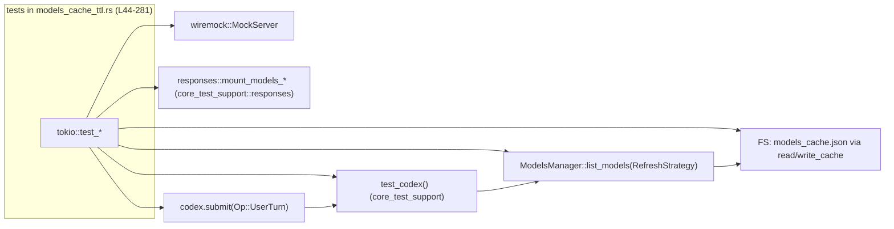
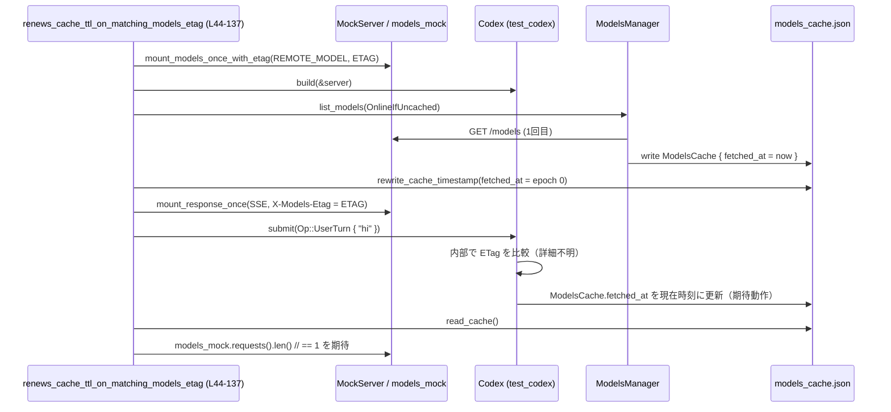

# core/tests/suite/models_cache_ttl.rs コード解説

## 0. ざっくり一言

`core/tests/suite/models_cache_ttl.rs` は、**モデル一覧キャッシュの TTL とクライアントバージョンの扱い**を検証する統合テスト群です。  
HTTP モックサーバとローカル JSON キャッシュファイルを使い、`ModelsManager` のリフレッシュ戦略が期待通り動くことを確認します（`models_cache_ttl.rs:L37-42`,`L44-281`）。

---

## 1. このモジュールの役割

### 1.1 概要

このテストモジュールは、次の問題を検証します。

- **ETag と TTL の関係**  
  レスポンスに含まれる `X-Models-Etag` がキャッシュと一致する場合に、**/models API を再度叩かず TTL のみ更新されるか**（`models_cache_ttl.rs:L44-137`）。
- **クライアントバージョンとキャッシュ整合性**  
  キャッシュに保存された `client_version` が現在のクライアントと一致・不一致・欠損のときに、**/models を呼ぶか／キャッシュをそのまま使うか**（`models_cache_ttl.rs:L139-281`）。

これらを通じて、オフライン時でも安全にモデル一覧を利用できるよう、キャッシュの振る舞いを保証します。

### 1.2 アーキテクチャ内での位置づけ

このファイルは **テストコード**であり、本番ロジック（Codex 本体や ModelsManager）を黒箱として呼び出します。主な依存関係は以下です。

- `core_test_support::test_codex::test_codex` による Codex テストインスタンスの構築（`models_cache_ttl.rs:L58-67`,`L151-168`,`L198-215`,`L245-262`）
- `codex_models_manager::manager::RefreshStrategy` を用いたモデル一覧取得（`models_cache_ttl.rs:L70-73`,`L169-171`,`L216-218`,`L263-266`）
- `wiremock::MockServer` + `core_test_support::responses::*` による /models と /responses の HTTP モック（`models_cache_ttl.rs:L46-56`,`L80-89`,`L141-149`,`L190-196`,`L237-243`）
- ローカル JSON キャッシュ `models_cache.json` を読み書きするヘルパ（`ModelsCache` と `read_cache` / `write_cache` 群, `models_cache_ttl.rs:L283-306`,`L308-316`）

依存関係を簡略化した図は以下の通りです。



### 1.3 設計上のポイント（テスト観点）

コードから読み取れる設計上の特徴は次の通りです。

- **状態を持つのは外部コンポーネントのみ**  
  テスト自体は状態を持たず、`MockServer`・キャッシュファイル・Codex/ModelsManager などの外部オブジェクトの状態変化を観察します（`models_cache_ttl.rs:L46-47`,`L65-73`,`L283-287`）。
- **ETag/バージョン/TTL を独立に検証**  
  - ETag による TTL 更新テスト（`renews_cache_ttl_on_matching_models_etag`, `models_cache_ttl.rs:L44-137`）
  - バージョン一致/欠損/不一致の 3 パターンでの更新有無テスト（`models_cache_ttl.rs:L139-281`）
- **エラーハンドリング**  
  ローカル I/O と JSON パースには `anyhow::Result` を使い、`?` でエラーを伝播します（`models_cache_ttl.rs:L4`,`L283-287`,`L290-300`,`L302-306`）。
- **並行性**  
  全テストは `#[tokio::test(flavor = "multi_thread", worker_threads = 2)]` でマルチスレッドランタイム上で動きます（`models_cache_ttl.rs:L44`,`L139`,`L186`,`L233`）。共有状態（`codex`）は `Arc` 経由で使用されます（`models_cache_ttl.rs:L2`,`L66`）。

---

## 2. 主要な機能一覧

このモジュールがテストしている主な機能は次の通りです。

- **ETag 一致時の TTL 更新テスト**  
  `renews_cache_ttl_on_matching_models_etag`：レスポンスヘッダ `X-Models-Etag` がキャッシュと一致する場合に、/models を再度呼ばず `fetched_at` だけ更新する（`models_cache_ttl.rs:L44-137`）。
- **キャッシュバージョン一致時のキャッシュ利用テスト**  
  `uses_cache_when_version_matches`：キャッシュの `client_version` が `client_version_to_whole()` と一致する場合、/models を呼ばずキャッシュだけで一覧を構成する（`models_cache_ttl.rs:L139-184`）。
- **キャッシュバージョン欠損時の更新テスト**  
  `refreshes_when_cache_version_missing`：`client_version: None` のキャッシュでは /models を呼んで更新することを確認（`models_cache_ttl.rs:L186-231`）。
- **キャッシュバージョン不一致時の更新テスト**  
  `refreshes_when_cache_version_differs`：キャッシュのバージョン文字列が現在のクライアントと異なる場合、/models が少なくとも 1 回は呼ばれることを確認（`models_cache_ttl.rs:L233-281`）。
- **キャッシュファイルの読み書きヘルパ**  
  - `read_cache` / `write_cache` / `write_cache_sync` により、`ModelsCache` を JSON ファイルとして読み書きする（`models_cache_ttl.rs:L290-306`）。
  - `rewrite_cache_timestamp` で `fetched_at` を強制的に古くする（`models_cache_ttl.rs:L283-287`）。
- **テスト用モデルメタデータ生成**  
  `test_remote_model` により、`ModelInfo` のフィールドが一通り埋まったテスト用モデルを生成する（`models_cache_ttl.rs:L318-360`）。

### 2.1 コンポーネント一覧（関数・構造体・定数）

| 名称 | 種別 | 役割 / 用途 | 定義位置 |
|------|------|-------------|----------|
| `ETAG` | 定数 | テストで使用する ETag 文字列 `"\"models-etag-ttl\""` | `models_cache_ttl.rs:L37` |
| `CACHE_FILE` | 定数 | キャッシュファイル名 `"models_cache.json"` | `models_cache_ttl.rs:L38` |
| `REMOTE_MODEL` 他 3 つ | 定数 | 各テストで使うモデル slug の識別子 | `models_cache_ttl.rs:L39-42` |
| `ModelsCache` | 構造体 | キャッシュファイルの JSON 形式を表現。`fetched_at`・`etag`・`client_version`・`models` を保持 | `models_cache_ttl.rs:L308-316` |
| `renews_cache_ttl_on_matching_models_etag` | 非公開 async テスト関数 | ETag 一致時に TTL 更新のみで /models を再呼び出ししないことを検証 | `models_cache_ttl.rs:L44-137` |
| `uses_cache_when_version_matches` | 非公開 async テスト関数 | キャッシュバージョン一致時に /models を呼ばないことを検証 | `models_cache_ttl.rs:L139-184` |
| `refreshes_when_cache_version_missing` | 非公開 async テスト関数 | キャッシュバージョン欠損時に /models を呼ぶことを検証 | `models_cache_ttl.rs:L186-231` |
| `refreshes_when_cache_version_differs` | 非公開 async テスト関数 | キャッシュバージョン不一致時に /models を呼ぶことを検証 | `models_cache_ttl.rs:L233-281` |
| `rewrite_cache_timestamp` | 非公開 async 関数 | キャッシュファイルを読み込み、`fetched_at` を任意の過去時刻に書き換える | `models_cache_ttl.rs:L283-287` |
| `read_cache` | 非公開 async 関数 | `ModelsCache` を JSON ファイルから読み込む | `models_cache_ttl.rs:L290-294` |
| `write_cache` | 非公開 async 関数 | `ModelsCache` を JSON ファイルに非同期書き込みする | `models_cache_ttl.rs:L296-300` |
| `write_cache_sync` | 非公開同期関数 | `ModelsCache` を JSON ファイルに同期書き込みする（pre-build hook 用） | `models_cache_ttl.rs:L302-306` |
| `test_remote_model` | 非公開関数 | 指定 slug / priority から `ModelInfo` を組み立てるテスト用ユーティリティ | `models_cache_ttl.rs:L318-360` |

---

## 3. 公開 API と詳細解説

### 3.1 型一覧（構造体）

このファイル内で定義される主要な型は `ModelsCache` のみです。

| 名前 | 種別 | フィールド概要 | 役割 / 用途 | 定義位置 |
|------|------|----------------|-------------|----------|
| `ModelsCache` | 構造体 | `fetched_at: DateTime<Utc>` / `etag: Option<String>` / `client_version: Option<String>` / `models: Vec<ModelInfo>` | モデル一覧キャッシュファイルの JSON 形式を表現し、キャッシュ TTL・ETag・クライアントバージョン・モデル一覧を保持する | `models_cache_ttl.rs:L308-316` |

`etag` と `client_version` に `#[serde(default)]` が付いているため、古い形式の JSON から読み込む際にフィールド欠損があっても `None` として扱われます（`models_cache_ttl.rs:L311-315`）。

---

### 3.2 関数詳細（7 件）

#### `renews_cache_ttl_on_matching_models_etag() -> Result<()>`

**概要**

- ETag が一致する SSE レスポンスを受け取ったときに、**/models API を再度呼び出すことなくローカルキャッシュの `fetched_at`（TTL）だけが更新される**ことを検証する非同期テストです（`models_cache_ttl.rs:L44-137`）。

**引数**

- 引数はありません。`#[tokio::test]` によりテストランナーから直接呼ばれます（`models_cache_ttl.rs:L44-45`）。

**戻り値**

- `anyhow::Result<()>`  
  テスト内の I/O や Codex 操作で発生したエラーをラップし、失敗時はテストがエラーとして終了します（`models_cache_ttl.rs:L45`）。

**内部処理の流れ**

1. **モックサーバと /models モックの準備**  
   - `MockServer::start().await` で HTTP モックサーバを起動（`models_cache_ttl.rs:L46`）。
   - `test_remote_model(REMOTE_MODEL, 1)` でリモートモデル定義を作成（`models_cache_ttl.rs:L48`,`L318-360`）。
   - `responses::mount_models_once_with_etag` により、一度だけ有効な /models レスポンスを登録し、レスポンスに ETag を付与（`models_cache_ttl.rs:L49-56`）。

2. **Codex テストインスタンスの構築**  
   - `test_codex().with_auth(...)` でダミー認証付きビルダーを生成（`models_cache_ttl.rs:L58`）。
   - `.with_config` で使用モデルなどを設定し、リトライ回数を制御（`models_cache_ttl.rs:L59-63`）。
   - `builder.build(&server).await?` で Codex と関連コンポーネント（`thread_manager` 等）を起動（`models_cache_ttl.rs:L65-67`）。

3. **初回 /models 呼び出しでキャッシュを作成**  
   - `test.thread_manager.get_models_manager().list_models(RefreshStrategy::OnlineIfUncached).await` を呼び、必要ならオンラインで /models を取得してキャッシュを作成（`models_cache_ttl.rs:L69-73`）。

4. **キャッシュ TTL を過去に書き換える**  
   - キャッシュファイルパス `config.codex_home.join(CACHE_FILE)` を取得（`models_cache_ttl.rs:L75`）。
   - `Utc.timestamp_opt(0, 0)` で epoch 0 の時刻を生成し、`rewrite_cache_timestamp` で `fetched_at` をこの時刻に変更（`models_cache_ttl.rs:L76-77`,`L283-287`）。

5. **ETag 一致の SSE レスポンスをシミュレート**  
   - `sse([...])` でレスポンス生成イベント・アシスタントメッセージ・完了イベントからなる SSE ボディを作成（`models_cache_ttl.rs:L80-84`）。
   - `responses::mount_response_once` に `sse_response(response_body).insert_header("X-Models-Etag", ETAG)` を渡し、SSE レスポンスヘッダに `X-Models-Etag` を付与（`models_cache_ttl.rs:L85-88`）。

6. **ユーザーターンを送信し、処理完了を待機**  
   - `codex.submit(Op::UserTurn { ... }).await?` で 1 回のユーザーターンを送信（`models_cache_ttl.rs:L91-109`）。
   - `wait_for_event(&codex, |event| matches!(event, EventMsg::TurnComplete(_))).await` でターン完了イベントを待つ（`models_cache_ttl.rs:L111`）。

7. **キャッシュ TTL が更新され、/models が再呼び出しされていないことを検証**  
   - `read_cache(&cache_path).await?` でキャッシュを読み直し、`refreshed_cache.fetched_at > stale_time` を `assert!`（`models_cache_ttl.rs:L113-117`）。
   - `models_mock.requests().len()` が 1（初回の /models のみ）であることを `assert_eq!`（`models_cache_ttl.rs:L118-122`）。
   - さらに `RefreshStrategy::Offline` でモデル一覧を取得し、`REMOTE_MODEL` が含まれていることを確認して、オフラインでも更新済みキャッシュが利用可能なことを検証（`models_cache_ttl.rs:L124-134`）。

**Examples（使用例）**

この関数自体は `#[tokio::test]` により直接実行されますが、同様のパターンで TTL 操作テストを書く場合は以下のようになります。

```rust
#[tokio::test(flavor = "multi_thread", worker_threads = 2)]
async fn my_ttl_test() -> Result<()> {
    let server = MockServer::start().await;
    // ... test_codex ビルドと初期キャッシュ作成 ...
    let cache_path = config.codex_home.join(CACHE_FILE);
    let old_time = Utc::now() - chrono::Duration::days(1);
    rewrite_cache_timestamp(&cache_path, old_time).await?;
    // ... Codex にリクエストし、read_cache で fetched_at が更新されているか検証 ...
    Ok(())
}
```

**Errors / Panics**

- `builder.build`, `list_models`, `rewrite_cache_timestamp`, `codex.submit`, `wait_for_event`, `read_cache` などから `anyhow::Error` が返る可能性があります（`?` により伝播, `models_cache_ttl.rs:L65-67`,`L71-73`,`L77`,`L109`,`L111`,`L113`）。
- アサーション失敗時 (`assert!`, `assert_eq!`) は通常のテスト失敗として扱われます（`models_cache_ttl.rs:L114-122`,`L129-134`）。

**Edge cases**

- キャッシュファイルが存在しない場合や読めない場合 `rewrite_cache_timestamp` / `read_cache` がエラーになり、テストが `Err` で終了します（`models_cache_ttl.rs:L283-287`,`L290-294`）。
- SSE レスポンスに `X-Models-Etag` ヘッダがないケースは、このテストでは扱っていません。

**使用上の注意点**

- マルチスレッド tokio ランタイム上で動くため、`Arc::clone(&test.codex)` のように共有オブジェクトの所有権・借用を意識する必要があります（`models_cache_ttl.rs:L2`,`L66`）。
- キャッシュファイルを書き換えるため、各テストは固有の `codex_home` ディレクトリを使う前提になっています（`models_cache_ttl.rs:L75`）。この前提は `test_codex` の実装に依存し、このファイルからは詳細不明です。

---

#### `uses_cache_when_version_matches() -> Result<()>`

**概要**

- 事前に作成したキャッシュファイルの `client_version` が現行クライアントバージョンと一致する場合、**/models を呼び出さずにキャッシュからモデル一覧を返す**ことを検証するテストです（`models_cache_ttl.rs:L139-184`）。

**引数・戻り値**

- 引数なし、戻り値は `Result<()>`（`models_cache_ttl.rs:L139-140`）。

**内部処理の流れ**

1. モックサーバ起動（`models_cache_ttl.rs:L141`）。
2. `VERSIONED_MODEL` を slug に持つ `cached_model` を作成（`models_cache_ttl.rs:L142`）。
3. /models エンドポイントには別のモデル `"remote"` を返すモックを登録（`models_cache_ttl.rs:L143-149`）。
4. `with_pre_build_hook` で Codex 起動前にキャッシュファイルを直接作成：  
   - `client_version: Some(client_version_to_whole())` を設定（`models_cache_ttl.rs:L151-162`）。
   - `write_cache_sync` で `models_cache.json` に書き込み（`models_cache_ttl.rs:L160-162`,`L302-306`）。
5. Codex をビルドし（`models_cache_ttl.rs:L167`）、`list_models(RefreshStrategy::OnlineIfUncached)` を呼ぶ（`models_cache_ttl.rs:L169-171`）。
6. 返却されたモデル一覧に `VERSIONED_MODEL` が含まれていること、および `models_mock.requests().len() == 0` で /models にリクエストされていないことを検証（`models_cache_ttl.rs:L173-181`）。

**Errors / Panics**

- キャッシュファイルの書き込みや Codex ビルドの失敗は `Result` 経由で報告されます（`models_cache_ttl.rs:L151-162`,`L167`）。
- `/models` が呼ばれないことを確認しているため、`requests().len() == 0` でなければテスト失敗になります（`models_cache_ttl.rs:L177-181`）。

**Edge cases・注意点**

- キャッシュ JSON の整合性（`ModelsCache` と一致する構造）は前提です。壊れた JSON は `read_cache` 側で失敗しますが、そのコードは別モジュールにあります。
- このテストは「バージョン一致」のみを扱い、TTL の古さは考慮していません（TTL フローは別テストでカバー）。

---

#### `refreshes_when_cache_version_missing() -> Result<()>`

**概要**

- キャッシュの `client_version` が `None` の場合、**/models を再度呼び出してモデル一覧を更新する**ことを検証するテストです（`models_cache_ttl.rs:L186-231`）。

**内部処理の流れ（要点）**

1. モックサーバ起動と `MISSING_VERSION_MODEL` のキャッシュモデル生成（`models_cache_ttl.rs:L188-189`）。
2. `/models` には `"remote-missing"` モデルを返すモックを登録（`models_cache_ttl.rs:L190-196`）。
3. `with_pre_build_hook` で `client_version: None` の `ModelsCache` を書き込む（`models_cache_ttl.rs:L198-209`）。
4. Codex ビルドと `list_models(RefreshStrategy::OnlineIfUncached)` 呼び出し（`models_cache_ttl.rs:L214-218`）。
5. 結果として `"remote-missing"` が含まれ (`assert!`)、/models が 1 回呼ばれていることを確認（`models_cache_ttl.rs:L220-227`）。

**契約・エッジケース**

- 「バージョン欠損 ⇒ リフレッシュ必須」という契約をテストメッセージで明示しています（`"/models should be called when cache version is missing"`, `models_cache_ttl.rs:L225-227`）。

---

#### `refreshes_when_cache_version_differs() -> Result<()>`

**概要**

- キャッシュの `client_version` が現在のクライアントバージョンと**異なる文字列**になっている場合、/models が少なくとも 1 回は呼ばれることを確認するテストです（`models_cache_ttl.rs:L233-281`）。

**内部処理のポイント**

1. `DIFFERENT_VERSION_MODEL` のキャッシュモデルと `"remote-different"` を返す `ModelsResponse` を準備（`models_cache_ttl.rs:L236-239`）。
2. `/models` のモックを 3 回分登録（`for _ in 0..3 { ... }`, `models_cache_ttl.rs:L240-243`）。  
   何度呼ばれても良いように複数登録しています。
3. `with_pre_build_hook` で `client_version: Some(format!("{client_version}-diff"))` を書き込む。  
   現在のクライアントバージョンに `-diff` を付けることで意図的に不一致を作る（`models_cache_ttl.rs:L245-257`）。
4. Codex ビルド後、`list_models(RefreshStrategy::OnlineIfUncached)` を呼び出し（`models_cache_ttl.rs:L262-266`）。
5. 返却された一覧に `"remote-different"` が含まれることと、`models_mocks` 合計リクエスト数が `>= 1` であることを確認（`models_cache_ttl.rs:L268-277`）。

**注意点**

- 期待しているのは「少なくとも 1 回呼ぶ」ことだけで、正確な回数は検証していません (`models_request_count >= 1`)（`models_cache_ttl.rs:L274-277`）。

---

#### `rewrite_cache_timestamp(path: &Path, fetched_at: DateTime<Utc>) -> Result<()>`

**概要**

- 既存のキャッシュファイルを読み込み、`fetched_at` を指定した `DateTime<Utc>` に置き換えて保存し直す非同期ヘルパ関数です（`models_cache_ttl.rs:L283-287`）。  
  TTL（キャッシュ取得時刻）を人為的に古くするために使われます。

**引数**

| 引数名 | 型 | 説明 |
|--------|----|------|
| `path` | `&Path` | キャッシュファイルへのパス |
| `fetched_at` | `DateTime<Utc>` | 新しい取得時刻として設定する UTC 時刻 |

**戻り値**

- `Result<()>`：読み書き／パースエラーがあれば `Err` を返します。

**内部処理**

1. `read_cache(path).await?` で `ModelsCache` を読み込む（`models_cache_ttl.rs:L284`,`L290-294`）。
2. フィールド `cache.fetched_at` を新しい `fetched_at` で上書き（`models_cache_ttl.rs:L285`）。
3. `write_cache(path, &cache).await?` で JSON として書き戻す（`models_cache_ttl.rs:L286`,`L296-300`）。

**Errors / Panics**

- ファイルが存在しない、読み取り権限がない、JSON 形式が不正などの場合は `read_cache` が `Err` を返します。
- 書き込み権限がない、ディスクフルなどの場合は `write_cache` が `Err` を返します。

**Edge cases**

- `ModelsCache` のフィールドが JSON に足りない場合でも、`#[serde(default)]` により `etag` / `client_version` は `None` になります（`models_cache_ttl.rs:L311-315`）。  
  そのため、固定フィールド `fetched_at` と `models` があれば最低限動作します。

**使用上の注意点**

- テスト用ヘルパとして設計されており、非同期 I/O を使用しています。同期コンテキストで使用する場合は `write_cache_sync` との混在に注意します（`models_cache_ttl.rs:L302-306`）。

---

#### `read_cache(path: &Path) -> Result<ModelsCache>`

**概要**

- 指定パスのファイルから JSON を読み込み、`ModelsCache` としてデシリアライズする非同期関数です（`models_cache_ttl.rs:L290-294`）。

**内部処理**

1. `tokio::fs::read(path).await?` でファイル内容を `Vec<u8>` として非同期に読み込み（`models_cache_ttl.rs:L291`）。
2. `serde_json::from_slice(&contents)?` で `ModelsCache` にデシリアライズ（`models_cache_ttl.rs:L292`）。
3. `Ok(cache)` で返却（`models_cache_ttl.rs:L293`）。

**Errors / Panics**

- I/O エラー（ファイルなし・権限など）と JSON パースエラーが `anyhow::Error` としてラップされます。

**使用上の注意点**

- 非同期コンテキストでのみ使用可能です（tokio ランタイムなど）。
- ファイル形式が `ModelsCache` と一致している前提です。

---

#### `write_cache(path: &Path, cache: &ModelsCache) -> Result<()>`

**概要**

- `ModelsCache` を JSON（整形済）にシリアライズし、指定パスに非同期書き込みする関数です（`models_cache_ttl.rs:L296-300`）。

**内部処理**

1. `serde_json::to_vec_pretty(cache)?` で JSON バイト列に変換（`models_cache_ttl.rs:L297`）。
2. `tokio::fs::write(path, contents).await?` で非同期に書き込み（`models_cache_ttl.rs:L298`）。

**Errors / Panics**

- シリアライズ失敗（理論上 `ModelsCache` は単純構造なので通常は起きにくい）や I/O エラーを `Err` で返します。

**使用上の注意点**

- 同期コンテキストから呼ぶ必要がある場合は、代わりに `write_cache_sync` を使用します（`models_cache_ttl.rs:L302-306`）。

---

### 3.3 その他の関数

| 関数名 | 役割（1 行） | 定義位置 |
|--------|--------------|----------|
| `write_cache_sync(path: &Path, cache: &ModelsCache) -> Result<()>` | 同期 I/O を使って `ModelsCache` を JSON ファイルに書き込む。主に `with_pre_build_hook` 内で使用される | `models_cache_ttl.rs:L302-306` |
| `test_remote_model(slug: &str, priority: i32) -> ModelInfo` | テスト用の `ModelInfo` を構築し、各種フィールド（reasoning 設定や context window 等）をダミー値で埋める | `models_cache_ttl.rs:L318-360` |

---

## 4. データフロー

ここでは代表的なシナリオとして **ETag 一致時の TTL 更新テスト** のデータフローを示します。

### 4.1 `renews_cache_ttl_on_matching_models_etag` のフロー

ざっくりした流れ：

1. /models モックからモデル一覧を一度取得し、キャッシュファイル `models_cache.json` を作成（`models_cache_ttl.rs:L69-73`）。
2. `rewrite_cache_timestamp` で `fetched_at` を epoch 0 に書き換え（`models_cache_ttl.rs:L75-77`）。
3. ユーザーターンを投げて SSE レスポンスを受け取る。ヘッダ `X-Models-Etag` は初回と同じ（`models_cache_ttl.rs:L80-89`）。
4. Codex 内部で「ETag 一致 ⇒ TTL 更新のみ・/models 再呼び出しなし」という処理が行われると期待される（内部詳細はこのファイルには現れません）。
5. テスト側はキャッシュを再読み込みし、`fetched_at` 更新と `/models` 呼び出し回数が 1 回のままであることを確認（`models_cache_ttl.rs:L113-122`）。

Mermaid のシーケンス図：



※ Codex 内部の「ETag を見て TTL を更新する」処理は、このファイルには記述がなく、テストから見える副作用（ファイルと HTTP リクエスト回数）のみが確認されています。

---

## 5. 使い方（How to Use）

このファイルはテスト専用ですが、**同様のテストを追加する**ことを想定した実用的な観点で説明します。

### 5.1 基本的な使用方法（新しいテストを書く場合）

1. `MockServer::start().await` でモックサーバを立ち上げる（`models_cache_ttl.rs:L46`,`L141` など）。
2. `responses::mount_models_once` / `mount_models_once_with_etag` で /models の応答を登録（`models_cache_ttl.rs:L49-56`,`L143-149`）。
3. 必要なら `with_pre_build_hook` を使ってキャッシュファイルを事前に用意（`models_cache_ttl.rs:L151-162`,`L198-209`,`L245-257`）。
4. `test_codex()` から Codex インスタンスを構築（`models_cache_ttl.rs:L58-67` 他）。
5. `list_models` や `codex.submit` を呼び、副作用としてのキャッシュファイルや HTTP リクエストを検証（`models_cache_ttl.rs:L69-73`,`L91-111` 等）。

### 5.2 よくある使用パターン

- **キャッシュファイル直接操作パターン**  
  - 事前に `ModelsCache` を構築し、`write_cache_sync` でファイルに書き込み（`models_cache_ttl.rs:L151-162`）。
  - テスト内で `list_models(OnlineIfUncached)` を実行し、/models 呼び出しの有無を確認。
- **TTL 操作パターン**  
  - 一度通常のフローでキャッシュを作る。
  - `rewrite_cache_timestamp` で `fetched_at` を改変し、その後の動作を検証（`models_cache_ttl.rs:L75-77`）。

### 5.3 よくある間違い

```rust
// 誤り例: キャッシュを書き換える前に list_models を呼んでいる
let models_manager = test.thread_manager.get_models_manager();
let models = models_manager
    .list_models(RefreshStrategy::OnlineIfUncached)
    .await;
// ここで rewrite_cache_timestamp を呼んでも、この list_models の挙動には影響しない

// 正しい例: TTL テストでは「キャッシュ作成 → TTL 書き換え → その後の操作」という順序になる
let _ = models_manager
    .list_models(RefreshStrategy::OnlineIfUncached)
    .await;
rewrite_cache_timestamp(&cache_path, stale_time).await?;
// ここで codex.submit などを呼んで挙動を検証する
```

### 5.4 使用上の注意点（まとめ）

- **並行性**  
  - テストはマルチスレッド tokio ランタイム上で動作するため、共有オブジェクト (`Arc`) のクローンとライフタイムに注意します（`models_cache_ttl.rs:L2`,`L66`）。
- **ファイルシステム依存**  
  - キャッシュは実際のファイルとして書き出されるため、テストごとにユニークなディレクトリが割り当てられている前提です（`config.codex_home`, `models_cache_ttl.rs:L75`）。
- **エラー処理**  
  - すべての I/O は `Result` を返すようにしており、エラー時にはテストが `Err` で終了します。パニックは主に `assert!` 系のみです。

---

## 6. 変更の仕方（How to Modify）

### 6.1 新しい機能（テストケース）を追加する場合

1. **目的を明確化**  
   例: 「ETag 不一致時には /models を再度呼ぶべきか？」など。
2. **必要な前提状態を決める**  
   - どのようなキャッシュ状態 (`ModelsCache`) が必要か（バージョン・ETag・fetched_at）を決める（`models_cache_ttl.rs:L308-316`）。
   - どのモデルをモックレスポンスとして返すか（`test_remote_model`, `models_cache_ttl.rs:L318-360`）。
3. **前提状態の構築**  
   - `with_pre_build_hook` でキャッシュを書き込むか、`rewrite_cache_timestamp` などを使って動的に変更する（`models_cache_ttl.rs:L151-162`,`L198-209`,`L245-257`,`L283-287`）。
4. **観測ポイントを決める**  
   - `/models` のリクエスト数（`requests().len()`）や、`read_cache` の結果を `assert!` で検証（`models_cache_ttl.rs:L118-122`,`L177-181`,`L225-227`,`L274-277`）。

### 6.2 既存のテストを変更する場合の注意

- **契約の維持**  
  - それぞれのテストメッセージに、そのテストが保証しようとしている契約が記述されています。  
    例: `"/models should not be called when cache version matches"`（`models_cache_ttl.rs:L178-180`）。  
    このメッセージに反する仕様変更をする場合は、テスト名とメッセージも合わせて更新する必要があります。
- **影響範囲**  
  - `ModelsCache` の構造を変更する際は、`write_cache_sync` / `read_cache` / `write_cache` と、関連する pre-build hook をすべて確認する必要があります（`models_cache_ttl.rs:L151-162`,`L198-209`,`L245-257`,`L290-300`）。

---

## 7. 関連ファイル

このテストモジュールと密接に関係する外部モジュールは、インポートから次のように読み取れます。

| パス | 役割 / 関係 |
|------|------------|
| `core_test_support::test_codex::test_codex` | Codex テストインスタンスを構築するビルダーを提供し、本ファイルのすべてのテストで使用されています（`models_cache_ttl.rs:L58`,`L151`,`L198`,`L245`）。 |
| `core_test_support::responses` | `/models` と `/responses`（SSE）の wiremock モックを張るヘルパを提供します（`mount_models_once*`, `mount_response_once` など, `models_cache_ttl.rs:L24-29`,`L49-56`,`L80-89`,`L143-149`,`L190-196`,`L237-243`）。 |
| `core_test_support::wait_for_event` | Codex のイベントストリームから `EventMsg::TurnComplete` を待機するために使用されます（`models_cache_ttl.rs:L31`,`L111`）。 |
| `codex_models_manager::manager::RefreshStrategy` | モデル一覧取得時のリフレッシュ戦略を指定する列挙体。テストでは `OnlineIfUncached` と `Offline` が使われています（`models_cache_ttl.rs:L10`,`L72-73`,`L127-128`,`L170-171`,`L217-218`,`L265-266`）。 |
| `codex_models_manager::client_version_to_whole` | 現行クライアントバージョン文字列を取得するヘルパ。キャッシュ `client_version` の整合性検証に使用（`models_cache_ttl.rs:L9`,`L157`,`L248-252`）。 |
| `codex_protocol::openai_models::{ModelInfo, ModelsResponse, ...}` | モデルメタデータとレスポンス形式を表す型群で、`ModelsCache.models` やモックレスポンス構築に使用されます（`models_cache_ttl.rs:L12-19`,`L51-53`,`L145-147`,`L192-194`,`L237-239`,`L318-360`）。 |
| `wiremock::MockServer` | HTTP モックサーバ実装。すべてのテストで起動され、/models と /responses の受け口になります（`models_cache_ttl.rs:L35`,`L46`,`L141`,`L188`,`L235`）。 |

---

## 補足：バグ / セキュリティ / パフォーマンス観点（要点のみ）

- **潜在的なバグの可能性**  
  - キャッシュファイル形式を変更した場合、既存のテスト用 JSON との互換性が保たれているかどうかを確認する必要があります。`#[serde(default)]` を追加・削除する際は注意が必要です（`models_cache_ttl.rs:L311-315`）。
- **セキュリティ**  
  - このファイルはテスト専用であり、外部入力を直接処理しません。ファイルパスも `codex_home` 配下に限定されており、任意パスへの書き込みは行っていません（`models_cache_ttl.rs:L75`,`L160`,`L207`,`L255`）。
- **パフォーマンス / スケーラビリティ**  
  - テスト内での I/O と HTTP モック呼び出し回数は小さく、性能上の問題は想定されません。  
  - ただし、`tokio::test` が multi-thread かつ I/O を行うため、大量の類似テストを追加する場合はファイルシステムとモックサーバの負荷を考慮する必要があります。
