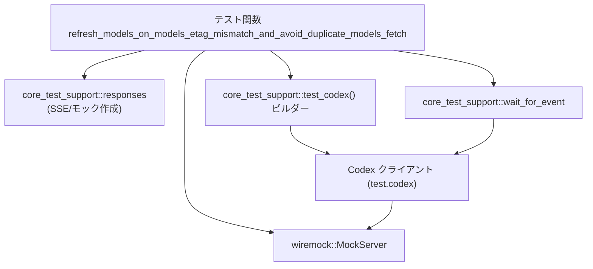
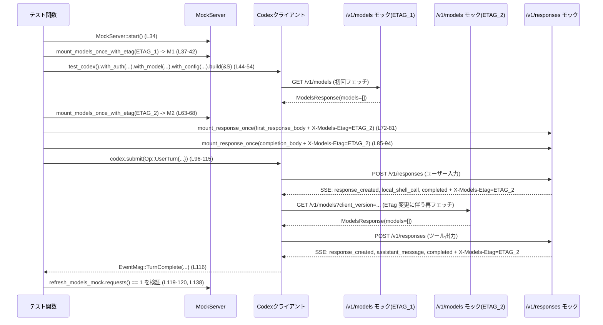

# core/tests/suite/models_etag_responses.rs コード解説

---

## 0. ざっくり一言

`Codex` クライアントが `/v1/responses` の `X-Models-Etag` ヘッダを見て `/v1/models` を再フェッチする挙動をテストし、**ETag が変わったときだけ 1 回だけモデル一覧を取り直し、同じ ETag では二重取得しない**ことを検証する非同期テストです  
（`core/tests/suite/models_etag_responses.rs:L26-141`）。

---

## 1. このモジュールの役割

### 1.1 概要

このテストモジュールは、次の問題を対象にしています。

> モデル一覧 `/v1/models` の ETag がサーバ側で更新されたとき、クライアントが **いつ・何回** モデル一覧を再取得するべきか。

具体的には、`Codex` が

- 起動時に `/v1/models` を 1 回取得し、ETag を保存すること  
  （`spawn_models_mock` に対するリクエスト数検証  
  `L36-42, L59-60`）
- `/v1/responses` のレスポンスヘッダ `X-Models-Etag` が **保存済み ETag と異なる** 場合にだけ `/v1/models` を再取得すること  
  （`refresh_models_mock` に対するリクエスト数検証 `L62-68, L119-120`）
- 同じ `X-Models-Etag` を繰り返し受け取っても、二度目以降は `/v1/models` を再取得しないこと  
  （`refresh_models_mock.requests().len()` が常に 1 であることの検証 `L119-120, L136-138`）
- `/v1/models` の再取得時に `client_version` クエリパラメータを付けていること  
  （`refresh_req.url.query_pairs().any(|(k, _)| k == "client_version")` `L121-133`）

を確認します。

### 1.2 アーキテクチャ内での位置づけ

このテストは、`core_test_support` のテスト用ヘルパーと `wiremock::MockServer` を用い、`Codex` クライアントと疑似サーバの間の HTTP トラフィックを検証する **統合テスト** です  
（`use` 群 `L3-24`、モックサーバ起動 `L34`、ビルダー `L45-52`、`codex.submit` `L96-114`）。

依存関係の概略は次の通りです。



- テスト関数が  
  - `MockServer` を起動し（`L34`）  
  - `responses::*` で `/v1/models` と `/v1/responses` のモックを登録し（`L37-42, L63-68, L77-81, L90-94`）  
  - `test_codex()` から `Codex` インスタンスを生成します（`L45-57`）。
- 生成された `Codex` は、モックサーバに対して実際に HTTP リクエストを発行し、その結果がモック側に記録されます（`spawn_models_mock.requests()` などの検査 `L59-60, L119-120`）。
- `wait_for_event` で `Codex` からのイベントストリームを監視し、ターン完了まで待機します（`L116`）。

### 1.3 設計上のポイント

コードから読み取れる設計上の特徴は次の通りです。

- **プラットフォーム条件付きコンパイル**  
  - 冒頭に `#![cfg(not(target_os = "windows"))]` があり、Windows ではこのテストはビルド・実行されません（`L1`）。  
    `/bin/echo` を使うローカルシェル呼び出し（`L74`）が Windows では存在しないためと考えられます。
- **完全に非同期な統合テスト**  
  - `#[tokio::test(flavor = "multi_thread", worker_threads = 2)]` により、マルチスレッドの Tokio ランタイム上で並行実行可能なテストになっています（`L26`）。
  - `Arc` を用いて `Codex` インスタンスとカレントディレクトリを複数タスク間で共有しています（`L3, L55-56`）。
- **HTTP モックの明示的検証**  
  - モデル一覧 `/v1/models` のモックに対し、  
    - リクエスト数 `requests().len()`  
    - パス `single_request_path()`  
    - クエリパラメータ `url.query_pairs()`  
    を確認し、期待した回数・形で呼ばれているかを厳密にチェックしています（`L59-60, L119-133`）。
- **リトライによる不安定性の排除**  
  - テストが決 determinis tic になるよう、`request_max_retries = Some(0)` と `stream_max_retries = Some(1)` に明示的に設定しています（`L48-52`）。  
    これにより、HTTP リトライでモックのリクエスト回数がぶれることを防いでいます。
- **イベント駆動の完了待ち**  
  - `wait_for_event` で `EventMsg::TurnComplete(_)` が来るまで待機し、`Codex` のターン処理完了を検出しています（`L116`）。  
    これは内部イベントシステムを利用したテストであり、観測可能性（observability）の一部になっています。

---

## 2. 主要な機能一覧

このファイル単体で提供している機能（＝テストシナリオ）の一覧です。

- モデル一覧初回フェッチ検証: `Codex` 起動時に `/v1/models` が 1 回だけ呼ばれることを検証（`L36-42, L59-60`）。
- ETag 不一致時のモデル再フェッチ検証: `/v1/responses` の `X-Models-Etag` が初回 ETag と異なる場合に `/v1/models` を再フェッチすることを検証（`L62-81, L119-120`）。
- 同一 ETag での重複フェッチ回避検証: 同じ `X-Models-Etag` を含む 2 回目の `/v1/responses` で `/v1/models` を再度フェッチしないことを検証（`L83-94, L135-138`）。
- `/v1/models` 再フェッチ時の `client_version` 付与検証: 再フェッチ時のリクエストに `client_version` クエリパラメータが含まれることを検証（`L121-133`）。
- ローカルシェルツール呼び出しフローの検証: ユーザー入力 → ツール呼び出し → ツール出力応答 → ターン完了イベント、という一連のフローを SSE でモックし、処理できることを確認（`L70-81, L83-94, L96-116, L135-137`）。

---

## 3. 公開 API と詳細解説

このファイル自体から `pub` な API は定義されていませんが、テストで利用している主要な型や関数を「コンポーネントインベントリー」として整理します。

### 3.1 型一覧（構造体・列挙体など）

| 名前 | 種別 | 役割 / 用途 | 定義/使用行 |
|------|------|-------------|-------------|
| `ModelsResponse` | 構造体 | モデル一覧のレスポンスボディ。フィールド `models: Vec<_>` を少なくとも持つことが分かります。このテストでは空のモデル一覧を返すモックのために使用されています。 | 使用: `core/tests/suite/models_etag_responses.rs:L37-41, L63-66`（定義はこのチャンクには現れません） |
| `CodexAuth` | 構造体（外部クレート） | `Codex` クライアントで使用する認証情報。ここではテスト用ダミー認証情報を生成する `create_dummy_chatgpt_auth_for_testing` を呼び出しています。 | 使用: `L44`（定義は他ファイル・`codex_login` にあり、このチャンクには現れません） |
| `MockServer` | 構造体 | `wiremock` が提供する HTTP モックサーバ。`start().await` で起動し、テスト中の HTTP リクエストを受け付け、記録します。 | インポート: `L24`、使用: `L34` |
| `UserInput` | 列挙体 | ユーザーからの入力を表現します。ここでは `UserInput::Text { text, text_elements }` というテキスト入力バリアントのみ利用しています。 | 使用: `L98-101`（定義は `codex_protocol::user_input`、このチャンクには現れません） |
| `Op` | 列挙体 | `Codex` への操作を表します。ここでは `Op::UserTurn { ... }` が用いられ、ユーザーターンの開始を指示しています。 | 使用: `L97-113`（定義は `codex_protocol::protocol`、このチャンクには現れません） |
| `AskForApproval` | 列挙体 | ツール実行などに対する承認ポリシー。ここでは `AskForApproval::Never` を指定し、ユーザー承認なしでツール実行する設定になっています。 | 使用: `L104` |
| `SandboxPolicy` | 列挙体 | コードやコマンド実行環境のサンドボックスポリシー。ここでは `SandboxPolicy::DangerFullAccess` が指定され、テスト内でローカルシェルを自由に呼び出せる設定になっています。 | 使用: `L106` |
| `EventMsg` | 列挙体 | `Codex` から発行されるイベント。ここでは `EventMsg::TurnComplete(_)` だけをパターンマッチに用いて、ターン完了を検出しています。 | 使用: `L116` |
| `Arc<T>` | 構造体（標準ライブラリ） | 複数スレッド間で参照カウント付きに共有できるスマートポインタ。`Codex` インスタンスおよび作業ディレクトリパスをクローン可能な形で保持するために使用されています。 | インポート: `L3`、使用: `L55-56` |

※ 上記以外にも多くの型（`test` 変数の型など）が暗黙に存在しますが、具体的な型名はこのチャンクには現れないため、省略しています。

---

### 3.2 関数詳細

#### `refresh_models_on_models_etag_mismatch_and_avoid_duplicate_models_fetch() -> Result<()>`

**概要**

`Codex` クライアントが

1. 起動時に `/v1/models` を 1 回だけ取得し、
2. `/v1/responses` の `X-Models-Etag` が変化したときに **1 回だけ** `/v1/models` を再取得し、
3. 2 回目以降に同じ ETag を受け取っても再取得しないこと、
4. 再取得時の `/v1/models` リクエストに `client_version` クエリパラメータを含めること、

を `wiremock::MockServer` を使って検証する Tokio 非同期テストです（`L26-27, L36-42, L62-68, L119-133, L135-138`）。

**属性・引数**

- `#[tokio::test(flavor = "multi_thread", worker_threads = 2)]`  
  非同期テストであり、マルチスレッドランタイム（ワーカースレッド 2 本）で実行されます（`L26`）。
- 引数: なし（テスト関数のため）。

**戻り値**

- 型: `anyhow::Result<()>`（`use anyhow::Result;` `L5`, `fn ... -> Result<()>` `L27`）
- 意味:  
  - `Ok(())` の場合: テスト成功。  
  - `Err(anyhow::Error)` の場合: テスト失敗として扱われ、テストランナーにエラーが報告されます。  
    エラーは `builder.build(&server).await?` や `codex.submit(...).await?` などから伝播します（`L54-55, L96-115`）。

**内部処理の流れ（アルゴリズム）**

主要な処理ステップを順番に整理します。

1. **ネットワーク環境チェックとテストスキップ**  
   - `skip_if_no_network!(Ok(()));` によって、ネットワークが利用できない環境ではこのテスト全体をスキップします（`L28`）。  
     マクロの具体的な実装はこのチャンクには現れませんが、名前と使い方からそのような挙動が想定されます。
2. **定数の定義**  
   - 初回モデル取得用 ETag: `ETAG_1 = "\"models-etag-1\""`（`L30`）  
   - 更新後モデル取得用 ETag: `ETAG_2 = "\"models-etag-2\""`（`L31`）  
   - ローカルシェルツール呼び出し ID: `CALL_ID = "local-shell-call-1"`（`L32`）。
3. **モックサーバの起動**  
   - `let server = MockServer::start().await;` でローカル HTTP モックサーバを起動します（`L34`）。
4. **起動時 `/v1/models` モックの設定と検証**  
   - `responses::mount_models_once_with_etag(&server, ModelsResponse { models: Vec::new() }, ETAG_1).await` を呼び出して、`/v1/models` エンドポイントのモックを 1 回分登録します（`L37-42`）。  
     返り値 `spawn_models_mock` は、そのモックに対するリクエスト履歴を取得できるハンドルです（と解釈できます）。
   - `CodexAuth` を用いてダミー認証情報を生成し（`L44`）、`test_codex()` ビルダーに渡します（`L45-47`）。
   - `with_config` クロージャでリトライ設定を上書きします（`L48-52`）。  
     - `request_max_retries = Some(0)`  
     - `stream_max_retries = Some(1)`
   - `builder.build(&server).await?` によって `Codex` テスト環境を構築します（`L54`）。  
     ここで `Codex` が内部で初回 `/v1/models` を呼び出すものと想定されます。
   - その後の `assert_eq!(spawn_models_mock.requests().len(), 1)` と `assert_eq!(spawn_models_mock.single_request_path(), "/v1/models")` によって、初回 `/v1/models` が 1 回だけ呼ばれ `/v1/models` パスであることを確認しています（`L59-60`）。
5. **ETag 変更後の `/v1/models` 再フェッチモックの設定**  
   - `refresh_models_mock = responses::mount_models_once_with_etag(&server, ModelsResponse { models: Vec::new() }, ETAG_2).await` で、更新後 ETag 用の `/v1/models` モックを登録します（`L63-68`）。  
     これが「再フェッチ」を観測するためのモックです。
6. **1 回目の `/v1/responses` モック（ツール呼び出し）設定**  
   - `first_response_body` を `sse(vec![ ... ])` で構築します（`L72-76`）。  
     中身は次の SSE イベントです。  
     - `ev_response_created("resp-1")`（レスポンス ID 生成）  
     - `ev_local_shell_call(CALL_ID, "completed", vec!["/bin/echo", "etag ok"])`（ローカルシェルツール呼び出し）  
     - `ev_completed("resp-1")`（レスポンス完了）
   - `responses::mount_response_once(&server, sse_response(first_response_body).insert_header("X-Models-Etag", ETAG_2)).await` で、`/v1/responses` のレスポンスモックを 1 回分登録し、そのヘッダに `X-Models-Etag: ETAG_2` を付与します（`L77-81`）。  
     これが **ETag ミスマッチを引き起こすレスポンス** になります。
7. **2 回目の `/v1/responses` モック（ツール出力）設定**  
   - `completion_response_body` を同様に `sse(vec![ ... ])` で構築し（`L85-89`）、中身は次のイベントです。  
     - `ev_response_created("resp-2")`  
     - `ev_assistant_message("msg-1", "done")`（ツール出力処理後のアシスタントメッセージ）  
     - `ev_completed("resp-2")`
   - これを `mount_response_once` でモック登録し、同じく `X-Models-Etag: ETAG_2` ヘッダを付与します（`L90-94`）。  
     ここが **同一 ETag 再通知だが、二度目の `/v1/models` フェッチを起こしてはならないケース** です。
8. **ユーザーターンの送信**  
   - `codex.submit(Op::UserTurn { ... }).await?` を呼び出して、ユーザーから「please run a tool」というメッセージを送信します（`L96-115`）。  
     - `items`: `UserInput::Text { text: "please run a tool".into(), text_elements: Vec::new() }`（`L98-101`）  
     - `cwd`: テスト用作業ディレクトリパス（`cwd.path().to_path_buf()` `L103`）  
     - `approval_policy`: `AskForApproval::Never`（`L104`）  
     - `sandbox_policy`: `SandboxPolicy::DangerFullAccess`（`L106`）  
     - `model`: テストセッションで設定された `session_model`（`L57, L107`）  
     などを含みます。
9. **ターン完了イベントの待機**  
   - `wait_for_event(&codex, |ev| matches!(ev, EventMsg::TurnComplete(_))).await` によって、`Codex` から `EventMsg::TurnComplete(_)` が流れてくるまで非同期に待機します（`L116`）。  
     これにより、ツール呼び出し → モデル再フェッチ → ツール出力処理 → ターン完了までの一連の処理が終わったことを確認します。
10. **モデル再フェッチの回数とクエリパラメータの検証**  
    - `assert_eq!(refresh_models_mock.requests().len(), 1);` で、更新後 ETag 用 `/v1/models` モックへのリクエストがちょうど 1 回だけであることを確認します（`L119-120`）。  
      → **ETag ミスマッチ後の再フェッチが 1 回だけ行われた**ことの保証になります。
    - `refresh_models_mock.single_request_path()` が `/v1/models` であることを再確認します（`L120`）。
    - `refresh_req.url.query_pairs().any(|(k, _)| k == "client_version")` で、再フェッチリクエストの URL に `client_version` クエリパラメータが含まれていることを検証します（`L121-133`）。  
      コメントに「これは /models クライアントを使っていることを示す安定したシグナル」と書かれており、クライアントのバージョン情報をサーバ側で識別する用途があると読み取れます（`L126-127`）。
11. **同一 ETag での二度目の `/v1/models` フェッチが無いことの検証**  
    - `let tool_req = tool_output_mock.single_request();` で、2 回目の `/v1/responses` モックに対するリクエストを取得します（`L136`）。
    - `let _ = tool_req.function_call_output(CALL_ID);` で、このリクエストが正しいツール呼び出し結果に対応していることを確認しています（`L137`）。  
      戻り値は無視されていますが、`CALL_ID` が一致するかなど、内部で検証している可能性があります（このチャンクには実装は現れません）。
    - 最後に再度 `assert_eq!(refresh_models_mock.requests().len(), 1);` を呼び出して、2 回目の `/v1/responses` 処理後も `/v1/models` 再フェッチ回数が増えていないことを確認します（`L138`）。
12. **テスト成功**  
    - すべての `assert!`／`assert_eq!`／`?` が通過した場合、`Ok(())` を返してテスト終了です（`L140`）。

**Examples（使用例）**

この関数はテストランナーから実行されることを前提としており、通常のコードから直接呼び出すことはありません。実行例としては、次のような形になります。

```bash
# core クレート全体のテストを実行
cargo test -p core

# このテストファイルだけを絞り込んで実行（テスト名でフィルタ）
cargo test -p core refresh_models_on_models_etag_mismatch_and_avoid_duplicate_models_fetch
```

Rust の標準的なテストメカニズムにより、`tests` ディレクトリ配下のこのファイルは自動的に検出され、`#[tokio::test]` 属性付き関数として非同期に実行されます（`L26-27`）。

**Errors / Panics**

- `builder.build(&server).await?`  
  - モックサーバとの接続失敗や設定ミスなどがある場合、`Err(anyhow::Error)` を返し、テスト全体がエラー終了します（`L54`）。
- `codex.submit(...).await?`  
  - `Codex` 内部での HTTP エラーやプロトコルエラーなどが起きた場合、`Result` が `Err` となり、テストがエラー終了します（`L96-115`）。  
  - 具体的なエラー型・条件はこのチャンクには現れません。
- `assert_eq!` / `assert!`  
  - 条件が満たされない場合は `panic!` を発生させ、テストは失敗します。  
    - `/v1/models` のリクエスト回数やパスが期待通りでない（`L59-60, L119-120, L138`）。  
    - `client_version` クエリパラメータが存在しない（`L127-132`）。
- `expect("one request")`  
  - `refresh_models_mock.requests().into_iter().next()` が `None` の場合（リクエストが 0 回）、`expect` が `panic!` を発生させます（`L121-125`）。
- `tool_req.function_call_output(CALL_ID)`  
  - 実装はこのチャンクには現れませんが、`CALL_ID` に対応するツール呼び出しが存在しない場合にパニックやエラーを起こす可能性があります（`L137`）。  
    ただし戻り値を破棄しているため、`Result` を返しても無視されます。

**Edge cases（エッジケース）**

- **Windows 環境**  
  - `#![cfg(not(target_os = "windows"))]` により、このテストは Windows ではビルド／実行されません（`L1`）。  
    `/bin/echo` など Unix 固有パスを使っているためと考えられます（`L74`）。
- **ネットワークが使えない環境**  
  - `skip_if_no_network!` によってテスト全体がスキップされます（`L28`）。  
    これにより CI の設定や開発環境による不安定な失敗を防いでいます。
- **`Codex` が起動時に `/v1/models` を呼ばない／パスが異なる**  
  - その場合 `spawn_models_mock.requests().len()` が 0 になったり、`single_request_path()` が `/v1/models` 以外になり、`assert_eq!` が失敗します（`L59-60`）。
- **ETag 変更時にモデル再フェッチをしない／逆に何度もする**  
  - 再フェッチしない場合: `refresh_models_mock.requests().len()` が 0 となり、`assert_eq!(..., 1)` が失敗します（`L119-120`）。  
  - 同じ ETag で何度も再フェッチする場合: 2 回目の `/v1/responses` 処理後に `len()` が 2 以上となり、最後の `assert_eq!(..., 1)` が失敗します（`L138`）。
- **`client_version` クエリパラメータ名の変更**  
  - サーバ・クライアント間の契約として `client_version` という名前を使っているため、名前を変えると `assert!` が失敗します（`L127-132`）。

**使用上の注意点**

- この関数はテスト専用であり、プロダクションコードから直接呼び出すことは想定されていません。
- 非同期テストのため、`tokio` ランタイムのバージョンや `multi_thread` ランタイムの設定に依存します（`L26`）。
- モデル取得回数の検証は、HTTP リトライ回数設定に強く依存します。  
  `request_max_retries` や `stream_max_retries` のデフォルト値を変えた場合、このテストも更新が必要になる可能性があります（`L48-52`）。
- `SandboxPolicy::DangerFullAccess` を使ってローカルシェルを実行しているため、本番環境では同様の設定を安易に適用しないことが前提となります（`L74, L106`）。  
  ただし、このテストはモック環境で安全な `/bin/echo` コマンドのみを実行しています。

**バグになり得る点・セキュリティ観点**

- このテストがカバーしている潜在的なバグ:
  - `/v1/responses` の `X-Models-Etag` が変わるたびに無制限に `/v1/models` を再フェッチしてしまう実装（リソース浪費）  
    → `refresh_models_mock.requests().len()` のチェックで検知（`L119-120, L138`）。
  - `/v1/models` 再フェッチ時に正しい HTTP クライアントが使われていない（`client_version` が付かないなど）  
    → クエリパラメータのチェックで検知（`L121-133`）。
- セキュリティ面:
  - `SandboxPolicy::DangerFullAccess` は、誤用すると危険になり得る設定ですが、このテストでは `/bin/echo` のみを実行するため影響は限定的です（`L74, L106`）。  
    本番コードではより制限的なポリシーを用いる前提と考えられます。

---

### 3.3 その他の関数・マクロ

このファイルで使用される補助的な関数・マクロの一覧です（実装はすべて他モジュールにあり、このチャンクには現れません）。

| 名前 | 種別 | 役割（1 行） | 使用行 |
|------|------|--------------|--------|
| `skip_if_no_network!` | マクロ | ネットワークが利用不可能な環境ではテストをスキップする。 | `core/tests/suite/models_etag_responses.rs:L28` |
| `responses::mount_models_once_with_etag` | 非同期関数 | `/v1/models` エンドポイントのモックを 1 回分登録し、受信リクエストの履歴を参照できるハンドルを返すと解釈できます。 | `L37-42, L63-68` |
| `responses::mount_response_once` | 非同期関数 | `/v1/responses` エンドポイントのレスポンスを 1 回分モックし、後でリクエストを検査できるハンドルを返すと解釈できます。 | `L77-81, L90-94` |
| `responses::sse` | 関数 | イベント列（`vec![...]`）から SSE ボディを構築するヘルパー。 | `L72-76, L85-89` |
| `responses::sse_response` | 関数 | SSE ボディを HTTP レスポンスモックにラップするヘルパー。`insert_header` チェーンが可能な構造になっています。 | `L79-80, L92` |
| `responses::ev_response_created` | 関数 | SSE ストリーム内で「レスポンスが作成された」イベントを生成します。 | `L73, L86` |
| `responses::ev_local_shell_call` | 関数 | ローカルシェルツール呼び出しイベントを生成し、ツール ID・状態・コマンドを表現します。 | `L74` |
| `responses::ev_completed` | 関数 | レスポンス完了イベントを生成します。 | `L75, L88` |
| `responses::ev_assistant_message` | 関数 | アシスタントからのメッセージイベントを生成します。 | `L87` |
| `test_codex` | 関数 | テスト用 `Codex` ビルダーを返すヘルパーで、認証・モデル・設定などを付加して `build(&server)` で実インスタンスを生成します。 | `L21, L45-52, L54-57` |
| `wait_for_event` | 非同期関数 | `Codex` のイベントストリームから条件を満たすイベントが現れるまで待機します。ここでは `EventMsg::TurnComplete(_)` を待っています。 | `L22, L116` |

いずれも、正確な実装はこのチャンクには現れず、名称と利用方法から推測した役割です。

---

## 4. データフロー

### 4.1 処理シナリオの概要

ここではテスト関数全体（`refresh_models_on_models_etag_mismatch_and_avoid_duplicate_models_fetch` `L26-141`）を 1 つのシナリオとして、`Codex`・モックサーバ・SSE イベント間でのデータフローを整理します。

要点:

1. `Codex` 起動時に初回 `/v1/models` を 1 回だけフェッチ（ETag=`ETAG_1`）  
2. ユーザーのメッセージ送信により `/v1/responses` が呼ばれ、`X-Models-Etag: ETAG_2` を含む SSE が届く  
3. `Codex` は ETag の変化を検知し、`/v1/models?client_version=...` で再フェッチ（モック `refresh_models_mock` が 1 回だけ呼ばれる）  
4. ツール出力を送信する 2 回目の `/v1/responses` レスポンスでも `X-Models-Etag: ETAG_2` が付いているが、このときは追加の `/v1/models` フェッチは行われない  

### 4.2 シーケンス図



この図から分かるように、`M2`（ETAG_2 用 `/v1/models` モック）は **ETag 変更時の 1 回だけ** 呼ばれており、2 回目の `/v1/responses` 応答後には追加リクエストが発生していないことをテストが保証しています。

---

## 5. 使い方（How to Use）

### 5.1 基本的な使用方法

このファイルは Rust の統合テストとして利用されます。開発者が直接関数を呼び出すのではなく、`cargo test` を通じて実行されます。

典型的な実行方法:

```bash
# core クレート全体のテストを実行
cargo test -p core

# テスト名を指定して、このテストだけを実行
cargo test -p core refresh_models_on_models_etag_mismatch_and_avoid_duplicate_models_fetch
```

事前条件:

- 実行環境が Windows でないこと（`cfg(not(target_os = "windows"))` `L1`）。
- ネットワーク使用が許可されていること（許可されていない場合 `skip_if_no_network!` がスキップします `L28`）。
- `core_test_support` モジュールおよび `Codex` 関連クレートがビルドできる状態であること（`L13-22`）。

### 5.2 よくある使用パターン（テストの拡張例）

このテストを参考に、別のヘッダや挙動を検証したい場合、次のようなパターンが考えられます。

#### パターン 1: 別のクエリパラメータを検証する

`client_version` 以外のクエリパラメータを検証する場合は、`refresh_req.url.query_pairs()` への検査を追加できます（`L127-131`）。

```rust
// 例: "client_platform" クエリパラメータの存在を検証するコード断片
let refresh_req = refresh_models_mock
    .requests()
    .into_iter()
    .next()
    .expect("one request");

assert!(
    refresh_req
        .url
        .query_pairs()
        .any(|(k, _)| k == "client_platform"),
    "expected /models refresh to include client_platform query param"
);
```

※ `client_platform` のようなパラメータが実際に存在するかどうかは、このチャンクには現れません。あくまでテスト拡張のパターン例です。

#### パターン 2: ETag が変わらないケースを別テストで検証する

このテストでは「ETag が変わる → 1 回だけ再フェッチ」というケースを扱っていますが、別テストとして「最初から最後まで ETag が変わらない → 再フェッチしない」を検証することもできます。その場合は、`ETAG_1` と同じ値を `X-Models-Etag` に設定し、`refresh_models_mock.requests().len() == 0` を検証する形になります。

### 5.3 よくある間違い（想定される落とし穴）

このテストの構造から、次のような誤用・落とし穴が推測されます。

```rust
// 誤りの例: リトライ設定をデフォルトのままにする
let mut builder = test_codex()
    .with_auth(auth)
    .with_model("gpt-5");
// .with_config(...) を呼ばず、request_max_retries や stream_max_retries を変更しない

// 正しい例: テストが決定的になるように明示的に設定する
let mut builder = test_codex()
    .with_auth(auth)
    .with_model("gpt-5")
    .with_config(|config| {
        config.model_provider.request_max_retries = Some(0);
        config.model_provider.stream_max_retries = Some(1);
    });
```

- 誤りの例では、HTTP リトライにより `/v1/models` や `/v1/responses` へのリクエスト回数が想定より多くなり、`requests().len()` のアサーションが不安定になる可能性があります（`L48-52` がこの問題を避けるための設定になっています）。
- また、モックを設定する順番を変えてしまうと、`Codex` 起動時の初回 `/v1/models` が期待したモックに向かない、といった問題も起こり得ます（モック登録順: `L37-42` → `L63-68` → `L77-81` → `L90-94`）。

### 5.4 使用上の注意点（まとめ）

- **プラットフォーム依存**: `/bin/echo` を使うため、Unix 系環境での実行が前提です（`L74`）。Windows 環境ではテスト自体がビルドされません（`L1`）。
- **ネットワーク前提**: `skip_if_no_network!` によってネットワーク可用性に依存します（`L28`）。オフライン環境で CI を走らせる場合、このテストは常にスキップされる可能性があります。
- **性能・スケーラビリティ上の意義**:  
  - このテストは、「ETag 変更時のモデル再フェッチを 1 回だけに抑える」ことを保証することで、不要な `/v1/models` ダウンロードを防ぐ役割があります（`L119-120, L138`）。  
  - 長時間動作するクライアントにとって、無駄な再フェッチをしていないことは帯域・レイテンシの両面で重要です。
- **観測可能性（Observability）**:  
  - `client_version` クエリパラメータは、クライアントのバージョンや種類をサーバ側で識別するための安定したシグナルとしてコメントされています（`L126-127`）。これにより、ログやメトリクスから `/v1/models` リクエストの発生源を追跡しやすくなります。
  - `EventMsg::TurnComplete` を待つ形で完了を検出しているため、内部イベントストリームを利用した追跡が可能です（`L116`）。

---

## 6. 変更の仕方（How to Modify）

### 6.1 新しい機能（テストケース）を追加する場合

このテストファイルをベースに、新しい挙動を検証したい場合の一般的な手順です。

1. **新しいテスト関数を定義する**  
   - `#[tokio::test(flavor = "multi_thread", worker_threads = 2)]` を付けた非同期関数を追加します（`L26-27` を参考）。
2. **モックサーバを起動する**  
   - `let server = MockServer::start().await;` のようにして `wiremock::MockServer` を準備します（`L34`）。
3. **`Codex` テスト環境を構築する**  
   - `CodexAuth::create_dummy_chatgpt_auth_for_testing()` で認証を作成し（`L44`）、`test_codex()` ビルダーに渡します（`L45-52`）。  
   - 必要に応じて `with_config` でリトライ設定やタイムアウトを変更します。
4. **必要な HTTP モックを登録する**  
   - `/v1/models` や `/v1/responses` のモックを `responses::mount_*` 系関数で登録します（`L37-42, L63-68, L77-81, L90-94`）。  
   - SSE ボディが必要な場合は `sse` / `sse_response` と `ev_*` 系関数を利用します（`L72-76, L85-89`）。
5. **`codex.submit` でシナリオを実行する**  
   - `Op::UserTurn` などを用いて `Codex` に操作を投げ、その結果を `wait_for_event` やモックの `requests()` で検証します（`L96-116, L119-120`）。
6. **検証ポイントを追加する**  
   - 新しいヘッダやクエリパラメータ、リクエスト回数などを `assert_eq!` / `assert!` で検証します（`L59-60, L119-133`）。

### 6.2 既存の機能を変更する場合（契約と影響範囲）

このテストが前提としている「契約」や注意点は次の通りです。これらを変える場合、テストの更新が必要になります。

- **`/v1/models` エンドポイントのパス**  
  - テストは `"/v1/models"` にハードコードしています（`L60, L120`）。  
    エンドポイント名を変更する場合、ここを含む関連テストすべてを更新する必要があります。
- **`client_version` クエリパラメータ**  
  - テストは `client_version` という名前で存在することを前提にしています（`L127-132`）。  
  - 名前や意味を変える場合、サーバ・クライアント・テストの三者で整合性を取る必要があります。
- **ETag に関する契約**  
  - 「初回 `/v1/models` 取得時に保存した ETag」と「`/v1/responses` のヘッダ `X-Models-Etag`」を比較して、異なれば再フェッチする、という契約が暗黙に存在します（`L30-31, L62-68, L72-81`）。  
  - 将来この契約を変え（例: ETag 以外の指標を使う）、挙動を変更したい場合、このテストはその新しい仕様に合わせて書き直す必要があります。
- **リトライ戦略**  
  - このテストはリトライがほぼ無い前提で書かれており（`L48-52`）、リトライ戦略を変えるとモックのリクエスト回数に影響が出る可能性があります。  
  - リトライを含めた挙動も検証したい場合は、別テストとして切り出す方が安全です。

---

## 7. 関連ファイル

このモジュールと密接に関係するモジュール・クレートです。いずれも実装はこのチャンクには現れません。

| パス / モジュール | 役割 / 関係 |
|-------------------|------------|
| `core_test_support::responses` | SSE イベントや HTTP モックレスポンスを生成するヘルパー群。`mount_models_once_with_etag`, `mount_response_once`, `sse`, `sse_response`, `ev_*` 系関数を提供し、このテストのほぼすべてのモック構築処理を担っています（`L13-19, L37-42, L63-68, L72-76, L77-81, L85-89, L90-94`）。 |
| `core_test_support::test_codex` | `test_codex()` 関数を通じてテスト用 `Codex` ビルダーを提供します。認証・モデル・設定を組み合わせてテスト環境を構築する役割です（`L21, L45-52, L54-57`）。 |
| `core_test_support::wait_for_event` | `Codex` のイベントストリームから条件を満たすイベントが現れるまで待機するユーティリティ。ここではターン完了イベントを待つために使用されています（`L22, L116`）。 |
| `core_test_support::skip_if_no_network` | ネットワーク環境に応じてテストをスキップするマクロを提供します（`L20, L28`）。 |
| `codex_login::CodexAuth` | `Codex` クライアント用の認証情報を表す型。テスト用ダミー認証の生成関数を通じて利用されています（`L6, L44`）。 |
| `codex_protocol::openai_models::ModelsResponse` | `/v1/models` のレスポンスボディを表す型。フィールド `models: Vec<_>` を持ち、ここでは空のモデル一覧を指定しています（`L7, L37-41, L63-66`）。 |
| `codex_protocol::protocol` | `AskForApproval`, `EventMsg`, `Op`, `SandboxPolicy` などのプロトコル関連型を提供し、`Codex` との対話に使われています（`L8-11, L97-107, L116`）。 |
| `codex_protocol::user_input::UserInput` | ユーザー入力を表現する型。ここではテキスト入力バリアントのみ使用しています（`L12, L98-101`）。 |
| `wiremock::MockServer` | HTTP モックサーバ機能を提供する外部クレート。テスト内でモックエンドポイントの起動やリクエスト検査に利用されています（`L24, L34`）。 |

これらのモジュールの詳細実装や他のテストとの関係は、このチャンクには現れませんが、このファイルはそれらのテスト用インフラの上に成り立つ統合テストであると言えます。
