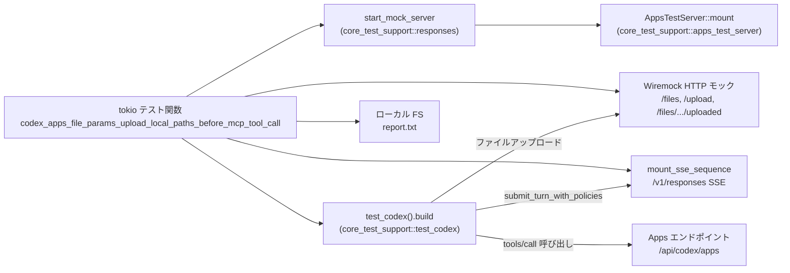
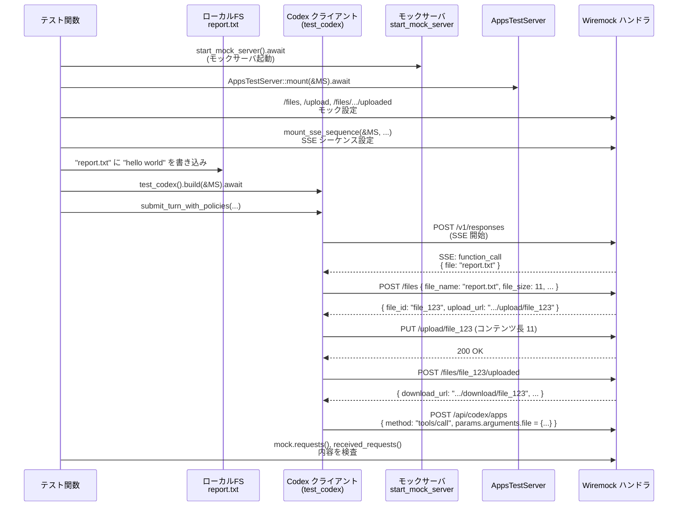

# core/tests/suite/openai_file_mcp.rs コード解説

## 0. ざっくり一言

`openai_file_mcp.rs` は、Codex の「Apps」機能と OpenAI Responses API 風の SSE モックサーバを使い、  
**ローカルファイルパスが Apps MCP ツール呼び出しの前にアップロードされ、Apps 側にはダウンロード URL 等が渡されること**を検証する統合テストです。（根拠: `openai_file_mcp.rs:L50-173`）

---

## 1. このモジュールの役割

### 1.1 概要

- Codex のテスト用 ChatGPT サーバ（`start_mock_server`）と Apps テストサーバ（`AppsTestServer`）を起動し、ファイルアップロード関連の HTTP エンドポイントを Wiremock でモックします。（根拠: `openai_file_mcp.rs:L52-88`）
- OpenAI Responses API 風の SSE をモックし、MCP ツール呼び出しイベントに「ローカルファイル名」を含めて返します。（根拠: `openai_file_mcp.rs:L90-110`）
- Codex テストクライアント経由でプロンプトを投げ、  
  1. OpenAI 側に渡されるツール定義のパラメータスキーマ  
  2. Apps 側に送信される `tools/call` リクエストの `arguments.file` と `_meta`  
  を検査します。（根拠: `openai_file_mcp.rs:L112-169`）

### 1.2 アーキテクチャ内での位置づけ

このテストは、Codex コア・Apps サーバ・ChatGPT モックサーバ間の連携の一部を検証します。



- テスト関数 `codex_apps_file_params_upload_local_paths_before_mcp_tool_call` が起点となり、  
  モックサーバ・Apps サーバ・Codex クライアントを順次初期化します。（根拠: `openai_file_mcp.rs:L50-54`, `L112-116`）
- Codex クライアントの実際の HTTP コールは Wiremock サーバに向き、ファイル API と Apps API へのリクエスト内容が検証対象になります。（根拠: `openai_file_mcp.rs:L55-88`, `L136-149`）

### 1.3 設計上のポイント

- **テスト専用設定ヘルパー**  
  - `configure_apps` で Config に対して Apps 機能を有効化し、ChatGPT ベース URL を注入します。（根拠: `openai_file_mcp.rs:L31-36`）
- **JSON ツール定義検索ヘルパー**  
  - `tool_by_name` で、レスポンスボディ中の `tools` 配列から `name` もしくは `type` が指定値に一致する要素を取得します。（根拠: `openai_file_mcp.rs:L38-47`）
- **失敗時は panic で早期失敗**  
  - 設定変更に失敗した場合やツールが見つからない場合は `panic!` を発生させ、テストが即座に失敗するようにしています。（根拠: `openai_file_mcp.rs:L31-35`, `L47`）
- **非 Windows 環境のみ実行**  
  - ファイル先頭の `#![cfg(not(target_os = "windows"))]` により Windows ではこのテストがコンパイル・実行されません。（根拠: `openai_file_mcp.rs:L1`）
- **非同期・マルチスレッド実行**  
  - `#[tokio::test(flavor = "multi_thread", worker_threads = 2)]` により、Tokio のマルチスレッドランタイム上で非同期テストとして実行されます。（根拠: `openai_file_mcp.rs:L50`）

---

## 2. 主要な機能一覧（コンポーネントインベントリー含む）

### 2.1 コンポーネントインベントリー

**定数**

| 名前 | 種別 | 役割 / 用途 | 定義位置 |
|------|------|-------------|----------|
| `DOCUMENT_EXTRACT_TOOL` | `&'static str` 定数 | Apps MCP ドキュメント抽出ツールの識別名。SSE のツールコールとツール定義検索に利用されます。 | `openai_file_mcp.rs:L29` |

**関数**

| 名前 | 種別 | 役割 / 用途 | 定義位置 |
|------|------|-------------|----------|
| `configure_apps` | 関数 | テスト用 `Config` に Apps 機能を有効化し、ChatGPT ベース URL をセットします。 | `openai_file_mcp.rs:L31-36` |
| `tool_by_name` | 関数 | OpenAI Responses リクエストボディの `tools` 配列から指定ツールを検索し、見つからない場合は panic します。 | `openai_file_mcp.rs:L38-48` |
| `codex_apps_file_params_upload_local_paths_before_mcp_tool_call` | 非同期テスト関数 | ローカルパス指定のファイルがアップロードされ、Apps ツール呼び出しにダウンロード URL 等が埋め込まれることを検証する統合テストです。 | `openai_file_mcp.rs:L50-173` |

### 2.2 主要な機能

- Config 初期化ヘルパー: Codex の `Config` に Apps 機能を有効化し、ChatGPT ベース URL を設定する。（根拠: `openai_file_mcp.rs:L31-36`）
- ツール定義検索: OpenAI Responses API 互換の JSON リクエストから、指定された MCP ツール定義を取り出す。（根拠: `openai_file_mcp.rs:L38-48`, `L125-127`）
- E2E ファイルアップロード検証テスト:  
  1. `/files` → `/upload/*` → `/files/*/uploaded` の 3 ステップアップロードフロー  
  2. SSE 経由の MCP ツール呼び出し  
  3. Apps `/api/codex/apps` `tools/call` リクエスト内容  
  を一括して検査する統合テスト。（根拠: `openai_file_mcp.rs:L55-88`, `L90-110`, `L112-169`）

---

## 3. 公開 API と詳細解説

### 3.1 型一覧（構造体・列挙体など）

このファイル内では、新たな構造体・列挙体・トレイトは定義されていません。  
利用している型はすべて外部クレート（`codex_core`, `core_test_support`, `wiremock` など）からのインポートです。（根拠: `openai_file_mcp.rs:L3-27`）

### 3.2 関数詳細

#### `configure_apps(config: &mut Config, chatgpt_base_url: &str)`

**概要**

- テスト用の `Config` に対し、Apps 機能を有効化し、ChatGPT のベース URL を設定します。（根拠: `openai_file_mcp.rs:L31-36`）

**引数**

| 引数名 | 型 | 説明 |
|--------|----|------|
| `config` | `&mut Config` | 変更対象となる Codex 設定オブジェクト。Apps 機能が有効化され、`chatgpt_base_url` が上書きされます。 |
| `chatgpt_base_url` | `&str` | モックサーバが提供する ChatGPT ベース URL。`Config` 内の `chatgpt_base_url` フィールドにコピーされます。 |

**戻り値**

- 戻り値はありません（`()`）。  
  成功時は `config` が更新されます。（根拠: `openai_file_mcp.rs:L31-36`）

**内部処理の流れ**

1. `config.features.enable(Feature::Apps)` を呼び出し Apps 機能を有効化します。（根拠: `openai_file_mcp.rs:L31-32`）
2. 有効化に失敗した場合は `panic!("test config should allow feature update: {err}")` でテストを即時失敗させます。（根拠: `openai_file_mcp.rs:L32-34`）
3. 正常時は `config.chatgpt_base_url` に `chatgpt_base_url.to_string()` を代入します。（根拠: `openai_file_mcp.rs:L35`）

**Examples（使用例）**

以下は、他のテストで `configure_apps` を流用するイメージです。

```rust
// テスト用 Codex クライアントのビルダーに設定を注入する例
let apps_server = AppsTestServer::mount(&server).await?; // Apps テストサーバの起動
let mut builder = test_codex()
    .with_auth(CodexAuth::create_dummy_chatgpt_auth_for_testing())
    .with_config(move |config| {
        // Apps 機能を有効化し、Apps サーバの ChatGPT ベース URL を設定
        configure_apps(config, apps_server.chatgpt_base_url.as_str());
    });
```

（実際に本ファイルでも同様の使い方をしています。根拠: `openai_file_mcp.rs:L112-115`）

**Errors / Panics**

- `config.features.enable(Feature::Apps)` が `Err` を返した場合に `panic!` します。（根拠: `openai_file_mcp.rs:L31-34`）
  - これはテスト環境の前提（Apps を有効化できるべき）に違反したときにテストを即座に失敗させるためです。

**Edge cases（エッジケース）**

- Apps 機能がすでに有効化済みの場合  
  → `enable` の挙動はこのチャンクからは分かりませんが、`Result` 型で `Ok` が返れば問題なく進みます。（`enable` の実装は他ファイルであり、このチャンクには現れません）
- `chatgpt_base_url` が空文字列でも、そのまま `Config` に反映されます。（チェックは行っていません。根拠: `openai_file_mcp.rs:L35`）

**使用上の注意点**

- テスト以外のコードでこの関数を利用すると、Apps 機能を強制的に有効化してしまうため、本番コードでの利用は前提とされていないと考えられます（名前と場所からの解釈であり、コードからは断定できません）。
- `panic!` を含むため、ライブラリコードではなくテストコードや検証用コードで使うのが前提です。（根拠: `openai_file_mcp.rs:L32-34`）

---

#### `tool_by_name<'a>(body: &'a Value, name: &str) -> &'a Value`

**概要**

- OpenAI Responses API リクエストボディ（JSON）の `tools` 配列から、`name` または `type` フィールドが指定値 `name` に一致するツール定義を返します。（根拠: `openai_file_mcp.rs:L38-47`）

**引数**

| 引数名 | 型 | 説明 |
|--------|----|------|
| `body` | `&Value` | OpenAI Responses API へのリクエストボディを表す JSON 値。`tools` キーを含むことが期待されています。 |
| `name` | `&str` | 探索対象のツール名。`tool["name"]` または `tool["type"]` と比較されます。 |

**戻り値**

- `&Value`（`body` 内部のツール定義への参照）  
- 条件に一致するツールが存在しない場合は `panic!` により関数自体は終了せず、テストが失敗します。（根拠: `openai_file_mcp.rs:L47`）

**内部処理の流れ**

1. `body.get("tools")` で `tools` キーを取得します。（根拠: `openai_file_mcp.rs:L39`）
2. `.and_then(Value::as_array)` で配列であることを確認し、`Option<&Vec<Value>>` に変換します。（根拠: `openai_file_mcp.rs:L40`）
3. `.and_then(|tools| { tools.iter().find(...) })` で、  
   各ツールについて `tool["name"]` または `tool["type"]` が `Some(name)` に一致する要素を検索します。（根拠: `openai_file_mcp.rs:L41-45`）
4. いずれかのツールが見つかればその `&Value` を返し、見つからなければ `unwrap_or_else(|| panic!(...))` で panic します。（根拠: `openai_file_mcp.rs:L47`）

**Examples（使用例）**

本ファイルでの利用例:

```rust
// 先に mock.requests()[0].body_json() で JSON を取得済みとする
let requests = mock.requests();
let body = requests[0].body_json();

// 特定のツール定義を取得
let extract_tool = tool_by_name(&body, DOCUMENT_EXTRACT_TOOL);

// JSON Pointer でパラメータ定義を検査
assert_eq!(
    extract_tool.pointer("/parameters/properties/file"),
    Some(&json!({
        "type": "string",
        "description": "Document file payload. This parameter expects an absolute local file path. If you want to upload a file, provide the absolute path to that file here."
    }))
);
```

（根拠: `openai_file_mcp.rs:L125-134`）

**Errors / Panics**

- `tools` キーが存在しない、配列でない、または一致するツールがない場合は `panic!("missing tool {name} in /v1/responses request: {body:?}")` になります。（根拠: `openai_file_mcp.rs:L39-47`）
- 戻り値は参照であり、ライフタイム `'a` によって `body` より長く生存できないようコンパイル時に保証されています（Rust の借用規則に従います）。

**Edge cases（エッジケース）**

- `tools` キーが存在しない、あるいは `null` やオブジェクトである場合  
  → `Value::as_array` が `None` となり、結果として panic します。（根拠: `openai_file_mcp.rs:L39-40`, `L47`）
- `tools` 配列が空の場合  
  → `iter().find(...)` で見つからず、panic します。（根拠: `openai_file_mcp.rs:L41-47`）
- ツールの `name` フィールドが存在せず `type` のみで識別されている場合  
  → `tool.get("type")` も確認することで対応しています。（根拠: `openai_file_mcp.rs:L43-45`）

**使用上の注意点**

- 目的は「テスト失敗時に詳細なメッセージを表示する」ことなので、  
  ライブラリ用の安全な関数というよりはテスト用アサーションヘルパーに近い設計です。（根拠: panic メッセージ `openai_file_mcp.rs:L47`）
- 実運用コードで利用する場合は、`Option<&Value>` や `Result<&Value, Error>` を返すラッパーを用意することが望ましいです（これは一般的な方針であり、このファイルから直接は読み取れません）。

---

#### `codex_apps_file_params_upload_local_paths_before_mcp_tool_call() -> Result<()>`

**概要**

- Tokio の非同期テストとして実行される統合テストです。（根拠: `openai_file_mcp.rs:L50-51`）
- ローカルファイル `report.txt` の絶対パスを MCP ツールパラメータとして受け取った Codex が、  
  1. ChatGPT 側に対してファイルアップロード API を呼び出し、  
  2. 返ってきた `download_url` などのメタ情報を Apps の `tools/call` リクエストに埋め込む  
  ことを検証します。（根拠: `openai_file_mcp.rs:L55-88`, `L136-161`）

**引数**

- 引数はありません。

**戻り値**

- `anyhow::Result<()>`  
  - テスト本体でエラーが発生した場合に `Err` を返します。（任意のエラー型をラップできる `anyhow::Result` を使用。根拠: `openai_file_mcp.rs:L3`, `L51`）

**内部処理の流れ（アルゴリズム）**

1. **モックサーバと Apps サーバの起動**  
   - `start_mock_server().await` で Wiremock ベースと推測されるモックサーバを起動し、  
     `AppsTestServer::mount(&server).await?` で Apps テストサーバをその上にマウントします。（根拠: `openai_file_mcp.rs:L52-53`）
2. **ファイルアップロード API の HTTP モック設定**  
   - `POST /files` に対して、`file_name`, `file_size`, `use_case` を検証しつつ、`file_id` と `upload_url` を返すモックを設定します。（根拠: `openai_file_mcp.rs:L55-66`）
   - `PUT /upload/file_123` に対して `content-length: 11` を要求し、200 を返します。（根拠: `openai_file_mcp.rs:L70-76`）
   - `POST /files/file_123/uploaded` に対して、`download_url`, `file_name`, `mime_type`, `file_size_bytes` を返すモックを設定します。（根拠: `openai_file_mcp.rs:L77-85`）
3. **SSE レスポンスシーケンスの設定**  
   - `mount_sse_sequence` を使用し、2 本の SSE ストリームを設定します。（根拠: `openai_file_mcp.rs:L90-110`）
     1. 最初のストリームでは、`resp-1` の作成 → `DOCUMENT_EXTRACT_TOOL` に対する関数呼び出し（引数 `{ "file": "report.txt" }`） → 完了イベントを送信します。（根拠: `openai_file_mcp.rs:L94-102`）
     2. 次のストリームでは、`resp-2` の作成 → アシスタントメッセージ `"done"` → 完了イベントを送信します。（根拠: `openai_file_mcp.rs:L103-107`）
   - `mount_sse_sequence` の戻り値 `mock` は、後で OpenAI リクエストを検査するために保持されます。（根拠: `openai_file_mcp.rs:L90-110`, `L125-127`）
4. **Codex テストクライアントのセットアップ**  
   - `test_codex()` でビルダーを作成し、ダミー ChatGPT 認証情報と `configure_apps` による設定変更クロージャを登録します。（根拠: `openai_file_mcp.rs:L112-115`）
   - `builder.build(&server).await?` で Codex テストクライアント `test` を構築します。（根拠: `openai_file_mcp.rs:L115`）
5. **テスト用ローカルファイルの作成**  
   - `test.cwd.path().join("report.txt")` のパスに `"hello world"`（11 バイト）を書き込みます。（根拠: `openai_file_mcp.rs:L116`）
6. **プロンプト送信とポリシー指定**  
   - `test.submit_turn_with_policies(...)` を呼び、  
     プロンプト `"Extract the report text with the app tool."` と、  
     `AskForApproval::Never`, `SandboxPolicy::DangerFullAccess` を指定して Codex に 1 ターンのやりとりを送信します。（根拠: `openai_file_mcp.rs:L118-123`）
7. **OpenAI 側ツール定義の検査**  
   - `mock.requests()` から最初のリクエストのボディ JSON を取得し、`tool_by_name` で `DOCUMENT_EXTRACT_TOOL` を探します。（根拠: `openai_file_mcp.rs:L125-127`）
   - `/parameters/properties/file` の JSON Pointer で、ファイルパラメータのスキーマが「絶対ローカルパスを期待する string 型」であることを `assert_eq!` で検証します。（根拠: `openai_file_mcp.rs:L128-134`）
8. **Apps `/api/codex/apps` ツール呼び出しの検査**  
   - `server.received_requests().await.unwrap_or_default()` でサーバが受け取ったリクエスト一覧を取得し、  
     `url.path() == "/api/codex/apps"` かつ JSON の `method` が `"tools/call"`, `params.name` が `"calendar_extract_text"` のものを `find_map` で探します。（根拠: `openai_file_mcp.rs:L136-148`）
   - 該当リクエストがなければ `expect("apps calendar_extract_text tools/call request should be recorded")` で panic します。（根拠: `openai_file_mcp.rs:L149`）
9. **Apps 引数・メタ情報のアサーション**  
   - `/params/arguments/file` が、`download_url`, `file_id`, `mime_type`, `file_name`, `uri`, `file_size_bytes` を含むオブジェクトであることを `assert_eq!` で検証します。（根拠: `openai_file_mcp.rs:L151-160`）
   - `/params/_meta/_codex_apps` が、`resource_uri`, `contains_mcp_source`, `connector_id` を含むオブジェクトであることを `assert_eq!` で検証します。（根拠: `openai_file_mcp.rs:L162-168`）
10. **モックの検証と終了**  
    - `server.verify().await` で Wiremock の期待がすべて満たされているか検証し、`Ok(())` を返してテストを終了します。（根拠: `openai_file_mcp.rs:L171-172`）

**並行性・非同期性に関するポイント**

- テストは `#[tokio::test(flavor = "multi_thread", worker_threads = 2)]` で実行されるため、  
  複数スレッド上で `async` タスクがスケジューリングされる環境を前提としています。（根拠: `openai_file_mcp.rs:L50`）
- 本テストでは並列に複数のタスクを `spawn` してはいませんが、`await` で I/O（モックサーバへの HTTP、ファイル書き込み）を非同期に扱っています。（根拠: `openai_file_mcp.rs:L52-53`, `L55-88`, `L90-110`, `L116`）

**Examples（使用例）**

この関数自体は `#[tokio::test]` 付きのテストとして自動実行されるため、直接呼び出すことは通常ありません。  
類似の統合テストを追加する場合のテンプレートとして利用できます。

```rust
#[tokio::test(flavor = "multi_thread", worker_threads = 2)]
async fn my_new_apps_test() -> Result<()> {
    // 1. モックサーバの起動
    let server = start_mock_server().await;

    // 2. Apps サーバのマウント
    let apps_server = AppsTestServer::mount(&server).await?;

    // 3. 必要な HTTP モック（/files など）を設定
    //    ...（本ファイルのモック定義を参考にする）

    // 4. SSE シーケンスを設定
    let mock = mount_sse_sequence(&server, vec![
        // ... 必要なイベントシーケンス
    ]).await;

    // 5. Codex クライアントの構築
    let mut builder = test_codex()
        .with_auth(CodexAuth::create_dummy_chatgpt_auth_for_testing())
        .with_config(move |config| configure_apps(config, apps_server.chatgpt_base_url.as_str()));
    let test = builder.build(&server).await?;

    // 6. ローカルファイル準備や submit_turn_with_policies の呼び出し
    //    ...

    // 7. mock.requests() や server.received_requests() で検証
    //    ...

    Ok(())
}
```

**Errors / Panics**

- `?` 演算子により以下でエラーがあれば `Err` を返します。（根拠: `openai_file_mcp.rs:L51-53`, `L53`, `L90-110`, `L115-116`, `L123`, `L137-138`, `L171`）
  - Apps サーバのマウント (`AppsTestServer::mount`)
  - Codex クライアントのビルド (`builder.build`)
  - ファイル書き込み (`tokio::fs::write`)
  - `submit_turn_with_policies` の実行
  - `received_requests().await` や `server.verify().await` が `Result` を返している場合
- `panic!` / `assert_eq!` / `expect` によるテスト失敗要因
  - `configure_apps` 内の `panic!`（Apps 機能の有効化失敗）（根拠: `openai_file_mcp.rs:L31-34`）
  - `tool_by_name` 内の `panic!`（指定ツールが見つからない）（根拠: `openai_file_mcp.rs:L38-47`）
  - `assert_eq!` 失敗時（ツールパラメータスキーマや Apps 引数が期待どおりでない）（根拠: `openai_file_mcp.rs:L128-134`, `L151-168`）
  - `expect` 失敗時（Apps `tools/call` リクエストが送信されなかった）（根拠: `openai_file_mcp.rs:L149`）

**Edge cases（エッジケース）**

- ファイルサイズ不一致  
  - ローカルに書き込む内容は `"hello world"`（11 バイト）であり、`/files` モックや `content-length: 11` もこれに合わせています。（根拠: `openai_file_mcp.rs:L60-61`, `L72`, `L116`）  
  - 実装側が実際のファイルサイズと異なる値を送信する場合、このテストでは検知できるかどうかは、Wiremock 側のマッチング設定によります（本チャンクではヘッダと JSON の値のみチェックしており、実ファイルバイト数の検査までは表れていません）。
- Apps ツール呼び出しが行われない場合  
  - `find_map` 結果が `None` となり `expect` で panic します。（根拠: `openai_file_mcp.rs:L141-149`）
- OpenAI 側で `DOCUMENT_EXTRACT_TOOL` が登録されていない場合  
  - `tool_by_name` が panic します。（根拠: `openai_file_mcp.rs:L125-127`, `L38-47`）

**使用上の注意点**

- 非 Windows 環境でのみコンパイル・実行されるため、Windows での動作は別途テストが必要です。（根拠: `openai_file_mcp.rs:L1`）
- 実際の HTTP エンドポイントへのアクセスではなく Wiremock に対するアクセスである点に注意が必要です。エンドポイントパスやボディが実運用と食い違うと、テストが誤った前提で通ってしまう可能性があります（ただしこのファイルから実運用側のエンドポイントは分かりません）。
- テストはマルチスレッド Tokio ランタイムを使いますが、このテスト自身はシングルスレッド的に `await` を並べているため、共有可変状態の競合は現れていません。（根拠: `openai_file_mcp.rs:L50-173`）

---

### 3.3 その他の関数

このファイルには上記 3 つ以外の関数定義はありません。

---

## 4. データフロー

### 4.1 代表的なシナリオの流れ

シナリオ: 「ユーザがレポートファイルのテキスト抽出を依頼したとき、ローカルファイルパスを MCP ツールに渡し、Apps 側ではアップロード済みファイル情報として受け取る」ことをテストで再現しています。

1. テスト内で `report.txt` をローカルファイルとして作成します。（根拠: `openai_file_mcp.rs:L116`）
2. Codex クライアントはプロンプトに基づき ChatGPT モックサーバに `/v1/responses` を送り、SSE で MCP ツール呼び出しを受信します。（根拠: `openai_file_mcp.rs:L90-110`, `L118-123`）
3. MCP ツールコールには `"file": "report.txt"` が含まれています。（根拠: `openai_file_mcp.rs:L96-100`）
4. Codex 実装はローカルファイルパスから `/files` → `/upload/file_123` → `/files/file_123/uploaded` の 3 ステップでアップロードし、ダウンロード URL や `file_id` を取得します。（根拠: モックがその前提で設定されている `openai_file_mcp.rs:L55-88`）
5. 最終的に Apps `/api/codex/apps` への `tools/call` リクエストの `params.arguments.file` に、アップロード済みファイル情報が渡されます。（根拠: `openai_file_mcp.rs:L151-160`）

### 4.2 シーケンス図



---

## 5. 使い方（How to Use）

このファイル自体はテスト専用ですが、ヘルパー関数やテストパターンは他のテスト実装にも流用できます。

### 5.1 基本的な使用方法

**`configure_apps` を使って Codex テストクライアントを構築する例**

```rust
// モックサーバの起動
let server = start_mock_server().await?; // モック HTTP サーバ
// Apps テストサーバのマウント
let apps_server = AppsTestServer::mount(&server).await?; // Apps のモック

// Codex テストクライアントのビルダー作成
let mut builder = test_codex()
    .with_auth(CodexAuth::create_dummy_chatgpt_auth_for_testing()) // ダミー認証情報
    .with_config(move |config| {
        // Apps 機能を有効化し、Apps サーバの ChatGPT ベース URL を設定
        configure_apps(config, apps_server.chatgpt_base_url.as_str());
    });

// テスト用クライアントを構築
let test = builder.build(&server).await?;
```

（根拠: 本ファイルでの利用 `openai_file_mcp.rs:L112-115`）

### 5.2 よくある使用パターン

- **JSON ツール定義の検査パターン**

  1. Wiremock 側で SSE シーケンスを設定しておく。（根拠: `openai_file_mcp.rs:L90-110`）
  2. テスト終了後、`mock.requests()` で OpenAI へのリクエスト JSON を取得。（根拠: `openai_file_mcp.rs:L125-126`）
  3. `tool_by_name` で特定のツールを抜き出し、`pointer` でパラメータ定義を検査。（根拠: `openai_file_mcp.rs:L127-134`）

- **Apps `tools/call` リクエストのフィルタリング**

  - `server.received_requests().await.unwrap_or_default().into_iter()` の結果から、  
    `url.path() == "/api/codex/apps"`, `method == "tools/call"`, `params.name == "..."` を条件に `find_map` するパターンです。（根拠: `openai_file_mcp.rs:L136-148`）

### 5.3 よくある間違い（想定されるもの）

コードから推測できる誤用例と正しい例です。

```rust
// 誤り例: Apps 機能を有効化していない
let mut builder = test_codex()
    .with_auth(CodexAuth::create_dummy_chatgpt_auth_for_testing());
// .with_config(...) を呼んでいないため、Apps が無効のままになる可能性がある

// 正しい例: configure_apps で Apps を有効化
let mut builder = test_codex()
    .with_auth(CodexAuth::create_dummy_chatgpt_auth_for_testing())
    .with_config(move |config| configure_apps(config, apps_server.chatgpt_base_url.as_str()));
```

（根拠: Apps 有効化処理 `openai_file_mcp.rs:L31-36`, 利用箇所 `L112-115`）

```rust
// 誤り例: tools 配列を含まない JSON に tool_by_name を適用
let body = json!({ "not_tools": [] });
let _tool = tool_by_name(&body, "some_tool"); // panic の原因になる

// 正しい例: tools 配列を持つ JSON に対して呼び出す
let body = json!({
    "tools": [
        { "name": "some_tool", "parameters": { /* ... */ } }
    ]
});
let tool = tool_by_name(&body, "some_tool"); // OK
```

（根拠: `tool_by_name` の実装 `openai_file_mcp.rs:L38-47`）

### 5.4 使用上の注意点（まとめ）

- **テスト専用コード**  
  - `panic!`, `assert_eq!`, `expect` を多用しており、ライブラリとしての利用には向いていません。（根拠: `openai_file_mcp.rs:L32-34`, `L47`, `L128-134`, `L149`, `L151-168`）
- **OS 依存性**  
  - `#![cfg(not(target_os = "windows"))]` により Windows では無効です。本テストの前提を Windows 上でも満たす必要がある場合は別テストが必要です。（根拠: `openai_file_mcp.rs:L1`）
- **非同期 I/O とランタイム**  
  - `tokio::fs::write` など非同期 I/O を使用するため、Tokio ランタイム下での実行が前提です。（根拠: `openai_file_mcp.rs:L50`, `L116`）
- **モックの期待値**  
  - Wiremock の `expect(1)` により、各エンドポイントがちょうど 1 回呼ばれることを期待しています。追加のリクエストが発生するように実装を変更した場合、このテストが失敗する可能性があります。（根拠: `openai_file_mcp.rs:L67-68`, `L74-75`, `L86-87`）

---

## 6. 変更の仕方（How to Modify）

### 6.1 新しい機能を追加する場合（新テストの追加）

1. **別の MCP ツールを検証したい場合**
   - 新しいツール名用の定数を追加する。（例: `const OTHER_TOOL: &str = "mcp__codex_apps__..."`; 根拠: 既存定数 `openai_file_mcp.rs:L29`）
   - `mount_sse_sequence` の `ev_function_call` にそのツール名・引数を設定する。（根拠: `openai_file_mcp.rs:L90-100`）
   - OpenAI 側のツール定義検査では `tool_by_name(&body, OTHER_TOOL)` を使う。（根拠: `openai_file_mcp.rs:L125-127`）
2. **ファイル種別やメタ情報の違いを検証したい場合**
   - `/files` および `/files/.../uploaded` のモックレスポンスを調整し、`mime_type` や `file_size_bytes` の値を変更する。（根拠: `openai_file_mcp.rs:L55-66`, `L77-85`）
   - `assert_eq!` の期待値もそれに合わせて更新する。（根拠: `openai_file_mcp.rs:L151-160`）

### 6.2 既存の機能を変更する場合

- **契約（前提条件・返り値の意味）の確認**

  - ファイルアップロードフローに関する契約:
    - `/files` に対して `file_name`, `file_size`, `use_case` を送ること。（根拠: `openai_file_mcp.rs:L55-62`）
    - `/files/.../uploaded` のレスポンスに `download_url`, `file_name`, `mime_type`, `file_size_bytes` が含まれること。（根拠: `openai_file_mcp.rs:L79-85`）
    - Apps 側の `arguments.file` にこれらが反映されること。（根拠: `openai_file_mcp.rs:L151-160`）
  - これらの契約を破る変更を行う場合は、このテストの期待値を同時に更新する必要があります。

- **影響範囲の確認**

  - `configure_apps` の挙動を変更すると、`test_codex().with_config(...)` を使う他のテストにも影響します（同名関数が他ファイルからも呼ばれているかどうかは、このチャンクだけでは不明です）。
  - `/api/codex/apps` や `/files` のパスを変更すると、Wiremock モックと `find_map` 条件を更新しない限りテストが失敗します。（根拠: `openai_file_mcp.rs:L55-57`, `L70-72`, `L77-78`, `L143-144`）

- **テスト追加・変更時の確認ポイント**

  - モックサーバが期待どおりの回数だけリクエストを受けているか (`expect(1)`, `server.verify()`)。（根拠: `openai_file_mcp.rs:L67-68`, `L74-75`, `L86-87`, `L171`）
  - `tool_by_name` で検査しているツール名と実際に送られているツール名が一致しているか。（根拠: `openai_file_mcp.rs:L29`, `L90-100`, `L125-127`）

---

## 7. 関連ファイル・モジュール

このファイルと密接に関係する外部モジュール（正確なファイルパスはこのチャンクからは分かりません）をまとめます。

| モジュール / 機能 | 役割 / 関係 |
|-------------------|------------|
| `core_test_support::responses::start_mock_server` | Wiremock ベースの HTTP モックサーバを起動するテストユーティリティとみなされます。`/files` 系や `/api/codex/apps` のモックを受け付けます。（根拠: `openai_file_mcp.rs:L17`, `L52`） |
| `core_test_support::apps_test_server::AppsTestServer` | Codex Apps API をモックするサーバ。`mount` メソッドでベースサーバにマウントされます。（根拠: `openai_file_mcp.rs:L9`, `L52-53`） |
| `core_test_support::apps_test_server::DOCUMENT_EXTRACT_TEXT_RESOURCE_URI` | Apps ドキュメント抽出用リソース URI を表す定数であり、Apps メタ情報の期待値として使用されます。（根拠: `openai_file_mcp.rs:L10`, `L163-168`） |
| `core_test_support::responses::{mount_sse_sequence, sse, ev_*}` | OpenAI Responses API 風の SSE イベント（レスポンス作成、関数呼び出し、完了、アシスタントメッセージ）を簡単に設定するためのテストユーティリティです。（根拠: `openai_file_mcp.rs:L11-16`, `L90-110`） |
| `core_test_support::test_codex::test_codex` | Codex のテスト用クライアントビルダーを返すヘルパー関数であり、`with_auth`, `with_config`, `build` などのチェーンを提供します。（根拠: `openai_file_mcp.rs:L18`, `L112-115`） |
| `codex_core::config::Config` | Codex の設定オブジェクト。Apps 機能の有効化と ChatGPT ベース URL の設定に使われます。（根拠: `openai_file_mcp.rs:L4`, `L31-36`） |
| `codex_features::Feature` | 機能フラグを表す列挙体と考えられ、ここでは `Feature::Apps` を用いて Apps 機能を有効化しています。（根拠: `openai_file_mcp.rs:L5`, `L31-32`） |
| `codex_login::CodexAuth` | Codex 認証情報を表す型であり、テスト用ダミー認証 (`create_dummy_chatgpt_auth_for_testing`) を提供します。（根拠: `openai_file_mcp.rs:L6`, `L112-114`） |
| `codex_protocol::protocol::{AskForApproval, SandboxPolicy}` | Codex との対話時に使用する承認ポリシー・サンドボックスポリシーを表す型であり、`submit_turn_with_policies` に渡されています。（根拠: `openai_file_mcp.rs:L7-8`, `L118-122`） |
| `wiremock::{Mock, ResponseTemplate, matchers::*}` | HTTP リクエストのモックと検証に使用されるライブラリ。パスやメソッド、ヘッダ、ボディのマッチングを設定しています。（根拠: `openai_file_mcp.rs:L22-27`, `L55-88`） |

このテストファイルは、上記のテスト支援モジュールを組み合わせ、  
Codex の Apps 連携と MCP ファイルアップロード周りの振る舞いを安全に検証するための土台になっています。
