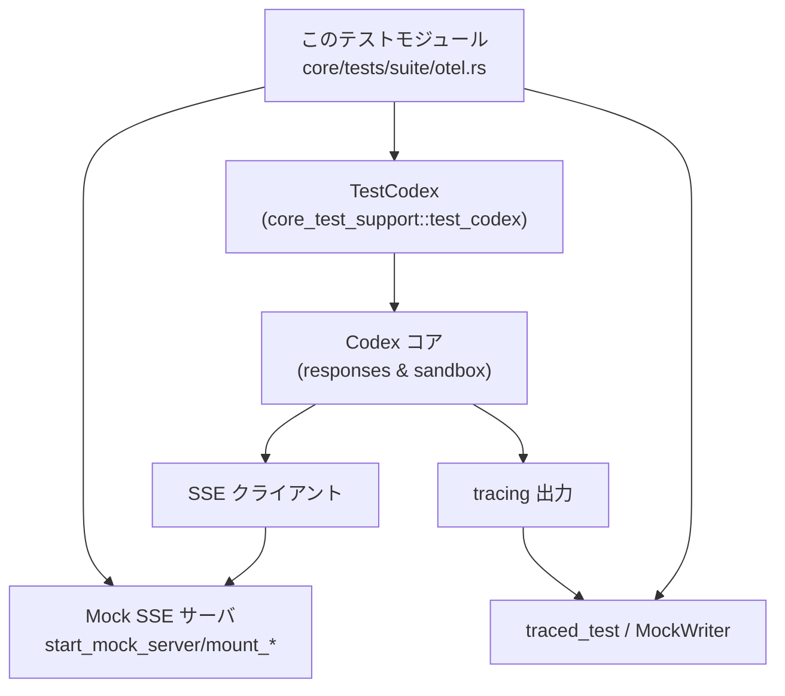
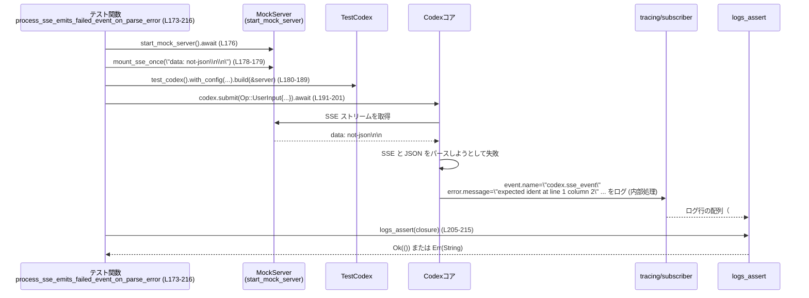
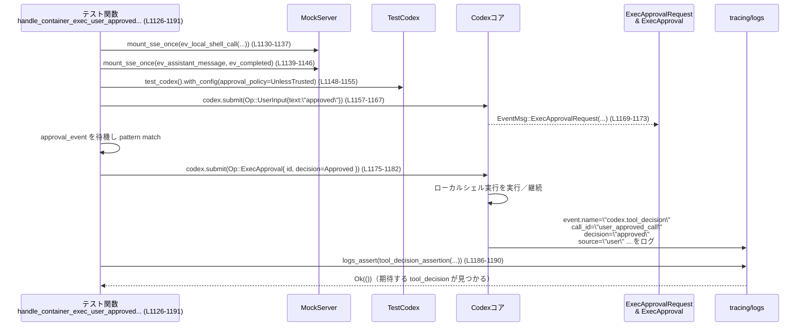

core/tests/suite/otel.rs

---

## 0. ざっくり一言

Codex コアが出力する OpenTelemetry/`tracing` ベースのテレメトリ（ログ／スパン）が、期待どおりに出ているかを検証する統合テスト群です。  
Responses API の SSE ストリーム処理、ツール実行（function/custom/local shell）と承認フローに対して、`codex.*` 系イベントや span フィールドが正しく記録されることを確認します。

---

## 1. このモジュールの役割

### 1.1 概要

このモジュールは **Codex コアのテレメトリ出力が OTEL 仕様・ドメイン仕様に沿っているか** を検証するために存在し、次のような機能をテストしています。

- Responses API 経由のリクエスト送信時に `codex.api_request` などのイベントが記録されること（`responses_api_emits_api_request_event` など、L94-132）。
- SSE ストリームの正常系・異常系（JSON パース失敗・`response.failed`・`response.completed` など）に対して `codex.sse_event` が適切なフィールドで記録されること（L134-555）。
- `handle_responses` / `record_responses` の span に `otel.name`, `from`, `tool_name` などのフィールドが設定されること（L557-730）。
- 各種ツール呼び出し（function/custom/local shell）に対して `codex.tool_result` が正しいフィールドで出力されること（L732-1035）。
- ローカルシェル実行と承認フローに対して `codex.tool_decision` が正しく記録されること（L1037-1527）。

### 1.2 アーキテクチャ内での位置づけ

このファイルはテスト専用で、主に以下のコンポーネントを接続します。

- `TestCodex`（テスト用 Codex クライアント）: `core_test_support::test_codex`（L26-27）。
- モック SSE サーバ: `start_mock_server`, `mount_sse_once`, `mount_response_once` など（L21-25）。
- Codex プロトコル型: `Op`, `EventMsg`, 各種 `AskForApproval` など（L3-7, L5）。
- トレース収集: `tracing_test::traced_test`, `logs_assert`, もしくは `tracing_subscriber`+`MockWriter` によるログバッファ（L31, L33-34, L557-567, L627-637）。
- 本ファイル内ヘルパー: `extract_log_field` / `assert_empty_mcp_tool_fields` / `tool_decision_assertion`（L36-72, L1037-1067）。

依存関係を簡略図にすると次のようになります。



### 1.3 設計上のポイント

コードから読み取れる特徴は次のとおりです。

- **責務の分離**  
  - ログ行の解析ロジックは `extract_log_field` / `assert_empty_mcp_tool_fields` に分離（L36-72）。
  - `codex.tool_decision` の検証ロジックは `tool_decision_assertion` に抽出され、複数テストで再利用（L1037-1067）。
- **状態管理**  
  - `traced_test` を使うテストはテスト毎にログをキャプチャし、`logs_assert` で参照（例: L117-123）。
  - `MockWriter` を使うテストは `Box::leak` した `Mutex<Vec<u8>>` にログを書き込み、あとで `String` に復元して検証（L557-567, L627-637, L613-619, L698-729）。
- **エラーハンドリングの方針**  
  - テスト対象（Codex コア）のエラーは `codex.sse_event` の `error.message` 等に現れることを期待し、テスト側ではそれをログから検出（例: L203-215, L487-497）。
  - テスト自身はコア API からの `Result` を `.unwrap()` し、失敗時はテストパニックとして扱う（例: L101-113, L190-201 等）。
- **非同期／並行性**  
  - すべての I/O テストは `#[tokio::test]` の async 関数で記述されています（例: L94-96, L557-558）。
  - 一部テストは `#[tokio::test(flavor = "current_thread")]` を指定し、シングルスレッドランタイムでの実行を前提にしています（L627-628）。

---

## 2. コンポーネント一覧（関数インベントリー）

このファイル内で定義されている関数（テスト含む）と、その位置・役割の一覧です。

| 名前 | 種別 | 役割 / 用途 | 定義位置 |
|------|------|-------------|----------|
| `extract_log_field` | ヘルパー関数 | テキストログ 1 行から `key=value` / `key="value"` 形式のフィールド値を抽出 | `core/tests/suite/otel.rs:L36-54` |
| `assert_empty_mcp_tool_fields` | ヘルパー関数 | ログ行に `mcp_server` / `mcp_server_origin` フィールドが存在し、かつ空文字であることを検証 | `L56-72` |
| `extract_log_field_handles_empty_bare_values` | 通常テスト | `extract_log_field` が `key=` のような空の bare value を正しく `""` と扱うことを確認 | `L74-82` |
| `extract_log_field_does_not_confuse_similar_keys` | 通常テスト | `mcp_server` と `mcp_server_origin` のような似たキーを誤認しないことを確認 | `L84-92` |
| `responses_api_emits_api_request_event` | tokio テスト | `Op::UserInput` 送信時に `codex.api_request` と `codex.conversation_starts` がログに出ることを検証 | `L94-132` |
| `process_sse_emits_tracing_for_output_item` | tokio テスト | `response.output_item.done` SSE に対し `codex.sse_event` がトレースされることを検証 | `L134-171` |
| `process_sse_emits_failed_event_on_parse_error` | tokio テスト | 壊れた SSE (`data: not-json`) で JSON パースエラーが `codex.sse_event` の `error.message` に記録されることを検証 | `L173-216` |
| `process_sse_records_failed_event_when_stream_closes_without_completed` | tokio テスト | `response.completed` が来る前に SSE が閉じた場合のエラー記録 (`stream closed before response.completed`) を検証 | `L218-261` |
| `process_sse_failed_event_records_response_error_message` | tokio テスト | `response.failed` イベントからエラーメッセージ `"boom"` がログに反映されることを検証 | `L263-327` |
| `process_sse_failed_event_logs_parse_error` | tokio テスト | `response.failed` の `error` フィールド型が不正な場合でも `event.kind=response.failed` が記録されることを検証 | `L329-387` |
| `process_sse_failed_event_logs_missing_error` | tokio テスト | `response.failed` に `error` がない場合でも `event.kind=response.failed` イベントが出ることを検証 | `L389-437` |
| `process_sse_failed_event_logs_response_completed_parse_error` | tokio テスト | `response.completed` のペイロードが不正な場合のパースエラーメッセージを `codex.sse_event` に記録することを検証 | `L439-498` |
| `process_sse_emits_completed_telemetry` | tokio テスト | `response.completed` の usage 情報から `input_token_count` などのトークン数フィールドがログされることを検証 | `L501-555` |
| `handle_responses_span_records_response_kind_and_tool_name` | tokio テスト | `handle_responses` span に `otel.name="function_call"` / `tool_name` / `from="output_item_done"` などが付与されることを検証 | `L557-625` |
| `record_responses_sets_span_fields_for_response_events` | tokio テスト | 一連の response イベントに対して `handle_responses{otel.name=...}` span と `from` / `tool_name` が期待どおり付くことを検証 | `L627-730` |
| `handle_response_item_records_tool_result_for_custom_tool_call` | tokio テスト | `custom_tool_call` SSE に対し `codex.tool_result` ログが `tool_name`, `arguments`, `success=false` などを含むことを検証 | `L732-807` |
| `handle_response_item_records_tool_result_for_function_call` | tokio テスト | `function_call` SSE に対する `codex.tool_result` のフィールド検証 | `L809-881` |
| `handle_response_item_records_tool_result_for_local_shell_missing_ids` | tokio テスト | `local_shell_call` の `call_id`/`id` 欠如時に `output=LocalShellCall without call_id or id` で失敗として記録されることを検証 | `L883-957` |
| `handle_response_item_records_tool_result_for_local_shell_call` | tokio テスト（macOS 限定） | 実際の `ev_local_shell_call` SSE に対する `codex.tool_result` のフィールド（`arguments` など）が埋まることを検証 | `L960-1035` |
| `tool_decision_assertion` | ヘルパー関数 | `codex.tool_decision` ログから `call_id`・`tool_name`・`decision`・`source` を検証するクロージャを生成 | `L1037-1067` |
| `handle_container_exec_autoapprove_from_config_records_tool_decision` | tokio テスト | 設定による自動承認（`SandboxPolicy::DangerFullAccess`）時の `tool_decision` イベントを検証 | `L1069-1124` |
| `handle_container_exec_user_approved_records_tool_decision` | tokio テスト | ユーザが 1 回限り承認 (`ReviewDecision::Approved`) した場合の `tool_decision` を検証 | `L1126-1191` |
| `handle_container_exec_user_approved_for_session_records_tool_decision` | tokio テスト | セッション全体承認 (`ApprovedForSession`) 時の `tool_decision` を検証 | `L1193-1258` |
| `handle_sandbox_error_user_approves_retry_records_tool_decision` | tokio テスト | sandbox エラー後のリトライをユーザが承認した場合の `tool_decision` 検証 | `L1260-1325` |
| `handle_container_exec_user_denies_records_tool_decision` | tokio テスト | ユーザが拒否 (`Denied`) した場合の `tool_decision` 検証 | `L1327-1391` |
| `handle_sandbox_error_user_approves_for_session_records_tool_decision` | tokio テスト | sandbox エラー後にセッション全体承認した場合の `tool_decision` 検証 | `L1393-1459` |
| `handle_sandbox_error_user_denies_records_tool_decision` | tokio テスト | sandbox エラー後にユーザが拒否した場合の `tool_decision` 検証 | `L1461-1527` |

---

## 3. 公開 API と詳細解説

このモジュール自体はライブラリ API を公開していませんが、テストで再利用されるヘルパー関数と代表的なテスト関数について詳しく説明します。

### 3.1 型一覧（本ファイル内で定義されないが重要な外部型）

本ファイルで頻出する外部型の役割です（型定義は他モジュールにあります）。

| 名前 | 種別 | 役割 / 用途 | 参照箇所例 |
|------|------|-------------|------------|
| `TestCodex` | 構造体 | モックサーバと連携したテスト用 Codex クライアント。`.build(&server)` で構築。 | `L101`, `L145`, `L190` など |
| `Op` | enum | Codex に送る操作。ここではユーザ入力 (`Op::UserInput`) や `Op::ExecApproval` を使用 | `L104-111`, `L1175-1180` など |
| `EventMsg` | enum | Codex からテスト側に送られるイベント。`TurnComplete`, `TokenCount`, `ExecApprovalRequest` などで待機条件に使用 | `L115`, `L781`, `L1169-1173` など |
| `Feature` | enum | Codex 機能フラグ。多くのテストで `GhostCommit` を無効化 | `L184`, `L229`, `L293` 他 |
| `AskForApproval` | enum | コマンド実行時の承認ポリシー | `L3`, `L990`, `L1097`, `L1150`, `L1217`, `L1284`, `L1351`, `L1418`, `L1486` |
| `SandboxPolicy` | enum | サンドボックス権限レベル。ここでは `DangerFullAccess` を使用 | `L1098-1099` |
| `UserInput` | enum/構造体 | ユーザ入力の表現。ここではテキスト入力のみ使用 | `L105-108`, `L148-152` 他 |

### 3.2 関数詳細（7 件）

#### 1. `extract_log_field(line: &str, key: &str) -> Option<String>`（L36-54）

**概要**

- 1 行のログ文字列から、指定キー `key` に対応する値を取り出すヘルパー関数です。
- `key="value"` のようなクォート付き形式と、`key=value` のような bare 形式の両方に対応します。

**引数**

| 引数名 | 型 | 説明 |
|--------|----|------|
| `line` | `&str` | ログ 1 行の全文 |
| `key`  | `&str` | 抽出したいフィールド名（例: `"mcp_server"`） |

**戻り値**

- `Some(String)`：該当キーが見つかり、その値を文字列として取得できたとき。
- `None`：該当キーが行中に存在しないとき。

**内部処理の流れ**

`core/tests/suite/otel.rs:L36-53` を根拠にしています。

1. `quoted_prefix = format!("{key}=\"")` を作り、`line.find(&quoted_prefix)` でクォート付き形式を探す（L37-39）。
2. 見つかった場合は、その直後から次の `"` までをスライスし、`String` に変換して返す（L39-42）。
3. 見つからなければ `bare_prefix = format!("{key}=")` を作り、`line.split_whitespace()` でトークン毎に走査（L45-47）。
4. 各トークンに対し末尾の `,` を落とし（L47）、`bare_prefix` で始まるか検査し、始まるなら残り部分をそのまま `String` にして返す（L48-50）。
5. いずれの形式も見つからなければ `None`（L53）。

**Examples（使用例）**

ログから MCP フィールドを抜き出す例です。

```rust
// ログ行の例
let line = r#"event.name="codex.tool_result" mcp_server=stdio"#;

// クォートなし bare value の取得
let value = extract_log_field(line, "mcp_server");
// value == Some("stdio".to_string())
```

**Errors / Panics**

- 関数内部では panic の可能性はありません。
- 文字列インデックスは `find` の結果をチェックしたうえで使用しています（L38-42）。

**Edge cases（エッジケース）**

テスト `extract_log_field_handles_empty_bare_values` / `extract_log_field_does_not_confuse_similar_keys`（L74-92）から分かる挙動:

- `mcp_server=` のように値が空の場合、`Some(String::new())` を返す（L76-81）。
- `mcp_server_origin=stdio` という行から `mcp_server` を探した場合は `None`（L86-90）。  
  → `strip_prefix("mcp_server=")` を使っているため、キーが完全一致しなければヒットしません。

**使用上の注意点**

- bare 形式の場合、値に空白文字が含まれると `split_whitespace()` で分断されるため、途中までしか取得できない、あるいは取得できない可能性があります。
- クォート付き形式の場合も、値中の `"` はサポートされていません（最初に現れる `"` までが値と見なされるため）。

---

#### 2. `assert_empty_mcp_tool_fields(line: &str) -> Result<(), String>`（L56-72）

**概要**

- `codex.tool_result` ログ行に含まれる `mcp_server` および `mcp_server_origin` フィールドが**存在し、かつ空文字**であることを検証するヘルパーです。

**引数**

| 引数名 | 型 | 説明 |
|--------|----|------|
| `line` | `&str` | ログ 1 行 |

**戻り値**

- `Ok(())`：両フィールドが存在し、どちらも空文字だった場合。
- `Err(String)`：フィールドが無かった／値が空でない場合。理由を含むエラーメッセージを返します。

**内部処理の流れ**

`core/tests/suite/otel.rs:L56-71` が根拠です。

1. `extract_log_field(line, "mcp_server")` で `mcp_server` を取得し、`None` の場合は `"missing mcp_server field"` の `Err`（L57-58）。
2. 取得した値が空でなければ `"expected empty mcp_server, got ..."` という `Err`（L59-60）。
3. `mcp_server_origin` についても同様に検証（L63-68）。
4. すべて条件を満たせば `Ok(())` を返す（L71）。

**Examples（使用例）**

```rust
let line = r#"event.name="codex.tool_result" mcp_server= mcp_server_origin="#;

assert_empty_mcp_tool_fields(line).expect("MCP fields must be empty");
```

**Errors / Panics**

- 呼び出し側から `?` で伝播させることを前提に `Result` を返しています（例: L803-804, L877-878, L954-955, L1031-1032）。
- panic は発生しません。

**Edge cases**

- ログ行にフィールドが全く存在しない場合 → `missing mcp_server field` / `missing mcp_server_origin field` という `Err`。
- 値が空でない場合 → それぞれ `expected empty ...` というエラーになります。

**使用上の注意点**

- この関数は **MCP 関連のフィールドが「存在するが空」であることを期待するテスト**専用です。将来 `codex.tool_result` に非空の MCP フィールドが追加される場合は、この関数を使うテストの更新が必要になります。

---

#### 3. `responses_api_emits_api_request_event`（L94-132）

**概要**

- Responses API を通じてシンプルなユーザ入力を送信したときに、`codex.api_request` と `codex.conversation_starts` の 2 種類のイベントがログに出ることを検証する async テストです。

**引数**

- テスト関数のため引数はありません。

**内部処理の流れ**

`core/tests/suite/otel.rs:L94-131` を根拠とします。

1. `start_mock_server().await` でモック SSE サーバを起動（L97）。
2. モックサーバに対して `mount_sse_once(&server, sse(vec![ev_completed("done")]))` を設定し、単一の `response.completed` イベントを返す SSE を構築（L99-100）。
3. `test_codex().build(&server).await.unwrap()` で `TestCodex` を構築し、`codex` ハンドルを取得（L101）。
4. `Op::UserInput`（テキスト `"hello"` のみ）を `codex.submit(...)` で送信し、結果を `.await.unwrap()`（L103-113）。
5. `wait_for_event(&codex, |ev| matches!(ev, EventMsg::TurnComplete(_)))` により対話完了を待機（L115）。
6. `logs_assert` を 2 回呼び、ログ行配列から
   - `"codex.api_request"` を含む行が存在すること（L117-123）
   - `"codex.conversation_starts"` を含む行が存在すること（L125-131）
   を確認。

**Examples（使用例）**

新しいイベント `codex.some_event` を検証したい場合も、このテストと同じ構造で `logs_assert` の条件を変えるだけで済みます。

```rust
logs_assert(|lines: &[&str]| {
    lines
        .iter()
        .find(|line| line.contains("codex.some_event"))
        .map(|_| Ok(()))
        .unwrap_or_else(|| Err("expected codex.some_event event".to_string()))
});
```

**Errors / Panics**

- `build(&server)` や `submit(...)` の失敗は `.unwrap()` によりテストパニックになります（L101, L112-113）。
- `logs_assert` 側は `Err(String)` を返すことでテストを失敗させますが、panic は発生させていません。

**Edge cases**

- SSE ストリームに `ev_completed` 以外のイベントを追加しても、このテストではログ条件が変わらない限り影響はありません。
- `logs_assert` は、ログが一切出なかった場合でもエラー文 `"expected codex.api_request event"` などを返します。

**使用上の注意点**

- `#[traced_test]`（L95）によって、テストのスコープ内で `tracing` のログが自動的にバッファリングされます。このテストパターンを利用する場合、**自前の subscriber を設定しない**ことが前提です。
- `wait_for_event` を呼ばずに `logs_assert` を実行すると、ログがまだ flush されておらずテストが不安定になる可能性があります。

---

#### 4. `process_sse_emits_failed_event_on_parse_error`（L173-216）

**概要**

- SSE ストリームのメッセージが JSON としてパースできない場合に、`codex.sse_event` のログにパースエラーメッセージ（ここでは `"expected ident at line 1 column 2"`）が記録されることを検証する async テストです。

**引数**

- なし（テスト関数）。

**内部処理の流れ**

`core/tests/suite/otel.rs:L173-215` を根拠とします。

1. モックサーバを起動（L176）。
2. `mount_sse_once(&server, "data: not-json\n\n".to_string())` で **生の SSE 文字列**を登録し、パース不能な JSON を返すように設定（L178-179）。
3. `test_codex().with_config(...)` で `Feature::GhostCommit` を無効化した設定を使用して Codex を構築（L180-189）。
4. ユーザ入力 `"hello"` を含む `Op::UserInput` を `codex.submit` し、完了を待機（L191-203）。
5. `logs_assert` でログ行から `codex.sse_event` かつ `error.message` かつ `"expected ident at line 1 column 2"` を含む行があることを確認（L205-215）。

**Errors / Panics**

- Codex 側の JSON パースエラーはテスト側では `.unwrap()` を通していないため、テストはパニックせずログにエラーが記録されることを期待しています。
- Codex の構築・submit が失敗した場合は `.unwrap()` でテストがパニックします（L189, L201-201）。

**Edge cases**

- エラーメッセージ文字列 `"expected ident at line 1 column 2"` に依存しているため、使用する JSON パーサやエラーメッセージ形式が変わるとテストが失敗します。
- SSE 文字列のフォーマット `"data: not-json\n\n"` を変更すると、Codex 側の SSE パーサの挙動にも影響する可能性があります。

**使用上の注意点**

- JSON パーサのエラーメッセージを直接検証しているため、ライブラリのバージョンアップに伴うメッセージ変更に弱いテストです。将来変更する場合は、`error.message` に特定のフレーズの有無だけをチェックするなど、依存度を下げる設計も考えられます。

---

#### 5. `process_sse_emits_completed_telemetry`（L501-555）

**概要**

- SSE ストリームに `response.completed` イベントが含まれている場合に、usage 情報（トークン数等）が `codex.sse_event` ログに `input_token_count` などのフィールドとして記録されることを検証するテストです。

**引数**

- なし（テスト関数）。

**内部処理の流れ**

`core/tests/suite/otel.rs:L501-555` を根拠とします。

1. モックサーバを起動（L504）。
2. `mount_sse_once` で `type: "response.completed"` を含む JSON を SSE として登録。その中に `usage` オブジェクト（`input_tokens`, `output_tokens`, `total_tokens`, および詳細フィールド）を含める（L506-521）。
3. `TestCodex` をデフォルト設定で構築（L524）。
4. ユーザ入力 `"hello"` を送信し、`TurnComplete` を待つ（L526-538）。
5. `logs_assert` で、`codex.sse_event` かつ `event.kind=response.completed` を含み、さらに次のフィールドが含まれるログ行を探す（L540-551）。
   - `input_token_count=3`
   - `output_token_count=5`
   - `cached_token_count=1`
   - `reasoning_token_count=2`
   - `tool_token_count=9`

**Errors / Panics**

- usage 情報からこれらのフィールドを **必ず計算・記録すること**がテストの前提です。もし実装が一部フィールドのみ記録するように変わると、テストは `"missing response.completed telemetry"` で失敗します。

**Edge cases**

- `usage` の各値が 0 の場合の挙動については、このファイルのテストからは読み取れません（すべて正の値のケースのみ検証）。
- `tool_token_count=9` という値は `total_tokens` に対応しているように見えますが、コードから直接断定はできません（テキストマッチのみ）。

**使用上の注意点**

- トークン数フィールド名はログフォーマットの一部であり、名前を変えると OTEL/ダッシュボードとの互換性に影響する可能性があるため、実装変更時はこのテストを更新する必要があります。

---

#### 6. `handle_responses_span_records_response_kind_and_tool_name`（L557-625）

**概要**

- `handle_responses` という span がさまざまな response イベント種別に対して立ち上がる際、`otel.name` / `tool_name` / `from` などの span フィールドが正しく設定されているかを、`tracing_subscriber` と `MockWriter` を使って直接検証するテストです。

**引数**

- なし（テスト関数）。

**内部処理の流れ**

`core/tests/suite/otel.rs:L557-625` を根拠とします。

1. ヒープ上に `Mutex<Vec<u8>>` を確保し、`Box::leak` で `'static` 参照に変換（L559）。  
   → `MockWriter::new(buffer)` に `'static` ライフタイムが必要なため。
2. `tracing_subscriber::fmt()` で subscriber を構築し、レベル出力有効／ANSI 無効／`Level::TRACE`／span イベント FULL／writer に `MockWriter` を設定（L560-566）。
3. `tracing::subscriber::set_default(subscriber)` でこのテストのスレッド／タスク内でのデフォルト subscriber を設定（L567）。
4. モックサーバを起動し、2 つの SSE シーケンスを登録（L569-586）。
   - 1 つ目: `function_call` → `completed`（L573-576）。
   - 2 つ目: `assistant message` → `completed`（L581-584）。
5. `TestCodex` を構築し、ユーザ入力 `"hello"` を送信、`TurnComplete` まで待機（L588-611）。
6. `buffer` の中身を `String` に変換し（L613）、以下を `assert!` で検証（L615-624）。
   - `"handle_responses{otel.name=\"function_call\""` が含まれる。
   - `tool_name="nonexistent"` が含まれる。
   - `from="output_item_done"` が含まれる。
   - `"handle_responses{otel.name=\"completed\""` が含まれる。

**Errors / Panics**

- 検証はすべて `assert!` マクロで行われているため、条件を満たさない場合は panic します（L615-623）。

**Edge cases**

- ログ出力のフォーマット `"handle_responses{otel.name=\"...\""` に強く依存しています。`tracing_subscriber` のフォーマット設定を変えた場合、このテストも更新が必要になります。
- `'static` な `Mutex<Vec<u8>>` を `Box::leak` で確保しているため、テスト終了後もメモリは解放されませんが、テストプロセス終了とともに OS によって回収される前提です。

**使用上の注意点**

- このパターンを他のテストに流用する場合、**グローバル subscriber を複数のテストで同時に設定しない**ように注意が必要です。`set_default` はスレッド／タスクローカルですが、`Box::leak` したバッファはプロセス内で共有されるため、並列実行時にログが混ざる可能性があります。

---

#### 7. `tool_decision_assertion<'a>(...) -> impl Fn(&[&str]) -> Result<(), String> + 'a`（L1037-1067）

**概要**

- `codex.tool_decision` ログ行の検証パターンを再利用可能なクロージャとして抽象化するヘルパー関数です。
- 呼び出し時に `call_id`, 期待する `decision`, `source` を指定すると、それらをチェックするクロージャを返し、`logs_assert` に渡して使用します。

**引数**

| 引数名 | 型 | 説明 |
|--------|----|------|
| `call_id` | `&'a str` | 期待する `call_id` 値 |
| `expected_decision` | `&'a str` | 期待する `decision`（例: `"approved"`, `"denied"`, `"approvedforsession"`） |
| `expected_source` | `&'a str` | 期待する `source`（例: `"config"`, `"user"`） |

**戻り値**

- クロージャ: `Fn(&[&str]) -> Result<(), String>`  
  `logs_assert` に渡すことを意図したものです。ログ行配列を受け取り、期待する行が見つかれば `Ok(())`、そうでなければ `Err(String)` を返します。

**内部処理の流れ**

`core/tests/suite/otel.rs:L1037-1066` に基づきます。

1. 引数で受け取った `call_id`, `expected_decision`, `expected_source` を `String` にコピーし、クロージャ内で move キャプチャ（L1042-1044）。
2. 返されるクロージャは `lines: &[&str]` を受け取る（L1046）。
3. `.iter().find(...)` で次の条件を満たす行を探す（L1047-1052）。
   - `"codex.tool_decision"` を含む。
   - `format!("call_id={call_id}")` を含む。
4. 見つからなければ `"missing codex.tool_decision event for {call_id}"` の `Err`（L1052）。
5. 見つかった行を小文字化し（L1054）、以下を検証（L1055-1062）。
   - `"tool_name=local_shell"` を含む。
   - `"decision={expected_decision}"` を含む。
   - `"source={expected_source}" を含む。`
6. すべて満たせば `Ok(())`（L1065）。

**Examples（使用例）**

`handle_container_exec_user_denies_records_tool_decision` での使用例（L1387-1391）:

```rust
logs_assert(tool_decision_assertion(
    "user_denied_call", // call_id
    "denied",           // decision
    "user",             // source
));
```

**Errors / Panics**

- 見つからない／フィールドが期待値と異なる場合は `Err(String)` を返し、`logs_assert` を通じてテスト失敗になります。
- panic は発生しません。

**Edge cases**

- ログ行をすべて小文字化して検証しているため（L1054）、`decision` や `source` の大文字小文字差は無視されます。ただし、`call_id` の探索は元の大小文字に依存します。
- この関数は `tool_name=local_shell` を固定で要求しているため、将来他ツールの `tool_decision` を検証したい場合は新しいヘルパーが必要になります。

**使用上の注意点**

- クロージャが `'a` ライフタイムを持つのは、内部で `String` にコピーしているためであり、呼び出し元のライフタイムに制約されません。通常のテスト内での使用に問題はありません。
- ログフォーマットに依存するハードコードされたエラーメッセージ（`missing tool_name for local_shell` など）を返すため、ログ仕様を変える際は本ヘルパーを合わせてメンテナンスする必要があります。

---

### 3.3 その他の関数（概要）

上記以外のテスト関数は、基本的に次の 4 パターンに分類されます。

| 関数群 | 役割（1 行概要） |
|--------|------------------|
| `process_sse_*` 系（L134-437, L439-498） | Responses API の SSE ストリームから発生する各種イベント・エラーが `codex.sse_event` として正しくロギングされることを検証 |
| `record_responses_sets_span_fields_for_response_events`（L627-730） | 1 つのレスポンス内で起きる複数のイベントに対し、`handle_responses` span 上のメタデータが適切に変化していることを検証 |
| `handle_response_item_records_tool_result_*` 系（L732-1035） | function/custom/local_shell など各ツール呼び出しに対して `codex.tool_result` イベントが正しいフィールドで記録されることを検証 |
| `handle_*tool_decision*` 系（L1069-1527） | local shell 実行に対する自動承認／ユーザ承認／拒否などのパターンごとに `codex.tool_decision` イベントの内容を検証 |

---

## 4. データフロー

### 4.1 Responses API + SSE パースエラーのフロー

`process_sse_emits_failed_event_on_parse_error`（L173-216）を例に、データの流れを示します。



ポイント:

- Codex コア内部で発生した JSON パースエラーは、直接エラーとして返されるのではなく、`codex.sse_event` のログに `error.message` として反映されます。
- テスト側は `wait_for_event` で処理完了を確実に待ってからログを検証しています（L203）。

### 4.2 ローカルシェル承認フローと `tool_decision`

`handle_container_exec_user_approved_records_tool_decision`（L1126-1191）を例にします。



ポイント:

- ローカルシェル実行は SSE で宣言されますが、実行の可否は別途 `ExecApprovalRequest` → `ExecApproval` の往復で制御されます（L1169-1182）。
- 承認結果（config 由来か user 由来か）は `codex.tool_decision` の `source` フィールドとしてトレーシングされ、テストで検証されます（L1058-1062, L1186-1190）。

---

## 5. 使い方（How to Use）

このファイルはテストですが、**新しいテレメトリのテストを追加する際のパターン**として有用です。

### 5.1 基本的な使用方法（テレメトリ検証テストの書き方）

もっとも単純なパターンは `#[tokio::test] + #[traced_test]` を使うものです。

```rust
#[tokio::test]
#[traced_test] // このマクロが tracing ログをバッファして logs_assert を使えるようにする
async fn my_new_telemetry_test() {
    let server = start_mock_server().await;                          // モック SSE サーバ起動

    mount_sse_once(&server, sse(vec![ev_completed("done")])).await;  // SSE 応答の登録

    let TestCodex { codex, .. } = test_codex()
        .build(&server)                                              // Codex クライアント作成
        .await
        .unwrap();

    codex
        .submit(Op::UserInput {
            items: vec![UserInput::Text {
                text: "hello".into(),
                text_elements: Vec::new(),
            }],
            final_output_json_schema: None,
            responsesapi_client_metadata: None,
        })
        .await
        .unwrap();                                                   // API 呼び出し（失敗ならテスト失敗）

    wait_for_event(&codex, |ev| matches!(ev, EventMsg::TurnComplete(_))).await; // 完了待ち

    // ログ検証
    logs_assert(|lines: &[&str]| {
        lines
            .iter()
            .find(|line| line.contains("codex.my_new_event"))        // 狙いのイベントを含む行を探す
            .map(|_| Ok(()))
            .unwrap_or_else(|| Err("expected codex.my_new_event".to_string()))
    });
}
```

### 5.2 よくある使用パターン

- **SSE エラー検証**（`process_sse_*` 系）
  - `mount_sse_once` に不正な JSON / 不完全な `response.completed` などを登録し、`codex.sse_event` の `error.message` を検証。
- **span フィールド検証**（`handle_responses_span_records_response_kind_and_tool_name` / `record_responses_sets_span_fields_for_response_events`）
  - `tracing_subscriber::fmt()` + `MockWriter` + `Box::leak` + `Mutex<Vec<u8>>` の組み合わせでログ文字列を直接検査。
- **ツール結果検証**（`handle_response_item_records_tool_result_*`）
  - SSE に `ev_function_call`, `ev_custom_tool_call`, `ev_local_shell_call` を含め、`codex.tool_result` に `tool_name`, `arguments`, `output`, `success` などが出ているかを確認。
- **承認フロー検証**（`handle_*tool_decision*`）
  - `ExecApprovalRequest` イベントを待ち受けてから `Op::ExecApproval` を送信し、その結果 `codex.tool_decision` の `decision` / `source` が期待どおりかを `tool_decision_assertion` で検証。

### 5.3 よくある間違いと注意点

コードから推測できる典型的な落とし穴です。

```rust
// 間違い例: イベント完了前にログを検査してしまう
codex.submit(...).await.unwrap();
logs_assert(|lines| { /* ... */ }); // ← まだログが出揃っていない可能性

// 正しい例: 対応する EventMsg を待ってからログを検査
codex.submit(...).await.unwrap();
wait_for_event(&codex, |ev| matches!(ev, EventMsg::TurnComplete(_))).await;
logs_assert(|lines| { /* ... */ });
```

- **GhostCommit 機能フラグを無効化し忘れる**  
  - 多くのテストで `Feature::GhostCommit` を `disable` しているのは、テスト中の挙動を安定させるためです（例: L181-186, L226-231 等）。同様の環境前提がある場合は、`with_config` 内で必要なフラグを調整する必要があります。
- **承認フローのイベント順を誤る**  
  - `ExecApprovalRequest` を受信する前に `Op::ExecApproval` を送ると意図した挙動になりません。
  - テストでは必ず `wait_for_event` で `ExecApprovalRequest` を取得し、その `approval.effective_approval_id()` を使って `ExecApproval` を送っています（L1169-1180, L1236-1247 など）。

### 5.4 使用上の注意点（まとめ）

- `MockWriter` + `Box::leak` + `Mutex<Vec<u8>>` を使うテスト（L557-625, L627-730）は、**プロセス内で共有される静的バッファ**にログを書き込みます。並列実行するテストが増える場合は、ログの混在を避ける構成に注意が必要です。
- ログ検証は多くの場合 `String::contains` ベースで行われており、フォーマット変更に弱いです。ログ出力仕様を変えるときは、このテスト群を合わせて更新する必要があります。
- エラー文言（JSON パーサのメッセージなど、L210-212）は外部ライブラリに依存している可能性があるため、ライブラリアップデート時はテストの見直しが必要です。

---

## 6. 変更の仕方（How to Modify）

### 6.1 新しいテレメトリ機能を追加する場合

1. **対象となるコードパスを特定**  
   - Responses API の SSE 処理であれば `process_sse_*` テストを参考に、ツール呼び出しであれば `handle_response_item_*` や `handle_*tool_decision*` を参考にします。
2. **モック SSE シーケンスの定義**  
   - `core_test_support::responses::{sse, ev_*}` の既存ヘルパーを使う、あるいは新しいヘルパーを追加して、目的のイベントを含んだ SSE を構成します。
3. **テスト関数を追加**  
   - `#[tokio::test]`（必要なら `#[traced_test]`）を付けた関数を作成し、`test_codex().with_config(...)` で必要な設定を反映します。
4. **イベントの完了条件を決めて待つ**  
   - `EventMsg::TurnComplete`, `EventMsg::TokenCount`, `EventMsg::ExecApprovalRequest` など、フローに応じた `wait_for_event` 条件を選びます。
5. **ログ検証ロジックを追加**  
   - シンプルなケースは `logs_assert` + クロージャ。
   - span フィールドを細かく見る場合は `MockWriter` + `tracing_subscriber::fmt()` パターンを流用します。

### 6.2 既存の機能を変更する場合

- **ログフォーマットを変更する場合**
  - `handle_responses` / `record_responses` / `tool_result` / `tool_decision` のログフィールド名を変更すると、対応するテストの `line.contains(...)` 条件が失敗します。
  - 例: `tool_token_count` のフィールド名を変更するなら、`process_sse_emits_completed_telemetry`（L540-551）も合わせて修正が必要です。
- **承認フローの挙動を変更する場合**
  - `ExecApprovalRequest` と `ExecApproval` のやり取りが変わると、`handle_*tool_decision*` 系のテストのイベント待ち条件や `tool_decision_assertion` の期待値を見直す必要があります。
- **テレメトリが出力されないケースを追加する場合**
  - 例えば、ある条件下では `codex.tool_result` を出さないようにするなどの変更では、「全てのケースでログが出る」という前提のテストが失敗する可能性があります。仕様としてどうあるべきかを先に整理したうえで、テスト範囲を調整する必要があります。

---

## 7. 関連ファイル

このテストモジュールと密接に関係するモジュール・クレートです（パスは use 文から推測できる範囲です）。

| パス / クレート | 役割 / 関係 |
|-----------------|-------------|
| `core_test_support::test_codex` | `TestCodex` 型と `test_codex()` ビルダーを提供し、Codex コアとモック SSE サーバを接続するテストハーネスを構成します（L26-27, L101 など）。 |
| `core_test_support::responses` | `start_mock_server`, `mount_sse_once`, `mount_response_once`, `sse`, `sse_response`, 各種 `ev_*` ヘルパーを提供し、SSE レスポンスの構築を簡略化します（L9-25, L139-143 他）。 |
| `core_test_support::wait_for_event` | `EventMsg` ストリームから条件に合うイベントが現れるまで待機するユーティリティです（L115, L248, L781, L1169 など）。 |
| `codex_protocol::protocol::{Op, EventMsg, AskForApproval, ReviewDecision, SandboxPolicy}` | Codex の API 操作・イベント・承認ポリシー・レビュー決定など、ドメインレベルの型を提供します（L3-7）。 |
| `codex_protocol::user_input::UserInput` | ユーザ入力の型。ここではテキスト入力のみが使用されています（L8, L105-108 他）。 |
| `codex_core::config::Constrained` | 許可ポリシーをラップする設定ユーティリティ。承認ポリシーやサンドボックスポリシーの設定に使用されています（L1, L989-990, L1097-1099 他）。 |
| `tracing_test` / `tracing_subscriber` | テスト向けのトレースキャプチャ (`#[traced_test]`, `logs_assert`, `MockWriter`) と、FMT 出力の subscriber 設定を提供します（L31, L33-34, L557-567, L627-637）。 |

このファイルはテスト専用ですが、Codex コアのテレメトリ仕様を理解するうえでの「実行例」としても有用な資料になっています。
