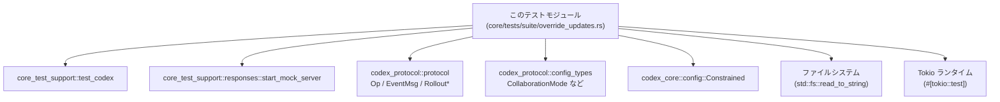
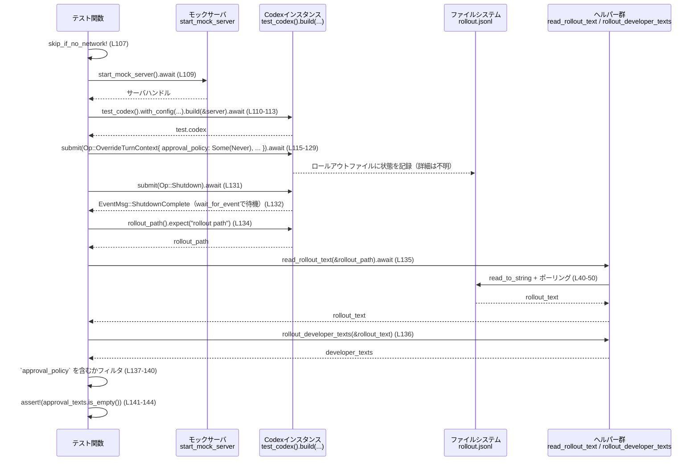

# core/tests/suite/override_updates.rs コード解説

## 0. ざっくり一言

`OverrideTurnContext` という操作を行ったときに、「新しいユーザーターンが始まる前にはロールアウトログに状態更新が記録されないこと」を検証する非公開テスト群です。  
権限（permissions）、作業ディレクトリ（environment）、コラボレーション設定（collaboration）の 3 種類の更新がログに出ないことを、ロールアウトファイルの内容を解析して確認しています。（根拠: `core/tests/suite/override_updates.rs:L105-225`）

---

## 1. このモジュールの役割

### 1.1 概要

このテストモジュールは次の問題を扱います。

> 「`Op::OverrideTurnContext` を実行しただけの状態で、Codex のロールアウトログにどのような情報が記録されるべきか？」

具体的には、ユーザーの新しいターンが始まる前に:

- 権限ポリシー（`approval_policy`）の更新が記録されないこと  
  （根拠: `core/tests/suite/override_updates.rs:L105-147`）
- 作業ディレクトリなどの環境情報が記録されないこと  
  （根拠: `core/tests/suite/override_updates.rs:L149-185`）
- コラボレーションモード（コラボレーション用の開発者インストラクション）が記録されないこと  
  （根拠: `core/tests/suite/override_updates.rs:L187-225`）

をロールアウトファイルの JSONL テキストを読み出して検証します。

### 1.2 アーキテクチャ内での位置づけ

このファイルは **テストコード** であり、本体ロジック（Codex コア）に対してブラックボックス的に振る舞いを検証します。

主な依存関係:

- Codex プロトコル・設定型:
  - `Op::OverrideTurnContext`, `EventMsg`, `RolloutLine`, `RolloutItem`, `ResponseItem`, `ContentItem` 等  
    （根拠: `core/tests/suite/override_updates.rs:L3-15, L64-65, L89-90`）
- Codex コア設定:
  - `Constrained`, `AskForApproval`, `CollaborationMode`, `ModeKind`, `Settings` 等  
    （根拠: `core/tests/suite/override_updates.rs:L2-3, L11-13, L25-33`）
- テストサポート:
  - `start_mock_server`, `test_codex`, `wait_for_event`, `skip_if_no_network`  
    （根拠: `core/tests/suite/override_updates.rs:L16-19, L105-107`）
- 非同期ランタイム:
  - `#[tokio::test(flavor = "multi_thread", worker_threads = 2)]`  
    （根拠: `core/tests/suite/override_updates.rs:L105, L149, L187`）
- 標準ライブラリ:
  - ファイル I/O (`std::fs::read_to_string`)、パス (`std::path::Path`)、時間 (`std::time::Duration`)  
    （根拠: `core/tests/suite/override_updates.rs:L21-22, L41-50, L85-87`）

依存関係のイメージ:



※ Codex 本体の内部実装（`test_codex().build(&server)` の中身など）は、このチャンクには現れません。

### 1.3 設計上のポイント

コードから読み取れる設計上の特徴を列挙します。

- **ブラックボックス検証**  
  - Codex の内部状態には直接アクセスせず、ロールアウトファイル（JSONL 形式と思われる）を解析して期待する行が存在しないことを確認しています。  
    （根拠: `core/tests/suite/override_updates.rs:L134-140, L176-182, L215-223`）
- **非同期・ポーリングによるファイル読み出し**  
  - `read_rollout_text` でファイルが生成・書き込み完了するまで最大 50 回（1 回 20ms）ポーリングし、空でない内容を待ちます。  
    （根拠: `core/tests/suite/override_updates.rs:L40-50`）
- **ロールアウトログの用途別パーサ**  
  - 開発者メッセージからテキストを抽出する `rollout_developer_texts` と、ユーザーメッセージ中の環境コンテキストを抽出する `rollout_environment_texts` を分けて実装しています。  
    （根拠: `core/tests/suite/override_updates.rs:L53-76, L78-103`）
- **テストの前提条件としてのネットワーク有無**  
  - `skip_if_no_network!` マクロでネットワークが利用可能でない場合の扱いを制御していると推測されますが、詳細はこのチャンクには現れません。  
    （呼び出しの根拠: `core/tests/suite/override_updates.rs:L107, L151, L189`）
- **マルチスレッド非同期テスト**  
  - `#[tokio::test(flavor = "multi_thread", worker_threads = 2)]` により、Tokio のマルチスレッドランタイムでテストを動かしています。  
    （根拠: `core/tests/suite/override_updates.rs:L105, L149, L187`）

---

## 2. 主要な機能一覧（＋コンポーネントインベントリー）

### 2.1 機能一覧（箇条書き）

- コラボレーションモード設定の簡易生成 (`collab_mode_with_instructions`)  
  （根拠: `core/tests/suite/override_updates.rs:L25-33`）
- コラボレーションモード用 XML ラッパ文字列の生成 (`collab_xml`)  
  （根拠: `core/tests/suite/override_updates.rs:L36-37`）
- ロールアウトファイルの内容を非同期に読み出す (`read_rollout_text`)  
  （根拠: `core/tests/suite/override_updates.rs:L40-50`）
- ロールアウトログから「developer ロール」のテキストを抽出 (`rollout_developer_texts`)  
  （根拠: `core/tests/suite/override_updates.rs:L53-76`）
- ロールアウトログから環境コンテキスト（environment context）テキストを抽出 (`rollout_environment_texts`)  
  （根拠: `core/tests/suite/override_updates.rs:L78-103`）
- `OverrideTurnContext` が権限更新をログに残さないことの検証テスト  
  （根拠: `core/tests/suite/override_updates.rs:L105-147`）
- `OverrideTurnContext` が環境更新をログに残さないことの検証テスト  
  （根拠: `core/tests/suite/override_updates.rs:L149-185`）
- `OverrideTurnContext` がコラボレーション更新をログに残さないことの検証テスト  
  （根拠: `core/tests/suite/override_updates.rs:L187-225`）

### 2.2 関数・コンポーネントインベントリー

| 名称 | 種別 | 役割 / 用途 | 定義位置 |
|------|------|-------------|----------|
| `collab_mode_with_instructions` | ヘルパー関数 | 指定した developer インストラクション付きの `CollaborationMode` を生成する | `core/tests/suite/override_updates.rs:L25-34` |
| `collab_xml` | ヘルパー関数 | コラボレーションモード用のテキストをタグで囲んだ文字列を生成する | `core/tests/suite/override_updates.rs:L36-38` |
| `read_rollout_text` | 非同期ヘルパー関数 | ロールアウトファイルをポーリングし、空でない内容を読み込む | `core/tests/suite/override_updates.rs:L40-50` |
| `rollout_developer_texts` | ヘルパー関数 | ロールアウトログ内の developer メッセージからテキストを抽出する | `core/tests/suite/override_updates.rs:L53-76` |
| `rollout_environment_texts` | ヘルパー関数 | ロールアウトログ内の environment context テキストを抽出する | `core/tests/suite/override_updates.rs:L78-103` |
| `override_turn_context_without_user_turn_does_not_record_permissions_update` | 非同期テスト | 権限ポリシー更新が新規ユーザーターン前にログに出ないことを検証 | `core/tests/suite/override_updates.rs:L105-147` |
| `override_turn_context_without_user_turn_does_not_record_environment_update` | 非同期テスト | 作業ディレクトリ変更などの環境更新がログに出ないことを検証 | `core/tests/suite/override_updates.rs:L149-185` |
| `override_turn_context_without_user_turn_does_not_record_collaboration_update` | 非同期テスト | コラボレーションモード更新がログに出ないことを検証 | `core/tests/suite/override_updates.rs:L187-225` |

---

## 3. 公開 API と詳細解説

このファイルはテストモジュールであり、「公開 API」としてエクスポートされる要素はありません（すべて非公開関数とテスト関数です）。

### 3.1 型一覧（このファイル内で定義される型）

このファイル内で新しく定義される構造体・列挙体などはありません。

#### 参考: 主な外部型（利用のみ）

| 名前 | 種別 | 役割 / 用途 | 使用位置 |
|------|------|-------------|----------|
| `CollaborationMode` | 構造体 | コラボレーションモード設定。`collab_mode_with_instructions` で構築 | `L11, L25-33` |
| `ModeKind` | 列挙体 | コラボレーションモードの種別。ここでは `Default` を使用 | `L12, L27` |
| `Settings` | 構造体 | モデル名や developer インストラクションなどを含む設定 | `L13, L28-32` |
| `RolloutLine` | 構造体（推測: ログ 1 行） | ロールアウトログの 1 行を表し、`item` フィールドに内容を持つ | `L9, L60, L85` |
| `RolloutItem` | 列挙体 | ロールアウトログのアイテム種別。ここでは `ResponseItem` を利用 | `L8, L64, L89` |
| `ResponseItem` | 列挙体 | モデルからの応答。ここでは `Message { role, content, .. }` をパターンマッチ | `L15, L64, L89` |
| `ContentItem` | 列挙体 | メッセージのコンテンツ。ここでは `InputText { text }` を抽出 | `L14, L69, L94` |

※ 各型の内部構造の詳細は、このチャンクには現れません。

---

### 3.2 関数詳細（重要 7 件）

#### `collab_mode_with_instructions(instructions: Option<&str>) -> CollaborationMode`

**概要**

標準的な `CollaborationMode` 設定を生成し、`developer_instructions` のみ引数で上書きするヘルパーです。テストで特定のコラボレーションインストラクションを設定するために使われます。（根拠: `core/tests/suite/override_updates.rs:L25-33`）

**引数**

| 引数名 | 型 | 説明 |
|--------|----|------|
| `instructions` | `Option<&str>` | developer インストラクションとして埋め込みたい文字列。`None` の場合はインストラクション無し |

**戻り値**

- `CollaborationMode`  
  - `mode` は `ModeKind::Default` に固定  
  - `settings.model` は `"gpt-5.1"` に固定  
  - `settings.developer_instructions` に `instructions` を `Option<String>` として格納  
  （根拠: `core/tests/suite/override_updates.rs:L27-32`）

**内部処理の流れ**

1. `CollaborationMode` 構造体リテラルを生成する。（`mode: ModeKind::Default`）  
2. 内部の `Settings` 構造体を生成し、`model` に `"gpt-5.1".to_string()` をセット。  
3. `reasoning_effort` を `None` に設定。  
4. `developer_instructions` に `instructions.map(str::to_string)` を代入し、`Some(&str)` のときだけ `String` に変換して設定する。  

**Examples（使用例）**

```rust
// 開発者インストラクション付きの CollaborationMode を作る
let collab_text = "override collaboration instructions";
let mode = collab_mode_with_instructions(Some(collab_text)); // 所有権を移動せず &str だけ渡す

// テストで OverrideTurnContext に渡す
test.codex
    .submit(Op::OverrideTurnContext {
        cwd: None,
        approval_policy: None,
        approvals_reviewer: None,
        sandbox_policy: None,
        windows_sandbox_level: None,
        model: None,
        effort: None,
        summary: None,
        service_tier: None,
        collaboration_mode: Some(mode), // ここに設定
        personality: None,
    })
    .await?;
```

（根拠: `core/tests/suite/override_updates.rs:L193-208`）

**Errors / Panics**

- この関数自体は `Result` を返さず、`panic` を発生させるコードも含んでいません。型構築のみです。

**Edge cases（エッジケース）**

- `instructions == None` の場合  
  - `developer_instructions` は `None` になり、インストラクション無しの `CollaborationMode` が返されます。  
    （`map` の動作より: `Option::None.map(...) == None`）  

**使用上の注意点**

- モデル名 `"gpt-5.1"` はこのテスト用に固定されています。別のモデルで検証したい場合は、この関数を変更する必要があります。
- 他の `Settings` フィールド（`reasoning_effort` など）はすべて `None` 固定です。

---

#### `read_rollout_text(path: &Path) -> anyhow::Result<String>`

**概要**

ロールアウトファイルの内容を非同期に読み出す関数です。ファイルが存在し、かつ内容が空でない状態になるまでポーリングし、それでも空の場合は最後に一度だけ素直に読み込みを行います。（根拠: `core/tests/suite/override_updates.rs:L40-50`）

**引数**

| 引数名 | 型 | 説明 |
|--------|----|------|
| `path` | `&Path` | 読み込むロールアウトファイルのパス |

**戻り値**

- `anyhow::Result<String>`  
  - 成功時: ファイル内容を `String` として返す  
  - 失敗時: ファイル読み込みエラーなどを `anyhow::Error` として返す  

**内部処理の流れ**

1. `for _ in 0..50` で最大 50 回ループする。（根拠: `core/tests/suite/override_updates.rs:L41`）
2. 各ループで:
   - `path.exists()` でファイルの存在を確認。  
   - `std::fs::read_to_string(path)` を試みる。  
   - 読み込めて、かつ `text.trim().is_empty()` が `false`（トリム後に空でない）なら、その文字列を `Ok(text)` で即座に返す。  
     （根拠: `core/tests/suite/override_updates.rs:L42-47`）
3. 条件を満たさない場合は `tokio::time::sleep(Duration::from_millis(20)).await` で 20ms 待機。  
   （根拠: `core/tests/suite/override_updates.rs:L48`）
4. 50 回試しても条件を満たさない場合、最後に `std::fs::read_to_string(path)?` を実行し、その結果を `Ok(...)` で返す。  
   （根拠: `core/tests/suite/override_updates.rs:L50`）

**Examples（使用例）**

```rust
// ロールアウトファイルのパスを取得
let rollout_path = test.codex.rollout_path().expect("rollout path");
// 非同期にテキストを読み取る
let rollout_text = read_rollout_text(&rollout_path).await?;
```

（根拠: `core/tests/suite/override_updates.rs:L134-135, L176-177, L215-216`）

**Errors / Panics**

- `std::fs::read_to_string(path)?` でエラーが起きると `Err(anyhow::Error)` が返ります。
  - 例: ファイルが存在しない、アクセス権限がないなど。
- `panic!` を直接呼んでいる箇所はありません。

**Edge cases（エッジケース）**

- ファイルが 20ms × 50 = 約 1 秒以内に生成されなかった場合  
  - ループを抜け、最後の `read_to_string` を 1 回だけ実行します。
- ファイルが存在するが常に空文字（または空白のみ）の場合  
  - ループ中は `!text.trim().is_empty()` を満たさず、最終的に空の内容をそのまま返します。
- ファイルが途中で削除された／アクセス不能になった場合  
  - 最後の `read_to_string(path)?` でエラーとなり、`Err` が返ります。

**使用上の注意点**

- ポーリング処理は非同期（`tokio::time::sleep`）のため、スレッドをブロックしませんが、最大 1 秒分の待機が入ることに注意が必要です。
- 本ファイルではテスト内でしか使用されていないため、実運用でこの関数を利用する場合は待機回数やインターバルの調整が必要になる可能性があります。

---

#### `rollout_developer_texts(text: &str) -> Vec<String>`

**概要**

ロールアウトログ全体のテキスト（複数行）から、developer ロールのメッセージに含まれる `InputText` コンテンツのみを抽出し、`Vec<String>` として返すヘルパーです。（根拠: `core/tests/suite/override_updates.rs:L53-76`）

**引数**

| 引数名 | 型 | 説明 |
|--------|----|------|
| `text` | `&str` | ロールアウトファイルの全内容（おそらく JSONL 形式） |

**戻り値**

- `Vec<String>`  
  - developer ロールのメッセージから抽出したテキスト列。1 メッセージ中に複数の `ContentItem::InputText` があれば、それぞれが 1 要素になります。  

**内部処理の流れ**

1. 空の `Vec<String>` を `texts` として用意。（`let mut texts = Vec::new();`）  
2. `text.lines()` で行ごとに反復し、各行を `trim()` して空行ならスキップする。  
   （根拠: `core/tests/suite/override_updates.rs:L55-59`）
3. 各行を `serde_json::from_str::<RolloutLine>(trimmed)` でパース。  
   - `Ok(rollout)` なら続行。  
   - `Err(_)` ならその行は無視して次の行へ進む。  
   （根拠: `core/tests/suite/override_updates.rs:L60-63`）
4. `if let RolloutItem::ResponseItem(ResponseItem::Message { role, content, .. }) = rollout.item && role == "developer"` の場合のみ、`content` を走査する。  
   （根拠: `core/tests/suite/override_updates.rs:L64-67`）
5. 各 `item` が `ContentItem::InputText { text }` であれば、その `text` を `texts.push(text)` で収集する。  
   （根拠: `core/tests/suite/override_updates.rs:L68-71`）
6. 最終的な `texts` を返す。  

**Examples（使用例）**

```rust
// ロールアウトテキストから developer ロールのテキストを抽出
let developer_texts = rollout_developer_texts(&rollout_text);

// `approval_policy` というキーワードを含む developer テキストだけをフィルタ
let approval_texts: Vec<&String> = developer_texts
    .iter()
    .filter(|text| text.contains("`approval_policy`"))
    .collect();
```

（根拠: `core/tests/suite/override_updates.rs:L136-140`）

**Errors / Panics**

- JSON パース失敗時はその行を `continue` するだけで、関数全体はエラーを返しません。  
  （根拠: `core/tests/suite/override_updates.rs:L60-63`）
- `panic` を発生させるコードは含まれません。

**Edge cases（エッジケース）**

- ログに developer ロールのメッセージが 1 つもない場合  
  - 空の `Vec` が返ります。
- JSON フォーマットが壊れた行が混在している場合  
  - 壊れた行は無視され、他の正しい行だけが解析されます。
- developer ロールのメッセージに `InputText` 以外のコンテンツが含まれている場合  
  - `InputText` 以外は無視されます。

**使用上の注意点**

- この関数はあくまで「developer ロール + `InputText`」に限定して抽出しているため、他のロールやコンテンツ種別を検証したい場合は別のヘルパーが必要です。
- JSON パースエラーが無視される設計なので、「ログに壊れた行がないこと」を検証したい用途には向きません。

---

#### `rollout_environment_texts(text: &str) -> Vec<String>`

**概要**

ロールアウトログ全体のテキストから、ユーザーメッセージ中に含まれる「環境コンテキスト（`ENVIRONMENT_CONTEXT_OPEN_TAG` で始まるテキスト）」だけを抽出して返す関数です。（根拠: `core/tests/suite/override_updates.rs:L78-103`）

**引数**

| 引数名 | 型 | 説明 |
|--------|----|------|
| `text` | `&str` | ロールアウトファイルの全内容 |

**戻り値**

- `Vec<String>`  
  - `role == "user"` かつ `InputText` コンテンツの `text` が `ENVIRONMENT_CONTEXT_OPEN_TAG` で始まるものだけを集めたリスト。  

**内部処理の流れ**

`rollout_developer_texts` とほぼ同じ処理で、条件部分のみ異なります。

1. 空の `Vec<String>` を作成。  
2. 行ごとに `trim()` して空行をスキップ。  
3. `serde_json::from_str::<RolloutLine>(trimmed)` でパースし、失敗した行は無視。  
   （根拠: `core/tests/suite/override_updates.rs:L85-88`）
4. `RolloutItem::ResponseItem(ResponseItem::Message { role, content, .. }) = rollout.item` かつ `role == "user"` のメッセージのみ対象とする。  
   （根拠: `core/tests/suite/override_updates.rs:L89-92`）
5. `content` の各 `ContentItem` について、`InputText { text }` かつ `text.starts_with(ENVIRONMENT_CONTEXT_OPEN_TAG)` の場合のみ `texts.push(text)`。  
   （根拠: `core/tests/suite/override_updates.rs:L93-97`）
6. 集めた `texts` を返す。  

**Examples（使用例）**

```rust
// ロールアウトテキストから環境コンテキストを抽出
let env_texts = rollout_environment_texts(&rollout_text);

// 何も環境更新が記録されていないことを検証
assert!(
    env_texts.is_empty(),
    "did not expect environment updates before a new user turn: {env_texts:?}"
);
```

（根拠: `core/tests/suite/override_updates.rs:L178-182`）

**Errors / Panics**

- JSON パースエラーは無視され、関数はエラーを返しません。
- `panic` を直接発生させるコードはありません。

**Edge cases（エッジケース）**

- `ENVIRONMENT_CONTEXT_OPEN_TAG` で始まらない `InputText` は無視されます。
- `role == "user"` 以外のメッセージは対象外です。
- ログが空、または条件に合致する行がない場合は空のベクタを返します。

**使用上の注意点**

- 「環境コンテキスト」の形式が `ENVIRONMENT_CONTEXT_OPEN_TAG` で始まる文字列であることを前提にしているため、タグの仕様が変わった場合はこの関数も更新が必要です。
- JSON パースエラーの扱いは `rollout_developer_texts` と同様に「無視」です。

---

#### `override_turn_context_without_user_turn_does_not_record_permissions_update() -> Result<()>`

**概要**

`Op::OverrideTurnContext` で `approval_policy` を変更しただけの場合、**新しいユーザーターンが始まる前にはロールアウトログに権限更新が記録されないこと**を確認する非同期テストです。（根拠: `core/tests/suite/override_updates.rs:L105-147`）

**引数**

- テスト関数であり、外部から引数は取りません。

**戻り値**

- `anyhow::Result<()>`  
  - テスト成功時は `Ok(())`。  
  - 内部で利用している非同期処理や I/O が失敗した場合は `Err` になります。

**内部処理の流れ（アルゴリズム）**

1. `skip_if_no_network!(Ok(()));`  
   - ネットワークが利用できない環境ではテストをスキップするものと推測されます（詳細はこのチャンクには現れません）。  
     （根拠: `core/tests/suite/override_updates.rs:L107`）
2. モックサーバの起動: `let server = start_mock_server().await;`  
   （根拠: `core/tests/suite/override_updates.rs:L109`）
3. Codex インスタンスのビルド:  
   - `test_codex().with_config(|config| { config.permissions.approval_policy = Constrained::allow_any(AskForApproval::OnRequest); });` で初期設定を行い、  
   - `builder.build(&server).await?` でテスト用 Codex を生成。  
   （根拠: `core/tests/suite/override_updates.rs:L110-113`）
4. `Op::OverrideTurnContext` を送信し、`approval_policy: Some(AskForApproval::Never)` を指定して実行。  
   （根拠: `core/tests/suite/override_updates.rs:L115-128`）
5. `Op::Shutdown` を送信して Codex のシャットダウンを要求。  
   （根拠: `core/tests/suite/override_updates.rs:L131`）
6. `wait_for_event` で `EventMsg::ShutdownComplete` を待つことで、ロールアウトファイルが書き終わるのを待機。  
   （根拠: `core/tests/suite/override_updates.rs:L132`）
7. ロールアウトファイルのパスを取得し、`read_rollout_text` で内容を読み出す。  
   （根拠: `core/tests/suite/override_updates.rs:L134-135`）
8. `rollout_developer_texts` で developer メッセージのテキストを抽出し、その中から `` `approval_policy` `` という文字列を含むものをフィルタリング。  
   （根拠: `core/tests/suite/override_updates.rs:L136-140`）
9. `approval_texts.is_empty()` を `assert!` で確認し、非空ならテスト失敗とする。  
   （根拠: `core/tests/suite/override_updates.rs:L141-144`）

**Examples（使用例）**

テスト関数そのものが使用例です。追加の呼び出し例はありません。

**Errors / Panics**

- 非同期 I/O (`start_mock_server().await`, `builder.build().await`, `submit().await`, `read_rollout_text().await`) に失敗すると `Err` を返し、テストは失敗になります。
- `rollout_path().expect("rollout path")` が `None` を返した場合に `panic` します。  
  （根拠: `core/tests/suite/override_updates.rs:L134`）

**Edge cases（エッジケース）**

- ロールアウトログに developer メッセージが存在しない場合  
  - `developer_texts` が空になり、`approval_texts` も空であるため、テストは成功します。
- ログに `approval_policy` という文字列が別の文脈で含まれている場合  
  - それもカウントされるため、このテストは「権限更新が一切言及されていない」ことをチェックしています。

**使用上の注意点**

- 権限更新が **期待通りに記録されるべきケース** はこのテストでは扱っておらず、「記録されないこと」のみを検証しています。
- ロールアウトファイルの形式やメッセージ構造が変わると、`rollout_developer_texts` の抽出ロジックを含めテストを更新する必要があります。

---

#### `override_turn_context_without_user_turn_does_not_record_environment_update() -> Result<()>`

**概要**

`Op::OverrideTurnContext` で `cwd`（作業ディレクトリ）を変更しただけの状態では、新しいユーザーターン前に環境コンテキストの更新がロールアウトログに記録されないことを検証するテストです。（根拠: `core/tests/suite/override_updates.rs:L149-185`）

**内部処理の流れ**

1. `skip_if_no_network!(Ok(()));` を実行。  
   （根拠: `core/tests/suite/override_updates.rs:L151`）
2. モックサーバの起動と Codex インスタンスの生成。  
   - `let server = start_mock_server().await;`  
   - `let test = test_codex().build(&server).await?;`  
   （根拠: `core/tests/suite/override_updates.rs:L153-154`）
3. 一時ディレクトリを生成: `let new_cwd = TempDir::new()?;`  
   （根拠: `core/tests/suite/override_updates.rs:L155`）
4. `Op::OverrideTurnContext` を送信し、`cwd: Some(new_cwd.path().to_path_buf())` を指定。その他のフィールドは `None`。  
   （根拠: `core/tests/suite/override_updates.rs:L157-170`）
5. `Op::Shutdown` を送信し、その完了イベント `EventMsg::ShutdownComplete` を待機。  
   （根拠: `core/tests/suite/override_updates.rs:L173-174`）
6. ロールアウトファイルパスを取得し、`read_rollout_text` で内容を読み出す。  
   （根拠: `core/tests/suite/override_updates.rs:L176-177`）
7. `rollout_environment_texts` を使って環境コンテキストテキストを抽出し、それが空であることを `assert!` で検証。  
   （根拠: `core/tests/suite/override_updates.rs:L178-182`）

**Edge cases と注意点**

- `TempDir::new()?` がエラーになった場合（ディスクフルなど）、テストは `Err` となります。
- ロールアウトログに環境コンテキスト以外のユーザーメッセージが含まれていても、このテストでは無視されます。

---

#### `override_turn_context_without_user_turn_does_not_record_collaboration_update() -> Result<()>`

**概要**

`Op::OverrideTurnContext` でコラボレーションモード（developer インストラクション付き）を変更しても、新しいユーザーターン前にはその変更がロールアウトログに現れないことを検証するテストです。（根拠: `core/tests/suite/override_updates.rs:L187-225`）

**内部処理の流れ**

1. `skip_if_no_network!(Ok(()));` を実行。  
   （根拠: `core/tests/suite/override_updates.rs:L189`）
2. モックサーバを起動し、Codex インスタンスを生成。  
   （根拠: `core/tests/suite/override_updates.rs:L191-192`）
3. `collab_text` を `"override collaboration instructions"` として定義し、`collab_mode_with_instructions(Some(collab_text))` で `CollaborationMode` を生成。  
   （根拠: `core/tests/suite/override_updates.rs:L193-195`）
4. `Op::OverrideTurnContext` を送信し、`collaboration_mode: Some(collaboration_mode)` を指定。  
   （根拠: `core/tests/suite/override_updates.rs:L196-208`）
5. `Op::Shutdown` を送信し、`EventMsg::ShutdownComplete` を待機。  
   （根拠: `core/tests/suite/override_updates.rs:L212-213`）
6. ロールアウトテキストを読み取り、`rollout_developer_texts` で developer テキストを抽出。  
   （根拠: `core/tests/suite/override_updates.rs:L215-217`）
7. `collab_xml(collab_text)` でコラボレーションモードを XML タグで囲んだ文字列を生成し、それと完全一致するテキストがいくつ存在するか `filter(...).count()` で数える。  
   （根拠: `core/tests/suite/override_updates.rs:L218-222`）
8. `assert_eq!(collab_count, 0);` で 0 件であることを確認。  
   （根拠: `core/tests/suite/override_updates.rs:L223`）

**Edge cases と注意点**

- developer テキストに似た文字列が含まれていても、`collab_xml(collab_text)` と完全一致しない限りカウントされません。
- `collab_xml` のタグ仕様が変更されると、テストも追随する必要があります。

---

### 3.3 その他の関数

| 関数名 | 役割（1 行） | 定義位置 |
|--------|--------------|----------|
| `collab_xml(text: &str) -> String` | コラボレーションモードテキストを `COLLABORATION_MODE_OPEN_TAG` / `COLLABORATION_MODE_CLOSE_TAG` で囲んで返す簡易フォーマッタ | `core/tests/suite/override_updates.rs:L36-38` |

---

## 4. データフロー

ここでは、権限更新テスト  
`override_turn_context_without_user_turn_does_not_record_permissions_update` の代表的な処理フローを示します。（根拠: `core/tests/suite/override_updates.rs:L105-147`）

### 4.1 処理の流れ（文章）

1. ネットワーク可用性を確認（`skip_if_no_network!`）。  
2. モックサーバを起動し、テスト用 Codex インスタンスを構築。  
3. `Op::OverrideTurnContext` を送信し、`approval_policy` の値を変更。  
4. すぐに `Op::Shutdown` を送信し、`EventMsg::ShutdownComplete` イベントを待機。  
5. Codex が書き出したロールアウトファイルのパスを取得し、`read_rollout_text` で内容を読み出す。  
6. `rollout_developer_texts` で developer ロールのテキストを抽出。  
7. その中から `` `approval_policy` `` を含むテキストを探し、1 件もないことを `assert!` で確認。

### 4.2 シーケンス図



---

## 5. 使い方（How to Use）

このファイルはテスト専用ですが、**Codex の振る舞いをロールアウトログ経由で検証するパターン**の参考になります。

### 5.1 基本的な使用方法（テスト追加の流れ）

新しい「OverrideTurnContext 関連の挙動」を検証するテストを追加する場合の典型的な流れは次のようになります。

```rust
#[tokio::test(flavor = "multi_thread", worker_threads = 2)]
async fn new_behavior_test() -> anyhow::Result<()> {
    skip_if_no_network!(Ok(()));                      // ネットワーク前提のテストであれば実行

    let server = start_mock_server().await;           // モックサーバを起動
    let test = test_codex().build(&server).await?;    // テスト用 Codex を構築

    // 1. OverrideTurnContext などの Op を送る
    test.codex
        .submit(Op::OverrideTurnContext {
            cwd: None,
            approval_policy: None,
            approvals_reviewer: None,
            sandbox_policy: None,
            windows_sandbox_level: None,
            model: None,
            effort: None,
            summary: None,
            service_tier: None,
            collaboration_mode: None,
            personality: None,
        })
        .await?;

    // 2. 必要なら他の Op やユーザーターンを送る
    // ...

    // 3. シャットダウンしてロールアウトを書き出させる
    test.codex.submit(Op::Shutdown).await?;
    wait_for_event(&test.codex, |ev| matches!(ev, EventMsg::ShutdownComplete)).await;

    // 4. ロールアウトファイルを読み取り、ヘルパーで解析
    let rollout_path = test.codex.rollout_path().expect("rollout path");
    let rollout_text = read_rollout_text(&rollout_path).await?;

    let developer_texts = rollout_developer_texts(&rollout_text);
    // 必要な検証ロジックをここに書く
    // assert!( ... );

    Ok(())
}
```

### 5.2 よくある使用パターン

- **developer メッセージの検証**  
  - `rollout_developer_texts` を使って developer ロールのメッセージだけを取り出し、特定の文字列が含まれている／いないをチェックする。  
- **環境コンテキストの検証**  
  - `rollout_environment_texts` を使って `ENVIRONMENT_CONTEXT_OPEN_TAG` で始まるテキストが存在するかどうかを確認する。  

### 5.3 よくある間違いと正しい使い方

```rust
// 間違い例: ロールアウトファイルが書き終わる前に読んでしまう
let rollout_path = test.codex.rollout_path().expect("rollout path");
let rollout_text = std::fs::read_to_string(&rollout_path)?; // まだ空の可能性がある

// 正しい例: ShutdownComplete を待ってから、read_rollout_text でポーリング読み込み
test.codex.submit(Op::Shutdown).await?;
wait_for_event(&test.codex, |ev| matches!(ev, EventMsg::ShutdownComplete)).await;

let rollout_path = test.codex.rollout_path().expect("rollout path");
let rollout_text = read_rollout_text(&rollout_path).await?;
```

（根拠: `core/tests/suite/override_updates.rs:L131-136, L173-177, L212-216`）

### 5.4 使用上の注意点（まとめ）

- テストはネットワーク存在を前提としているため、CI 環境などでネットワークが制限されている場合 `skip_if_no_network!` の挙動を確認する必要があります。
- ロールアウトログの JSON 形式やロール構造が変わると、`rollout_developer_texts` / `rollout_environment_texts` の抽出条件を更新する必要があります。
- テストは Tok io のマルチスレッドランタイム上で動作するため、外部リソースを扱う際はスレッド安全性も考慮する必要があります（このファイル内では共有可変状態は扱っていません）。

---

## 6. 変更の仕方（How to Modify）

### 6.1 新しい検証を追加する場合

1. **どの更新種別を検証するかを決める**  
   - 例: 新しいフィールドが `Op::OverrideTurnContext` に追加された場合、そのフィールドがユーザーターン前にログに出ない／出ることを確認する。
2. **類似テストのコピーから始める**  
   - 権限・環境・コラボレーションのテストをテンプレートとして利用し、`submit` で設定するフィールドと、ロールアウト解析ロジックだけを変更する。  
     （根拠: `core/tests/suite/override_updates.rs:L115-128, L157-170, L196-208`）
3. **必要なら新しいヘルパー関数を追加**  
   - 既存の `rollout_developer_texts` / `rollout_environment_texts` と同じパターンで、別のロールやタグを抽出する関数を追加する。  
     （根拠: `core/tests/suite/override_updates.rs:L53-76, L78-103`）

### 6.2 既存の機能を変更する場合

- **ロールアウト形式の変更時**
  - `RolloutLine` / `RolloutItem` / `ResponseItem` / `ContentItem` の構造が変わった場合、`rollout_developer_texts` および `rollout_environment_texts` の `if let` パターンマッチ部分を見直す必要があります。  
    （根拠: `core/tests/suite/override_updates.rs:L64-71, L89-97`）
- **タグ名やロール名の変更時**
  - `role == "developer"` や `role == "user"`、`ENVIRONMENT_CONTEXT_OPEN_TAG` などに依存している条件を変更する必要があります。  
    （根拠: `core/tests/suite/override_updates.rs:L66, L91, L95`）
- **非同期ランタイムの変更時**
  - `#[tokio::test]` を別のランタイムに変更する場合は、`tokio::time::sleep` 部分も合わせて修正が必要です。  
    （根拠: `core/tests/suite/override_updates.rs:L40-50`）

---

## 7. 関連ファイル

このテストモジュールと密接に関係する外部コンポーネント（このチャンクから参照が分かるもの）を列挙します。

| パス / シンボル | 役割 / 関係 |
|----------------|------------|
| `core_test_support::test_codex` | テスト用 Codex インスタンスを構築するユーティリティ。`build(&server)` 経由で Codex を生成しています。（根拠: `core/tests/suite/override_updates.rs:L18, L110-113, L154, L192`） |
| `core_test_support::responses::start_mock_server` | Codex と通信するためのモックサーバを起動します。（根拠: `core/tests/suite/override_updates.rs:L16, L109, L153, L191`） |
| `core_test_support::wait_for_event` | Codex からの `EventMsg` を待ち受けるユーティリティ。ここでは `ShutdownComplete` の待機に使用。（根拠: `core/tests/suite/override_updates.rs:L19, L132, L174, L213`） |
| `core_test_support::skip_if_no_network` | ネットワークが利用できない場合にテストをスキップするためのマクロと推測されますが、詳細はこのチャンクには現れません。（根拠: `core/tests/suite/override_updates.rs:L17, L107, L151, L189`） |
| `codex_protocol::protocol::{Op, EventMsg, RolloutLine, RolloutItem, COLLABORATION_MODE_*_TAG, ENVIRONMENT_CONTEXT_OPEN_TAG}` | Codex プロトコルの型およびタグ定数群。テストの対象となる操作（`OverrideTurnContext`, `Shutdown`）やロールアウトログの構造に利用。（根拠: `core/tests/suite/override_updates.rs:L3-10, L64-65, L89-90, L196-208`） |
| `codex_protocol::config_types::{CollaborationMode, ModeKind, Settings}` | コラボレーションモードの設定型。`collab_mode_with_instructions` で使用。（根拠: `core/tests/suite/override_updates.rs:L11-13, L25-33`） |
| `codex_core::config::Constrained` | 権限ポリシーに対する制約設定。`approval_policy` の初期値構成に使用。（根拠: `core/tests/suite/override_updates.rs:L2, L110-112`） |

---

## 補足: バグ・安全性・エッジケース・性能に関する観点（簡潔）

- **バグの可能性**
  - `read_rollout_text` が 1 秒待っても空テキストのままのファイルを返す可能性があり、その場合テストが false negative になる余地はあります。ただし、テストサポートの `wait_for_event` が適切に同期を取っている前提では問題ない設計です。
- **安全性（Rust の観点）**
  - 共有可変状態や `unsafe` は使用されておらず、非同期処理も `tokio::time::sleep` と I/O に限定されているため、スレッド安全性の観点で特別な注意点はコードからは読み取れません。
- **エッジケース**
  - JSON パースに失敗した行があっても無視されるため、「ログが完全に正しい JSONL であること」を検証する用途には適していない点に注意が必要です。
- **性能**
  - ポーリング間隔 20ms × 最大 50 回の待機は、テスト用途としては小さい負荷です。大量のテストで同様のポーリングを行う場合は、インターバルや回数をまとめて調整する余地があります。
