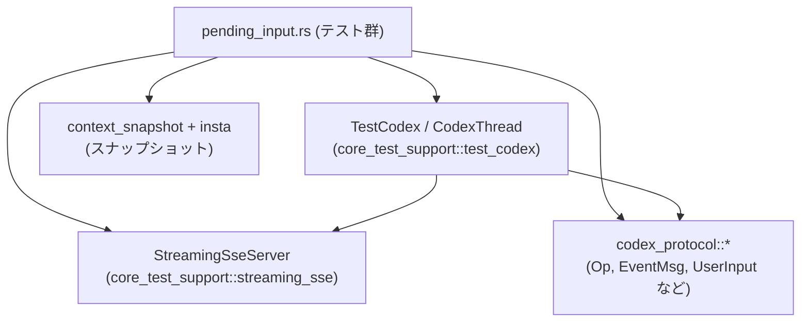
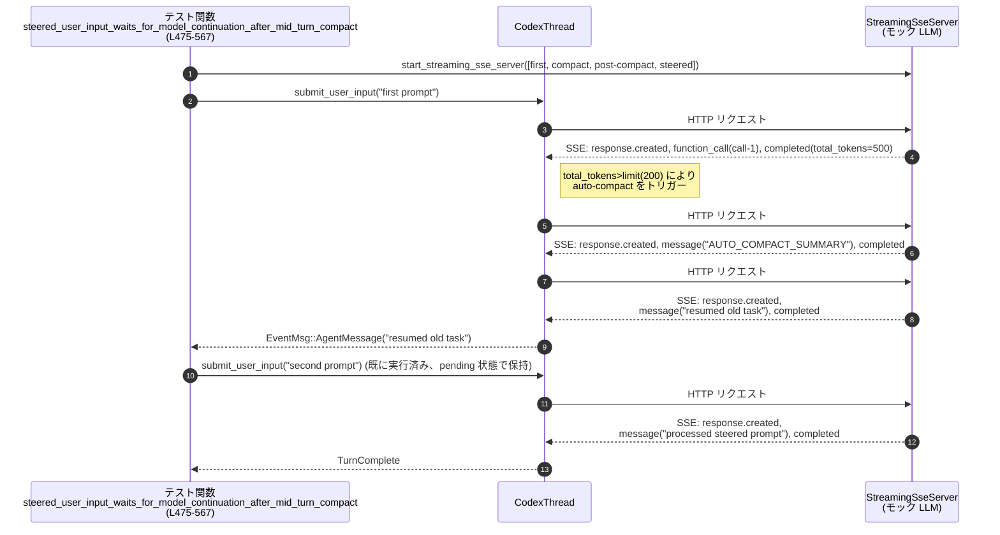

# core/tests/suite/pending_input.rs コード解説

> 注: 行番号は、このファイル先頭行を `L1` として数えた **このチャンク内での相対行番号** です。実ファイルの行番号と完全には一致しない可能性があります。

---

## 0. ざっくり一言

Codex の「保留中ユーザー入力（pending input）」や「キューされたエージェント間メッセージ」が、  
ストリーミング応答や自動コンパクト（要約）を挟みつつ **どのリクエストにいつ反映されるか** を検証する統合テスト群です。  
モック SSE サーバーを使い、非同期マルチスレッド環境での振る舞いを細かく確認します。

---

## 1. このモジュールの役割

### 1.1 概要

このモジュールは、Codex の会話スレッドで次のような状況をテストします。

- モデルがストリーミング応答中に、追加のユーザー入力や「steer（舵取り）入力」が行われた場合
- Reasoning item や commentary メッセージ中に、エージェント間メール（InterAgentCommunication）が到着した場合
- 自動コンパクト（トークン数しきい値超過による要約）を挟んだ後に、保留中入力がどう扱われるか
- 危険権限付き（DangerFullAccess）ツール呼び出しとコンパクトが絡むケース

これらのケースで、**後続のモデルリクエストの `input` にどのメッセージが含まれるべきか** を検証します。

### 1.2 アーキテクチャ内での位置づけ

このファイルは「テストスイート」の一部であり、本番コードではなく **外部コンポーネントを組み合わせたシナリオテスト** を提供します。

主要な依存関係（すべて `pending_input.rs:L1-772` 内の `use` から判明）:

- `codex_core::CodexThread` — Codex セッション本体への非同期ハンドル
- `codex_protocol::*` — `Op`（操作種別）、`EventMsg`（イベント）、`UserInput` 等のプロトコル型
- `core_test_support::streaming_sse::*` — モデルの SSE ストリーミングを模倣するテスト用サーバー
- `core_test_support::test_codex::*` — テスト用 Codex セッションビルダー
- `core_test_support::wait_for_event` — 特定イベントが来るまで待機するユーティリティ
- `core_test_support::context_snapshot` / `insta` — リクエスト内容のスナップショット検証

依存関係を簡略図にすると次のようになります。



### 1.3 設計上のポイント

コードから読み取れる設計上の特徴を列挙します。

- **SSE モックとゲート制御**  
  - `StreamingSseChunk` と `StreamingSseServer` を用い、モデル応答を SSE 風にモックしています（`pending_input.rs:L23-25, L217-242, L319-337, ...`）。
  - `tokio::sync::oneshot::channel` と `gated_chunk` により、「ここで一度ストリームを止めてからテスト側が操作する」といったタイミング制御を行っています（`L215-241, L317-337, L426-446, L571-583, L660-675`）。
- **非同期 & マルチスレッド**  
  - すべてのテストは `#[tokio::test(flavor = "multi_thread", worker_threads = 2)]` で実行され、Codex とモックサーバーが並行に動作します（`L212, L315, L360, L424, L474, L569, L658`）。
  - `Arc<CodexThread>` を利用し、スレッド安全に Codex へのハンドルを共有しています（`L1-3, L86-93, L728-729`）。
- **エラー処理方針（テスト向け）**  
  - `unwrap_or_else(|err| panic!(...))` や `unwrap()` を多用し、**少しでもエラーが出れば即テスト失敗** とするシンプルな方針です（`L90-92, L104-106, L127-129, L158-159, L255-263 など`）。
- **入力の検査とスナップショット**  
  - 送信された SSE リクエストボディを `serde_json::Value` として解析し、`message_input_texts` や `assert_two_responses_input_snapshot` で内容を検証します（`L51-63, L186-210, L298-311, L354-355, L418-419, L542-548, L631-637, L737-745`）。
- **契約（Contract）の明示**  
  - アサーションメッセージで、「steered input はどのリクエストに含まれるべきか」という期待が明文化されています（例: `L551-556, L558-564, L640-645, L647-653, L747-753, L755-761, L763-769`）。

---

## 2. 主要な機能一覧（コンポーネントインベントリー）

### 2.1 機能の概要

- SSE イベント生成ヘルパー: モデル応答の JSON/SSE イベントを簡潔に構築（`ev_message_item_done`, `sse_event`, `chunk`, `gated_chunk`, `response_completed_chunks`）。
- Codex 操作用ヘルパー: ユーザー入力送信、steer 入力送信、エージェント間メール送信などを簡略化（`submit_user_input`, `steer_user_input`, `submit_queue_only_agent_mail`, `submit_danger_full_access_user_turn`）。
- イベント待機ヘルパー: 指定されたイベント（推論開始、エージェントメッセージ、ターン完了）まで待機（`wait_for_reasoning_item_started`, `wait_for_agent_message`, `wait_for_turn_complete`）。
- リクエスト検査ヘルパー: モデルに送られた `input` 配列内のユーザーメッセージを抽出・スナップショット化（`message_input_texts`, `assert_two_responses_input_snapshot`）。
- シナリオテスト:
  - ストリーミング中に追加ユーザー入力を送信するケース（`injected_user_input_triggers_follow_up_request_with_deltas`）[Flaky で ignore]。
  - Reasoning item / commentary 中のエージェント間メール。
  - Reasoning 中の steer 入力が既存ターンを preempt しないこと。
  - 自動コンパクトを挟んだときの steer 入力の扱い（3 パターン）。

### 2.2 関数インベントリー（行範囲付き）

| 関数名 | 種別 | 役割 / 用途 | 行範囲 |
|--------|------|-------------|--------|
| `ev_message_item_done` | ヘルパー | 完了した message 出力アイテムの JSON イベントを生成 | `pending_input.rs:L35-45` |
| `sse_event` | ヘルパー | 1 つの JSON イベントから SSE 文字列を生成 | `pending_input.rs:L47-49` |
| `message_input_texts` | ヘルパー | リクエストボディから指定ロールの `input_text` を抽出 | `pending_input.rs:L51-63` |
| `chunk` | ヘルパー | ゲートなし `StreamingSseChunk` を生成 | `pending_input.rs:L65-70` |
| `gated_chunk` | ヘルパー | oneshot で解放されるゲート付き `StreamingSseChunk` を生成 | `pending_input.rs:L72-77` |
| `response_completed_chunks` | ヘルパー | response.created → completed の 2 チャンクをまとめて生成 | `pending_input.rs:L79-84` |
| `build_codex` | ヘルパー | モデル名指定で `TestCodex` を構築し `Arc<CodexThread>` を取得 | `pending_input.rs:L86-93` |
| `submit_user_input` | ヘルパー | `Op::UserInput` を組み立てて Codex に送信 | `pending_input.rs:L95-107` |
| `submit_danger_full_access_user_turn` | ヘルパー | `Op::UserTurn` を DangerFullAccess で送信 | `pending_input.rs:L109-130` |
| `steer_user_input` | ヘルパー | `CodexThread::steer_input` で steer 入力を送信 | `pending_input.rs:L132-144` |
| `submit_queue_only_agent_mail` | ヘルパー | `Op::InterAgentCommunication` を queue-only で送信 | `pending_input.rs:L146-160` |
| `wait_for_reasoning_item_started` | ヘルパー | `EventMsg::ItemStarted(Reasoning)` が来るまで待機 | `pending_input.rs:L162-171` |
| `wait_for_agent_message` | ヘルパー | 指定テキストの `EventMsg::AgentMessage` を待機 | `pending_input.rs:L173-180` |
| `wait_for_turn_complete` | ヘルパー | `EventMsg::TurnComplete` まで待機 | `pending_input.rs:L182-184` |
| `assert_two_responses_input_snapshot` | ヘルパー | 2 つのリクエストの `input` を snapshot 比較 | `pending_input.rs:L186-210` |
| `injected_user_input_triggers_follow_up_request_with_deltas` | テスト | ストリーミング delta 中の追加入力が後続リクエストに反映されることを検証 | `pending_input.rs:L212-313` |
| `queued_inter_agent_mail_triggers_follow_up_after_reasoning_item` | テスト | Reasoning item 中のキュー済みエージェントメールが後続リクエストをトリガーすることを検証 | `pending_input.rs:L315-358` |
| `queued_inter_agent_mail_triggers_follow_up_after_commentary_message_item` | テスト | Commentary メッセージ中のキュー済みエージェントメールの扱いを検証 | `pending_input.rs:L360-422` |
| `user_input_does_not_preempt_after_reasoning_item` | テスト | Reasoning 中に steer 入力しても既存のツールコールが維持されることを確認 | `pending_input.rs:L424-472` |
| `steered_user_input_waits_for_model_continuation_after_mid_turn_compact` | テスト | mid-turn コンパクト後まで steer 入力が待機されることを検証 | `pending_input.rs:L474-567` |
| `steered_user_input_follows_compact_when_only_the_steer_needs_follow_up` | テスト | ターン完了後のコンパクトには steer 入力を載せず、その後のリクエストで扱うことを検証 | `pending_input.rs:L569-656` |
| `steered_user_input_waits_when_tool_output_triggers_compact_before_next_request` | テスト | ツール出力に起因するコンパクトがある場合の steer 入力の待機挙動を検証 | `pending_input.rs:L658-772` |

---

## 3. 公開 API と詳細解説

このファイル自体はテストモジュールであり、`pub` な API は定義していません。  
ここでは「他のテストから再利用されうるヘルパー関数」と「重要なシナリオテスト」を詳しく解説します。

### 3.1 型一覧（構造体・列挙体など）

このファイル内で **新たに定義されている構造体・列挙体はありません**。

登場する主な型は、すべて他モジュールからのインポートです（定義はこのチャンクには現れません）。

- `CodexThread` (`codex_core`) — Codex セッション操作用のスレッド安全ハンドルと思われます（`pending_input.rs:L3`）。
- `UserInput` (`codex_protocol::user_input`) — ユーザー入力を表す列挙体で、ここでは `UserInput::Text` バリアントのみ使用されています（`pending_input.rs:L11, L98-101`）。
- `Op` (`codex_protocol::protocol`) — Codex に対する操作種別（`UserInput`, `UserTurn`, `InterAgentCommunication`）を表します（`pending_input.rs:L9, L97, L111, L147`）。
- `StreamingSseServer`, `StreamingSseChunk` (`core_test_support::streaming_sse`) — SSE ベースのモデル API をモックするテスト用型です（`pending_input.rs:L23-25`）。

### 3.2 関数詳細（7 件）

#### `message_input_texts(body: &Value, role: &str) -> Vec<String>`  

**所在**: `pending_input.rs:L51-63`

**概要**

`/responses` などのリクエストボディ（JSON）から、  
`"input"` 配列内に含まれる `"type": "message"` で `"role"` が指定ロールの要素を探し、  
その `"content"` のうち `"type": "input_text"` の `"text"` をすべて `Vec<String>` として返します。

**引数**

| 引数名 | 型 | 説明 |
|--------|----|------|
| `body` | `&serde_json::Value` | HTTP リクエストボディ全体（JSON） |
| `role` | `&str` | `"user"` など、抽出対象のメッセージロール |

**戻り値**

- `Vec<String>`: 条件に合致したすべての `input_text` の内容。該当要素がなければ空ベクタ。

**内部処理の流れ**

`pending_input.rs:L51-62` に基づき:

1. `body.get("input").and_then(Value::as_array)` で `"input"` 配列を取得（なければ `None`）。
2. `into_iter().flatten()` で `Option<&Vec<Value>>` → イテレータに変換し、配列要素（各メッセージ）を反復。
3. 各要素に対し、`item["type"] == "message"` かつ `item["role"] == role` のものだけを `filter`。
4. その中から `item["content"]` を配列として取り出し、`flatten()` で各 span を列挙。
5. span のうち `"type": "input_text"` のものだけを選択。
6. その `"text"` フィールドを `&str` として取得し、`str::to_owned` で `String` に変換して収集。

**Examples（使用例）**

```rust
// HTTP リクエストボディを JSON としてパース済みと仮定
let body: Value = serde_json::from_slice(&requests[0]).unwrap();

// "user" ロールの input_text をすべて取得
let user_texts = message_input_texts(&body, "user");

// ある特定のプロンプトが含まれているか検証
assert!(user_texts.iter().any(|t| t == "first prompt"));
```

**Errors / Panics**

- `Value` のフィールドアクセスは `get` を使っており、存在しない場合は単にスキップされるため、この関数内で panic は発生しません。
- JSON 構造が想定と異なっていても、単に該当要素が見つからず空ベクタを返すだけです。

**Edge cases（エッジケース）**

- `"input"` キーがない / 配列でない: 何も抽出されず空ベクタ。
- `"content"` が配列でない: `and_then(Value::as_array)` で `None` になり、そのメッセージは無視されます。
- `"text"` が文字列でない: `and_then(Value::as_str)` が `None` を返し、その span は無視されます。

**使用上の注意点**

- 構造が崩れていても静かに空を返すため、「構造が正しいか」を検証したい場合は別のアサーションを併用する必要があります。
- 役割ロール（`role`）の指定ミス（例: `"User"` vs `"user"`）でも空ベクタになるため、テストが失敗した場合はロール文字列も確認するのが安全です。

---

#### `build_codex(server: &StreamingSseServer) -> Arc<CodexThread>`

**所在**: `pending_input.rs:L86-93`

**概要**

`test_codex()` ビルダーを使って、特定モデル（ここでは `"gpt-5.1"`）と指定された `StreamingSseServer` を紐付けたテスト用 Codex セッションを構築し、その `CodexThread` を `Arc` で返します。

**引数**

| 引数名 | 型 | 説明 |
|--------|----|------|
| `server` | `&StreamingSseServer` | モデル応答をモックする SSE サーバーインスタンス |

**戻り値**

- `Arc<CodexThread>`: 非同期 & マルチスレッド環境で共有可能な Codex スレッドハンドル。

**内部処理の流れ**

`pending_input.rs:L86-92` より:

1. `test_codex()` でテスト用セッションビルダーを取得。
2. `.with_model("gpt-5.1")` でモデル名を設定。
3. `.build_with_streaming_server(server).await` により、与えられた `StreamingSseServer` と結びついたセッションを非同期に構築。
4. 構築に失敗した場合、`unwrap_or_else` で panic し、エラー内容を含むメッセージを表示。
5. 成功時は戻り値の構造体の `codex` フィールドを返す。

**Examples（使用例）**

```rust
let (server, _completions) =
    start_streaming_sse_server(vec![first_chunks, response_completed_chunks("resp-2")]).await;
let codex = build_codex(&server).await;
// 以後 codex を使って submit/steer などを実行
```

**Errors / Panics**

- `build_with_streaming_server` が `Err` を返した場合は panic します。テストにおいては「セッション構築に失敗した時点でテスト失敗」とするための設計です。

**使用上の注意点**

- `Arc<CodexThread>` はスレッド安全であることが前提です（そうでなければコンパイルできません）。非同期タスク間で `clone` して共有しても問題ない前提になっています。
- テスト以外で同様のビルダーを使う場合、`unwrap_or_else` の代わりに適切なエラー処理を行うべきです。

---

#### `steer_user_input(codex: &CodexThread, text: &str)`

**所在**: `pending_input.rs:L132-144`

**概要**

既存の対話中に、ユーザーが「方針変更」「追記」などを行うための **steer 入力** を Codex に送信するヘルパー関数です。  
内部的には `CodexThread::steer_input` を呼び出します。

**引数**

| 引数名 | 型 | 説明 |
|--------|----|------|
| `codex` | `&CodexThread` | 操作対象の Codex セッション |
| `text` | `&str` | steer 入力として送るテキスト内容 |

**戻り値**

- なし（`()`）。内部の `Result` は `unwrap_or_else` により panic か成功のどちらかになります。

**内部処理の流れ**

`pending_input.rs:L132-143` より:

1. `vec![UserInput::Text { text: text.to_string(), text_elements: Vec::new() }]` を構築。
2. `codex.steer_input( ... , None, None).await` を呼び出し。
   - `expected_turn_id` と `responsesapi_client_metadata` は `None`。
3. 戻り値が `Err(err)` の場合、panic してテストを失敗させる。

`CodexThread::steer_input` の中身はこのチャンクには現れませんが、少なくとも非同期メソッドであり `Result` を返すことが分かります。

**Examples（使用例）**

```rust
// Reasoning 中に steer 入力を送る例
wait_for_reasoning_item_started(&codex).await;
steer_user_input(&codex, "second prompt").await;
```

**Errors / Panics**

- Codex が steer 入力を受け付けなかった場合（状態不整合などの理由）は `Err` となり、`panic!("steer user input: {err:?}")` が発生します。

**Edge cases**

- Codex 側の状態が「steer を待てない状態」のとき、どのようなエラーが返るかはこのチャンクからは分かりません。
- `text` が空文字列であるケースの扱いも、このチャンクのテストには現れていません。

**使用上の注意点**

- 本テストでは、「いつ steer を送るか」を oneshot やイベント待機で慎重に制御しています（例: `L455-458, L624-625, L731-733`）。同様に利用する場合も、Codex 側の状態遷移を理解した上で呼び出す必要があります。

---

#### `queued_inter_agent_mail_triggers_follow_up_after_reasoning_item()`

**所在**: `pending_input.rs:L315-358`

**概要**

Reasoning item が開始された後に、キューされたエージェント間メール（`Op::InterAgentCommunication`）を送信すると、  
**後続リクエストにその pending 入力が反映される** ことを検証するテストです。

**引数 / 戻り値**

- テスト関数であり、外部から引数は取りません。`#[tokio::test]` により非同期テストとして実行されます。

**内部処理の流れ（ざっくり）**

1. `oneshot::channel` で reasoning 部分の終了を制御するゲートを作成（`L317-323`）。
2. `first_chunks` を構築:
   - response.created → reasoning.item_added → （ゲート開放後に）reasoning 完了 + 古いツールコール + stale メッセージ + completed（`L319-337`）。
3. `start_streaming_sse_server` に `[first_chunks, response_completed_chunks("resp-2")]` を渡し、モックサーバーを起動（`L339-340`）。
4. `build_codex(&server)` で Codex セッションを構築（`L342`）。
5. `submit_user_input("first prompt")` を送信（`L344`）。
6. `wait_for_reasoning_item_started` で Reasoning item 開始まで待機（`L346`）。
7. `submit_queue_only_agent_mail("queued child update")` で queue-only メールを送信（`L348`）。
8. ゲートを開放し、Reasoning → stale ツールコール → stale 出力 → completed を進める（`L350`）。
9. `wait_for_turn_complete` でターン完了を待機（`L352`）。
10. モックサーバーに届いた 2 件のリクエストを取得し、`assert_two_responses_input_snapshot` で `input` 内容のスナップショットを検証（`L354-355`）。

**Examples（使用例のイメージ）**

このテストの構造は「特定のイベントが起きたタイミングで queue-only メールを送る」典型パターンです。  
新しい類似テストを書くときの雛形になります:

```rust
let (gate_tx, gate_rx) = oneshot::channel();
let first_chunks = vec![
    // ... initial response / reasoning item ...
    gated_chunk(gate_rx, vec![ /* completion events */ ]),
];

let (server, _completions) =
    start_streaming_sse_server(vec![first_chunks, response_completed_chunks("resp-2")]).await;
let codex = build_codex(&server).await;

submit_user_input(&codex, "first prompt").await;
wait_for_reasoning_item_started(&codex).await;

// ここで別入力をキューイング
submit_queue_only_agent_mail(&codex, "queued child update").await;

let _ = gate_tx.send(());
wait_for_turn_complete(&codex).await;

// requests()[0], [1] の内容を検証
```

**Errors / Panics**

- `start_streaming_sse_server`, `build_codex`, `submit_user_input` などがエラーを返した場合はすべて panic になります（すべて `unwrap` / `unwrap_or_else` 経由）。
- スナップショット検証 (`insta::assert_snapshot!`) に失敗した場合も panic してテストは失敗します。

**Edge cases / Contract**

- このテストから読み取れる **契約** は、「Reasoning item 中に到着した queue-only メールは、元のターンの完了後に別リクエストとして処理される」ことです。
- stale なツールコール（`call-stale`）および stale メッセージが生成されていることから、古いタスクの continuation が行われず、follow-up リクエスト側で新しい状況が扱われることを暗に確認しています。

**使用上の注意点**

- oneshot ゲートを閉じたまま `wait_for_turn_complete` してしまうと、テストがハングする可能性があります。そのため、必ず適切なタイミングで `gate_reasoning_done_tx.send(())` を呼んでいます（`L350`）。

---

#### `user_input_does_not_preempt_after_reasoning_item()`

**所在**: `pending_input.rs:L424-472`

**概要**

Reasoning item が開始したタイミングでユーザーが steer 入力（`second prompt`）を送っても、  
**既に決定されたツールコール（`call-preserved`）や最初の答えが置き換えられない** ことを確認するテストです。

**内部処理の流れ（要約）**

1. Reasoning 部の終了を制御する oneshot ゲートを作成（`L426-432`）。
2. `first_chunks` で:
   - response.created → reasoning.item_added → （ゲート後）`call-preserved` ツールコール → `first answer` メッセージ → completed を定義（`L428-446`）。
3. モックサーバー起動 & Codex 構築（`L448-452`）。
4. `submit_user_input("first prompt")` を送信（`L453`）。
5. `wait_for_reasoning_item_started` で Reasoning 開始を待つ（`L455`）。
6. Reasoning 中に `steer_user_input("second prompt")` を送る（`L457`）。
7. ゲートを開放し、ツールコールおよび `first answer` メッセージを完了させる（`L459`）。
8. `wait_for_agent_message("first answer")` と `wait_for_turn_complete` で元ターンの完了を確認（`L461-463`）。
9. モックサーバーのリクエスト 2 件を `assert_two_responses_input_snapshot` で検証し、「preempt されていない」ことをスナップショットで確認（`L465-469`）。

**Contract のポイント**

- Reasoning 中に steer 入力があっても、**既に決まっているツールコールや応答はそのまま完了する**。
- steer 入力は「pending」として保持され、後続のリクエスト（スナップショットで確認される 2 つ目のリクエスト）に反映されることが期待されます。

**並行性と安全性**

- `CodexThread` への操作と SSE サーバーからのイベントは別スレッド上で並行に走る可能性がありますが、Rust の所有権と `Arc` によってデータ競合は防がれています。
- `wait_for_reasoning_item_started` のようにイベントを待ってから steer を送ることで、タイミングによる flakiness を最小化しています。

---

#### `steered_user_input_waits_for_model_continuation_after_mid_turn_compact()`

**所在**: `pending_input.rs:L474-567`

**概要**

モデルがツールコールの後にトークン数制限により **mid-turn コンパクト**（AUTO_COMPACT_SUMMARY）を行った場合、  
その後の continuation が終わるまで、**steer 入力（`second prompt`）がリクエストに含まれないこと** を検証するテストです。

**内部処理の流れ**

1. `first_chunks`:
   - `resp-1`: response.created → `call-1` ツールコール → `completed_with_tokens(total_tokens = 500)`（`L476-482`）。  
     → これによりトークン数が上限（200）を超え、コンパクトが発生する前提。
2. `compact_chunks`:
   - `resp-compact`: response.created → `msg-compact`（"AUTO_COMPACT_SUMMARY"） → completed（`L484-491`）。
3. `post_compact_continuation_chunks`:
   - `resp-post-compact`: response.created → `msg-post-compact`（"resumed old task"） → completed（`L493-501`）。
4. `steered_follow_up_chunks`:
   - `resp-steered`: response.created → `msg-steered`（"processed steered prompt"） → completed（`L504-513`）。
5. 上記 4 セットを `start_streaming_sse_server` に渡してモックサーバーを起動（`L516-522`）。
6. `test_codex().with_model(...).with_config(...)` で:
   - `model_auto_compact_token_limit = Some(200)`、
   - `supports_websockets = false` などを設定し、コンパクト発生条件を構成（`L524-530`）。
7. Codex 構築後、`submit_user_input("first prompt")` と `submit_user_input("second prompt")` を **順に送信**（`L536-537`）。
   - ここで `second prompt` は「steer された pending input」として扱われる。
8. `"resumed old task"` というエージェントメッセージを待機し、その後ターン完了を待つ（`L539-540`）。
9. モックサーバーに対する 4 件のリクエストボディを取得し:
   - 3 番目（post-compact continuation）には `second prompt` が含まれていないこと（`L545-556`）。
   - 4 番目（steered follow-up）には `second prompt` が含まれていること（`L558-564`）。
   を `message_input_texts` と `assert!` で確認。

**Contract**

- **コンパクト中・コンパクト直後の continuation リクエストには、保留中の steer 入力を混ぜない**。
- steer 入力は、その continuation が完了した **後の** リクエストにだけ含まれる。

**並行性・安全性**

- このテストでは oneshot ゲートを使っておらず、SSE チャンクは連続して流れます。そのため、コンパクトと continuation のシーケンスは Codex から見て連続した HTTP リクエストとして観測されます。
- `requests().await` の順序は、`StreamingSseServer` の実装に依存しますが、このテストでは連番で 4 リクエストが記録される前提になっています（定義はこのチャンクには現れません）。

---

#### `steered_user_input_waits_when_tool_output_triggers_compact_before_next_request()`

**所在**: `pending_input.rs:L658-772`

**概要**

ツール出力のサイズ（トークン数）が大きいためにコンパクトが発生するケースで、  
**コンパクトのためのリクエストや、その後の continuation リクエストにも steer 入力を含めず**、  
最後の follow-up リクエストでのみ `second prompt` を含めることを検証します。

**内部処理の流れ（要約）**

1. `first_chunks`:
   - `resp-1`: response.created → `shell_command` ツールコール（長大な出力を想定） → completed_with_tokens(100)（`L662-675`）。
   - completion の送出タイミングは oneshot ゲートで制御。
2. `compact_chunks`:
   - `resp-compact`: response.created → `"TOOL_OUTPUT_SUMMARY"` メッセージ → completed（`L677-684`）。
3. `post_compact_continuation_chunks`:
   - `resp-post-compact`: response.created → `"resumed after compacting tool output"` メッセージ → completed（`L686-695`）。
4. `steered_follow_up_chunks`:
   - `resp-steered`: response.created → `"processed steered prompt"` メッセージ → completed（`L698-707`）。
5. 上記をモックサーバーに登録し、`test_codex().with_config(...)` で auto-compact 設定を行う（`L710-725`）。
6. `submit_danger_full_access_user_turn("first prompt")` で DangerFullAccess な `UserTurn` を送信（`L730`）。
7. `TurnStarted` イベントを待機し、ターンが進行中であることを確認（`L731`）。
8. その状態で `steer_user_input("second prompt")` を送信（`L732`）。
9. ゲートを開放し、ツール実行 completion → コンパクト → continuation を進める（`L733`）。
10. `wait_for_turn_complete` でターン完了まで待機（`L735`）。
11. 4 件のリクエストボディを解析し:
    - compact リクエスト（2番目）に `second prompt` が含まれないこと（`L747-753`）。
    - post-compact continuation（3番目）にも含まれないこと（`L755-761`）。
    - steered follow-up（4番目）には含まれていること（`L763-769`）。
    を検証。

**Contract**

- **ツール出力起因のコンパクトでも、steer 入力の扱いは mid-turn コンパクト時と同じ**:
  - コンパクト & post-compact continuation は「元のタスクの処理を完了するためのリクエスト」であり、そこに新しい steer 入力を混ぜない。
  - steer 入力は、 continuation 完了後の follow-up リクエストで初めて利用される。

**安全性・セキュリティの観点**

- `SandboxPolicy::DangerFullAccess` を利用しているのはテスト環境であり、実際には危険なシェルコマンドを実行しないモックです（`L120-121, L662-668`。ツール呼び出しは JSON として SSE モックに送られるのみ）。
- Rust の型システムにより、外部で実際のシェルを叩くかどうかは `core_test_support` 側の実装次第であり、このファイルからは分かりませんが、テスト名・コメントからはモックであることが推測されます。  
  ※あくまで推測であり、定義はこのチャンクには現れません。

---

### 3.3 その他の関数

上記で詳細説明していない関数の一覧です。

| 関数名 | 役割（1 行） | 行範囲 |
|--------|--------------|--------|
| `ev_message_item_done` | 完了した assistant メッセージ出力アイテムの JSON イベントを生成 | `pending_input.rs:L35-45` |
| `sse_event` | 1 つの JSON イベントを SSE 文字列に変換 | `pending_input.rs:L47-49` |
| `chunk` | 指定イベントからゲートなし `StreamingSseChunk` を作成 | `pending_input.rs:L65-70` |
| `gated_chunk` | oneshot ゲート付きの `StreamingSseChunk` を作成 | `pending_input.rs:L72-77` |
| `response_completed_chunks` | `response.created` → `completed` のシンプルな SSE チャンク列を作成 | `pending_input.rs:L79-84` |
| `submit_user_input` | テキストのみの `Op::UserInput` を送信するユーティリティ | `pending_input.rs:L95-107` |
| `submit_danger_full_access_user_turn` | DangerFullAccess な `Op::UserTurn` を送信 | `pending_input.rs:L109-130` |
| `submit_queue_only_agent_mail` | queue-only の `Op::InterAgentCommunication` を送信 | `pending_input.rs:L146-160` |
| `wait_for_reasoning_item_started` | Reasoning item の開始イベントまで待機 | `pending_input.rs:L162-171` |
| `wait_for_agent_message` | 指定メッセージ内容の `AgentMessage` が来るまで待機 | `pending_input.rs:L173-180` |
| `wait_for_turn_complete` | ターン完了イベントまで待機 | `pending_input.rs:L182-184` |
| `assert_two_responses_input_snapshot` | 2 リクエストの `input` 内容を insta スナップショットとして検証 | `pending_input.rs:L186-210` |
| `injected_user_input_triggers_follow_up_request_with_deltas` | ストリーミング delta 中のユーザー入力反映をテスト（現在 `#[ignore]`） | `pending_input.rs:L212-313` |
| `queued_inter_agent_mail_triggers_follow_up_after_commentary_message_item` | commentary メッセージ中のキュー済みメールの扱いをテスト | `pending_input.rs:L360-422` |
| `steered_user_input_follows_compact_when_only_the_steer_needs_follow_up` | ターン完了後コンパクト → steer follow-up のケースをテスト | `pending_input.rs:L569-656` |

---

## 4. データフロー

ここでは、もっとも複雑なシナリオの一つ  
`steered_user_input_waits_for_model_continuation_after_mid_turn_compact`（`pending_input.rs:L474-567`）におけるデータフローを説明します。

### 4.1 処理の要点

- ユーザーが 2 回入力（`first prompt`, `second prompt`）を送る。
- モデルは 1 回目のターンでツールコールを行い、トークンしきい値超過のためコンパクトを実施。
- コンパクト後に「元のタスク再開」の continuation を行う。
- `second prompt` は、この continuation が終わるまで **どのリクエストにも含まれず**、  
  その後の steered follow-up リクエストで初めて `input` に含まれる。

### 4.2 シーケンス図



### 4.3 データの通り道

- `submit_user_input` から `CodexThread::submit(Op::UserInput)` を通じて、`UserInput::Text` が `C` に渡ります（`pending_input.rs:L95-107, L536-537`）。
- `C` は内部で `StreamingSseServer` への HTTP リクエストを発行し、そのボディが `server.requests().await` に記録されます（`pending_input.rs:L542`）。
- テスト側は `message_input_texts` を使って、各リクエストの `"input"` 配列から `"user"` ロールの `input_text` を抽出し、`"second prompt"` の有無を確認します（`pending_input.rs:L550-564`）。

---

## 5. 使い方（How to Use）

このファイルはテスト用ですが、同様のパターンで新しいシナリオテストを追加する際のガイドとして有用です。

### 5.1 基本的な使用方法（テストを書く流れ）

1. **SSE チャンクシナリオの定義**

```rust
let first_chunks = vec![
    chunk(ev_response_created("resp-1")),           // 最初のレスポンス開始
    chunk(ev_message_item_added("msg-1", "")),      // メッセージ追加
    chunk(ev_output_text_delta("partial answer")),  // ストリーミング delta
    chunk(ev_message_item_done("msg-1", "final")),  // メッセージ完了
    chunk(ev_completed("resp-1")),                  // レスポンス完了
];
```

1. **モック SSE サーバーの起動**

```rust
let (server, _completions) =
    start_streaming_sse_server(vec![first_chunks, response_completed_chunks("resp-2")]).await;
```

1. **Codex セッションの構築**

```rust
let codex = build_codex(&server).await; // or test_codex().with_model(...).build_with_streaming_server(...)
```

1. **ユーザー入力 / steer / エージェントメールの送信**

```rust
submit_user_input(&codex, "first prompt").await;
steer_user_input(&codex, "second prompt").await;
submit_queue_only_agent_mail(&codex, "queued child update").await;
```

1. **イベント待機とアサーション**

```rust
wait_for_agent_message(&codex, "expected answer").await;
wait_for_turn_complete(&codex).await;

let requests = server.requests().await;
let body: Value = from_slice(&requests[0]).unwrap();
let user_texts = message_input_texts(&body, "user");
assert!(user_texts.iter().any(|t| t == "first prompt"));
```

### 5.2 よくある使用パターン

- **Reasoning 開始をトリガーに追加操作を行う**  
  `wait_for_reasoning_item_started(&codex).await;` の直後に steer や queue-only メールを送る（`L346, L455`）。

- **メッセージ開始をトリガーにする**  
  `EventMsg::ItemStarted` のうち `TurnItem::AgentMessage(_)` を待ってから操作（`L401-407`）。

- **ターン開始をトリガーにする**  
  `EventMsg::TurnStarted(_)` を待ってから steer 入力を送る（`L731-733`）。

### 5.3 よくある間違い

```rust
// 間違い例: Reasoning 開始前に steer を送ってしまう
submit_user_input(&codex, "first prompt").await;
steer_user_input(&codex, "second prompt").await; // モデル状態次第で意図通りに扱われない可能性

// 正しい例: Reasoning 開始イベントを待ってから steer
submit_user_input(&codex, "first prompt").await;
wait_for_reasoning_item_started(&codex).await;
steer_user_input(&codex, "second prompt").await;
```

### 5.4 使用上の注意点（まとめ）

- **非同期・並行性**:
  - すべて `async fn` であり、Tokio のマルチスレッドランタイム上で動作します。`await` し忘れるとコンパイルエラーになりますが、`oneshot` ゲートの送信忘れはハング要因です。
- **エラー処理**:
  - すべて `unwrap` / `panic` ベースなので、少しでも異常があればテスト全体が fail します。意図しないエラーが出たときは、panic メッセージを見ることで原因を特定できます。
- **スナップショットテスト**:
  - `insta::assert_snapshot!` を利用しているテスト（`assert_two_responses_input_snapshot` 経由）は、仕様変更により `input` の形式が変わると失敗します。その場合はスナップショットの更新が必要になります。

---

## 6. 変更の仕方（How to Modify）

### 6.1 新しい機能（シナリオ）を追加する場合

1. **どの状態で pending input を送るかを決める**  
   - Reasoning 中か、message streaming 中か、コンパクト中か、ツール中かなど。
2. **SSE チャンクシナリオを構成する**  
   - `chunk`, `gated_chunk`, `ev_*` ヘルパーを利用して `Vec<Vec<StreamingSseChunk>>` を組み立てます。
3. **トリガーイベント待機ヘルパーを選ぶ / 新たに作る**  
   - 既存の `wait_for_reasoning_item_started`, `wait_for_agent_message`, `wait_for_turn_complete` で足りればそれを使用し、足りなければ `wait_for_event` を元に新しいヘルパーを追加できます（`wait_for_event` 自体の定義はこのチャンクには現れません）。
4. **リクエスト検証ロジックを書く**  
   - `server.requests().await` → `from_slice::<Value>` → `message_input_texts` のパターンで、期待するテキストがどのリクエストに含まれるかをアサートします。

### 6.2 既存の機能を変更する場合

- **Codex の contract が変わったとき**
  - 例えば「steer 入力もコンパクトリクエストに載せる」仕様に変更された場合、`steered_user_input_*` 系テストのアサーション（`assert!(!...any(|text| == "second prompt")` 部分）を修正する必要があります（`L551-556, L640-645, L747-753, L755-761`）。
- **モデルや auto-compact 設定の変更**
  - `with_config` で指定している `model_auto_compact_token_limit` の値が変わると、「どこでコンパクトが発生するか」が変わり、SSE チャンクシナリオ自体を修正する必要が出ます（`L524-530, L612-617, L720-724`）。
- **エラー型・イベント型が変わった場合**
  - `EventMsg` や `TurnItem` に変更が入った場合、`matches!` マクロでのパターン部分（`L162-169, L401-406` など）をアップデートする必要があります。

変更時には、関連テストファイル（他の suite ファイル）や `core_test_support` 側のユーティリティ実装との整合性も確認することが推奨されます（ただしそれらの定義はこのチャンクには現れません）。

---

## 7. 関連ファイル

このモジュールと密接に関係するコンポーネント（パス名は `use` 句から分かる範囲）:

| パス / モジュール | 役割 / 関係 |
|-------------------|------------|
| `core_test_support::streaming_sse` | `StreamingSseServer`, `StreamingSseChunk`, `start_streaming_sse_server` を提供。モデル SSE API のモックとして、本テストから集中的に使用されます（`pending_input.rs:L23-25, L255-256, L339-340, L394-395, L448-449, L516-522, L607-609, L710-716`）。定義はこのチャンクには現れません。 |
| `core_test_support::test_codex` | `test_codex()` と `TestCodex` を提供し、実際の Codex コアに近い形のテストセッションを構築します（`pending_input.rs:L26-27, L86-93, L258-263, L524-534, L611-621, L718-727`）。 |
| `core_test_support::wait_for_event` | 任意の条件に合う `EventMsg` が来るまで待つ汎用ユーティリティ。`wait_for_reasoning_item_started` などのラッパーから使用されています（`pending_input.rs:L28, L162-171, L173-180, L182-184, L277-280, L401-407, L455, L731`）。 |
| `core_test_support::context_snapshot` | モデルリクエストに含まれるコンテキストを文字列として整形し、`insta` でスナップショット比較するための関数群（`pending_input.rs:L12-13, L186-210`）。 |
| `codex_core::CodexThread` | Codex のメインスレッド（またはセッション）を表す型で、`submit` や `steer_input` メソッドを提供します（`pending_input.rs:L3, L95-107, L132-144, L146-160`）。定義はこのチャンクには現れません。 |
| `codex_protocol::{Op, EventMsg, TurnItem, UserInput, ...}` | Codex のプロトコル型一式。テストはこれらの型を通じて Codex の状態遷移とイベント発火を観察します（`pending_input.rs:L4-11, L95-107, L109-160, L162-180`）。 |
| `core_test_support::responses` | `ev_response_created`, `ev_completed`, `ev_message_item_added` など、SSE イベント JSON を作るユーティリティ群（`pending_input.rs:L14-22, L217-241, L319-337, L365-391, ほかテスト全体`）。 |

これらのコンポーネントの実装詳細はこのチャンクには現れませんが、本テストファイルはそれらを組み合わせて「pending input と自動コンパクトに関する挙動契約」を検証する役割を持っています。
