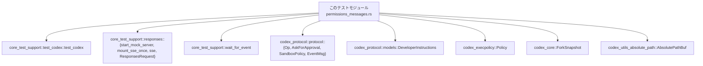
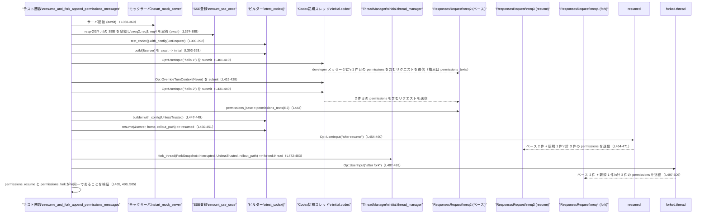

# core/tests/suite/permissions_messages.rs コード解説

## 0. ざっくり一言

Codex の「権限（permissions）に関する開発者向けメッセージ」が、  
セッション開始・設定変更・再開（resume）・フォーク（fork）・サンドボックス設定に応じて  
**どのように送信・蓄積・再送されるか**を検証する統合テスト群です  
（core/tests/suite/permissions_messages.rs:L25-571）。

---

## 1. このモジュールの役割

### 1.1 概要

- このモジュールは、Codex が外部のレスポンス API に送る「developer」ロールのメッセージのうち、  
  `<permissions instructions>` を含む**権限説明メッセージ**の振る舞いを検証します  
  （permissions_texts でフィルタ: L25-31）。
- 検証対象は主に次の点です。
  - セッション開始時に 1 回だけ送られること（L33-64）。
  - 承認ポリシーなどの設定変更があったときに **新しいメッセージが追加**されること（L66-136）。
  - 設定が変わらない場合は **追加されない**こと（L138-191）。
  - 開発者向けの権限説明を完全に**無効化できる**こと（L193-265）。
  - セッションの **再開（resume）やフォーク**時に、既存メッセージの再送・追加が正しく行われること（L267-509）。
  - サンドボックスの writable roots（書き込み可能ルート）がメッセージ文面に含まれること（L511-571）。

### 1.2 アーキテクチャ内での位置づけ

このテストモジュールが依存している主なコンポーネントは以下のとおりです。

- `core_test_support::test_codex::test_codex`  
  : Codex のテスト用ビルダーを返す関数（L44, 82, 154, 209, 288, 390, 532）。
- `core_test_support::responses::*`  
  : モック SSE サーバ (`start_mock_server`) と、  
    SSE ストリームのマウント (`mount_sse_once`, `sse`) と `ResponsesRequest` を提供（L12-17, 37-42, 71-80 など）。
- `codex_protocol::protocol::{Op, AskForApproval, SandboxPolicy, EventMsg}`  
  : Codex への操作（ユーザー入力・コンテキスト上書き）と、  
    承認ポリシー・サンドボックスポリシー・完了イベントの型（L6-9, 49-57, 99-112 など）。
- `codex_protocol::models::DeveloperInstructions`  
  : サンドボックスポリシーなどから権限説明テキストを構築する型（L5, 551-560）。

依存関係を簡略図で示します。



このモジュール自身は **アプリケーション本体のロジックを持たず**、Codex とモックサーバの間のやり取りを観測して、  
権限メッセージの**件数・内容・順序**を検証する役割を持ちます。

### 1.3 設計上のポイント

コードから読み取れる設計上の特徴は次のとおりです。

- **権限メッセージの識別方法**  
  - `ResponsesRequest::message_input_texts("developer")` で developer ロールの入力メッセージ一覧を取得し（L25-28）、  
    文字列に `<permissions instructions>` が含まれるものだけを抽出しています（L29）。
  - したがって、このマーカー文字列はテストにおける「権限説明メッセージ」の契約となっています。

- **状態変化とメッセージ件数の関係を検証**  
  - 承認ポリシー (`AskForApproval`) の変更（OnRequest → Never / UnlessTrusted）や  
    `include_permissions_instructions` フラグの変更により、権限メッセージが**追加・抑制**される様子をテストで表現しています  
    （例: L82-85, L99-112, L209-212, L447-449, L472-473）。

- **履歴の再利用（resume/fork）とメッセージの再送・追加**  
  - セッションの `rollout_path` と `home` を使って `builder.resume(...)` し（L292-299, 342）、  
    さらに `thread_manager.fork_thread(...)` を使ってフォークしたスレッドでも  
    過去の権限メッセージが**先頭に残ったまま、新しいメッセージが末尾に追加される**ことを検証しています（L472-505）。

- **エラーハンドリングと並行性**  
  - すべてのテストは `#[tokio::test(flavor = "multi_thread", worker_threads = 2)]` でマルチスレッドランタイム上の async テストになっています（L33, 66, 138, 193, 267, 364, 511）。
  - 戻り値は `anyhow::Result<()>` で、ビルド・送信・フォーク等で発生したエラーは `?` 演算子でそのままテスト失敗として伝播されます（例: L47-48, 58, 85-86, 291-292, 342-343, 450-451, 483）。
  - ネットワーク前提のテストであるため、冒頭で `skip_if_no_network!(Ok(()));` を呼び出しており（L35, 68, 140, 195, 269, 366, 513）、  
    名前からはネットワークが利用できない環境でテストをスキップする意図が読み取れますが、実装はこのチャンクには現れません。

---

## 2. 主要な機能一覧

このモジュールが提供する（＝検証している）主な機能は次のとおりです。

- 権限メッセージ抽出: `permissions_texts` で `<permissions instructions>` を含む developer メッセージを抽出（L25-31）。
- セッション開始時の権限メッセージ送信回数の検証（L33-64）。
- 承認ポリシー変更時の権限メッセージ追加の検証（L66-136）。
- 設定が変化しない場合に権限メッセージが増えないことの検証（L138-191）。
- 権限メッセージ機能を無効化した場合の動作検証（L193-265）。
- セッション再開時に過去の権限メッセージが再送されることの検証（L267-362）。
- セッション再開およびフォーク時に、新しい権限メッセージが既存履歴に追記されることの検証（L364-509）。
- サンドボックスの writable roots が権限メッセージ文面に含まれることの検証（L511-571）。

### 2.1 関数・テストケースのインベントリー

このファイル内で定義される関数（すべて非公開）は以下のとおりです。

| 名前 | 種別 | 非同期 | 定義位置 | 役割 / 用途 |
|------|------|--------|----------|-------------|
| `permissions_texts` | ヘルパ関数 | いいえ | core/tests/suite/permissions_messages.rs:L25-31 | `ResponsesRequest` から developer ロールの権限メッセージだけを抽出する |
| `permissions_message_sent_once_on_start` | テスト | はい | L33-64 | セッション開始時に権限メッセージが 1 件だけ送られることを検証 |
| `permissions_message_added_on_override_change` | テスト | はい | L66-136 | 承認ポリシーを `OnRequest` → `Never` に変更した際、新たな権限メッセージが 1 件追加されることを検証 |
| `permissions_message_not_added_when_no_change` | テスト | はい | L138-191 | 承認ポリシーを変えずに連続で対話した場合、権限メッセージ数が増えないことを検証 |
| `permissions_message_omitted_when_disabled` | テスト | はい | L193-265 | `include_permissions_instructions = false` 設定時に権限メッセージが一切送信されないことを検証 |
| `resume_replays_permissions_messages` | テスト | はい | L267-362 | 再開後のターンで、過去ターンの権限メッセージが再送されることを検証 |
| `resume_and_fork_append_permissions_messages` | テスト | はい | L364-509 | 再開とフォークの両方で、新しい権限メッセージが既存履歴に追記されること、および再開とフォークで同じ履歴になることを検証 |
| `permissions_message_includes_writable_roots` | テスト | はい | L511-571 | サンドボックスの writable roots を反映した `DeveloperInstructions::from_policy` の出力が、実際の権限メッセージと一致することを検証 |

### 2.2 主要な外部コンポーネント

このモジュール内で特に重要な役割を果たす外部型・関数です（定義は他ファイル）。

| コンポーネント | 種別 | 使用位置（抜粋） | 役割（このチャンクから分かる範囲） |
|---------------|------|------------------|------------------------------------|
| `ResponsesRequest` (`core_test_support::responses`) | 構造体 | L12, 25, 61, 127-128, 183-184, 255-262, 356-359, 444-445, 497-505, 550, 564-568 | developer メッセージテキスト一覧を取得する `message_input_texts` メソッドと、記録された 1 件のリクエストを返す `single_request` メソッドを持つ |
| `start_mock_server` | 関数 | L17, 37, 70, 142, 197, 271, 368, 515 | モック HTTP/SSE サーバを起動し、`mount_sse_once` で SSE をマウントするためのハンドルを返す |
| `mount_sse_once` | 関数 | L15, 38-42, 71-80, 143-152, 198-207, 272-286, 369-388, 516-520 | SSE ストリームを 1 回分だけモックサーバにマウントし、そのストリームに対する `ResponsesRequest` を返す |
| `sse`, `ev_response_created`, `ev_completed` | 関数 | L16, 40, 73, 145, 200, 274, 279, 284, 371, 376, 381, 386, 518 | モック SSE のイベントシーケンスを構築するユーティリティ |
| `test_codex` | 関数 | L19, 44, 82, 154, 209, 288, 390, 532 | Codex のテスト用ビルダーを生成する |
| `Op` | enum | L8, 49-57, 87-95, 115-123, 159-167, 173-179, 215-223, 243-251, 301-308, 331-338, 345-352, 403-410, 433-440, 454-460, 487-493, 539-546 | Codex に対する操作: `UserInput` と `OverrideTurnContext` を表現 |
| `AskForApproval` | enum | L6, 45, 83, 102, 155, 211, 289, 316, 391, 417, 448, 473, 553 | 承認ポリシーを表す列挙体。ここでは `OnRequest`, `Never`, `UnlessTrusted` が使用される |
| `SandboxPolicy` | enum | L9, 523-529 | サンドボックス権限を表す列挙体。ここでは `WorkspaceWrite { .. }` 変種を使用 |
| `DeveloperInstructions` | 構造体（推定） | L5, 551-560 | `from_policy` 関数と `into_text` メソッドを持ち、サンドボックスポリシーからテキスト指示を生成する |
| `Policy` (`codex_execpolicy`) | 構造体 | L4, 555 | `Policy::empty()` を通じて空の実行ポリシーを生成 |
| `ForkSnapshot` | enum（推定） | L2, 477 | `thread_manager.fork_thread` の第 1 引数としてスナップショット種別 `Interrupted` を指定するために使用 |
| `AbsolutePathBuf` | 構造体 | L11, 522 | `TempDir` のパスからサンドボックス用の絶対パスを生成するために `try_from` が使われる |

---

## 3. 公開 API と詳細解説

### 3.1 型一覧（構造体・列挙体など）

このファイル **自身は新しい型（構造体・列挙体）を定義していません**。

- 重要な外部型については、2.2 の「主要な外部コンポーネント」を参照してください。
- ここから分かる範囲での仕様:
  - `AskForApproval` に少なくとも `OnRequest`, `Never`, `UnlessTrusted` の 3 つのバリアントがある（L45, 102, 448, 473）。
  - `SandboxPolicy` に `WorkspaceWrite { writable_roots, read_only_access, network_access, exclude_tmpdir_env_var, exclude_slash_tmp }` バリアントがある（L523-529）。
  - `DeveloperInstructions::from_policy(...) -> <型>` が存在し、その戻り値に `into_text()` メソッドがある（L551-560）。`into_text()` の戻り値は `String` と互換のテキスト型であることが、`normalize_line_endings` の引数の取り方からわかります（L562-567）。

### 3.2 関数詳細（7 件）

以下では、このファイルで重要度が高いと考えられる 7 関数を詳細に説明します  
（テスト関数を含む）。

---

#### `permissions_texts(request: &ResponsesRequest) -> Vec<String>`

**概要**

- 1 つの `ResponsesRequest` から、developer ロールのメッセージのうち  
  `<permissions instructions>` を含むテキストだけを抽出して返すヘルパ関数です（L25-31）。

**引数**

| 引数名 | 型 | 説明 |
|--------|----|------|
| `request` | `&ResponsesRequest` | モック SSE 経由で取得した 1 件分のリクエストデータ。developer メッセージ一覧を取得するために使う（L25-28）。 |

**戻り値**

- `Vec<String>`  
  - developer ロールのメッセージテキストのうち、`"<permissions instructions>"` を含むものだけを集めたベクタです（L29-30）。

**内部処理の流れ**

1. `request.message_input_texts("developer")` を呼び出し、developer ロールのメッセージテキスト一覧を取得する（L26-27）。
2. それをイテレータに変換する（`.into_iter()`、L28）。
3. 各テキストに対して `text.contains("<permissions instructions>")` を評価し、真のものだけを残す（L29）。
4. `.collect()` で `Vec<String>` にまとめて返す（L30）。

**Examples（使用例）**

```rust
// req: mount_sse_once(..) から得た ResponsesRequest とする
let permissions = permissions_texts(&req.single_request()); // L61, 127, 183, 255, 260, 356, 444, 497, 550

// permissions は developer ロールのうち
// "<permissions instructions>" を含むメッセージだけが入る
assert_eq!(permissions.len(), 1);
```

**Errors / Panics**

- この関数自体はエラーを返さず、パニック要因も示されていません。
- `message_input_texts("developer")` の実装はこのチャンクには現れないため、そこでのパニックやエラーの可能性については不明です。

**Edge cases**

- developer ロールのメッセージが 1 件も無い場合:  
  `message_input_texts` が空コレクションを返せば、そのまま空の `Vec` を返します（L26-30）。
- developer メッセージはあるが `<permissions instructions>` を含むものが無い場合:  
  `filter` 条件により結果は空の `Vec` になります。
- 同じテキストが複数回含まれる場合:  
  その回数分だけベクタに含まれます。重複排除は行っていません（重複排除はテスト側で `HashSet` を用いて実施: L132-133, 358-359, 498-506）。

**使用上の注意点**

- `<permissions instructions>` という文字列は、このファイルにおける「権限説明メッセージ」の識別子になっています。  
  メッセージフォーマットが変わり、この文字列が含まれなくなると、テストは権限メッセージを検出できなくなります。

---

#### `permissions_message_sent_once_on_start() -> Result<()>`

**概要**

- 新しい Codex セッション開始時に、権限説明メッセージが developer ロールに **1 回だけ送信される**ことを検証する async テストです（L33-64）。

**引数**

- なし（Tokio のテストランナーから直接呼び出されます）。

**戻り値**

- `anyhow::Result<()>`  
  - すべての操作が成功し、アサーションが通れば `Ok(())` を返します（L63）。  
  - ビルダー構築や送信処理などでエラーが発生した場合、`?` により `Err` がそのまま返されます（L47-48, 58）。

**内部処理の流れ**

1. `skip_if_no_network!(Ok(()));` でネットワーク前提条件をチェック（L35）。
2. `start_mock_server().await` でモックサーバを起動（L37）。
3. `mount_sse_once` に `resp-1` 用 SSE シーケンスを登録し、`req`（`ResponsesRequest`）を取得（L38-42）。
4. `test_codex().with_config(..)` で Codex ビルダーを作り、承認ポリシーを `OnRequest` に設定（L44-46）。
5. `builder.build(&server).await?` で Codex テストインスタンス `test` を取得（L47-48）。
6. `test.codex.submit(Op::UserInput { ... }).await?` でユーザー入力 `"hello"` を送信（L49-58）。
7. `wait_for_event(&test.codex, |ev| matches!(ev, EventMsg::TurnComplete(_))).await;` でターン完了イベントを待機（L59）。
8. 最後に `permissions_texts(&req.single_request()).len()` が `1` であることを `assert_eq!` で検証（L61）。

**Examples（使用例）**

このテスト自体が Codex の基本的な起動パターンのサンプルになっています。

```rust
#[tokio::test(flavor = "multi_thread", worker_threads = 2)]
async fn permissions_message_sent_once_on_start() -> Result<()> {
    skip_if_no_network!(Ok(())); // ネットワークがない環境ではスキップされることを想定（L35）

    let server = start_mock_server().await; // モック SSE サーバを起動（L37）
    let req = mount_sse_once(
        &server,
        sse(vec![ev_response_created("resp-1"), ev_completed("resp-1")]),
    )
    .await; // 1 回分の SSE ストリームを登録（L38-42）

    let mut builder = test_codex().with_config(move |config| {
        config.permissions.approval_policy =
            Constrained::allow_any(AskForApproval::OnRequest); // 権限ポリシーを設定（L44-46）
    });
    let test = builder.build(&server).await?; // Codex テストインスタンスを構築（L47-48）

    test.codex.submit(Op::UserInput { /* ... */ }).await?; // ユーザー入力を送信（L49-58）
    wait_for_event(&test.codex, |ev| matches!(ev, EventMsg::TurnComplete(_))).await; // 完了まで待機（L59）

    assert_eq!(permissions_texts(&req.single_request()).len(), 1); // 権限メッセージが 1 件のみであることを確認（L61）

    Ok(())
}
```

**Errors / Panics**

- エラー:
  - `builder.build(&server).await?` や `submit().await?` などでエラーが発生すると `Err` を返し、テストは失敗します（L47-48, 58）。
- パニック:
  - このテスト内で `expect` などのパニックを明示的に起こす呼び出しはありません。
  - ただし、呼び出し先（`start_mock_server`, `mount_sse_once`, `wait_for_event` 等）の内部でパニックが起こる可能性は、このチャンクからは分かりません。

**Edge cases**

- ユーザー入力が空文字列であった場合の挙動は、このテストでは検証していません（入力は `"hello"` 固定: L52）。
- 権限メッセージが複数送信されるような設定・バグがある場合、このテストは `len() == 1` のアサーションで失敗します（L61）。

**使用上の注意点**

- 同様のテストを追加する場合、**ターン完了イベントを待つ前に `ResponsesRequest` を検査すると、メッセージがまだ送信されていない**可能性があります。  
  このテストでは必ず `wait_for_event(... TurnComplete ...)` を挟んでから `permissions_texts` を呼んでいます（L59-61）。

---

#### `permissions_message_added_on_override_change() -> Result<()>`

**概要**

- セッション途中で `Op::OverrideTurnContext` により承認ポリシーを `OnRequest` から `Never` に変更した場合、  
  **新しい権限メッセージが 1 件追加される**ことを検証するテストです（L66-136）。

**引数 / 戻り値**

- 引数なし。戻り値は `anyhow::Result<()>`（L67）で、エラーがあれば `Err` を返します（L85-86, 96-97, 124-125, 113）。

**内部処理の流れ**

1. モックサーバ起動と、2 つの SSE ストリーム `req1`, `req2` のマウント（L70-80）。
   - `req1` は最初のユーザー入力 `"hello 1"` 用。  
   - `req2` はポリシー変更後の `"hello 2"` 用。
2. 初期承認ポリシーを `OnRequest` に設定した Codex インスタンスを構築（L82-86）。
3. `"hello 1"` を `Op::UserInput` で送信し、ターン完了まで待機（L87-97）。
4. `Op::OverrideTurnContext` で `approval_policy: Some(AskForApproval::Never)` を設定（L99-113）。
5. `"hello 2"` を再度 `Op::UserInput` で送信し、ターン完了まで待機（L115-125）。
6. `req1`, `req2` 各々から `permissions_texts` を取得し（L127-128）、
   - 1 回目: `len() == 1`（L130）。
   - 2 回目: `len() == 2` かつ、`HashSet` にすると要素数は 2（全てユニーク）（L131-133）。
   を検証。

**Errors / Panics**

- `builder.build`, `submit`, `fork_thread` などと同様、`?` によりエラーが伝播します（L85-86, 96-97, 113-114, 124-125）。
- パニックを起こす明示的な `expect` / `unwrap` 呼び出しはこのテストにはありません。

**Edge cases / 契約**

- このテストが暗黙に表現している仕様:
  - 承認ポリシーが **変化したタイミング**で、新しい権限メッセージが 1 つ追加される（`len` が 1 → 2）（L130-131）。
  - 追加されるメッセージは、既存の 1 件とは**内容が異なる**（`HashSet` の長さが 2: L132-133）。
  - 1 回目のターンと 2 回目のターンのメッセージは **履歴として蓄積**されていると解釈できます  
    （2 回目のターンで `len() == 2` になるため）。

**使用上の注意点**

- 新たなポリシー種別を導入した場合、このテストと同じパターンで  
  「どのポリシー変更が新しい権限メッセージを追加するトリガーになるか」を明示するテストを追加すると、仕様が分かりやすくなります。

---

#### `permissions_message_omitted_when_disabled() -> Result<()>`

**概要**

- `config.include_permissions_instructions = false` と設定した場合、  
  承認ポリシーの変更があっても **権限メッセージが一切送信されない**ことを検証するテストです（L193-265）。

**内部処理の流れ**

1. モックサーバと 2 つの SSE ストリーム `req1`, `req2` を用意（L197-207）。
2. `with_config` クロージャ内で
   - `config.include_permissions_instructions = false;`（L210）
   - 承認ポリシーを `OnRequest` に設定（L211-212）
   を行う Codex インスタンスを構築（L209-213）。
3. `"hello 1"` を送信し、ターン完了まで待機（L215-225）。
4. `OverrideTurnContext` により `approval_policy = Some(AskForApproval::Never)` を設定（L228-241）。
5. `"hello 2"` を送信し、ターン完了まで待機（L243-253）。
6. `req1` および `req2` から `permissions_texts` を取得し（L255-261）、  
   両方とも `Vec::<String>::new()`（空ベクタ）と等しいことを `assert_eq!` で確認（L255-262）。

**Errors / Panics**

- `builder.build`, `submit` 等でのエラーは `?` で伝播（L213-214, 224, 241-242, 252-253）。
- パニックを起こす明示的な呼び出しはありません。

**Edge cases / 契約**

- このテストが表す仕様:
  - `include_permissions_instructions = false` の場合、承認ポリシーが `OnRequest` から `Never` に変わっても  
    developer ロールに権限メッセージは出力されない（L210, 230, 255-262）。
- `include_permissions_instructions` が `false` のときに、  
  他のテスト（`permissions_message_sent_once_on_start` 等）が前提とする挙動（初回 1 件など）が**無効化される**ことを確認しています。

---

#### `resume_replays_permissions_messages() -> Result<()>`

**概要**

- セッションを一度終了した後、同じ `rollout_path` と `home` を使って再開 (`builder.resume`) した場合、  
  再開後のターンで **過去ターンの権限メッセージが再送される**ことを検証するテストです（L267-362）。

**内部処理の流れ**

1. 3 つの SSE ストリーム `_req1`, `_req2`, `req3` を用意（L271-286）。
   - `_req1`, `_req2` は初回セッション用だが、このテストでは結果を参照していません（L272-281）。
   - `req3` が再開後のターンの観測に使われます（L282-286）。
2. `test_codex().with_config` で `OnRequest` ポリシーの Codex を構築し、`initial` として保持（L288-292）。
3. `initial.session_configured.rollout_path.clone().expect("rollout path")` で `rollout_path` を取得し、`home` も保存（L292-297）。
4. `"hello 1"` を送信し（L299-308）、ターン完了まで待機（L309-310）。
5. `OverrideTurnContext` で `approval_policy: Some(AskForApproval::Never)` を設定（L312-327）。
6. `"hello 2"` を送信し（L329-338）、ターン完了まで待機（L339-340）。
7. `builder.resume(&server, home, rollout_path).await?` で `resumed` インスタンスを生成（L342-343）。
8. 再開後に `"after resume"` を送信し（L344-352）、ターン完了まで待機（L353-354）。
9. `req3.single_request()` から `permissions_texts` を取得し、長さが 3 であることを確認（L356-357）。  
   さらに `HashSet` 化してユニーク要素数が 2 であることを確認（L358-359）。  
   → 再開後のターンでは、過去 2 つの権限メッセージが再送され、その上に新しい 1 件が追加された、と解釈できます。

**Errors / Panics**

- `rollout_path.clone().expect("rollout path")`（L293-296）が `None` の場合にパニックを起こします。  
  このテストは「ロールアウトパスが必ず存在する」という前提条件を持っていることになります。
- それ以外のエラーは `?` で `Result` に乗って伝播します（L291-292, 308-309, 327-328, 338-339, 343-344, 352-353）。

**Edge cases / 契約**

- このテストから読み取れる仕様:
  - 再開後のターンでは、**過去に送られた権限メッセージがすべて再送される**（合計 3 件: L357）。
  - ただし、ユニークメッセージ数は 2 件であるため、新しいターンで追加された 1 件は、  
    過去メッセージのどちらかと同一テキスト（履歴の再送）であると考えられます（L358-359）。  
    どのメッセージが重複しているかまでは、このテストからは分かりません。

**使用上の注意点**

- `resume` には `rollout_path` と `home` が必要であり、  
  それらが `initial` から正しく取得できない場合（`rollout_path` が `None` など）はテストがパニックになります（L293-296）。

---

#### `resume_and_fork_append_permissions_messages() -> Result<()>`

**概要**

- セッションを再開 (`resume`) およびスレッドをフォーク (`fork_thread`) した場合に、  
  **ベースとなる権限メッセージ履歴に、新しい権限メッセージが 1 つだけ追加される**ことと、  
  再開とフォークで **同じ履歴** が共有されることを検証するテストです（L364-509）。

**内部処理の流れ（要約）**

1. 4 つの SSE ストリーム `_req1`, `req2`, `req3`, `req4` を用意（L368-388）。
   - `req2` … 初回セッション 2 ターン分用（ベース履歴観測）。  
   - `req3` … 再開セッション用。  
   - `req4` … フォークセッション用。
2. 初期承認ポリシー `OnRequest` で `initial` インスタンスを構築し、`rollout_path` と `home` を保存（L390-399）。
3. `"hello 1"` → `OverrideTurnContext(Never)` → `"hello 2"` の順に送信し、各ターン完了まで待機（L401-442）。
4. `req2` から `permissions_base` を取得し、`len() == 2` を確認（L444-445）。
5. ビルダーの設定を `UnlessTrusted` に変えて `builder = builder.with_config(...)`（L447-449）。
6. `builder.resume(&server, home, rollout_path.clone()).await?` で `resumed` を構築（L450-451）。
7. 再開後に `"after resume"` を送信・完了待機（L452-462）。
8. `req3` から `permissions_resume` を取得し、次を検証（L464-471）。
   - `permissions_resume.len() == permissions_base.len() + 1`（3 件: L465）。
   - 先頭 `permissions_resume[..permissions_base.len()]` が `permissions_base` と等しい（L466-469）。  
     → 既存履歴が先頭にそのまま残っている。
   - 末尾の 1 件は `permissions_base` に含まれない新しいメッセージ（L470-471）。
9. 初期設定をクローンしつつ、フォーク用設定の `approval_policy` も `UnlessTrusted` に変更（L472-473）。
10. `initial.thread_manager.fork_thread(...)` を呼び出し、`forked.thread` を得る（L474-483）。
11. フォークスレッドで `"after fork"` を送信・完了待機（L484-495）。
12. `req4` から `permissions_fork` を取得し、次を検証（L497-506）。
    - `permissions_fork.len() == permissions_base.len() + 1`（L498）。
    - 先頭 `permissions_fork[..permissions_base.len()]` が `permissions_base` と等しい（L499-502）。
    - 末尾 1 件だけが新しいメッセージで、その 1 件は `permissions_base` に含まれない（L503-506）。
    - 全体として `permissions_fork == permissions_resume`（L505）。

**Errors / Panics**

- `fork_thread` は `await?` で結果を返しており、エラーは `Result` 経由で伝播します（L482-483）。
- `permissions_resume.last().expect("new permissions")` は、`permissions_resume` が空の場合にパニックしますが、  
  直前で `len() == permissions_base.len() + 1` を確認しているため（L465）、このテストにおいては 3 件以上あることを前提にしています（L470）。

**Edge cases / 契約**

- このテストが表す仕様:
  - 承認ポリシーが `OnRequest` → `Never` → `UnlessTrusted` と変化しても、  
    ベース履歴（`OnRequest`/`Never` に対応する 2 件のメッセージ）は**維持される**（L444-445, 466-469, 499-502）。
  - 再開 (`resume`) とフォーク (`fork_thread`) のどちらの場合も、  
    ベース履歴 + 新しい 1 件 の合計 3 件になり、その内容は両者で同一である（L465, 498, 505）。
  - 新しい 1 件のメッセージは、ベース履歴内には存在しない内容である（L470-471, 503-506）。

**使用上の注意点**

- 再開・フォークで履歴がどのように共有されるかという仕様を、このテストが強く固定しているため、  
  内部実装で「履歴の扱い」を変更する際は、このテストのアサーションを意図的に見直す必要があります。

---

#### `permissions_message_includes_writable_roots() -> Result<()>`

**概要**

- `SandboxPolicy::WorkspaceWrite` に設定した writable roots や各種フラグから `DeveloperInstructions::from_policy` が生成するテキストと、  
  実際に Codex から送信される `<permissions instructions>` メッセージが **完全に一致する**ことを検証します（L511-571）。

**内部処理の流れ**

1. モックサーバと 1 つの SSE ストリーム `req` を作成（L515-520）。
2. `TempDir::new()?` で一時ディレクトリを作成し（L521）、  
   そのパスから `AbsolutePathBuf::try_from(writable.path())?` でサンドボックス用のパスを生成（L522）。
3. `SandboxPolicy::WorkspaceWrite { .. }` を組み立て（L523-529）、  
   それを `sandbox_policy_for_config` としてクローン（L530）。
4. `with_config` で
   - `approval_policy = OnRequest`（L533）。
   - `permissions.sandbox_policy = Constrained::allow_any(sandbox_policy_for_config)`（L534-535）。
   をセットした Codex インスタンスを構築（L532-536）。
5. `"hello"` を送信し、ターン完了まで待機（L538-548）。
6. `permissions_texts` で実際の権限メッセージ列 `permissions` を取得（L550）。
7. `DeveloperInstructions::from_policy(...)` を呼び出し（L551-559）、  
   - 引数には `&sandbox_policy`, `AskForApproval::OnRequest`, `test.config.approvals_reviewer`, `&Policy::empty()`, `test.config.cwd.as_path()` などを使用（L551-557）。
   - `.into_text()` でテキストに変換し、`expected` とする（L551-560）。
8. Windows と Unix での改行差異を考慮するため、`normalize_line_endings` クロージャで `\r\n` → `\n` に変換（L561-567）。
9. `actual_normalized` に `permissions` 内の各文字列を正規化した結果を格納し（L564-567）、  
   `assert_eq!(actual_normalized, vec![expected_normalized]);` で**完全一致**を検証（L568）。

**Errors / Panics**

- `TempDir::new()?` や `AbsolutePathBuf::try_from` でエラーが起きるとテストは `Err` を返します（L521-522）。
- `from_policy` や `into_text` 内部でのエラーはこのチャンクからは分かりませんが、関数シグネチャから見る限り `Result` ではなく直接値を返しているように見えます（L551-560）。

**Edge cases / 契約**

- このテストのポイント:
  - 実際に送信される `<permissions instructions>` メッセージは、  
    **常に `DeveloperInstructions::from_policy` の出力と一致しなければならない**（L551-560, 568）。
  - 改行コードの違いのみは許容される（`normalize_line_endings` による前処理: L561-567）。

**使用上の注意点**

- サンドボックスポリシーや `DeveloperInstructions::from_policy` の仕様を変更する場合、  
  このテストの期待値計算ロジック（引数セットや normalization を含む）も合わせて見直す必要があります。

---

#### `permissions_message_not_added_when_no_change() -> Result<()>`

> この関数は 3.3 「その他の関数」で簡易説明しますが、  
> **仕様上重要な契約**として「設定変更がない場合はメッセージ数が増えない」ことを検証している点を押さえておくと有用です（L138-191）。

---

### 3.3 その他の関数

補助的なテスト関数を一覧としてまとめます。

| 関数名 | 役割（1 行） | 定義位置 |
|--------|--------------|----------|
| `permissions_message_not_added_when_no_change` | 承認ポリシーを変えずに連続で `UserInput` を送った場合、権限メッセージ数が 1 のままであること（追加されないこと）を検証する（L138-191）。 |

---

## 4. データフロー

ここでは、最も複雑な `resume_and_fork_append_permissions_messages` のデータフローを例に、  
権限メッセージがどのように蓄積・再送・追記されるかを示します（L364-509）。

### 4.1 処理の要点（文章）

1. 初期セッションで 2 ターン分の対話を行い、その間に 2 件の権限メッセージが送信される（`permissions_base.len() == 2`、L444-445）。
2. ビルダーの設定を `UnlessTrusted` に変更した上で `resume` すると、  
   再開後のターンで **ベース 2 件 + 新規 1 件** の計 3 件が送信される（L447-451, 452-462, 464-471）。
3. 同じ `rollout_path` を使って `fork_thread` すると、フォーク側でも **同じ 3 件** が送信される（L472-483, 484-495, 497-506）。
4. いずれの場合も、先頭の 2 件はベース履歴と完全に一致し、末尾 1 件が新しいメッセージです（L466-469, 499-502, 503-506）。

### 4.2 シーケンス図



この図から分かるように、権限メッセージは

- **初期セッション**で作られた 2 件が「ベース」として存在し（`req2`）、
- **再開セッション**と **フォークセッション**では、そのベースに新しい 1 件が追記される、

というデータフローになっています（テストがそうであることを前提として検証しています）。

---

## 5. 使い方（How to Use）

このファイルはテスト専用ですが、同様のテストを追加する際のパターンとして役立ちます。

### 5.1 基本的な使用方法

**新しい権限メッセージの仕様をテストする際の基本フロー**は、概ね次のようになります。

```rust
#[tokio::test(flavor = "multi_thread", worker_threads = 2)]
async fn example_permissions_test() -> anyhow::Result<()> {
    skip_if_no_network!(Ok(())); // ネットワーク条件を確認（L35など）

    let server = start_mock_server().await; // モック SSE サーバ起動（L37, 70, 142, 197, 271, 368, 515）

    // 1 回分の SSE リクエストを観測したいときは mount_sse_once を使う（L38-42, 71-80 など）
    let req = mount_sse_once(
        &server,
        sse(vec![ev_response_created("resp-x"), ev_completed("resp-x")]),
    )
    .await;

    // テスト用 Codex ビルダーを生成し、必要な permissions 設定を行う（L44-46 など）
    let mut builder = test_codex().with_config(|config| {
        config.permissions.approval_policy =
            Constrained::allow_any(AskForApproval::OnRequest);
        // 必要なら sandbox_policy や include_permissions_instructions も設定
    });
    let test = builder.build(&server).await?;

    // 入力を送信し、TurnComplete イベントまで待つ（L49-59, 87-97 など）
    test.codex.submit(Op::UserInput {
        items: vec![UserInput::Text {
            text: "hello".into(),
            text_elements: Vec::new(),
        }],
        final_output_json_schema: None,
        responsesapi_client_metadata: None,
    }).await?;
    wait_for_event(&test.codex, |ev| matches!(ev, EventMsg::TurnComplete(_))).await;

    // developer ロールの permissions メッセージを抽出して検査（L61, 127-128 など）
    let permissions = permissions_texts(&req.single_request());
    assert!(!permissions.is_empty());

    Ok(())
}
```

### 5.2 よくある使用パターン

このファイルに現れるパターンを整理すると次の 3 種類に分かれます。

1. **単純なセッション開始時の挙動を確認するパターン**  
   - 例: `permissions_message_sent_once_on_start`（L33-64）。
   - 1 つの `mount_sse_once` と 1 回の `UserInput` のみを扱います。

2. **設定変更に応じた差分を確認するパターン**  
   - 例: `permissions_message_added_on_override_change`（設定変更あり: L82-85, 99-112）、  
     `permissions_message_not_added_when_no_change`（設定変更なし: L154-157）。
   - 「設定を変えるかどうか」によってメッセージ数の変化を比較します。

3. **セッション再開・フォークと履歴再送／追記を確認するパターン**  
   - 例: `resume_replays_permissions_messages`（L267-362）、  
     `resume_and_fork_append_permissions_messages`（L364-509）。
   - `rollout_path` や `home` を経由して履歴を共有していることを前提に、  
     再開／フォーク後のメッセージ列を検証します。

### 5.3 よくある間違い

このコードから推測できる、誤用しやすいポイントです。

```rust
// 誤りの例: TurnComplete を待たずに permissions_texts を呼ぶ
let permissions = permissions_texts(&req.single_request()); // まだ Codex が出力していない可能性がある

// 正しい例: 各 submit の後で TurnComplete を待機してから検査する
test.codex.submit(Op::UserInput { /* ... */ }).await?;
wait_for_event(&test.codex, |ev| matches!(ev, EventMsg::TurnComplete(_))).await;
let permissions = permissions_texts(&req.single_request());
```

- 各テストが `wait_for_event(... TurnComplete ...)` を呼んでいるのは、  
  Turn が完了する前にレスポンスを読み取ると、メッセージが欠けている可能性があるためと考えられます（L59, 97, 169, 225, 253, 310, 340, 354, 412, 442, 462, 495, 548）。

### 5.4 使用上の注意点（まとめ）

- **ネットワーク前提**  
  - すべてのテストの冒頭で `skip_if_no_network!(Ok(()));` が呼ばれています（L35, 68, 140, 195, 269, 366, 513）。  
    名前からは、ネットワークが利用できない環境ではテストをスキップする意図が読み取れますが、実装は不明です。
- **非同期・並行性**  
  - すべて `#[tokio::test(flavor = "multi_thread", worker_threads = 2)]` で実行されるため、  
    内部で使う共有リソース（モックサーバなど）はテストごとに分離する設計になっています（`start_mock_server` を各テストで個別に呼ぶ: L37, 70, 142, 197, 271, 368, 515）。
- **権限メッセージの識別子**  
  - `<permissions instructions>` という文字列が tests の契約です（L29）。  
    開発者向けメッセージのフォーマットを変更する場合、このフィルタ条件を合わせて更新する必要があります。
- **プラットフォーム差異**  
  - Windows / Unix 間で改行コードが異なることを考慮し、最後のテストで正規化処理が入っています（L561-567）。  
    テキスト比較を行う他のテストでも同様の対応が必要になることがあります。

---

## 6. 変更の仕方（How to Modify）

### 6.1 新しい機能を追加する場合（新しいテストを追加）

権限メッセージ周りの新機能をテストしたい場合の一般的なステップです。

1. **テストケースの追加**
   - このファイルに新しい `#[tokio::test(flavor = "multi_thread", worker_threads = 2)]` 関数を追加します。
   - 冒頭で `skip_if_no_network!(Ok(()));` を呼び出します（例: L35）。

2. **モックサーバ・SSE の準備**
   - `let server = start_mock_server().await;` でモックサーバを起動（L37, 70, 142 など）。
   - 必要なターン数だけ `mount_sse_once(&server, sse(vec![...])).await` を呼び出し、  
     各ターンに対応する `ResponsesRequest` を取得します（L38-42, 71-80 など）。

3. **Codex の初期化**
   - `let mut builder = test_codex().with_config(|config| { ... });` で  
     目的のポリシー設定やフラグをセット（L44-46, 82-85, 209-212, 533-535）。
   - `let test = builder.build(&server).await?;` でインスタンスを構築（L47-48, 85-86）。

4. **操作の送信**
   - `Op::UserInput` や `Op::OverrideTurnContext` を使って、  
     目的とする状態変化を引き起こします（L49-57, 99-112, 228-241 など）。
   - 各 `submit` の後に `wait_for_event(... TurnComplete ...)` を呼ぶ点に注意します（L59, 97, 169, 225 など）。

5. **結果の検証**
   - `permissions_texts(&reqX.single_request())` を使って権限メッセージだけを抽出し（L61, 127-128, 183-184 など）、  
     件数や内容（`HashSet` による重複確認、`DeveloperInstructions::from_policy` との比較など）を検証します（L130-133, 357-359, 444-445, 465-471, 568）。

### 6.2 既存の機能を変更する場合（テストの更新）

- **影響範囲の確認**
  - 承認ポリシーや権限メッセージの仕様を変更する場合、  
    `AskForApproval` や `SandboxPolicy` を使った全テスト（このファイル全体: L33-571）に影響します。
  - 特に `len()` のアサーションや、`HashSet` によるユニーク性検証がある箇所は、  
    メッセージ数や内容の変更に敏感です（L130-133, 186-188, 357-359, 444-445, 465-471, 498-506, 568）。

- **契約の見直し**
  - 例えば「セッション開始時に必ず 1 件だけ送る」という仕様を変更する場合、  
    `permissions_message_sent_once_on_start`（L33-64）の `len() == 1` アサーションを変更する必要があります。
  - 「再開時に過去すべてを再送する」仕様を変更する場合、  
    `resume_replays_permissions_messages` や `resume_and_fork_append_permissions_messages` のアサーション（L356-359, 444-445, 465-471, 498-506）も併せて修正します。

- **関連テスト/使用箇所の確認**
  - このファイルは権限メッセージの仕様を集中的にテストしているため、  
    Codex 本体の権限処理を変更する際には、このファイルの全テストが影響を受けると考えてよいです。

---

## 7. 関連ファイル

このモジュールと密接に関係する外部モジュール（ファイルパスはこのチャンクからは不明）をまとめます。

| パス / モジュール | 役割 / 関係 |
|-------------------|------------|
| `core_test_support::test_codex` | Codex テストインスタンスおよびビルダーを生成するユーティリティ。`with_config`, `build`, `resume` などを提供し、テスト内で Codex の設定や再開を行うために使用されています（L19, 44, 82, 154, 209, 288, 390, 532）。 |
| `core_test_support::responses` | モック SSE サーバ (`start_mock_server`)、SSE イベント生成 (`sse`, `ev_response_created`, `ev_completed`)、SSE ストリームのマウント (`mount_sse_once`)、および `ResponsesRequest` を提供します（L12-17, 37-42, 71-80, 143-152, 198-207, 272-286, 369-388, 516-520）。 |
| `core_test_support::wait_for_event` | Codex に対するイベントストリームから特定のイベント（ここでは `EventMsg::TurnComplete(_)`）を待機するユーティリティです（L20, 59, 97, 169, 225, 253, 310, 340, 354, 412, 442, 462, 495, 548）。 |
| `codex_protocol::protocol` | Codex に対する操作 (`Op`)、承認ポリシー (`AskForApproval`)、サンドボックスポリシー (`SandboxPolicy`)、イベント (`EventMsg`) の型定義を提供します（L6-9, 49-57, 99-112, 228-241, 301-308, 331-338, 403-410, 415-428, 433-440, 454-460, 487-493, 523-529）。 |
| `codex_protocol::models::DeveloperInstructions` | サンドボックスポリシーと承認ポリシーなどから、権限説明用のテキストを組み立てるロジックを提供します（L5, 551-560）。 |
| `codex_execpolicy::Policy` | 実行ポリシー（exec policy）を表す型であり、ここでは `Policy::empty()` を使って空のポリシーを渡しています（L4, 555）。 |
| `codex_core::ForkSnapshot` / `initial.thread_manager.fork_thread` | フォーク時のスナップショット種別 `ForkSnapshot::Interrupted` を指定し、既存スレッドから履歴を引き継いだ新しいスレッドを作成するために利用されています（L2, 472-483）。 |
| `codex_utils_absolute_path::AbsolutePathBuf` | `TempDir` から取得したパスをサンドボックス用の絶対パス型に変換するために使用されています（L11, 522）。 |

このファイルは、これらのモジュールが提供する機能を **外部から利用するテストクライアント**として振る舞っており、  
権限メッセージに関する仕様をテストという形で文書化しています。
