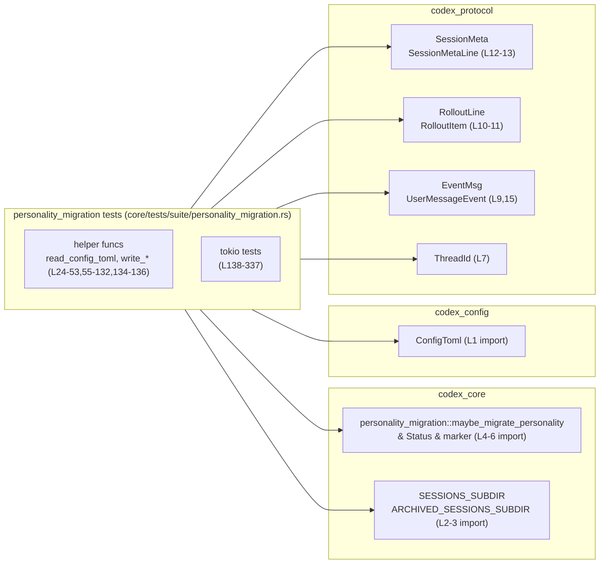
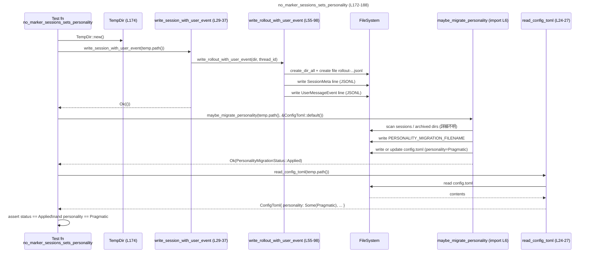

core/tests/suite/personality_migration.rs

---

## 0. ざっくり一言

`codex_core::personality_migration::maybe_migrate_personality` の挙動を、実際に一時ディレクトリ上にセッションログ（rollout JSONL）や `config.toml` を作成しながら検証する非同期テスト群です（core/tests/suite/personality_migration.rs:L1-337）。

---

## 1. このモジュールの役割

### 1.1 概要

- このファイルは **パーソナリティ設定のマイグレーション処理**（`maybe_migrate_personality`）が、既存セッションや設定ファイルの有無に応じて正しく動作するかどうかを検証します（L4-6, L138-337）。
- セッションログ（`rollout-<timestamp>-<thread_id>.jsonl`）にユーザーイベントがあるかどうかや、アーカイブ済みセッションの存在をもとに、`ConfigToml.personality` をどう設定するかをテストしています（L55-98, L100-132, L172-188, L322-337）。
- また、マイグレーション済みかどうかを示すマーカーファイル（`PERSONALITY_MIGRATION_FILENAME`）の扱い、選択プロファイルの妥当性チェック、処理の冪等性（同じ操作を2回行っても結果が変わらない性質）を確認しています（L4-5, L138-152, L278-287, L290-320）。

### 1.2 アーキテクチャ内での位置づけ

このテストモジュールは、以下のコンポーネントに依存しています。

- `codex_core::personality_migration::{maybe_migrate_personality, PersonalityMigrationStatus, PERSONALITY_MIGRATION_FILENAME}`（L4-6）
- 設定型 `ConfigToml`（L1, L24-27, L134-136）
- プロトコル型（セッションメタ・イベントなど）`SessionMetaLine`, `RolloutLine`, `RolloutItem`, `EventMsg`, `UserMessageEvent`, `ThreadId` 等（L7-15, L55-91, L100-127）
- 非同期 I/O と一時ディレクトリ：Tokio FS・`TempDir`（L19-20, L24-27, L55-57, L100-101, L138-151 ほか）

依存関係を簡略化した図です。



このモジュールは他のモジュールから呼ばれることはなく、**`maybe_migrate_personality` の外部仕様（期待される振る舞い）を定義するテストクライアント**として位置づけられます。

### 1.3 設計上のポイント

- **テスト用ヘルパー関数の分離**  
  セッションログ・アーカイブセッション・メタ情報のみのロールアウトを生成するヘルパー関数を定義し、複数テストで使い回しています（L29-53, L55-98, L100-132）。  
- **実ファイルシステムを使ったエンドツーエンド検証**  
  `TempDir` と `tokio::fs` を用いて、実際のディレクトリ・ファイル構造に対してマイグレーション処理を実行し、結果を検証しています（L138-151, L172-188, L322-337）。
- **非同期 I/O とエラー伝播**  
  すべてのテストとヘルパーは `async fn` で定義され、`tokio::fs` の非同期 API と `?` 演算子を使って `io::Result` を自然に伝播する形になっています（L24-27, L55-57, L93-97, L100-103, L129-131, L138-151 ほか）。
- **状態機械としてのマイグレーション挙動をカバー**  
  「マーカー有無」「セッション有無」「メタのみ」「明示的 personality 設定あり／なし」「プロファイル解決成功／失敗」「アーカイブセッションあり」といった状態組み合わせを個別のテストで網羅的に検証しています（L138-337）。

---

## 2. 主要な機能一覧

このファイルで定義される主な機能は次のとおりです。

- セッションログの生成ヘルパー:  
  - `write_session_with_user_event`: 通常のセッションディレクトリに、ユーザーイベントを含むロールアウトファイルを作成します（L29-37）。
  - `write_archived_session_with_user_event`: アーカイブディレクトリに、ユーザーイベントを含むロールアウトファイルを作成します（L39-43）。
  - `write_session_with_meta_only`: メタ情報のみを含むロールアウトファイルを作成します（L45-53）。
  - それらの下請けとして、`write_rollout_with_user_event` / `write_rollout_with_meta_only` が JSONL ファイルを書き出します（L55-98, L100-132）。
- Config 読み書きヘルパー:
  - `read_config_toml`: `codex_home/config.toml` を非同期で読み込み `ConfigToml` にデシリアライズします（L24-27）。
  - `parse_config_toml`: 文字列から `ConfigToml` にパースする同期ヘルパーです（L134-136）。
- マイグレーション挙動のテストケース:
  - マーカーがある／ない場合の挙動確認（例: `migration_marker_exists_no_sessions_no_change`, `no_marker_no_sessions_no_change`）（L138-152, L154-170）。
  - セッションあり／メタのみ／アーカイブセッションのみ といった条件による `personality` 設定の確認（L172-188, L206-223, L322-337）。
  - 既存 `config.toml` のフィールドが上書きされないことの確認（L190-204）。
  - 明示的な global / profile ベースの `personality` 設定がある場合にマイグレーションをスキップすることの確認（L225-246, L248-276）。
  - 不正な profile 選択時のエラーとマーカー非作成の確認、マーカー存在時のショートサーキット確認（L278-287, L290-305）。
  - マイグレーションが冪等であることの確認（L307-320）。

---

## 3. 公開 API と詳細解説

### 3.1 型一覧（構造体・列挙体など）

このファイル **自身は新しい型（構造体・列挙体）を定義していません**。外部クレートからインポートして利用している主な型は次のとおりです（すべて別ファイル定義であり、このチャンクからソースは見えません）。

| 名前 | 所属モジュール | 役割 / 用途 | 根拠 |
|------|----------------|-------------|------|
| `ConfigToml` | `codex_config::config_toml` | 設定ファイル `config.toml` を表現する設定構造体。テストでは personality や model フィールドの状態を検証しています。 | core/tests/suite/personality_migration.rs:L1, L24-27, L185-187, L195-203 |
| `PersonalityMigrationStatus` | `codex_core::personality_migration` | マイグレーション結果を示すステータス列挙体（Applied / SkippedMarker / SkippedNoSessions / SkippedExplicitPersonality など）。 | L5, L146-147, L160, L179-180, L199, L213, L233-236, L263-266, L286, L315-316, L329 |
| `Personality` | `codex_protocol::config_types` | パーソナリティの識別子。テストでは `Personality::Pragmatic` を期待値として使用しています。 | L8, L185-187, L201-203, L317-318, L335-337 |
| `ThreadId` | `codex_protocol` | スレッド／セッション ID。ロールアウトファイル名および `SessionMeta` の ID に利用されています。 | L7, L29-31, L39-41, L45-47, L55-63, L100-108 |
| `SessionMeta`, `SessionMetaLine`, `RolloutLine`, `RolloutItem`, `EventMsg`, `UserMessageEvent`, `SessionSource` | `codex_protocol::protocol` | セッションメタデータとログ行を表す型群。JSONL ロールアウトファイルの1行を構成します。 | L9-15, L55-82, L83-91, L105-127 |

これらの型の詳細な定義は、このチャンクには現れません。

### 3.2 関数詳細（7件）

#### `async fn read_config_toml(codex_home: &Path) -> io::Result<ConfigToml>`

**概要**

- 指定された `codex_home` ディレクトリ直下の `config.toml` を非同期で読み取り、`ConfigToml` にデシリアライズします（L24-27）。

**引数**

| 引数名 | 型 | 説明 |
|--------|----|------|
| `codex_home` | `&Path` | `config.toml` が存在するホームディレクトリへのパス参照。テストでは `TempDir` のパスが渡されています（L24, L185, L195）。 |

**戻り値**

- `io::Result<ConfigToml>`:  
  - 成功時: パースされた `ConfigToml`（L24-27）。  
  - 失敗時: 読み込みエラーまたは TOML パースエラーをラップした `io::Error`（L24-27, L134-136）。

**内部処理の流れ**

1. `codex_home.join("config.toml")` で設定ファイルパスを構築します（L25）。
2. `tokio::fs::read_to_string` でファイル全体を非同期に読み込みます（L25）。
3. `toml::from_str` で `ConfigToml` 型にデシリアライズし、パースエラーを `io::ErrorKind::InvalidData` に変換します（L26）。

**Examples（使用例）**

テスト内では次のように使用されています。

```rust
// 一時ディレクトリに書かれた config.toml を読み取る（L190-203 より簡略）
let temp = TempDir::new()?;                                  // 一時ディレクトリを作成
tokio::fs::write(
    temp.path().join("config.toml"),                         // config.toml のパス
    "model = \"gpt-5-codex\"\n",                             // TOML コンテンツ
).await?;
let config_toml = read_config_toml(temp.path()).await?;      // ConfigToml にロード
```

**Errors / Panics**

- `codex_home/config.toml` が存在しない場合、`read_to_string` が `io::ErrorKind::NotFound` などのエラーを返し、そのまま `Err` として伝播します（L25）。
- TOML 形式が不正な場合、`toml::from_str` のエラーが `io::ErrorKind::InvalidData` としてラップされます（L26）。
- この関数内で `panic!` を呼び出してはいません（L24-27）。

**Edge cases（エッジケース）**

- ファイルが空、あるいは必須キーが欠けている場合の挙動は、`ConfigToml` の定義と TOML デシリアライザ依存であり、このチャンクでは詳細不明です（L24-27）。
- 非 UTF-8 コンテンツの場合の扱いも同様に不明ですが、`read_to_string`/`toml` 由来のエラーとして `Err` になると考えられます（L25-26）。

**使用上の注意点**

- 非同期関数のため、Tokio ランタイムなどの非同期コンテキストから `.await` する必要があります（L138-151, L190-203）。
- エラーをそのまま呼び出し元に伝播するため、呼び出し側で `?` を使うか、`match` 等で `io::Result` を処理する前提になります（L190-203）。

---

#### `async fn write_rollout_with_user_event(dir: &Path, thread_id: ThreadId) -> io::Result<()>`

**概要**

- 指定ディレクトリに、セッションメタ情報行とユーザーイベント行を含むロールアウト JSONL ファイルを作成します（L55-98）。

**引数**

| 引数名 | 型 | 説明 |
|--------|----|------|
| `dir` | `&Path` | ロールアウトファイルを配置するディレクトリパス（L55, L29-37, L39-43）。 |
| `thread_id` | `ThreadId` | セッション ID。ファイル名と `SessionMeta` の `id` に利用されます（L55-63）。 |

**戻り値**

- `io::Result<()>`:  
  - 成功時: `Ok(())`。  
  - 失敗時: ディレクトリ作成、ファイル作成、シリアライズ、書き込みのいずれかで発生した `io::Error` / `serde_json` エラーが返ります（L55-57, L58, L93-97）。

**内部処理の流れ**

1. `tokio::fs::create_dir_all(dir)` でディレクトリを再帰的に作成します（L56）。
2. `rollout-<TEST_TIMESTAMP>-<thread_id>.jsonl` というファイル名で JSONL ファイルを作成します（L57-58）。
3. `SessionMetaLine` / `RolloutLine` / `RolloutItem::SessionMeta` を構築し、メタデータ行を生成します（L60-82）。
4. `EventMsg::UserMessage(UserMessageEvent { ... })` を使ってユーザーイベント行を生成します（L83-91）。
5. それぞれの `RolloutLine` を `serde_json::to_string` で JSON 文字列にシリアライズし、1 行ごとに `\n` を付加してファイルに書き込みます（L93-96）。

**Examples（使用例）**

テストではさらにラップされたヘルパーを通じて使われます。

```rust
// 通常セッションディレクトリに、ユーザーイベント付きロールアウトを作成（L29-37）
async fn write_session_with_user_event(codex_home: &Path) -> io::Result<()> {
    let thread_id = ThreadId::new();                       // 新しい ThreadId を生成
    let dir = codex_home                                   // SESSIONS_SUBDIR/2025/01/01 配下に配置
        .join(SESSIONS_SUBDIR)
        .join("2025")
        .join("01")
        .join("01");
    write_rollout_with_user_event(&dir, thread_id).await   // 実際の JSONL 書き込み
}
```

**Errors / Panics**

- ディレクトリ作成やファイル作成に失敗した場合、`tokio::fs` 由来の `io::Error` が `Err` として返されます（L56-58）。
- JSON シリアライズ `serde_json::to_string` が失敗した場合、そのエラー型が `?` で伝播し、呼び出し元の `io::Result` として扱われます（コンパイル上は `From` 実装などで `io::Error` へ変換されているはずですが、その詳細はこのチャンクにはありません）（L93, L95）。
- `panic!` は使用していません（L55-98）。

**Edge cases（エッジケース）**

- すでに同名ファイルが存在する場合、`File::create` は truncate するため上書きになります（Rust 標準の挙動）（L58）。
- `thread_id` の表示形式に依存してファイル名が決まるため、`ThreadId` の `Display` 実装が変更されるとファイル名パターンも変わりますが、このチャンクからは詳細不明です（L57）。

**使用上の注意点**

- 非同期関数であるため、Tokio ランタイム下で `.await` する必要があります（L29-37）。
- テストデータ生成用であり、本番コードでの利用を前提としているかどうかは、このファイルからは分かりません（L55-98）。

---

#### `async fn write_rollout_with_meta_only(dir: &Path, thread_id: ThreadId) -> io::Result<()>`

**概要**

- `write_rollout_with_user_event` とほぼ同様ですが、ユーザーイベント行を書かずに、メタ情報行のみを含むロールアウト JSONL ファイルを作成します（L100-132）。

**引数 / 戻り値**

- 引数と戻り値は `write_rollout_with_user_event` と同様です（L100-103）。

**内部処理の流れ**

1. ディレクトリを作成し、ロールアウトファイルを開きます（L101-103）。
2. `SessionMetaLine` → `RolloutLine` としてメタ情報行を構築します（L105-127）。
3. メタ情報行を JSON シリアライズして 1 行書き込み、終了します（L129-131）。

**Examples（使用例）**

```rust
// メタ情報のみのロールアウトを通常セッションディレクトリに作成（L45-53）
async fn write_session_with_meta_only(codex_home: &Path) -> io::Result<()> {
    let thread_id = ThreadId::new();                       // 新しい ThreadId
    let dir = codex_home
        .join(SESSIONS_SUBDIR)
        .join("2025")
        .join("01")
        .join("01");
    write_rollout_with_meta_only(&dir, thread_id).await    // メタのみロールアウト
}
```

**Errors / Panics / Edge cases / 注意点**

- エラーや注意点は `write_rollout_with_user_event` と同様です（L100-132）。
- この関数を使って生成された「メタのみ」セッションは、テスト `no_marker_meta_only_rollout_is_treated_as_no_sessions` によって、`maybe_migrate_personality` から「セッションなし」と扱われるべきケースとして利用されています（L206-223）。

---

#### `#[tokio::test] async fn no_marker_sessions_sets_personality() -> io::Result<()>`

**概要**

- マーカーが存在せず、ユーザーイベントを含むセッションが存在する場合、`maybe_migrate_personality` が `PersonalityMigrationStatus::Applied` を返し、`ConfigToml.personality` を `Personality::Pragmatic` に設定することを検証するテストです（L172-188）。

**引数 / 戻り値**

- テスト関数のため引数はありません。
- 戻り値は `io::Result<()>` で、テスト内の I/O エラーを `?` で扱うために用いられています（L173）。

**内部処理の流れ**

1. `TempDir::new()` で一時ディレクトリを作成します（L174）。
2. `write_session_with_user_event` で通常セッション配下にユーザーイベント付きロールアウトを作成します（L175）。
3. `maybe_migrate_personality` をデフォルトの `ConfigToml` で実行し、ステータスを取得します（L177）。
4. ステータスが `Applied` であること、マーカーファイルが作成されていることを検証します（L179-183）。
5. `read_config_toml` で保存された `config.toml` を読み、`personality` フィールドが `Some(Personality::Pragmatic)` であることを確認します（L185-187）。

**このテストから分かる契約（maybe_migrate_personality）**

- 「マーカー無し & セッションあり（ユーザーイベントあり）」のとき:
  - ステータス: `Applied`（L179）。
  - マーカー: 新規作成される（L181-183）。
  - `config.toml` が作成され、`personality` が `Pragmatic` に設定される（L185-187）。

**Errors / Edge cases**

- このテストではエラーケースは期待していませんが、I/O 失敗時にはテスト自体が失敗します（`io::Result<()>` のため）（L172-188）。

---

#### `#[tokio::test] async fn no_marker_explicit_global_personality_skips_migration() -> io::Result<()>`

**概要**

- マーカーが存在せず、グローバル設定で明示的な `personality` がすでに指定されている場合、マイグレーションはスキップされ、`config.toml` が新規に書き込まれないことを検証します（L225-246）。

**内部処理の流れ**

1. 一時ディレクトリを作成し、ユーザーイベント付きセッションを準備します（L227-228）。
2. TOML 文字列 `"personality = \"friendly\""` から `ConfigToml` を構築します（L229, L134-136）。
3. `maybe_migrate_personality` を実行し、ステータスが `SkippedExplicitPersonality` であることを検証します（L231-236）。
4. マーカーファイルは作成されているが、`config.toml` は新規作成されない（存在しない）ことを確認します（L237-244）。

**契約（抜粋）**

- 「マーカー無し & セッションあり & Config に personality 指定済み」のとき:
  - ステータス: `SkippedExplicitPersonality`（L233-236）。
  - マーカー: 作成される（L238-240）。
  - `config.toml`: 新規書き込みは行われない（存在しないまま）（L241-244）。

---

#### `#[tokio::test] async fn invalid_selected_profile_returns_error_and_does_not_write_marker() -> io::Result<()>`

**概要**

- Config で選択されたプロファイル名が存在しない場合、`maybe_migrate_personality` が `io::ErrorKind::InvalidData` で失敗し、マーカーファイルを書き込まないことを検証するテストです（L290-305）。

**内部処理の流れ**

1. 一時ディレクトリを作成します（L292）。
2. `"profile = \"missing\""` という TOML から `ConfigToml` を構築します（L293, L134-136）。
3. `maybe_migrate_personality` を実行し、`expect_err` でエラーが返ることを確認します（L295-297）。
4. 返されたエラーの `kind()` が `io::ErrorKind::InvalidData` であることを検証します（L299）。
5. マーカーファイルが存在しないことを確認します（L300-303）。

**契約（抜粋）**

- 「マーカー無し & プロファイル指定が不正」のとき:
  - 戻り値: `Err(io::Error)` であり、その `kind()` は `InvalidData`（L295-299）。
  - マーカー: 作成されない（L300-303）。

この契約は、プロファイル解決がマイグレーション処理の前段階にあり、失敗した場合はマイグレーションや marker 作成が行われないべきであることを示しています。

---

#### `#[tokio::test] async fn applied_migration_is_idempotent_on_second_run() -> io::Result<()>`

**概要**

- すでにマイグレーションが適用済みの状態で `maybe_migrate_personality` を再度実行しても、2 回目は `SkippedMarker` として扱われ、設定が崩れないことを検証するテストです（L307-320）。

**内部処理の流れ**

1. 一時ディレクトリを作成し、ユーザーイベント付きセッションを準備します（L309-310）。
2. 1 回目の `maybe_migrate_personality` を実行し、ステータスを `first_status` に格納します（L312）。
3. 2 回目の `maybe_migrate_personality` を同条件で実行し、ステータスを `second_status` に格納します（L313）。
4. `first_status == Applied`、`second_status == SkippedMarker` であることを検証します（L315-316）。
5. `config.toml` を読み直し、`personality` が `Pragmatic` のままであることを確認します（L317-318）。

**契約（抜粋）**

- 1 回目呼び出し（マーカー無し & セッションあり）:
  - ステータス: `Applied`（L315）。
  - `ConfigToml.personality` が設定される（L317-318）。
- 2 回目呼び出し（マーカーあり）:
  - ステータス: `SkippedMarker`（L316）。
  - `ConfigToml` の値は変更されない（L317-318）。

---

### 3.3 その他の関数（ヘルパー・テスト一覧）

**ヘルパー関数**

| 関数名 | 役割（1行） | 定義位置 |
|--------|------------|----------|
| `write_session_with_user_event` | `SESSIONS_SUBDIR/YYYY/MM/DD` 配下にユーザーイベント付きロールアウトを作成するラッパーです。 | core/tests/suite/personality_migration.rs:L29-37 |
| `write_archived_session_with_user_event` | `ARCHIVED_SESSIONS_SUBDIR` 配下にユーザーイベント付きロールアウトを作成するラッパーです。 | core/tests/suite/personality_migration.rs:L39-43 |
| `write_session_with_meta_only` | 通常セッション配下にメタのみロールアウトを作成するラッパーです。 | core/tests/suite/personality_migration.rs:L45-53 |
| `parse_config_toml` | TOML 文字列を `ConfigToml` にパースし、パースエラーを `io::ErrorKind::InvalidData` に変換します。 | core/tests/suite/personality_migration.rs:L134-136 |

**その他テスト関数**

| 関数名 | 役割（1行） | 定義位置 |
|--------|------------|----------|
| `migration_marker_exists_no_sessions_no_change` | マーカーが存在しセッションが無い場合、マイグレーションを行わず `config.toml` を作成しないことを確認します。 | core/tests/suite/personality_migration.rs:L138-152 |
| `no_marker_no_sessions_no_change` | マーカーもセッションも無い場合、`SkippedNoSessions` となりマーカーだけ作成され `config.toml` は作成されないことを確認します。 | L154-170 |
| `no_marker_sessions_preserves_existing_config_fields` | 既存 `config.toml` の `model` フィールドを保持したまま `personality` だけを追加することを確認します。 | L190-204 |
| `no_marker_meta_only_rollout_is_treated_as_no_sessions` | メタのみのロールアウトしかない場合は「セッションなし」と同様に扱われることを確認します。 | L206-223 |
| `no_marker_profile_personality_skips_migration` | プロファイル経由で personality が明示されている場合、マイグレーションがスキップされることを確認します。 | L248-276 |
| `marker_short_circuits_invalid_profile_resolution` | マーカーがある場合は、不正なプロファイル設定があっても `SkippedMarker` としてスキップされることを確認します。 | L278-287 |
| `no_marker_archived_sessions_sets_personality` | 通常セッションがなくても、アーカイブセッションにユーザーイベントがあれば personality を設定することを確認します。 | L322-337 |

---

## 4. データフロー

### 4.1 代表的なシナリオ: `no_marker_sessions_sets_personality` (L172-188)

このシナリオでは、「マーカーなし＋通常セッションにユーザーイベントあり」という状態で `maybe_migrate_personality` を呼んだときの処理の流れを確認しています。

#### 処理の流れ（概要）

1. 一時ディレクトリ `TempDir` が `codex_home` として用意されます（L174）。
2. ヘルパー `write_session_with_user_event` → `write_rollout_with_user_event` により、`codex_home/SESSIONS_SUBDIR/2025/01/01` にロールアウト JSONL が作成されます（L175, L29-37, L55-98）。
3. `maybe_migrate_personality(codex_home, &ConfigToml::default())` が呼ばれ、セッションログと既存 Config をもとにマイグレーション処理が実行されます（L177）。
4. マイグレーションが適用され、`PERSONALITY_MIGRATION_FILENAME` が書き出されるとともに、`config.toml` に `personality = "Pragmatic"` が設定されます（L179-183, L185-187）。
5. `read_config_toml` で `ConfigToml` を読み直し、フィールドを検証します（L185-187, L24-27）。

#### シーケンス図



`maybe_migrate_personality` の内部実装はこのチャンクには現れませんが、テストの期待値から、上記のようなデータフローが想定されていることが分かります（L172-188, L24-27, L29-37, L55-98）。

---

## 5. 使い方（How to Use）

このファイルはテストですが、ここでの呼び出し方は `maybe_migrate_personality` を利用する際の現実的な使用例になっています。

### 5.1 基本的な使用方法のパターン（テスト由来）

```rust
// 例: CLI 起動時に personality マイグレーションを実行するイメージ
#[tokio::main]
async fn main() -> io::Result<()> {
    use codex_config::config_toml::ConfigToml;
    use codex_core::personality_migration::maybe_migrate_personality;

    let codex_home = std::path::PathBuf::from("/path/to/codex_home"); // 実際のホームディレクトリ
    let config = ConfigToml::default();                               // 既存設定（例: デフォルト）

    let status = maybe_migrate_personality(&codex_home, &config).await?; // テストと同じ呼び出し（L144, L158, L177 など）

    println!("Migration status: {:?}", status);
    Ok(())
}
```

- 上記はテスト内の呼び出し（`maybe_migrate_personality(temp.path(), &ConfigToml::default()).await?`）を一般化した形です（L144, L158, L177, L312-313, L327）。

### 5.2 よくある使用パターン（テストから読み取れるもの）

1. **初回起動時: マーカー無し & セッション無し**  
   - 期待ステータス: `SkippedNoSessions`（L154-170）。
   - マーカーのみ作成され、`config.toml` は作成されません。
2. **初回起動時: セッションログあり（ユーザーイベントあり）**  
   - 期待ステータス: `Applied`（L172-188, L322-337）。
   - `config.toml` に `personality` が追加されます。
3. **既に personality が明示されている場合**  
   - 期待ステータス: `SkippedExplicitPersonality`（L225-246, L248-276）。
   - personality を変更せず、必要であれば marker のみを作成します。

これらはすべて、このチャンク内のテストが期待する挙動です。

### 5.3 よくある間違い（テストから推測できるもの）

- **プロファイル名の指定ミス**  
  - `"profile = \"missing\""` のように存在しないプロファイル名を指定すると、`InvalidData` エラーとなり marker も書き込まれません（L290-305）。
- **マーカー存在時の期待を誤解すること**  
  - マーカーがある場合、たとえ設定に問題があっても `maybe_migrate_personality` はスキップし、`SkippedMarker` を返すことが期待されています（L138-152, L278-287, L315-316）。

### 5.4 使用上の注意点（まとめ）

- **非同期コンテキストが必須**  
  - このファイルのすべての使用例は Tokio の `#[tokio::test]` 内から行われており、`maybe_migrate_personality` も `async fn` であることが分かります（L138, L154, L172 など）。
- **エラー処理**  
  - I/O や設定パースのエラーは `io::Result` として上位に伝播する前提で設計されています（L24-27, L134-136, L290-305）。
  - 特に不正なプロファイル指定は `InvalidData` として区別されるべきであることがテストから分かります（L299）。
- **冪等性**  
  - 一度 `Applied` になった後に再度呼んだ場合、`SkippedMarker` となることが前提条件としてテストされています（L307-320）。  
    したがって、アプリケーション側は複数回呼び出しても副作用が増えない前提で利用できます。

---

## 6. 変更の仕方（How to Modify）

### 6.1 新しいテストケースを追加する場合

1. **必要なフィクスチャの確認**  
   - 新しいシナリオ（例: 追加の `PersonalityMigrationStatus` バリアント）に応じて、既存のヘルパー（`write_session_with_user_event`, `write_session_with_meta_only`, `write_archived_session_with_user_event`）で再利用可能かを確認します（L29-53, L55-98, L100-132）。
2. **ヘルパーの拡張**  
   - 新しい種類のロールアウト行やセッション状態が必要であれば、`write_rollout_with_user_event` / `write_rollout_with_meta_only` に似たヘルパーを追加します（L55-98, L100-132）。
3. **テスト本体の追加**  
   - 既存のテスト関数にならい、`TempDir` を用いて独立した sandbox を作り、`maybe_migrate_personality` の期待されるステータスや副作用（marker・config ファイル内容）を検証します（L138-337）。

### 6.2 既存の機能を変更する場合（契約の確認）

- `maybe_migrate_personality` の挙動を変更する前に、このファイルのテストがどのような契約を期待しているかを確認する必要があります。
  - マーカーの有無とステータスの対応（`SkippedMarker`, `SkippedNoSessions`, `Applied`, `SkippedExplicitPersonality`）: L138-152, L154-170, L172-188, L225-246, L248-276, L307-320。
  - プロファイル解決エラー時の扱い（エラー + marker 非作成）: L290-305。
  - メタのみロールアウトの扱い（セッションなしと等価）: L206-223。
  - アーカイブセッションもセッション有りとして扱うこと: L322-337。
- 仕様変更に伴い契約が変わる場合は、このファイル内の該当テストを更新するか、新しい期待値を持つテストを追加する必要があります。

---

## 7. 関連ファイル

このモジュールと密接に関係するコンポーネントは次のとおりです。

| パス / モジュール | 役割 / 関係 |
|-------------------|------------|
| `codex_core::personality_migration` | 本テストの主対象となるモジュールで、`maybe_migrate_personality`, `PersonalityMigrationStatus`, `PERSONALITY_MIGRATION_FILENAME` を提供します（L4-6）。実際のソースファイルパスはこのチャンクからは分かりません。 |
| `codex_config::config_toml` | `ConfigToml` 型の定義を含み、`config.toml` のパース・シリアライズに使用されます（L1, L24-27, L134-136）。 |
| `codex_protocol::protocol` | セッションメタデータやイベントログを表現する各種型（`SessionMetaLine`, `RolloutLine`, `RolloutItem`, `EventMsg`, `UserMessageEvent` など）を提供します（L9-15, L55-91, L100-127）。 |
| `codex_protocol::config_types` | `Personality` 型を提供し、`ConfigToml` の `personality` フィールドに使用されます（L8, L185-187, L201-203, L317-318, L335-337）。 |
| `tokio` | テストで使用される非同期ランタイムと非同期 I/O を提供します（`#[tokio::test]`, `tokio::fs`, `AsyncWriteExt`）（L19-20, L24-27, L55-57, L100-103, L138-337）。 |
| `tempfile::TempDir` | テストごとに独立した一時ディレクトリを提供し、ファイルシステムの副作用を隔離します（L19, L140, L156, L174, L192, L208, L227, L250, L280, L292, L309, L324）。 |

このチャンクだけでは、これらモジュールの実装内容（関数内部のロジックや追加の型定義）は分かりませんが、テストから期待される外部仕様を把握することができます。
