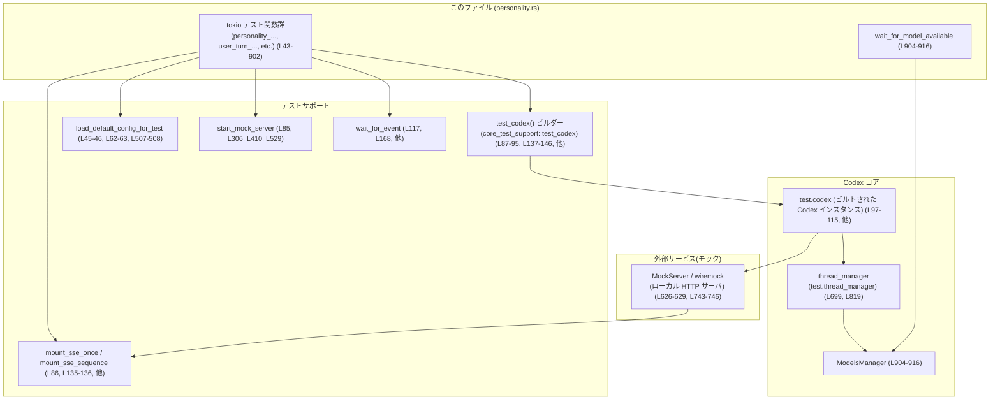
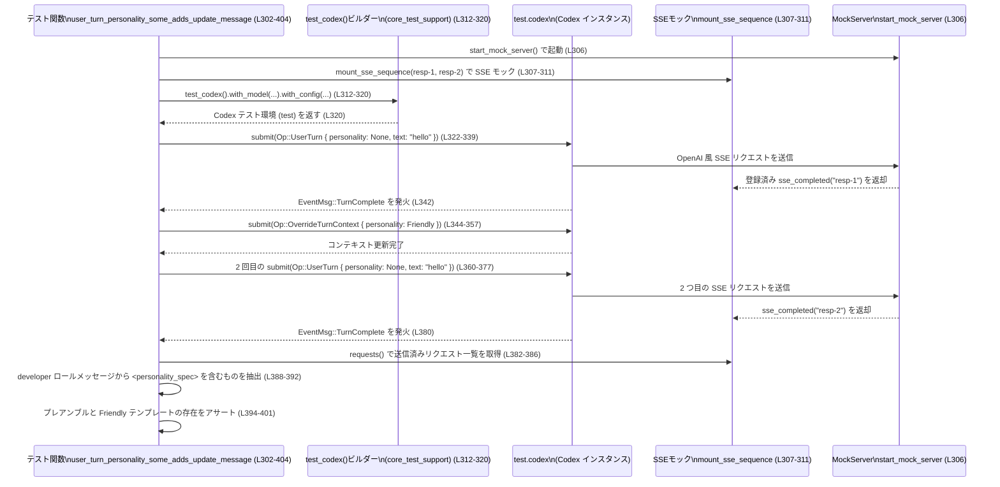

# core/tests/suite/personality.rs コード解説

## 0. ざっくり一言

Codex の **「パーソナリティ機能」**（Friendly / Pragmatic / None など）が、

- モデルのベースインストラクション
- OpenAI への送信メッセージ（developer ロール）
- ローカル／リモートモデルのテンプレート
- 機能フラグ（Feature::Personality）

とどのように連携するかを検証する **統合テスト群** です（personality.rs:L39-736）。

---

## 1. このモジュールの役割

### 1.1 概要

このモジュールは **Codex の Personality 機能の期待仕様をテストで定義**しています。

具体的には（テスト名とアサーションから読み取れる範囲で）次のような振る舞いを検証しています。

- Personality テンプレートがあっても、元の `base_instructions` が破壊的に変更されないこと（personality.rs:L43-58）。
- `config.base_instructions` を明示的に設定した場合、Personality テンプレートが無効化されること（L60-79）。
- ユーザー操作／設定ファイル／リモートモデルのテンプレート／Feature フラグの組み合わせに応じて、
  - モデル instructions に埋め込まれる Personality テキスト
  - developer ロールメッセージに追加される `<personality_spec>` 更新メッセージ  
  の有無が正しく切り替わること（L81-620, L622-902）。
- リモートモデルが取得可能になるまで非同期に待機するユーティリティ（`wait_for_model_available`）の振る舞い（L904-916）。

### 1.2 アーキテクチャ内での位置づけ

このテストファイルは **コアロジックそのものではなく、外部コンポーネントを組み合わせた統合テスト**です。

登場する主なコンポーネントと関係は以下の通りです。



- テスト関数は `test_codex()` で Codex インスタンスを構築し（L87-95, L137-146, L312-320 など）、
- `start_mock_server` や `MockServer::builder()` で立ち上げたローカル HTTP サーバに対して SSE/Models エンドポイントをモックします（L85-86, L626-683, L743-800）。
- Codex は `Op::UserTurn` / `Op::OverrideTurnContext` を非同期で送信し（L97-115, L322-339, L361-377, L545-562, 他）、
- モックサーバに送られた HTTP リクエストから instructions / developer メッセージを検証します（L119-126, L170-185, 他）。
- リモートモデルのテストでは `wait_for_model_available` が `ModelsManager` をポーリングし、モデルが一覧に現れるまで待ちます（L699-700, L819-820, L904-916）。

### 1.3 設計上のポイント

コードから読み取れる設計上の特徴は次の通りです。

- **責務の分割**
  - このファイルはあくまで「仕様の検証」に専念し、実装は
    - `codex_core::test_support::construct_model_info_offline`（モデル情報の構築, L53, L71-72, L515-516）
    - `test_codex()`（テスト用 Codex 環境の構築, L87-95, L137-146, 他）
    - `core_test_support::responses` 群（HTTP/SSE モック, L22-26, L86, L194-195, 他）
    - `ModelsManager`（モデル一覧取得, L904-916）
    に委譲しています。
- **状態管理**
  - 各テストは `TempDir` と `load_default_config_for_test` で独立した設定ディレクトリを持ち（L45-46, L62-63, L507-508）、グローバル状態の共有を避けています。
  - Personality の状態は
    - `config.personality`（設定ファイル相当, L51, L68, L144, L202, L266, L513, L695）
    - `Op::OverrideTurnContext.personality`（セッション中の上書き, L356, L461, L579, L855）
    として表現され、それぞれがどのレベルで優先されるかをテストしています。
- **エラーハンドリング**
  - 多くのテストは `anyhow::Result<()>` を返し、途中の `build()` や `submit()` の失敗を `?` でそのまま伝播させています（L81-82, L132, L190, 他）。
  - 振る舞い検証には `assert!` / `assert_eq!` / `expect` を用い、条件不一致時はパニック（テスト失敗）となります（例: L54-57, L74-78, L121-126, L517-520）。
- **並行性**
  - すべてのテストは `#[tokio::test(flavor = "multi_thread", worker_threads = 2)]` で実行され、複数スレッド上の Tokio ランタイムで非同期処理を行います（L43, L60, L81, 他）。
  - `wait_for_model_available` は `loop` + `sleep` でポーリングしつつ、2 秒のデッドラインを設けています（L904-912）。

---

## 2. 主要な機能一覧（コンポーネントインベントリー）

### 2.1 このファイルで定義される主な要素

| 名前 | 種別 | 役割 / 用途 | 定義位置 |
|------|------|-------------|----------|
| `LOCAL_FRIENDLY_TEMPLATE` | `&'static str` 定数 | ローカル Friendly パーソナリティ用の期待テンプレート文字列 | personality.rs:L39-40 |
| `LOCAL_PRAGMATIC_TEMPLATE` | `&'static str` 定数 | ローカル Pragmatic パーソナリティ用の期待テンプレート文字列 | personality.rs:L41 |
| `personality_does_not_mutate_base_instructions_without_template` | 非同期テスト関数 | Personality 機能が `base_instructions` を破壊しないことを検証 | L43-58 |
| `base_instructions_override_disables_personality_template` | 非同期テスト関数 | `base_instructions` の明示設定が Personality テンプレートを無効化することを検証 | L60-79 |
| `user_turn_personality_none_does_not_add_update_message` | 非同期テスト関数 | `Op::UserTurn.personality = None` の場合、developer メッセージに更新メッセージを追加しないことを検証 | L81-129 |
| `config_personality_some_sets_instructions_template` | 非同期テスト関数 | `config.personality = Friendly` が instructions テンプレートに反映されることを検証 | L131-187 |
| `config_personality_none_sends_no_personality` | 非同期テスト関数 | `config.personality = None` の場合、テンプレート・プレースホルダが削除されることを検証 | L189-252 |
| `default_personality_is_pragmatic_without_config_toml` | 非同期テスト関数 | Personality 未設定時のデフォルトが Pragmatic テンプレートになることを検証 | L254-300 |
| `user_turn_personality_some_adds_update_message` | 非同期テスト関数 | セッション中に Personality を Friendly に変更したとき developer メッセージに更新メッセージが入ることを検証 | L302-404 |
| `user_turn_personality_same_value_does_not_add_update_message` | 非同期テスト関数 | 既に Pragmatic のときに再度 Pragmatic を指定しても更新メッセージが増えないことを検証 | L406-503 |
| `instructions_uses_base_if_feature_disabled` | 非同期テスト関数 | Personality 機能が無効な場合、`base_instructions` のみが使われることを検証 | L505-523 |
| `user_turn_personality_skips_if_feature_disabled` | 非同期テスト関数 | Feature 無効時、`OverrideTurnContext` に Personality を指定しても更新メッセージを送らないことを検証 | L525-620 |
| `remote_model_friendly_personality_instructions_with_feature` | 非同期テスト関数 | リモートモデルの Friendly テンプレートが config.personality と Feature 有効時に instructions に採用されることを検証 | L622-736 |
| `user_turn_personality_remote_model_template_includes_update_message` | 非同期テスト関数 | リモートモデル利用時に Personality の上書きで remote テンプレート由来の更新メッセージが developer 入力に含まれることを検証 | L738-902 |
| `wait_for_model_available` | 非同期ヘルパー関数 | `ModelsManager` 経由で指定 slug のモデルが利用可能になるまで最大 2 秒ポーリングする | L904-916 |

### 2.2 外部コンポーネント（このファイルから利用される主な API）

※ 実装は別ファイルで、このチャンクには現れません。用途は呼び出し箇所と命名から読み取れる範囲で記述します。

| 名前 | 所属 | 役割 / 用途 | 利用位置 |
|------|------|------------|----------|
| `Personality` | `codex_config::types` | Personality 設定値（Friendly / Pragmatic / None など）を表す列挙体と推測されます | L1, L51, L68, L144, L202, L266, L356, L423-424, L513, L579, L695, L717, L855 |
| `Feature::Personality` | `codex_features` | Personality 機能の Feature フラグ。enable/disable メソッドでオン／オフされます | L2, L49, L66, L92, L142, L200, L265, L317, L421, L511, L540, L692, L813 |
| `ModelsManager` | `codex_models_manager::manager` | 利用可能なモデル一覧を取得するマネージャ。`list_models` を使用 | L3, L904-907 |
| `RefreshStrategy::OnlineIfUncached` | 同上 | モデル一覧取得時の更新戦略（未キャッシュならオンライン取得） | L4, L907 |
| `ModelInfo` / `ModelsResponse` | `codex_protocol::openai_models` | モデルメタデータを表現する構造体 | L7, L11, L634-675, L751-792, L679-681, L796-798 |
| `ModelMessages` / `ModelInstructionsVariables` | 同上 | モデル固有の instructions テンプレートと変数定義 | L8-9, L650-657, L767-773 |
| `AskForApproval` / `SandboxPolicy` / `Op` / `EventMsg` | `codex_protocol::protocol` | Codex プロトコルのコマンド (`Op::UserTurn` / `Op::OverrideTurnContext`) とイベント、およびサンドボックス設定・承認ポリシー | L16-19, L97-115, L148-165, L206-223, L270-287, L323-339, L361-377, L427-444, L466-482, L545-562, L583-600, L701-718, L821-838, L843-856, L860-876, L117, L168, L226, 他 |
| `test_codex` | `core_test_support::test_codex` | テスト用 Codex インスタンス生成ビルダー | L28, L87-95, L137-146, L195-203, L260-267, L312-320, L416-424, L535-542, L687-696, L808-816 |
| `mount_sse_once` / `mount_sse_sequence` / `sse_completed` / `mount_models_once` / `start_mock_server` | `core_test_support::responses` | Wiremock ベースの SSE / Models エンドポイントモック | L22-26, L86, L135-136, L193-195, L259-260, L307-311, L411-415, L530-534, L677-683, L685, L794-800, L802-806 |
| `MockServer` / `BodyPrintLimit` | `wiremock` | HTTP モックサーバの実体とボディログ制限 | L36-37, L626-629, L743-746 |
| `wait_for_event` | `core_test_support` | Codex からのイベントを待機するテスト用ヘルパー | L29, L117, L168, L226, L290, L342, L380, L447, L485, L565, L603, L721, L841, L879 |

---

## 3. 公開 API と詳細解説

このファイルはテストモジュールであり、ライブラリとして「公開」される API はありません。ただし、**Codex Personality 機能の外部インターフェース契約**を知るうえで重要な関数を、テスト関数として整理します。

### 3.1 型一覧（このファイルで新規定義される型）

このファイル内で構造体や列挙体は新規定義されていません（personality.rs:L1-916）。  
代わりに、テストが前提としている **設定値・操作** の型を整理します。

| 名前 | 種別 | 役割 / 用途 | 根拠 |
|------|------|-------------|------|
| `Personality` | 列挙体（と推測） | Friendly / Pragmatic / None などのパーソナリティ設定。config と turnコンテキストの両方に登場 | L1, L51, L68, L144, L202, L266, L356, L423-424, L513, L579, L695, L717, L855 |
| `Feature` | 列挙体（と推測） | 機能フラグ。ここでは `Feature::Personality` の enable/disable メソッドのみ利用 | L2, L49-50, L66-67, L91-93, L141-143, L199-201, L264-266, L316-318, L420-422, L510-512, L539-541, L691-693, L812-814 |
| `Op` | 列挙体（と推測） | Codex プロトコルの操作。`UserTurn` と `OverrideTurnContext` バリアントを使用 | L18, L97-115, L148-165, L206-223, L270-287, L323-339, L361-377, L427-444, L466-482, L545-562, L583-600, L701-718, L821-838, L843-856, L860-876 |

### 3.2 関数詳細（代表 7 件）

#### `config_personality_some_sets_instructions_template()`

```rust
#[tokio::test(flavor = "multi_thread", worker_threads = 2)]
async fn config_personality_some_sets_instructions_template() -> anyhow::Result<()> { ... }
```

**概要**

- Config の `personality` を `Some(Personality::Friendly)` に設定した場合、
  - モデル instructions に `LOCAL_FRIENDLY_TEMPLATE` が含まれること
  - developer ロールには `<personality_spec>` メッセージが追加されないこと  
  を検証する統合テストです（personality.rs:L131-187）。

**引数**

- 引数なし（テスト関数）。

**戻り値**

- `anyhow::Result<()>`  
  - テスト内の `builder.build(&server).await?` や `submit(...).await?` の失敗を上位（テストランナー）に伝播します（L146-147, L165-166）。

**内部処理の流れ**

1. ネットワークが利用できない環境では `skip_if_no_network!(Ok(()))` で早期リターンします（L133）。
2. `start_mock_server()` で Wiremock ベースのモックサーバを起動し（L135）、
   `mount_sse_once` と `sse_completed("resp-1")` で 1 回だけレスポンスを返す SSE エンドポイントを設定します（L136）。
3. `test_codex()` ビルダーで Codex インスタンスを構築します（L137-146）。
   - モデルは `"gpt-5.2-codex"`（L138）。
   - `config.features.enable(Feature::Personality)`（L140-143）。
   - `config.personality = Some(Personality::Friendly)`（L144）。
4. `test.codex.submit(Op::UserTurn { ... })` を実行し、Personality を明示指定せずにユーザー入力 `"hello"` を送信します（L148-165）。
5. `wait_for_event` で `EventMsg::TurnComplete(_)` が届くまで待機します（L168）。
6. SSE モックに届いたリクエストを取得し（L170）、
   - `instructions_text()` からモデル instructions を抽出（L171）。
   - `LOCAL_FRIENDLY_TEMPLATE` が含まれることを `assert!` で検証（L173-176）。
7. developer ロールメッセージの一覧を取得し（L178）、各メッセージに `<personality_spec>` が含まれないことを検証します（L179-184）。

**Examples（使用例）**

テストと同じパターンで、設定ファイルレベルで Personality を Friendly に設定して使う例です。

```rust
// 設定構築（テストでは test_codex ビルダー経由）
config.features.enable(Feature::Personality)?;                 // Personality 機能を有効化 (L140-143)
config.personality = Some(Personality::Friendly);              // Friendly をデフォルトに設定 (L144)

// ユーザーターン送信（Personality は turn では指定しない）
codex.submit(Op::UserTurn {
    items: vec![UserInput::Text {
        text: "hello".into(),
        text_elements: Vec::new(),
    }],
    // 省略: cwd, approval_policy, sandbox_policy など (L148-165)
    personality: None,
}).await?;
```

**Errors / Panics**

- ネットワークが利用できない場合は `skip_if_no_network!` によりスキップされ、テストは失敗しません（L133）。
- `builder.build(&server).await?` や `submit(...).await?` がエラーを返すと `anyhow::Error` としてテストが失敗します（L146-147, L165-166）。
- アサーション失敗時には `assert!` のパニックでテストが失敗します。
  - Friendly テンプレートが含まれない場合（L173-176）。
  - developer メッセージに `<personality_spec>` が含まれる場合（L179-184）。

**Edge cases（エッジケース）**

- Personality を turn 側で `Some(...)` 指定していないケースのみを検証しています（L164-165）。
- Personality 機能が無効な場合は別テスト `instructions_uses_base_if_feature_disabled` / `user_turn_personality_skips_if_feature_disabled` で扱われます（L505-523, L525-620）。

**使用上の注意点**

- **前提**: `Feature::Personality` を有効にしないとテンプレートは適用されません（L140-143）。
- Personality を設定ファイルで固定したい場合は `config.personality` を使い、turn 毎に変更したい場合は `Op::OverrideTurnContext` を使うのが想定されます（後者は別テストで検証, L344-357）。

---

#### `config_personality_none_sends_no_personality()`

**概要**

- `config.personality = Some(Personality::None)` と明示した場合、
  - Friendly / Pragmatic テンプレート文字列も
  - `{{ personality }}` プレースホルダも  
  instructions には含まれないことを検証します（personality.rs:L189-252）。

**内部処理の要約**

- Friendly 版とほぼ同じ構成で Codex を起動するが、`config.personality = Some(Personality::None)` と設定（L197-203）。
- `UserTurn` を 1 回投げたあと（L206-223）、SSE リクエストの instructions から
  - `LOCAL_FRIENDLY_TEMPLATE`（L230-233）
  - `LOCAL_PRAGMATIC_TEMPLATE`（L234-237）
  - `{{ personality }}`（L238-241）
  の不在を `assert!` で検証。
- developer ロールに `<personality_spec>` メッセージが存在しないことを確認（L243-249）。

**契約として読み取れる挙動**

- Personality を「None」にした場合、
  - Personality プレースホルダは完全に削除され、
  - どの Personality テキストも挿入されない  
  という仕様がテストで期待されています。

---

#### `default_personality_is_pragmatic_without_config_toml()`

**概要**

- Personality を config.toml に設定しない場合のデフォルトが **Pragmatic テンプレート**であることを検証します（L254-300）。

**ポイント**

- テスト内では `config.personality` を一切代入していません（L262-267）。
- `Feature::Personality` を有効にしたうえで `UserTurn` を送信し（L264-266, L270-287）、
- instructions に `LOCAL_PRAGMATIC_TEMPLATE` が含まれることを `assert!` しています（L292-297）。

このことから、**Personality 未設定時は Pragmatic 相当の性格が適用される**という外部仕様が読み取れます。

---

#### `user_turn_personality_some_adds_update_message()`

**概要**

- セッション途中で `Op::OverrideTurnContext` によって Personality を Friendly に変更した場合、
  - 2 回目の `UserTurn` の developer ロールメッセージに
    - `<personality_spec>` を含む Personality 更新メッセージ
    - Friendly テンプレートテキスト  
  が含まれることを検証するテストです（L302-404）。

**引数 / 戻り値**

- 引数なし、戻り値は `anyhow::Result<()>`（L303-304）。

**内部処理の流れ**

1. ネットワーク環境チェック後、モックサーバと 2 レスポンス分の SSE エンドポイントを設定（L304-311）。
2. `test_codex()` ビルダーで
   - モデル: `"exp-codex-personality"`（L313）
   - `Feature::Personality` 有効化（L315-318）
   を指定して Codex を構築（L312-320）。
3. **1 回目のターン**
   - Personality 指定なしで `UserTurn` を送信（L322-339）。
   - `TurnComplete` を待機（L342）。
4. **コンテキスト上書き**
   - `OverrideTurnContext` で `personality: Some(Personality::Friendly)` をセット（L344-357）。
5. **2 回目のターン**
   - 再度 `UserTurn` を送信（L360-377）。
   - `TurnComplete` を待機（L380）。
6. モック SSE に届いたリクエストを 2 件取得し、2 件目を Personality 更新後のリクエストとして取り出す（L382-386）。
7. developer ロールメッセージの中から `<personality_spec>` を含むメッセージを探し（L388-392）、
   - 「The user has requested a new communication style.」というプレアンブルを含むこと（L394-397）
   - `LOCAL_FRIENDLY_TEMPLATE` を含むこと（L398-401）
   を検証。

**Errors / Panics**

- SSE リクエストが 2 件でない場合 `assert_eq!(requests.len(), 2, ...)` がパニック（L383）。
- `<personality_spec>` を含むメッセージが見つからない場合 `expect` がパニック（L389-392）。
- 期待するテキストがメッセージに含まれない場合 `assert!` がパニック（L394-401）。

**Edge cases**

- Personality が同じ値に変わった場合の挙動は別テスト `user_turn_personality_same_value_does_not_add_update_message` で扱われます（L406-503）。
- ここでは turn 側 Personality は常に `None` で、コンテキスト上書きのみ利用しています（L338-339, L376-377）。

**使用上の注意点**

- Personality の「変更」を通知するメッセージは、
  - 直前の Personality と異なる値を `OverrideTurnContext` で指定した場合にだけ送信されることが別テストから読み取れます（L449-462, L493-500）。
- Personality 機能を使った UI では「現在の Personality」と「新しい Personality」を正しく追跡する必要があります。

---

#### `user_turn_personality_skips_if_feature_disabled()`

**概要**

- Personality 機能を Feature フラグで無効にした状態で、
  - `OverrideTurnContext` で Personality を Pragmatic に設定しても、
  - 2 回目の `UserTurn` の developer ロールに Personality 更新メッセージが追加されないこと  
  を検証します（L525-620）。

**内部処理の流れ（簡略）**

1. ネットワークチェック後、モックサーバと SSE（2 回分）を準備（L527-534）。
2. `test_codex()` ビルダーで `"exp-codex-personality"` を選択し（L536）、  
   `config.features.disable(Feature::Personality)` を実行（L537-541）。
3. 1 回目の `UserTurn` を Personality 指定なしで送信（L545-562）。
4. `TurnComplete` を待機（L565）。
5. `OverrideTurnContext` で Personality を Pragmatic に設定（L568-580）。
6. 2 回目の `UserTurn` を送信（L583-600）。
7. 2 件の SSE リクエストのうち 2 件目を取得し（L605-609）、  
   developer ロールメッセージに `<personality_spec>` が含まれないことを検証（L611-617）。

**契約として読み取れる挙動**

- Feature フラグで Personality 機能が無効な場合、
  - 設定や `OverrideTurnContext` に Personality を指定しても、
  - OpenAI 側への Personality 更新メッセージは送信されない  
  という仕様がテストで保証されています。

---

#### `remote_model_friendly_personality_instructions_with_feature()`

**概要**

- Personality 機能が有効な状態でリモートモデルを使う場合、
  - リモートモデルが提供する Friendly テンプレート文字列（`personality_friendly`）が instructions に埋め込まれ、
  - `personality_default` 用の文字列は含まれない  
  ことを検証します（L622-736）。

**内部処理の流れ**

1. Wiremock ベースの `MockServer` を起動し、ボディログを 80,000 バイトに制限（L626-629）。
2. `remote_slug`, `default_personality_message`, `friendly_personality_message` を定義（L631-633）。
3. `ModelInfo` を手動構築（L634-675）。
   - `model_messages.instructions_template = "Base instructions\n{{ personality }}\n"`（L650-651）。
   - `instructions_variables` に
     - `personality_default = default_personality_message`（L652-653）
     - `personality_friendly = friendly_personality_message`（L654-655）
     を設定。
4. `mount_models_once` で上記モデルのみを返す `/models` エンドポイントをモック（L677-683）。
5. `mount_sse_once` で SSE モックも準備（L685）。
6. `test_codex()` ビルダーで
   - ダミー認証（L687-688）
   - `Feature::Personality` 有効化（L689-693）
   - `config.model = Some(remote_slug)`（L694）
   - `config.personality = Some(Personality::Friendly)`（L695）
   を指定して Codex を構築（L687-697）。
7. `wait_for_model_available` で `ModelsManager` から `remote_slug` が見えるまで待機（L699-700）。
8. `UserTurn` を Personality = Friendly で送信（L701-718）。
9. SSE リクエストの instructions を取得し（L723-724）、
   - `friendly_personality_message` を含むこと（L726-729）
   - `default_personality_message` を含まないこと（L730-733）
   を検証。

**使用上の注意点**

- Personality を Friendly に選択すると、ローカルテンプレートではなく **リモートモデルが提供する Friendly テキスト** が instructions に入る仕様が読み取れます（L652-655, L726-729）。
- デフォルト Personality を持つリモートモデルでは、明示的 Personality が指定された場合デフォルトは使われないことがテストされています。

---

#### `user_turn_personality_remote_model_template_includes_update_message()`

**概要**

- リモートモデル利用時に、セッション途中で Personality を Friendly に変更した場合、
  - 2 回目の `UserTurn` の developer ロールに
    - 「The user has requested a new communication style.」プレアンブル
    - リモートモデル由来の Friendly テンプレート  
  を含む更新メッセージが入ることを検証します（L738-902）。

**内部処理の特徴**

- リモートモデルの `ModelInfo` を構築する点は前テストと類似ですが、ここでは `personality_default` を `None` とし（L770）、Friendly / Pragmatic のみを定義しています（L771-772）。
- モデル一覧と SSE をモックし（L794-800, L802-806）、`test_codex()` にダミー認証と Feature 有効化を設定（L808-816）。
- ビルド時にはローカルモデル `"gpt-5.2-codex"` を指定しつつ（L815）、`UserTurn` の `model` には `remote_slug` を渡しています（L832-833, L869-870）。
- 1 回目のターン → Personality Friendly に上書き (`OverrideTurnContext`) → 2 回目のターン、という流れはローカル版のテストと同様です（L821-838, L843-856, L860-876）。
- 2 回目の SSE リクエストから developer ロールを取得し（L881-887）、`remote_friendly_message` を含むメッセージを特定（L887-890）。
- プレアンブルと Friendly メッセージの両方を `assert!` で検証（L892-899）。

**契約として読み取れる挙動**

- Personality 更新メッセージでも、テキストの本体はリモートモデルの `instructions_variables.personality_friendly` 由来になります（L769-773, L887-890）。
- ローカルテンプレート（`LOCAL_FRIENDLY_TEMPLATE`）ではなく、リモートテンプレートが優先される点がローカル版テストとの違いです。

---

#### `wait_for_model_available(manager: &Arc<ModelsManager>, slug: &str)`

```rust
async fn wait_for_model_available(manager: &Arc<ModelsManager>, slug: &str) { ... }
```

**概要**

- `ModelsManager` から指定 slug のモデルが取得できるまで、**最大 2 秒間ポーリング**するユーティリティ関数です（L904-916）。
- 主にリモートモデルテストで、モデルメタデータが `/models` からフェッチされるのを待つ目的で使われます（L699-700, L819-820）。

**引数**

| 引数名 | 型 | 説明 |
|--------|----|------|
| `manager` | `&Arc<ModelsManager>` | モデル一覧取得 API を提供する `ModelsManager` への共有ポインタ参照 | L904 |
| `slug` | `&str` | 利用可能になるのを待つモデルの slug（例: `"codex-remote-default-personality"`） | L904, L631, L748 |

**戻り値**

- `()`（戻り値なし）。
- モデルが見つかった時点で `return`、タイムアウト時には `panic!` を発生させます。

**内部処理の流れ**

1. 現在時刻に 2 秒を加えた `deadline` を計算（`Instant::now() + Duration::from_secs(2)`, L905）。
2. 無限ループ（`loop`）に入り、各イテレーションで以下を実行（L906-915）。
   1. `manager.list_models(RefreshStrategy::OnlineIfUncached).await` でモデル一覧を取得（L907）。
   2. `.iter().any(|model| model.model == slug)` で指定 slug のモデルが含まれているか確認（L907-909）。
      - 見つかった場合は `return` して終了（L908-909）。
   3. `Instant::now() >= deadline` でタイムアウトを判定し、超えていれば `panic!("timed out waiting for the remote model {slug} to appear")` を実行（L911-912）。
   4. まだ見つからず、かつタイムアウトしていなければ `sleep(Duration::from_millis(25)).await` で 25ms 待って再試行（L914）。

**Errors / Panics**

- `list_models(...).await` のエラーはこのコードからは見えませんが、ここでは `Result` を受け取っていないため、`list_models` 側でエラーを処理しているかパニックを起こす契約になっていると考えられます（このチャンクには詳細は現れません）。
- 2 秒以内にモデルが一覧に現れない場合は `panic!` でテストを失敗させます（L911-912）。

**Edge cases**

- モデルがすでにキャッシュされている場合、最初の `list_models` 呼び出しで即座に `return` します。
- `/models` エンドポイントが応答しない、またはモデルを返さない場合は 2 秒後に必ずパニックになります。

**使用上の注意点**

- テスト専用ユーティリティと見なせます。タイムアウト時に `panic!` するため、本番コードで直接利用する場合は別途エラー処理を設ける必要があります。
- `Arc<ModelsManager>` を参照で受け取り、内部でクローン等を行っていないため、所有権・借用の観点では単純な共有読み取り用途です（L904-907）。

---

### 3.3 その他の関数（概要のみ）

| 関数名 | 役割（1 行） | 定義位置 |
|--------|--------------|----------|
| `personality_does_not_mutate_base_instructions_without_template` | Personality 適用後も `model_info.base_instructions` が変化しないことを確認する（オフラインモデル情報） | L43-58 |
| `base_instructions_override_disables_personality_template` | `config.base_instructions` を設定した場合に Personality テンプレートが無視されることを確認する | L60-79 |
| `user_turn_personality_none_does_not_add_update_message` | `UserTurn.personality = None` の場合に developer ロールへ Personality 更新メッセージを追加しないことを検証する | L81-129 |
| `user_turn_personality_same_value_does_not_add_update_message` | もともと Pragmatic のセッションで再度 Pragmatic を指定しても更新メッセージが追加されないことを検証する | L406-503 |
| `instructions_uses_base_if_feature_disabled` | Feature 無効時に instructions が Personality ではなく `base_instructions` を使うことを検証する | L505-523 |

---

## 4. データフロー

### 4.1 代表シナリオ: Personality 変更時のリクエストフロー

`user_turn_personality_some_adds_update_message` を例に、**ユーザー入力 → Codex → モックサーバ → 検証** の流れを示します（L302-404）。



この図から、

- Codex は `OverrideTurnContext` による Personality 変更を内部状態に保持し、
- 次回の `UserTurn` のリクエストに `<personality_spec>` を含む developer ロールメッセージを追加する  
という「コントロールフロー」がテストを通じて確認されていることが分かります。

---

## 5. 使い方（How to Use）

ここでは、このテストコードから読み取れる **Personality 機能の使い方パターン**をまとめます。

### 5.1 基本的な使用方法（Config で Personality を指定）

テスト `config_personality_some_sets_instructions_template`（L131-187）と `default_personality_is_pragmatic_without_config_toml`（L254-300）から、設定ファイルレベルで Personality を指定するパターンが読み取れます。

```rust
// 1. 設定や依存オブジェクトを用意する
let codex_home = TempDir::new()?;                              // 一時ディレクトリ (L45, L62, L507)
let mut config = load_default_config_for_test(&codex_home).await?; // デフォルト設定の読み込み (L46, L63, L508)

// 2. Personality 機能を有効化する
config.features.enable(Feature::Personality)?;                 // 機能フラグをオン (L49-50, L66-67, L264-266)

// 3. Personality を設定ファイルレベルで指定する（例: Friendly）
config.personality = Some(Personality::Friendly);              // Friendly に固定 (L51, L144, L695)

// 4. モデル情報／Codex インスタンスを構築する
let model_info =
    codex_core::test_support::construct_model_info_offline("gpt-5.2-codex", &config);
// または test_codex() ビルダー経由で Codex を構築 (L137-146)

// 5. instructions を取得する
let instructions = model_info.get_model_instructions(config.personality);
// Personality Friendly 用のテンプレートが内部で適用されることがテストで確認されています (L173-176)
```

### 5.2 よくある使用パターン

#### パターン1: セッション途中で Personality を変える

`user_turn_personality_some_adds_update_message` / `user_turn_personality_remote_model_template_includes_update_message` から、**turn コンテキスト上書き**のパターンが読み取れます（L344-357, L843-856）。

```rust
// 初期設定: Personality 機能は有効だが、config.personality は未設定 (L315-318)
config.features.enable(Feature::Personality)?;

// セッション中に Personality を Friendly に変更
codex.submit(Op::OverrideTurnContext {
    cwd: None,
    approval_policy: None,
    approvals_reviewer: None,
    sandbox_policy: None,
    windows_sandbox_level: None,
    model: None,
    effort: None,
    summary: None,
    service_tier: None,
    collaboration_mode: None,
    personality: Some(Personality::Friendly),                 // ここで Personality を上書き (L356, L855)
}).await?;

// 以降の UserTurn では Friendly スタイルで応答し、
// OpenAI 側には Personality 更新メッセージが developer ロールで送られることがテストで確認されています (L388-401, L887-899)
```

#### パターン2: Personality 機能を無効化したい場合

`instructions_uses_base_if_feature_disabled` と `user_turn_personality_skips_if_feature_disabled` により、Feature フラグを無効にしたときの動作が確認されています（L505-523, L525-620）。

```rust
// Personality 機能を明示的に無効化
config.features.disable(Feature::Personality)?;                // L510-512, L539-541

// この状態では、config.personality や OverrideTurnContext.personality に値を入れても、
// instructions には base_instructions のみが使われ、
// developer ロールにも Personality 更新メッセージは送られないことがテストで確認されています
```

### 5.3 よくある間違い

テストから推測される「誤用しやすい」例と正しい例です。

```rust
// 間違い例: Feature を有効化せずに Personality を指定している
config.personality = Some(Personality::Friendly);              // L513 と同様
// config.features.enable(Feature::Personality)?; を呼んでいない

// この場合、テスト `instructions_uses_base_if_feature_disabled` が示すように
// get_model_instructions(...) は base_instructions をそのまま返すだけです (L515-520)


// 正しい例: Feature を有効化したうえで Personality を指定する
config.features.enable(Feature::Personality)?;                 // 機能フラグON (L49-50, L264-266)
config.personality = Some(Personality::Friendly);
// これにより Friendly テンプレートが instructions に適用されることがテストで確認されています (L173-176)
```

```rust
// 間違い例: Personality が変わっていないのに、変更があったと期待する
config.personality = Some(Personality::Pragmatic);             // 初期状態 (L423-424)

// 途中で再度 Pragmatic を指定
codex.submit(Op::OverrideTurnContext {
    // ...省略...
    personality: Some(Personality::Pragmatic),                 // L461
}).await?;

// テスト `user_turn_personality_same_value_does_not_add_update_message` が示すように、
// この場合は Personality 更新メッセージは追加されません (L493-500)。
```

### 5.4 使用上の注意点（まとめ）

- **Feature フラグ**
  - `Feature::Personality` を有効化しないと、config/turn の Personality 設定は instructions や developer メッセージに反映されません（L510-512, L539-541）。
- **優先順位（推測可能な範囲）**
  - `config.base_instructions` が設定されている場合、Personality テンプレートは完全に無効化されます（L69-78）。
  - Personality の適用先は、ローカルモデルとリモートモデルで異なり、後者では `ModelInfo.model_messages.instructions_variables` の値が使われます（L650-657, L767-773）。
- **変更検知**
  - Personality の更新メッセージは「値が変化した場合」にのみ送信される仕様がテストから読み取れます（L388-392 vs L493-500）。
- **並行性**
  - すべてのテストは `Tokio` の multi_thread ランタイム上で動きますが、このファイル内では `unsafe` や明示的なスレッド生成は行っていません（L43, L60, L81, 他）。
  - `wait_for_model_available` は 25ms 間隔でポーリングするため、短時間で大量に呼び出すとテスト全体の時間に影響します（L904-915）。

---

## 6. 変更の仕方（How to Modify）

このファイルはテストコードです。ここを変更する場合は、**Codex の Personality 機能の仕様変更**を反映する目的になることが想定されます。

### 6.1 新しい機能を追加する場合

例: 新しい Personality バリアント（例: `Personality::Formal`）が追加されたとします。

1. **仕様把握**
   - 新バリアントが
     - config のデフォルトでどう扱われるのか（Pragmatic のようにデフォルトになるか）
     - ローカルテンプレート／リモートテンプレートでどのようなテキストになるのか  
     を確認します（この情報は別ファイルにあります。このチャンクには現れません）。
2. **テストの追加箇所**
   - Config レベルの挙動: `default_personality_is_pragmatic_without_config_toml`（L254-300）に類似したテストを新設。
   - Turn コンテキスト変更の挙動: `user_turn_personality_some_adds_update_message`（L302-404）やリモート版（L738-902）を参考に Formal 用のテストを追加。
3. **モックモデルの更新**
   - リモートテンプレートがある場合は `ModelInfo.model_messages.instructions_variables` に `personality_formal` を追加した `remote_model` をモック（L652-655, L771-772 を参考）。
4. **SSE 検証**
   - `LOCAL_*_TEMPLATE` に相当する Formal テンプレート定数を追加し、instructions_text/developer_texts にそれが含まれるかを `assert!` で検証します（L39-41, L173-176, L399-401 参照）。

### 6.2 既存の機能を変更する場合

例: 「Personality None のときは `{{ personality }}` プレースホルダを残す」よう仕様変更するときの注意点です。

- 影響範囲の確認
  - 少なくとも `config_personality_none_sends_no_personality`（L189-252）のアサーションが変更対象になります。
  - ほかのテストが暗黙に「プレースホルダは消える」と仮定していないかを確認します（`instructions_text.contains("{{ personality }}")` を参照, L238-241）。
- 契約の更新
  - 「None のときに placeholder を残す」のが仕様であれば、テスト名・コメント（必要であれば）も合わせて更新します。
- テストの再実行
  - Personality の default や Feature 無効時挙動に関するテスト（L254-300, L505-523, L525-620）も合わせて実行し、意図しない副作用がないことを確認します。

---

## 7. 関連ファイル

このモジュールと密接に関係する（と読み取れる）ファイル・ディレクトリです。パス名は `use` 句・モジュール名からの推測であり、このチャンクの外に実装があります。

| パス | 役割 / 関係 |
|------|------------|
| `core_test_support::test_codex` | `test_codex()` ビルダーを提供し、テスト用の Codex 実行環境（設定・ストレージ・モックなど）を構築します（L28, L87-95, 他）。 |
| `core_test_support::responses` | `mount_sse_once` / `mount_sse_sequence` / `mount_models_once` / `sse_completed` / `start_mock_server` など、Wiremock を用いた HTTP/SSE モックヘルパー群です（L22-26, L86, L194-195, 他）。 |
| `core_test_support::load_default_config_for_test` | `TempDir` 上にテスト用のデフォルト設定を生成する関数で、Personality や Feature のデフォルト値はここで決まると考えられます（L21, L45-46, L62-63, L507-508）。 |
| `codex_core::test_support::construct_model_info_offline` | オフラインで `ModelInfo` を構築するヘルパー。Personality テンプレートの適用ロジックがここか、さらに内側に存在すると考えられます（L53, L71-72, L515-516）。 |
| `codex_models_manager::manager` | `ModelsManager` と `RefreshStrategy` を提供し、`wait_for_model_available` からモデル一覧取得に利用されます（L3-4, L904-907）。 |
| `codex_protocol::openai_models` | `ModelInfo` / `ModelMessages` / `ModelInstructionsVariables` など、OpenAI モデルメタデータと Personality テンプレートの表現を定義するモジュールです（L6-15, L634-675, L751-792）。 |
| `codex_protocol::protocol` | `Op` / `EventMsg` / `SandboxPolicy` / `AskForApproval` など、Codex とフロントエンド間のプロトコル型を定義します（L16-19, L97-115, L148-165, 他）。 |

このファイルは、これらのコンポーネントの組み合わせを通じて **Personality 機能の期待仕様**をテストで明示する役割を持っています。
