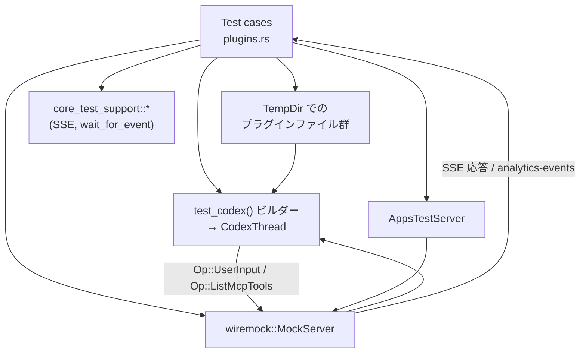
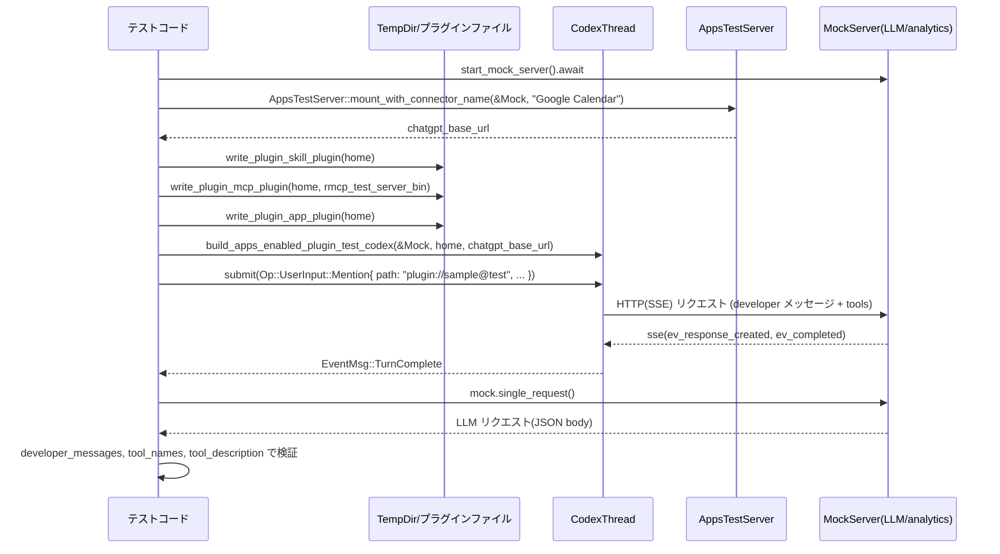

# core/tests/suite/plugins.rs コード解説

## 0. ざっくり一言

Codex の「プラグイン（Skills / MCP / Apps）」機能について、  
実際のファイル構成とモック HTTP サーバーを使って、開発者メッセージ・ツール公開・分析イベント送信を検証する非 Windows 環境専用の統合テスト群です（`core/tests/suite/plugins.rs:L1-2,27-29,185-447`）。

---

## 1. このモジュールの役割

### 1.1 概要

- このテストモジュールは **Codex のプラグイン機能が外部振る舞いとして正しく見えるか** を検証します。
- 具体的には次を確認します（`core/tests/suite/plugins.rs:L185-447`）。
  - プラグイン情報が LLM への「developer メッセージ」に所定の順序と内容で埋め込まれること
  - ユーザーが特定プラグインを明示的にメンションしたターンで、プラグインに紐づく Skills / MCP / Apps がガイダンスとして提示され、ツールとして露出すること
  - プラグイン利用が分析イベント（analytics）として送信されること
  - プラグイン由来の MCP ツールが `Op::ListMcpTools` で列挙されること

### 1.2 アーキテクチャ内での位置づけ

このテストファイルは、Codex コアスレッドとモックサーバー・一時ディレクトリを組み合わせた E2E 風構成になっています。



- テストは `TempDir` 上にプラグイン構成ファイル（manifest, skills, MCP, apps）を書き出します（`write_*` 群、`core/tests/suite/plugins.rs:L35-81,83-95`）。
- `test_codex()` から `CodexThread` を構築し、この `home` とモックサーバー URL を渡します（`build_*_plugin_test_codex`, `core/tests/suite/plugins.rs:L97-150`）。
- Codex はモックサーバーを LLM / analytics / apps のバックエンドとして扱い、そこへのリクエストをテスト側が検査します（`core/tests/suite/plugins.rs:L185-254,256-340,342-411,413-447`）。

### 1.3 設計上のポイント

- **一時ディレクトリベースのプラグイン定義**
  - プラグイン manifest (`.codex-plugin/plugin.json`), skills (`SKILL.md`), MCP (`.mcp.json`), apps (`.app.json`) を `TempDir` 配下に生成します（`core/tests/suite/plugins.rs:L35-81,83-95`）。
- **CodexThread 構築をラップするビルダー関数**
  - 認証種別（API キー / ChatGPT dummy）、有効化する Feature（Apps など）や base_url を統一的に設定する `build_*_plugin_test_codex` 関数で重複をまとめています（`core/tests/suite/plugins.rs:L97-150`）。
- **非同期かつマルチスレッドなテスト実行**
  - すべて `#[tokio::test(flavor = "multi_thread", worker_threads = N)]` として宣言されており（`core/tests/suite/plugins.rs:L185,256,342,413`）、Codex の並行処理を含めた挙動を検証する構成です。
- **外部依存の扱い**
  - ネットワークが利用できない環境では `skip_if_no_network!` マクロでテストをスキップします（`core/tests/suite/plugins.rs:L187,258,344,415`）。
  - `stdio_server_bin()` が見つからない場合はテストを自発的にスキップし、panic を避けます（`core/tests/suite/plugins.rs:L268-275`）。
- **エラー / タイムアウトの扱い**
  - テスト本体は `anyhow::Result<()>` を返し、`?` で失敗時に即座にテストを失敗させます（`core/tests/suite/plugins.rs:L185-186,256-257,342-343,413-414`）。
  - イベント待ちやツール検出には `Instant` と `Duration` を用いてタイムアウトつきループを構成し、ハングを防いでいます（`core/tests/suite/plugins.rs:L368-390,422-445`）。

---

## 2. 主要な機能一覧

このモジュールが提供するテスト用機能とシナリオは次の通りです。

- プラグイン共通設定ファイル生成：manifest と `config.toml` を書き出す（`write_sample_plugin_manifest_and_config`、`core/tests/suite/plugins.rs:L35-53`）
- Skill プラグイン定義生成：`skills/sample-search/SKILL.md` を作成する（`write_plugin_skill_plugin`、`core/tests/suite/plugins.rs:L55-65`）
- MCP プラグイン定義生成：`.mcp.json` に MCP サーバーコマンドを設定する（`write_plugin_mcp_plugin`、`core/tests/suite/plugins.rs:L67-81`）
- App プラグイン定義生成：`.app.json` に Apps 情報（calendar）を設定する（`write_plugin_app_plugin`、`core/tests/suite/plugins.rs:L83-95`）
- CodexThread 構築（API キー版 / analytics 用 ChatGPT 版 / Apps 有効版）（`build_plugin_test_codex` / `build_analytics_plugin_test_codex` / `build_apps_enabled_plugin_test_codex`、`core/tests/suite/plugins.rs:L97-150`）
- リクエスト JSON からツール名 / ツール説明を抽出するユーティリティ（`tool_names` / `tool_description`、`core/tests/suite/plugins.rs:L152-183`）
- 開発者メッセージ内の「Apps → Skills → Plugins」セクション順とプラグイン情報が正しいことを検証するテスト（`capability_sections_render_in_developer_message_in_order`、`core/tests/suite/plugins.rs:L185-254`）
- プラグインの明示的メンション時に、Skills / MCP / Apps ガイダンスとツール露出が行われることを検証するテスト（`explicit_plugin_mentions_inject_plugin_guidance`、`core/tests/suite/plugins.rs:L256-340`）
- プラグインの明示的メンションが analytics イベント `codex_plugin_used` に反映されることを検証するテスト（`explicit_plugin_mentions_track_plugin_used_analytics`、`core/tests/suite/plugins.rs:L342-411`）
- プラグイン MCP ツールが `Op::ListMcpTools` で列挙されることを検証するテスト（`plugin_mcp_tools_are_listed`、`core/tests/suite/plugins.rs:L413-447`）

---

## 3. 公開 API と詳細解説

このファイル自体はテストモジュールであり、外部クレートからインポートされる公開 API は定義していません。  
しかし、他のテストから再利用しやすいヘルパー関数が複数あります。

### 3.1 型一覧（構造体・列挙体など）

このファイル内で新しく構造体・列挙体は定義されていません。  
代わりに、テストにおいて重要な「定数」と「外部型」の利用を整理します。

| 名前 | 種別 | 定義 / 出典 | 役割 / 用途 |
|------|------|-------------|-------------|
| `SAMPLE_PLUGIN_CONFIG_NAME` | `&'static str` 定数 | `core/tests/suite/plugins.rs:L27` | プラグイン設定名（`"sample@test"`）。`config.toml` の `[plugins."..."]` と analytics の `plugin_id` に使用。 |
| `SAMPLE_PLUGIN_DISPLAY_NAME` | `&'static str` 定数 | `core/tests/suite/plugins.rs:L28` | 表示名（`"sample"`）。manifest の `name`、developer メッセージ、analytics `plugin_name` に使用。 |
| `SAMPLE_PLUGIN_DESCRIPTION` | `&'static str` 定数 | `core/tests/suite/plugins.rs:L29` | プラグイン説明（`"inspect sample data"`）。manifest と developer メッセージに使用。 |
| `TempDir` | 外部構造体 | `tempfile` クレート | テスト用の一時ディレクトリ。プラグインファイルや `config.toml` を配置するルート。 |
| `MockServer` | 外部構造体 | `wiremock` クレート | Codex が接続するモック HTTP サーバー。SSE 応答や analytics 受信を提供。 |
| `codex_core::CodexThread` | 外部構造体 | `codex_core` クレート | Codex 本体のスレッド／会話コンテキスト。`submit(Op::...)` を通じて操作します（`core/tests/suite/plugins.rs:L97-150,185-447`）。 |
| `EventMsg` | 外部列挙体 | `codex_protocol::protocol` | Codex から通知されるイベント。`TurnComplete`, `McpListToolsResponse` などをマッチングに利用（`core/tests/suite/plugins.rs:L185-447`）。 |
| `Op` | 外部列挙体 | `codex_protocol::protocol` | Codex への操作。`UserInput`, `ListMcpTools` を利用（`core/tests/suite/plugins.rs:L209-217,285-293,357-365,424`）。 |

### 3.1.1 コンポーネントインベントリー（関数）

関数ごとの概要と定義位置です。

| 関数名 | 役割 | 定義位置 |
|--------|------|----------|
| `sample_plugin_root` | `TempDir` からプラグインルートパスを組み立てる | `core/tests/suite/plugins.rs:L31-33` |
| `write_sample_plugin_manifest_and_config` | プラグイン manifest と `config.toml` を書き出す | `core/tests/suite/plugins.rs:L35-53` |
| `write_plugin_skill_plugin` | 上記を呼びつつ、Skill 用 `SKILL.md` を生成する | `core/tests/suite/plugins.rs:L55-65` |
| `write_plugin_mcp_plugin` | 上記を呼びつつ、MCP 用 `.mcp.json` を生成する | `core/tests/suite/plugins.rs:L67-81` |
| `write_plugin_app_plugin` | 上記を呼びつつ、App 用 `.app.json` を生成する | `core/tests/suite/plugins.rs:L83-95` |
| `build_plugin_test_codex` | API キー認証で CodexThread を構築する | `core/tests/suite/plugins.rs:L97-109` |
| `build_analytics_plugin_test_codex` | ChatGPT dummy 認証・`model = "gpt-5"` で CodexThread を構築する | `core/tests/suite/plugins.rs:L111-128` |
| `build_apps_enabled_plugin_test_codex` | Feature::Apps を有効化し、Apps 用 base_url を設定した CodexThread を構築する | `core/tests/suite/plugins.rs:L130-150` |
| `tool_names` | JSON からツール名の一覧を抽出する | `core/tests/suite/plugins.rs:L152-167` |
| `tool_description` | JSON から特定ツールの説明文を抽出する | `core/tests/suite/plugins.rs:L169-183` |
| `capability_sections_render_in_developer_message_in_order` | developer メッセージ内のセクション順とプラグイン情報を検証 | `core/tests/suite/plugins.rs:L185-254` |
| `explicit_plugin_mentions_inject_plugin_guidance` | プラグイン mention によるガイダンス挿入とツール露出を検証 | `core/tests/suite/plugins.rs:L256-340` |
| `explicit_plugin_mentions_track_plugin_used_analytics` | プラグイン mention による analytics イベント `codex_plugin_used` を検証 | `core/tests/suite/plugins.rs:L342-411` |
| `plugin_mcp_tools_are_listed` | MCP ツール列挙 (`ListMcpTools`) の内容を検証 | `core/tests/suite/plugins.rs:L413-447` |

---

### 3.2 関数詳細（最大 7 件）

#### `write_sample_plugin_manifest_and_config(home: &TempDir) -> std::path::PathBuf`

**概要**

- 指定された `TempDir` をルートとして、Codex プラグイン用の基本ファイル群を生成します（`core/tests/suite/plugins.rs:L35-53`）。
  - プラグイン manifest: `plugins/cache/test/sample/local/.codex-plugin/plugin.json`
  - Codex 設定: `config.toml`（プラグイン機能の有効化と対象プラグインエントリ）

**引数**

| 引数名 | 型 | 説明 |
|--------|----|------|
| `home` | `&TempDir` | Codex のホームディレクトリとして使用する一時ディレクトリ |

**戻り値**

- `std::path::PathBuf`：生成されたプラグインルートディレクトリのパス（`sample_plugin_root(home)` の結果）。

**内部処理の流れ**

1. `sample_plugin_root(home)` を呼び出し、`plugins/cache/test/sample/local` 配下をプラグインルートとする（`L35-36`）。
2. `plugin_root/.codex-plugin` ディレクトリを作成する（`L37`）。
3. `plugin_root/.codex-plugin/plugin.json` を、定数 `SAMPLE_PLUGIN_DISPLAY_NAME` と `SAMPLE_PLUGIN_DESCRIPTION` を用いた JSON で書き出す（`L38-44`）。
4. `home/config.toml` に、
   - `[features]` セクションで `plugins = true`
   - `[plugins."sample@test"]` セクションで `enabled = true`
   を書き込む（`L45-51`）。
5. `plugin_root` を返す（`L52`）。

**Examples（使用例）**

```rust
// テスト用一時ホームディレクトリを作成する
let home = tempfile::TempDir::new().expect("create temp dir");

// プラグイン manifest と config.toml を生成する
let plugin_root = write_sample_plugin_manifest_and_config(&home);

// 生成されたファイルを確認する
assert!(plugin_root.join(".codex-plugin/plugin.json").exists());
assert!(home.path().join("config.toml").exists());
```

**Errors / Panics**

- `std::fs::create_dir_all(...).expect("...")` と `std::fs::write(...).expect("...")` を使用しており、ファイルシステム操作に失敗すると panic します（`L37-38,45`）。
  - これはテスト用コードであり、環境が期待通りでなければテスト自体が失敗してよい前提の設計です。

**Edge cases（エッジケース）**

- `home` パスが読み取り専用・存在しないなどの場合、`create_dir_all` や `write` が失敗し panic します。
- 既に同名ファイルがある場合は、その内容を上書きします。

**使用上の注意点**

- 実運用コードでは `expect` による即時 panic ではなく `Result` を返すのが一般的ですが、この関数はテスト専用であるため、ファイル作成失敗をテスト失敗として扱う設計になっています。
- 他の `write_*_plugin_*` 関数がこの関数に依存するため、プラグイン環境の初期化はすべてここを経由します。

---

#### `write_plugin_skill_plugin(home: &TempDir) -> std::path::PathBuf`

**概要**

- Skill ベースのプラグインをテスト用に定義します。  
  `skills/sample-search/SKILL.md` を生成し、プロンプトに現れる「sample:sample-search」スキルを提供します（`core/tests/suite/plugins.rs:L55-65`）。

**引数**

| 引数名 | 型 | 説明 |
|--------|----|------|
| `home` | `&TempDir` | Codex ホームディレクトリ |

**戻り値**

- `PathBuf`：生成された `SKILL.md` ファイルへのパス。

**内部処理の流れ**

1. `write_sample_plugin_manifest_and_config(home)` を呼び、プラグイン manifest と config を用意し、ルートパスを取得する（`L55-56`）。
2. `plugin_root/skills/sample-search` ディレクトリを作成（`L57-58`）。
3. `SKILL.md` に、YAML フロントマター付きの説明本文を出力（`L59-63`）。
4. `SKILL.md` のパスを返す（`L64`）。

**Examples（使用例）**

```rust
let home = tempfile::TempDir::new().unwrap();
let skill_path = write_plugin_skill_plugin(&home);

let contents = std::fs::read_to_string(&skill_path).unwrap();
assert!(contents.contains("description: inspect sample data"));
```

**Errors / Panics**

- ディレクトリ作成・ファイル書き込み失敗時に `expect` で panic します（`L58-63`）。

**Edge cases**

- すでに `skills/sample-search` がある場合、ディレクトリ作成は成功（no-op）し、`SKILL.md` は上書きされます。

**使用上の注意点**

- Skill 定義は「プラグインに Skills がある」という前提を持つテスト（例：analytics の `has_skills` が `true`）に使われます（`explicit_plugin_mentions_track_plugin_used_analytics`、`core/tests/suite/plugins.rs:L353-399`）。

---

#### `write_plugin_mcp_plugin(home: &TempDir, command: &str)`

**概要**

- MCP サーバーを利用するプラグインを定義します。  
  `.mcp.json` に `sample` サーバーの起動コマンドを設定します（`core/tests/suite/plugins.rs:L67-81`）。

**引数**

| 引数名 | 型 | 説明 |
|--------|----|------|
| `home` | `&TempDir` | Codex ホームディレクトリ |
| `command` | `&str` | MCP サーバーバイナリのパスなど、実行コマンド |

**戻り値**

- なし（`()`）。

**内部処理の流れ**

1. `write_sample_plugin_manifest_and_config(home)` を呼び、プラグインルートを得る（`L67-68`）。
2. `plugin_root/.mcp.json` に、以下のような JSON を出力する（`L69-79`）。

   ```json
   {
     "mcpServers": {
       "sample": {
         "command": "<command 引数>"
       }
     }
   }
   ```

3. ファイル書き込みに失敗した場合は `expect` により panic（`L80`）。

**Examples（使用例）**

```rust
let home = tempfile::TempDir::new().unwrap();
let cmd = "/path/to/mcp_server";
write_plugin_mcp_plugin(&home, cmd);

let cfg = std::fs::read_to_string(
    write_sample_plugin_manifest_and_config(&home).join(".mcp.json")
).unwrap();
assert!(cfg.contains("\"sample\""));
assert!(cfg.contains(cmd));
```

**Errors / Panics**

- `std::fs::write` の失敗で panic（`L69-80`）。
- JSON の構造自体は静的なテンプレートであり、ここではバリデーションは行っていません。

**Edge cases**

- `command` が空文字列でも、そのまま書き込まれます。起動の成否は Codex / MCP 実装側に委ねられています。

**使用上の注意点**

- 実際のテストでは `stdio_server_bin()` から取得したバイナリパスを渡しています（`core/tests/suite/plugins.rs:L268-276,418-421`）。
- `stdio_server_bin()` が失敗した場合はテスト全体をスキップする設計になっており、`write_plugin_mcp_plugin` まで到達しません（`L268-275`）。

---

#### `build_apps_enabled_plugin_test_codex(server: &MockServer, codex_home: Arc<TempDir>, chatgpt_base_url: String) -> Result<Arc<codex_core::CodexThread>>`

**概要**

- Feature::Apps を有効化し、指定された ChatGPT 互換エンドポイント（モックサーバー URL）を指す CodexThread を構築します（`core/tests/suite/plugins.rs:L130-150`）。
- Apps プラグインと連携するテストで利用されます。

**引数**

| 引数名 | 型 | 説明 |
|--------|----|------|
| `server` | `&MockServer` | Codex が利用するモック HTTP サーバー |
| `codex_home` | `Arc<TempDir>` | Codex のホームディレクトリ（プラグインファイルを含む） |
| `chatgpt_base_url` | `String` | ChatGPT 互換エンドポイントとして設定するベース URL（通常は `AppsTestServer` から取得） |

**戻り値**

- `Result<Arc<codex_core::CodexThread>>`：構築された CodexThread への共有参照。  
  - エラー時は `anyhow::Error` を含む `Err` を返します（`build(...)` 呼び出しのエラーを透過）。

**内部処理の流れ**

1. `test_codex()` からビルダーを取得（`L137`）。
2. `.with_home(codex_home)` でホームディレクトリを設定（`L138`）。
3. `.with_auth(CodexAuth::create_dummy_chatgpt_auth_for_testing())` でダミー ChatGPT 認証を設定（`L139`）。
4. `.with_config(move |config| { ... })` で構成を変更（`L140-145`）。
   - `config.features.enable(Feature::Apps)` で Apps 機能を有効化。
   - `config.chatgpt_base_url = chatgpt_base_url` を設定。
5. `.build(server).await` でモックサーバーをバックエンドとする Codex インスタンスを構築し、`.expect("create new conversation")` で失敗時に panic させる（`L147-150`）。
6. 生成された構造体の `.codex` フィールド（`Arc<CodexThread>`）を `Ok(...)` で返す。

**Examples（使用例）**

テスト本体での典型的な使い方です（`core/tests/suite/plugins.rs:L200-207,279-283`）。

```rust
let server = start_mock_server().await;
let apps_server = AppsTestServer::mount_with_connector_name(&server, "Google Calendar").await?;
let codex_home = Arc::new(TempDir::new()?);

// プラグインファイルを作成する
write_plugin_skill_plugin(codex_home.as_ref());
write_plugin_app_plugin(codex_home.as_ref());

// Apps 有効な CodexThread を構築する
let codex = build_apps_enabled_plugin_test_codex(
    &server,
    Arc::clone(&codex_home),
    apps_server.chatgpt_base_url,
).await?;
```

**Errors / Panics**

- `build(server).await` が `Err` を返すと `expect("create new conversation")` で panic（`L147-150`）。
- それ以外のエラー（`TempDir` 生成失敗など）は呼び出し側の `?` によって `Err` として伝播します（テスト関数の戻り値が `Result<()>` であるため）。

**Edge cases**

- `chatgpt_base_url` が不正（例: 空文字列）でも、ここでは検証せずそのまま設定されます。実際の HTTP リクエストが失敗した場合はモックや Codex 側でエラーになる可能性があります。

**使用上の注意点**

- Apps 機能に依存するテスト（Apps セクション、Apps 関連ツールの露出など）でのみ利用されます。
- Feature::Apps が有効であることを前提とした動作を検証するため、別のテストシナリオで Feature を変更したい場合は新しいビルダー関数を用意するのが安全です。

---

#### `capability_sections_render_in_developer_message_in_order() -> Result<()>`

**概要**

- Codex が LLM に送る「developer ロール」のメッセージにおいて、
  - `## Apps`
  - `## Skills`
  - `## Plugins`
  の順にセクションが現れ、プラグインの名前・説明・スキル情報が含まれていることを検証する非同期テストです（`core/tests/suite/plugins.rs:L185-254`）。

**引数 / 戻り値**

- テスト関数のため引数なし。
- `Result<()>` を返し、エラー時にテスト失敗とします（`L185-186`）。

**内部処理の流れ**

1. ネットワークが使えない環境ではテストを即座にスキップ（`skip_if_no_network!(Ok(()))`、`L187`）。
2. モックサーバーを起動し、AppsTestServer を Google Calendar コネクタ名でマウント（`L188-192`）。
3. `mount_sse_once` + `sse` + `ev_response_created` / `ev_completed` で SSE 応答を 1 回だけ返すモックを登録し、ハンドル `resp_mock` を取得（`L193-197`）。
4. 一時ホームディレクトリを作成し、Skill プラグインと App プラグインのファイルを生成（`L197-201`）。
5. `build_apps_enabled_plugin_test_codex` で Apps 機能有効な CodexThread を先ほどの home から構築（`L200-207`）。
6. `Op::UserInput` で `"hello"` のテキスト入力を投げる（`L209-217`）。
7. `wait_for_event` で `EventMsg::TurnComplete(_)` が来るまで待機（`L218-220`）。
8. `resp_mock.single_request()` で LLM リクエストを取得し、`message_input_texts("developer")` で developer ロールのメッセージを配列で取得（`L222-223`）。
9. メッセージを結合し、文字列内で `## Apps`, `## Skills`, `## Plugins` の位置を検索して順序を検証（`L224-237`）。
10. さらに、以下が含まれていることを検証（`L238-253`）。
    - `` `sample` ``（プラグイン名）
    - `` `sample`: inspect sample data``（説明つき表示）
    - 「skill entries are prefixed with `plugin_name:`」というガイダンス文
    - `sample:sample-search: inspect sample data` という Skill のサマリ行

**Examples（使用例）**

この関数自体がテストケースであり、他所から呼び出されることは想定されていません。

**Errors / Panics**

- `start_mock_server().await` や `AppsTestServer::mount_with_connector_name`、`TempDir::new`、`CodexThread` 構築などが失敗すると、`?` 演算子でテストが `Err` となり失敗します（`L188-207`）。
- SSE モックが期待どおりにリクエストを受けなかった場合、`single_request()` の実装によっては panic／エラーになる可能性があります（実装詳細はこのチャンクには現れません）。
- `developer_text.find("...").expect("...")` により、セクションが見つからない場合は panic します（`L224-231`）。

**Edge cases**

- LLM 側のプロンプト生成仕様が変わり、セクション見出しやテキスト形式が変化した場合、このテストは失敗します。
- `developer_messages` が複数ある前提で `join("\n\n")` していますが、1 つでも挙動に支障はありません（`L222-224`）。

**使用上の注意点**

- テストは「文字列の一部一致」に依存しているため、本文の細かな表現変更に脆弱です。
- 開発者メッセージのフォーマットを変更する場合、このテストの期待値も更新する必要があります。

---

#### `explicit_plugin_mentions_inject_plugin_guidance() -> Result<()>`

**概要**

- ユーザーが `UserInput::Mention` で特定プラグイン（ここでは `"plugin://sample@test"`）を明示的に参照した場合に、
  - developer メッセージに「このプラグインからの Skills / MCP servers / Apps」のガイダンスが挿入されること
  - MCP ツールと Apps ツールが、そのターンに限り LLM に可視化されること
  - MCP / App ツールの description に「This tool is part of plugin `sample`.」という出自情報が含まれること
  を検証するテストです（`core/tests/suite/plugins.rs:L256-340`）。

**内部処理の流れ**

1. ネットワークチェック・モックサーバー起動・AppsTestServer マウント・SSE モック設定は前のテストとほぼ同様（`L258-267`）。
2. ホームディレクトリを作成し、`stdio_server_bin()` により MCP サーバーバイナリのパスを取得。取得できない場合は `Ok(())` を返してテストをスキップ（`L268-275`）。
3. Skill, MCP, App の各プラグイン定義をホームディレクトリへ書き出し（`L275-279`）。
4. Apps 有効な CodexThread を構築（`L279-283`）。
5. `Op::UserInput` で `UserInput::Mention { name: "sample", path: "plugin://sample@test" }` を送信（`L285-293`）。
6. `TurnComplete` イベントを待機（`L293-295`）。
7. 開発者メッセージを取得し、次のいずれかを含む行が存在することを検証（`L295-315`）。
   - `"Skills from this plugin"`
   - `"MCP servers from this plugin"`
   - `"Apps from this plugin"`
8. リクエスト JSON (`request.body_json()`) を解析し、
   - `tool_names` でツール名リストを抽出し、`"mcp__codex_apps__google_calendar_create_event"` が含まれることを確認（`L315-324`）。
   - `tool_description` で、
     - `"mcp__sample__echo"` ツールの説明に `"This tool is part of plugin`sample`."` が含まれること（`L325-330`）。
     - `"mcp__codex_apps__google_calendar_create_event"` ツールも同様に plugin 出自の説明を持つこと（`L331-337`）。

**Errors / Panics**

- MCP バイナリが見つからない場合は panic ではなくテストスキップとなります（`L268-275`）。
- 前述の JSON 構造が変わったり、ツール名や description のフォーマットが変わると `expect` / `assert!` によりテストが失敗します（`L323-337`）。

**Edge cases**

- プラグイン mention を複数行う・別のプラグインを指定するといったケースは、このテストでは扱っていません。
- ツール名のネーミング規則（`mcp__<source>__<tool_name>`）が変わると、このテストの期待が合わなくなる可能性があります。

**使用上の注意点**

- JSON のパスやフィールド名（`tools`, `description` など）が変わった場合、`tool_names`, `tool_description` も合わせて修正が必要です。

---

#### `explicit_plugin_mentions_track_plugin_used_analytics() -> Result<()>`

**概要**

- プラグインの mention によって、analytics エンドポイント `/codex/analytics-events/events` に `event_type = "codex_plugin_used"` のイベントが送られ、その `event_params` が期待どおりであることを検証するテストです（`core/tests/suite/plugins.rs:L342-411`）。

**内部処理の流れ**

1. ネットワークチェック後、モックサーバーと SSE モックをセットアップ（`L344-350`）。
2. Skill プラグインを生成し（MCP / Apps は不要）、analytics 用 CodexThread を構築（`build_analytics_plugin_test_codex`、`L352-356`）。
   - このビルダーは `model = "gpt-5"` をセットし、dummy ChatGPT 認証を使用します（`L115-123`）。
3. `UserInput::Mention` で前と同様に `sample@test` プラグインを参照（`L356-365`）。
4. `TurnComplete` イベントを待つ（`L365-367`）。
5. 10 秒の締め切り (`deadline`) を設けてループし、`server.received_requests().await.unwrap_or_default()` でモックサーバーへの全リクエストを取得（`L368-372`）。
6. その中からパスが `/codex/analytics-events/events` のものを絞り込み、ボディを JSON としてパース。`events` 配列の中から `event_type == "codex_plugin_used"` なイベントを探す（`L372-383`）。
7. 見つかればループを抜ける。`deadline` を過ぎた場合は panic（タイムアウト）とする（`L384-390`）。
8. 抽出した `event` の `event_params` を検証（`L392-408`）。
   - `plugin_id == "sample@test"`
   - `plugin_name == "sample"`
   - `marketplace_name == "test"`（設定名から切り出したものと推測できるが、このチャンクだけではロジック詳細は不明）
   - `has_skills == true`
   - `mcp_server_count == 0`
   - `connector_ids == []`
   - `product_client_id == codex_login::default_client::originator().value`（`serde_json::json!` を使用）
   - `model_slug == "gpt-5"`
   - `thread_id`, `turn_id` が文字列で存在すること

**Errors / Panics**

- analytics リクエストが来ないまま 10 秒が経過すると panic します（`L386-390`）。
- `serde_json::from_slice` に失敗した場合、そのリクエストはスキップされますが、適切なイベントが 1 つも見つからないと同様にタイムアウトします（`L375-383`）。

**Edge cases**

- analytics イベントのパス・ JSON 形式・キー名が変更された場合、このテストは失敗します。
- `received_requests()` がエラーを返した場合は `unwrap_or_default()` により空リストとして扱われ、再試行する設計です（`L370-372`）。

**使用上の注意点**

- 応答が遅い環境では 10 秒の締め切りが不足する可能性があります。
- 過度にポーリング頻度を上げると（ここでは 50ms 毎）、テストラン時間が伸びる可能性がありますが、ここでは短期のテストを想定した設計です。

---

#### `plugin_mcp_tools_are_listed() -> Result<()>`

**概要**

- プラグインが提供する MCP ツール（ここでは `"mcp__sample__echo"` と `"mcp__sample__image"`）が `Op::ListMcpTools` 呼び出し後に Codex から列挙されることを検証するテストです（`core/tests/suite/plugins.rs:L413-447`）。

**内部処理の流れ**

1. ネットワークチェック後、モックサーバーとホームディレクトリを用意（`L415-419`）。
2. `stdio_server_bin()?` で MCP サーバーバイナリのパスを取得。失敗するとテストは `Err` となり失敗します（`L418-420`）。
3. MCP プラグイン定義を書き出し、`build_plugin_test_codex` で CodexThread を構築（`L419-422`）。
4. `tools_ready_deadline = now + 30 秒` を設定し、次のループを回します（`L422-445`）。
   1. `codex.submit(Op::ListMcpTools).await?` を呼び出し、ツール一覧を要求（`L424`）。
   2. `wait_for_event_with_timeout` で `EventMsg::McpListToolsResponse` を 10 秒のタイムアウトつきで待機（`L425-431`）。
   3. パターンマッチで `tool_list` を取り出し、`tool_list.tools` に `"mcp__sample__echo"` および `"mcp__sample__image"` の 2 つが含まれているかを確認（`L433-437`）。
   4. まだであれば、`available_tools` に現在のキー一覧を収集しつつ、締め切りを超えた場合は panic（`L441-445`）。
   5. 200ms スリープを挟んで再試行（`L444-445`）。
5. 両ツールが揃った時点でループを抜け、テスト成功として `Ok(())` を返す（`L447`）。

**Errors / Panics**

- MCP サーバーが起動しない・ツールをまだ公開していないなどの理由で、30 秒の締め切りまでに目的のツールを列挙できない場合、panic します（`L441-445`）。
- `wait_for_event_with_timeout` の 10 秒タイムアウトに引っかかった場合も、このテストは `Err` で失敗する可能性があります（実装詳細は別ファイル）。

**Edge cases**

- MCP サーバーがツールを段階的に公開する場合に備えて、複数回の `ListMcpTools` を呼び出す設計になっています。
- ツール名のプレフィックス（`mcp__sample__`）が変わると、このテストの期待が外れます。

**使用上の注意点**

- 完全な「準備完了シグナル」が存在しないため、ポーリング＋タイムアウトに依存したテストであり、まれに環境依存のフレークが発生する可能性があります。
- MCP サーバーの実装を変更した場合は、期待されるツール名の更新が必要です。

---

### 3.3 その他の関数

| 関数名 | 役割（1 行） | 定義位置 |
|--------|--------------|----------|
| `sample_plugin_root` | `TempDir` からプラグインルートディレクトリ `plugins/cache/test/sample/local` を組み立てる | `core/tests/suite/plugins.rs:L31-33` |
| `build_plugin_test_codex` | API キー認証で CodexThread を構築する共通ヘルパー | `core/tests/suite/plugins.rs:L97-109` |
| `build_analytics_plugin_test_codex` | analytics 用設定（dummy ChatGPT + `model = "gpt-5"`）の CodexThread を構築するヘルパー | `core/tests/suite/plugins.rs:L111-128` |
| `tool_names` | LLM リクエスト JSON の `tools` 配列から `name` もしくは `type` をベクタに収集する | `core/tests/suite/plugins.rs:L152-167` |
| `tool_description` | 同じく `tools` 配列から、指定ツール名の `description` を返す | `core/tests/suite/plugins.rs:L169-183` |

`tool_names` と `tool_description` は、JSON 構造が不完全な場合に `None` や空ベクタを返すことで、テストコード側の panic を避ける設計になっています（`unwrap_or_default`, `and_then` 利用、`core/tests/suite/plugins.rs:L152-183`）。

---

## 4. データフロー

ここでは、**プラグインの明示的メンション時にガイダンスとツールが露出する** シナリオ（`explicit_plugin_mentions_inject_plugin_guidance`, `core/tests/suite/plugins.rs:L256-340`）のデータフローを整理します。

### 4.1 シナリオ概要

1. テストコードが `TempDir` にプラグイン関連ファイル（manifest / Skill / MCP / App）を書き出します。
2. `build_apps_enabled_plugin_test_codex` で CodexThread を初期化します。
3. テストが `Op::UserInput::Mention { path: "plugin://sample@test" }` を Codex に送信します。
4. Codex はプラグイン情報をもとに開発者メッセージを生成し、LLM（モックサーバー）へリクエストを飛ばします。
5. LLM リクエスト JSON の `tools` 部分に、プラグイン由来の MCP / Apps ツールが含まれます。
6. テストはモックサーバーからそのリクエストを取得し、developer メッセージ内容と `tools` の構造を検証します。

### 4.2 シーケンス図



---

## 5. 使い方（How to Use）

このファイルはテスト用ですが、**新しいプラグイン関連テストを追加する** 際の利用方法という観点で説明します。

### 5.1 基本的な使用方法

典型的なテストフローは次のようになります。

```rust
#[tokio::test(flavor = "multi_thread", worker_threads = 2)]
async fn my_new_plugin_test() -> anyhow::Result<()> {
    skip_if_no_network!(Ok(())); // ネットワーク前提のテストであればスキップ判定  // core/tests/suite/plugins.rs:L187

    // モックサーバーを起動する
    let server = start_mock_server().await;               // L188
    let codex_home = Arc::new(TempDir::new()?);           // L197

    // 必要なプラグイン定義をファイルとして生成する
    write_plugin_skill_plugin(codex_home.as_ref());       // L275
    write_plugin_app_plugin(codex_home.as_ref());         // L200

    // CodexThread を構築する（Apps が必要なら build_apps_enabled_plugin_test_codex を使う）
    let apps_server = AppsTestServer::mount_with_connector_name(&server, "Google Calendar").await?;
    let codex = build_apps_enabled_plugin_test_codex(
        &server,
        Arc::clone(&codex_home),
        apps_server.chatgpt_base_url,
    ).await?;                                             // L279-283

    // Codex に操作を投げる（UserInput など）
    codex.submit(Op::UserInput {
        items: vec![codex_protocol::user_input::UserInput::Text {
            text: "hello".into(),
            text_elements: Vec::new(),
        }],
        final_output_json_schema: None,
        responsesapi_client_metadata: None,
    }).await?;                                            // L209-217

    // 期待するイベントを待ち、モックサーバーへのリクエストを検証する
    wait_for_event(&codex, |ev| matches!(ev, EventMsg::TurnComplete(_))).await; // L218-220

    // ここで request = resp_mock.single_request() などから詳細を検証する
    // ...

    Ok(())
}
```

### 5.2 よくある使用パターン

1. **Skill だけを使うテスト**
   - `write_plugin_skill_plugin` のみ呼び出し、`build_plugin_test_codex` または `build_analytics_plugin_test_codex` を使う（analytics テストなど）。

2. **Skill + Apps を使うテスト**
   - `write_plugin_skill_plugin` と `write_plugin_app_plugin` を呼び出し、`build_apps_enabled_plugin_test_codex` を使用（developer メッセージに Apps セクションが出るテストなど）。

3. **Skill + MCP + Apps を使うテスト**
   - `write_plugin_skill_plugin` + `write_plugin_mcp_plugin` + `write_plugin_app_plugin` を呼び、`build_apps_enabled_plugin_test_codex` を使用（`explicit_plugin_mentions_inject_plugin_guidance` のようなテスト）。

### 5.3 よくある間違い

```rust
// 間違い例: config.toml や manifest を用意せずに CodexThread を構築してしまう
let codex_home = Arc::new(TempDir::new()?);
// write_sample_plugin_manifest_and_config や write_plugin_*_plugin を呼んでいない
let codex = build_apps_enabled_plugin_test_codex(&server, Arc::clone(&codex_home), base_url).await?;
// → プラグインが有効化されておらず、テストが意図通り動かない可能性がある

// 正しい例: プラグイン定義と config.toml を先に生成する
let codex_home = Arc::new(TempDir::new()?);
write_plugin_skill_plugin(codex_home.as_ref()); // これが内部で write_sample_plugin_manifest_and_config を呼ぶ  // L55-56
let codex = build_apps_enabled_plugin_test_codex(&server, Arc::clone(&codex_home), base_url).await?;
```

```rust
// 間違い例: MCP バイナリがない環境でテストを続行する
let rmcp_test_server_bin = stdio_server_bin()?; // エラーならテスト失敗

// 正しい例: バイナリがなければテストをスキップする
let rmcp_test_server_bin = match stdio_server_bin() {        // L268-275
    Ok(bin) => bin,
    Err(err) => {
        eprintln!("test_stdio_server binary not available, skipping test: {err}");
        return Ok(());
    }
};
```

### 5.4 使用上の注意点（まとめ）

- **非同期 / 並行性**
  - テストは `tokio` の multi-thread ランタイム上で実行され、Codex 内部も非同期処理を行います（`L185,256,342,413`）。
  - イベント待ち (`wait_for_event`, `wait_for_event_with_timeout`) は、正しい predicate を渡さないと永久待機やタイムアウトの原因になります。

- **ファイルシステム**
  - `write_*` 関数は `expect` で失敗時に panic します。テスト環境のファイルシステムに書き込み権限が必要です（`L37-38,58-63,69-80,85-96`）。

- **モックサーバー**
  - `mount_sse_once` で登録した SSE モックは 1 回のみ有効であることが多く、複数ターンのやり取りを検証する場合は別途モックを追加する必要があります（`L193-197,262-267,346-352`）。

---

## 6. 変更の仕方（How to Modify）

### 6.1 新しい機能を追加する場合

例：新しい種類のプラグイン情報（たとえば「Connectors」セクション）が developer メッセージに出るようになった場合。

1. **プラグイン定義の追加**
   - 必要に応じて `write_plugin_*_plugin` に倣い、新しい設定ファイル生成関数を追加します（`core/tests/suite/plugins.rs:L35-81,83-95` を参考）。

2. **Codex 構築ヘルパーの拡張**
   - 特定の Feature や base_url が必要であれば、`build_*_plugin_test_codex` に新しい関数を追加するか既存のものを拡張します（`L97-150`）。

3. **テストケースの追加**
   - 既存のテスト（`capability_sections_render_in_developer_message_in_order` など）のパターンを参考に、新しいセクションやツールの存在を検証します（`L220-253`）。

4. **JSON 解析ユーティリティの拡張**
   - 新しい情報が `tools` 以外に載る場合は、`tool_names` / `tool_description` と同様のヘルパーを追加します（`L152-183`）。

### 6.2 既存の機能を変更する場合

- **開発者メッセージのフォーマットを変更する場合**
  - セクション見出し（`## Apps` 等）やテキストに依存したアサーションが多数あるため（`L224-251,298-315`）、変更内容に応じて期待文字列を更新する必要があります。

- **analytics のイベント構造を変更する場合**
  - `explicit_plugin_mentions_track_plugin_used_analytics` は `event_type` と `event_params` の詳細に強く依存しているため（`L392-408`）、キー名や値の意味を変更した際はテストを追従させる必要があります。

- **MCP ツール名の命名規則を変更する場合**
  - `plugin_mcp_tools_are_listed` や `explicit_plugin_mentions_inject_plugin_guidance` は具体的なツール名に依存しているため（`L320-324,434-437`）、新しい命名規則に合わせて期待を更新します。

- **イベント待ちのタイムアウト / ポーリング間隔の調整**
  - 環境によっては 10 秒や 30 秒のタイムアウトが短すぎる / 長すぎる可能性があり、必要に応じて `Duration::from_secs` の値を調整します（`L368-390,422-445`）。

---

## 7. 関連ファイル

| パス | 役割 / 関係 |
|------|------------|
| `core_test_support::apps_test_server` | AppsTestServer 型を提供し、Apps 連携のモックサーバーを構築する（`core/tests/suite/plugins.rs:L13,188-192,260-263`）。 |
| `core_test_support::responses` | SSE 応答（`sse`, `ev_response_created`, `ev_completed`）や `mount_sse_once` を提供し、LLM からのレスポンスをモックする（`core/tests/suite/plugins.rs:L14-18,193-197,262-267,346-352`）。 |
| `core_test_support::test_codex` | `test_codex()` ビルダーを提供し、テスト用の CodexThread を簡単に構築できるようにする（`core/tests/suite/plugins.rs:L21,97-150`）。 |
| `core_test_support::wait_for_event` | CodexThread からのイベントストリームを待ち受けるヘルパー。`TurnComplete` や `McpListToolsResponse` を待つのに利用（`core/tests/suite/plugins.rs:L22-23,218-220,293-295,365-367,425-431`）。 |
| `core_test_support::stdio_server_bin` | MCP テストサーバーバイナリのパスを解決する関数。MCP プラグインテストで使用（`core/tests/suite/plugins.rs:L20,268-275,418-421`）。 |
| `codex_core` クレート | `CodexThread` と `submit(Op)` を提供するコア実装。プラグイン機能の挙動を実際に検証する対象（`core/tests/suite/plugins.rs:L97-150,185-447`）。 |
| `codex_protocol` クレート | `Op` と `EventMsg` を定義し、Codex とクライアント間のプロトコルを表現する（`core/tests/suite/plugins.rs:L11-12,209-217,285-293,357-365,424,220`）。 |
| `codex_login` クレート | 認証情報（`CodexAuth`）と analytics の `product_client_id` 判定に利用（`core/tests/suite/plugins.rs:L10,119-120,399-405`）。 |

---

### Bugs / Security の観点（補足）

- **Bugs（テストのフレーク可能性）**
  - MCP ツール列挙・analytics イベント検出はポーリング＋タイムアウト依存のため、CI や負荷の高い環境でまれにタイムアウトする可能性があります（`core/tests/suite/plugins.rs:L368-390,422-445`）。
- **Security**
  - このファイルはテスト専用であり、`TempDir` 配下のみにファイルを書き込む前提のため、通常の実行環境でセキュリティ上のリスクは限定的です。
  - `expect` による panic は DoS の観点では問題になり得ますが、ここではテスト失敗として意図的に利用されています。

以上が `core/tests/suite/plugins.rs` の構造と挙動の整理です。
