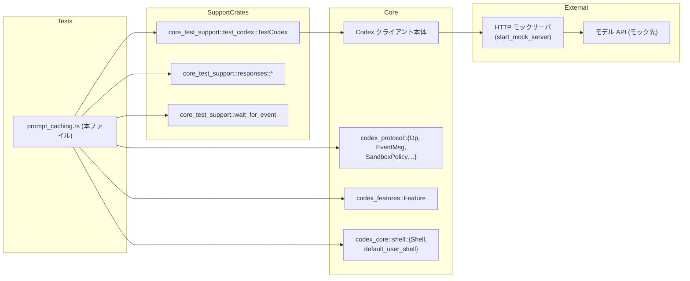
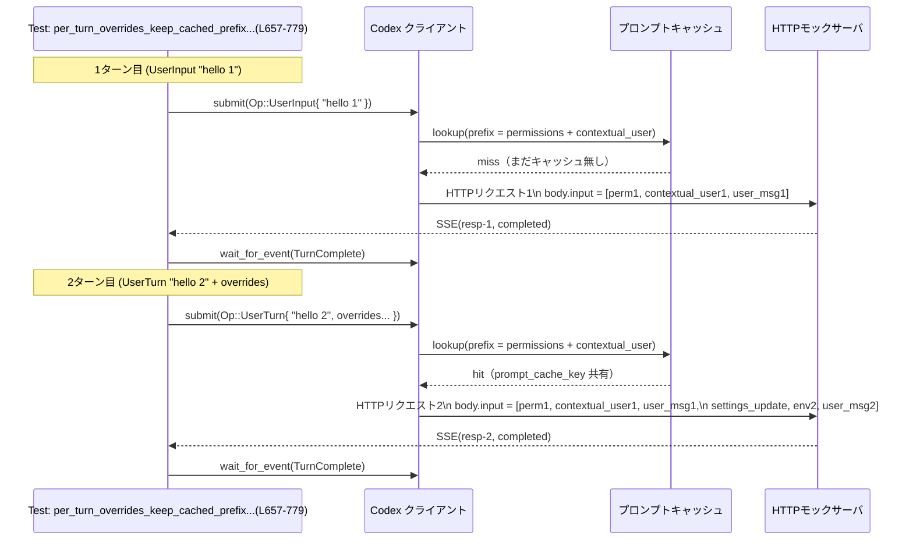

# core/tests/suite/prompt_caching.rs コード解説

## 0. ざっくり一言

Codex クライアントが外部モデル API に送る **プロンプト（permissions / 環境コンテキスト / ユーザー入力）とツール定義をどうキャッシュ・再利用するか** を検証する統合テスト群です。特に

- `prompt_cache_key` がオーバーライドをまたいで安定しているか
- 環境コンテキストが「必要なときだけ」送られるか
- `apply_patch` などのツールと instructions の整合性

を HTTP モックサーバに送られた JSON を検査することで確認します。

---

## 1. このモジュールの役割

### 1.1 概要

このテストモジュールは、Codex のセッション中に行われる複数ターンのやりとりにおいて、

- モデルへ送信される **instructions** と **tools** がターン間で一貫していること
- 環境コンテキスト（カレントディレクトリ、シェル名、日付、タイムゾーン）が
  - 適切に構成されていること
  - 不要に再送されないこと
- `Op::OverrideTurnContext` と `Op::UserTurn` による **一時的なコンテキスト変更** を行っても、
  - プロンプトのキャッシュキーとキャッシュされた prefix が維持されること
  - 必要な場合だけ追加の permissions / setting 更新メッセージが送られること

を検証します（例: `prompt_tools_are_consistent_across_requests`、`per_turn_overrides_keep_cached_prefix_and_key_constant` など、`prompt_caching.rs:L97-210, L657-779`）。

### 1.2 アーキテクチャ内での位置づけ

このファイルはテストクレート `core_test_support` を通じて Codex 本体に依存し、HTTP モックサーバに送られたリクエストボディを観察することで、プロンプトキャッシュ周りの挙動を間接的に確認します。

主要な依存関係は次の通りです。

- Codex 本体:
  - `TestCodex` / `test_codex()`（テスト用 Codex ビルダー）`prompt_caching.rs:L114-134, L229-243`
  - `codex.submit(Op::...)` による操作送信 `prompt_caching.rs:L147-168, L245-266, L320-341 ...`
- プロトコル・設定:
  - `Op`, `EventMsg`（操作とイベント）`prompt_caching.rs:L15-18`
  - `SandboxPolicy`, `AskForApproval`, `CollaborationMode` などの設定型 `prompt_caching.rs:L7-13, L17`
- テスト支援:
  - `start_mock_server`, `mount_sse_once`, `sse` など（HTTP モック）`prompt_caching.rs:L102-112`
  - `wait_for_event` による `EventMsg::TurnComplete` 待機 `prompt_caching.rs:L157-169`
  - `TempDir` / `TempDirExt` による一時ディレクトリ生成 `prompt_caching.rs:L426-428, L699-702`

依存関係を簡略図にすると次のようになります。



### 1.3 設計上のポイント

コードから読み取れる設計上の特徴は次のとおりです。

- **プロンプトキャッシュの契約をテストで固定**
  - `prompt_cache_key` がターン間で不変であるべきケースを明示し、その上で permissions や環境コンテキストの再利用を検証しています（`prompt_caching.rs:L467-471, L735-738`）。
- **環境コンテキストの構造をヘルパー関数で集中検証**
  - `assert_default_env_context` で `<cwd>`, `<shell>`, `<current_date>`, `<timezone>` などのタグ構造を一括チェックしています（`prompt_caching.rs:L47-73`）。
- **テストから見た「キャッシュ単位」を明確化**
  - 「permissions メッセージ + cached contextual user message（ユーザー instructions + 環境コンテキスト）」と「各ターンの user message」を明確に分けて検証しています（`prefixes_context_and_instructions_once_and_consistently_across_requests` など `prompt_caching.rs:L344-381`）。
- **非同期 & 並行テスト**
  - 全テストが `#[tokio::test(flavor = "multi_thread")]` であり、内部で `await` を多用しますが、各テストはシンプルなシーケンシャルフローになっています（`prompt_caching.rs:L97, L212, L291 ...`）。
- **エラー処理**
  - 外部 I/O（モックサーバとの通信や Codex 操作）は `anyhow::Result<()>` に `?` で伝播し、プロトコル違反は `assert!` / `assert_eq!` によるパニックで検出するスタイルです。
  - JSON 形状の前提が崩れた場合も `unwrap()` や `expect()` で即座にパニックします（テストなので許容され、`#![allow(clippy::unwrap_used)]` で lint を抑制 `prompt_caching.rs:L1, L75-91`）。

---

## 2. 主要な機能一覧

このモジュールが検証している主な機能（＝Codex の挙動）は次のとおりです。

- **ツール/インストラクションの一貫性**
  - `prompt_tools_are_consistent_across_requests`:
    - 連続するターンで `tools` 配列と `instructions` 文字列が変化しないこと（`prompt_caching.rs:L171-207`）。
  - `gpt_5_tools_without_apply_patch_append_apply_patch_instructions`:
    - `apply_patch` ツールが無い構成で、一度だけ `APPLY_PATCH_TOOL_INSTRUCTIONS` が instructions に付与され、次ターンでも同じ文字列が再利用されること（`prompt_caching.rs:L213-289`）。
- **コンテキスト prefix（permissions + contextual user）のキャッシュ**
  - `prefixes_context_and_instructions_once_and_consistently_across_requests`:
    - 初回ターンで permissions + contextual user（user instructions + environment context）+ user message の 3 つが送信され、
      2 回目以降は prefix を再利用しつつ user message だけ追加されること（`prompt_caching.rs:L344-381`）。
- **セッションコンテキストのオーバーライドとキャッシュキー**
  - `overrides_turn_context_but_keeps_cached_prefix_and_key_constant`:
    - `Op::OverrideTurnContext` による設定変更後でも `prompt_cache_key` が同一で、prefix が完全に再利用される一方、新しい permissions メッセージだけが追加されること（`prompt_caching.rs:L467-491`）。
  - `per_turn_overrides_keep_cached_prefix_and_key_constant`:
    - `Op::UserTurn` の per-turn override でも同様に、キャッシュキーと prefix が保持されること（`prompt_caching.rs:L734-777`）。
- **環境コンテキストの送信条件**
  - `override_before_first_turn_emits_environment_context`:
    - 最初のターン前に `OverrideTurnContext` した場合でも、初回リクエストには環境コンテキストが含まれること（`prompt_caching.rs:L547-613`）。
  - `send_user_turn_with_no_changes_does_not_send_environment_context`:
    - 同じ設定で `UserTurn` を連続して送ったとき、環境コンテキストは 1 回目の contextual user にのみ含まれ、2 回目では新たに送られないこと（`prompt_caching.rs:L868-902`）。
  - `send_user_turn_with_changes_sends_environment_context`:
    - 設定を変更した `UserTurn` を送ると、permissions メッセージが更新され、モデルスイッチ情報などが追加されることを検証しています（`prompt_caching.rs:L989-1042`）。
    - 2 回目リクエストで環境コンテキストが送られているかどうかは、このテストコードからは直接は読み取れません（`prompt_caching.rs:L1018-1042`）。

### 2.1 関数・テスト一覧（インベントリー）

| 名称 | 種別 | 役割 | 定義位置 |
|------|------|------|----------|
| `text_user_input` | 関数 | 単一のユーザーテキストから OpenAI 互換の `"message"` 形式 JSON を生成 | `core/tests/suite/prompt_caching.rs:L32-34` |
| `text_user_input_parts` | 関数 | 複数の文字列を `"content"` 配列に持つ `"message"` JSON を生成 | `core/tests/suite/prompt_caching.rs:L36-45` |
| `assert_default_env_context` | 関数 | 環境コンテキスト文字列に `<cwd>`, `<shell>`, `<current_date>`, `<timezone>` などが含まれることを検証 | `core/tests/suite/prompt_caching.rs:L47-73` |
| `assert_tool_names` | 関数 | リクエスト JSON の `"tools"` 配列から name/type を抽出し、期待リストと比較 | `core/tests/suite/prompt_caching.rs:L75-91` |
| `normalize_newlines` | 関数 | CRLF を LF に正規化 | `core/tests/suite/prompt_caching.rs:L93-95` |
| `prompt_tools_are_consistent_across_requests` | 非同期テスト | 連続ターンで tools と instructions が安定していることを検証 | `core/tests/suite/prompt_caching.rs:L97-210` |
| `gpt_5_tools_without_apply_patch_append_apply_patch_instructions` | 非同期テスト | gpt‑5 で apply_patch ツールが無い場合でも、apply_patch 用の instructions が一度だけ付与されることを検証 | `core/tests/suite/prompt_caching.rs:L212-289` |
| `prefixes_context_and_instructions_once_and_consistently_across_requests` | 非同期テスト | contextual user と環境コンテキストが一度だけ prefix として送られることを検証 | `core/tests/suite/prompt_caching.rs:L291-383` |
| `overrides_turn_context_but_keeps_cached_prefix_and_key_constant` | 非同期テスト | `OverrideTurnContext` 後も `prompt_cache_key` と prefix が維持されることを検証 | `core/tests/suite/prompt_caching.rs:L385-494` |
| `override_before_first_turn_emits_environment_context` | 非同期テスト | 初回の前に override しても環境コンテキストが送られることを検証 | `core/tests/suite/prompt_caching.rs:L496-655` |
| `per_turn_overrides_keep_cached_prefix_and_key_constant` | 非同期テスト | `UserTurn` による per-turn override でもキャッシュキーと prefix が維持されることを検証 | `core/tests/suite/prompt_caching.rs:L657-779` |
| `send_user_turn_with_no_changes_does_not_send_environment_context` | 非同期テスト | 設定を変えない `UserTurn` では環境コンテキストを再送しないことを検証 | `core/tests/suite/prompt_caching.rs:L781-905` |
| `send_user_turn_with_changes_sends_environment_context` | 非同期テスト | 設定を変えた `UserTurn` で permissions メッセージが更新され、モデルスイッチを通知することを検証 | `core/tests/suite/prompt_caching.rs:L907-1045` |

> 行番号は、このチャンク内のテキストから順序をカウントして付与しています。

---

## 3. 公開 API と詳細解説

このファイル自体はライブラリの公開 API を定義しておらず、すべてテスト専用の関数・テストです。ただし Codex 本体の動作理解に重要なため、主要な補助関数と代表的なテスト関数を詳しく説明します。

### 3.1 型一覧（このファイルから見える主要型）

このファイル内では新しい構造体・列挙体は定義されていません。テストから利用している外部型のうち、挙動理解に重要なものだけを表にまとめます（詳細な実装はこのチャンクには出てきません）。

| 名前 | 種別 | 定義元（モジュール名） | 役割 / 用途 |
|------|------|------------------------|-------------|
| `TestCodex` | 構造体 | `core_test_support::test_codex` | Codex クライアントと関連設定 (`config`, `session_configured`, `thread_manager` など) をまとめたテスト用ラッパー。`test_codex()` ビルダーから生成（`prompt_caching.rs:L114-134, L229-243`）。 |
| `Op` | 列挙体 | `codex_protocol::protocol` | Codex に送る操作の種別。ここでは `UserInput`, `UserTurn`, `OverrideTurnContext` を使用（`prompt_caching.rs:L147-168, L435-447, L709-725`）。 |
| `EventMsg` | 列挙体 | 同上 | Codex からのイベント。テストでは `EventMsg::TurnComplete(_)` を待つことでターン完了を検知（`prompt_caching.rs:L157-169, L256-268`）。 |
| `SandboxPolicy` | 列挙体 | 同上 | サンドボックスの権限制御。`WorkspaceWrite`, `DangerFullAccess` などをテストで使用（`prompt_caching.rs:L427-433, L977-978`）。 |
| `AskForApproval` | 列挙体 | 同上 | 操作の事前承認ポリシー。ここでは `Never` を利用（`prompt_caching.rs:L437, L715, L975`）。 |
| `CollaborationMode`, `ModeKind`, `Settings` | 構造体/列挙体 | `codex_protocol::config_types` | 協調モードの設定。モデル名や reasoning effort などを含む（`prompt_caching.rs:L509-516`）。 |
| `ReasoningEffort`, `ReasoningSummary` | 列挙体 | `codex_protocol` | モデルの推論の深さや要約レベルの設定（`prompt_caching.rs:L442-443, L720, L980`）。 |
| `Shell` | 構造体 | `codex_core::shell` | ユーザーのシェル表現。`default_user_shell()` で取得し、環境コンテキストの `<shell>` 差し込みに使う（`prompt_caching.rs:L4-5, L360, L769, L871`）。 |

### 3.2 関数詳細（7 件）

#### `text_user_input(text: String) -> serde_json::Value`

**概要**

単一の文字列を、OpenAI 互換の `"message"` 形式 JSON に変換するヘルパーです。`text_user_input_parts` の薄いラッパーです（`prompt_caching.rs:L32-34`）。

**引数**

| 引数名 | 型 | 説明 |
|--------|----|------|
| `text` | `String` | 送信したいユーザーメッセージ本文 |

**戻り値**

- `serde_json::Value`  
  - 形式:  

    ```json
    {
      "type": "message",
      "role": "user",
      "content": [ { "type": "input_text", "text": "<text>" } ]
    }
    ```

  - テストでは `body["input"][i]` と比較するために利用されます（`prompt_caching.rs:L371-372, L895-901`）。

**内部処理の流れ**

1. 単一要素 `vec![text]` を作成。
2. `text_user_input_parts` に渡し、その結果をそのまま返します。

**Examples（使用例）**

```rust
// "hello 1" という一つのユーザー入力メッセージを JSON に変換する
let user_msg = text_user_input("hello 1".to_string());  // prompt_caching.rs:L371-372

// テストでは、HTTP ボディの input の特定要素と等しいことを assert している
assert_eq!(body["input"][2], user_msg);
```

**Errors / Panics**

- この関数自体はパニックしません。

**Edge cases（エッジケース）**

- 空文字列 `""` を渡した場合でも `"text": ""` を持つ `input_text` が 1 要素入るだけで、特別な扱いはありません（コード上、空文字を特別扱いする分岐は存在しません）。

**使用上の注意点**

- テスト用ヘルパーであり、本番コードでは `UserInput::Text` などを通じて同等の JSON が生成されると考えられます（本チャンクにはその実装は現れません）。

---

#### `text_user_input_parts(texts: Vec<String>) -> serde_json::Value`

**概要**

複数の文字列を `"content"` 配列に持つ `"message"` JSON に変換します（`prompt_caching.rs:L36-45`）。環境コンテキストとユーザー instructions を一つの message にまとめる際に使われています。

**引数**

| 引数名 | 型 | 説明 |
|--------|----|------|
| `texts` | `Vec<String>` | `"content"` 配列に順番通り格納するテキストのリスト |

**戻り値**

- `serde_json::Value`  
  - 形式:  

    ```json
    {
      "type": "message",
      "role": "user",
      "content": [
        { "type": "input_text", "text": texts[0] },
        { "type": "input_text", "text": texts[1] },
        ...
      ]
    }
    ```

**内部処理の流れ**

1. `texts.into_iter()` で各文字列を走査（所有権を消費）。
2. 各 `text` について `{ "type": "input_text", "text": text }` という JSON オブジェクトを生成。
3. `Vec<_>` に収集し `"content"` にセット。
4. `"type": "message"`, `"role": "user"` を持つ JSON を返却。

**Examples（使用例）**

```rust
// ユーザー instructions と環境コンテキストを 1 つのメッセージに束ねる
let contextual_user_msg = text_user_input_parts(vec![
    "be consistent and helpful".to_string(),
    env_text_1.clone(),               // ENVIRONMENT_CONTEXT_OPEN_TAG から始まる文字列
]);  // prompt_caching.rs:L879-885

// body["input"][1] がこの構造と一致することを assert
assert_eq!(body1["input"][1], contextual_user_msg);
```

**Errors / Panics**

- パニックはしません。

**Edge cases**

- `texts` が空ベクタの場合でも `"content": []` を持つ message が生成されますが、このファイル内ではそうした呼び出しはありません。

**使用上の注意点**

- `"role": "user"` 固定であり、developer メッセージなどには使えません。
- `"type": "message"` や `"type": "input_text"` 文字列はテストの期待値と一致しているため、ここを変更すると多くのテストが失敗する可能性があります（`prompt_caching.rs:L352-369`）。

---

#### `assert_default_env_context(text: &str, cwd: &str, shell: &Shell)`

**概要**

環境コンテキスト文字列が所定の XML ライクなタグ構造になっているか検証するアサート関数です（`prompt_caching.rs:L47-73`）。

**引数**

| 引数名 | 型 | 説明 |
|--------|----|------|
| `text` | `&str` | 環境コンテキストとして送られたテキスト |
| `cwd` | `&str` | 期待されるカレントディレクトリ (`<cwd>` タグに出現すべき値) |
| `shell` | `&Shell` | 期待されるシェル (`shell.name()` が `<shell>` タグに出現) |

**戻り値**

- なし。すべてのチェックに合格すれば何も起こりません。

**内部処理の流れ**

1. `shell.name()` でシェル名を取得（`prompt_caching.rs:L48`）。
2. 以下の条件を順に `assert!`:
   - `text` が `ENVIRONMENT_CONTEXT_OPEN_TAG` で始まる（`prompt_caching.rs:L49-51`）。
   - `"<cwd>{cwd}</cwd>"` を含む（`prompt_caching.rs:L53-56`）。
   - `"<shell>{shell_name}</shell>"` を含む（`prompt_caching.rs:L57-60`）。
   - `<current_date>` と `</current_date>` の両方を含む（`prompt_caching.rs:L61-64`）。
   - `<timezone>` と `</timezone>` の両方を含む（`prompt_caching.rs:L65-68`）。
   - `"</environment_context>"` で終わる（`prompt_caching.rs:L69-72`）。

**Examples（使用例）**

```rust
let shell = default_user_shell();
let cwd_str = config.cwd.to_string_lossy();
let env_text = input1[1]["content"][1]["text"]
    .as_str()
    .expect("environment context text");          // prompt_caching.rs:L360-364

// env_text が <environment_context> ... </environment_context> の形式であることを確認
assert_default_env_context(env_text, &cwd_str, &shell);
```

**Errors / Panics**

- いずれかの条件に違反すると `assert!` によりパニックします。
- テストにおいては、環境コンテキストのフォーマット変更を検知するための意図的な挙動です。

**Edge cases**

- `cwd` にプラットフォーム依存文字（例: Windows のドライブレター）が含まれても、単純な文字列 `contains` チェックなので問題ありません（`prompt_caching.rs:L171-175` と組み合わせて OS による差異を扱っています）。
- `<current_date>` / `<timezone>` の内部フォーマット（日時やタイムゾーン文字列の形式）については一切検証しておらず、「タグがあるか」だけをチェックしています。

**使用上の注意点**

- 環境コンテキストのタグや構造を変更する場合は、この関数を合わせて更新する必要があります。
- `ENVIRONMENT_CONTEXT_OPEN_TAG` の中身はこのチャンクには出てこないため、タグ名の詳細は不明ですが、この関数のチェックに適合させる必要があります。

---

#### `prompt_tools_are_consistent_across_requests() -> anyhow::Result<()>`

**概要**

2 回の `UserInput` ターンを送ったときに、モデルに送信される `tools` と `instructions` が変化しないこと、かつ `apply_patch` ツールが存在する場合は `APPLY_PATCH_TOOL_INSTRUCTIONS` が二重に付与されないことを検証します（`prompt_caching.rs:L97-210`）。

**引数 / 戻り値**

- テスト関数であり引数はありません。
- `anyhow::Result<()>` を返し、`?` で `build`・`submit`・I/O のエラーを伝播します（`prompt_caching.rs:L134-135, L147-168`）。

**内部処理の流れ**

1. ネットワークが利用できない環境ではテストをスキップ（マクロ `skip_if_no_network!`、`prompt_caching.rs:L99`）。
2. モックサーバを起動し、2 つの SSE エンドポイントを登録（`req1`, `req2`、`prompt_caching.rs:L102-112`）。
3. `test_codex()` で `TestCodex` を構築し、以下の設定を上書き（`prompt_caching.rs:L114-134`）。
   - `user_instructions = "be consistent and helpful"`
   - `model = "gpt-5.1-codex-max"`
   - `web_search_mode = Cached`
   - `Feature::CollaborationModes` を有効化
4. `thread_manager` 経由でモデル情報を取得し、`base_instructions` を読み出す（`prompt_caching.rs:L135-145`）。
5. `Op::UserInput` で `"hello 1"` を送信し、`TurnComplete` を待機（`prompt_caching.rs:L147-157`）。
6. もう一度 `"hello 2"` を送信し、同様に `TurnComplete` を待機（`prompt_caching.rs:L159-169`）。
7. 期待 `tools` 名一覧を OS に応じて構築（Windows では `"shell_command"`, それ以外では `"exec_command", "write_stdin"`）し、追加のツール名を付け足す（`prompt_caching.rs:L171-187`）。
8. 最初の HTTP リクエストボディ (`body0`) を取得（`prompt_caching.rs:L188-189`）。
9. 期待 instructions を計算：
   - `expected_tools_names` に `"apply_patch"` が含まれているとき: `expected_instructions = base_instructions`
   - 含まれないとき: `expected_instructions = base_instructions + "\n" + APPLY_PATCH_TOOL_INSTRUCTIONS`（`prompt_caching.rs:L190-194`）。
10. `body0["instructions"]` が `expected_instructions` と等しいこと、および `tools` 名が期待通りであることを assert（`prompt_caching.rs:L196-201`）。
11. 2 回目のリクエストボディ (`body1`) でも同じ `instructions` と `tools` が送られていることを assert（`prompt_caching.rs:L202-207`）。

**Examples（使用例）**

テストの呼び出し側はテストランナーのみですが、同様のパターンで独自テストを書く場合のイメージは次の通りです。

```rust
// 1. TestCodex を構築して 2 回の UserInput を送る
let TestCodex { codex, config, thread_manager, .. } = test_codex()
    .with_config(|config| {
        config.user_instructions = Some("...".to_string());
        // その他設定
    })
    .build(&server)
    .await?;

// 2. 2 回 submit し、それぞれ TurnComplete を待つ
codex.submit(Op::UserInput{ /* ... */ }).await?;
wait_for_event(&codex, |ev| matches!(ev, EventMsg::TurnComplete(_))).await;

// 3. モックサーバから 2 回分の HTTP リクエストを取り出し body_json を検査
let body0 = req1.single_request().body_json();
let body1 = req2.single_request().body_json();
```

**Errors / Panics**

- `build` / `submit` / `start_mock_server` が失敗すると `Err(anyhow::Error)` としてテストが失敗します（`?` 演算子）。
- JSON の構造が期待と異なり `"tools"` が配列でない場合は、`assert_tool_names` 内の `unwrap()` によりパニックします（`prompt_caching.rs:L75-91`）。

**Edge cases**

- Windows と非 Windows で期待ツールが異なるため、プラットフォーム依存の分岐があります（`cfg!(windows)`、`prompt_caching.rs:L171-175`）。
- `apply_patch` ツールの有無に応じて期待 instructions の形が変わるため、Codex が返す `tools` リストと instructions の整合性が重要です。

**使用上の注意点**

- `APPLY_PATCH_TOOL_INSTRUCTIONS` は別 crate (`codex_apply_patch`) からインポートされており、その内容はこのチャンクには現れません。
- ツール名は文字列リテラルで比較しているため、API 側のツール名が変わるとテストが即座に失敗します。

---

#### `prefixes_context_and_instructions_once_and_consistently_across_requests()`

**概要**

ユーザー instructions と環境コンテキストを含む「contextual user メッセージ」が、初回リクエストで 1 回だけ生成され、その後のターンではキャッシュされた prefix として再利用されることを検証します（`prompt_caching.rs:L291-383`）。

**引数 / 戻り値**

- 引数なし、戻り値は `anyhow::Result<()>`。

**内部処理の流れ**

1. モックサーバを起動し、2 つの SSE リクエストを準備（`prompt_caching.rs:L297-307`）。
2. `test_codex()` で Codex を構築し、`user_instructions = "be consistent and helpful"`、`Feature::CollaborationModes` を有効化（`prompt_caching.rs:L309-317`）。
3. `"hello 1"` と `"hello 2"` の `Op::UserInput` を順に送信し、それぞれ `TurnComplete` を待機（`prompt_caching.rs:L320-342`）。
4. 最初のリクエストボディ `body1` を取得し、`input` 配列を取り出す（`prompt_caching.rs:L344-346`）。
5. `input.len() == 3` であることを assert（permissions + contextual user + user msg）（`prompt_caching.rs:L347-350`）。
6. `input[1]["content"][0]["text"]` にユーザー instructions 文字列が含まれていることをチェック（`prompt_caching.rs:L352-358`）。
7. `input[1]["content"][1]["text"]` を環境コンテキストとして取り出し、`assert_default_env_context` で検証（`prompt_caching.rs:L360-365`）。
8. 環境コンテキストの `type` が `"input_text"` であることを確認（`prompt_caching.rs:L366-369`）。
9. `input[2]` が `text_user_input("hello 1")` と一致することを確認（`prompt_caching.rs:L371-372`）。
10. 2 回目のリクエスト `body2` の `input` を取り出し、先頭 `input1.len()` 要素が `input1` と完全一致すること（prefix 再利用）と、その直後に `text_user_input("hello 2")` が続くことを確認（`prompt_caching.rs:L373-380`）。

**Errors / Panics**

- JSON 構造の前提が崩れると `as_array().expect("input array")` などでパニックします（`prompt_caching.rs:L345-346`）。

**Edge cases**

- `input` の長さが 3 以外になる（permissions の有無が変わるなど）とテストが失敗します。
- 環境コンテキストのメッセージが 1 つにまとまっている前提があり、将来この構造が変わると test の前提も見直しが必要になります。

**使用上の注意点**

- このテストは「contextual user メッセージが 1 つである」という前提に強く依存しています。
- 環境コンテキストを別メッセージとして送るような仕様変更があった場合、テストも合わせて更新する必要があります。

---

#### `overrides_turn_context_but_keeps_cached_prefix_and_key_constant()`

**概要**

1 回目のターン後に `Op::OverrideTurnContext` でサンドボックス設定や reasoning 設定などを変更しても、

- `prompt_cache_key` が変化しないこと
- キャッシュされた prefix が丸ごと再利用され、更新された permissions メッセージと新しい user message が追記される形になること

を検証します（`prompt_caching.rs:L385-494`）。

**内部処理の流れ**

1. Codex を構築 (`user_instructions` と `CollaborationModes` 有効化)（`prompt_caching.rs:L402-411`）。
2. `"hello 1"` を `UserInput` として送信し、`TurnComplete` を待機（`prompt_caching.rs:L413-424`）。
3. `TempDir` から書き込み可能ディレクトリを作り、`SandboxPolicy::WorkspaceWrite` を構成（`prompt_caching.rs:L426-433`）。
4. `Op::OverrideTurnContext` を送信し、approval_policy, sandbox_policy, reasoning effort/summary などを上書き（`prompt_caching.rs:L435-447`）。
5. `"hello 2"` を `UserInput` として送信し、再度 `TurnComplete` を待機（`prompt_caching.rs:L451-461`）。
6. 1 回目 (`body1`) と 2 回目 (`body2`) の HTTP ボディを取得（`prompt_caching.rs:L463-466`）。
7. `body1["prompt_cache_key"] == body2["prompt_cache_key"]` を assert（`prompt_caching.rs:L468-471`）。
8. 1 回目の input 全体を `body1_input` として取り出し、1 つ目のメッセージを `expected_permissions_msg` として保持（`prompt_caching.rs:L480-481`）。
9. 2 回目の input の、`body1_input.len()` 番目のメッセージを `expected_permissions_msg_2` として取得し、元の permissions メッセージと異なることを確認（更新された permissions）（`prompt_caching.rs:L482-487`）。
10. `expected_body2 = body1_input + expected_permissions_msg_2 + expected_user_message_2` という配列を作成し、`body2["input"]` と一致することを検証（`prompt_caching.rs:L488-491`）。

**Errors / Panics**

- `TempDir::new().unwrap()` で一時ディレクトリ生成に失敗するとパニックします（`prompt_caching.rs:L426`）。
- JSON 構造の想定が崩れた場合、`as_array().expect("input array")` などがパニックします。

**Edge cases**

- `OverrideTurnContext` の内容に `cwd` や `model` を含めないケースのみ検証しています（`cwd: None, model: None`）。他のフィールドを変更したときの挙動はこのテストからは読み取れません。
- permissions メッセージが input 配列の最後に追加されるという前提に依存しています（`body2["input"][body1_input.len()]`、`prompt_caching.rs:L482-483`）。

**使用上の注意点**

- Codex の内部実装が「prefix を丸ごとキャッシュし、override 後に更新された developer メッセージを後ろに 1 つ追加する」という契約になっていることを前提にしています。
- `prompt_cache_key` を override 単位で変えたくなる設計変更を行う場合、このテストを含めたキャッシュ戦略の見直しが必要です。

---

#### `per_turn_overrides_keep_cached_prefix_and_key_constant()`

**概要**

`Op::UserTurn` による per-turn override（`cwd`, `approval_policy`, `sandbox_policy`, `model` などの変更）を行っても、

- `prompt_cache_key` は変わらない
- 1 回目の prefix（permissions + contextual user + user message）が 2 回目にも再利用され、その後ろに「設定更新メッセージ」と「新しい環境コンテキスト付き user (user role) メッセージ」と「新しい user message」が追加される

という挙動を検証します（`prompt_caching.rs:L657-779`）。

**内部処理の流れ（要約）**

1. `"hello 1"` を `UserInput` で送り prefix を確定させる（`prompt_caching.rs:L685-696`）。
2. 2 回目のターンでは `Op::UserTurn` を使用し、
   - `cwd` を新しい TempDir に変更
   - `approval_policy` や `SandboxPolicy::WorkspaceWrite`、`model = "o3"`、`ReasoningEffort::High` などを指定（`prompt_caching.rs:L699-725`）。
3. 2 つのリクエストボディを比較し `prompt_cache_key` が同一であることを確認（`prompt_caching.rs:L734-738`）。
4. 1 回目 input の先頭メッセージを `expected_permissions_msg` とし、2 回目 input の `body1_input.len()` 番目のメッセージを `expected_settings_update_msg` として取得（`prompt_caching.rs:L747-749`）。
5. `expected_settings_update_msg` が developer ロールであり、かつ内容に `<model_switch>` を含むことを `request2.has_message_with_input_texts` で確認（`prompt_caching.rs:L754-763`）。
6. 2 回目 input の直後のメッセージ（`body1_input.len() + 1` 番目）を環境コンテキスト付き user メッセージとみなして取り出し、`assert_default_env_context` で検証（`prompt_caching.rs:L764-771`）。
7. `expected_body2 = body1_input + expected_settings_update_msg + expected_env_msg_2 + expected_user_message_2` を構成し、`body2["input"]` と一致することを確認（`prompt_caching.rs:L772-776`）。

**使用上の注意点（言語・並行性）**

- 非同期関数であり、内部で `await` を多用しますが、操作は直列に実行されています。
- `TempDir::new().unwrap()` などはテスト環境でのみ使用されることを前提にしており、本番コードで同じパターンを使う場合はエラーハンドリングが必要です。

---

#### `send_user_turn_with_no_changes_does_not_send_environment_context()`

**概要**

`Op::UserTurn` を使っても、内容が「セッションデフォルトと同じ」であれば、2 回目以降のターンで **新しい環境コンテキストが送られない** ことを検証します（`prompt_caching.rs:L781-905`）。

**内部処理の要点**

1. Codex 構築後、デフォルトの `cwd`, `approval_policy`, `sandbox_policy`, `model`, `effort`, `summary` を読み出して保持（`prompt_caching.rs:L814-819`）。
2. 1 回目の `UserTurn` はこれらデフォルト値を明示的に指定して `"hello 1"` を送る（`prompt_caching.rs:L821-839`）。
3. 2 回目の `UserTurn` でもまったく同じ値を指定して `"hello 2"` を送る（`prompt_caching.rs:L842-859`）。
4. 1 回目 `body1["input"]` から permissions メッセージと contextual user メッセージを取り出し、その 2 番目の `content` 要素が環境コンテキストであることを `assert_default_env_context` で検証（`prompt_caching.rs:L868-878`）。
5. その上で、1 回目の `input` が `[permissions, contextual_user(with env), user_message_1]` になっていることを確認（`prompt_caching.rs:L888-893`）。
6. 2 回目の `input` は `[permissions, contextual_user(with env), user_message_1, user_message_2]` となり、新たな環境コンテキストメッセージが追加されていないことを確認（`prompt_caching.rs:L895-902`）。

**Edge cases / 契約**

- 「設定が変わらない限り環境コンテキストを再送しない」というキャッシュ戦略が固定化されています。
- 将来的に毎ターン環境コンテキストを含める仕様に変える場合、このテストが失敗し、戦略の見直しが必要になります。

---

### 3.3 その他の関数

| 関数名 | 役割（1 行） | 定義位置 |
|--------|--------------|----------|
| `assert_tool_names` | リクエスト JSON の `"tools"` 配列から name/type を抽出し、期待リストと完全一致することを検証 | `core/tests/suite/prompt_caching.rs:L75-91` |
| `normalize_newlines` | 文字列の `"\r\n"` を `"\n"` に変換し、プラットフォーム差異を吸収する | `core/tests/suite/prompt_caching.rs:L93-95` |
| `gpt_5_tools_without_apply_patch_append_apply_patch_instructions` | gpt‑5 で `Feature::ApplyPatchFreeform` を無効化したときの instructions の一貫性を検証 | `core/tests/suite/prompt_caching.rs:L212-289` |
| `override_before_first_turn_emits_environment_context` | 初回ターン前の `OverrideTurnContext` でも環境コンテキストが送られることを検証 | `core/tests/suite/prompt_caching.rs:L496-655` |
| `send_user_turn_with_changes_sends_environment_context` | `UserTurn` で approval policy / sandbox / model などを変更したときに permissions メッセージが更新されることを検証 | `core/tests/suite/prompt_caching.rs:L907-1045` |

---

## 4. データフロー

ここでは、最も複雑な `per_turn_overrides_keep_cached_prefix_and_key_constant` を例に、プロンプトキャッシュと HTTP リクエストのデータフローを示します（`prompt_caching.rs:L657-779`）。

### 4.1 処理の要点

- 1 回目のターンで、permissions + contextual user + `"hello 1"` の 3 つのメッセージからなる prefix を確定する。
- 2 回目のターンでは `UserTurn` で `cwd`, `sandbox_policy`, `model` 等を変更するが、
  - prefix の部分はキャッシュから再利用される。
  - その後ろに「設定更新 (developer role) メッセージ」と「新しい環境コンテキスト付き user メッセージ」と `"hello 2"` メッセージが追加される。

### 4.2 シーケンス図



テストコードでは、このフローに対応して次のような検証が行われます。

- `prompt_cache_key` が変わらないこと（`prompt_caching.rs:L734-738`）。
- `body2["input"]` の先頭 `body1_input` 部分が 1 回目の input と完全一致すること（`prompt_caching.rs:L772-776`）。
- 追加された developer メッセージが `"<model_switch>"` を含むこと（`prompt_caching.rs:L754-763`）。
- 新しい環境コンテキスト付き user メッセージの内容が `assert_default_env_context` に適合すること（`prompt_caching.rs:L764-771`）。

---

## 5. 使い方（How to Use）

このファイル自体はテスト専用ですが、「Codex のプロンプトキャッシュや turn オーバーライドをテストする方法」のサンプルとして有用です。

### 5.1 基本的な使用方法

典型的なテストフローは以下のようになります。

```rust
// 1. モックサーバの起動と SSE エンドポイントの準備        // HTTPモックサーバを起動し、1リクエストぶんの SSE 応答を登録
let server = start_mock_server().await;                   // prompt_caching.rs:L662
let req = mount_sse_once(
    &server,
    sse(vec![ev_response_created("resp-1"), ev_completed("resp-1")]),
).await;

// 2. TestCodex による Codex インスタンスの構築            // テスト用にカスタム設定を与えて Codex を構築
let TestCodex { codex, config, .. } = test_codex()
    .with_config(|config| {
        config.user_instructions = Some("be consistent and helpful".to_string());
        config.features.enable(Feature::CollaborationModes).unwrap();
    })
    .build(&server)
    .await?;

// 3. 操作の送信 (UserInput / UserTurn / OverrideTurnContext) // Codex に対して操作を送信
codex.submit(Op::UserInput {
    items: vec![UserInput::Text {
        text: "hello 1".into(),
        text_elements: Vec::new(),
    }],
    final_output_json_schema: None,
    responsesapi_client_metadata: None,
}).await?;

// 4. ターン完了イベントを待つ                               // モデル呼び出し完了を待機
wait_for_event(&codex, |ev| matches!(ev, EventMsg::TurnComplete(_))).await;

// 5. モックサーバに送られたリクエストボディを検査           // 実際に API に送信された JSON をチェック
let body = req.single_request().body_json();
assert!(body["input"].is_array());
```

### 5.2 よくある使用パターン

- **単純な 2 ターン比較**
  - `prompt_tools_are_consistent_across_requests` や `gpt_5_tools_without_apply_patch_append_apply_patch_instructions` のように、2 つの SSE リクエストを用意し、それぞれの body を比較します（`prompt_caching.rs:L102-112, L217-227`）。
- **コンテキスト prefix のキャッシュ検証**
  - 1 回目の `input` 配列を `body1_input` として保持し、2 回目の `input` の先頭がそれと一致するかを検証します（`prompt_caching.rs:L375-378, L772-776`）。
- **per-turn override / context override**
  - 1 回目は `Op::UserInput` で通常のターンを送り、2 回目以降で `Op::OverrideTurnContext` や `Op::UserTurn` を使って per-turn 設定を上書きします（`prompt_caching.rs:L435-447, L709-725`）。

### 5.3 よくある間違い

このファイルから推測できる「起こりがちな誤用」は次のようなものです。

```rust
// 間違い例: TurnComplete を待たずに body_json を読もうとする
codex.submit(Op::UserInput { /* ... */ }).await?;
// let body = req.single_request().body_json();           // まだリクエストが飛んでいない可能性がある

// 正しい例: TurnComplete イベントを待ってから読む
codex.submit(Op::UserInput { /* ... */ }).await?;
wait_for_event(&codex, |ev| matches!(ev, EventMsg::TurnComplete(_))).await;
let body = req.single_request().body_json();
```

また、環境コンテキストの期待構造を変更した場合に、`assert_default_env_context` を更新し忘れるとテストが一斉に落ちる可能性があります（`prompt_caching.rs:L47-73`）。

### 5.4 使用上の注意点（まとめ）

- **ネットワーク前提**
  - 各テストの冒頭で `skip_if_no_network!(Ok(()));` を呼んでいます（`prompt_caching.rs:L99, L214, L294 ...`）。このマクロの挙動自体はこのチャンクには出てきませんが、ネットワーク環境によってはテストがスキップされる点に注意が必要です。
- **エラー処理**
  - テスト内では `unwrap()` や `expect()` が多用されており、JSON の形状やモックサーバの挙動が想定と異なれば即座にパニックします。
  - 本番コードで同じ構造を利用する場合は、これらを適切なエラーハンドリングに置き換える必要があります。
- **並行性**
  - `#[tokio::test(flavor = "multi_thread")]` によりスレッドプール上で動作しますが、このファイルのコードは共有可変状態を持っておらず、明示的な同期原語も使用していません。
  - 並行性の問題は主に Codex 本体側の実装に依存し、このチャンクからは詳細は読み取れません。
- **仕様とテストの結びつき**
  - 環境コンテキストが「最低 1 回送られる」こと（`override_before_first_turn_emits_environment_context`）、および「設定が変わらない限り再送しない」こと（`send_user_turn_with_no_changes_does_not_send_environment_context`）が明示的な契約として固定化されています。

---

## 6. 変更の仕方（How to Modify）

### 6.1 新しい機能（テスト）を追加する場合

このファイルに新しいプロンプトキャッシュ関連のテストを追加する場合、次の流れが自然です。

1. **シナリオの決定**
   - 例: 「モデルを 3 回切り替えたときの prompt_cache_key の挙動」など。
2. **モックサーバと SSE のセットアップ**
   - `start_mock_server` と `mount_sse_once` を使って必要な回数ぶんの `reqX` を用意します（`prompt_caching.rs:L102-112, L663-672`）。
3. **TestCodex の構築**
   - `test_codex().with_config(|config| { ... }).build(&server).await?` の形でコンフィグを調整します（`prompt_caching.rs:L114-134`）。
4. **Op の送信**
   - `Op::UserInput`, `Op::UserTurn`, `Op::OverrideTurnContext` などを組み合わせてシナリオを構成します。
5. **イベント待機**
   - 各ターンごとに `wait_for_event(&codex, |ev| matches!(ev, EventMsg::TurnComplete(_))).await;` を呼び出し、HTTP リクエストが発生したタイミングを保証します。
6. **JSON 検証**
   - `reqX.single_request().body_json()` を使ってリクエストボディを取得し、ヘルパー関数（`text_user_input`, `assert_default_env_context`, `assert_tool_names`）を使って期待値との整合性を確認します。

### 6.2 既存の機能（テスト）を変更する場合

- **影響範囲の確認**
  - テストは互いに依存していないため、1 つのテストを変更しても他には直接影響しません。ただしヘルパー関数（`text_user_input`, `assert_default_env_context`）を変更すると複数のテストが影響を受けます。
- **契約の確認**
  - 例えば環境コンテキストの形式を変更する場合、
    - `assert_default_env_context` 内のタグチェック（`prompt_caching.rs:L49-72`）
    - それを利用しているすべてのテスト（`prompt_caching.rs:L365, L577-591, L877-878, L1002`）
    を合わせて見直す必要があります。
- **`prompt_cache_key` 契約の変更**
  - `prompt_cache_key` の仕様（いつ変わるか）を変更する場合、少なくとも
    - `overrides_turn_context_but_keeps_cached_prefix_and_key_constant`（`prompt_caching.rs:L467-471`）
    - `per_turn_overrides_keep_cached_prefix_and_key_constant`（`prompt_caching.rs:L734-738`）
    の期待を更新する必要があります。
- **モデル切り替えの通知仕様**
  - `"<model_switch>"` を含む developer メッセージが送られることを前提としています（`prompt_caching.rs:L759-763, L1029-1033`）。
  - 通知形式を変更する場合は、一緒にテストも修正する必要があります。

---

## 7. 関連ファイル

このモジュールと密接に関連する（が、このチャンクには実装が現れない）コンポーネントをまとめます。

| パス / モジュール | 役割 / 関係 |
|-------------------|------------|
| `core_test_support::test_codex` | `TestCodex` 構造体と `test_codex()` ビルダーを提供し、Codex 本体の初期化と設定をカプセル化しています（`prompt_caching.rs:L114-134, L229-243`）。 |
| `core_test_support::responses` | `start_mock_server`, `mount_sse_once`, `sse`, `ev_response_created`, `ev_completed` など、HTTP/SSE モックサーバ関連のユーティリティを提供します（`prompt_caching.rs:L102-112, L217-227`）。 |
| `core_test_support::wait_for_event` | `EventMsg` ストリームから指定条件に合致するイベント（ここでは `TurnComplete`）を待つユーティリティです（`prompt_caching.rs:L157-169, L424-425`）。 |
| `codex_protocol::protocol` | `Op`, `EventMsg`, `SandboxPolicy`, `AskForApproval`, `ENVIRONMENT_CONTEXT_OPEN_TAG` など、Codex とモデル API 間のプロトコル定義を提供します（`prompt_caching.rs:L13-18`）。 |
| `codex_protocol::config_types` | `CollaborationMode`, `ModeKind`, `Settings`, `ReasoningSummary` など、セッションやコラボレーションモードに関する設定型を提供します（`prompt_caching.rs:L7-11`）。 |
| `codex_core::shell` | `Shell` 型と `default_user_shell()` を提供し、環境コンテキスト内の `<shell>` 情報生成に利用されています（`prompt_caching.rs:L4-5, L360, L769, L871`）。 |

これらのモジュールの内部実装はこのチャンクには現れないため、詳細な挙動は不明ですが、テストコードから見える「契約」は上記の通りです。
