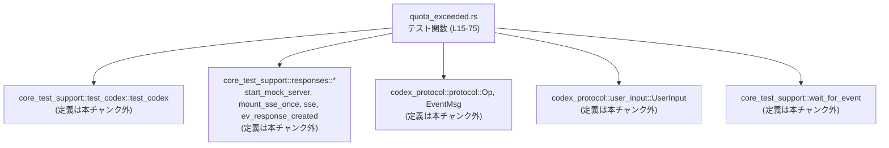
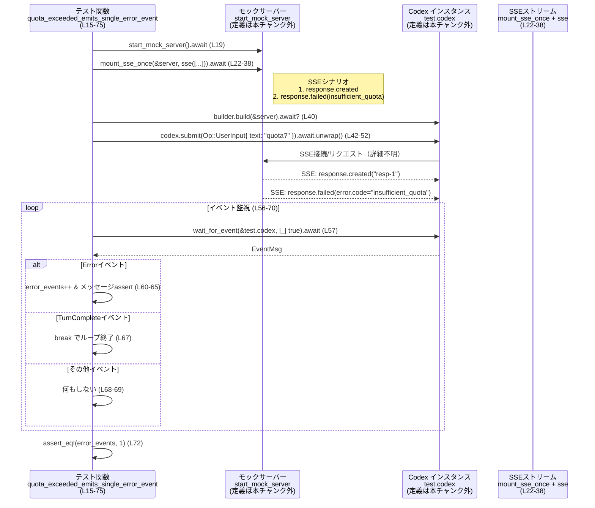

# core/tests/suite/quota_exceeded.rs コード解説

## 0. ざっくり一言

`quota_exceeded.rs` は、クォータ不足エラーが発生したときに Codex から **ちょうど 1 回だけ `EventMsg::Error` が通知されること**と、そのエラーメッセージ内容を検証する非同期テストです（`quota_exceeded.rs:L15-75`）。

---

## 1. このモジュールの役割

### 1.1 概要

- このモジュールは、外部 SSE（Server-Sent Events）風のモックサーバーから **「insufficient_quota」エラー応答**を返させた場合に、Codex が
  - ユーザー入力送信後、
  - エラーイベントを 1 回だけ発行し、
  - 人間向けメッセージ `"Quota exceeded. Check your plan and billing details."`
    を含める  
  ことを検証するテストです（`quota_exceeded.rs:L22-37, L42-52, L59-72`）。

### 1.2 アーキテクチャ内での位置づけ

このファイルは「コアロジックそのもの」ではなく、**Codex とプロトコル周りの結合テスト**として振る舞います。

- 利用している主な外部コンポーネント:
  - `core_test_support::responses::*`：モックサーバーと SSE レスポンス生成（`quota_exceeded.rs:L5-8, L22-38`）
  - `core_test_support::test_codex::test_codex`：テスト用 Codex ビルダー（`quota_exceeded.rs:L10, L20, L40`）
  - `codex_protocol::protocol::{EventMsg, Op}`：Codex のイベントと操作のプロトコル定義（`quota_exceeded.rs:L2-3, L42-50, L59-68`）
  - `codex_protocol::user_input::UserInput`：ユーザー入力型（`quota_exceeded.rs:L4, L43-47`）
  - `core_test_support::wait_for_event`：イベント待機ユーティリティ（`quota_exceeded.rs:L11, L57`）

依存関係を簡略化した図は次のとおりです。



### 1.3 設計上のポイント

コードから読み取れる設計上の特徴です。

- **モックサーバーによる外部依存の分離**  
  - 実際の外部 API ではなく、`start_mock_server` と `mount_sse_once` によりモックサーバーと SSE イベントを利用しています（`quota_exceeded.rs:L19, L22-38`）。
- **プロトコルレベルでの検証**  
  - クォータ不足は SSE メッセージ内の `"error.code": "insufficient_quota"` として表現され、それが Codex 内部で `EventMsg::Error` に変換される前提でテストしています（`quota_exceeded.rs:L26-35, L59-65`）。
- **非同期 + マルチスレッドランタイム**  
  - `#[tokio::test(flavor = "multi_thread", worker_threads = 2)]` により、Tokio のマルチスレッドランタイム上で非同期に実行されます（`quota_exceeded.rs:L15`）。
- **イベント駆動の終了条件**  
  - テスト終了条件はイベントループ内で `EventMsg::TurnComplete(_)` を受け取ることです（`quota_exceeded.rs:L56-70`）。
- **安全性とエラーハンドリング**  
  - テスト関数自身は `anyhow::Result<()>` を返し、`builder.build(&server).await?` だけは `?` で伝播しますが（`quota_exceeded.rs:L40`）、`submit(...).await.unwrap()` ではあえて `unwrap` を使い、ここが失敗したらテストを即座に失敗させる設計になっています（`quota_exceeded.rs:L42-52`）。

---

## 2. 主要な機能・コンポーネント一覧（コンポーネントインベントリー）

### 2.1 このファイルで定義される関数

| 名前 | 種別 | 役割 / 用途 | 行範囲 |
|------|------|-------------|--------|
| `quota_exceeded_emits_single_error_event` | 非同期テスト関数 (`async fn`) | クォータ不足時に Codex が 1 回だけエラーイベントを発行し、メッセージ内容が期待通りであることを検証する | `quota_exceeded.rs:L15-75` |

### 2.2 このファイルで利用している主な外部型・関数・マクロ

> 定義はすべて他ファイルにあり、このチャンクには現れません。用途のみを記載します。

| 名前 | 種別 | 役割 / 用途 | 出現箇所 |
|------|------|-------------|----------|
| `EventMsg` | 列挙体（推定、プロトコル型） | Codex から発行されるイベントを表す。ここでは `Error` と `TurnComplete` 分岐に利用 | `quota_exceeded.rs:L2, L59-68` |
| `Op` | 列挙体（推定） | Codex への操作（ここでは `Op::UserInput`）を表す | `quota_exceeded.rs:L3, L42-50` |
| `UserInput` | 列挙体（推定） | ユーザー入力の種類を表す。ここでは `UserInput::Text` を利用 | `quota_exceeded.rs:L4, L43-47` |
| `ev_response_created` | 関数 | SSE 用の `"response.created"` イベントを生成すると推測される | `quota_exceeded.rs:L5, L25` |
| `mount_sse_once` | 非同期関数 | モックサーバーに 1 回分の SSE ストリームを登録するユーティリティと推測される | `quota_exceeded.rs:L6, L22-38` |
| `sse` | 関数 | SSE イベント列を適切な形式にラップするユーティリティと推測される | `quota_exceeded.rs:L7, L24` |
| `start_mock_server` | 非同期関数 | モック HTTP/SSE サーバーを起動する | `quota_exceeded.rs:L8, L19` |
| `skip_if_no_network!` | マクロ | ネットワークが使用できない場合にテストをスキップする | `quota_exceeded.rs:L9, L17` |
| `test_codex` | 関数 | テスト用の Codex ビルダーを作成する | `quota_exceeded.rs:L10, L20` |
| `wait_for_event` | 非同期関数 | Codex から次の `EventMsg` を取得するまで待機する | `quota_exceeded.rs:L11, L57` |
| `assert_eq` | マクロ | 期待値と実際の値を比較するアサーション | `quota_exceeded.rs:L12, L62-65, L72` |
| `json!` | マクロ | `serde_json` の JSON リテラルマクロ。SSE メッセージを構築 | `quota_exceeded.rs:L13, L26-35` |

---

## 3. 公開 API と詳細解説

このファイルはテスト専用であり、外部から再利用される「公開 API」は定義していません。  
ただし、テストの振る舞いを理解するために、テスト関数と、そこで使われる外部 API の使い方を整理します。

### 3.1 型一覧（このファイルから見える主要型）

※ いずれも他モジュールで定義され、本チャンクには定義が現れません。

| 名前 | 種別 | 役割 / 用途 | 出現箇所 |
|------|------|-------------|----------|
| `EventMsg` | 列挙体（Codex プロトコル） | Codex からのイベント。`Error(err)` と `TurnComplete(_)` にマッチしています | `quota_exceeded.rs:L2, L59-68` |
| `Op` | 列挙体（Codex プロトコル） | Codex への操作。`Op::UserInput { ... }` として送信 | `quota_exceeded.rs:L3, L42-50` |
| `UserInput` | 列挙体（ユーザー入力） | ユーザー入力の種類。`UserInput::Text { text, text_elements }` を利用 | `quota_exceeded.rs:L4, L43-47` |

### 3.2 関数詳細

#### `quota_exceeded_emits_single_error_event() -> Result<()>`

**概要**

- クォータ不足エラーを返す SSE レスポンスをモックし、その結果として Codex が
  - `EventMsg::Error` を 1 回だけ発行し（`quota_exceeded.rs:L54-72`）、
  - エラーの `message` フィールドが `"Quota exceeded. Check your plan and billing details."` であること  
  を確認する非同期テストです（`quota_exceeded.rs:L59-65`）。

**属性 / 実行環境**

- `#[tokio::test(flavor = "multi_thread", worker_threads = 2)]` により、
  - Tokio の **マルチスレッドランタイム**（2 スレッド）上で実行されます（`quota_exceeded.rs:L15`）。
  - これにより、内部の非同期処理（モックサーバー、Codex、イベント待ち）が並行に動いても問題なくテストできます。

**引数**

- 関数は引数を取りません（テスト関数の一般的な形）。

**戻り値**

- `anyhow::Result<()>`（`quota_exceeded.rs:L16`）
  - 成功時：`Ok(())`
  - 失敗時：エラーは `builder.build(&server).await?` などから伝播する `anyhow::Error`（`quota_exceeded.rs:L40`）

**内部処理の流れ（アルゴリズム）**

1. **ネットワーク環境がなければテストをスキップ**  
   - `skip_if_no_network!(Ok(()));` でネットワーク利用不可時に早期リターン（`quota_exceeded.rs:L17`）。  
     実際のスキップ条件や実装は、このチャンクには現れません。

2. **モックサーバーの起動と Codex ビルダー作成**  
   - `let server = start_mock_server().await;` でモックサーバーを起動（`quota_exceeded.rs:L19`）。
   - `let mut builder = test_codex();` でテスト用 Codex ビルダーを取得（`quota_exceeded.rs:L20`）。

3. **SSE レスポンスの設定**  
   - `mount_sse_once(&server, sse(vec![ ... ]))` を `await` して、モックサーバーに SSE シナリオを登録（`quota_exceeded.rs:L22-38`）。
   - SSE シナリオの内容:
     - `ev_response_created("resp-1")`：レスポンス作成イベント（`quota_exceeded.rs:L25`）。
     - `json!({...})`：`"type": "response.failed"` と `"error.code": "insufficient_quota"` を含む JSON（`quota_exceeded.rs:L26-35`）。
   - これにより、Codex がモックサーバーにアクセスすると、上記 2 つの SSE イベントが順に送られる前提です。

4. **Codex インスタンスの生成**  
   - `let test = builder.build(&server).await?;` で Codex 実体を構築（`quota_exceeded.rs:L40`）。  
     - `?` により、ビルドが失敗すればテスト自体が `Err` で終了します。

5. **ユーザー入力の送信**  
   - `test.codex.submit(Op::UserInput { ... }).await.unwrap();` で、テキスト `"quota?"` を含むユーザー入力を送信（`quota_exceeded.rs:L42-52`）。
     - `items`: `vec![UserInput::Text { text: "quota?".into(), text_elements: Vec::new() }]`（`quota_exceeded.rs:L43-47`）
     - 他のフィールドは `None`（`quota_exceeded.rs:L48-49`）。
   - `.unwrap()` により、送信が `Err` を返した場合はパニックし、テスト失敗となります（`quota_exceeded.rs:L51-52`）。

6. **イベントループでエラーイベントをカウント**  
   - `let mut error_events = 0;` でカウンタ初期化（`quota_exceeded.rs:L54`）。
   - `loop { ... }` で以下を繰り返し（`quota_exceeded.rs:L56-70`）:
     1. `let event = wait_for_event(&test.codex, |_| true).await;` で次の `EventMsg` を取得（`quota_exceeded.rs:L57`）。
     2. `match event { ... }` でパターンマッチ:
        - `EventMsg::Error(err)` の場合  
          - `error_events += 1;` でカウント増加（`quota_exceeded.rs:L60-61`）。
          - `assert_eq!(err.message, "Quota exceeded. Check your plan and billing details.");` でメッセージを検証（`quota_exceeded.rs:L62-65`）。
        - `EventMsg::TurnComplete(_)` の場合  
          - `break` でループ終了（`quota_exceeded.rs:L67`）。
        - それ以外のイベント（`_`）は無視（`quota_exceeded.rs:L68-69`）。

7. **エラーイベント数の検証と終了**  
   - ループ終了後、`assert_eq!(error_events, 1, "expected exactly one Codex:Error event");` でエラーイベントが 1 回のみであることを確認（`quota_exceeded.rs:L72`）。
   - 最後に `Ok(())` を返してテスト成功（`quota_exceeded.rs:L74`）。

**Examples（使用例）**

この関数自体は `#[tokio::test]` によってテストフレームワークから自動的に呼び出されるため、直接呼び出すコードを書くことは通常ありません。

代わりに、「別のエラーコードをテストする」類似テストのイメージを示します。

```rust
// 別のエラーコードをテストする例（擬似コード）                      // quota_exceeded.rs のパターンを踏襲した例

#[tokio::test(flavor = "multi_thread", worker_threads = 2)]       // マルチスレッドTokioランタイムで実行
async fn other_error_emits_single_error_event() -> anyhow::Result<()> { // anyhow::Result でエラーを伝播
    skip_if_no_network!(Ok(()));                                  // ネットワークがない場合はスキップ

    let server = start_mock_server().await;                       // モックサーバー起動
    let mut builder = test_codex();                               // Codexビルダー作成

    mount_sse_once(                                               // SSEシナリオを1回分登録
        &server,
        sse(vec![
            ev_response_created("resp-1"),                        // createdイベント
            json!({                                               // 失敗イベント（エラーコードだけ変更）
                "type": "response.failed",
                "response": {
                    "id": "resp-1",
                    "error": {
                        "code": "some_other_error",
                        "message": "Some other error."
                    }
                }
            }),
        ]),
    ).await;

    let test = builder.build(&server).await?;                     // Codexインスタンスを構築

    test.codex
        .submit(Op::UserInput {                                   // ユーザー入力を送信
            items: vec![UserInput::Text {
                text: "test".into(),
                text_elements: Vec::new(),
            }],
            final_output_json_schema: None,
            responsesapi_client_metadata: None,
        })
        .await
        .unwrap();                                                // 送信に失敗したらテスト失敗

    let mut error_events = 0;                                     // エラーイベント数カウンタ

    loop {
        let event = wait_for_event(&test.codex, |_| true).await;  // 次のイベントを待機

        match event {
            EventMsg::Error(err) => {                             // エラーイベントなら
                error_events += 1;                                // カウント
                // ここで err.message や他のフィールドを検証する      // エラーメッセージなどを確認
            }
            EventMsg::TurnComplete(_) => break,                   // ターン完了でループ終了
            _ => {}                                               // その他のイベントは無視
        }
    }

    assert_eq!(error_events, 1);                                  // 1回だけ発生したことを確認
    Ok(())                                                        // テスト成功
}
```

**Errors / Panics**

- `builder.build(&server).await?` で `?` を使用しているため、Codex の構築に失敗するとテスト関数は `Err(anyhow::Error)` を返し、テストは失敗します（`quota_exceeded.rs:L40`）。
- `submit(...).await.unwrap()` が返す `Result` が `Err` の場合、`unwrap` によってパニックが発生し、テストは失敗します（`quota_exceeded.rs:L51-52`）。
- `wait_for_event` がパニックしたり `EventMsg` 以外を返す可能性は、このチャンクには現れません。

**Edge cases（エッジケース）**

コードから読み取れるエッジケースとその挙動です。

- **ネットワークが利用できない場合**  
  - `skip_if_no_network!(Ok(()));` によって、テストをスキップする経路が用意されています（`quota_exceeded.rs:L17`）。  
    具体的にどの条件でスキップされるかは、このチャンクには現れません。
- **Codex が `EventMsg::Error` を複数回返す場合**  
  - `error_events` カウンタが 2 以上になり、最後の `assert_eq!(error_events, 1, ...)` に失敗しテストが落ちます（`quota_exceeded.rs:L54, L72`）。
- **Codex が `EventMsg::Error` を返さない場合**  
  - `error_events` は 0 のままで、同じくアサーションによりテストが失敗します（`quota_exceeded.rs:L72`）。
- **Codex が `EventMsg::TurnComplete` を送らない場合**  
  - `loop { ... }` に終了条件がないため、`wait_for_event` がイベントを返し続ける限りループが続きます（`quota_exceeded.rs:L56-70`）。
  - `wait_for_event` 側にタイムアウトなどがあればそれに依存し、ここからは詳細不明です（`quota_exceeded.rs:L57`）。
- **エラーメッセージが期待と異なる場合**  
  - `assert_eq!(err.message, "Quota exceeded. ...")` が失敗し、テストが落ちます（`quota_exceeded.rs:L62-65`）。

**使用上の注意点**

- **テスト対象の契約（Contract）**  
  - このテストは、「SSE で `error.code = "insufficient_quota"` の `response.failed` が返ると、Codex が `EventMsg::Error` を 1 回だけ出し、メッセージは `"Quota exceeded. Check your plan and billing details."` になる」という契約を前提にしています（`quota_exceeded.rs:L26-35, L59-65, L72`）。
- **並行性と安全性**  
  - マルチスレッドランタイムで動作しますが、このテスト関数内の処理は逐次的（`await` による直列）です（`quota_exceeded.rs:L15-75`）。
  - `test.codex` の内部並行処理（複数タスク、チャネルなど）はこのチャンクには現れませんが、`wait_for_event` を通じてスレッド安全にイベントを受け取れる前提です（`quota_exceeded.rs:L57`）。
- **パフォーマンス面**  
  - テストは 1 つのユーザー入力と少数のイベントを処理するのみで、計算も I/O も軽量です（`quota_exceeded.rs:L42-52, L56-70`）。
  - ただし `loop` には明示的な回数制限がないため、`wait_for_event` にタイムアウトがないとテスト全体のタイムアウトまで待機し続ける可能性があります。
- **セキュリティ観点**  
  - テスト専用コードであり、外部入力を直接扱うわけではありません。
  - 生成する JSON は静的リテラルで、インジェクション等のリスクはありません（`quota_exceeded.rs:L26-35`）。

### 3.3 その他の関数・マクロの役割（このファイルから見える範囲）

| 関数・マクロ名 | 役割（1 行） | 根拠 |
|----------------|-------------|------|
| `start_mock_server().await` | モックサーバーを起動し、`server` ハンドルを返す | `quota_exceeded.rs:L19` |
| `test_codex()` | Codex のテストビルダーを返す | `quota_exceeded.rs:L20` |
| `mount_sse_once(&server, sse(...)).await` | モックサーバーに 1 回分の SSE シナリオを登録すると解釈できる | `quota_exceeded.rs:L22-38` |
| `ev_response_created("resp-1")` | `"resp-1"` の作成完了イベントを生成すると解釈できる | `quota_exceeded.rs:L25` |
| `json!({ ... })` | `response.failed` イベントの JSON オブジェクトを生成する | `quota_exceeded.rs:L26-35` |
| `wait_for_event(&test.codex, |_| true).await` | Codex から次の `EventMsg` を取得するまで待機する | `quota_exceeded.rs:L57` |
| `skip_if_no_network!(Ok(()))` | ネットワークが利用できない環境でテストをスキップするマクロ | `quota_exceeded.rs:L17` |

---

## 4. データフロー

このテストにおける代表的なデータフローは以下の通りです。

1. テストコードがモックサーバーを起動し、SSE イベント列（`response.created` と `response.failed`）を登録する（`quota_exceeded.rs:L19, L22-38`）。
2. Codex をモックサーバー向けに構築し（`quota_exceeded.rs:L40`）、ユーザー入力（`"quota?"`）を `Op::UserInput` として送信する（`quota_exceeded.rs:L42-52`）。
3. Codex がモックサーバーと通信し、SSE の 2 つのイベントを処理する（処理内容は本チャンク外）。
4. Codex は処理結果として内部イベントストリームから `EventMsg` を発行し、テストは `wait_for_event` を使ってそれを順次取得する（`quota_exceeded.rs:L57`）。
5. テストは `EventMsg::Error` をカウントし、メッセージを検証しつつ、`EventMsg::TurnComplete` を受け取った時点でループを終了する（`quota_exceeded.rs:L59-68`）。

### シーケンス図



---

## 5. 使い方（How to Use）

### 5.1 基本的な使用方法

このモジュールは **テスト専用** であり、アプリケーションコードから直接利用するものではありません。  
しかし、**SSE ベースの外部 API からのエラーを Codex の `EventMsg::Error` として検証するパターン**として参考になります。

典型的なテストフローは以下の通りです（`quota_exceeded.rs:L17-74`）。

1. ネットワーク依存を確認し、必要ならテストをスキップする。
2. モックサーバーを起動し、`mount_sse_once` で特定の SSE シナリオを登録する。
3. `test_codex` で Codex をモックサーバー向けに構築する。
4. 対象となる `Op::UserInput` を送信する。
5. `wait_for_event` で `EventMsg` を順次受信し、目的のイベントを検証する。
6. 終了条件となる `EventMsg::TurnComplete` を受け取ったらループを抜け、アサーションを行う。

### 5.2 よくある使用パターン

このテストの構造から、次のようなテストパターンが考えられます。

- **異なるエラーコードを検証する**  
  - `json!` 内の `"error.code"` と `"error.message"` を変更し、それに応じた `EventMsg::Error` の内容を検証する。
- **複数エラーイベントが発生しないことの検証**  
  - 現在のテスト同様、`error_events` カウンタを使って「1 回のみ」や「0 回」などを検証可能です。

### 5.3 よくある間違い

このファイルから推測できる誤用例と、その修正例です。

```rust
// 間違い例: Codexのビルド前に submit を呼ぶ（擬似例）

let mut builder = test_codex();
// test.codex がまだ存在しないのに submit を呼ぼうとする
// test.codex.submit(...); // コンパイルエラーまたは実行時エラーにつながる

// 正しい例: まず build でインスタンスを構築してから submit する
let test = builder.build(&server).await?;   // quota_exceeded.rs:L40 に対応
test.codex
    .submit(Op::UserInput { /* ... */ })
    .await
    .unwrap();                              // quota_exceeded.rs:L42-52 に対応
```

```rust
// 間違い例: TurnComplete を待たずにアサートする（擬似例）

let event = wait_for_event(&test.codex, |_| true).await; // 1件目だけ受信
// ここで error_events をアサートすると、後続のエラーイベントを見逃す可能性がある

// 正しい例: TurnComplete を受信するまでループし続ける
loop {                                                 // quota_exceeded.rs:L56
    let event = wait_for_event(&test.codex, |_| true).await;
    match event {
        EventMsg::Error(err) => { /* カウントと検証 */ }
        EventMsg::TurnComplete(_) => break,            // 終了条件を明示
        _ => {}
    }
}
```

### 5.4 使用上の注意点（まとめ）

- `wait_for_event` に対して終了条件を適切に設けないと、テストが長時間ブロックする可能性があります（`quota_exceeded.rs:L56-70`）。
- `unwrap()` はテストでは有用ですが、本番コードでは `Result` を適切に処理する必要があります（`quota_exceeded.rs:L51-52`）。
- SSE シナリオを増やしすぎると、どのイベントでどのアサーションが行われるかが分かりづらくなるため、テストごとに目的を絞ったシナリオを定義することが望ましいです。

---

## 6. 変更の仕方（How to Modify）

### 6.1 新しい機能（新しいエラーシナリオ）を追加する場合

1. **新しいテスト関数を追加**  
   - `core/tests/suite` ディレクトリに新しい `*.rs` ファイル、またはこのファイルに新しい `#[tokio::test]` 関数を追加します。
2. **SSE シナリオを定義**  
   - `mount_sse_once` に渡す `sse(vec![ ... ])` 内で、対象エラーシナリオに対応する JSON を作成します（`quota_exceeded.rs:L22-37` を参考）。
3. **期待する `EventMsg` の形を決める**  
   - このテストと同様に、`EventMsg::Error` などをマッチし、必要なフィールドを `assert_eq!` で検証します（`quota_exceeded.rs:L59-65`）。
4. **終了条件を設計**  
   - `EventMsg::TurnComplete(_)` または別の終了イベントを用いてループを終了させます（`quota_exceeded.rs:L67`）。

### 6.2 既存の機能（このテスト）の変更時の注意点

- **SSE メッセージ仕様が変わる場合**  
  - `json!` の構造が変わると、Codex 側のデコード結果（`EventMsg::Error` のフィールド）も変わるはずです。  
    テストでは JSON とイベントの両方の整合性を確認する必要があります（`quota_exceeded.rs:L26-35, L59-65`）。
- **`EventMsg` のバリアントが変更される場合**  
  - たとえば `TurnComplete` の型が変わると、`match event` のパターンも更新が必要です（`quota_exceeded.rs:L59-68`）。
- **タイムアウトやリトライポリシーの変更**  
  - `wait_for_event` の挙動が変更されると、このテストのブロック時間やエラーの出方も変わる可能性があります（`quota_exceeded.rs:L57`）。  
    変更後は、テストがハングしないか、タイムアウトしないかを確認する必要があります。

---

## 7. 関連ファイル

このテストと密接に関係するモジュール・ファイル（推定を含む）です。

| パス / モジュール | 役割 / 関係 |
|------------------|-------------|
| `core_test_support::responses` | `start_mock_server`, `mount_sse_once`, `sse`, `ev_response_created` を提供し、モックサーバーと SSE シナリオの構築を担う（`quota_exceeded.rs:L5-8, L19, L22-38`）。 |
| `core_test_support::test_codex` | `test_codex` 関数を提供し、テスト用 Codex インスタンスの構築を行う（`quota_exceeded.rs:L10, L20, L40`）。 |
| `core_test_support::wait_for_event` | Codex から `EventMsg` を取り出すユーティリティで、イベント駆動テストの基盤となる（`quota_exceeded.rs:L11, L57`）。 |
| `core_test_support::skip_if_no_network` | ネットワーク依存テストのスキップロジックを提供するマクロ（`quota_exceeded.rs:L9, L17`）。 |
| `codex_protocol::protocol` | `EventMsg` と `Op` の定義を持つプロトコル層で、Codex とテスト間のインタフェースを提供する（`quota_exceeded.rs:L2-3, L42-50, L59-68`）。 |
| `codex_protocol::user_input` | `UserInput` 型を提供し、ユーザー入力の表現を担う（`quota_exceeded.rs:L4, L43-47`）。 |

このチャンク内には、これら関連モジュールの実装詳細は現れませんが、テストがどの部分を検証しているかを理解する上で重要なコンポーネントとなっています。
