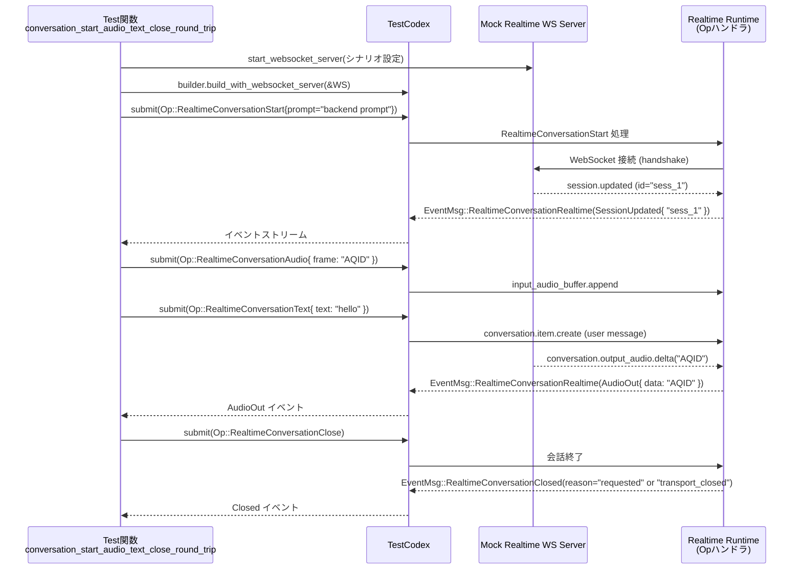
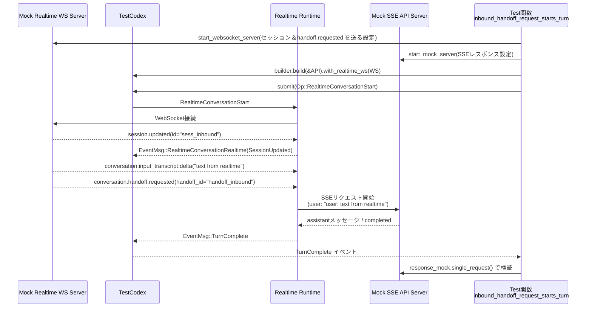

core/tests/suite/realtime_conversation.rs

> 注記: ユーザー指定で「行番号付き根拠」が求められていますが、このインターフェースからは実際の行番号情報にアクセスできません。  
> そのため、本レポートでは場所を `core/tests/suite/realtime_conversation.rs:L?-?` のように「ファイル名 + 行番号不明」という形で示します。

---

## 0. ざっくり一言

Codex の「リアルタイム会話（WebSocket / WebRTC）」機能と、通常のストリーミング SSE エージェントとの連携を、モックサーバーを使って end-to-end で検証するための非同期統合テスト群です。

---

## 1. このモジュールの役割

### 1.1 概要

このモジュールは、リアルタイム会話機能の **外部仕様をテストを通じて定義** する役割を持ちます（`#[tokio::test]` が多数定義されていることから判断できます）。

主に次の点を検証しています（コード全体より）:

- Realtime WebSocket / WebRTC セッションの開始・終了と、音声・テキストメッセージの往復
- Realtime 用 API キーや認証の前提条件・エラー挙動
- backend prompt / startup context / voice の決定ロジックとバージョンごとの制約
- スレッド履歴やワークスペースから生成される **startup context** の注入・トリミング
- Realtime 側の「handoff.requested」と SSE での通常ターンとの **橋渡し** と、その継続条件やクリーンアップ

### 1.2 アーキテクチャ内での位置づけ

このテストモジュールで関係する主要コンポーネントを整理すると、次のようになります。

- `TestCodex`  
  CLI 本体に相当するロジックをテスト用にラップしたもの（`core_test_support::test_codex` から取得）。
- モック HTTP サーバー
  - `start_mock_server()` / Wiremock  
    通常の REST / SSE API（Chat Completions相当）をモック。
  - `start_streaming_sse_server()`  
    Streaming SSE を用いたレスポンス生成をモック。
- モック WebSocket サーバー
  - `start_websocket_server()` / `start_websocket_server_with_headers()`  
    Realtime backend（/v1/realtime）を模倣。
- Realtime 会話操作
  - `Op::RealtimeConversationStart`, `Op::RealtimeConversationAudio`, `Op::RealtimeConversationText`,  
    `Op::RealtimeConversationClose` などを `test.codex.submit()` で送信。
- イベント待ちユーティリティ
  - `wait_for_event`, `wait_for_event_match` で `EventMsg` を待ち合わせ。

これらの関係を簡略化すると次のようになります。

```mermaid
graph TD
    subgraph Tests[このファイルのテスト群]
        A[Test関数\n例: conversation_start_audio_text_close_round_trip\n(realtime_conversation.rs:L?-?)]
    end

    A --> B[TestCodex\n(core_test_support::test_codex)]
    B --> C[HTTP Mock Server\nstart_mock_server / SSE]
    B --> D[Realtime WS Server\nstart_websocket_server]
    B --> E[State DB\ncodex_state::ThreadMetadata]

    A --> F[Wiremock /realtime/calls\nRealtimeCallRequestCapture]

    C -.SSEストリーミング.-> B
    D -.Realtimeイベント.-> B
```

### 1.3 設計上のポイント

コードから読み取れる設計上の特徴です。

- **テスト単位で環境を完全に構成**  
  各テストは、必要なモックサーバー・設定・認証を個別に構築し、他テストと状態を共有しないようにされています。

- **非同期 + マルチスレッド前提のテスト**  
  すべて `#[tokio::test(flavor = "multi_thread", worker_threads = 2)]` であり、  
  Realtime/WebSocket/SSE の **同時進行** を前提としています（`tokio::time::timeout` や `oneshot::channel` を使用）。

- **Arc<Mutex<…>> によるスレッド安全な記録**  
  `RealtimeCallRequestCapture` は `Arc<Mutex<Vec<WiremockRequest>>>` で HTTP リクエストをスレッド安全に蓄積します  
  （`RealtimeCallRequestCapture` 定義: realtime_conversation.rs:L?-?）。

- **エラーハンドリングは “仕様確認” 用**  
  失敗条件を `EventMsg::Error` や `RealtimeEvent::Error`、`CodexErrorInfo::BadRequest` などで明示的に確認し、  
  「どのケースでエラーになるべきか」をテストで仕様化しています。

- **設定の優先順位と条件分岐の網羅**  
  backend prompt / startup context / voice / base URL / Realtime バージョンなどの多くの設定について、
  「config > 明示パラメータ > デフォルト」のような優先度やサポート可否をテストしています。

---

## 2. コンポーネントインベントリー（関数・構造体一覧）

行番号は取得できないため、すべて `L?-?` としています。

### 2.1 ヘルパー構造体

| 名前 | 種別 | 説明 | 場所 |
|------|------|------|------|
| `RealtimeCallRequestCapture` | 構造体 | Wiremock の `Match` を実装し、テスト中に発生した `/realtime/calls` POST リクエストを `Vec<WiremockRequest>` に蓄積するキャプチャ用ヘルパーです。`single_request` で「1件だけ」であることを検証できます。 | realtime_conversation.rs:L?-? |

### 2.2 非テスト関数

| 名前 | 種別 | 概要 | 場所 |
|------|------|------|------|
| `RealtimeCallRequestCapture::new` | メソッド | `requests` に空の `Vec` を持つインスタンスを生成します。 | realtime_conversation.rs:L?-? |
| `RealtimeCallRequestCapture::single_request` | メソッド | `requests.len() == 1` を `assert_eq!` で確認したうえで、その唯一のリクエストを返します。 | realtime_conversation.rs:L?-? |
| `impl Match for RealtimeCallRequestCapture::matches` | メソッド | Wiremock の `Match` 実装。来たリクエストをすべて `requests` に push し、常に `true` を返してマッチ扱いにします。 | realtime_conversation.rs:L?-? |
| `websocket_request_text` | 関数 | モック WebSocket リクエストの JSON から `["item"]["content"][0]["text"]` を取り出すヘルパーです。 | realtime_conversation.rs:L?-? |
| `websocket_request_instructions` | 関数 | モック WebSocket リクエストの JSON から `["session"]["instructions"]` を取り出すヘルパーです。 | realtime_conversation.rs:L?-? |
| `expected_realtime_backend_prompt` | 関数 | `REALTIME_BACKEND_PROMPT` テンプレートから末尾空白を削除し、`{{ user_first_name }}` プレースホルダを `test_user_first_name()` で置換した期待値を返します。 | realtime_conversation.rs:L?-? |
| `test_user_first_name` | 関数 | `whoami::realname()` / `whoami::username()` から空でない最初の単語を取り、なければ `"there"` を返します。 | realtime_conversation.rs:L?-? |
| `wait_for_matching_websocket_request` | `async fn` | 指定された WebSocket テストサーバー上の全リクエストから、述語 `predicate` を満たすものが現れるまで最大 10 秒ポーリングして返します。 | realtime_conversation.rs:L?-? |
| `run_realtime_conversation_test_in_subprocess` | 関数 | 現在のテストバイナリをサブプロセスとして起動し、環境変数 `OPENAI_API_KEY` の有無を制御しながら特定テストだけを実行します。 | realtime_conversation.rs:L?-? |
| `seed_recent_thread` | `async fn` | `TestCodex` の state DB に対して、`ThreadId` とメタデータを作成し `upsert_thread` することで「最近のスレッド」を1件追加します。startup context 系テストで使用されます。 | realtime_conversation.rs:L?-? |
| `sse_event` | 関数 | `responses::sse(vec![event])` を呼び出す薄いラッパー。Streaming SSE テストで 1イベントの SSE 文字列を生成します。 | realtime_conversation.rs:L?-? |
| `message_input_texts` | 関数 | Chat Completions リクエストの JSON から、指定 `role` の message に含まれる `"input_text"` スパンの text を `Vec<String>` に抽出します。 | realtime_conversation.rs:L?-? |

### 2.3 テスト関数（概要）

以下はすべて `#[tokio::test(flavor = "multi_thread", worker_threads = 2)] async fn` です。

| 関数名 | 概要 | 場所 |
|--------|------|------|
| `conversation_start_audio_text_close_round_trip` | Realtime 会話の開始 → audio/text 送信 → audio out 受信 → close までの基本ラウンドトリップと、WS ハンドシェイク・リクエスト内容の検証。 | realtime_conversation.rs:L?-? |
| `conversation_start_defaults_to_v2_and_gpt_realtime_1_5` | `experimental_realtime_ws_base_url` を指定した場合に、デフォルトの Realtime バージョンが V2 になり、モデルが `gpt-realtime-1.5` になることを検証。 | realtime_conversation.rs:L?-? |
| `conversation_webrtc_start_posts_generated_session` | WebRTC トランスポートでの start 時に、`/v1/realtime/calls` への multipart/form-data POST が行われ、offer SDP と session JSON が正しく送信されることを検証。 | realtime_conversation.rs:L?-? |
| `conversation_start_uses_openai_env_key_fallback_with_chatgpt_auth` | ChatGPT 認証だが realtime 用キーが不足している場合に、サブプロセスで `OPENAI_API_KEY` を設定するとそれが realtime 用 Authorization に使われることを検証。 | realtime_conversation.rs:L?-? |
| `conversation_transport_close_emits_closed_event` | WebSocket 側が切断されたときに `RealtimeConversationClosed(reason="transport_closed")` が発火することを検証。 | realtime_conversation.rs:L?-? |
| `conversation_audio_before_start_emits_error` | 会話開始前に `RealtimeConversationAudio` を送ると `EventMsg::Error` で `BadRequest` & `"conversation is not running"` となることを検証。 | realtime_conversation.rs:L?-? |
| `conversation_start_preflight_failure_emits_realtime_error_only` | API キー無し + ChatGPT auth の場合、preflight で `RealtimeEvent::Error("realtime conversation requires API key auth")` のみを出し、`RealtimeConversationClosed` を出さないことを検証。 | realtime_conversation.rs:L?-? |
| `conversation_start_connect_failure_emits_realtime_error_only` | base URL が無効な場合、接続失敗メッセージの `RealtimeEvent::Error` のみを出し、closed イベントを出さないことを検証。 | realtime_conversation.rs:L?-? |
| `conversation_text_before_start_emits_error` | 会話開始前の `RealtimeConversationText` も `BadRequest` / `"conversation is not running"` になることを検証。 | realtime_conversation.rs:L?-? |
| `conversation_second_start_replaces_runtime` | 1つ目の会話が動作中に 2つ目の start を行うと、WS セッションが差し替わり、audio out は新しいセッションに結びつくことを検証。 | realtime_conversation.rs:L?-? |
| `conversation_uses_experimental_realtime_ws_base_url_override` | `experimental_realtime_ws_base_url` で realtime の接続先を API サーバーとは別の WS サーバーに切り替えられることを検証。 | realtime_conversation.rs:L?-? |
| `conversation_uses_default_realtime_backend_prompt` | `prompt: None` かつ `experimental_realtime_ws_startup_context` が非空な場合、テンプレート backend prompt + startup context が instructions になることを検証。 | realtime_conversation.rs:L?-? |
| `conversation_uses_empty_instructions_for_null_or_empty_prompt` | `prompt: Some(None)` および `prompt: Some(Some(""))` の場合、instructions が空文字になることを検証。 | realtime_conversation.rs:L?-? |
| `conversation_uses_explicit_start_voice` | Start パラメータの `voice: Some(RealtimeVoice::Breeze)` が WS `session.update` の `audio.output.voice` に反映されることを検証。 | realtime_conversation.rs:L?-? |
| `conversation_uses_configured_realtime_voice` | Config の `realtime.voice` で指定した voice (`Cove`) が使用されることを検証。 | realtime_conversation.rs:L?-? |
| `conversation_rejects_voice_for_wrong_realtime_version` | Realtime V2 で voice を指定すると `RealtimeEvent::Error` で「v2 ではサポートされない」とエラーになることを検証。 | realtime_conversation.rs:L?-? |
| `conversation_uses_experimental_realtime_ws_backend_prompt_override` | Config の `experimental_realtime_ws_backend_prompt` が start パラメータの prompt より優先されることを検証。 | realtime_conversation.rs:L?-? |
| `conversation_uses_experimental_realtime_ws_startup_context_override` | Config の `experimental_realtime_ws_startup_context`（非空）があると、thread history / workspace map からの自動 startup context を抑止し、指定文字列だけを instructions に追加することを検証。 | realtime_conversation.rs:L?-? |
| `conversation_disables_realtime_startup_context_with_empty_override` | `experimental_realtime_ws_startup_context = Some("")` の場合、自動 startup context が完全に無効化されることを検証。 | realtime_conversation.rs:L?-? |
| `conversation_start_injects_startup_context_from_thread_history` | 最近のスレッドメタデータと workspace 情報から組み立てられた Markdown の startup context が instructions に入ることを検証。 | realtime_conversation.rs:L?-? |
| `conversation_startup_context_falls_back_to_workspace_map` | 最近スレッドがない場合、ワークスペースマップ（ファイル・ディレクトリ一覧）だけから startup context が構成されることを検証。 | realtime_conversation.rs:L?-? |
| `conversation_startup_context_is_truncated_and_sent_once_per_start` | startup context が 20,500 文字以下にトリミングされ、同じ start 中に 2回送信されない（2回目以降の text には含まれない）ことを検証。 | realtime_conversation.rs:L?-? |
| `conversation_mirrors_assistant_message_text_to_realtime_handoff` | SSE 側の最終 assistant メッセージを、Realtime 側 `conversation.handoff.append` の `output_text` としてミラーリングすることを検証。 | realtime_conversation.rs:L?-? |
| `conversation_handoff_persists_across_item_done_until_turn_complete` | `conversation.item.done` が来ても、SSE ターン完了 (`TurnComplete`) までは handoff append が継続することを検証。 | realtime_conversation.rs:L?-? |
| `inbound_handoff_request_starts_turn` | Realtime 側からの `conversation.handoff.requested` により新しいターンが開始され、その transcript が SSE リクエストの user message に入ることを検証。 | realtime_conversation.rs:L?-? |
| `inbound_handoff_request_uses_active_transcript` | `input_transcript` / `output_transcript` delta を組み合わせた「アクティブな transcript」全体が、handoff 時の user メッセージとして使われることを検証。 | realtime_conversation.rs:L?-? |
| `inbound_handoff_request_clears_active_transcript_after_each_handoff` | handoff ごとにアクティブ transcript がクリアされ、別の handoff で過去の transcript が混入しないことを検証。 | realtime_conversation.rs:L?-? |
| `inbound_conversation_item_does_not_start_turn_and_still_forwards_audio` | Realtime からの `conversation.item.added`（user メッセージ）があっても、新規ターンは開始せず、audio delta だけはそのまま転送されることを検証。 | realtime_conversation.rs:L?-? |
| `delegated_turn_user_role_echo_does_not_redelegate_and_still_forwards_audio` | 「assistant says hi」を user ロールで echo した `conversation.item.added` が来ても再度 handoff を開始せず、audio は転送されることを検証。 | realtime_conversation.rs:L?-? |
| `inbound_handoff_request_does_not_block_realtime_event_forwarding` | handoff での SSE ターンが進行中でも、Realtime の audio out などのイベントはブロックされずに転送されることを検証。 | realtime_conversation.rs:L?-? |
| `inbound_handoff_request_steers_active_turn` | 通常ターン中 (`UserInput`) に Realtime handoff が来た場合、次のリクエストではその transcript を「steering テキスト」として追加し、初回リクエストには含めないことを検証。 | realtime_conversation.rs:L?-? |
| `inbound_handoff_request_starts_turn_and_does_not_block_realtime_audio` | handoff によって開始されたターン中でも、Realtime audio out がタイムアウトせず届くことを検証しつつ、SSE リクエストの user テキストに handoff テキストが含まれることを確認。 | realtime_conversation.rs:L?-? |

---

## 3. 公開 API と詳細解説

このファイル自体はライブラリの「公開 API」を定義していませんが、**テストから推測できる外部契約**という意味で重要な関数・テストを 7 件選び、詳細を整理します。

### 3.1 型一覧

| 名前 | 種別 | 役割 / 用途 |
|------|------|-------------|
| `RealtimeCallRequestCapture` | 構造体 | Wiremock の `Match` を実装し、`/v1/realtime/calls` への HTTP リクエストを書き留めてテストで検証するためのユーティリティです。`clone` 可能で、複数テストステップで共有できます。 |

---

### 3.2 関数詳細

#### `wait_for_matching_websocket_request<F>(server, description, predicate) -> WebSocketRequest`

**定義場所**

- `core/tests/suite/realtime_conversation.rs:L?-?`

**概要**

指定された WebSocket テストサーバーの全リクエストから、述語 `predicate` を満たすものが現れるまで最大 10 秒間ポーリングし、見つかったリクエストを返します。Realtime startup context など、**特定パターンのリクエストが送られたことの確認**に使われます。

**引数**

| 引数名 | 型 | 説明 |
|--------|----|------|
| `server` | `&core_test_support::responses::WebSocketTestServer` | モック WebSocket サーバー。`connections()` で全リクエスト履歴を取得できます。 |
| `description` | `&str` | タイムアウト時の `assert!` メッセージに埋め込む説明文字列です。 |
| `predicate` | `F` (`Fn(&WebSocketRequest) -> bool`) | 「どのリクエストを待つか」を判定する関数。true を返したリクエストが返却されます。 |

**戻り値**

- `core_test_support::responses::WebSocketRequest`  
  条件に合致したリクエスト（`clone()` によって複製されたもの）です。

**内部処理の流れ**

1. `deadline = now + 10秒` を計算。
2. 無限ループの中で:
   - `server.connections()` から全コネクション・全リクエストをイテレート。
   - `predicate` を満たすリクエストが見つかれば `clone()` して即 return。
3. 見つからなければ `Instant::now() < deadline` を `assert!` でチェック。期限を超えていればテスト失敗（panic）。
4. まだ期限内なら `tokio::time::sleep(10ms).await` して再度ループ。

**Examples（使用例）**

startup context が入った `session.update` を待つケース（`conversation_startup_context_is_truncated_and_sent_once_per_start` など）:

```rust
let startup_context_request = wait_for_matching_websocket_request(
    &realtime_server,
    "startup context request with instructions",
    |request| websocket_request_instructions(request).is_some(),
).await;

let instructions = websocket_request_instructions(&startup_context_request)
    .expect("custom startup context request should contain instructions");
```

**Errors / Panics**

- 10 秒経っても `predicate` を満たすリクエストが現れないと `assert!` により panic します。  
  → テスト上は「期待したリクエストが送信されなかった」と解釈されます。

**Edge cases**

- WebSocket へのリクエストが 1件も来ない場合も、10 秒後に panic します。
- `predicate` が高コストの場合、10ms ごとに全履歴を走査するためテスト実行時間に影響します。

**使用上の注意点**

- 本関数はテスト用であり、本番コードでの使用は想定されていません。
- 長時間ブロックするため、`description` にはデバッグしやすい情報を入れておく方が安全です。

---

#### `seed_recent_thread(test, title, first_user_message, slug) -> Result<()>`

**定義場所**

- `core/tests/suite/realtime_conversation.rs:L?-?`

**概要**

`TestCodex` の state DB に「最近のスレッド」を 1件登録します。startup context 関連テストで、**履歴ベースのコンテキスト生成**を再現するために使われます。

**引数**

| 引数名 | 型 | 説明 |
|--------|----|------|
| `test` | `&TestCodex` | テスト用 Codex ハーネス。`state_db()` と `codex_home_path()`、`workspace_path()` にアクセスします。 |
| `title` | `&str` | スレッドタイトル。startup context の「Recent work」部分に反映されます。 |
| `first_user_message` | `&str` | 最初のユーザーメッセージ。startup context の「User asks:」部分に使用されます。 |
| `slug` | `&str` | ワークスペースやブランチ名のサフィックスに使用する短い識別子です。 |

**戻り値**

- `Result<()>` (`anyhow::Result`)  
  DB への upsert 成功 / 失敗を表します。

**内部処理の流れ**

1. `state_db()` を呼び出し、state DB ハンドルを取得します。`context("state db enabled")?` でエラーメッセージを付与。
2. `ThreadId::new()` と `Utc::now()` で新しいスレッド ID と更新日時を生成。
3. `ThreadMetadataBuilder::new(...)` でメタデータビルダーを構築し、以下を設定:
   - `cwd` に `test.workspace_path(format!("workspace-{slug}"))`
   - `model_provider` に `"test-provider"`
   - `git_branch` に `"branch-{slug}"`
4. `build("test-provider")` で実際のメタデータに変換し、`metadata.title` と `metadata.first_user_message` を上書き。
5. `db.upsert_thread(&metadata).await?` で DB に保存。

**Examples**

```rust
seed_recent_thread(
    &test,
    "Recent work: cleaned up startup flows and reviewed websocket routing.",
    "Investigate realtime startup context",
    "latest",
).await?;
```

**Errors / Panics**

- state DB が無効な場合や DB 書き込みに失敗した場合は `Err(anyhow::Error)` を返します。
- テスト内では `?` で伝播されるため、テスト自体が失敗します。

**Edge cases**

- 同じ `slug` を複数回使うと、`workspace-<slug>` ディレクトリや `branch-<slug>` が重複しますが、テストでは特に問題視されていません。
- `first_user_message` が空文字の場合の挙動はこのファイル内ではテストされていません。

**使用上の注意点**

- startup context のテストでは、`fs::create_dir_all` や `fs::write` でワークスペース内にファイルも作成しているため、**ファイル構造とスレッド履歴の両方**を準備する必要があります。

---

#### `conversation_start_audio_text_close_round_trip()`

**定義場所**

- `core/tests/suite/realtime_conversation.rs:L?-?`

**概要**

Realtime 会話の基本的なライフサイクル（start → audio/text 送信 → audio out 受信 → close）と、WS ハンドシェイクや送信メッセージの内容を end-to-end で検証するテストです。

**引数 / 戻り値**

- テスト関数であり、引数はなく、`Result<()>` を返します。`?` でエラーを伝播し、panic/アサーション失敗でテスト失敗となります。

**内部処理の流れ（要約）**

1. ネットワークがなければ `skip_if_no_network!` でテストをスキップ。
2. `start_websocket_server` でモック realtime サーバーを構築。
   - 2回目の接続で `session.updated` → audio delta → assistant message を返すようにシナリオを設定。
3. `test_codex().build_with_websocket_server(&server)` で `TestCodex` を構築。
4. `Op::RealtimeConversationStart` を `submit`。
   - `prompt: "backend prompt"`, `session_id: None` など。
5. `wait_for_event_match` で `EventMsg::RealtimeConversationStarted` を待ち、`version == V1` と `session_id` の存在を確認。
6. `RealtimeEvent::SessionUpdated { session_id }` を受け、`"sess_1"` であることを確認。
7. `Op::RealtimeConversationAudio` / `Op::RealtimeConversationText` を送信。
8. `RealtimeEvent::AudioOut(frame)` を受け、`frame.data == "AQID"` を確認。
9. `server.connections()` と `server.handshakes()` を検査し、以下を確認:
   - 2つ目の接続で `session.update` が最初に送られ、`audio.output.voice == "cove"`。
   - `x-session-id` が `started.session_id` と一致。
   - Authorization ヘッダが `Bearer dummy`。
   - URI が `/v1/realtime?intent=quicksilver&model=realtime-test-model`。
   - 2つ目・3つ目のリクエストの type が `conversation.item.create` と `input_audio_buffer.append` である。
10. `Op::RealtimeConversationClose` を送信し、`RealtimeConversationClosed.reason` が `"requested"` または `"transport_closed"` であることを確認。
11. `server.shutdown().await` で終了。

**Examples**

このテストのパターンは、「新たな realtime テストを書く」際のテンプレートとして利用できます。

```rust
test.codex
    .submit(Op::RealtimeConversationStart(ConversationStartParams {
        prompt: Some(Some("backend prompt".to_string())),
        session_id: None,
        transport: None,
        voice: None,
    }))
    .await?;
```

**Errors / Panics**

- イベントが期待通りに来ない、または内容が異なる場合に `assert_eq!` や `assert!` で panic します。
- サーバーとの通信エラーは `Result` 経由で伝播し、テスト失敗になります。

**Edge cases**

- `closed.reason` は `"requested"` または `"transport_closed"` の 2パターンを許容しています。これは transport が先に閉じるケースを許可するための仕様と読み取れます。
- WebSocket 接続の順序（`connections[0]` と `connections[1]`）を前提としているため、モックサーバー側の仕様変更に依存します。

**使用上の注意点**

- `wait_for_event_match` は内部で無期限に待つ可能性があるため、テスト全体のタイムアウト設定（Tokio の test timeout 等）に注意が必要です。

---

#### `conversation_webrtc_start_posts_generated_session()`

**定義場所**

- `core/tests/suite/realtime_conversation.rs:L?-?`

**概要**

Realtime 会話を WebRTC トランスポートで開始した場合に、クライアントが:

1. `/v1/realtime/calls` に SDP offer と session JSON を multipart/form-data で POST する
2. 応答の SDP answer を `RealtimeConversationSdp` イベントとしてクライアントへ返す
3. 同じ call_id で sideband WebSocket を張る

という一連の流れと、Authorization / Content-Type / instructions の内容を検証するテストです。

**引数 / 戻り値**

- 引数なし、`Result<()>` 戻り。

**内部処理の流れ（アルゴリズム）**

1. Wiremock ベースの HTTP モックサーバー `server` を起動。
   - `RealtimeCallRequestCapture` を `Match` として組み込み、
   - `/realtime/calls` への POST に対して 200 / `Location: /v1/realtime/calls/calls/rtc_core_test` / body `v=answer\r\n` を返す。
2. WebSocket モック `realtime_server` を `start_websocket_server_with_headers` で構築し、`session.updated` を 1件返す設定。
3. Config で以下を指定して `TestCodex` をビルド:
   - `experimental_realtime_ws_backend_prompt = "backend prompt"`
   - `experimental_realtime_ws_model = "realtime-test-model"`
   - `experimental_realtime_ws_startup_context = "startup context"`
   - `experimental_realtime_ws_base_url = realtime_server.uri()`
   - `realtime.version = RealtimeWsVersion::V1`
4. `Op::RealtimeConversationStart` を WebRTC トランスポートで送信:

   ```rust
   transport: Some(ConversationStartTransport::Webrtc {
       sdp: "v=offer\r\n".to_string(),
   })
   ```

5. `EventMsg::RealtimeConversationSdp` を待ち、`created.sdp == "v=answer\r\n"` を確認。
6. `RealtimeEvent::SessionUpdated` を待ち、`session_id == "sess_webrtc"` を確認。
7. `capture.single_request()` で HTTP POST 内容を検査:
   - `request.url.path() == "/v1/realtime/calls"`
   - Authorization ヘッダが `Bearer dummy`
   - Content-Type が `multipart/form-data; boundary=codex-realtime-call-boundary`
   - body が期待する multipart 文字列と完全一致。特に session JSON 部分:

     ```json
     {
       "audio": {
         "input": { "format": { "type": "audio/pcm", "rate": 24000 } },
         "output": { "voice": "cove" }
       },
       "type": "quicksilver",
       "model": "realtime-test-model",
       "instructions": "backend prompt\n\nstartup context"
     }
     ```

8. `realtime_server.single_handshake()` を確認:
   - URI が `/v1/realtime?intent=quicksilver&call_id=rtc_core_test`
   - Authorization が `Bearer dummy`
9. `RealtimeConversationClose` を送信し、閉じイベント内容を検証して終了。

**Errors / Panics**

- HTTP リクエストが 1件でない場合、`RealtimeCallRequestCapture::single_request` の `assert_eq!` で panic。
- multipart body が期待通りでない場合 `assert_eq!` で panic。
- Handshake URL やヘッダが異なる場合も同様。

**Edge cases**

- `startup context` の改行位置（`backend prompt\n\nstartup context`）も厳密に検証しているため、実装側でのフォーマット変更はこのテストに影響します。
- `call_id` は Wiremock のレスポンス `Location` ヘッダから抽出されていると推測されますが、テストからはその処理の詳細は見えません（呼び出し元コードはこのチャンクにはない）。

**使用上の注意点**

- WebRTC セッションの設定など、本テストで扱われる SDP はかなり簡略化された文字列 (`v=offer\r\n` / `v=answer\r\n`) です。実際の利用ではより複雑な SDP になると考えられます。

---

#### `conversation_startup_context_is_truncated_and_sent_once_per_start()`

**定義場所**

- `core/tests/suite/realtime_conversation.rs:L?-?`

**概要**

「最近のスレッド」の summary が非常に長い場合でも、

- startup context の instructions が **一定サイズ（20,500 文字以下）にトリミング**される
- startup context が送信されるのは **各 start に対して 1回だけ** であり、その後の明示的な `RealtimeConversationText` は純粋なユーザー発話として送信される

という仕様を検証するテストです。

**内部処理の流れ**

1. `start_websocket_server` で `session.updated` のみ返す realtime サーバーを起動。
2. `oversized_summary = "recent work ".repeat(3_500)` を作成。
3. Config で `experimental_realtime_ws_base_url` と `realtime.version = V1` を指定しながら `TestCodex` を構築。
4. `seed_recent_thread(&test, &oversized_summary, "summary", "oversized")` で巨大 summary を持つスレッドを追加。
5. `fs::write("marker.txt", "marker")` でワークスペースにファイルを作成。
6. `RealtimeConversationStart("backend prompt")` を送信。
7. `wait_for_matching_websocket_request` で instructions を含む最初のリクエストを取得し、その text を `startup_context` として検査:
   - `startup_context` に `STARTUP_CONTEXT_HEADER` が含まれる
   - `startup_context.len() <= 20_500`
8. 次に `RealtimeConversationText("hello")` を送信。
9. 再度 `wait_for_matching_websocket_request` で `"hello"` を含む request を探し、`websocket_request_text(...) == Some("hello")` であることを確認。
   - startup context が再度付与されていない（テストは明示的には確認していませんが、「text だけを含むリクエスト」を探しています）。

**Errors / Panics**

- 20,500 文字を超える場合や `STARTUP_CONTEXT_HEADER` が含まれない場合に `assert!` 失敗。
- `"hello"` を含むリクエストが現れない場合、`wait_for_matching_websocket_request` 側のタイムアウト `assert!` で panic。

**Edge cases / 契約**

テストから読み取れる契約:

- startup context の最大長は **約 20.5k 文字** に制限される。
- startup context は **各会話 start ごとに 1度だけ** instructions として送られ、その後の user テキストには重ねて送られない。

**使用上の注意点**

- 実際の利用コードで「startup context が長くなりすぎる」状況を気にする必要は基本的になく、このテストにより安全なトリミングが保証されています。

---

#### `conversation_mirrors_assistant_message_text_to_realtime_handoff()`

**定義場所**

- `core/tests/suite/realtime_conversation.rs:L?-?`

**概要**

SSE 側で完了した assistant メッセージ（例: `"assistant says hi"`）が、Realtime 側の `conversation.handoff.requested` に対応して **`conversation.handoff.append` の `output_text` としてミラーされる**ことを検証するテストです。

**内部処理の流れ**

1. SSE モックサーバーを用意し、次のイベントシーケンスを返すよう設定:
   - `response_created("resp_1")`
   - `assistant_message("msg_1", "assistant says hi")`
   - `completed("resp_1")`
2. Realtime モックサーバーを用意し、次のイベントを送るよう設定:
   - `session.updated`（id: `sess_1`）
   - `conversation.input_transcript.delta("delegate hello")`
   - `conversation.handoff.requested(handoff_id="handoff_1", input_transcript="delegate hello")`
3. `TestCodex` を SSE + Realtime モックに接続する形で構築。
4. `RealtimeConversationStart("backend prompt")` を送信。
5. `RealtimeEvent::SessionUpdated` と `RealtimeEvent::HandoffRequested` を待機。
6. `TurnComplete` イベント（SSE ターン完了）を待機。
7. Realtime モックサーバーへのリクエストを確認:
   - コネクション数は 1。
   - 最初のリクエストは `session.update`。
   - 2つ目のリクエストは `conversation.handoff.append` で、
     - `handoff_id == "handoff_1"`
     - `output_text == "\"Agent Final Message\":\n\nassistant says hi"`

**契約（テストから読み取れる仕様）**

- 初回の handoff に対して、**エージェントの最終メッセージが `Agent Final Message` として Realtime に返却**される。
- Realtime 側で handoff を要求した場合、SSE 側のターンが完了したタイミングで `conversation.handoff.append` が送信される。

**使用上の注意点**

- このテストは、「handoff 用の追加メッセージフォーマット（先頭に `"Agent Final Message":`）」が固定であることを前提にしています。  
  実装でこのフォーマットを変更する場合は、このテストを更新する必要があります。

---

#### `inbound_handoff_request_starts_turn()`

**定義場所**

- `core/tests/suite/realtime_conversation.rs:L?-?`

**概要**

Realtime backend から `conversation.handoff.requested` が届いた場合に、Codex 側で **新しいターンが開始され、SSE API に対して user メッセージ `"user: text from realtime"` が送信される**ことを検証するテストです。

**内部処理（要約）**

1. SSE モックサーバー: `response_created -> assistant_message("ok") -> completed` というシンプルなターンを返すよう設定。
2. Realtime モックサーバー: `session.updated`, `conversation.input_transcript.delta("text from realtime")`, `conversation.handoff.requested(..., input_transcript="text from realtime")` を送るよう構成。
3. `RealtimeConversationStart` を送信し、`SessionUpdated("sess_inbound")` と `HandoffRequested(handoff_id="handoff_inbound")` を待機。
4. `TurnComplete` が来るまで待機。
5. SSE サーバーへの単一リクエスト (`response_mock.single_request()`) を取得。
6. JSON を `message_input_texts("user")` で解析し、どこかに `"user: text from realtime"` が含まれることを確認。

**契約**

- inbound handoff は **同期的に通常ターンを開始**させる。
- user テキストは `"user: {transcript}"` という形式で SSE API に渡る。

---

#### `run_realtime_conversation_test_in_subprocess(test_name, openai_api_key)`

**定義場所**

- `core/tests/suite/realtime_conversation.rs:L?-?`

**概要**

Realtime テストの一部では、プロセス環境変数 `OPENAI_API_KEY` の有無による挙動の違いを確認する必要があります。  
この関数は、現在のテストバイナリを **サブプロセスとして再起動** し、そのサブプロセスの環境にだけ `OPENAI_API_KEY` を設定/未設定にした状態で特定テストを実行します。

**引数**

| 引数名 | 型 | 説明 |
|--------|----|------|
| `test_name` | `&str` | 実行したいテスト名 (`--exact` 付きで cargo test に渡される名前) |
| `openai_api_key` | `Option<&str>` | `Some(key)` の場合はサブプロセス環境に `OPENAI_API_KEY=key` をセットし、`None` の場合はアンセットします。 |

**戻り値**

- `Result<()>`  
  コマンド実行が成功し、サブプロセスの終了コードが成功であれば `Ok(())`。  
  失敗すれば `Err(anyhow::Error)`。

**内部処理の流れ**

1. `std::env::current_exe()?` で現在のテストバイナリパスを取得。
2. `Command::new(...)` に `--exact test_name` と環境変数 `REALTIME_CONVERSATION_TEST_SUBPROCESS_ENV_VAR=1` を設定。
3. `openai_api_key` に応じて `OPENAI_API_KEY_ENV_VAR` を `env` または `env_remove`。
4. `command.output()?` で実行し、`output.status.success()` を `assert!` で確認。
   - 失敗時には stdout / stderr を含むメッセージで panic。
5. `Ok(())` を返す。

**使用例**

```rust
if std::env::var_os(REALTIME_CONVERSATION_TEST_SUBPROCESS_ENV_VAR).is_none() {
    return run_realtime_conversation_test_in_subprocess(
        "suite::realtime_conversation::conversation_start_preflight_failure_emits_realtime_error_only",
        /*openai_api_key*/ None,
    );
}
```

**Errors / Panics**

- サブプロセスが失敗終了した場合、panic でテストが失敗します（stdout/stderr を含むエラーメッセージ付き）。

**Edge cases**

- テスト名の typo やフィルタの不一致があると「テストが実行されずに成功終了」する可能性がありますが、このコードからは検証されません（cargo test の仕様に依存）。

**使用上の注意点**

- サブプロセスを起動するため、テスト全体の実行時間が増加します。
- 並列テスト実行環境ではサブプロセスの環境が他テストに影響しないよう注意が必要ですが、ここでは `Command` 経由の局所環境設定だけなので、グローバルには影響しません。

---

### 3.3 その他のヘルパー関数

上記で詳細解説しなかったヘルパー関数の役割をまとめます。

| 関数名 | 役割（1 行） |
|--------|--------------|
| `websocket_request_text` | WebSocket リクエスト JSON から最初の text コンテンツを取り出すユーティリティです。 |
| `websocket_request_instructions` | WebSocket リクエスト JSON から `session.instructions` を取り出すユーティリティです。 |
| `expected_realtime_backend_prompt` | テンプレート backend prompt を、実行ユーザーのファーストネームで展開した期待値を生成します。 |
| `test_user_first_name` | 実行ユーザーのフルネームまたはユーザー名から、1語目を取り出して返します。 |
| `sse_event` | `responses::sse` を 1イベント用にラップするショートカットです。 |
| `message_input_texts` | Chat Completions JSON から、指定ロールの `"input_text"` スパンだけを取り出すフィルタ関数です。 |

---

## 4. データフロー

### 4.1 基本ラウンドトリップのデータフロー

`conversation_start_audio_text_close_round_trip` の流れをシーケンス図で示します（関数本体: realtime_conversation.rs:L?-?）。



ポイント:

- TestCodex は Op を送るフロントエンドであり、内部で Realtime Runtime と WebSocket を管理します。
- WebSocket の実際の鯖はモックですが、ハンドシェイク URI・ヘッダ・送信メッセージは実装そのものです。
- AudioOut は Realtime backend からの `conversation.output_audio.delta` に対応し、`RealtimeEvent::AudioOut` として CLI に届けられます。

### 4.2 inbound handoff のデータフロー（`inbound_handoff_request_starts_turn`）

Realtime からの handoff 要求が **通常の SSE ベースターン開始**に変換される流れを示します。



---

## 5. 使い方（How to Use）

### 5.1 基本的な使用方法（テスト追加のパターン）

このファイルのパターンを踏襲して、新しい realtime テストを追加する基本的な流れは次の通りです。

1. **モックサーバーを起動**
   - Realtime: `start_websocket_server` など
   - API/SSE: `start_mock_server` / `start_streaming_sse_server`

2. **TestCodex を構築**

```rust
let realtime_server = start_websocket_server(vec![/* シナリオ */]).await;

let mut builder = test_codex().with_config({
    let realtime_base_url = realtime_server.uri().to_string();
    move |config| {
        config.experimental_realtime_ws_base_url = Some(realtime_base_url);
        config.realtime.version = RealtimeWsVersion::V1;
    }
});
let test = builder.build(&api_server).await?;
```

1. **Op を送信して挙動を検証**

```rust
test.codex
    .submit(Op::RealtimeConversationStart(ConversationStartParams {
        prompt: Some(Some("backend prompt".to_string())),
        session_id: None,
        transport: None,
        voice: None,
    }))
    .await?;

let session_updated = wait_for_event_match(&test.codex, |msg| match msg {
    EventMsg::RealtimeConversationRealtime(RealtimeConversationRealtimeEvent {
        payload: RealtimeEvent::SessionUpdated { session_id, .. },
    }) => Some(session_id.clone()),
    _ => None,
})
.await;
assert_eq!(session_updated, "sess_1");
```

1. **必要であれば `wait_for_matching_websocket_request` や `server.connections()` で WebSocket 側も検証**

### 5.2 よくある使用パターン

- **単純な realtime 会話テスト**
  - `RealtimeConversationStart` → audio/text → `AudioOut` → `RealtimeConversationClose`
  - 例: `conversation_start_audio_text_close_round_trip`

- **WebRTC 経由の会話開始**
  - `ConversationStartTransport::Webrtc` を指定し、/realtime/calls への POST と sideband WebSocket を検証。
  - 例: `conversation_webrtc_start_posts_generated_session`

- **startup context 検証**
  - `seed_recent_thread` + ワークスペースファイル生成 → `RealtimeConversationStart`
  - instructions に含まれる Markdown を `websocket_request_instructions` で確認。

- **handoff 連携検証**
  - Realtime モックから `conversation.handoff.requested` を送らせる
  - SSE 側のリクエストボディを `message_input_texts` で検証。
  - 例: `inbound_handoff_request_starts_turn`, `inbound_handoff_request_steers_active_turn`

### 5.3 よくある間違い（テストから読み取れる「禁止事項」）

テストから逆算される誤用パターンです。

```rust
// NG: 会話開始前に audio/text を送る
test.codex
    .submit(Op::RealtimeConversationAudio(/* ... */))
    .await?; // => EventMsg::Error(BadRequest, "conversation is not running")

test.codex
    .submit(Op::RealtimeConversationText(/* ... */))
    .await?; // => 同上
```

- 会話開始 (`RealtimeConversationStart`) 以前に `RealtimeConversationAudio` / `RealtimeConversationText` を送ると  
  `CodexErrorInfo::BadRequest` + `"conversation is not running"` になります  
  （`conversation_audio_before_start_emits_error`, `conversation_text_before_start_emits_error`）。

- Realtime バージョン V2 で `voice` を指定するとエラーになる  
  （`conversation_rejects_voice_for_wrong_realtime_version`）。

- ChatGPT auth なのに API キーを設定していない場合、preflight で realtime エラーが返り、closed イベントは出ません  
  （`conversation_start_preflight_failure_emits_realtime_error_only`）。

### 5.4 使用上の注意点（まとめ）

テストから読み取れる、Realtime 会話機能の共通前提条件です。

- **会話開始前に audio/text を送らないこと**  
  → 「会話が走っていない」という明示的な BadRequest エラーになります。

- **Realtime バージョンと voice の対応に注意**  
  - V1: voice 指定可能（`cove`, `breeze` など）。
  - V2: voice 指定は `RealtimeEvent::Error` になります。

- **API キー / 認証の前提**
  - Realtime 会話には API キー認証が必要であり、ChatGPT auth のみでは動作しません。
  - Realtime 用のキーが無い場合、環境変数 `OPENAI_API_KEY` が fallback として使われるテストもあります。

- **startup context のサイズと出現回数**
  - 約 20k 文字まで自動トリミング。
  - 各 start の最初の instructions のみで送信される。

---

## 6. 変更の仕方（How to Modify）

### 6.1 新しい機能を追加する場合（テストを増やす）

1. **対象シナリオの分類を決める**
   - 会話開始/終了まわり
   - startup context / backend prompt
   - handoff / delegated turn
   - WebRTC トランスポート など

2. **既存テストをテンプレートにする**
   - WebSocket 主体なら `conversation_start_audio_text_close_round_trip`
   - startup context 主体なら `conversation_start_injects_startup_context_from_thread_history`
   - handoff 主体なら `inbound_handoff_request_starts_turn` など

3. **モックサーバーのシナリオを設計**
   - `start_websocket_server(vec![ /* コネクションごとのイベント配列 */ ])`
   - `start_streaming_sse_server` の `StreamingSseChunk` と `gate` で順序制御が可能です。

4. **期待される EventMsg / RealtimeEvent を `wait_for_event_match` で検証**
   - 新しいイベントタイプが増えたら、マッチ関数に分岐を追加。

5. **必要に応じてヘルパー関数を追加**
   - 長くなりがちな JSON 検証は `message_input_texts` のようにヘルパーでラップすると読みやすくなります。

### 6.2 既存の機能を変更する場合（仕様変更への追従）

- **影響範囲の確認**
  - 該当イベント種別（例: `conversation.handoff.requested`）に関連するテストをすべて検索し、仕様依存のアサーションを洗い出します。
- **契約の意識**
  - 本ファイルのテストは事実上「外部契約」を表しているため、  
    仕様を変えるときには「どのテストの期待を変えるか」を明確にする必要があります。
- **並行性まわりの注意**
  - `oneshot::channel` や `tokio::time::timeout` を使うテストは、タイミングに敏感です。  
    内部処理のスケジューリングが変わるとテストのタイムアウト条件に引っかかる可能性があります。

---

## 7. 関連ファイル・モジュール

このテストモジュールと密接に関係する外部モジュール（コードから参照されているもの）です。

| パス / モジュール | 役割 / 関係 |
|-------------------|------------|
| `core_test_support::test_codex` | `TestCodex` を提供し、Codex の実際の Op 実装に対するテスト用ハーネスとして利用されています。 |
| `core_test_support::responses` | WebSocket / HTTP モックサーバー (`start_websocket_server`, `start_mock_server`) や SSE 用ユーティリティ (`sse`, `mount_sse_once` など) を提供します。 |
| `core_test_support::streaming_sse` | `StreamingSseChunk` と `start_streaming_sse_server` を通じて、SSE ストリーミングレスポンスのタイミング制御付きモックを提供します。 |
| `core_test_support::wait_for_event`, `wait_for_event_match` | `EventMsg` ストリームから条件に合うイベントが現れるまで待機するヘルパーです。 |
| `codex_protocol::protocol::*` | `Op`, `EventMsg`, `RealtimeEvent`, `RealtimeVoice`, `ConversationStartParams` など、Realtime 会話プロトコルの型定義を提供します。 |
| `codex_config::config_toml::RealtimeWsVersion` | Realtime WebSocket のバージョン (`V1`, `V2`) を表す enum です。テストでは version ごとの挙動差を検証しています。 |
| `codex_login::CodexAuth` | 認証関連。`create_dummy_chatgpt_auth_for_testing` で ChatGPT 向けのダミー認証情報を提供し、Realtime API キーの前提条件テストに使われています。 |
| `codex_state::ThreadMetadataBuilder` | スレッドメタデータの構築に使われ、startup context に利用される最近スレッド情報をテスト側で注入するために使用されています（このファイルでは use だけでパスは明示されていません）。 |

このファイル全体は、これらのコンポーネントを組み合わせて **Realtime 会話機能の仕様を高い網羅性でテストするスイート**として構成されています。
