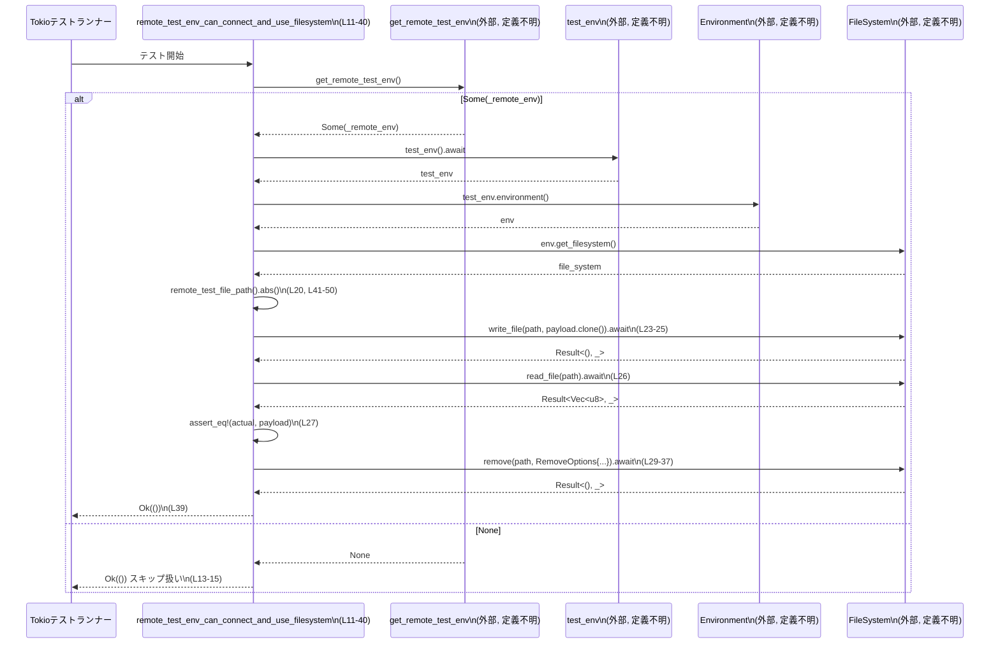

# core/tests/suite/remote_env.rs コード解説

---

## 0. ざっくり一言

このファイルは、リモート実行環境が提供するファイルシステムに対して、**書き込み・読み出し・削除が正常に行えるか**を検証する非同期統合テストと、そのための一時ファイルパス生成関数を定義しています（`core/tests/suite/remote_env.rs:L11-40, L41-50`）。

---

## 1. このモジュールの役割

### 1.1 概要

- このモジュールは、リモートテスト環境（remote test env）が正しく接続され、ファイルシステムが利用可能であることを検証するために存在します（`get_remote_test_env`, `test_env`, `get_filesystem` の利用、`core/tests/suite/remote_env.rs:L13-18`）。
- 具体的には、リモートファイルシステム上に一時ファイルを書き込み、同じパスから読み出して内容を比較し、最後に削除する一連の操作をテストします（`core/tests/suite/remote_env.rs:L20-37`）。
- テスト対象のリモート環境が利用できない場合は、テストをスキップ相当（`Ok(())` を返す）とする設計です（`core/tests/suite/remote_env.rs:L13-15`）。

### 1.2 アーキテクチャ内での位置づけ

このテストは、core レイヤの「リモート実行環境 + ファイルシステム」統合の検証に位置づけられます。依存関係は、テストサポートクレートとリモート実行サーバークレートです。

```mermaid
graph TD
  subgraph Tests
    T["remote_test_env_can_connect_and_use_filesystem (L11-40)"]
    H["remote_test_file_path (L41-50)"]
  end

  subgraph core_test_support（外部）
    G["get_remote_test_env\n(定義はこのチャンク外)"]
    TE["test_env\n(定義はこのチャンク外)"]
    PExt["PathBufExt::abs\n(トレイト, 定義はこのチャンク外)"]
  end

  subgraph codex_exec_server（外部）
    RO["RemoveOptions\n(構造体, 定義はこのチャンク外)"]
  end

  subgraph runtime / std
    Tokio["#[tokio::test]\nマルチスレッドランタイム (L11)"]
    PB["std::path::PathBuf (L7, L41-50)"]
    ST["SystemTime/UNIX_EPOCH (L8-9, L42-45)"]
  end

  T -->|起動される| Tokio
  T -->|使用| G
  T -->|使用| TE
  T -->|呼び出し| H
  T -->|RemoveOptionsを構築| RO
  H -->|Path生成| PB
  H -->|時刻取得| ST
  H -->|絶対パス化| PExt
```

> `get_remote_test_env`, `test_env`, `PathBufExt`, `RemoveOptions` などの詳細実装はこのチャンクには現れないため不明です。

### 1.3 設計上のポイント

- **リモート環境の存在を前提にしない**  
  - `get_remote_test_env()` が `None` の場合は即座に `Ok(())` を返し、テストを事実上スキップする設計です（`core/tests/suite/remote_env.rs:L13-15`）。
- **リソースライフタイムの明示化**  
  - `let Some(_remote_env) = ...` という束縛により、値は未使用でもスコープ末尾まで維持され、RAII（スコープ終了時にクリーンアップ）に基づくリモート環境の生存期間を確保しています（`core/tests/suite/remote_env.rs:L13-15`）。  
    `_remote_env` という名前により「未使用である」ことを示しつつ、ドロップタイミングだけを意図していると解釈できます。
- **非同期 + マルチスレッド実行**  
  - `#[tokio::test(flavor = "multi_thread", worker_threads = 2)]` により、Tokio のマルチスレッドランタイム上でテストが実行されます（`core/tests/suite/remote_env.rs:L11`）。  
  - ファイルシステム操作は `async` メソッドとして `.await` され、ブロッキング I/O を避ける設計と考えられます（`core/tests/suite/remote_env.rs:L23-27, L29-37`）。
- **一時ファイルパスの一意性確保**  
  - PID (`std::process::id()`) とナノ秒単位の現在時刻を組み合わせたファイル名を生成し（`core/tests/suite/remote_env.rs:L42-48`）、テスト間のファイル名競合を避けています。
- **エラーハンドリングの方針**  
  - テスト関数は `anyhow::Result<()>` を返し、すべての I/O エラーを `?` 演算子で上位（テストランナー）に伝播する方針です（`core/tests/suite/remote_env.rs:L12, L17, L23-27, L29-37`）。
  - `SystemTime::duration_since` のエラーに対しては `0` にフォールバックする単純な対処をとっています（`core/tests/suite/remote_env.rs:L42-45`）。

---

## 2. 主要な機能一覧（＋コンポーネントインベントリー）

### 2.1 機能一覧（概要）

- リモート環境ファイルシステム検証テスト  
  - `remote_test_env_can_connect_and_use_filesystem`: リモートテスト環境が利用可能なときに、ファイルの書き込み・読み込み・削除を検証する非同期テスト（`core/tests/suite/remote_env.rs:L11-40`）。
- 一時ファイルパス生成  
  - `remote_test_file_path`: PID と現在時刻から `/tmp` 配下の一時ファイルパスを構築する補助関数（`core/tests/suite/remote_env.rs:L41-50`）。

### 2.2 関数・コンポーネントインベントリー

このチャンクに**定義されている**関数と、その役割の一覧です。

| 名前 | 種別 | 役割 / 用途 | 定義箇所 |
|------|------|------------|----------|
| `remote_test_env_can_connect_and_use_filesystem` | 非公開 `async` テスト関数 | リモート環境が存在する場合に、ファイルシステムの書き込み・読み出し・削除が成功することを検証する | `core/tests/suite/remote_env.rs:L11-40` |
| `remote_test_file_path` | 非公開同期関数 | 一時テストファイルのパス（`/tmp/codex-remote-test-env-<pid>-<nanos>.txt`）を生成する | `core/tests/suite/remote_env.rs:L41-50` |

> このチャンクには構造体・列挙体などの新規型定義は存在しません。

---

## 3. 公開 API と詳細解説

### 3.1 型一覧（構造体・列挙体など）

このファイル内で**新しく定義されている型はありません**。

利用している主な外部型のみ、参考として挙げます（いずれも定義は別ファイルで、このチャンクには現れません）。

| 名前 | 種別 | 役割 / 用途 | 使用箇所 |
|------|------|------------|----------|
| `PathBuf` (`std::path::PathBuf`) | 標準ライブラリ構造体 | ファイルパスを所有型として表現する | `core/tests/suite/remote_env.rs:L7, L41-50` |
| `RemoveOptions` (`codex_exec_server::RemoveOptions`) | 外部クレート構造体 | ファイル削除のオプション（`recursive`, `force`）を指定する | `core/tests/suite/remote_env.rs:L32-35` |

> `PathBufExt` トレイトの定義や `RemoveOptions` の全フィールドは、このチャンクには現れないため詳細不明です。

---

### 3.2 関数詳細

#### `async fn remote_test_env_can_connect_and_use_filesystem() -> Result<()>`

**概要**

- リモートテスト環境が存在する場合にのみ実行される非同期テストです（`get_remote_test_env` の `Option` に基づく分岐、`core/tests/suite/remote_env.rs:L13-15`）。
- リモートファイルシステムに対して
  1. 一時ファイルへの書き込み
  2. 読み出しと内容の検証
  3. ファイル削除  
  の3ステップが成功することを確認します（`core/tests/suite/remote_env.rs:L23-37`）。

**引数**

- 引数はありません。Tokio のテストランナーから直接呼ばれます（`#[tokio::test(...)]`, `core/tests/suite/remote_env.rs:L11`）。

**戻り値**

- `anyhow::Result<()>`（`use anyhow::Result;`, `core/tests/suite/remote_env.rs:L1, L12`）。
  - `Ok(())`: テスト条件を満たして正常終了した場合、あるいはリモート環境が存在せずテストをスキップした場合（`core/tests/suite/remote_env.rs:L13-15, L39`）。
  - `Err(_)`: リモート環境の取得以降の処理（`test_env().await?` やファイル操作など）でエラーが発生した場合（`core/tests/suite/remote_env.rs:L17, L23-27, L29-37`）。

**内部処理の流れ**

1. **Tokio テストランタイムで開始**  
   - `#[tokio::test(flavor = "multi_thread", worker_threads = 2)]` により、Tokio のマルチスレッドランタイム上で `async fn` が実行されます（`core/tests/suite/remote_env.rs:L11`）。

2. **リモート環境の確認（存在しなければスキップ）**  
   - `let Some(_remote_env) = get_remote_test_env() else { return Ok(()); };` により、リモート環境が `Some` のときのみ処理を続行し、`None` のときは即座に `Ok(())` を返します（`core/tests/suite/remote_env.rs:L13-15`）。  
   - `_remote_env` という変数は未使用ですが、スコープ全体で保持することで、おそらくリモート環境のライフタイムをテスト中維持します。

3. **テスト環境とファイルシステムの取得**  
   - `let test_env = test_env().await?;` で、非同期にテスト用の環境オブジェクトを取得しています（`core/tests/suite/remote_env.rs:L17`）。  
   - `let file_system = test_env.environment().get_filesystem();` により、環境オブジェクトからファイルシステムハンドルを取得します（`core/tests/suite/remote_env.rs:L18`）。

4. **一時ファイルパスとペイロードの生成**  
   - `let file_path_abs = remote_test_file_path().abs();` で、一時ファイル用の `PathBuf` を生成し、`PathBufExt::abs` により絶対パスへ変換しています（`core/tests/suite/remote_env.rs:L20`）。  
   - `let payload = b"remote-test-env-ok".to_vec();` でテスト用バイト列を生成しています（`core/tests/suite/remote_env.rs:L21`）。

5. **ファイルへの書き込みと読み出し・検証**  
   - `file_system.write_file(&file_path_abs, payload.clone()).await?;` により、ペイロードを指定パスに書き込みます（`core/tests/suite/remote_env.rs:L23-25`）。  
     - `.await?` の形から、このメソッドは `async` かつ `Result` を返すことがわかります。
   - `let actual = file_system.read_file(&file_path_abs).await?;` で、同じパスから内容を読み出します（`core/tests/suite/remote_env.rs:L26`）。
   - `assert_eq!(actual, payload);` で読み出した内容が元のペイロードと一致することを検証します（`core/tests/suite/remote_env.rs:L27`）。

6. **ファイル削除**  
   - `file_system.remove(&file_path_abs, RemoveOptions { recursive: false, force: true, }).await?;` により、ファイルを削除します（`core/tests/suite/remote_env.rs:L29-37`）。
   - `RemoveOptions` は `recursive: false`（非再帰）かつ `force: true`（強制）の設定です（`core/tests/suite/remote_env.rs:L32-35`）。

7. **正常終了**  
   - 最後に `Ok(())` を返し、テスト成功を示します（`core/tests/suite/remote_env.rs:L39`）。

**Examples（使用例）**

このパターンを流用して、別のファイル操作をテストする例です。

```rust
use anyhow::Result;                                       // anyhow::Result を使用
use core_test_support::{get_remote_test_env, PathBufExt}; // get_remote_test_env と PathBufExt を使用
use core_test_support::test_codex::test_env;              // test_env を使用
use codex_exec_server::RemoveOptions;                     // RemoveOptions を使用

#[tokio::test(flavor = "multi_thread", worker_threads = 2)] // マルチスレッドTokioランタイムで実行
async fn my_remote_fs_test() -> Result<()> {              // 非同期テスト関数
    let Some(_remote_env) = get_remote_test_env() else {  // リモート環境がなければスキップ
        return Ok(());                                    // テストを成功扱いで終了
    };

    let test_env = test_env().await?;                     // テスト用環境を取得
    let file_system = test_env.environment().get_filesystem(); // ファイルシステムを取得

    let path = remote_test_file_path().abs();             // 一時ファイルパスを絶対パスに変換
    let payload = b"hello-remote-fs".to_vec();            // 書き込みデータ

    file_system.write_file(&path, payload.clone()).await?; // 書き込みを実行
    let read_back = file_system.read_file(&path).await?;   // 読み出しを実行

    assert_eq!(read_back, payload);                       // 内容が同じであることを確認

    file_system
        .remove(
            &path,
            RemoveOptions { recursive: false, force: true }, // 単一ファイルを強制削除
        )
        .await?;                                           // 削除結果を検証

    Ok(())                                                 // 正常終了
}
```

> `remote_test_file_path` の定義は同一ファイル内にあります（`core/tests/suite/remote_env.rs:L41-50`）。

**Errors / Panics**

- **Error（`Err`）になりうる条件**
  - `test_env().await?` がエラーを返した場合（リモート環境セットアップ失敗など）（`core/tests/suite/remote_env.rs:L17`）。
  - `write_file`, `read_file`, `remove` の各非同期メソッドがエラーを返した場合（接続エラー、権限エラーなどが考えられますが、詳細はこのチャンクには現れません）（`core/tests/suite/remote_env.rs:L23-27, L29-37`）。
- **Panic になりうる条件**
  - `assert_eq!(actual, payload);` によって、読み出した内容が書き込んだ内容と異なる場合にテストは panic します（`core/tests/suite/remote_env.rs:L27`）。
  - その他の `unwrap` や明示的な `panic!` はこの関数内には存在しません。

**Edge cases（エッジケース）**

- **リモート環境が利用できない場合**
  - `get_remote_test_env()` が `None` を返すと、即座に `Ok(())` を返して後続処理を行いません（`core/tests/suite/remote_env.rs:L13-15`）。
  - これにより、CI 等でリモート環境がセットアップされていない場合でもテスト失敗とはなりません。
- **ファイルパスの衝突**
  - `remote_test_file_path()` は PID とナノ秒を用いるため、同一プロセス内で同時刻・同一テストを実行した場合でも衝突可能性は低いですが、理論上ゼロではありません（`core/tests/suite/remote_env.rs:L42-48`）。
- **ファイル削除に失敗した場合**
  - `remove(...).await?` がエラーになると、テストは `Err` を返して失敗します（`core/tests/suite/remote_env.rs:L29-37`）。ファイルが残る可能性があります。

**使用上の注意点**

- この関数は **テスト専用** であり、通常のアプリケーションコードから直接利用されることは想定されていません（`pub` で公開されていない, `core/tests/suite/remote_env.rs:L12`）。
- 必ず Tok io のランタイム上で実行される前提です（`#[tokio::test]` 属性, `core/tests/suite/remote_env.rs:L11`）。
- リモート環境が存在しない場合に失敗させたい用途では、この `get_remote_test_env` チェックを変更する必要があります（`core/tests/suite/remote_env.rs:L13-15`）。
- `_remote_env` を削除したり、より短いスコープに閉じ込めると、テスト途中でリモート環境がクローズされる可能性があり、その場合の挙動はこのチャンクからは分かりません。

---

#### `fn remote_test_file_path() -> PathBuf`

**概要**

- テスト用の一時ファイルパスを生成する補助関数です（`core/tests/suite/remote_env.rs:L41-50`）。
- `/tmp/codex-remote-test-env-<pid>-<nanos>.txt` の形式で名前を構築します（`core/tests/suite/remote_env.rs:L46-48`）。

**引数**

- 引数はありません。

**戻り値**

- `PathBuf`: 生成したファイルパスを表すパスオブジェクトです（`core/tests/suite/remote_env.rs:L41, L46-49`）。
  - 返すのは絶対パスとは限らず、`PathBufExt::abs` を呼び出す側で絶対パス化しています（`core/tests/suite/remote_env.rs:L20`）。

**内部処理の流れ**

1. **現在時刻（UNIX_EPOCH からの経過時間）の取得**  
   - `SystemTime::now().duration_since(UNIX_EPOCH)` を呼び出し（`core/tests/suite/remote_env.rs:L42`）、現在時刻と Unix エポックとの差分を `Duration` として取得しようとします。
2. **エラー時のフォールバック**  
   - `match` によって、時刻が `UNIX_EPOCH` より前であるなどの理由でエラーになった場合は `0` を採用し、成功した場合は `duration.as_nanos()` を用います（`core/tests/suite/remote_env.rs:L42-45`）。
3. **パス文字列の構築**  
   - `format!` を用いて `/tmp/codex-remote-test-env-{}-{nanos}.txt` という文字列を生成し、`{}` 部分には `std::process::id()`（現在プロセスの PID）が入ります（`core/tests/suite/remote_env.rs:L46-48`）。
4. **`PathBuf` への変換**  
   - `PathBuf::from(...)` により、上記の文字列から `PathBuf` を生成して返します（`core/tests/suite/remote_env.rs:L46-49`）。

**Examples（使用例）**

この関数を単独で使用し、一時ファイルパスを生成する例です。

```rust
use std::fs;
use std::io::Write;
use core_test_support::PathBufExt;                          // abs メソッドを使うためにインポート

fn write_temp_file() -> std::io::Result<()> {               // 簡単な同期関数
    let path = remote_test_file_path().abs();               // 一時ファイルパスを絶対パスに変換
    let mut file = fs::File::create(&path)?;                // ファイルを作成
    file.write_all(b"temporary data")?;                     // データを書き込み
    // テストではここで削除するのが望ましい
    fs::remove_file(&path)?;                                // ファイルを削除
    Ok(())                                                  // 正常終了
}
```

> 上記は `core/tests/suite/remote_env.rs` の関数を再利用した同期コードの例です。実際のテストでは非同期ファイルシステム API を用いています（`core/tests/suite/remote_env.rs:L23-37`）。

**Errors / Panics**

- 関数内では Result や panic は使用しておらず、`SystemTime` のエラーを `0` にフォールバックしているため、この関数自体はエラーを返しません（`core/tests/suite/remote_env.rs:L42-45`）。
- `format!` や `PathBuf::from` も、この文脈では panic の可能性はほとんどありません（リテラル文字列と整数のフォーマットのみ）。

**Edge cases（エッジケース）**

- **SystemTime エラー**  
  - `SystemTime::now().duration_since(UNIX_EPOCH)` がエラーになると `nanos` は `0` になります（`core/tests/suite/remote_env.rs:L42-45`）。  
    - これは通常、システム時計が 1970-01-01 より前を指している場合に起こります。
    - その場合、ファイル名は `/tmp/codex-remote-test-env-<pid>-0.txt` になります。
- **パスの一意性**  
  - 高頻度に呼び出された場合でも、PID + ナノ秒により、衝突の可能性は低く抑えられています（`core/tests/suite/remote_env.rs:L42-48`）。
- **OS 依存性**  
  - パス先頭に `/tmp` をハードコードしているため、UNIX 系 OS 前提の設計であり、Windows などではそのままでは動作しない可能性があります（`core/tests/suite/remote_env.rs:L46-48`）。

**使用上の注意点**

- 戻り値は **相対パス** である可能性があるため（`PathBuf::from` による単純生成）、テストコードでは `PathBufExt::abs()` を使って絶対パス化してから利用しています（`core/tests/suite/remote_env.rs:L20`）。
- この関数はテスト用のヘルパーとして設計されており、アプリケーション本番コードでの使用は前提にしていません。

---

### 3.3 その他の関数

- このチャンクには、上記 2 つ以外の関数定義は存在しません。

---

## 4. データフロー

このテストにおける代表的な処理シナリオは、「リモート環境の確認 → テスト環境の取得 → ファイルシステム操作（書く→読む→消す）」という流れです（`core/tests/suite/remote_env.rs:L13-37`）。

### 4.1 シーケンス図



**要点**

- `get_remote_test_env` が `None` の場合、ファイルシステムには一切アクセスしません（`core/tests/suite/remote_env.rs:L13-15`）。
- `_remote_env` 変数は図には現れませんが、`Some` 分岐時にテスト関数スコープ全体で保持されるため、リモート環境はファイル操作が完了するまで存続すると考えられます（`core/tests/suite/remote_env.rs:L13-39`）。
- ファイルシステム操作はすべて `await` される非同期呼び出しであり、Tokio のマルチスレッドランタイム上で並行実行される可能性があります（`core/tests/suite/remote_env.rs:L11, L23-27, L29-37`）。

---

## 5. 使い方（How to Use）

このファイル自体はテスト用ですが、**同様のテストを書く**、あるいは **一時ファイルパスの生成ロジックを再利用する** ことが主な利用方法になります。

### 5.1 基本的な使用方法

同様のパターンで別のリモートファイル操作を検証する場合の典型的な流れです。

```rust
use anyhow::Result;
use core_test_support::{get_remote_test_env, PathBufExt};
use core_test_support::test_codex::test_env;
use codex_exec_server::RemoveOptions;

#[tokio::test(flavor = "multi_thread", worker_threads = 2)]
async fn remote_env_custom_test() -> Result<()> {
    let Some(_remote_env) = get_remote_test_env() else { // リモート環境がなければスキップ
        return Ok(());
    };

    let test_env = test_env().await?;                   // テスト環境を用意
    let fs = test_env.environment().get_filesystem();   // ファイルシステムを取得

    let path = remote_test_file_path().abs();           // 一時ファイルパスを生成して絶対パス化
    let payload = b"some-data".to_vec();                // テストデータ

    fs.write_file(&path, payload.clone()).await?;       // 書き込み
    let read_back = fs.read_file(&path).await?;         // 読み出し

    assert_eq!(read_back, payload);                     // 内容を検証

    fs.remove(
        &path,
        RemoveOptions { recursive: false, force: true }, // ファイルを削除
    )
    .await?;

    Ok(())
}
```

### 5.2 よくある使用パターン

- **異なるファイル操作の検証**
  - ディレクトリ作成や再帰削除など、別の API を検証したい場合も、
    - `get_remote_test_env` → `test_env().await?` → `environment().get_filesystem()` → 操作 → 後始末  
    の流れは共通です（`core/tests/suite/remote_env.rs:L13-18, L23-37`）。
- **複数ファイルを扱うテスト**
  - `remote_test_file_path` を複数回呼び出し、異なる一時ファイルに対して操作を行うことで、複数ファイルの動作を検証できます（`core/tests/suite/remote_env.rs:L41-50`）。

### 5.3 よくある間違い

このチャンクから推測できる、起こり得る誤用例と正しい例です。

```rust
// 誤り例: リモート環境を保持しない（ライフタイムが足りない可能性）
if let Some(_remote_env) = get_remote_test_env() {       // if スコープ内に限定
    // ...
}
// ここで _remote_env がドロップされるため、この後のリモートFS操作が失敗する可能性がある（コードからは断定不可）

// 正しい例: テスト関数全体のスコープで保持
let Some(_remote_env) = get_remote_test_env() else {     // 関数スコープで束縛
    return Ok(());
};
// ここから先、関数の最後まで _remote_env が生存する
```

```rust
// 誤り例: 絶対パスに変換せずに使用する（実環境によっては問題になる可能性）
let path = remote_test_file_path();                      // abs() を呼んでいない
fs.write_file(&path, payload).await?;

// 正しい例: PathBufExt::abs() で絶対パス化してから使用する（テストコードと同じパターン）
let path = remote_test_file_path().abs();                // core/tests/suite/remote_env.rs:L20 と同じ
fs.write_file(&path, payload).await?;
```

### 5.4 使用上の注意点（まとめ）

- **並行性**
  - テストはマルチスレッドTokioランタイム上で実行されます（`core/tests/suite/remote_env.rs:L11`）。
  - リモートファイルシステムの実装がスレッドセーフかどうかはこのチャンクには現れませんが、複数テストが同時に動作する可能性を考慮した一時パス設計になっています（PID + ナノ秒, `core/tests/suite/remote_env.rs:L42-48`）。
- **エラーハンドリング**
  - `?` 演算子により、I/O エラーはテスト失敗に直結します（`core/tests/suite/remote_env.rs:L17, L23-27, L29-37`）。
  - リモート環境が未設定の場合だけは、明示的に `Ok(())` でスキップしています（`core/tests/suite/remote_env.rs:L13-15`）。
- **セキュリティ / 安全性**
  - ハードコードされた `/tmp` パスを使うため、テストが外部と共有されるファイルシステム上で動作している場合、他プロセスとのファイル名競合のリスクはあるものの、PID + ナノ秒付きで低減されています（`core/tests/suite/remote_env.rs:L42-48`）。
  - `force: true` で削除するため、同じパスを他が使っていた場合の影響には注意が必要ですが、このパスはランダム性が高く通常はテスト専用と考えられます（`core/tests/suite/remote_env.rs:L32-35`）。
- **ポータビリティ**
  - `/tmp` 依存のため、UNIX 以外の OS ではパスが存在しない可能性があります（`core/tests/suite/remote_env.rs:L46-48`）。

---

## 6. 変更の仕方（How to Modify）

### 6.1 新しい機能（テストケース）を追加する場合

1. **テスト関数の追加**
   - `core/tests/suite/remote_env.rs` に新たな `#[tokio::test]` 関数を定義します。
   - 既存の `remote_test_env_can_connect_and_use_filesystem` と同様に `anyhow::Result<()>` を戻り値とするのが自然です（`core/tests/suite/remote_env.rs:L11-12`）。

2. **リモート環境のチェック**
   - 先頭で `let Some(_remote_env) = get_remote_test_env() else { return Ok(()); };` を再利用することで、環境がない場合にテストをスキップする挙動を保てます（`core/tests/suite/remote_env.rs:L13-15`）。

3. **テスト環境とファイルシステム取得の再利用**
   - `test_env().await?` → `.environment().get_filesystem()` の流れを再利用します（`core/tests/suite/remote_env.rs:L17-18`）。

4. **一時パス生成の再利用**
   - `remote_test_file_path().abs()` を再利用して、一時ファイルやディレクトリのパスを作成します（`core/tests/suite/remote_env.rs:L20, L41-50`）。

5. **追加操作の実装**
   - 新しく検証したいファイルシステム操作（例: ディレクトリ作成、権限変更など）を `file_system` のメソッドとして呼び出し、`?` で結果を検証します。

### 6.2 既存の機能を変更する場合

- **スキップ条件の変更**
  - リモート環境が存在しない場合にテストをスキップせず失敗させたい場合は、`get_remote_test_env` の `else { return Ok(()); }` 部分を変更する必要があります（`core/tests/suite/remote_env.rs:L13-15`）。
- **ファイルパス形式の変更**
  - 一時ファイルのパス形式（`/tmp/...`）やファイル名の構成要素を変える場合は、`remote_test_file_path` の `format!` 文字列と `nanos` 計算部分を変更します（`core/tests/suite/remote_env.rs:L42-48`）。
  - 変更により他のテストとパスが衝突しないかを確認する必要があります。
- **削除ポリシーの変更**
  - 再帰削除などを追加したい場合、`RemoveOptions` の `recursive` フィールド値を変更します（`core/tests/suite/remote_env.rs:L32-35`）。
  - `RemoveOptions` のフィールドセットが他のコードと整合しているかは、`codex_exec_server` の定義（このチャンク外）を確認する必要があります。
- **影響範囲の確認**
  - この関数群はテスト専用であり、他モジュールからは直接呼ばれていないため、変更の主な影響範囲はテスト結果のみです。  
    `remote_test_file_path` を他ファイルからも利用している場合は、その呼び出し元も確認する必要がありますが、本チャンクだけでは呼び出し関係は分かりません。

---

## 7. 関連ファイル

このモジュールと密接に関係する外部モジュール・クレートです（いずれもインポートのみで、定義はこのチャンクには現れません）。

| パス / モジュール | 役割 / 関係 | 根拠 |
|-------------------|------------|------|
| `core_test_support::get_remote_test_env` | リモートテスト環境を `Option` で返すヘルパー関数。リモート環境の有無に応じてテストを実行／スキップするために使用されます。 | `use core_test_support::get_remote_test_env;`（`core/tests/suite/remote_env.rs:L4`）、呼び出し（`core/tests/suite/remote_env.rs:L13`） |
| `core_test_support::test_codex::test_env` | テスト用の Codex 環境（`environment()` メソッドを持つ）を生成する非同期関数と考えられますが、詳細はこのチャンクには現れません。 | `use core_test_support::test_codex::test_env;`（`core/tests/suite/remote_env.rs:L5`）、呼び出し（`core/tests/suite/remote_env.rs:L17`） |
| `core_test_support::PathBufExt` | `PathBuf` に `abs()` メソッドなどを提供する拡張トレイトと解釈されます。ここでは相対パスを絶対パスに変換する目的で使用されています。 | `use core_test_support::PathBufExt;`（`core/tests/suite/remote_env.rs:L3`）、`remote_test_file_path().abs()`（`core/tests/suite/remote_env.rs:L20`） |
| `codex_exec_server::RemoveOptions` | リモートファイルシステムの削除オプションを表す構造体。`recursive` と `force` フィールドがあることがわかります。 | `use codex_exec_server::RemoveOptions;`（`core/tests/suite/remote_env.rs:L2`）、使用箇所（`core/tests/suite/remote_env.rs:L32-35`） |
| `pretty_assertions::assert_eq` | 通常の `assert_eq!` を差し替えるマクロで、失敗時の差分を見やすく出力するテスト用ユーティリティです。 | `use pretty_assertions::assert_eq;`（`core/tests/suite/remote_env.rs:L6`）、使用箇所（`core/tests/suite/remote_env.rs:L27`） |

---

この解説は、与えられた `core/tests/suite/remote_env.rs` チャンク（`L1-50`）から読み取れる情報のみに基づいています。それ以外の挙動や設計意図については、このチャンクには現れないため「不明」としています。
