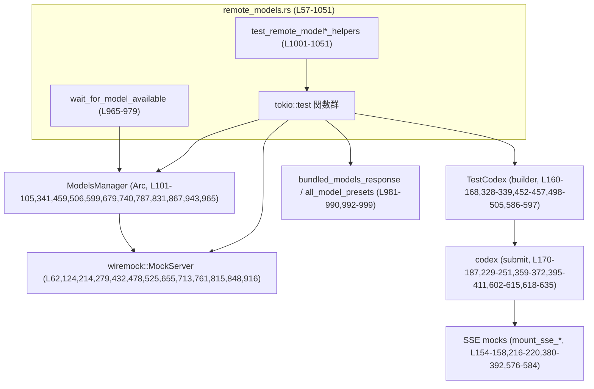
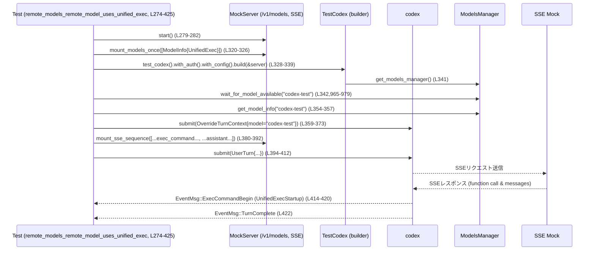

# core/tests/suite/remote_models.rs コード解説

## 0. ざっくり一言

Codex の「リモートモデル」機能について、モデルカタログ取得・マージ・タイムアウト・メタデータ適用・Unified Exec などの挙動を検証する非 Windows 向けの非同期統合テスト群です（`#[tokio::test]`）。  
テスト用のリモートモデル生成ヘルパーと、`ModelsManager` がリモートカタログを反映するまで待つためのポーリングヘルパーも含まれます。

> 行番号は、このファイル先頭を `L1` としたカウントです。

---

## 1. このモジュールの役割

### 1.1 概要

- このモジュールは **Codex のリモートモデル統合機能**（`codex_models_manager` まわり）の契約を検証するために存在し、  
  モデル一覧 API (`/v1/models`) と SSE ベースのチャット API をモックしながら、さまざまな構成条件での挙動をテストします。
- テスト内容は主に次の領域をカバーしています。
  - リモートモデルとローカル（バンドル）モデルのマージ順序と優先度
  - モデルメタデータ（推論レベル、トランケーションポリシー、Unified Exec など）の適用
  - リモートカタログ取得のタイムアウトとフォールバック
  - モデルの可視性（ピッカーに表示するかどうか）

### 1.2 アーキテクチャ内での位置づけ

このテストモジュールが関わる主なコンポーネントの関係を示します。



- テストは `wiremock::MockServer` を使って、リモートの `/v1/models` と SSE エンドポイントをモックします（例: `L62-91`, `L320-326`）。
- `test_codex()` ビルダーから `TestCodex` を構築し、その中の `codex`（クライアント）と `thread_manager.get_models_manager()` で得られる `ModelsManager` を使用します（`L328-341`, `L592-600`）。
- `ModelsManager` はリモートモデルカタログを取得し、バンドル済みモデルとマージします（詳細実装は別モジュール）。ここではその振る舞いをブラックボックス的に検証しています。
- `wait_for_model_available` は `ModelsManager::list_models` をポーリングし、リモートモデルが利用可能になるまで待ちます（`L965-979`）。

### 1.3 設計上のポイント

- **非 Windows 限定テスト**  
  - `#![cfg(not(target_os = "windows"))]` により、Windows ではビルドされません（`L1`）。コメントにも Unified Exec が Windows では未サポートであることが記載されています（`L3`）。
- **非同期・並行テスト**  
  - すべてのテストは `#[tokio::test(flavor = "multi_thread", worker_threads = 2)]` で実行され、`async fn` で書かれています（例: `L57`, `L119`, …）。  
    複数のテストが並行で動作しうる設計です。
- **環境依存テストのスキップ**  
  - すべてのテストの先頭で `skip_if_no_network!` / `skip_if_sandbox!` マクロにより、ネットワーク環境やサンドボックス環境によってテストを早期に終了させています（例: `L59-60`, `L121-122`）。  
    これらのマクロの具体的な定義は、このファイルには含まれていません。
- **リモートモデル生成ヘルパー**  
  - `test_remote_model` / `test_remote_model_with_policy` がリモートカタログから返される `ModelInfo` を組み立てる共通ロジックを提供します（`L1001-1051`）。
- **ポーリングによる状態待ち**  
  - `wait_for_model_available` が `ModelsManager::list_models` をループで呼び出し、一定時間内に目的のスラッグのモデルが現れるまで待機します（`L965-979`）。
- **エラーハンドリングとタイムアウト**  
  - テストは `anyhow::Result<()>` を返し、`?` 演算子でエラーを伝播させます（例: `L93`, `L168`, `L339`）。  
  - `remote_models_request_times_out_after_5s` では `tokio::time::timeout` と `Instant` により、モデルカタログ取得のタイムアウト挙動と時間範囲を明示的に検証します（`L873-900`）。

---

## 2. 主要な機能一覧

このモジュール内の主なテスト機能を列挙します（行番号付き）。

- `remote_models_get_model_info_uses_longest_matching_prefix`: 部分一致スラッグに対して最長一致プレフィックスのリモートメタデータを適用する挙動を検証します（`remote_models.rs:L57-117`）。
- `remote_models_long_model_slug_is_sent_with_high_reasoning`: 長いスラッグ（プレフィックスマッチ）でも、リモートモデルの推論設定（effort/summary）がリクエストに反映されることを検証します（`L119-207`）。
- `namespaced_model_slug_uses_catalog_metadata_without_fallback_warning`: 名前空間付きスラッグ（例: `"custom/..."`）で、フォールバックメタデータへの警告が出ず、カタログのメタデータが使われることを検証します（`L209-272`）。
- `remote_models_remote_model_uses_unified_exec`: Unified Exec を要求するリモートモデルの `shell_type` が反映され、実行コマンド開始イベントのソースが `UnifiedExecStartup` になることを検証します（`L274-425`）。
- `remote_models_truncation_policy_without_override_preserves_remote`: ローカル設定によるトランケーションポリシー上書きが無い場合、リモートの設定値が維持されることを検証します（`L427-471`）。
- `remote_models_truncation_policy_with_tool_output_override`: ローカル設定 `tool_output_token_limit` により、リモートのトランケーションポリシーが適切な値に上書きされることを検証します（`L473-518`）。
- `remote_models_apply_remote_base_instructions`: リモートモデルの `base_instructions` がどのように実際のプロンプトに適用されるか（ここではベースモデルの instructions が使われていること）を検証します（`L520-648`）。
- `remote_models_do_not_append_removed_builtin_presets`: バンドル済みプレセットから削除されたモデルが、リモートモデルの追加によって再度付加されないことを検証します（`L651-706`）。
- `remote_models_merge_adds_new_high_priority_first`: マージ後のモデルリストで、優先度の高いリモートモデルが先頭に来ることを検証します（`L709-754`）。
- `remote_models_merge_replaces_overlapping_model`: スラッグが重複する場合、リモートモデルの表示名・説明がバンドルモデルを上書きすることを検証します（`L757-808`）。
- `remote_models_merge_preserves_bundled_models_on_empty_response`: リモートレスポンスが空でも、バンドルモデル群が失われないことを検証します（`L811-841`）。
- `remote_models_request_times_out_after_5s`: リモートモデル一覧取得が 5 秒前後でタイムアウトし、デフォルトモデルにフォールバックする挙動と経過時間範囲を検証します（`L843-909`）。
- `remote_models_hide_picker_only_models`: `ModelVisibility::Hide` のモデルはモデルピッカーに表示されず、デフォルト選択にも影響しないことを検証します（`L911-963`）。
- `wait_for_model_available`: `ModelsManager` から指定スラッグの `ModelPreset` が取得できるまでポーリングする非公開ヘルパーです（`L965-979`）。
- `bundled_model_slug`: バンドルモデルレスポンスから先頭モデルのスラッグを取得するヘルパーです（`L981-990`）。
- `bundled_default_model_slug`: バンドル済みプレセットのうち `is_default` なモデルのスラッグを取得するヘルパーです（`L992-999`）。
- `test_remote_model`: 標準的なトランケーションポリシーを使ってリモート `ModelInfo` を生成するヘルパーです（`L1001-1008`）。
- `test_remote_model_with_policy`: 任意のトランケーションポリシーでリモート `ModelInfo` を構築する汎用ヘルパーです（`L1010-1051`）。

---

## 3. 公開 API と詳細解説

### 3.1 型一覧（構造体・列挙体など）

このファイル内に新たな構造体・列挙体の定義はありません。  
主に他モジュールからの型を利用しています（ここでは利用が中心のため説明のみ行います）。

| 名前 | 定義元 | 役割 / 用途 |
|------|--------|-------------|
| `ModelInfo` | `codex_protocol::openai_models` | モデルカタログにおける 1 モデルのメタデータ（スラッグ、表示名、トランケーションポリシー、シェル種別など）を表します。テストではリモートサーバの `/v1/models` レスポンスとして使用します（例: `L284-318`, `L532-567`, `L1016-1050`）。 |
| `ModelPreset` | 同上 | Codex 側で利用するモデルプリセット情報。`ModelInfo` からの変換により、デフォルトモデルなどの属性付きで扱います（例: `L684-686`）。 |
| `ModelsManager` | `codex_models_manager::manager` | モデル一覧管理コンポーネント。リモートからのフェッチとバンドルモデルとのマージなどを行います（例: `L101-105`, `L341`, `L459`, `L506`, `L599`, `L679`, `L740`, `L787`, `L831`, `L867`, `L943`, `L965`）。 |
| `TestCodex` | `core_test_support::test_codex` | テスト用に構成された Codex 実行環境一式。`codex` クライアントや `thread_manager` を含みます（例: `L160-168`, `L328-339`, `L452-457`, `L498-505`, `L586-597`）。 |
| `MockServer` | `wiremock` | HTTP モックサーバ。`/v1/models` や SSE エンドポイントをテスト中に提供します（例: `L62`, `L124`, `L214`, `L279`, `L432`, `L478`, `L525`, `L655`, `L713`, `L761`, `L815`, `L848`, `L916`）。 |
| `EventMsg` | `codex_protocol::protocol` | Codex のイベントストリーム上で流れるメッセージ種別。`TurnComplete`, `Warning`, `ExecCommandBegin` などを含みます（例: `L190`, `L255-263`, `L414-417`, `L638`）。 |

このファイルが独自に導入する定数は次の 1 つです。

| 名前 | 種別 | 役割 / 用途 |
|------|------|-------------|
| `REMOTE_MODEL_SLUG` | `&'static str` | Unified Exec を利用するテスト用リモートモデルのスラッグ `"codex-test"` を定義します（`L55`, `L285`, `L342`, `L366`, `L405`）。 |

### 3.2 関数詳細（7件）

#### 1. `remote_models_get_model_info_uses_longest_matching_prefix() -> Result<()>`

**定義**: `remote_models.rs:L57-117`  
**属性**: `#[tokio::test(flavor = "multi_thread", worker_threads = 2)]`

**概要**

- リモートカタログに `"gpt-5.3"`（汎用）と `"gpt-5.3-codex"`（より具体的）の 2 モデルがあるとき、  
  `get_model_info("gpt-5.3-codex-test", ...)` が **最長一致プレフィックス** `"gpt-5.3-codex"` のメタデータ（`base_instructions`）を採用することを検証します。

**引数**

- テスト関数であり引数はありません。

**戻り値**

- `Result<()>` (`anyhow::Result`)  
  - テスト成功時は `Ok(())`。  
  - モック・I/O・`ModelsManager` 操作が失敗した場合は `Err` が伝播します（`?` 演算子使用: `L93`, `L100-105` など）。

**内部処理の流れ**

1. テスト環境チェック: `skip_if_no_network!`, `skip_if_sandbox!` で環境により早期終了する可能性があります（`L59-60`）。
2. `MockServer` を起動し、`test_remote_model_with_policy` を用いて `"gpt-5.3"` と `"gpt-5.3-codex"` の `ModelInfo` を構築します（`L62-74`）。
3. `ModelInfo` を上書きして、それぞれ異なる `display_name` と `base_instructions` を設定します（`L75-84`）。
4. `mount_models_once` により、`/v1/models` がこれら 2 モデルを返すようにモックします（`L85-91`）。
5. 一時ディレクトリを作成し、テスト用 Codex 設定をロードします（`L93-95`）。
6. OpenAI 互換プロバイダ情報をセットし、`models_manager_with_provider` で `ModelsManager` を構築します（`L96-105`）。
7. `list_models(OnlineIfUncached)` を呼び出し、リモートカタログをロードします（`L107`）。
8. `get_model_info("gpt-5.3-codex-test", ...)` を呼び出し、返ってきた `ModelInfo` の `slug` と `base_instructions` を検証します（`L109-114`）。

**Examples（使用例）**

同様のパターンで、新しい最長一致プレフィックス挙動のテストを書く場合:

```rust
// 新しいプレフィックスルールのテスト例
let base = test_remote_model_with_policy(
    "model-x",
    ModelVisibility::List,
    0,
    TruncationPolicyConfig::bytes(10_000),
);
let derived = test_remote_model_with_policy(
    "model-x-special",
    ModelVisibility::List,
    0,
    TruncationPolicyConfig::bytes(10_000),
);
mount_models_once(
    &server,
    ModelsResponse { models: vec![base, derived.clone()] },
).await;

let info = manager
    .get_model_info("model-x-special-extra", &config.to_models_manager_config())
    .await;
assert_eq!(info.base_instructions, derived.base_instructions);
```

**Errors / Panics**

- `TempDir::new()?` や `load_default_config_for_test(&codex_home).await` が失敗すると `Err` を返します（`L93-95`）。
- `built_in_model_providers(...)[\"openai\"]` アクセスで、キー `"openai"` が存在しない場合はパニックになります（`L99`）。
- `models_manager_with_provider` 内部でのパニックやエラーは `?` によって伝播します（`L101-105`）。

**Edge cases（エッジケース）**

- カタログに一致するプレフィックスがない場合の挙動は、このテストでは扱っていません（その場合、どのメタデータが使われるかは別実装依存です）。
- 同じ長さのプレフィックスが複数存在する場合の優先度も、このテストだけからは分かりません。

**使用上の注意点**

- このテストは `ModelsManager` のプレフィックスマッチ実装に依存します。実装変更後にこのテストが失敗した場合、テストと実装のどちらの契約が正しいかを確認する必要があります。
- `built_in_model_providers` 依存により、OpenAI プロバイダ定義が存在しない構成ではパニックになり得ます。

---

#### 2. `remote_models_long_model_slug_is_sent_with_high_reasoning() -> Result<()>`

**定義**: `remote_models.rs:L119-207`

**概要**

- `requested_model = "gpt-5.3-codex-test"` のように、リモートカタログに存在しない長いスラッグを指定した場合でも、  
  対応するプレフィックス `"gpt-5.3-codex"` の推論設定（`default_reasoning_level = High`、`supports_reasoning_summaries = true` など）が実際のチャット API リクエストに反映されることを検証します。

**内部処理の流れ**

1. テスト環境チェック（`L121-122`）。
2. `MockServer` 起動とプレフィックスモデルの生成・調整  
   - `test_remote_model_with_policy` で `"gpt-5.3-codex"` の `ModelInfo` を生成し、`default_reasoning_level = High` や `supported_reasoning_levels`、
     `supports_reasoning_summaries = true`、`default_reasoning_summary = Detailed` を設定します（`L127-145`）。
3. `mount_models_once` で `/v1/models` をモック（`L146-152`）。
4. `mount_sse_once` で SSE レスポンスを 1 回分モック（`response_created` → `completed` のみ）（`L154-158`）。
5. `test_codex()` ビルダーで `TestCodex` を構築し、デフォルトモデルと Codex 認証情報を設定します（`L160-168`）。
6. `codex.submit(Op::UserTurn { ... })` を呼び出し、ユーザーターンを 1 回送信します（`L170-187`）。
7. `wait_for_event` で `TurnComplete` になるまで待ちます（`L190`）。
8. SSE モックの `single_request().body_json()` から JSON ボディを取得し、`body["model"]` および `body["reasoning"]["effort"]`, `["summary"]` を検証します（`L192-204`）。

**Errors / Panics**

- `test_codex().build(&server).await?` が失敗した場合に `Err` を返します（`L160-168`）。
- JSON 解析は `body_json()` を通じて行われますが、エラー時の挙動（パニック or Result）は `wiremock` ライブラリ実装に依存し、このファイルからは分かりません（`L193`）。

**Edge cases**

- SSE 側で `reasoning` フィールドが無い場合、このテストは `reasoning_effort` / `reasoning_summary` が `None` になり、`assert_eq!(..., Some("high"))` で失敗します（`L194-204`）。
- `model` フィールドが `requested_model` と異なる場合も同様に失敗します（`L202`）。

**使用上の注意点**

- 推論設定は、プレフィックスモデルのメタデータを経由して伝播している前提です。実装を変更して別の経路（例: ローカル設定優先）にした場合、このテストは契約として再検討が必要になります。
- 並行実行される他のテストと SSE モックが干渉しないよう、`mount_sse_once` などのヘルパーは 1 回限りのエンドポイントを確立していることが前提です（実装は別ファイル）。

---

#### 3. `remote_models_remote_model_uses_unified_exec() -> Result<()>`

**定義**: `remote_models.rs:L274-425`

**概要**

- リモートカタログに Unified Exec を要求するモデル（`shell_type = ConfigShellToolType::UnifiedExec`）が登録されたとき、
  `ModelsManager` および Codex の実行パイプラインがそれを認識し、  
  実際の Exec コマンドの開始イベントのソースが `ExecCommandSource::UnifiedExecStartup` になることを検証します。

**引数 / 戻り値**

- 引数なし、戻り値は `Result<()>`（`?` によるエラー伝播あり）。

**内部処理の流れ**



**主なステップ**

1. Unified Exec モデルの `ModelInfo` を直接構築（`L284-318`）。
2. `mount_models_once` により、`/v1/models` がこのモデルを返すよう設定（`L320-326`）。
3. `test_codex` でベースモデル `"gpt-5.1"` を設定した Codex 環境を構築し、`thread_manager` から `ModelsManager` を取得（`L328-341`）。
4. `wait_for_model_available(&models_manager, REMOTE_MODEL_SLUG)` で、リモートカタログのマージ完了を待つ（`L342`）。
5. `available_model.model` が `REMOTE_MODEL_SLUG` であることと、`/v1/models` が 1 回だけ呼ばれたことを検証（`L344-351`）。
6. `get_model_info` 経由で `ModelInfo.shell_type` が `UnifiedExec` であることを再確認（`L354-357`）。
7. `OverrideTurnContext` でターンコンテキストのモデルをリモートモデルに切り替える（`L359-373`）。
8. `/bin/echo call` を実行する `exec_command` ツールコールと、その後の通常メッセージを返す SSE シーケンスをモック（`L375-392`）。
9. `UserTurn` を投げ、`wait_for_event_match` で `EventMsg::ExecCommandBegin` を待ち、`source` が `UnifiedExecStartup` であることを検証（`L394-421`）。
10. 最後に `TurnComplete` を待ってテストを終了（`L422`）。

**Errors / Panics**

- `wait_for_model_available` 内で指定モデルが 2 秒以内に現れない場合、`panic!` します（`L965-979`）。  
  このテストはそれを前提にしているため、`ModelsManager` の同期メカニズムが変わるとテストが失敗する可能性があります。
- `/bin/echo call` 実行の実際の挙動（成功・失敗）は Codex 実装側とテストシェル環境に依存し、このファイルからは詳細不明です。

**Edge cases**

- SSE シーケンス内に `ev_function_call(..., "exec_command", ...)` が含まれない場合、`wait_for_event_match` はタイムアウトせずにループし続ける可能性があり、テストがハングするリスクがあります（実際の実装は別ファイル依存）。
- Unified Exec 以外の `shell_type`（例: `ShellCommand`）を設定した場合、このテストの `assert_eq!` は当然失敗します。

**使用上の注意点（Rust の並行性・安全性）**

- テスト全体は非同期であり、`wait_for_model_available` も `await` を含むループを回します。  
  ループ内では `sleep(Duration::from_millis(25)).await` により、他タスクへ制御を返す設計です（`L977`）。
- `ModelsManager` は `Arc<ModelsManager>` として共有されており（`L341`, `L965`）、並行アクセスは内部で同期されている前提です。  
  このファイルからは `ModelsManager` 内部のロック戦略は分かりません。
- `SandboxPolicy::DangerFullAccess` を指定しているため（`L404`）、テストでは制限の少ないサンドボックスレベルを仮定しています。実際のコマンド実行範囲は Codex 実装に依存します。

---

#### 4. `remote_models_request_times_out_after_5s() -> Result<()>`

**定義**: `remote_models.rs:L843-909`

**概要**

- リモート `/v1/models` が 6 秒遅延するようモックされた環境で、`ModelsManager::get_default_model(..., RefreshStrategy::OnlineIfUncached)` が約 5 秒でタイムアウトし、  
  **バンドル済みのデフォルトモデルスラッグ** を返すこと、および実際の経過時間が 4.5〜5.8 秒の範囲に収まることを検証します。

**内部処理の流れ**

1. 環境チェック（`L845-846`）。
2. `MockServer` 起動と、6 秒遅延する `/v1/models` モックの設定 (`mount_models_once_with_delay`, `Duration::from_secs(6)`)（`L848-858`）。
3. テスト用 Codex ホームディレクトリとプロバイダ、`ModelsManager` を構築（`L860-871`）。
4. `Instant::now()` で開始時刻を取得し、`tokio::time::timeout` で 7 秒の全体タイムアウトを設定した上で `get_default_model` を呼び出します（`L873-878`）。
5. 完了後、経過時間 `elapsed` を計測し、結果の `default_model` が `bundled_default_model_slug()` と等しいことを検証します（`L879-886`）。
6. モックサーバがリクエストを受け取っていることを確認した上で、`elapsed` が [4.5s, 5.8s) に収まること、 `/models` リクエスト呼び出し回数が 1 回であることを検証します（`L887-906`）。

**Errors / Panics**

- `timeout(...).await` 自身がタイムアウトすると `Err(elapsed)` を返しますが、このテストでは `.expect("get_model should finish ...")` によりパニックになります（`L881`）。
- `bundled_default_model_slug` 内で、`all_model_presets()` がデフォルトモデルを見つけられない場合も `expect` によりパニックします（`L992-999`）。

**Edge cases**

- 実装がタイムアウト値を変更した場合（例: 3 秒に短縮、10 秒に延長）、`elapsed` の検証（`L895-900`）が失敗します。
- `mount_models_once_with_delay` の遅延が 5 秒未満の場合、リクエストが正常完了し、タイムアウトパスを通らないため、このテストの前提に合わなくなります。

**使用上の注意点（タイムアウト / 並行性）**

- `timeout` の外側にさらに 7 秒のラッパーをかけることで、テスト自体がハングしないように全体タイムアウトを設けています（`L873-878`）。
- 実環境では、ネットワーク状況により若干のばらつきがあるはずですが、このテストではモックによって遅延が固定されている前提です。

---

#### 5. `remote_models_truncation_policy_with_tool_output_override() -> Result<()>`

**定義**: `remote_models.rs:L473-518`

**概要**

- リモートモデルが `truncation_policy = bytes(10_000)` を持っている状態で、  
  ローカル設定 `tool_output_token_limit = Some(50)` を与えると、`get_model_info` の結果の `truncation_policy` が `bytes(200)` に上書きされることを検証します。

**内部処理の流れ（要約）**

1. `MockServer` と `/v1/models` モックをセットアップし、`slug = "codex-test-truncation-override"` のリモートモデルを登録（`L478-496`）。
2. `test_codex` ビルダーで Codex 環境を構築し、`config.model = Some("gpt-5.1")` と `config.tool_output_token_limit = Some(50)` を設定（`L498-503`）。
3. `thread_manager.get_models_manager()` から `ModelsManager` を取得し、`wait_for_model_available` で対象スラッグが利用可能になるまで待つ（`L505-507`）。
4. `get_model_info(slug, ...)` を呼び出し、`model_info.truncation_policy` が `TruncationPolicyConfig::bytes(200)` であることを検証（`L509-515`）。

**Errors / Panics / Edge cases**

- 上述の他テストと同様、`wait_for_model_available` がタイムアウトするとパニックします（`L965-979`）。
- `200` という具体的な値がどのように計算されているか（`50 * 4` など）はこのファイルからは分かりません。  
  ただし、ローカル設定 `tool_output_token_limit` に依存した上書き機構があることはテストから読み取れます（`L502-503`, `L513-515`）。

**使用上の注意点**

- トランケーションポリシーは、リモートとローカル設定の組み合わせで決定されることを示すテストです。  
  新しい上書きルールを追加する場合、類似のテストパターンを参考にすることができます。

---

#### 6. `wait_for_model_available(manager: &Arc<ModelsManager>, slug: &str) -> ModelPreset`

**定義**: `remote_models.rs:L965-979`

**概要**

- 指定された `slug` を持つ `ModelPreset` が `ModelsManager::list_models` の結果に現れるまでポーリングし、見つかればそのモデルを `clone()` して返すテスト用ヘルパーです。
- 最大 2 秒間待機し、それまでに見つからなければ `panic!` します。

**引数**

| 引数名 | 型 | 説明 |
|--------|----|------|
| `manager` | `&Arc<ModelsManager>` | モデル一覧を問い合わせる対象の `ModelsManager`。テスト側で共有されるため `Arc` 経由になっています。 |
| `slug` | `&str` | 探索対象のモデルスラッグ。`model.model == slug` で比較されます（`L969-971`）。 |

**戻り値**

- `ModelPreset`  
  - `list_models(...).await` の結果から `model.model == slug` を満たす最初の要素を `cloned()` して返します（`L969-972`）。

**内部処理の流れ**

1. `deadline = Instant::now() + Duration::from_secs(2)` で締め切り時刻を計算します（`L966`）。
2. 無限ループ内で以下を繰り返します（`L967-978`）。
   - `manager.list_models(RefreshStrategy::OnlineIfUncached).await` を呼び出し、現在利用可能なモデルリストを取得（`L969`）。
   - `.iter().find(|model| model.model == slug).cloned()` で対象スラッグのモデルを検索（`L969-971`）。
   - 見つかれば即座に返却（`L972`）。
   - 見つからない場合、`Instant::now() >= deadline` なら `panic!`（`L974-976`）。
   - それ以外は `sleep(Duration::from_millis(25)).await` で 25ms 待機して再試行（`L977`）。

**Errors / Panics**

- 戻り値は `Result` ではなく、見つからない場合は必ず `panic!` します。  
  したがって、呼び出し側テストは「2秒以内にリモートモデルが利用可能になること」を前提とした契約になっています。

**Edge cases**

- `ModelsManager::list_models` が 2 秒以内に一度も成功しない（例: 内部でのネットワークエラーなど）場合も、結果的に対象モデルが現れず `panic!` します。
- `list_models` が空配列を返し続けるケースも同様です。

**使用上の注意点（並行性・負荷）**

- 25ms 間隔でのポーリングは、テスト用としては軽量ですが、実運用コードに転用する場合はポーリング間隔や総待機時間を検討する必要があります。
- `RefreshStrategy::OnlineIfUncached` を毎回指定しているため（`L969`）、内部実装によっては、最初の 1 回以外はキャッシュ利用になる可能性がありますが、このファイルからは詳細は分かりません。

---

#### 7. `test_remote_model_with_policy(slug, visibility, priority, truncation_policy) -> ModelInfo`

**定義**: `remote_models.rs:L1010-1051`

**概要**

- 任意のスラッグ・可視性・優先度・トランケーションポリシーを持つリモート `ModelInfo` を生成するテスト用ヘルパー関数です。
- 多くのテストで、この関数またはラッパーの `test_remote_model` を用いて `/v1/models` のレスポンス内容を構築しています。

**引数**

| 引数名 | 型 | 説明 |
|--------|----|------|
| `slug` | `&str` | モデルスラッグ。`ModelInfo.slug` にそのまま格納されます（`L1016-1017`）。 |
| `visibility` | `ModelVisibility` | モデルの可視性（一覧に表示するかどうかなど）。`ModelInfo.visibility` に設定されます（`L1026`）。 |
| `priority` | `i32` | マージ時の優先度。負の値も許可されています（例: `-10_000`、`L717`）。`ModelInfo.priority` に設定されます（`L1031`）。 |
| `truncation_policy` | `TruncationPolicyConfig` | トークン切り詰めポリシー。`ModelInfo.truncation_policy` に設定されます（`L1043`）。 |

**戻り値**

- `ModelInfo`  
  - 次のようなデフォルト構成を持ちます（抜粋）。
    - `slug`: 引数 `slug`（`L1016-1017`）
    - `display_name`: `"{slug} display"`（`L1018`）
    - `description`: `"{slug} description"`（`L1019`）
    - `default_reasoning_level`: `Some(ReasoningEffort::Medium)`（`L1020-1021`）
    - `shell_type`: `ConfigShellToolType::ShellCommand`（`L1025`）
    - `visibility`: 引数 `visibility`（`L1026`）
    - `priority`: 引数 `priority`（`L1031`）
    - `truncation_policy`: 引数 `truncation_policy`（`L1043`）

**内部処理の流れ**

- 単純な構造体リテラルの初期化のみです。  
  `default_input_modalities()` や `ReasoningEffortPreset` などを用いて、実際のカタログに近い形のメタデータを設定しています（`L1021-1024`, `L1028-1030`, `L1032-1042`, `L1044-1050`）。

**Examples（使用例）**

```rust
// トランケーションポリシー 12_000 bytes の公開モデルを作る例（L437-443 相当）:
let slug = "codex-test-truncation-policy";
let remote_model = test_remote_model_with_policy(
    slug,
    ModelVisibility::List,
    /*priority*/ 1,
    TruncationPolicyConfig::bytes(12_000),
);
```

**Edge cases / 使用上の注意点**

- `priority` に負の値を渡すことで、既存モデルよりも優先して先頭に並べるテストが書かれています（`remote_models_merge_adds_new_high_priority_first`, `L715-718`）。
- `supports_reasoning_summaries` など一部フィールドは `false` に固定されているため、別の条件をテストしたい場合は、この関数で返された `ModelInfo` をさらに `mut` で上書きするパターンが利用されています（例: `remote_models_long_model_slug_is_sent_with_high_reasoning`, `L127-145`）。

---

### 3.3 その他の関数一覧

上記の詳細解説以外の関数を一覧でまとめます。

| 関数名 | 行範囲 | 役割（1行） |
|--------|--------|-------------|
| `remote_models_namespaced_model_slug_uses_catalog_metadata_without_fallback_warning` | `L209-272` | 名前空間付きスラッグに対してフォールバック警告が出ないこと、およびカタログメタデータが使われることを検証します。 |
| `remote_models_truncation_policy_without_override_preserves_remote` | `L427-471` | ローカル上書き無しのときにリモートのトランケーションポリシーが保持されることを確認します。 |
| `remote_models_apply_remote_base_instructions` | `L520-648` | リモートモデルの `base_instructions` とベースモデル `"gpt-5.1"` の instructions 適用関係を検証します。 |
| `remote_models_do_not_append_removed_builtin_presets` | `L651-706` | バンドルから削除されたプリセットが、リモートモデルによって再追加されないことを検証します。 |
| `remote_models_merge_adds_new_high_priority_first` | `L709-754` | 高優先度のリモートモデルが一覧の先頭になることを確認します。 |
| `remote_models_merge_replaces_overlapping_model` | `L757-808` | バンドルモデルとスラッグが重複するリモートモデルが、display_name と description を上書きすることを検証します。 |
| `remote_models_merge_preserves_bundled_models_on_empty_response` | `L811-841` | リモートレスポンスが空（models: []）でもバンドルモデルが保持されることを確認します。 |
| `remote_models_hide_picker_only_models` | `L911-963` | `ModelVisibility::Hide` のモデルがピッカーから隠されるが、一覧には存在することを検証します。 |
| `bundled_model_slug` | `L981-990` | `bundled_models_response()` から最初のモデルのスラッグを返すヘルパーです。 |
| `bundled_default_model_slug` | `L992-999` | `all_model_presets()` から `is_default == true` なモデルのスラッグを返すヘルパーです。 |
| `test_remote_model` | `L1001-1008` | `test_remote_model_with_policy` のラッパーで、標準トランケーションポリシー（10,000 bytes）を使用します。 |

---

## 4. データフロー

ここでは、`remote_models_remote_model_uses_unified_exec` における代表的なデータフローを説明します。

1. テストコードが `ModelInfo` を構築し、`mount_models_once` を通じて `MockServer` に登録します（`L284-326`）。  
   これにより、`GET /v1/models` がリモートモデル一覧 JSON を返すようになります。
2. `test_codex().build(&server)` により Codex 実行環境が構築され、内部で `ModelsManager` が起動し、バックグラウンドで `/v1/models` をフェッチします（実装は他モジュール）。
3. `wait_for_model_available` が `ModelsManager::list_models` をポーリングし、リモートモデルが利用可能になるまで待機します（`L342`, `L965-979`）。
4. ユーザーターン送信時 (`codex.submit(Op::UserTurn { ... })`、`L394-412`)、Codex は内部的に選択されたモデルの `shell_type` を確認し、`UnifiedExec` の場合は Unified Exec 経由で実行環境を起動します。
5. SSE モックは `function_call("exec_command", args)` を返し、Codex はこれを解釈して `/bin/echo call` を実行します（`L375-390`）。
6. 実行開始時に Codex から `EventMsg::ExecCommandBegin{ source: UnifiedExecStartup }` がイベントストリームに出力され、テスト側では `wait_for_event_match` でこれを検出します（`L414-421`）。

この一連の流れにより、

- HTTP レベルのモデルカタログ取得
- モデルメタデータ (`shell_type`) の適用
- SSE ベースのツールコール
- Exec イベントの通知

までを一体として検証しています。

---

## 5. 使い方（How to Use）

### 5.1 基本的な使用方法（テスト追加のパターン）

このモジュールはテスト専用ですが、新しいリモートモデル挙動のテストを追加する場合は、次のようなパターンで利用できます。

```rust
#[tokio::test(flavor = "multi_thread", worker_threads = 2)]
async fn new_remote_model_behavior_test() -> Result<()> {
    skip_if_no_network!(Ok(()));
    skip_if_sandbox!(Ok(()));

    // 1. モックサーバとリモートモデルを準備する
    let server = MockServer::start().await;
    let slug = "new-remote-model";
    let remote_model = test_remote_model_with_policy(
        slug,
        ModelVisibility::List,
        0,
        TruncationPolicyConfig::bytes(10_000),
    );
    mount_models_once(
        &server,
        ModelsResponse { models: vec![remote_model] },
    )
    .await;

    // 2. Codex テスト環境を構築する
    let TestCodex { codex, cwd, config, thread_manager, .. } =
        test_codex().build(&server).await?;

    // 3. ModelsManager がリモートモデルを認識するまで待つ
    let models_manager = thread_manager.get_models_manager();
    let preset = wait_for_model_available(&models_manager, slug).await;
    assert_eq!(preset.model, slug);

    // 4. 必要に応じて codex.submit(...) 経由で振る舞いを検証する
    codex
        .submit(Op::UserTurn {
            items: vec![UserInput::Text { text: "hello".into(), text_elements: Vec::new() }],
            final_output_json_schema: None,
            cwd: cwd.path().to_path_buf(),
            approval_policy: config.permissions.approval_policy.value(),
            approvals_reviewer: None,
            sandbox_policy: config.permissions.sandbox_policy.get().clone(),
            model: slug.to_string(),
            effort: None,
            summary: None,
            service_tier: None,
            collaboration_mode: None,
            personality: None,
        })
        .await?;

    Ok(())
}
```

### 5.2 よくある使用パターン

- **モデルカタログのマージ挙動のテスト**
  - `test_remote_model*` で少数のリモートモデルを構築し、`ModelsManager::list_models` の結果を直接検証する（例: `remote_models_merge_adds_new_high_priority_first`, `L709-754`）。
- **チャットリクエストへのメタデータ伝播のテスト**
  - リモートモデルに対して `default_reasoning_level`, `supports_reasoning_summaries` などを設定し、SSE モックを通じて送信される JSON ボディを検証する（例: `remote_models_long_model_slug_is_sent_with_high_reasoning`, `L192-204`）。
- **タイムアウトやフォールバックのテスト**
  - `mount_models_once_with_delay` と `tokio::time::timeout` を組み合わせて、`get_default_model` のタイムアウト挙動を確認する（`L873-900`）。

### 5.3 よくある間違い

```rust
// 誤り例: ModelsManager にリモートモデルが反映される前に get_model_info を呼ぶ
let model_info = models_manager
    .get_model_info(slug, &config.to_models_manager_config())
    .await; // リモートモデルが未マージの可能性がある

// 正しい例: wait_for_model_available で反映を待ってから呼ぶ
let _preset = wait_for_model_available(&models_manager, slug).await;
let model_info = models_manager
    .get_model_info(slug, &config.to_models_manager_config())
    .await;
```

- このモジュールのテストでは、リモートカタログ取得が非同期である前提から、`wait_for_model_available` を用いてモデルが利用可能になるまで待機するパターンを採用しています。

### 5.4 使用上の注意点（まとめ）

- **並行実行**: 全テストが `multi_thread` フレーバーで動作するため、モックサーバや SSE モックがテスト間で干渉しないよう、それぞれ独立した `MockServer` インスタンスを使用しています（各テストごとに `MockServer::start()` / `builder().start()` を呼ぶ）。
- **パニック駆動の失敗**: ヘルパー関数（`wait_for_model_available`, `bundled_*_slug`）は `panic!` / `expect` を多用しており、テスト失敗時にはパニックとして表面化します。
- **外部依存**: `built_in_model_providers` や `all_model_presets`、`bundled_models_response` の振る舞いは他モジュールに依存しており、このファイルはそれらの契約に対するテストという位置付けです。
- **SandboxPolicy**: 一部テストは `SandboxPolicy::DangerFullAccess` を使用しており（`L404`, `L628`）、テスト環境でのコマンド実行権限を前提としています。

---

## 6. 変更の仕方（How to Modify）

### 6.1 新しい機能を追加する場合（新テスト追加）

1. **対象となる挙動の特定**
   - 例: 新しい `ModelVisibility` 種別、追加メタデータフィールド、別種のタイムアウト条件など。
2. **テスト関数の追加**
   - このファイルの既存テストにならい、`#[tokio::test(flavor = "multi_thread", worker_threads = 2)]` と `Result<()>` で定義します。
3. **モックサーバとリモートモデルの構成**
   - `MockServer::start` または `MockServer::builder()` を使い、`mount_models_once` / `mount_models_once_with_delay` で `/v1/models` レスポンスを定義します。
   - `test_remote_model_with_policy` または `test_remote_model` を使って `ModelInfo` を構築します。
4. **Codex テスト環境構築**
   - `test_codex()` ビルダーで `TestCodex` を作成し、必要に応じて `with_auth` / `with_config` / `with_model` で設定を調整します。
5. **挙動の検証**
   - モデルカタログ系は `ModelsManager::list_models` / `get_model_info` を使って直接検証します。
   - チャットパス系は `codex.submit(...)` と SSE モック (`mount_sse_once`, `mount_sse_sequence`) を組み合わせてリクエストボディやイベントストリームを検証します。

### 6.2 既存の機能を変更する場合

- **影響範囲の確認**
  - `ModelInfo` フィールド仕様を変更する場合、このファイル内でそのフィールドを設定している箇所（特に `test_remote_model_with_policy`, `remote_models_*` の `ModelInfo` リテラル）を検索します。
  - `ModelsManager` のマージロジックを変更した場合、マージ関連のテスト（`remote_models_merge_*`）が影響を受けます。
- **契約・前提条件**
  - `wait_for_model_available` が 2 秒以内にモデルを見つけられることを前提にしているため、モデルカタログの初回ロード時間が大きく変わる変更を入れる場合は、このヘルパーのタイムアウトやテストの前提を調整する必要があります。
  - タイムアウト値（5 秒付近）を変更する場合は、`remote_models_request_times_out_after_5s` の `elapsed` 検証を同期して更新する必要があります。
- **テスト・使用箇所の再確認**
  - このファイルは主に `ModelsManager` と Codex の振る舞いをブラックボックス的に検証しているため、挙動を変える変更を入れた場合は、該当テスト群が新仕様に合っているかを確認します。

---

## 7. 関連ファイル

このモジュールと密接に関連する外部モジュール・ヘルパーの一覧です（コードから読み取れる範囲）。

| パス / モジュール | 役割 / 関係 |
|-------------------|------------|
| `core_test_support::test_codex` | `TestCodex` 型と `test_codex()` ビルダーを提供し、Codex 実行環境のセットアップを抽象化しています（`L160-168`, `L328-339`, `L452-457`, `L498-505`, `L586-597`）。 |
| `core_test_support::responses` | `mount_models_once`, `mount_models_once_with_delay`, `mount_sse_once`, `mount_sse_sequence`, `sse`, `ev_response_created`, `ev_completed`, `ev_function_call`, `ev_assistant_message` など、HTTP/SSE モックを構築するヘルパー群です（`L34-38`, `L85-91`, `L146-152`, など）。 |
| `core_test_support::wait_for_event`, `wait_for_event_match` | Codex のイベントストリーム (`EventMsg`) から条件に一致するイベントを待機するヘルパーです（`L43-44`, `L190`, `L255-263`, `L414-421`, `L638`）。 |
| `codex_models_manager::manager::ModelsManager` | モデルカタログの取得・マージ・選択を行う本体。ここではその外部 API（`list_models`, `get_model_info`, `get_default_model`）をテストしています。 |
| `codex_models_manager::bundled_models_response` | バンドルされた `models.json` をパースし、`bundled_model_slug` で利用されています（`L981-990`）。 |
| `codex_core::test_support` | `models_manager_with_provider`, `auth_manager_from_auth`, `all_model_presets` など、Codex コアのテスト用サポート関数を提供します（`L101-105`, `L673-677`, `L781-785`, `L825-829`, `L993-999`）。 |
| `wiremock::MockServer` | HTTP エンドポイント（`/v1/models` や SSE パス）のモックサーバとして使用されます（`L62`, `L124`, `L214`, `L279`, `L432`, `L478`, `L525`, `L655`, `L713`, `L761`, `L815`, `L848`, `L916`）。 |

このモジュールは、これらのテストサポートモジュールを組み合わせることで、リモートモデル機能の高レベルな契約を包括的に検証する役割を果たしています。
