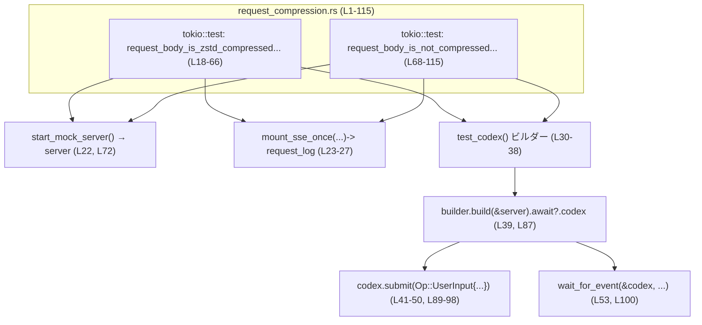
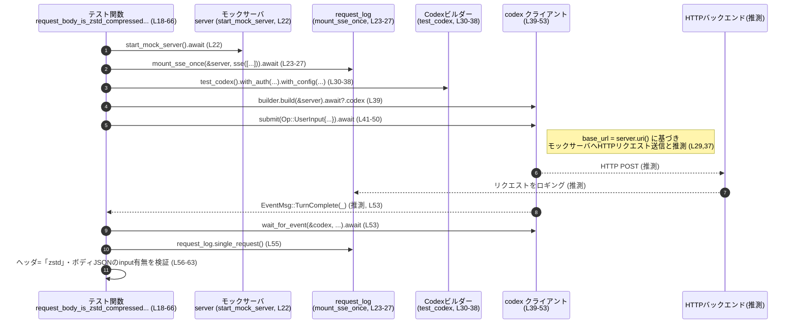

# core/tests/suite/request_compression.rs コード解説

## 0. ざっくり一言

Codex クライアントが送信する HTTP リクエストボディについて、**リクエスト圧縮機能フラグと認証方式の違いに応じて zstd 圧縮されるかどうか**を検証する、非 Windows 環境向けの非同期統合テストです（`#![cfg(not(target_os = "windows"))]`、`#[tokio::test]`、`content-encoding` 検証より  
`core/tests/suite/request_compression.rs:L1,L18-66,L68-115`）。

---

## 1. このモジュールの役割

### 1.1 概要

- このモジュールは **「Codex backend へのリクエスト圧縮の有無」** を検証するために存在し、以下の 2 ケースをテストします（`#[tokio::test]` 名称より  
  `core/tests/suite/request_compression.rs:L18-19,L68-69`）。

  1. 圧縮機能フラグが有効かつ Codex 認証を用いる場合に、リクエストボディが zstd 圧縮されること。  
  2. 圧縮機能フラグが有効でも、API キー認証（とみなされるデフォルトパス）の場合には圧縮されないこと（assert メッセージの文言より  
     `core/tests/suite/request_compression.rs:L103-106`）。

### 1.2 アーキテクチャ内での位置づけ

- このファイルは `core_test_support` モジュール群を利用する **統合テスト** であり、以下のコンポーネントと連携します（`use` 群・ビルダー呼び出しより  
  `core/tests/suite/request_compression.rs:L3-15,L22-39,L72-87`）。

  - モックサーバ (`start_mock_server`)  
  - SSE レスポンスマウントとリクエストロギング (`mount_sse_once`, `sse`, `request_log.single_request`)  
  - Codex クライアントビルダー (`test_codex`)  
  - Codex 認証 (`CodexAuth`)  
  - プロトコル型 (`Op`, `UserInput`, `EventMsg`)  
  - イベント待機ユーティリティ (`wait_for_event`)

以下は、本ファイルにおける主要コンポーネントの依存関係です。



### 1.3 設計上のポイント

コードから読み取れる構造上の特徴は次のとおりです。

- **プラットフォーム条件付きコンパイル**  
  - Windows 以外でのみこのテストを有効にする設定です（`#![cfg(not(target_os = "windows"))]`  
    `core/tests/suite/request_compression.rs:L1`）。

- **非同期・マルチスレッドテスト**  
  - 両テストは `#[tokio::test(flavor = "multi_thread", worker_threads = 2)]` で定義され、Tokio のマルチスレッドランタイム上で並行実行可能になっています（  
    `core/tests/suite/request_compression.rs:L18,L68`）。
  - 共有状態は `codex` などのハンドルを通して扱われますが、内部実装はこのチャンクには現れません。

- **ネットワーク依存テストのスキップ**  
  - `skip_if_no_network!(Ok(()));` によってネットワークが使えない環境ではテストをスキップする設計になっています（  
    `core/tests/suite/request_compression.rs:L20,L70`）。マクロの具体的な条件は不明です。

- **モックサーバ + SSE による決定的なバックエンド**  
  - `start_mock_server` でモックサーバを起動し（`L22,L72`）、`mount_sse_once` と `sse(...)` で SSE イベント（`ev_response_created`, `ev_completed`）を登録しています（`L23-27,L73-77`）。
  - これにより Codex クライアントからの 1 回のリクエストに対して、決まったレスポンスシーケンスが返るようになっていると解釈できますが、具体的な SSE フレーム内容はこのチャンクには現れません。

- **機能フラグによるリクエスト圧縮の制御**  
  - `config.features.enable(Feature::EnableRequestCompression)` により、`EnableRequestCompression` 機能フラグを有効化しています（`L35,L83`）。
  - base URL をモックサーバの URI から構成し（`L29,L79`）、`config.model_provider.base_url = Some(base_url)` で Codex クライアントの接続先をモックサーバに向けています（`L37,L85`）。

- **認証方式の違いによる振る舞いの比較**  
  - 1 つ目のテストでは `with_auth(CodexAuth::create_dummy_chatgpt_auth_for_testing())` を使い（`L31`）、2 つ目のテストでは `with_auth` を呼んでいません（`L80-86`）。  
  - assert メッセージに「API-key auth」とあるため（`L103-106`）、後者は API キー認証を想定したテストであると読み取れます。

- **圧縮ヘッダおよびボディ内容の検証**  
  - zstd 圧縮ケースでは `content-encoding` ヘッダが `zstd` であること（`L55-56`）、ボディを zstd で展開し JSON として `input` フィールドを含むことを検証しています（`L58-63`）。
  - 非圧縮ケースでは `content-encoding` ヘッダが存在しないこと（`L102-106`）、ボディをそのまま JSON として `input` フィールドを含むことを検証しています（`L108-112`）。

---

## 2. 主要な機能一覧とコンポーネントインベントリー

### 2.1 コンポーネント一覧（このファイル内）

| 名前 | 種別 | 役割 / 用途 | 根拠 |
|------|------|-------------|------|
| `request_body_is_zstd_compressed_for_codex_backend_when_enabled` | 非同期テスト関数 (`#[tokio::test]`) | Codex 認証 + 圧縮機能フラグ有効時に、リクエストボディが zstd 圧縮されることを検証する | 定義本体とアサーション名より `core/tests/suite/request_compression.rs:L18-66` |
| `request_body_is_not_compressed_for_api_key_auth_even_when_enabled` | 非同期テスト関数 (`#[tokio::test]`) | 圧縮機能フラグ有効でも、API キー認証（とみなされるデフォルトパス）ではリクエストが圧縮されないことを検証する | 定義本体・assert メッセージより `core/tests/suite/request_compression.rs:L68-115` |
| `Feature::EnableRequestCompression` | 外部型の値 | 機能フラグの一種として、リクエスト圧縮機能を有効化するフラグとして用いられる | `config.features.enable(Feature::EnableRequestCompression)` 使用より `core/tests/suite/request_compression.rs:L35,L83` |
| `CodexAuth::create_dummy_chatgpt_auth_for_testing` | 外部型の関連関数 | テスト用のダミー認証情報を生成し、Codex クライアントに設定する | `with_auth(CodexAuth::create_dummy_chatgpt_auth_for_testing())` 使用より `core/tests/suite/request_compression.rs:L31` |
| `start_mock_server` | 外部 async 関数 | モックサーバを起動し、URI などを提供する | `let server = start_mock_server().await;` 使用より `core/tests/suite/request_compression.rs:L22,L72` |
| `mount_sse_once` | 外部 async 関数 | モックサーバに 1 回分の SSE レスポンスシーケンスをマウントし、リクエストログハンドルを返す | `let request_log = mount_sse_once(&server, sse(...)).await;` 使用より `core/tests/suite/request_compression.rs:L23-27,L73-77` |
| `request_log.single_request` | 外部メソッド | モックサーバで観測された単一の HTTP リクエストを取得する | `let request = request_log.single_request();` 使用より `core/tests/suite/request_compression.rs:L55,L102` |
| `test_codex` | 外部関数 | Codex クライアント用のテストビルダーを構築する | `let mut builder = test_codex()...` 使用より `core/tests/suite/request_compression.rs:L30,L80` |
| `builder.build(&server).await?.codex` | 外部メソッドチェーン | 設定済みビルダーから Codex クライアントを生成する | `let codex = builder.build(&server).await?.codex;` 使用より `core/tests/suite/request_compression.rs:L39,L87` |
| `codex.submit` | 外部 async メソッド | Codex backend に対してユーザー入力 (`Op::UserInput`) を送信し、処理を開始する | `codex.submit(Op::UserInput { ... }).await?;` 使用より `core/tests/suite/request_compression.rs:L41-50,L89-98` |
| `wait_for_event` | 外部 async 関数 | Codex から指定条件を満たすイベント（ここでは `EventMsg::TurnComplete(_)`）が届くまで待機する | `wait_for_event(&codex, |ev| matches!(ev, EventMsg::TurnComplete(_))).await;` 使用より `core/tests/suite/request_compression.rs:L53,L100` |
| `skip_if_no_network!` | 外部マクロ | ネットワークが利用不可な環境ではテストをスキップするために使用される | `skip_if_no_network!(Ok(()));` 使用より `core/tests/suite/request_compression.rs:L20,L70` |
| `zstd::stream::decode_all` | 外部関数 | バイト列を zstd で展開する。ここでは HTTP リクエストボディの展開に用いる | `let decompressed = zstd::stream::decode_all(...)?;` 使用より `core/tests/suite/request_compression.rs:L58` |
| `serde_json::from_slice` | 外部関数 | JSON バイト列を `serde_json::Value` にパースする | `let json: serde_json::Value = serde_json::from_slice(...)?;` 使用より `core/tests/suite/request_compression.rs:L59,L108` |

※ 外部コンポーネントの具体的な型定義や実装は、このチャンクには含まれていません。

### 2.2 主要な機能（テストケース）一覧

- **Codex 認証 + 圧縮フラグ有効時の zstd 圧縮検証**  
  - `request_body_is_zstd_compressed_for_codex_backend_when_enabled`  
  - モックサーバ起動 → SSE レスポンスマウント → Codex クライアント構築（`with_auth` + 圧縮フラグ有効）→ `submit` でリクエスト送信 → イベント完了待ち → `content-encoding` ヘッダが `zstd` であることと、ボディを zstd 展開した JSON に `input` フィールドが含まれることを検証します（`core/tests/suite/request_compression.rs:L22-63`）。

- **API キー認証（とみなされるデフォルト）+ 圧縮フラグ有効時の非圧縮検証**  
  - `request_body_is_not_compressed_for_api_key_auth_even_when_enabled`  
  - モックサーバ起動 → 同じ SSE レスポンス → Codex クライアント構築（`with_auth` を呼ばない）→ `submit` → イベント完了待ち → `content-encoding` ヘッダが存在しないことと、ボディをそのまま JSON と見なして `input` フィールドが含まれることを検証します（`core/tests/suite/request_compression.rs:L72-112`）。

---

## 3. 公開 API と詳細解説

### 3.1 型一覧（このテストで重要な外部型）

このファイル内で新たに構造体や列挙体は定義されていません。テストの理解に重要な外部型を列挙します（種別自体はこのチャンクからは断定できないため「型」と表記します）。

| 名前 | 種別 | 役割 / 用途 | このファイル内の根拠 |
|------|------|-------------|----------------------|
| `Feature` | 型（詳細不明） | 機能フラグ集合の一部として使用され、`EnableRequestCompression` によってリクエスト圧縮機能の ON/OFF を制御していると読めます | `use codex_features::Feature;`、`Feature::EnableRequestCompression` 使用より `core/tests/suite/request_compression.rs:L3,L35,L83` |
| `CodexAuth` | 型（詳細不明） | Codex クライアント用の認証情報を表現し、`create_dummy_chatgpt_auth_for_testing` でテスト用の認証を生成していると読み取れます | `use codex_login::CodexAuth;`、`CodexAuth::create_dummy_chatgpt_auth_for_testing()` 使用より `core/tests/suite/request_compression.rs:L4,L31` |
| `EventMsg` | 型（おそらく列挙体） | Codex からのイベントメッセージを表し、ここでは `TurnComplete` 変種を用いて「処理完了」を検出しています | `use codex_protocol::protocol::EventMsg;`、`matches!(ev, EventMsg::TurnComplete(_))` 使用より `core/tests/suite/request_compression.rs:L5,L53,L100` |
| `Op` | 型（詳細不明） | Codex に送る操作（オペレーション）を表現し、`Op::UserInput` でユーザー入力を表すリクエストを構築しています | `use codex_protocol::protocol::Op;`、`Op::UserInput { ... }` 使用より `core/tests/suite/request_compression.rs:L6,L42,L90` |
| `UserInput` | 型（詳細不明） | ユーザーからの入力内容をモデル化し、`UserInput::Text { text, text_elements }` としてテキスト入力を構成しています | `use codex_protocol::user_input::UserInput;`、`UserInput::Text { ... }` 使用より `core/tests/suite/request_compression.rs:L7,L43-45,L91-93` |

### 3.2 関数詳細

#### `request_body_is_zstd_compressed_for_codex_backend_when_enabled() -> anyhow::Result<()>`

**概要**

- 非 Windows 環境でのみ実行される Tokio 非同期テスト関数です（`cfg` 属性 + `#[tokio::test]` より `L1,L18`）。
- Codex 認証を利用し、`EnableRequestCompression` フラグを有効にした状態で Codex backend にリクエストを送信したとき、**HTTP リクエストが zstd 圧縮されていること**を検証します（テスト名・内容より `L18-19,L30-39,L55-63`）。

**引数**

- 引数は取りません（関数シグネチャより `core/tests/suite/request_compression.rs:L19`）。

**戻り値**

- `anyhow::Result<()>`  
  - 通常は `Ok(())` を返し（`L65`）、途中で `?` を通じて伝播したエラー（モックサーバ構築や Codex 呼び出し、zstd 展開、JSON パースの失敗など）があれば `Err(...)` を返します（`L39,L50,L58,L59`）。  
  - テストフレームワーク側から見ると、「Err を返した場合はテスト失敗」として扱われます（Rust のテスト慣習に基づく一般知識）。

**内部処理の流れ（アルゴリズム）**

処理はおおまかに次のステップに分かれます。

1. **ネットワーク前提チェック**  
   - `skip_if_no_network!(Ok(()));` により、ネットワーク環境が整っていない場合にはテストをスキップします（`core/tests/suite/request_compression.rs:L20`）。  
     マクロ内部の条件は不明ですが、戻り値として `Ok(())` を指定しているため、スキップ時は早期リターンするような挙動が想定されます。

2. **モックサーバの起動と SSE レスポンスマウント**  
   - `let server = start_mock_server().await;` でモックサーバを起動します（`L22`）。  
   - `mount_sse_once(&server, sse(vec![ev_response_created("resp-1"), ev_completed("resp-1")])).await;` で、モックサーバに SSE レスポンス（レスポンス作成 → 完了）を 1 回分だけ登録し、その際にリクエストログハンドル `request_log` を得ます（`L23-27`）。

3. **Codex クライアントビルダーの構築と設定**  
   - `let base_url = format!("{}/backend-api/codex/v1", server.uri());` でモックサーバの URI から Codex backend 用 base URL を構築します（`L29`）。  
   - `test_codex()` を起点にビルダーを作成し（`L30`）、  
     - `with_auth(CodexAuth::create_dummy_chatgpt_auth_for_testing())` で Codex 認証を設定（`L31`）、  
     - `with_config(move |config| { ... })` で構成を上書きして、機能フラグ `EnableRequestCompression` を有効にし（`L32-36`）、`model_provider.base_url` を先ほどの `base_url` にセットします（`L37`）。  
   - `let codex = builder.build(&server).await?.codex;` で Codex クライアントインスタンスを構築します（`L39`）。

4. **ユーザー入力リクエストの送信**  
   - `codex.submit(Op::UserInput { ... }).await?;` で `Op::UserInput` を送信します（`L41-50`）。  
     - `items` に `UserInput::Text { text: "compress me", ... }` を 1 要素詰めたベクタを渡しています（`L43-46`）。
     - 追加メタデータや JSON スキーマは `None` としています（`L47-48`）。

5. **処理完了イベントまでの待機**  
   - コメントに「リクエストが確実にサーバに到達するようタスク完了まで待つ」と書かれており（`L52`）、  
   - `wait_for_event(&codex, |ev| matches!(ev, EventMsg::TurnComplete(_))).await;` で `TurnComplete` イベントが来るまで待機します（`L53`）。

6. **HTTP リクエストの取得とヘッダ検証**  
   - `let request = request_log.single_request();` でモックサーバが受け取った単一の HTTP リクエストを取得します（`L55`）。  
   - `assert_eq!(request.header("content-encoding").as_deref(), Some("zstd"));` により、`content-encoding` ヘッダが `zstd` であることを検証します（`L56`）。

7. **ボディの zstd 展開と JSON 構造の検証**  
   - `request.body_bytes()` を `std::io::Cursor` でラップし、`zstd::stream::decode_all` で展開して `decompressed` バイト列を得ます（`L58`）。  
   - `serde_json::from_slice` により `serde_json::Value` としてパースし（`L59`）、`json.get("input").is_some()` を `assert!` で検証することで、Responses API の JSON 形式（`input` フィールドを含む）になっていることを確認します（`L60-63`）。

**Examples（使用例）**

このテスト関数は Rust のテストランナーから自動的に呼び出されます。個別に実行する場合、一般的には次のように `cargo test` で呼び出します（テスト名はこのファイルから取得）。

```bash
# このテストだけを実行する例
cargo test request_body_is_zstd_compressed_for_codex_backend_when_enabled -- --nocapture
```

同様のパターンで新しい圧縮挙動をテストするコード例は以下のようになります（既存テストの骨格を元にした例）。

```rust
// 圧縮付きのCodexリクエストを検証するテストの雛形
#[tokio::test(flavor = "multi_thread", worker_threads = 2)]             // Tokioのマルチスレッドランタイム上で実行
async fn my_compression_test() -> anyhow::Result<()> {                  // anyhow::Resultでエラーを伝播
    skip_if_no_network!(Ok(()));                                        // ネットワークが無い環境ではスキップ

    let server = start_mock_server().await;                             // モックサーバを起動
    let request_log = mount_sse_once(                                   // SSEレスポンスとリクエストログをセットアップ
        &server,
        sse(vec![ev_response_created("resp-1"), ev_completed("resp-1")]),
    )
    .await;

    let base_url = format!("{}/backend-api/codex/v1", server.uri());    // モックサーバのURIからbase_urlを構成
    let mut builder = test_codex()
        .with_auth(CodexAuth::create_dummy_chatgpt_auth_for_testing())  // Codex認証を設定
        .with_config(move |config| {                                    // コンフィグを上書き
            config
                .features
                .enable(Feature::EnableRequestCompression)              // 圧縮機能フラグを有効化
                .expect("test config should allow feature update");
            config.model_provider.base_url = Some(base_url);            // Codexのbase_urlをモックサーバに向ける
        });
    let codex = builder.build(&server).await?.codex;                    // Codexクライアントを構築

    codex
        .submit(Op::UserInput {                                         // ユーザー入力を送信
            items: vec![UserInput::Text {
                text: "compress me".into(),
                text_elements: Vec::new(),
            }],
            final_output_json_schema: None,
            responsesapi_client_metadata: None,
        })
        .await?;

    wait_for_event(&codex, |ev| matches!(ev, EventMsg::TurnComplete(_))) // 完了イベントを待機
        .await;

    let request = request_log.single_request();                         // 送出されたHTTPリクエストを取得
    // ここでヘッダやボディを検証する
    Ok(())
}
```

**Errors / Panics**

- `?` 演算子で伝播する可能性のあるエラー（`anyhow::Error` にラップされる想定）  
  - `builder.build(&server).await?` のビルド処理失敗（`L39`）。  
  - `codex.submit(...).await?` の送信処理失敗（`L50`）。  
  - `zstd::stream::decode_all(...)?` のデコード失敗（`L58`）。  
  - `serde_json::from_slice(&decompressed)?` の JSON パース失敗（`L59`）。

  それぞれの関数が具体的にどの条件で `Err` を返すかは、このチャンクには定義がありません。

- `assert_eq!` / `assert!` による panic  
  - `content-encoding` が `"zstd"` でない場合、`assert_eq!` により panic しテストが失敗します（`L56`）。  
  - JSON に `input` フィールドが存在しない場合も `assert!` で panic します（`L60-63`）。

- その他  
  - `request_log.single_request()` がリクエストを取得できなかった場合にどう振る舞うか（panic / Err / デフォルト値）は、このチャンクからは分かりません。

**Edge cases（エッジケース）**

- **ネットワークが無い環境**  
  - `skip_if_no_network!(Ok(()));` によりテストがスキップされることが想定されます（`L20`）。スキップ条件の詳細は不明です。

- **Codex から `TurnComplete` が届かない場合**  
  - `wait_for_event` がいつまで待つのか、タイムアウトするのかはこのチャンクからは不明です（`L53`）。タイムアウトが無い場合、テストがハングする可能性があります。

- **zstd デコードエラー**  
  - サーバが `content-encoding: zstd` を返していながら実際には zstd データでない場合、`decode_all` が `Err` を返し、テストは `Err` で終了するか panic する可能性があります（`L58`）。

- **複数リクエスト送信された場合**  
  - `single_request()` という名前から 1 件のみを前提としていることが伺えますが、複数リクエストが発生した際の扱いは不明です（`L55`）。

**使用上の注意点**

- 非同期テストであるため、`#[tokio::test]` 属性の flavor / worker_threads を変えると挙動（スケジューリング）が変わる可能性があります（`L18`）。
- `wait_for_event` を挟まずに `single_request` を呼ぶと、リクエストがまだ送信されておらずロギングされていない可能性があり、テストが不安定になると考えられます。コード中のコメントもこの意図を示しています（`L52-53,L55`）。
- モックサーバの URI を `base_url` として設定しないと、Codex クライアントがどこへ接続するか不明であり、テストが外部環境に依存するリスクがあります（`L29,L37`）。

---

#### `request_body_is_not_compressed_for_api_key_auth_even_when_enabled() -> anyhow::Result<()>`

**概要**

- 同じく Tokio の非同期テスト関数で、**圧縮機能フラグが有効でも API キー認証ではリクエストが圧縮されない**ことを検証します（テスト名・assert 文言より `core/tests/suite/request_compression.rs:L68-69,L103-106`）。
- 認証設定として `with_auth` を明示的に呼ばず、ビルダーのデフォルト認証を用いています（`L80-86`）。

**引数**

- 引数は取りません（`core/tests/suite/request_compression.rs:L69`）。

**戻り値**

- `anyhow::Result<()>`（`L69,L114-115`）。エラー伝播の考え方は前のテストと同様です。

**内部処理の流れ**

1. **ネットワーク前提チェック**  
   - `skip_if_no_network!(Ok(()));` によりネットワークが無い環境での実行を避けます（`L70`）。

2. **モックサーバ起動と SSE レスポンスマウント**  
   - `start_mock_server().await` でサーバを起動し（`L72`）、  
   - `mount_sse_once(&server, sse(vec![...])).await` で同様の SSE レスポンスをマウントし、`request_log` を得ます（`L73-77`）。

3. **Codex クライアントビルダーの構築（認証デフォルト）**  
   - `base_url` の構築は 1 つ目のテストと同じです（`L79`）。  
   - `test_codex().with_config(move |config| { ... })` として、`with_auth` を呼ばずに構成のみ上書きします（`L80-86`）。  
     - `EnableRequestCompression` を有効化（`L81-84`）。  
     - `model_provider.base_url` をモックサーバの `base_url` に設定（`L85`）。  
   - `let codex = builder.build(&server).await?.codex;` で Codex クライアントを構築します（`L87`）。

4. **ユーザー入力リクエストの送信**  
   - `codex.submit(Op::UserInput { ... }).await?;` で `"do not compress"` というテキストを送信します（`L89-98`）。

5. **完了イベントまでの待機**  
   - `wait_for_event(&codex, |ev| matches!(ev, EventMsg::TurnComplete(_))).await;` により、前と同様に処理完了を待ちます（`L100`）。

6. **HTTP リクエスト取得とヘッダ非存在の検証**  
   - `let request = request_log.single_request();` で HTTP リクエストを取得し（`L102`）、  
   - `assert!(request.header("content-encoding").is_none(), ...)` により、`content-encoding` ヘッダが存在しない（＝圧縮が行われていない）ことを検証します（`L103-106`）。

7. **ボディをそのまま JSON として検証**  
   - `serde_json::from_slice(&request.body_bytes())?` でボディを JSON としてパースし（`L108`）、  
   - `json.get("input").is_some()` を `assert!` で検証することで、Responses API JSON として整合していることを確認します（`L109-112`）。

**Examples（使用例）**

このテストも `cargo test` から自動実行されます。通常は次のように指定できます。

```bash
cargo test request_body_is_not_compressed_for_api_key_auth_even_when_enabled -- --nocapture
```

**Errors / Panics**

- `?` によるエラー伝播  
  - `builder.build(&server).await?`、`codex.submit(...).await?`、`serde_json::from_slice` が失敗した場合に `Err` を返します（`L87,L98,L108`）。

- `assert!` による panic  
  - `content-encoding` ヘッダが存在する（`is_none()` が false）場合に panic（`L103-106`）。  
  - JSON に `input` フィールドが無い場合も panic（`L109-112`）。

**Edge cases**

- `EnableRequestCompression` が実装上 API キー認証にも適用される仕様に変更された場合、このテストが落ちることで仕様変更を検知できます。  
  （ただし実際の仕様はこのチャンクには明示されていません。テスト名と assert メッセージからそうした契約を意図していると解釈できます `L68-69,L103-106`。）

- リクエストが複数回送られた場合の `single_request()` の挙動は不明です（`L102`）。

**使用上の注意点**

- このテストは「圧縮フラグ有効 + 認証方式の違い」による挙動の差を前提としているため、将来的に認証方式に依存しない実装に変える場合はテストの意図と整合性を確認する必要があります（テスト名とメッセージより `L68-69,L103-106`）。

---

### 3.3 その他の関数・マクロ呼び出し（一覧）

| 名前 | 役割（1 行） | このファイル内の使用箇所 |
|------|--------------|--------------------------|
| `sse` | SSE（Server-Sent Events）レスポンスを構成するヘルパーと推測されます。ここでは `ev_response_created` と `ev_completed` をまとめて 1 回分のレスポンスとして渡しています | `core/tests/suite/request_compression.rs:L11,L25,L75` |
| `ev_response_created` | Codex レスポンスが作成されたことを表す SSE イベントオブジェクトを生成するヘルパーと解釈できます | `core/tests/suite/request_compression.rs:L9,L25,L75` |
| `ev_completed` | Codex レスポンスの完了を表す SSE イベントオブジェクトを生成するヘルパーと解釈できます | `core/tests/suite/request_compression.rs:L8,L25,L75` |
| `request.header` | HTTP リクエストから指定ヘッダ名の値を取得するメソッド。`Option<_>` を返していることが `.as_deref()` や `.is_none()` から読み取れます | `core/tests/suite/request_compression.rs:L56,L103-104` |
| `request.body_bytes` | HTTP リクエストボディのバイト列を取得するメソッド | `core/tests/suite/request_compression.rs:L58,L108` |

---

## 4. データフロー

ここでは、**zstd 圧縮を検証するテスト**（`request_body_is_zstd_compressed_for_codex_backend_when_enabled`, `L18-66`）における典型的なデータフローを整理します。

1. テスト関数がモックサーバ `server` を起動し、`mount_sse_once` で SSE レスポンスと `request_log` をセットアップします（`L22-27`）。
2. Codex ビルダーに認証・機能フラグ・base_url を設定し、`codex` クライアントを生成します（`L29-39`）。
3. `codex.submit(Op::UserInput { ... })` でユーザー入力を送信します（`L41-50`）。  
   実装は見えませんが、`base_url` が `server.uri()` に基づくため、モックサーバに HTTP リクエストが送信されると解釈できます（`L29,L37`）。
4. `wait_for_event` により `codex` から `EventMsg::TurnComplete` が届くまで待機し（`L53`）、その後 `request_log.single_request()` でモックサーバに届いたリクエストを取得します（`L55`）。
5. 取得した `request` から `content-encoding` ヘッダとボディバイト列を取り出し、ヘッダ値と JSON 構造を検証します（`L56-63`）。

Mermaid のシーケンス図にすると、次のような流れです。



> HTTP 実送信の部分（`H` ノード）は、`base_url` の設定と `request_log` によるリクエスト取得からの推測であり、このチャンクに実装は現れていません。

---

## 5. 使い方（How to Use）

このファイルは **テストコード** であり、通常はライブラリのユーザが直接呼び出すことはありません。ただし、**圧縮機能の仕様確認や変更時の回帰検知** という観点での利用方法を整理します。

### 5.1 基本的な使用方法

- プロジェクトのルートから、標準のテストコマンドで実行します（一般的な Cargo の挙動に基づく）。

```bash
# このファイル内の全テストを実行
cargo test request_compression -- --nocapture

# 個別テストを指定して実行
cargo test request_body_is_zstd_compressed_for_codex_backend_when_enabled -- --nocapture
cargo test request_body_is_not_compressed_for_api_key_auth_even_when_enabled -- --nocapture
```

- OS が Windows の場合、`#![cfg(not(target_os = "windows"))]` によりこのテストモジュール自体がコンパイルされないため実行対象になりません（`L1`）。

### 5.2 よくある使用パターン（テスト追加の雛形）

このファイルを参考に、他の条件下での圧縮挙動をテストする場合の典型パターンは次の通りです。

1. モックサーバを起動し、SSE レスポンスとリクエストログをセットアップする（`L22-27,L72-77`）。
2. `test_codex` ビルダーで Codex クライアントを構築し、`with_auth` / `with_config` で条件を切り替える（`L30-38,L80-86`）。
3. `codex.submit` で入力を送り、`wait_for_event` で完了を待つ（`L41-50,L53,L89-100`）。
4. `request_log.single_request` で実際に送信された HTTP リクエストを取得し、ヘッダやボディを検証する（`L55-63,L102-112`）。

### 5.3 よくある間違い（起こりうる落とし穴）

このファイルから推測できる誤用の例と、その正しい使い方を対比します。

```rust
// 誤り例: イベント完了を待たずにリクエストログを取得してしまう
async fn bad_test_like_pattern() -> anyhow::Result<()> {
    let server = start_mock_server().await;                           // モックサーバ起動
    let request_log = mount_sse_once(&server, sse(vec![ /* ... */ ])).await;
    let mut builder = test_codex();
    let codex = builder.build(&server).await?.codex;

    codex.submit(Op::UserInput { /* ... */ }).await?;                 // リクエスト送信

    let request = request_log.single_request();                       // ★ すぐにログを読む
    // ここでrequestが存在しない / 期待と異なる可能性がある
    Ok(())
}

// 正しい例: 完了イベントを待ってからログを読む（本ファイルのパターン）
async fn good_test_like_pattern() -> anyhow::Result<()> {
    let server = start_mock_server().await;
    let request_log = mount_sse_once(&server, sse(vec![ /* ... */ ])).await;
    let mut builder = test_codex();
    let codex = builder.build(&server).await?.codex;

    codex.submit(Op::UserInput { /* ... */ }).await?;                 // リクエスト送信

    wait_for_event(&codex, |ev| matches!(ev, EventMsg::TurnComplete(_))).await;
    // ★ Codex側の処理完了を確認してから

    let request = request_log.single_request();                       // ログを取得
    Ok(())
}
```

- このように、**非同期テストでは「いつリクエストが送られたか」を明示的に同期させる必要がある**ことが、このファイルの設計（`wait_for_event` の挿入）から分かります（`L52-53,L55,L100-102`）。

### 5.4 使用上の注意点（まとめ）

- **プラットフォーム**  
  - Windows ではこのテストはビルド・実行されません（`L1`）。

- **ネットワーク依存性**  
  - `skip_if_no_network!` によってネットワーク環境を前提としているため、オフライン CI 環境ではスキップされる可能性があります（`L20,L70`）。

- **並行性**  
  - `flavor = "multi_thread", worker_threads = 2` により、テスト内部で非同期タスクが別スレッドで実行される可能性があります（`L18,L68`）。共有状態を追加する場合には `Send` / `Sync` の要件に注意が必要です。

- **圧縮仕様の契約**  
  - このテストは「Codex 認証時のみ圧縮」「API キー認証時は非圧縮」という仕様を前提にしています（テスト名とメッセージより `L18-19,L68-69,L103-106`）。実装を変更する際は意図的な仕様変更かどうかを確認する指標になります。

---

## 6. 変更の仕方（How to Modify）

### 6.1 新しい機能を追加する場合（例：別の圧縮方式や条件）

1. **新しいテスト関数を追加**  
   - 本ファイルに `#[tokio::test]` を付けた新しい async 関数を追加し、`request_body_is_...` といった分かりやすい名前を付けます（既存の `L18-19,L68-69` を参考）。

2. **モックサーバと Codex ビルダーのセットアップをコピー**  
   - `start_mock_server` → `mount_sse_once` → `test_codex` → `with_auth` / `with_config` → `builder.build` という流れを、必要に応じて調整しつつ再利用します（`L22-39,L72-87`）。

3. **条件に応じた設定変更**  
   - 例えば「特定モデルのみ圧縮」などの仕様をテストしたい場合、`with_config` のクロージャ内で対象モデル名やフラグを設定します（`L32-38,L80-86`）。

4. **`submit` と `wait_for_event` の呼び出し**  
   - `codex.submit` と `wait_for_event` を組み合わせ、テスト対象のリクエストが確実に発生してからログを取得します（`L41-53,L89-100`）。

5. **期待するヘッダ・ボディの検証**  
   - 新しい圧縮方式なら `content-encoding` が異なる値であることを `assert_eq!` で検証します。  
   - ボディの検証も、必要に応じて解凍・JSON パースを行います（`L56-63,L108-112`）。

### 6.2 既存の機能を変更する場合（仕様変更への追随）

- **圧縮仕様の変更**  
  - 例えば、将来「API キー認証でも圧縮を行う」仕様に変更した場合、`request_body_is_not_compressed_for_api_key_auth_even_when_enabled` のアサーション（`content-encoding` の非存在）を変更する必要があります（`L103-106`）。

- **イベント種別の変更**  
  - Codex 側のイベント完了シグナルが `EventMsg::TurnComplete(_)` から別のバリアントに変わった場合、`wait_for_event` のマッチ条件（`matches!(ev, EventMsg::TurnComplete(_))`）を修正する必要があります（`L53,L100`）。

- **HTTP クライアントまたはモックサーバ API の変更**  
  - `request_log.single_request()` のシグネチャ変更や挙動変更があれば、リクエスト取得部分（`L55,L102`）を見直します。  
  - `request.header` や `request.body_bytes` の戻り値型が変わった場合は、`assert_eq!` や `serde_json::from_slice` など後続処理に影響します（`L56,L58,L103-104,L108`）。

- **テストの安定性確認**  
  - 非同期仕様やスレッド数を変更した場合（`worker_threads` など）、`wait_for_event` の使い方やモックサーバのライフタイムを再確認する必要があります（`L18,L68`）。

---

## 7. 関連ファイル

このテストモジュールと密接に関係すると思われるモジュール・クレートは次の通りです（モジュールパスは `use` 宣言より推定し、具体的なファイルパスはこのチャンクからは分かりません）。

| パス / モジュール | 役割 / 関係 |
|------------------|------------|
| `codex_features::Feature` | 機能フラグ管理。ここでは `EnableRequestCompression` を利用してリクエスト圧縮機能を ON/OFF しています（`core/tests/suite/request_compression.rs:L3,L35,L83`）。 |
| `codex_login::CodexAuth` | Codex クライアント用の認証情報型。`create_dummy_chatgpt_auth_for_testing` でテスト用認証を生成しています（`L4,L31`）。 |
| `codex_protocol::protocol::{EventMsg, Op}` | Codex とのプロトコル型。`Op::UserInput` で送信内容を指定し、`EventMsg::TurnComplete` で完了イベントを検知しています（`L5-6,L42,L53,L90,L100`）。 |
| `codex_protocol::user_input::UserInput` | ユーザー入力の詳細表現。ここではテキスト入力 `UserInput::Text` を使用します（`L7,L43-45,L91-93`）。 |
| `core_test_support::responses::{start_mock_server, mount_sse_once, sse, ev_response_created, ev_completed}` | モックサーバ起動と SSE レスポンスシナリオのセットアップ、リクエストログ取得を行うテストサポートモジュール群です（`L8-12,L22-27,L72-77`）。 |
| `core_test_support::test_codex::test_codex` | Codex クライアントのテスト用ビルダーを提供するモジュールです（`L14,L30,L80`）。 |
| `core_test_support::wait_for_event` | Codex からのイベントが指定の条件を満たすまで待機するテスト用ユーティリティです（`L15,L53,L100`）。 |
| `core_test_support::skip_if_no_network` | ネットワーク環境をチェックし、テストをスキップさせるマクロを定義するモジュールです（`L13,L20,L70`）。 |
| `zstd` クレート | zstd 圧縮 / 展開機能を提供する外部クレート。ここでは HTTP リクエストボディの展開に使用しています（`L58`）。 |
| `serde_json` クレート | JSON パース・生成用外部クレート。ここではリクエストボディが Responses API 形式の JSON であることを検証するために使用しています（`L59,L108-112`）。 |

以上が、このファイル単体から読み取れるコンポーネントとデータフロー、およびテストとしての契約・注意点です。
