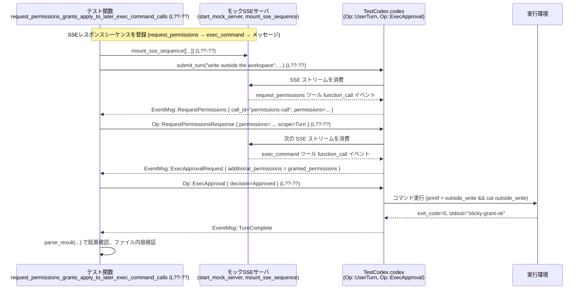

# core/tests/suite/request_permissions.rs

## 0. ざっくり一言

AI 実行環境の「追加ファイルシステム権限」と `request_permissions` ツールの振る舞いを、モックサーバとイベント駆動の E2E テストで検証するためのテストスイートです。

> 注記: このチャンクには行番号が含まれていないため、以下では位置を示すために  
> `core/tests/suite/request_permissions.rs:L??-??` のようなプレースホルダ表記を用います。

---

## 1. このモジュールの役割

### 1.1 概要

- このモジュールは、`codex_core` / `codex_protocol` における **実行権限承認 (Exec approvals)** と **request_permissions ツール** の連携を統合テストします。
- 特に、`additional_permissions` によるファイルシステム権限の拡張、`AskForApproval` ポリシーや `SandboxPolicy` に応じた振る舞い、turn/session スコープの権限の持続性を検証しています。
- テストはすべて `tokio::test(flavor = "current_thread")` の非同期テストであり、モック SSE サーバと `TestCodex` を使ったイベント駆動のフローを確認します。

### 1.2 アーキテクチャ内での位置づけ

このテストファイルが依存している主なコンポーネントを図示します。

```mermaid
graph TD
    subgraph Tests
        RPTest["request_permissions.rs (本ファイル)"]
    end

    subgraph Core
        CoreCfg["codex_core::config::Constrained"]
        Sandbox["codex_core::sandboxing::SandboxPermissions / SandboxPolicy"]
        Features["codex_features::Feature"]
    end

    subgraph Protocol
        AskApproval["codex_protocol::protocol::AskForApproval"]
        ExecEv["ExecApprovalRequestEvent"]
        ReqPerm["request_permissions::{RequestPermissionProfile, PermissionGrantScope, RequestPermissionsResponse}"]
        FsPerm["models::FileSystemPermissions / PermissionProfile"]
        Events["protocol::EventMsg"]
    end

    subgraph TestSupport
        TestCodexMod["core_test_support::test_codex::TestCodex"]
        Responses["core_test_support::responses::*"]
        WaitEv["core_test_support::wait_for_event"]
    end

    RPTest --> CoreCfg
    RPTest --> Sandbox
    RPTest --> Features
    RPTest --> AskApproval
    RPTest --> ExecEv
    RPTest --> ReqPerm
    RPTest --> FsPerm
    RPTest --> Events
    RPTest --> TestCodexMod
    RPTest --> Responses
    RPTest --> WaitEv
```



このテストは「アプリケーションレベル」で `TestCodex` に対して `Op::UserTurn`, `Op::ExecApproval`, `Op::RequestPermissionsResponse` を投げ、`EventMsg` の流れを観察することで、request_permissions 機構の契約を検証する位置づけになっています。

### 1.3 設計上のポイント

コードから読み取れる特徴は次のとおりです。

- **イベント駆動の E2E テスト**  
  - モック SSE サーバ (`start_mock_server`, `mount_sse_once`, `mount_sse_sequence`) を用い、LLM からのツール呼び出し (`ev_function_call`) やメッセージイベントを注入します。  
  - `wait_for_event` によって非同期に `EventMsg` を待ち受け、期待されるイベント順序を検証します。

- **権限モデルの検証に特化**  
  - `AskForApproval::OnRequest` や `AskForApproval::Granular` (request_permissions 無効) などの構成ごとに、  
    - 追加権限付きコマンドが必ず `ExecApprovalRequest` を経由するか  
    - request_permissions が自動 Deny されるか  
    - Turn/Session スコープで権限がどこまで残るか  
    を検証しています。

- **ファイルシステム権限の取り扱い**  
  - `PermissionProfile` / `RequestPermissionProfile` に含める `FileSystemPermissions` をヘルパ関数で構築し、  
    絶対パス化 (canonicalize)・ワークディレクトリ基準の相対パス解決などを重点的にテストしています。

- **安全性・エラー・並行性の観点**  
  - 本ファイルはテストコードのため、`unwrap`, `expect`, `panic!` を多用し、「失敗したら即テスト失敗」というスタイルになっています。  
  - 非同期テストは `tokio` の single-thread ランタイムを利用し、レースコンディションを減らしています。  
  - エラーは `anyhow::Result` を通して伝播させ、テスト関数の戻り値として扱われます。

---

## 2. 主要な機能一覧（コンポーネントインベントリー）

このファイル内で定義されている主な型・関数の一覧です。

### 2.1 型

| 名前 | 種別 | 役割 / 用途 | 定義位置 |
|------|------|-------------|----------|
| `CommandResult` | 構造体 | ツール呼び出しの結果文字列から抽出した `exit_code` と `stdout` を保持 | `core/tests/suite/request_permissions.rs:L??-??` |

### 2.2 ヘルパ関数

| 名前 | 種別 | 役割 / 用途 | 定義位置 |
|------|------|-------------|----------|
| `absolute_path(path: &Path) -> AbsolutePathBuf` | 関数 | `Path` から `AbsolutePathBuf::try_from` で絶対パスを生成し、失敗時は panic | `...:L??-??` |
| `parse_result(item: &Value) -> CommandResult` | 関数 | ツールの `function_call_output` から exit code と stdout を JSON or 正規表現で抽出 | `...:L??-??` |
| `shell_event_with_request_permissions` | 関数 | `sandbox_permissions = WithAdditionalPermissions` 付きの `shell_command` ツール呼び出しイベントを生成 | `...:L??-??` |
| `request_permissions_tool_event` | 関数 | `request_permissions` ツール呼び出しイベントを生成 | `...:L??-??` |
| `shell_command_event` | 関数 | 追加権限なしの `shell_command` ツール呼び出しイベントを生成 | `...:L??-??` |
| `exec_command_event` | 関数 | `exec_command` ツール呼び出しイベントを生成 (`yield_time_ms` 付き) | `...:L??-??` |
| `exec_command_event_with_request_permissions` | 関数 | `sandbox_permissions = WithAdditionalPermissions` 付きの `exec_command` ツール呼び出しイベント生成 | `...:L??-??` |
| `exec_command_event_with_missing_additional_permissions` | 関数 | `sandbox_permissions = WithAdditionalPermissions` だが `additional_permissions` を渡さない `exec_command` イベント生成 | `...:L??-??` |
| `shell_event_with_raw_request_permissions` | 関数 | `additional_permissions` を任意の JSON で与える `shell_command` イベント生成 (相対パス権限のテスト用) | `...:L??-??` |
| `submit_turn` | `async fn` | `TestCodex` に対して `Op::UserTurn` を送信し、ユーザーターンを開始 | `...:L??-??` |
| `wait_for_completion` | `async fn` | `EventMsg::TurnComplete` が来るまで待機 | `...:L??-??` |
| `expect_exec_approval` | `async fn` | 次のイベントが `ExecApprovalRequest` であることを期待し、コマンド末尾を検証 | `...:L??-??` |
| `wait_for_exec_approval_or_completion` | `async fn` | `ExecApprovalRequest` または `TurnComplete` のどちらかが来るまで待機 | `...:L??-??` |
| `expect_request_permissions_event` | `async fn` | `EventMsg::RequestPermissions` を待ち、`call_id` を検証して `RequestPermissionProfile` を返す | `...:L??-??` |
| `workspace_write_excluding_tmp` | 関数 | `/tmp` と `TMPDIR` を除外した `SandboxPolicy::WorkspaceWrite` を構築 | `...:L??-??` |
| `requested_directory_write_permissions` | 関数 | 指定ディレクトリへの write 権限のみを含む `RequestPermissionProfile` を生成 | `...:L??-??` |
| `normalized_directory_write_permissions` | 関数 | ディレクトリパスを `canonicalize` した上で write 権限に設定する `RequestPermissionProfile` を返す | `...:L??-??` |

### 2.3 テスト関数

すべて `#[tokio::test(flavor = "current_thread")] async fn ... -> Result<()>` です。

| テスト名 | 目的（1 行要約） | 定義位置 |
|---------|------------------|----------|
| `with_additional_permissions_requires_approval_under_on_request` | OnRequest ポリシー下で追加権限付きコマンドが必ず exec approval を要求することを検証 | `...:L??-??` |
| `request_permissions_tool_is_auto_denied_when_granular_request_permissions_is_disabled` | Granular ポリシーで `request_permissions` が無効な場合、自動で拒否されることを検証 | `...:L??-??` |
| `relative_additional_permissions_resolve_against_tool_workdir` | additional_permissions に相対パスを指定した場合、ツールの workdir 基準で解決されることを検証 | `...:L??-??` |
| `read_only_with_additional_permissions_does_not_widen_to_unrequested_cwd_write` *(macOS)* | read-only サンドボックスに追加権限を与えても、要求していない CWD 書き込みには拡張されないことを検証 | `...:L??-??` |
| `read_only_with_additional_permissions_does_not_widen_to_unrequested_tmp_write` *(macOS)* | 同上、`/tmp` のような一時ディレクトリへの未要求書き込みが許可されないことを検証 | `...:L??-??` |
| `workspace_write_with_additional_permissions_can_write_outside_cwd` | WorkspaceWrite ポリシーと追加権限の組合せで、CWD 外への書き込みが許可されることを検証 | `...:L??-??` |
| `with_additional_permissions_denied_approval_blocks_execution` | Exec approval が Denied の場合、コマンドが実行されずファイルが作成されないことを検証 | `...:L??-??` |
| `request_permissions_grants_apply_to_later_exec_command_calls` | `request_permissions` で付与された権限が同ターンの後続 `exec_command` に適用されることを検証 | `...:L??-??` |
| `request_permissions_preapprove_explicit_exec_permissions_outside_on_request` | inline で指定した `additional_permissions` が、事前に request_permissions で許可済みなら OnRequest でも成功することを検証 | `...:L??-??` |
| `request_permissions_grants_apply_to_later_shell_command_calls` | `request_permissions` で付与された権限が同ターンの後続 `shell_command` に適用されることを検証 | `...:L??-??` |
| `request_permissions_grants_apply_to_later_shell_command_calls_without_inline_permission_feature` | inline パーミッション機能を無効にしても、request_permissions ツールでの付与は shell_command に効くことを検証 | `...:L??-??` |
| `partial_request_permissions_grants_do_not_preapprove_new_permissions` | request_permissions で部分的にのみ許可された場合、新たな権限追加には再度 approval が必要であることを検証 | `...:L??-??` |
| `request_permissions_grants_do_not_carry_across_turns` | Turn スコープで付与された権限が別ターンには引き継がれないことを検証 | `...:L??-??` |
| `request_permissions_session_grants_carry_across_turns` *(macOS)* | Session スコープで付与された権限は別ターンでも利用できることを検証 | `...:L??-??` |

---

## 3. 公開 API と詳細解説

このファイルはテストコードなので外部モジュールに公開される API はありませんが、再利用性と理解のために主要ヘルパ関数を「このモジュールの公開インタフェース」と見なして解説します。

### 3.1 型一覧（構造体・列挙体など）

| 名前 | 種別 | 役割 / 用途 | フィールド概要 | 定義位置 |
|------|------|-------------|----------------|----------|
| `CommandResult` | 構造体 | ツール呼び出し結果から取り出した exit code と標準出力を保持 | `exit_code: Option<i64>`: プロセスの終了コード (パースできない場合は `None`) / `stdout: String`: 標準出力全体 | `...:L??-??` |

### 3.2 関数詳細

#### `parse_result(item: &Value) -> CommandResult`

**概要**

- `core_test_support` の `function_call_output` が返す JSON から、シェル/exec コマンドの実行結果をパースして `CommandResult` にまとめます。  
- 出力が JSON 形式でもプレーンテキストでも扱えるよう、二段構えのパースを行っています。  
  根拠: `serde_json::from_str::<Value>(output_str)` の `Ok`/`Err` 分岐と正規表現処理（`Regex::new(...)`）（`...:L??-??`）。

**引数**

| 引数名 | 型 | 説明 |
|--------|----|------|
| `item` | `&Value` | `single_request().function_call_output(call_id)` などから得られる JSON オブジェクト |

**戻り値**

- `CommandResult`  
  - `exit_code: Option<i64>`: 正常に取得できた場合は数値、パース失敗時は `None`。  
  - `stdout: String`: コマンドの標準出力 (空もあり得る)。

**内部処理の流れ**

1. `item["output"]` を `as_str()` で取得し、`output_str` とする。存在しない/文字列でない場合は `expect("shell output payload")` でテスト失敗。（`...:L??-??`）
2. `output_str` を JSON と見なして `serde_json::from_str::<Value>` を試みる。
   - 成功時 (`Ok(parsed)`):  
     - `parsed["metadata"]["exit_code"].as_i64()` を `exit_code` とする。  
     - `parsed["output"].as_str().unwrap_or_default()` を `stdout` とする。
3. JSON パースに失敗した場合 (`Err(_)`):  
   - 2 つの正規表現パターンを用意。  
     - `"^Exit code:\\s*(-?\\d+).*?Output:\\n(.*)$"`  
     - `"^.*?Process exited with code (\\d+)\\n.*?Output:\\n(.*)$"`  
   - いずれかにマッチすれば、キャプチャから `exit_code` と `stdout` を抽出。  
   - どちらにもマッチしなければ、`exit_code = None`, `stdout = output_str.to_string()` を返す。

**Examples（使用例）**

テスト内での典型的な使用例です。

```rust
// SSE モックレスポンスから function_call_output を取得し、結果をパースする
let results = mount_sse_once(&server, sse(/* ... */)).await; // モックレスポンスをセットアップ
let output_item = results.single_request().function_call_output(call_id); // output フィールドを含む JSON
let result = parse_result(&output_item); // exit_code と stdout を抽出

assert!(result.exit_code.is_none() || result.exit_code == Some(0));
assert!(result.stdout.contains("expected text"));
```

**Errors / Panics**

- `item["output"]` が存在しない、または文字列でない場合 `expect("shell output payload")` で panic します。  
  テストコードなので、これは「フォーマットが想定と違う」ことを早期に検出する意図と考えられます。
- 正規表現の `captures.get(1).unwrap()` 等も、パターンが不正の場合には panic しますが、パターンはコード内で固定です。

**Edge cases（エッジケース）**

- `output` が JSON 文字列で、`metadata.exit_code` や `output` フィールドが欠けている場合:  
  - `exit_code` は `None`、`stdout` は `""` もしくは `unwrap_or_default` により空文字になる可能性があります。
- `output` がテキストで、正規表現パターンにマッチしない場合:  
  - `exit_code = None`、`stdout = output_str` として扱われます。  
  これは「構造化されていない出力」のフォールバックです。

**使用上の注意点**

- テスト外で使うなら、`expect` や `unwrap` ではなく、エラーを `Result` で返す実装に変更する必要があります。
- 正規表現パターンは出力フォーマットに強く依存しているため、ツール側のエラーメッセージ形式が変わるとパース不能になる点に注意が必要です。

---

#### `shell_event_with_request_permissions<S: serde::Serialize>(call_id, command, additional_permissions) -> Result<Value>`

**概要**

- SSE モックサーバに流す `shell_command` ツール呼び出しイベント (function_call) の JSON を組み立てます。  
- `sandbox_permissions: WithAdditionalPermissions` と `additional_permissions` ペイロードを含めることで、「追加権限付きのシェルコマンド」をシミュレートします。（`...:L??-??`）

**引数**

| 引数名 | 型 | 説明 |
|--------|----|------|
| `call_id` | `&str` | ツール呼び出しを識別する ID。後続で `function_call_output(call_id)` に使われる |
| `command` | `&str` | 実行するシェルコマンド文字列 |
| `additional_permissions` | `&S` where `S: Serialize` | 追加権限情報 (`PermissionProfile`, `RequestPermissionProfile` など) をシリアライズ可能な形で渡す |

**戻り値**

- `Result<Value>`: `serde_json::to_string(&args)` に失敗した場合に `anyhow::Error` としてエラーを返します。それ以外は `ev_function_call` が返す JSON を `Ok` でラップして返します。

**内部処理の流れ**

1. `args` オブジェクトを `json!` マクロで生成:  
   - `"command": command`  
   - `"timeout_ms": 1_000_u64`  
   - `"sandbox_permissions": SandboxPermissions::WithAdditionalPermissions`  
   - `"additional_permissions": additional_permissions`  
2. `serde_json::to_string(&args)?` で JSON 文字列にシリアライズ（失敗時は `?` で早期 return）。  
3. `ev_function_call(call_id, "shell_command", &args_str)` によって function call イベントを生成し、その JSON を返す。（`core_test_support::responses` 由来）

**Examples（使用例）**

```rust
let requested_permissions = PermissionProfile { /* ... */ };
let event = shell_event_with_request_permissions(
    "request_permissions_skip_approval",
    "touch requested-dir/file.txt",
    &requested_permissions,
)?;

// SSE にイベントとして流す
let _ = mount_sse_once(
    &server,
    sse(vec![
        ev_response_created("resp-1"),
        event,
        ev_completed("resp-1"),
    ]),
).await;
```

**Errors / Panics**

- `serde_json::to_string` に失敗した場合、`anyhow::Error` として呼び出し元に伝播します。  
  許可オブジェクトが `Serialize` を実装していない、または循環参照などでシリアライズ不能な場合に起こり得ます。
- `ev_function_call` 内部で panic する可能性はありますが、このチャンクだけでは分かりません。

**Edge cases**

- `additional_permissions` に `null` 相当を渡した場合の挙動は、このテストでは使用されていません（`PermissionProfile` や `RequestPermissionProfile` のような構造体を常に渡しています）。

**使用上の注意点**

- `SandboxPermissions::WithAdditionalPermissions` と `additional_permissions` の整合性が取れている前提です。  
  テストの中には、あえて `additional_permissions` を省略するケースを別関数 (`exec_command_event_with_missing_additional_permissions`) で扱っています。

---

#### `shell_event_with_raw_request_permissions(call_id, command, workdir, additional_permissions) -> Result<Value>`

**概要**

- `shell_event_with_request_permissions` に似ていますが、`workdir` と `additional_permissions` を生の `Value` で受け取ります。  
- 追加権限 JSON を文字列ではなくそのまま渡すことで、「相対パスを書いた JSON を LLM が生成した」状況をテストします。（`...:L??-??`）

**引数**

| 引数名 | 型 | 説明 |
|--------|----|------|
| `call_id` | `&str` | ツール呼び出し ID |
| `command` | `&str` | 実行コマンド |
| `workdir` | `Option<&str>` | ツール実行時の作業ディレクトリ（例: `"nested"`） |
| `additional_permissions` | `Value` | 任意の JSON としての追加権限指定 |

**戻り値**

- `Result<Value>`: 実行時のエラー条件は上記関数と同様です。

**内部処理の流れ**

1. `json!` で次の項目を含む `args` を構築:  
   - `"command"`, `"workdir"`, `"timeout_ms"`, `"sandbox_permissions"`, `"additional_permissions"`  
2. `serde_json::to_string(&args)?` → `ev_function_call(call_id, "shell_command", &args_str)`。

**使用例**

`relative_additional_permissions_resolve_against_tool_workdir` テストで、以下のように呼ばれます（`...:L??-??`）。

```rust
let event = shell_event_with_raw_request_permissions(
    call_id,
    command,
    Some("nested"),
    json!({
        "file_system": {
            "write": ["."],
        },
    }),
)?;
```

ここでは `workdir = "nested"`, `additional_permissions.file_system.write = ["."]` を渡し、  
実際には `nested` ディレクトリの絶対パスに正規化されることを後続の approval で検証しています。

---

#### `submit_turn(test: &TestCodex, prompt: &str, approval_policy: AskForApproval, sandbox_policy: SandboxPolicy) -> Result<()>`

**概要**

- テスト中で共通して使用される「ユーザーターン送信」ヘルパです。  
- `TestCodex` の `codex.submit(Op::UserTurn { ... })` をラップし、毎回同じ形の `UserInput` / `cwd` / 各種ポリシー設定を行います。（`...:L??-??`）

**引数**

| 引数名 | 型 | 説明 |
|--------|----|------|
| `test` | `&TestCodex` | テスト用 Codex ラッパ。`test_codex().with_config(...).build(&server)` で構築される |
| `prompt` | `&str` | ユーザーからの自然言語プロンプト |
| `approval_policy` | `AskForApproval` | Exec/request_permissions まわりの承認ポリシー |
| `sandbox_policy` | `SandboxPolicy` | サンドボックスのファイルシステム/ネットワーク制約 |

**戻り値**

- `Result<()>`: `codex.submit(...)` の失敗時などに `anyhow::Error` が返ります。

**内部処理の流れ**

1. `let session_model = test.session_configured.model.clone();`  
   セッションで設定された LLM モデルを使用します。
2. `Op::UserTurn` を構築:  
   - `items`: `UserInput::Text { text: prompt.into(), text_elements: Vec::new() }`  
   - `cwd`: `test.cwd.path().to_path_buf()`  
   - `approval_policy`, `sandbox_policy`, `approvals_reviewer: Some(ApprovalsReviewer::User)`  
   - その他オプションは `None`。
3. `test.codex.submit(Op::UserTurn { ... }).await?` で送信し、`Ok(())` を返す。

**Examples（使用例）**

ほぼすべてのテストで共通に利用されています。

```rust
submit_turn(
    &test,
    "write outside the workspace",
    approval_policy,
    sandbox_policy.clone(),
).await?;
```

**Errors / Panics**

- `codex.submit` が `Result::Err` を返した場合、`?` により `anyhow::Error` として呼び出し元に伝播し、テストが失敗します。

**Edge cases**

- `prompt` が空文字でも特に検証していませんが、`UserInput::Text` として送られます。
- `approval_policy` と `sandbox_policy` の組み合わせが不正な場合の挙動は、このテストではカバーしていません。

**使用上の注意点**

- 各テストでは `with_config` であらかじめ `config.permissions.approval_policy`, `config.permissions.sandbox_policy` を設定しているため、  
  `submit_turn` の引数と設定が矛盾しないようにする必要があります。

---

#### `expect_exec_approval(test: &TestCodex, expected_command: &str) -> ExecApprovalRequestEvent`

**概要**

- 次に来るイベントが `EventMsg::ExecApprovalRequest` であることを期待し、  
  その `command` フィールドの最後の要素が `expected_command` と一致することを検証します。（`...:L??-??`）

**引数**

| 引数名 | 型 | 説明 |
|--------|----|------|
| `test` | `&TestCodex` | イベント待受に使う Codex インスタンス |
| `expected_command` | `&str` | 期待されるコマンド文字列 (`touch ...` や `printf ...` など) |

**戻り値**

- `ExecApprovalRequestEvent`: 実際の approval イベント。後続の `Op::ExecApproval` 送信に用います。

**内部処理の流れ**

1. `wait_for_event(&test.codex, |event| matches!(event, EventMsg::ExecApprovalRequest(_) | EventMsg::TurnComplete(_))).await`  
   - ExecApprovalRequest または TurnComplete のどちらかが来るまで待つ。
2. `match event` で分岐:  
   - `EventMsg::ExecApprovalRequest(approval)` の場合:
     - `approval.command.last()` からコマンド配列末尾の文字列を取得し、`expected_command` と `assert_eq!`。  
     - 一致すれば `approval` を返す。
   - `EventMsg::TurnComplete(_)` の場合:  
     - `panic!("expected approval request before completion")`。
   - その他のイベントの場合:  
     - `panic!("unexpected event: {other:?}")`。

**Examples（使用例）**

```rust
let approval = expect_exec_approval(&test, &command).await;
assert_eq!(
    approval.additional_permissions,
    Some(normalized_requested_permissions.into())
);

test.codex
    .submit(Op::ExecApproval {
        id: approval.effective_approval_id(),
        turn_id: None,
        decision: ReviewDecision::Approved,
    })
    .await?;
```

**Errors / Panics**

- 期待した順序で `ExecApprovalRequest` が来ない場合 (先に `TurnComplete` が来る、あるいは別種のイベントが来る) は `panic!` します。

**Edge cases**

- `approval.command` が空配列だった場合、`last().unwrap_or_default()` により空文字と比較されます。そのようなケースはテストでは発生しない前提です。

**使用上の注意点**

- 「approval が来ない」シナリオをテストしたい場合は、この関数ではなく `wait_for_exec_approval_or_completion` を使っています。

---

#### `expect_request_permissions_event(test: &TestCodex, expected_call_id: &str) -> RequestPermissionProfile`

**概要**

- 次に来る `EventMsg::RequestPermissions` を待ち、`call_id` が期待値であることを検証してから `permissions` を返します。（`...:L??-??`）

**引数**

| 引数名 | 型 | 説明 |
|--------|----|------|
| `test` | `&TestCodex` | イベント待受対象 |
| `expected_call_id` | `&str` | `request_permissions` ツール呼び出しに対応する `call_id` |

**戻り値**

- `RequestPermissionProfile`: リクエストされた権限セット。テスト内で `assert_eq!` による検証に使われます。

**内部処理の流れ**

1. `wait_for_event` で `EventMsg::RequestPermissions(_)` または `EventMsg::TurnComplete(_)` を待機。
2. `match event` で分岐:
   - `EventMsg::RequestPermissions(request)`:
     - `assert_eq!(request.call_id, expected_call_id);`
     - `request.permissions` を返す。
   - `EventMsg::TurnComplete(_)`:
     - `panic!("expected request_permissions before completion")`。
   - その他:
     - `panic!("unexpected event: {other:?}")`。

**使用上の注意点**

- `request_permissions` が「出てこない」ことを確認するテストでは、この関数ではなく直接 `wait_for_event` と `matches!` を利用しています（`request_permissions_tool_is_auto_denied_when_granular_request_permissions_is_disabled` など）。

---

#### `workspace_write_excluding_tmp() -> SandboxPolicy`

**概要**

- `SandboxPolicy::WorkspaceWrite` を構築するヘルパです。  
- `/tmp` と env 経由の tmpdir を **書き込み対象から除外** しつつ、ワークスペース内の書き込みを許可するポリシーを返します。（`...:L??-??`）

**戻り値**

- `SandboxPolicy::WorkspaceWrite` 構造体インスタンス。

**フィールド設定**

```rust
SandboxPolicy::WorkspaceWrite {
    writable_roots: vec![],
    read_only_access: Default::default(),
    network_access: false,
    exclude_tmpdir_env_var: true,
    exclude_slash_tmp: true,
}
```

**使用例**

外部ディレクトリへの書き込みテストなどで使用されます。

```rust
let sandbox_policy = workspace_write_excluding_tmp();
let sandbox_policy_for_config = sandbox_policy.clone();

let mut builder = test_codex().with_config(move |config| {
    config.permissions.approval_policy = Constrained::allow_any(approval_policy);
    config.permissions.sandbox_policy = Constrained::allow_any(sandbox_policy_for_config);
    /* ... */
});
```

---

#### `requested_directory_write_permissions` / `normalized_directory_write_permissions`

**概要**

- 特定ディレクトリへの write 権限を持つ `RequestPermissionProfile` を組み立てるためのヘルパです。（`...:L??-??`）

**違い**

- `requested_directory_write_permissions`:
  - 渡された `&Path` をそのまま `absolute_path(path)` でラップします (内部で `AbsolutePathBuf::try_from(path)` → panic あり)。
- `normalized_directory_write_permissions`:
  - `path.canonicalize()?` で正規化した上で `AbsolutePathBuf::try_from` します。  
  - 失敗は `Result<RequestPermissionProfile>` のエラーとして返します。

**用途**

- 「ユーザーからのリクエストとして」渡された権限 (`requested_*`) と、  
  「システム内部で正規化された権限 (`normalized_*`) が一致するか」を検証するために両方を使用するテストがいくつか存在します。

---

### 3.3 その他の関数

ここでは、上記で詳細解説していない補助関数を一覧にします。

| 関数名 | 役割（1 行） | 定義位置 |
|--------|--------------|----------|
| `shell_command_event` | 標準的な `shell_command` ツール呼び出しイベント生成 | `...:L??-??` |
| `exec_command_event` | 標準的な `exec_command` ツール呼び出しイベント生成 | `...:L??-??` |
| `exec_command_event_with_request_permissions` | 追加権限付き `exec_command` イベント生成 | `...:L??-??` |
| `exec_command_event_with_missing_additional_permissions` | `sandbox_permissions = WithAdditionalPermissions` だが `additional_permissions` 欠如した `exec_command` イベント生成 (エラーケース用) | `...:L??-??` |
| `wait_for_completion` | `EventMsg::TurnComplete` まで待機する単純ヘルパ | `...:L??-??` |
| `wait_for_exec_approval_or_completion` | `ExecApprovalRequest` が来ればそれを返し、来なければ `None` を返すヘルパ | `...:L??-??` |

---

## 4. データフロー

ここでは代表的なシナリオとして  
**`request_permissions_grants_apply_to_later_exec_command_calls`** の処理の流れをまとめます。

### 4.1 処理の要点（文章）

1. テストはモック SSE サーバに 3 つのレスポンスストリームを登録します（`mount_sse_sequence`）。  
   1. `request_permissions` ツール呼び出し  
   2. `exec_command` ツール呼び出し  
   3. assistant メッセージで完了
2. `submit_turn` でユーザーターンを開始すると、Codex は SSE 経由でツール呼び出しを順に消費します。
3. `request_permissions` 呼び出しに対して Codex から `EventMsg::RequestPermissions` が emit され、テストは `expect_request_permissions_event` で受け取る。
4. テストは `Op::RequestPermissionsResponse` を送信し、`permissions` を `scope: Turn` で許可する。
5. その後、`exec_command` ツール呼び出しが実行される際、追加権限はすでに turn スコープで付与済みなので、  
   `ExecApprovalRequestEvent.additional_permissions` にその権限が含まれた状態で approval が要求される。
6. テストは `Op::ExecApproval { decision: Approved }` を送信し、実際にコマンドが成功することとファイルが書き込まれることを確認する。

### 4.2 Mermaid シーケンス図



このフローから読み取れる **契約**:

- request_permissions ツールで `scope: Turn` で許可した権限は、同ターン内の後続コマンド (`exec_command`) に対して `additional_permissions` として自動的に適用される。  
- それでも OnRequest ポリシーの下では、実行前に ExecApprovalRequest が発行され、ユーザー承認が必要です。

---

## 5. 使い方（How to Use）

このファイル自体はテストですが、「request_permissions/追加権限まわりのテストを書くためのパターン」として利用できます。

### 5.1 基本的な使用方法

1. **TestCodex の構築**

```rust
let server = start_mock_server().await;
let approval_policy = AskForApproval::OnRequest;
let sandbox_policy = workspace_write_excluding_tmp();
let sandbox_policy_for_config = sandbox_policy.clone();

let mut builder = test_codex().with_config(move |config| {
    config.permissions.approval_policy = Constrained::allow_any(approval_policy);
    config.permissions.sandbox_policy = Constrained::allow_any(sandbox_policy_for_config);
    config.features.enable(Feature::ExecPermissionApprovals).unwrap();
    config.features.enable(Feature::RequestPermissionsTool).unwrap();
});
let test = builder.build(&server).await?;
```

1. **SSE モックレスポンスの登録**

```rust
let responses = mount_sse_sequence(
    &server,
    vec![
        sse(vec![
            ev_response_created("resp-1"),
            /* ev_function_call(..., "request_permissions", ...) など */
            ev_completed("resp-1"),
        ]),
        // 続くツール呼び出しやメッセージ
    ],
).await;
```

1. **ユーザーターンを送信**

```rust
submit_turn(&test, "some prompt", approval_policy, sandbox_policy.clone()).await?;
```

1. **イベントを待って応答**

```rust
let permissions = expect_request_permissions_event(&test, "permissions-call").await;
test.codex
    .submit(Op::RequestPermissionsResponse {
        id: "permissions-call".to_string(),
        response: RequestPermissionsResponse {
            permissions,
            scope: PermissionGrantScope::Turn,
        },
    })
    .await?;
```

1. **ExecApproval や結果の検証**

```rust
if let Some(approval) = wait_for_exec_approval_or_completion(&test).await {
    test.codex
        .submit(Op::ExecApproval {
            id: approval.effective_approval_id(),
            turn_id: None,
            decision: ReviewDecision::Approved,
        })
        .await?;
    wait_for_completion(&test).await;
}

let exec_output = responses.function_call_output_text("exec-call")
    .map(|output| json!({ "output": output }))
    .unwrap();
let result = parse_result(&exec_output);
assert_eq!(result.exit_code, Some(0));
```

### 5.2 よくある使用パターン

- **追加権限付きの単発コマンドを検証する**  
  - `shell_event_with_request_permissions` / `exec_command_event_with_request_permissions` でツール呼び出しを生成。  
  - `expect_exec_approval` で追加権限が ExecApprovalRequest に反映されているかを検証。

- **request_permissions ツール → 後続コマンド**  
  - 最初の SSE ストリームで `request_permissions_tool_event`  
  - 2 本目以降で `shell_command_event` または `exec_command_event`  
  - `expect_request_permissions_event` → `Op::RequestPermissionsResponse` → `wait_for_exec_approval_or_completion` という流れで、「権限が引き継がれているか」をテスト。

- **権限スコープの違いを検証**  
  - `PermissionGrantScope::Turn` と `Session` を切り替え、別のターンで権限が効くかどうかをテスト (`request_permissions_grants_do_not_carry_across_turns`, `request_permissions_session_grants_carry_across_turns`)。

### 5.3 よくある間違い（このテストから推測できるもの）

- **必要な feature を有効にしないままテストを書く**  
  - 例: `Feature::RequestPermissionsTool` を有効にしないと request_permissions ツールが利用できない。
- **`call_id` の不一致**  
  - `request_permissions_tool_event` の `call_id` と、`expect_request_permissions_event` の `expected_call_id` が一致していないと `assert_eq!` で失敗します。
- **SandboxPolicy とテスト期待の矛盾**  
  - `SandboxPolicy::new_read_only_policy()` を使っているのに、「CWD にファイルを書ける」と期待するとテストが失敗します。  
  - その場合は `workspace_write_excluding_tmp()` のようなポリシーが必要です。

### 5.4 使用上の注意点（まとめ）

- 本ファイルの関数は **テスト専用** として設計されており、`unwrap`/`expect`/`panic!` を多用しています。  
  プロダクションコードに流用する場合は、エラー処理を `Result` ベースに作り直す必要があります。
- 非同期テストは `flavor = "current_thread"` で実行されるため、並列に他のテストと干渉しにくいですが、  
  グローバル状態を持つコンポーネントに対するテストを追加する場合は注意が必要です。
- `skip_if_no_network!` / `skip_if_sandbox!` により、環境によってはテストがスキップされることがあります。

---

## 6. 変更の仕方（How to Modify）

### 6.1 新しい機能を追加する場合（新しいテストケース）

1. **設定セクションの追加**  
   - 既存テストと同様に `start_mock_server` → `test_codex().with_config(...)` → `builder.build(&server)` というパターンで `TestCodex` を構築します。
2. **SSE レスポンスの設計**  
   - LLM がどの順番でどのツールを呼ぶかを設計し、`mount_sse_once` または `mount_sse_sequence` に `ev_response_created`, `ev_function_call`, `ev_assistant_message`, `ev_completed` を並べます。
3. **イベントの観察ロジック**  
   - request_permissions を検証したい場合は `expect_request_permissions_event`、  
     exec approvals を検証したい場合は `expect_exec_approval` / `wait_for_exec_approval_or_completion` などを使います。
4. **アサーションの追加**  
   - `parse_result` や `fs::read_to_string` を用いて、exit code / stdout / ファイルの有無と内容を確認します。

### 6.2 既存の機能を変更する場合

- **権限モデルが変わった場合**  
  - `PermissionGrantScope` の意味や `AskForApproval` ポリシーの挙動が変わったら、  
    - 該当するテスト (`*_carry_across_turns`, `*_auto_denied_*` など) の期待値 (`assert_eq!`、`assert!`) を見直す必要があります。
- **ツール呼び出しペイロード形式が変わった場合**  
  - `parse_result` の JSON/テキストフォーマット前提が崩れる可能性があるため、正規表現や JSON パスを更新します。
- **イベント種別やフィールド構造が変わった場合**  
  - `EventMsg` や `ExecApprovalRequestEvent` のフィールド変更に合わせて、  
    `expect_exec_approval` / `expect_request_permissions_event` 内の参照フィールドを修正する必要があります。

---

## 7. 関連ファイル・モジュール

このテストが依存している重要なモジュールとその役割です（ファイルパスはこのチャンクからは不明なため、モジュールパスで記載します）。

| パス / モジュール | 役割 / 関係 |
|------------------|------------|
| `codex_core::config::Constrained` | 設定値に対する制約付きラッパ。テストでは `config.permissions.approval_policy` / `sandbox_policy` の設定に使用されています。 |
| `codex_core::sandboxing::{SandboxPermissions, SandboxPolicy}` | サンドボックスの権限モデル。追加権限の有無やワークスペース書き込み範囲の設定に利用。 |
| `codex_features::Feature` | `ExecPermissionApprovals` や `RequestPermissionsTool` などの機能フラグ。テストごとに有効/無効を切り替えます。 |
| `codex_protocol::protocol::{AskForApproval, ExecApprovalRequestEvent, EventMsg, ReviewDecision, SandboxPolicy as ProtocolSandboxPolicy, GranularApprovalConfig}` | 承認ポリシーの種類、ExecApproval イベント、イベントストリームの型など、プロトコルレベルの型。 |
| `codex_protocol::models::{FileSystemPermissions, PermissionProfile}` | 追加権限として渡すファイルシステム権限のモデル。 |
| `codex_protocol::request_permissions::{RequestPermissionProfile, PermissionGrantScope, RequestPermissionsResponse}` | request_permissions ツールの入出力モデル。 |
| `core_test_support::test_codex::{test_codex, TestCodex}` | Codex インスタンスのセットアップやワークスペース管理を行うテスト用ユーティリティ。 |
| `core_test_support::responses::*` | SSE モックサーバ用のイベント生成ヘルパ (`ev_function_call`, `ev_response_created`, `ev_completed`, `ev_assistant_message`, `mount_sse_once`, `mount_sse_sequence` など)。 |
| `core_test_support::wait_for_event` | `EventMsg` ストリームから特定条件に合うイベントが来るまで非同期に待ち続けるヘルパ。 |
| `core_test_support::{skip_if_no_network, skip_if_sandbox}` | テスト実行環境に応じてテストをスキップするためのマクロ。 |

このテストファイルは、これらのモジュールを組み合わせて **「request_permissions と追加権限がどのように作用するか」という契約の回帰テスト** として機能している、という位置づけになります。
