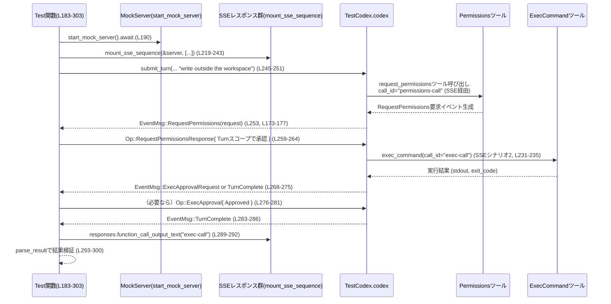
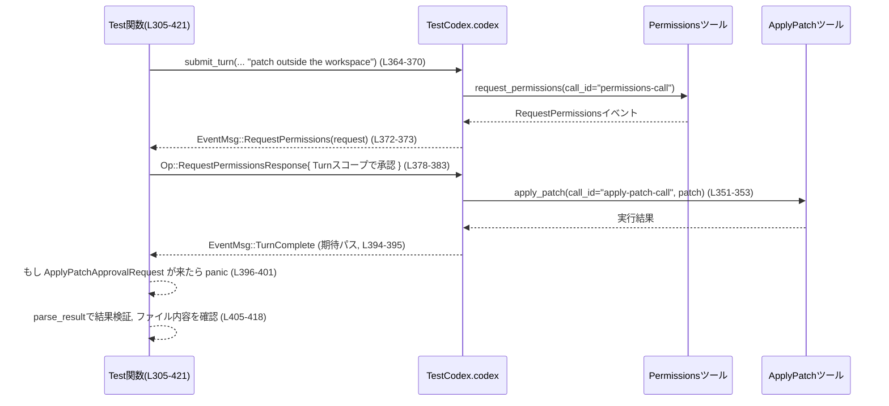

# core/tests/suite/request_permissions_tool.rs

## 0. ざっくり一言

Codex の「request_permissions」ツールとサンドボックス設定の連携を検証する **統合テスト用モジュール**です。  
フォルダ書き込み権限をユーザーが許可したあとに、`exec_command` や `apply_patch` が追加の承認なしで実行できることを確認します。  
（`core/tests/suite/request_permissions_tool.rs:L183-303`, `L305-421`）

---

## 1. このモジュールの役割

### 1.1 概要

このモジュールは、以下の点をテストします。

- **問題**  
  - ワークスペース外のディレクトリへの書き込みは、通常サンドボックスにより禁止される。
  - ただしユーザーが `request_permissions` ツール経由で明示的に許可した場合、その範囲内の書き込みは許可されるべき。
- **提供機能（テスト観点）**  
  - `request_permissions` による「フォルダ書き込み許可」が、後続の:
    - `exec_command`（シェルコマンド実行）  
    - `apply_patch`（パッチ適用）
    に対して **追加の承認要求を出さずに実行可能にする**ことを検証します。  
  （`core/tests/suite/request_permissions_tool.rs:L183-303`, `L305-421`）

### 1.2 アーキテクチャ内での位置づけ

このファイルは **テストコード**であり、実際のビジネスロジックは他モジュールにあります。主な依存関係は次のとおりです。

- `core_test_support::test_codex`  
  - Codex のテスト用ラッパー (`TestCodex`) やビルダー (`test_codex`) を提供します。  
    （`L28-29`, `L195-207`, `L317-329`）
- `core_test_support::responses`  
  - SSE（Server-Sent Events）風のレスポンスシーケンスをモックするユーティリティ。  
    `mount_sse_sequence`, `sse`, `ev_function_call`, `ev_apply_patch_function_call` など。  
    （`L18-25`, `L219-243`, `L338-362`）
- `codex_protocol::request_permissions`  
  - `RequestPermissionProfile`, `RequestPermissionsResponse`, `PermissionGrantScope` など、権限要求・応答のデータモデル。  
    （`L13-15`, `L215-217`, `L259-264`, `L333-335`, `L378-383`）
- `codex_protocol::protocol`  
  - `Op`（Codex への操作）、`EventMsg`（イベント）、`AskForApproval`（承認ポリシー）、`SandboxPolicy` など。  
    （`L8-12`, `L140-156`, `L165-180`, `L190-193`, `L268-273`, `L387-391`）

概略の依存関係図は以下のとおりです（テストコード観点）。  
※ `()` 内は主な行範囲です。

```mermaid
graph TD
    A["request_permissions_tool.rs (L183-421) テスト本体"]
    B["TestCodex / test_codex (外部)"]
    C["Mock Server: start_mock_server (外部)"]
    D["SSE helpers: mount_sse_sequence, sse, ev_* (外部)"]
    E["Codex core runtime (外部, Op::*, EventMsg::*)"]
    F["RequestPermissions ツール (外部)"]
    G["ExecCommand ツール (外部)"]
    H["ApplyPatch ツール (外部)"]

    A --> B
    A --> C
    A --> D
    A -->|submit(Op::UserTurn / RequestPermissionsResponse / ExecApproval)| E
    E --> F
    E --> G
    E --> H
    E -->|EventMsg::RequestPermissions / ExecApprovalRequest / ApplyPatchApprovalRequest / TurnComplete| A
    D --> C
```

外部コンポーネント（`E`〜`H`）の詳細実装はこのチャンクには現れませんが、型名・関数名から上記の役割が想定されます（`L140-156`, `L165-180`, `L268-273`, `L387-391`）。

### 1.3 設計上のポイント

- **責務の分割**
  - パス・権限定義用の小さなヘルパー関数群  
    （`absolute_path`, `requested_directory_write_permissions`, `normalized_directory_write_permissions` など `L38-100`）
  - ツール呼び出し用 SSE イベント生成ヘルパー  
    （`request_permissions_tool_event`, `exec_command_event`, `build_add_file_patch` `L42-70`）
  - Codex とのやりとり用ヘルパー  
    （`submit_turn`, `expect_request_permissions_event` `L132-181`）
  - 実際のシナリオテスト  
    （2 つの `#[tokio::test]` 関数 `L183-303`, `L305-421`）
- **状態管理**
  - テスト自体は状態を持たず、`TestCodex` や `tempfile::tempdir()` が内部状態を管理します。  
    （`L207-210`, `L329-333`）
- **エラーハンドリング**
  - テスト関数の戻り値は `anyhow::Result<()>` で、`?` を多用した早期リターンスタイル。  
    （`L185-187`, `L307-310`）
  - テスト内部では `expect`, `unwrap`, `panic!` を積極的に使用し、「予期しない状態があればテスト失敗」という方針です。  
    （`L38-40`, `L102-107`, `L114-116`, `L171-180`, `L289-293`, `L405-408`）
- **並行性**
  - すべてのテストは `#[tokio::test(flavor = "current_thread")]` で単一スレッドの非同期ランタイム上で実行されます。  
    （`L183-185`, `L305-307`）
  - Codex との通信や SSE モックは `async/await` によって非同期処理されています。  
    （`L132-159`, `L219-243`, `L338-362`）

---

## 2. 主要な機能一覧

このモジュールが提供する主要な「機能」（テスト観点）を列挙します。

- フォルダ書き込み権限プロファイルの組み立て:
  - `requested_directory_write_permissions`: 指定ディレクトリ書き込みのみ許可する `RequestPermissionProfile` を生成します。（`L82-90`）
  - `normalized_directory_write_permissions`: パスを正規化（canonicalize）したうえで同じプロファイルを生成します。（`L92-100`）
- サンドボックスポリシーの準備:
  - `workspace_write_excluding_tmp`: ワークスペース内のみ書き込み許可し、`/tmp` などを明示的に除外する `SandboxPolicy` を返します。（`L72-80`）
- SSE 経由のツール呼び出しイベント生成:
  - `request_permissions_tool_event`: `request_permissions` ツール用の function_call イベント JSON を生成します。（`L42-53`）
  - `exec_command_event`: `exec_command` ツール（シェル実行）用の function_call イベント JSON を生成します。（`L55-61`）
  - `build_add_file_patch`: `apply_patch` に渡す「新規ファイル追加パッチ」文字列を生成します。（`L64-70`）
- Codex とのやりとりヘルパー:
  - `submit_turn`: 指定プロンプト・承認ポリシー・サンドボックスで `Op::UserTurn` を送信します。（`L132-159`）
  - `expect_request_permissions_event`: `EventMsg::RequestPermissions` が来るまで待ち、内容を検証して返します。（`L161-181`）
- 実行結果パース:
  - `parse_result`: SSE function_call の出力文字列から exit code と stdout を抽出します。（`L102-129`）
- シナリオテスト:
  - `approved_folder_write_request_permissions_unblocks_later_exec_without_sandbox_args`  
    - フォルダ書き込み権限を許可すると、後続の `exec_command` が追加の「exec 承認」なしで成功することをテストします。（`L183-303`）
  - `approved_folder_write_request_permissions_unblocks_later_apply_patch_without_prompt`  
    - 同様に、後続の `apply_patch` が追加の「apply_patch 承認」なしで成功することをテストします。（`L305-421`）

---

## 3. 公開 API と詳細解説

このファイル内で新たな公開構造体や列挙体は定義されていません。  
ここでは、このテストモジュール内の関数（コンポーネント）インベントリーと、代表的な関数の詳細を説明します。

### 3.1 関数インベントリー（全体）

| 名前 | 種別 | 役割 / 用途 | 行範囲 |
|------|------|------------|--------|
| `absolute_path` | 関数 | `&Path` を `AbsolutePathBuf` に変換（失敗時は panic） | `request_permissions_tool.rs:L38-40` |
| `request_permissions_tool_event` | 関数 | `request_permissions` ツール用の function_call イベント JSON を生成 | `L42-53` |
| `exec_command_event` | 関数 | `exec_command` ツール用 function_call イベント JSON を生成 | `L55-61` |
| `build_add_file_patch` | 関数 | `apply_patch` に渡す新規ファイル追加パッチを生成 | `L64-70` |
| `workspace_write_excluding_tmp` | 関数 | `/tmp` などを除外した WorkspaceWrite サンドボックスポリシーを生成 | `L72-80` |
| `requested_directory_write_permissions` | 関数 | 指定ディレクトリ書き込みのみ許可する `RequestPermissionProfile` を生成 | `L82-90` |
| `normalized_directory_write_permissions` | 関数 | パスを正規化したうえで書き込み権限プロファイルを生成 | `L92-100` |
| `parse_result` | 関数 | function_call 出力から exit code / stdout を抽出 | `L102-129` |
| `submit_turn` | 非同期関数 | Codex に `Op::UserTurn` を送信するヘルパー | `L132-159` |
| `expect_request_permissions_event` | 非同期関数 | `EventMsg::RequestPermissions` を待ち受け、検証して返す | `L161-181` |
| `approved_folder_write_request_permissions_unblocks_later_exec_without_sandbox_args` | 非同期テスト関数 | `request_permissions` → `exec_command` シナリオの統合テスト | `L183-303` |
| `approved_folder_write_request_permissions_unblocks_later_apply_patch_without_prompt` | 非同期テスト関数 | `request_permissions` → `apply_patch` シナリオの統合テスト | `L305-421` |

---

### 3.2 重要関数の詳細

ここでは特に重要な 7 関数について詳しく説明します。

#### 1. `workspace_write_excluding_tmp() -> SandboxPolicy`

**概要**

ワークスペース内でのみ書き込みを許可し、`/tmp` や `TMPDIR` のディレクトリを **明示的に書き込み不可**にするサンドボックスポリシーを構築します。  
（`request_permissions_tool.rs:L72-80`）

**シグネチャ**

```rust
fn workspace_write_excluding_tmp() -> SandboxPolicy
```

**戻り値**

- `SandboxPolicy::WorkspaceWrite` バリアントを返します。フィールド値は以下のとおりです（`L73-79`）:
  - `writable_roots: vec![]`
  - `read_only_access: Default::default()`
  - `network_access: false`
  - `exclude_tmpdir_env_var: true`
  - `exclude_slash_tmp: true`

**内部処理の流れ**

1. `SandboxPolicy::WorkspaceWrite { ... }` を直接構築する。
2. `writable_roots` を空にすることで、「明示的に許可されたルート」がない状態にする。
3. `exclude_tmpdir_env_var` および `exclude_slash_tmp` を `true` にすることで、`TMPDIR` と `/tmp` を除外する。  
   （いずれも `SandboxPolicy` のフィールド。型定義はこのチャンクには現れません。）

**使用例（このファイル内）**

```rust
let sandbox_policy = workspace_write_excluding_tmp();      // L192-193
let sandbox_policy_for_config = sandbox_policy.clone();    // テスト用コンフィグに渡すためクローン
```

`test_codex().with_config` 内で `config.permissions.sandbox_policy` に設定され、  
さらに `submit_turn` 呼び出し時の引数としても渡されています。（`L195-207`, `L245-250`）

**Errors / Panics**

- この関数自体は `Result` を返さず、パニックを起こすコードも含みません。
- `SandboxPolicy::WorkspaceWrite` の構築に失敗する可能性は、通常の Rust enum 初期化ではありません。

**Edge cases（エッジケース）**

- `writable_roots` が空であるため、ワークスペース外はデフォルトで書き込み禁止と解釈されます（`L73-75`）。  
  そのため、テストでは `request_permissions` による例外的許可が重要になります。（`L215-217`, `L333-335`）

**使用上の注意点**

- ネットワークアクセスが `false` に設定されているため、テスト対象のコードが外部ネットワークに依存する場合には適合しません（`L76`）。
- `/tmp` を明示的に除外しているため、一時ファイルを `/tmp` に作成するツールはデフォルトでは失敗する可能性があります。  
  テストでは `tempfile::tempdir()` が macOS の通常のテンポラリディレクトリ（`/var/folders/...`）を使うことが多く、`/tmp` とは異なる点に注意が必要です。

---

#### 2. `requested_directory_write_permissions(path: &Path) -> RequestPermissionProfile`

**概要**

指定ディレクトリへの **書き込み権限だけ** を持つ `RequestPermissionProfile` を構築します。  
`request_permissions` ツールが要求する権限のプロファイルとして使用されます。（`L82-90`）

**シグネチャ**

```rust
fn requested_directory_write_permissions(path: &Path) -> RequestPermissionProfile
```

**引数**

| 引数名 | 型 | 説明 |
|--------|----|------|
| `path` | `&Path` | 書き込み権限を要求したいディレクトリ |

**戻り値**

- `RequestPermissionProfile`  
  - `file_system` フィールドに `FileSystemPermissions` を設定し、`write` に一つだけ `AbsolutePathBuf` を含めます（`L83-87`）。
  - `read` は空の `vec![]` です。

**内部処理の流れ**

1. `absolute_path(path)` を呼び出して `AbsolutePathBuf` に変換する（`L86`）。
2. `FileSystemPermissions { read: Some(vec![]), write: Some(vec![absolute_path(path)]) }` を構築（`L84-87`）。
3. 残りのフィールドは `RequestPermissionProfile::default()` で初期化し、構造体更新記法で設定する（`L88-89`）。

**使用例**

```rust
let requested_dir = tempfile::tempdir()?;                             // L209, L331
let requested_permissions =
    requested_directory_write_permissions(requested_dir.path());       // L215, L333
```

**Errors / Panics**

- `absolute_path` が内部で `AbsolutePathBuf::try_from(path).expect("absolute path")` を使っているため、  
  `path` が `AbsolutePathBuf` に変換できない場合はパニックとなります（`L38-40`）。
- ただしテストでは `tempdir()` で生成されたディレクトリパスのみを渡しており、通常 macOS では絶対パスであるため成功する前提になっています。

**Edge cases**

- `path` が相対パスの場合や、`AbsolutePathBuf::try_from` が失敗するパス形式の場合、テストはパニックします。
- 読み取り権限 (`read`) が空のベクタなので、「読み取りを許可しないが書き込みのみを許可する」という意味合いになります。  
  これがどのように解釈されるかは、`RequestPermissionProfile` の実装（このチャンク外）に依存します。

**使用上の注意点**

- テストでは **要求されたプロファイル** と **正規化後のプロファイル** の一致を検証しているため（`L253-257`, `L372-376`）、  
  実際の権限付与ロジックがパスの正規化を行うことを前提としています。

---

#### 3. `normalized_directory_write_permissions(path: &Path) -> Result<RequestPermissionProfile>`

**概要**

`requested_directory_write_permissions` とほぼ同様ですが、  
`path.canonicalize()` によるパスの正規化を行ったうえで `AbsolutePathBuf` を作成します。（`L92-100`）

**シグネチャ**

```rust
fn normalized_directory_write_permissions(path: &Path) -> Result<RequestPermissionProfile>
```

**引数**

| 引数名 | 型 | 説明 |
|--------|----|------|
| `path` | `&Path` | 正規化して書き込み権限を付与したいディレクトリ |

**戻り値**

- `Result<RequestPermissionProfile>`（`anyhow::Result` 型エイリアス）  
  - 成功時: 正規化されたパスを用いた `RequestPermissionProfile`（`L93-99`）
  - 失敗時: `path.canonicalize()` または `AbsolutePathBuf::try_from` のエラー

**内部処理の流れ**

1. `path.canonicalize()?` で OS のファイルシステムに問い合わせて正規パスを取得（`L96`）。
2. その結果に対して `AbsolutePathBuf::try_from(...)?` を呼び出し、`AbsolutePathBuf` に変換（`L96`）。
3. それを `write` に一つだけ含める `FileSystemPermissions` を構築（`L94-97`）。
4. `RequestPermissionProfile::default()` で他のフィールドをデフォルト設定し、`Ok(...)` で返す（`L93-99`）。

**使用例**

```rust
let normalized_requested_permissions =
    normalized_directory_write_permissions(requested_dir.path())?;  // L216-217, L334-335
```

テストでは `expect_request_permissions_event` の結果と比較しています（`L253-257`, `L372-376`）。

**Errors / Panics**

- `path.canonicalize()?` が失敗すると `Err` が返ります（存在しないディレクトリなど）。
- `AbsolutePathBuf::try_from(...)?` が失敗した場合も `Err` になります（`L96`）。
- この関数内に `unwrap` や `expect` はありません。

**Edge cases**

- パスが存在しない場合: `canonicalize` が失敗し、テスト自体が `Err` で失敗します。
- シンボリックリンクや `..` を含むパス: `canonicalize()` により解決された最終パスが権限プロファイルに使われ、  
  `requested_directory_write_permissions` と異なる値になることがあります。

**使用上の注意点**

- 実際の権限付与ロジックが内部でパスの正規化を行う前提があるため、  
  テストでは「Grant された権限 == 正規化後のプロファイル」であることを期待しています（`L253-257`, `L372-376`）。
- テストコード以外で再利用する場合は、`canonicalize` による IO が発生する点に注意が必要です。

---

#### 4. `submit_turn(test: &TestCodex, prompt: &str, approval_policy: AskForApproval, sandbox_policy: SandboxPolicy) -> Result<()>`

**概要**

`TestCodex` 経由で Codex コアに `Op::UserTurn` を送信するヘルパーです。  
プロンプト、承認ポリシー、サンドボックスポリシーを指定して 1 ターン分の対話を開始します。（`L132-159`）

**シグネチャ**

```rust
async fn submit_turn(
    test: &TestCodex,
    prompt: &str,
    approval_policy: AskForApproval,
    sandbox_policy: SandboxPolicy,
) -> Result<()>
```

**引数**

| 引数名 | 型 | 説明 |
|--------|----|------|
| `test` | `&TestCodex` | Codex テスト用ラッパー。内部に `codex` クライアントを保持していると考えられます。 |
| `prompt` | `&str` | ユーザー入力（自然言語プロンプト）。 |
| `approval_policy` | `AskForApproval` | このターンで使用する承認方針（ここでは `OnRequest`）。 |
| `sandbox_policy` | `SandboxPolicy` | このターンで使用するサンドボックスポリシー。 |

**戻り値**

- 成功時: `Ok(())`
- 失敗時: `test.codex.submit(...)` 由来のエラー（`anyhow::Result`）

**内部処理の流れ**

1. `let session_model = test.session_configured.model.clone();` でモデル設定をコピー（`L138`）。
2. `test.codex.submit(Op::UserTurn { ... }).await?;` を実行（`L139-157`）。
   - `items`: `UserInput::Text { text: prompt.into(), text_elements: Vec::new() }` を 1 要素だけ持つベクタ（`L141-144`）。
   - `cwd`: `test.cwd.path().to_path_buf()`（テスト用ワークスペースディレクトリ）（`L146`）。
   - `approval_policy`: 引数そのまま（`L147`）。
   - `sandbox_policy`: 引数そのまま（`L149`）。
   - `model`: セッションモデルのクローン（`L150`）。
   - その他のオプション (`effort` など) はすべて `None`（`L151-155`）。
3. `Ok(())` を返す（`L158-159`）。

**使用例**

```rust
submit_turn(
    &test,
    "write outside the workspace",      // L247
    approval_policy,
    sandbox_policy,
).await?;
```

**Errors / Panics**

- `test.codex.submit(...)` が失敗した場合、`?` により呼び出し元に `Err` が伝播します（`L139-157`）。
- この関数自身は `panic!` や `unwrap` を含みません。

**Edge cases**

- `prompt` が空文字列の場合でも、`UserInput::Text` の生成には支障はなく、Codex 側の挙動に依存します。
- `sandbox_policy` がテスト用と異なる設定（例: `network_access: true`）の場合、テスト全体の意味付けが変わります。

**使用上の注意点**

- テストと実際のセッション設定（`with_config` で設定した `approval_policy`/`sandbox_policy`）が矛盾すると、  
  コアの挙動が想定と異なる可能性があります。ここでは両者を同じ値にしている点が重要です（`L191-197`, `L245-250`）。

---

#### 5. `expect_request_permissions_event(test: &TestCodex, expected_call_id: &str) -> RequestPermissionProfile`

**概要**

Codex からのイベントストリームを監視し、  
`EventMsg::RequestPermissions` が来るまで待ちます。  
受信したイベントの `call_id` を検証し、要求された `permissions` プロファイルを返します。（`L161-181`）

**シグネチャ**

```rust
async fn expect_request_permissions_event(
    test: &TestCodex,
    expected_call_id: &str,
) -> RequestPermissionProfile
```

**引数**

| 引数名 | 型 | 説明 |
|--------|----|------|
| `test` | `&TestCodex` | イベントストリームにアクセスするためのハンドラ。 |
| `expected_call_id` | `&str` | 期待する RequestPermissions コールの ID（例: `"permissions-call"`）。 |

**戻り値**

- `RequestPermissionProfile`  
  - 受信した `EventMsg::RequestPermissions` の `permissions` フィールドから取得した値（`L174-177`）。

**内部処理の流れ**

1. `wait_for_event(&test.codex, |event| { ... }).await` を呼び出す（`L165-171`）。
   - クロージャでは `matches!(event, EventMsg::RequestPermissions(_) | EventMsg::TurnComplete(_))` でフィルタしています（`L166-169`）。
   - これにより、「RequestPermissions か TurnComplete のどちらか」が来るまで待つことになります。
2. 返ってきた `event` を `match` で分岐（`L173-180`）。
   - `EventMsg::RequestPermissions(request)` の場合:
     - `assert_eq!(request.call_id, expected_call_id);` で `call_id` を検証（`L175`）。
     - `request.permissions` を返す（`L176-177`）。
   - `EventMsg::TurnComplete(_)` の場合:
     - `panic!("expected request_permissions before completion")`（`L178`）。
   - 他のイベントバリアントが返ってきた場合:
     - `panic!("unexpected event: {other:?}")`（`L179-180`）。

**使用例**

```rust
let granted_permissions =
    expect_request_permissions_event(&test, "permissions-call").await;  // L253, L372
```

**Errors / Panics**

- 戻り値は `RequestPermissionProfile` であり、`Result` ではありません。
- 以下の場合にパニックします。
  - `wait_for_event` が `TurnComplete` を返した場合（権限要求が一度も発生しなかった）（`L178`）。
  - `wait_for_event` が `RequestPermissions`/`TurnComplete` 以外のイベントを返した場合（`L179-180`）。
  - `request.call_id != expected_call_id` の場合、`assert_eq!` によりパニック（`L175`）。

**Edge cases**

- `expected_call_id` の文字列が SSE 側で仕込んだ `call_id` と異なると、テストは必ず失敗します。
- Codex の内部仕様変更により、`TurnComplete` が先に来るようになった場合もテストは失敗します。

**使用上の注意点**

- 「**必ず RequestPermissions イベントが先に来る**」というプロトコル契約を確認するテストでもあります。  
  別の挙動を許容したい場合は、この関数の振る舞い自体を変更する必要があります。

---

#### 6. `approved_folder_write_request_permissions_unblocks_later_exec_without_sandbox_args()`

**概要**

`request_permissions` によってフォルダ書き込み権限を Turn スコープで付与したあと、  
同じディレクトリへの書き込みを行う `exec_command` が:

- サンドボックス引数無しで
- 追加の `ExecApprovalRequest` が発生しないか、発生しても承認すれば成功する

ことを確認する統合テストです。（`L183-303`）

**シグネチャ**

```rust
#[tokio::test(flavor = "current_thread")]
#[cfg(target_os = "macos")]
async fn approved_folder_write_request_permissions_unblocks_later_exec_without_sandbox_args()
    -> Result<()>
```

**引数 / 戻り値**

- テスト関数なので引数はありません。
- 戻り値は `anyhow::Result<()>`。
  - 期待するシナリオが成立すれば `Ok(())` を返します（`L302-302`）。
  - IO や Codex との通信で発生したエラーは `?` によりテスト失敗（`Err`）になります。

**内部処理の流れ（アルゴリズム）**

1. **環境チェック**（`L187-188`）
   - `skip_if_no_network!(Ok(()));`
   - `skip_if_sandbox!(Ok(()));`  
   これらのマクロは、ネットワークやサンドボックス環境がテストに適さない場合にスキップすることを意図していると考えられます（実装はこのチャンク外）。

2. **サーバー・TestCodex のセットアップ**（`L190-208`）
   - `start_mock_server().await` でモックサーバーを起動（`L190`）。
   - `approval_policy = AskForApproval::OnRequest` を使用（`L191`）。
   - `sandbox_policy = workspace_write_excluding_tmp()` でサンドボックス設定（`L192-193`）。
   - `test_codex().with_config(move |config| { ... })` で:
     - `config.permissions.approval_policy` および `config.permissions.sandbox_policy` を上記で設定（`L195-197`）。
     - `Feature::ExecPermissionApprovals` と `Feature::RequestPermissionsTool` を有効化（`L198-205`）。
   - `builder.build(&server).await?` で `TestCodex` インスタンス取得（`L207-207`）。

3. **書き込み対象ディレクトリとコマンドの準備**（`L209-217`, `L211-214`）
   - `tempfile::tempdir()?` で一時ディレクトリを作成。
   - その中の `allowed-write.txt` をターゲットファイルとする（`L210`）。
   - `command = format!("printf {:?} > {:?} && cat {:?}", "folder-grant-ok", requested_file, requested_file)`  
     で「文字列を書き込んでから cat するコマンド」を作成（`L211-214`）。
   - `requested_permissions` と `normalized_requested_permissions` を生成（`L215-217`）。

4. **SSE レスポンスシーケンスの設定**（`L219-243`）
   - `mount_sse_sequence` に 3 つの SSE (response) を登録。
     1. `resp-request-permissions-1`:  
        - `ev_response_created`  
        - `request_permissions_tool_event("permissions-call", ...)`  
        - `ev_completed`（`L222-230`）
     2. `resp-request-permissions-2`:  
        - `ev_response_created`  
        - `exec_command_event("exec-call", &command)?`  
        - `ev_completed`（`L231-235`）
     3. `resp-request-permissions-3`:  
        - `ev_response_created`  
        - `ev_assistant_message("msg-request-permissions-1", "done")`  
        - `ev_completed`（`L236-240`）

5. **ユーザーターンの送信**（`L245-251`）
   - `submit_turn` を呼び出し、プロンプト `"write outside the workspace"` でターンを開始。

6. **RequestPermissions イベントの受信と検証**（`L253-266`）
   - `expect_request_permissions_event(&test, "permissions-call").await` で権限要求を受信（`L253`）。
   - その `permissions` が `normalized_requested_permissions` と等しいことを `assert_eq!` で確認（`L253-257`）。
   - `Op::RequestPermissionsResponse` を送信し、`scope: PermissionGrantScope::Turn` で Turn スコープの権限として承認（`L258-264`）。

7. **ExecApproval の有無と Turn 完了待ち**（`L268-287`）
   - `wait_for_event` で `ExecApprovalRequest` または `TurnComplete` を待つ（`L268-273`）。
   - `ExecApprovalRequest` の場合:
     - `Op::ExecApproval { decision: ReviewDecision::Approved }` を送信し承認（`L275-282`）。
     - 再度 `TurnComplete` を待つ（`L283-286`）。

8. **実行結果の検証**（`L289-300`）
   - `responses.function_call_output_text("exec-call")` で function_call の出力を取得、`parse_result` で exit code と stdout を抽出（`L289-293`）。
   - `exit_code` が `None` または `Some(0)` であることを確認（`L294`）。
   - `stdout.contains("folder-grant-ok")` を確認（`L295`）。
   - `requested_file` が存在し、その内容が `"folder-grant-ok"` であることを確認（`L296-300`）。

9. 最終的に `Ok(())` を返す（`L302`）。

**Mermaid フロー図**

このテストの大まかなデータフローを示します（対象: `approved_folder_write_request_permissions_unblocks_later_exec_without_sandbox_args (L183-303)`）。



**Errors / Panics**

- `?` によるエラー伝播:
  - `start_mock_server().await`, `tempfile::tempdir()`, `normalized_directory_write_permissions`, `mount_sse_sequence().await`, `submit_turn().await`, `test.codex.submit(...).await`, `fs::read_to_string` など（`L190-243`, `L209`, `L216-217`, `L245-251`, `L258-266`, `L300`）。
- パニックが起こる条件:
  - `expect_request_permissions_event` 内の `assert_eq!` や `panic!` 条件（`L175-180`）。
  - `responses.function_call_output_text("exec-call")` の戻り値が `None` の場合、`unwrap_or_else(|| panic!(...))`（`L289-292`）。
  - `parse_result` 内部で `output` フィールドが存在しないなどのケース（`L102-107`）。

**Edge cases**

- Codex 側が `ExecApprovalRequest` を必ず出す実装になっているか、  
  既に権限付与済みなら出さない実装になっているかによって、`completion_event` の分岐が変わります（`L268-287`）。
- SSE シナリオと実際のイベント順序がずれた場合、`wait_for_event` の条件に合わずハングまたはテストタイムアウトになる可能性があります。

**使用上の注意点**

- このテストは「**権限付与後に exec がブロックされないこと**」のみを確認しており、  
  権限付与前に exec がブロックされるかどうかは別テストで扱うべきです（このファイルには含まれません）。
- 実行環境が macOS 以外の場合は `#[cfg(target_os = "macos")]` によりコンパイルされません（`L184-185`）。

---

#### 7. `approved_folder_write_request_permissions_unblocks_later_apply_patch_without_prompt()`

**概要**

前述のテストの `exec_command` 版に対応して、  
`apply_patch` ツールに対する承認フローが **request_permissions によるフォルダ権限でスキップされる**ことを検証する統合テストです。（`L305-421`）

シグネチャ、環境チェック、TestCodex セットアップはほぼ同じで、  
差分は「SSE シーケンスが `apply_patch` を使う」点と「イベント種別が ApplyPatch 用」な点です。

**シグネチャ**

```rust
#[tokio::test(flavor = "current_thread")]
#[cfg(target_os = "macos")]
async fn approved_folder_write_request_permissions_unblocks_later_apply_patch_without_prompt()
    -> Result<()>
```

**内部処理の流れ（差分中心）**

1. 環境チェックとセットアップは `exec` テストと同様（`L309-329`, `L317-328`）。

2. パッチ内容の準備（`L331-337`）
   - `requested_file = requested_dir.path().join("allowed-patch.txt")`（`L332`）。
   - `patch = build_add_file_patch(&requested_file, "patched-via-request-permissions");`（`L336`）。
     - これにより、`allowed-patch.txt` に `patched-via-request-permissions` を 1 行追加するパッチ文字列が生成されます。（`L64-70`）

3. SSE レスポンスシーケンス（`L338-362`）
   - 3 つの SSE が設定される点は同じですが、2つ目が `ev_apply_patch_function_call("apply-patch-call", &patch)` である点が異なります（`L351-353`）。
   - 1つ目のレスポンスではやはり `request_permissions_tool_event("permissions-call", ...)` を送ります（`L342-347`）。

4. `submit_turn` と権限付与までは exec テストと同様（`L364-385`）。

5. ApplyPatchApproval の有無確認（`L387-403`）
   - `wait_for_event` で `EventMsg::ApplyPatchApprovalRequest(_)` または `EventMsg::TurnComplete(_)` を待つ（`L387-392`）。
   - `EventMsg::TurnComplete(_)` の場合は何もせず終了（`L394-395`）。
   - `EventMsg::ApplyPatchApprovalRequest(approval)` が来た場合は `panic!("unexpected apply_patch approval request ...")`（`L396-401`）。

   → つまり「**権限付与後に apply_patch の承認要求が来るのはバグ**」であることを明示しています。

6. パッチ結果の検証（`L405-418`）
   - `responses.function_call_output_text("apply-patch-call")` を取得し、`parse_result` で exit code / stdout を取得（`L405-409`）。
   - `exit_code` が `None` または `Some(0)` であることを検証（`L410`）。
   - `stdout` に `"Success."` を含むことを確認（`L411-413`）。
   - `requested_file` を読み込み、`"patched-via-request-permissions\n"` であることを検証（`L415-417`）。

**Mermaid フロー図（パッチ版）**



**Errors / Panics**

- `ApplyPatchApprovalRequest` が来た場合はテストが必ずパニックします（`L396-401`）。
- その他のエラー条件・`?` による失敗は exec テストと類似です。

**Edge cases**

- Codex 側が apply_patch についても「必ず承認を求める」仕様の場合、  
  このテストは意図的に失敗します。  
  つまり、このテストは「request_permissions により apply_patch 承認フローをスキップする仕様」が前提です。

**使用上の注意点**

- 「スキップされるべき承認フローが発生していないこと」を `panic!` で強く検証しているため、  
  将来仕様が変わった場合はテストを書き換える必要があります。

---

### 3.3 その他の関数

補助的な関数の役割をまとめます。

| 関数名 | 役割（1 行） | 行範囲 |
|--------|--------------|--------|
| `absolute_path(path: &Path) -> AbsolutePathBuf` | `Path` を `AbsolutePathBuf` に変換。失敗時は `expect("absolute path")` でパニック。 | `L38-40` |
| `request_permissions_tool_event(...) -> Result<Value>` | `request_permissions` function_call を表す SSE イベント JSON を生成。 | `L42-53` |
| `exec_command_event(...) -> Result<Value>` | `exec_command` function_call を表す SSE イベント JSON を生成。 | `L55-61` |
| `build_add_file_patch(...) -> String` | `apply_patch` に渡す「新規ファイル追加パッチ」用のテキストを生成。 | `L64-70` |
| `parse_result(item: &Value) -> (Option<i64>, String)` | JSON または特定フォーマットの文字列から exit code と stdout を抽出する。 | `L102-129` |

`parse_result` は `serde_json::from_str` の成功/失敗で分岐し、  
非 JSON 出力の場合には 2 種類の正規表現でパースを試みます（`L114-127`）。  
正規表現コンパイル (`Regex::new(...).unwrap()`) は定数パターンで、一回の呼び出しごとに毎回実行されます。

---

## 4. データフロー

### 4.1 代表的シナリオ：フォルダ書き込み + exec_command

すでに 3.2 で詳細フローを示しましたが、ここではより抽象的なデータフローの観点で整理します。

1. テストコードが `TestCodex` を構築し、モックサーバーに SSE レスポンスシーケンスを登録する（`L190-208`, `L219-243`）。
2. `submit_turn` により Codex に「ワークスペース外に書きたい」というユーザー入力を送信する（`L245-251`）。
3. Codex コアが LLM のレスポンスとして:
   - まず `request_permissions` ツール呼び出しを提案し、モック SSE を通じて `EventMsg::RequestPermissions` がテスト側に届く（`L222-230`, `L253-257`）。
4. テスト側が `RequestPermissionsResponse` を送って Turn スコープで権限を付与する（`L258-264`）。
5. Codex コアが続けて `exec_command` ツール呼び出しを行い、書き込み + 読み取りを伴うシェルコマンドを実行する（`L231-235`, `L289-296`）。
6. 実行結果が `responses` 経由でテスト側に渡り、`parse_result` により exit code / stdout が検証される（`L289-300`）。
7. コマンドにより作られたファイル内容を `fs::read_to_string` で確認し、期待どおりであることを検証する（`L295-300`）。

この流れ全体が、「**request_permissions → 権限付与 → ツール実行**」という許可フローの一周をなしています。

---

## 5. 使い方（How to Use）

このファイルはテスト専用ですが、同様のテストを追加したい場合の「パターン」として利用できます。

### 5.1 基本的な使用方法（新しいツールのテストを追加する場合）

以下は、このファイルのパターンを利用して「新しいツール `my_tool` の権限挙動」をテストするイメージ例です。

```rust
// 必要なユーティリティをインポートする
use core_test_support::test_codex::test_codex;                     // TestCodex ビルダー
use core_test_support::responses::{start_mock_server, mount_sse_sequence, sse};
use codex_protocol::protocol::{Op, AskForApproval, SandboxPolicy};
use codex_protocol::request_permissions::{
    RequestPermissionProfile, RequestPermissionsResponse, PermissionGrantScope,
};

// フォルダ書き込み権限プロファイルを準備する
let requested_dir = tempfile::tempdir()?;                          // 一時ディレクトリを作成
let requested_permissions =
    requested_directory_write_permissions(requested_dir.path());    // このファイルのヘルパー(L82-90)

// サンドボックスポリシーを設定する
let sandbox_policy = workspace_write_excluding_tmp();              // このファイルのヘルパー(L72-80)
let sandbox_policy_for_config = sandbox_policy.clone();            // コンフィグ用と submit_turn 用で共有

// Mock サーバーと TestCodex を立ち上げる
let server = start_mock_server().await;                            // モック SSE サーバーを起動
let approval_policy = AskForApproval::OnRequest;                   // 承認ポリシーを指定

let mut builder = test_codex().with_config(move |config| {         // テスト用設定を上書き
    config.permissions.approval_policy =                          // 権限承認ポリシーを設定
        codex_core::config::Constrained::allow_any(approval_policy);
    config.permissions.sandbox_policy =
        codex_core::config::Constrained::allow_any(sandbox_policy_for_config);
    // 必要な機能フラグを有効化（例：RequestPermissionsTool など）
});
let test = builder.build(&server).await?;                          // TestCodex インスタンス取得

// SSE レスポンスシーケンスを設定する（request_permissions → my_tool の順）
let responses = mount_sse_sequence(
    &server,
    vec![
        sse(vec![/* request_permissions 用のイベント */]),
        sse(vec![/* my_tool 用のイベント */]),
    ],
).await;

// ユーザーターンを送信する
submit_turn(
    &test,                                                         // TestCodex 参照
    "do something outside the workspace",                          // プロンプト
    approval_policy,                                               // 承認ポリシー
    sandbox_policy,                                                // サンドボックスポリシー
).await?;
```

このあとに `expect_request_permissions_event` と `RequestPermissionsResponse` 送信、  
ツール結果の検証を行う構造は既存テストと同じです。

### 5.2 よくある使用パターン

- **RequestPermissions → ツール実行**  
  - `request_permissions_tool_event` で権限要求ツール呼び出しをモックし、  
    続けて `exec_command_event` や `ev_apply_patch_function_call` などでツール実行をモックする（`L219-243`, `L338-362`）。
- **ターン単位の権限スコープ**  
  - `PermissionGrantScope::Turn` を使うことで、「このターン中のみ有効な権限」として付与する（`L262-264`, `L381-383`）。

### 5.3 よくある間違い

```rust
// 間違い例: RequestPermissionsResponse を送る前にツール結果を期待してしまう
submit_turn(&test, "write outside", approval_policy, sandbox_policy).await?;
let event = wait_for_event(&test.codex, |_| true).await;  // いきなり結果を待つ → 権限要求を見逃す可能性

// 正しい例: まず RequestPermissions を受け取り、権限を承認する
submit_turn(&test, "write outside", approval_policy, sandbox_policy).await?;
let granted_permissions =
    expect_request_permissions_event(&test, "permissions-call").await;  // RequestPermissions を待つ
test.codex
    .submit(Op::RequestPermissionsResponse {
        id: "permissions-call".to_string(),
        response: RequestPermissionsResponse {
            permissions: granted_permissions,
            scope: PermissionGrantScope::Turn,
        },
    })
    .await?;  // その後でツール結果を期待する
```

### 5.4 使用上の注意点（まとめ）

- このファイル内のヘルパー関数は **テスト用** 前提で `unwrap`/`expect` を多用しているため、  
  プロダクションコードから直接再利用するのは避けた方が安全です（`L38-40`, `L102-107`, `L114-116`）。
- 非同期関数は `#[tokio::test]` のコンテキスト内で実行される前提です。  
  別の非同期ランタイム（`async-std` など）ではそのままでは動作しません。
- macOS 固有の前提があるため、他の OS で同じテストを動かしたい場合は `cfg` 条件を調整する必要があります（`L2`, `L184-185`, `L306-307`）。

---

## 6. 変更の仕方（How to Modify）

### 6.1 新しい機能を追加する場合

例: 新しいツール `read_file` の RequestPermissions 連携をテストしたい場合。

1. **SSE シナリオの追加**
   - `mount_sse_sequence` に渡す `vec![]` に新しい `sse([...])` を追加し、  
     `ev_function_call("read-file-call", "read_file", args)` のようなイベントを定義します（`L219-243`, `L338-362` を参考）。

2. **ヘルパー関数の再利用**
   - 必要に応じて `requested_directory_write_permissions` / `normalized_directory_write_permissions` を利用して権限プロファイルを構築します（`L82-100`）。

3. **テスト本体の追加**
   - 既存の 2 つのテストをテンプレートにし、`exec_command`／`apply_patch` 部分だけを `read_file` 相当の検証ロジックに置き換えます。
   - イベント待ちロジック（`expect_request_permissions_event` と `wait_for_event`）は流用できます（`L161-181`, `L268-287`, `L387-403`）。

### 6.2 既存の機能を変更する場合

- **権限スコープを変えたい場合**
  - `PermissionGrantScope::Turn` を他のスコープ（例: `Session`）に変更する際は、  
    Codex 側の仕様と整合するよう、テスト全体の期待値も見直す必要があります（`L262-264`, `L381-383`）。

- **パスの扱いを変更する場合**
  - `normalized_directory_write_permissions` の `canonicalize` をやめるなどの変更は、  
    `granted_permissions` との `assert_eq!` 条件に直接影響するため、`L253-257`, `L372-376` を一緒に修正する必要があります。

- **イベント順序の変更に対応する場合**
  - Codex がイベントを異なる順序で発行するようになった場合は、  
    `expect_request_permissions_event` や `wait_for_event` の条件式（`matches!(...)`）を変更し、  
    新しい順序に合わせてテストを更新する必要があります（`L165-170`, `L268-273`, `L387-391`）。

---

## 7. 関連ファイル

このモジュールと密接に関係する外部ファイル・モジュール（推定含む）を一覧します。

| パス / モジュール | 役割 / 関係 |
|------------------|------------|
| `core_test_support::test_codex` | `TestCodex` と `test_codex` ビルダーを提供し、Codex コアとの統合テストを簡略化します（`L28-29`, `L195-207`, `L317-329`）。 |
| `core_test_support::responses` | SSE モックサーバーとイベント生成ユーティリティ群（`start_mock_server`, `mount_sse_sequence`, `sse`, `ev_*`）を提供します（`L18-25`, `L219-243`, `L338-362`）。 |
| `core_test_support::wait_for_event` | Codex のイベントストリームから指定条件を満たすイベントまで待機する非同期関数と推測されます（`L30`, `L165-171`, `L268-273`, `L387-393`）。 |
| `codex_protocol::request_permissions` | `RequestPermissionProfile`, `RequestPermissionsResponse`, `PermissionGrantScope` など権限要求に関するプロトコル型を提供します（`L13-15`, `L215-217`, `L259-264`, `L333-335`, `L378-383`）。 |
| `codex_protocol::protocol` | `Op`, `EventMsg`, `AskForApproval`, `SandboxPolicy`, `ReviewDecision` など、Codex とクライアント間の基本プロトコルを定義します（`L8-12`, `L140-156`, `L165-180`, `L268-273`, `L275-281`, `L387-391`）。 |
| `codex_core::config::Constrained` | テスト構成内で `approval_policy` や `sandbox_policy` を設定するためのラッパー型を提供します（`L5`, `L195-197`, `L317-319`）。 |

---

## 補足: 潜在的なバグ・セキュリティ / 契約・エッジケースの観点

- **`parse_result` のロバスト性**（`L102-129`）
  - `output` フィールドが存在しない場合や文字列でない場合は `expect("shell output payload")` によりパニックします（`L102-107`）。
  - 正規表現パターンが固定なので、フォーマットが少しでも変わると `(None, output_str)` という扱いになり、  
    テストは `exit_code.is_none() || exit_code == Some(0)` という条件で許容しているため、想定外フォーマットを見逃す可能性があります（`L293-295`, `L409-413`）。

- **権限契約の前提**
  - テストは「権限付与後は `ExecApprovalRequest`/`ApplyPatchApprovalRequest` が不要になる」ことを前提とします（`L268-287`, `L387-403`）。  
    これは Codex のセキュリティモデルに関する重要な契約であり、仕様変更時には慎重な見直しが必要です。

- **所有権・並行性**
  - 非同期処理は `current_thread` ランタイム上で直列に進むため、競合状態は考慮されていません（`L183-185`, `L305-307`）。
  - `sandbox_policy_for_config` を `move` クロージャでキャプチャし、`clone` 済みの値を使っているため、  
    ランタイム上のデータ競合はありません（`L192-197`, `L314-319`）。

- **テストの OS 依存性**
  - `#![cfg(target_os = "macos")]` およびテスト関数の `#[cfg(target_os = "macos")]` により、  
    他 OS ではこのファイルはビルドされません（`L2`, `L184-185`, `L306-307`）。  
    他 OS 環境での sandbox/request_permissions 挙動は、別途テストが必要です。

このように、このファイルは **「フォルダ単位の書き込み許可」** を基軸に、  
request_permissions ツールと exec/apply_patch の連携を検証する統合テストとして構成されています。
