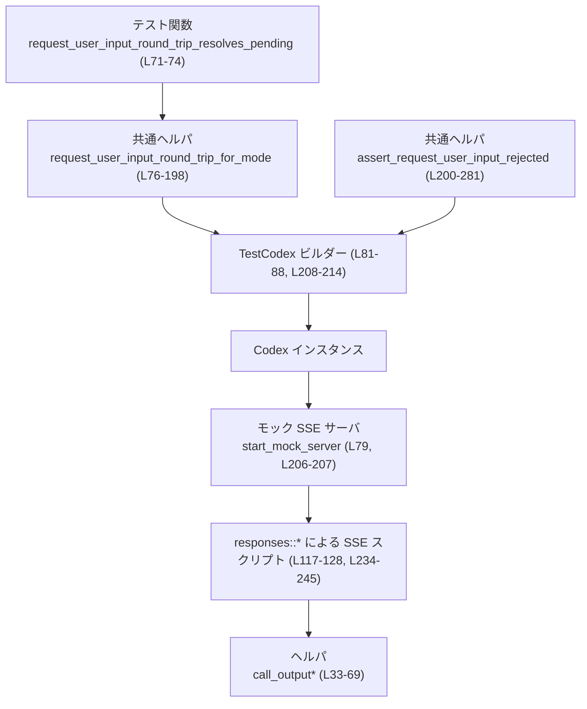
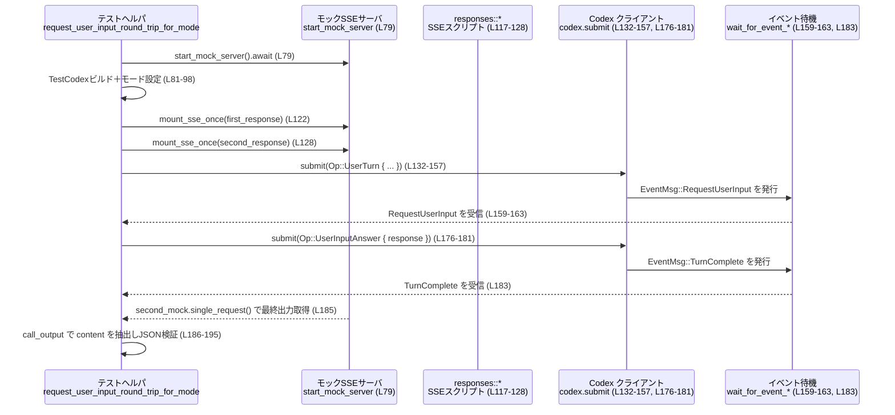
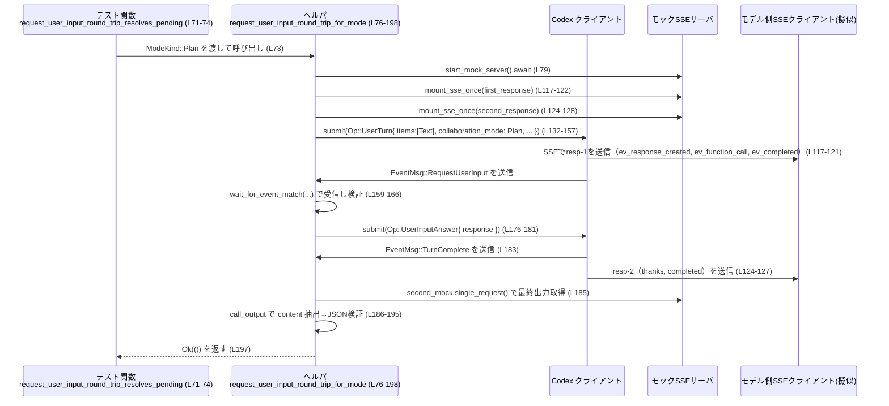

# core/tests/suite/request_user_input.rs コード解説

---

## 0. ざっくり一言

`request_user_input` 機能について、

- **ユーザー入力のリクエスト〜回答〜ターン完了までの往復が動くモード**
- **サポートされていないモードでの拒否動作**

を、Codex 本体＋モックサーバを使った **統合テスト** として検証するファイルです  
（core/tests/suite/request_user_input.rs 全体）。

---

## 1. このモジュールの役割

### 1.1 概要

このテストモジュールは、Codex の `request_user_input` ツール呼び出しに関して、次を検証するために存在します。

- Plan モードおよび「Default モード＋対応フィーチャ有効」のときに、  
  LLM の `request_user_input` 関数呼び出しが **保留状態の解消（ユーザーへの質問→回答→完了）** につながることを確認する  
  （`request_user_input_round_trip_resolves_pending` と `request_user_input_round_trip_for_mode`  
   core/tests/suite/request_user_input.rs:L71-74, L76-198）。
- Execute / Default(デフォルト設定) / PairProgramming モードでは  
  `request_user_input` が **利用不可として拒否される** ことを確認する  
  （`assert_request_user_input_rejected` およびそれを呼ぶ 3 つのテスト  
   core/tests/suite/request_user_input.rs:L200-281, L283-325）。

### 1.2 アーキテクチャ内での位置づけ

このテストは、以下のコンポーネントを組み合わせて動作します。

- `TestCodex`（core_test_support）を使って Codex 本体をテスト用に起動  
  （core/tests/suite/request_user_input.rs:L81-88, L208-214）
- `start_mock_server` ＋ `responses::sse` で外部 API を模した **SSE モックサーバ** を起動  
  （L79, L117-122, L124-128, L206-207, L234-245）
- Codex に `Op::UserTurn` / `Op::UserInputAnswer` を投げる  
  （L132-157, L176-181, L250-267）
- Codex 内部イベント `EventMsg::RequestUserInput` / `EventMsg::TurnComplete` を待つ  
  （L159-163, L183, L270）
- モックサーバに届いたリクエストボディから、ツールの出力 JSON と成功フラグを検査する  
  （`call_output`, `call_output_content_and_success` とその呼び出し  
   L33-48, L50-69, L185-187, L272-277）

これを図にすると、概ね次のような関係になります。



※ `TestCodex` や `responses` 系の実装詳細はこのファイルには含まれていません。

### 1.3 設計上のポイント

コードから読み取れる設計上の特徴は次のとおりです。

- **共通ヘルパ関数による重複排除**
  - `request_user_input_round_trip_for_mode` に「往復（ラウンドトリップ）」のロジックを集約し、  
    実際のテスト関数はモードごとにこのヘルパを呼び分けています（L71-74, L76-198, L309-312）。
  - 拒否パターンも `assert_request_user_input_rejected` に集約し、モード違いだけをパラメータ化しています（L200-281, L283-307, L315-325）。
- **イベント駆動の検証**
  - Codex が発行する `EventMsg::RequestUserInput` と `EventMsg::TurnComplete` を待ち受けて、  
    ユーザー入力の要求とターン完了を検証しています（L159-163, L183, L270）。
- **非同期＋マルチスレッドテスト**
  - すべてのテストは `#[tokio::test(flavor = "multi_thread", worker_threads = 2)]` を利用し、  
    Tokio の**マルチスレッドランタイム**上で実行されます（L71, L283, L296, L309, L314）。
- **ネットワーク前提だがスキップ可能**
  - 実行にネットワークが必要なため、`skip_if_no_network!` マクロを最初に呼び出し、  
    ネットワークが無い環境ではテストをスキップできるようにしています（L77, L204）。

---

## 2. 主要な機能一覧（コンポーネントインベントリー）

### 2.1 関数一覧（コンポーネント）

| 名前 | 種別 | 役割 / 用途 | 位置 |
|------|------|-------------|------|
| `call_output` | 同期ヘルパ関数 | モックサーバに届いたツール呼び出しレスポンスから、`call_id` を検証しつつ **content 文字列のみ** を取り出す | core/tests/suite/request_user_input.rs:L33-48 |
| `call_output_content_and_success` | 同期ヘルパ関数 | 上記に加えて、`success` フラグ（`Option<bool>`）も同時に取得する | core/tests/suite/request_user_input.rs:L50-69 |
| `request_user_input_round_trip_resolves_pending` | 非同期テスト関数 (`tokio::test`) | Plan モードでの `request_user_input` ラウンドトリップが成功し、保留状態が解消されることを確認するエントリポイント | core/tests/suite/request_user_input.rs:L71-74 |
| `request_user_input_round_trip_for_mode` | 非公開 async ヘルパ | 指定された `ModeKind` で Codex を起動し、ユーザー入力のリクエスト〜回答〜ターン完了、最終出力 JSON までを検証する共通ロジック | core/tests/suite/request_user_input.rs:L76-198 |
| `assert_request_user_input_rejected` | 非公開 async ヘルパ（ジェネリック） | 指定モードで `request_user_input` が **利用不可として拒否される** ことを、出力メッセージと `success` フラグの有無で確認する共通ロジック | core/tests/suite/request_user_input.rs:L200-281 |
| `request_user_input_rejected_in_execute_mode_alias` | 非同期テスト関数 (`tokio::test`) | Execute モード別名で拒否されることを `assert_request_user_input_rejected` 経由で確認 | core/tests/suite/request_user_input.rs:L283-294 |
| `request_user_input_rejected_in_default_mode_by_default` | 非同期テスト関数 | デフォルト設定の Default モードでは `request_user_input` が利用不可であることを確認 | core/tests/suite/request_user_input.rs:L296-307 |
| `request_user_input_round_trip_in_default_mode_with_feature` | 非同期テスト関数 | Default モードでも、`Feature::DefaultModeRequestUserInput` を有効にした場合はラウンドトリップが成功することを確認 | core/tests/suite/request_user_input.rs:L309-312 |
| `request_user_input_rejected_in_pair_mode_alias` | 非同期テスト関数 | PairProgramming モード別名で拒否されることを確認 | core/tests/suite/request_user_input.rs:L314-325 |

### 2.2 機能の概要リスト

- `request_user_input` ラウンドトリップ（質問→回答→完了）検証（Plan / Default+feature）  
  - `request_user_input_round_trip_resolves_pending`（L71-74）  
  - `request_user_input_round_trip_for_mode`（L76-198）  
  - `request_user_input_round_trip_in_default_mode_with_feature`（L309-312）
- `request_user_input` 利用不可モードのエラーメッセージ／成功フラグ検証  
  - 共通ヘルパ: `assert_request_user_input_rejected`（L200-281）  
  - Execute / Default(デフォルト) / PairProgramming の 3 モードで呼び分け（L283-294, L296-307, L314-325）
- SSE モックサーバからのツール出力 JSON の検査ヘルパ  
  - `call_output`（L33-48）  
  - `call_output_content_and_success`（L50-69）

---

## 3. 公開 API と詳細解説

このファイルからクレート外に公開される型・関数はありませんが、テストとして重要なヘルパ関数とテスト関数を「公開 API」に準じて解説します。

### 3.1 型一覧（構造体・列挙体など）

このファイル内で新しく定義されている型はありません。

使用している主な外部型のうち、このテストの理解に重要なものだけ列挙します（定義自体は他ファイル）。

| 名前 | 種別 | 役割 / 用途 | 使用箇所 |
|------|------|-------------|----------|
| `ModeKind` | 列挙体 | コラボレーションモード（Plan, Execute, Default, PairProgramming など）を表す | ラウンドトリップ・拒否テスト双方のモード指定（L73, L76, L148, L286, L299, L317） |
| `CollaborationMode` | 構造体 | `mode: ModeKind` と `settings: Settings` をまとめるモード設定 | `Op::UserTurn` 引数内 `collaboration_mode`（L147-154, L248-266） |
| `RequestUserInputAnswer` | 構造体 | 1 つの質問に対する回答（`answers: Vec<String>`）を保持 | ユーザー回答送信時に構築（L171-173） |
| `RequestUserInputResponse` | 構造体 | 複数質問 ID から回答へのマップ全体を表す | `response` として Codex に返送（L168-176, L177-180） |
| `EventMsg` | 列挙体 | Codex からのイベント（`RequestUserInput`, `TurnComplete` など）を表す | `wait_for_event_match`, `wait_for_event` で利用（L159-163, L183, L270） |
| `ResponsesRequest` | 構造体 | モックサーバに届いた HTTP リクエスト情報をラップするテスト用型と思われる | `call_output*` ヘルパの引数（L33, L50, L185, L272） |

※ `ResponsesRequest` や `EventMsg` の詳細定義はこのチャンクには現れません。

---

### 3.2 重要な関数の詳細

#### `call_output(req: &ResponsesRequest, call_id: &str) -> String`（L33-48）

**概要**

- モックサーバに届いたツール呼び出しレスポンスから、
  - `call_id` フィールドが期待値と一致していることを `assert_eq!` で確認し（L35-39）、
  - `function_call_output_content_and_success` の `content` 部分のみを取り出して返す  
  ヘルパ関数です（L40-47）。

**引数**

| 引数名 | 型 | 説明 |
|--------|----|------|
| `req` | `&ResponsesRequest` | モックサーバに届いたリクエストを表すテスト用ラッパー（定義は他ファイル）。ここから JSON ボディを取得します（L34, L40）。 |
| `call_id` | `&str` | 期待するツール呼び出し ID。`raw["call_id"]` と比較されます（L35-38）。 |

**戻り値**

- `String`  
  - ツール呼び出しの `content` 部分（JSON 文字列など）を返します（L44-47）。

**内部処理の流れ**

1. `req.function_call_output(call_id)` で元の出力 JSON を取得（L34）。
2. `raw["call_id"]` を `call_id` 引数と比較し、違えば `assert_eq!` によりテスト失敗（L35-39）。
3. `req.function_call_output_content_and_success(call_id)` を呼び、  
   `(content_opt, _success)` を得る。`None` の場合は `panic!` してテストを失敗させる（L40-43）。
4. `content_opt` が `Some(content)` であればそれを返す。`None` の場合は再度 `panic!` する（L44-47）。

**Examples（使用例）**

この関数は、モックサーバに届いたリクエストからツールの最終出力 JSON を取り出すために使われています。

```rust
// second_mock は responses::mount_sse_once の戻り値（モックサーバ）です（L124-128）。
let req = second_mock.single_request();              // モックサーバに届いた1件目のリクエストを取得（L185）
let output_text = call_output(&req, call_id);        // call_idを検証しつつcontent文字列を取り出す（L186）
let output_json: Value = serde_json::from_str(&output_text)?; // JSONとしてパース（L187）
```

（core/tests/suite/request_user_input.rs:L185-187）

**Errors / Panics**

- `raw["call_id"]` が `call_id` と異なる場合、`assert_eq!` によりテストが失敗します（L35-39）。
- `function_call_output_content_and_success` が `None` を返した場合、
  - 1 回目の `match` で `panic!("function_call_output present")`（L40-43）。
- `content_opt` が `None` の場合も `panic!`（L44-47）。
- いずれも **テストの不変条件が破れたことを検知するための panic** であり、運用コードではなくテスト専用です。

**Edge cases（エッジケース）**

- 対象の `call_id` に対応する出力がモックサーバに届いていない場合:
  - `function_call_output*` が `None` を返し、`panic!` します（L40-43）。
- `call_id` が一致しないレスポンスを渡した場合:
  - `assert_eq!` によるテスト失敗となります（L35-39）。
- `content` が存在しない JSON 形式の場合:
  - `content_opt` が `None` となり `panic!` します（L44-47）。

**使用上の注意点**

- テストヘルパとして設計されており、「条件が満たされなければ即座に panic」という方針です。
- 運用コードから使う前提ではなく、**モックの整合性を強く仮定**しています。

---

#### `call_output_content_and_success(req: &ResponsesRequest, call_id: &str) -> (String, Option<bool>)`（L50-69）

**概要**

- `call_output` とほぼ同じ処理を行いますが、`content` に加えて `success` フラグ（`Option<bool>`）も返します（L60-68）。
- 「ツール呼び出しが成功扱いかどうか」を検証したいテストで使用されます（L272-277）。

**引数**

| 引数名 | 型 | 説明 |
|--------|----|------|
| `req` | `&ResponsesRequest` | モックサーバのリクエストラッパー（L51, L54, L60）。 |
| `call_id` | `&str` | 期待するツール呼び出し ID（L52, L56-58）。 |

**戻り値**

- `(String, Option<bool>)`
  - `String`: ツール呼び出しの出力 `content`（L64-67）。
  - `Option<bool>`: 成功フラグ。`Some(true/false)` か `None`（L60-61, L68）。

**内部処理の流れ**

1. `call_output` と同様に、`raw["call_id"]` と `call_id` を比較し一致を検証（L54-59）。
2. `req.function_call_output_content_and_success(call_id)` を呼んで `(content_opt, success)` を取得（L60-63）。
3. `content_opt` が `Some(content)` であれば `content` を取り出し、`(content, success)` を返す（L64-68）。
4. それ以外は `panic!` でテスト失敗（L62-67）。

**Examples（使用例）**

拒否されるモードのテストで、成功フラグが存在しないことを確認するために使用します。

```rust
let req = second_mock.single_request();                   // モックサーバのリクエスト取得（L272）
let (output, success) = call_output_content_and_success(&req, &call_id); // contentとsuccessの両方取得（L272-273）
assert_eq!(success, None);                                // successフラグが存在しないことを確認（L274）
assert_eq!(
    output,
    format!("request_user_input is unavailable in {mode_name} mode")
);                                                         // モード名を含むエラーメッセージを確認（L275-277）
```

（core/tests/suite/request_user_input.rs:L272-277）

**Errors / Panics**

- `call_output` と同様に、`call_id` 不一致や `content` が存在しない場合は `panic!` または `assert_eq!` によるテスト失敗になります（L54-59, L60-67）。

**Edge cases**

- `success` フラグが JSON に含まれていない場合:
  - `success` は `None` となり、拒否テストではこれを期待値にしています（L274）。
- 成功フラグが `Some(false)` のようなケースの扱いは、このファイル内には登場しません。

**使用上の注意点**

- `success` が `Option<bool>` であるため、「フラグが明示的に `false`」なのか「そもそも存在しない」のかを区別できます。
- テストでは「利用不可」のケースで `None` を期待しています（L274）。

---

#### `request_user_input_round_trip_resolves_pending() -> anyhow::Result<()>`（L71-74）

**概要**

- Plan モードで `request_user_input_round_trip_for_mode(ModeKind::Plan)` を呼び出すだけのテストエントリポイントです（L73）。
- 実際の検証ロジックはすべて `request_user_input_round_trip_for_mode` に委譲されています（L76-198）。

**引数 / 戻り値**

- 引数なし。
- 戻り値は `anyhow::Result<()>`。内部で `?` を使ってエラーを伝播する設計に合わせた形です（L72-74）。

**内部処理の流れ**

1. `request_user_input_round_trip_for_mode(ModeKind::Plan).await` を呼ぶ（L73）。
2. そこで発生したエラーをそのまま呼び出し元（テストランナー）に伝播します。

**Examples / 使用上の注意点**

- 新たなモードで同様のラウンドトリップを検証したい場合のひな型として利用できます。

---

#### `request_user_input_round_trip_for_mode(mode: ModeKind) -> anyhow::Result<()>`（L76-198）

**概要**

- 指定された `mode` に対して、次の一連の流れが正しく動作するかを検証する共通ヘルパです。
  1. モック SSE サーバと Codex テスト環境を構築（L79-88, L97-98）。
  2. モデルからの `request_user_input` 関数呼び出しをモックで送り込む（L117-122）。
  3. Codex が `EventMsg::RequestUserInput` を発行することを確認（L159-166）。
  4. ユーザー回答を `Op::UserInputAnswer` で返し、`TurnComplete` を確認（L168-183）。
  5. 最終ツール出力に回答が JSON で含まれていることを検証（L185-195）。

**引数**

| 引数名 | 型 | 説明 |
|--------|----|------|
| `mode` | `ModeKind` | 検証対象のコラボレーションモード。`ModeKind::Plan` や `ModeKind::Default` など（L76, L90, L147-148）。 |

**戻り値**

- `anyhow::Result<()>`
  - ネットワーク接続・Codex の初期化・イベント待機・JSON パースなど、途中で発生したエラーを `?` で集約しています（L79-98, L132-157, L176-181, L187）。

**内部処理の流れ（アルゴリズム）**

1. ネットワーク前提のため、`skip_if_no_network!(Ok(()))` で事前チェック（L77）。
2. `start_mock_server().await` でモック SSE サーバを起動（L79）。
3. `test_codex()` で `TestCodex` ビルダーを作り、`with_config` により  
   `mode == ModeKind::Default` の場合のみ `Feature::DefaultModeRequestUserInput` を有効化（L81-96）。
4. `builder.build(&server).await?` で Codex テスト環境を構築し、`TestCodex { codex, cwd, session_configured, .. }` を得る（L83-88, L97-98）。
5. `call_id` と、`questions` 配列を持つ `request_args` JSON を作成し文字列化（L100-115）。
6. 1 回目の SSE レスポンスとして、
   - `ev_response_created("resp-1")`
   - `ev_function_call(call_id, "request_user_input", &request_args)`
   - `ev_completed("resp-1")`  
   を `sse(vec![...])` で構成し、`responses::mount_sse_once` によりサーバにマウント（L117-122）。
7. 2 回目の SSE レスポンスとして、
   - アシスタントメッセージ `"thanks"`
   - `resp-2` の完了イベント  
   を構成し、`second_mock` ハンドルを取得（L124-128）。
8. `session_configured.model.clone()` から `session_model` を取得（L130）。
9. `codex.submit(Op::UserTurn { ... }).await?` を呼び、ユーザー入力 `"please confirm"` とモード設定を渡す（L132-157）。
10. `wait_for_event_match` で `EventMsg::RequestUserInput` が来るまで待ち、`request` を取り出す（L159-163）。
11. `request.call_id == call_id`、`request.questions.len() == 1`、`request.questions[0].is_other == true` を `assert_eq!` で検証（L164-166）。
12. `answers` という `HashMap<String, RequestUserInputAnswer>` を作り、  
    `"confirm_path"` に `"yes"` の回答を設定（L168-174）。
13. `RequestUserInputResponse { answers }` を `Op::UserInputAnswer` に包み、`codex.submit` で送信（L175-180）。
14. `wait_for_event` で `EventMsg::TurnComplete` を待つ（L183）。
15. `second_mock.single_request()` でモックサーバに届いたリクエストを取り出し、  
    `call_output` を使って `output_text` を取得、`serde_json::from_str` で `Value` にパース（L185-187）。
16. `output_json` が  
    `{"answers": {"confirm_path": { "answers": ["yes"] } }}` と一致することを `assert_eq!` で確認（L188-195）。
17. `Ok(())` を返して終了（L197）。

**データフロー図（ラウンドトリップ）**

以下は Plan/Default モードでのラウンドトリップ全体を表した sequence diagram です。



**Errors / Panics**

- ネットワーク未使用環境では `skip_if_no_network!(Ok(()))` により、早期に `Ok(())` が返されると推測できますが、マクロの詳細はこのチャンクには現れません（L77）。
- Codex の初期化や `codex.submit`、`wait_for_event_*` などから返るエラーは `?` で `anyhow::Error` にラップされ、テスト失敗となります（L79-98, L132-157, L176-181, L187）。
- `assert_eq!` による条件チェックが失敗した場合、いずれもテスト失敗になります（L164-166, L188-195）。

**Edge cases（エッジケース）**

- `EventMsg::RequestUserInput` が発生しない場合:
  - `wait_for_event_match` がどのように振る舞うか（タイムアウトなど）はこのチャンクからは不明です（L159-163）。
- `RequestUserInput` の `questions` が 1 件でない場合:
  - `assert_eq!(request.questions.len(), 1)` が失敗しテストも失敗します（L165）。
- 実際の回答 JSON の変形:
  - `"confirm_path"` 以外のキー名だったり `"yes"` 以外の回答だった場合、最終 `assert_eq!` が失敗します（L188-195）。

**使用上の注意点**

- `mode == ModeKind::Default` のときのみ `Feature::DefaultModeRequestUserInput` を有効化するため、  
  Default モードのラウンドトリップ検証にはこの条件が重要です（L90-95, L309-312）。
- `SandboxPolicy::DangerFullAccess` を使用しているため、サンドボックス制限はテストしていません（L142）。

---

#### `assert_request_user_input_rejected<F>(mode_name: &str, build_mode: F) -> anyhow::Result<()>`（L200-281）

**概要**

- 「指定されたコラボレーションモードでは `request_user_input` が利用できない」という振る舞いを、  
  エラーメッセージと `success` フラグの非存在 (`None`) によって確認する共通ヘルパです（L216-218, L274-277）。
- `build_mode` クロージャによって `CollaborationMode` を生成し、モードごとの差異を抽象化しています（L200-203, L247-248）。

**引数**

| 引数名 | 型 | 説明 |
|--------|----|------|
| `mode_name` | `&str` | 期待されるモード名文字列。エラーメッセージ `"request_user_input is unavailable in {mode_name} mode"` の一部として使用されます（L217, L275-277）。 |
| `build_mode` | `F` (`FnOnce(String) -> CollaborationMode`) | `session_model` を受け取り、対応する `CollaborationMode` を構築するクロージャ（L200-203, L247-248）。 |

**戻り値**

- `anyhow::Result<()>`  
  - モックサーバや Codex 起動、イベント待機などでエラーが起きた場合に `?` で伝播します（L206-207, L208-214, L250-268）。

**内部処理の流れ**

1. `skip_if_no_network!(Ok(()))` により、ネットワークが必須であることを前提としたスキップ機構を呼び出し（L204）。
2. `start_mock_server().await` でモック SSE サーバを起動（L206-207）。
3. `test_codex()` で `TestCodex` ビルダーを作成し、`builder.build(&server).await?` で Codex テスト環境を構築（L208-214）。
4. `mode_name` を小文字・スペースを `-` に変換して `mode_slug` を作り、`call_id` に組み込む（L216-217）。
5. `request_args` JSON（質問や選択肢を含む）を構築し文字列化（L218-232）。
6. 1 回目の SSE レスポンスとして `request_user_input` ツール呼び出しを含むレスポンスをマウント（L234-239）。
7. 2 回目の SSE レスポンスとして `"thanks"` メッセージと完了イベントをマウントし `second_mock` を取得（L241-245）。
8. `session_model` を取得し、`build_mode(session_model.clone())` で `collaboration_mode` を生成（L247-248）。
9. `codex.submit(Op::UserTurn { collaboration_mode: Some(collaboration_mode), ... })` を送信（L250-267）。
10. `wait_for_event` で `EventMsg::TurnComplete` を待ち、`RequestUserInput` が発生しないことを間接的に前提としているように見えますが、  
    正確な動作はこのチャンクからは分かりません（L270）。
11. `second_mock.single_request()` でモックサーバのリクエストを取得し、`call_output_content_and_success` で `(output, success)` を得る（L272-273）。
12. `assert_eq!(success, None)` により、成功フラグが存在しないことを確認（L274）。
13. `output == format!("request_user_input is unavailable in {mode_name} mode")` を検証（L275-277）。
14. `Ok(())` を返す（L280）。

**Errors / Panics**

- ネットワーク環境が無い場合、`skip_if_no_network!` によりスキップされると推測できます（L204）。
- Codex 初期化や `codex.submit`、`wait_for_event` からのエラーは `?` によりテスト失敗になります（L208-214, L250-268, L270）。
- `assert_eq!(success, None)` または `assert_eq!(output, ...)` が失敗するとテスト失敗です（L274-277）。

**Edge cases**

- `request_user_input` が本来は利用可能なモードでこのヘルパを使った場合:
  - モックの構成次第ですが、`success` が `Some(true)` などになり、`assert_eq!(success, None)` が失敗すると考えられます（L274）。
- エラーメッセージの文字列にモード名が含まれない場合:
  - `format!("request_user_input is unavailable in {mode_name} mode")` との不一致でテスト失敗となります（L275-277）。

**使用上の注意点**

- `mode_name` はユーザー向けメッセージの一部としてそのまま使われるため、  
  テストでは `"Execute"`, `"Default"`, `"Pair Programming"` など実際に表示される文字列を渡しています（L285, L298, L316）。
- `build_mode` は `session_model` を受け取り、`CollaborationMode` を構築する責務のみを持ちます（L285-292, L298-305, L316-323）。

---

#### `request_user_input_rejected_in_execute_mode_alias() -> anyhow::Result<()>`（L283-294）

**概要**

- Execute モードの別名において `request_user_input` が利用不可であることを、  
  `assert_request_user_input_rejected("Execute", ...)` を通じて検証するテストです（L285-292）。

**内部処理**

1. `assert_request_user_input_rejected("Execute", |model| CollaborationMode { ... }).await` を呼ぶ（L285-293）。
2. `build_mode` クロージャでは `mode: ModeKind::Execute`、`settings.model = model` に設定（L286-291）。

**Errors / Panics・Edge cases**

- すべて `assert_request_user_input_rejected` に委譲されます（L200-281）。

---

#### `request_user_input_round_trip_in_default_mode_with_feature() -> anyhow::Result<()>`（L309-312）

**概要**

- Default モードでも、`Feature::DefaultModeRequestUserInput` を有効にした場合はラウンドトリップが成功することを確認するテストです（L90-95, L309-312）。

**内部処理**

1. `request_user_input_round_trip_for_mode(ModeKind::Default).await` を呼ぶだけの薄いラッパです（L311）。

**注意点**

- `request_user_input_round_trip_for_mode` 側で  
  `if mode == ModeKind::Default { ... .enable(Feature::DefaultModeRequestUserInput) }` を行っていることが前提となります（L90-95）。

---

### 3.3 その他の関数

| 関数名 | 役割（1 行） | 位置 |
|--------|--------------|------|
| `request_user_input_rejected_in_default_mode_by_default` | Default モード（フィーチャ無効）で `request_user_input` が拒否されることを `assert_request_user_input_rejected("Default", ...)` で確認するテスト | core/tests/suite/request_user_input.rs:L296-307 |
| `request_user_input_rejected_in_pair_mode_alias` | PairProgramming モード別名で `request_user_input` が拒否されることを確認するテスト | core/tests/suite/request_user_input.rs:L314-325 |

---

## 4. データフロー

ここでは、最も代表的なシナリオである「Plan モードでのラウンドトリップ」のデータフローを整理します。

### 4.1 ラウンドトリップシナリオ

- テスト関数 `request_user_input_round_trip_resolves_pending` が `request_user_input_round_trip_for_mode(ModeKind::Plan)` を呼ぶ（L71-74）。
- その中で Codex への `Op::UserTurn` 送信 → `EventMsg::RequestUserInput` 受信 → `Op::UserInputAnswer` → `EventMsg::TurnComplete` → 最終ツール出力取得、という流れが実行されます（L132-183, L185-195）。



※ `Client`（モデル側 SSE クライアント）の実装詳細は core_test_support にありますが、このチャンクには現れません。

---

## 5. 使い方（How to Use）

このファイル自体はテストモジュールですが、**新しいモードやケースを検証するテストを書くときのパターン**として利用できます。

### 5.1 基本的な使用方法（新しいモードでラウンドトリップを検証する場合）

`request_user_input_round_trip_for_mode` を呼ぶ薄いテスト関数を追加するのが基本パターンです。

```rust
#[tokio::test(flavor = "multi_thread", worker_threads = 2)]
async fn request_user_input_round_trip_in_new_mode() -> anyhow::Result<()> {
    // 新しい ModeKind::NewMode が追加されたと仮定した例
    request_user_input_round_trip_for_mode(ModeKind::NewMode).await
}
```

- 追加したモードが `Default` のように特別なフィーチャを必要とする場合は、  
  `with_config` 内（L89-96）の条件を拡張する必要があるかどうかを検討することになります。

### 5.2 拒否パターンの追加

新しいモードで「request_user_input は利用不可であるべき」という仕様がある場合は、  
`assert_request_user_input_rejected` を使って同様のテストを書くことができます。

```rust
#[tokio::test(flavor = "multi_thread", worker_threads = 2)]
async fn request_user_input_rejected_in_new_mode() -> anyhow::Result<()> {
    assert_request_user_input_rejected("New Mode", |model| CollaborationMode {
        mode: ModeKind::NewMode,
        settings: Settings {
            model,                     // テストで使用するモデル名（L286, L299, L317）
            reasoning_effort: None,
            developer_instructions: None,
        },
    }).await
}
```

### 5.3 よくある使用パターン

- **ポジティブケース（利用可能）**
  - `request_user_input_round_trip_for_mode` を使う（L71-74, L309-312）。
- **ネガティブケース（利用不可）**
  - `assert_request_user_input_rejected` を使う（L283-294, L296-307, L314-325）。

### 5.4 よくある間違いと注意点（まとめ）

- **Default モードのフィーチャ設定を忘れる**
  - ポジティブなラウンドトリップテストで Default モードを使う場合、  
    `Feature::DefaultModeRequestUserInput` を有効にしていないと `assert_request_user_input_rejected` 側の挙動になってしまう可能性があります（L90-95, L309-312）。
- **`call_id` の不一致**
  - モック SSE で設定した `call_id` と `call_output*` に渡す `call_id` が異なると、`assert_eq!` が失敗します（L35-39, L54-59, L117-120, L234-237, L186, L272-273）。
- **イベント待機の前提**
  - `wait_for_event_match` や `wait_for_event` がどのようなタイムアウトや失敗パターンを持つかはこのチャンクには現れません。  
    長時間ブロックする可能性がある場合、テスト全体のタイムアウト設定も考慮が必要です（L159-163, L183, L270）。

---

## 6. 変更の仕方（How to Modify）

### 6.1 新しい機能（モードやパターン）を追加する場合

1. **ポジティブなラウンドトリップを追加したい場合**
   - `ModeKind` に新しいモードが定義されている前提で、  
     `request_user_input_round_trip_for_mode` を呼ぶテスト関数を追加します（L71-74, L309-312）。
   - 必要に応じて `with_config` の中でフィーチャを有効化する条件を追加します（L89-96）。

2. **利用不可モードを追加したい場合**
   - `assert_request_user_input_rejected` を用いて、`mode_name` と `build_mode` クロージャを渡すテストを追加します（L283-294, L296-307, L314-325）。
   - メッセージ `"request_user_input is unavailable in {mode_name} mode"` に現れる文字列と UI 仕様が一致しているかを確認します（L275-277）。

### 6.2 既存の機能を変更する場合の注意点

- **コントラクト（前提条件）**
  - `request_user_input_round_trip_for_mode` は、  
    「1 回の `RequestUserInput` イベントが発生し、質問は 1 件、`is_other == true`」という前提で動作します（L164-166）。  
    質問の仕様が変わる場合は、ここを合わせて更新する必要があります。
  - `assert_request_user_input_rejected` は、  
    「`success` フラグが存在せず、特定のエラーメッセージ文字列が返る」ことを前提としています（L274-277）。

- **影響範囲の確認**
  - `Feature::DefaultModeRequestUserInput` の挙動を変更する場合、  
    Default モード関連の 2 つのテスト（L296-307, L309-312）の期待値も見直す必要があります。
  - `call_output*` の仕様を変更する場合、他のテストモジュールでも再利用されている可能性があるため、  
    `core_test_support::responses` 周辺を参照する必要があります。

---

## 7. 関連ファイル

このテストが依存している主な他ファイル・モジュールは次のとおりです（いずれも定義はこのチャンクには現れません）。

| パス / モジュール | 役割 / 関係 |
|-------------------|------------|
| `core_test_support::test_codex` | `TestCodex` 型と `test_codex()` ビルダーを提供し、Codex 本体をテスト用に起動するユーティリティです（L25-26, L81-88, L208-214）。 |
| `core_test_support::responses` | SSE ベースのモックレスポンスを組み立てるヘルパ群（`sse`, `ev_response_created`, `ev_function_call`, `ev_assistant_message`, `ev_completed`, `mount_sse_once`）を提供します（L16-23, L117-128, L234-245）。 |
| `core_test_support::wait_for_event` / `wait_for_event_match` | Codex が発行する `EventMsg` を待ち受ける非同期ヘルパです（L27-28, L159-163, L183, L270）。 |
| `codex_protocol::request_user_input` | `RequestUserInputAnswer`, `RequestUserInputResponse` など、ユーザー入力リクエスト・レスポンスの型定義を提供します（L13-14, L171-176）。 |
| `codex_protocol::config_types` | `ModeKind`, `CollaborationMode`, `Settings` などコラボレーションモード関連の型を提供します（L6-8, L147-154, L200-203, L285-292, L298-305, L316-323）。 |
| `codex_protocol::protocol` | `Op`, `EventMsg`, `AskForApproval`, `SandboxPolicy` など Codex の基本プロトコル型を提供します（L9-12, L132-157, L176-181, L200-203, L250-267）。 |
| `core_test_support::skip_if_no_network` | ネットワーク利用不可時にテストをスキップするためのマクロです（L24, L77, L204）。 |

このファイルは、これらのコンポーネントを組み合わせて `request_user_input` の挙動を、  
**モード別に体系的に検証する統合テストスイート** となっています。
