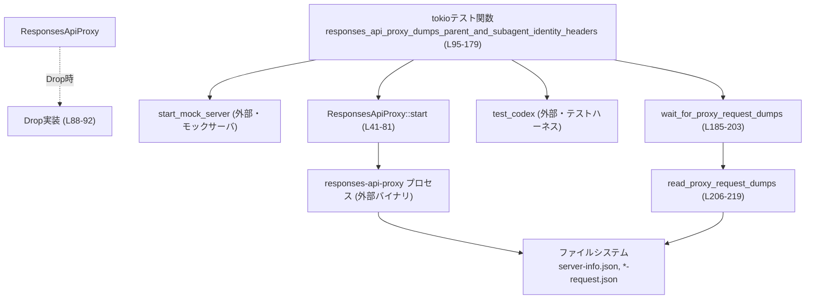
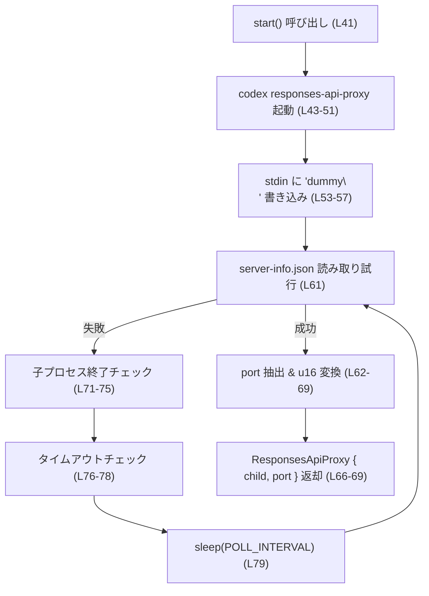
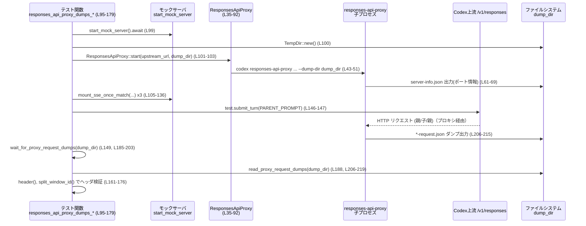

# core/tests/suite/responses_api_proxy_headers.rs コード解説

## 0. ざっくり一言

`responses-api-proxy` 実プロセスを起動し、親エージェント／サブエージェントからのリクエストが  
期待どおりのヘッダ（ウィンドウ ID・スレッド ID・サブエージェント識別子）を付与されているかを  
HTTP リクエストダンプ経由で検証する統合テストです。  

---

## 1. このモジュールの役割

### 1.1 概要

- このテストモジュールは、外部プロセス `responses-api-proxy` を立ち上げ、そのプロキシ経由で Codex の Responses API を呼び出したときに、
  - 親エージェントのリクエスト
  - サブエージェントのリクエスト  
 それぞれに付くヘッダ値が正しいことを検証します（`responses_api_proxy_headers.rs:L29-33`, `L95-179`）。
- 検証対象のヘッダは主に以下です（`L161-176`）。
  - `x-codex-window-id`（スレッド ID + 世代）
  - `x-openai-subagent`（サブエージェントの種類）
  - `x-codex-parent-thread-id`（親スレッド ID）

### 1.2 アーキテクチャ内での位置づけ

このテストがどのコンポーネントとどのように関わるかを簡略化して図示します。



- テスト関数 `responses_api_proxy_dumps_parent_and_subagent_identity_headers` が中心で、モックサーバ起動、プロキシプロセス起動、Codex テストハーネスの構築、ダンプファイルの読み出しまでを一貫して行います（`L95-179`）。
- `ResponsesApiProxy` 構造体は、`responses-api-proxy` 子プロセスの起動と終了管理をカプセル化します（`L35-38`, `L40-92`）。
- ダンプファイルの検査には `wait_for_proxy_request_dumps` および `read_proxy_request_dumps` が使われます（`L185-203`, `L206-219`）。

### 1.3 設計上のポイント

コードから読み取れる設計上の特徴は次のとおりです。

- **外部プロセス管理のカプセル化**  
  - `ResponsesApiProxy` が `std::process::Child` を保持し（`L35-38`）、`start` で起動、`Drop` 実装で kill + wait を行うことで、テスト終了時のプロセスリークを防いでいます（`L88-92`）。
- **ポーリングによる起動完了待ち**  
  - プロキシ起動完了は `server-info.json` をファイルシステムから読み取れるかどうかで判定し、タイムアウトを設けたループでポーリングしています（`L59-80`）。
- **ファイルベースの観測性**  
  - プロキシが吐き出す `*-request.json` ダンプファイルを読み、HTTP リクエストのヘッダ／ボディを検査する形で「見える化」しています（`L185-203`, `L206-224`, `L226-232`）。
- **Rust のエラーハンドリング／安全性**  
  - すべての主要な関数は `anyhow::Result` を返し、エラーは `?` で伝播します（例: `L41`, `L95`, `L185`）。
  - `header` 関数はライフタイム `'a` を明示し、JSON 値から借用した文字列への参照を安全に返しています（`L226-232`）。
- **並行性・非同期との併用**  
  - テストは `#[tokio::test(flavor = "multi_thread", worker_threads = 2)]` で非同期ランタイム上にありつつ、内部では同期的なファイル I/O と `std::thread::sleep` を使う部分もあります（`L59-80`, `L185-203`）。
  - ブロッキングな待機ですが、テスト用途のため限定的な時間（最大数秒）にとどまっています。

---

## 2. 主要な機能一覧（コンポーネントインベントリー）

### 2.1 機能レベルでの一覧

- Responses API プロキシ起動 (`ResponsesApiProxy::start`)
- プロキシのベース URL 生成 (`ResponsesApiProxy::base_url`)
- 親エージェント／サブエージェントのヘッダ検証（tokio テスト関数）
- プロキシのリクエストダンプが揃うまでの待機と取得
- ダンプファイルからのヘッダ／ボディ抽出・検索
- ウィンドウ ID ヘッダ（`thread_id:generation`）のパース

### 2.2 型・関数コンポーネント一覧（行番号付き）

| 名前 | 種別 | 役割 / 用途 | 定義位置 |
|------|------|-------------|----------|
| `PARENT_PROMPT` | 定数 `&'static str` | 親エージェントに与えるプロンプト文言 | `responses_api_proxy_headers.rs:L29` |
| `CHILD_PROMPT` | 定数 `&'static str` | サブエージェントに与えるプロンプト文言 | `L30` |
| `SPAWN_CALL_ID` | 定数 `&'static str` | spawn 呼び出しのコール ID | `L31` |
| `PROXY_START_TIMEOUT` | 定数 `Duration` | プロキシ起動待ちのタイムアウト | `L32` |
| `PROXY_POLL_INTERVAL` | 定数 `Duration` | 起動・ダンプ待ちのポーリング間隔 | `L33` |
| `ResponsesApiProxy` | 構造体 | `responses-api-proxy` 子プロセスとポート番号の保持 | `L35-38` |
| `ResponsesApiProxy::start` | 関数（関連関数） | プロキシプロセスを起動し、ポート情報を取得 | `L41-81` |
| `ResponsesApiProxy::base_url` | メソッド | プロキシのベース URL を組み立てる | `L83-85` |
| `impl Drop for ResponsesApiProxy` | Drop 実装 | テスト終了時に子プロセスを kill + wait | `L88-92` |
| `responses_api_proxy_dumps_parent_and_subagent_identity_headers` | 非同期テスト関数 | 親／子リクエストのヘッダ一式を検証するメインシナリオ | `L95-179` |
| `request_body_contains` | 関数 | wiremock リクエストボディに特定文字列が含まれるか判定 | `L181-183` |
| `wait_for_proxy_request_dumps` | 関数 | 所定条件を満たすまでダンプファイルをポーリングして取得 | `L185-203` |
| `read_proxy_request_dumps` | 関数 | ダンプディレクトリから `*-request.json` を読み込み JSON ベクタにする | `L206-219` |
| `dump_body_contains` | 関数 | ダンプ JSON の `"body"` に文字列が含まれるか判定 | `L221-224` |
| `header` | 関数 | ダンプ JSON から指定ヘッダ値を `Option<&str>` で取得 | `L226-232` |
| `split_window_id` | 関数 | `thread_id:generation` 形式の文字列を分割して世代を `u64` として返す | `L234-238` |

---

## 3. 公開 API と詳細解説

このファイル自体はテスト用で外部クレートに公開される API はありませんが、  
テストシナリオの中核となる関数・型を「公開インターフェース」とみなして説明します。

### 3.1 型一覧

| 名前 | 種別 | 役割 / 用途 | 主なフィールド | 定義位置 |
|------|------|-------------|----------------|----------|
| `ResponsesApiProxy` | 構造体 | `responses-api-proxy` 子プロセスのハンドルとポート番号を保持するテスト用ユーティリティ | `child: Child`, `port: u16` | `L35-38` |

---

### 3.2 重要な関数・メソッドの詳細

#### `ResponsesApiProxy::start(upstream_url: &str, dump_dir: &Path) -> Result<Self>`

**概要**

- Codex の `responses-api-proxy` サブコマンドを子プロセスとして起動し、  
  起動完了後にポート番号を取得して `ResponsesApiProxy` インスタンスを返します（`L41-81`）。

**引数**

| 引数名 | 型 | 説明 |
|--------|----|------|
| `upstream_url` | `&str` | プロキシが転送先とする上流 Responses API の URL（例: `http://mock/v1/responses`） |
| `dump_dir` | `&Path` | プロキシが `server-info.json` や `*-request.json` を出力するディレクトリ |

**戻り値**

- `Result<ResponsesApiProxy>`  
  - 成功時: 子プロセスとポート番号を含む `ResponsesApiProxy`。
  - 失敗時: `anyhow::Error`（プロセス起動失敗、JSON パース失敗、タイムアウト等）。

**内部処理の流れ**

1. `dump_dir.join("server-info.json")` で起動情報ファイルのパスを決定（`L42`）。
2. `StdCommand::new(codex_utils_cargo_bin::cargo_bin("codex")?)` で `codex` バイナリを探し、  
   `responses-api-proxy --server-info <path> --upstream-url <upstream_url> --dump-dir <dump_dir>` を起動（`L43-51`）。
3. 子プロセスの `stdin` を取得し、`"dummy\n"` を書き込む（`L53-57`）。
4. `deadline = now + PROXY_START_TIMEOUT` を計算（`L59`）。
5. ループで以下を繰り返す（`L60-80`）。
   - `server-info.json` が読めたら JSON をパースし、`port` フィールドを `u16` に変換（`L61-69`）。
   - 子プロセスが終了していたら、エラーとして終了（`L71-75`）。
   - タイムアウトを過ぎたらエラーで終了（`L76-78`）。
   - それ以外の場合は `std::thread::sleep(PROXY_POLL_INTERVAL)` で短時間休止（`L79`）。



**Examples（使用例）**

テスト関数内での実際の利用例です（`L99-103`）。

```rust
// モックサーバの /v1/responses を上流として設定する                       // L99-103 付近
let server = start_mock_server().await;
let dump_dir = TempDir::new()?;
let proxy = ResponsesApiProxy::start(
    &format!("{}/v1/responses", server.uri()),
    dump_dir.path(),
)?;
```

**Errors / Panics**

- エラー (`Err`) になり得る条件（`L41-81`）:
  - `codex_utils_cargo_bin::cargo_bin("codex")` で `codex` バイナリが見つからない。
  - `StdCommand::new(...).spawn()` に失敗した場合。
  - `child.stdin.take()` が `None`（パイプされていない）で `"responses-api-proxy stdin was not piped"` エラー（`L53-57`）。
  - `server-info.json` の読み込み失敗や JSON パース失敗。
  - JSON に `"port"` フィールドが無い、または数値でない（`"proxy server info missing port"`、`L62-65`）。
  - `port` が `u16` に収まらず `u16::try_from` が失敗（`L68`）。
  - 子プロセスが `server-info.json` を書く前に終了した (`"responses-api-proxy exited before writing server info"`, `L71-75`)。
  - タイムアウトまで `server-info.json` が生成されない (`"timed out waiting for responses-api-proxy"`, `L76-78`)。

- パニック要因はこの関数内にはありません（すべて `Result` 経由）。

**Edge cases（エッジケース）**

- `dump_dir` が存在しない・書き込み不可の場合  
  - `server-info.json` が生成されず、起動待ちループがタイムアウトエラーを返す可能性があります（`L76-78`）。
- `server-info.json` の内容が壊れている場合  
  - JSON パースや `"port"` 取得に失敗し、エラーとして返されます（`L62-65`）。
- 子プロセスがすぐ終了した場合  
  - `try_wait` で終了検知され、即座にエラーを返します（`L71-75`）。

**使用上の注意点**

- テスト中にのみ使用する前提のユーティリティであり、本番コードから使う設計にはなっていません。
- 起動完了判定にファイルの存在を使っているため、ファイルシステムが遅い環境ではタイムアウト値調整が必要になる場合があります（`L59-80`）。
- `std::thread::sleep` を使うため、非同期コンテキストで連続呼び出しするとスレッドブロックが増えます（`L79`）。

---

#### `ResponsesApiProxy::base_url(&self) -> String`

**概要**

- プロキシのポート番号から、テスト用のベース URL（`http://127.0.0.1:<port>/v1`）を組み立てます（`L83-85`）。

**引数**

| 引数名 | 型 | 説明 |
|--------|----|------|
| `&self` | `&ResponsesApiProxy` | プロキシインスタンス |

**戻り値**

- `String` — プロキシのベース URL。テストではこれを `config.model_provider.base_url` に設定しています（`L138-144`）。

**使用例**

```rust
let proxy_base_url = proxy.base_url();                 // L138
let mut builder = test_codex().with_config(move |config| {
    config.model_provider.base_url = Some(proxy_base_url.clone());
});
```

※ 実コードでは `move` クロージャ内でムーブしているため、再利用には `clone` 等が必要です（`L138-145`）。

**Edge cases / 注意点**

- `port` が有効なポート（0〜65535）である前提です。これは `start` で `u16` に制限されているため保証されています（`L68`）。

---

#### `async fn responses_api_proxy_dumps_parent_and_subagent_identity_headers() -> Result<()>`

**概要**

- Tokio 上で動く非同期テスト関数です（`L95`）。
- モックサーバ + `responses-api-proxy` + Codex テストハーネスを組み合わせ、親・子リクエストのヘッダとウィンドウ ID の関係を検証します（`L95-179`）。

**引数**

- 無し（テスト関数のため）。

**戻り値**

- `Result<()>` — 失敗時には `anyhow::Error` を返し、テストが失敗します。

**内部処理の流れ**

1. `skip_if_no_network!(Ok(()));` でネットワークが利用できない環境ではテストをスキップ（`L97`）。
2. モック server を起動し、ダンプ用一時ディレクトリを作成（`L99-100`）。
3. `ResponsesApiProxy::start` でプロキシプロセスを起動（`L101-103`）。
4. 子エージェント用 spawn 引数 JSON を構築（`L104`）。
5. `mount_sse_once_match` で 3 つの SSE シナリオをモックサーバに設定（`L105-136`）:
   - 親 1 回目の応答 + spawn 関数呼び出し (`PARENT_PROMPT` を含むリクエストマッチ, `L105-114`)。
   - 子エージェントからの応答 (`CHILD_PROMPT` を含み `SPAWN_CALL_ID` を含まないリクエストマッチ, `L115-126`)。
   - 親 2 回目の応答 (`SPAWN_CALL_ID` を含むリクエストマッチ, `L127-136`)。
6. プロキシ URL を Codex 設定の `model_provider.base_url` に設定し、リクエスト圧縮機能を無効化（`L138-145`）。
7. テストハーネスを構築し、`PARENT_PROMPT` を送信（`L146-147`）。
8. `wait_for_proxy_request_dumps` でプロキシのリクエストダンプが揃うまで待機し取得（`L149`）。
9. ダンプの中から
   - 親リクエスト（ボディに `PARENT_PROMPT` を含むもの, `L150-153`）と
   - 子リクエスト（ボディに `CHILD_PROMPT` を含み `SPAWN_CALL_ID` を含まないもの, `L154-159`）
   を抽出。
10. 両者の `x-codex-window-id` ヘッダを取得し `split_window_id` で分解（`L161-166`）。
11. 以下を `assert` で検証（`L168-176`）。
    - 親・子とも `generation == 0`。
    - 親と子の `thread_id` が異なる。
    - 親には `x-openai-subagent` ヘッダが無く、子には `"collab_spawn"` が付いている。
    - 子の `x-codex-parent-thread-id` が親の `thread_id` と一致する。

**Examples（使用例）**

この関数自体がテスト使用例なので、別の例はありません。  
同様のパターンで別のヘッダを検証するテストを追加する場合の雛形として利用できます。

**Errors / Panics**

- `?` による `Err` 伝播:
  - モックサーバ起動失敗（`start_mock_server().await`, `L99`）。
  - 一時ディレクトリ作成失敗（`TempDir::new()`, `L100`）。
  - プロキシ起動失敗（`ResponsesApiProxy::start`, `L101-103`）。
  - JSON シリアライズ失敗（`serde_json::to_string`, `L104`）。
  - Codex テストハーネス構築・実行 (`builder.build`, `test.submit_turn`, `L146-147`)。
  - ダンプの取得失敗（`wait_for_proxy_request_dumps`, `L149`）。
  - `split_window_id` 内のパース失敗（`L165-166`）。
- `anyhow!("missing ...")` によりテスト失敗:
  - 親／子リクエストダンプが見つからない（`L150-159`）。
  - `x-codex-window-id` ヘッダが存在しない（`L161-164`）。
- パニック:
  - `config.features.disable(...).expect("test config should allow feature update")` が `Err` を返した場合にパニックします（`L141-144`）。テスト設定が想定どおりであることを前提にしています。

**Edge cases（エッジケース）**

- プロキシが 3 件以上のリクエストダンプを出力しない場合:
  - `wait_for_proxy_request_dumps` がタイムアウトし、エラーとなります（`L185-203`）。
- ダンプに `PARENT_PROMPT`／`CHILD_PROMPT` の両方を含むリクエストがある場合:
  - フィルタ条件上、どちらの `find` にもヒットする可能性がありますが、テスト上は親・子のリクエストは明確に分かれている前提です（`L150-159`）。
- ネットワークや外部バイナリが利用できない環境:
  - `skip_if_no_network!` によりネットワーク不可時にはスキップされますが、`codex` バイナリが無い場合などはエラーとして失敗します。

**使用上の注意点（言語固有の観点を含む）**

- 非同期テスト (`#[tokio::test]`) でありながら、内部では同期的な I/O と `std::thread::sleep` を使用しています。  
  - Tokio マルチスレッドランタイム上なので致命的ではありませんが、テストの実行スレッドをブロックする点に注意が必要です（`L59-80`, `L185-203`）。
- 所有権まわり:
  - `proxy_base_url` は `move` クロージャで `with_config` にキャプチャされます（`L138-145`）。  
    他で再利用したい場合は `clone` 等で分割する必要があります。
- 並行安全性:
  - ファイルアクセスは単一テスト内で行われ、`TempDir` により専用ディレクトリが確保されるため、他テストとのファイル名衝突は回避されています（`L100`, `L206-219`）。

---

#### `wait_for_proxy_request_dumps(dump_dir: &Path) -> Result<Vec<Value>>`

**概要**

- 指定ディレクトリ内のプロキシリクエストダンプをポーリングし、  
  「3 件以上存在し、そのうち 1 件以上が `CHILD_PROMPT` を含む」状態になるまで待機してから全ダンプを返します（`L185-203`）。

**引数**

| 引数名 | 型 | 説明 |
|--------|----|------|
| `dump_dir` | `&Path` | プロキシがダンプファイルを出力するディレクトリ |

**戻り値**

- `Result<Vec<Value>>` — 条件成立時にダンプ JSON のベクタを返します。  
  タイムアウト時には `Err(anyhow!(...))` を返します。

**内部処理の流れ**

1. `deadline = Instant::now() + Duration::from_secs(2)` で 2 秒のタイムアウトを設定（`L186`）。
2. 無限ループ内で以下を行う（`L187-203`）。
   - `read_proxy_request_dumps(dump_dir).unwrap_or_default()` でダンプを読み込む（読み込みエラー時は空ベクタとして扱う, `L188`）。
   - `dumps.len() >= 3` かつ `dump_body_contains(dump, CHILD_PROMPT)` を満たすダンプが存在すれば `Ok(dumps)` を返す（`L189-194`）。
   - `deadline` を過ぎていればタイムアウトエラーを返す（`L196-200`）。
   - そうでなければ `std::thread::sleep(PROXY_POLL_INTERVAL)` で少し待つ（`L202`）。

**Examples（使用例）**

```rust
let dumps = wait_for_proxy_request_dumps(dump_dir.path())?;   // L149
// ここで dumps から親・子リクエストを抽出している
```

**Errors / Panics**

- エラー条件（`L196-200`）:
  - 2 秒以内に「3 件以上のダンプ + 子リクエストのダンプ」が揃わなかった場合、
    `"timed out waiting for proxy request dumps, got {}"` で `Err` を返します。
- `read_proxy_request_dumps` のエラーは `unwrap_or_default()` により握りつぶされ、空ベクタとして扱われます（`L188`）。  
  その結果、タイムアウトエラーとして表面化する可能性があります。
- パニックはありません（`unwrap_or_default` は `Result` のメソッドではなく `Option` に対するものではない点に注意。ここでは `Result<Vec<_>>` に対する `unwrap_or_default` で、失敗してもパニックしません）。

**Edge cases / 注意点**

- ダンプが 3 件に満たない場合や、`CHILD_PROMPT` を含むダンプが生成されなかった場合、
  テストはタイムアウトエラーで失敗します。
- JSON ファイルが書き込み途中でパースに失敗しても、`read_proxy_request_dumps` のエラーは無視されるため、  
  そのタイミングでテストが落ちることはなく、再試行されます。

---

#### `read_proxy_request_dumps(dump_dir: &Path) -> Result<Vec<Value>>`

**概要**

- `dump_dir` 内の `"-request.json"` で終わるすべてのファイルを読み込み、  
  それぞれを `serde_json::Value` としてパースしてベクタで返します（`L206-219`）。

**引数**

| 引数名 | 型 | 説明 |
|--------|----|------|
| `dump_dir` | `&Path` | ダンプファイルが保存されているディレクトリ |

**戻り値**

- `Result<Vec<Value>>` — 成功時には全ダンプ JSON、失敗時には `anyhow::Error`。

**内部処理の流れ**

1. 空の `Vec<Value>` を作成（`L207`）。
2. `std::fs::read_dir(dump_dir)?` でディレクトリエントリを列挙（`L208`）。
3. 各エントリに対して:
   - `entry?.path()` でパスを取得（`L209`）。
   - ファイル名の文字列が `"-request.json"` で終わるか判定（`L210-213`）。
   - 条件一致した場合、`std::fs::read_to_string(&path)?` で内容を読み取り、`serde_json::from_str` で `Value` にパースし、ベクタに push（`L215`）。
4. 最後に `Ok(dumps)` を返却（`L218`）。

**Errors / Panics**

- エラーになり得る条件:
  - ディレクトリの読み取りに失敗（`read_dir`, `L208`）。
  - エントリごとのメタデータ取得失敗（`entry?`, `L209`）。
  - ダンプファイルの読み取り失敗（`read_to_string`, `L215`）。
  - JSON パース失敗（`serde_json::from_str`, `L215`）。
- パニックはありません。

**Edge cases / 注意点**

- ファイルの並び順は `read_dir` 次第であり、特定の順序には依存していません。
- 書き込み途中のファイルを読んだ場合には JSON パースエラーとなり `Err` を返しますが、  
  呼び出し元の `wait_for_proxy_request_dumps` ではこのエラーは無視されます（`L188`）。

---

#### `fn header<'a>(dump: &'a Value, name: &str) -> Option<&'a str>`

**概要**

- プロキシのダンプ JSON から、指定したヘッダ名（大文字小文字無視）に対応するヘッダ値を `&str` で返します（`L226-232`）。

**引数**

| 引数名 | 型 | 説明 |
|--------|----|------|
| `dump` | `&Value` | ダンプされた HTTP リクエストを表す JSON オブジェクト |
| `name` | `&str` | 取得したいヘッダ名（例: `"x-codex-window-id"`） |

**戻り値**

- `Option<&'a str>` — ヘッダがあればその値への参照、無ければ `None`。  
  ライフタイム `'a` により、`dump` が生きているあいだのみ有効です。

**内部処理の流れ**

1. `dump.get("headers")?` で `"headers"` フィールドを取得（`L227`）。
2. `.as_array()?` で配列であることを確認（`L227`）。
3. `.iter().find_map(|header| { ... })` でヘッダ配列を走査（`L227`）。
4. 各要素 `header` について:
   - `header.get("name")?.as_str()?` の値と `name` を `eq_ignore_ascii_case` で比較（`L228`）。
   - 一致した場合、`header.get("value")?.as_str()` を返す（`L229`）。
5. 見つからなければ `None`。

**Examples（使用例）**

```rust
let parent_window_id = header(parent, "x-codex-window-id")
    .ok_or_else(|| anyhow!("parent request missing x-codex-window-id"))?;  // L161-162
```

**言語固有の安全性（所有権・ライフタイム）**

- 返り値 `&'a str` は `dump` 内部の文字列データへの借用です。  
  - `'a` は引数 `dump` のライフタイムに束縛されているため、  
    `dump` がドロップされたあとに参照を使うことはコンパイル時に禁止されます（Rust の借用ルール）。

**Edge cases / 注意点**

- `"headers"` フィールドが存在しない・配列でない場合や、構造が期待どおりでない場合には `None` を返します（`L227-231`）。
- 同名ヘッダが複数ある場合、最初に見つかった 1 件のみが返されます。

---

#### `fn split_window_id(window_id: &str) -> Result<(&str, u64)>`

**概要**

- `"<thread_id>:<generation>"` 形式の文字列（ウィンドウ ID ヘッダ）を `rsplit_once(':')` で分割し、  
  スレッド ID 文字列と世代番号 (`u64`) に分解して返します（`L234-238`）。

**引数**

| 引数名 | 型 | 説明 |
|--------|----|------|
| `window_id` | `&str` | `x-codex-window-id` ヘッダ値 |

**戻り値**

- `Result<(&str, u64)>` — `(thread_id, generation)` を返します。

**内部処理の流れ**

1. `window_id.rsplit_once(':')` で末尾の `:` を境に 2 つの部分に分割（`L235-236`）。
2. 分割に失敗した場合（`:` が含まれない）は  
   `anyhow!("invalid window id header: {window_id}")` でエラー（`L236-237`）。
3. `generation.parse::<u64>()?` で世代を数値に変換（`L238`）。
4. `Ok((thread_id, generation_num))` を返却。

**Examples（使用例）**

```rust
let (parent_thread_id, parent_generation) = split_window_id(parent_window_id)?;  // L165
let (child_thread_id, child_generation) = split_window_id(child_window_id)?;    // L166
```

**Errors / Edge cases**

- `window_id` に `:` が含まれない場合 (`rsplit_once` が `None` を返す)。
- `:` の右側が `u64` としてパース不能な場合（負数・非数など）。
- いずれの場合も `anyhow::Error` を返し、呼び出し元テストは失敗します。

---

### 3.3 その他の関数

| 関数名 | 役割 / 用途 | 定義位置 |
|--------|-------------|----------|
| `request_body_contains(req: &wiremock::Request, text: &str) -> bool` | wiremock のリクエストボディを UTF-8 文字列に変換し、指定テキストを含むかどうかを返します（`is_ok_and` で UTF-8 変換と一致判定を一度に行う）。SSE モックのマッチ条件に使用（`L105-120`, `L127-129`）。 | `L181-183` |
| `dump_body_contains(dump: &Value, text: &str) -> bool` | ダンプ JSON の `"body"` フィールドを文字列化し、指定テキストを含むか判定します。親／子リクエストダンプの抽出に使用（`L150-159`, `L189-192`）。 | `L221-224` |

---

## 4. データフロー

このテストでの典型的なデータフロー（親プロンプト送信〜ダンプ検証）を sequence diagram で示します。



要点:

- テストは Codex 上流エンドポイントとしてモックサーバを使用し、その前段に `responses-api-proxy` を挟んでいます（`L99-103`, `L138-145`）。
- `responses-api-proxy` はすべての HTTP リクエストを `*-request.json` として `dump_dir` に保存します（`L206-215`）。
- テストはこのダンプを後から読み出し、ヘッダ・ボディの内容を解析することで、親／子リクエスト間の関係性を検証しています（`L149-176`）。

---

## 5. 使い方（How to Use）

このファイルはテストモジュールであり、主な「使い方」は  
同様の統合テストを書く際の雛形として参照する形になります。

### 5.1 基本的な使用方法（テストシナリオ全体）

`ResponsesApiProxy` と補助関数を使って、任意のヘッダを検証する最小例は次のようになります。

```rust
#[tokio::test(flavor = "multi_thread", worker_threads = 2)]
async fn custom_header_test() -> anyhow::Result<()> {
    skip_if_no_network!(Ok(()));                           // ネットワーク不可環境ではスキップ

    let server = start_mock_server().await;                // モックサーバ起動
    let dump_dir = TempDir::new()?;                        // 一時ディレクトリ作成
    let proxy = ResponsesApiProxy::start(
        &format!("{}/v1/responses", server.uri()),         // プロキシの上流URL
        dump_dir.path(),
    )?;                                                    // プロキシプロセス起動

    // 必要な SSE モックを設定（ここでは詳細省略）
    // mount_sse_once_match(&server, ...).await;

    let proxy_base_url = proxy.base_url();                 // ベースURL生成
    let mut builder = test_codex().with_config(move |config| {
        config.model_provider.base_url = Some(proxy_base_url);
    });
    let test = builder.build(&server).await?;              // テストクライアント構築
    test.submit_turn("some prompt").await?;                // リクエスト送信

    let dumps = wait_for_proxy_request_dumps(dump_dir.path())?; // ダンプが揃うまで待機
    // dumps から header() / dump_body_contains() で検証を行う

    Ok(())
}
```

### 5.2 よくある使用パターン

- **特定ヘッダの存在確認**
  - `header(dump, "x-some-header")` で `Option<&str>` を取得し、`assert_eq!` や `ok_or_else` と組み合わせて検証（`L161-164`, `L171-176`）。
- **リクエストボディに基づくフィルタ**
  - `dump_body_contains(dump, "keyword")` で、どのダンプがどの会話ターンに対応するかを判定（`L150-159`, `L189-192`）。

### 5.3 よくある間違い

```rust
// 間違い例: プロキシのベースURLを設定していない
let mut builder = test_codex();                 // base_url 未設定のまま
let test = builder.build(&server).await?;
test.submit_turn(PARENT_PROMPT).await?;
// → この場合、リクエストは responses-api-proxy を経由せず、ダンプも生成されない

// 正しい例: プロキシの base_url を設定する
let proxy_base_url = proxy.base_url();
let mut builder = test_codex().with_config(move |config| {
    config.model_provider.base_url = Some(proxy_base_url);
});
```

```rust
// 間違い例: ダンプ生成前にすぐ読み取ろうとする
let dumps = read_proxy_request_dumps(dump_dir.path())?;  // まだファイルが無い可能性
// → 失敗または空データに依存した不安定なテストになる

// 正しい例: wait_for_proxy_request_dumps で条件が整うまで待つ
let dumps = wait_for_proxy_request_dumps(dump_dir.path())?;
```

### 5.4 使用上の注意点（まとめ）

- **外部依存**  
  - `codex` バイナリとネットワークの有無に依存します。CI 環境などで実行する際は事前準備が必要です（`L43`, `L97`）。
- **ブロッキング処理**  
  - `ResponsesApiProxy::start` と `wait_for_proxy_request_dumps` は `std::thread::sleep` を用いたポーリング方式です（`L79`, `L202`）。  
    多数のテストで多用すると、テスト全体の時間が伸びる点に注意します。
- **エラーメッセージ**  
  - 多くの失敗は `anyhow!` により人間が読めるメッセージ付きで報告されますが、  
    `read_proxy_request_dumps` 内のエラーは `wait_for_proxy_request_dumps` からはタイムアウトとしてしか見えません（`L188`, `L196-200`）。

---

## 6. 変更の仕方（How to Modify）

### 6.1 新しい機能を追加する場合（例: 別ヘッダの検証）

1. **ダンプ検索条件の追加**  
   - 新しい会話ターンやエージェント種別を区別する必要があれば、  
     `dump_body_contains` などでフィルタするロジックをテスト関数内に追加します（`L150-159`）。
2. **ヘッダ検証の追加**  
   - `header` を使って新ヘッダを取得し、`assert_eq!` などで検証を追加します（`L171-176`）。
3. **エージェントの挙動変更**  
   - モック SSE シナリオ（`mount_sse_once_match` 呼び出し, `L105-136`）を変更し、  
     新しいイベントシーケンスを定義します。

### 6.2 既存の機能を変更する場合

- **プロキシ起動方法の変更**
  - `ResponsesApiProxy::start` 内で `responses-api-proxy` 実行に使う引数や起動条件を変更する場合（`L43-51`）:
    - `server-info.json` のフォーマット変更に合わせて `"port"` 抽出部分も更新する必要があります（`L61-65`）。
- **ダンプファイル名の変更**
  - `*-request.json` という命名を変える場合（`L210-213`）:
    - `read_proxy_request_dumps` のフィルタ条件を同時に更新します。
- **タイムアウト・ポーリング間隔調整**
  - 失敗が頻発するようであれば `PROXY_START_TIMEOUT` や `Duration::from_secs(2)` の値を調整し、  
    必要であれば設定値として外出しすることを検討します（`L32`, `L185-186`）。
- **契約（前提条件）の確認**
  - ヘッダ形式（`thread_id:generation`）を変更する場合は、`split_window_id` の仕様とテストの期待値（`L168-176`, `L234-238`）を合わせて変更する必要があります。

---

## 7. 関連ファイル

このモジュールと密接に関係する外部ファイル・モジュール（コードから読み取れる範囲）をまとめます。

| パス / モジュール | 役割 / 関係 |
|------------------|------------|
| `core_test_support::responses` 系（`ev_assistant_message`, `ev_completed`, など） | SSE のレスポンスイベント生成と、`mount_sse_once_match` を通じたモックサーバ設定を提供します（`L8-14`, `L105-136`）。 |
| `core_test_support::test_codex::test_codex` | Codex のテストハーネス生成を行い、`with_config` / `build` / `submit_turn` などで対話を実行します（`L16`, `L138-147`）。 |
| `core_test_support::skip_if_no_network` | ネットワークが利用できない環境でテストをスキップするマクロを提供します（`L15`, `L97`）。 |
| `codex_utils_cargo_bin::cargo_bin` | `codex` バイナリのパスを `cargo` 実行環境から解決するユーティリティで、`ResponsesApiProxy::start` から呼び出されます（`L43`）。 |
| `tempfile::TempDir` | テストごとに固有の一時ディレクトリを提供し、ダンプファイルを隔離するために利用されています（`L27`, `L100`）。 |

以上が、このテストモジュールの構造・データフロー・Rust 特有の安全性／エラーハンドリング／並行性の観点を含めた解説になります。
