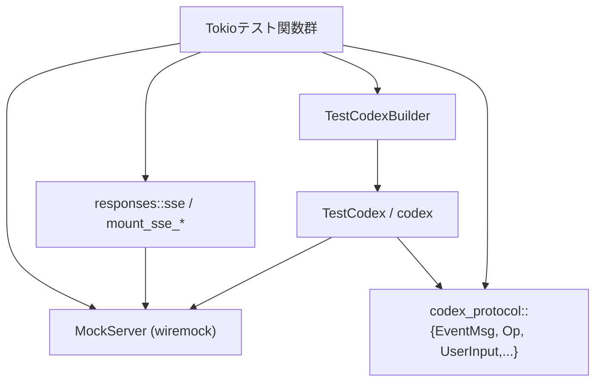
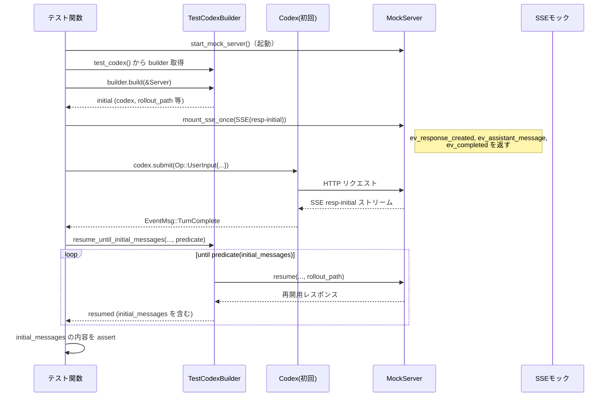

# core/tests/suite/resume.rs コード解説

## 0. ざっくり一言

Codex セッションの「再開 (resume)」時の振る舞いを検証する統合テスト群です。  
ロールアウトから復元される初期イベント列と、モデル切り替え時のインストラクション／メタメッセージ（`<model_switch>`）に関する契約をテストで固定しています（`resume.rs:L60-459`）。

---

## 1. このモジュールの役割

### 1.1 概要

- このモジュールは **セッション再開時の状態復元とモデル切り替えの挙動** を検証するために存在し、Codex のテスト用ラッパである `TestCodexBuilder` / `TestCodex` を用いて、HTTP SSE モックサーバと対話する統合テストを提供します（`resume.rs:L16-19,L60-459`）。
- 具体的には、再開されたセッションに含まれる `initial_messages` の内容・順序、およびモデル切り替え時に送信される「ベースインストラクション」と `<model_switch>` メッセージの有無・回数を検証します（`resume.rs:L100-143,L186-234,L275-360,L404-456`）。

### 1.2 アーキテクチャ内での位置づけ

このテストは、以下のコンポーネント間の協調を検証します。

- `TestCodexBuilder` / `TestCodex`（Codex のテストハーネス）  
- `wiremock::MockServer` を使った HTTP SSE モックサーバ  
- Codex プロトコル型 (`EventMsg`, `Op`, `UserInput` など)

概略の依存関係は次の通りです。



- テスト関数は `test_codex()` から `TestCodexBuilder` を取得し、`build` / `resume` を呼び出して Codex インスタンスを作成・再開します（`resume.rs:L65-67,L100-103,L153-158,L186-190,L243-249,L299-303,L369-376,L414-417`）。
- Codex は `Op::UserInput` や `Op::OverrideTurnContext` を送信し、MockServer に対して HTTP リクエストを発行します（`resume.rs:L87-96,L173-181,L263-272,L303-312,L319-328,L392-399,L420-443`）。
- モック側は `sse`, `mount_sse_once`, `mount_sse_sequence` で定義された SSE イベント列を返却し、これが `EventMsg` 列として Codex 側に流れます（`resume.rs:L75-80,L165-171,L256-261,L282-297,L382-390,L404-412`）。

### 1.3 設計上のポイント

- **再開ヘルパ関数による安定化待ち**  
  - `resume_until_initial_messages` が、`TestCodexBuilder::resume` を繰り返し呼び出して「初期メッセージ列が期待パターンに落ち着く」まで待機します（`resume.rs:L27-58`）。
  - これにより、再開直後の過渡状態ではなく、安定状態の `initial_messages` に対して検証できます（`resume.rs:L42-47,L100-118,L186-205`）。
- **SSE モックによる決定的なイベント駆動**  
  - 応答イベント列は `ev_response_created`, `ev_assistant_message`, `ev_reasoning_item`, `ev_completed` などで明示的に構成され、`mount_sse_once` / `mount_sse_sequence` で MockServer に取り付けられます（`resume.rs:L75-80,L165-171,L256-261,L282-297,L382-390,L404-412`）。
- **Rust のエラーハンドリング**  
  - テスト関数はすべて `anyhow::Result<()>` を返し、I/O や Codex 操作の失敗は `?` 演算子で呼び出し元（テストランナー）に伝播します（`resume.rs:L1,L61,L149,L240,L366`）。
  - 仕様違反は `assert_eq!`, `assert!`, `panic!`, `expect` で明示的にテスト失敗として扱われます（`resume.rs:L133-142,L223-234,L335-360,L452-456`）。
- **並行性**  
  - 全テストは `#[tokio::test(flavor = "multi_thread", worker_threads = 2)]` で実行され、`Arc` により Codex インスタンスや `TempDir` を安全に共有します（`resume.rs:L22,L24,L60,L148,L239,L365`）。
  - ただし個々のテストの処理フロー自体は直列的で、複数タスクの同時実行や競合は行っていません（`resume.rs:L64-145,L152-237,L243-363,L369-459`）。

---

## 2. 主要な機能一覧

このファイルで定義される主な機能（すべてテスト用途）です。

- 再開安定化ヘルパ: `resume_until_initial_messages` — `TestCodexBuilder::resume` を複数回試行し、`initial_messages` が期待パターンを満たすまで待機する（`resume.rs:L27-58`）。
- テスト: `resume_includes_initial_messages_from_rollout_events` — ロールアウトイベント由来の「通常ターン」のメッセージ列が `initial_messages` として復元されることを検証する（`resume.rs:L60-145`）。
- テスト: `resume_includes_initial_messages_from_reasoning_events` — 推論イベント (`AgentReasoning`, `AgentReasoningRawContent`) を含むターンが `initial_messages` に正しく復元されることを検証する（`resume.rs:L148-237`）。
- テスト: `resume_switches_models_preserves_base_instructions` — 再開時にモデルを変更しても、ベースインストラクションが保持され、`<model_switch>` メッセージが各リクエストで一度以上（1 回）挿入されることを検証する（`resume.rs:L239-363`）。
- テスト: `resume_model_switch_is_not_duplicated_after_pre_turn_override` — 再開時のモデル変更と、ターンごとの `OverrideTurnContext` によるモデル指定が重複しても、`<model_switch>` メッセージが 1 リクエスト中に重複しないことを検証する（`resume.rs:L365-456`）。

---

## 3. 公開 API と詳細解説

### 3.1 型一覧（コンポーネントインベントリー）

#### このファイル内で定義される関数

| 名前 | 種別 | 出現箇所 | 役割 / 用途 |
|------|------|----------|-------------|
| `resume_until_initial_messages` | 非公開 `async fn` | `resume.rs:L27-58` | `TestCodexBuilder::resume` を繰り返し呼び出し、`initial_messages` が与えられた述語を満たすまで待つテスト用ヘルパ関数。 |
| `resume_includes_initial_messages_from_rollout_events` | `#[tokio::test]` 関数 | `resume.rs:L60-145` | ロールアウトイベントから構成された最初のターンが、再開後の `initial_messages` に完全に反映されることを確認する。 |
| `resume_includes_initial_messages_from_reasoning_events` | `#[tokio::test]` 関数 | `resume.rs:L148-237` | 推論イベントを含むターンが `initial_messages` に正しく復元されることを確認する。 |
| `resume_switches_models_preserves_base_instructions` | `#[tokio::test]` 関数 | `resume.rs:L239-363` | セッションの再開とモデル変更後もベースインストラクションが保持され、`<model_switch>` メッセージが各リクエストでちょうど 1 回含まれることを確認する。 |
| `resume_model_switch_is_not_duplicated_after_pre_turn_override` | `#[tokio::test]` 関数 | `resume.rs:L365-456` | 再開時のモデル変更と `OverrideTurnContext` の組み合わせで `<model_switch>` メッセージが 1 リクエスト中に二重挿入されないことを確認する。 |

#### 主な外部コンポーネント（定義は別ファイル・別クレート）

> ※これらの定義本体はこのチャンクには含まれていません。「用途」は型名・関数名と使用方法から読み取れる範囲の説明です。

| 名前 | 種別 | 出現箇所 | 役割 / 用途（推測を明示） |
|------|------|----------|--------------------------|
| `TestCodexBuilder` | 構造体 | `resume.rs:L17,L27-33,L65,L153,L243,L299,L370,L414` | Codex のテスト用ビルダー。`build` で新規セッション、`resume` で既存ロールアウトからの再開を行っていると解釈できます。定義は `core_test_support::test_codex` 内（このチャンクには現れません）。 |
| `TestCodex` | 構造体 | `resume.rs:L16,L33,L66-68,L120-123,L156-158,L208-211,L247-249,L302-303,L373-376,L417-419` | テスト用 Codex インスタンス。`codex.submit(...)` や `wait_for_event(&codex, ...)` の対象。 |
| `MockServer` | 構造体 | `resume.rs:L25,L27-31,L64,L75-80,L152,L165-171,L243,L256-261,L282-297,L369,L382-390,L404-412` | wiremock のモック HTTP サーバ。SSE ストリームやリクエスト検査のために使用。 |
| `EventMsg` | 列挙体 | `resume.rs:L2,L42,L98,L105-115,L124-132,L184,L191-203,L212-221,L273,L314-316,L330-332,L401,L445-447` | Codex が出力するイベントメッセージ種別。`TurnStarted`, `UserMessage`, `TokenCount`, `AgentMessage`, `AgentReasoning` など各種イベントを保持。定義本体は `codex_protocol::protocol` にあり、このチャンクには現れません。 |
| `Op` | 列挙体 | `resume.rs:L3,L87-95,L173-181,L263-271,L303-312,L319-328,L392-399,L420-443` | Codex への操作を表す。ここでは `Op::UserInput` と `Op::OverrideTurnContext` を使用。 |
| `UserInput` | 列挙体 | `resume.rs:L6,L89-92,L175-178,L265-268,L306-309,L322-325,L393-396,L437-440` | ユーザ入力を表す。ここでは `UserInput::Text` バリアントのみ使用。 |
| `TextElement`, `ByteRange` | 構造体 | `resume.rs:L4-5,L82-85,L133-135` | テキストの一部範囲に付属情報（ここでは `<note>`）を紐づけるためのメタデータ。 |
| `TempDir` | 構造体 | `resume.rs:L24,L27-31,L68,L120-123,L158,L208-211,L249,L302-303,L376,L417-419` | 一時ディレクトリ。セッションデータ／ロールアウトファイルの保存に使われていると推測されます。 |
| `test_codex` | 関数 | `resume.rs:L18,L65,L153,L243,L299,L370,L414` | `TestCodexBuilder` の初期インスタンスを生成するファクトリ関数。定義はこのチャンクには現れません。 |
| `start_mock_server` | 関数 | `resume.rs:L14,L64,L152,L243,L369` | `MockServer` を起動するヘルパ。 |
| `sse`, `mount_sse_once`, `mount_sse_sequence` | 関数 | `resume.rs:L11-13,L75-80,L165-171,L256-261,L282-297,L382-390,L404-412` | SSE レスポンスを構成し、モックサーバに取り付けるためのテスト用ヘルパ。 |
| `ev_response_created`, `ev_assistant_message`, `ev_reasoning_item`, `ev_completed` | 関数 | `resume.rs:L7-10,L75-79,L165-169,L256-260,L285-293,L384-387,L406-409` | 単一 SSE イベント（レスポンス作成・アシスタントメッセージ・推論項目・完了）を生成するテスト用ヘルパ。 |
| `wait_for_event` | 関数 | `resume.rs:L19,L98,L184,L273,L314-317,L330-333,L401,L445-448` | Codex から特定の `EventMsg` が流れるまで待つヘルパ。 |
| `skip_if_no_network!` | マクロ | `resume.rs:L15,L62,L150,L241,L367` | ネットワーク環境がない場合にテストをスキップするためのマクロ。 |

### 3.2 関数詳細（5 件）

#### `resume_until_initial_messages(builder: &mut TestCodexBuilder, server: &MockServer, home: Arc<TempDir>, rollout_path: PathBuf, predicate: impl Fn(&[EventMsg]) -> bool) -> Result<TestCodex>`

**出現箇所**: `resume.rs:L27-58`

**概要**

- `TestCodexBuilder::resume` を繰り返し呼び出し、再開後セッションの `session_configured.initial_messages` が、与えられた述語 `predicate` を満たすまで待機するヘルパ関数です。
- 一定時間（約 2 秒）内に条件を満たさない場合、最後に観測したメッセージ列を含む `panic!` でテスト失敗とします（`resume.rs:L34-36,L49-52`）。

**引数**

| 引数名 | 型 | 説明 |
|--------|----|------|
| `builder` | `&mut TestCodexBuilder` | 再開処理を行うビルダー。`resume` メソッドを経由して `TestCodex` を構築します（`resume.rs:L27-33,L39-41`）。 |
| `server` | `&MockServer` | SSE を提供する wiremock サーバ。`resume` の接続先として渡されます（`resume.rs:L29,L39-41`）。 |
| `home` | `Arc<TempDir>` | セッションのホームディレクトリ。`Arc` によりテスト間で共有されます（`resume.rs:L30,L39-41`）。 |
| `rollout_path` | `PathBuf` | 再開対象となるロールアウトファイルのパス（`resume.rs:L31,L40`）。 |
| `predicate` | `impl Fn(&[EventMsg]) -> bool` | `initial_messages` のスライスを受け取り、「安定した」とみなす条件を判定する関数（`resume.rs:L32,L42-47`）。 |

**戻り値**

- `Result<TestCodex>` (`anyhow::Result`)  
  条件を満たした時点の再開済み `TestCodex` を `Ok` として返します。`builder.resume` が失敗した場合はそのまま `Err` が返されます（`resume.rs:L33,L39-41`）。

**内部処理の流れ**

1. `deadline`（現在時刻＋2 秒）と `poll_interval`（10ms）を計算する（`resume.rs:L34-35`）。
2. デバッグ用に `last_initial_messages` を `"<missing initial messages>"` で初期化する（`resume.rs:L36`）。
3. 無限ループに入り、毎回 `builder.resume(server, Arc::clone(&home), rollout_path.clone()).await?` を呼び出してセッションを再開する（`resume.rs:L38-41`）。
4. `resumed.session_configured.initial_messages` が `Some` の場合、`predicate(initial_messages)` を判定し、`true` なら `Ok(resumed)` を返して終了する。`false` なら、その内容をデバッグ表示用文字列として `last_initial_messages` に保存する（`resume.rs:L42-47`）。
5. 現在時刻が `deadline` を超えていれば、`panic!` でタイムアウトとし、`last_initial_messages` をメッセージ内に埋め込む（`resume.rs:L49-52`）。
6. `drop(resumed)` で再開済みインスタンスの所有権を明示的に破棄し、`tokio::time::sleep(poll_interval).await` で少し待ってからループ先頭に戻る（`resume.rs:L55-57`）。

**Examples（使用例）**

`resume_includes_initial_messages_from_rollout_events` からの使用例です（`resume.rs:L100-118`）。

```rust
// initial_messages が特定のパターンに一致するまで再開を繰り返す
let resumed = resume_until_initial_messages(
    &mut builder,
    &server,
    home,
    rollout_path,
    |initial_messages| {
        matches!(
            initial_messages,
            [
                EventMsg::TurnStarted(_),
                EventMsg::UserMessage(_),
                EventMsg::TokenCount(_),
                EventMsg::AgentMessage(_),
                EventMsg::TokenCount(_),
                EventMsg::TurnComplete(_),
            ]
        )
    },
).await?;
```

このコードでは、再開されたセッションの `initial_messages` が 6 つのイベントからなる決まった順序になるまで再開を繰り返します。

**Errors / Panics**

- `builder.resume(...).await?` の部分で、ネットワークや I/O などに起因する `Err` が返された場合、それがそのまま呼び出し元に伝播します（`resume.rs:L39-41`）。
- タイムアウトした場合は `panic!` します。これはテストの失敗として扱われます（`resume.rs:L49-52`）。
- `predicate` 内でパニックした場合、そのまま伝播します。`predicate` の実装は呼び出し側の責務です。

**Edge cases（エッジケース）**

- `initial_messages` が常に `None` のままの場合  
  - 2 秒経過までループし続け、最終的にタイムアウトして `panic!` します（`resume.rs:L42-47,L49-52`）。
- `initial_messages` の内容が変化し続け、`predicate` が `true` にならない場合  
  - 同様にタイムアウトします。
- `rollout_path` が無効で `resume` が失敗する場合  
  - `builder.resume` が `Err` を返し、本関数も `Err` を返します（`resume.rs:L39-41`）。

**使用上の注意点**

- 本関数はテスト用です。プロダクションコードでの利用は想定されていません。
- タイムアウト時間（2 秒）とポーリング間隔（10ms）は固定値であり、遅い環境ではテストフレークの原因となる可能性があります（`resume.rs:L34-35`）。
- `home` や `rollout_path` は常に同じセッションを指している前提で設計されています。別のセッションに切り替える用途には向きません（`resume.rs:L30-31,L39-41`）。

---

#### `resume_includes_initial_messages_from_rollout_events() -> Result<()>`

**出現箇所**: `resume.rs:L60-145`

**概要**

- 単純なロールアウトイベント（アシスタントメッセージのみ）で実行した初回ターンが、セッション再開後の `initial_messages` に正しく復元されることを検証するテストです。
- ユーザメッセージと `text_elements`、アシスタントメッセージ、`TurnStarted` と `TurnComplete` の対応関係をチェックします（`resume.rs:L82-85,L124-141`）。

**引数・戻り値**

- 引数なし。`#[tokio::test]` によってテストランナーから直接呼ばれます（`resume.rs:L60`）。
- 戻り値は `Result<()>` で、失敗時には `anyhow` のエラーを返します（`resume.rs:L61,L145`）。

**内部処理の流れ（要約）**

1. ネットワーク環境がない場合はテストをスキップ（`skip_if_no_network!`）（`resume.rs:L62`）。
2. MockServer を起動し、`TestCodexBuilder` で新規 Codex セッションを構築する（`resume.rs:L64-68`）。
3. ロールアウトパスを取得する（`session_configured.rollout_path.expect("rollout path")`）（`resume.rs:L69-73`）。
4. 初回 SSE を構成し、アシスタントメッセージ「Completed first turn」を返すように設定する（`resume.rs:L75-80`）。
5. `text_elements` を含むユーザ入力「Record some messages」を送信し、`TurnComplete` イベントを待つ（`resume.rs:L82-85,L87-96,L98`）。
6. `resume_until_initial_messages` を呼び出し、`initial_messages` が `[TurnStarted, UserMessage, TokenCount, AgentMessage, TokenCount, TurnComplete]` というパターンになるまで再開を繰り返す（`resume.rs:L100-118`）。
7. 取得した `initial_messages` を同じパターンで `match` し、中身を詳細に検証する（`resume.rs:L120-141`）。
   - ユーザメッセージの本文と `text_elements` が元入力と一致すること。
   - アシスタントメッセージの本文が「Completed first turn」であること。
   - `completed.turn_id == started.turn_id` であること。
   - `completed.last_agent_message` が `Some("Completed first turn")` であること。

**Errors / Panics**

- Codex の `build` / `submit` / 再開処理の失敗は `?` で `Err` として返され、テスト失敗になります（`resume.rs:L66,L87-96,L119`）。
- 期待するパターンに一致しない `initial_messages` を受け取った場合、`match` の `other => panic!` でテストはパニックします（`resume.rs:L124-143`）。
- `rollout_path` が `None` の場合、`.expect("rollout path")` によりパニックします（`resume.rs:L69-73`）。

**Edge cases**

- `initial_messages` にイベントが欠けていたり順序が違う場合  
  → `matches!` が `false` のままでタイムアウトするか、`match` パターンに一致せず `panic!` します（`resume.rs:L105-115,L124-143`）。
- `text_elements` が正しく保存されていない場合  
  → `assert_eq!(first_user.text_elements, text_elements)` によりテストが失敗します（`resume.rs:L133-135`）。

**使用上の注意点**

- このテストは「正しい」`initial_messages` のシーケンスを仕様として固定します。セッション再開ロジックを変更する際は、このパターンとの互換性を意識する必要があります。
- 特に `TokenCount` イベントの位置（ユーザメッセージ後とアシスタントメッセージ後）も含めて契約とみなされます（`resume.rs:L128-130`）。

---

#### `resume_includes_initial_messages_from_reasoning_events() -> Result<()>`

**出現箇所**: `resume.rs:L148-237`

**概要**

- `show_raw_agent_reasoning = true` な設定で、推論イベントを含むターンを実行し、それが再開後の `initial_messages` に `AgentReasoning` と `AgentReasoningRawContent` として正しく含まれることを検証するテストです（`resume.rs:L153-155,L165-169,L191-203,L212-231`）。

**処理の流れ（要約）**

1. ネットワークチェックと MockServer 起動（`resume.rs:L150-152`）。
2. `TestCodexBuilder::with_config` で `show_raw_agent_reasoning = true` に設定してセッションを構築（`resume.rs:L153-158`）。
3. ロールアウトパス取得（`resume.rs:L159-163`）。
4. SSE で、`ev_reasoning_item("reason-1", &["Summarized step"], &["raw detail"])` を含むイベント列を設定（`resume.rs:L165-171`）。
5. ユーザ入力「Record reasoning messages」を送信し、`TurnComplete` を待つ（`resume.rs:L173-184`）。
6. `resume_until_initial_messages` で、`initial_messages` が `[TurnStarted, UserMessage, TokenCount, AgentReasoning, AgentReasoningRawContent, AgentMessage, TokenCount, TurnComplete]` になるまで待つ（`resume.rs:L186-205`）。
7. 同じパターンで `match` し、推論テキストと raw テキストが期待通りであること等を検証（`resume.rs:L212-231`）。

**ポイント**

- `AgentReasoning.text == "Summarized step"` と `AgentReasoningRawContent.text == "raw detail"` の両方を検証することで、要約と生の推論内容がそれぞれ別イベントとして復元されることが確認されています（`resume.rs:L223-225`）。

**Errors / Panics / Edge cases**

- 構造は前述のテストと同様で、主な違いはイベントの種類と検証内容です（`resume.rs:L212-234`）。
- `show_raw_agent_reasoning` 設定が効いていない場合、`AgentReasoning` 系イベントが現れず、テストはタイムアウトまたは `panic!` で失敗します。

---

#### `resume_switches_models_preserves_base_instructions() -> Result<()>`

**出現箇所**: `resume.rs:L239-363`

**概要**

- 初回セッションではモデル `"gpt-5.2"` を使用し、そのとき送信されたベースインストラクション文字列を取得します（`resume.rs:L243-246,L275-280`）。
- その後、モデル `"gpt-5.2-codex"` に切り替えたビルダーでセッションを再開し、再開後の 2 ターン分のリクエストを検査して、
  - `instructions_text()` が初回と同一であること
  - `"developer"` ロールのメッセージに `<model_switch>` を含むテキストが各リクエストで 1 回以上・かつ 1 回だけ存在すること  
  を確認します（`resume.rs:L335-360`）。

**処理の流れ（要約）**

1. 初回セッション構築（モデル `"gpt-5.2"`）と SSE 設定（`resume.rs:L243-261`）。
2. ユーザ入力「Record initial instructions」を送り、`TurnComplete` を待つ（`resume.rs:L263-273`）。
3. `initial_mock.single_request().body_json()` から `"instructions"` フィールドを取り出し、`initial_instructions` として保存（`resume.rs:L275-280`）。
4. 再開用に 2 つの SSE シーケンスを設定（`resp-resume-1` / `resp-resume-2`）（`resume.rs:L282-297`）。
5. `resume_builder`（モデル `"gpt-5.2-codex"`）で `resume(...)` を実行し、再開後に 2 回ユーザ入力を送信（`resume.rs:L299-333`）。
6. `resumed_mock.requests()` から 2 つの HTTP リクエストを取得し、それぞれについて：
   - `instructions_text()` が `initial_instructions` と一致することを検証（`resume.rs:L338-339,L350-351`）。
   - `"developer"` ロールの `message_input_texts("developer")` に含まれるテキスト中で、`"<model_switch>"` を含むものの数をカウントし、1 回以上（1 回）であることを検証（`resume.rs:L340-347,L352-359`）。

**Errors / Panics / Edge cases**

- リクエストが 2 件来なかった場合は `assert_eq!(requests.len(), 2, ...)` で失敗します（`resume.rs:L335-336`）。
- `<model_switch>` を含むメッセージがない、または 2 件以上ある場合も `assert!` / `assert_eq!` によりテスト失敗となります（`resume.rs:L345-348,L357-359`）。
- `"instructions"` キーが JSON に存在しない場合、`unwrap_or_default()` により空文字列となりますが、その場合もテストは「初回および再開後の両方で空文字列であること」を検証することになります（`resume.rs:L276-280`）。

**使用上の注意点**

- このテストは、「モデルを切り替えてもベースインストラクション文字列は変わらず、モデル切り替えの説明は `<model_switch>` というタグ付きテキストで表現される」という仕様を前提にしています。
- `<model_switch>` が 1 リクエスト中に 1 回だけ出現する、という性質も契約として固定されます（`resume.rs:L341-347,L353-359`）。

---

#### `resume_model_switch_is_not_duplicated_after_pre_turn_override() -> Result<()>`

**出現箇所**: `resume.rs:L365-456`

**概要**

- すでにモデルが `"gpt-5.2"` から `"gpt-5.2-codex"` に切り替わっている再開セッションに対して、さらに `Op::OverrideTurnContext` でターン単位のモデル `"gpt-5.1-codex-max"` を指定しても、`<model_switch>` メッセージが 1 リクエスト中に二重挿入されないことを検証するテストです（`resume.rs:L369-372,L414-427,L450-456`）。

**処理の流れ（要約）**

1. 初回セッション構築（モデル `"gpt-5.2"`）、SSE 設定、初回ターン実行（`resume.rs:L369-401`）。
   - ここでは初回の HTTP リクエストを `initial_mock.single_request()` で消費するだけで、中身は検査しません（`resume.rs:L402`）。
2. 再開用 SSE を 1 つ設定（`resp-resume`）（`resume.rs:L404-412`）。
3. `resume_builder`（モデル `"gpt-5.2-codex"`）で再開し、その後すぐに `Op::OverrideTurnContext` で `model: Some("gpt-5.1-codex-max".to_string())` を送信する（`resume.rs:L414-432`）。
4. 続けてユーザ入力「first turn after override」を送り、`TurnComplete` を待つ（`resume.rs:L435-448`）。
5. `resumed_mock.single_request()` からそのリクエストを取得し、`developer` ロールのメッセージ中で `<model_switch>` の出現回数を数える。これが 1 であることを検証する（`resume.rs:L450-456`）。

**Errors / Panics / Edge cases**

- `<model_switch>` が 0 回、または 2 回以上出現する場合、`assert_eq!(model_switch_count, 1);` によりテストが失敗します（`resume.rs:L452-456`）。
- `OverrideTurnContext` で別のフィールド（`cwd` や `sandbox_policy` 等）を指定した場合の挙動は、このテストからは分かりません（`resume.rs:L420-431`）。

**使用上の注意点**

- `Op::OverrideTurnContext` によるモデル変更と、再開時のモデル変更の組み合わせに対する期待仕様がここで固定されます。  
  実装側では、「同一ターン・同一リクエスト中に複数のモデル切り替え説明を生成しない」ことが必要になります。

---

### 3.3 その他の関数

このファイルには、補助的な小関数は定義されていません。外部ヘルパ（`start_mock_server`, `test_codex`, `sse`, `mount_sse_once` など）は別モジュールに定義されています（`resume.rs:L14-19,L75-80,L165-171,L256-261,L282-297,L382-390,L404-412`）。

---

## 4. データフロー

ここでは、最初のテスト `resume_includes_initial_messages_from_rollout_events` を例に、データの流れを説明します（`resume.rs:L60-145`）。

1. テスト関数が `test_codex()` と `start_mock_server()` を用いて Codex と MockServer を初期化します（`resume.rs:L64-67`）。
2. MockServer に SSE イベント列（`resp-initial`）をマウントします（`resume.rs:L75-80`）。
3. テストが `codex.submit(Op::UserInput { ... })` を呼び、ユーザ入力を送信します（`resume.rs:L87-96`）。
4. Codex が MockServer に HTTP リクエストを送り、SSE を受信し、その内容に応じて `EventMsg` をストリームとして発行します（ストリーム自体の実装はこのチャンクにはありません）。
5. `wait_for_event(&codex, ...)` が `EventMsg::TurnComplete(_)` を受け取るまで待機します（`resume.rs:L98`）。
6. テストが `resume_until_initial_messages` を通じて、ロールアウトファイルから再開し、`session_configured.initial_messages` を取得して検証します（`resume.rs:L100-123`）。

これをシーケンス図で表すと次のようになります。



同様の流れで、他のテストも

- 初回ターン実行 → ロールアウトパス取得
- モデルや設定を変えて `resume`
- SSE/HTTP リクエストの中身を検査

というパターンを踏襲しています（`resume.rs:L148-237,L239-363,L365-456`）。

---

## 5. 使い方（How to Use）

このファイル自体はテスト専用ですが、`resume_until_initial_messages` やテストの書き方は、他の再開シナリオのテストを追加する際のテンプレートとして利用できます。

### 5.1 基本的な使用方法（`resume_until_initial_messages` を利用したテスト）

新しい再開パターンを検証したいときの最小構成のイメージです。

```rust
// モックサーバと Codex をセットアップする                   // resume.rs:L64-68 を簡略化
let server = start_mock_server().await;
let mut builder = test_codex();
let initial = builder.build(&server).await?;
let codex = Arc::clone(&initial.codex);
let home = initial.home.clone();
let rollout_path = initial
    .session_configured
    .rollout_path
    .clone()
    .expect("rollout path");

// 必要な SSE をマウントし、初回ターンを実行する             // resume.rs:L75-80, L87-98 相当
mount_sse_once(&server, sse(vec![
    ev_response_created("resp-initial"),
    ev_assistant_message("msg-1", "some reply"),
    ev_completed("resp-initial"),
])).await;
codex.submit(Op::UserInput {
    items: vec![UserInput::Text {
        text: "some input".into(),
        text_elements: Vec::new(),
    }],
    final_output_json_schema: None,
    responsesapi_client_metadata: None,
}).await?;
wait_for_event(&codex, |e| matches!(e, EventMsg::TurnComplete(_))).await;

// 再開し、initial_messages が期待するパターンになるまで待つ
let resumed = resume_until_initial_messages(
    &mut builder,
    &server,
    home,
    rollout_path,
    |msgs| {
        // ここに期待する EventMsg の並びを matches! で記述する
        matches!(msgs, [EventMsg::TurnStarted(_), EventMsg::TurnComplete(_)])
    },
).await?;

// 取得した initial_messages の中身を検証する
let initial_messages = resumed
    .session_configured
    .initial_messages
    .expect("initial_messages must be present");
assert!(matches!(
    initial_messages.as_slice(),
    [EventMsg::TurnStarted(_), EventMsg::TurnComplete(_)]
));
```

このように、**初回ターンの実行 → 再開 → `initial_messages` の検証**という流れが基本パターンです。

### 5.2 よくある使用パターン

- **イベント順序の検証**  
  `matches!` マクロを使って `EventMsg` の配列パターンを指定し、その順序を仕様として固定する（`resume.rs:L105-115,L191-203`）。
- **HTTP リクエスト内容の検査**  
  モックの `.single_request()` や `.requests()` を使って、`instructions_text()` や `message_input_texts("developer")` を検査するパターン（`resume.rs:L275-280,L335-360,L402,L450-456`）。

### 5.3 よくある間違い

```rust
// 間違い例: 再開直後に initial_messages を即座に読む
let resumed = builder.resume(&server, home, rollout_path).await?;
let initial_messages = resumed.session_configured.initial_messages.unwrap(); // 不安定な可能性あり

// 正しい例: resume_until_initial_messages で安定するまで待つ
let resumed = resume_until_initial_messages(
    &mut builder,
    &server,
    home,
    rollout_path,
    |msgs| !msgs.is_empty(), // 例: とにかく1件以上あること
).await?;
let initial_messages = resumed
    .session_configured
    .initial_messages
    .expect("expected initial messages");
```

- 実装上、`initial_messages` が構築されるタイミングは再開ロジックに依存します。テストでは `resume_until_initial_messages` を通じて「安定状態」を見にいく方が安全です（`resume.rs:L27-47,L100-118,L186-205`）。

### 5.4 使用上の注意点（まとめ）

- **並行性**  
  - テストは `#[tokio::test(flavor = "multi_thread", worker_threads = 2)]` で実行されますが、ここでのパターンは単一スレッド的な直列フローを前提にしています（`resume.rs:L60,L148,L239,L365`）。
  - `Arc` で共有される `codex` や `home` を、他スレッドから同時に操作するようなパターンはこのファイルでは登場しません（`resume.rs:L22,L68,L158,L249,L376`）。
- **エラー処理**  
  - テスト関数全体のエラーは `anyhow::Result<()>` によってまとめて伝播します。内部での想定外の状態は `assert!` / `panic!` で明示的に失敗させています（`resume.rs:L1,L61,L149,L240,L366`）。
- **環境依存性**  
  - ネットワーク（少なくともローカルループバック）が使えない環境では `skip_if_no_network!` によりテストがスキップされます（`resume.rs:L62,L150,L241,L367`）。
  - `resume_until_initial_messages` の 2 秒タイムアウトにより、極端に遅い CI 環境ではテストが失敗する可能性があります（`resume.rs:L34-35,L49-52`）。

---

## 6. 変更の仕方（How to Modify）

### 6.1 新しい機能を追加する場合（新たな再開シナリオのテスト）

1. **テストケース追加場所**  
   - 本ファイルに新しい `#[tokio::test]` 関数を追加します。既存テストと同様に `multi_thread` フレーバーを合わせると一貫性が保てます（`resume.rs:L60,L148,L239,L365`）。
2. **初回セッション構築**  
   - `test_codex().with_config(...)` で必要な設定（例: 新しいフラグやモデル）を有効にして `builder.build(&server)` を呼び出します（`resume.rs:L153-158,L243-248,L370-373`）。
3. **SSE イベント設計**  
   - 新しく検証したいイベント列を `sse(vec![ev_...])` で構成し、`mount_sse_once` または `mount_sse_sequence` でモックサーバに登録します（`resume.rs:L75-80,L165-171,L282-297,L382-390,L404-412`）。
4. **初回ターン実行とロールアウトパス取得**  
   - 既存テストと同様に `Op::UserInput` でターンを実行し、`TurnComplete` を待機してから `rollout_path` を取得します（`resume.rs:L87-98,L173-184,L263-273,L392-401`）。
5. **再開と検証**  
   - `resume_until_initial_messages` または `resume_builder.resume(...)` を使って再開し、`initial_messages` や HTTP リクエスト内容を `assert!` 等で検証します（`resume.rs:L100-143,L186-234,L302-360,L417-456`）。

### 6.2 既存の機能を変更する場合（契約の変更）

- **`initial_messages` の形を変える場合**
  - `matches!(initial_messages, [...])` や `match initial_messages.as_slice()` のパターンが仕様と一致しているため、順序やイベント種類を変更する場合は、対応するパターンをすべて更新する必要があります（`resume.rs:L105-115,L124-132,L191-203,L212-221`）。
- **モデル切り替えの表現 (`<model_switch>`) を変える場合**
  - `<model_switch>` という文字列そのものに依存しているため、タグ名を変更する場合はカウント部分の条件も変更が必要です（`resume.rs:L341-347,L353-359,L452-455`）。
- **タイムアウトなど時間的な挙動の変更**
  - `resume_until_initial_messages` のタイムアウトやポーリング間隔を変更した場合、テストの安定性と実行時間に影響します（`resume.rs:L34-35,L49-52`）。

変更時は、関連するテスト（このファイルの全テスト）と、`core_test_support` 内のテストサポートコードの挙動を合わせて確認する必要があります。

---

## 7. 関連ファイル

このモジュールと密接に関係するファイル／モジュール（推測を含みます）です。

| パス / モジュール | 役割 / 関係 |
|-------------------|------------|
| `core_test_support::test_codex` | `TestCodexBuilder`, `TestCodex`, `test_codex` などを提供するテストサポートモジュール。Codex の構築・再開、HTTP リクエストの検査 API を提供していると考えられます（`resume.rs:L16-18,L65-67,L153-158,L243-248,L299-303,L370-373,L414-417`）。 |
| `core_test_support::responses` | `sse`, `mount_sse_once`, `mount_sse_sequence`, `ev_response_created`, `ev_assistant_message`, `ev_reasoning_item`, `ev_completed` など、SSE レスポンスと wiremock モックの設定ヘルパを提供するモジュール（`resume.rs:L7-14,L75-80,L165-171,L256-261,L282-297,L382-390,L404-412`）。 |
| `core_test_support::wait_for_event` | Codex からの `EventMsg` ストリームを待機するユーティリティ関数。テストが非同期イベントの到達を待つために使用（`resume.rs:L19,L98,L184,L273,L314-317,L330-333,L401,L445-448`）。 |
| `codex_protocol::protocol` | `EventMsg`, `Op` など、Codex プロトコルの基礎型を定義するクレート／モジュール（`resume.rs:L2-3`）。 |
| `codex_protocol::user_input` | `UserInput`, `TextElement`, `ByteRange` など、ユーザ入力表現を定義するモジュール（`resume.rs:L4-6,L82-85,L89-92,L173-178,L265-268,L306-309,L322-325,L393-396,L437-440`）。 |
| `wiremock::MockServer` | HTTP モックサーバ。SSE を返し、Codex からの HTTP リクエストを記録・検査するために使用（`resume.rs:L25,L64,L152,L243,L369`）。 |

このファイルは、これらのテストサポートモジュールの **利用例と契約の集合** として位置づけられます。
