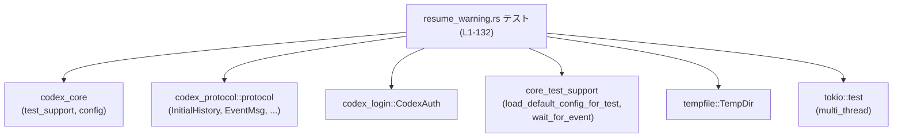
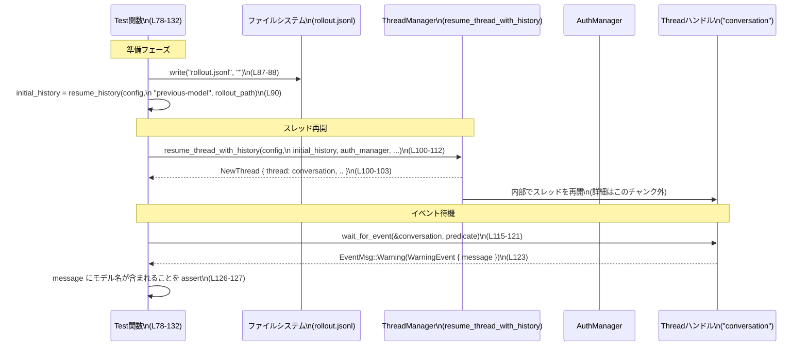

# core/tests/suite/resume_warning.rs コード解説

## 0. ざっくり一言

- 以前とは異なるモデル設定で会話スレッドを再開したときに、**モデル不一致の Warning イベントが発行されることを検証するテスト**です（`emits_warning_when_resumed_model_differs`、`core/tests/suite/resume_warning.rs:L78-132`）。
- 補助関数 `resume_history` で「過去のロールアウト履歴が残っている」という状態を `InitialHistory::Resumed` として組み立てます（`L22-76`）。

---

## 1. このモジュールの役割

### 1.1 概要

このファイルは、Codex コアの会話スレッド再開機能に対して、次の点を検証します。

- **問題**  
  - 以前のロールアウト履歴が「旧モデル」で実行されており、現在の設定の「現モデル」と異なる場合に、ユーザーにその不一致が通知されるべきかどうか。
- **提供する検証**  
  - 再開時に `EventMsg::Warning(WarningEvent { message })` が発行され、そのメッセージに旧モデル名と現モデル名が両方含まれていることをアサートします（`L115-127`）。

### 1.2 アーキテクチャ内での位置づけ

このファイルはテスト専用であり、実際のロジックは他クレートに委譲されています。

- `codex_core`  
  - 会話スレッド管理 (`NewThread`, `thread_manager_with_models_provider`, `resume_thread_with_history`) を提供（`L3`, `L92-104`）。
- `codex_protocol`  
  - 履歴やイベントを表現するプロトコル型（`InitialHistory`, `ResumedHistory`, `RolloutItem`, `EventMsg`, `WarningEvent` など）を提供（`L5-16`）。
- `core_test_support`  
  - テスト用の設定ロード (`load_default_config_for_test`) とイベント待機 (`wait_for_event`) を提供（`L18-19`, `L82`, `L115`）。

依存関係を簡略図で表します。



※ 依存先モジュールのファイルパスや内部実装は、このチャンクには現れません。

### 1.3 設計上のポイント

- **テスト対象ロジックとの分離**  
  - `resume_history` 関数で `InitialHistory::Resumed` の組み立てを行い（`L22-76`）、テスト本体では「設定の差異」と「イベントの検証」に集中しています（`L78-132`）。
- **状態の再現**  
  - `rollout.jsonl` という空ファイルを作成し（`L87-88`）、`ResumedHistory::rollout_path` に渡すことで「以前のロールアウトが存在する」という状態を再現しています（`L74`）。
- **非同期かつマルチスレッドな実行**  
  - テストは `#[tokio::test(flavor = "multi_thread", worker_threads = 2)]` で実行され（`L78`）、内部で非同期のスレッド再開処理とイベント待機を行います（`L92-112`, `L115-122`）。
- **エラーハンドリング方針**  
  - テストで期待が満たされない場合は `expect!` や `assert!`、`panic!` で即座に失敗させるスタイルです（`L81`, `L88`, `L85`, `L112`, `L123-125`, `L126-127`）。

---

## 2. 主要な機能一覧

- `resume_history`: 指定された旧モデル名とロールアウトパスを使って、`InitialHistory::Resumed` を構築する補助関数です（`L22-76`）。
- `emits_warning_when_resumed_model_differs`: 旧モデルと現モデルが異なる状態でスレッドを再開したときに、モデル不一致を示す `WarningEvent` が発行されることを検証する非同期テストです（`L78-132`）。

---

## 3. 公開 API と詳細解説

### 3.1 コンポーネントインベントリー（関数・テスト）

このファイル内で定義されている関数／テストは次の 2 つです。

| 名前 | 種別 | 役割 / 用途 | 定義位置 |
|------|------|-------------|----------|
| `resume_history` | 通常関数（非公開） | テスト用に、再開対象の会話履歴 `InitialHistory::Resumed` を組み立てる | `core/tests/suite/resume_warning.rs:L22-76` |
| `emits_warning_when_resumed_model_differs` | 非同期テスト関数（`#[tokio::test]`） | 旧モデルと現モデルが異なる場合に Warning イベントが発行されることを検証する | `core/tests/suite/resume_warning.rs:L78-132` |

### 3.1 補足：本ファイルで頻繁に使われる外部型・モジュール

このファイルで利用されている主な外部型です（定義は別ファイル。

| 名前 | 種別 | 用途（このファイル内で観測できる範囲） | 使用位置 |
|------|------|-----------------------------------------|----------|
| `codex_core::config::Config` | 構造体 | モデル設定 (`model`), カレントディレクトリ (`cwd`), 権限 (`permissions`)、推論設定 (`model_reasoning_*`) を保持する設定 | `L22-24`, `L31`, `L34-35`, `L41-44`, `L82-83` |
| `InitialHistory` | 列挙体 | スレッド再開時に渡す初期履歴。ここでは `InitialHistory::Resumed` バリアントとして構築 | `L26`, `L51` |
| `ResumedHistory` | 構造体 | 再開対象会話の `conversation_id`, `history`, `rollout_path` を持つ | `L51-75` |
| `RolloutItem` | 列挙体 | ロールアウト履歴に含まれるアイテム（イベントやコンテキスト）を表現 | `L53-72` |
| `EventMsg` | 列挙体 | スレッドから送信されるイベント種別（`TurnStarted`, `UserMessage`, `TurnComplete`, `Warning` 等）を表現 | `L8`, `L54`, `L60`, `L67`, `L115-121`, `L123` |
| `TurnContextItem` | 構造体 | ターンごとのコンテキスト（モデル名、ポリシー、cwd 等）を保持 | `L13`, `L28-49`, `L66` |
| `TurnStartedEvent` | 構造体 | ターン開始イベントのペイロード | `L14`, `L54-59` |
| `UserMessageEvent` | 構造体 | ユーザーからのメッセージイベント | `L15`, `L60-65` |
| `TurnCompleteEvent` | 構造体 | ターン完了イベント | `L12`, `L67-72` |
| `WarningEvent` | 構造体 | Warning イベントのペイロード（ここでは少なくとも `message` を持つ） | `L16`, `L118-119`, `L123` |
| `NewThread` | 構造体 | `resume_thread_with_history` 呼び出しの結果として返るスレッド情報。ここでは `thread` フィールドのみ使用 | `L3`, `L100-103` |
| `TempDir` | 構造体 | テスト用の一時ディレクトリ | `L20`, `L81` |
| `Duration` | 構造体 | `tokio::time::sleep` の待機時間指定 | `L17`, `L131` |

※ これらの型の詳細なフィールドや実装は、このチャンクには現れません。

---

### 3.2 関数詳細

#### `resume_history(config: &codex_core::config::Config, previous_model: &str, rollout_path: &std::path::Path) -> InitialHistory`

**概要**

- 指定された `config` と `previous_model`、`rollout_path` から、再開用の `InitialHistory::Resumed` を構築するテスト用ヘルパ関数です（`L22-26`）。
- `history` としては、単一ターン分の最低限のイベント列（`TurnStarted` → `UserMessage` → `TurnContext` → `TurnComplete`）を生成します（`L53-72`）。

**引数**

| 引数名 | 型 | 説明 |
|--------|----|------|
| `config` | `&codex_core::config::Config` | テストで使用する設定。`cwd` や権限ポリシー、推論設定などを `TurnContextItem` に転写します（`L28-35`, `L41-44`）。 |
| `previous_model` | `&str` | 過去のロールアウトが実行されていたとみなすモデル名。`TurnContextItem::model` に設定されます（`L37`）。 |
| `rollout_path` | `&std::path::Path` | 過去のロールアウトファイルへのパス。`ResumedHistory::rollout_path` にコピーされます（`L74`）。 |

**戻り値**

- 型: `InitialHistory`  
- 内容: `InitialHistory::Resumed(ResumedHistory { ... })` で、以下を含みます（`L51-75`）。
  - `conversation_id`: `ThreadId::default()`（`L52`）。
  - `history`: 単一ターンのイベントとコンテキストから成る `Vec<RolloutItem>`（`L53-72`）。
  - `rollout_path`: 引数として渡されたパスを `to_path_buf` したもの（`L74`）。

**内部処理の流れ（アルゴリズム）**

1. 固定の `turn_id` 文字列 `"resume-warning-seed-turn"` を生成（`L27`）。
2. `TurnContextItem` を構築し、`config` から `cwd`, `approval_policy`, `sandbox_policy`, `model_reasoning_effort`, `model_reasoning_summary` をコピーし、`model` には `previous_model` を設定します（`L28-45`）。
3. `InitialHistory::Resumed(ResumedHistory { ... })` を返します（`L51`）。
4. `ResumedHistory` の `history` には、以下の順番で `RolloutItem` を格納します（`L53-72`）。
   - `EventMsg::TurnStarted(TurnStartedEvent { ... })`（`L54-59`）
   - `EventMsg::UserMessage(UserMessageEvent { message: "seed", ... })`（`L60-65`）
   - `RolloutItem::TurnContext(turn_ctx)`（`L66`）
   - `EventMsg::TurnComplete(TurnCompleteEvent { ... })`（`L67-72`）
5. `rollout_path` は `rollout_path.to_path_buf()` でコピーして格納します（`L74`）。

**Examples（使用例）**

このファイル内での実際の使用例です（`L90`）。

```rust
// テスト用設定 config と、既に存在する rollout_path があると仮定
let initial_history = resume_history(&config, "previous-model", &rollout_path);
// initial_history は InitialHistory::Resumed(...) となり、
// 旧モデル "previous-model" が TurnContextItem に設定された状態の履歴を持つ
```

**Errors / Panics**

- この関数内では `expect!` や `unwrap!` は使用されておらず、  
  明示的なパニック条件は見当たりません（`L22-75`）。
- 文字列生成や `to_path_buf`、`clone` によるパニック（メモリ不足など）は、Rust 標準ライブラリの一般的な挙動と同様で、このチャンクからは特別な扱いは読み取れません。

**Edge cases（エッジケース）**

- `previous_model` が空文字列または非常に長い文字列でも、そのまま `model: previous_model.to_string()` に格納されます（`L37`）。
- `rollout_path` が存在しないファイルを指していても、この関数は単に `to_path_buf` するだけであり、ファイルの存在チェックは行っていません（`L74`）。
  - その結果としての挙動（後段の処理がどう振る舞うか）は、このチャンクには現れません。
- `config.model` の値は参照しておらず、`config` の他のフィールドからコンテキストを組み立てます（`L31`, `L34-35`, `L41-44`）。

**使用上の注意点**

- この関数は **「旧モデルで実行された履歴」** を再現するために使われています（`L37`, `L90`）。
  - したがって、テストで現モデルと旧モデルの差異を意図する場合、`config.model` と `previous_model` に異なる値を設定する必要があります（`L83`, `L90`）。
- `rollout_path` に対する実際のファイル I/O や検証は行っていないため、  
  後続処理がこのパスをどう扱うかは別途確認が必要です（このチャンクには現れません）。

---

#### `emits_warning_when_resumed_model_differs()`

**概要**

- `#[tokio::test]` による非同期テストです（`L78`）。
- 設定 `config` の `model` を `"current-model"` にしつつ、`resume_history` に `"previous-model"` を渡すことでモデル不一致を作り出し、  
  再開時に発行される `WarningEvent` のメッセージに両方のモデル名が含まれることを検証します（`L82-83`, `L90`, `L115-127`）。

**引数**

- テスト関数であり、引数は取りません（`L79`）。

**戻り値**

- 非同期関数 `async fn` ですが、戻り値型は `()`（ユニット型）です（`L79`）。
- テストフレームワークから見れば「成功 / 失敗」のみが重要で、戻り値は使われません。

**内部処理の流れ（アルゴリズム）**

1. **環境準備**  
   - 一時ディレクトリを作成（`TempDir::new().expect("tempdir")`、`L81`）。
   - `load_default_config_for_test(&home).await` でデフォルト設定を読み込み（`L82`）。
   - `config.model = Some("current-model".to_string())` として現モデル名を設定（`L83`）。
   - `config.cwd` が絶対パスであることを `assert!` で確認（`L84-85`）。
2. **ロールアウトファイルと履歴の準備**  
   - `home.path().join("rollout.jsonl")` でロールアウトファイルパスを作成（`L87`）。
   - `std::fs::write(&rollout_path, "")` で空ファイルを作成し、存在だけを確保（`L88`）。
   - `resume_history(&config, "previous-model", &rollout_path)` で旧モデル `"previous-model"` を使った `InitialHistory::Resumed` を生成（`L90`）。
3. **スレッドの再開**  
   - `thread_manager_with_models_provider` を使って `thread_manager` を構築（`L92-95`）。
   - `auth_manager_from_auth` で `auth_manager` を構築（`L96-97`）。
   - `thread_manager.resume_thread_with_history(...)` を呼び出し、`NewThread { thread: conversation, .. }` を取得（`L100-112`）。
4. **Warning イベントの検証**  
   - `wait_for_event(&conversation, |ev| { ... })` で、イベントストリームから `WarningEvent` を待ち受ける（`L115-121`）。
   - `matches!` マクロで、`message` に `"previous-model"` と `"current-model"` が両方含まれる `Warning` を探す（`L116-120`）。
   - 取得したイベントを `let EventMsg::Warning(WarningEvent { message }) = warning else { panic!("expected warning event"); };` でアンパックし、  
     `Warning` でなければ `panic!` する（`L123-125`）。
   - 最後に `assert!(message.contains("previous-model"));` と `assert!(message.contains("current-model"));` で文字列を再確認（`L126-127`）。
5. **後処理（タスクリーク防止）**  
   - `tokio::time::sleep(Duration::from_millis(50)).await;` で短時間待機し、  
     バックグラウンドで動作しているタスクが `TurnComplete`/Shutdown などを処理し終えるのを待つ意図がコメントから読み取れます（`L129-131`）。

**Examples（使用例）**

このテスト自体が使用例です。最小化した形を示します（外部ヘルパ関数はそのまま利用します）。

```rust
#[tokio::test(flavor = "multi_thread", worker_threads = 2)]
async fn emits_warning_when_resumed_model_differs() {
    // 一時ディレクトリとデフォルト設定
    let home = TempDir::new().expect("tempdir");                       // L81
    let mut config = load_default_config_for_test(&home).await;       // L82
    config.model = Some("current-model".to_string());                 // L83

    // ロールアウトファイルと再開履歴
    let rollout_path = home.path().join("rollout.jsonl");             // L87
    std::fs::write(&rollout_path, "").expect("create rollout placeholder"); // L88
    let initial_history = resume_history(&config, "previous-model", &rollout_path); // L90

    // スレッド再開
    let thread_manager = codex_core::test_support::thread_manager_with_models_provider(
        CodexAuth::from_api_key("test"),                              // L93
        config.model_provider.clone(),                                // L94
    );
    let auth_manager =
        codex_core::test_support::auth_manager_from_auth(CodexAuth::from_api_key("test")); // L96-97

    let NewThread { thread: conversation, .. } = thread_manager       // L100-103
        .resume_thread_with_history(
            config,                                                   // L105
            initial_history,                                          // L106
            auth_manager,                                             // L107
            false,                                                    // L108
            None,                                                     // L109
        )
        .await
        .expect("resume conversation");                               // L111-112

    // Warning イベントの検証
    let warning = wait_for_event(&conversation, |ev| {                // L115
        matches!(
            ev,
            EventMsg::Warning(WarningEvent { message })
                if message.contains("previous-model")
                    && message.contains("current-model")              // L118-120
        )
    })
    .await;                                                           // L122
    let EventMsg::Warning(WarningEvent { message }) = warning else {  // L123
        panic!("expected warning event");                             // L124
    };
    assert!(message.contains("previous-model"));                      // L126
    assert!(message.contains("current-model"));                       // L127
}
```

**Errors / Panics**

このテストは、期待が満たされない場合に明示的にパニックします。

- `TempDir::new().expect("tempdir")`（`L81`）  
  - 一時ディレクトリの作成に失敗した場合にパニックします。
- `std::fs::write(&rollout_path, "").expect("create rollout placeholder")`（`L88`）  
  - ロールアウトファイルの作成に失敗した場合にパニックします。
- `assert!(config.cwd.is_absolute());`（`L85`）  
  - `load_default_config_for_test` が絶対パスの `cwd` を設定していない場合にパニックします。
- `.resume_thread_with_history(...).await.expect("resume conversation")`（`L104-112`）  
  - スレッド再開処理がエラーを返した場合にパニックします。エラー内容の型や意味は、このチャンクには現れません。
- `let EventMsg::Warning(WarningEvent { message }) = warning else { panic!("expected warning event"); };`（`L123-125`）  
  - `wait_for_event` が Warning 以外のイベントを返した場合にパニックします。
- `assert!(message.contains("previous-model"));` / `assert!(message.contains("current-model"));`（`L126-127`）  
  - Warning メッセージが期待する文字列を含んでいない場合にパニックします。

`wait_for_event` が内部的にタイムアウトやエラー時にどう振る舞うかは、このチャンクには現れません（`L115-122` からは `Future` を返していることだけが分かります）。

**Edge cases（エッジケース）**

- **Warning が発行されない場合**  
  - `wait_for_event` の実装次第ですが、Warning が来ない場合にどうなるか（タイムアウトなのか、永遠に待つのか）は、このチャンクには現れません（`L115-122`）。
- **Warning の文言変更**  
  - Warning メッセージのフォーマットが変更され、`"previous-model"` や `"current-model"` を含まなくなった場合、このテストは失敗します（`L118-120`, `L126-127`）。
- **モデル名が他と部分一致するケース**  
  - `contains` で判定しているため、例えば `"my-previous-model"` のような文字列でも部分一致でマッチします（`L119-120`）。
  - 文字列の境界などを厳密に検証してはいません。

**使用上の注意点**

- マルチスレッドな Tokio ランタイム上で実行されるため（`flavor = "multi_thread", worker_threads = 2`、`L78`）、内部のスレッドやタスクが並列に動作する前提です。
- テスト終了前に `tokio::time::sleep(Duration::from_millis(50)).await` を行っており（`L129-131`）、  
  「タスクリーク防止」のために固定時間の待機で牽制していることがコメントから読み取れます。
  - この待機時間が十分かどうか、完全な同期が取れるかどうかは、このチャンクからは判断できません。
- 外部サービスとの通信や認証（`CodexAuth::from_api_key("test")`、`L93`, `L96`）は、  
  `codex_core` 側のテスト用インフラに依存しており、このテスト自体には機密性の高い情報は含まれていません。

---

### 3.3 その他の関数

- このファイルには、上記 2 関数以外の自前の関数・メソッド定義はありません。

---

## 4. データフロー

このテストでの典型的なデータフローを、`emits_warning_when_resumed_model_differs` の範囲（`L78-132`）に限定して示します。

1. テストは `TempDir` と `load_default_config_for_test` で一時環境と設定を準備します（`L81-83`）。
2. `rollout.jsonl`（空ファイル）を作成し、そのパスと `"previous-model"` を使って `resume_history` から `InitialHistory::Resumed` を生成します（`L87-90`）。
3. `thread_manager.resume_thread_with_history(...)` に `config`（`model = "current-model"`）、`initial_history`、`auth_manager` を渡して、会話スレッド `conversation` を再開します（`L92-112`）。
4. テストは `wait_for_event(&conversation, predicate)` で `WarningEvent` を待ち、その `message` を検査します（`L115-127`）。

Mermaid のシーケンス図で表すと次のようになります。



---

## 5. 使い方（How to Use）

### 5.1 基本的な使用方法

このファイルで直接再利用可能なのは `resume_history` です。  
別のテストでも、同様に「既存ロールアウトがある状態の再現」に利用できます。

```rust
// 前提: codex_core::config::Config を持っている
async fn example_use_of_resume_history(config: codex_core::config::Config) {
    use tempfile::TempDir;
    use std::path::Path;

    let home = TempDir::new().expect("tempdir");                // 一時ディレクトリを作成
    let rollout_path = home.path().join("rollout.jsonl");       // ロールアウトファイルパス
    std::fs::write(&rollout_path, "").expect("create file");    // 空ファイルを作成（L87-88 と同様）

    // 旧モデル名 "previous-model" を指定して初期履歴を作成（L90 と同様）
    let initial_history = resume_history(&config, "previous-model", &rollout_path);

    // ここで initial_history を codex_core の API に渡して再開テストを行う
    // （具体的な API 呼び出しは、このチャンクには resume_thread_with_history のみ現れます：L104-112）
}
```

※ `codex_core::config::Config` の具体的な構築方法は、このチャンクには現れないため、  
上記例では引数として外部から渡す形にしています。

### 5.2 よくある使用パターン

このファイルが示しているパターンは次の通りです。

- **既存ロールアウトと現設定の差異をテストするパターン**
  - `config.model` に「現モデル名」を設定（`L83`）。
  - `resume_history` に「旧モデル名」を渡す（`L90`）。
  - 再開処理後のイベントストリームから Warning を待ち受ける（`L115-123`）。
  - Warning メッセージ内に両方のモデル名が含まれることを確認する（`L118-120`, `L126-127`）。

この流れを応用すれば、他の種類の Warning や Event を検証するテストも同様のスタイルで書くことができますが、  
具体的なイベント名や条件は、このチャンクには現れません。

### 5.3 よくある間違い

このファイルのテスト観点から考えられる誤用例と、その修正例を示します。

```rust
// 誤りの例: 現モデルと旧モデルを同じに設定してしまう
config.model = Some("current-model".to_string());
let initial_history = resume_history(&config, "current-model", &rollout_path);
// この場合、Warning メッセージに "previous-model" という特定文字列は現れないため、
// 現行のテスト条件（message.contains("previous-model")）には合致しない可能性が高い（L118-120）。

// 正しい（このテストと同じ）例: 現モデルと旧モデルを明示的に分ける
config.model = Some("current-model".to_string());         // 現モデル名（L83）
let initial_history = resume_history(&config, "previous-model", &rollout_path); // 旧モデル名（L90）
```

※ 「Warning が発行される / されない」の最終的なロジックは `codex_core` 側にあり、このチャンクには現れません。  
上記はあくまで、このテストでの期待条件に基づく話です。

### 5.4 使用上の注意点（まとめ）

- `resume_history` は**ファイルの存在や整合性をチェックしません**（`L74`）。  
  実際のテストでは `std::fs::write` などでファイルを事前に作成しています（`L88`）。
- `wait_for_event` のタイムアウトやエラー時挙動はこのチャンクからは分からないため、  
  長時間ブロックの可能性などを考慮する場合は、実装側のドキュメントを確認する必要があります（`L115-122`）。
- 非同期テストの最後で `tokio::time::sleep` を使ってバックグラウンドタスクの終了を促しているため（`L129-131`）、  
  テストの安定性はこの待機時間に依存している可能性がありますが、十分性についてはこのチャンクには判断材料がありません。

---

## 6. 変更の仕方（How to Modify）

### 6.1 新しい機能（テストケース）を追加する場合

このファイルのスタイルに沿って、新しいテストを追加する手順の一例です。

1. **新しい `#[tokio::test]` 関数を追加**  
   - `emits_warning_when_resumed_model_differs` と同様に `flavor = "multi_thread"` を指定するかどうかは、  
     テスト対象の要件に依存します（`L78`）。
2. **準備フェーズを共通化**  
   - `TempDir` 作成と `load_default_config_for_test` の呼び出し（`L81-82`）は他テストでも再利用可能です。
   - さらに共通化したい場合は、別のヘルパ関数をこのファイルに追加することも考えられますが、  
     このチャンクにはそうしたヘルパは存在しません。
3. **`resume_history` の再利用**  
   - 既存ロールアウトを前提とするテストであれば、`resume_history` を流用し、  
     モデル名や `history` の内容を必要に応じて変更することで、新たなテストシナリオを構築できます（`L22-76`）。
4. **イベント検証ロジックの追加**  
   - `wait_for_event` に渡すクロージャ（`L115-121`）を変更し、目的のイベント種別や条件をマッチさせます。

### 6.2 既存の機能（このテスト）を変更する場合

- **Warning メッセージ仕様の変更**  
  - Warning の文言仕様が変わった場合は、`message.contains("previous-model")` および  
    `message.contains("current-model")` の条件（`L118-120`, `L126-127`）を新仕様に合わせて更新する必要があります。
- **モデル不一致検出ロジックの変更**  
  - `codex_core` 側で「どの条件で Warning を出すか」が変わった場合、このテストの前提（`config.model` と `previous_model` の設定方法）も見直す必要があります（`L83`, `L90`）。
- **並行実行環境の変更**  
  - ランタイムの flavor や `worker_threads` 数を変える場合（`L78`）、  
    バックグラウンドタスクの終了タイミングや `sleep` の必要性が変わる可能性があります。
- **影響範囲の確認**  
  - このテストが利用している API は主に `codex_core::test_support` と `codex_protocol::protocol` であり（`L3`, `L8-16`, `L92-97`）、  
    それらのシグネチャ変更時には本テストも修正が必要になります。

---

## 7. 関連ファイル・モジュール

このファイルと密接に関係するモジュールをまとめます。  
実際のファイルパスは、このチャンクには現れないものについては「不明」と記載します。

| パス / モジュール | 役割 / 関係 |
|------------------|------------|
| `core/tests/suite/resume_warning.rs` | 本テストファイル。モデル不一致 Warning の発行を検証する（`L1-132`）。 |
| `core_test_support::load_default_config_for_test` | テスト用に `Config` を初期化するヘルパ。cwd を絶対パスに設定していることが `assert!` から推測されますが、実装はこのチャンクには現れません（`L18`, `L82-85`）。 |
| `core_test_support::wait_for_event` | スレッドのイベントストリームから、条件に合うイベントが来るまで待機する非同期ヘルパ。タイムアウトなどの詳細はこのチャンクには現れません（`L19`, `L115-122`）。 |
| `codex_core::test_support::thread_manager_with_models_provider` | テスト用の `thread_manager` を構築するヘルパ。どのようなモック／スタブを使うかはこのチャンクには現れません（`L92-95`）。 |
| `codex_core::test_support::auth_manager_from_auth` | 認証情報からテスト用 `auth_manager` を作成するヘルパ（`L96-97`）。 |
| `codex_core::NewThread` | `resume_thread_with_history` の戻り値。`thread` フィールドから会話ハンドルを取得しています（`L3`, `L100-103`）。 |
| `codex_protocol::protocol::*` | 会話履歴やイベントを表すプロトコル型群（`InitialHistory`, `ResumedHistory`, `RolloutItem`, `EventMsg`, `WarningEvent` 等）。定義や他バリアントはこのチャンクには現れません（`L8-16`, `L51-75`, `L115-123`）。 |
| `tempfile::TempDir` | テスト用の一時ディレクトリを提供する外部クレート（`L20`, `L81`）。 |

以上の情報は、すべて `core/tests/suite/resume_warning.rs` に含まれるコード（`L1-132`）から読み取れる範囲に限定しています。
