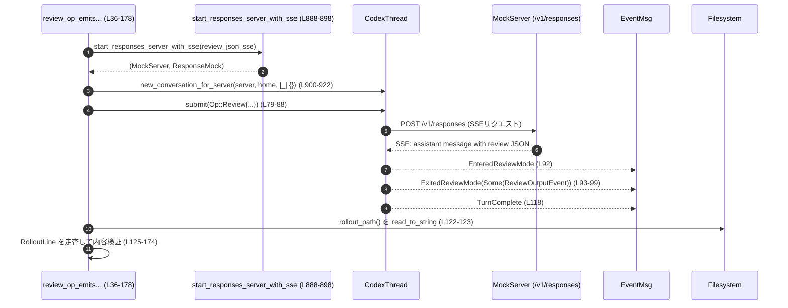
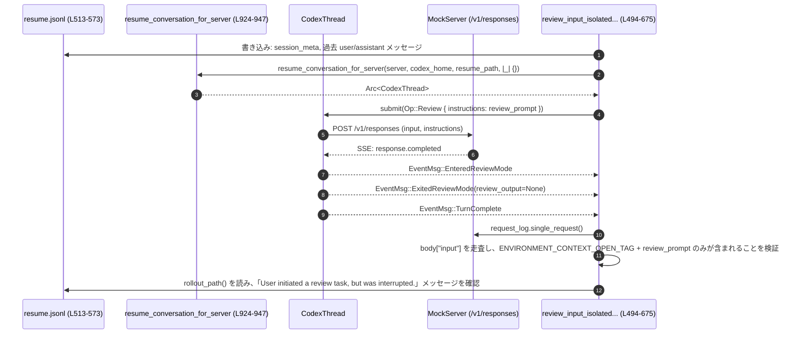

# core/tests/suite/review.rs コード解説

## 0. ざっくり一言

このファイルは、`Op::Review` によるレビュー機能の **エンドツーエンド動作** を検証する統合テスト群と、そのためのテスト用ヘルパー関数をまとめたモジュールです。  
モックの Responses API（SSE サーバー）と `CodexThread` を組み合わせて、レビュー専用スレッドのライフサイクル・イベント・モデル選択・履歴の扱い・git 連携などの契約を確認します。

---

## 1. このモジュールの役割

### 1.1 概要

このモジュールは **レビュー専用のサブスレッド機構** をテストし、次のような問題を検証します。

- `Op::Review` を送ったときの **イベントライフサイクル**  
  `EnteredReviewMode` → `ExitedReviewMode` → `TurnComplete` の順序と内容  
  （例: `review_op_emits_lifecycle_and_review_output`  
  `core/tests/suite/review.rs:L36-178`）
- モデルから返る出力が  
  - 構造化 JSON の場合  
  - プレーンテキストのみの場合  
  それぞれで `ReviewOutputEvent` としてどのように構造化されるか
- レビュー用モデルの選択ロジック（`config.review_model` と `config.model` の優先順位）
- レビュー用サブスレッドと **親セッションの履歴の分離と共有の境界**：
  - レビュー開始時には親のチャット履歴を入力に含めない
  - レビュー終了後には、レビュー結果を親セッションの履歴として利用可能にする
- `/review` コマンドが、オーバーライドされた `cwd` を使って git の merge-base を計算していること

### 1.2 アーキテクチャ内での位置づけ

このテストモジュールは、以下のコンポーネントの結合部分をカバーしています。

- `CodexThread`（コア会話スレッド）  
- `codex_protocol::protocol::Op::Review`（レビュー操作）  
- SSE ベースの Responses API クライアント  
- `EventMsg::{EnteredReviewMode, ExitedReviewMode, TurnComplete, AgentMessage*}` などのイベントストリーム  
- `ReviewOutputEvent` とロールアウトファイル（JSONL）の連携  
- git を使ったベースブランチレビュー用の merge-base 計算

代表的なフロー（構造化レビュー JSON のケース）を図示します。



（行番号は `core/tests/suite/review.rs` 基準です）

### 1.3 設計上のポイント

コードから読み取れる設計上の特徴は次の通りです。

- **レビュー専用スレッドのライフサイクルを明示的に検証**
  - `EventMsg::EnteredReviewMode` / `EventMsg::ExitedReviewMode` / `EventMsg::TurnComplete` の順序と有無を `wait_for_event` で検証しています  
    （例: `review_op_emits_lifecycle_and_review_output`  
    `core/tests/suite/review.rs:L91-118`）。
- **構造化出力とフォールバック出力の両方をテスト**
  - JSON 文字列がパースできる場合は `ReviewOutputEvent` に完全にマッピングされること  
    （`L46-62` で JSON を構成し、`L101-117` で期待値を組み立て比較）。
  - JSON でないプレーンテキストの場合は、`overall_explanation` のみを埋めたフォールバック `ReviewOutputEvent` が生成されること  
    （`review_op_with_plain_text_emits_review_fallback`  
    `L189-227`）。
- **イベントフィルタリングの契約**
  - レビュー中は、通常のチャットで発火する `AgentMessageContentDelta` / `AgentMessageDelta` などが UI に流れないことをテスト  
    （`review_filters_agent_message_related_events`  
    `L234-303`）。
- **モデル選択の優先順位**
  - `Config.review_model` が設定されている場合はそれを優先し、未設定なら `Config.model` を使うこと  
    （`review_uses_custom_review_model_from_config` `L387-440`、  
      `review_uses_session_model_when_review_model_unset` `L442-492`）。
- **履歴の分離・統合のルール**
  - レビュー専用スレッドは、API の `input` には親セッションの履歴を含めない（`review_input_isolated_from_parent_history` `L494-641`）。
  - 一方で、レビュー完了後には「レビューを実行したこと」と「レビューのアシスタント出力」が親セッションの後続ターンの入力に含まれる（`review_history_surfaces_in_parent_session` `L677-772`）。
- **環境依存処理のテスト**
  - `git` コマンドを使って一時リポジトリを構築し、`/review` がオーバーライドされた `cwd` を用いて merge-base SHA をプロンプトに含めているか検証  
    （`review_uses_overridden_cwd_for_base_branch_merge_base` `L778-882`）。

---

## 2. 主要な機能一覧

このファイルが提供する主な機能（テストケース／ヘルパー）は以下です。

- レビューライフサイクルと構造化出力の検証:
  - `review_op_emits_lifecycle_and_review_output`: 構造化 JSON が返る場合のレビューイベントとロールアウトを検証。
- プレーンテキスト出力時のフォールバック検証:
  - `review_op_with_plain_text_emits_review_fallback`: JSON でないテキストを `ReviewOutputEvent` にフォールバックする契約を検証。
- レビュー中のストリーミングイベント抑制:
  - `review_filters_agent_message_related_events`: `AgentMessage*Delta` イベントが UI に出ないことを保証。
  - `review_does_not_emit_agent_message_on_structured_output`: 構造化レビュー時に非ストリーミングの最終 `AgentMessage` が 1 件だけ出ることを検証。
- モデル選択ロジック:
  - `review_uses_custom_review_model_from_config`: `review_model` があればそれを使う。
  - `review_uses_session_model_when_review_model_unset`: `review_model` がなければセッションの `model` を使う。
- 親セッション履歴との連携:
  - `review_input_isolated_from_parent_history`: レビュー開始時の API 入力から親履歴を排除しつつ、`REVIEW_PROMPT` を instructions に入れることを検証。
  - `review_history_surfaces_in_parent_session`: レビュー完了後の親ターンの入力に「レビュー開始メッセージ」と「レビュー結果」が含まれることを検証。
- git ベースのレビューコンテキスト:
  - `review_uses_overridden_cwd_for_base_branch_merge_base`: オーバーライドされた `cwd` を使って base branch の merge-base SHA を取得し、レビュー入力に含めることを検証。
- テスト用インフラ:
  - `start_responses_server_with_sse`: MockServer に対して指定の SSE ストリームをマウント。
  - `new_conversation_for_server`: MockServer をエンドポイントとして使う `CodexThread` を構築。
  - `resume_conversation_for_server`: 既存のロールアウトファイルからセッションを再開する `CodexThread` を構築。

---

## 3. 公開 API と詳細解説

### 3.1 関数インベントリ（コンポーネント一覧）

このファイル内で定義されているのはテスト関数とテスト用ヘルパー関数のみで、新しい構造体や列挙体は定義されていません。  
関数レベルのコンポーネント一覧を以下に示します。

| 名前 | 種別 | 行範囲 | 役割 / 用途 |
|------|------|--------|-------------|
| `review_op_emits_lifecycle_and_review_output` | 非公開 async テスト | L36-178 | 構造化レビュー JSON 受信時のライフサイクル/`ReviewOutputEvent`/ロールアウトを検証 |
| `review_op_with_plain_text_emits_review_fallback` | 非公開 async テスト | L180-232 | プレーンテキストのみ返る場合の `ReviewOutputEvent` フォールバック挙動を検証 |
| `review_filters_agent_message_related_events` | 非公開 async テスト | L234-303 | レビュー中に `AgentMessageContentDelta`/`AgentMessageDelta` が外部に出ないことを検証 |
| `review_does_not_emit_agent_message_on_structured_output` | 非公開 async テスト | L305-385 | 構造化レビュー出力時に最終 `AgentMessage` が 1 件だけ発火することを検証 |
| `review_uses_custom_review_model_from_config` | 非公開 async テスト | L387-440 | `config.review_model` が設定されている場合にそのモデルが API リクエストに使われることを検証 |
| `review_uses_session_model_when_review_model_unset` | 非公開 async テスト | L442-492 | `review_model` 未設定時にセッション `model` が使われることを検証 |
| `review_input_isolated_from_parent_history` | 非公開 async テスト | L494-675 | レビュー API 入力が親履歴を含まず、環境コンテキスト＋レビュー指示のみになること、`REVIEW_PROMPT` が instructions に入ること、割り込みメッセージがロールアウトに記録されることを検証 |
| `review_history_surfaces_in_parent_session` | 非公開 async テスト | L677-776 | レビュー完了後にレビュー関連メッセージが親セッションの次ターン入力に反映されることを検証 |
| `review_uses_overridden_cwd_for_base_branch_merge_base` | 非公開 async テスト | L778-886 | `OverrideTurnContext` で上書きされた `cwd` を使って git の HEAD SHA をレビュー入力に含めることを検証 |
| `run_git` | ローカル関数 | L793-807 | 一時リポジトリで git コマンドを実行し、失敗時には assert でテストを落とすユーティリティ |
| `start_responses_server_with_sse` | 非公開 async ヘルパー | L888-898 | MockServer に対して与えられた SSE ストリーム（複製）をマウントし、リクエストログを返す |
| `new_conversation_for_server` | 非公開 async ヘルパー | L900-922 | MockServer を base_url として持つ `CodexThread` を新規構築する |
| `resume_conversation_for_server` | 非公開 async ヘルパー | L924-947 | ロールアウトファイルからセッションを再開する `CodexThread` を構築する |

※ 行範囲は `core/tests/suite/review.rs` のコメント・属性を含むブロック全体を指します。

### 3.2 重要関数の詳細

以下では、仕様の中心となる 7 つのテスト関数について詳細を整理します。

---

#### `review_op_emits_lifecycle_and_review_output()`

**概要**

構造化されたレビュー JSON を返すモック SSE サーバーを用いて、`Op::Review` 実行時に

1. レビューライフサイクルイベントが `EnteredReviewMode` → `ExitedReviewMode(Some(..))` → `TurnComplete` の順に発火すること  
2. `ExitedReviewMode` に含まれる `review_output` が期待どおりの `ReviewOutputEvent` になること  
3. 親セッションのロールアウトに、レビュー結果のヘッダ・フォーマット済み finding・アシスタントのプレーンテキストが適切に記録されること

を検証します（`core/tests/suite/review.rs:L36-178`）。

**引数**

- テスト関数のため引数はありません。

**戻り値**

- `()`（テスト関数なので戻り値は使用されません）。

**内部処理の流れ**

1. **ネットワーク制限下ではスキップ**  
   `skip_if_no_network!()` を呼び出して Codex サンドボックスで外部接続ができない場合にテストをスキップします（L41-42）。
2. **レビュー JSON を文字列として構成**  
   `serde_json::json!` で `ReviewOutputEvent` 相当の JSON を組み立て、文字列化します（L46-63）。  
   JSON には `findings[0].code_location` なども含まれます。
3. **SSE テンプレートとの合成**  
   SSE JSON テンプレート `sse_template` に対し、`__REVIEW__` プレースホルダをエスケープ済み JSON 文字列で置き換え、`sse_raw` を作成します（L64-72）。
4. **MockServer の起動と CodexThread の構築**  
   `start_responses_server_with_sse(&sse_raw, 1)` で SSE を返す MockServer を起動し、  
   `new_conversation_for_server(&server, codex_home, |_| {})` で `CodexThread` を生成します（L73-76）。
5. **`Op::Review` の送信**  
   `codex.submit(Op::Review { .. }).await.unwrap()` でレビューターンを開始します（L79-89）。
6. **イベントライフサイクルの検証**
   - `wait_for_event` で `EventMsg::EnteredReviewMode(_)` を待機（L92）。
   - 次に `EventMsg::ExitedReviewMode(_)` を取得し、`review_output` が `Some` であることを `expect` します（L93-99）。
7. **`ReviewOutputEvent` の内容検証**
   - テスト内で期待値 `expected: ReviewOutputEvent` を構築（L101-116）。
   - `assert_eq!(expected, review)` で構造体ごと比較（L117）。
8. **`TurnComplete` の発火確認**  
   再度 `wait_for_event` で `EventMsg::TurnComplete(_)` を待ちます（L118）。
9. **ロールアウト JSONL の検証**
   - `codex.rollout_path()` からファイルパスを取得し、`read_to_string` で中身を取得（L122-123）。
   - 各行を `serde_json::Value` → `RolloutLine` にパースして走査（L130-136）。
   - `user` ロールのメッセージ中に
     - `"full review output from reviewer model"` を含むヘッダが存在すること（L137-142）
     - `"- Prefer Stylize helpers — /tmp/file.rs:10-20"` を含むフォーマット済み finding が存在すること（L143-145）
     を確認。
   - `assistant` ロールのメッセージ中に
     - `<user_action>` を含むものが **ない** こと（L151-153）
     - `render_review_output_text(&expected)` と完全一致するテキストが存在すること（L154-156）
     を確認。
10. **MockServer の検証**  
    `server.verify().await` で期待どおりの回数・形でリクエストが来ていることを確認します（L177）。

**Errors / Panics**

- `unwrap` / `expect` / `assert_eq` / `assert!` を多数使用しており、条件を満たさないとテストが失敗します。
- モックサーバーのレスポンス形式が期待と異なる場合や、ロールアウトのパースに失敗した場合にも `expect("...")` で panic します。

**Edge cases（エッジケース）**

- このテストは「構造化 JSON が返る正常系」のみを扱います。JSON が不正な場合やフィールド不足の場合の挙動は、この関数からは分かりません（フォールバックは別テストで検証）。

**使用上の注意点**

- ここで構築する JSON 形式が、実際の本番システムで期待するフォーマットに対応していることが前提です。
- `ReviewOutputEvent` フィールドの追加・変更を行う場合は、このテストの JSON 構築部分（L46-62）と期待値構築部分（L101-116）も同期して更新する必要があります。

---

#### `review_op_with_plain_text_emits_review_fallback()`

**概要**

モデルが JSON ではなくプレーンテキストだけを返した場合に、レビューサブスレッドが

- ライフサイクルイベント（Entered/Exited/TurnComplete）を通常どおり発火し、
- `ReviewOutputEvent` の `overall_explanation` にのみプレーンテキストを入れたフォールバックオブジェクトを返す

ことを検証します（`L180-232`）。

**内部処理の流れ**

1. `skip_if_no_network!()` でネットワーク制限時はスキップ（L187）。
2. SSE ストリーム `sse_raw` を、`content[0].text == "just plain text"` の assistant メッセージで構成（L189-195）。
3. `start_responses_server_with_sse` と `new_conversation_for_server` で MockServer と `CodexThread` を準備（L196-199）。
4. `Op::Review` を送信（L201-211）。
5. `EnteredReviewMode` / `ExitedReviewMode` を `wait_for_event` で取得し、`review_output` が `Some` であることを検証（L213-220）。
6. 期待される `ReviewOutputEvent` を `ReviewOutputEvent { overall_explanation: "just plain text".into(), ..Default::default() }` として構築し（L223-225）、`assert_eq!` で比較（L227）。
7. `TurnComplete` を確認し（L228）、MockServer を検証（L230-231）。

**Errors / Panics**

- JSON ではなくても `ReviewOutputEvent` へのフォールバックが行われることが前提です。もし実装側がフォールバックを行わないと `assert_eq!` が失敗します。
- モックレスポンスの形式が変わると `start_responses_server_with_sse` 内やイベント処理で panic する可能性があります。

**Edge cases**

- プレーンテキストが空文字列であった場合の挙動はこのテストからは読み取れません（`"just plain text"` 固定）。
- JSON だが一部フィールドのみ存在する場合、どのようにフォールバックするかは他のコードまたはテストを見る必要があります。

**使用上の注意点**

- 本テストにより、「レビューエンドポイントは、モデルがレビュー専用の JSON 形式を返さなくても最低限の説明を `overall_explanation` として返す」契約になっていると解釈できます。

---

#### `review_filters_agent_message_related_events()`

**概要**

レビュー中のイベントストリームから

- `EventMsg::AgentMessageContentDelta`
- `EventMsg::AgentMessageDelta`

といった **ストリーミング関連イベントを UI に流さない** ことを検証します（`L234-303`）。

**内部処理の流れ**

1. `skip_if_no_network!()` でネットワーク制限時はスキップ（L242）。
2. SSE ストリームで「入力中のアシスタントメッセージ」を模したイベント列を定義（L245-257）。
   - `response.output_item.added` → `response.output_text.delta`（2 回）→ `response.output_item.done` → `response.completed`。
3. MockServer と `CodexThread` を構築（L258-261）。
4. `Op::Review` を送信（L263-273）。
5. `wait_for_event` にクロージャを渡し、イベントを順次確認（L279-297）:
   - `TurnComplete` が来たら `true` を返して待機を終了。
   - `EnteredReviewMode` / `ExitedReviewMode` が来たらフラグを立てて続行（L280-287）。
   - `AgentMessageContentDelta` / `AgentMessageDelta` を受け取った場合は即 panic（L290-295）。
   - それ以外は無視。
6. 最後に `saw_entered && saw_exited` を `assert!` してライフサイクルイベントが両方存在することを確認（L299）。

**Errors / Panics**

- ストリーミング関連イベントが review フローの外に漏れると即座に panic します。
- `TurnComplete` が最後まで来ない場合も `wait_for_event` が内部でタイムアウト or panic する実装になっている可能性があります（実装はこのチャンクには現れません）。

**Edge cases**

- `AgentMessage`（非ストリーミングの最終メッセージ）はここでは扱っていません（別テスト `review_does_not_emit_agent_message_on_structured_output` で検証）。

**使用上の注意点**

- このテストから、「レビューサブスレッドはストリーム中間のテキストデルタを UI に見せない」という契約が読み取れます。  
  UI 側では `ExitedReviewMode` と最終 `AgentMessage` のみを扱う前提で設計されていると考えられます。

---

#### `review_does_not_emit_agent_message_on_structured_output()`

**概要**

構造化 JSON によるレビュー出力が行われる場合に、

- ストリーミングイベントは出さず、
- 最終的な `EventMsg::AgentMessage` が **ちょうど 1 回** 発火する

ことを検証するテストです（`L305-385`）。

**内部処理の流れ**

1. 構造化レビュー JSON を用意（`L314-331`）。内容は簡略化された `ReviewOutputEvent` 相当。
2. `sse_template` と合成して `sse_raw` を作成し、MockServer を起動（L332-342）。
3. `CodexThread` を構築し（L343-344）、`Op::Review` を送信（L346-356）。
4. `wait_for_event` でイベントを監視し（L363-378）:
   - `TurnComplete` で終了。
   - `AgentMessage(_)` が来るたびにカウンタ `agent_messages` をインクリメント（L365-367）。
   - `EnteredReviewMode` / `ExitedReviewMode` が来たらフラグを立てて続行。
5. 最終的に `agent_messages == 1` であることを `assert_eq!` し（L380）、`Entered` と `Exited` の両方が発火していることも確認（L381）。

**Errors / Panics**

- `AgentMessage` が 0 回または 2 回以上発火するとテストが失敗します。
- ストリーミングイベントが来た場合はこのテストでは明示的に禁止していませんが、SSE テンプレート上そのようなイベントは送られていません。

**Edge cases**

- 構造化 JSON とプレーンテキストが混在するケースなどは検証されていません。

**使用上の注意点**

- UI はこの最終 `AgentMessage` を表示する設計であると解釈できます。レビュー結果の本体は `ExitedReviewMode` の `review_output` として受け取りつつ、「ユーザー向けのまとめ」はこれに対応するアシスタントメッセージとして送出されます。

---

#### `review_uses_custom_review_model_from_config()`

**概要**

`Config.review_model` が設定されている場合、レビューリクエストの HTTP ボディの `"model"` フィールドが **セッションモデルではなく `review_model`** に設定されることを検証します（`L387-440`）。

**内部処理の流れ**

1. SSE として `response.completed` のみを返す最小ストリームを構成（L393-396）。
2. `start_responses_server_with_sse` で MockServer と `request_log` を起動（L397-398）。
3. `new_conversation_for_server` に `mutator` を渡し、`Config` に対して
   - `cfg.model = Some("gpt-4.1".to_string());`
   - `cfg.review_model = Some("gpt-5.1".to_string());`
   を設定（L401-404）。
4. `Op::Review` を送信（L407-417）。
5. レビューライフサイクルイベント（`EnteredReviewMode`, `ExitedReviewMode(review_output: None)`, `TurnComplete`）が発火するのを待機（L419-430）。
6. `request_log.single_request()` から HTTP リクエストを取得し、以下を確認（L433-436）。
   - `request.path() == "/v1/responses"`
   - `body["model"].as_str().unwrap() == "gpt-5.1"`

**Errors / Panics**

- `review_model` を設定しない実装になっていると `assert_eq!(..., "gpt-5.1")` が失敗します。
- SSE 側は `response.completed` しか返さないため、レビュー出力は `None` が期待されています（`ExitedReviewModeEvent { review_output: None }` をマッチ、L421-427）。

**Edge cases**

- `review_model` が設定されているが後から `OverrideTurnContext` でモデル上書きが行われるケースはこのテストでは扱っていません。

**使用上の注意点**

- 本テストから、レビュー用モデルはセッション全体の `model` と独立して設定可能で、レビュー専用の重いモデルなどに切り替える設計であることが読み取れます。

---

#### `review_uses_session_model_when_review_model_unset()`

**概要**

`review_model` が `None` の場合に、レビューリクエストがセッションの `model` を使用することを検証します（`L442-492`）。

**内部処理の流れ**

1. SSE には `response.completed` のみ（L449-451）。
2. `new_conversation_for_server` に `cfg.model = Some("gpt-4.1")`, `cfg.review_model = None` を設定する `mutator` を渡す（L455-458）。
3. `Op::Review` を送信（L461-471）。
4. ライフサイクルイベントを確認（L473-483）。
5. `request_log.single_request()` から `body["model"]` が `"gpt-4.1"` であることを検証（L485-488）。

**Errors / Panics / Edge cases**

- `review_model` のデフォルト処理（`None` → session model）が変わるとテストが fail します。

**使用上の注意点**

- モデル設定の優先順位は「`OverrideTurnContext`（あれば） > `review_model`（あれば） > `model`」と推測されますが、`OverrideTurnContext` との組み合わせは別箇所のコードを確認する必要があります（このチャンクには現れません）。

---

#### `review_input_isolated_from_parent_history()`

**概要**

既存の会話履歴（ユーザー・アシスタントの過去メッセージ）を含んだセッションから `/review` を開始した場合でも、

- レビュー用 HTTP リクエストの `input` には **親の履歴が含まれず**、
- 環境コンテキスト（`ENVIRONMENT_CONTEXT_OPEN_TAG` で始まるテキスト）とレビュー指示テキストのみが入ること
- `instructions` には `REVIEW_PROMPT` がセットされること
- 加えて「ユーザーがレビュータスクを開始したが、中断された」というメッセージがロールアウトに記録されること

を検証します（`L494-675`）。

**内部処理の流れ**

1. MockServer を `response.completed` のみ返すように設定（L503-508）。
2. 一時ディレクトリ `codex_home` を作成し、`resume.jsonl` に過去セッションの履歴を記録（L511-573）。
   - `session_meta` 行（セッション ID, cwd, モデルプロバイダなど）を JSON として書き込む（L518-529）。
   - 過去ユーザーメッセージとアシスタントメッセージを `type: "response_item"` として書き込む（L534-572）。
3. `resume_conversation_for_server` でこの `resume.jsonl` から会話を再開（L574-576）。
4. レビュープロンプト `"Please review only this"` を指定して `Op::Review` を送信（L579-589）。
5. `EnteredReviewMode` → `ExitedReviewMode(review_output: None)` → `TurnComplete` を待機（L592-602）。
6. HTTP リクエストボディを取得し、`input` 配列を検査（L604-612）。
   - 少なくとも 2 つ以上のメッセージが存在すること（環境コンテキスト＋ユーザー指示）。
7. `ENVIRONMENT_CONTEXT_OPEN_TAG` で始まるテキストを探し、その中に `<cwd>` が含まれることを確認（L614-623）。
8. `review_prompt` と完全一致するテキストが `input` のいずれかのメッセージに存在することを確認（L626-635）。
9. `body["instructions"] == REVIEW_PROMPT` であることを検証（L638-640）。
10. ロールアウトファイルを読み出し、ユーザーメッセージの中に  
    `"User initiated a review task, but was interrupted."` を含むものが存在することを検証（L642-671）。

**Errors / Panics**

- `resume.jsonl` のフォーマットが変わると `resume_conversation_for_server` 側でエラーになる可能性があります（詳細はこのチャンクには現れません）。
- レビュー実装が親履歴を `input` に含めるように変更されると、このテストが失敗する設計です。

**Edge cases**

- 親履歴に非常に多くのメッセージがある場合の挙動（size 制限など）は検証されていません。
- レビュー中にユーザーが再度操作して中断するようなケースの詳細な扱いは、このテストで検証している割り込みメッセージ文言から一部推測できますが、完全な挙動は他のコードに依存します。

**使用上の注意点**

- `/review` を開始する際に「親のチャット文脈をレビューに混ぜない」設計であるため、レビュー対象は明示的に `ReviewTarget` とユーザー指示で伝える必要があります。
- 一方で、レビュー開始自体は親履歴の一部として記録されるため、後続ターンで「さきほどのレビューについて」といった参照が可能になります（別テスト `review_history_surfaces_in_parent_session` 参照）。

---

#### `review_history_surfaces_in_parent_session()`

**概要**

レビューサブスレッドで行われた会話内容が、**次の親セッションターンの入力として利用可能になる** ことを検証します（`L677-776`）。

**内部処理の流れ**

1. MockServer は 2 回のリクエストに対し同じ SSE（アシスタントメッセージ `"review assistant output"` を含む）を返すよう設定（L683-692）。
2. `new_conversation_for_server` で `CodexThread` を作成（L693-694）。
3. 1 回目のターンとして `Op::Review` を送信（L697-705）。
   - `EnteredReviewMode` → `ExitedReviewMode(review_output: Some(_))` → `TurnComplete` を確認（L708-718）。
4. 2 回目のターンとして、通常の `Op::UserInput` を送信（L721-731）。
5. `request_log.requests()` から 2 件の HTTP リクエストを取得し、2 件とも path が `/v1/responses` であることを確認（L738-742）。
6. 2 件目（親ターン）の `body["input"]` を検査（L743-744）。
   - 最後のメッセージがユーザーであり、そのテキストが `"back to parent"` であること（L746-750）。
   - 入力内のどこかに `"User initiated a review task."` を含むメッセージがあること（L753-758）。
   - 入力内のどこかに `"review assistant output"` を含むメッセージがあること（L759-764）。

**Errors / Panics**

- レビューサブスレッドの履歴が親セッションに反映されない実装になっていると、`contains_review_rollout_user` / `contains_review_assistant` の `assert!` が失敗します（L765-771）。

**Edge cases**

- レビューを複数回実行した場合の履歴マージ方法や、履歴が長くなった場合のトリミング戦略などは、このテストからは分かりません。

**使用上の注意点**

- 「レビュー自体は子スレッドで孤立して実行されるが、その結果は親スレッドの履歴として後続ターンに持ち込まれる」という設計が明示されています。
- そのため、アプリケーション側で「レビュー結果を踏まえた次の修正提案」などを実装する際には、親セッションから `input` の中のレビュー関連メッセージを参照することが想定されます。

---

#### `review_uses_overridden_cwd_for_base_branch_merge_base()`

**概要**

`Op::OverrideTurnContext` で `cwd` を一時リポジトリに変更した後に `/review` を実行した場合、レビュー用プロンプト内に **そのリポジトリの HEAD SHA（＝ merge-base）** が含まれることを検証します（`L778-886`）。

**内部処理の流れ**

1. MockServer は `response.completed` のみ返す（L784-786）。
2. `TempDir` を使って
   - 初期 `cwd` 用ディレクトリ `initial_cwd`（L788）。
   - git リポジトリ用ディレクトリ `repo_dir`（L790-791）。
   を作成。
3. ローカル関数 `run_git(repo_path, args)` を定義し、`git -C <repo_path> ...` を実行。失敗したら `assert!` でエラー内容を出力してテストを落とす（L793-807）。
4. `repo_path` 上で:
   - `git init -b main`
   - ユーザー情報設定
   - `file.txt` を作成し commit  
   を順に実行して、`HEAD` を持つリポジトリを作成（L809-814）。
5. `git rev-parse HEAD` で HEAD の SHA を取得し、文字列として保持（L816-826）。
6. `new_conversation_for_server` で `config.cwd` を `initial_cwd.abs()` に設定した `CodexThread` を構築（L828-833）。
7. `codex.submit(Op::OverrideTurnContext { cwd: Some(repo_path.to_path_buf()), ... })` でターンコンテキストの `cwd` を git リポジトリに変更（L835-848）。
8. その後 `/review` を `ReviewTarget::BaseBranch { branch: "main".to_string() }` として送信（L852-860）。
9. `EnteredReviewMode` と `TurnComplete` を待機（L864-865）。
10. HTTP リクエストを取得し、`input` 内のメッセージテキスト（`msg["content"][0]["text"]`）のいずれかが `head_sha` を含むことを検証（L872-881）。

**Errors / Panics**

- git コマンドが存在しない、あるいは失敗する場合 `run_git` 内の `assert!` でテストが失敗します。
- 実装が merge-base SHA をプロンプトに含めなくなった場合、`saw_merge_base_sha` の `assert!` が失敗します（L875-881）。

**Edge cases**

- ブランチ名 `"main"` が存在しない場合の挙動などは、このテストからは分かりません（テストでは必ず `"main"` を作成）。

**使用上の注意点**

- このテストから、ベースブランチレビューは git の状態に依存し、`cwd` の解決順序が
  - セッション `cwd`
  - `OverrideTurnContext.cwd`
  などの優先順位にも影響することが分かります。  
  実際の使用時には、レビュー対象のリポジトリを指す `cwd` を適切に設定してから `/review` を実行する必要があります。

---

### 3.3 その他の関数

ヘルパー関数およびローカル関数の一覧です。

| 関数名 | 行範囲 | 役割（1 行） |
|--------|--------|--------------|
| `run_git(repo_path: &Path, args: &[&str])` | L793-807 | 指定パスで `git` コマンドを実行し、失敗したら詳細ログ付きで `assert!` するローカルユーティリティ |
| `start_responses_server_with_sse(sse_raw: &str, expected_requests: usize)` | L888-898 | MockServer を起動し、指定回数だけ同じ SSE を返すように `mount_sse_sequence` を設定する |
| `new_conversation_for_server<F>(server: &MockServer, codex_home: Arc<TempDir>, mutator: F)` | L900-922 | `test_codex()` ビルダーを用い、`Config` の `model_provider.base_url` を MockServer に設定しつつ、呼び出し元が追加設定できるようにする |
| `resume_conversation_for_server<F>(server: &MockServer, codex_home: Arc<TempDir>, resume_path: PathBuf, mutator: F)` | L924-947 | 上記と同様だが、`builder.resume(...)` を使って既存ロールアウトファイルからセッションを再開 |

---

## 4. データフロー

### 4.1 レビュー開始時の入力構築フロー（親履歴の隔離）

`review_input_isolated_from_parent_history` を例に、レビュー開始時のデータフローを図示します。



このフローから分かるポイント:

- API リクエスト `body["input"]` には、親セッションから復元した過去の user/assistant メッセージは含まれず、環境コンテキストとレビュー指示のみが送信されます（`L614-635`）。
- 一方で、ロールアウトファイルには「レビュータスク開始」と「割り込み」の情報が追記され、後続ターンで参照できる状態になっています（`L642-671`）。

---

## 5. 使い方（How to Use）

このファイルはテストコードですが、ここから `/review` API の典型的な使い方を推測できます。

### 5.1 基本的な使用方法

最も単純なカスタムレビュー（`ReviewTarget::Custom`）の流れは、`review_op_emits_lifecycle_and_review_output` に現れています（`L79-99`）。

```rust
use codex_core::CodexThread;
use codex_protocol::protocol::{Op, ReviewRequest, ReviewTarget, EventMsg};
// ... CodexThread のセットアップは省略（テストでは new_conversation_for_server を使用）

async fn run_review(codex: &CodexThread) {
    // 1. レビューを開始する
    codex
        .submit(Op::Review {
            review_request: ReviewRequest {
                target: ReviewTarget::Custom {
                    instructions: "Please review my changes".to_string(),
                },
                user_facing_hint: None,
            },
        })
        .await
        .unwrap();

    // 2. ライフサイクルイベントを待つ（テストでは wait_for_event を使用）
    // 実際のアプリケーションでは、イベントストリームを購読して
    // EnteredReviewMode / ExitedReviewMode / TurnComplete をハンドリングする設計になります。
}
```

### 5.2 よくある使用パターン

1. **構造化レビュー JSON を期待するパターン**

   - モデル側でレビュー専用フォーマットの JSON を返し、それを `ReviewOutputEvent` として消費する。
   - UI は `ExitedReviewMode(review_output: Some(_))` をもとにレビュー結果を構造的に表示し、最終 `AgentMessage` をテキストとして表示する  
     （`review_op_emits_lifecycle_and_review_output`, `review_does_not_emit_agent_message_on_structured_output`）。

2. **プレーンテキストのみを返す軽量レビュー**

   - モデルが JSON 出力をサポートしない場合でも、プレーンテキストを `overall_explanation` として扱うことで最低限のレビューを実現  
     （`review_op_with_plain_text_emits_review_fallback`）。

3. **ベースブランチレビュー**

   - 現在の `cwd` または `OverrideTurnContext.cwd` を git リポジトリに向け、`ReviewTarget::BaseBranch { branch: "main".to_string() }` で `/review` を実行  
     （`review_uses_overridden_cwd_for_base_branch_merge_base`）。

4. **モデル切り替え**

   - 設定ファイル（`Config`）で `review_model` を指定し、レビュー時だけより高精度のモデルを使用  
     （`review_uses_custom_review_model_from_config` / `review_uses_session_model_when_review_model_unset`）。

### 5.3 よくある間違い（推測されるもの）

コードから想定される誤用と正しい使い方の対比です。

```rust
// 誤りの例: review_model を設定したつもりが、config.model しか設定していない
// → /review でも通常のチャットモデルが使われてしまう可能性がある
cfg.model = Some("gpt-4.1".to_string());
// cfg.review_model = Some("gpt-5.1".to_string()); // これを忘れている

// 正しい例: レビュー専用モデルを明示的に設定する
cfg.model = Some("gpt-4.1".to_string());
cfg.review_model = Some("gpt-5.1".to_string());
```

```rust
// 誤りの例: 親セッションの履歴を review 用の input にそのまま渡してしまう
// （この実装は review_input_isolated_from_parent_history の契約違反）
let input = build_input_from_full_history_and_review_prompt();

// 正しい例: review 用の input は環境コンテキスト + レビュープロンプトのみ
let input = vec![
    build_environment_context_message(), // ENVIRONMENT_CONTEXT_OPEN_TAG を含む
    build_user_review_prompt_message(),  // review_prompt のみ
];
```

### 5.4 使用上の注意点（まとめ）

- **ライフサイクルイベント**
  - `/review` 実行時には必ず `EnteredReviewMode` → `ExitedReviewMode` → `TurnComplete` の順にイベントが発火する前提です（`L91-118` など）。
  - アプリケーション側はこれらを前提に UI の状態遷移を構築できます。
- **ストリーミングイベントの扱い**
  - レビュー中は `AgentMessageContentDelta` / `AgentMessageDelta` を UI に表示しない契約になっています（`L234-303`）。
- **モデル選択**
  - レビュー用モデルを変えたい場合は `Config.review_model` を設定します。  
    未設定の場合はセッション `model` が使われます（`L387-440`, `L442-492`）。
- **履歴の隔離と共有**
  - レビュー開始時の API 入力には親履歴を含めてはいけませんが（`L614-635`）、レビュー完了後にはレビュー関連メッセージを親セッションの後続ターンに含める設計です（`L753-764`）。
- **git 依存**
  - ベースブランチレビューは git の状態に依存するため、`cwd` とリポジトリの状態が正しくセットされていることが前提です（`L793-826`）。

---

## 6. 変更の仕方（How to Modify）

### 6.1 新しいレビュー機能を追加する場合（テスト観点）

1. **仕様の整理**
   - 追加したいレビュー機能（例: 新しい `ReviewTarget` バリアント、`ReviewOutputEvent` のフィールド追加など）に対して、期待するイベントシーケンスと API 入力／出力形式を整理します。
2. **既存テストのパターンを流用**
   - ライフサイクル → 出力 → ロールアウト → 親セッションへの反映、という流れは  
     `review_op_emits_lifecycle_and_review_output` や `review_history_surfaces_in_parent_session` を基礎としてコピーできます。
3. **SSE フィクスチャを追加**
   - `start_responses_server_with_sse` を使い、新しい挙動に対応した SSE JSON を作成します（`L888-898`）。
4. **Config / OverrideTurnContext の組み合わせ**
   - モデルや cwd に依存する場合は、`review_uses_custom_review_model_from_config` や `review_uses_overridden_cwd_for_base_branch_merge_base` のように `mutator` や `Op::OverrideTurnContext` を活用します。

### 6.2 既存の機能を変更する場合

- **イベント順序や種類を変更する場合**
  - 関連するテスト（特に `review_op_emits_lifecycle_and_review_output`, `review_filters_agent_message_related_events`）の `wait_for_event` 条件や `assert!` をすべて確認する必要があります。
- **`ReviewOutputEvent` 構造の変更**
  - JSON 構築部（L46-62, L314-330 など）と期待値構築部（L101-116, L223-225）を更新します。
  - `render_review_output_text` の出力フォーマットが変わる場合、ロールアウト検証（L127-174）も合わせて変更が必要です。
- **モデル選択ロジックの変更**
  - `review_uses_custom_review_model_from_config` / `review_uses_session_model_when_review_model_unset` の期待値（`body["model"]`）を更新します。
- **履歴・ロールアウト形式の変更**
  - `resume.jsonl` の形式やロールアウトファイルの JSON 形式を変える場合は、`review_input_isolated_from_parent_history` と `review_history_surfaces_in_parent_session` の JSON パース部分（L518-571, L642-671, L753-764）を確認し、必要に応じて更新します。

---

## 7. 関連ファイル

このモジュールと密接に関係する型・機能は他ファイルで定義されています。ここでは、このファイルから参照されている外部コンポーネントのみ列挙します（定義はこのチャンクには現れません）。

| パス / 型 | 役割 / 関係 |
|-----------|------------|
| `codex_core::CodexThread` | 会話スレッド本体。`submit(Op)` を通じて `/review` や `/override` 操作を実行する（使用箇所: L76, L199, L261, L344, L405 など）。 |
| `codex_core::config::Config` | モデル名や `cwd` などの設定を保持。`new_conversation_for_server` / `resume_conversation_for_server` の `mutator` で変更される（L401-404, L455-458, L830-832）。 |
| `codex_core::REVIEW_PROMPT` | レビュー用の rubric/instructions テキスト。`instructions` フィールドに設定されることをテスト（L638-640）。 |
| `codex_core::review_format::render_review_output_text` | `ReviewOutputEvent` からユーザー向けのテキストを生成するフォーマッタ。ロールアウト検証に使用（L127-128, L154-156）。 |
| `codex_protocol::protocol::{Op, ReviewRequest, ReviewTarget}` | `/review` 操作、レビューリクエストのターゲット指定などのプロトコル型（使用箇所多数: L80-86, L202-208, L264-270, L347-353, L409-415, L463-469, L582-587, L699-704, L854-860）。 |
| `codex_protocol::protocol::{EventMsg, ExitedReviewModeEvent}` | イベントストリーム上のメッセージ型。ライフサイクルやストリーミングイベントの検証に使用（L92-99, L213-220, L279-297, L363-377, L419-428, L473-481, L592-600, L708-716, L864-865）。 |
| `codex_protocol::protocol::{ReviewOutputEvent, ReviewFinding, ReviewCodeLocation, ReviewLineRange}` | レビュー結果の構造化表現。構造化 JSON の期待値として使用（L101-116, L223-225）。 |
| `codex_protocol::protocol::{RolloutLine, RolloutItem}` | ロールアウトファイル（JSONL）の 1 行を表す型。レビュー結果や割り込みメッセージの検証に使用（L135-160, L651-663）。 |
| `codex_protocol::models::{ResponseItem, ContentItem}` | ロールアウトの `item` 内容、SSE レスポンスのメッセージ内容を扱うモデル型（L5-6, L136-160, L535-563）。 |
| `core_test_support::{test_codex, PathBufExt, wait_for_event, skip_if_no_network, responses::*}` | テスト用のビルダ・パスユーティリティ・イベント待機機構・モックサーバー構築ユーティリティ（L20-27, L73-76, L197-199, L258-261, L397-405, L453-459, L508, L888-898, L900-947）。 |
| `wiremock::MockServer` / `ResponseMock` | SSE を返すモック HTTP サーバーと、そのリクエストログ。レスポンスの中身やリクエストボディの検証に使用（L73-74, L397-398, L691-692 など）。 |

このファイル単体では、上記型の実装詳細までは分かりませんが、ここで列挙したテストから各コンポーネント間の契約（イベントシーケンス、モデル選択、履歴の扱いなど）を読み取ることができます。
