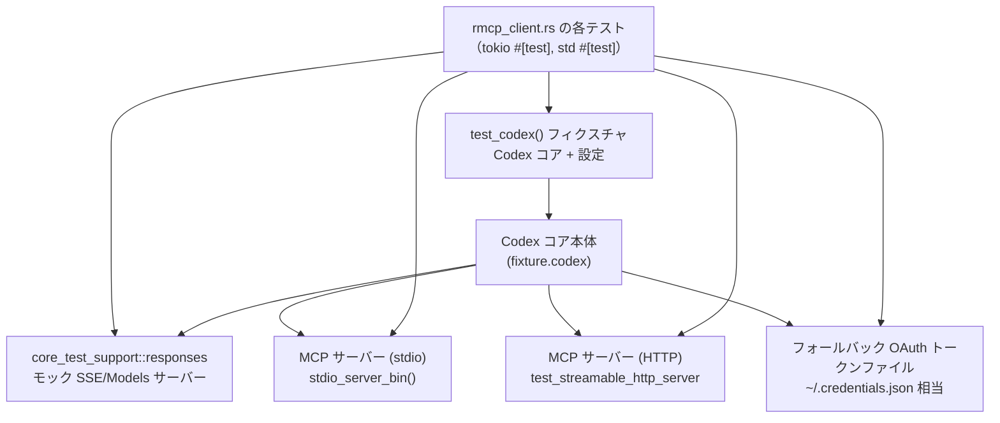
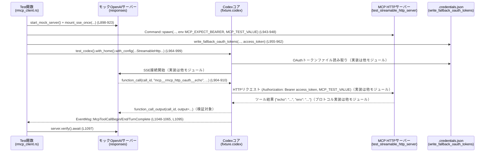

# core/tests/suite/rmcp_client.rs コード解説

## 0. ざっくり一言

`rmcp_client.rs` は、Codex コアが **MCP サーバー**（Model Context Protocol server）とやり取りするクライアントまわりを、エンドツーエンドで検証するテスト群です。  
stdio / HTTP / OAuth 付き Streamable HTTP といった複数のトランスポート、画像ツールや環境変数伝播、テキスト専用モデルでの画像サニタイズを確認します。

> ※ 行番号は、このファイル冒頭を 1 行目とした概算です。厳密さより「だいたいの位置」の目安として理解してください。

---

## 1. このモジュールの役割

### 1.1 概要

このテストモジュールは次の問題を扱います。

- Codex コアが MCP サーバー（stdio / HTTP）を正しく起動・検出し、ツールを呼び出せるか
- MCP サーバーからの **構造化レスポンス**（特に画像）を、OpenAI 互換の関数呼び出し出力に正しく変換できるか
- モデルが画像入力をサポートしない場合に、画像レスポンスをテキストにサニタイズできるか
- MCP サーバーへの環境変数伝播（固定 `env` / ホワイトリスト `env_vars`）が期待通りか
- HTTP MCP サーバーに対して、**OAuth ベアラートークン**をファイルベースのフォールバック認証情報から読み出して付与できるか

これらを、外部バイナリ（テスト用 MCP サーバー）とモック HTTP サーバー（`core_test_support::responses`）を組み合わせた実運用に近い形で検証します。

### 1.2 アーキテクチャ内での位置づけ

主なコンポーネントと依存関係（テスト視点）は次のとおりです。



- テストは `test_codex()` で Codex コアを立ち上げ、`McpServerConfig` を通じて MCP サーバー（stdio / HTTP）を登録します（例: `stdio_server_round_trip`、`streamable_http_tool_call_round_trip` など, L54-196, L691-866）。
- Codex コアは、OpenAI 互換のモック HTTP サーバー（`responses::start_mock_server`, L59, L203 等）と SSE でやり取りし、その中で MCP ツールの呼び出しが指示されます。
- MCP サーバーからのレスポンスは Codex コアで OpenAI 形式の `function_call_output` に変換され、モックサーバーに送られます（画像・テキストサニタイズ検証, L364-375, L531-544）。
- OAuth 付き HTTP テストでは、テスト側で生成したトークンファイルを Codex コアが読み、それを HTTP Authorization ヘッダとして MCP サーバーに渡す前提で検証します（L953-962, L964-997）。

### 1.3 設計上のポイント

コードから読み取れる特徴は次のとおりです。

- **パターン化されたテスト構造**  
  - ほぼ全テストが「モックサーバー準備 → MCP サーバー設定 → ユーザーターン送信 → MCP イベント待機 →結果検証」という同じ流れになっています（例: L86-196, L232-378）。
- **非同期テストと直列化**  
  - 多くは `#[tokio::test(flavor = "multi_thread", worker_threads = 1)]` の非同期テストです（L54, L198, L380, L549, L691, L895）。
  - 環境変数や `CODEX_HOME` に依存するテストは `serial_test::serial` によって直列に実行されるようマーキングされています（例: `#[serial(mcp_test_value)]`, `#[serial(codex_home)]`, L55, L381, L550, L871）。
- **環境変数の管理**  
  - テストコードから OS 環境変数を書き換えるための `EnvVarGuard` が用意されており、Drop 時に元の値を復元します（L1198-1221）。  
  - 実際の MCP 設定では、明示 `env` とホワイトリスト `env_vars` の両経路を検証しています（L91-111, L587-605）。
- **外部プロセスとの協調**  
  - HTTP MCP サーバー用のテストバイナリを `tokio::process::Command` で起動し（L737-741, L943-948）、`kill_on_drop(true)` や明示的な `kill` / `wait` でテスト終了時のクリーンアップを行っています（L851-863, L1099-1110）。
- **堅牢な起動待ちロジック**  
  - `wait_for_streamable_http_server` が MCP HTTP サーバーのメタデータエンドポイントをポーリングし、正常起動・プロセス早期終了・タイムアウトを区別して `anyhow::Result` で返します（L1116-1165）。

---

## 2. 主要な機能一覧

このファイル（テスト）が検証している主な機能は次のとおりです。

- stdio MCP サーバーとの往復:  
  ユーザー入力 → OpenAI モック → MCP ツール呼び出し → MCP 結果 → OpenAI 出力までを検証（L54-196）。
- 画像レスポンスの取り扱い:  
  MCP ツールからの画像データ URLを OpenAI の `input_image` 形式に変換する経路を検証（L198-378）。
- テキスト専用モデルでの画像サニタイズ:  
  画像をサポートしないモデル向けに、画像レスポンスをテキストメッセージに変換することを検証（L380-547）。
- 環境変数の伝播:
  - MCP サーバー設定の `env` による直接指定（L91-101）。
  - `env_vars` ホワイトリスト経由で親プロセスの環境をコピーする挙動（L587-593）。
- Streamable HTTP MCP サーバーとの往復:  
  `McpServerTransportConfig::StreamableHttp` を利用した HTTP MCP サーバーへのツール呼び出しとレスポンス検証（L691-866）。
- OAuth 付き Streamable HTTP MCP サーバー:  
  フォールバックの OAuth トークンファイルからアクセストークンを読み、HTTP MCP サーバーにベアラートークンとして渡す経路を検証（L872-1114, L1167-1195）。
- MCP HTTP サーバー起動待機ロジック:  
  メタデータエンドポイントとプロセス状態を監視して正常起動を待つ補助関数（L1116-1165）。
- 一時的な環境変数ガード:  
  テスト中に OS 環境変数を設定 / 復元するためのガード構造体（L1198-1221）。

---

## 3. 公開 API と詳細解説

### 3.1 型一覧（構造体・定数など）

| 名前 | 種別 | 役割 / 用途 | 定義位置 |
|------|------|-------------|----------|
| `OPENAI_PNG` | `static &str` | テスト用の PNG 画像を表す data URL。画像ツールの入出力検証に使用します。 | `rmcp_client.rs:L52` 付近 |
| `EnvVarGuard` | 構造体 | 環境変数を一時的に上書きし、Drop 時に元の値を復元するためのガードです。 | `rmcp_client.rs:L1198-1201` 付近 |

※ 他の型（`McpServerConfig` など）は他クレートの公開 API であり、このファイルではインスタンス生成・利用のみ行っています。

### 3.2 関数詳細（主要 7 件）

#### stdio_server_round_trip() -> anyhow::Result<()>  （rmcp_client.rs:L54-196 付近）

**概要**

- stdio トランスポートで接続された MCP サーバー（テスト用バイナリ）に対して、`echo` ツールの呼び出しがエンドツーエンドで成功することを検証します。
- MCP サーバーに渡した環境変数が、ツール結果の `structured_content.env` に反映されることも確認します。

**引数**

- なし（テスト関数。フレームワークから呼び出されます）。

**戻り値**

- `anyhow::Result<()>`  
  - テスト成功時は `Ok(())`。  
  - 途中の `?` や `expect` が失敗した場合はテストが失敗します。

**内部処理の流れ**

1. ネットワークが利用できない環境では `skip_if_no_network!(Ok(()))` により早期にテストをスキップします（L57）。
2. OpenAI モックサーバー（SSE）を起動し、MCP ツール呼び出しを含むレスポンスシーケンスをマウントします（L59-81）。
3. `stdio_server_bin()` でテスト用 MCP サーバーバイナリへのパスを取得し、`McpServerConfig` を `Stdio` トランスポートで登録します（L83-113）。
   - `env` に `MCP_TEST_VALUE` を設定している点が重要です（L95-98）。
4. `test_codex()` フィクスチャをビルドし、`fixture.codex.submit(Op::UserTurn { ... })` で「rmcp echo ツールを呼んでほしい」というユーザーターンを送信します（L123-142）。
5. Codex イベントストリームから `McpToolCallBegin` と `McpToolCallEnd` を待ち受け、サーバー名・ツール名が期待通りであることを検証します（L144-161）。
6. `end.result` からツール結果を取り出し、以下を検証します（L163-189）。
   - `is_error == Some(false)`
   - `content` が空（デフォルトが空配列であること）
   - `structured_content` が `{"echo": "ECHOING: ping", "env": "propagated-env"}` であること
7. `TurnComplete` イベントを待ってターンが完了したことを確認し、モックサーバーへのリクエストが期待どおりであったことを `server.verify().await` で検証して終了します（L191-195）。

**Examples（使用例）**

テストコード以外で直接呼び出すことは想定されていませんが、パターンとしては次のような形です。

```rust
#[tokio::test(flavor = "multi_thread", worker_threads = 1)]
async fn my_mcp_stdio_test() -> anyhow::Result<()> {
    // モックサーバー起動と SSE シナリオ設定
    let server = responses::start_mock_server().await;
    mount_sse_once(&server, responses::sse(/* ... */)).await;

    // MCP サーバーの Stdio 設定
    let cmd = stdio_server_bin()?;
    let fixture = test_codex()
        .with_config(move |config| {
            let mut servers = config.mcp_servers.get().clone();
            servers.insert(
                "my_server".to_string(),
                McpServerConfig {
                    transport: McpServerTransportConfig::Stdio {
                        command: cmd,
                        args: Vec::new(),
                        env: None,
                        env_vars: Vec::new(),
                        cwd: None,
                    },
                    enabled: true,
                    required: false,
                    disabled_reason: None,
                    startup_timeout_sec: Some(Duration::from_secs(10)),
                    tool_timeout_sec: None,
                    enabled_tools: None,
                    disabled_tools: None,
                    scopes: None,
                    oauth_resource: None,
                    tools: HashMap::new(),
                },
            );
            config.mcp_servers.set(servers).unwrap();
        })
        .build(&server)
        .await?;

    // ユーザーターン送信とイベント検証
    fixture.codex.submit(Op::UserTurn { /* ... */ }).await?;
    // wait_for_event(...) で Begin/End/TurnComplete を確認
    Ok(())
}
```

**Errors / Panics**

- `stdio_server_bin()?`（L84）や `build(&server).await?`（L119-120）が失敗すると `Err` が返り、テスト失敗となります。
- `expect("...")` や `assert_eq!` などが失敗すると panic し、テストは失敗します（例: L166, L177-178）。
- ネットワークが利用不可の場合は `skip_if_no_network!` により **スキップ** 扱いで終了します（L57）。

**Edge cases（エッジケース）**

- MCP サーバーバイナリが存在しない、起動に失敗する場合は `build` の段階で `Err` になります（`test_codex().build` 内部で spawn に失敗する可能性）。
- モック SSE シナリオが誤っていると、`wait_for_event` が永続待機する可能性がありますが、`wait_for_event` の実装はこのファイルには出てこないため詳細は不明です。
- MCP ツールがエラーを返した場合の `is_error` 振る舞いは、このテストではカバーしていません（常に `Some(false)` を期待）。

**使用上の注意点**

- グローバルな環境変数設定はこのテストでは行っていませんが、MCP サーバーの `env` に値を埋め込んでいます。  
  環境変数経由の設定と混同しないようにする必要があります。
- `serial(mcp_test_value)` を付与しているため、このタグを共有する他テストとの並行実行は行われません（L55）。  
  環境依存のテストを追加する際には、同じタグを使うかどうかを検討する必要があります。

---

#### stdio_image_responses_round_trip() -> anyhow::Result<()>  （rmcp_client.rs:L198-378 付近）

**概要**

- stdio MCP サーバーの画像ツール `image` を呼び出し、MCP サーバーからの画像レスポンスが Codex コア経由で OpenAI の `input_image` 形式に正しく変換されることを検証します。

**引数**

- なし（テスト関数）。

**戻り値**

- `anyhow::Result<()>`（成功時は `Ok(())`）。

**内部処理の流れ**

1. モックサーバー起動後、SSE で以下の 2 ストリームを設定します（L209-227）。
   - 1 本目: `response_created` → `function_call`（画像ツール呼び出し）→ `completed`
   - 2 本目: ツール完了後のアシスタントメッセージ → `completed`
2. `stdio_server_bin()` でテスト MCP サーバーバイナリを取得し、`MCP_TEST_IMAGE_DATA_URL` 環境変数に `OPENAI_PNG`（data URL）を渡す `Stdio` MCP サーバー設定を追加します（L230-247）。
3. フィクスチャ構築後、ツールリストに画像ツール `mcp__rmcp__image` が現れるまで `Op::ListMcpTools` と `wait_for_event_with_timeout` を使ってポーリングします（L269-292）。
4. 「rmcp image ツールを呼んでほしい」というユーザーターンを送信し（L294-313）、`McpToolCallBegin` / `End` イベントで `call_id`, `server`, `tool`, `arguments` が期待どおりであることを検証します（L315-350）。
5. ツール結果 `end.result` から:
   - `is_error == Some(false)`  
   - `content.len() == 1`  
   - 唯一の `content[0]` が `{"type": "image", "mimeType": "image/png", "data": <base64_only>}` であること
   を確認します（L351-360）。
6. モックサーバーに送られた `function_call_output` の `output` が次の JSON であることを確認します（L364-375）。

   ```json
   {
     "type": "function_call_output",
     "call_id": "img-1",
     "output": [{
       "type": "input_image",
       "image_url": "data:image/png;base64,..."
     }]
   }
   ```

**Examples（使用例）**

このテストは「画像ツールの end-to-end 統合テスト」のテンプレートとして利用できます。

```rust
// 画像ツールを提供する MCP サーバーを新規追加した場合のテスト例（疑似コード）
#[tokio::test(flavor = "multi_thread", worker_threads = 1)]
async fn my_image_tool_round_trip() -> anyhow::Result<()> {
    let server = responses::start_mock_server().await;
    // SSE シナリオ: モデルが image ツールを呼び出す
    mount_sse_once(&server, responses::sse(vec![
        responses::ev_response_created("resp-1"),
        responses::ev_function_call("call-1", "mcp__my_server__image", "{}"),
        responses::ev_completed("resp-1"),
    ])).await;

    // MCP サーバー設定に画像 data URL を渡す
    let image_data_url = "data:image/png;base64,...";
    let cmd = stdio_server_bin()?;
    let fixture = test_codex()
        .with_config(move |config| { /* my_server を Stdio で登録 */ })
        .build(&server)
        .await?;

    // ListMcpTools → UserTurn → Begin/End → function_call_output を検証
    Ok(())
}
```

**Errors / Panics**

- MCP サーバーバイナリや Codex の起動に失敗すると `?` により `Err` が返ります（L230, L265-266）。
- ツールがタイムアウトして `ListMcpTools` に現れない場合、`panic!` によりテストが失敗します（L285-291）。
- 期待する JSON 形式と異なるレスポンスが来ると `assert_eq!` 等で panic します（L351-360, L365-375）。

**Edge cases**

- モデルが画像入力をサポートしていない場合の振る舞いは、このテストでは扱わず、別テスト `stdio_image_responses_are_sanitized_for_text_only_model` で扱っています（L380-547）。
- MCP サーバーが `MCP_TEST_IMAGE_DATA_URL` を参照しなかったり、別の形式で返す場合、このテストは失敗します。

**使用上の注意点**

- `ListMcpTools` のポーリングループは 30 秒の上限（`tools_ready_deadline`）を持ちます（L269-292）。  
  テストが遅くなる要因になるので、MCP サーバー起動をできるだけ早くする必要があります。
- `OPENAI_PNG` はかなり長い data URL なので、ログに出し過ぎると視認性が悪くなります。

---

#### stdio_image_responses_are_sanitized_for_text_only_model() -> anyhow::Result<()>  （rmcp_client.rs:L380-547 付近）

**概要**

- 画像入力をサポートしないモデル（`input_modalities` に `Text` のみを持つ）を指定した場合に、MCP の画像レスポンスが **テキストメッセージにサニタイズされる**ことを検証します。

**引数 / 戻り値**

- なし / `anyhow::Result<()>`。

**内部処理の流れ**

1. モックモデル API で、画像入力をサポートしないモデル `rmcp-text-only-model` を返すように設定します（L392-431）。
   - `input_modalities: vec![InputModality::Text]`（L426）。
   - `supports_image_detail_original: false`（L421）。
2. その後の SSE シナリオは `stdio_image_responses_round_trip` と同じく画像ツール呼び出しを含みます（L434-452）。
3. MCP サーバーは `MCP_TEST_IMAGE_DATA_URL` に `OPENAI_PNG` を受け取る Stdio 設定で起動されます（L454-472）。
4. モデル一覧取得 API をオンラインで呼び出し（`list_models(RefreshStrategy::Online)`）、モックが 1 回呼ばれたことを検証します（L493-498）。
5. ユーザーターンではモデルとして `text_only_model_slug` を明示指定します（L500-518）。
6. MCP ツールの Begin / End / TurnComplete を待機した後、モックサーバーに送信された `function_call_output` の `output` を JSON 文字列として取得し、`serde_json::from_str` でパースします（L531-537）。
7. その JSON が次と完全一致することを検証します（L538-544）。

   ```json
   [{
     "type": "text",
     "text": "<image content omitted because you do not support image input>"
   }]
   ```

**Errors / Panics**

- モデル一覧 API が呼ばれない、または複数回呼ばれると `assert_eq!(models_mock.requests().len(), 1)` が失敗します（L493-498）。
- `output` が文字列でない、または JSON としてパースできない場合、`expect` や `serde_json::from_str` がエラーになります（L531-537）。

**Edge cases**

- `input_modalities` に `Image` が含まれるモデルを指定した場合、このテストパターンは不適切になります。  
  実運用では、モデル能力に応じた分岐ロジックがある前提です。
- サニタイズ後のメッセージ内容は固定文字列であり、ローカライズや文面変更が行われるとテストが要調整になります。

**使用上の注意点**

- 画像サニタイズの仕様（文面・形式）は、このテストが仕様の一部を固定化していると言えます。  
  コアロジックを変更する場合は併せてこのテストを更新する必要があります。

---

#### stdio_server_propagates_whitelisted_env_vars() -> anyhow::Result<()>  （rmcp_client.rs:L549-689 付近）

**概要**

- MCP サーバーの Stdio 設定において、`env_vars` ホワイトリストを使って **親プロセスの環境変数を子プロセスに伝播**できることを検証します。

**内部処理の流れ（要点）**

1. モックサーバーと SSE シナリオは `stdio_server_round_trip` と同様に echo ツール呼び出しを行います（L556-576）。
2. `EnvVarGuard::set("MCP_TEST_VALUE", ...)` でテストプロセスの環境変数 `MCP_TEST_VALUE` を一時的に設定します（L578-580, L1198-1219）。
3. `McpServerConfig::Stdio` では `env: None` とし、代わりに `env_vars: vec!["MCP_TEST_VALUE".to_string()]` を指定します（L587-593）。
4. ユーザーターン送信後、ツール結果の `structured_content.env` が `expected_env_value` と一致することを確認します（L656-682）。

**安全性 / 並行性の観点**

- `EnvVarGuard` 内部で `std::env::set_var` / `remove_var` が `unsafe` ブロック内で呼ばれています（L1204-1208, L1214-1219）。  
  これらは Rust 標準では `unsafe` である必要はありませんが、「プロセス全体で共有される環境を変更することは他スレッドと競合する」という意味で明示的に `unsafe` として扱っています。
- テストには `#[serial(mcp_test_value)]` が付いており、このラベルを持つ他テストと並行実行されないことで、環境変数操作による競合を軽減しています（L550）。

**使用上の注意点**

- プロセスグローバルな環境変数を書き換えるため、**同じプロセス内で他の非テストコードが環境変数を参照するときに想定外の値を見る可能性**があります。  
  このテストでは `serial` によりテスト間の並行性は制限されていますが、テストプロセス内の他スレッドとの競合までは制御していません。

---

#### streamable_http_tool_call_round_trip() -> anyhow::Result<()>  （rmcp_client.rs:L691-866 付近）

**概要**

- `McpServerTransportConfig::StreamableHttp` を使った MCP サーバーとの往復を検証します。
- テスト用 HTTP MCP サーバーバイナリをローカルで起動し、環境変数 `MCP_TEST_VALUE` がツール結果に反映されることを検証します。

**引数 / 戻り値**

- なし / `anyhow::Result<()>`。

**内部処理（アルゴリズム）**

1. モック SSE サーバーで echo ツールを呼び出すシーケンスを設定（L701-720）。
2. `cargo_bin("test_streamable_http_server")` でテスト HTTP MCP サーバーバイナリを探し、見つからなければ `Ok(())` を返してテストを事実上スキップします（L722-729）。
3. ローカルポートを動的に確保し、`bind_addr` / `server_url` を組み立てます（L731-735）。
4. `tokio::process::Command` で MCP HTTP サーバーを起動し、`MCP_STREAMABLE_HTTP_BIND_ADDR` と `MCP_TEST_VALUE` を環境変数として渡します（L737-741）。
5. `wait_for_streamable_http_server` でメタデータエンドポイントからの `200 OK` を待って、サーバー起動を確認します（L743-744, L1116-1165）。
6. Codex 側で `McpServerConfig::StreamableHttp` を追加し（L746-768）、ユーザーターンを送信します（L779-797）。
7. MCP ツールの Begin / End / TurnComplete イベントとツール結果の内容（echo と env）が期待通りであることを検証します（L800-845）。
8. 最後に HTTP MCP サーバープロセスを `try_wait` → `kill()` → `wait()` の順で後始末します（L851-863）。

**Errors / Panics**

- MCP HTTP サーバーバイナリが存在しない場合はテストを **スキップ**（`Ok(())`）とし、失敗にはしません（L722-729）。
- `wait_for_streamable_http_server` がタイムアウトや早期終了を検出すると `Err` を返し、テスト失敗となります（L743-744, L1116-1165）。
- ツール結果が期待通りでない場合は `assert_eq!` で panic します（L823-845）。

**Edge cases**

- HTTP MCP サーバーの起動が遅い場合、`wait_for_streamable_http_server` のタイムアウト（引数の 5 秒, L743-744）が発生し、テストが不安定になる可能性があります。
- `kill_on_drop(true)` と明示的な `kill` の両方を使っているため、サーバープロセスがすでに終了している状態で `kill()` が呼ばれるケースもありえますが、`kill()` のエラーはログ出力にとどめて無視しています（L851-859）。

**使用上の注意点**

- 外部バイナリに依存するため、ビルド環境やテスト実行環境で `test_streamable_http_server` が存在することが前提になります。
- プロキシ環境の影響を避けるために `wait_for_streamable_http_server` 内の HTTP クライアントは `no_proxy()` を指定しています（L1123）。

---

#### streamable_http_with_oauth_round_trip_impl() -> anyhow::Result<()>  （rmcp_client.rs:L895-1114 付近）

**概要**

- Streamable HTTP MCP サーバーに対し、**フォールバック OAuth トークンファイル**から取得したアクセストークンを使って認証付きリクエストを送れることを検証する非同期実装です。
- テスト本体 `streamable_http_with_oauth_round_trip` はスレッドを作ってこの関数を `tokio` ランタイムから呼び出します（L872-892）。

**引数 / 戻り値**

- なし / `anyhow::Result<()>`。

**内部処理（アルゴリズム）**

1. ネットワークチェックの後、SSE モックサーバーと echo ツール呼び出しシナリオを準備します（L898-923）。
2. 予想される環境値・アクセストークン・クライアント ID・リフレッシュトークンを定義し、HTTP MCP サーバーバイナリを探します（L925-935）。見つからない場合はスキップ (`Ok(())`) します。
3. ローカルポート確保 → `bind_addr` / `server_url` 組み立て → HTTP MCP サーバー起動（L937-948）。
   - 環境変数 `MCP_EXPECT_BEARER` に期待するトークン（`expected_token`）を渡している点が重要で、このバイナリが Authorization ヘッダの検証に使っていると推測されます（コードはこのチャンクにはありません）。
4. `wait_for_streamable_http_server` でサーバーのメタデータエンドポイントが利用可能になるまで待機します（L950-951）。
5. 一時ディレクトリを `temp_home` とし、`EnvVarGuard::set("CODEX_HOME", ... )` で Codex のホームディレクトリをこの一時ディレクトリに向けます（L953-955）。
6. `write_fallback_oauth_tokens` で `temp_home/.credentials.json` に OAuth 資格情報（サーバー名・URL・クライアント ID・アクセストークン・期限・リフレッシュトークン）を書き込みます（L955-962, L1167-1195）。
7. `test_codex()` に `with_home(temp_home.clone())` と `with_config` を指定してフィクスチャを構築します（L964-999）。
   - `config.mcp_oauth_credentials_store_mode` を `"file"` に設定することで、OAuth 資格情報の保存・読み出しをファイルモードに切り替えていることがわかります（L969-970）。
   - `McpServerConfig::StreamableHttp` で OAuth 付き HTTP MCP サーバーを登録します（L971-991）。
8. 画像ツールと同様に `ListMcpTools` ループで目的のツールが利用可能になるまで待ちます（L1002-1025）。
9. ユーザーターン送信 → MCP ツール Begin / End / TurnComplete → ツール結果（echo と env）検証という流れで、認証付き HTTP MCP サーバーとの往復を確認します（L1027-1095）。
10. MCP HTTP サーバープロセスのクリーンアップを行います（L1099-1110）。

**Errors / Panics**

- 書き込んだトークンファイルが Codex コアに読み取られない、あるいは MCP サーバー側からベアラートークンの不一致で拒否される場合、テストは `wait_for_streamable_http_server` 以降またはツール呼び出しで失敗するはずです（ただし HTTP サーバー側の検証コードはこのチャンクにはありません）。
- トークンファイルの書き込みに失敗すると `write_fallback_oauth_tokens` が `Err` を返し、テスト失敗となります（L955-962, L1167-1195）。

**Edge cases**

- `expires_at` は「現在時刻 + 3600 秒」で計算されているため（L1175-1179）、テスト実行時間が極端に長くならない限り期限切れにはなりません。
- OAuth 資格情報のキー `"stub"` や `.credentials.json` ファイル名は実装依存です。コア実装側を変更する際はテストも同期して変更する必要があります。

**使用上の注意点**

- `streamable_http_with_oauth_round_trip` 本体は `std::thread::Builder` で別スレッドを作り、その中で tokio ランタイムを立ち上げています（L872-892）。  
  スタックサイズ（8 MiB）が固定されているため、スタックを大量に消費するような追加処理を行う場合はこの値の見直しが必要になるかもしれません。
- `serial(codex_home)` により `CODEX_HOME` を変更するテストを直列化しているため、同じタグを持つ他テストとの競合には注意が必要です（L871）。

---

#### wait_for_streamable_http_server(server_child: &mut Child, address: &str, timeout: Duration) -> anyhow::Result<()>  （rmcp_client.rs:L1116-1165 付近）

**概要**

- テスト用 MCP HTTP サーバープロセスが起動し、特定のメタデータエンドポイントが利用可能になるまで待つユーティリティ関数です。
- プロセスの早期終了・HTTP エラー・全体タイムアウトなどを区別し、詳細なエラーメッセージを返します。

**引数**

| 引数名        | 型                  | 説明 |
|--------------|---------------------|------|
| `server_child` | `&mut Child`         | 起動済みの MCP HTTP サーバープロセス（`tokio::process::Child`）への可変参照。プロセス状態の監視に使います。 |
| `address`    | `&str`              | サーバーのバインドアドレス（例: `"127.0.0.1:12345"`）。メタデータ URL の構築に使用します。 |
| `timeout`    | `Duration`          | 起動待ちの上限時間。 |

**戻り値**

- `Ok(())` : メタデータエンドポイントへの `GET` が `StatusCode::OK` を返し、サーバー起動が確認できた場合。
- `Err(anyhow::Error)` : プロセス早期終了、HTTP エラー、タイムアウトなど各種失敗要因をラップしたエラー。

**内部処理の流れ**

1. `deadline = Instant::now() + timeout` を計算（L1121）。
2. メタデータ URL `http://{address}/.well-known/oauth-authorization-server/mcp` を組み立てる（L1122）。
3. `Client::builder().no_proxy().build()?` でプロキシを無効にした `reqwest::Client` を生成（L1123）。
4. ループ内で:
   - `server_child.try_wait()?` によりプロセスがすでに終了していないか確認し、終了済みなら `Err("exited early with status ...")` を返す（L1125-1128）。
   - `remaining` を `deadline` からの差分として計算し、ゼロなら `"deadline reached"` エラーで終了（L1131-1136）。
   - `tokio::time::timeout(remaining, client.get(&metadata_url).send()).await` を実行し、以下のように分岐（L1139-1159）。
     - `Ok(Ok(response))` かつ `status == 200` → `Ok(())`。
     - `Ok(Ok(response))` かつ `status != 200` → デッドライン超過なら `"HTTP {status}"` エラーで終了、それ以外は続行。
     - `Ok(Err(error))` → デッドライン超過なら `"error"` メッセージで終了、それ以外は続行。
     - `Err(_)`（外側の timeout） → `"request timed out"` エラーで即終了。
   - 50ms の `sleep` を入れてリトライ（L1163-1164）。

**Errors / Panics**

- `Client::builder().build()?` や `server_child.try_wait()?` が失敗すると `?` により `anyhow::Error` が返されます（L1123, L1125）。
- panic を起こすコードはなく、すべて `Err` で表現されています。

**Edge cases**

- メタデータエンドポイントが常に `500` を返し続ける場合、`deadline` を超えるまでループし続けた後に `"HTTP 500"` エラーで終了します（L1141-1146）。
- 外側の `tokio::time::timeout` がタイムアウトすると、即座に `"request timed out"` エラーとなり、`deadline` には到達していなくても関数が終了します（L1156-1159）。

**使用上の注意点**

- `timeout` 引数は「サーバー起動の合計許容時間」です。内部で各 HTTP リクエストにも `timeout(remaining, ...)` を使っており、通信が長引くとすぐに `"request timed out"` エラーになる可能性があります。
- この関数自体はサーバープロセスを終了させません。エラー時も呼び出し側で `kill` / `wait` を呼び出す必要があります。

---

#### write_fallback_oauth_tokens(home: &Path, server_name: &str, server_url: &str, client_id: &str, access_token: &str, refresh_token: &str) -> anyhow::Result<()>  （rmcp_client.rs:L1167-1195 付近）

**概要**

- Codex コアが参照するフォールバック OAuth トークンファイルをテスト用に生成します。
- `home/.credentials.json` に特定の JSON 形式で資格情報を保存します。

**引数**

| 引数名        | 型          | 説明 |
|--------------|-------------|------|
| `home`       | `&Path`     | `CODEX_HOME` に相当するディレクトリパス。ここに `.credentials.json` を作成します。 |
| `server_name`| `&str`      | MCP サーバー名。 |
| `server_url` | `&str`      | MCP サーバーの Streamable HTTP URL。 |
| `client_id`  | `&str`      | OAuth クライアント ID。 |
| `access_token` | `&str`    | アクセストークン。 |
| `refresh_token` | `&str`   | リフレッシュトークン。 |

**戻り値**

- `Ok(())` : ファイルの作成と書き込みが成功した場合。
- `Err(anyhow::Error)` : 時刻計算や JSON シリアライズ、ファイル書き込みなどが失敗した場合。

**内部処理の流れ**

1. 現在時刻に 3600 秒を加算し、`UNIX_EPOCH` からの経過ミリ秒を `u64` に変換して `expires_at` とします（L1175-1179）。
   - `checked_add` でオーバーフローを検査し、失敗した場合は `"failed to compute expiry time"` エラーを返します。
2. `serde_json::json!` マクロで次のような JSON オブジェクトを構築します（L1181-1190）。

   ```json
   {
     "stub": {
       "server_name": "...",
       "server_url": "...",
       "client_id": "...",
       "access_token": "...",
       "expires_at": 1234567890,
       "refresh_token": "...",
       "scopes": ["profile"]
     }
   }
   ```

3. `home.join(".credentials.json")` でファイルパスを決定し、`serde_json::to_vec(&store)?` でバイト列にシリアライズしたものを `fs::write(&file_path, ...)` で書き込みます（L1193-1194）。

**Errors / Panics**

- `SystemTime::now().duration_since(UNIX_EPOCH)?` がエラーになるのはシステム時計が `UNIX_EPOCH` より前に設定されている異常ケースのみです（L1178）。
- ファイル書き込み権限がない、ディレクトリが存在しないなどの場合は `fs::write` が `Err` を返し、テストが失敗します（L1193-1194）。

**使用上の注意点**

- ファイル形式（キー `"stub"`・フィールド名）は Codex コアの実装と密結合です。  
  実装側で形式を変える場合、このテストヘルパーも合わせて更新する必要があります。
- 本番用の資格情報ファイルと混同しないよう、テストでは `CODEX_HOME` を一時ディレクトリに向けるパターン（L953-955）を取っています。

---

### 3.3 その他の関数

主要ヘルパー・テストの一覧です（詳細説明は省略）。

| 関数名 | 役割（1 行） | 定義位置 |
|--------|--------------|----------|
| `stdio_server_round_trip` | Stdio MCP サーバー + echo ツールの基本ラウンドトリップ検証。 | `rmcp_client.rs:L54-196` 付近 |
| `stdio_image_responses_round_trip` | Stdio MCP 画像ツール → OpenAI `input_image` 出力の検証。 | `rmcp_client.rs:L198-378` |
| `stdio_image_responses_are_sanitized_for_text_only_model` | テキスト専用モデルで画像レスポンスがテキストにサニタイズされることの検証。 | `rmcp_client.rs:L380-547` |
| `stdio_server_propagates_whitelisted_env_vars` | `env_vars` ホワイトリスト経由の環境変数伝播検証。 | `rmcp_client.rs:L549-689` |
| `streamable_http_tool_call_round_trip` | 認証なし Streamable HTTP MCP サーバーとのラウンドトリップ検証。 | `rmcp_client.rs:L691-866` |
| `streamable_http_with_oauth_round_trip` | 別スレッド + tokio ランタイムで OAuth 付き Streamable HTTP をテストする同期テストエントリ。 | `rmcp_client.rs:L872-892` |
| `streamable_http_with_oauth_round_trip_impl` | OAuth 付き Streamable HTTP MCP サーバーとのラウンドトリップ検証の async 実装。 | `rmcp_client.rs:L895-1114` |
| `wait_for_streamable_http_server` | MCP HTTP サーバーのメタデータエンドポイントをポーリングして起動を待機する。 | `rmcp_client.rs:L1116-1165` |
| `EnvVarGuard::set` | 環境変数を設定し、元の値を記録してガードを生成する。 | `rmcp_client.rs:L1203-1210` |
| `Drop for EnvVarGuard::drop` | Drop 時に環境変数を元の値に戻す。 | `rmcp_client.rs:L1213-1221` |

---

## 4. データフロー

ここでは、OAuth 付き Streamable HTTP テスト（`streamable_http_with_oauth_round_trip_impl`）を例に、代表的なデータフローを示します。

### 処理の要点

1. モック OpenAI サーバー（`responses`）が、「MCP ツールを呼び出せ」という SSE イベントを Codex コアに送る。
2. Codex コアは MCP HTTP サーバーに対して、フォールバックトークンファイルから読み出したベアラートークン付きの HTTP リクエストでツールを呼び出す。
3. MCP HTTP サーバーは echo 結果と環境変数スナップショットを返し、Codex コアはこれを OpenAI 形式の `function_call_output` に変換してモックサーバーに返す。
4. テストは Codex のイベント（`McpToolCallBegin` / `End` / `TurnComplete`）とモックサーバーの受信内容でこの一連の流れを検証する。

### シーケンス図（概略）



---

## 5. 使い方（How to Use）

このファイル自体はテスト専用ですが、「MCP サーバーとのエンドツーエンドテストを書く際のテンプレート」として利用できます。

### 5.1 基本的な使用方法（テストパターン）

典型的なテストフローは次の 3 ステップです。

1. **モック OpenAI サーバーと SSE シナリオの準備**
2. **MCP サーバーの設定を含んだ Codex フィクスチャの構築**
3. **ユーザーターン送信・イベント待機・結果検証**

簡略した疑似コードは次のとおりです。

```rust
#[tokio::test(flavor = "multi_thread", worker_threads = 1)]
async fn my_mcp_round_trip() -> anyhow::Result<()> {
    skip_if_no_network!(Ok(()));

    // 1. モックサーバー起動と SSE シナリオ
    let server = responses::start_mock_server().await;
    mount_sse_once(
        &server,
        responses::sse(vec![
            responses::ev_response_created("resp-1"),
            responses::ev_function_call("call-1", "mcp__my_server__my_tool", "{}"),
            responses::ev_completed("resp-1"),
        ]),
    ).await;

    // 2. MCP サーバー設定を追加した Codex フィクスチャの構築
    let fixture = test_codex()
        .with_config(move |config| {
            let mut servers = config.mcp_servers.get().clone();
            servers.insert(
                "my_server".to_string(),
                McpServerConfig {
                    transport: McpServerTransportConfig::Stdio { /* or StreamableHttp */ },
                    enabled: true,
                    required: false,
                    disabled_reason: None,
                    startup_timeout_sec: Some(Duration::from_secs(10)),
                    tool_timeout_sec: None,
                    enabled_tools: None,
                    disabled_tools: None,
                    scopes: None,
                    oauth_resource: None,
                    tools: HashMap::new(),
                },
            );
            config.mcp_servers.set(servers).unwrap();
        })
        .build(&server)
        .await?;

    // 3. ユーザーターン送信と結果検証
    let model = fixture.session_configured.model.clone();
    fixture.codex.submit(Op::UserTurn {
        items: vec![UserInput::Text {
            text: "call my mcp tool".into(),
            text_elements: Vec::new(),
        }],
        final_output_json_schema: None,
        cwd: fixture.cwd.path().to_path_buf(),
        approval_policy: AskForApproval::Never,
        approvals_reviewer: None,
        sandbox_policy: SandboxPolicy::new_read_only_policy(),
        model,
        effort: None,
        summary: None,
        service_tier: None,
        collaboration_mode: None,
        personality: None,
    }).await?;

    let begin = wait_for_event(&fixture.codex, |ev| matches!(ev, EventMsg::McpToolCallBegin(_))).await;
    let end = wait_for_event(&fixture.codex, |ev| matches!(ev, EventMsg::McpToolCallEnd(_))).await;

    // end.result などを検証
    Ok(())
}
```

### 5.2 よくある使用パターン

- **Stdio MCP サーバーのテスト**  
  `McpServerTransportConfig::Stdio` に `command` や `env` / `env_vars` を設定し、テスト用バイナリを起動して動作確認（L86-113, L582-605）。
- **Streamable HTTP MCP サーバーのテスト**  
  `McpServerTransportConfig::StreamableHttp` に URL を指定し、`wait_for_streamable_http_server` で起動完了を待ってからユーザーターンを送信（L731-745, L746-768, L1116-1165）。
- **画像ツールのテスト**  
  MCP サーバーに data URL を環境変数等で渡し、Codex 側が `input_image` またはサニタイズテキストに変換することをモックサーバーの `function_call_output` で確認（L230-247, L364-375, L531-544）。

### 5.3 よくある間違い

```rust
// 間違い例: MCP サーバー設定前にフィクスチャをビルドしてしまう
let fixture = test_codex().build(&server).await?;
// 後からconfig.mcp_serversを書き換えても、既に起動済みのCodexには反映されない

// 正しい例: with_config で mcp_servers を設定してから build する
let fixture = test_codex()
    .with_config(|config| {
        let mut servers = config.mcp_servers.get().clone();
        servers.insert("rmcp".to_string(), my_mcp_config());
        config.mcp_servers.set(servers).unwrap();
    })
    .build(&server)
    .await?;
```

```rust
// 間違い例: ストリーミング HTTP サーバーが起動する前にユーザーターンを送ってしまう
let fixture = /* ... HTTP MCP 設定 ... */;
fixture.codex.submit(Op::UserTurn { /* ... */ }).await?;

// 正しい例: wait_for_streamable_http_server で起動完了を待つ
let mut child = Command::new(&rmcp_http_server_bin).spawn()?;
wait_for_streamable_http_server(&mut child, &bind_addr, Duration::from_secs(5)).await?;
let fixture = /* ... HTTP MCP 設定 ... */;
```

### 5.4 使用上の注意点（まとめ）

- **環境変数操作**  
  - `EnvVarGuard` はプロセスグローバルな環境を変更するため、他スレッドとの干渉可能性があります（L1198-1221）。  
    テストでは `serial` アトリビュートとガードで緩和しています。
- **外部バイナリ依存**  
  - `stdio_server_bin` や `cargo_bin("test_streamable_http_server")` に依存するテストは、バイナリが存在しない場合スキップされますが、存在してもハングするとテスト全体に影響します（L722-729）。
- **非同期とタイムアウト**  
  - MCP ツールリストの取得や HTTP サーバー起動待機は明示的なタイムアウトを持っています（L269-292, L1116-1165）。  
    値を変える場合はテスト時間と安定性のトレードオフを考慮する必要があります。
- **モデル能力への依存**  
  - テキスト専用モデルの画像サニタイズテストはモデルメタデータに強く依存しています（L392-431）。  
    モデル API の仕様変更時には更新が必要です。

---

## 6. 変更の仕方（How to Modify）

### 6.1 新しい機能を追加する場合

例: 新しい MCP トランスポートや新ツールタイプをテストしたい場合。

1. **既存テストのパターンを選ぶ**
   - Stdio ベース → `stdio_server_round_trip` や `stdio_image_responses_round_trip` を参照。
   - HTTP ベース → `streamable_http_tool_call_round_trip` や `streamable_http_with_oauth_round_trip_impl` を参照。

2. **モック SSE シナリオの追加**
   - `core_test_support::responses` にある `ev_function_call` や `ev_assistant_message` を組み合わせて、新しいツール名・引数・出力形式に合わせたシナリオを組みます（L65-81, L209-227 など）。

3. **MCP サーバー設定の拡張**
   - `with_config` クロージャ内で `config.mcp_servers` に新エントリを追加します（L86-113, L746-768）。
   - 必要なら新しい環境変数や HTTP ヘッダ・OAuth 設定もここで指定します。

4. **検証ロジックの追加**
   - `wait_for_event` / `wait_for_event_with_timeout` を使って、目的の `EventMsg` が期待どおりの内容であることを確認します（L144-161, L315-350 など）。
   - モックサーバーの `single_request().function_call_output(...)` で OpenAI 向け出力を検証できます（L364-375, L531-544）。

### 6.2 既存の機能を変更する場合

- **影響範囲の確認**
  - MCP サーバー設定のフィールド名や構造を変更する場合、`McpServerConfig` / `McpServerTransportConfig` を利用している他テストへの影響を確認します（このファイル以外にも同様のテストが存在する可能性があります）。
- **契約の確認**
  - 画像サニタイズや function_call_output の JSON 形式は、テストが仕様を固定している部分です。  
    形式を変える場合は、テストの期待値（`assert_eq!(json!(...))` 部分）も一緒に更新する必要があります（L364-375, L539-544）。
- **タイムアウト値の変更**
  - `Duration::from_secs(5)` や `Duration::from_secs(30)` などを変更する場合は、テスト全体の実行時間と安定性に与える影響を考慮します（L269-292, L743-744, L950-951）。

---

## 7. 関連ファイル

このモジュールと密接に関係する外部モジュール・バイナリは次のとおりです（いずれもこのチャンクには実装が現れません）。

| パス / 名称 | 役割 / 関係 |
|-------------|------------|
| `core_test_support::responses` | モック OpenAI サーバーと SSE シナリオ構築用ユーティリティ（`start_mock_server`, `mount_sse_once`, `mount_models_once`, `ev_*` などを提供）。このファイルから広範に呼び出されています（例: L59, L203, L392）。 |
| `core_test_support::test_codex::test_codex` | Codex コアのテスト用フィクスチャビルダー。`with_config`, `with_home`, `with_auth`, `build` などでコアの設定と起動を行います（L86-120, L232-266, L456-491, L746-776, L964-999）。 |
| `core_test_support::stdio_server_bin` | Stdio MCP テストサーバーバイナリへのパスを取得する関数。Stdio 系テストで利用（L84, L230, L454, L580）。 |
| `cargo_bin("test_streamable_http_server")` | HTTP MCP テストサーバーバイナリを取得するヘルパー。Streamable HTTP 系テストで利用（L722-729, L929-935）。 |
| `codex_config::types::{McpServerConfig, McpServerTransportConfig}` | MCP サーバーの設定モデル。Stdio / StreamableHttp の設定に使用されています（例: L91-111, L751-768, L974-991）。 |
| `codex_protocol::protocol::{Op, EventMsg, McpInvocation, McpToolCallBeginEvent, SandboxPolicy, AskForApproval}` | Codex コアとやり取りする操作とイベント、MCP 呼び出しのメタデータ表現。ユーザーターン送信とイベント検証に使用されています（例: L123-142, L144-161, L315-350）。 |
| `codex_protocol::openai_models::*` | モデル一覧（`ModelsResponse`, `ModelInfo`）や入力モダリティ・トランケーションポリシーなどの設定モデル。テキスト専用モデルテストで利用（L392-431）。 |
| `codex_models_manager::manager::RefreshStrategy` | モデル一覧取得のリフレッシュ戦略を制御する型。`list_models(RefreshStrategy::Online)` で使用（L493-497）。 |

このファイルはあくまで「クライアント側の統合テスト」であり、MCP プロトコルの詳細や Codex コア実装は他ファイル／他クレートに存在します。そのため、挙動の変更や仕様の更新時には、これら関連モジュールの実装と合わせてテストの期待値を確認する必要があります。
