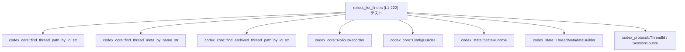
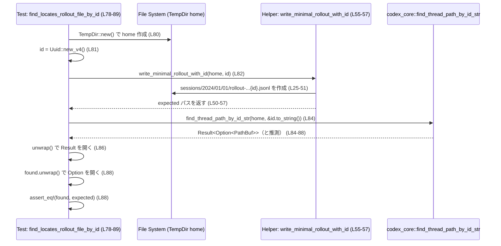

# core/tests/suite/rollout_list_find.rs コード解説

## 0. ざっくり一言

`codex_core` のスレッド検索系 API（ID / 名前 / アーカイブ）に対して、ファイルシステム・SQLite 由来のメタデータ・`.gitignore` の影響を組み合わせた検索挙動を検証する非同期テスト群です（core/tests/suite/rollout_list_find.rs:L1-222）。

---

## 1. このモジュールの役割

### 1.1 概要

このモジュールは、以下の検索 API の期待される振る舞いをテストします。

- ID から通常セッションのロールアウトファイルを探す  
  `find_thread_path_by_id_str`（core/tests/suite/rollout_list_find.rs:L78-89, L92-158）
- スレッド名からロールアウトファイルとメタ情報を探す  
  `find_thread_meta_by_name_str`（L160-209）
- ID からアーカイブされたセッションのロールアウトファイルを探す  
  `find_archived_thread_path_by_id_str`（L212-221）

そのために、最小限のロールアウトファイルを生成するヘルパーと、`StateRuntime` / `RolloutRecorder` を用いたインデックス状態のセットアップを行っています（L25-76, L160-209）。

### 1.2 アーキテクチャ内での位置づけ

このファイルは **テスト専用モジュール** であり、`codex_core` / `codex_state` など他クレートの公開 API の「利用例兼仕様テスト」という位置づけです。



- テストコード側では、`TempDir` を使って毎回独立した `codex_home` ディレクトリを構築し（例: L80-82, L93-98, L129-132, L163-169, L213-215）、  
  そこにロールアウトファイルやインデックスファイルを配置します。
- 作成した環境に対して検索 API を呼び出し、その戻り値（`Result<Option<PathBuf>>` などと推測される）を `unwrap` や `assert_eq!` で検証しています（例: L84-88, L100-104, L120-124, L139-143, L153-157, L200-206, L217-221）。

### 1.3 設計上のポイント

コードから読み取れる設計上の特徴は次のとおりです。

- **責務の分割**
  - 最小限のロールアウトファイル作成は `write_minimal_rollout_with_id_in_subdir` / `write_minimal_rollout_with_id` に集約（L25-57）。
  - SQLite ベースのスレッドメタデータ生成は `upsert_thread_metadata` に集約（L59-76）。
  - 各テストは「どのような環境を用意すると、検索 API がどう振る舞うか」に専念しています（L78-221）。
- **状態管理**
  - ローカルファイルシステム上のディレクトリ構造・ファイル内容をテストごとに構築し、`TempDir` によりスコープ終了時に掃除される前提です（例: L80, L93, L109, L129, L148, L163, L213）。
  - SQLite ベースの状態は `StateRuntime::init` と `ThreadMetadataBuilder` を通じて構築しており（L60-75, L170-179）、検索 API がそれを参照できることを検証しています。
- **エラーハンドリング方針**
  - テスト内では `unwrap()` / `expect()` を積極的に使用し、失敗時は即座に panic させるスタイルです（例: L27, L30, L48, L61-66, L88, L104, L124, L143, L157, L219）。
  - モジュール先頭で `unwrap_used` / `expect_used` に対する clippy 警告を無効化しています（L1）。
- **非同期実行**
  - すべての検索テストは `#[tokio::test]` + `async fn` で記述され、検索 API が非同期関数である前提になっています（L78, L91, L107, L127, L146, L160, L211）。

---

## 2. 主要な機能一覧（コンポーネントインベントリー）

### 2.1 このファイル内で定義される関数一覧

| 名前 | 種別 | 役割 / 用途 | 定義位置 |
|------|------|-------------|----------|
| `write_minimal_rollout_with_id_in_subdir` | ヘルパー関数 | 指定サブディレクトリ配下に最小限のロールアウトファイルを作成する | core/tests/suite/rollout_list_find.rs:L25-51 |
| `write_minimal_rollout_with_id` | ヘルパー関数 | `sessions/YYYY/MM/DD` にロールアウトファイルを作成する薄いラッパー | core/tests/suite/rollout_list_find.rs:L55-57 |
| `upsert_thread_metadata` | 非同期ヘルパー | `StateRuntime` と `ThreadMetadataBuilder` を用いて、スレッドメタデータを SQLite に upsert する | core/tests/suite/rollout_list_find.rs:L59-76 |
| `find_locates_rollout_file_by_id` | 非同期テスト | もっとも単純な ID ベース検索で、ロールアウトファイルを発見できることを検証 | core/tests/suite/rollout_list_find.rs:L78-89 |
| `find_handles_gitignore_covering_codex_home_directory` | 非同期テスト | `.codex/**` で codex_home 丸ごとを無視する `.gitignore` があっても検索できることを検証 | core/tests/suite/rollout_list_find.rs:L91-105 |
| `find_prefers_sqlite_path_by_id` | 非同期テスト | ファイルシステム上に同じ ID のロールアウトが複数ある場合、SQLite に登録されたパスが優先されることを検証 | core/tests/suite/rollout_list_find.rs:L107-125 |
| `find_falls_back_to_filesystem_when_sqlite_has_no_match` | 非同期テスト | SQLite に別 ID のメタデータしかない場合、ファイルシステム検索にフォールバックすることを検証 | core/tests/suite/rollout_list_find.rs:L127-144 |
| `find_ignores_granular_gitignore_rules` | 非同期テスト | `sessions/.gitignore` の拡張子ベースの無視ルール（`*.jsonl`）を無視して検索できることを検証 | core/tests/suite/rollout_list_find.rs:L146-158 |
| `find_locates_rollout_file_written_by_recorder` | 非同期テスト | 実際の `RolloutRecorder` が生成したロールアウトと `session_index.jsonl` を、名前ベース検索で見つけられることを検証 | core/tests/suite/rollout_list_find.rs:L160-209 |
| `find_archived_locates_rollout_file_by_id` | 非同期テスト | `archived_sessions` 配下のアーカイブセッションを ID ベースで検索できることを検証 | core/tests/suite/rollout_list_find.rs:L211-221 |

### 2.2 主要な外部コンポーネント一覧（利用側から見た役割）

※定義はこのファイルには存在しません。型名と利用箇所から読み取れる範囲の説明です。

| 名前 | 種別 | 想定される役割 / 用途 | 使用箇所 |
|------|------|------------------------|----------|
| `codex_core::find_thread_path_by_id_str` | 非同期関数 | 文字列化された ID と `codex_home` から、対応するロールアウトファイルへのパスを返す | L84-88, L100-104, L120-124, L139-143, L153-157 |
| `codex_core::find_thread_meta_by_name_str` | 非同期関数 | スレッド名と `codex_home` から、ロールアウトファイルパスとセッションメタ情報を返す | L200-203 |
| `codex_core::find_archived_thread_path_by_id_str` | 非同期関数 | アーカイブセッション領域から、ID に対応するロールアウトファイルパスを返す | L217-221 |
| `codex_core::RolloutRecorder` | 構造体 | 実際のロールアウトファイルを書き出すレコーダ | L170-185, L207 |
| `codex_core::RolloutRecorderParams` | 構造体 | レコーダ初期化時のパラメータ（スレッド ID、ソース種別など） | L172-179 |
| `codex_core::EventPersistenceMode` | 列挙体と推測 | イベント永続化のモード指定（ここでは `Limited`） | L178 |
| `codex_core::config::ConfigBuilder` | ビルダー構造体 | `codex_home` などを元に `config` オブジェクトを組み立てる | L164-167 |
| `codex_state::StateRuntime` | 構造体 | ステート（SQLite）管理のランタイム。初期化・バックフィル状態管理・スレッドメタデータ upsert を行う | L60-66, L75 |
| `codex_state::ThreadMetadataBuilder` | ビルダー構造体 | スレッド ID / パス / 時刻などからスレッドメタデータを構築する | L67-75 |
| `codex_protocol::ThreadId` | 型（新しい型 or 構造体と推測） | スレッド（会話）の一意 ID を表す | L14, L110-112, L133, L168-169, L192-195, L215 |
| `codex_protocol::models::BaseInstructions` | 構造体と推測 | セッション初期のベース命令（プロンプト）を表す | L15, L176 |
| `codex_protocol::protocol::SessionSource` | 列挙体と推測 | セッションの起点（Exec など）を表す | L16, L71, L175 |
| `tempfile::TempDir` | 構造体 | 一時ディレクトリの生成・クリーンアップ | L20, L80, L93, L109, L129, L148, L163, L213 |
| `uuid::Uuid` | 構造体 | 一意 ID 生成。ここではセッション ID として利用 | L21, L25, L39, L81-82, L97-98, L110-112, L130-133, L149-150, L214-215 |

---

## 3. 公開 API と詳細解説

このファイル自体には `pub` な関数はありませんが、テスト用のヘルパー関数と、外部公開 API の挙動を規定するテストを「利用者から見た契約」の観点で整理します。

### 3.1 型一覧（構造体・列挙体など）

このファイル内で新たな型定義はありません（構造体・列挙体等の `struct` / `enum` は存在しません）。  
利用している外部型については 2.2 を参照してください。

### 3.2 主要関数の詳細

#### `write_minimal_rollout_with_id_in_subdir(codex_home: &Path, subdir: &str, id: Uuid) -> PathBuf` / `write_minimal_rollout_with_id(codex_home: &Path, id: Uuid) -> PathBuf`

**定義位置**

- `write_minimal_rollout_with_id_in_subdir`: core/tests/suite/rollout_list_find.rs:L25-51  
- `write_minimal_rollout_with_id`: core/tests/suite/rollout_list_find.rs:L55-57

**概要**

- 指定された `codex_home` 配下の `subdir/YYYY/MM/DD` に、最小限のロールアウトファイル（1 行だけの JSONL）を作成します（L25-51）。
- JSON 行には `session_meta` イベントが 1 つだけ書かれ、その中の `"id"` フィールドに与えられた `Uuid` が格納されます（L31-45）。
- `write_minimal_rollout_with_id` は `subdir` に `"sessions"` を固定したラッパーです（L55-57）。

**引数**

| 引数名 | 型 | 説明 |
|--------|----|------|
| `codex_home` | `&Path` | テスト用の Codex ホームディレクトリのルート。`TempDir::path()` が渡されています（例: L82, L98, L131, L150, L215）。 |
| `subdir` | `&str` | `sessions` や `archived_sessions` など、セッション格納用のサブディレクトリ名（L25, L215）。 |
| `id` | `Uuid` | セッション ID として JSON に埋め込む値（L25, L39, L81-82 など）。 |

**戻り値**

- 作成したロールアウトファイルの絶対パス `PathBuf` を返します（L29-30, L50, L55-57）。

**内部処理の流れ**

1. `codex_home/subdir/2024/01/01` という固定日付のディレクトリを構成し、`create_dir_all` で作成します（L26-27）。
2. `rollout-2024-01-01T00-00-00-{id}.jsonl` というファイル名を生成し、そのパスでファイルを作成します（L29-30）。
3. 最初の 1 行として、`serde_json::json!` で組み立てた `session_meta` オブジェクトを JSON 文字列化して `writeln!` で書き込みます（L31-47）。
4. ファイルパスを返します（L50）。

**Examples（使用例）**

テスト内では次のように使用されています。

```rust
// 一時ディレクトリを codex_home として作る                        // core/tests/suite/rollout_list_find.rs:L80-82
let home = TempDir::new().unwrap();
let id = Uuid::new_v4();

// sessions/2024/01/01/rollout-...jsonl を作成し、そのパスを受け取る
let expected = write_minimal_rollout_with_id(home.path(), id);
```

**Errors / Panics**

- `create_dir_all`, `File::create`, `writeln!` のすべてで `unwrap()` を使用しているため、OS 由来の I/O エラー等が発生すると panic します（L27, L30, L48）。
- テスト用途であり、エラーを Result で返す設計にはなっていません。

**Edge cases（エッジケース）**

- `codex_home` が存在しない場合でも、`create_dir_all` がディレクトリごと作成するため、正常に作成されます（L26-27）。
- `subdir` が空文字列の場合、`codex_home.join("")` は `codex_home` と同じパスになるため、`codex_home/2024/01/01` にファイルが作成されると推測されますが、そのような使用例はこのファイルにはありません。
- `id` が重複した場合、同じパスを上書きします（`File::create` の振る舞いから推測）。

**使用上の注意点**

- 本来はテスト専用ヘルパーであり、本番コードから直接呼び出す前提ではありません。
- 日付が固定値（`2024/01/01`）であるため、「日付ベースの検索」のような機能をテストしてはいません（L26, L29, L36, L40）。

---

#### `upsert_thread_metadata(codex_home: &Path, thread_id: ThreadId, rollout_path: PathBuf)`

**定義位置**

- core/tests/suite/rollout_list_find.rs:L59-76

**概要**

- `StateRuntime` と `ThreadMetadataBuilder` を用いて、指定されたスレッド ID とロールアウトファイルパスに対応するメタデータを SQLite に upsert する非同期ヘルパーです。
- これにより、`find_thread_path_by_id_str` が「SQLite 経由のパス優先」検索を行う条件をテスト環境で満たします（利用箇所: L117-118, L133-137）。

**引数**

| 引数名 | 型 | 説明 |
|--------|----|------|
| `codex_home` | `&Path` | StateRuntime の初期化に使用するホームディレクトリ。テストごとの `TempDir` が渡されます（L59-60）。 |
| `thread_id` | `ThreadId` | upsert するスレッドメタデータの ID（L59, L68）。 |
| `rollout_path` | `PathBuf` | ロールアウトファイルの実際のパス。メタデータ内に格納されます（L59, L69）。 |

**戻り値**

- `async fn` ですが `Result` ではなく `()` を返します。内部で `unwrap()` を多用しているため、失敗時は panic します（L61-66, L75）。

**内部処理の流れ（アルゴリズム）**

1. `StateRuntime::init(codex_home.to_path_buf(), "test-provider".to_string())` を呼び出し、非同期で初期化します（L60-62）。
2. `runtime.mark_backfill_complete(None).await` を呼び出し、バックフィルが完了した状態にします（L63-66）。
3. `ThreadMetadataBuilder::new(thread_id, rollout_path, Utc::now(), SessionSource::default())` でビルダを作成します（L67-72）。
4. `builder.cwd` を `codex_home.to_path_buf()` に上書きします（L73）。
5. `builder.build("test-provider")` でメタデータを構築し（L74）、`runtime.upsert_thread(&metadata).await` で DB に保存します（L75）。

**Examples（使用例）**

```rust
let db_path = home.path().join("sessions/2030/12/30/rollout-...jsonl"); // L112-114
// ... db_path を空ファイルとして作成（L115-116）

let thread_id = ThreadId::from_string(&id.to_string()).unwrap(); // L111
upsert_thread_metadata(home.path(), thread_id, db_path.clone()).await; // L118
```

この呼び出しにより、`find_prefers_sqlite_path_by_id` テストでは、同じ ID を持つロールアウトファイルがファイルシステムと SQLite の両方に存在する状態を再現しています（L107-125）。

**Errors / Panics**

- `StateRuntime::init`, `mark_backfill_complete`, `upsert_thread` のすべての結果を `unwrap()` しているため、これらが `Err` を返すと panic します（L61-66, L75）。
- `ThreadMetadataBuilder::new` / `build` が panic する可能性については、このファイルからは分かりません。

**Edge cases（エッジケース）**

- `rollout_path` が存在しないパスでも upsert 自体は成功すると考えられます（L115-116 で空ファイルを作成しているため、少なくとも存在必須ではなさそうです）。
- `thread_id` が既に存在する場合は「上書き（upsert）」されると推測されますが、テストでそのパターンは扱っていません。

**使用上の注意点**

- 実運用コードでは Result を返してエラー処理すべき部分ですが、ここではテストの簡潔さを優先し panic ベースになっています。
- `mark_backfill_complete(None)` を必ず呼び出していることから、「バックフィルが完了していない状態では検索 API が正常動作しない」可能性がありますが、このファイルからは確定できません。

---

#### `#[tokio::test] async fn find_locates_rollout_file_by_id()`

**定義位置**

- core/tests/suite/rollout_list_find.rs:L78-89

**概要**

- ID ベースの検索 API `find_thread_path_by_id_str` が、`sessions/YYYY/MM/DD` に存在するロールアウトファイルを正しく見つけて `Some(path)` を返すことを検証する基本テストです。

**引数**

- なし（テスト関数）。

**戻り値**

- `()`（テスト成功時）。

**内部処理の流れ**

1. `TempDir` で一時ディレクトリ `home` を作成します（L80）。
2. UUID を 1 つ生成し（L81）、それを ID として `write_minimal_rollout_with_id(home.path(), id)` を呼んでロールアウトファイルを生成し、期待パス `expected` を得ます（L82）。
3. `find_thread_path_by_id_str(home.path(), &id.to_string()).await.unwrap()` を実行し（L84-86）、`Result` を `unwrap` して `Option<PathBuf>` を取り出します。
4. `found.unwrap()` と `expected` を比較し、一致することを `assert_eq!` で検証します（L88）。

**このテストから推測できる API 契約**

- `find_thread_path_by_id_str` の戻り値は `Result<Option<PathBuf>, E>` 型であると推測されます（`await.unwrap()` で `Result` を開き、その後 `found.unwrap()` で `Option` を開いているため: L84-88）。
- `codex_home/sessions/2024/01/01/rollout-...{id}.jsonl` のような構造を持つ最小限のロールアウトファイルを 1 行だけ置いておけば、その ID を指定して検索すると `Some(そのパス)` を返すことが期待されています（L25-51, L82-88）。

**Errors / Panics**

- `find_thread_path_by_id_str` がエラーを返すと `unwrap()` で panic します（L86）。
- 見つからない場合 `found` は `None` となり、その状態で `found.unwrap()` を呼ぶと panic しますが、このテストでは `Some` である前提です（L88）。

**Edge cases（エッジケース）**

- 同じ ID のファイルが複数ある場合の挙動は、このテストでは扱っていません（他テストが扱います: L107-125）。
- 日付ディレクトリは固定の `2024/01/01` であり、「他の日付に存在する場合」の挙動はこのファイルからは読み取れません。

**使用上の注意点**

- 実装側で `None` が返る可能性に備えてエラーハンドリングを行う必要がありますが、テストでは単純化のためすべて `unwrap()` しています。

---

#### `#[tokio::test] async fn find_handles_gitignore_covering_codex_home_directory()`

**定義位置**

- core/tests/suite/rollout_list_find.rs:L91-105

**概要**

- リポジトリルートにある `.gitignore` の `".codex/**\n"` ルールにより `codex_home` ディレクトリ全体が Git 無視対象になっていても、`find_thread_path_by_id_str` がロールアウトファイルを見つけられることを検証します。

**内部処理の流れ**

1. `repo` という一時ディレクトリを作成します（L93）。
2. その直下に `.codex` ディレクトリ（`codex_home`）を作り（L94-95）、`repo/.gitignore` に `.codex/**` を書き込みます（L96）。
3. ID を 1 つ生成し、`write_minimal_rollout_with_id(&codex_home, id)` で `.codex/sessions/...` にロールアウトファイルを生成します（L97-98）。
4. `find_thread_path_by_id_str(&codex_home, &id.to_string()).await.unwrap()` を呼び（L100-102）、`Some(expected)` が返ることを `assert_eq!` で確認します（L104）。

**このテストから推測できる API 契約**

- `find_thread_path_by_id_str` は `.gitignore` の設定に依存せず、ファイルシステムを直接走査するか、もしくは `.gitignore` ルールを無視する設定でファイル探索していると考えられます。
- 特に「リポジトリ直下の `.gitignore` が codex_home ディレクトリ全体を無視」していても、検索は影響を受けないことが期待されています（L93-100）。

**Edge cases / 注意点**

- ここでは `.gitignore` がリポジトリルートにあるケースのみを扱っており、サブディレクトリ内の `.gitignore` は別テストで扱われます（L146-158）。

---

#### `#[tokio::test] async fn find_prefers_sqlite_path_by_id()`

**定義位置**

- core/tests/suite/rollout_list_find.rs:L107-125

**概要**

- 同じ ID に対応するロールアウトファイルが「ファイルシステム検索で見つかるファイル」と「SQLite に登録されたファイル」の 2 つ存在する場合、`find_thread_path_by_id_str` が SQLite のパスを優先して返すことを検証します。

**内部処理の流れ**

1. 一時ディレクトリ `home` と UUID `id` を生成（L109-110）。
2. `ThreadId::from_string(&id.to_string()).unwrap()` で `ThreadId` を生成（L111）。
3. 未来日付 `2030/12/30` のロールアウトパス `db_path` を作成し、親ディレクトリを作成して空ファイルを書き込みます（L112-116）。
4. 同じ ID で `write_minimal_rollout_with_id(home.path(), id)` を呼び、`sessions/2024/01/01` に別のロールアウトファイルを作成します（L117）。
5. `upsert_thread_metadata(home.path(), thread_id, db_path.clone()).await` により、SQLite に `db_path` を指すメタデータを登録します（L118）。
6. `find_thread_path_by_id_str(home.path(), &id.to_string()).await.unwrap()` を呼び、結果が `Some(db_path)` であることを確認します（L120-124）。

**このテストから推測できる API 契約**

- `find_thread_path_by_id_str` は、同じ ID に対して
  1. まず SQLite のインデックス（`StateRuntime` が管理）からパスを探し、
  2. 見つかった場合はそれを返す  
  という優先順位を持つことが期待されています（L117-124）。
- ファイルシステム上に存在する別の日付のロールアウトファイルは、このケースでは無視されるべきです（L117, L112-116）。

**Edge cases / 注意点**

- SQLite とファイルシステムの両方に同じファイルパスが登録されている場合の挙動は、このファイルからは不明です。
- `upsert_thread_metadata` で指定した `rollout_path` が実ファイルとして存在しない場合の挙動はテストしていません（ここでは空ファイルを作成している: L115-116）。

---

#### `#[tokio::test] async fn find_falls_back_to_filesystem_when_sqlite_has_no_match()`

**定義位置**

- core/tests/suite/rollout_list_find.rs:L127-144

**概要**

- SQLite に「別の ID のメタデータ」は存在するが、「検索対象 ID のメタデータ」は存在しない場合に、`find_thread_path_by_id_str` がファイルシステム検索にフォールバックしてロールアウトファイルを見つけることを検証します。

**内部処理の流れ**

1. 一時ディレクトリ `home` と検索対象 ID `id` を生成（L129-131）。
2. `write_minimal_rollout_with_id(home.path(), id)` でファイルシステム上のロールアウトファイル `expected` を作成（L131）。
3. 無関係な ID `unrelated_id` と `ThreadId` を生成（L132-133）。
4. `home/sessions/2030/12/30/rollout-2030-12-30T00-00-00-unrelated.jsonl` を `unrelated_path` として構成（L134-136）。
5. `upsert_thread_metadata(home.path(), unrelated_thread_id, unrelated_path).await` で、無関係 ID のメタデータだけを SQLite に登録（L137）。
6. `find_thread_path_by_id_str(home.path(), &id.to_string()).await.unwrap()` を呼び、結果が `Some(expected)` であることを確認（L139-143）。

**このテストから推測できる API 契約**

- `find_thread_path_by_id_str` は、SQLite インデックスに一致する ID が見つからなかった場合、ファイルシステム検索に切り替えるフォールバックロジックを持つことが期待されています（L131-143）。
- SQLite に存在する「別 ID」のエントリは、検索結果に影響を与えないことが期待されます。

---

#### `#[tokio::test] async fn find_locates_rollout_file_written_by_recorder() -> std::io::Result<()>`

**定義位置**

- core/tests/suite/rollout_list_find.rs:L160-209

**概要**

- 実際の `RolloutRecorder` が `codex_home` に書き出したロールアウトファイルと、`session_index.jsonl` に記録されたインデックス情報を前提として、`find_thread_meta_by_name_str` がスレッド名からロールアウトパスとメタ情報を取得できることを検証します。

**引数 / 戻り値**

- 引数なし。
- 戻り値は `std::io::Result<()>` であり、`?` 演算子で I/O エラー等を呼び出し元（テストランナー）に伝播します（L164-167, L183-185, L188-198, L200）。

**内部処理の流れ**

1. `TempDir` の `home` を作成（L163）。
2. `ConfigBuilder::default().codex_home(home.path().to_path_buf()).build().await?` で `config` を構築（L164-167）。
3. 新しい `thread_id` を生成し（L168）、スレッド名 `thread_name` を `"named thread"` に設定（L169）。
4. `RolloutRecorder::new` を `thread_id` / `SessionSource::Exec` / `BaseInstructions::default()` / `EventPersistenceMode::Limited` などのパラメータで初期化し（L170-179）、`await?` します（L183）。
5. `recorder.persist().await?` と `recorder.flush().await?` を呼び、ロールアウトファイルを書き出します（L184-185）。
6. `home/session_index.jsonl` を開き、1 行の JSON を書き込みます。この JSON には `id`・`thread_name`・`updated_at` が含まれます（L187-197）。
7. `find_thread_meta_by_name_str(home.path(), thread_name).await?` を呼び、結果を `found` に格納します（L200）。
8. `found.expect("expected rollout path to be found")` で `Option` を開き、`(path, session_meta)` を取得（L202）。
9. `session_meta.meta.id == thread_id` であることを確認し（L203）、`path` が存在し（L204）、ファイル内容に `thread_id` の文字列表現が含まれることを確認します（L205-206）。
10. 最後に `recorder.shutdown().await?` を呼び出してレコーダを終了し、`Ok(())` を返します（L207-208）。

**このテストから推測できる API 契約**

- `find_thread_meta_by_name_str` は `Result<Option<(PathBuf, SessionMetaType)>>` 相当の型を返すと推測されます（`await?` + `expect` の使用パターン: L200-202）。
- `session_index.jsonl` に `"thread_name"` と `"id"` が記述されていれば、その情報を元にロールアウトファイルとメタ情報を検索できることが期待されています（L187-197, L200-203）。
- ロールアウトファイルの内容に `thread_id` が含まれていることを前提としています（`assert!(contents.contains(&thread_id.to_string()));` L205-206）。

**Errors / Panics**

- I/O などのエラーは `?` によって `Err` として上位に伝播されます（L164-167, L183-185, L188-198, L200, L207）。
- 検索結果が `None` の場合、`expect("expected rollout path to be found")` により panic します（L202）。

**Edge cases / 注意点**

- 同名のスレッドが複数存在する場合の扱い（どれを返すか・複数返すか）はこのテストからは不明です。
- `session_index.jsonl` のフォーマットは、このテストでは 1 行 1 JSON（JSON Lines）前提ですが、より複雑なケース（複数行・追記など）は検証していません。

---

### 3.3 その他の関数（簡易一覧）

| 関数名 | 種別 | 役割（1 行） | 定義位置 |
|--------|------|--------------|----------|
| `find_ignores_granular_gitignore_rules` | 非同期テスト | `sessions/.gitignore` に `*.jsonl` が書かれていても検索 API がロールアウトファイルを見つけることを検証 | core/tests/suite/rollout_list_find.rs:L146-158 |
| `find_archived_locates_rollout_file_by_id` | 非同期テスト | `archived_sessions` 配下のセッションが ID 検索の対象になることを検証 | core/tests/suite/rollout_list_find.rs:L211-221 |

---

## 4. データフロー

ここでは代表的な 2 つのシナリオについて、テストコードから見たデータの流れを示します。

### 4.1 ID ベース検索の基本フロー（find_locates_rollout_file_by_id）

このフローでは、ファイルシステム上に 1 つだけ存在するロールアウトファイルを ID で検索するパターンです（L78-89）。



### 4.2 名前ベース検索 + Recorder のフロー（find_locates_rollout_file_written_by_recorder）

このフローでは、`RolloutRecorder` が生成したファイルと `session_index.jsonl` を使って名前から検索するパターンです（L160-209）。

```mermaid
sequenceDiagram
    participant T as Test: find_locates_rollout_file_written_by_recorder (L160-209)
    participant FS as File System (home)
    participant CB as ConfigBuilder (external)
    participant RR as RolloutRecorder (external)
    participant F as find_thread_meta_by_name_str (external)

    T->>FS: TempDir::new() で home 作成 (L163)
    T->>CB: ConfigBuilder::default().codex_home(home).build().await (L164-167)
    CB-->>T: config

    T->>T: thread_id = ThreadId::new(); thread_name="named thread" (L168-169)
    T->>RR: RolloutRecorder::new(config, params(...), None, None).await (L170-183)
    RR-->>T: recorder

    T->>RR: recorder.persist().await; recorder.flush().await (L184-185)
    RR->>FS: ロールアウトファイルを書き出す（詳細は別ファイル）

    T->>FS: home/session_index.jsonl に {"id", "thread_name", ...} を 1 行書き込み (L187-197)

    T->>F: find_thread_meta_by_name_str(home, thread_name).await (L200)
    F-->>T: Result<Option<(PathBuf, SessionMeta)>>（と推測） (L200-202)
    T->>T: ? で Result を開く, expect() で Option を開く (L200-202)
    T->>T: session_meta.meta.id == thread_id を検証 (L203)
    T->>FS: path.exists(), read_to_string(path) (L204-205)
    T->>T: contents.contains(thread_id) を検証 (L205-206)
    T->>RR: recorder.shutdown().await (L207)
```

---

## 5. 使い方（How to Use）

このファイルはテストモジュールですが、「検索 API を呼び出すためにどのような環境を用意しているか」は、本番コードでの利用にも参考になります。

### 5.1 基本的な使用方法（ID ベース検索）

ID からロールアウトファイルを検索する典型的な流れは、`find_locates_rollout_file_by_id` テストとほぼ同じです（L78-89）。

```rust
use codex_core::find_thread_path_by_id_str;
use uuid::Uuid;
use std::path::Path;

// codex_home を決定する（ここでは既に存在するディレクトリを想定）
let codex_home: &Path = /* ... */;

// 検索したいスレッド ID を文字列にする
let id = Uuid::new_v4();
let id_str = id.to_string();

// 非同期コンテキスト内で実行
let result = find_thread_path_by_id_str(codex_home, &id_str).await?; // Result を受け取る
if let Some(path) = result {
    // 見つかった場合の処理
    println!("found rollout at {:?}", path);
} else {
    // 見つからなかった場合の処理
    println!("no rollout for id {}", id_str);
}
```

この例は、テスト中の `await.unwrap()` を安全な形（`?` と `if let`）に書き換えたものです。

### 5.2 よくある使用パターン

1. **SQLite インデックスを利用した高速検索**

   - テスト `find_prefers_sqlite_path_by_id` から、SQLite インデックスが存在すればそれが優先されると推測されます（L107-125）。
   - 実運用では `StateRuntime` / `ThreadMetadataBuilder` に相当する仕組みでスレッドメタデータを登録しておくと、検索がより正確かつ高速になると考えられます。

2. **ファイルシステム検索へのフォールバック**

   - テスト `find_falls_back_to_filesystem_when_sqlite_has_no_match` から、一致する ID が SQLite にない場合はファイルシステム検索にフォールバックすることが期待されます（L127-144）。
   - インデックスが壊れている・未バックフィルといった状況でも、一定の復元力があることを意味します。

3. **名前ベース検索 + インデックスファイル**

   - `find_locates_rollout_file_written_by_recorder` では `session_index.jsonl` にスレッド名と ID を記録し、名前から検索しています（L187-197, L200-203）。
   - スレッド名 UI からロールアウトを開くような機能を実装する際に、この組み合わせがそのまま参考になります。

### 5.3 よくある間違い（想定）

テストコードから、以下のような誤用が問題になり得ると推測できます。

```rust
// 誤りの例: SQLite インデックスが準備されていない状態で、SQLite 優先の挙動を期待する
// （テストでは必ず upsert_thread_metadata や recorder.persist()/flush() を呼んでから検索している: L117-118, L184-185）
let found = find_thread_path_by_id_str(codex_home, &id_str).await?;
// found が None になり得る

// 正しい例: 必要ならインデックスを事前に構築しておく
upsert_thread_metadata(codex_home, thread_id, rollout_path.clone()).await; // テスト相当（L59-76）
let found = find_thread_path_by_id_str(codex_home, &id_str).await?;
```

```rust
// 誤りの例: 結果の Option を unwrap してしまう
let path = find_thread_path_by_id_str(codex_home, &id_str).await.unwrap().unwrap();
// 見つからない場合は panic

// より安全な例
if let Some(path) = find_thread_path_by_id_str(codex_home, &id_str).await? {
    // ...
}
```

### 5.4 使用上の注意点（まとめ）

- **エラーハンドリング**
  - テストでは `unwrap()` / `expect()` を多用していますが、本番コードでは `Result` / `Option` を適切に扱う必要があります（例: L84-88, L100-104）。
- **ディレクトリ構造の前提**
  - テストのヘルパーでは `YYYY/MM/DD` やファイル名フォーマットが固定されています（L26, L29, L112-114, L135-136）。
  - 実装側も同様の命名規則に依存している可能性が高いため、構造を変更する際は検索ロジックとの整合性に注意が必要です。
- **`.gitignore` の影響**
  - 検索 API は `.gitignore` に依存しない（少なくとも `.codex/**` や `*.jsonl` を無視する `.gitignore` とは独立）ことが前提になっています（L91-105, L146-158）。
- **並行実行**
  - テストは `#[tokio::test]` による非同期実行であり、非同期ランタイム（tokio）が必要です（L78, L91, L107, L127, L146, L160, L211）。
  - 実行環境でも同様に async コンテキストからこれらの API を呼び出す必要があります。

---

## 6. 変更の仕方（How to Modify）

### 6.1 新しいテストシナリオを追加する場合

新たな検索条件やバグ修正をテストしたい場合、次の手順が自然です。

1. **環境準備**
   - `TempDir::new()` で一時 `codex_home` を作成します（既存テストの例: L80, L93, L109, L129, L148, L163, L213）。
   - 必要に応じて `.gitignore` や追加のインデックスファイルを作成します（L96, L151, L187-197）。

2. **ロールアウトファイルの作成**
   - 単純な ID ベースのテストなら、`write_minimal_rollout_with_id` を使って最小限のファイルを作成します（L82, L98, L131, L150, L215）。
   - 実際のフォーマットに近づけたい場合は、`RolloutRecorder` を用いて本物のロールアウトファイルを生成します（L170-185）。

3. **インデックスの構築（必要なら）**
   - SQLite を介したシナリオなら `upsert_thread_metadata` を利用してメタデータを登録します（L117-118, L133-137）。
   - 名前ベースの検索なら `session_index.jsonl` に JSON 行を追記します（L187-197）。

4. **検索 API の呼び出しと検証**
   - 新しいテスト関数を `#[tokio::test] async fn` で定義し、対象 API（`find_thread_path_by_id_str` 等）を呼び出します（L78-89 など）。
   - 期待される `Some/None` やメタデータの内容を `assert_eq!` や `assert!` で検証します（L88, L104, L124, L143, L157, L203-206, L221）。

### 6.2 既存のテストを変更する場合の注意点

- **契約（前提条件）の確認**
  - 例えば `find_prefers_sqlite_path_by_id` では「SQLite に一致する ID がある場合はそちらを優先する」という契約を暗に表現しています（L107-125）。
  - 実装変更によりこの契約を変える場合、テスト内容を変更する前に「仕様としてどうしたいか」を明確にする必要があります。

- **影響範囲の確認**
  - 同じ API を扱う他のテスト（ID ベース / 名前ベース / アーカイブ / `.gitignore` 関連）がないか確認し、整合的に変更する必要があります（L78-221 全体）。

- **エッジケースの追加**
  - テストは現在、代表的なケース（存在する/しない、インデックスあり/なし、`.gitignore` の有無）をカバーしています。
  - さらなるエッジケース（大量のファイル・壊れた JSON・権限エラーなど）をテストしたい場合は、ヘルパー関数を拡張してシナリオを増やすことができます。

---

## 7. 関連ファイル

このモジュールと密接に関係するコンポーネントは、すべて外部クレートの関数・型として利用されています。定義ファイルの正確なパスはこのチャンクには現れないため不明です。

| パス / クレート | 役割 / 関係 |
|-----------------|------------|
| `codex_core` クレート内の `find_thread_path_by_id_str` | ID と `codex_home` からロールアウトファイルを検索する本体実装。ここでのテストはその仕様を規定します（L84-88, L100-104, L120-124, L139-143, L153-157）。 |
| `codex_core` クレート内の `find_thread_meta_by_name_str` | スレッド名から `(パス, セッションメタ)` を検索する実装。`session_index.jsonl` を利用していると推測されます（L187-197, L200-203）。 |
| `codex_core` クレート内の `find_archived_thread_path_by_id_str` | `archived_sessions` 配下を対象に ID ベース検索を行う実装（L215-221）。 |
| `codex_core` クレート内の `RolloutRecorder` / `RolloutRecorderParams` / `EventPersistenceMode` / `config::ConfigBuilder` | 実際のロールアウトファイル生成と設定管理を担当し、検索 API の前提となるファイル群を作成します（L164-179, L183-185, L207）。 |
| `codex_state` クレート内の `StateRuntime` / `ThreadMetadataBuilder` | SQLite ベースのスレッドメタデータ管理を担当し、ID ベース検索のインデックスとして利用されます（L60-75, L117-118, L133-137）。 |
| `codex_protocol` クレート内の `ThreadId` / `SessionSource` / `models::BaseInstructions` | スレッド ID やセッションソースなど、検索対象オブジェクトの識別・メタ情報を表すドメイン型です（L14-16, L110-112, L133, L168-176, L192-195）。 |

---

### バグ・セキュリティ観点の簡単なコメント

- このファイルはテストコードであり、本番環境で長時間動作するロジックは含まれていません。
- すべてのファイル操作は `TempDir` 配下またはテスト用 `codex_home` 配下で行われ、外部からの入力値もランダム生成 ID のみのため、セキュリティリスクは限定的です（L80, L93, L109, L129, L148, L163, L213）。
- `unwrap()` 多用による panic は意図されたテスト失敗として扱われます（L27, L30, L48, L61-66, L88, L104, L124, L143, L157, L202, L219）。
