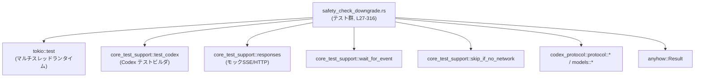
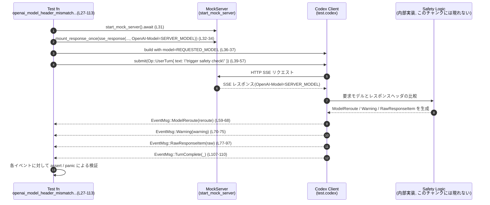

# core/tests/suite/safety_check_downgrade.rs コード解説

## 0. ざっくり一言

Codex クライアントが **要求したモデル名と実際に使われたモデル名が異なる場合に、安全性のためのダウングレード（ModelReroute）と警告が正しく発火するか** を検証する統合テスト群です。

---

## 1. このモジュールの役割

### 1.1 概要

- このテストモジュールは、Codex の推論エンジンが外部モデル（OpenAI 互換 API）を呼び出す際に、
  - **HTTP ヘッダの `OpenAI-Model` と、クライアントが要求したモデル名が食い違うケース**、
  - **レスポンス内メタデータと要求モデル名が食い違うケース**、
  を検出して、**安全性上の警告とモデルのダウングレード処理（ModelReroute）を行う契約**を検証します。
- また、「**1ターンにつき1回のみ警告すること**」「**大文字小文字だけの差異は許容すること**」といった挙動もテストしています。

### 1.2 アーキテクチャ内での位置づけ

このファイルは、テスト用のサポートクレート `core_test_support` とプロトコル定義クレート `codex_protocol` を利用した **エンドツーエンドに近い統合テスト**です。

- モック HTTP サーバを立ち上げて SSE(Server-Sent Events) ストリームを返します（`start_mock_server`, `sse_response`, `mount_response_*` など、L31-35, L119-133, L197-219, L265-269）。
- `test_codex` ビルダでテスト用 Codex クライアントを構築し（L36-37, L135-136, L221-222, L271-272）、
- `submit(Op::UserTurn { ... })` を通じてユーザーターンを実行します（L39-57, L138-156, L224-242, L274-292）。
- `wait_for_event` によって `EventMsg` ストリームから、`ModelReroute` / `Warning` / `RawResponseItem` / `TurnComplete` などを待ち受けて検証します（例: L59-62, L70-91, L158-161, L185-188, L244-254, L296-307）。

依存関係の概要を Mermaid 図で示します。



※ `core_test_support` や `codex_protocol` の内部実装は、このチャンクには現れません。

### 1.3 設計上のポイント

- **責務の分割**
  - このファイルは **テストシナリオの定義のみ**を行い、モックサーバ構築や SSE イベント生成ロジックはすべて `core_test_support::responses` に委譲しています（例: L31-35, L119-133, L197-219, L265-269）。
  - Codex クライアントの初期化・設定も `test_codex` ビルダに委譲しています（L36-37 など）。
- **状態管理**
  - テスト自身は明示的な永続状態を持たず、`test.codex` とモックサーバが内部状態を持ちます。
  - イベントストリームは `wait_for_event` を通じて逐次的に処理されます（L59-62, L70-91 など）。
- **エラーハンドリング**
  - 戻り値は `anyhow::Result<()>` で、`?` 演算子により非テストロジック由来のエラーをそのまま伝播しています（例: L37, L57, L136, L156, L222, L242, L272, L292）。
  - 想定外のイベントや欠落は `panic!` とアサーションで検出します（例: L63-65, L71-73, L93-97）。
- **並行性**
  - すべてのテストは `#[tokio::test(flavor = "multi_thread", worker_threads = 2)]`（L27, L115, L193, L261）でマルチスレッドランタイム上で実行されます。
  - このファイル内では新しいタスクは spawn しておらず、処理自体は順次 `await` するシンプルな並行パターンです。
  - `test.codex` や `wait_for_event` の内部では非同期タスクが走っている可能性がありますが、このチャンクには現れません。

---

## 2. コンポーネント一覧（インベントリー）

### 2.1 このファイルで定義されるコンポーネント

| 名前 | 種別 | 役割 / 用途 | 定義位置 |
|------|------|-------------|----------|
| `SERVER_MODEL` | `const &str` | モックサーバが返すモデル名。ここでは `"gpt-5.2"` に固定されています。 | `core/tests/suite/safety_check_downgrade.rs:L24-24` |
| `REQUESTED_MODEL` | `const &str` | クライアントが要求するモデル名。ここでは `"gpt-5.3-codex"` に固定されています。 | `core/tests/suite/safety_check_downgrade.rs:L25-25` |
| `openai_model_header_mismatch_emits_warning_event_and_warning_item` | 非公開非同期関数（Tokio テスト） | HTTP レスポンスの `OpenAI-Model` ヘッダが `REQUESTED_MODEL` と異なるとき、`ModelReroute` と `Warning` イベントと、警告メッセージの `ResponseItem::Message` が発生することを検証します。 | `core/tests/suite/safety_check_downgrade.rs:L27-113` |
| `response_model_field_mismatch_emits_warning_when_header_matches_requested` | 同上 | HTTP ヘッダは要求モデルと一致しても、レスポンス内メタデータ（JSON 内の `"OpenAI-Model"`）が異なる場合に `ModelReroute` と警告が発生することを検証します。 | `core/tests/suite/safety_check_downgrade.rs:L115-191` |
| `openai_model_header_mismatch_only_emits_one_warning_per_turn` | 同上 | 一つのユーザーターンで複数回モデルヘッダ不一致があっても、警告が 1 回だけ発生することを検証します。 | `core/tests/suite/safety_check_downgrade.rs:L193-259` |
| `openai_model_header_casing_only_mismatch_does_not_warn` | 同上 | 要求モデルとレスポンスヘッダのモデル名が**大文字小文字だけ違う**場合には、モデルの reroute や危険警告が発生しないことを検証します。 | `core/tests/suite/safety_check_downgrade.rs:L261-316` |

### 2.2 このファイルで使用される外部コンポーネント（定義は別ファイル）

以下はすべて別モジュールで定義されており、このチャンクには実装が現れません。

| 名前 | 出典 | 用途 / 備考 |
|------|------|-------------|
| `test_codex` | `core_test_support::test_codex` | テスト用 Codex クライアントビルダ（L36, L135, L221, L271）。 |
| `start_mock_server` | `core_test_support::responses` | モック HTTP サーバ起動（L31, L119, L197, L265）。 |
| `sse`, `sse_completed`, `sse_response` | `core_test_support::responses` | SSE ストリームを表すレスポンス生成ヘルパ（L32-34, L120-132, L203-218, L267-268）。 |
| `mount_response_once`, `mount_response_sequence` | 同上 | モックサーバへレスポンス（またはシーケンス）を登録（L34, L133, L219, L269）。 |
| `ev_response_created`, `ev_function_call`, `ev_assistant_message`, `ev_completed` | 同上 | SSE 内のイベント JSON を組み立てるヘルパ（L203-211, L214-217 など）。 |
| `skip_if_no_network!` | `core_test_support` | ネットワーク利用が許可されていない環境でテストをスキップするマクロ（L29, L117, L195, L263）。詳細な条件はこのチャンクには現れません。 |
| `wait_for_event` | `core_test_support` | `EventMsg` ストリームから条件を満たすイベントが現れるまで非同期に待機するヘルパ（例: L59-62, L70-91, L158-161, L185-188, L244-254, L296-307）。 |
| `EventMsg`, `ModelRerouteReason`, `Op`, `SandboxPolicy`, `AskForApproval` | `codex_protocol::protocol` | Codex とテスト間でやりとりされるイベント・操作の型（L4-8, L59-68, L77-90 など）。 |
| `UserInput` | `codex_protocol::user_input` | ユーザーからの入力を表す型。ここでは `UserInput::Text` のみ利用（L41-44 など）。 |
| `ResponseItem`, `ContentItem` | `codex_protocol::models` | モデルの生レスポンス要素を表す型。警告が `ResponseItem::Message` として記録されることを検証（L80-88, L95-105）。 |

---

## 3. 公開 API と詳細解説

### 3.1 型一覧（このファイル内で定義）

このファイルでは新しい構造体・列挙体は定義されていません。利用している型はすべて外部モジュール由来です（2.2 参照）。

### 3.2 主要な関数詳細（テスト関数）

#### `openai_model_header_mismatch_emits_warning_event_and_warning_item() -> Result<()>`

**概要**

- サーバが返す HTTP レスポンスヘッダ `OpenAI-Model` が、クライアントが要求した `REQUESTED_MODEL` と異なる場合に、
  1. `EventMsg::ModelReroute` が発生し、
  2. `EventMsg::Warning` が発生し、
  3. 警告内容が `EventMsg::RawResponseItem` 内の `ResponseItem::Message`（ロール `user`）として記録される、
  という 3 つの契約を検証します（L27-113）。

**引数**

- なし（Tokio のテスト関数としてフレームワークから呼び出されます）。

**戻り値**

- `anyhow::Result<()>`
  - 内部で呼び出している非同期処理・ビルダが `Err` を返した場合は、そのまま `Err` を返してテスト失敗となります（例: L37, L57）。
  - 正常完了時は `Ok(())`（L112）。

**内部処理の流れ（アルゴリズム）**

1. ネットワークが使用不可の場合にテストをスキップ  
   `skip_if_no_network!(Ok(()));` で早期リターンします（L29）。
2. モックサーバとレスポンスを準備  
   - `start_mock_server().await` でサーバを起動（L31）。  
   - `sse_response(sse_completed("resp-1")).insert_header("OpenAI-Model", SERVER_MODEL)` で、完成済み SSE レスポンスに `OpenAI-Model: "gpt-5.2"` を付与（L32-33）。  
   - `mount_response_once` でこのレスポンスを一度だけ返すように登録（L34）。
3. テスト用 Codex クライアントを構築  
   - `test_codex().with_model(REQUESTED_MODEL)` で要求モデルを `"gpt-5.3-codex"` に設定（L36）。  
   - `builder.build(&server).await?` でビルドし、`test` に格納（L37）。
4. ユーザーターンを送信  
   - `Op::UserTurn { ... }` でテキスト入力 `"trigger safety check"` を送信（L39-56）。  
   - `sandbox_policy: SandboxPolicy::DangerFullAccess` などの実行条件もここで指定（L49）。  
   - `submit(...).await?` により送信と処理完了待ちを行います（L39-57）。
5. ModelReroute イベントの検証  
   - `wait_for_event` で最初に `EventMsg::ModelReroute(_)` が出るまで待機（L59-62）。  
   - `let EventMsg::ModelReroute(reroute) = reroute else { panic!(...) }` で型を確認し、なければパニック（L63-65）。  
   - `from_model == REQUESTED_MODEL`、`to_model == SERVER_MODEL`、`reason == ModelRerouteReason::HighRiskCyberActivity` を検証（L66-68）。
6. Warning イベントの検証  
   - `wait_for_event` で `EventMsg::Warning(_)` を待機（L70）。  
   - 正しく Warning でなければパニック（L71-73）。  
   - `warning.message` に `REQUESTED_MODEL` と `SERVER_MODEL` の両方が含まれることを検証（L74-75）。
7. RawResponseItem（警告メッセージ）の検証  
   - `wait_for_event` で、ネストした `matches!` により次の条件を満たすイベントを待ちます（L77-90）。  
     - イベントが `EventMsg::RawResponseItem(raw)` であり、  
     - `raw.item` が `ResponseItem::Message { content, .. }` であり、  
     - `content` 内に `ContentItem::InputText { text }` が存在し、その `text` が `"Warning: "` で始まること。  
   - イベントを取り出し `EventMsg::RawResponseItem(raw)` であることを再度確認（L92-94）。  
   - `raw.item` を `ResponseItem::Message { role, content, .. }` としてパターンマッチし、ロールが `"user"` であることを検証（L95-98）。  
   - `content` から `ContentItem::InputText` を 1 つ取り出し（L99-102）、`expect` で欠落時にはパニック（L103）。  
   - 取得したテキストが `REQUESTED_MODEL` と `SERVER_MODEL` を含むことを検証（L104-105）。
8. ターン完了イベントの検証  
   - `wait_for_event` で `EventMsg::TurnComplete(_)` を待機し（L107-110）、これをもって一連の処理が完了したとみなします。

**Examples（使用例）**

この関数自体はテスト用ですが、「モデルヘッダ不一致を検出して警告するテストパターン」の雛形として利用できます。

```rust
// モックサーバとレスポンスを用意し、OpenAI-Model をサーバ側の値にする
let server = start_mock_server().await;
let response = sse_response(sse_completed("resp-1"))
    .insert_header("OpenAI-Model", SERVER_MODEL);
let _mock = mount_response_once(&server, response).await;

// Codex クライアントを要求モデル付きで構築する
let mut builder = test_codex().with_model(REQUESTED_MODEL);
let test = builder.build(&server).await?;

// ユーザーターンを送信し、ModelReroute イベントを待つ
test.codex
    .submit(Op::UserTurn { /* ... */ })
    .await?;
let reroute = wait_for_event(&test.codex, |event| matches!(event, EventMsg::ModelReroute(_))).await;
```

**Errors / Panics**

- `?` により伝播されるエラー
  - `builder.build(&server).await?`（L37）
  - `submit(...).await?`（L57）
  - これらが失敗すると `Err` を返し、テストは失敗します。
- `panic!` / `assert!` による失敗
  - 期待する種類の `EventMsg` が来ない場合（L63-65, L71-73, L93-97）。
  - 警告メッセージに想定した文字列が含まれない場合（L74-75, L104-105）。
  - `content` 内に `ContentItem::InputText` が存在しない場合（L103）。

**Edge cases（エッジケース）**

- **イベント順序**  
  `wait_for_event` は条件を満たす最初のイベントを返すため、 `ModelReroute` / `Warning` / `RawResponseItem` の順序が変わるとテストは誤ったイベントを検査する可能性があります。ただしコード上は、各 `wait_for_event` 呼び出しの条件が異なるため、順序が想定と異なる場合には「期待するイベントが来ない」としてテストがハングまたはタイムアウトする設計と考えられます（`wait_for_event` の実装はこのチャンクには現れません）。
- **警告テキストのフォーマット**  
  テストは `"Warning: "` プレフィックスに依存しており（L86-87）、文言やフォーマットが変わると失敗します。

**使用上の注意点**

- イベント待ちには `wait_for_event` を繰り返し使っているため、**期待するイベントが永遠に現れないとテストがハングする可能性**があります。通常はテスト環境側でタイムアウトを設けますが、このチャンクでは確認できません。
- 並行実行（multi-thread ランタイム）ですが、このテスト関数は逐次的に `await` を行うため、**共有可変状態**のような Rust 固有のデータレースは出てきません（`test.codex` の内部状態についてはこのチャンクには現れません）。

---

#### `response_model_field_mismatch_emits_warning_when_header_matches_requested() -> Result<()>`

**概要**

- HTTP レスポンスの実際のヘッダ `OpenAI-Model` は `REQUESTED_MODEL` と一致しているが、SSE イベント内の JSON `response.headers["OpenAI-Model"]` が `SERVER_MODEL` になっているケースを構成し、**内部的に参照されるモデル情報が要求モデルと異なる場合にも ModelReroute と警告が発生すること**を検証します（L115-191）。

**内部処理の主な流れ**

1. ネットワークチェック（L117）。
2. モックサーバ起動と SSE レスポンス構築  
   - `sse(vec![ json!({ "type": "response.created", "response": { "headers": { "OpenAI-Model": SERVER_MODEL }}}), ev_completed("resp-1") ])` で、レスポンス内部の `"OpenAI-Model"` を `SERVER_MODEL` に設定（L120-131）。  
   - 最終的な HTTP レスポンスヘッダには `OpenAI-Model: REQUESTED_MODEL` を設定（L132）。
3. Codex のビルドとユーザーターン送信（L135-156）。
4. `EventMsg::ModelReroute` を待って `from_model`, `to_model`, `reason` を検証（L158-167）。
5. `EventMsg::Warning` を待ち、`warning.message` が  
   - `"flagged for potentially high-risk cyber activity"` というフレーズを含むこと（L169-176）  
   - かつ `REQUESTED_MODEL` と `SERVER_MODEL` の両方を含むこと（L182-183）  
   を検証。
6. `EventMsg::TurnComplete` を待つ（L185-188）。

**Errors / Panics と Edge cases**

- `?` によるエラー伝播は前述のテストと同様です（L136, L156, L188）。
- `ModelRerouteReason::HighRiskCyberActivity` という理由に依存しているため、**安全性判定の分類が変更されるとテストが失敗**します（L167）。
- 警告メッセージの文言 `"flagged for potentially high-risk cyber activity"` に強く依存します（L175）。文言変更は契約変更として扱われます。

**使用上の注意点**

- このテストは、「**どのモデル情報を真とみなすか**」という実装（HTTP ヘッダかレスポンス内メタデータか）に強く依存しています。  
  現状のテストからは、「レスポンス内メタデータが安全チェックのトリガになりうる」ことしか読み取れませんが、より詳細なポリシーはこのチャンクには現れません。

---

#### `openai_model_header_mismatch_only_emits_one_warning_per_turn() -> Result<()>`

**概要**

- 1 つのユーザーターンの中で、モックサーバから **2 回のモデルヘッダ不一致レスポンス**（ツール呼び出しとその後の完了メッセージ）を返させ、それにもかかわらず **警告イベントが 1 回だけ発生する**という契約を検証します（L193-259）。

**内部処理の主な流れ**

1. ネットワークチェックとモックサーバ起動（L195, L197）。
2. ツール呼び出し用 SSE レスポンス (`first_response`) を構築（L203-212）。
   - `ev_response_created("resp-1")` → `ev_function_call(...)` → `ev_completed("resp-1")` の順に SSE イベントを構成（L203-211）。
   - `OpenAI-Model: SERVER_MODEL` を付与（L211-212）。
3. フォローアップメッセージ用 SSE (`second_response`) を構築（L213-218）。
   - `ev_response_created("resp-2")` → `ev_assistant_message("msg-1", "done")` → `ev_completed("resp-2")`（L213-217）。
   - こちらも `OpenAI-Model: SERVER_MODEL`（L217-218）。
4. `mount_response_sequence` で上記 2 つのレスポンスを順番に返すよう登録（L219）。
5. Codex のビルドとユーザーターン送信（L221-242）。
6. イベントループで Warning カウント  
   - `warning_count` を 0 で初期化（L244）。  
   - `loop` 内で `wait_for_event(&test.codex, |_| true).await` により次のイベントを逐次取得（L245-247）。  
   - `EventMsg::Warning(warning)` かつ `warning.message` に `REQUESTED_MODEL` を含む場合に `warning_count += 1`（L248-250）。  
   - `EventMsg::TurnComplete(_)` が来たら `break` してループ終了（L251-252）。  
   - それ以外は `_ => {}` で無視（L252-253）。
7. ループ終了後、`warning_count == 1` を `assert_eq!` で検証（L256）。

**並行性と安全性の観点**

- イベントを 1 つずつ同期的に消費しているため、このテスト自身にレースコンディションはありません。
- 警告の重複抑止ロジックは `test.codex` 内部の実装に属し、このチャンクには現れません。
- `wait_for_event` のフィルタ条件が常に `true` であるため（L245-247）、**すべてのイベントを確実に消費する**点は重要です。

**Edge cases / 注意点**

- 警告イベントが存在しない場合：  
  ループは `TurnComplete` まで回り続け、最終的に `warning_count == 0` で `assert_eq!(warning_count, 1)` が失敗します。
- 警告イベントが 2 回以上出た場合：  
  その回数だけ `warning_count` が増加し、テストが失敗します。これにより「1ターンごとに 1 回だけ警告する」という契約が守られていることを検証しています。
- 他の種類の `Warning` イベント（`REQUESTED_MODEL` を含まないメッセージ）が存在する場合、それらはカウントされません（L248-250）。

---

#### `openai_model_header_casing_only_mismatch_does_not_warn() -> Result<()>`

**概要**

- モデル名の比較が **大文字小文字を無視して行われる**ことを検証するテストです（L261-316）。
- 要求モデル `REQUESTED_MODEL` に対し、レスポンスヘッダの `OpenAI-Model` を `REQUESTED_MODEL.to_ascii_uppercase()` にした場合、
  - ModelReroute が発生しないこと、
  - 危険なサイバー活動に関する Warning が発生しないこと、
  を確認します。

**内部処理の主な流れ**

1. ネットワークチェックとモックサーバ起動（L263, L265）。
2. `requested_header = REQUESTED_MODEL.to_ascii_uppercase()` で要求モデル名の大文字版を生成（L266）。
3. `sse_response(sse_completed("resp-1"))` に対して、`insert_header("OpenAI-Model", requested_header.as_str())` を適用し、HTTP レスポンスヘッダに大文字版モデル名を設定（L267-268）。
4. `mount_response_once` でモックレスポンス登録（L269）。
5. Codex のビルドとユーザーターン送信（L271-292）。
6. イベントループで ModelReroute と Warning のカウント  
   - `reroute_count` と `warning_count` を 0 で初期化（L294-295）。  
   - `loop` 内で `wait_for_event(&test.codex, |_| true).await`（L296-297）。  
   - イベントが `EventMsg::ModelReroute(_)` なら `reroute_count += 1`（L299）。  
   - イベントが `EventMsg::Warning(warning)` かつ  
     `warning.message` に `"flagged for potentially high-risk cyber activity"` が含まれる場合に `warning_count += 1`（L300-306）。  
   - `EventMsg::TurnComplete(_)` で `break`（L307）。
7. ループ終了後、`reroute_count == 0` と `warning_count == 0` を検証（L312-313）。

**Errors / Edge cases**

- モデル名比較がケースセンスティブな実装に変わると、このテストは失敗します。
- `Warning` メッセージのうち、「高リスクサイバー活動」の文言を含むものだけをカウントしている点（L300-305）は、**他の種類の Warning には影響しない**ことを意味します。

**使用上の注意点**

- モデル名比較ロジックの仕様（大文字小文字無視）は、安全性の観点からも非常に重要です。  
  「gpt-5.3-codex」と「GPT-5.3-CODEX」を異なるモデルと見なすかどうかがここで固定されています。
- 実装を変更する場合は、このテストの意図に沿っているかどうかを検討する必要があります。

---

### 3.3 その他の関数

このファイル内で新たに定義される関数は上記 4 つのみです。補助的な関数・ラッパーはすべて外部モジュール（`core_test_support`, `codex_protocol` 等）側に存在し、このチャンクには現れません。

---

## 4. データフロー

ここでは、最初のテスト関数  
`openai_model_header_mismatch_emits_warning_event_and_warning_item (L27-113)` を代表例として、データとイベントの流れを示します。

### 4.1 処理の要点（文章）

1. テストコードがモック HTTP サーバを立ち上げ、`OpenAI-Model: SERVER_MODEL` を含む SSE レスポンスを登録します（L31-34）。
2. Codex クライアントは `REQUESTED_MODEL` を使用するよう設定され、`Op::UserTurn` でユーザー入力を送信します（L36-57）。
3. Codex はモックサーバにリクエストし、SSE ストリームを受信します。
4. 内部の安全性チェックロジックが、要求モデルとレスポンスモデルの不一致を検出し、`ModelReroute` と `Warning` イベントを発行し、さらに警告テキストを `ResponseItem::Message` として記録します。
5. テストコードは `wait_for_event` を通じてイベントストリームから順番にイベントを取得し、各種のアサーションを行います。

### 4.2 Mermaid sequence diagram



`Safety` ノードはあくまで概念上のコンポーネントであり、実際の実装はこのファイルには現れません。

---

## 5. 使い方（How to Use）

このファイルはテストコードのみですが、**「Codex + モックサーバ + イベント検証」というパターンの実例**として有用です。

### 5.1 基本的な使用方法（テストパターン）

Codex を用いたエンドツーエンドテストの基本フローは、どのテスト関数も共通しています。

```rust
#[tokio::test(flavor = "multi_thread", worker_threads = 2)]
async fn example_codex_test() -> anyhow::Result<()> {
    // ネットワーク不可時にはテストをスキップする
    skip_if_no_network!(Ok(())); // L29, L117, L195, L263 に類似

    // 1. モックサーバを起動し、期待する SSE レスポンスを登録する
    let server = start_mock_server().await; // L31 など
    let response = sse_response(sse_completed("resp-1"))
        .insert_header("OpenAI-Model", SERVER_MODEL);
    let _mock = mount_response_once(&server, response).await;

    // 2. テスト用 Codex クライアントを構築する
    let mut builder = test_codex().with_model(REQUESTED_MODEL); // L36 など
    let test = builder.build(&server).await?;

    // 3. ユーザーターンを送信する
    test.codex
        .submit(Op::UserTurn {
            items: vec![UserInput::Text {
                text: "some input".to_string(),
                text_elements: Vec::new(),
            }],
            final_output_json_schema: None,
            cwd: test.cwd_path().to_path_buf(),
            approval_policy: AskForApproval::Never,
            approvals_reviewer: None,
            sandbox_policy: SandboxPolicy::DangerFullAccess,
            model: REQUESTED_MODEL.to_string(),
            effort: test.config.model_reasoning_effort,
            summary: None,
            service_tier: None,
            collaboration_mode: None,
            personality: None,
        })
        .await?;

    // 4. イベントを順に待ち受けて検証する
    let event = wait_for_event(&test.codex, |_| true).await;
    // match して必要なアサーションを行う

    Ok(())
}
```

### 5.2 よくある使用パターン

- **条件付きイベント待ち**（`wait_for_event` + `matches!`）  
  - 特定の `EventMsg` バリアントのみを待ちたい場合に、クロージャ内で `matches!` を使うパターンが頻出しています（例: L59-61, L70, L158-160, L169-176）。
- **イベントストリームの逐次処理**  
  - ループ内で `wait_for_event` を呼び出し、`TurnComplete` が来るまでイベントを処理するパターン（L244-254, L296-307）は、  
    「**ターン単位で完結するイベントストリーム**」を前提とした典型的な流れです。

### 5.3 よくある間違いとこのファイルでの回避方法

```rust
// 間違い例: TurnComplete を待たずに検証を終えてしまう
let event = wait_for_event(&test.codex, |_| true).await;
// ここで何らかの assert をして終了してしまうと、後続のイベントを取りこぼす可能性がある

// 正しい例: TurnComplete が来るまでイベントを消費する
let mut warning_count = 0;
loop {
    let event = wait_for_event(&test.codex, |_| true).await;
    match event {
        EventMsg::Warning(warning) if warning.message.contains(REQUESTED_MODEL) => {
            warning_count += 1;
        }
        EventMsg::TurnComplete(_) => break, // ここまでで 1 ターン分のイベントをすべて消費
        _ => {}
    }
}
assert_eq!(warning_count, 1);
```

このように、**1 ターン分のイベントストリームは `TurnComplete` まで読み切る**という前提が、3 つめと 4 つめのテスト（L244-254, L296-307）で明示されています。

### 5.4 使用上の注意点（まとめ）

- **非同期とタイムアウトの扱い**  
  - `wait_for_event` の実装次第では、期待するイベントが来ない場合にテストが長時間ブロックする可能性があります。  
    テストランナー側のタイムアウト設定との組み合わせに注意が必要です。
- **文字列依存のテスト**  
  - 警告メッセージの文言（`"Warning: "`, `"flagged for potentially high-risk cyber activity"` 等）に強く依存しているため、  
    ログメッセージの変更が API 契約変更として扱われることになります。
- **モデル名比較ロジック**  
  - ケースインセンシティブかどうか、どのフィールドを信頼するか（HTTP ヘッダ vs JSON 内メタデータ）といった仕様は、安全性に直結します。  
    実装変更時にはこのファイルの全テストが影響を受ける可能性があります。

---

## 6. 変更の仕方（How to Modify）

### 6.1 新しい機能 / テストを追加する場合

1. **シナリオの整理**
   - どのようなモデル不一致・安全チェックシナリオを検証したいかを決めます  
     （例: サービスティアの違いによるダウングレード、別ベンダーモデルへの reroute など）。
2. **モックレスポンスの構成**
   - `core_test_support::responses` のヘルパ（`sse`, `ev_*`, `insert_header` など）を使い、  
     目的のシナリオを再現する SSE ストリームを構築します（L120-132, L203-218 を参考）。
3. **Codex の初期化**
   - `test_codex().with_model(...)` やその他の設定メソッドで、検証したい条件に合うように Codex を初期化します（L36, L135, L221, L271）。
4. **イベント検証ロジック**
   - `wait_for_event` と `matches!` を組み合わせ、期待する `EventMsg` バリアント・フィールドを検証します。  
   - ターン単位で完結するシナリオなら、`TurnComplete` までイベントを読み切るループを用意すると安全です（L244-254, L296-307）。

### 6.2 既存の機能を変更する場合（契約・エッジケースの観点）

- **警告メッセージの文言を変更する場合**
  - 以下の行で文字列を参照しています:  
    - `warning.message.contains("flagged for potentially high-risk cyber activity")`（L175, L300-305）。  
    - `"Warning: "` プレフィックス（L86-87）。  
  - 文言変更時にはこれらのアサーションを新しい仕様に合わせて更新する必要があります。
- **モデル名比較ロジックを変更する場合**
  - ケースセンシティブにしたり、比較対象フィールドを変える場合、少なくとも以下のテストが影響を受けます。  
    - `openai_model_header_mismatch_emits_warning_event_and_warning_item`（L27-113）  
    - `response_model_field_mismatch_emits_warning_when_header_matches_requested`（L115-191）  
    - `openai_model_header_casing_only_mismatch_does_not_warn`（L261-316）
- **ModelRerouteReason の分類を変更する場合**
  - 4 つのテストのうち 2 つで `ModelRerouteReason::HighRiskCyberActivity` を仮定しています（L68, L167）。  
  - 理由分類のリネームやロジック変更時には、これらを新しい列挙値に合わせる必要があります。

---

## 7. 関連ファイル

実際のパスはこのチャンクからは分かりませんが、モジュールパスと役割を整理します。

| パス / モジュール | 役割 / 関係 |
|------------------|------------|
| `core/tests/suite/safety_check_downgrade.rs` | 本ファイル。モデル不一致時の安全性チェックとダウングレード挙動をテストする統合テスト群。 |
| `core_test_support::responses` | モック HTTP サーバ、SSE レスポンス、各種 SSE イベント JSON ヘルパを提供し、本テストから頻繁に利用されます（L31-35, L119-133, L197-219, L265-269）。実ファイルパスはこのチャンクには現れません。 |
| `core_test_support::test_codex` | テスト用 Codex クライアントのビルダ機能を提供します（L36-37, L135-136, L221-222, L271-272）。 |
| `core_test_support::wait_for_event` | Codex からの `EventMsg` ストリームを待ち受けるユーティリティ（L59-62, L70-91, L158-161, L185-188, L244-247, L296-297）。 |
| `core_test_support::skip_if_no_network` | ネットワーク（あるいはネットワーク様リソース）が利用できない環境でテストをスキップするマクロ（L29, L117, L195, L263）。 |
| `codex_protocol::protocol` | `EventMsg`, `ModelRerouteReason`, `Op`, `SandboxPolicy`, `AskForApproval` など、Codex とテストのインターフェースとなるプロトコル型を提供します（L4-8, L59-68 など）。 |
| `codex_protocol::models` | `ResponseItem`, `ContentItem` など、モデルレスポンスの構造を表現する型を提供します（L2-3, L80-88, L95-105）。 |
| `codex_protocol::user_input` | `UserInput` 型を提供し、ユーザーからの入力表現に使用されます（L9, L41-44 など）。 |

このファイル全体として、**モデル名の不一致に対する安全性・エラー処理・並行実行環境下でのイベント処理**という Rust/非同期システム特有のポイントを、テストを通じて明示しています。
