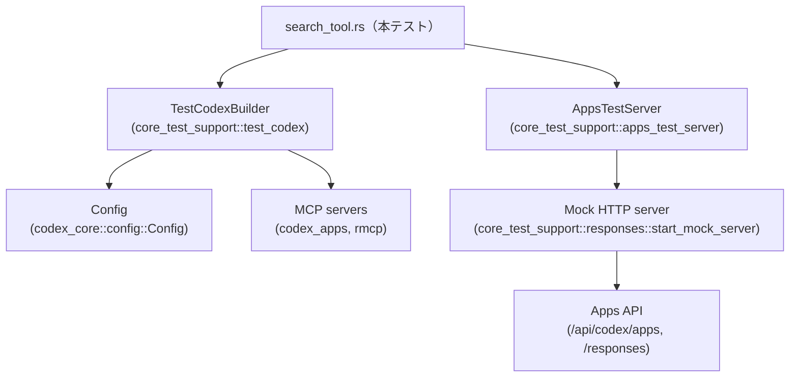
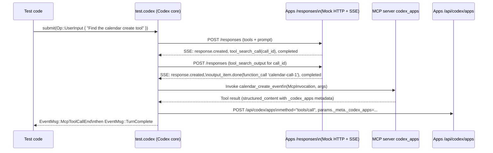

core/tests/suite/search_tool.rs

---

## 0. ざっくり一言

Apps（外部アプリ）連携用の「tool_search」機能まわりについて、ツールの公開・非公開条件や検索結果からのMCPツール呼び出し挙動を検証する統合テスト群です。

※ 入力には行番号情報が含まれていないため、`L開始-終了` 形式での厳密な行番号は付与できません。本解説では、関数名・コード断片を根拠として記述します。

---

## 1. このモジュールの役割

### 1.1 概要

- このテストモジュールは、Apps 経由の MCP ツール公開方法と `tool_search` 機能が正しく動作することを検証します。
- 特に「どの認証方式・どの設定時にどのツールを LLM に見せるか」「tool_search の検索結果から実際の MCP ツール呼び出しにどうつながるか」を確認します。
- さらに、Apps 以外の MCP サーバー（例: `rmcp`）のツールが検索インデックスに載る条件（有効/無効）を検証します。

### 1.2 アーキテクチャ内での位置づけ

このファイル自体はテスト専用モジュールであり、本番コードを直接提供してはいませんが、以下のコンポーネントと連携してシステム全体の挙動を検証しています。



- `TestCodexBuilder` を通じて Codex 本体（`test.codex`）とセッションを構築します。
- `AppsTestServer` + `start_mock_server` で、Apps API と SSE（サーバー送信イベント）を模擬する HTTP サーバーを立てます。
- Codex 本体は Apps API と MCP サーバー（`codex_apps`, `rmcp`）を叩き、その結果が `EventMsg` や Apps 側のリクエストとして観測されます。

### 1.3 設計上のポイント

- **責務の分割**
  - JSON ボディからツール名・説明を取り出す補助関数（`tool_names`, `tool_search_description`, `tool_search_output_tools` 等）。
  - Codex の Config を Apps/ToolSearch 用に設定する補助関数（`configure_apps_without_tool_search`, `configure_apps`, `configured_builder`）。
  - 実際のシナリオごとの統合テスト（`search_tool_flag_adds_tool_search` などの `#[tokio::test]` 関数）。
- **状態管理**
  - グローバル状態は持たず、各テストで `start_mock_server`・`AppsTestServer`・`TestCodexBuilder` を作り直します。
  - MCP サーバー設定（`Config.mcp_servers`）もテスト毎にクローン＋変更し、ローカルな状態に閉じています。
- **エラーハンドリング**
  - テスト関数の戻り値は `anyhow::Result<()>` で、`?` による早期リターンで失敗を表現します。
  - テスト前提が満たされないときは `expect` / `panic!` を多用し、「条件が壊れたら即テスト失敗」というスタイルです。
- **並行性**
  - すべてのテストは `#[tokio::test(flavor = "multi_thread", worker_threads = 2)]` で非同期・マルチスレッド実行されます。
  - ただし本ファイル内では明示的な並列タスク生成はなく、並行性は主に tokio ランタイムと外部コンポーネント（Apps/MCP 呼び出し）に委ねられています。

---

## 2. 主要な機能一覧

このモジュールがテストしている主な機能（シナリオ）をまとめます。

- **tool_search の公開有無の検証**
  - `search_tool_flag_adds_tool_search`: ToolSearch フラグ有効時に `tool_search` ツールが LLM 側に公開されることを検証。
  - `tool_search_disabled_by_default_exposes_apps_tools_directly`: ToolSearch 無効時に Apps ツールが直接一覧されることを検証。
  - `search_tool_is_hidden_for_api_key_auth`: API キー認証時には `tool_search` が公開されないことを検証。
- **tool_search 説明文・ツール表示条件の検証**
  - `search_tool_adds_discovery_instructions_to_tool_description`: `tool_search` の description に Discovery 手順が含まれ、古い文言が含まれないことを検証。
  - `search_tool_hides_apps_tools_without_search`: ToolSearch 有効時に、検索を行うまで Apps ツールが隠されることを検証。
  - `explicit_app_mentions_expose_apps_tools_without_search`: 明示的に app URL を記述した場合、Apps ツールが検索なしでも公開されることを検証。
- **tool_search 結果からの MCP ツール呼び出しの検証**
  - `tool_search_returns_deferred_tools_without_follow_up_tool_injection`: tool_search の結果に含まれる「遅延ロード（`defer_loading`）」ツールを、後続リクエストで再インジェクションせずに利用していることを検証。
- **非 Apps MCP ツールのインデックス条件の検証**
  - `tool_search_indexes_only_enabled_non_app_mcp_tools`: MCP サーバー `rmcp` のツールのうち、有効かつ未無効化のものだけが検索対象になることを検証。

補助機能:

- JSON からツール名や search_tool の出力を取り出す関数群。
- Config で Apps/ToolSearch/MCP サーバーを設定する関数群。
- Codex イベントストリーム（`EventMsg`）を待つユーティリティ（`wait_for_event`）の呼び出し部分。

---

## 3. 公開 API と詳細解説

### 3.1 コンポーネント（定数・関数）一覧

本ファイルで定義されている主なコンポーネントを一覧化します（すべてテスト用・非公開）。

| 名前 | 種別 | 役割 / 用途 |
|------|------|-------------|
| `SEARCH_TOOL_DESCRIPTION_SNIPPETS` | 定数配列 `&[&str; 2]` | `tool_search` の説明文に含まれているべきスニペット文字列 |
| `TOOL_SEARCH_TOOL_NAME` | 定数 `&str` | `tool_search` ツールの type/name (`"tool_search"`) |
| `CALENDAR_CREATE_TOOL` | 定数 `&str` | Apps カレンダーの create イベントツール名 |
| `CALENDAR_LIST_TOOL` | 定数 `&str` | Apps カレンダーの list イベントツール名 |
| `SEARCH_CALENDAR_NAMESPACE` | 定数 `&str` | search_tool で返されるカレンダーツール namespace 名 |
| `SEARCH_CALENDAR_CREATE_TOOL` | 定数 `&str` | search_tool で返される create イベントの短いツール名 |
| `tool_names` | 関数 | Apps / responses API リクエストボディからツール名一覧を抽出 |
| `tool_search_description` | 関数 | `tool_search` ツールの説明文だけを抽出 |
| `tool_search_output_item` | 関数 | `ResponsesRequest` から特定 call_id の search_tool 出力 item を取得 |
| `tool_search_output_tools` | 関数 | search_tool 出力 item から `tools` 配列を抽出 |
| `configure_apps_without_tool_search` | 関数 | Config に Apps 連携を設定しつつ ToolSearch を有効にしない |
| `configure_apps` | 関数 | `configure_apps_without_tool_search` に加えて ToolSearch 機能を有効化 |
| `configured_builder` | 関数 | 上記設定を適用した `TestCodexBuilder` を返す |
| `search_tool_flag_adds_tool_search` | 非同期テスト関数 | ToolSearch 有効時に `tool_search` が公開されることを検証 |
| `tool_search_disabled_by_default_exposes_apps_tools_directly` | 非同期テスト関数 | ToolSearch 無効時は Apps ツールが直接公開されることを検証 |
| `search_tool_is_hidden_for_api_key_auth` | 非同期テスト関数 | API キー認証では `tool_search` が非公開であることを検証 |
| `search_tool_adds_discovery_instructions_to_tool_description` | 非同期テスト関数 | `tool_search` 説明文の内容を検証 |
| `search_tool_hides_apps_tools_without_search` | 非同期テスト関数 | 検索前は Apps ツールが隠蔽されることを検証 |
| `explicit_app_mentions_expose_apps_tools_without_search` | 非同期テスト関数 | 明示的な app 言及で Apps ツールが公開されることを検証 |
| `tool_search_returns_deferred_tools_without_follow_up_tool_injection` | 非同期テスト関数 | 遅延ロードツールが search history からのみ利用されることを検証 |
| `tool_search_indexes_only_enabled_non_app_mcp_tools` | 非同期テスト関数 | 非 Apps MCP ツールのうち有効なものだけが index されることを検証 |

### 3.2 重要な関数の詳細

ここでは特に重要な補助関数およびテスト関数 7 個について詳述します。

---

#### `tool_names(body: &Value) -> Vec<String>`

**概要**

- `serde_json::Value` で表現されたリクエストボディから、`tools` 配列内のツール名（`name` または `type`）を抽出し、`Vec<String>` として返します。
- テスト内で「どのツールが LLM に公開されたか」を検証する際に使用します。

**引数**

| 引数名 | 型 | 説明 |
|--------|----|------|
| `body` | `&Value` | Apps / responses API に送られた JSON ボディ |

**戻り値**

- `Vec<String>`: `tools` 配列内の各要素から取得した `"name"` または `"type"` の文字列。
- `tools` フィールドが存在しない場合や配列でない場合は空ベクタを返します（`unwrap_or_default()` 使用）。

**内部処理の流れ**

1. `body.get("tools").and_then(Value::as_array)` で `tools` 配列を取得。
2. 配列が存在する場合、
   - 各 `tool` オブジェクトから `tool.get("name")` を試し、なければ `tool.get("type")` を参照。
   - `as_str` で `&str` を取り出し、`str::to_string` で `String` に変換。
   - `filter_map` で `None` を除外しつつ `Vec<String>` に収集。
3. `tools` 配列がなければ `unwrap_or_default()` により空の `Vec` を返す。

**Examples（使用例）**

```rust
// HTTP モックから取得したリクエストボディを JSON としてパースする
let body: Value = mock.single_request().body_json();

// 公開されているツール名一覧を取得する
let tools = tool_names(&body);

// 特定ツールが含まれているか検証する
assert!(tools.iter().any(|name| name == "tool_search"));
```

**Errors / Panics**

- この関数内では `unwrap`/`expect` を使用していないため、通常入力で panic は発生しません。
- `body` が任意の JSON であっても、`tools` が配列でなければ単に空の `Vec` を返します。

**Edge cases（エッジケース）**

- `tools` キーが存在しない / `null` / オブジェクトの場合: 空の `Vec` を返します。
- `tools` 配列の要素に `name` も `type` もない場合: その要素はスキップされます。
- `name` が `null` / 数値など文字列でない場合: その要素もスキップされます。

**使用上の注意点**

- 戻り値が空だからといって「tools が存在しない」とは限りません。`tools` 配列があっても条件に合うフィールドがない場合も空になります。
- テストで「ツールが公開されていないこと」を確認する場合、`tools.is_empty()` ではなく、「期待する名前が含まれていないこと」を `any` で確認するのが安全です（本ファイルのテストもそのように書かれています）。

---

#### `tool_search_description(body: &Value) -> Option<String>`

**概要**

- `tools` 配列の中から `type == "tool_search"` の要素を探し、その `description` フィールドを `String` として返します。
- `search_tool_adds_discovery_instructions_to_tool_description` テストで使用され、説明文の内容を検証するためのヘルパーです。

**引数**

| 引数名 | 型 | 説明 |
|--------|----|------|
| `body` | `&Value` | Apps / responses API の JSON ボディ |

**戻り値**

- `Option<String>`: 見つかった `tool_search` の説明文。見つからない場合や `description` が文字列でない場合は `None`。

**内部処理の流れ**

1. `body.get("tools").and_then(Value::as_array)` で `tools` 配列を取得。
2. 配列上で `iter().find_map(...)` を使い、
   - 各 `tool` の `tool.get("type").and_then(Value::as_str)` が `Some("tool_search")` かチェック。
   - 一致した場合、その `tool` の `tool.get("description")` を `as_str` → `String` に変換して返す。
3. 条件に合う要素がなければ `None`。

**Examples（使用例）**

```rust
let body: Value = mock.single_request().body_json();

// tool_search ツールの説明文を取得
let description = tool_search_description(&body)
    .expect("tool_search description should exist");

// 必要なスニペットが含まれているか確認
assert!(description.contains("Plan events and manage your calendar."));
```

**Errors / Panics**

- 関数内部では panic しません（`expect` などは呼び出し側のテストで使用）。

**Edge cases**

- `tools` 配列に `tool_search` が含まれない場合: `None`。
- `type` キーが存在しない、または文字列でない場合: その要素はスキップされます。
- `description` が存在しない/文字列でない: その `tool_search` は説明なしとみなされ `None`。

**使用上の注意点**

- テスト側では `.expect("tool_search description should exist")` としているため、前提として `tool_search` ツールが必ず登録されているケースでのみ使う設計になっています。
- 前提が成り立たないケースで使う場合は `Option` を丁寧にハンドリングする必要があります。

---

#### `configure_apps_without_tool_search(config: &mut Config, apps_base_url: &str)`

**概要**

- Codex の `Config` を Apps 連携用に設定しますが、ToolSearch 機能は有効化しません。
- Apps 用モデル `gpt-5-codex` の `supports_search_tool` フラグを `true` に設定し、Apps 側のツール利用を可能にします。

**引数**

| 引数名 | 型 | 説明 |
|--------|----|------|
| `config` | `&mut Config` | Codex の設定オブジェクト |
| `apps_base_url` | `&str` | Apps サーバーのベース URL |

**戻り値**

- なし（`config` をインプレースで更新）。

**内部処理の流れ**

1. `config.features.enable(Feature::Apps)` で Apps 機能を有効化。
2. `config.chatgpt_base_url` に `apps_base_url` を設定。
3. モデルを `"gpt-5-codex"` に設定。
4. `bundled_models_response()` を呼び、組み込みのモデルカタログを取得。
   - パースに失敗した場合は `panic!("bundled models.json should parse: {err}")`。
5. `model_catalog.models` から `slug == "gpt-5-codex"` のモデルを検索し、
   - 見つからなければ `expect("gpt-5-codex exists in bundled models.json")` で panic。
   - 見つかったモデルの `supports_search_tool` を `true` に変更。
6. 変更した `model_catalog` を `config.model_catalog` に格納。

**Examples（使用例）**

```rust
let apps_server = AppsTestServer::mount_searchable(&server).await?;
let mut config = Config::default();

// Apps 機能のみ有効化し、ToolSearch は無効
configure_apps_without_tool_search(&mut config, apps_server.chatgpt_base_url.as_str());
```

**Errors / Panics**

- `bundled_models_response()` が `Err` を返した場合: `panic!`。
- `gpt-5-codex` モデルが見つからない場合: `expect` により `panic!`。
- いずれもテスト前提が満たされていないことを示すもので、本番コードではなくテスト専用の挙動です。

**Edge cases**

- モデルカタログが空である / `gpt-5-codex` を含まない場合、テストが必ず panic します。
- `apps_base_url` が空文字列でも Config への設定自体は行われますが、その後の通信が失敗する可能性があります（このファイルではそういうケースは作られていません）。

**使用上の注意点**

- テスト専用の関数であり、本番コードでの使用は前提としていません。
- 「Apps 機能のみ有効化し、ToolSearch を無効にした状態」を明示的に作るために使用されます。
- ToolSearch を有効にしたい場合は、必ず次の `configure_apps` を使用します。

---

#### `configure_apps(config: &mut Config, apps_base_url: &str)`

**概要**

- `configure_apps_without_tool_search` を呼び出した上で、`Feature::ToolSearch` を有効化し、Apps + ToolSearch を利用可能な設定を構築します。

**引数 / 戻り値**

- 引数・戻り値は `configure_apps_without_tool_search` と同様です。

**内部処理の流れ**

1. `configure_apps_without_tool_search(config, apps_base_url)` を呼び出し、Apps 機能の基本設定を行う。
2. `config.features.enable(Feature::ToolSearch)` を呼び、ToolSearch 機能フラグを有効化。
   - 失敗した場合は `expect("test config should allow feature update")` で panic。

**Examples（使用例）**

```rust
let apps_server = AppsTestServer::mount_searchable(&server).await?;
let mut config = Config::default();

// Apps + ToolSearch を有効化した設定
configure_apps(&mut config, apps_server.chatgpt_base_url.as_str());
```

**Errors / Panics**

- 内部で呼び出す `configure_apps_without_tool_search` と同様の panic 可能性に加えて、
- `features.enable(Feature::ToolSearch)` が `Err` を返した場合にも `expect` により panic します。

**Edge cases**

- `Config.features` がテスト環境で何らかの制約を持っており ToolSearch を有効化できない場合、テストは即座に失敗します。
- ToolSearch を有効にしても、認証方式によっては `tool_search` ツールが公開されない（API キー認証の場合）ことが別テストで検証されています。

**使用上の注意点**

- ToolSearch の挙動をテストする場合は、この関数を通じて設定された `Config` を使うことが前提です。
- 認証方式の違い（`CodexAuth::create_dummy_chatgpt_auth_for_testing()` vs `CodexAuth::from_api_key(...)`）も合わせてテストで切り替えています。

---

#### `configured_builder(apps_base_url: String) -> TestCodexBuilder`

**概要**

- Apps + ToolSearch が有効化された `Config` と、ChatGPT 認証済みの `CodexAuth` をセットした `TestCodexBuilder` を返します。
- 多くのテストで共通の初期設定として使用されます。

**引数**

| 引数名 | 型 | 説明 |
|--------|----|------|
| `apps_base_url` | `String` | Apps サーバーのベース URL（所有権を取得） |

**戻り値**

- `TestCodexBuilder`: Codex テストインスタンス構築用ビルダー。

**内部処理の流れ**

1. `test_codex()` を呼び、デフォルト設定を持つ `TestCodexBuilder` を取得。
2. `.with_auth(CodexAuth::create_dummy_chatgpt_auth_for_testing())` を呼び、ChatGPT 用ダミー認証を設定。
3. `.with_config(move |config| configure_apps(config, apps_base_url.as_str()))` で Config 初期化クロージャを設定。
   - ここで `apps_base_url` の所有権をクロージャに move し、`config` 初期化時に `configure_apps` を呼び出せるようにします。

**Examples（使用例）**

```rust
let apps_server = AppsTestServer::mount_searchable(&server).await?;

// 共通設定入りの builder を取得
let mut builder = configured_builder(apps_server.chatgpt_base_url.clone());

// Codex テストインスタンスを構築
let test = builder.build(&server).await?;
```

**Errors / Panics**

- `configured_builder` 自体は panic やエラーを返しません。
- ただし、`builder.build(&server).await?` 側で Config 初期化が行われる際に、
  - `configure_apps` 内で発生しうる panic がテスト失敗として現れる可能性があります。

**Edge cases**

- 異なる `apps_base_url` を用いたい場合、テスト側で `configured_builder` を使わずに `test_codex()` から手動で設定することもできます（`tool_search_disabled_by_default_exposes_apps_tools_directly` など）。

**使用上の注意点**

- ToolSearch を前提としないテストでは、この関数を使わず個別に Config を設定しています。そのため「この builder を使えば常に ToolSearch 有効」という前提がテスト内に暗黙に存在します。
- 非同期テスト内で builder を複数回 `build` する場合、Config 初期化クロージャが毎回実行される点に注意します（本ファイルでは 1 テスト 1 build）。

---

#### `tool_search_returns_deferred_tools_without_follow_up_tool_injection() -> Result<()>`

**概要**

- search_tool が返すツール（defer_loading な function ツール）を、後続リクエストで「履歴（tool_search_output）」のみを元に使用し、Apps 側からは再度ツールをインジェクトしないことを検証する統合テストです。
- また、MCP ツール `calendar_create_event` の呼び出しが正しく `McpInvocation` と Apps 側の `/api/codex/apps` 呼び出しに反映されることも確認します。

**引数**

- なし。

**戻り値**

- `anyhow::Result<()>`: テスト成功時は `Ok(())`、途中でエラーがあれば `Err` として上位に伝播され、テストは失敗となります。

**内部処理の流れ（アルゴリズム）**

1. `skip_if_no_network!(Ok(()));` でネットワーク未使用環境ではテストをスキップ。
2. `start_mock_server().await` でモック HTTP サーバーを起動。
3. `AppsTestServer::mount_searchable(&server).await?` で search_tool 対応の Apps サーバーをマウント。
4. `mount_sse_sequence` で 3 つの SSE ストリームを設定:
   - 1ストリーム目: `ev_response_created("resp-1")` → `ev_tool_search_call(call_id, {...})` → `ev_completed("resp-1")`
   - 2ストリーム目: `response.output_item.done` として `function_call` (`calendar-call-1`) を返す。
   - 3ストリーム目: 通常の assistant メッセージと `completed`。
5. `configured_builder` から `test` を構築。
6. `test.codex.submit(Op::UserInput { ... })` でユーザー入力「Find the calendar create tool」を送信。
7. `wait_for_event` で `EventMsg::McpToolCallEnd` が来るまで待機し、
   - `end.call_id == "calendar-call-1"`、
   - `end.invocation` が期待どおり `McpInvocation { server: "codex_apps", tool: "calendar_create_event", ... }` であること、
   - `end.result.structured_content` が Apps リソースメタデータ（`resource_uri`, `connector_id` 等）を持つことを検証。
8. `wait_for_event` で `EventMsg::TurnComplete` を待ち、ターン完了を確認。
9. `mock.requests()` で Apps 側に送られた 3 つの `/responses` リクエストを取得。
   - 1件目: `tool_search` を含み、Apps のカレンダーツールはインジェクトされていないことを `tool_names` で検証。
   - 2件目: `tool_search_output_item` / `tool_search_output_tools` で search_tool の出力を検証（`namespace` や `defer_loading` フラグなど）。
   - 3件目: `function_call_output("calendar-call-1")` を検証。
10. `server.received_requests().await` から Apps の `/api/codex/apps` 呼び出しを探し、
    - `method == "tools/call"` であること、
    - `/params/_meta/_codex_apps` にリソースメタデータが含まれること、
    - `/params/_meta/x-codex-turn-metadata/session_id` および `turn_id` が含まれることを確認。

**Examples（使用例）**

テスト自体が最もよい使用例です。新たな search_tool シナリオを追加する際のテンプレートとして利用できます。

```rust
#[tokio::test(flavor = "multi_thread", worker_threads = 2)]
async fn new_search_tool_scenario() -> Result<()> {
    skip_if_no_network!(Ok(()));

    let server = start_mock_server().await;
    let apps_server = AppsTestServer::mount_searchable(&server).await?;
    let mock = mount_sse_sequence(&server, vec![
        // 1: tool_search 呼び出し
        sse(vec![/* ... */]),
        // 2: search_tool_result に応じて function_call を返す
        sse(vec![/* ... */]),
    ]).await;

    let mut builder = configured_builder(apps_server.chatgpt_base_url.clone());
    let test = builder.build(&server).await?;
    test.codex.submit(Op::UserInput { /* ... */ }).await?;

    // EventMsg と Apps リクエストを検証
    // ...
    Ok(())
}
```

**Errors / Panics**

- `start_mock_server`, `AppsTestServer::mount_searchable`, `builder.build` などが `Err` を返す場合、`?` により `Err` が伝播しテスト失敗。
- `expect` / `unwrap` を使っている部分:
  - `serde_json::to_string(...).expect("serialize calendar args")`
  - `end.result.as_ref().expect("tool call should succeed")`
  - `apps_tool_call.expect("apps tools/call request should be recorded")`
  などが前提条件を満たさない場合 panic します。

**Edge cases**

- `wait_for_event` がタイムアウトまたは異なるイベントタイプを返す場合: `unreachable!` の手前でエラーになるか、テストがハング / 失敗する可能性があります（`wait_for_event` の実装次第。ここでは詳細不明）。
- Apps モックが期待どおりの SSE シーケンスを返さない場合、`mock.requests()` の長さが 3 にならないため `assert_eq!(requests.len(), 3)` で失敗します。
- `server.received_requests()` が `Err` または `None` を返す場合は `unwrap_or_default()` で空配列扱いになり、`apps tools/call request should be recorded` の `expect` で失敗します。

**使用上の注意点**

- このテストは、search_tool の履歴が唯一の「ツールカタログ」になっている前提（Apps 側からのツール再インジェクション禁止）を強く仮定しています。仕様変更時にはこの前提が変わる可能性があります。
- 複数のリクエストと SSE シーケンスを組み合わせているため、テストの読み解きがやや複雑です。Mermaid のデータフロー図（後述）と合わせて理解すると把握しやすくなります。
- tokio マルチスレッドランタイム上で動作するため、Apps モックや shared state がスレッドセーフに設計されていることが前提です（このファイルからは詳細は分かりません）。

---

#### `tool_search_indexes_only_enabled_non_app_mcp_tools() -> Result<()>`

**概要**

- 非 Apps MCP サーバー（ここでは `rmcp`）のツールについて、「`enabled_tools` に含まれていて、かつ `disabled_tools` に含まれないツールのみが search_tool から見える」ことを検証するテストです。
- 具体的には `echo` と `image` ツールのうち、`image` が `disabled_tools` に入っているため検索結果に現れないことを確認します。

**引数 / 戻り値**

- 引数なし、戻り値は `anyhow::Result<()>` で他テストと同様です。

**内部処理の流れ**

1. ネットワークチェック (`skip_if_no_network!`)。
2. `start_mock_server` と `AppsTestServer::mount_searchable` で環境構築。
3. SSE シーケンスを 2 フェーズで設定:
   - フェーズ1: `ev_tool_search_call` を 2 回（echo 用 / image 用）発行。
   - フェーズ2: assistant メッセージ `done` のみ返す。
4. `stdio_server_bin()?` で rmcp テストサーバーバイナリのパスを取得。
5. `configured_builder(...).with_config(move |config| { ... })` で MCP サーバー設定を上書き:
   - 既存 `config.mcp_servers.get().clone()` を取得。
   - `"rmcp"` エントリを挿入し、
     - `enabled: true`
     - `enabled_tools: Some(vec!["echo", "image"])`
     - `disabled_tools: Some(vec!["image"])`
   - `config.mcp_servers.set(servers)` で再設定。
6. `test.submit_turn_with_policies("Find the rmcp echo and image tools.", ...)` で検索要求を送信。
7. `mock.requests()` から 2 件のリクエストを取得:
   - 1件目: `tool_search` が公開され、`mcp__rmcp__echo` がまだ出てこないことを検証。
   - 2件目: `tool_search_output_tools(requests[1], echo_call_id)` で echo への回答を取得し、`mcp__rmcp__` namespace 内に `echo` だけが含まれることを `rmcp_echo_tools` ベクタで確認。
   - 同様に `image_call_id` に対する結果から `image` が見つからないことを検証。

**Examples（使用例）**

MCP サーバーごとのフィルタリングルールを追加でテストしたい場合、このテストを参考に `enabled_tools` / `disabled_tools` の組み合わせを変えたテストを追加できます。

```rust
let rmcp_test_server_bin = stdio_server_bin()?;
let mut builder = configured_builder(apps_server.chatgpt_base_url.clone())
    .with_config(move |config| {
        let mut servers = config.mcp_servers.get().clone();
        // 新しい MCP サーバー設定を挿入
        servers.insert("rmcp".into(), McpServerConfig {
            // ...
        });
        config.mcp_servers.set(servers).unwrap();
    });
```

**Errors / Panics**

- `stdio_server_bin()?` でバイナリの取得に失敗すると `Err` が返り、テストは失敗。
- `config.mcp_servers.set(servers)` が `Err` を返す場合、`expect` により panic。
- search_tool のレスポンス形式が期待と異なる場合（namespace 名が違うなど）、`assert_eq!(rmcp_echo_tools, vec!["echo"])` 等でテストが失敗します。

**Edge cases**

- `disabled_tools` が `None` の場合: `enabled_tools` に含まれる全ツールが検索対象になる想定です（このテストでは試していません）。
- `enabled_tools` に `image` が含まれていない場合: そもそも検索候補にならないため、`disabled_tools` に入っていても影響がないはずです（こちらも別テストが必要）。

**使用上の注意点**

- `tool_search_output_tools` の結果構造に強く依存しており、`"mcp__rmcp__"` という namespace 名や、ツールの `name` が `"echo"` であることを前提としています。
- MCP サーバーの挙動やツール名が変わるときは、このテストも合わせて更新する必要があります。

---

### 3.3 その他の関数

一覧に挙げた以外の（説明を詳述しなかった）関数の役割です。

| 関数名 | 役割（1 行） |
|--------|--------------|
| `tool_search_output_item` | `ResponsesRequest` から特定の search_tool 呼び出し (`call_id`) の出力 item を取得するラッパー |
| `tool_search_output_tools` | search_tool 出力 item から `tools` 配列を抽出し、`Vec<Value>` として返す |
| `search_tool_flag_adds_tool_search` | ToolSearch フラグ有効時に `tool_search` ツールが `tools` 配列に正しく追加されることを検証 |
| `tool_search_disabled_by_default_exposes_apps_tools_directly` | ToolSearch 無効時に Apps のカレンダーツールが直接 LLM に公開されることを検証 |
| `search_tool_is_hidden_for_api_key_auth` | API キー認証時に `tool_search` ツールが隠されることを検証 |
| `search_tool_adds_discovery_instructions_to_tool_description` | `tool_search` の説明文に特定スニペットが含まれ、古い文言が含まれないことを検証 |
| `search_tool_hides_apps_tools_without_search` | ToolSearch 有効時に、検索前は Apps ツールが `tools` 配列に現れないことを検証 |
| `explicit_app_mentions_expose_apps_tools_without_search` | プロンプト中に app:// URL が明示された場合に Apps ツールが公開されることを検証 |

---

## 4. データフロー

### 4.1 代表的な処理シナリオ（search_tool 経由で MCP ツールを呼ぶ）

`tool_search_returns_deferred_tools_without_follow_up_tool_injection` テストを例に、ユーザー入力から MCP ツール呼び出し、Apps への最終通知までの流れを示します。

1. テストコードが `test.codex.submit(Op::UserInput { ... })` でユーザーの質問（「Find the calendar create tool」）を送信します。
2. Codex 本体は Apps API (`/responses`) にリクエストを送り、`tools` と初期レスポンスを要求します。
3. Apps モックは SSE で `ev_tool_search_call` を送り、LLM が `tool_search` ツールを呼び出したことを表現します。
4. Codex は search_tool の呼び出し結果を受け取り、`tool_search_output` を Apps 側に送信して「検索結果として利用可能なツール」を提示します（namespace `mcp__codex_apps__calendar` など）。
5. その後の SSE で、LLM は `response.output_item.done` として `function_call`（`calendar-call-1`）を返します。
6. Codex はこれを MCP ツール呼び出し (`McpInvocation { server: "codex_apps", tool: "calendar_create_event", ... }`) に変換し、`codex_apps` コネクタ経由で実行します。
7. MCP ツール結果が Codex に戻り、`EventMsg::McpToolCallEnd` としてテスト側に報告されるとともに、Apps の `/api/codex/apps` `tools/call` エンドポイントにもメタデータ付きで通知されます。



この図から分かるように、「search_tool 結果 → function_call → MCP ツール」の連鎖があり、Apps に対しては最終的な MCP 呼び出しがメタデータ付きで通知される構造になっています。

---

## 5. 使い方（How to Use）

このファイル自体はテストモジュールですが、同様のテストを追加したり、Codex + Apps + ToolSearch の統合テストを書く際の参考になります。

### 5.1 基本的な使用方法（テストのパターン）

典型的なテストは以下のような流れを取っています。

```rust
#[tokio::test(flavor = "multi_thread", worker_threads = 2)]
async fn example_apps_tool_search_test() -> Result<()> {
    // ネットワークが利用できない環境ではテストをスキップする
    skip_if_no_network!(Ok(()));

    // 1. モックサーバーと Apps サーバーを起動する
    let server = start_mock_server().await;                            // HTTP モックサーバー
    let apps_server = AppsTestServer::mount_searchable(&server).await?; // search_tool 対応 Apps

    // 2. このテストで利用する SSE シーケンスを定義・マウントする
    let _mock = mount_sse_once(
        &server,
        sse(vec![
            ev_response_created("resp-1"),                 // 応答開始
            ev_assistant_message("msg-1", "done"),         // アシスタントメッセージ
            ev_completed("resp-1"),                        // 応答完了
        ]),
    )
    .await;

    // 3. Codex テストインスタンスを構築する
    let mut builder = configured_builder(apps_server.chatgpt_base_url.clone()); // Apps + ToolSearch 設定
    let test = builder.build(&server).await?;                                    // Codex 本体

    // 4. ユーザー入力を投げる（高レベル API）
    test.submit_turn_with_policies(
        "list tools",                        // ユーザーのプロンプト
        AskForApproval::Never,              // ツール実行の承認ポリシー
        SandboxPolicy::DangerFullAccess,    // サンドボックスポリシー
    )
    .await?;

    // 5. Apps 側に送られたリクエストを検証する
    //    （どのツールが公開されているかなど）
    // ...

    Ok(())
}
```

### 5.2 よくある使用パターン

- **Apps 設定の違いを試す**
  - `configure_apps_without_tool_search` vs `configure_apps` を使い分けることで、
    - ToolSearch 無効: Apps ツールがそのまま `tools` に出る。
    - ToolSearch 有効: `tool_search` のみ公開され、Apps ツールは search_tool 経由で見える。
- **認証方式による挙動の違い**
  - ChatGPT 認証 (`CodexAuth::create_dummy_chatgpt_auth_for_testing`) では ToolSearch が利用可能。
  - API キー認証 (`CodexAuth::from_api_key`) では `tool_search` が公開されないことを `search_tool_is_hidden_for_api_key_auth` で確認。

### 5.3 よくある間違い

```rust
// 間違い例: ToolSearch を使ったテストなのに Apps 設定で ToolSearch を有効化していない
let mut builder = test_codex()
    .with_auth(CodexAuth::create_dummy_chatgpt_auth_for_testing());
// configure_apps を呼ばずに build してしまう
let test = builder.build(&server).await?;

// 正しい例: ToolSearch を使うテストでは configure_apps を通じて設定する
let mut builder = test_codex()
    .with_auth(CodexAuth::create_dummy_chatgpt_auth_for_testing())
    .with_config(move |config| configure_apps(config, apps_server.chatgpt_base_url.as_str()));
let test = builder.build(&server).await?;
```

```rust
// 間違い例: ツール一覧から直接ツール名を決め打ちする
let tools = body.get("tools").unwrap().as_array().unwrap();
// インデックス 0 が必ず tool_search だと仮定している
let name = tools[0].get("name").unwrap().as_str().unwrap();

// 正しい例: ツール名ユーティリティを使って存在確認する
let tools = tool_names(&body);
assert!(tools.iter().any(|name| name == TOOL_SEARCH_TOOL_NAME));
```

### 5.4 使用上の注意点（まとめ）

- すべてのテストが tokio マルチスレッドランタイム上で動作するため、共有リソース（モックサーバー等）がスレッドセーフである必要があります（本ファイルでは `core_test_support` に委譲）。
- `skip_if_no_network!` マクロによりネットワークが使えない環境では silently スキップされるため、CI 環境によってはテストが実行されていない可能性があります。
- JSON 構造に依存するアサーション（ポインタ `/params/_meta/...` など）は、Apps プロトコルのスキーマ変更に敏感です。仕様変更時はこのファイルのテストを必ず見直す必要があります。

---

## 6. 変更の仕方（How to Modify）

### 6.1 新しい機能を追加する場合（新規テストシナリオ）

1. **どのレイヤーの挙動を検証したいかを決める**
   - 例: 新しい認証方式での ToolSearch 公開条件、Apps 以外の MCP サーバーのフィルタリングルールなど。
2. **必要に応じて Config 初期化関数を追加/拡張する**
   - 他のサーバーやフラグを設定したい場合、`configure_apps_*` を参考に新しい設定関数を定義します。
3. **SSE シーケンスを定義する**
   - `mount_sse_once` または `mount_sse_sequence` を使い、期待する LLM → Apps の対話パターンを JSON で構成します。
4. **テスト本体 (`#[tokio::test]`) を追加**
   - `configured_builder` あるいは `test_codex().with_config(...)` を使って Codex インスタンスを作成。
   - `submit_turn_with_policies` または `test.codex.submit(Op::UserInput { ... })` でシナリオを駆動。
5. **Apps / MCP 側の結果を検証**
   - `mock.requests()`、`server.received_requests().await?`、`wait_for_event` 等を組み合わせて、仕様に対応するアサーションを書く。

### 6.2 既存の機能を変更する場合

- **影響範囲の確認**
  - ToolSearch の仕様や Apps 側の JSON スキーマが変わる場合、このファイル内のすべてのテストが影響を受ける可能性があります。
  - 特に `tool_names`, `tool_search_description`, `tool_search_output_tools` は JSON 構造に強く依存しています。
- **契約（前提条件）の確認**
  - 例えば「API キー認証では ToolSearch を公開しない」といったビジネスルールは、`search_tool_is_hidden_for_api_key_auth` テストにハードコードされています。仕様変更時はテスト内容も同期して更新する必要があります。
- **関連テストの再確認**
  - MCP サーバー設定 (`Config.mcp_servers`) の扱いを変える際は、`tool_search_indexes_only_enabled_non_app_mcp_tools` を必ず再確認すべきです。
  - search_tool の result format を変える場合は、`tool_search_returns_deferred_tools_without_follow_up_tool_injection` にも影響が出る可能性があります。

---

## 7. 関連ファイル

このモジュールと密接に関連するコンポーネントをまとめます（いずれもこのチャンクには定義が現れておらず、役割は名前と使用方法からの範囲で記述しています）。

| パス / 型 | 役割 / 関係 |
|-----------|------------|
| `core_test_support::test_codex::TestCodexBuilder` / `test_codex` | Codex 本体のテストインスタンスを構築するビルダーとファクトリ。Config や認証を組み合わせて `test.codex` を生成します。 |
| `core_test_support::apps_test_server::AppsTestServer` | Apps API（/responses, /api/codex/apps 等）を模擬するテストサーバー。`mount` / `mount_searchable` で起動されます。 |
| `core_test_support::responses::*` | SSE ストリームや `ResponsesRequest` のユーティリティ。`mount_sse_once`, `mount_sse_sequence`, `ev_*` 関数群により LLM 側からのイベントを模擬します。 |
| `core_test_support::wait_for_event` | Codex のイベントストリームから特定条件を満たす `EventMsg` を待機するヘルパー。`McpToolCallEnd` や `TurnComplete` の到着待ちに使用されています。 |
| `codex_core::config::Config` | Codex の全体設定オブジェクト。Apps / MCP サーバー / Feature flags などを保持します。 |
| `codex_features::Feature` | 機能フラグ enum。`Feature::Apps`, `Feature::ToolSearch` を通じて機能の有効/無効を切り替えています。 |
| `codex_login::CodexAuth` | Codex の認証情報。ChatGPT 認証用ダミー (`create_dummy_chatgpt_auth_for_testing`) や API キー認証 (`from_api_key`) が使用されています。 |
| `codex_models_manager::bundled_models_response` | 組み込みのモデル定義（models.json）を読み込む関数。Apps 用モデルの `supports_search_tool` フラグ設定に利用されています。 |
| `codex_protocol::protocol::{AskForApproval, EventMsg, McpInvocation, Op, SandboxPolicy}` | Codex プロトコルの型。ユーザー入力 (`Op::UserInput`), イベント (`EventMsg`), MCP ツール呼び出し (`McpInvocation`)、承認ポリシー (`AskForApproval`) 等を表します。 |
| `codex_protocol::user_input::UserInput` | Codex に投げるユーザー入力（テキストなど）を表す型。 |
| `codex_config::types::{McpServerConfig, McpServerTransportConfig}` | MCP サーバーごとの設定（transport, enabled_tools, disabled_tools など）を表す型。`tool_search_indexes_only_enabled_non_app_mcp_tools` で rmcp サーバーを設定する際に使用されています。 |

このように、本ファイルは Codex 本体・Apps・MCP・テストサポートコードを束ねる「結合点」として、search_tool の仕様が破壊されていないことを保証するための統合テスト群になっています。
