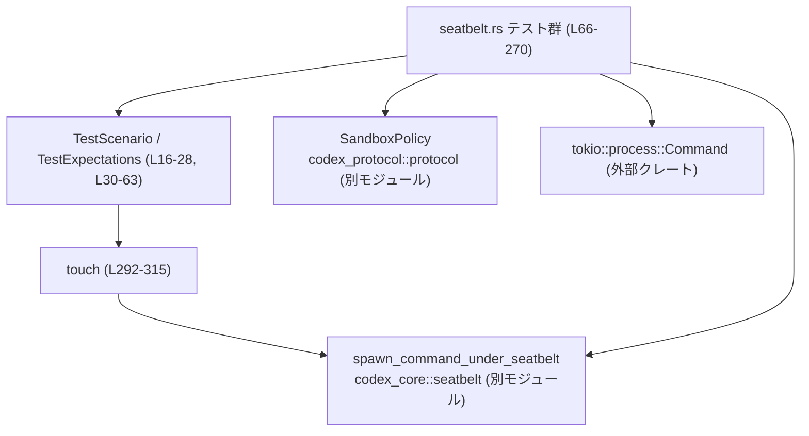
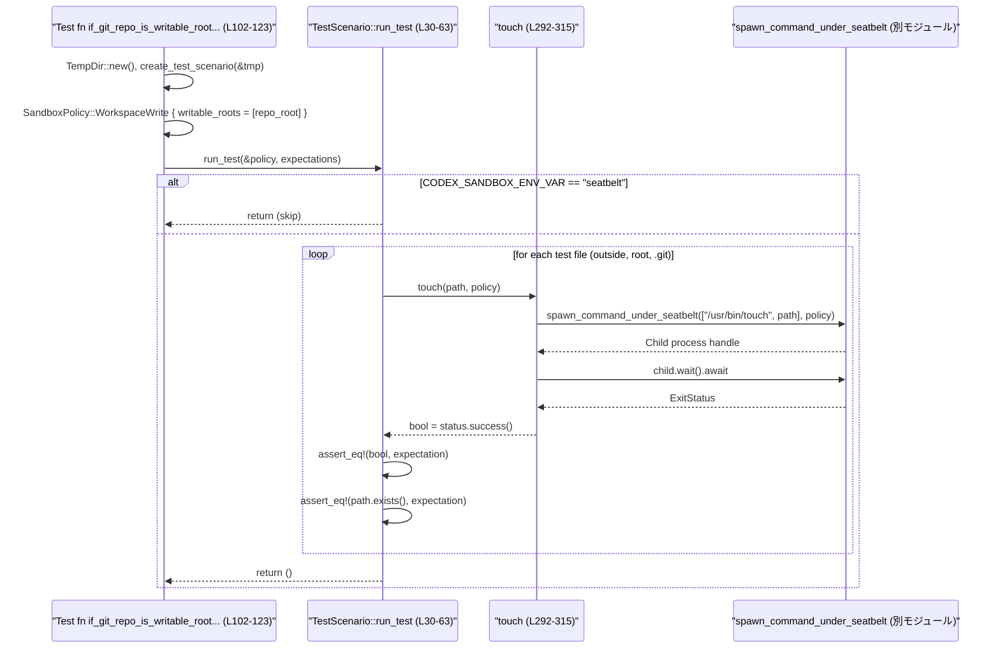

# core/tests/suite/seatbelt.rs コード解説

---

## 0. ざっくり一言

macOS の Seatbelt サンドボックス環境におけるファイル書き込み権限と、一部システムツール（`python3` の `openpty`、`/usr/libexec/java_home`）がサンドボックス下でも正しく動作するかを検証する非公開テストモジュールです（`core/tests/suite/seatbelt.rs:L1-L270`）。

---

## 1. このモジュールの役割

### 1.1 概要

- このモジュールは **macOS Seatbelt サンドボックス下での I/O 制限** を検証するために存在し、特に次を確認します。
  - `SandboxPolicy::WorkspaceWrite` / `DangerFullAccess` / `new_read_only_policy` それぞれで、ワークスペース外・リポジトリルート・`.git` ディレクトリが書き込み可能かどうか（`seatbelt.rs:L66-L162`）。
  - Seatbelt 下で `os.openpty()` を利用した擬似端末操作ができるか（`openpty_works_under_seatbelt`, `seatbelt.rs:L164-L206`）。
  - Seatbelt 下で `/usr/libexec/java_home` が正常に動作し、Java ランタイムのパスを返せるか（`java_home_finds_runtime_under_seatbelt`, `seatbelt.rs:L208-L270`）。

### 1.2 アーキテクチャ内での位置づけ

- 依存関係（このファイルから分かる範囲）:
  - `codex_core::seatbelt::spawn_command_under_seatbelt` を通じて、サンドボックス付きプロセス生成をテスト（`seatbelt.rs:L10,L180-L199,L242-L252,L296-L309`）。
  - `codex_protocol::protocol::SandboxPolicy` を使ってサンドボックスのポリシーを切り替え（`seatbelt.rs:L13,L78-L84,L105-L111,L131,L150,L176,L234`）。
  - `codex_core::spawn::{CODEX_SANDBOX_ENV_VAR, StdioPolicy}` で、環境変数によるモード判定と標準入出力の方針を指定（`seatbelt.rs:L11-L12,L32,L166,L210,L194,L247,L304`）。
  - `tokio` の非同期ランタイム（`#[tokio::test]` と `tokio::process::Command`）を利用（`seatbelt.rs:L74,L101,L127,L146,L164,L208,L221-L225`）。

依存関係の概略図です。



※ `spawn_command_under_seatbelt` / `SandboxPolicy` の実装ファイルパスはこのチャンクには現れないため不明です。

### 1.3 設計上のポイント

- **macOS 限定のテスト**  
  モジュール先頭に `#![cfg(target_os = "macos")]` があり、ビルド・実行とも macOS に限定されています（`seatbelt.rs:L1`）。
- **再利用可能なテストシナリオ表現**  
  - `TestScenario` が「一時ディレクトリ配下のリポジトリと `.git` ディレクトリ、およびそれぞれのテスト用ファイルパス」をまとめています（`seatbelt.rs:L16-L22,L273-L287`）。
  - `TestScenario::run_test` が「ポリシーと期待値を受け取り、3 種類のパスに対する書き込み可否を一括検証」します（`seatbelt.rs:L30-L63`）。
- **外部依存を考慮したスキップロジック**
  - Seatbelt 自身の挙動を検証する都合上、すでに `CODEX_SANDBOX_ENV_VAR="seatbelt"` の場合は再帰的な動作を避けるためテストをスキップします（`seatbelt.rs:L32-L35,L166-L169,L210-L213`）。
  - `python3` や `/usr/libexec/java_home` が存在しない場合、あるいは後者が非サンドボックス環境で失敗する場合にはテストをスキップします（`seatbelt.rs:L171-L174,L215-L232`）。
- **非同期・プロセスベースのテスト**
  - すべてのテストは `#[tokio::test] async fn` で宣言され、非同期に外部プロセスを起動して結果を待ちます（`seatbelt.rs:L74,L101,L127,L146,L164,L208`）。
  - ファイル書き込み可否は `/usr/bin/touch` を Seatbelt 下で実行し、その終了ステータスで判定します（`touch`, `seatbelt.rs:L292-L315`）。
- **エラー処理方針**
  - テストコードのため、ほとんどのエラーは `expect()` で即座に panic させるスタイルです（`TempDir::new().expect(...)`, `spawn_command_under_seatbelt(...).expect(...)` 等、`seatbelt.rs:L76,L103,L129,L148,L177,L221-L225,L252,L278-L279,L308-L309`）。
  - `#[expect(clippy::expect_used)]` 属性により Clippy の `expect_used` 警告を抑制しています（`seatbelt.rs:L272,L290`）。

---

## 2. 主要な機能一覧（コンポーネントインベントリー）

このファイル内の主要コンポーネント（型・関数）と、その役割・定義位置を一覧します。

### 2.1 型・構造体

| 名前 | 種別 | 役割 / 用途 | 定義位置 |
|------|------|-------------|----------|
| `TestScenario` | 構造体 | 一時ディレクトリ配下に作成する「擬似 Git リポジトリ」のパス情報をひとまとめに表現する | `core/tests/suite/seatbelt.rs:L16-L22` |
| `TestExpectations` | 構造体 | 3 種類のパス（リポジトリ外 / ルート / `.git`）が書き込み可能かどうかの期待値を保持する | `core/tests/suite/seatbelt.rs:L24-L28` |

### 2.2 関数・メソッド

| 名前 | 種別 | 役割 / 用途 | 定義位置 |
|------|------|-------------|----------|
| `TestScenario::run_test` | `impl` メソッド | 指定された `SandboxPolicy` と期待値に基づき、3 つのパスについて `touch` 実行と `Path::exists()` による検証を行う | `core/tests/suite/seatbelt.rs:L30-L63` |
| `if_parent_of_repo_is_writable_then_dot_git_folder_is_writable` | `#[tokio::test]` 非同期テスト | 親ディレクトリを `WorkspaceWrite` の writable root にした場合、リポジトリ外・ルート・`.git` の全てが書き込み可能であることを期待する | `core/tests/suite/seatbelt.rs:L74-L96` |
| `if_git_repo_is_writable_root_then_dot_git_folder_is_read_only` | `#[tokio::test]` 非同期テスト | Git リポジトリのルートのみを writable root にした場合、`.git` は書き込み禁止であることを期待する | `core/tests/suite/seatbelt.rs:L101-L123` |
| `danger_full_access_allows_all_writes` | `#[tokio::test]` 非同期テスト | `SandboxPolicy::DangerFullAccess` では全パスが書き込み可能であることを期待する | `core/tests/suite/seatbelt.rs:L127-L143` |
| `read_only_forbids_all_writes` | `#[tokio::test]` 非同期テスト | `SandboxPolicy::new_read_only_policy()` では全パスが書き込み禁止であることを期待する | `core/tests/suite/seatbelt.rs:L146-L161` |
| `openpty_works_under_seatbelt` | `#[tokio::test]` 非同期テスト | Seatbelt 下で `python3` の `os.openpty()` による擬似端末操作が成功するか検証する | `core/tests/suite/seatbelt.rs:L164-L206` |
| `java_home_finds_runtime_under_seatbelt` | `#[tokio::test]` 非同期テスト | Seatbelt 下で `/usr/libexec/java_home` が正常終了し、非空のパスを返すか検証する | `core/tests/suite/seatbelt.rs:L208-L270` |
| `create_test_scenario` | 通常関数 | 一時ディレクトリに擬似リポジトリ構造を作成し、そのパス情報から `TestScenario` を構築する | `core/tests/suite/seatbelt.rs:L272-L288` |
| `touch` | 非公開 async 関数 | `spawn_command_under_seatbelt` を使って `/usr/bin/touch` を実行し、指定パスのファイル作成成否を返す | `core/tests/suite/seatbelt.rs:L290-L315` |

---

## 3. 公開 API と詳細解説

このファイルの関数はすべてテスト用で外部公開はされていませんが、「テストから見たコアロジック」として重要なものを最大 7 件まで詳細に解説します。

### 3.1 型一覧（補足）

すでに 2.1 で説明したため、ここでは補足のみです。

| 名前 | フィールド | 説明 | 根拠 |
|------|-----------|------|------|
| `TestScenario` | `repo_parent: PathBuf` | 一時ディレクトリ直下のパス。リポジトリの親ディレクトリとして扱われる | `seatbelt.rs:L16-L18,L273-L275` |
|  | `file_outside_repo: PathBuf` | 親ディレクトリ直下にある「リポジトリ外」ファイルのパス | `seatbelt.rs:L18,L281-L283` |
|  | `repo_root: PathBuf` | 擬似リポジトリのルートディレクトリ | `seatbelt.rs:L19,L275` |
|  | `file_in_repo_root: PathBuf` | リポジトリルート直下のファイルパス | `seatbelt.rs:L20,L284` |
|  | `file_in_dot_git_dir: PathBuf` | `.git` ディレクトリ直下のファイルパス | `seatbelt.rs:L21,L276,L286` |
| `TestExpectations` | `file_outside_repo_is_writable: bool` | リポジトリ外ファイルが書き込めるべきかどうか | `seatbelt.rs:L24-L25` |
|  | `file_in_repo_root_is_writable: bool` | リポジトリルート直下のファイルが書き込めるべきかどうか | `seatbelt.rs:L26` |
|  | `file_in_dot_git_dir_is_writable: bool` | `.git` 直下のファイルが書き込めるべきかどうか | `seatbelt.rs:L27` |

### 3.2 関数詳細（最大 7 件）

#### `TestScenario::run_test(&self, policy: &SandboxPolicy, expectations: TestExpectations)`

**概要**

- 与えられた `SandboxPolicy` 下で 3 種類のファイルパスに対して `/usr/bin/touch` を実行し、書き込みの成否とファイルの存在有無が `TestExpectations` と一致するかを `assert_eq!` で検証するメソッドです（`seatbelt.rs:L30-L63`）。

**引数**

| 引数名 | 型 | 説明 | 根拠 |
|--------|----|------|------|
| `&self` | `&TestScenario` | 検証対象のパス情報（リポジトリ構造）を保持する | `seatbelt.rs:L30-L31` |
| `policy` | `&SandboxPolicy` | Seatbelt サンドボックスのポリシー | `seatbelt.rs:L31` |
| `expectations` | `TestExpectations` | 各パスの書き込み可否に対する期待値 | `seatbelt.rs:L31` |

**戻り値**

- 戻り値は `()` です。すべての検証が通れば正常終了し、期待と異なる場合は `assert_eq!` により panic します（`seatbelt.rs:L37-L44,L46-L53,L55-L62`）。

**内部処理の流れ**

1. 環境変数 `CODEX_SANDBOX_ENV_VAR` が `"seatbelt"` に設定されている場合は、テスト自体をスキップするため早期 return します（`seatbelt.rs:L32-L35`）。
2. `file_outside_repo` に対して:
   - `touch(&self.file_outside_repo, policy).await` を実行し、その結果（`bool`）が `expectations.file_outside_repo_is_writable` と等しいことを `assert_eq!` で確認します（`seatbelt.rs:L37-L40`）。
   - さらに `self.file_outside_repo.exists()` が同じ期待値になることを確認します（`seatbelt.rs:L41-L44`）。
3. `file_in_repo_root` について同様の検証を行います（`seatbelt.rs:L46-L53`）。
4. `file_in_dot_git_dir` について同様の検証を行います（`seatbelt.rs:L55-L62`）。

**Errors / Panics**

- `CODEX_SANDBOX_ENV_VAR="seatbelt"` の場合: 早期 return し、テストはスキップされます。
- それ以外で期待値と実際が異なる場合:
  - `assert_eq!` により panic が発生します（3 箇所、`seatbelt.rs:L37-L40,L41-L44,L46-L49,L50-L53,L55-L58,L59-L62`）。
- 内部で呼ぶ `touch` 自体は `expect` を使用しており、プロセス起動や待機に失敗するとそこで panic します（詳細は後述）。

**Edge cases（エッジケース）**

- `CODEX_SANDBOX_ENV_VAR` が `"seatbelt"` に設定されている場合:
  - 一切の検証を行わずスキップします（`seatbelt.rs:L32-L35`）。
- `SandboxPolicy` が指すルールにより、`touch` が失敗（書き込み拒否）しても、それが期待値と一致していればテストは成功します。
- 実際のファイルシステムで何らかの理由により `/usr/bin/touch` が失敗する（権限不足・存在しないなど）場合、`touch` 内の `expect` によりテストが panic します。

**使用上の注意点**

- 本メソッドはテスト用であり、プロダクションコードから呼び出すことは想定されていません。
- 非同期メソッドのため、`#[tokio::test]` などの非同期コンテキストから `.await` する必要があります（`seatbelt.rs:L86-L95,L113-L122,L133-L142,L152-L161`）。
- 呼び出し前に `TestScenario` が正しく初期化されている（パスが存在する）必要があります。`create_test_scenario` を通じて構築される前提です（`seatbelt.rs:L273-L287`）。

---

#### `touch(path: &Path, policy: &SandboxPolicy) -> bool`

**概要**

- `/usr/bin/touch` を Seatbelt サンドボックス内で起動し、指定された `path` に対する書き込み操作が成功したかどうかを `bool` で返します（`seatbelt.rs:L292-L315`）。

**引数**

| 引数名 | 型 | 説明 | 根拠 |
|--------|----|------|------|
| `path` | `&Path` | 作成／更新を試みるファイルの絶対パス | `seatbelt.rs:L292,L293` |
| `policy` | `&SandboxPolicy` | Seatbelt のポリシー（プロセスはこのポリシー下で実行される） | `seatbelt.rs:L292,L296-L303` |

**戻り値**

- `bool`  
  - `true`: `/usr/bin/touch` のプロセスが成功ステータスで終了した場合（`success()` が `true`）（`seatbelt.rs:L310-L314`）。
  - `false`: `/usr/bin/touch` が失敗ステータスで終了した場合。

**内部処理の流れ**

1. `assert!(path.is_absolute(), ...)` でパスが絶対パスであることを検証し、相対パスであれば panic します（`seatbelt.rs:L293`）。
2. 現在の作業ディレクトリを取得し（`std::env::current_dir().expect("getcwd")`）、`command_cwd` と `sandbox_cwd` として利用します（`seatbelt.rs:L294-L295`）。
3. `spawn_command_under_seatbelt` を呼び出して `/usr/bin/touch <path>` を実行します（`seatbelt.rs:L296-L307`）。
   - 引数ベクタ: `["/usr/bin/touch", "<path>"]`（`seatbelt.rs:L297-L300`）。
   - 標準入出力ポリシー: `StdioPolicy::RedirectForShellTool`（`seatbelt.rs:L304`）。
   - ネットワーク設定: `None`（`seatbelt.rs:L305`）。
   - 環境変数: 空の `HashMap::new()`（`seatbelt.rs:L306`）。
4. `spawn_command_under_seatbelt(...).await.expect(...)` で子プロセスハンドル取得に失敗した場合は panic します（`seatbelt.rs:L308-L309`）。
5. 子プロセスに対して `.wait().await.expect(...)` を行い、終了ステータスを取得します。ここでも待機失敗時は panic します（`seatbelt.rs:L310-L313`）。
6. 最終的に `status.success()` をそのまま返却します（`seatbelt.rs:L314`）。

**Examples（使用例）**

この関数は本ファイル内では `TestScenario::run_test` からのみ利用されています（`seatbelt.rs:L37,L46,L55`）。

```rust
// seatbelt.rs 内部での利用例（L37-40 抜粋）
//
// リポジトリ外ファイルの書き込みが期待通りかチェックする
assert_eq!(
    touch(&self.file_outside_repo, policy).await,
    expectations.file_outside_repo_is_writable,
);
```

**Errors / Panics**

- `path.is_absolute()` が `false` の場合:
  - `assert!` により panic し、エラーメッセージには `Path must be absolute: ...` が含まれます（`seatbelt.rs:L293`）。
- `std::env::current_dir()` に失敗した場合:
  - `expect("getcwd")` により panic（`seatbelt.rs:L294`）。
- `spawn_command_under_seatbelt` 呼び出しでエラーが発生した場合:
  - `.expect("should be able to spawn command under seatbelt")` により panic（`seatbelt.rs:L308-L309`）。
- `.wait().await` がエラーを返した場合:
  - `.expect("should be able to wait for child process")` により panic（`seatbelt.rs:L310-L313`）。

**Edge cases（エッジケース）**

- `path` が絶対パスかつポリシーで許可される場所の場合:  
  `/usr/bin/touch` が成功し `true` を返します。
- `path` が絶対パスだがポリシーで書き込み禁止の場所の場合:  
  `/usr/bin/touch` が失敗し `false` を返します。  
  このとき `expect` には到達しているため panic にはなりません。
- `/usr/bin/touch` コマンド自体が存在しない、または実行権限がない場合:  
  `spawn_command_under_seatbelt` が `Err` を返し、`expect` で panic します（この導出は `expect` の使い方からのみ分かり、実際のエラー内容はこのチャンクでは不明です）。

**使用上の注意点**

- 本関数はテスト用のユーティリティであり、パスが絶対パスであることを前提とします。相対パスを渡すと panic します。
- サンドボックスポリシーに関係なく、`/usr/bin/touch` や Seatbelt 自体が利用できない環境ではテストが失敗（panic）します。
- 非同期関数のため、`async` コンテキストから `.await` して利用する必要があります。

---

#### `create_test_scenario(tmp: &TempDir) -> TestScenario`

**概要**

- `tempfile::TempDir` に基づいて擬似 Git リポジトリ構造（`repo/`, `repo/.git/`）を作成し、テストで使うパス情報をまとめた `TestScenario` を返します（`seatbelt.rs:L272-L288`）。

**引数**

| 引数名 | 型 | 説明 | 根拠 |
|--------|----|------|------|
| `tmp` | `&TempDir` | テスト用に作成された一時ディレクトリの参照 | `seatbelt.rs:L272-L273` |

**戻り値**

- `TestScenario`  
  - `repo_parent`: `tmp.path()`  
  - `repo_root`: `repo_parent.join("repo")`  
  - `file_outside_repo`: `repo_parent.join("outside.txt")`  
  - `file_in_repo_root`: `repo_root.join("repo_file.txt")`  
  - `file_in_dot_git_dir`: `repo_root.join(".git").join("dot_git_file.txt")`  
  （`seatbelt.rs:L273-L287`）

**内部処理の流れ**

1. `repo_parent` に一時ディレクトリのパスをコピーします（`seatbelt.rs:L273-L274`）。
2. `repo_root = repo_parent.join("repo")` としてリポジトリルートのパスを作成します（`seatbelt.rs:L275`）。
3. `dot_git_dir = repo_root.join(".git")` として `.git` ディレクトリのパスを作成します（`seatbelt.rs:L276`）。
4. `std::fs::create_dir(&repo_root)` と `std::fs::create_dir(&dot_git_dir)` を `expect` 付きで実行し、ディレクトリを作成します（`seatbelt.rs:L278-L279`）。
5. それぞれのファイルパスを組み立てて `TestScenario` 構造体を返します（`seatbelt.rs:L281-L287`）。

**Errors / Panics**

- ディレクトリ作成に失敗すると `expect("should be able to create repo root")` または `expect("should be able to create .git dir")` により panic します（`seatbelt.rs:L278-L279`）。

**Edge cases**

- `TempDir` はユニークな一時ディレクトリを提供するため、テスト同士でディレクトリが衝突する可能性は低いと考えられます（`tempfile` の一般的挙動からの推測であり、このチャンクには直接記述されていません）。
- `tmp` ディレクトリが既に削除されていた場合や権限不足の場合は、ディレクトリ作成時に panic します。

**使用上の注意点**

- 本関数は macOS のテスト用にのみ利用され、`TempDir` のライフタイムがテスト関数のスコープ内で保証されている前提です（`seatbelt.rs:L75-L77,L102-L104,L128-L130,L147-L149`）。

---

#### `if_parent_of_repo_is_writable_then_dot_git_folder_is_writable()`

**概要**

- 親ディレクトリ（`repo_parent`）を `SandboxPolicy::WorkspaceWrite` の `writable_roots` に指定した場合、リポジトリ外・リポジトリルート・`.git` ディレクトリのいずれについても書き込みが許可されることを検証するテストです（`seatbelt.rs:L66-L73,L74-L96`）。

**引数 / 戻り値**

- 引数なし、戻り値は `()` です（`#[tokio::test] async fn`）。

**内部処理の流れ**

1. 一時ディレクトリ `tmp` を作成し、`create_test_scenario(&tmp)` でパス構造を構築します（`seatbelt.rs:L75-L77`）。
2. `SandboxPolicy::WorkspaceWrite` を構築し、`writable_roots` に `test_scenario.repo_parent` を追加、そのほかのフラグ（`read_only_access`, `network_access`, `exclude_tmpdir_env_var`, `exclude_slash_tmp`）を設定します（`seatbelt.rs:L78-L84`）。
3. `TestScenario::run_test` を呼び、期待値として 3 つのパスに対してすべて `true` を渡します（`seatbelt.rs:L86-L95`）。
4. `run_test` 内で `touch` と `Path::exists()` による検証が行われ、すべて成功すればテストはパスします。

**Edge cases / 使用上の注意点**

- `CODEX_SANDBOX_ENV_VAR="seatbelt"` の場合は `run_test` 内でスキップされます。
- このテストは「ワークスペースルートが Git リポジトリではない」前提のシナリオを表現しており、その前提はコメントに記述されています（`seatbelt.rs:L66-L73`）。

他の 2 つのポリシーテスト関数（`if_git_repo_is_writable_root_then_dot_git_folder_is_read_only`, `danger_full_access_allows_all_writes`, `read_only_forbids_all_writes`）も、`policy` と `TestExpectations` の組み合わせが異なるだけで、流れは同一です（`seatbelt.rs:L101-L123,L127-L143,L146-L161`）。

---

#### `openpty_works_under_seatbelt()`

**概要**

- Seatbelt サンドボックス下（ReadOnly ポリシー）で `python3` の `os.openpty()` を利用して擬似端末を開き、`slave` 側に書き込んだデータが `master` 側で読み取れるかを検証するテストです（`seatbelt.rs:L164-L206`）。

**内部処理の流れ**

1. `CODEX_SANDBOX_ENV_VAR="seatbelt"` の場合はテストをスキップ（`seatbelt.rs:L166-L169`）。
2. `which::which("python3")` で `python3` が PATH 上に存在しない場合もスキップ（`seatbelt.rs:L171-L174`）。
3. `SandboxPolicy::new_read_only_policy()` を作成し、`command_cwd` と `sandbox_cwd` を現在のディレクトリに設定（`seatbelt.rs:L176-L178`）。
4. `spawn_command_under_seatbelt` で以下のコマンドを実行（`seatbelt.rs:L180-L197`）:
   - コマンド: `python3 -c "<インラインスクリプト>"`
   - スクリプト内容（`seatbelt.rs:L184-L189`）:

     ```python
     import os

     master, slave = os.openpty()
     os.write(slave, b"ping")
     assert os.read(master, 4) == b"ping"
     ```

5. プロセス起動失敗時は `.expect("should be able to spawn python under seatbelt")` で panic（`seatbelt.rs:L198-L199`）。
6. `.wait().await.expect("should be able to wait for child process")` でステータスを取得し、`status.success()` が `true` であることを `assert!(...)` で検証（`seatbelt.rs:L201-L205`）。

**安全性 / エラー**

- Python 側の `assert` により、擬似端末操作に失敗した場合は非 0 終了コードとなり、Rust 側の `assert!(status.success())` が失敗します。
- `python3` や `openpty` が利用できない環境ではテストがスキップされるため、これらの非存在による false negative は避けられています。

---

#### `java_home_finds_runtime_under_seatbelt()`

**概要**

- `/usr/libexec/java_home` を Seatbelt の ReadOnly ポリシー下で実行し、外部（非サンドボックス）環境で成功するマシンではサンドボックス内でも同様に成功し、非空の標準出力を返すことを検証するテストです（`seatbelt.rs:L208-L270`）。

**内部処理の流れ（要点）**

1. `CODEX_SANDBOX_ENV_VAR="seatbelt"` の場合はスキップ（`seatbelt.rs:L210-L213`）。
2. `/usr/libexec/java_home` が存在しない場合もスキップ（`seatbelt.rs:L215-L219`）。
3. まずサンドボックス外で `JAVA_HOME` を削除した環境で `java_home` を実行し、成功することを確認（`seatbelt.rs:L221-L231`）。
4. `SandboxPolicy::new_read_only_policy()` を作成し、カレントディレクトリを `command_cwd` / `sandbox_cwd` に設定（`seatbelt.rs:L234-L236`）。
5. 現在の環境変数を `HashMap<String, String>` として収集し、`JAVA_HOME` と `CODEX_SANDBOX_ENV_VAR` を削除（`seatbelt.rs:L238-L240`）。
6. Seatbelt 下で `java_home` を実行し、`wait_with_output().await` で出力付きステータスを取得（`seatbelt.rs:L242-L257`）。
7. `output.status.success()` が `true` であること、`stdout` が空でないことをそれぞれ `assert!` で検証（`seatbelt.rs:L258-L269`）。

**安全性 / エラー**

- 外部環境で `java_home` が失敗するマシンでは、そもそも Seatbelt 下での比較を行わずスキップするため、環境依存のエラーをテスト失敗と誤認しません（`seatbelt.rs:L221-L232`）。
- Seatbelt 下での失敗時には、ステータスと `stderr` の内容が `assert!` のメッセージとして出力されます（`seatbelt.rs:L258-L263`）。

---

### 3.3 その他の関数

簡単なラッパー関数やパターンが同一のテスト関数は一覧として整理します。

| 関数名 | 役割（1 行） | 根拠 |
|--------|--------------|------|
| `if_git_repo_is_writable_root_then_dot_git_folder_is_read_only` | リポジトリルートのみを書き込み可能とした `WorkspaceWrite` ポリシーで `.git` への書き込みが禁止されることを検証する | `seatbelt.rs:L98-L123` |
| `danger_full_access_allows_all_writes` | `SandboxPolicy::DangerFullAccess` で全パスの書き込みが許可されることを検証する | `seatbelt.rs:L125-L143` |
| `read_only_forbids_all_writes` | `SandboxPolicy::new_read_only_policy()` で全パスの書き込みが禁止されることを検証する | `seatbelt.rs:L145-L161` |

---

## 4. データフロー

ここでは、典型的な処理シナリオとして「Git リポジトリルートのみ書き込み可能な WorkspaceWrite ポリシー」を用いたテストのデータフローを説明します。

対象関数:

- `if_git_repo_is_writable_root_then_dot_git_folder_is_read_only (L102-L123)`
- `TestScenario::run_test (L30-L63)`
- `touch (L292-L315)`

### 4.1 フロー概要

1. テスト関数で一時ディレクトリと `TestScenario` を作成。
2. `SandboxPolicy::WorkspaceWrite` を構築し、`writable_roots` に `repo_root` のみを指定。
3. `TestScenario::run_test` を呼び、3 つのパスに対する書き込み結果を検証。
4. `run_test` は各パスごとに `touch` を呼び、Seatbelt 下で `/usr/bin/touch` を実行。
5. `touch` は `spawn_command_under_seatbelt` を呼び、外部プロセスの終了ステータスから書き込み成功かどうかを判定。

### 4.2 シーケンス図



この図は、テスト実行時にどのように `SandboxPolicy` が外部プロセスの書き込み可否に影響し、その結果が `assert_eq!` によって検証されるかを示しています。

---

## 5. 使い方（How to Use）

このファイル自体はテストモジュールであり、プロダクションコードから直接呼び出すことは想定されていません。ここでは主に「テストとしての利用方法」と「同様のテストを追加する際のパターン」を記述します。

### 5.1 基本的な使用方法（テスト実行）

開発者視点の「使い方」は、`cargo test` でこれらのテストを実行することです。

```bash
# macOS 環境で、seatbelt テストだけを実行する例
cargo test --test suite -- seatbelt

# 特定のテスト関数だけを実行する例
cargo test --test suite -- seatbelt::if_git_repo_is_writable_root_then_dot_git_folder_is_read_only
```

※ テストは `target_os = "macos"` でのみコンパイルされるため、他 OS ではこのファイルのテストは存在しません（`seatbelt.rs:L1`）。

### 5.2 よくある使用パターン（テスト追加時）

新しい Seatbelt ポリシーやファイルパターンを検証したい場合、既存テストと同じ構造で追加できます。

```rust
// 新しいポリシーの挙動を検証するテストのテンプレート例
#[tokio::test]
async fn my_new_sandbox_behavior() {
    // 一時ディレクトリとシナリオ作成（L75-77 と同様）
    let tmp = TempDir::new().expect("should be able to create temp dir");
    let test_scenario = create_test_scenario(&tmp);

    // 検証したい SandboxPolicy を構築（L105-111 などを参考）
    let policy = SandboxPolicy::WorkspaceWrite {
        writable_roots: vec![test_scenario.repo_root.as_path().try_into().unwrap()],
        read_only_access: Default::default(),
        network_access: false,
        exclude_tmpdir_env_var: true,
        exclude_slash_tmp: true,
    };

    // 期待値を設定し、run_test を呼び出す（L113-121 などと同様）
    test_scenario
        .run_test(
            &policy,
            TestExpectations {
                file_outside_repo_is_writable: false,
                file_in_repo_root_is_writable: true,
                file_in_dot_git_dir_is_writable: false,
            },
        )
        .await;
}
```

このように `create_test_scenario` と `TestScenario::run_test` を利用することで、ポリシーと期待値の組み合わせを簡潔に追加できます。

### 5.3 よくある間違いと注意点

```rust
// 間違い例: touch に相対パスを渡す（panic する）
let relative_path = Path::new("relative.txt");
// touch(&relative_path, &policy).await; // L293 の assert により panic

// 正しい例: 必ず絶対パスを渡す
let abs_path = std::env::current_dir().unwrap().join("relative.txt");
touch(abs_path.as_path(), &policy).await;
```

- `touch` は `assert!(path.is_absolute())` を持つため、相対パスを渡すとテストが panic します（`seatbelt.rs:L293`）。
- `CODEX_SANDBOX_ENV_VAR="seatbelt"` の状態でテストを実行すると、多くのテストがスキップされることに注意が必要です（`seatbelt.rs:L32-L35,L166-L169,L210-L213`）。Seatbelt 自体をテストしたい場合、テストプロセス側でこの環境変数を設定しないようにする必要があります。

### 5.4 使用上の注意点（まとめ）

- **前提条件**
  - 実行環境は macOS である必要があります（`seatbelt.rs:L1`）。
  - `spawn_command_under_seatbelt` が利用可能であること（このチャンクには詳細は現れませんが、`codex_core::seatbelt` モジュールに依存しています）。
  - 一部テストには `python3` や `/usr/libexec/java_home` の存在が前提です（`seatbelt.rs:L171-L174,L215-L219`）。
- **禁止事項 / 注意点**
  - `touch` に相対パスや、テスト管理外のパスを渡すことは想定されていません。
  - `TempDir` のライフタイム外で `TestScenario` を利用すると、参照しているパスが削除されている可能性があります（このファイルでは常に同じスコープ内にあります）。

---

## 6. 変更の仕方（How to Modify）

### 6.1 新しい機能（テストケース）を追加する場合

1. **どこに追加するか**
   - 新しい Seatbelt ポリシーやユースケースを検証する場合、既存のテスト関数群（`if_*`, `danger_full_access_*`, `read_only_*`）と同じセクション（ファイル中盤）に `#[tokio::test]` 関数を追加するのが自然です（`seatbelt.rs:L74-L161`）。
2. **既存のどの関数・型に依存すべきか**
   - ファイル書き込み可否の検証には `create_test_scenario` と `TestScenario::run_test` を利用することで、同じテストパターンを再利用できます（`seatbelt.rs:L75-L77,L86-L95,L102-L104,L113-L122`）。
   - 外部コマンド実行の検証には `spawn_command_under_seatbelt` を直接呼び、`openpty_works_under_seatbelt` や `java_home_finds_runtime_under_seatbelt` を参考に構成できます（`seatbelt.rs:L180-L199,L242-L252`）。
3. **どこから呼び出されるか**
   - `#[tokio::test]` 付きの関数はテストランナーから自動的に検出され、直接呼び出す必要はありません。

### 6.2 既存の機能を変更する場合

- **影響範囲の確認**
  - `TestScenario` のフィールドや `create_test_scenario` のディレクトリ構造を変更する場合、`run_test` と全てのポリシーテスト（4 つ）が影響を受けます（`seatbelt.rs:L16-L22,L30-L63,L66-L161,L272-L288`）。
  - `touch` の仕様（絶対パス前提など）を変更する場合、`run_test` の前提も変わるため、テストロジックの見直しが必要です（`seatbelt.rs:L292-L315`）。
- **契約（前提条件・返り値の意味）**
  - `TestScenario::run_test` は `touch` の返り値を「サンドボックス下での書き込み成功」の真偽として扱います。この意味が変わると期待値の解釈が変わるため注意が必要です。
  - `java_home_finds_runtime_under_seatbelt` は「外部環境で成功するマシンではサンドボックス内でも成功する」ことを前提とした比較テストであるため、この前提を崩すとテストの意味が変わります（`seatbelt.rs:L221-L232`）。
- **テストや使用箇所の再確認**
  - 変更後は `cargo test --test suite -- seatbelt` で当該テストのみを実行し、新旧ポリシー挙動が意図どおりであることを確認するのが望ましいです。

---

## 7. 関連ファイル

このモジュールと密接に関係するが、このチャンクからはモジュールパスのみ分かるコンポーネントを列挙します。

| パス / モジュール名 | 役割 / 関係 | 根拠 |
|---------------------|------------|------|
| `codex_core::seatbelt::spawn_command_under_seatbelt` | Seatbelt サンドボックス下で外部コマンドを起動するラッパ関数。`touch` や `openpty_works_under_seatbelt`, `java_home_finds_runtime_under_seatbelt` が依存している | `seatbelt.rs:L10,L180-L199,L242-L252,L296-L309` |
| `codex_core::spawn::CODEX_SANDBOX_ENV_VAR` | Seatbelt の有効化状態を表す環境変数名。二重サンドボックスを避けるため、値が `"seatbelt"` の場合にテストをスキップする | `seatbelt.rs:L11,L32-L35,L166-L169,L210-L213,L240` |
| `codex_core::spawn::StdioPolicy` | 外部プロセスの標準入出力制御ポリシー。ここでは `RedirectForShellTool` が使用される | `seatbelt.rs:L12,L194,L247,L304` |
| `codex_protocol::protocol::SandboxPolicy` | Seatbelt のポリシー定義。`WorkspaceWrite` / `DangerFullAccess` / `new_read_only_policy` がテストで利用される | `seatbelt.rs:L13,L78-L84,L105-L111,L131,L150,L176,L234,L292` |
| `core/tests/suite/sandbox.rs`（推定） | コメントで「Mac と Linux の両方に適用されるサンドボックスのテストは sandbox.rs に置く」と言及されているが、このチャンクには実際のパスは現れない | コメント `seatbelt.rs:L3-L4` |

※ `sandbox.rs` や `codex_core` / `codex_protocol` 内の具体的なファイル構成は、このチャンクには現れないため不明です。

---

### Bugs / Security / Performance（まとめ）

- **潜在的なバグ要因**
  - `/usr/bin/touch`, `python3`, `/usr/libexec/java_home` の存在や挙動に強く依存しているため、環境差によってはテストが意図せず失敗またはスキップされる可能性があります。ただし、多くの場合は事前チェックやスキップロジックが組み込まれています（`seatbelt.rs:L171-L174,L215-L232`）。
- **セキュリティ観点**
  - `touch` は任意の絶対パスを受け取れる実装ですが、このファイル内では一時ディレクトリ配下のみが渡されています（`seatbelt.rs:L37,L46,L55,L273-L287`）。プロダクションコードから再利用されている形跡は無く、このチャンク内では安全な範囲に限定されています。
- **並行性 / 性能**
  - 各テストは外部プロセスを起動するため実行時間は比較的長くなりますが、テストコードであり本番性能とは無関係です。
  - `#[tokio::test]` により非同期に実行されますが、共有状態はほぼ存在せず、一時ディレクトリもテストごとに別インスタンスであるため、並行実行によるデータ競合は発生しにくい構造になっています。
