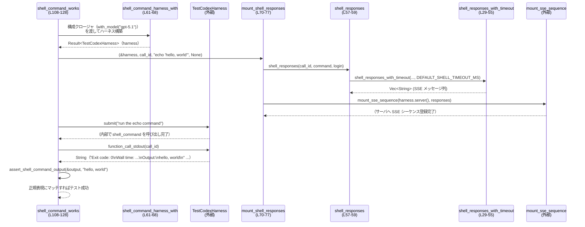

# core\tests\suite\shell_command.rs コード解説

## 0. ざっくり一言

このテストモジュールは、Codex の「shell_command」ツールが実際のシェルコマンドを正しく実行し、標準出力・終了コード・タイムアウト・Unicode などを期待どおりに扱えることを、SSE ベースのモックレスポンスと `TestCodexHarness` を使って検証するものです（`core\tests\suite\shell_command.rs:L29-55`, `L108-312`）。

---

## 1. このモジュールの役割

### 1.1 概要

- Codex の関数呼び出し機構から `shell_command` ツールを起動したときの挙動を、統合テスト形式で検証します（`shell_command_works` など、`core\tests\suite\shell_command.rs:L108-128`）。
- SSE（Server-Sent Events）で流れてくるイベント列を組み立て、Codex サーバをモックすることで、関数呼び出しとその結果取得までを一連のフローとしてテストします（`shell_responses_with_timeout` と `mount_sse_sequence` の組合せ、`L29-55`, `L79-91`）。
- タイムアウト（`timeout_ms`）、`login` フラグ、パイプ付きコマンド、Unicode／改行を含む出力など、シェル実行の代表的なパターンをカバーします（`L131-160`, `L162-182`, `L224-257`, `L259-312`）。

### 1.2 アーキテクチャ内での位置づけ

このモジュールは「テストサポートライブラリ」を利用するテストコードです。自身ではビジネスロジックや型定義を持たず、`core_test_support` クレートを介して Codex サーバと SSE をモックしています（`core\tests\suite\shell_command.rs:L3-17`, `L61-68`, `L70-91`）。

主な依存関係:

- `core_test_support::test_codex::{test_codex, TestCodexBuilder, TestCodexHarness}`: Codex テスト用ハーネスの構築と操作（`L13-15`, `L61-68`, `L112-124`）。
- `core_test_support::responses::{sse, mount_sse_sequence, ev_*}`: SSE イベント列と HTTP サーバへのマウント（`L5-10`, `L44-54`, `L76-90`）。
- `skip_if_no_network`, `skip_if_windows`: 環境依存のテストスキップマクロ（`L11-12`, `L110`, `L186-187`, `L209-210`）。
- Tokio ランタイムと `test_case` マクロによる非同期・パラメタライズドテスト（`L108`, `L130`, `L259-265`, `L289-292`）。

依存関係を簡略化した図です。

```mermaid
flowchart LR
    subgraph Tests [このファイルのテスト群]
        T1[shell_command_works<br/>(L108-128)]
        T2[shell_command_times_out_with_timeout_ms<br/>(L224-257)]
        T3[unicode_output(_)<br/>(L265-287)]
    end

    HR[shell_command_harness_with<br/>(L61-68)]
    MSR[mount_shell_responses(_)<br/>(L70-77)]
    MSRT[mount_shell_responses_with_timeout(_)<br/>(L79-91)]
    SRW[shell_responses_with_timeout<br/>(L29-55)]
    SSE[mount_sse_sequence (core_test_support::responses)<br/>(外部)]
    HN[TestCodexHarness (core_test_support)<br/>(外部)]

    T1 --> HR
    T2 --> HR
    T3 --> HR

    HR --> HN

    T1 --> MSR
    T2 --> MSRT
    T3 --> MSRT

    MSR --> SRW
    MSRT --> SRW
    SRW --> SSE
    HN --> SSE
```

### 1.3 設計上のポイント

- **SSE でのモックレスポンス生成**  
  `shell_responses_with_timeout` が、`ev_response_created`・`ev_function_call`・`ev_assistant_message` などのイベントから SSE 文字列のベクタを組み立て、`mount_sse_sequence` に渡す構造になっています（`core\tests\suite\shell_command.rs:L29-55`, `L86-90`）。

- **ハーネス構築の一元化**  
  `shell_command_harness_with` が `test_codex()` と `with_config` をまとめて呼び出し、`TestCodexHarness` を生成することで、各テストからの初期化コードを共通化しています（`L61-68`）。

- **OS・環境依存の吸収**  
  - デフォルト／中程度のタイムアウト値を `#[cfg(windows)]` と `#[cfg(not(windows))]` で分岐した定数として定義し（`L19-27`）、テストごとに使い分けています。
  - コマンド文字列も `cfg!(windows)` で分岐し、Windows では `cmd.exe /c`、非 Windows では `sleep` や `echo` を利用しています（`L230-233`, `L271-278`）。

- **非同期・並行性**  
  すべてのテストは `#[tokio::test(flavor = "multi_thread", worker_threads = 2)]` を付けており、Tokio のマルチスレッドランタイム上で非同期に実行されます（`L108`, `L130`, `L162`, `L184`, `L207`, `L224`, `L262`, `L289`）。ただし各テストは独立した関数であり、共有ミュータブル状態は登場しません。

- **出力フォーマットの正規表現検証**  
  `assert_shell_command_output` が、改行コードの正規化と正規表現によるマッチングで「Exit code」「Wall time」「Output」セクションをまとめて検証するため、OS 間の改行差異や経過時間の揺らぎを吸収しています（`L93-105`）。

---

## 2. 主要な機能一覧（コンポーネントインベントリー）

### 2.1 定数・関数・テスト関数一覧

| 名前 | 種別 | 役割 / 用途 | 定義位置 |
|------|------|-------------|----------|
| `DEFAULT_SHELL_TIMEOUT_MS` | 定数 | シェルコマンドのデフォルトタイムアウト（Windows: 7000ms, 非 Windows: 2000ms） | `core\tests\suite\shell_command.rs:L19-22` |
| `MEDIUM_TIMEOUT` | 定数 | Unicode テスト用の中程度の待ち時間（Windows: 10s, 非 Windows: 5s） | `core\tests\suite\shell_command.rs:L24-27` |
| `shell_responses_with_timeout` | 関数 | `shell_command` 関数呼び出し用の SSE イベント列を、タイムアウト指定付きで生成する | `core\tests\suite\shell_command.rs:L29-55` |
| `shell_responses` | 関数 | デフォルトタイムアウトで `shell_responses_with_timeout` を呼び出す薄いラッパー | `core\tests\suite\shell_command.rs:L57-59` |
| `shell_command_harness_with` | async 関数 | `TestCodexBuilder` を設定し、`TestCodexHarness` を非同期に構築する | `core\tests\suite\shell_command.rs:L61-68` |
| `mount_shell_responses` | async 関数 | ハーネスのサーバに、デフォルトタイムアウトの SSE シーケンスをマウントする | `core\tests\suite\shell_command.rs:L70-77` |
| `mount_shell_responses_with_timeout` | async 関数 | ハーネスのサーバに、任意タイムアウト値入りの SSE シーケンスをマウントする | `core\tests\suite\shell_command.rs:L79-91` |
| `assert_shell_command_output` | 関数 | 改行を正規化しつつ、出力が期待フォーマットと一致することを正規表現で検証する | `core\tests\suite\shell_command.rs:L93-106` |
| `shell_command_works` | async テスト | シンプルな `echo` コマンドが `login` 未指定で正しく動作することを検証 | `core\tests\suite\shell_command.rs:L108-128` |
| `output_with_login` | async テスト | `login: true` のときも `echo` 出力が正しく取得できることを検証 | `core\tests\suite\shell_command.rs:L130-144` |
| `output_without_login` | async テスト | `login: false` のときの挙動を検証 | `core\tests\suite\shell_command.rs:L146-160` |
| `multi_line_output_with_login` | async テスト | 複数行の標準出力を `login: true` で検証 | `core\tests\suite\shell_command.rs:L162-182` |
| `pipe_output_with_login` | async テスト | パイプを含むコマンドを `login: None` で検証（非 Windows のみ） | `core\tests\suite\shell_command.rs:L184-205` |
| `pipe_output_without_login` | async テスト | パイプ付きコマンドを `login: false` で検証（非 Windows のみ） | `core\tests\suite\shell_command.rs:L207-222` |
| `shell_command_times_out_with_timeout_ms` | async テスト | 非常に短いタイムアウトで長時間コマンドを実行し、タイムアウトエラーと exit code 124 を検証 | `core\tests\suite\shell_command.rs:L224-257` |
| `unicode_output` | async テスト | Unicode（`naïve_café`）の出力が OS ごとに正しく扱われるかを検証 | `core\tests\suite\shell_command.rs:L259-287` |
| `unicode_output_with_newlines` | async テスト | 改行を含む Unicode 出力が期待どおりに表現されるかを検証 | `core\tests\suite\shell_command.rs:L289-312` |

### 2.2 主要な機能（要約）

- SSE イベント列の生成: `shell_responses_with_timeout`, `shell_responses`  
- Codex ハーネスの構築: `shell_command_harness_with`  
- SSE シーケンスのマウント: `mount_shell_responses`, `mount_shell_responses_with_timeout`  
- 出力フォーマット検証: `assert_shell_command_output`  
- テストシナリオ:
  - 基本的な echo コマンド（`shell_command_works`）
  - `login` オプションの有無（`output_with_login`, `output_without_login`）
  - 複数行出力（`multi_line_output_with_login`）
  - パイプ付きコマンド（`pipe_output_with_login`, `pipe_output_without_login`）
  - タイムアウト挙動（`shell_command_times_out_with_timeout_ms`）
  - Unicode と改行の扱い（`unicode_output`, `unicode_output_with_newlines`）

---

## 3. 公開 API と詳細解説

このファイルはテスト用モジュールであり、外部クレートに向けた公開 API は定義していません。ただし、他のテストから再利用しやすいユーティリティ関数がいくつか存在します。

### 3.1 型一覧（構造体・列挙体など）

このファイル内に独自の構造体や列挙体の定義はありません。外部から利用している主な型は次のとおりです。

| 名前 | 種別 | 役割 / 用途 | 定義位置 |
|------|------|-------------|----------|
| `TestCodexBuilder` | 構造体（推定） | Codex 用テストハーネスのビルダ。モデル名や設定を組み立てるために使用されます（`with_model`, `with_config` を呼び出し）。 | `core_test_support::test_codex`（このチャンクには定義が現れません） |
| `TestCodexHarness` | 構造体（推定） | テスト対象の Codex サーバ・ツールを統合的に扱うハーネス。`server()`, `submit`, `function_call_stdout` などのメソッドが使われています。 | `core_test_support::test_codex`（このチャンクには定義が現れません） |

これらの内部実装やスレッド安全性は、このチャンクからは分かりません。

### 3.2 関数詳細（7 件）

#### `shell_responses_with_timeout(call_id: &str, command: &str, login: Option<bool>, timeout_ms: i64) -> Vec<String>`  

（`core\tests\suite\shell_command.rs:L29-55`）

**概要**

- Codex が `shell_command` ツールを呼び出す際に流れる SSE イベント列を、JSON 形式の引数とともに構築します。
- 生成された `Vec<String>` は `mount_sse_sequence` に渡され、HTTP サーバで再生されます（`L86-90`）。

**引数**

| 引数名 | 型 | 説明 |
|--------|----|------|
| `call_id` | `&str` | 関数呼び出しを一意に識別する ID。`ev_function_call` に渡されます（`L47`）。 |
| `command` | `&str` | 実行させたいシェルコマンド。JSON の `"command"` フィールドとしてシリアライズされます（`L36`）。 |
| `login` | `Option<bool>` | ログインシェルを使うかどうかの指定。`Some(true)`/`Some(false)`/`None` を取りうる値として JSON の `"login"` に含められます（`L38`）。 |
| `timeout_ms` | `i64` | ミリ秒単位のタイムアウト。JSON の `"timeout_ms"` フィールドとして渡されます（`L37`）。 |

**戻り値**

- `Vec<String>`: SSE メッセージ文字列のリストです。各要素は `sse(vec![...])` で組み立てられた 1 つの SSE イベント群です（`L44-54`）。

**内部処理の流れ**

1. `command`, `timeout_ms`, `login` を持つ JSON オブジェクトを `serde_json::json!` で構築します（`L35-39`）。
2. その JSON を `serde_json::to_string` で文字列化し、`arguments` として保持します。ここでは `expect` を使って変換失敗時にパニックする設計になっています（`L41-42`）。
3. 2 つの SSE メッセージを作成した `Vec<String>` を返します（`L44-54`）。
   - 1 つ目: `ev_response_created("resp-1")` → `ev_function_call(call_id, "shell_command", &arguments)` → `ev_completed("resp-1")` を含みます（`L45-48`）。
   - 2 つ目: `ev_assistant_message("msg-1", "done")` → `ev_completed("resp-2")` を含みます（`L50-53`）。

**Examples（使用例）**

この関数は `mount_shell_responses_with_timeout` から使われています。

```rust
// 短いタイムアウト（200ms）で sleep コマンドを実行させるテスト
let call_id = "shell-command-timeout";                                // コール ID を決める
let command = if cfg!(windows) { "timeout /t 5" } else { "sleep 5" }; // OS に応じた長時間コマンド

mount_sse_sequence(
    harness.server(),                                                 // TestCodexHarness のサーバ
    shell_responses_with_timeout(call_id, command, None, 200),        // タイムアウト付きレスポンス列
).await;
```

（実際には `Duration::from_millis(200)` を使って `i64` に変換するラッパー `mount_shell_responses_with_timeout` 経由で呼ばれています。`core\tests\suite\shell_command.rs:L235-241`）

**Errors / Panics**

- `serde_json::to_string(&args)` が失敗した場合、`expect("serialize shell command arguments")` によりパニックします（`L41-42`）。
  - 通常の JSON シリアライズエラーはほぼ起こらない構成ですが、少なくともテストコードとしては recover しない前提です。
- `ev_*` や `sse` の内部でのエラーは、このチャンクからは分かりません。

**Edge cases（エッジケース）**

- `login` が `None` の場合も JSON に `"login": null` として含まれます（`L38`）。`shell_command` ツールが `null` をどのように解釈するかはこのファイルからは不明です。
- `timeout_ms` に 0 や負の値を渡した場合の扱いは、このファイルからは分かりません。テストでは 200 など正の値のみを使用しています（`L240`）。

**使用上の注意点**

- `arguments` のシリアライズ失敗がテスト全体のパニックにつながるため、`args` にシリアライズ不能な値を追加しないことが前提になっています（`L35-42`）。
- 実際のテストでは `call_id` と `function_call_stdout` 側の ID を一致させる必要があります。ID が不一致だとどのような挙動になるかは、このチャンクからは分かりませんが、出力が取得できない可能性があります（`L114-124`）。

---

#### `shell_command_harness_with(configure: impl FnOnce(TestCodexBuilder) -> TestCodexBuilder) -> Result<TestCodexHarness>`  

（`core\tests\suite\shell_command.rs:L61-68`）

**概要**

- `test_codex()` から得られる `TestCodexBuilder` に対し、呼び出し元から渡された `configure` クロージャと `with_config` を適用し、その結果を使って `TestCodexHarness` を非同期に構築します。

**引数**

| 引数名 | 型 | 説明 |
|--------|----|------|
| `configure` | `impl FnOnce(TestCodexBuilder) -> TestCodexBuilder` | モデル名などを設定するためのビルダ拡張クロージャ。各テストから `|builder| builder.with_model("gpt-5.1")`のように渡されています（`L112`,`L134`,`L150` など）。 |

**戻り値**

- `Result<TestCodexHarness>` (`anyhow::Result` のエイリアス): 構築されたハーネスを返します。内部で発生したエラーは `?` を通じてここに集約されます（`L67-68`）。

**内部処理の流れ**

1. `test_codex()` を呼び出してデフォルト設定の `TestCodexBuilder` を取得します（`L64`）。
2. 引数の `configure` クロージャを通じてモデル名などを設定します（`L64`）。
3. その後 `with_config` を呼び出し、`include_apply_patch_tool = true` を設定します（`L64-66`）。
4. 完成したビルダを `TestCodexHarness::with_builder(builder).await` に渡してハーネスを構築し、その `Result` を呼び出し元に返します（`L67-68`）。

**Examples（使用例）**

```rust
// gpt-5.1 モデルを使うハーネスを構築
let harness = shell_command_harness_with(|builder| builder.with_model("gpt-5.1")).await?;

// gpt-5.2 モデルを使うハーネスを構築
let harness = shell_command_harness_with(|builder| builder.with_model("gpt-5.2")).await?;
```

（それぞれ `shell_command_works` と `unicode_output` で実際に使われています。`core\tests\suite\shell_command.rs:L112-113`, `L268-269`）

**Errors / Panics**

- `TestCodexHarness::with_builder` が返すエラーが `Result` としてそのまま伝播します（`L67-68`）。具体的なエラー内容はこのチャンクからは分かりません。
- パニックを起こすコードは含まれていません（`unsafe` も不使用）。

**Edge cases**

- `configure` クロージャが `TestCodexBuilder` を適切に返さない（例えば未設定のまま返すなど）場合の挙動は、`TestCodexBuilder` の実装に依存します。このチャンクからは分かりません。

**使用上の注意点**

- すべてのテストで `include_apply_patch_tool = true` が強制されます（`L65`）。このため、他のツール構成をテストしたい場合は別のハーネス関数を用意する必要がある可能性があります。

---

#### `mount_shell_responses_with_timeout(harness: &TestCodexHarness, call_id: &str, command: &str, login: Option<bool>, timeout: Duration)`  

（`core\tests\suite\shell_command.rs:L79-91`）

**概要**

- `shell_responses_with_timeout` を使って SSE レスポンス列を生成し、それを `mount_sse_sequence` に渡して、`TestCodexHarness` が持つサーバにマウントします。

**引数**

| 引数名 | 型 | 説明 |
|--------|----|------|
| `harness` | `&TestCodexHarness` | Codex テストサーバを保持するハーネス。`server()` メソッド経由でサーバインスタンスが取得されます（`L86-87`）。 |
| `call_id` | `&str` | 関数呼び出し ID（`shell_responses_with_timeout` にそのまま渡されます）。 |
| `command` | `&str` | 実行させたいシェルコマンド。 |
| `login` | `Option<bool>` | ログインシェル利用の有無。 |
| `timeout` | `Duration` | タイムアウト時間。`as_millis()` で `i64` に変換されます（`L88`）。 |

**戻り値**

- 戻り値は `()` です。非同期関数として `await` されるだけで、特定の結果値は返しません（`L79-91`）。

**内部処理の流れ**

1. `timeout.as_millis()` で `Duration` をミリ秒に変換し、`i64` にキャストします（`L88`）。
2. `shell_responses_with_timeout(call_id, command, login, timeout_ms)` を呼び出して SSE 文字列のベクタを生成します（`L88`）。
3. `mount_sse_sequence(harness.server(), responses)` を `await` して、SSE シーケンスをサーバにマウントします（`L86-90`）。

**Examples（使用例）**

```rust
// Unicode 出力テストで中程度のタイムアウトを設定
mount_shell_responses_with_timeout(
    &harness,          // TestCodexHarness 参照
    call_id,
    command,
    Some(login),
    MEDIUM_TIMEOUT,    // OS に応じた 5 or 10 秒
).await;
```

（`unicode_output` と `unicode_output_with_newlines` で使用。`core\tests\suite\shell_command.rs:L279-280`, `L297-304`）

**Errors / Panics**

- `mount_sse_sequence` が返すエラーがどのように扱われるかは、このチャンクからは分かりません。関数シグネチャ上は `mount_shell_responses_with_timeout` 自体は `Result` を返していないため、`mount_sse_sequence` は `Result` ではなく `Future<Output=()>` を返している可能性があります（推測）。
- `as_millis()` → `as i64` の変換は、極端に大きな Duration でオーバーフローし得ますが、ここでは `MEDIUM_TIMEOUT` や 200ms のような小さな値のみが使われています（`L240`, `L297-304`）。

**Edge cases**

- 非常に大きな `Duration` を渡した場合の `as_millis()` → `i64` キャストの挙動は未検証です。
- `login` が `None` の場合は、そのまま `shell_responses_with_timeout` に渡されます。

**使用上の注意点**

- `call_id` は `function_call_stdout` 側で使用する ID と一致させる必要があります（`L247-248` と `L247-248` 以降）。
- `timeout` の意味（プロセス実行全体のタイムアウトか、ストリームのタイムアウトか）は `shell_command` ツール側の実装に依存し、このチャンクからは分かりません。

---

#### `assert_shell_command_output(output: &str, expected: &str) -> Result<()>`  

（`core\tests\suite\shell_command.rs:L93-106`）

**概要**

- シェルコマンド実行結果の全体文字列から、OS や環境による改行差異を吸収したうえで、終了コード 0・Wall time 行・Output 行とその内容を正規表現で検証します。

**引数**

| 引数名 | 型 | 説明 |
|--------|----|------|
| `output` | `&str` | `TestCodexHarness::function_call_stdout` から得られる生の出力文字列（`L124`, `L140` など）。 |
| `expected` | `&str` | Output セクション内に出力されるべき期待値。テストごとに `"hello, world"` や `"naïve_café"` などのリテラルが渡されます（`L125`, `L141`, `L284`）。 |

**戻り値**

- `Result<()>`（`anyhow::Result<()>`）。内部でエラーを発生させていないため、正常終了時は常に `Ok(())` を返します（`L105-106`）。

**内部処理の流れ**

1. `output` の改行コードを正規化します（`L94-98`）。
   - `\r\n` を `\n` に置換（`L95`）。
   - 単独の `\r` も `\n` に置換（`L96`）。
   - 末尾の連続する `\n` を `trim_end_matches` で削除（`L97`）。
2. `expected` を埋め込んだ正規表現文字列 `expected_pattern` を構築します（`L100-102`）。
   - 形式: `^Exit code: 0\nWall time: <数値>[.数値]? seconds\nOutput:\n{expected}\n?$`
3. `assert_regex_match(&expected_pattern, &normalized_output);` を呼び出してマッチを検証します（`L104`）。
4. 成功時に `Ok(())` を返します（`L105-106`）。

**Examples（使用例）**

```rust
let output = harness.function_call_stdout(call_id).await;              // コマンド実行の出力を取得
assert_shell_command_output(&output, "hello, world")?;                // Exit code 0 と "hello, world" を検証
```

（`shell_command_works` など、ほぼすべての正常系テストで使用されています。`core\tests\suite\shell_command.rs:L124-125`, `L140-141`）

**Errors / Panics**

- この関数自身は `Ok(())` しか返しておらず、`Err` を返すコードは存在しません（`L105-106`）。
- アサーション失敗時に何が起こるかは `assert_regex_match` の実装次第です。このチャンクからは不明ですが、名前と使い方から、マッチしない場合にテスト失敗（パニック）させるアサーションである可能性があります（推測）。

**Edge cases**

- `expected` に正規表現のメタ文字が含まれる場合、`format!` でそのまま埋め込まれているため、パターンとして解釈されます（`L100-102`）。この関数は `expected` をリテラルではなくパターンの一部として扱います。
- 出力に余計な行が含まれている場合や、`Exit code` 行や `Wall time` 行がない場合、マッチに失敗します。

**使用上の注意点**

- `expected` に正規表現特殊文字を含めると、リテラル一致ではなくパターン一致になる点に注意が必要です。
- 改行は `\n` に正規化されるため、Windows/Unix 間の違いを気にせずテストできます（`L94-98`）。

---

#### `shell_command_works() -> anyhow::Result<()>`（Tokio テスト）  

（`core\tests\suite\shell_command.rs:L108-128`）

**概要**

- もっとも基本的なシナリオとして、`echo 'hello, world'` を実行させ、`Exit code: 0` と `Output: hello, world` が得られることを検証する統合テストです。

**引数**

- テスト関数であり、引数はありません。

**戻り値**

- `anyhow::Result<()>`: 各種非同期処理やハーネス構築で発生し得るエラーをまとめて返します（`L108`）。

**内部処理の流れ**

1. ネットワークが使えない環境ではテストをスキップします（`skip_if_no_network!(Ok(()));` `L110`）。
2. `shell_command_harness_with` を使って `gpt-5.1` モデルのハーネスを構築します（`L112-113`）。
3. `call_id = "shell-command-call"` を決め、`mount_shell_responses` で SSE シーケンスをサーバにマウントします（`L114-121`）。
   - コマンドは `"echo 'hello, world'"` です（`L118`）。
4. `harness.submit("run the echo command").await?;` で、自然言語プロンプト経由でコマンド実行をトリガします（`L122`）。
5. `harness.function_call_stdout(call_id).await` で `shell_command` 呼び出しの標準出力を取得します（`L124`）。
6. `assert_shell_command_output(&output, "hello, world")?;` で出力フォーマットと内容を検証します（`L125`）。
7. 成功した場合 `Ok(())` を返します（`L127`）。

**Examples（使用例）**

このテスト自体が使用例です。類似シナリオを追加する場合も同様のフローを踏みます。

```rust
#[tokio::test(flavor = "multi_thread", worker_threads = 2)]
async fn my_new_shell_test() -> anyhow::Result<()> {
    skip_if_no_network!(Ok(()));                                        // ネットワーク前提

    let harness = shell_command_harness_with(|b| b.with_model("gpt-5.1")).await?;
    let call_id = "my-shell-call";

    mount_shell_responses(&harness, call_id, "echo 'test'", None).await;
    harness.submit("run the test command").await?;

    let output = harness.function_call_stdout(call_id).await;
    assert_shell_command_output(&output, "test")?;

    Ok(())
}
```

**Errors / Panics**

- `shell_command_harness_with(...).await?` により、ハーネス構築のエラーがあれば `Err` として返されます（`L112-113`）。
- `submit` や `function_call_stdout` の内部でのエラーも `?` によって結果に伝播します（`L122`, `L124`）。
- `assert_shell_command_output` 内のアサーション失敗はテストを失敗させるはずですが、その詳細は `assert_regex_match` 次第です（`L104`）。

**Edge cases**

- `skip_if_no_network!` によりネットワークが利用できない環境ではテストがスキップされるため、その場合このフローは実行されません（`L110`）。
- SSE シーケンスと `call_id` が一致していない場合や、`shell_command` ツールが異なるフォーマットの出力を返す場合、`assert_shell_command_output` が失敗します。

**使用上の注意点**

- `call_id` は他のテストと衝突しないように一意の文字列が使われています（`L114`）。
- このテストは `gpt-5.1` モデル前提で構築されており、他モデルに切り替える場合はハーネス構築部を変更する必要があります。

---

#### `shell_command_times_out_with_timeout_ms() -> anyhow::Result<()>`（Tokio テスト）  

（`core\tests\suite\shell_command.rs:L224-257`）

**概要**

- `timeout_ms` パラメータが実際のコマンド実行のタイムアウトとして機能し、コマンドが指定時間内に完了しない場合に exit code 124 と適切なメッセージを返すことを検証するテストです。

**内部処理の流れ**

1. ネットワークチェックとハーネス構築（`gpt-5.1`）は基本テストと同様です（`L226-228`）。
2. OS ごとにタイムアウトを意図的に超える長時間コマンドを選択します（`L230-233`）。
   - Windows: `"timeout /t 5"`
   - 非 Windows: `"sleep 5"`
3. `mount_shell_responses_with_timeout` を使い、`Duration::from_millis(200)` を `timeout` として渡します（`L235-241`）。
4. `harness.submit("run a long command with a short timeout").await?;` で実行をトリガします（`L243-245`）。
5. `function_call_stdout(call_id).await` で出力を取得し、`Exit code: 124` と `command timed out after <ms> milliseconds` を含むことを正規表現で確認します（`L247-254`）。

**検証しているフォーマット**

- 正規表現:  
  `^Exit code: 124\nWall time: <数値>[.数値]? seconds\nOutput:\ncommand timed out after <数値> milliseconds\n?$`（`L253`）。

**Errors / Panics / Edge cases**

- 正常系テストと同様に、ハーネス・submit・function_call_stdout のエラーは `?` で伝播します（`L228`, `L244-245`）。
- ここでは Windows/非 Windows ともに `sleep 5` 相当のコマンドに対し 200ms のタイムアウトを設定しており、ほぼ確実にタイムアウトが発生する前提になっています（`L230-233`, `L240`）。
- `exit code` が 124 以外だった場合やメッセージ文言が変わった場合、正規表現がマッチせずテストが失敗します。

**使用上の注意点**

- タイムアウトメッセージの文字列や exit code に依存したテストであるため、将来ツールのメッセージ仕様を変える場合はこのテストの修正も必要です。

---

#### `unicode_output(login: bool) -> anyhow::Result<()>`（Tokio + test_case テスト）  

（`core\tests\suite\shell_command.rs:L262-287`）

**概要**

- PowerShell を含むシェル環境で、UTF-8 BOM を含む Unicode 出力を正しく扱えるかを検証するテストです（コメント `L259-261`）。
- `test_case` マクロにより、`login: true`・`login: false` の 2 パターンを同じテスト関数で検証しています（`L263-264`）。

**内部処理の流れ**

1. ネットワークチェックと `gpt-5.2` モデルのハーネス構築を行います（`L266-269`）。
2. OS に応じて Unicode を出力するコマンドを選択します（`L271-278`）。
   - Windows: `cmd.exe /c echo naïve_café`
   - 非 Windows: `echo "naïve_café"`
3. `mount_shell_responses_with_timeout` でコマンド・`call_id`・`login`・`MEDIUM_TIMEOUT` をサーバにマウントします（`L279-280`）。
4. `submit` → `function_call_stdout` の順で実行と結果取得を行います（`L281-283`）。
5. `assert_shell_command_output(&output, "naïve_café")?` で Unicode が期待通りに出力されていることを検証します（`L284`）。

**Edge cases**

- `login` が true/false の両方に対して同じコマンド・同じ期待値で検証しているため、ログインシェル有無による文字化けの有無をチェックしていると解釈できますが、内部シェルの設定などの詳細はこのチャンクからは分かりません。
- OS ごとに異なるコマンドを実行しているため、PowerShell 固有の挙動（コメント中で触れられている）を検証するのは Windows のみです（`L259-261`, `L271-276`）。

**使用上の注意点**

- モデルとして `gpt-5.2` を使用しています（`L268-269`）。他のテストとはモデルが違う点に注意が必要です。
- コマンド文字列内の Unicode リテラルはソースコードのエンコーディングに依存しますが、Rust ソースとしては UTF-8 前提です。

---

#### `unicode_output_with_newlines(login: bool) -> anyhow::Result<()>`（Tokio + test_case テスト）  

（`core\tests\suite\shell_command.rs:L289-312`）

**概要**

- Unicode と複数行を含むシェル出力が、`shell_command` ツールの出力ではエスケープされた `\n` として表現されるケースを検証するテストです。

**内部処理の流れ**

1. ネットワークチェックと `gpt-5.2` モデルでのハーネス構築（`L293-295`）。
2. コマンド `"echo 'line1\nnaïve café\nline3'"` を使用し、シェルからは実際の改行を含む出力を得る構成になっています（`L301-302`）。
3. `mount_shell_responses_with_timeout` で上記コマンドと `MEDIUM_TIMEOUT` を登録します（`L297-304`）。
4. `submit`・`function_call_stdout` を呼び出し、出力を取得します（`L306-308`）。
5. `assert_shell_command_output(&output, "line1\\nnaïve café\\nline3")?` で期待値を検証します（`L309`）。
   - ここで `expected` にはリテラルの `\n`（バックスラッシュ + n）が含まれている点が特徴的です。

**Edge cases**

- 実際のシェル出力が `line1\nnaïve café\nline3`（1 行）なのか、3 行出力でそれがツールのフォーマット時にエスケープされるのかは、このチャンクだけでは判定できません。ただしテストは「最終的なフォーマットされた文字列が `\n` を含む 1 行のテキスト」として扱われていることを前提としています（`L309`）。
- `login` が true/false の両パターンで同じ期待値を検証しています。

**使用上の注意点**

- `expected` に `\\n` を含めているため、`assert_shell_command_output` の正規表現上では `\n` リテラルとして扱われます（`L100-102`, `L309`）。
- 改行の扱いを変更する場合は、このテストと正規表現両方の更新が必要になります。

---

### 3.3 その他の関数

詳細解説を省いた補助関数・テスト関数の一覧です。

| 関数名 | 役割（1 行） | 定義位置 |
|--------|--------------|----------|
| `shell_responses` | デフォルトタイムアウト値 `DEFAULT_SHELL_TIMEOUT_MS` を使って `shell_responses_with_timeout` を呼び出すラッパー関数 | `core\tests\suite\shell_command.rs:L57-59` |
| `mount_shell_responses` | デフォルトタイムアウトの SSE シーケンスをサーバにマウントするラッパー関数 | `core\tests\suite\shell_command.rs:L70-77` |
| `output_with_login` | `login: Some(true)` で echo コマンドを検証するテスト | `core\tests\suite\shell_command.rs:L130-144` |
| `output_without_login` | `login: Some(false)` で echo コマンドを検証するテスト | `core\tests\suite\shell_command.rs:L146-160` |
| `multi_line_output_with_login` | 複数行の echo 出力を `login: Some(true)` で検証するテスト | `core\tests\suite\shell_command.rs:L162-182` |
| `pipe_output_with_login` | パイプ付き echo コマンド（`login: None`）の挙動を非 Windows 環境で検証するテスト | `core\tests\suite\shell_command.rs:L184-205` |
| `pipe_output_without_login` | パイプ付き echo コマンド（`login: Some(false)`）を非 Windows 環境で検証するテスト | `core\tests\suite\shell_command.rs:L207-222` |

---

## 4. データフロー

ここでは代表的なテスト `shell_command_works` を例に、データと呼び出しの流れを示します（`core\tests\suite\shell_command.rs:L108-128`）。

### 4.1 処理の要点

- テストコードはまず Codex 用のハーネスを構築し（`shell_command_harness_with`）、そのハーネスに対して SSE ベースのモックレスポンスをマウントします（`mount_shell_responses`）。
- その後、自然言語による `submit` を実行することで、Codex 側が `shell_command` 関数を呼び出すシナリオをトリガし、SSE シーケンスに従って関数呼び出しと応答が進行します。
- 最後に `function_call_stdout` でシェルの標準出力が取得され、その内容が `assert_shell_command_output` によって検証されます。

### 4.2 シーケンス図



この図から分かるように、テストコード自身はシェルの実行を直接行わず、ハーネスと SSE レスポンスを通じて Codex のツール呼び出しパイプライン全体を検証しています。

---

## 5. 使い方（How to Use）

このファイルはテスト用ですが、同様のテストを追加する際の基本的な使い方を整理します。

### 5.1 基本的な使用方法

新しいシェルコマンドシナリオを追加する流れは、おおむね次の 3 ステップです。

1. ハーネスの構築（`shell_command_harness_with`）
2. SSE レスポンスのマウント（`mount_shell_responses` または `mount_shell_responses_with_timeout`）
3. 実行・結果取得・アサート（`submit` → `function_call_stdout` → `assert_shell_command_output`）

```rust
#[tokio::test(flavor = "multi_thread", worker_threads = 2)]
async fn example_shell_scenario() -> anyhow::Result<()> {
    skip_if_no_network!(Ok(()));                           // ネットワーク前提のテスト

    // 1. ハーネスを用意する
    let harness = shell_command_harness_with(|b| b.with_model("gpt-5.1")).await?;

    // 2. 実行したいコマンドを持つ SSE レスポンスをマウントする
    let call_id = "example-shell-call";                    // function_call_stdout と揃える ID
    mount_shell_responses(
        &harness,
        call_id,
        "echo 'example output'",
        None,                                              // login フラグ
    ).await;

    // 3. プロンプトを送信し、標準出力を検証する
    harness.submit("run the example command").await?;      // 適当な自然言語プロンプト
    let output = harness.function_call_stdout(call_id).await;
    assert_shell_command_output(&output, "example output")?;

    Ok(())
}
```

### 5.2 よくある使用パターン

- **`login` フラグの違い**（`core\tests\suite\shell_command.rs:L131-160`, `L262-287`, `L289-312`）  
  - `Some(true)` / `Some(false)` / `None` の 3 パターンをテストしており、同じコマンドに対してシェルのログイン状態が出力に影響しないかを確認しています。
  - `test_case` マクロを使って `login` を引数にするパターン（`unicode_output` 系）と、テスト関数を分けるパターン（`output_with_login` / `output_without_login`）の 2 通りがあります。

- **タイムアウトのテスト**（`L224-257`）  
  長時間コマンド + 短い `timeout_ms` という組み合わせを SSE 経由で設定し、`Exit code: 124` とタイムアウトメッセージを検証しています。

- **Unicode／複数行／パイプ**（`L162-182`, `L184-222`, `L259-312`）  
  - 複数行: `"first line\nsecond line"` などをシェルに渡し、最終的な Output の扱いを確認しています。
  - パイプ: `"echo 'hello, world' | cat"` を通してパイプライン内での改行／出力が保持されるかをチェックしています（非 Windows のみ、`skip_if_windows` により制御、`L186-187`, `L209-210`）。
  - Unicode: `"naïve_café"` と `"line1\nnaïve café\nline3"` の 2 パターンがあります。

### 5.3 よくある間違い（推測）

コードから推測される典型的な誤用例と、その修正版を対比します。

```rust
// 誤り例: call_id が一致していないケース（推測）
let call_id = "shell-call-1";
mount_shell_responses(&harness, call_id, "echo 'hi'", None).await;
// ...
let output = harness.function_call_stdout("different-id").await; // 別の ID を使ってしまう

// 正しい例: mount 時と stdout 取得時で同じ call_id を使う
let call_id = "shell-call-1";
mount_shell_responses(&harness, call_id, "echo 'hi'", None).await;
// ...
let output = harness.function_call_stdout(call_id).await;
```

```rust
// 誤り例: 環境依存テストで skip マクロを使わない（推測）
// #[tokio::test]
// async fn pipe_on_windows_may_fail() -> anyhow::Result<()> {
//     let harness = shell_command_harness_with(|b| b.with_model("gpt-5.1")).await?;
//     // Windows では 'cat' が存在しない可能性がある
// }

// 正しい例: 非 Windows 限定テストにする
#[tokio::test(flavor = "multi_thread", worker_threads = 2)]
async fn pipe_on_unix_only() -> anyhow::Result<()> {
    skip_if_no_network!(Ok(()));
    skip_if_windows!(Ok(()));  // Windows 環境ではスキップする
    // ...
    Ok(())
}
```

これらはソース中に直接出てくるわけではありませんが、既存テストが `call_id` を一貫して使っていること（`L114-124`, `L229-248`）や OS チェックを行っていること（`L186-187`）から想定されるものです。

### 5.4 使用上の注意点（まとめ）

- **ネットワーク依存**  
  すべてのテストで `skip_if_no_network!` が最初に呼ばれており、ネットワーク環境が前提です（`L110`, `L132`, `L148`, `L164`, `L186`, `L209`, `L226`, `L266`, `L293`）。新しいテストでも同様の前提であれば、このマクロを利用するのが一貫した形になります。

- **OS 依存のコマンド**  
  `cfg!(windows)` と `skip_if_windows!` を併用しており、コマンドの可用性や動作が OS に依存することを前提にしています（`L230-233`, `L271-278`, `L186-187`, `L209-210`）。

- **出力フォーマット依存**  
  `assert_shell_command_output` とタイムアウトテストの正規表現が、`Exit code:`・`Wall time:`・`Output:` といった行構造やメッセージ文言に強く依存しています（`L100-102`, `L253`）。ツール側のフォーマット変更の影響を受けやすい点に注意が必要です。

---

## 6. 変更の仕方（How to Modify）

### 6.1 新しい機能（テストケース）を追加する場合

1. **テストの目的を決める**  
   例: 「標準エラー出力の扱いを検証したい」「非常に長い出力を検証したい」など。

2. **コマンドと期待出力を設計する**  
   - コマンド文字列を `shell_responses`／`shell_responses_with_timeout` に渡す形で決めます（`L29-39`）。
   - Output セクションでどのような文字列になるかを想定し、`assert_shell_command_output` 用の `expected` を準備します（`L100-102`）。

3. **テスト関数を追加する**  
   - 既存テストと同様、`#[tokio::test(flavor = "multi_thread", worker_threads = 2)]` を付けます（`L108`, `L130` など）。
   - 冒頭で `skip_if_no_network!`（必要なら `skip_if_windows!`）を呼びます。
   - `shell_command_harness_with`、`mount_shell_responses`/`mount_shell_responses_with_timeout`、`submit`、`function_call_stdout`、`assert_shell_command_output` の流れを踏襲します。

4. **行動範囲の確認**  
   - 新しいテストが使う `call_id` が既存のものと衝突していないかを確認します（各テストで文字列が異なっていることが分かります。`L114`, `L136`, `L152`, `L168`, `L191`, `L214`, `L229`, `L270`, `L297`）。

### 6.2 既存の機能を変更する場合

- **出力フォーマットの変更**  
  - ツールの出力が `Exit code: ...` 形式から変わる場合、`assert_shell_command_output` とタイムアウトテスト内の正規表現（`L100-102`, `L253`）を更新する必要があります。
  - 改行正規化ロジック（`L94-98`）も、別のフォーマットに合わせて調整する可能性があります。

- **タイムアウト仕様の変更**  
  - `timeout_ms` の扱い（例えば単位変更）が変わる場合、`shell_responses_with_timeout` の JSON 構造（`L35-39`）とタイムアウトテストの期待メッセージ（`L253`）を合わせて修正する必要があります。

- **Unicode・改行の扱いの変更**  
  - Output セクションでのエスケープの仕方を変えた場合、`unicode_output_with_newlines` の `expected` 文字列（`L309`）にも変更が必要になります。

- **可観測性（Observability）**  
  - 現状、このテストファイルからの「観測」は `function_call_stdout` が返す文字列とアサートのみです（`L124-125`, `L247-254`）。より詳細なデバッグ情報が必要な場合は、テストサポート側（`TestCodexHarness` や `core_test_support::responses`）にログ出力などを追加することになりますが、その実装はこのチャンクには現れていません。

---

## 7. 関連ファイル

このモジュールと密接に関係するのは、主に `core_test_support` クレート内のモジュールです。

| パス / モジュール | 役割 / 関係 |
|-------------------|-------------|
| `core_test_support::test_codex` | `test_codex`, `TestCodexBuilder`, `TestCodexHarness` を提供し、Codex とツールを統合的にテストするためのハーネスを構築します。`shell_command_harness_with` やすべてのテストから利用されています（`core\tests\suite\shell_command.rs:L13-15`, `L61-68`, `L112-124`）。 |
| `core_test_support::responses` | `sse`, `mount_sse_sequence`, `ev_response_created`, `ev_function_call`, `ev_assistant_message`, `ev_completed` などのユーティリティを提供し、SSE ベースのモックレスポンスを構築・マウントする役割を持ちます（`core\tests\suite\shell_command.rs:L5-10`, `L44-54`, `L76-90`）。 |
| `core_test_support::assert_regex_match` | 正規表現を用いたテキスト検証ヘルパ。`assert_shell_command_output` とタイムアウトテストで使用されています（`core\tests\suite\shell_command.rs:L4`, `L104`, `L254`）。 |
| `core_test_support::{skip_if_no_network, skip_if_windows}` | テスト実行環境に応じてテストをスキップするマクロを提供します（`core\tests\suite\shell_command.rs:L11-12`, `L110`, `L186-187`, `L209-210`）。 |

これらの内部実装はこのチャンクには含まれていないため、詳細な挙動やエラー条件についてはここからは分かりません。
