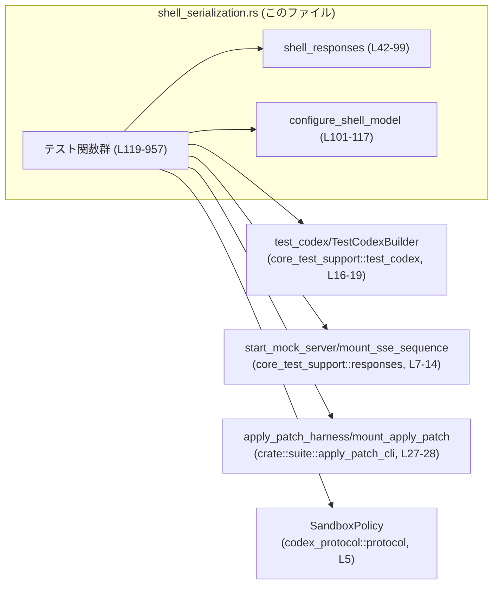
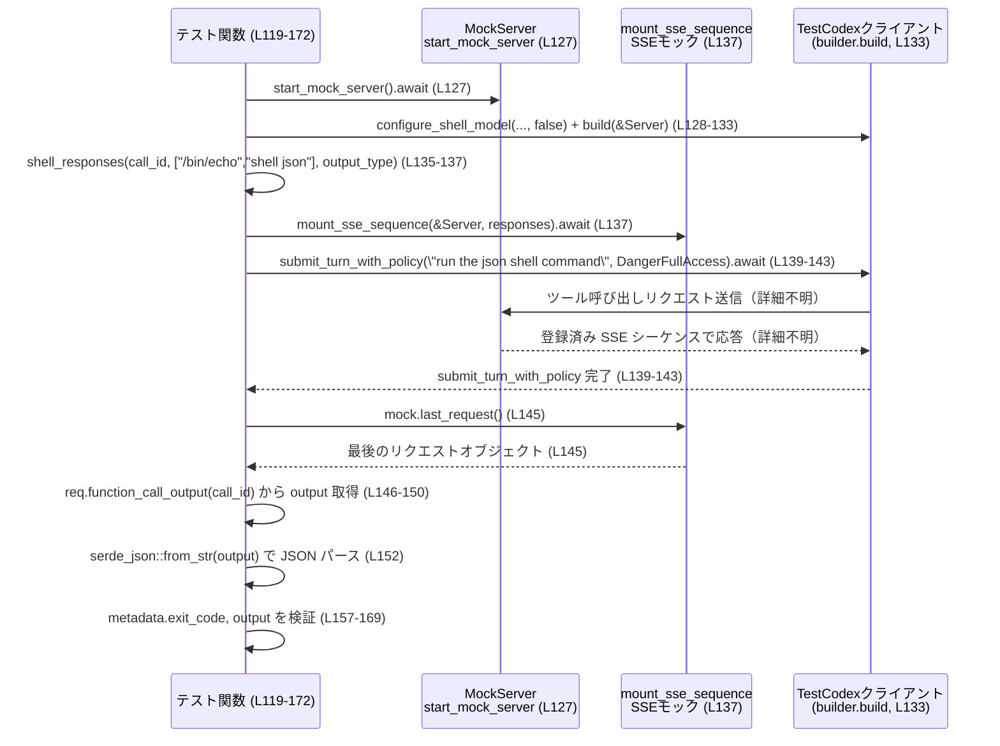

# core/tests/suite/shell_serialization.rs コード解説

## 0. ざっくり一言

このファイルは、Codex の **シェル実行ツール（shell/shell_command/local_shell）** と **apply_patch カスタムツール** の「**出力のシリアライズ形式・整形・トランケーション挙動**」を、エンドツーエンドで検証する非 Windows 用の統合テスト群です（`core/tests/suite/shell_serialization.rs:L1-2,119-957`）。

---

## 1. このモジュールの役割

### 1.1 概要

- シェル実行ツールの出力が、状況に応じて
  - 生の JSON（機械可読）
  - 整形済みテキスト（人間可読なヘッダ付き）
  のどちらで返されるかを検証します（`shell_output_*` 系テスト、`L119-471,711-906,908-957`）。
- `apply_patch` カスタムツールと関係する場合の出力フォーマット・ファイル作成／更新／失敗メッセージを検証します（`apply_patch_*` 系テスト、`L473-709,625-663`）。
- 長大な出力やトークン制限時の **トランケーションのフォーマット** を確認します（`L411-471,806-906`）。

### 1.2 アーキテクチャ内での位置づけ

このテストモジュールは、テスト用の Codex ハーネスとモックサーバを組み合わせて、ツール呼び出し〜出力の取得までの一連の流れを検証しています。

主な依存関係（import から判読）:

- `core_test_support::test_codex::{test_codex, TestCodexBuilder, ShellModelOutput, ApplyPatchModelOutput}`（テスト用 Codex ハーネス・モデル切り替え: `L16-19`）
- `core_test_support::responses::{start_mock_server, mount_sse_sequence, sse, ev_*}`（モック SSE サーバとイベント生成: `L7-14`）
- `crate::suite::apply_patch_cli::{apply_patch_harness, mount_apply_patch}`（apply_patch 向けテストハーネス: `L27-28`）
- `codex_protocol::protocol::SandboxPolicy`（サンドボックス権限設定: `L5`）

これを簡略化して図示すると次のようになります。



※ 中身はこのチャンクからは見えないため、外部コンポーネントの詳細な実装は不明です。

### 1.3 設計上のポイント

コードから読み取れる設計上の特徴です。

- **非 Windows 限定**  
  - `#![cfg(not(target_os = "windows"))]` により、`/bin/sh` や `/usr/bin/sed` 等の Unix 系コマンド前提になっています（`L1`）。
- **共通ヘルパー関数で重複排除**
  - `shell_responses` が SSE イベント列を生成し、各テストで共通利用しています（`L42-99`）。
  - `configure_shell_model` が `TestCodexBuilder` のモデル選択と `include_apply_patch_tool` 設定を一括管理します（`L101-117`）。
- **Tokio のマルチスレッドテスト**  
  - 全テストに `#[tokio::test(flavor = "multi_thread", worker_threads = 2)]` が付与され、非同期コードを 2 スレッドのランタイム上で実行します（例: `L119,174,...`）。
- **ネットワーク依存のためスキップマクロを利用**
  - 各テストの先頭で `skip_if_no_network!(Ok(()));` を呼び、ネットワーク未利用環境ではテストをスキップできるようになっています（例: `L125,181,230,298,...`）。
- **出力フォーマットの仕様を正規表現で明示**
  - `assert_regex_match`（`L6`）と `regex_lite::Regex`（`L21`）を用いて、「Exit code 行」「Wall time 行」「Output セクション」などを厳密にチェックしています（例: `L214-219,343-345,390-393,451-467,507-512,...`）。
- **エラーハンドリングと安全性**
  - テスト関数はすべて `anyhow::Result<()>` を返し、`?` 演算子でエラーを早期伝播します（例: `L124,180,...`）。
  - `serde_json::from_str` を使って JSON パース時に `Result` を受け取り、成功/失敗の両方を意図的に検証しています（`L152,211,265,336,448`）。

---

## 2. 主要な機能一覧

このモジュールが提供するテスト機能を論理的なグループで列挙します。

- シェル出力の JSON 保持検証:  
  `shell_output_stays_json_without_freeform_apply_patch`,  
  `shell_output_preserves_fixture_json_without_serialization`  
  → apply_patch ツール非使用時に、シェル出力が JSON オブジェクトとして保持されることを確認します（`L119-172,224-289`）。

- シェル出力の「整形テキスト」化検証:  
  `shell_output_is_structured_with_freeform_apply_patch`,  
  `shell_output_structures_fixture_with_serialization`,  
  `shell_output_for_freeform_tool_records_duration`,  
  `shell_output_is_structured_for_nonzero_exit`,  
  `shell_command_output_is_freeform`,  
  `local_shell_call_output_is_structured`  
  → apply_patch ツール利用や特定モード時に、ヘッダ付きプレーンテキストに変換されることを確認します（`L174-222,291-352,354-409,711-750,752-804,908-957`）。

- トランケーションと再シリアライズの仕様検証:  
  `shell_output_reserializes_truncated_content`,  
  `shell_command_output_is_not_truncated_under_10k_bytes`,  
  `shell_command_output_is_not_truncated_over_10k_bytes`  
  → トークン制限や 10KB 超の出力時にどのようなフォーマットで切り詰められるかを検証します（`L411-471,806-855,857-906`）。

- apply_patch カスタムツールの出力と副作用検証:  
  `apply_patch_custom_tool_output_is_structured`,  
  `apply_patch_custom_tool_call_creates_file`,  
  `apply_patch_custom_tool_call_updates_existing_file`,  
  `apply_patch_custom_tool_call_reports_failure_output`,  
  `apply_patch_function_call_output_is_structured`  
  → 成功時の整形出力、ファイル作成・更新、失敗時のエラー表示などを確認します（`L473-709,625-663`）。

- テスト補助:
  - `shell_responses`: モデル種別に応じた SSE レスポンス列を生成（`L42-99`）。
  - `configure_shell_model`: `TestCodexBuilder` にモデルと `include_apply_patch_tool` を設定（`L101-117`）。

---

## 3. 公開 API と詳細解説

このファイル自身は「テストモジュール」であり外部向けに公開される API はありませんが、再利用されているヘルパー関数と、仕様を規定している代表的なテスト関数を「API 的な契約」として解説します。

### 3.1 型一覧（構造体・列挙体など）

このファイル内で新たな型定義はありませんが、テストの理解に重要な外部型を整理します。

| 名前 | 種別 | 定義場所（外部） | 役割 / 用途 |
|------|------|------------------|-------------|
| `ShellModelOutput` | 列挙体 | `core_test_support::test_codex`（`L17`） | シェルモデルの出力モードを表す。`Shell`, `ShellCommand`, `LocalShell` などのバリアントを持ち、`shell_responses` やテストの `#[test_case]` で切り替えに使用されます（`L42-48,70,87,119-121,...`）。 |
| `ApplyPatchModelOutput` | 列挙体 | 同上（`L16`） | apply_patch カスタムツールの出力モードを表します。`apply_patch_*` テストのパラメータとして使われます（`L473-477,519-523,...`）。 |
| `TestCodexBuilder` | 構造体 | `core_test_support::test_codex`（`L18`） | テスト用 Codex クライアントのビルダ。`with_model`, `with_config`, `build` などを通して環境を構成します（`L101-112,127-133,184-189,...`）。フィールド構成はこのチャンクには現れません。 |
| `SandboxPolicy` | 列挙体 or 構造体 | `codex_protocol::protocol`（`L5`） | ツール実行時のサンドボックス権限を表す型で、ここでは `DangerFullAccess` が使用されています（`L140-142,196-198,...`）。 |
| `Value` | 構造体 | `serde_json::Value`（`L22`） | 任意の JSON 値を保持する型。シェル出力の JSON の検査に使用します（`L152-168,265-282`）。 |

※ 外部型のフィールド定義や詳細な挙動は、このチャンクには現れません。

---

### 3.2 関数詳細（代表 7 件）

#### 1) `shell_responses(call_id: &str, command: Vec<&str>, output_type: ShellModelOutput) -> Result<Vec<String>>`

**定義位置**: `core/tests/suite/shell_serialization.rs:L42-99`

**概要**

- シェルツールの出力を模した **SSE イベント列（文字列）** を構築するヘルパー関数です。
- `ShellModelOutput` のバリアントに応じて、`shell_command` / `shell` / `local_shell` の各ツール呼び出しイベントを生成します（`L47-48,70,87-97`）。

**引数**

| 引数名 | 型 | 説明 |
|--------|----|------|
| `call_id` | `&str` | テスト内でこのツール呼び出しを識別する ID。SSE 内の `function_call` や `local_shell_call` の `id` として使われます（`L57-59,78,90`）。 |
| `command` | `Vec<&str>` | 実行したいシェルコマンドとその引数を表す配列。バリアントにより文字列へ結合または配列のまま JSON 化されます（`L49-52,71-73,90`）。 |
| `output_type` | `ShellModelOutput` | 出力モード。`ShellCommand` / `Shell` / `LocalShell` に応じてイベントの種類と JSON 形式を変えます（`L47-48,70,87`）。 |

**戻り値**

- `Result<Vec<String>>`  
  - 正常時: SSE イベントを表す JSON 文字列の配列（2 要素）を返します（`L54-68,75-85,87-97`）。
  - エラー時: `anyhow::Error` でラップされたエラーを返します。
    - 発生しうるのは `shlex::try_join` と `serde_json::to_string` の失敗です（`L49,60,78`）。

**内部処理の流れ**

- `match output_type` でバリアントごとに分岐（`L47`）。
- `ShellModelOutput::ShellCommand` の場合（`L48-69`）:
  1. `shlex::try_join` で `command` ベクタをシェルコマンド文字列に結合（`L49`）。
  2. その文字列と `timeout_ms` を持つ JSON オブジェクト `parameters` を構築（`L50-53`）。
  3. SSE 配列 2 つを返す:
     - 1 つ目: `response.created` → `ev_function_call(call_id, "shell_command", ...)` → `completed`（`L55-63`）。
     - 2 つ目: `assistant_message("done")` → `completed`（`L64-67`）。
- `ShellModelOutput::Shell` の場合（`L70-86`）:
  1. `command` ベクタをそのまま JSON 配列として `parameters` に格納（`L71-74`）。
  2. ツール名 `"shell"` で `ev_function_call` を生成（`L78`）。
  3. 汎用のレスポンスシーケンスを構築して返却（`L75-85`）。
- `ShellModelOutput::LocalShell` の場合（`L87-97`）:
  1. `ev_local_shell_call(call_id, "completed", command)` を使用してローカルシェル呼び出しイベントを生成（`L90`）。
  2. 同様に 2 つの SSE を含む配列を返却（`L87-97`）。

**Examples（使用例）**

テスト内での典型的な利用は次の通りです。

```rust
// shell_output_stays_json_without_freeform_apply_patch から抜粋（L135-137）
let call_id = "shell-json";                                        // 呼び出し ID を決める
let responses = shell_responses(
    call_id,
    vec!["/bin/echo", "shell json"],                              // 実行コマンド
    output_type,                                                  // Shell / LocalShell など
)?;
let mock = mount_sse_sequence(&server, responses).await;          // モックサーバに SSE を登録
```

**Errors / Panics**

- `shlex::try_join` がコマンドの結合に失敗した場合、`Err` が返りテストは失敗します（`L49`）。
- `serde_json::to_string(&parameters)` がシリアライズエラーを起こした場合も `Err` になります（`L60,78`）。
- この関数自体は `panic!` を呼びません。

**Edge cases（エッジケース）**

- `command` が空ベクタの場合:
  - `ShellCommand` バリアントでは `shlex::try_join` の挙動が仕様次第ですが、このチャンクには記述がなく、動作は不明です。
- `call_id` が空文字でも、そのまま `ev_function_call` に渡されるだけで、ここではエラーチェックをしていません（`L57-59,78`）。

**使用上の注意点**

- `command` の内容は `'` や `"` を含むと `shlex::try_join` の振る舞いに影響する可能性がありますが、ここでは単純なトークンのみを渡しています（例: `L135-137,372-372`）。
- ローカルシェル (`LocalShell`) 用とリモートシェル (`Shell`, `ShellCommand`) 用とで JSON 形式が異なるため、テスト側の期待値もそれに揃える必要があります。

---

#### 2) `configure_shell_model(builder: TestCodexBuilder, output_type: ShellModelOutput, include_apply_patch_tool: bool) -> TestCodexBuilder`

**定義位置**: `core/tests/suite/shell_serialization.rs:L101-117`

**概要**

- `TestCodexBuilder` に対して、**使用するモデル名** と **apply_patch ツールを含めるかどうか** の設定を行うヘルパーです。
- `ShellModelOutput` と `include_apply_patch_tool` の組み合わせから、5 通りのモデル選択を行います（`L106-112`）。

**引数**

| 引数名 | 型 | 説明 |
|--------|----|------|
| `builder` | `TestCodexBuilder` | ベースとなるビルダインスタンス。`test_codex()` から取得されます（例: `L128-132,184-188`）。 |
| `output_type` | `ShellModelOutput` | 出力モード。モデル選択に影響します（`L106`）。 |
| `include_apply_patch_tool` | `bool` | apply_patch ツールを含めるかどうかのフラグ（`L104,115`）。 |

**戻り値**

- `TestCodexBuilder`  
  - モデル名と `include_apply_patch_tool` が設定済みのビルダが返却されます（`L106-116`）。

**内部処理の流れ**

1. `(output_type, include_apply_patch_tool)` の組み合わせで `match` を行い、適切なモデルを選択（`L106-112`）。
   - `ShellCommand` → `"test-gpt-5-codex"`（`L107`）
   - `LocalShell` かつ `true` → `"gpt-5.1-codex"`（`L108`）
   - `Shell` かつ `true` → `"gpt-5.1-codex"`（`L109`）
   - `LocalShell` かつ `false` → `"codex-mini-latest"`（`L110`）
   - `Shell` かつ `false` → `"gpt-5"`（`L111`）
2. `builder.with_config` で `config.include_apply_patch_tool` を設定（`L114-116`）。
3. 設定済み `TestCodexBuilder` を返します（`L114-117`）。

**Examples（使用例）**

```rust
// shell_output_is_structured_with_freeform_apply_patch から抜粋（L183-188）
let mut builder = configure_shell_model(
    test_codex(),                    // ベースビルダ
    output_type,                     // Shell / ShellCommand / LocalShell
    /*include_apply_patch_tool*/ true,
);
let test = builder.build(&server).await?; // 構成済みクライアントを作成
```

**Errors / Panics**

- この関数自体は `Result` を返さず、`panic!` も使用していません。
- モデル名の誤指定等によるエラーは、後続の `build` 呼び出し側で発生し得ますが、このチャンクからは詳細が分かりません。

**Edge cases**

- `(ShellModelOutput::ShellCommand, include_apply_patch_tool)` の場合、`include_apply_patch_tool` の値はモデル選択に影響しません（`L107`）。  
  → apply_patch ツールの有無は `with_config` 側でのみ制御されます。

**使用上の注意点**

- apply_patch による「整形出力」の挙動を検証するテストでは、必ず `include_apply_patch_tool = true` として呼び出している点が契約になっています（例: `L183-188,300-305,363-368`）。

---

#### 3) `async fn shell_output_stays_json_without_freeform_apply_patch(output_type: ShellModelOutput) -> Result<()>`

**定義位置**: `core/tests/suite/shell_serialization.rs:L119-172`

**概要**

- apply_patch ツールを **含めない** シェル実行時に、ツールの `output` フィールドが **JSON 文字列（機械可読）** として保持されることを検証します。
- JSON 内の `metadata.exit_code` が `0` であることと、標準出力が `"shell json\n?"` に一致することを確認します（`L157-169`）。

**引数**

| 引数名 | 型 | 説明 |
|--------|----|------|
| `output_type` | `ShellModelOutput` | `#[test_case]` で `Shell` と `LocalShell` の 2 パターンが与えられます（`L120-121`）。 |

**戻り値**

- `Result<()>`  
  - 期待する JSON 形式を満たせば `Ok(())`、そうでなければ各種 `assert_*` によりテスト失敗（`panic!`）となります。

**内部処理の流れ**

1. ネットワークがない環境では `skip_if_no_network!` でスキップ（`L125`）。
2. `start_mock_server().await` でモックサーバを起動（`L127`）。
3. `configure_shell_model(..., /*include_apply_patch_tool*/ false)` で apply_patch 無しのシェル環境を構成（`L128-132`）。
4. `shell_responses("shell-json", ["/bin/echo","shell json"], output_type)` で SSE レスポンスを生成（`L135-137`）。
5. `mount_sse_sequence` にレスポンス列を登録し、`mock` ハンドルを取得（`L137`）。
6. `test.submit_turn_with_policy("run the json shell command", SandboxPolicy::DangerFullAccess)` でツールを実行（`L139-143`）。
7. `mock.last_request().expect(...).function_call_output(call_id)` から `output` 値を取得（`L145-150`）。
8. `serde_json::from_str::<Value>(output)?` で JSON としてパース（`L152`）。
9. `metadata.duration_seconds` を削除して、値の変動を無視（`L153-155`）。
10. `metadata.exit_code == 0` を `assert_eq!` で検証（`L157-163`）。
11. `parsed["output"]` の内容が `"shell json\n?"` にマッチすることを `assert_regex_match` で確認（`L165-169`）。

**Examples（使用例）**

このテストのパターンは「JSON のまま保持されるべき」ケースのテンプレートとして利用できます。

```rust
#[tokio::test(flavor = "multi_thread", worker_threads = 2)]
#[test_case(ShellModelOutput::Shell)]
#[test_case(ShellModelOutput::LocalShell)]
async fn my_shell_json_test(output_type: ShellModelOutput) -> Result<()> {
    skip_if_no_network!(Ok(()));
    let server = start_mock_server().await;

    let mut builder = configure_shell_model(test_codex(), output_type, false);
    let test = builder.build(&server).await?;

    let call_id = "my-shell-json";
    let responses = shell_responses(call_id, vec!["/bin/echo", "hello"], output_type)?;
    let mock = mount_sse_sequence(&server, responses).await;

    test.submit_turn_with_policy("run", SandboxPolicy::DangerFullAccess).await?;
    let req = mock.last_request().expect("request");
    let output_item = req.function_call_output(call_id);
    let output = output_item.get("output").and_then(Value::as_str).unwrap();

    // JSON であることだけを検証する例
    let parsed: Value = serde_json::from_str(output)?;
    assert!(parsed.get("output").is_some());
    Ok(())
}
```

**Errors / Panics**

- `serde_json::from_str` で `output` が JSON として不正なら `Err` が返ります（`L152`）。
- `expect("shell output string")` により `output` が存在しない場合はテストが panic します（`L148-150`）。
- `assert_eq!` / `assert_regex_match` の不一致も panic になります（`L157-163,169`）。

**Edge cases**

- `metadata.duration_seconds` はテストごとに変動するため、事前に削除している点が仕様の一部になっています（`L153-155`）。
- `output` が JSON オブジェクトだが `metadata.exit_code` が存在しない場合は `None` になり、`Some(0)` との比較でテスト失敗となります（`L158-163`）。

**使用上の注意点**

- このテストは **apply_patch ツール非使用時の挙動** だけを検証しているため、挙動比較には `shell_output_is_structured_with_freeform_apply_patch` とセットで読むと仕様の境界が明確になります（`L174-222`）。

---

#### 4) `async fn shell_output_is_structured_with_freeform_apply_patch(output_type: ShellModelOutput) -> Result<()>`

**定義位置**: `core/tests/suite/shell_serialization.rs:L174-222`

**概要**

- apply_patch ツールを **含める** 場合に、シェル出力が JSON ではなく **整形済みプレーンテキスト** として返されることを検証します。
- 出力は `Exit code: 0` / `Wall time: ... seconds` / `Output:\nfreeform shell` の 3 ブロックを持つことが正規表現で確認されます（`L214-219`）。

**引数**

- `output_type: ShellModelOutput`  
  - `Shell`, `ShellCommand`, `LocalShell` の 3 通りを `#[test_case]` でカバーします（`L175-177`）。

**戻り値**

- `Result<()>`（成功時 `Ok(())`、不一致時は panic）。

**内部処理の流れ**

1. `skip_if_no_network!(Ok(()))`（`L181`）。
2. `configure_shell_model(..., /*include_apply_patch_tool*/ true)` で apply_patch ツール有効の環境を構築（`L184-188`）。
3. `/bin/echo freeform shell` を実行する `responses` を生成（`L191-193`）。
4. `mount_sse_sequence` に登録し、`test.submit_turn_with_policy` を実行（`L193-199`）。
5. `req.function_call_output(call_id)` から `output` を取得（`L201-208`）。
6. `serde_json::from_str::<Value>(output).is_err()` を検証し、JSON ではないプレーンテキストであることを確認（`L210-212`）。
7. `expected_pattern` 正規表現に `assert_regex_match` でマッチさせ、フォーマットを検証（`L214-219`）。

**Examples（使用例）**

プレーンテキスト化された構造出力の検証テンプレートとして再利用できます。

```rust
let output = /* 上記と同様に取得した文字列 */;
assert!(serde_json::from_str::<Value>(output).is_err()); // JSON ではない
let expected_pattern = r"(?s)^Exit code: 0
Wall time: [0-9]+(?:\.[0-9]+)? seconds
Output:
my command output
?$";
assert_regex_match(expected_pattern, output);
```

**Errors / Panics**

- `output` が存在しない場合に `expect("structured output string")` が panic します（`L205-208`）。
- `output` が JSON としてパース成功してしまった場合、`assert!(is_err)` でテスト失敗（`L210-212`）。
- 正規表現がマッチしない場合もテスト失敗です（`L214-219`）。

**Edge cases**

- `Wall time` は `整数` または `小数` の秒数を許容するパターンになっています（`[0-9]+(?:\.[0-9]+)?`、`L215`）。
- 出力末尾の改行は `?` でオプションとなっており、改行の有無どちらでも通るようになっています（`L218`）。

**使用上の注意点**

- この仕様により、「apply_patch ツールが有効な環境では、たとえシェル出力が JSON 文字列であっても、そのまま JSON として返さない」ことが契約として読み取れます（`L174-222` vs `L119-172`）。

---

#### 5) `async fn shell_output_reserializes_truncated_content(output_type: ShellModelOutput) -> Result<()>`

**定義位置**: `core/tests/suite/shell_serialization.rs:L411-471`

**概要**

- `tool_output_token_limit` を設定し、シェル出力がトークン数で **途中までしか取得できない場合** にも、
  - 整形テキスト形式で出力されること
  - 総行数やトランケーション情報がヘッダに含まれること  
  を検証します。

**引数**

- `output_type: ShellModelOutput`  
  - `Shell` と `LocalShell` の 2 パターンでテストされます（`L412-413`）。

**戻り値**

- `Result<()>`。

**内部処理の流れ**

1. `configure_shell_model(..., include_apply_patch_tool = true)` した後に `.with_config(move |config| { config.tool_output_token_limit = Some(200); })` をチェーンし、トークン制限を設定（`L418-425`）。
2. `seq 1 400` を実行するシェルコマンドのレスポンスを生成し、SSE シーケンスをモックサーバに登録（`L428-430`）。
3. `test.submit_turn_with_policy(...).await?` を呼び出し（`L432-436`）。
4. `output` を取得し、`serde_json::from_str::<Value>(output).is_err()` でプレーンテキストであることを確認（`L447-450`）。
5. `truncated_pattern` 正規表現で、以下を検証（`L451-467`）。
   - `Exit code: 0`
   - `Wall time: ... seconds`
   - `Total output lines: 400`
   - `Output:` セクションに最初の行 `1`〜`6` が含まれる
   - 中ほどに `…46 tokens truncated…` といったトランケーション情報が含まれる
   - 末尾に `396`〜`400` が残っている

**Examples（使用例）**

```rust
let truncated_pattern = r#"(?s)^Exit code: 0
Wall time: [0-9]+(?:\.[0-9]+)? seconds
Total output lines: 400
Output:
1
2
3
4
5
6
.*…46 tokens truncated….*
396
397
398
399
400
$"#;
assert_regex_match(truncated_pattern, output);
```

**Errors / Panics**

- `tool_output_token_limit` 設定や実行中のエラーは `Result` の `?` で伝播します（`L418-426`）。
- 正規表現がマッチしなければ `assert_regex_match` が panic します（`L451-467`）。

**Edge cases**

- トランケーションメッセージ `…46 tokens truncated…` の具体的な数値 `46` が仕様として固定されています（`L461`）。  
  → 内部アルゴリズム変更によりこの数値が変化するとテストが壊れる可能性があります。
- 最初と最後の数行を残し、中間をトランケーションで置き換える形式になっていることが読み取れます（`L455-461,462-466`）。

**使用上の注意点**

- `tool_output_token_limit` は「トークン数」であり「文字数」ではない点に注意が必要ですが、具体的なカウント方法はこのチャンクには現れません。
- テストは `Total output lines: 400` を期待しているため、行数の算出も仕様の一部です。

---

#### 6) `async fn apply_patch_custom_tool_call_creates_file(output_type: ApplyPatchModelOutput) -> Result<()>`

**定義位置**: `core/tests/suite/shell_serialization.rs:L519-565`

**概要**

- apply_patch カスタムツールを用いて **新規ファイルを追加** するパッチを適用したときに、
  - 整形済み出力（Exit code, Wall time, Output セクション）が生成されること
  - 実際にファイルが希望内容で作成されていること  
  を検証します。

**引数**

- `output_type: ApplyPatchModelOutput`  
  - `Freeform`, `Function`, `Shell`, `ShellViaHeredoc` の 4 種類の出力モードをカバーしています（`L520-523`）。

**戻り値**

- `Result<()>`。

**内部処理の流れ**

1. `apply_patch_harness().await?` で apply_patch 用テストハーネスを生成（`L529`）。
2. `file_name = "custom_tool_apply_patch.txt"` を設定（`L531-532`）。
3. `*** Begin Patch ...` 形式のパッチ文字列を組み立てる（`L533-535`）。
4. `mount_apply_patch(&harness, call_id, &patch, "apply_patch done", output_type).await` で、指定されたモードのツール呼び出しをモック環境に登録（`L536`）。
5. `harness.test().submit_turn_with_policy(...).await?` で apply_patch を実行（`L538-544`）。
6. `harness.apply_patch_output(call_id, output_type).await` で出力文字列を取得（`L546`）。
7. 正規表現で整形出力を検証（`L548-555`）。
8. `harness.read_file_text(file_name).await?` で作成されたファイル内容を読み取り、期待どおり `"custom tool content\n"` であることを確認（`L558-562`）。

**Examples（使用例）**

整形出力のパターン（成功・追加ファイル）:

```rust
let expected_pattern = format!(
    r"(?s)^Exit code: 0
Wall time: [0-9]+(?:\.[0-9]+)? seconds
Output:
Success. Updated the following files:
A {file_name}
?$"
);
assert_regex_match(&expected_pattern, output.as_str());
```

**Errors / Panics**

- `apply_patch_harness`・`mount_apply_patch`・`read_file_text` の内部エラーは `?` で伝播します（`L529,536,558`）。
- ファイル内容が期待と異なれば `assert_eq!` によりテストは panic します（`L558-562`）。

**Edge cases**

- `output_type` によらず同じ整形出力パターンであることを期待している点が仕様です（`L520-523,548-555`）。
- ファイル名にパス区切りなどを含めたときの挙動はこのチャンクには現れません。

**使用上の注意点**

- このテストは「整形出力 + 副作用（ファイル作成）」の両方を検証しているため、apply_patch の仕様拡張時にはこのテストのチェック項目も更新が必要になります。

---

#### 7) `async fn shell_command_output_is_not_truncated_over_10k_bytes() -> Result<()>`

**定義位置**: `core/tests/suite/shell_serialization.rs:L857-906`

**概要**

- `shell_command` ツールで **10,001 文字** の `1` を出力するコマンドを実行したとき、
  - 出力が「整形テキスト形式」である
  - 中央部が文字数ベースでトランケートされている（`…1 chars truncated…`）  
  ことを検証します（`L899-903`）。

> 関数名は `is_not_truncated_over_10k_bytes` ですが、コード上は **トランケーションが行われること** を確認する内容になっています（`L899-903`）。

**引数**

- なし。

**戻り値**

- `Result<()>`。

**内部処理の流れ**

1. `test_codex().with_model("gpt-5.1")` でモデルを指定したビルダからテストクライアントを構築（`L861-863`）。
2. `command = "perl -e 'print \"1\" x 10001'"` を設定（`L865-869`）。
3. SSE レスポンスを直接構築し、`mount_sse_sequence` に登録（`L871-881`）。
4. `test.submit_turn_with_policy(...).await?` でツールを実行（`L884-888`）。
5. `output` を取得（`L890-897`）。
6. `expected_pattern` で以下を検証（`L899-903`）。
   - `Exit code: 0`
   - `Wall time: ... seconds`
   - `Output:` セクションに `1*…1 chars truncated…1*` というパターンが含まれる

**Examples（使用例）**

```rust
let expected_pattern = r"(?s)^Exit code: 0
Wall time: [0-9]+(?:\.[0-9]+)? seconds
Output:
1*…1 chars truncated…1*$";
assert_regex_match(expected_pattern, output);
```

**Errors / Panics**

- `serde_json::to_string(&args)?` や SSE 登録時のエラーは `?` で伝播します（`L873-875`）。
- 正規表現がマッチしなければ `assert_regex_match` が panic します（`L899-903`）。

**Edge cases**

- トランケーション文字列は「何文字 truncation されたか」を表す `…1 chars truncated…` の形式らしいことが読み取れますが、実際の数値部分（ここでは `1`）が何に基づくかは、このチャンクには現れません（`L902`）。
- 10,000 バイト未満のケースとの比較として、`shell_command_output_is_not_truncated_under_10k_bytes` では `1{10000}` を期待しており、こちらは一切トランケーションされないことが確認されています（`L807-855`）。

**使用上の注意点**

- 大量出力時の扱いは「トークン単位」ではなく「バイト数・文字数ベース」の制限である可能性がありますが、厳密な仕様はこのチャンクからは不明です。
- `perl` コマンドに依存するため、テスト実行環境に `perl` が存在しない場合は失敗する可能性があります（`L865`）。

---

### 3.3 その他の関数

補助的／パターン違いのテスト関数を一覧にします。

| 関数名 | 役割（1 行） | 定義位置 |
|--------|--------------|----------|
| `shell_output_structures_fixture_with_serialization` | JSON ファイルをシェル経由で読み込んだ際、apply_patch 有効時にヘッダ付きプレーンテキスト + 生 JSON 本文として出力されることを検証します。 | `core/tests/suite/shell_serialization.rs:L291-352` |
| `shell_output_preserves_fixture_json_without_serialization` | 同じ JSON ファイル読み込みでも apply_patch 無効時は JSON シリアライズされた出力を保つことを検証します。 | `L224-289` |
| `shell_output_for_freeform_tool_records_duration` | `sleep 0.2` コマンド実行時に `Wall time` 行が 0.1 秒以上になることを確認し、時間情報が記録されることを検証します。 | `L354-409` |
| `apply_patch_custom_tool_output_is_structured` | apply_patch カスタムツールの出力が成功時に整形テキストであり、追加ファイルが表示されることを検証します。 | `L473-517` |
| `apply_patch_custom_tool_call_updates_existing_file` | 既存ファイルを更新するパッチ適用時の整形出力とファイル内容の更新を検証します。 | `L567-618` |
| `apply_patch_custom_tool_call_reports_failure_output` | 存在しないファイルに対する更新パッチ適用時、エラーメッセージがプレーンテキストで返ることを検証します。 | `L620-663` |
| `apply_patch_function_call_output_is_structured` | apply_patch を「function-call モード」で実行したときも整形テキスト出力になることを検証します。 | `L665-709` |
| `shell_output_is_structured_for_nonzero_exit` | シェルコマンドが非 0 の終了コード（ここでは 42）で終了した場合の整形出力を検証します。 | `L711-750` |
| `shell_command_output_is_freeform` | `shell_command` ツールの出力が整形テキストであり、スクリプト標準出力が `Output:` セクションにそのまま含まれることを検証します。 | `L752-804` |
| `shell_command_output_is_not_truncated_under_10k_bytes` | 10,000 文字の出力が行われてもトランケーションされず、そのまま `1{10000}` が出力されることを検証します。 | `L807-855` |
| `local_shell_call_output_is_structured` | `local_shell_call` イベントを用いたローカルシェル実行でも整形テキスト出力になることを検証します。 | `L908-957` |

---

## 4. データフロー

ここでは代表的なシナリオとして  
**`shell_output_stays_json_without_freeform_apply_patch`**（`L119-172`）の処理の流れを説明します。

### 処理の要点（文章）

1. モックサーバを起動し、`shell_responses` で生成した SSE シーケンスを `mount_sse_sequence` で登録します（`L127,135-137`）。
2. `test.submit_turn_with_policy` を呼び出すことで、Codex クライアントがモックサーバにリクエストを送り、ツール呼び出しを行います（`L139-143`）。
3. 実行後、`mock.last_request()` によって最後に送信されたリクエストを取得し、その中の `function_call_output(call_id)` からツール出力 JSON を取り出します（`L145-150`）。
4. JSON を `serde_json::from_str` でパースし、`metadata` と `output` を解析します（`L152-168`）。

### シーケンス図（Mermaid）



※ Codex クライアントとモックサーバ間の通信プロトコルの詳細は、このチャンクには現れません。

---

## 5. 使い方（How to Use）

このモジュールはテスト専用ですが、「シェルツール／apply_patch ツールの期待仕様を確認・追加する」ためのテンプレートとして利用できます。

### 5.1 基本的な使用方法（新しいシェル出力テストを追加する）

1. `configure_shell_model` で環境を構築。
2. `shell_responses` または `mount_apply_patch` でモックレスポンスを登録。
3. `submit_turn_with_policy` を実行。
4. `mock.last_request().function_call_output(call_id)` から出力を取得し検証。

```rust
#[tokio::test(flavor = "multi_thread", worker_threads = 2)]
#[test_case(ShellModelOutput::Shell)]
async fn new_shell_output_test(output_type: ShellModelOutput) -> Result<()> {
    skip_if_no_network!(Ok(()));                                    // ネットワークがない場合はスキップ

    let server = start_mock_server().await;                          // モックサーバ起動
    let mut builder = configure_shell_model(test_codex(), output_type, true);
    let test = builder.build(&server).await?;                        // クライアント構築

    let call_id = "new-shell-test";
    let responses = shell_responses(call_id, vec!["/bin/echo", "hello"], output_type)?;
    let mock = mount_sse_sequence(&server, responses).await;         // SSE 登録

    test.submit_turn_with_policy("run custom shell test",
        SandboxPolicy::DangerFullAccess).await?;                     // ツール実行

    let req = mock.last_request().expect("request recorded");        // リクエスト取得
    let output_item = req.function_call_output(call_id);
    let output = output_item.get("output").and_then(Value::as_str).unwrap();

    // ここで output の形式や内容を assert する
    assert!(output.contains("hello"));

    Ok(())
}
```

### 5.2 よくある使用パターン

- **JSON のまま保持されることを検証したい場合**  
  → apply_patch 無効 (`include_apply_patch_tool = false`) で `serde_json::from_str` が成功することを確認（`L119-172,224-289`）。

- **整形テキスト（Exit code / Wall time / Output）を検証したい場合**  
  → apply_patch 有効 (`include_apply_patch_tool = true`) または特定のツールモードを使い、`assert_regex_match` でヘッダ形式をチェック（`L174-222,291-352,354-409,711-750,752-804,908-957`）。

- **トランケーション挙動を検証したい場合**
  - トークン制限: `config.tool_output_token_limit = Some(...)` を設定し、`shell_output_reserializes_truncated_content` のパターンを参考にする（`L418-425,451-467`）。
  - 10KB 超出力: `perl` で大量の `1` を出力して、そのフォーマットを正規表現で検証（`L816-819,848-851,867-870,899-903`）。

### 5.3 よくある間違い

```rust
// 間違い例: apply_patch を有効にしたのに JSON としてパースしようとしている
let mut builder = configure_shell_model(test_codex(), output_type, true);
// ...
let parsed: Value = serde_json::from_str(output)?; // ← structured 出力の場合は失敗する

// 正しい例: apply_patch 有効時はプレーンテキストとして扱う
let mut builder = configure_shell_model(test_codex(), output_type, true);
// ...
assert!(serde_json::from_str::<Value>(output).is_err());            // L210-212,336-338
assert_regex_match(expected_pattern, output);
```

```rust
// 間違い例: duration_seconds まで含めて JSON を比較してしまう（不安定）
let parsed: Value = serde_json::from_str(output)?;
assert_eq!(parsed, expected_value); // duration_seconds の値が変動してテストが壊れる

// 正しい例: duration_seconds を削除してから比較
let mut parsed: Value = serde_json::from_str(output)?;
if let Some(metadata) = parsed.get_mut("metadata").and_then(Value::as_object_mut) {
    let _ = metadata.remove("duration_seconds");                     // L153-155,266-268
}
```

### 5.4 使用上の注意点（まとめ）

- すべてのテストは `#[tokio::test(flavor = "multi_thread", worker_threads = 2)]` で実行されるため、**非同期コードのテスト**になります（`L119,174,...`）。
- `/bin/sh`, `/bin/echo`, `/usr/bin/sed`, `perl` などに依存しており、**Unix 系環境前提**です（`L135-137,247,372,429,816,867,924`）。
- 時刻や実行時間に依存するテストでは、`duration_seconds` フィールドを除外した上で検証するなど、**非決定的要素を緩和**しています（`L153-155,266-268`）。
- `skip_if_no_network!` によりネットワーク依存があるため、CI 環境のネットワーク設定に注意が必要です（`L125,181,230,...`）。

---

## 6. 変更の仕方（How to Modify）

### 6.1 新しい機能を追加する場合（テストケース追加）

1. **対象ツール／シナリオを決める**
   - 例: 新しいトランケーションメッセージ形式、別モデルでの挙動など。

2. **ヘルパーの利用箇所**
   - シェル系 → `shell_responses` と `configure_shell_model` を利用するのが自然です（`L42-99,101-117`）。
   - apply_patch 系 → `apply_patch_harness` と `mount_apply_patch` を利用します（`L483-495,529-536,577-592`）。

3. **テスト関数を追加**
   - 同じファイル内に新しい `#[tokio::test]` 関数を追加し、既存テストのパターンをコピーして編集。
   - `#[test_case(...)]` で `ShellModelOutput` / `ApplyPatchModelOutput` を増やすことでパラメータ化も可能です。

4. **期待フォーマットを正規表現で定義**
   - 既存の `expected_pattern` や `truncated_pattern` を参考に、新形式の仕様を明文化します（`L214-219,343-345,390-393,451-467,507-512,...`）。

### 6.2 既存の機能を変更する場合（仕様変更のフォロー）

- **影響範囲の確認**
  - 出力フォーマットを変える場合、該当する全テストの正規表現を見直す必要があります。
    - シェルヘッダ: `Exit code` / `Wall time` / `Output` → `shell_output_*`, `shell_command_output_*`, `local_shell_call_output_is_structured`（`L214-219,343-345,390-393,451-467,507-512,549-554,605-610,699-704,743-746,796-800,848-851,899-903,949-953`）。
    - apply_patch 成功フォーマット: `Success. Updated the following files:`（`L510-511,552-553,608-609,702-703`）。
- **契約（前提条件）の維持**
  - apply_patch 無効時は JSON、有効時は構造化プレーンテキストという契約が崩れる場合、`shell_output_*` / `shell_output_*fixture*` テストの見直しが必要です（`L119-172,174-222,224-289,291-352`）。
- **テストの安定性**
  - 時刻や乱数に影響される新フィールドが増えた場合は、`duration_seconds` と同様にテスト前に除外するなどの配慮が必要です（`L153-155,266-268`）。

---

## 7. 関連ファイル

このモジュールと密接に関連する外部ファイル／モジュールです（ファイルパスは import から推定できる範囲で記載し、実体定義はこのチャンクには現れません）。

| パス / モジュール | 役割 / 関係 |
|-------------------|------------|
| `core_test_support::test_codex` | `test_codex`, `TestCodexBuilder`, `ShellModelOutput`, `ApplyPatchModelOutput` を提供し、このテストから Codex クライアントやモデルを構成するために利用されています（`L16-19`）。 |
| `core_test_support::responses` | `start_mock_server`, `mount_sse_sequence`, `sse`, `ev_*` 群を提供し、SSE ベースのモックサーバとツール呼び出しイベントの生成をサポートします（`L7-14`）。 |
| `core_test_support::assert_regex_match` | 正規表現に基づく文字列検証のヘルパーで、出力フォーマットの仕様をテストする中心的な役割を持ちます（`L6`）。 |
| `core_test_support::skip_if_no_network` | ネットワークがない環境でテストをスキップするマクロです（`L15`）。 |
| `crate::suite::apply_patch_cli` | `apply_patch_harness` と `mount_apply_patch` を提供し、apply_patch ツールの E2E テストを可能にします（`L27-28,483-495,529-536,577-592`）。 |
| `codex_protocol::protocol::SandboxPolicy` | ツール実行時のサンドボックス権限を指定する型で、ここでは `DangerFullAccess` が使用されています（`L5,140-142,196-198,...`）。 |

---

## Bugs / Security / Contracts についての補足（このチャンクから読み取れる範囲）

- **潜在的なテスト不安定性**
  - `shell_output_for_freeform_tool_records_duration` では `sleep 0.2` に対して `wall_time_seconds > 0.1` を期待しており（`L372,396-405`）、極端に負荷の高い環境やクロックの揺らぎによって境界条件に近づく可能性があります。
- **環境依存性 / セキュリティ**
  - 実際に `/bin/sh`, `/bin/echo`, `/usr/bin/sed`, `perl`, `/bin/seq` などを実行するため、テスト環境にこれらのコマンドが存在することが前提です（`L135-137,247,372,429,816,867,924`）。
  - ただし、コマンド文字列はテストコード内で固定されており、外部から注入されるわけではないため、このファイルの範囲では **任意コマンド実行のリスクはありません**。
- **契約の明文化**
  - apply_patch 無効 → JSON 出力 (`shell_output_stays_json_without_freeform_apply_patch`, `shell_output_preserves_fixture_json_without_serialization`)（`L119-172,224-289`）。
  - apply_patch 有効 → ヘッダ付きプレーンテキスト (`shell_output_is_structured_with_freeform_apply_patch`, `shell_output_structures_fixture_with_serialization` ほか)（`L174-222,291-352`）。
  - 長大出力 → トランケーションメッセージと行数・総文字数の表現 (`shell_output_reserializes_truncated_content`, `shell_command_output_is_not_truncated_over_10k_bytes`)（`L411-471,857-906`）。

このファイル自体には `unsafe` コードはなく、エラーハンドリングも `Result` + `?` によって行われているため、Rust 言語レベルでのメモリ安全性・エラー伝播は標準的な形になっています。
