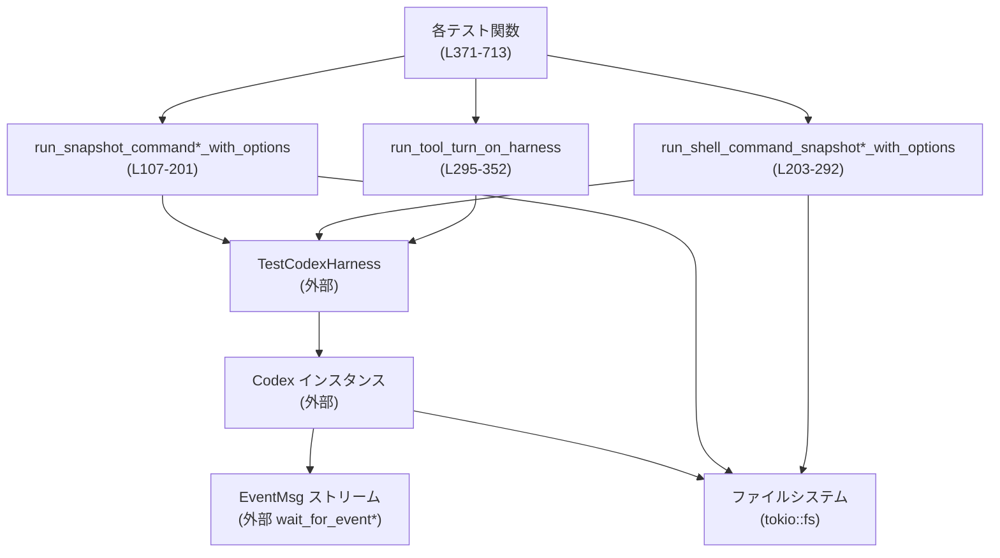
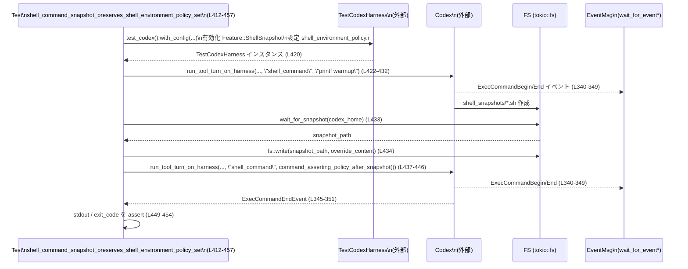

# core/tests/suite/shell_snapshot.rs コード解説

## 0. ざっくり一言

`shell_snapshot.rs` は、Codex の「シェルスナップショット」機能をエンドツーエンドで検証する統合テスト群です。Linux/macOS/Windows の各シェル実行パスで、スナップショットスクリプトの生成・内容・環境変数ポリシーの維持・ツール動作・シャットダウン時のクリーンアップを確認します（例: `linux_unified_exec_uses_shell_snapshot` など `L371-388`, `L652-677`, `L682-713`）。

---

## 1. このモジュールの役割

### 1.1 概要

- このモジュールは Codex のシェル実行系（`exec_command` 統合実行ツールと `shell_command` ツール）が、**シェルの初期状態をスナップショットとして保存し、それを通じてコマンドを実行しているか**を検証します。
- 併せて、**シェル環境ポリシー（特に PATH の上書き）や `apply_patch` のインターセプト、シャットダウン時のスナップショットファイル削除**など、運用上重要な挙動をテストします（例: `shell_command_snapshot_preserves_shell_environment_policy_set` `L412-457`, `shell_command_snapshot_still_intercepts_apply_patch` `L515-611`, `shell_snapshot_deleted_after_shutdown_with_skills` `L615-644`）。

### 1.2 アーキテクチャ内での位置づけ

このテストモジュールは、以下のコンポーネントと連携します。

- `TestCodexHarness`（`core_test_support::test_codex`、`L16-17`）  
  Codex サーバ・ホームディレクトリ・イベントストリームなどを持つテスト用ハーネス。
- `core_test_support::responses::*`（`L10-15`）  
  SSE ストリームをモックし、LLM からのツール呼び出し（`exec_command` / `shell_command`）をシミュレート。
- `wait_for_event` / `wait_for_event_match`（`L18-19`）  
  Codex から流れてくる `EventMsg` ストリームを条件付きで待機します。
- `codex_protocol::protocol::*`（`L3-8`）  
  テストで観測するプロトコルイベントや操作（`Op::UserTurn`, `ExecCommandBeginEvent`, `ExecCommandEndEvent`, `SandboxPolicy` 等）。
- `tokio` の非同期 FS とタイマー（`L25-28`）  
  スナップショットファイルのポーリングとタイムアウト管理に使用。

これらの関係を簡略図で示します。



（関数行番号は `core/tests/suite/shell_snapshot.rs` のものです）

### 1.3 設計上のポイント

- **責務の分割**
  - スナップショット生成の待機・ファイル読み込みは `wait_for_snapshot`・`wait_for_file_contents` に分離されています（`L50-89`）。
  - Codex ハーネスのセットアップとツール起動は `run_snapshot_command*_with_options`, `run_shell_command_snapshot*_with_options`, `run_tool_turn_on_harness` に集約されています（`L107-201`, `L203-292`, `L295-352`）。
- **状態管理**
  - `SnapshotRun` 構造体で、一回の実行に関する begin/end イベント・スナップショットパス・内容・Codex ホームをまとめて保持します（`L31-36`）。
  - グローバルな可変状態はなく、各テストは自身のハーネスと FS 上の一時ディレクトリに閉じています。
- **エラーハンドリング方針**
  - すべての非同期関数は `anyhow::Result` を返し、`?` 演算子で I/O やハーネス構築のエラーを伝播します（例: `wait_for_file_contents` `L77-81`, 各 `run_*` 関数での `.await?`）。
  - タイムアウトは `Instant` + ループ + `sleep` で実装され、所定時間を超えると `anyhow::bail!` で明示的なエラーを返します（`wait_for_snapshot` `L52-71`, `wait_for_file_contents` `L75-88`）。
- **並行性**
  - テストはすべて `#[tokio::test(flavor = "multi_thread", worker_threads = 2)]` で実行され、Tokio マルチスレッドランタイム上で動作します（例: `L370`, `L392`, `L461`, `L515`, `L615`, `L651`, `L681`）。
  - クロージャ内でミュータブル変数を更新するケース（`shell_command_snapshot_still_intercepts_apply_patch` の `saw_patch_begin` 等 `L578-587`）は、単一タスク内のイベントポーリングとして利用されており、他スレッドから同時アクセスされない前提の設計になっています。

---

## 2. 主要な機能一覧

このモジュールが提供する主なテスト機能を列挙します（括弧内は代表的な関数と行番号）。

- **シェルスナップショットファイルの生成・内容検証**
  - POSIX シェル: `linux_unified_exec_uses_shell_snapshot`（`L371-388`）、`linux_shell_command_uses_shell_snapshot`（`L392-408`）、`macos_unified_exec_uses_shell_snapshot`（`L652-677`）
  - Windows PowerShell: `windows_unified_exec_uses_shell_snapshot`（`L682-713`）
- **統合実行ツール `exec_command` と `shell_snapshot` の連携**
  - `run_snapshot_command*_with_options`（`L107-201`）
  - `linux_unified_exec_uses_shell_snapshot`（`L371-388`）
  - `linux_unified_exec_snapshot_preserves_shell_environment_policy_set`（`L461-511`）
- **ツール `shell_command` と `shell_snapshot` の連携**
  - `run_shell_command_snapshot*_with_options`（`L203-292`）
  - `linux_shell_command_uses_shell_snapshot`（`L392-408`）
- **シェル環境ポリシー（PATH 上書き）の維持確認**
  - `shell_command_snapshot_preserves_shell_environment_policy_set`（`L412-457`）
  - `linux_unified_exec_snapshot_preserves_shell_environment_policy_set`（`L461-511`）
- **`apply_patch` ツールとの相互作用**
  - `shell_command_snapshot_still_intercepts_apply_patch`（`L515-611`）
- **シャットダウン時のスナップショット削除**
  - `shell_snapshot_deleted_after_shutdown_with_skills`（`L615-644`）

---

## 3. 公開 API と詳細解説

このファイルはテストモジュールのため、外部クレートから直接呼び出される「公開 API」はありませんが、テスト内部で再利用されるヘルパー関数・型を API と見なし解説します。

### 3.1 型一覧（構造体・列挙体など）

| 名前 | 種別 | フィールド / 役割 | 根拠 |
|------|------|--------------------|------|
| `SnapshotRun` | 構造体 | 1 回のコマンド実行とスナップショット取得の結果をまとめる。<br>・`begin: ExecCommandBeginEvent` – 実行開始イベント（`L32`）<br>・`end: ExecCommandEndEvent` – 実行終了イベント（`L33`）<br>・`snapshot_path: PathBuf` – 生成されたスナップショットファイルへのパス（`L34`）<br>・`snapshot_content: String` – スナップショットファイルの内容（`L35`）<br>・`codex_home: PathBuf` – Codex ホームディレクトリ（`L36`） | `shell_snapshot.rs:L31-36` |
| `SnapshotRunOptions` | 構造体（`Default` 実装） | スナップショット実行時のオプション。<br>・`shell_environment_set: HashMap<String, String>` – Codex の `shell_environment_policy.r#set` に設定する環境変数マップ（`L47`）。テストで PATH を上書きする際に使用。 | `shell_snapshot.rs:L45-48` |

### 3.2 関数詳細（7 件）

#### 1. `wait_for_snapshot(codex_home: &Path) -> Result<PathBuf>`

**根拠**: `core/tests/suite/shell_snapshot.rs:L50-72`

**概要**

Codex ホームディレクトリ配下の `shell_snapshots` ディレクトリをポーリングし、`.sh` または `.ps1` のスナップショットファイルが現れるまで待機します。最大 5 秒でタイムアウトし、見つかったファイルのパスを返します。

**引数**

| 引数名 | 型 | 説明 |
|--------|----|------|
| `codex_home` | `&Path` | Codex ホームディレクトリ。内部で `codex_home.join("shell_snapshots")` を行います（`L51`）。 |

**戻り値**

- `Result<PathBuf>` – 成功時は最初に見つかった `.sh` または `.ps1` ファイルのパス。5 秒以内に見つからない場合やエラー条件で `anyhow::Error` を返します。

**内部処理の流れ**

1. `snapshot_dir = codex_home.join("shell_snapshots")` を計算（`L51`）。
2. `deadline = Instant::now() + Duration::from_secs(5)` で締切時刻を決定（`L52`）。
3. 無限ループを開始し、以下を繰り返します（`L53`）。
   - `fs::read_dir(&snapshot_dir).await` を試み、成功した場合のみエントリを走査（`L54-55`）。
   - 各エントリの拡張子を取得し、`"sh"` または `"ps1"` であればそのパスを `Ok(path)` で返す（`L56-61`）。
4. どのエントリも該当しない場合、あるいは `read_dir` がエラーだった場合（`if let Ok` なのでエラー時は無視）、
   - 現在時刻が `deadline` を超えていれば `anyhow::bail!("timed out waiting for shell snapshot")`（`L66-68`）。
   - そうでなければ `sleep(Duration::from_millis(25)).await` し、再試行（`L70`）。

**Examples（使用例）**

```rust
// Codex ホームディレクトリが既にわかっている場合
let codex_home = harness.test().home.path().to_path_buf(); // L421 相当
let snapshot_path = wait_for_snapshot(&codex_home).await?;
// snapshot_path は .sh または .ps1 のファイルパス
```

上記のように、各テスト内でスナップショット生成完了を待つために利用されています（例: `L183`, `L274`, `L433`, `L487`, `L574`, `L627`）。

**Errors / Panics**

- 5 秒以内にスナップショットファイルが見つからない場合、`anyhow::bail!` で `"timed out waiting for shell snapshot"` を返します（`L66-68`）。
- `fs::read_dir` のエラー自体は無視されますが、結果的にファイルが見つからず 5 秒経過すればタイムアウト扱いです。

**Edge cases（エッジケース）**

- `shell_snapshots` ディレクトリが存在しない場合  
  `read_dir` がエラーになりますが無視されるため、ディレクトリが作成されるまで待機し、最終的にタイムアウトする可能性があります。
- ディレクトリ内に複数ファイルがある場合  
  最初に見つかった拡張子 `.sh` or `.ps1` のファイルだけを返します（`L55-61`）。
- 権限エラーなどで `read_dir` が常に失敗する場合  
  エラーは検出されず、5 秒後にタイムアウトとして扱われます。

**使用上の注意点**

- テスト前に `Feature::ShellSnapshot` が有効化されていなければ、そもそもスナップショットが作られずタイムアウトします（他のヘルパーで有効化しています：`L123-129`, `L218-220`）。
- 25ms 間隔でポーリングするため、非常に大量のテストを並列実行すると FS 負荷が増える可能性がありますが、このファイルではテストごとに 1 つ程度で想定されています。

---

#### 2. `wait_for_file_contents(path: &Path) -> Result<String>`

**根拠**: `shell_snapshot.rs:L74-89`

**概要**

指定されたパスのファイルが存在し、読み取りに成功するまで最大 15 秒間ポーリングし、成功時にファイル内容を返します。存在しない場合は再試行し、それ以外の I/O エラーは即時エラーとして返します。

**引数**

| 引数名 | 型 | 説明 |
|--------|----|------|
| `path` | `&Path` | 読み取り対象ファイルのパス。 |

**戻り値**

- `Result<String>` – 成功時にファイル内容（UTF-8 として読み取られた `String`）。タイムアウトまたはエラー時に `anyhow::Error`。

**内部処理の流れ**

1. `deadline = Instant::now() + Duration::from_secs(15)` を設定（`L75`）。
2. 無限ループで `fs::read_to_string(path).await` を実行（`L77`）。
   - 成功 (`Ok(contents)`) なら `Ok(contents)` を返す（`L78`）。
   - `ErrorKind::NotFound` の場合は何もせず再試行（`L79`）。
   - それ以外のエラーは `Err(err.into())` で即時返却（`L80-81`）。
3. 現在時刻が `deadline` を超えた場合、`anyhow::bail!("timed out waiting for file {}", path.display())`（`L83-85`）。
4. そうでなければ 25ms 待機し再試行（`L87`）。

**Examples（使用例）**

`apply_patch` ツールによって作成されるファイルの内容検証に利用されています。

```rust
// shell_command_snapshot_still_intercepts_apply_patch 内 (L605-607)
assert_eq!(
    wait_for_file_contents(&target).await?,
    "hello from snapshot\n"
);
```

**Errors / Panics**

- 15 秒以内にファイルが作成されない場合、タイムアウトエラーになります（`L83-85`）。
- 存在するが読み取りエラーが発生した場合（パーミッション、不正エンコーディング等）、最初の失敗で即時 `Err` になります（`L80-81`）。

**Edge cases**

- ファイルサイズが大きい場合、`read_to_string` がメモリを多く使用します。このテストでは小さいテキストファイルを前提としています（`snapshot-apply.txt` など `L531`）。
- ファイルが作成された直後、内容が完全に書き込まれる前に読み込む可能性はありますが、`apply_patch` 成功後に呼ぶ設計のため、このテストでは問題にならない想定です。

**使用上の注意点**

- 存在しないファイルを待ち続けると 15 秒ブロックされるので、タイムアウト値を変更する場合は全テストの実行時間に影響します。

---

#### 3. `run_snapshot_command_with_options(command: &str, options: SnapshotRunOptions) -> Result<SnapshotRun>`

**根拠**: `shell_snapshot.rs:L113-201`

**概要**

統合実行ツール `exec_command` を用いて `command` を実行し、その際にシェルスナップショット機能が使われることを検証するためのヘルパー関数です。Codex ハーネスを構築し、SSE レスポンスをモックしてツール呼び出しを発火させ、開始/終了イベントとスナップショットファイルを収集して `SnapshotRun` として返します。

**引数**

| 引数名 | 型 | 説明 |
|--------|----|------|
| `command` | `&str` | `exec_command` ツールに渡すシェルコマンド（例: `"echo snapshot-linux"` `L372`）。 |
| `options` | `SnapshotRunOptions` | シェル環境ポリシーの `r#set` に渡す環境変数セット（`L117-120`）。 |

**戻り値**

- `Result<SnapshotRun>` – 1 回の `exec_command` 実行に関する begin/end イベント、スナップショットパス・内容、Codex ホームをまとめた構造体。

**内部処理の流れ**

1. `options` から `shell_environment_set` を取り出し（`L117-119`）、`test_codex().with_config` でハーネス設定を構築（`L120-131`）。
   - `config.use_experimental_unified_exec_tool = true;`（`L121`）
   - `Feature::UnifiedExec` と `Feature::ShellSnapshot` を有効化（`L123-129`）。
   - `shell_environment_policy.r#set` に `shell_environment_set` を設定（`L130`）。
2. `TestCodexHarness::with_builder(builder).await?` で Codex ハーネスを生成（`L132`）。
3. `args` JSON を組み立て（`{"cmd": command, "yield_time_ms": 1000}` `L133-136`）、`call_id = "shell-snapshot-exec"` を設定（`L137`）。
4. SSE シーケンスを構築し、`mount_sse_sequence` でサーバに登録（`L138-150`）。
   - `ev_function_call(call_id, "exec_command", ...)` により、LLM 側からツールが呼ばれたことをシミュレート（`L141`）。
5. `harness.test()` から Codex インスタンスやワークディレクトリ、モデル名を取得（`L152-156`）。
6. `codex.submit(Op::UserTurn { ... })` を送信（`L158-176`）。ここで `sandbox_policy: SandboxPolicy::DangerFullAccess` を使用しています（`L168`）。
7. `wait_for_event_match` で `EventMsg::ExecCommandBegin` を待ち、`call_id` が一致するものを `begin` として取得（`L178-182`）。
8. `wait_for_snapshot(&codex_home)` でスナップショットファイルを待ち（`L183`）、内容を `fs::read_to_string` で読み込む（`L184`）。
9. 再度 `wait_for_event_match` で `ExecCommandEnd` イベントを待ち、`end` として取得（`L186-190`）。
10. `wait_for_event` で `EventMsg::TurnComplete` まで待機し（`L192`）、最後に `SnapshotRun` を構築して返す（`L194-200`）。

**Examples（使用例）**

```rust
// 単純な unified exec のスナップショットテスト (L371-388)
let command = "echo snapshot-linux";
let run = run_snapshot_command(command).await?; // options はデフォルト (L107-110)
let stdout = normalize_newlines(&run.end.stdout);

assert_eq!(run.begin.command.get(2).map(String::as_str), Some(command));
assert!(run.snapshot_path.starts_with(&run.codex_home));
assert_posix_snapshot_sections(&run.snapshot_content);
assert_eq!(run.end.exit_code, 0);
assert!(stdout.contains("snapshot-linux"));
```

**Errors / Panics**

- ハーネス構築 (`with_builder`) や Codex との通信、`mount_sse_sequence`、ファイル読み込みなどでエラーが発生した場合は `?` で上位に伝播します（`L132`, `L150`, `L183-184`）。
- `Feature::UnifiedExec`/`ShellSnapshot` の有効化に失敗した場合、`expect("test config should allow feature update")` によりパニックします（`L125`, `L129`）。  
  ただしテスト用設定では成功を前提としています。
- `wait_for_snapshot` がタイムアウトするとエラーになります（`L183` 経由）。

**Edge cases**

- `shell_environment_set` による PATH の変更などは、この関数では単に設定するだけで、実際にどのように反映されたかは呼び出し側のテストで検証します（例: `linux_unified_exec_snapshot_preserves_shell_environment_policy_set` `L461-511`）。
- `exec_command` の stdout/stderr が非常に長い場合でも、ここではすべて `ExecCommandEndEvent` 内の `stdout`/`stderr` として扱うだけです。

**使用上の注意点**

- `SandboxPolicy::DangerFullAccess` を使用しているため（`L168`）、テスト環境では外部コマンドがフルアクセスで実行される前提です。実運用とは異なる点に注意が必要です。
- `call_id` は固定文字列 `"shell-snapshot-exec"` なので、同一ハーネスで複数の並行実行を行う用途には向きません。

---

#### 4. `run_shell_command_snapshot_with_options(command: &str, options: SnapshotRunOptions) -> Result<SnapshotRun>`

**根拠**: `shell_snapshot.rs:L209-292`

**概要**

`run_snapshot_command_with_options` の `shell_command` 版です。`Feature::ShellSnapshot` のみを有効化し、`shell_command` ツール経由で任意のシェルコマンドを実行し、その begin/end イベントやスナップショットファイルを収集します。

**引数**

| 引数名 | 型 | 説明 |
|--------|----|------|
| `command` | `&str` | `shell_command` ツールに渡すコマンド（`L225-226`）。 |
| `options` | `SnapshotRunOptions` | シェル環境ポリシーの `r#set` に渡す環境変数セット（`L213-215`）。 |

**戻り値**

- `Result<SnapshotRun>` – `shell_command` 実行の begin/end、スナップショット情報を内包。

**内部処理の流れ**

1. `options` から `shell_environment_set` を取り出し（`L213-215`）、`test_codex().with_config` で以下を設定（`L216-222`）。
   - `Feature::ShellSnapshot` の有効化（`L218-220`）。
   - `shell_environment_policy.r#set` の設定（`L221`）。
2. `TestCodexHarness::with_builder(builder).await?` でハーネス構築（`L223`）。
3. `args = {"command": command, "timeout_ms": 1000}` を作成し（`L224-227`）、`call_id = "shell-snapshot-command"` を使用（`L228`）。
4. SSE シーケンス内で `shell_command` をツールとして呼び出すように設定（`L229-239`）。
5. `codex.submit(Op::UserTurn { ... })` でユーザーターンを送信（`L249-267`）。
6. `ExecCommandBegin`/`ExecCommandEnd` イベントを `wait_for_event_match` で待機し（`L269-273`, `L277-281`）、`begin`/`end` として取得。
7. `wait_for_snapshot` と `fs::read_to_string` でスナップショットパスと内容を取得（`L274-275`）。
8. 最後に `TurnComplete` を待ってから `SnapshotRun` を返します（`L283-291`）。

**Examples（使用例）**

```rust
// linux_shell_command_uses_shell_snapshot (L392-408)
let command = "echo shell-command-snapshot-linux";
let run = run_shell_command_snapshot(command).await?; // options デフォルト (L203-206)

assert_eq!(run.begin.command.get(2).map(String::as_str), Some(command));
assert!(run.snapshot_path.starts_with(&run.codex_home));
assert_posix_snapshot_sections(&run.snapshot_content);
assert_eq!(
    normalize_newlines(&run.end.stdout).trim(),
    "shell-command-snapshot-linux"
);
assert_eq!(run.end.exit_code, 0);
```

**Errors / Panics**

- ハーネス構築・SSE マウント・Codex への submit・スナップショット待機・ファイル読み込みのいずれかでエラーが起きると `Result` 経由で伝播します。
- `Feature::ShellSnapshot` 有効化の `expect` によるパニック可能性あり（`L219-220`）。

**Edge cases**

- `timeout_ms` が 1000ms 固定のため、非常に時間のかかるコマンドをテストするには適していません。ただしこのファイルでは短い `echo` や `printf` のみを想定しています。
- `call_id` が固定 `"shell-snapshot-command"` なので、このヘルパーを同一ハーネスで複数並行実行する設計にはなっていません。

**使用上の注意点**

- `SandboxPolicy::DangerFullAccess` を用いる点は `run_snapshot_command_with_options` と同様です（`L259`）。
- コマンド文字列にシェルメタ文字を含める場合は、テストシナリオに合わせた適切なクォートが必要です（例: `apply_patch` スクリプト `L531`）。

---

#### 5. `run_tool_turn_on_harness(harness: &TestCodexHarness, prompt: &str, call_id: &str, tool_name: &str, args: serde_json::Value) -> Result<ExecCommandEndEvent>`

**根拠**: `shell_snapshot.rs:L295-352`

**概要**

既に構築済みの `TestCodexHarness` 上で、任意のツール (`tool_name`) を 1 回呼び出し、その `ExecCommandEndEvent` を返す汎用ヘルパーです。SSE シーケンスを設定した上で `Op::UserTurn` を送信し、begin/end イベントとターン完了まで待機します。

**引数**

| 引数名 | 型 | 説明 |
|--------|----|------|
| `harness` | `&TestCodexHarness` | 既に構築済みの Codex テストハーネス（`L296`）。 |
| `prompt` | `&str` | ユーザープロンプトとして送るテキスト（`L297`）。 |
| `call_id` | `&str` | このツール呼び出しを識別する `call_id`（`L298`）。 |
| `tool_name` | `&str` | 呼び出すツール名（例: `"shell_command"`, `"exec_command"` `L426`, `L480`）。 |
| `args` | `serde_json::Value` | ツールに渡す JSON 引数（`L300`）。 |

**戻り値**

- `Result<ExecCommandEndEvent>` – `call_id` に対応する `ExecCommandEndEvent`。stdout・stderr・exit_code 等を含みます。

**内部処理の流れ**

1. `responses` ベクタを組み立て、`ev_function_call(call_id, tool_name, &serde_json::to_string(&args)?)` を含む SSE シーケンスを構築（`L302-313`）。
2. `mount_sse_sequence(harness.server(), responses).await` で SSE をサーバに登録（`L314`）。
3. `harness.test()` から Codex インスタンスやモデル・cwd を取得（`L316-319`）。
4. `codex.submit(Op::UserTurn { ... })` を送信し（`L320-337`）、`prompt` をテキストとして渡す。
5. `wait_for_event_match` で `ExecCommandBegin` イベントを待ち（`L340-344`）、続けて `ExecCommandEnd` イベントを待機（`L345-349`）。
6. 最後に `TurnComplete` を待ってから `end` イベントを返す（`L350-351`）。

**Examples（使用例）**

```rust
// シェルスナップショットのウォームアップ (L422-432)
run_tool_turn_on_harness(
    &harness,
    "warm up shell snapshot",
    "shell-snapshot-policy-warmup",
    "shell_command",
    json!({
        "command": "printf warmup",
        "timeout_ms": 1_000,
    }),
).await?;

// unified exec 版 (L476-485)
let end = run_tool_turn_on_harness(
    &harness,
    "verify unified exec policy after snapshot",
    "shell-snapshot-policy-assert-exec",
    "exec_command",
    json!({
        "cmd": command,
        "yield_time_ms": 1_000,
    }),
).await?;
```

**Errors / Panics**

- JSON シリアライズエラー、SSE マウントエラー、Codex への submit エラー、イベント待機中のエラーはいずれも `Result` で上位に伝播します。
- `call_id` に対応する `ExecCommandBegin`/`End` が届かない場合、`wait_for_event_match` の内部実装次第ではブロックし続けるかタイムアウトで `Err` になると考えられますが、このチャンクからは詳細は分かりません（`wait_for_event_match` 実装はこのファイル外）。

**Edge cases**

- `tool_name` や `args` が Codex 側で未定義のツールや不正な引数だった場合、`ExecCommandEndEvent` の `exit_code` や `stderr` でエラーが表現される可能性があります（使用しているテストでは正常系のみ検証）。
- 同じ `call_id` を別のテストでも使うとイベントが混ざるリスクがありますが、このファイルではテストごとにユニークな `call_id` を使用しています（例: `"shell-snapshot-policy-warmup"`, `"shell-snapshot-apply-patch"` `L538` など）。

**使用上の注意点**

- 既に構築済みのハーネスを使うので、スナップショットファイルを上書きしたり、ポリシーを変更した上で再実行するテストに適しています（`L433-435`, `L487-488`）。
- マルチスレッド環境では、同じ `harness` に対して別タスクから同時に `run_tool_turn_on_harness` を呼ぶと `call_id` やイベント順序の競合が起こり得るため避けるべきです。

---

#### 6. `shell_command_snapshot_preserves_shell_environment_policy_set() -> Result<()>`

**根拠**: `shell_snapshot.rs:L412-457`

**概要**

`shell_command` 経由でシェルスナップショットを利用しても、Codex のシェル環境ポリシー（ここでは PATH 上書き）が保持されていることを確認するテストです。最初のスナップショット作成後、スナップショットファイルを書き換え、再度コマンドを実行して PATH が期待どおりに反映されるかを検証します。

**引数 / 戻り値**

- テスト関数で引数はなく、`Result<()>` を返します（`L412`）。

**内部処理の流れ（テストシナリオ）**

1. ハーネス構築:
   - `Feature::ShellSnapshot` を有効化し（`L415-417`）、`shell_environment_policy.r#set` に `policy_set_path_for_test()` を設定（`L418`）。  
     `policy_set_path_for_test` は `{"PATH": "/codex/policy/path"}` を返します（`L91-93`）。
2. `run_tool_turn_on_harness` でスナップショットウォームアップ:
   - `"printf warmup"` を `shell_command` で実行し（`L422-431`）、最初のスナップショットを生成。
3. `wait_for_snapshot(&codex_home)` でスナップショットパス取得（`L433`）。
4. `fs::write(&snapshot_path, snapshot_override_content_for_policy_test()).await?` でスナップショット内容を上書き（`L434`）。
   - `snapshot_override_content_for_policy_test` は PATH と環境変数 `CODEX_SNAPSHOT_POLICY_MARKER` を設定するスクリプト文字列を生成（`L95-99`）。
5. `command_asserting_policy_after_snapshot()` で PATH とマーカーの状態を検証するシェルスクリプトを生成（`L436`）。  
   このスクリプトは PATH に `POLICY_PATH_FOR_TEST` が含まれ、かつマーカー環境変数が設定されている場合に `POLICY_SUCCESS_OUTPUT` を出力します（`L101-105`, `L39-43`）。
6. 再度 `run_tool_turn_on_harness` で `shell_command` を実行し（`L437-446`）、`ExecCommandEndEvent` を取得。
7. `stdout` が `POLICY_SUCCESS_OUTPUT` であること（`L449-452`）、`exit_code` が 0 であること（`L453`）、スナップショットパスが Codex ホーム配下であることを確認（`L454`）。

**Examples（使用例）**

この関数自体がテストケースであり、実際の使用はテストランナー（`cargo test` 等）によって行われます。

**エラー・並行性・安全性の観点**

- ハーネス構築やファイル書き込み、ツール実行でエラーが起きると `Result` によってテスト失敗として報告されます（`?` 演算子使用箇所）。
- `fs::write` は非同期であり、書き込み完了後にコマンドを実行するため、スナップショットの内容途中読み込みのリスクは低いです（`L434` -> `L437`）。
- `SandboxPolicy::DangerFullAccess` が `run_tool_turn_on_harness` の中で設定されている点は他テストと共通です（`L330`）。

**Edge cases**

- スナップショットファイルが期待した形式でない場合、`command_asserting_policy_after_snapshot` はエラー情報（PATH やマーカー値）を出力するよう設計されています（`L101-105`）。  
  このテストでは成功ケースのみ assert しています。

---

#### 7. `shell_snapshot_deleted_after_shutdown_with_skills() -> Result<()>`

**根拠**: `shell_snapshot.rs:L615-644`

**概要**

`Feature::ShellSnapshot` が有効な状態で Codex を起動するとスナップショットが作成されるが、`Op::Shutdown` を送ってシャットダウンした後にスナップショットファイルが削除されることを確認するテストです。リソースクリーンアップの挙動を検証しています。

**内部処理の流れ**

1. `Feature::ShellSnapshot` を有効化したハーネスを構築（`L616-621`）。
2. `home` と `codex` の参照を取得（`L623-625`）。
3. `wait_for_snapshot(&codex_home)` でスナップショットパスを取得し、ファイルの存在をチェック（`L627-628`）。
4. `codex.submit(Op::Shutdown {}).await?` でシャットダウン要求を送信（`L630`）。
5. `wait_for_event(&codex, |ev| matches!(ev, EventMsg::ShutdownComplete)).await;` でシャットダウン完了イベントを待機（`L631`）。
6. `drop(codex); drop(harness);` でリソースを明示的に解放し（`L633-634`）、150ms 待機（`L635`）。
7. 最後に `assert_eq!(snapshot_path.exists(), false, ...)` でスナップショット削除を確認（`L637-640`）。

**Errors / Edge cases**

- スナップショット作成が行われない場合（`Feature::ShellSnapshot` が効いていない等）、`wait_for_snapshot` がタイムアウトします（`L627`）。
- シャットダウン完了イベントが届かない場合、`wait_for_event` の内部実装次第ですがテストがタイムアウトまたはエラーとなる可能性があります。
- 削除操作は Codex 側の責務であり、このファイルでは `exists()` の結果のみを検証しています。実際にどのタイミングで削除されるかは Codex 実装に依存します。

**並行性 / 安全性の観点**

- シャットダウン後に 150ms の `sleep` を入れているのは、FS 上の削除反映や非同期タスクの終了を待つためと考えられます（`L635`）。
- `drop(codex); drop(harness);` でハンドルを明示的に破棄した後にチェックすることで、テストプロセス内から開かれたハンドルが削除を妨げていないことを確認しています。

---

### 3.3 その他の関数一覧

| 関数名 | 役割（1 行） | 根拠 |
|--------|--------------|------|
| `policy_set_path_for_test() -> HashMap<String, String>` | `PATH` を `/codex/policy/path` に設定する環境変数マップを返し、ポリシーテストで利用します。 | `L91-93` |
| `snapshot_override_content_for_policy_test() -> String` | スナップショットファイルの内容を上書きするためのシェルスクリプト文字列（PATH とマーカー環境変数を設定）を生成します。 | `L95-99` |
| `command_asserting_policy_after_snapshot() -> String` | 環境変数が期待どおりかどうかをチェックし、成功時に `policy-after-snapshot` と出力するシェルスクリプト文字列を生成します。 | `L101-105` |
| `run_snapshot_command(command: &str) -> Result<SnapshotRun>` | `SnapshotRunOptions::default()` で `run_snapshot_command_with_options` をラップした簡易版です。 | `L107-110` |
| `run_shell_command_snapshot(command: &str) -> Result<SnapshotRun>` | `run_shell_command_snapshot_with_options` のデフォルトオプション版ヘルパーです。 | `L203-206` |
| `normalize_newlines(text: &str) -> String` | Windows 形式の `\r\n` を `\n` に変換し、テストで stdout 比較を簡略化します。 | `L354-356` |
| `assert_posix_snapshot_sections(snapshot: &str)` | POSIX シェルスナップショットに期待されるセクション（`# Snapshot file`, `aliases`, `exports`, `setopts`, `PATH`）が含まれているかを assert します。 | `L358-367` |
| `linux_unified_exec_uses_shell_snapshot() -> Result<()>` | Linux 上で `exec_command` 実行時にシェルスナップショットが利用されることを検証するテストです。 | `L369-388` |
| `linux_shell_command_uses_shell_snapshot() -> Result<()>` | Linux 上で `shell_command` 実行時にシェルスナップショットが利用されることを検証します。 | `L390-408` |
| `linux_unified_exec_snapshot_preserves_shell_environment_policy_set() -> Result<()>` | Linux 上で unified exec + shell snapshot でも環境ポリシーが維持されることを確認するテストです。 | `L459-511` |
| `shell_command_snapshot_still_intercepts_apply_patch() -> Result<()>` | `shell_command` 経由で `apply_patch` を実行しても、Codex の `apply_patch` インターセプト機構が働き、ファイルが作成されることを確認します。 | `L515-611` |
| `macos_unified_exec_uses_shell_snapshot() -> Result<()>` | macOS 上で unified exec がシェルスナップショットを利用することを確認するテストです。 | `L646-677` |
| `windows_unified_exec_uses_shell_snapshot() -> Result<()>` | Windows (PowerShell) 上で unified exec がスナップショットを利用することを確認するテスト（現在 `#[ignore]`）。 | `L679-713` |

---

## 4. データフロー

ここでは、**シェル環境ポリシー保持テスト**（`shell_command_snapshot_preserves_shell_environment_policy_set` `L412-457`）を例に、データとイベントの流れを説明します。

### 概要

1. Codex ハーネス構築時にシェル環境ポリシーで PATH を `/codex/policy/path` に設定。
2. `shell_command` で軽いコマンドを走らせ、シェルスナップショットが生成される。
3. スナップショットファイルをテスト側で上書きし、PATH とマーカー環境変数を設定する。
4. 再度 `shell_command` を実行し、PATH がポリシー値を含み、マーカーが設定されていることをシェルスクリプトで検証。
5. Codex からの `ExecCommandEndEvent` の stdout をチェックして成功を確認。

### シーケンス図



このデータフローから分かるポイント:

- ポリシー (`shell_environment_policy.r#set`) は Codex 内部のシェル環境初期化に適用され、その状態をスナップショットで保存・再利用していることが前提です。
- テストはスナップショットファイルそのものを書き換えることで、**「スナップショットが実行され、その後 Codex のポリシーフックが再適用される」**ことを間接的に検証しています。

---

## 5. 使い方（How to Use）

このファイルはテストコードですが、ここでのパターンは **新しいシェルスナップショット関連テストを追加するときのテンプレート**として有用です。

### 5.1 基本的な使用方法

典型的なテストフローは以下のようになります。

```rust
#[tokio::test(flavor = "multi_thread", worker_threads = 2)]
async fn example_shell_snapshot_test() -> anyhow::Result<()> {
    // 1. ハーネス構築: 必要な Feature を有効化
    let builder = test_codex().with_config(|config| {
        config
            .features
            .enable(Feature::ShellSnapshot)
            .expect("test config should allow feature update");
    });
    let harness = TestCodexHarness::with_builder(builder).await?;
    let codex_home = harness.test().home.path().to_path_buf();

    // 2. ツール実行: run_tool_turn_on_harness などを利用
    let end = run_tool_turn_on_harness(
        &harness,
        "run something with snapshot",
        "my-call-id",
        "shell_command",
        json!({
            "command": "echo hello",
            "timeout_ms": 1_000,
        }),
    ).await?;

    // 3. スナップショットファイルを検査
    let snapshot_path = wait_for_snapshot(&codex_home).await?;
    let snapshot_content = tokio::fs::read_to_string(&snapshot_path).await?;
    assert_posix_snapshot_sections(&snapshot_content);

    // 4. 実行結果 (stdout, exit_code, begin.command など) を検査
    assert_eq!(normalize_newlines(&end.stdout).trim(), "hello");
    assert_eq!(end.exit_code, 0);

    Ok(())
}
```

このパターンは `linux_shell_command_uses_shell_snapshot`（`L392-408`）や `linux_unified_exec_uses_shell_snapshot`（`L371-388`）とほぼ同様です。

### 5.2 よくある使用パターン

- **Unified Exec (`exec_command`) 経由でのテスト**
  - `run_snapshot_command` / `run_snapshot_command_with_options` を使い、begin/end イベントとスナップショットをまとめて取得。
  - コマンドラインの構成（`-lc` や `. "$0" && exec "$@"` など）を `begin.command` から検証（`L376-378`, `L662-669`）。
- **`shell_command` 経由のテスト**
  - `run_shell_command_snapshot` を利用し、stdout と exit_code を検証（`L398-405`）。
- **ポリシーやスナップショット内容のテスト**
  - `wait_for_snapshot` でパス取得後、`fs::write` で内容を差し替え、その状態で再度ツールを実行（`L433-447`, `L487-501`）。
- **ツールのインターセプト (`apply_patch`) のテスト**
  - `shell_command_snapshot_still_intercepts_apply_patch` のように、`apply_patch` スクリプトを `shell_command` 経由で実行し、`EventMsg::PatchApplyBegin/End` イベントと出力ファイルを検証（`L531-607`）。

### 5.3 よくある間違い

このファイルから推測できる典型的な誤用と正しい例です。

```rust
// 誤り例: Feature::ShellSnapshot を有効化せずにスナップショットを待つ
let builder = test_codex().with_config(|_config| {
    // ShellSnapshot 未設定
});
let harness = TestCodexHarness::with_builder(builder).await?;
let codex_home = harness.test().home.path().to_path_buf();

// これだと wait_for_snapshot がタイムアウトする可能性が高い
let snapshot_path = wait_for_snapshot(&codex_home).await?;

// 正しい例: Feature::ShellSnapshot を明示的に有効化 (L415-417, L469-471)
let builder = test_codex().with_config(|config| {
    config
        .features
        .enable(Feature::ShellSnapshot)
        .expect("test config should allow feature update");
});
let harness = TestCodexHarness::with_builder(builder).await?;
let codex_home = harness.test().home.path().to_path_buf();
let snapshot_path = wait_for_snapshot(&codex_home).await?;
```

### 5.4 使用上の注意点（まとめ）

- **前提条件**
  - テストでシェルスナップショットを利用する場合、必ず `Feature::ShellSnapshot` を有効化する必要があります（`L123-129`, `L218-220`, `L415-417`, `L469-471`, `L618-620`）。
  - Unified Exec をテストする場合は `config.use_experimental_unified_exec_tool = true` と `Feature::UnifiedExec` の有効化が必要です（`L121`, `L123-125`, `L463-467`）。
- **並行性**
  - 各テストは独自に `TestCodexHarness` を構築しており、ハーネスや `call_id` を共有して並行実行する設計にはなっていません。
- **安全性 / セキュリティ**
  - すべてのユーザーターンで `SandboxPolicy::DangerFullAccess` を使用しているため（例: `L168`, `L259`, `L564`）、テスト環境ではシェルコマンドがファイルシステムにフルアクセスできる想定です。実運用のサンドボックス設定とは異なる点に留意する必要があります。
- **タイムアウト**
  - `wait_for_snapshot` (5 秒), `wait_for_file_contents` (15 秒), 各ツール呼び出し (`timeout_ms` や `yield_time_ms` 1–5 秒) が設定されており、テスト環境のパフォーマンスによっては調整が必要になる可能性があります（特にコメントで Bazel/macOS の遅さに言及 `L534-536`）。

---

## 6. 変更の仕方（How to Modify）

### 6.1 新しい機能を追加する場合

例: 新しいシェルツール `my_shell_tool` が ShellSnapshot に対応したかどうかをテストしたい場合。

1. **ハーネス構築**
   - `test_codex().with_config` で新しいツールを有効化し、必要に応じて `Feature::ShellSnapshot` や他の Feature を設定します（`L413-419`, `L462-472` を参考）。
2. **ツール呼び出しヘルパーの利用**
   - 既存の `run_tool_turn_on_harness` を使い、`tool_name` に `"my_shell_tool"` を指定します。
   - `args` JSON をツール仕様に合わせて組み立てます（`L427-430`, `L481-484` を参考）。
3. **スナップショット検証**
   - `wait_for_snapshot` でスナップショットファイルを待ち、内容を検証するロジックを追加します（`assert_posix_snapshot_sections` を流用または別のアサート関数を実装）。
4. **イベント検証**
   - 必要であれば、新しい `EventMsg` バリアント（`EventMsg::MyToolBegin` など）に対する `wait_for_event`/`wait_for_event_match` を実装・利用します（`L580-587` での `PatchApplyBegin/End` などが参考になります）。

### 6.2 既存の機能を変更する場合

- **影響範囲の確認**
  - `SnapshotRun`・`SnapshotRunOptions` を変更する場合、すべての `run_*` ヘルパーの戻り値やフィールド参照箇所（`L372-380`, `L396-400`, `L656-669`, `L686-700` など）への影響を確認する必要があります。
  - `wait_for_snapshot` のタイムアウトや拡張子条件を変更すると、すべてのテストに影響します（`L60-61`, `L66-68`）。
- **契約（前提条件・返り値の意味）**
  - `run_tool_turn_on_harness` は、与えた `call_id` に対して必ず 1 回の `ExecCommandBegin` と `ExecCommandEnd` が来る前提です（`L340-349`）。Codex 側の実装変更でこの契約が崩れた場合、テスト側の待ち方を変更する必要があります。
  - `shell_command_snapshot_still_intercepts_apply_patch` は `apply_patch` 実行時に `PatchApplyBegin`/`PatchApplyEnd` イベントが出る契約を前提としています（`L580-587`）。
- **テスト・使用箇所の再確認**
  - 新しい Return フィールドの追加や構造変更を行った場合、`SnapshotRun` を使っている全テストのビルド・実行を行い、意図した検証が継続されているか確認する必要があります。

---

## 7. 関連ファイル

このモジュールと密接に関係する外部ファイル・モジュールは以下のとおりです（コードはこのチャンクには含まれていません）。

| パス / モジュール | 役割 / 関係 |
|-------------------|------------|
| `core_test_support::test_codex::{test_codex, TestCodexHarness}` | Codex サーバ・ホームディレクトリ・イベントストリームを管理するテストハーネス。各テストでインスタンスを構築しています（`L16-17`, `L132`, `L223`, `L420`, `L474`, `L523`, `L622`）。 |
| `core_test_support::responses::{sse, ev_response_created, ev_function_call, ev_assistant_message, ev_completed, mount_sse_sequence}` | LLM からの SSE ストリームとツール呼び出しをモックするユーティリティ群。`run_snapshot_command*_with_options` や `run_tool_turn_on_harness` で使用（`L10-15`, `L138-150`, `L229-241`, `L302-315`, `L539-551`）。 |
| `core_test_support::{wait_for_event, wait_for_event_match}` | Codex からの `EventMsg` ストリームを条件付きで待機するヘルパー。`ExecCommandBegin/End`, `PatchApplyBegin/End`, `TurnComplete`, `ShutdownComplete` などのイベント検知に使用（`L18-19`, `L178-182`, `L186-190`, `L269-273`, `L277-281`, `L340-351`, `L580-592`, `L630-631`）。 |
| `codex_protocol::protocol::{Op, EventMsg, ExecCommandBeginEvent, ExecCommandEndEvent, AskForApproval, SandboxPolicy}` | Codex プロトコルの操作種別とイベント定義。ユーザーターン送信 (`Op::UserTurn`, `Op::Shutdown`) や、実行イベント観測に使用（`L3-8`, `L158-175`, `L249-266`, `L320-337`, `L630`）。 |
| `codex_protocol::user_input::UserInput` | `Op::UserTurn` 内でユーザー入力を表現する型。テキストプロンプトの送信に使用（`L9`, `L160-163`, `L252-253`, `L322-325`, `L556-559`）。 |

これらのモジュールの具体的な実装はこのチャンクには現れませんが、テストの挙動（特にイベントの発火タイミングや特定の `EventMsg` バリアントの意味）はそれらに依存しています。
