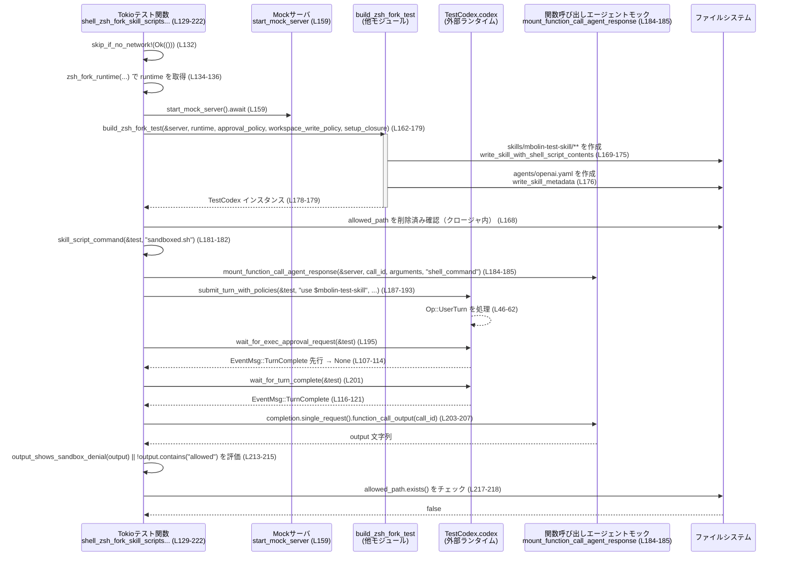

core/tests/suite/skill_approval.rs

---

## 0. ざっくり一言

- Zsh フォークランタイムを使ったシェル実行スキルに対して、**スキル権限メタデータとワークスペース書き込みサンドボックスがどう効くか**を検証する非同期テスト群です。  
- 「スキル宣言されたファイル権限は、ターン単位のサンドボックスより強くなってはいけない」という振る舞いと、「WorkspaceWrite ポリシーがワークスペース外の書き込みを拒否する」ことを確認します。

---

## 1. このモジュールの役割

### 1.1 概要

- このテストモジュールは、Zsh フォークベースのシェル実行スキルに対して  
  **AskForApproval（承認ポリシー）** と **SandboxPolicy（サンドボックスポリシー）** がどのように適用されるかを検証します。  
- 具体的には次の 2 点を確認します。
  - スキル Yaml の `permissions` で宣言されたファイル書き込み権限があっても、**ターンのサンドボックスが許さない場所には書き込めない**こと  
    （`shell_zsh_fork_skill_scripts_ignore_declared_permissions`。  
    根拠: core/tests/suite/skill_approval.rs:L129-222）
  - WorkspaceWrite サンドボックスポリシーが有効なとき、**ワークスペース外への `touch`（ファイル作成）が拒否される**こと  
    （`shell_zsh_fork_still_enforces_workspace_write_sandbox`。  
    根拠: L224-280）

### 1.2 アーキテクチャ内での位置づけ

このファイルは主にテスト支援クレート `core_test_support` とプロトコルクレート `codex_protocol` に依存し、Codex ランタイムをブラックボックスとして振る舞いを検証しています。

```mermaid
graph TD
    subgraph TestModule["skill_approval.rs (L1-280)"]
        TS1["shell_zsh_fork_skill_scripts_ignore_declared_permissions (L129-222)"]
        TS2["shell_zsh_fork_still_enforces_workspace_write_sandbox (L224-280)"]
        H1["submit_turn_with_policies (L39-65)"]
        H2["wait_for_exec_approval_request (L107-114)"]
        H3["wait_for_turn_complete (L116-121)"]
        H4["write_skill_with_shell_script_contents (L67-96)"]
        H5["write_skill_metadata (L25-30)"]
        H6["output_shows_sandbox_denial (L123-127)"]
    end

    subgraph CoreTestSupport["core_test_support (他モジュール, このチャンクには定義なし)"]
        T1["TestCodex"]
        T2["build_zsh_fork_test"]
        T3["zsh_fork_runtime"]
        T4["restrictive_workspace_write_policy"]
        T5["start_mock_server"]
        T6["mount_function_call_agent_response"]
        T7["wait_for_event_match / wait_for_event"]
    end

    subgraph Protocol["codex_protocol (他モジュール)"]
        P1["Op::UserTurn"]
        P2["AskForApproval"]
        P3["SandboxPolicy"]
        P4["EventMsg"]
        P5["ExecApprovalRequestEvent"]
        P6["UserInput::Text"]
        P7["GranularApprovalConfig"]
    end

    TS1 --> H1
    TS1 --> H2
    TS1 --> H3
    TS1 --> H4
    TS1 --> H5
    TS1 --> H6

    TS2 --> H1
    TS2 --> H3
    TS2 --> H6

    H1 --> T1
    TS1 --> T2
    TS1 --> T3
    TS1 --> T4
    TS1 --> T5
    TS1 --> T6

    TS2 --> T2
    TS2 --> T3
    TS2 --> T4
    TS2 --> T5
    TS2 --> T6

    H2 --> T7
    H3 --> T7

    H1 --> P1
    H1 --> P2
    H1 --> P3
    H2 --> P4
    H2 --> P5
    H1 --> P6
    TS1 --> P7
```



- `TestCodex` を通じて Codex 本体に `Op::UserTurn` を投げ、その結果として `EventMsg` を受け取ります（L39-65, L107-114）。  
- 実行されるシェルスクリプトやスキルメタデータは、このテストファイル内でファイルシステムに書き出されています（L25-30, L67-96, L151-157）。

### 1.3 設計上のポイント

- **責務分割**
  - ファイル書き込みやスキル準備の処理は `write_skill_metadata` / `write_skill_with_shell_script_contents` に切り出されています（L25-30, L67-96）。
  - Codex へのターン送信は `submit_turn_with_policies` に集約され、テスト本体ではポリシー指定に集中できます（L39-65）。
  - イベント待ち (`ExecApprovalRequest` / `TurnComplete`) は `wait_for_exec_approval_request` / `wait_for_turn_complete` に集約されています（L107-121）。
- **状態管理**
  - グローバル状態を持たず、各テストは `TestCodex` と一時ディレクトリ / 一時ファイルをローカルに作成して使用します（L145-149, L146-147, L235-237）。
- **エラーハンドリング**
  - 補助関数は基本的に `Result` を返し、I/O エラーなどは `?` 演算子で呼び出し元に伝播します（例: L27-29, L32-37, L78-88, L91-95）。
  - テスト本体では多くの補助関数を `unwrap()` で呼び出しており、失敗時はテストが即座に panic する前提です（例: L175-176）。
- **並行性**
  - テストは `#[tokio::test(flavor = "multi_thread", worker_threads = 2)]` で実行され、Tokio マルチスレッドランタイム上の非同期テストとして動作します（L129-131, L224-226）。
  - このファイル内では明示的な並列タスク生成はなく、`async` 関数は逐次的に `await` されています。

---

## 2. 主要な機能一覧 & コンポーネントインベントリー

### 2.1 主要な機能（箇条書き）

- スキルメタデータの書き込み: `skills/<name>/agents/openai.yaml` を生成します（L25-30）。
- スキル用シェルスクリプトの生成と実行権限付与: `skills/<name>/scripts/<script_name>` を作成し、実行可能にします（L67-96）。
- Codex へのユーザーターン送信: 承認ポリシーとサンドボックスポリシーを指定して `Op::UserTurn` を送信します（L39-65）。
- ExecApprovalRequest イベント待ち: 最初の `ExecApprovalRequest`、または `TurnComplete` の到達を待ちます（L107-114）。
- TurnComplete イベント待ち: ターン完了イベントを待機します（L116-121）。
- サンドボックス拒否メッセージ検出: 標準エラー/出力文字列に典型的な「拒否」メッセージが含まれるか判定します（L123-127）。
- Zsh フォークスキルがスキル権限を無視してもターンサンドボックスは維持されることの検証（L129-222）。
- WorkspaceWrite サンドボックスがワークスペース外の `touch` を拒否することの検証（L224-280）。

### 2.2 ローカル関数・テスト一覧（コンポーネントインベントリー）

| 名前 | 種別 | 役割 / 用途 | 定義位置 |
|------|------|-------------|----------|
| `write_skill_metadata` | `fn` | スキル用メタデータディレクトリを作成し、`openai.yaml` を書き出す | core/tests/suite/skill_approval.rs:L25-30 |
| `shell_command_arguments` | `fn` | シェルコマンドを JSON 文字列 `{"command": ..., "timeout_ms": 500}` にシリアライズする | L32-37 |
| `submit_turn_with_policies` | `async fn` | `TestCodex` 経由で `Op::UserTurn` を送信し、ポリシーを設定する | L39-65 |
| `write_skill_with_shell_script_contents` | `fn`（`#[cfg(unix)]`） | スキルディレクトリと `SKILL.md`、スクリプトファイルを作成し、実行権限を付与する | L67-96 |
| `skill_script_command` | `fn` | 生成したスキルスクリプトへの絶対パスを shlex でクォートしたコマンド文字列に変換する | L98-105 |
| `wait_for_exec_approval_request` | `async fn` | イベントストリームから最初の `ExecApprovalRequest` または `TurnComplete` を待ち、`Option<ExecApprovalRequestEvent>` を返す | L107-114 |
| `wait_for_turn_complete` | `async fn` | イベントストリームから `TurnComplete` イベントが来るまで待機する | L116-121 |
| `output_shows_sandbox_denial` | `fn` | 文字列にサンドボックスによる典型的な拒否メッセージが含まれるか判定する | L123-127 |
| `shell_zsh_fork_skill_scripts_ignore_declared_permissions` | `async fn` + `#[tokio::test]` | スキル権限メタデータがターンサンドボックスを緩めないことを検証する統合テスト | L129-222 |
| `shell_zsh_fork_still_enforces_workspace_write_sandbox` | `async fn` + `#[tokio::test]` | WorkspaceWrite サンドボックスがワークスペース外 `touch` を拒否することを検証する統合テスト | L224-280 |

---

## 3. 公開 API と詳細解説

### 3.1 型一覧（構造体・列挙体など）

このモジュール自身は新たな型を定義していません（すべて他モジュールからのインポートです。根拠: L4-23, L25-280 に `struct` / `enum` 定義なし）。

テストで特に重要な外部型だけ整理します（定義ファイルはこのチャンクには現れません）。

| 名前 | 種別 | 定義元（モジュール） | 役割 / 用途 | 使用箇所 |
|------|------|----------------------|-------------|----------|
| `TestCodex` | 構造体 | `core_test_support::test_codex` | Codex ランタイムへのテスト用ラッパー。`codex` フィールドと `cwd_path`、`session_configured` を提供 | L39-64, L98-104, L107-121, L162-179, L238-247, L255-261 |
| `AskForApproval` | 列挙体 | `codex_protocol::protocol` | 実行承認ポリシー（例: `Granular`, `Never`） | L5, L42, L138-144, L241-242, L255-259 |
| `GranularApprovalConfig` | 構造体 | 同上 | Granular モードの詳細設定（`sandbox_approval`, `rules` 等） | L8, L138-144 |
| `SandboxPolicy` | 型（詳細不明） | `codex_protocol::protocol` | ターンごとのサンドボックス設定 | L10, L43, L145-146, L236-237, L255-260 |
| `Op` | 列挙体 | `codex_protocol::protocol` | Codex への操作要求。ここでは `Op::UserTurn` を使用 | L9, L46 |
| `UserInput` | 列挙体 | `codex_protocol::user_input` | ユーザーターンの入力要素。ここでは `UserInput::Text` を使用 | L11, L47-49 |
| `EventMsg` | 列挙体 | `codex_protocol::protocol` | Codex からのイベント。`ExecApprovalRequest` / `TurnComplete` を使用 | L6, L108-111, L117-119 |
| `ExecApprovalRequestEvent` | 型 | `codex_protocol::protocol` | 実行承認要求イベントのペイロード | L7, L107 |
| `Result<T>` | 列挙体 | `anyhow::Result` | エラー情報を含む汎用 Result。補助関数とテスト本体の戻り値に利用 | L4, L25, L32, L39, L68, L98, L131, L226 |

### 3.2 関数詳細（最大 7 件）

#### `submit_turn_with_policies(test: &TestCodex, prompt: &str, approval_policy: AskForApproval, sandbox_policy: SandboxPolicy) -> Result<()>`

**概要**

- Codex に対して 1 回のユーザーターン (`Op::UserTurn`) を送信し、承認ポリシーとサンドボックスポリシーを設定します（L39-65）。
- テストからは、この関数を通じて「どのポリシー設定でターンを実行するか」を指定します。

**引数**

| 引数名 | 型 | 説明 |
|--------|----|------|
| `test` | `&TestCodex` | Codex ランタイムへのテストラッパー。`codex`, `cwd_path`, `session_configured.model` を提供（L39-40, L52-56）。 |
| `prompt` | `&str` | ユーザーからのプロンプト文字列。`UserInput::Text` に変換して送信（L41, L48-49）。 |
| `approval_policy` | `AskForApproval` | このターンで使用する承認ポリシー（例: `Granular`, `Never`）（L42, L53）。 |
| `sandbox_policy` | `SandboxPolicy` | このターンで使用するサンドボックスポリシー（L43, L55）。 |

**戻り値**

- `Result<()>`  
  - 成功時: `Ok(())` を返します（L64）。  
  - 失敗時: `test.codex.submit(...)` 由来のエラーを `Err` として返します（L45-63 の `?`）。

**内部処理の流れ**

1. `UserInput::Text` で `prompt` をテキスト入力に変換し、`Vec` に詰めます（L46-50）。
2. 現在の作業ディレクトリ `cwd` を `test.cwd_path().to_path_buf()` から取得します（L52）。
3. `Op::UserTurn { ... }` を組み立て、`approval_policy`, `sandbox_policy`, `model` など必要フィールドを設定します（L46-62）。
4. `test.codex.submit(Op::UserTurn { ... }).await?` を呼び出し、非同期に送信します（L45-63）。
5. エラーがなければ `Ok(())` を返します（L64）。

**Examples（使用例）**

テスト内での実際の使用例（WorkspaceWrite サンドボックス検証）:

```rust
// WorkspaceWrite サンドボックスを取得する（L236）
let workspace_write_policy = restrictive_workspace_write_policy();

// ユーザーターンを送信する（L255-260）
submit_turn_with_policies(
    &test,
    "write outside workspace with zsh fork", // プロンプト
    AskForApproval::Never,                   // 承認なし
    workspace_write_policy,                  // WorkspaceWrite ポリシー
).await?;
```

**Errors / Panics**

- この関数自身は `panic!` を呼びません。
- `test.codex.submit(...).await?` の結果が `Err` の場合、そのまま呼び出し元へ `Err` が伝播します（L45-63）。
  - エラーの具体的な内容は `TestCodex::codex` と Codex 実装側に依存し、このチャンクからは分かりません。

**Edge cases（エッジケース）**

- `prompt` が空文字列でも、そのまま `UserInput::Text` に変換されて送信されます（入力内容に関するバリデーションはこの関数では行いません。根拠: L47-50 に条件分岐なし）。
- `approval_policy` / `sandbox_policy` にどの値を指定しても、そのまま `Op::UserTurn` に渡されます（L53, L55）。組合せの意味は Codex 側の実装に依存します。

**使用上の注意点**

- この関数は **Codex への送信だけ** を担い、テストが期待するイベント (`ExecApprovalRequest`, `TurnComplete`) を待つ処理は行いません。必要に応じて `wait_for_exec_approval_request` / `wait_for_turn_complete` を併用する必要があります（L107-121）。
- `cwd` と `model` は `TestCodex` の設定から自動的に決まるため、ここで変更することはできません（L52, L56）。

---

#### `write_skill_with_shell_script_contents(home: &Path, name: &str, script_name: &str, script_contents: &str) -> Result<PathBuf>`

**概要**

- スキルディレクトリ配下に `SKILL.md` とシェルスクリプトを作成し、スクリプトに実行権限（`0o755`）を付与します（L67-96）。
- テストで使用するスキル `mbolin-test-skill` の擬似実装をファイルシステム上に構築します。

**引数**

| 引数名 | 型 | 説明 |
|--------|----|------|
| `home` | `&Path` | Codex ホームディレクトリのルートパス。`skills` ディレクトリの親となります（L69, L76）。 |
| `name` | `&str` | スキル名。`skills/<name>` ディレクトリ名と `SKILL.md` 内の `name` / `description` に使用（L70, L76, L82-85）。 |
| `script_name` | `&str` | スクリプトファイル名。`scripts/<script_name>` として作成されます（L71, L77, L90）。 |
| `script_contents` | `&str` | スクリプトファイルに書き込む内容（L72, L91）。 |

**戻り値**

- `Result<PathBuf>`  
  - 成功時: 作成されたスクリプトファイルのパス（`scripts/<script_name>`）を `Ok` で返します（L90, L95-96）。  
  - 失敗時: ディレクトリ作成・ファイル書き込み・メタデータ取得・パーミッション設定いずれかの I/O エラーを `Err` として返します（L78-79, L91-94 の `?`）。

**内部処理の流れ**

1. `skill_dir = home.join("skills").join(name)` を構築します（L76）。
2. `scripts_dir = skill_dir.join("scripts")` を構築し、`fs::create_dir_all(&scripts_dir)?` でディレクトリを作成します（L77-78）。
3. `SKILL.md` を `skill_dir` 直下に生成し、`name` と `description` を含む Markdown/YAML フロントマターを `fs::write` で書き込みます（L79-88）。
4. `script_path = scripts_dir.join(script_name)` を構築し、`script_contents` を `fs::write` で書き込みます（L90-91）。
5. `fs::metadata(&script_path)?.permissions()` でパーミッションを取得し、`PermissionsExt::set_mode(0o755)` で実行権限を付与した上で `fs::set_permissions` で反映します（L92-94）。
6. 最後に `Ok(script_path)` を返します（L95-96）。

**Examples（使用例）**

テスト内での実際の使用例（スキルの初期化）:

```rust
let script_contents_for_hook = script_contents.clone();      // スクリプト内容をクロージャにキャプチャ（L161）
let test = build_zsh_fork_test(
    &server,
    runtime,
    approval_policy,
    workspace_write_policy.clone(),
    move |home| {                                            // Codex ホームに対するセットアップクロージャ（L167）
        let _ = fs::remove_file(&allowed_path_for_hook);     // 以前のファイルを削除（L168）

        // スキルディレクトリとスクリプトを作成（L169-175）
        write_skill_with_shell_script_contents(
            home,
            "mbolin-test-skill",
            "sandboxed.sh",
            &script_contents_for_hook,
        ).unwrap();

        // メタデータも書き込む（L176）
        write_skill_metadata(home, "mbolin-test-skill", &permissions_yaml).unwrap();
    },
).await?;
```

**Errors / Panics**

- この関数自体は `unwrap` を使用せず、すべての I/O エラーを `Result` で返します。
- テスト側では `.unwrap()` で呼び出しているため、ファイルシステム操作が失敗するとテストが panic します（L169-176）。

**Edge cases（エッジケース）**

- `scripts_dir` や `skill_dir` がすでに存在する場合でも、`create_dir_all` によってエラーとはなりません（標準ライブラリの挙動）。
- `name` や `script_name` にパス区切り文字が含まれる場合の挙動は、この関数からは分かりませんが、そのまま `join` に渡されているため、意図しないディレクトリ階層になる可能性があります（L76-77, L90）。

**使用上の注意点**

- 権限設定には Unix 固有の `PermissionsExt::set_mode` を使用しているため、この関数自体も `#[cfg(unix)]` でガードされています（L67, L74）。他プラットフォームではコンパイルされません。
- スクリプト内容 (`script_contents`) はエスケープ処理されずそのまま書き込まれるため、実行時の安全性は呼び出し側の責任です（ただしここではテスト用にのみ使用）。

---

#### `wait_for_exec_approval_request(test: &TestCodex) -> Option<ExecApprovalRequestEvent>`

**概要**

- Codex のイベントストリームから、最初の `EventMsg::ExecApprovalRequest` または `EventMsg::TurnComplete` が来るまで待機し、その結果に応じて `Some(event)` か `None` を返します（L107-114）。
- スキル実行が「承認フェーズを経由したかどうか」をテストするために使用されます（L195-199）。

**引数**

| 引数名 | 型 | 説明 |
|--------|----|------|
| `test` | `&TestCodex` | イベントストリームを提供する Codex のラッパー。`test.codex.as_ref()` を通じて参照が渡されます（L107-108）。 |

**戻り値**

- `Option<ExecApprovalRequestEvent>`  
  - `Some(request)` : `ExecApprovalRequest` イベントが `TurnComplete` より先に届いた場合（L108-110）。  
  - `None` : `TurnComplete` が先に届いた場合（L110）。

`wait_for_event_match` の戻り値型が `Option<Option<ExecApprovalRequestEvent>>` であり（クロージャの戻り値から推定、L108-112）、そのまま返しているため、上記の意味になります（L112-113）。

**内部処理の流れ**

1. `wait_for_event_match(test.codex.as_ref(), |event| { ... }).await` を呼び出します（L108-113）。
2. 匿名クロージャ内で `event` をパターンマッチします（L108-111）:
   - `EventMsg::ExecApprovalRequest(request)` の場合: `Some(Some(request.clone()))` を返し、`wait_for_event_match` に「目的のイベントが見つかった」と伝えます（L108-110）。
   - `EventMsg::TurnComplete(_)` の場合: `Some(None)` を返し、「もう承認イベントは来ない」とみなします（L110）。
   - それ以外のイベントは `None` を返し、イベント待ちを継続します（L111）。
3. `wait_for_event_match` の結果をそのまま返します（L112-113）。

**Examples（使用例）**

```rust
// ExecApprovalRequest を待つ（L195）
let approval = wait_for_exec_approval_request(&test).await;

// スキル実行時に approval が発生しないことを検証（L196-199）
assert!(
    approval.is_none(),
    "expected skill script execution to skip the removed skill approval path"
);
```

**Errors / Panics**

- この関数自体は `Result` ではなく `Option` を返し、エラー型は扱いません。
- `wait_for_event_match` の実装はこのチャンクには現れず、タイムアウトや内部エラー時の挙動は不明です（L108）。

**Edge cases（エッジケース）**

- `ExecApprovalRequest` と `TurnComplete` の両方がイベントストリームに流れる場合、**どちらが先に届くか**によって戻り値が変わります（L108-111）。
- イベントストリームが永遠に `ExecApprovalRequest` / `TurnComplete` を出さない場合、待機が終了するかどうかは `wait_for_event_match` の実装に依存し、このチャンクからは分かりません。

**使用上の注意点**

- 「承認がスキップされたこと」を確認する用途では `is_none()` を使う前提になっています（L195-199）。
- ExecApprovalRequest の詳細フィールドにはここではアクセスしておらず、必要な場合は呼び出し元で `Some(event)` をマッチして内容を確認する必要があります。

---

#### `output_shows_sandbox_denial(output: &str) -> bool`

**概要**

- シェルコマンドの出力文字列にサンドボックスによる典型的な拒否メッセージが含まれているかを判定するヘルパーです（L123-127）。
- 複数のテストで、サンドボックスが意図したとおりにファイルアクセスを拒否したかどうかを検証するために使われます（L213-215, L271-272）。

**引数**

| 引数名 | 型 | 説明 |
|--------|----|------|
| `output` | `&str` | シェルコマンド実行の標準出力・標準エラーを含むと想定される文字列（L123, L207-208, L269-272）。 |

**戻り値**

- `bool`  
  - `true` : `"Permission denied"`, `"Operation not permitted"`, `"Read-only file system"` のいずれかが含まれている場合（L124-126）。  
  - `false` : どれも含まれていない場合。

**内部処理の流れ**

1. `output.contains("Permission denied")` を評価します（L124）。
2. さらに `"Operation not permitted"` または `"Read-only file system"` が含まれるかを `||` で連結してチェックします（L124-126）。
3. いずれかが含まれていれば `true`、含まれていなければ `false` を返します（L124-126）。

**Examples（使用例）**

```rust
let output = call_output["output"].as_str().unwrap_or_default(); // 出力文字列を取得（L269-270）

// サンドボックス拒否であることを検証（L270-272）
assert!(
    output_shows_sandbox_denial(output),
    "expected sandbox denial, got output: {output:?}"
);
```

**Errors / Panics**

- この関数は `panic!` を起こさず、常に `bool` を返します。
- UTF-8 以外の文字列などのエラーケースは想定しておらず、標準の `&str` 操作の範囲です。

**Edge cases（エッジケース）**

- `output` が空文字列の場合は `false` になります（いずれの部分文字列も含まれないため）。
- ローカライズされたエラーメッセージ（他言語での「Permission denied」など）は検出されません。
- 拒否メッセージのフォーマットが変わった場合、テストが通らなくなる可能性があります。

**使用上の注意点**

- この関数は「期待する拒否メッセージが含まれているか」を **文字列マッチングのみ** で判定するため、システムやランタイムがエラーメッセージを変更した場合にテストが不安定になる可能性があります。

---

#### `shell_zsh_fork_skill_scripts_ignore_declared_permissions() -> Result<()>`

（Tokio 非同期テスト: `#[tokio::test(flavor = "multi_thread", worker_threads = 2)]`。定義位置: L129-222）

**概要**

- スキルメタデータ (`permissions`) でワークスペース外への書き込みが許可されているように見えても、**ターンサンドボックス（WorkspaceWrite ポリシー）がそれより強く、実際には書き込めない**ことを検証します。
- 併せて、スキル実行に対して **ExecApprovalRequest が発生しない**（旧来の「スキル承認ゲート」がスキップされる）ことも確認します（L195-199）。

**引数 / 戻り値**

- テスト関数のため引数はなく、戻り値は `Result<()>` です（L131）。  
  - 成功時: `Ok(())`（L221）。  
  - I/O やテストサポートコードでエラーが発生した場合、`Err` が返され、テストは失敗します。

**内部処理の流れ（アルゴリズム）**

1. **ネットワーク前提のチェック**  
   `skip_if_no_network!(Ok(()));` でネットワークが利用できない場合はテストをスキップします（マクロの中身はこのチャンクには現れませんが、慣例的にスキップ用。L132）。

2. **Zsh フォークリuntime の初期化**  
   `zsh_fork_runtime(...)` を呼び出し、`None` の場合はテストを早期終了 (`Ok(())`) します（L134-136）。  
   - これにより、Zsh フォークを支援しない環境ではテストを実行しません。

3. **承認ポリシーとサンドボックス設定の構築**  
   - `AskForApproval::Granular(GranularApprovalConfig { ... })` でスキル承認を無効 (`skill_approval: false`) にしつつ、その他の承認は有効にします（L138-144）。
   - `restrictive_workspace_write_policy()` でワークスペース外への書き込み制限を表すポリシーを取得します（L145）。

4. **ワークスペース外の一時ディレクトリとスクリプトの準備**  
   - `tempfile::tempdir_in(std::env::current_dir()?)` で現在の作業ディレクトリ直下に一時ディレクトリを作成（L146-147）。
   - その中に `allowed-output/allowed.txt` を生成する計画を立て、スクリプト内容を組み立てます（L147-153）。
   - `permissions_yaml` で `allowed-output` ディレクトリへの書き込みを許可するスキル権限メタデータを作成します（L154-157）。

5. **モックサーバと Codex テストインスタンスの構築**  
   - `start_mock_server().await` で HTTP モックサーバを起動します（L159）。
   - `build_zsh_fork_test(...)` に `move |home| { ... }` クロージャを渡して、Codex ホーム内にスキルファイル群を作成します（L162-179）。
     - クロージャ内で `allowed_path` を削除し（L168）、`write_skill_with_shell_script_contents` と `write_skill_metadata` を使ってスクリプトと `openai.yaml` を生成しています（L169-177）。

6. **スキルスクリプトのコマンドとモックレスポンスのセットアップ**  
   - `skill_script_command(&test, "sandboxed.sh")` でスクリプトのフルパスをシェルコマンド用の文字列に変換します（L181-182）。
   - `shell_command_arguments(&command)` で JSON 形式の引数文字列を生成し（L183）、`mount_function_call_agent_response` で関数呼び出しエージェントのモックを登録します（L184-185）。

7. **ターン送信とイベント検証**  
   - `submit_turn_with_policies` で `"use $mbolin-test-skill"` というプロンプトと前述のポリシーでターンを送信します（L187-193）。
   - `wait_for_exec_approval_request(&test).await` を呼び出し、ExecApprovalRequest イベントが発生しないこと (`approval.is_none()`) を検証します（L195-199）。
   - `wait_for_turn_complete(&test).await` でターン完了を待ちます（L201）。

8. **サンドボックス挙動の検証**  
   - モックから関数呼び出し出力を取得し（L203-207）、次を検証します:
     - 出力に `"Execution denied: Execution forbidden by policy"` が含まれないこと  
       → 旧来の「スキル承認ゲート」ではなく、ターンのサンドボックスに従っていることを意図（L208-211）。
     - `output_shows_sandbox_denial(output)` が `true` になるか、少なくとも `allowed` という文字列が含まれないこと  
       → ワークスペース外への書き込みが成功していないことを検証（L213-215）。
     - 実際に `allowed_path.exists()` が `false` であること  
       → ファイルシステム上で書き込みが行われていないことを確認（L216-218）。

**Errors / Panics**

- テスト内部で `unwrap()` を複数回使用しているため、スキルファイル書き込みやメタデータ書き込みが失敗すると即座に panic します（L169-177）。
- モックサーバ起動や `build_zsh_fork_test` からのエラーは `?` により呼び出し元（テストランナー）へ伝播し、テスト失敗になります（L159-179）。

**Edge cases（エッジケース）**

- `zsh_fork_runtime` が `Ok(None)` を返した場合、環境が Zsh フォークをサポートしないとみなしてテストは `Ok(())` で早期終了します（L134-136）。
- ネットワークが利用できない環境では `skip_if_no_network!` によりテストがスキップされる可能性があります（L132）。

**使用上の注意点**

- このテストは **ファイルシステム** と **ネットワーク**（モックサーバ）に依存しているため、環境によっては不安定になる可能性があります。
- `output_shows_sandbox_denial` は特定の英語メッセージに依存しているため、システムのロケールやエラーメッセージフォーマットが変わるとテストが壊れる可能性があります（L123-127, L213-215）。

---

#### `shell_zsh_fork_still_enforces_workspace_write_sandbox() -> Result<()>`

（Tokio 非同期テスト。定義位置: L224-280）

**概要**

- WorkspaceWrite サンドボックスポリシーが有効な場合、Zsh フォークを用いたシェル実行が **ワークスペース外のパスへ書き込みを行えない**ことを検証する統合テストです（L233-237, L249-260, L270-276）。

**内部処理の流れ**

1. `skip_if_no_network!(Ok(()));` でネットワークが使用できない場合をスキップします（L227）。
2. `zsh_fork_runtime("zsh-fork workspace sandbox test")` でランタイムを取得し、`None` の場合は `Ok(())` で早期終了します（L229-231）。
3. `start_mock_server().await` でモックサーバを起動します（L233）。
4. `outside_path` として `/tmp/codex-zsh-fork-workspace-write-deny.txt` を指定し、`restrictive_workspace_write_policy()` を取得します（L235-237）。
5. `build_zsh_fork_test` で `TestCodex` を構築しつつ、セットアップクロージャで `outside_path` を削除してクリーンな状態を保証します（L238-247）。
6. コマンド文字列 `format!("touch {outside_path}")` を用意し、`shell_command_arguments` で JSON 引数を作成した後、`mount_function_call_agent_response` でモックを設定します（L249-253）。
7. `submit_turn_with_policies` を使用して `"write outside workspace with zsh fork"` プロンプトでターンを送信します（L255-261）。
8. `wait_for_turn_complete(&test).await` でターン完了を待ちます（L263）。
9. モックからコマンド出力を取得し、`output_shows_sandbox_denial(output)` が真であること、そして `outside_path` が存在しないことをそれぞれ `assert!` で検証します（L269-276）。

**Errors / Panics・Edge cases・注意点**

- 基本的な特徴は前述のテスト関数と同様であり、WorkspaceWrite ポリシーの検証に特化しています。
- `outside_path` は `/tmp` に固定されているため、権限やファイルシステムの差異によりテスト結果が変わる可能性があります（L235）。

---

#### `write_skill_metadata(home: &Path, name: &str, contents: &str) -> Result<()>`

**概要**

- 指定された `home` 以下に `skills/<name>/agents` ディレクトリを作成し、その中に `openai.yaml` を書き出すヘルパーです（L25-30）。
- テストではスキルの権限メタデータ (`permissions_yaml`) をこのファイルに書き込みます（L176）。

**引数**

| 引数名 | 型 | 説明 |
|--------|----|------|
| `home` | `&Path` | Codex ホームディレクトリのルートパス（L25-26）。 |
| `name` | `&str` | スキル名。`skills/<name>` ディレクトリ名に使用（L25-26）。 |
| `contents` | `&str` | `openai.yaml` に書き込む内容（L25, L28）。 |

**戻り値**

- `Result<()>`  
  - 成功時: `Ok(())`（L29）。  
  - 失敗時: ディレクトリ作成・ファイル書き込みの I/O エラーを含む `Err`。

**内部処理の流れ**

1. `metadata_dir = home.join("skills").join(name).join("agents")` を構築します（L26）。
2. `fs::create_dir_all(&metadata_dir)?` でディレクトリを作成します（L27）。
3. `fs::write(metadata_dir.join("openai.yaml"), contents)?` でファイルを書き込みます（L28）。
4. 成功した場合 `Ok(())` を返します（L29）。

**使用例**

前述の `write_skill_with_shell_script_contents` の例を参照（L176）。

---

### 3.3 その他の関数

| 関数名 | 役割（1 行） | 定義位置 |
|--------|--------------|----------|
| `shell_command_arguments` | シェルコマンドとタイムアウトを含む JSON 文字列を生成し、ツール呼び出し用引数として使える形にする | L32-37 |
| `skill_script_command` | 特定スキルのスクリプトファイルへの絶対パスを求め、shlex でクォートしたシェルコマンド文字列に変換する | L98-105 |
| `wait_for_turn_complete` | `EventMsg::TurnComplete(_)` が届くまでイベントストリームを待機する | L116-121 |

---

## 4. データフロー

ここでは、より複雑なテスト `shell_zsh_fork_skill_scripts_ignore_declared_permissions` の代表的なデータフローを示します（core/tests/suite/skill_approval.rs:L129-222）。

### 4.1 処理の要点

- テスト関数が **モックサーバ** と **Codex テストインスタンス (`TestCodex`)** を構築します。
- テストセットアップクロージャで **スキルファイル（スクリプト + SKILL.md + openai.yaml）** を `home` 以下に生成します。
- テスト関数が `submit_turn_with_policies` で Codex にターンを送信し、`wait_for_exec_approval_request` / `wait_for_turn_complete` でイベントを待ちます。
- 実際のシェルコマンド実行結果は **関数呼び出しエージェントモック** から取得し、その出力とファイルシステム状態を検証します。

### 4.2 シーケンス図



---

## 5. 使い方（How to Use）

このファイルはテスト用モジュールですが、同様のテストを追加する際の「利用パターン」という観点で記述します。

### 5.1 基本的な使用方法

新しい Zsh フォーク関係のテストを追加する場合の典型的なフローは次のとおりです。

```rust
#[tokio::test(flavor = "multi_thread", worker_threads = 2)]
async fn new_zsh_fork_sandbox_test() -> Result<()> {
    skip_if_no_network!(Ok(()));                          // ネットワーク前提のテストをスキップ可能にする（L132）

    let Some(runtime) = zsh_fork_runtime("my new test")? else {
        return Ok(());                                    // ランタイムがなければスキップ（L134-136）
    };

    let server = start_mock_server().await;               // モックサーバ起動（L159, L233）
    let workspace_write_policy = restrictive_workspace_write_policy(); // サンドボックス取得（L145, L236）

    let test = build_zsh_fork_test(                       // TestCodex 構築（L162-179, L238-247）
        &server,
        runtime,
        AskForApproval::Never,
        workspace_write_policy.clone(),
        move |home| {
            // 必要ならスキルやメタデータを準備
            write_skill_with_shell_script_contents(
                home,
                "my-skill",
                "do_something.sh",
                "#!/bin/sh\necho hello\n",
            ).unwrap();
        },
    ).await?;

    let command = "echo hello";                           // 実行させたいシェルコマンド
    let args_json = shell_command_arguments(command)?;    // JSON 引数生成（L32-37）

    let tool_call_id = "my-test-call-id";
    let mocks = mount_function_call_agent_response(       // モックレスポンス設定（L184-185, L251-253）
        &server,
        tool_call_id,
        &args_json,
        "shell_command",
    ).await;

    submit_turn_with_policies(                            // ターン送信（L39-65）
        &test,
        "run my-skill",
        AskForApproval::Never,
        workspace_write_policy,
    ).await?;

    wait_for_turn_complete(&test).await;                  // ターン完了待ち（L116-121, L263）

    // 実行結果の検証
    let call_output = mocks
        .completion
        .single_request()
        .function_call_output(tool_call_id);
    let output = call_output["output"].as_str().unwrap_or_default();

    assert!(output.contains("hello"));

    Ok(())
}
```

### 5.2 よくある使用パターン

- **サンドボックス拒否の検証**
  - `output_shows_sandbox_denial(output)` を使い、外部への書き込みが阻止されたことを確認します（L270-272）。
- **承認フローの有無の検証**
  - `wait_for_exec_approval_request` を使い、`Some(_)` / `None` によって ExecApprovalRequest が発生したかどうかを判定します（L195-199）。

### 5.3 よくある間違い（推測されるもの）

コードから推測できる誤用例と正しい利用例です。

```rust
// 誤りの可能性: サンドボックスポリシーを test とは別の値にしてしまう
// submit_turn_with_policies(&test, "prompt", AskForApproval::Never, SandboxPolicy::default());

// 正しいパターン: build_zsh_fork_test に渡した workspace_write_policy をそのまま使用する
let workspace_write_policy = restrictive_workspace_write_policy();
let test = build_zsh_fork_test(
    &server,
    runtime,
    AskForApproval::Never,
    workspace_write_policy.clone(),
    move |_| {},
).await?;

submit_turn_with_policies(
    &test,
    "prompt",
    AskForApproval::Never,
    workspace_write_policy,
).await?;
```

- `build_zsh_fork_test` に渡したポリシーと、`submit_turn_with_policies` に渡すポリシーが一致していることが前提になっているように見えます（L145-146 と L191-192, L236-237 と L259-260）。

### 5.4 使用上の注意点（まとめ）

- **外部依存**
  - ネットワーク（モックサーバ）とファイルシステムに依存しているため、CI 環境などでは必要に応じて `skip_if_no_network!` によるスキップが行われます（L132, L227）。
- **セキュリティ検証的な性質**
  - テストはサンドボックスが **ワークスペース外への書き込みを防ぐ** ことを確認する目的であり、実際の本番コードと同じ制約を仮定しています（L213-218, L271-276）。
- **並行実行**
  - `#[tokio::test(flavor = "multi_thread")]` により、テスト自体はマルチスレッドランタイム上で実行されますが、このモジュール内で共有ミュータブル状態は使用していません（L129-131, L224-226）。

---

## 6. 変更の仕方（How to Modify）

### 6.1 新しい機能（新テスト）を追加する場合

1. **テストの目的を明確にする**
   - 例: 新しいサンドボックスポリシー、承認ポリシーの組合せ、別のスキルの挙動など。
2. **既存のテストパターンをコピー**
   - `shell_zsh_fork_still_enforces_workspace_write_sandbox` の構造（ランタイム取得 → モックサーバ → `build_zsh_fork_test` → `submit_turn_with_policies` → イベント待ち → 出力検証）を流用します（L224-276）。
3. **必要なら新しいスキル・メタデータを作成**
   - `write_skill_with_shell_script_contents` と `write_skill_metadata` を用いて、目的に応じたスクリプトや権限設定を用意します（L169-177）。
4. **検証ロジックを追加**
   - `output_shows_sandbox_denial` だけでなく、`output.contains("...")` を使って期待する出力を直接確認することも可能です（L208-215, L270-272）。

### 6.2 既存の機能を変更する場合

- **サンドボックスエラーメッセージが変わった場合**
  - `output_shows_sandbox_denial` の文字列リストを更新する必要があります（L123-127）。
  - 同時に、テストメッセージ（assert の第 2 引数）も必要に応じて更新します（L213-215, L271-273）。
- **イベント種別が変わった場合**
  - `EventMsg::ExecApprovalRequest` や `EventMsg::TurnComplete` の名前が変わる／追加される場合、`wait_for_exec_approval_request` と `wait_for_turn_complete` のパターンマッチを更新する必要があります（L108-111, L117-119）。
- **WorkspaceWrite ポリシー仕様変更**
  - ワークスペースとみなすディレクトリの定義が変わった場合、`outside_path` や `outside_dir` の場所を見直す必要があります（L146-149, L235-237）。

---

## 7. 関連ファイル

このモジュールと密接に関係するのは、テストサポートおよびプロトコル定義を提供するクレートです。実際のファイルパスはこのチャンクには現れないため、「モジュール名」として記述します。

| パス / モジュール | 役割 / 関係 |
|-------------------|------------|
| `core_test_support::test_codex` | `TestCodex` 型を提供し、Codex ランタイムをテスト用にラップします（L15, L39-65, L107-121, L162-179, L238-247）。 |
| `core_test_support::zsh_fork` | `build_zsh_fork_test`, `restrictive_workspace_write_policy`, `zsh_fork_runtime` を提供し、Zsh フォーク環境での Codex 実行を構築します（L18-20, L134-145, L162-179, L236-247）。 |
| `core_test_support::responses` | `start_mock_server`, `mount_function_call_agent_response` を提供し、関数呼び出しエージェントとの通信をモックします（L12-13, L159, L184-185, L233, L251-253）。 |
| `core_test_support::wait_for_event` / `wait_for_event_match` | Codex のイベントストリームから条件に合致するイベントを待機するユーティリティを提供します（L16-17, L107-121）。実装はこのチャンクには現れません。 |
| `codex_protocol::protocol` | `Op`, `AskForApproval`, `GranularApprovalConfig`, `SandboxPolicy`, `EventMsg`, `ExecApprovalRequestEvent` など、Codex の API プロトコルを定義します（L5-10, L6-7, L8-9）。 |
| `codex_protocol::user_input` | `UserInput` 型を提供し、ユーザーターンの入力形式を表現します（L11, L47-49）。 |

---

### Bugs / Security / Contracts についての補足（まとめ）

- このファイル自体はアプリケーションコードではなく **セキュリティ挙動を検証するテスト** です。
- 契約的に重要なのは次の点です。
  - WorkspaceWrite サンドボックスがワークスペース外のファイル書き込みを拒否する（L213-218, L271-276）。
  - スキルメタデータの `permissions` は、ターンサンドボックスの制限を緩めない（L154-157, L213-219）。
  - ExecApprovalRequest イベントが発生しない構成（`skill_approval: false`）では、旧スキル承認パスに依存せず実行される（L138-144, L195-199）。
- これらの性質が将来の変更で破られると、本テストが失敗し、サンドボックスまわりのセキュリティ回帰を検知できる構造になっています。
