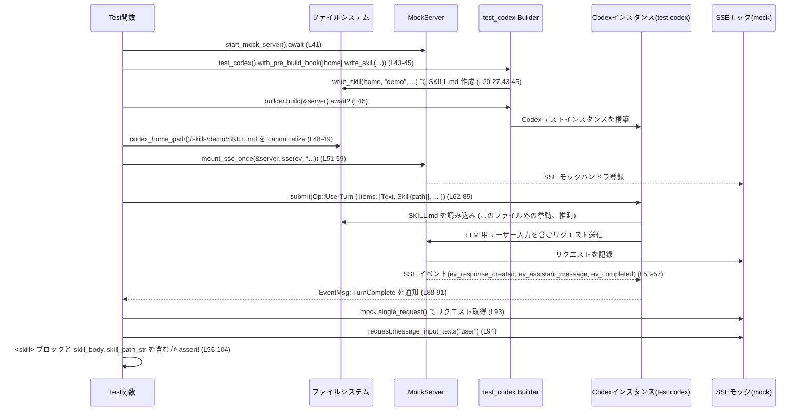

# core/tests/suite/skills.rs コード解説

> 注: 行番号はこの回答内で数えたものです。実際のリポジトリと多少ずれる可能性があります。

---

## 0. ざっくり一言

Codex の「スキル」機能について、

- スキルファイル（`SKILL.md`）の読み込み結果が LLM へのユーザー入力にどう反映されるか
- 壊れたスキルのロードエラーがどのように通知されるか
- 組み込みシステムスキルがどのようにインストール・列挙されるか

を検証する **非 Windows 環境向けの非同期統合テスト**を集めたモジュールです（`#![cfg(not(target_os = "windows"))]`, `#[tokio::test]`、core/tests/suite/skills.rs:L1,37,109,163）。

---

## 1. このモジュールの役割

### 1.1 概要

このモジュールは Codex のスキル周りの振る舞いをテストします。

- ユーザーターンで明示的に指定したスキルが、LLM へのプロンプトに `<skill>` ブロックとして含まれることの検証  
  （`user_turn_includes_skill_instructions`, core/tests/suite/skills.rs:L37-107）。
- YAML として不正な `SKILL.md` を持つスキルが、`ListSkills` 応答で通常のスキル一覧から除外されつつ、エラー一覧に現れることの検証  
  （`skill_load_errors_surface_in_session_configured`, L109-161）。
- 組み込みシステムスキル（例: `"skill-creator"`）が Codex ホームディレクトリ配下にインストールされ、`ListSkills` で `SkillScope::System` として列挙されることの検証  
  （`list_skills_includes_system_cache_entries`, L163-227）。

### 1.2 アーキテクチャ内での位置づけ

このファイル自体は「テストスイートの 1 モジュール」であり、本体ロジックは他クレートにあります。

- Codex 本体・プロトコル: `codex_protocol`, `test.codex`（L5-8,16,61-85,121-125,191-195）
- テスト支援: `core_test_support::*`（SSE モックサーバ、イベント待機、テスト用 Codex インスタンスなど, L9-16,41,51-59,88-91,113,121-134,169-177,191-204）
- ファイルシステム: `std::fs`, `std::path::Path`（L17-18,20-27,29-35,48-49,115-117,179-185）

Mermaid での依存関係図は次のとおりです。

```mermaid
graph TD
    %% skills.rs 全体 (L1-227)
    A[skills.rs<br/>テストモジュール] --> B[codex_protocol<br/>Op, AskForApproval,<br/>SandboxPolicy, UserInput]
    A --> C[core_test_support::test_codex<br/>test_codex()]
    A --> D[core_test_support::responses<br/>mount_sse_once, sse,<br/>ev_* イベント]
    A --> E[core_test_support::wait_*<br/>イベント待機ユーティリティ]
    A --> F[core_test_support::skip_if_no_network]
    A --> G[std::fs / std::path::Path]
    C --> H[Codex インスタンス<br/>test.codex]
    H --> B
```

### 1.3 設計上のポイント

- **テスト専用モジュール**  
  - 冒頭で `#![allow(clippy::unwrap_used, ...)]` とし、`unwrap()` を許容しています（L2,22,25,116,117）。  
  - `cfg(not(target_os = "windows"))` により Windows ではコンパイル／実行されません（L1）。
- **非同期・並行実行**  
  - 3 つのテストはいずれも `#[tokio::test(flavor = "multi_thread", worker_threads = 2)]` で定義され、Tokio のマルチスレッドランタイム上で実行されます（L37,109,163）。
  - このファイル内では明示的なスレッド共有データ構造（`Arc`, `Mutex` など）は使っておらず、並行性は主に Codex 本体とモックサーバ側に委ねられています。
- **I/O とエラーハンドリング**  
  - テスト関数は `anyhow::Result<()>` を返す形で定義され、非テストの失敗は `?` で上位（テストランナー）に伝播します（L38,110,164）。
  - 一部のファイル操作は `unwrap()` によってパニックベースで扱われます（L22,25,116,117）。テストコードであるため明示的に許容されています。
- **ネットワーク依存のテストのスキップ**  
  - 冒頭で `skip_if_no_network!(Ok(()));` を呼び出し、ネットワークが利用できない環境ではテストをスキップする意図と推測されます（L39,111,165）。  
    （マクロ定義はこのファイルには無いため、挙動は命名からの推測です。）

---

## 2. 主要な機能一覧

このファイル内で定義される主な関数は以下のとおりです。

- `write_skill`: テスト用のスキルディレクトリと `SKILL.md` を生成するヘルパー（L20-27）。
- `system_skill_md_path`: 組み込みシステムスキルの `SKILL.md` へのパスを組み立てるヘルパー（L29-35）。
- `user_turn_includes_skill_instructions`: ユーザーターンに指定したスキルの情報が、LLM へのユーザー入力に含まれることを検証する非同期テスト（L37-107）。
- `skill_load_errors_surface_in_session_configured`: 壊れたスキルのロードエラーが `ListSkillsResponse` に反映されることを検証する非同期テスト（L109-161）。
- `list_skills_includes_system_cache_entries`: 組み込みシステムスキルがインストールされ、`ListSkills` の結果に `SkillScope::System` として含まれることを検証する非同期テスト（L163-227）。

---

## 3. 公開 API と詳細解説

### 3.1 コンポーネント一覧（関数）

| 名前 | 種別 | 役割 / 用途 | 戻り値 | 行範囲 |
|------|------|-------------|--------|--------|
| `write_skill` | 同期ヘルパー関数 | `home/skills/{name}/SKILL.md` を作成し、指定されたメタデータと本文を書き込む | `PathBuf` | core/tests/suite/skills.rs:L20-27 |
| `system_skill_md_path` | 同期ヘルパー関数 | システムスキル `{home}/skills/.system/{name}/SKILL.md` へのパスを組み立てる | `PathBuf` | L29-35 |
| `user_turn_includes_skill_instructions` | 非同期テスト関数 | `Op::UserTurn` 提出時に、スキル指定がユーザー入力テキストに `<skill>` ブロックとして含まれることを検証 | `anyhow::Result<()>` | L37-107 |
| `skill_load_errors_surface_in_session_configured` | 非同期テスト関数 | YAML 不正な `SKILL.md` を持つスキルが、一覧から除外されつつエラーとして報告されることを検証 | `anyhow::Result<()>` | L109-161 |
| `list_skills_includes_system_cache_entries` | 非同期テスト関数 | 組み込みシステムスキルが FS 上に展開され、`ListSkills` 応答に `SkillScope::System` として現れることを検証 | `anyhow::Result<()>` | L163-227 |

このファイル内で新たな構造体・列挙体は定義されておらず、型はすべて外部クレートまたは標準ライブラリからの利用です（L4-18）。

---

### 3.2 関数詳細

#### `write_skill(home: &Path, name: &str, description: &str, body: &str) -> std::path::PathBuf`

**概要**

`home/skills/{name}/SKILL.md` というディレクトリ構造を作り、YAML 風のメタデータと本文からなるスキルファイルを生成します（L20-27）。  
テスト内で擬似スキルを手軽に作るためのユーティリティです。

**引数**

| 引数名 | 型 | 説明 |
|--------|----|------|
| `home` | `&Path` | Codex ホームディレクトリのパス（テスト用）。 |
| `name` | `&str` | スキル名。ディレクトリ名としても使用されます（L21）。 |
| `description` | `&str` | スキルの説明。`SKILL.md` の YAML メタデータに書き込まれます（L23）。 |
| `body` | `&str` | スキル本文。メタデータの下にプレーンテキストとして書き込まれます（L23）。 |

**戻り値**

- 作成した `SKILL.md` のパス（`PathBuf`）。`home/skills/{name}/SKILL.md` に相当します（L21,24,26）。

**内部処理の流れ**

1. `home/skills/{name}` というディレクトリパスを構築する（L21）。
2. `fs::create_dir_all(&skill_dir).unwrap()` でディレクトリを作成する（既に存在していても成功する標準ライブラリの挙動）（L22）。
3. `format!` で YAML 風フロントマターと本文を含む文字列 `contents` を構築する（L23）。  
   形式:  

   ```text
   ---
   name: {name}
   description: {description}
   ---
   
   {body}
   ```

4. `skill_dir.join("SKILL.md")` でファイルパスを組み立てる（L24）。
5. `fs::write(&path, contents).unwrap()` でファイルを書き込む（L25）。
6. `path` を返す（L26）。

**Examples（使用例）**

テスト中での実際の利用例です（L43-45）。

```rust
// home はテスト用の Codex ホームディレクトリ
let skill_body = "skill body";                                      // スキル本文
let skill_path = write_skill(home, "demo", "demo skill", skill_body);
// => {home}/skills/demo/SKILL.md が作成され、その PathBuf が返る
```

**Errors / Panics**

- `fs::create_dir_all` または `fs::write` が失敗した場合、`unwrap()` により **panic** します（L22,25）。
  - テストコードのため例外的状況を即座に失敗として扱う前提です。
- `Result` 型は返しておらず、I/O エラーを呼び出し元でハンドルすることはできません。

**Edge cases（エッジケース）**

- `name` に OS が許容しない文字が含まれている場合: `create_dir_all` または `write` が失敗し、panic します（L22,25）。
- `body` が空文字列でも、そのまま空本文を持つ `SKILL.md` が作成されます（`format!` のロジックから推測, L23）。
- 既に同名ファイルが存在する場合、`fs::write` により上書きされます（標準ライブラリの仕様に基づく）。

**使用上の注意点**

- 本関数はテスト用であり、I/O エラーを recover 可能な形では扱いません。実運用コードでの利用には不向きです。
- Windows パス区切りとの違いなどは呼び出し側で配慮する必要がありますが、このファイル自体は Windows ではビルドされません（L1）。

---

#### `system_skill_md_path(home: impl AsRef<Path>, name: &str) -> std::path::PathBuf`

**概要**

組み込みシステムスキルの `SKILL.md` の配置場所を表すパス  
`{home}/skills/.system/{name}/SKILL.md` を組み立てるヘルパーです（L29-35）。

**引数**

| 引数名 | 型 | 説明 |
|--------|----|------|
| `home` | `impl AsRef<Path>` | Codex ホームディレクトリを表すパス互換型。所有/借用どちらも受け取れます（L29）。 |
| `name` | `&str` | システムスキル名（L29,33）。 |

**戻り値**

- 組み立てた `SKILL.md` のパス（`PathBuf`）。階層は `home/skills/.system/{name}/SKILL.md`（L30-34）。

**内部処理の流れ**

1. `home.as_ref()` で `&Path` に変換する（L30）。
2. `.join("skills").join(".system").join(name)` と段階的にディレクトリを連結する（L31-33）。
3. 最後に `.join("SKILL.md")` でファイル名を付加する（L34）。

**Examples（使用例）**

システムスキルの存在確認に使われます（L171-175,179-183）。

```rust
const SYSTEM_SKILL_NAME: &str = "skill-creator";

let system_skill_path = system_skill_md_path(home, SYSTEM_SKILL_NAME);
// => home/skills/.system/skill-creator/SKILL.md へのパス

assert!(!system_skill_path.exists());  // インストール前の事前確認
```

**Errors / Panics**

- パスの組み立て自体は panic を起こす要素がありません。

**Edge cases**

- `name` が空文字列の場合でも `.../.system//SKILL.md` というパスが返ります（L33）。そのようなケースが有効かどうかは呼び出し側の責務です。

**使用上の注意点**

- この関数は純粋にパスを組み立てるだけであり、実際にファイルが存在するかどうかは別途 `exists()` や `read_to_string` などで検証しています（L171-175,179-185）。
- Windows ではこのファイルがコンパイルされないため、パス区切りの違いによる問題はテストとして表面化しません（L1）。

---

#### `user_turn_includes_skill_instructions() -> Result<()>`

（実際のシグネチャは `async fn ... -> Result<()>` です, L37-38）

**概要**

ユーザーが `Op::UserTurn` に `UserInput::Skill` を含めて送信した場合、

- スキルの `<name>`、`<path>`、スキルファイル本文（`skill_body`）、
- 実際のファイルパス（`skill_path_str`）

を含む `<skill>` ブロックが LLM へのユーザー入力テキストに含まれることを検証する非同期テストです（L51-59,93-104）。

**引数**

- テスト関数のため、外部から引数は取りません（L38）。

**戻り値**

- `anyhow::Result<()>`（L38）。  
  - 途中の I/O や Codex 操作でエラーが発生すると `Err` を返し、テストは失敗扱いになります（`?` 演算子の利用, L46,49,85）。

**内部処理の流れ（アルゴリズム）**

1. ネットワークが利用可能かを `skip_if_no_network!(Ok(()));` でチェックし、利用できない場合はスキップする挙動が想定されます（L39）。
2. モックサーバを起動する（`start_mock_server().await`, L41）。
3. テスト用 Codex ビルダーを作成し、`with_pre_build_hook` でホームディレクトリに `demo` スキルを作成するフックを設定する（`write_skill` 呼び出し, L43-45）。
4. ビルダーから `test` コンテキスト（`test.codex`, `test.codex_home_path()`, `test.cwd_path()` などを含むと推測される）を構築する（L46）。
5. 生成された `skills/demo/SKILL.md` へのパスを作り、`canonicalize` で絶対パスに解決する（L48-49）。
6. SSE モックをセットアップする（`mount_sse_once(&server, sse([...])).await`, L51-59）。  
   - モックはレスポンス作成 → アシスタントメッセージ → 完了イベントという固定シーケンスを返すよう構成されています（L53-57）。
7. セッション構成からモデルを取得し（`session_model`, L61）、`test.codex.submit(Op::UserTurn { ... })` でユーザーターンを送信する（L62-85）。
   - `items` には `Text` と `Skill` の 2 つの `UserInput` が含まれる（L64-72）。
   - `approval_policy` は `AskForApproval::Never`、`sandbox_policy` は `SandboxPolicy::DangerFullAccess` に設定されています（L76-79）。
8. `wait_for_event` で `EventMsg::TurnComplete(_)` が発生するまで待機し、ターンの完了を確認する（L88-91）。
9. モックサーバ側に送信されたリクエストを `mock.single_request()` で取得し、ユーザーロールの入力テキスト群を抽出する（L93-94）。
10. 各ユーザーテキストのうち、
    - `<skill>\n<name>demo</name>` を含み（L98）、
    - `<path>` タグを含み（L99）、
    - `skill_body` 文字列を含み（L100）、
    - `skill_path_str`（`skill_path.to_string_lossy()`）を含むものが一つ以上あることを `assert!` で検証する（L95-103）。
11. すべて成功したら `Ok(())` を返す（L106）。

**Examples（使用例）**

このテストの構造は、テストコードとしてそのまま再利用できます。簡略化例:

```rust
#[tokio::test(flavor = "multi_thread", worker_threads = 2)]
async fn example_user_turn_with_skill() -> anyhow::Result<()> {
    skip_if_no_network!(Ok(()));                               // ネットワークがなければスキップ（定義は別モジュール）

    let server = start_mock_server().await;                    // SSE モックサーバ起動
    let mut builder = test_codex().with_pre_build_hook(|home| {
        write_skill(home, "demo", "demo skill", "skill body"); // テスト用スキルをインストール
    });
    let test = builder.build(&server).await?;                  // Codex テストコンテキストを構築

    let skill_path = std::fs::canonicalize(
        test.codex_home_path().join("skills/demo/SKILL.md")
    )?;

    test.codex
        .submit(Op::UserTurn {
            items: vec![
                UserInput::Text {
                    text: "please use $demo".to_string(),
                    text_elements: Vec::new(),
                },
                UserInput::Skill {
                    name: "demo".to_string(),
                    path: skill_path.clone(),
                },
            ],
            cwd: test.cwd_path().to_path_buf(),
            approval_policy: AskForApproval::Never,
            sandbox_policy: SandboxPolicy::DangerFullAccess,
            // …他フィールドはテストから流用…
            ..Default::default() // 実際のコードには Default 実装は見えていないので pseudo code
        })
        .await?;

    Ok(())
}
```

> `Default::default()` は実際のコードには出てこない擬似コードですが、「他のフィールドも埋める必要がある」ことを示すために記載しています。

**Errors / Panics**

- `builder.build(&server).await?` や `canonicalize`、`submit` などが `Err` を返すと、`?` によりテストは `Err` で終了します（L46,49,85）。
- モックサーバへのリクエスト取得や `message_input_texts` でパニックが起きる可能性は、このファイルからは分かりません（L93-94）。  
  定義は `core_test_support` 側にあります。
- アサーションが失敗した場合、`assert!` によってテストは panic します（L96-104）。

**Edge cases**

- スキルファイルの内容が予期せぬ形式になった場合でも、このテストは「`skill_body` 文字列が含まれているか」のみを検証しています（L42,100）。  
  メタデータ部分の扱いはテストされていません。
- `UserInput::Skill` の `path` が存在しない場所を指す場合の挙動（例: ファイルが削除されている）は、このテストではカバーしていません。

**使用上の注意点**

- `SandboxPolicy::DangerFullAccess` を使用しているため、本来のアプリケーションコードで同じポリシーを使う場合にはセキュリティ面の配慮が必要です（L78）。  
  このファイルではテスト用のため詳細な制約は読み取れません。
- パス比較用に `canonicalize` を使っている点から、テスト間でのパス表現の揺らぎ（相対/絶対、シンボリックリンクなど）に注意していることが分かります（L49,95-101）。

---

#### `skill_load_errors_surface_in_session_configured() -> Result<()>`

**概要**

不正な YAML コンテンツ `not yaml` を含む `skills/broken/SKILL.md` を作成し、`Op::ListSkills` の結果から

- この壊れたスキルが通常のスキル一覧 `skills` には現れないこと、
- エラー一覧 `errors` に 1 件として現れ、その `path` が当該ファイルを指していること

を検証する非同期テストです（L113-118,136-158）。

**内部処理の流れ**

1. ネットワーク利用可能性を `skip_if_no_network!(Ok(()));` で確認（L111）。
2. モックサーバを起動（L113）。
3. `with_pre_build_hook` で `skills/broken/SKILL.md` を作るフックを設定（L114-118）。
   - ディレクトリ `skills/broken` を作成（L115-116）。
   - 中身が `not yaml` の `SKILL.md` を作成（L117）。
4. ビルダーから `test` コンテキストを構築（L119）。
5. `test.codex.submit(Op::ListSkills { ... })` を呼び出し、スキル一覧取得を要求（L121-125）。
6. `wait_for_event_match` で `EventMsg::ListSkillsResponse(response)` が来るまで待機し、`response` を取り出す（L127-134）。
7. `response.skills` から、現在の `cwd` に対応するエントリを探し、その `skills` と `errors` をタプルとして取得（L136-142）。
8. 次を検証（L144-158）。
   - `skills` の各要素について、その `path` が `"skills/broken/SKILL.md"` で終わらないこと（L145-151）。
   - `errors.len() == 1` であること（L153）。
   - `errors[0].path` が `"skills/broken/SKILL.md"` で終わること（L154-157）。
9. すべて成功したら `Ok(())` を返す（L160）。

**Errors / Panics**

- ビルドや `submit`、イベント待機が `Err` を返すと `?` によりテストが `Err` で終了します（L119,126,134）。
- `skills` や `errors` の抽出時に `unwrap_or_default()` を使っているため、該当する `cwd` が存在しない場合は空のベクタが返ります（L141-142）。
- `errors[0]` のインデックスアクセスは、`errors.len() == 1` をアサートした直後に行われており（L153-155）、アサーションが失敗すればそこで panic します。

**Edge cases**

- `errors` が 0 件のとき: `assert_eq!(errors.len(), 1, ...)` によりテストが失敗します（L153）。
- `response.skills` に `cwd` に対応するエントリがない場合: `(skills, errors)` はともに空になり、  
  - `skills.iter().all(...ends_with("broken/SKILL.md"))` は vacuously `true` となるため、この条件だけでは失敗しません（L145-151）。
  - その後 `errors.len() == 1` によって失敗します（L153）。
- Windows 環境では `Path` 表現にバックスラッシュが含まれますが、このテストは Unix 風の `skills/broken/SKILL.md` 末尾で比較しているため、本来ならば Windows で失敗し得ます。  
  しかし `cfg(not(target_os = "windows"))` により Windows ではコンパイルされません（L1,146-150,156-157）。

**使用上の注意点**

- 「壊れたスキルがスキル一覧に含まれない」という仕様を前提にしているため、将来仕様変更で「壊れたスキルも一覧表示しつつ UI でマーキングする」等の挙動に変わると、このテストは意図的に失敗します。
- パス比較に `ends_with("skills/broken/SKILL.md")` を使っており、絶対パス／相対パスの扱いは `to_string_lossy()` の結果に依存します（L147-149,156-157）。

---

#### `list_skills_includes_system_cache_entries() -> Result<()>`

**概要**

組み込みシステムスキル `"skill-creator"` について、

1. Codex 初期化前には `{home}/skills/.system/skill-creator/SKILL.md` が存在しないこと（L170-176）。
2. Codex 初期化後には同ファイルが作成され、`name: skill-creator` 行を含むこと（L179-189）。
3. `Op::ListSkills { force_reload: true }` を呼び出すと、現在の `cwd` のスキル一覧に `"skill-creator"` が含まれ、その:
   - `scope` が `SkillScope::System` であること（L214-218）。
   - `path` が `/skills/.system/skill-creator/SKILL.md` で終わること（パス区切りを `/` に正規化した上で検証, L219-223）。

を検証する非同期テストです。

**内部処理の流れ**

1. ネットワーク確認（L165）。
2. `SYSTEM_SKILL_NAME` を `"skill-creator"` として定義（L167）。
3. モックサーバを起動し、`with_pre_build_hook` で Codex 初期化前の状態でシステムスキルパスが存在しないことを `assert!` で確認（L169-176）。
4. `builder.build(&server).await?` で Codex テストコンテキストを構築（L177）。
5. 再度 `system_skill_md_path` でシステムスキルパスを組み立て、今度は存在すること・内容に `name: skill-creator` が含まれることを検証（L179-188）。
6. `test.codex.submit(Op::ListSkills { force_reload: true, .. })` でスキル一覧の再読み込みを要求（L191-195）。
7. `wait_for_event_match` で `ListSkillsResponse` を受け取る（L197-204）。
8. 現在の `cwd` に対応する `(skills, _errors)` を取り出す（L206-212）。
9. `skills` の中から `name == "skill-creator"` の要素を探し、次のことを検証（L214-223）。
   - 見つからない場合は `expect("expected system skill to be present")` で panic（L216-217）。
   - `scope == SkillScope::System` であること（L218）。
   - `path` を文字列化し、バックスラッシュを `/` に置換した上で `/skills/.system/skill-creator/SKILL.md` で終わること（L219-223）。

**Errors / Panics**

- 初期状態で `system_skill_path.exists()` が真だった場合、`assert!(!system_skill_path.exists(), ...)` により panic（L171-175）。
- Codex 初期化後に `system_skill_path.exists()` が偽の場合も `assert!` で panic（L179-183）。
- スキル一覧に `"skill-creator"` が含まれない場合は `expect` により panic（L214-217）。
- 上記以外の I/O や Codex 操作の失敗は `?` によりテスト失敗になります（L177,185,196,204）。

**Edge cases**

- `force_reload: true` を指定しているため、既存キャッシュを使わずに再スキャンする仕様を前提にしています（L192,194）。  
  キャッシュ戦略が変わった場合、テストの意味合いが変化する可能性があります。
- Windows の場合、`Path` の文字列表現は `\` 区切りですが、`replace('\\', "/")` により `/` 区切りに正規化してから `ends_with` を行っているため、このテスト単体では OS に依存しない形でパス末尾を比較しています（L219-220）。  
  ただしファイル全体は `cfg(not(target_os = "windows"))` でガードされており、実際には Windows でコンパイルされません（L1）。

**使用上の注意点**

- 「組み込みスキルは初期化時にインストールされる」という挙動を前提としており、将来「初回 `ListSkills` 時にオンデマンドインストール」などの仕様になると、このテストは調整が必要です。
- `system_skill_contents` の検証は `name:` 行のみで、内容の完全性（説明や本文など）はチェックしていません（L185-188）。

---

### 3.3 その他の関数

このファイルには上記 5 関数のみが定義されており、補助的な小さなラッパー関数やマクロ定義はありません。  
`skip_if_no_network!` などのマクロは他モジュールで定義されています（L39,111,165）。

---

## 4. データフロー

ここでは、代表的なシナリオとして  
`user_turn_includes_skill_instructions` のデータフローを示します（L37-107）。

### 4.1 処理の要点

- テストコードが `write_skill` で作成した `SKILL.md` を Codex が読み込み、その内容をユーザー入力テキストに変換すると想定されています。
- Codex は HTTP/SSE ベースのモックサーバにリクエストを送り、そのリクエストボディの中に `<skill>` ブロックとしてスキル情報を埋め込みます（L51-59,93-104）。
- テストはモックサーバが記録したリクエストからユーザーメッセージを抽出し、期待する文字列が含まれているかを検証します（L93-104）。

### 4.2 シーケンス図



> SKILL.md を Codex がどう読むかの詳細はこのファイルからは分かりませんが、  
> テストが `skill_body` の出現を検証していることから、何らかの形で本文が転写される仕様であると推測されます（L42,100）。

---

## 5. 使い方（How to Use）

ここでは「このテストモジュール内のパターンを、他のテストを書いたり挙動を理解したりする際にどう使うか」という観点で説明します。

### 5.1 基本的な使用方法

典型的なフローは次の通りです。

1. ネットワーク条件チェック（`skip_if_no_network!`）。
2. `start_mock_server` でモックサーバを起動。
3. `test_codex().with_pre_build_hook(...)` でテスト用 Codex インスタンスの初期状態（スキルファイルなど）をセットアップ。
4. `builder.build(&server).await?` で Codex インスタンスを構築。
5. `submit(Op::UserTurn{...})` または `submit(Op::ListSkills{...})` を呼び出し。
6. `wait_for_event` / `wait_for_event_match` で応答イベントを待機。
7. イベント内容やモックサーバの受信リクエストを検証。

このパターンは 3 つのテストすべてで共通しています（L39-46,113-121,169-177,191-198）。

### 5.2 よくある使用パターン

1. **スキルファイルを事前に注入してから Codex を起動する**

   - `with_pre_build_hook` にクロージャを渡し、その中で `write_skill` や `fs::write` を用いて `skills/` ディレクトリを構築します（L43-45,114-118,170-176）。
   - こうすることで、Codex が起動時にスキルをスキャンする挙動をテストできます。

2. **`ListSkills` の結果から特定の `cwd` のみを抽出する**

   ```rust
   let response = core_test_support::wait_for_event_match(
       test.codex.as_ref(),
       |event| match event {
           codex_protocol::protocol::EventMsg::ListSkillsResponse(response) => {
               Some(response.clone())
           }
           _ => None,
       },
   ).await;                                              // L127-134,197-204

   let cwd = test.cwd_path();                            // L136,206
   let (skills, errors) = response
       .skills
       .iter()
       .find(|entry| entry.cwd.as_path() == cwd)         // 現在の cwd に対応するエントリ
       .map(|entry| (entry.skills.clone(), entry.errors.clone()))
       .unwrap_or_default();                             // 見つからなければ空 (L137-142,207-212)
   ```

3. **パス末尾のみでファイルを識別する**

   - `to_string_lossy()` + `ends_with("skills/.../SKILL.md")` でパス末尾を比較し、  
     絶対パスなどの違いを吸収しています（L147-149,156-157,220-223）。
   - Windows 互換性が必要な場合は、`replace('\\', "/")` のような前処理を加えるパターンも見られます（L219-220）。

### 5.3 よくある間違い（想定されるもの）

このファイルから推測できる、起こりやすそうな誤用例と正しい例です。

```rust
// 誤り例: パスの区切り文字の違いを考慮せずに ends_with を行う
let path_str = skill.path.to_string_lossy();
assert!(path_str.ends_with("skills/.system/skill-creator/SKILL.md"));

// 正しい例: Windows / Unix どちらでも動くよう、区切り文字を正規化してから比較する
let path_str = skill.path.to_string_lossy().replace('\\', "/");      // L219
assert!(path_str.ends_with("/skills/.system/skill-creator/SKILL.md"));// L220-223
```

```rust
// 誤り例: ListSkillsResponse から目的の cwd のエントリを特定しない
let skills = response.skills[0].skills.clone(); // cwd が期待と異なる可能性

// 正しい例: cwd に基づいてエントリを選択する
let cwd = test.cwd_path();
let (skills, errors) = response
    .skills
    .iter()
    .find(|entry| entry.cwd.as_path() == cwd)            // L140,210
    .map(|entry| (entry.skills.clone(), entry.errors.clone()))
    .unwrap_or_default();
```

### 5.4 使用上の注意点（まとめ）

- **ネットワーク依存性**  
  - `start_mock_server` を使うテストはネットワークやポートの利用に依存している可能性があります。`skip_if_no_network!` を付けることで CI 環境の違いに対応しています（L39,111,165）。
- **panic ベースの失敗処理**  
  - `unwrap()` や `assert!`、`expect` を多用しており、I/O エラーや仕様違反は即座に panic として表面化します（L22,25,116,117,145-158,171-183,214-223）。  
    これはテストコードとしては妥当ですが、実運用ロジックに同じパターンを持ち込むと安全性に影響します。
- **並行性**  
  - テストは Tokio のマルチスレッドランタイム上で実行されますが、このファイル内で明示的なスレッド共有状態は扱っていません（L37,109,163）。  
    並行性に起因する問題は主に Codex 本体や `core_test_support` の実装側で扱われていると考えられます（ただし、このファイルからは詳細は分かりません）。

---

## 6. 変更の仕方（How to Modify）

### 6.1 新しいスキル関連のテストを追加する場合

1. **前提のセットアップ場所**

   - 新たなスキルファイルや設定を追加したい場合は、既存テストと同様に `with_pre_build_hook` を使うとホームディレクトリへの書き込みを 1 箇所にまとめられます（L43-45,114-118,170-176）。
   - `write_skill` を再利用すれば、YAML ヘッダ付きの `SKILL.md` を簡単に作成できます（L20-27）。

2. **Codex への操作**

   - スキルの動作を確認したい場合は `Op::UserTurn` を、スキルの発見・エラーを確認したい場合は `Op::ListSkills` を用いるパターンが既にあります（L63-85,121-125,191-195）。
   - `SandboxPolicy` や `AskForApproval` の値はテストの目的に応じて調整できます（L76-79）。

3. **結果の検証**

   - LLM へのリクエスト内容を検証したい場合は、`mount_sse_once` と `mock.single_request().message_input_texts("user")` の組を流用します（L51-59,93-94）。
   - スキルロード結果を検証したい場合は、`ListSkillsResponse` から `cwd` 別の `skills`/`errors` を取得するパターンを再利用します（L136-142,206-212）。

### 6.2 既存のテストを変更する場合の注意点

- **仕様との契約（Contract）**

  - `user_turn_includes_skill_instructions` は「ユーザー入力に `<skill>` ブロックを含める」というフォーマット仕様に強く依存しています（L96-102）。  
    プロンプトフォーマットを変更する際には、このテストを仕様に合わせて更新する必要があります。
  - `skill_load_errors_surface_in_session_configured` は「壊れたスキルは一覧から除外され、エラー一覧にのみ出る」という挙動を前提にしています（L144-158）。
  - `list_skills_includes_system_cache_entries` は「組み込みスキルが FS 上に展開され、ListSkills に `SkillScope::System` として現れる」という契約を表現しています（L179-183,214-219）。

- **影響範囲の確認**

  - これらのテストが失敗する場合、多くは Codex のスキルロード／列挙／プロンプト生成ロジックに変更があったことを示します。  
    該当ロジックがどのファイルにあるかはこのファイルからは分かりませんが、`codex_protocol::protocol::Op` や `SkillScope` の定義を手がかりに探索できます（L5-7,218）。

- **パス表現**

  - パス比較に `ends_with("skills/.../SKILL.md")` を使っている箇所を変更する際は、絶対パスや OS ごとの違いに注意する必要があります（L147-149,156-157,220-223）。

---

## 7. 関連ファイル・モジュール

このモジュールと密接に関係するコンポーネントは以下のとおりです。

| パス / モジュール | 役割 / 関係 |
|-------------------|------------|
| `core_test_support::test_codex` | `test_codex()` を提供し、テスト用 Codex インスタンスとホームディレクトリ・作業ディレクトリ等を構築します（L16,43-46,113-120,169-177）。定義場所の具体的なファイル名はこのチャンクからは不明です。 |
| `core_test_support::responses` | `start_mock_server`, `mount_sse_once`, `sse`, `ev_response_created`, `ev_assistant_message`, `ev_completed` など、SSE モックサーバとイベント生成ユーティリティを提供します（L9-14,51-59）。 |
| `core_test_support::{wait_for_event, wait_for_event_match}` | Codex からの `EventMsg` を待機・フィルタするユーティリティ関数群です（L88-91,127-134,197-204）。 |
| `core_test_support::skip_if_no_network` | ネットワーク環境に応じてテストをスキップするためのマクロを提供します（L15,39,111,165）。定義の詳細はこのチャンクには現れません。 |
| `codex_protocol::protocol::{Op, AskForApproval, SandboxPolicy, EventMsg, SkillScope}` | Codex との通信に用いる操作列挙体 `Op`、承認ポリシー、サンドボックスポリシー、イベントメッセージ型、スキルのスコープなどを定義します（L5-7,63,76-79,88-90,121-125,129-131,192-195,199-201,218）。 |
| `codex_protocol::user_input::UserInput` | `Op::UserTurn` で使用されるユーザー入力のバリアント（テキスト／スキルなど）を定義します（L8,64-72）。 |
| `std::fs`, `std::path::Path` | テスト用のスキルファイル・ディレクトリ操作に使用されています（L17-18,20-27,29-35,48-49,115-117,179-185）。 |

---

以上が `core/tests/suite/skills.rs` の客観的な構造・データフロー・テスト契約の整理です。このファイルはスキル機能の仕様をテストとして明文化しているため、スキル周りの挙動を理解・変更する際のリファレンスとして利用できます。
