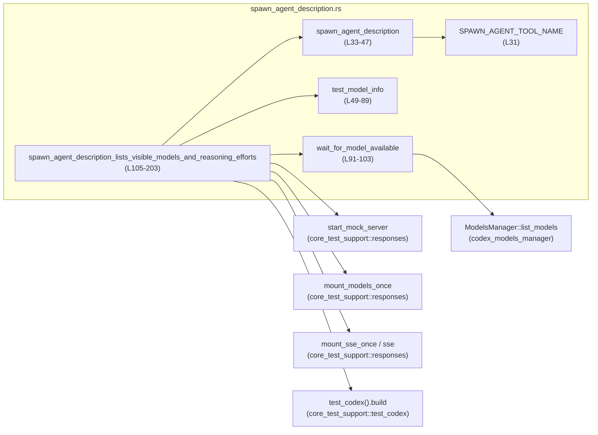
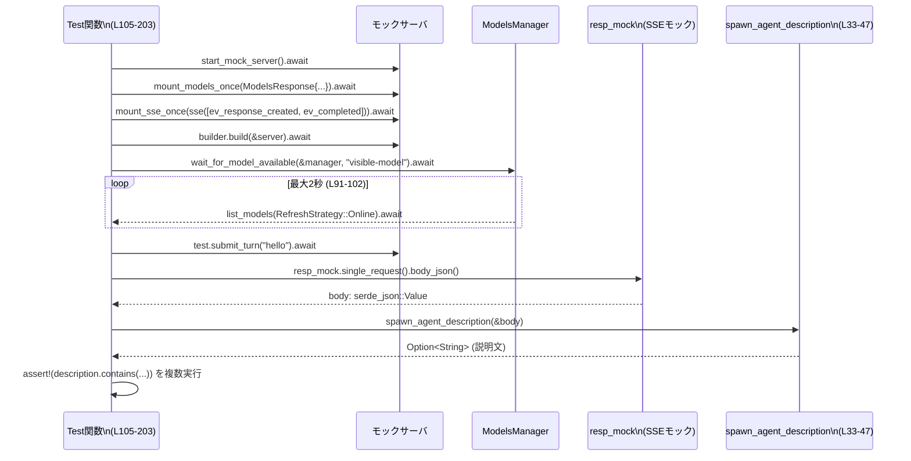

# core/tests/suite/spawn_agent_description.rs

## 0. ざっくり一言

`spawn_agent` というツールの説明文が、  
「表示対象のモデル一覧と推論レベル」「使用許可条件（いつ sub-agent を使ってよいか）」を正しく含んでいるかを、モックサーバーと SSE を使って検証する非 Windows 向けの Tokio テストです。  
あわせて、その検証に使う小さなユーティリティ関数が定義されています。

---

## 1. このモジュールの役割

### 1.1 概要

- このテストモジュールは、`spawn_agent` ツールの **説明文の仕様** を検証するために存在します。
- モデル管理 (`ModelsManager`) とモック HTTP/SSE サーバを使い、
  - 「一覧表示されるモデルのみを列挙しているか」
  - 「デフォルト推論レベルと利用可能な推論プリセットが記載されているか」
  - 「spawn_agent を呼び出してよい条件・ダメな条件が説明されているか」
  を確認します（`spawn_agent_description_lists_visible_models_and_reasoning_efforts` テスト、`core/tests/suite/spawn_agent_description.rs:L105-203`）。

### 1.2 アーキテクチャ内での位置づけ

このテストファイルは、core テスト用サポートモジュールと Codex のモデル管理コンポーネントに依存しています。

- モックサーバ (`start_mock_server`, `mount_models_once`, `mount_sse_once`) を使って外部 API をシミュレート
- `test_codex` ビルダーと `ModelsManager` を通して、実際のスレッド/モデル管理に近い形でエンドツーエンドに検証
- レスポンスの JSON 本文から `spawn_agent` の説明文を抽出するユーティリティ `spawn_agent_description` を、このテスト内でのみ使用

依存関係の概略は次の通りです。

このチャンク対象コード: `core/tests/suite/spawn_agent_description.rs:L31-203`



### 1.3 設計上のポイント

- **責務の分割**  
  - JSON から `spawn_agent` の説明文を取り出す処理は `spawn_agent_description` に分離（`L33-47`）。
  - モデル情報のダミー値作成は `test_model_info` に分離（`L49-89`）。
  - モデルが利用可能になるまで待つ非同期待機は `wait_for_model_available` に分離（`L91-103`）。
- **状態管理**  
  - このファイル内で保持する長期的な状態はなく、必要な状態は `ModelsManager` や `test_codex` など外部コンポーネントに委譲しています。
- **エラーハンドリング方針**  
  - テスト本体は `anyhow::Result<()>` を返し、失敗は `?` 演算子か `assert!` / `expect` / `panic!` で検出します（`L105-203`）。
  - `wait_for_model_available` は、2 秒以内にモデルが見つからない場合に `panic!` で失敗させます（`L91-103`）。
- **並行性**  
  - Tokio のマルチスレッドランタイム上で実行される非同期テストです（`#[tokio::test(flavor = "multi_thread", worker_threads = 2)]`, `L105`）。
  - モデルマネージャは `Arc<ModelsManager>` で共有され、`list_models` を非同期にポーリングします（`L91-103`）。

---

## 2. 主要な機能一覧

- `spawn_agent_description`: SSE レスポンス JSON から `spawn_agent` ツールの説明文を抽出するユーティリティ関数です（`L33-47`）。
- `test_model_info`: テスト用に `ModelInfo` 構造体のインスタンスを組み立てるヘルパー関数です（`L49-89`）。
- `wait_for_model_available`: 指定したモデル slug が `ModelsManager` 上に現れるまで、最大 2 秒ポーリングして待機する非同期関数です（`L91-103`）。
- `spawn_agent_description_lists_visible_models_and_reasoning_efforts`: 上記のモック環境とヘルパーを組み合わせて、`spawn_agent` 説明文の内容を検証する Tokio テストです（`L105-203`）。

---

## 3. 公開 API と詳細解説

### 3.1 型一覧（このファイルで定義される型）

このファイル内で新たに定義される構造体・列挙体はありません。

#### 3.1.1 関数・定数インベントリー

| 名称 | 種別 | シグネチャ / 型 | 役割 | 定義位置 |
|------|------|-----------------|------|----------|
| `SPAWN_AGENT_TOOL_NAME` | 定数 | `&'static str` | 抽出対象ツール名 `"spawn_agent"` を保持 | `core/tests/suite/spawn_agent_description.rs:L31-31` |
| `spawn_agent_description` | 関数 | `fn(&Value) -> Option<String>` | JSON から `spawn_agent` ツール説明文を取り出す | `core/tests/suite/spawn_agent_description.rs:L33-47` |
| `test_model_info` | 関数 | `fn(&str, &str, &str, ModelVisibility, ReasoningEffort, Vec<ReasoningEffortPreset>) -> ModelInfo` | テスト用 `ModelInfo` 生成 | `core/tests/suite/spawn_agent_description.rs:L49-89` |
| `wait_for_model_available` | 非同期関数 | `async fn(&Arc<ModelsManager>, &str)` | モデル slug が利用可能になるまでポーリング | `core/tests/suite/spawn_agent_description.rs:L91-103` |
| `spawn_agent_description_lists_visible_models_and_reasoning_efforts` | 非同期テスト関数 | `async fn() -> Result<()>` | `spawn_agent` 説明文の仕様を E2E で検証 | `core/tests/suite/spawn_agent_description.rs:L105-203` |

#### 3.1.2 主要な外部コンポーネント（呼び出しのみ）

実装はこのチャンクには現れませんが、テストで重要な役割を持つ外部コンポーネントです。

| 名称 | 所属 | 用途 | 呼び出し位置 |
|------|------|------|--------------|
| `ModelsManager` | `codex_models_manager::manager` | モデル一覧取得 (`list_models`) に使用 | `core/tests/suite/spawn_agent_description.rs:L91-103` |
| `RefreshStrategy::Online` | 同上 | `list_models` 時にオンライン更新を要求 | `L94` |
| `test_codex` | `core_test_support::test_codex` | Codex テスト環境ビルダー | `L150` |
| `start_mock_server` | `core_test_support::responses` | モック HTTP/SSE サーバ起動 | `L107` |
| `mount_models_once` | 同上 | モデル一覧エンドポイントにレスポンスを登録 | `L108-143` |
| `mount_sse_once` / `sse` | 同上 | SSE ストリームレスポンスを登録 | `L144-148` |
| `ev_response_created` / `ev_completed` | 同上 | SSE イベントペイロード生成 | `L146` |
| `ModelsResponse`, `ModelInfo` 他 | `codex_protocol::openai_models` | モデルメタデータ表現 | `L10-17, L110-141` |

> これら外部コンポーネントの内部実装は、このチャンクには現れないため「不明」です。

---

### 3.2 関数詳細

#### `spawn_agent_description(body: &Value) -> Option<String>`

**概要**

- `serde_json::Value` で表現された JSON オブジェクトから、ツール一覧 `body["tools"]` を調べ、  
  ツール名 `"spawn_agent"` を持つ要素の `"description"` フィールドを `String` として取り出します（`L33-47`）。
- 対象が見つからない、または型が期待どおりでない場合は `None` を返します。

**引数**

| 引数名 | 型 | 説明 |
|--------|----|------|
| `body` | `&Value` | SSE レスポンスなどから得られる JSON 本文。少なくとも `tools` フィールドを含むことを期待します。 |

**戻り値**

- `Option<String>`  
  - `Some(description)` : `"spawn_agent"` ツールの `"description"` が文字列として取得できた場合。  
  - `None` : `tools` 配列が存在しない、`spawn_agent` ツールが存在しない、または `description` が文字列でない場合。

**内部処理の流れ（アルゴリズム）**

根拠: `core/tests/suite/spawn_agent_description.rs:L33-47`

1. `body.get("tools")` で `tools` フィールドを取得。
2. `Value::as_array` で `tools` が配列かどうかを確認し、配列スライス `&[Value]` を得る（配列以外なら `None`）。
3. `tools.iter().find_map(...)` で配列を走査し、最初に条件を満たすツールを探す。
   - 各 `tool` について `tool.get("name").and_then(Value::as_str)` を使い `"name"` が文字列 `"spawn_agent"` と一致するかチェック（`SPAWN_AGENT_TOOL_NAME` を使用）。
4. 一致したツールがあれば、その `tool.get("description")` を取得し、`Value::as_str` で文字列かどうかを確認。
5. 文字列であれば `str::to_string` して `Some(String)` を返し、適合するツールが 1 つも見つからなければ `None` を返す。

**Examples（使用例）**

`body` が次のような JSON の場合に説明文を取り出す例です（例示であり、このファイル外のコードです）。

```rust
use serde_json::Value; // このファイルでも利用している型

// 例: spawn_agent ツールを含む JSON
let body: Value = serde_json::json!({
    "tools": [
        { "name": "other_tool", "description": "Other tool" },
        {
            "name": "spawn_agent",
            "description": "Spawn specialized sub-agents."
        }
    ]
});

// 説明文を抽出
let desc = spawn_agent_description(&body);

assert_eq!(
    desc.as_deref(),
    Some("Spawn specialized sub-agents.")
);
```

**Errors / Panics**

- この関数自身は `panic!` を呼び出さず、`unwrap` や `expect` も使用していません。
- エラーは `Option::None` で表現されます。

**Edge cases（エッジケース）**

根拠: `core/tests/suite/spawn_agent_description.rs:L33-47`

- `body` に `tools` フィールドが存在しない / `null` の場合  
  → `body.get("tools")` が `None` を返し、そのまま `None`。
- `tools` が配列でない場合（オブジェクトや文字列など）  
  → `Value::as_array` が `None` を返し、そのまま `None`。
- `tools` 配列内に `"name": "spawn_agent"` を持つ要素が存在しない場合  
  → `find_map` により一致する要素が見つからず `None`。
- 該当ツールがあっても `"description"` フィールドが存在しない、または文字列以外の場合  
  → `Value::as_str` が `None` を返し、そのツールはスキップされ、他に該当要素がなければ `None`。
- `spawn_agent` ツールが複数存在する場合  
  → 最初に見つかった 1 件の `description` のみが返されます（`find_map` の仕様）。

**使用上の注意点**

- `body` の構造が期待と異なる場合は `None` が返るため、呼び出し側で `Option` を適切に扱う必要があります。
  - このファイルでは `expect("spawn_agent description should be present")` で `Some` であることを前提にしています（`L165-166`）。
- `SPAWN_AGENT_TOOL_NAME` の値が変わると、抽出対象も変わります（`L31`）。プロトコル側のツール名変更に注意が必要です。

---

#### `test_model_info(...) -> ModelInfo`

```rust
fn test_model_info(
    slug: &str,
    display_name: &str,
    description: &str,
    visibility: ModelVisibility,
    default_reasoning_level: ReasoningEffort,
    supported_reasoning_levels: Vec<ReasoningEffortPreset>,
) -> ModelInfo
```

**概要**

- `ModelInfo` 構造体のインスタンスを、テストで使いやすいように多くのフィールドを固定値で埋めつつ、  
  一部だけ引数から埋めるためのヘルパー関数です（`L49-89`）。

**引数**

| 引数名 | 型 | 説明 |
|--------|----|------|
| `slug` | `&str` | モデルの一意な識別子（例: `"visible-model"`） |
| `display_name` | `&str` | UI 等で表示されるモデル名 |
| `description` | `&str` | モデルの説明文 |
| `visibility` | `ModelVisibility` | 一覧表示可否 (`List` / `Hide` など) |
| `default_reasoning_level` | `ReasoningEffort` | デフォルトの推論レベル |
| `supported_reasoning_levels` | `Vec<ReasoningEffortPreset>` | 利用可能な推論レベルプリセット一覧 |

**戻り値**

- `ModelInfo`  
  - テスト用に各種フィールドが埋められた `ModelInfo` インスタンス。引数で与えた値以外は、固定のテスト向け値が設定されます（`L57-88`）。

**内部処理の流れ（アルゴリズム）**

根拠: `core/tests/suite/spawn_agent_description.rs:L57-88`

1. `ModelInfo` 構造体リテラルを生成し、以下のようにフィールドを設定する。
2. `slug`, `display_name`, `description` はそれぞれ `String` に変換して格納。
3. `default_reasoning_level` と `supported_reasoning_levels` フィールドを、引数から設定。
4. 残りのフィールドには、テスト向けに固定値を設定する。
   - `shell_type: ConfigShellToolType::ShellCommand`
   - `visibility`（引数）
   - `supported_in_api: true`
   - `input_modalities: default_input_modalities()`
   - など、コメント付きで定義されている `truncation_policy` 等も固定。

**Examples（使用例）**

このファイル内での利用例（簡略化）:

```rust
let visible_model = test_model_info(
    "visible-model",                        // slug
    "Visible Model",                        // display_name
    "Fast and capable",                    // description
    ModelVisibility::List,                  // visibility（一覧表示）
    ReasoningEffort::Medium,                // デフォルト推論レベル
    vec![
        ReasoningEffortPreset {
            effort: ReasoningEffort::Low,
            description: "Quick scan".to_string(),
        },
        ReasoningEffortPreset {
            effort: ReasoningEffort::High,
            description: "Deep dive".to_string(),
        },
    ],
);
```

根拠: `core/tests/suite/spawn_agent_description.rs:L112-128`

**Errors / Panics**

- この関数自身はエラー型を返さず、`panic!` を直接呼ぶこともありません。
- 内部で呼び出される `TruncationPolicyConfig::bytes` などが panic する可能性については、このチャンクには情報がないため「不明」です。

**Edge cases（エッジケース）**

- 文字列引数が空 (`""`) の場合でも、そのまま `String` に変換されて格納されます。
- `supported_reasoning_levels` が空ベクタの場合  
  → 空のリストとしてそのまま `ModelInfo` に設定されます。  
  それが許容されるかどうかは `ModelInfo` の利用側次第であり、このチャンクからは分かりません。

**使用上の注意点**

- このヘルパーはテスト用に多くのフィールドを固定値にしているため、実運用の `ModelInfo` と完全に同一ではない可能性があります。
- モデルの可視性 (`visibility`) によって `spawn_agent` 説明文への掲載有無が変わるため、値の指定には意味があります（`L112-139` と `L180-183` を参照）。

---

#### `wait_for_model_available(manager: &Arc<ModelsManager>, slug: &str)`

**概要**

- `ModelsManager` に対し、指定した `slug` を持つモデルが `list_models(RefreshStrategy::Online)` に含まれるようになるまで、最大 2 秒間ポーリングする非同期関数です（`L91-103`）。
- 2 秒経過しても見つからない場合は `panic!` でテストを失敗させます。

**引数**

| 引数名 | 型 | 説明 |
|--------|----|------|
| `manager` | `&Arc<ModelsManager>` | モデル一覧を取得するための共有モデルマネージャへの参照 |
| `slug` | `&str` | 待ちたいモデルの識別子（例: `"visible-model"`） |

**戻り値**

- 戻り値は `()`（暗黙）。  
  成功時は何も返さずに関数が完了します。  
  モデルが見つからない場合は `panic!` を起こしてスレッドがパニック状態になります。

**内部処理の流れ（アルゴリズム）**

根拠: `core/tests/suite/spawn_agent_description.rs:L91-103`

1. `Instant::now() + Duration::from_secs(2)` で締切時刻 `deadline` を計算。
2. 無限ループ `loop { ... }` に入る。
3. 各ループで `manager.list_models(RefreshStrategy::Online).await` を呼び出し、最新のモデル一覧を取得。
4. `available_models.iter().any(|model| model.model == slug)` で、slug が一致するモデルが存在するか確認。
   - 存在すれば `return` して関数終了。
5. `Instant::now() >= deadline` か確認し、締切を過ぎていれば
   - `panic!("timed out waiting for remote model {slug} to appear");` を発生させる（`L98-99`）。
6. 締切前であれば `sleep(Duration::from_millis(25)).await` で 25 ミリ秒待機し、ループ先頭に戻る。

**Examples（使用例）**

このファイル内での利用例:

```rust
let test = builder.build(&server).await?;
let models_manager = test.thread_manager.get_models_manager(); // 所有権は外部型

// Arc<ModelsManager> への参照を渡して、"visible-model" が現れるまで待つ
wait_for_model_available(&models_manager, "visible-model").await?;
```

根拠: `core/tests/suite/spawn_agent_description.rs:L159-160`  
（実際のコードでは `await` の結果は `()` で、`?` は付いていません。）

**Errors / Panics**

- モデルが 2 秒以内に見つからない場合、`panic!` が発生し、テストは異常終了します（`L98-99`）。
- `list_models` 自体のエラー処理はこのチャンクには現れません。`available_models` が直接ベクタとして利用されているため、`Result` ではなく成功前提の API であると読み取れます（`L94-95`）。

**Edge cases（エッジケース）**

- `slug` が存在しないモデル名の場合  
  → 2 秒経過後に必ず panic。
- `ModelsManager::list_models` の呼び出しが非常に遅い場合  
  → 25 ms 間隔という前提が崩れ、体感待ち時間は 2 秒より長くなる可能性がありますが、締切判定は `Instant::now()` で行われるため、2 秒を超えれば panic します。
- システムクロックの変更（大幅な後退など）があった場合  
  → `Instant` はモノトニックタイマであるため、通常のシステム時刻変更の影響は受けない想定です（Rust 標準ライブラリの仕様による）。

**使用上の注意点**

- この関数は **テスト用** の待機ヘルパーであり、失敗時は `panic!` で即座にテストを中断します。  
  本番コードでの利用には適していません。
- 固定の 2 秒タイムアウトと 25 ms ポーリング間隔は、このファイル内でのみ変更可能です。環境によってはモデルの準備が 2 秒を超えるとテストが不安定になる可能性があります。

---

#### `spawn_agent_description_lists_visible_models_and_reasoning_efforts() -> Result<()>`

```rust
#[tokio::test(flavor = "multi_thread", worker_threads = 2)]
async fn spawn_agent_description_lists_visible_models_and_reasoning_efforts() -> Result<()>
```

**概要**

- モックサーバとテスト用 Codex 環境を立ち上げ、`spawn_agent` ツールの説明文に関して次の仕様を検証するエンドツーエンドテストです（`L105-203`）。
  - **一覧表示されるモデルのみ** が説明文に含まれていること。
  - 各モデルの **デフォルト推論レベル** と **利用可能な推論プリセット** が説明に含まれていること。
  - 特定の **利用許可条件・禁止条件** に関する文言が含まれていること。

**引数・戻り値**

- 引数: なし（テスト関数のため）。
- 戻り値: `anyhow::Result<()>`
  - `Ok(())` : テストがすべて成功した場合。
  - `Err(e)` : モックサーバ起動や Codex ビルド、`submit_turn` などでエラーが起きた場合。  
    テストランナーはこれをテスト失敗として扱います。

**内部処理の流れ（アルゴリズム）**

根拠: `core/tests/suite/spawn_agent_description.rs:L105-203`

1. **モックサーバ起動**
   - `start_mock_server().await` を呼び出し、テスト用の HTTP/SSE サーバを起動（`L107`）。

2. **モデルリストエンドポイントの設定**
   - `mount_models_once(&server, ModelsResponse { models: vec![ ... ] }).await` を呼び出し（`L108-143`）、モックサーバに 2 つのモデルを登録。
     - `"visible-model"` : `ModelVisibility::List`、`ReasoningEffort::Medium`、プリセット Low/High（`L112-128`）。
     - `"hidden-model"` : `ModelVisibility::Hide`、`ReasoningEffort::Low`、プリセット Low（`L129-139`）。

3. **SSE レスポンスの設定**
   - `mount_sse_once` に対して `sse(vec![ev_response_created("resp1"), ev_completed("resp1")])` を登録し（`L144-148`）、SSE ストリームを 1 回だけ返すように設定。
   - 戻り値 `resp_mock` は、後で実際に送られた SSE リクエスト・レスポンスを検査するために用います（`L144-148, L164`）。

4. **Codex テスト環境の構築**
   - `test_codex()` からビルダーを作成し（`L150`）:
     - ダミーの ChatGPT 認証情報をセット（`with_auth`, `L151`）。
     - 使用モデルを `"visible-model"` に設定（`L152`）。
     - 設定クロージャ内で `Feature::Collab` 機能を有効化（`L153-158`）。
   - `builder.build(&server).await?` で実際のテスト用 Codex オブジェクトを構築（`L159`）。

5. **モデルが利用可能になるまで待機**
   - `wait_for_model_available(&test.thread_manager.get_models_manager(), "visible-model").await` を呼び出し、モデルが `ModelsManager` 上に現れるまで待つ（`L160`）。

6. **ユーザ入力の送信**
   - `test.submit_turn("hello").await?` で、実際に会話ターンを送信（`L162`）。  
     これにより、モックサーバに対して SSE リクエストが飛び、準備しておいた SSE レスポンスが返ると考えられます。

7. **実際の SSE リクエストの検査**
   - `let body = resp_mock.single_request().body_json();` で、モックサーバが受け取った SSE リクエストの JSON ボディを取得（`L164`）。
   - `spawn_agent_description(&body)` を呼び出し（`L165-166`）、`spawn_agent` ツールの説明文を抽出。

8. **仕様の検証（assert 群）**
   - 説明文が期待する情報を含むかどうかを複数の `assert!` で検証（`L168-201`）。
     - 表示対象モデルの要約が含まれる:  
       `"- Visible Model (\`visible-model\`): Fast and capable"`（`L168-171`）。
     - デフォルト推論レベル: `"Default reasoning effort: medium."`（`L172-175`）。
     - 利用可能推論レベルプリセット: `"low (Quick scan), high (Deep dive)."`（`L176-179`）。
     - `Hidden Model` が含まれないこと（非表示モデル除外）: `!description.contains("Hidden Model")`（`L180-183`）。
     - spawn_agent 使用許可条件に関する文言（`L185-189`）。
     - 使用許可には該当しない要求の例に関する文言（`L190-195`）。
     - エージェントロールガイダンスの非許可性に関する文言（`L196-201`）。

9. すべての `assert!` が通過した場合、`Ok(())` を返して終了（`L203`）。

**Examples（使用例）**

この関数自体はテストランナーから自動的に呼ばれるため、利用例は特にありません。  
同様のパターンで別のツール説明文を検証するテストを書く場合の雛形として利用できます。

**Errors / Panics**

- `start_mock_server`, `builder.build`, `test.submit_turn` 等がエラーを返した場合 `?` により `Err` が返ります（`L107, L159, L162`）。
- `wait_for_model_available` 内の `panic!` により、モデルが現れない場合にテストがパニックで終了します（`L160` 経由）。
- `spawn_agent_description(&body)` が `None` を返すと `expect(...)` が `panic!` を起こします（`L165-166`）。
- `assert!` が失敗した場合も `panic!` でテスト失敗となります（`L168-201`）。

**Edge cases（エッジケース）**

- モックサーバが何らかの理由で起動に失敗する場合  
  → `start_mock_server().await` から `Err` が返り、テストは即座に終了します。
- `ModelsManager` に `"visible-model"` が登録されない / 反映が遅い場合  
  → `wait_for_model_available` が 2 秒でタイムアウトし、panic。
- SSE レスポンスに `spawn_agent` ツールが含まれない場合  
  → `spawn_agent_description` が `None` を返し、`expect` が panic。
- 説明文の文面が少しでも変わった場合  
  → `description.contains("...")` の条件が変わるため、文言の変更に合わせてテストも更新する必要があります。

**使用上の注意点**

- このテストは **文言の部分一致** (`contains`) に強く依存しているため、仕様変更で説明文が変わるとテストも調整が必要です。
- 並行性: Tokio のマルチスレッドランタイム上で実行されるため、`ModelsManager` やモックサーバの実装はスレッド安全である必要があります（`Arc` 利用や `Send`/`Sync` 制約はこのチャンクには現れませんが、Tokio テストの要件から暗示されます）。

---

### 3.3 その他の関数

このファイルには、上記 3 つのヘルパー関数と 1 つのテスト関数以外に補助的な関数は定義されていません。

---

## 4. データフロー

ここでは、`spawn_agent_description_lists_visible_models_and_reasoning_efforts` テスト実行時の典型的なデータフローを示します。

### 4.1 処理シナリオ概要

- テストコード → モックサーバへモデル情報と SSE レスポンスを登録。
- Codex テスト環境を構築し、ユーザ入力 `"hello"` を送信。
- その過程で発生した SSE リクエストの JSON ボディから、`spawn_agent_description` がツール説明文を抽出。
- 抽出された説明文に対し、複数の仕様チェックを行う。

対象コード範囲: `core/tests/suite/spawn_agent_description.rs:L105-203`



この図から分かるポイント:

- `wait_for_model_available` がモデルの利用可能性を保証してから `submit_turn` を呼び出しているため、モデル未準備によるテストの不安定さを避ける意図が読み取れます（`L160-162`）。
- `spawn_agent_description` は JSON 本文にしか依存せず、Codex オブジェクトなど他の状態には依存していません（`L33-47, L164-166`）。

---

## 5. 使い方（How to Use）

このファイルはテスト専用ですが、ここで定義されたヘルパー関数は他のテストでも再利用可能な形になっています。

### 5.1 基本的な使用方法

#### `spawn_agent_description` を使った説明文抽出

1. SSE リクエストなどから JSON ボディを `serde_json::Value` として取得する。
2. その参照を `spawn_agent_description` に渡し、`Option<String>` を受け取る。
3. 戻り値が `Some` なら説明文として利用し、`None` なら「`spawn_agent` ツールが含まれていない」ケースとして扱う。

```rust
use serde_json::Value;

fn check_spawn_agent(body: &Value) {
    if let Some(desc) = spawn_agent_description(body) {
        // 説明文が存在するケース
        println!("spawn_agent description: {}", desc);
    } else {
        // spawn_agent ツールが含まれていないケース
        println!("spawn_agent tool not present");
    }
}
```

#### `wait_for_model_available` を使ったテスト待機

```rust
use std::sync::Arc;
use codex_models_manager::manager::ModelsManager;

async fn ensure_model_ready(manager: Arc<ModelsManager>) {
    // Arc への参照を渡す
    wait_for_model_available(&manager, "my-model-slug").await;
    // ここに到達した時点で "my-model-slug" が list_models に現れている
}
```

### 5.2 よくある使用パターン

- **ツール説明文の仕様テスト**  
  他のツール（例: `"apply_patch"` 等）が JSON の `"tools"` 配列にどのように記述されるべきかを検証する際も、  
  `spawn_agent_description` と同様のパターンで専用ヘルパーを定義できます（`SPAWN_AGENT_TOOL_NAME` に対応する定数を変えるだけで実現可能です）。

- **モデル可視性の検証**  
  `test_model_info` に異なる `ModelVisibility` を設定し、説明文に含まれる/含まれないことを検証するテストパターンが考えられます。  
  実際に `"Hidden Model"` が説明文に含まれないことを `assert!(!description.contains("Hidden Model"))` で検証しています（`L180-183`）。

### 5.3 よくある間違い（想定）

このファイルから推測できる、誤用しやすい点です。

```rust
// 誤りの例: モデルの準備を待たずに submit_turn を呼ぶ
let test = builder.build(&server).await?;
// wait_for_model_available を呼んでいない
test.submit_turn("hello").await?; // モデル未準備で失敗したり、不安定になる可能性

// 正しい例: まずモデルが list_models に現れるのを待つ
let test = builder.build(&server).await?;
wait_for_model_available(&test.thread_manager.get_models_manager(), "visible-model").await;
test.submit_turn("hello").await?;
```

根拠: テスト中で `wait_for_model_available` を必ず `submit_turn` の前に呼んでおり（`L159-162`）、この順序に意味があると解釈できます。

### 5.4 使用上の注意点（まとめ）

- `spawn_agent_description`
  - JSON の構造に依存しているため、レスポンス形式が変わった場合はテストとヘルパーの両方を見直す必要があります。
  - `Option` で失敗を表現しているため、`expect` などで即パニックせず、状況に応じてエラー扱いするのが安全です。

- `wait_for_model_available`
  - 失敗時に `panic!` を使うテスト専用の関数です。本番コードでは、`Result` を返す形でリトライ処理を行う方が一般的です。
  - タイムアウトとポーリング間隔は固定値であり、環境に依存するテストの不安定さを避けるには適切な値の調整が必要な場合があります。

- 並行性
  - テストがマルチスレッド Tokio ランタイムで動作するため、共有リソース（`ModelsManager`、モックサーバなど）はスレッド安全であることが前提です。
  - このファイル内では `Arc<ModelsManager>` を共有しつつ `await` を多用していますが、同期的ロックや `unsafe` は使用していません。

- セキュリティ/権限に関する仕様
  - `spawn_agent` の説明文は、「ユーザが明示的に sub-agent や delegation を求めた場合のみ利用する」といった明確なルールを含んでいることをこのテストが検証しています（`L185-201`）。  
    これは、誤って不要な sub-agent を起動しないための**契約**として機能していると解釈できます。

---

## 6. 変更の仕方（How to Modify）

### 6.1 新しい機能（テストケース）を追加する場合

`spawn_agent` 以外のツールや追加仕様を検証したい場合、次のようなステップが考えられます。

1. **追加したい仕様を明確にする**
   - 例: 新しい推論レベル `VeryHigh` が説明文に含まれるかどうか。

2. **モデル定義の追加・変更**
   - `mount_models_once` に渡す `ModelsResponse` 内に、必要に応じて `test_model_info` 呼び出しを追加・変更する（`L110-141`）。

3. **SSE レスポンスの設定**
   - 多くの場合、既存の `mount_sse_once` の設定で足りますが、必要ならイベント列を変更します（`L144-148`）。

4. **新しいテスト関数を定義**
   - `#[tokio::test(...)]` 属性を付け、`spawn_agent_description_lists_visible_models_and_reasoning_efforts` と類似の構造でテストを書く。
   - JSON 本文から説明文を抽出する処理が共通であれば、既存の `spawn_agent_description` を再利用できます（`L165-166`）。

5. **アサーションの追加**
   - 新仕様に応じた `assert!(description.contains("..."))` や、逆に含まれないことを確認する `assert!(!description.contains("..."))` を追加する。

### 6.2 既存の機能を変更する場合

既存の仕様や実装を変更する際に注意すべきポイントです。

- **説明文の文言仕様が変わる場合**
  - `spawn_agent` の説明文が仕様変更により文言変更されたら、テストに書かれた `contains` の文字列（`L168-201`）を新しい仕様に合わせて更新する必要があります。
  - その際、テストが仕様ドキュメントの代わりになっている部分があるため、どの文言が必須要件なのかを明示的に整理してから変更すると、安全です。

- **モデル可視性の扱いを変える場合**
  - 例えば `ModelVisibility::Hide` のモデルも説明文に含める仕様に変える場合、`assert!(!description.contains("Hidden Model"))`（`L180-183`）は仕様に合わなくなるため削除または変更が必要です。
  - 同時に `test_model_info` で与える `ModelVisibility` も見直します（`L112-139`）。

- **`wait_for_model_available` のタイムアウトやポーリング間隔を変える場合**
  - 他のテストでも再利用されている場合は、その影響範囲を確認します（このチャンクには他の利用箇所は現れませんが、別ファイルは不明）。
  - タイムアウトを短くしすぎるとテストが不安定になる可能性があるため、実際の環境でモデルが利用可能になるまでの時間を踏まえて設定する必要があります。

- **Contracts（契約）・エッジケースの確認**
  - 特に `spawn_agent` の説明文に関する「いつ spawn してよいか/いけないか」のルールは、セキュリティやユーザ期待に関わる契約です（`L185-201`）。  
    これらの文言を緩めたり削除する場合は、その影響をプロダクト仕様側でも確認する必要があります。

---

## 7. 関連ファイル

このモジュールと密接に関係する外部ファイル・モジュール（推定を含まない、コード上の参照のみ）です。

| パス / モジュール | 役割 / 関係 | 根拠 |
|-------------------|-------------|------|
| `core_test_support::responses` | モックサーバ起動 (`start_mock_server`)、モデルレスポンス登録 (`mount_models_once`)、SSE 設定 (`mount_sse_once`, `sse`, `ev_response_created`, `ev_completed`) を提供 | `core/tests/suite/spawn_agent_description.rs:L18-23, L107-148` |
| `core_test_support::test_codex` | `test_codex` ビルダーを提供し、Codex のテスト用環境構築を担う | `core/tests/suite/spawn_agent_description.rs:L24, L150-159` |
| `codex_models_manager::manager` | `ModelsManager`, `RefreshStrategy` を提供し、利用可能なモデル一覧を取得するインターフェースを提供 | `core/tests/suite/spawn_agent_description.rs:L7-8, L91-95` |
| `codex_protocol::openai_models` | `ModelInfo`, `ModelsResponse`, `ModelVisibility`, `ReasoningEffort`, `ReasoningEffortPreset`, `TruncationPolicyConfig`, `ConfigShellToolType` など、モデルメタデータと関連設定型を提供 | `core/tests/suite/spawn_agent_description.rs:L10-17, L110-141` |
| `codex_protocol::config_types::ReasoningSummary` | `ModelInfo` の `default_reasoning_summary` フィールドの値として使用 | `core/tests/suite/spawn_agent_description.rs:L9, L75` |
| `codex_features::Feature` | Codex の機能フラグ（ここでは `Feature::Collab`）を表現 | `core/tests/suite/spawn_agent_description.rs:L5, L153-157` |
| `codex_login::CodexAuth` | ダミーの ChatGPT 認証情報の生成に使用 | `core/tests/suite/spawn_agent_description.rs:L6, L151` |
| `serde_json::Value` | JSON ボディの表現、および `spawn_agent_description` の入力型 | `core/tests/suite/spawn_agent_description.rs:L25, L33-47, L164-166` |

---

### バグやセキュリティ上の観点（このファイルから読み取れる範囲）

- **非表示モデルの扱い（セキュリティ/権限）**  
  - `hidden-model` が説明文に含まれていないことを明示的に検証しており（`L129-139, L180-183`）、  
    「利用者に見せてはいけないモデル」を誤って `spawn_agent` の候補として提示しないことを保証するテストとして機能しています。

- **タイムアウト起因のテスト不安定性**  
  - `wait_for_model_available` の 2 秒タイムアウト（`L92-99`）は、モデルが利用可能になるまでに 2 秒以上かかる環境ではテストが失敗しうるポイントです。  
    これはバグというよりテストの前提条件として認識しておく必要があります。

- **説明文の契約性**  
  - `spawn_agent` の説明文に関する 3 つの文言（`L185-201`）は、「いつ sub-agent を使ってよいか」というユーザ向け契約にあたるため、これらが削除・変更された場合にはテストが検知します。  
    仕様と実装のズレを早期に検知する観点で重要なテストになっています。

この範囲を超えるバグやセキュリティリスク（例えば `ModelsManager` の内部実装に関するもの）は、このチャンクには現れないため「不明」です。
