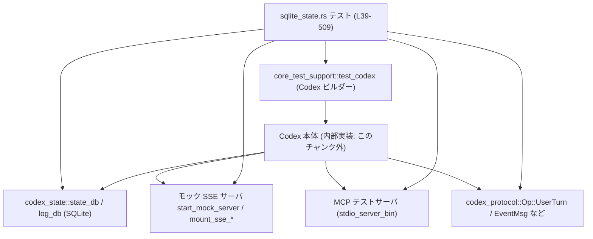
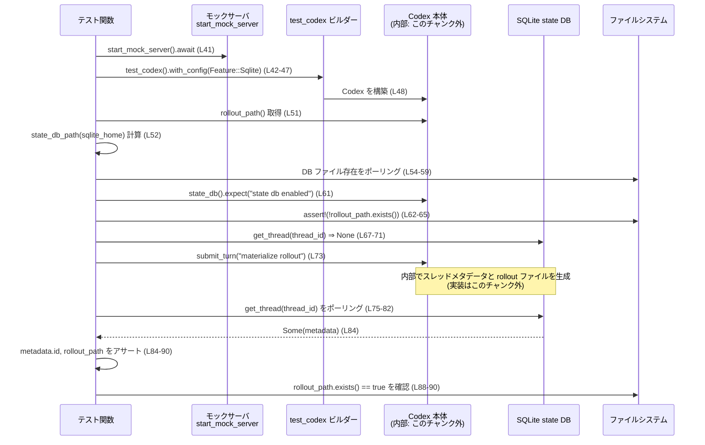
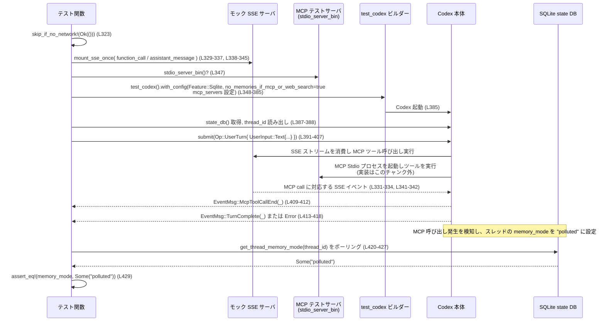

# core/tests/suite/sqlite_state.rs コード解説

## 0. ざっくり一言

- SQLite ベースの状態管理（state DB）が、スレッドのメタデータ・ユーザメッセージ・メモリモード・ログを正しく保存・更新していることを検証する統合テスト群です。
- Codex 本体と SQLite 状態 DB・MCP サーバ・SSE モックサーバの連携を、Tokio の非同期テストとして確認します。

---

## 1. このモジュールの役割

### 1.1 概要

このモジュールは **Codex の SQLite 状態 DB の振る舞い** を検証するために存在し、以下のような機能をテストします。

- 新規スレッドが、最初のユーザメッセージ送信後に state DB と rollout ファイルに記録されること（`new_thread_is_recorded_in_state_db`, L39-93）。
- 既存の rollout JSONL ファイルから、state DB がバックフィルしてスレッド情報や Dynamic Tool 情報を登録すること（`backfill_scans_existing_rollouts`, L95-227）。
- 最初のユーザメッセージが state DB に永続化されること（`user_messages_persist_in_state_db`, L229-280）。
- Web 検索や MCP 呼び出しが発生したスレッドの `memory_mode` が `"polluted"` に設定される設定オプションの動作（L282-319, L321-431）。
- ツール呼び出しログ（ToolCall ログ）にスレッド ID が紐づいて保存されること（`tool_call_logs_include_thread_id`, L433-509）。

### 1.2 アーキテクチャ内での位置づけ

このファイルは「テストモジュール」であり、以下のコンポーネントを組み合わせて動作を検証しています。

- `core_test_support::test_codex::test_codex`（L42, L128, L241, L295, L348, L456）  
  Codex をテスト用に起動するビルダー。
- `core_test_support::responses` と各種 `mount_sse_*`（L18-25, L233-239, L285-293, L329-337, L338-345, L443-454）  
  SSE モックサーバに LLM 応答・ツール呼び出しイベントを流すためのテストユーティリティ。
- `codex_state::state_db_path`・`test.codex.state_db()`（L52, L61, L187, L198, L249, L260, L303, L387, L463）  
  SQLite ファイルパスと state DB 接続を取得。
- `codex_state::log_db::start` と `codex_state::LogQuery`（L468-480）  
  tracing ログを SQLite に保存し、クエリするレイヤ。
- `codex_protocol` および `UserInput`, `Op::UserTurn`（L5-17, L391-407）  
  Codex のプロトコル型とユーザターンの送信 API。
- MCP 関連設定 `McpServerConfig`, `McpServerTransportConfig`（L2-3, L355-380）。

概念的な依存関係は次のようになります。



> C→D, C→E, C→F, C→G は、このファイルには直接現れず、テストが前提としている Codex 内部の動作を表す概念的な矢印です。

### 1.3 設計上のポイント

- **統合テストとしての構成**  
  すべて `#[tokio::test]` で定義された非同期テスト関数であり、実際に Codex 本体を起動し、外部 I/O（ファイルシステム・SQLite・ネットワーク／擬似ネットワーク）を伴う統合テストになっています（L39, L95, L229, L282, L321, L433）。

- **非同期・並行性の扱い**  
  多くのテストは `flavor = "multi_thread"` かつ `worker_threads = 2` で実行し（L39, L95, L229, L282, L321）、`tokio::time::sleep` を使って state DB にデータが反映されるまでポーリングする設計です（例: L54-59, L75-82, L191-196, L200-207, L263-274, L308-315, L420-427, L479-497）。  
  1 つのテスト (`tool_call_logs_include_thread_id`, L433) のみ `flavor = "current_thread"` です。

- **エラーハンドリング方針**  
  テスト関数の戻り値は `anyhow::Result<()>`（L40, L96, L230, L283, L322, L434）で、I/O エラーなどは `?` 演算子で即時にテスト失敗として伝播します（例: L48, L185, L217, L347, L385, L442, L485）。  
  一方、期待値検証には `assert!` / `assert_eq!` / `expect` を多用し、前提条件違反や期待不一致は panic として扱われます（例: L62-65, L68-71, L84-90, L210-224, L276-277, L317, L429, L500-505）。

- **テスト前提の明示**  
  - `Feature::Sqlite` を有効にしていること（すべてのビルダーで L44-46, L180-182, L243-245, L297-299, L350-352, L457-459）。
  - MCP テストではネットワーク利用可能な環境のみで実行（`skip_if_no_network!`, L323）。
  - MCP テストサーババイナリ取得の成否（`stdio_server_bin()?`, L347）。

---

## 2. 主要な機能一覧（コンポーネントインベントリ）

### 2.1 このファイルで定義される関数

| 名前 | 種別 | 役割 / テスト対象 | 定義位置 |
|------|------|------------------|----------|
| `new_thread_is_recorded_in_state_db` | 非公開 async テスト関数 | 新しいスレッドが初回ユーザメッセージ後に state DB・rollout ファイルに記録されることを検証 | `core/tests/suite/sqlite_state.rs:L39-93` |
| `backfill_scans_existing_rollouts` | 非公開 async テスト関数 | 既存の rollout JSONL ファイルをバックフィルして state DB にスレッド情報・Dynamic Tools 情報が登録されることを検証 | `core/tests/suite/sqlite_state.rs:L95-227` |
| `user_messages_persist_in_state_db` | 非公開 async テスト関数 | ユーザメッセージが state DB に保存され、メタデータの `first_user_message` が設定されることを検証 | `core/tests/suite/sqlite_state.rs:L229-280` |
| `web_search_marks_thread_memory_mode_polluted_when_configured` | 非公開 async テスト関数 | Web 検索が行われたスレッドで、設定により `memory_mode` が `"polluted"` に設定されることを検証 | `core/tests/suite/sqlite_state.rs:L282-319` |
| `mcp_call_marks_thread_memory_mode_polluted_when_configured` | 非公開 async テスト関数 | MCP ツール呼び出しが行われたスレッドで、設定により `memory_mode` が `"polluted"` に設定されることを検証 | `core/tests/suite/sqlite_state.rs:L321-431` |
| `tool_call_logs_include_thread_id` | 非公開 async テスト関数 | ToolCall ログがスレッド ID と紐づいて state DB に保存されることを検証 | `core/tests/suite/sqlite_state.rs:L433-509` |

### 2.2 このファイルから利用している主な外部コンポーネント

> 型定義や関数本体はこのチャンクには現れません。ここでは「このファイルから観測できる役割」を整理します。

| コンポーネント | モジュール | このファイルでの役割 / 契約（このテストから読み取れるもの） | 参照位置 |
|----------------|-----------|-------------------------------------------|----------|
| `test_codex()` とビルダー | `core_test_support::test_codex` | Codex インスタンスとテスト用セッションを起動する。`.with_config` / `.with_pre_build_hook` / `.build(&server)` を提供。 | L42-48, L128-183, L241-247, L295-301, L348-385, L456-462 |
| `start_mock_server`, `mount_sse_sequence`, `mount_sse_once` | `core_test_support::responses` | HTTP SSE モックサーバを起動し、事前定義のイベントシーケンス（レスポンス生成・ツール呼び出し完了・エラーなど）をストリームする。 | L41, L233-239, L285-293, L329-337, L338-345, L443-454 |
| `codex_state::state_db_path` | `codex_state` | SQLite state DB のファイルパスを、`sqlite_home` ディレクトリから導出する。 | L52, L187, L249 |
| `test.codex.state_db()` | `codex_state` を返す Codex メソッド | 有効な場合に state DB 接続ハンドルを返す（`.expect("state db enabled")` から、Sqlite 機能が有効であれば `Some` のはずという前提）。 | L61, L198, L260, L303, L387, L463 |
| `db.get_thread` | `codex_state` のメソッド | スレッド ID に対応するメタデータを `Option` で返す。存在しない場合 `None` が返る前提でテスト。 | L67, L200-203, L263-270 |
| `db.get_dynamic_tools` | 同上 | スレッドに関連づく `Vec<DynamicToolSpec>` を `Option` で返す前提。 | L217-223 |
| `db.get_thread_memory_mode` | 同上 | スレッドの `memory_mode` を `Option<String>` として返す前提。 | L310-312, L422-424 |
| `codex_state::log_db::start` | `codex_state::log_db` | tracing サブスクライバレイヤを作成し、ログを state DB に書き込む。`flush().await` でバッファをフラッシュできる。 | L468-476 |
| `codex_state::LogQuery` | `codex_state` | ログ検索用のクエリパラメータ。`descending`, `limit`, `Default::default()` が利用されている。 | L480-484 |
| `db.query_logs` | `codex_state` のメソッド | `LogQuery` 条件でログレコードを検索し、`row.thread_id`・`row.message` フィールドを持つ行を返す。 | L485-493, L499-505 |
| `DynamicToolSpec` | `codex_protocol::dynamic_tools` | 動的ツールの name, description, JSON Schema (`input_schema`), `defer_loading` を持つ。 | L104-125 |
| `SessionMeta`, `SessionMetaLine` | `codex_protocol::protocol` | rollout JSONL 内でセッションメタデータとして保存される構造体。`id`, `timestamp`, `cwd`, `originator`, `dynamic_tools`, `memory_mode` などのフィールドを持つ。 | L135-151 |
| `RolloutLine`, `RolloutItem` | `codex_protocol::protocol` | rollout JSONL の 1 行分。`timestamp` と `item` を持ち、`item` は `SessionMeta` や `EventMsg` を含む。 | L155-169 |
| `UserMessageEvent` | `codex_protocol::protocol` | ユーザメッセージの内容（`message`, `images`, `local_images`, `text_elements`）を持つ。 | L161-167 |
| `Op::UserTurn`, `UserInput` | `codex_protocol::protocol`, `codex_protocol::user_input` | Codex へのユーザターン送信 API と、その入力形式（テキスト、要素リストなど）。 | L391-407 |
| `McpServerConfig`, `McpServerTransportConfig::Stdio` | `codex_config::types` | MCP サーバ設定。ここでは stdio 経由で外部 `rmcp` テストサーバを起動する設定を構築している。 | L355-380 |

### 2.3 機能一覧（テストシナリオ）

- 新規スレッド作成時の state DB へのスレッド登録と rollout ファイルの materialize（`new_thread_is_recorded_in_state_db`, L39-93）。
- 既存の rollout JSONL ファイルからのバックフィル（スレッド ID・rollout パス・モデルプロバイダ・Dynamic Tools の保存）（`backfill_scans_existing_rollouts`, L95-227）。
- ユーザメッセージに応じて `first_user_message` が設定されること（`user_messages_persist_in_state_db`, L229-280）。
- Web 検索イベントによる `memory_mode = "polluted"` への変更（`web_search_marks_thread_memory_mode_polluted_when_configured`, L282-319）。
- MCP ツール呼び出しイベントによる `memory_mode = "polluted"` への変更（`mcp_call_marks_thread_memory_mode_polluted_when_configured`, L321-431）。
- ToolCall ログにスレッド ID が含まれること、およびログ保存・検索の動作（`tool_call_logs_include_thread_id`, L433-509）。

---

## 3. 公開 API と詳細解説

このファイル自体はテストモジュールであり、外部に公開されるライブラリ API は定義していません。  
以下では、「**テストが前提としている外部 API の契約**」と「**テスト関数の詳細**」を整理します。

### 3.1 型一覧（このファイルから観測できる主要な型）

| 名前 | 種別 | 出どころ | このファイルで確認できるフィールド / 用途 | 根拠 |
|------|------|----------|--------------------------------------------|------|
| `SessionMeta` | 構造体 | `codex_protocol::protocol` | `id`, `forked_from_id`, `timestamp`, `cwd`, `originator`, `cli_version`, `source`, `agent_path`, `agent_nickname`, `agent_role`, `model_provider`, `base_instructions`, `dynamic_tools`, `memory_mode` をフィールドとして持つ（L136-151） | `core/tests/suite/sqlite_state.rs:L135-151` |
| `SessionMetaLine` | 構造体 | 同上 | `meta: SessionMeta`, `git: Option<_>` を持つ（L135-152） | 同上 |
| `RolloutLine` | 構造体 | `codex_protocol::protocol` | `timestamp: String`, `item: RolloutItem` を持つ（L155-162, L160-168） | `core/tests/suite/sqlite_state.rs:L155-169` |
| `RolloutItem` | 列挙体 | 同上 | バリアント `SessionMeta(SessionMetaLine)` と `EventMsg(EventMsg)` を少なくとも持つ（L158, L162）。他のバリアントはこのチャンクには現れません。 | 同上 |
| `UserMessageEvent` | 構造体 | `codex_protocol::protocol` | `message: String`, `images: Option<_>`, `local_images: Vec<_>`, `text_elements: Vec<_>` を持つ（L161-167）。 | `core/tests/suite/sqlite_state.rs:L161-167` |
| `DynamicToolSpec` | 構造体 | `codex_protocol::dynamic_tools` | `name: String`, `description: String`, `input_schema: serde_json::Value`, `defer_loading: bool` を持つ（L104-125）。 | `core/tests/suite/sqlite_state.rs:L104-125` |
| `LogQuery` | 構造体 | `codex_state` | `descending: bool`, `limit: Option<_>` などを持ち、`Default` 実装がある（L480-484）。他フィールドはこのチャンクには現れません。 | `core/tests/suite/sqlite_state.rs:L480-484` |
| `Feature` | 列挙体 | `codex_features` | バリアント `Sqlite` を持ち、`config.features.enable(Feature::Sqlite)` が可能（L44-46, L180-182, L243-245, L297-299, L350-352, L457-459）。 | `core/tests/suite/sqlite_state.rs:L44-46` |

### 3.2 関数詳細（テスト関数 6 件）

#### `new_thread_is_recorded_in_state_db() -> Result<()>`

**概要**

- SQLite 機能を有効にして Codex を起動し、新しいスレッドに最初のユーザメッセージを送信したときに、
  - rollout ファイルが materialize されること
  - state DB にスレッドメタデータが登録されること  
  を検証するテストです（L39-93）。

**引数**

- なし（`#[tokio::test]` によってテストランナーから直接呼び出される）

**戻り値**

- `anyhow::Result<()>`  
  - 内部で発生した I/O エラーなどは `Err` として返されテスト失敗になります（例: `builder.build(&server).await?`, L48）。
  - 全てのアサーションに成功した場合は `Ok(())` を返します（L92）。

**内部処理の流れ（アルゴリズム）**

1. モックサーバ起動と Codex インスタンスの構築  
   - `start_mock_server().await` でモック HTTP サーバを起動（L41）。
   - `test_codex().with_config(...)` で `Feature::Sqlite` を有効化し（L42-47）、`builder.build(&server).await?` で Codex を構築（L48）。

2. スレッド ID / rollout / DB パス取得  
   - セッション ID を `thread_id` として取得（L50）。
   - `test.codex.rollout_path()` で rollout ファイルパスを取得（L51）。
   - `codex_state::state_db_path(test.config.sqlite_home.as_path())` で SQLite DB パスを取得（L52）。

3. state DB ファイル生成をポーリング  
   - 最大 100 回（約 2.5 秒）`tokio::fs::try_exists(&db_path)` をチェックし（L54-59）、DB ファイルが出来るまで待機。

4. 初回ユーザメッセージ前の状態確認  
   - `test.codex.state_db().expect("state db enabled")` で DB ハンドル取得（L61）。
   - rollout ファイルがまだ存在しないことを `assert!(!rollout_path.exists())` で確認（L62-65）。
   - `db.get_thread(thread_id).await?` が `None` を返す（＝ state DB にまだスレッドが登録されていない）ことを確認（L67-71）。

5. 初回ユーザメッセージ送信と post-state 確認  
   - `test.submit_turn("materialize rollout").await?` でユーザメッセージを送信（L73）。
   - 再度 `db.get_thread(thread_id)` を最大 100 回ポーリングし、`Some` になるまで待機（L75-82）。
   - `metadata.id == thread_id`, `metadata.rollout_path == rollout_path` を `assert_eq!` で確認（L84-86）。
   - rollout ファイルが存在していることを `assert!(rollout_path.exists())` で確認（L87-90）。

**Examples（使用例）**

この関数自体はテストとして自動実行されます。  
同様のテストを追加する場合のパターンは以下のようになります。

```rust
#[tokio::test(flavor = "multi_thread", worker_threads = 2)]
async fn example_new_thread_state_behavior() -> anyhow::Result<()> {
    let server = start_mock_server().await;                 // モックサーバ起動
    let mut builder = test_codex().with_config(|config| {   // SQLite 機能を有効にする
        config.features.enable(Feature::Sqlite).unwrap();
    });
    let test = builder.build(&server).await?;               // Codex 起動

    let db = test.codex.state_db().expect("state db enabled");
    let thread_id = test.session_configured.session_id;

    // 任意のユーザメッセージを送る
    test.submit_turn("some message").await?;

    // スレッドメタデータが保存されるまでポーリング
    let mut metadata = None;
    for _ in 0..100 {
        metadata = db.get_thread(thread_id).await?;
        if metadata.is_some() { break; }
        tokio::time::sleep(Duration::from_millis(25)).await;
    }

    assert!(metadata.is_some());                            // メタデータが存在することを確認
    Ok(())
}
```

**Errors / Panics**

- `builder.build(&server).await?` で Codex 起動に失敗すると `Err` を返します（L48）。
- `test.codex.rollout_path().expect("rollout path")` で rollout パス取得に失敗すると panic します（L51）。
- `test.codex.state_db().expect("state db enabled")` で state DB が無効の場合 panic します（L61）。
- アサーション（`assert!`, `assert_eq!`）に失敗すると panic します（L62-65, L68-71, L84-90）。

**Edge cases（エッジケース）**

- **DB ファイル生成が遅い**  
  - DB ファイル存在チェックは最大 100 回×25ms ≒ 2.5 秒（L54-59）。これより遅いとテストが失敗します。
- **メタデータ書き込みの遅延**  
  - `get_thread` も最大 100 回×25ms ≒ 2.5 秒ポーリングしています（L75-82）。書き込みがそれより遅いとテスト失敗です。
- **スレッドが事前に存在する場合**  
  - テストの前提として「新規スレッド」であるため、`initial_metadata.is_none()` を期待しています（L67-71）。既に DB に同 ID のスレッドがある場合、テストは失敗しますが、通常のテスト環境ではありえない前提です。

**使用上の注意点**

- 非同期テストであるため、DB 書き込みの完了を保証するためにポーリング＋`sleep` が必須です。即座に `get_thread` を呼ぶと `None` を返す可能性があります。
- `Feature::Sqlite` が有効になっていないと `state_db()` が `None` となり `expect` で panic する可能性があります。

---

#### `backfill_scans_existing_rollouts() -> Result<()>`

**概要**

- Codex 起動前に手動で rollout JSONL ファイルを作成し、それを基に state DB がスレッド情報と Dynamic Tool 設定をバックフィルすることを確認するテストです（L95-227）。

**引数**

- なし

**戻り値**

- `anyhow::Result<()>`（L96）

**内部処理の流れ**

1. モックサーバとスレッド ID/rollout パスの決定  
   - `start_mock_server().await`（L97）。
   - `Uuid::now_v7()` から `ThreadId` を生成（L99-100）。
   - rollout の相対パス文字列を組み立て（L101-102）。

2. Dynamic Tools 定義  
   - `DynamicToolSpec` を 2 つ定義（`geo_lookup`, `weather_lookup`）し、JSON Schema を持つ `input_schema` と `defer_loading` を設定（L104-125）。
   - テストフック用に clone しておく（L126）。

3. `with_pre_build_hook` で rollout JSONL を事前作成  
   - Codex ホームディレクトリを受け取り、`codex_home.join(&rollout_rel_path_for_hook)` で rollout ファイルの絶対パスを決定（L129-131）。
   - 親ディレクトリ作成（L132-135）。
   - `SessionMetaLine` を組み立て、`SessionMeta` に `id`, `timestamp`, `cwd`, `originator`, `cli_version`, `dynamic_tools`, などを設定（L135-151）。
   - `RolloutLine` 配列として、`SessionMeta` 行と `UserMessageEvent` 行を用意（L155-169）。
   - `serde_json::to_string` で JSONL にシリアライズし、ファイルに書き出し（L171-176）。

4. Codex の起動と state DB ファイルの生成待機  
   - `Feature::Sqlite` を有効にした上で Codex を起動（L178-185）。
   - `state_db_path` を計算し（L187）、最大 20 回×25ms で存在チェック（L191-196）。

5. バックフィル結果の検証  
   - `db.get_thread(thread_id)` を最大 40 回×25ms ポーリングし、存在するまで待機（L200-207）。
   - 取得した `metadata` について以下を検証（L209-213）:
     - `metadata.id == thread_id`
     - `metadata.rollout_path == rollout_path`（L188, L211）
     - `metadata.model_provider == default_provider`（L189-190, L212）
     - `metadata.first_user_message.is_some()`（L213）

6. Dynamic Tools の保存確認  
   - `db.get_dynamic_tools(thread_id)` を最大 40 回×25ms ポーリング（L215-222）。
   - `stored_tools == dynamic_tools` であることを `assert_eq!` で確認（L223-224）。

**Errors / Panics**

- rollout ファイル書き込みやディレクトリ作成の失敗は `expect` 経由で panic（L134-135, L171-176）。
- Codex 起動失敗は `builder.build(&server).await?` で `Err`（L185）。
- `state_db()` が `None` の場合は `expect("state db enabled")` で panic（L198）。
- バックフィル結果が期待通りでない場合はアサーションで panic（L210-224）。

**Edge cases**

- **state DB の起動が遅い**  
  - DB ファイル存在チェックは 20 回×25ms ≒ 0.5 秒のみ（L191-196）。起動がこれより遅いとテスト失敗。
- **バックフィルの非同期遅延**  
  - `get_thread` と `get_dynamic_tools` は 40 回×25ms ≒ 1 秒まで待機（L200-207, L215-222）。
- **Dynamic Tools 順序**  
  - `assert_eq!(stored_tools, dynamic_tools)` から、保存される tools の順序も元と同じであることを前提としています（L223-224）。

**使用上の注意点**

- rollout ファイルのフォーマット（JSONL, 各行が `RolloutLine`）と SessionMeta の構造は、テストのように正しく構成されている必要があります。  
  不正フォーマットの場合の挙動はこのチャンクには現れません。
- バックフィルが行われるタイミング（起動直後かどうか）は、このテストからは推測のみであり、内部実装はこのチャンクには現れません。

---

#### `user_messages_persist_in_state_db() -> Result<()>`

**概要**

- 複数のユーザメッセージ送信後、state DB 内のスレッドメタデータに `first_user_message` が設定されていることを検証するテストです（L229-280）。

**内部処理の流れ**

1. モックサーバセットアップ  
   - `mount_sse_sequence` でレスポンスが 2 回返る SSE シーケンスを設定（L231-239, L235-237）。

2. Codex 起動・SQLite 有効化  
   - `Feature::Sqlite` を有効化して Codex を起動（L241-247）。

3. state DB ファイル生成待機  
   - `state_db_path` を計算し、最大 100 回×25ms で `try_exists` をポーリング（L249-255）。

4. ユーザメッセージ送信  
   - `test.submit_turn("hello from sqlite")` と `"another message"` を送信（L257-258）。

5. `first_user_message` の設定確認  
   - `db.get_thread(thread_id)` を最大 100 回×25ms でポーリング（L263-274）。
   - `metadata.first_user_message.is_some()` になるまで待機し、最後に `assert!(...)` で確認（L276-277）。

**Errors / Panics / Edge cases**

- ほぼ他のテストと同様で、`state_db` の初期化遅延・`get_thread` の反映遅延に対してポーリングしています（L249-255, L263-274）。
- `first_user_message` フィールドの具体的な型や内容はこのチャンクには現れませんが、「`is_some()` になる」という契約が前提です。

---

#### `web_search_marks_thread_memory_mode_polluted_when_configured() -> Result<()>`

**概要**

- Web 検索イベントが発生する SSE シーケンスを流した場合に、設定 `no_memories_if_mcp_or_web_search = true` のもとで対象スレッドの `memory_mode` が `"polluted"` に設定されることを確認するテストです（L282-319）。

**内部処理の流れ**

1. SSE シーケンス設定  
   - `ev_web_search_call_done("ws-1", "completed", "weather seattle")` を含むシーケンスを `mount_sse_sequence` で設定（L285-293, L287-290）。

2. Codex 構築  
   - `Feature::Sqlite` を有効化しつつ、`config.memories.no_memories_if_mcp_or_web_search = true` 設定を行う（L295-301）。
   - Codex 起動（L302）。

3. `memory_mode` のポーリング  
   - ユーザメッセージ `"search the web"` を送信（L306）。
   - `db.get_thread_memory_mode(thread_id)` を最大 100 回×25ms ポーリングし、`Some("polluted")` になるまで待機（L308-315）。
   - 最終的に `assert_eq!(memory_mode.as_deref(), Some("polluted"))` で検証（L317）。

**使用上の注意点**

- このテストから、「Web 検索が行われたスレッドに対し、特定設定が有効なら `memory_mode = "polluted"` に切り替わる」という契約が読み取れますが、実際にどのイベント種別を検知しているか（`ev_web_search_call_done` だけなのか）は Codex 内部実装に依存し、このチャンクには現れません。

---

#### `mcp_call_marks_thread_memory_mode_polluted_when_configured() -> Result<()>`

**概要**

- MCP ツール呼び出しが行われたスレッドに対し、`no_memories_if_mcp_or_web_search = true` が有効だと `memory_mode` が `"polluted"` に設定されることを検証するテストです（L321-431）。

**内部処理の流れ**

1. ネットワーク前提確認  
   - `skip_if_no_network!(Ok(()));` でネットワーク不可環境ではテストをスキップ（L323）。

2. MCP 呼び出しを含む SSE シーケンス設定  
   - 最初のシーケンスで `ev_function_call(call_id, &tool_name, "{\"message\":\"ping\"}")` を含む（L329-337, L332-334）。
   - 2 回目のシーケンスで MCP 完了メッセージ `ev_assistant_message("msg-1", "rmcp echo tool completed.")` を設定（L338-345, L341-342）。

3. MCP テストサーバ設定  
   - `stdio_server_bin()?` でテスト用 MCP サーババイナリパス取得（L347）。
   - `McpServerConfig { transport: Stdio { command, args, env, ... }, ... }` を組み立て、`config.mcp_servers` に登録（L355-384）。

4. Codex 起動と state DB 取得  
   - `Feature::Sqlite` と `no_memories_if_mcp_or_web_search = true` を有効化した Codex を起動（L348-385）。
   - `test.codex.state_db().expect("state db enabled")` と `thread_id` を取得（L387-388）。

5. MCP ツール呼び出しを含むユーザターン送信  
   - `Op::UserTurn` で `UserInput::Text` を送信（L391-407）。
   - `wait_for_event` で `EventMsg::McpToolCallEnd(_)` を待機（L409-412）。
   - `wait_for_event_match` で `EventMsg::TurnComplete(_)` か `EventMsg::Error` を待機（L413-418）。

6. `memory_mode` のポーリングと検証  
   - `db.get_thread_memory_mode(thread_id)` を最大 100 回×25ms ポーリングし、`Some("polluted")` を確認（L420-427, L429）。

**Errors / Panics**

- MCP サーババイナリ取得失敗は `stdio_server_bin()?` で `Err` を返す（L347）。
- MCP サーバ設定の `set` が失敗すると `expect` で panic（L381-384）。
- Codex の MCP 呼び出しに起因するエラーは `wait_for_event_match` で `EventMsg::Error` を受け取った際に `Err` として返される（L413-418）。

**Edge cases**

- MCP サーバプロセスの起動・応答が遅い場合、SSE シーケンスや `wait_for_event` との整合が取れず、テストがタイムアウト／失敗する可能性があります。
- `memory_mode` が `"polluted"` 以外の文字列を取りうるかどうかは、このファイルからは分かりません。

---

#### `tool_call_logs_include_thread_id() -> Result<()>`

**概要**

- ToolCall ログが state DB に保存される際に、対応するスレッド ID が `thread_id` カラムに入ることと、ログクエリで取得可能であることを検証するテストです（L433-509）。

**内部処理の流れ**

1. SSE シーケンス設定と Codex 起動  
   - `ev_function_call(call_id, "shell_command", &args_json)` を含む SSE シーケンスを 2 回分設定（L443-454, L446-452）。
   - `Feature::Sqlite` を有効化して Codex を起動（L456-462）。
   - `db` と `expected_thread_id` を取得（L463-464）。

2. ユーザメッセージ送信  
   - `"run a shell command"` を送信（L466）。

3. ログレイヤの起動と ToolCall ログ発行  
   - `codex_state::log_db::start(db.clone())` で log DB layer を開始（L468）。
   - `tracing_subscriber::registry().with(log_db_layer.clone())` でサブスクライバを組み立て、`tracing::Dispatch` を作成（L469-470）。
   - `tracing::dispatcher::with_default` ブロック内で `info_span!("test_log_span", thread_id = %expected_thread_id)` を開始し（L471-472）、その span 内で `tracing::info!("ToolCall: shell_command {...}")` を出力（L473-474）。
   - `log_db_layer.flush().await` でログを DB にフラッシュ（L476）。

4. ログクエリと検証  
   - 最大 80 回×25ms のポーリングでログを検索（L479-497）。
   - `LogQuery { descending: true, limit: Some(20), ..Default::default() }` を構築し（L480-484）、`db.query_logs(&query).await?` を実行（L485）。
   - 取得した `rows` から、`row.message` に `"ToolCall:"` を含む行を探し（L486-490）、見つかった場合 `found = Some((row.thread_id, row.message))` として保持（L491-494）。
   - 最後に `found.expect("expected ToolCall log row")` で存在を確認し（L499）、`thread_id == Some(expected_thread_id)`（L500）かつ `message` に `"ToolCall:"` を含むことを確認（L501-505）。

**Errors / Panics**

- log DB layer の起動失敗時の挙動はこのチャンクには現れませんが、`start(db.clone())` の結果は `expect` 等でラップされていないため直接 `Result` は返していません（L468）。この関数が panic するかどうかは不明です（このチャンクには定義がありません）。
- `query_logs` が `Err` を返した場合はテストが `Err` を返します（L485）。
- ToolCall ログが見つからない場合、`found.expect("expected ToolCall log row")` が panic します（L499）。

**Edge cases**

- ログ書き込みの遅延に備えて 80 回×25ms ≒ 2 秒のポーリングを行っています（L479-497）。それ以上かかるとテストが失敗します。
- `thread_id` カラムが `Option<String>` であり、`None` になりうることを前提に `assert_eq!(thread_id, Some(expected_thread_id));` と比較しています（L499-500）。  
  他のログ行では `thread_id` が `None` の可能性があります。

---

### 3.3 その他の関数

- このファイル内で補助的な関数やラッパー関数は定義されていません。  
  すべてのロジックはテスト関数本体に直接記述されています。

---

## 4. データフロー

ここでは代表的な 2 つのシナリオのデータフローを示します。

### 4.1 新規スレッドの state DB 登録と rollout materialize

`new_thread_is_recorded_in_state_db (L39-93)` のフローです。



> Codex 本体内部での DB 書き込みや rollout materialize の詳細実装はこのチャンクには現れません。  
> 図中の「内部で〜生成」は、テストが前提としている振る舞いを示す概念的なステップです。

### 4.2 MCP ツール呼び出しによる `memory_mode` 汚染フロー

`mcp_call_marks_thread_memory_mode_polluted_when_configured (L321-431)` のフローです。



> Codex と MCP サーバ・SSE サーバの具体的な通信内容はこのチャンクには現れません。  
> テストは「適切な EventMsg が届き、結果として memory_mode が更新される」ことのみを検証しています。

---

## 5. 使い方（How to Use）

### 5.1 基本的な使用方法（テストの実行）

このファイルは統合テストモジュールです。通常は以下のように `cargo test` で実行されます。

```bash
# crate ルートから
cargo test --test sqlite_state
# あるいは、モジュールパスでフィルタ
cargo test sqlite_state::new_thread_is_recorded_in_state_db
```

Codex の開発者が SQLite 状態 DB の挙動を変更した場合、これらのテストを実行してレグレッションがないか確認することが想定されます。

### 5.2 新しいテストを追加する際のパターン

このファイルのテストは、共通のパターンに従っています。

1. **モック SSE サーバ・MCP サーバのセットアップ**  
   - `start_mock_server().await` でモックサーバを起動（L41, L97, L231, L284, L325, L435）。
   - 必要に応じて `mount_sse_sequence` / `mount_sse_once` で SSE イベント列を登録（L233-239, L285-293, L329-337, L338-345, L443-454）。

2. **Codex ビルダーの構築と設定**  
   - `test_codex().with_config(|config| { ... })` で `Feature::Sqlite` を有効化（L42-47, L178-183, L241-246, L295-301, L348-354, L456-461）。
   - 場合によっては `with_pre_build_hook` で事前状態を注入（L128-177）。

3. **Codex の起動と state DB 取得**  
   - `builder.build(&server).await?` で Codex を起動（L48, L185, L247, L302, L385, L462）。
   - `test.codex.state_db().expect("state db enabled")` で DB ハンドルを取得（L61, L198, L260, L303, L387, L463）。

4. **ユーザターン送信 / 内部処理の誘発**  
   - `test.submit_turn("...").await?` または `test.codex.submit(Op::UserTurn{...}).await?`（L73, L257-258, L306, L391-407, L466）。

5. **state DB / ログのポーリングによる検証**  
   - `get_thread`, `get_dynamic_tools`, `get_thread_memory_mode`, `query_logs` などを一定時間ポーリングし、期待状態になるまで待機してアサート（L75-82, L200-207, L215-222, L263-274, L308-315, L420-427, L479-497）。

このパターンに従えば、新しい SQLite 状態の挙動に関するテストを追加できます。

### 5.3 よくある間違い

```rust
// 間違い例: SQLite 機能を有効化せずに state_db() を呼ぶ
let mut builder = test_codex();
let test = builder.build(&server).await?;
let db = test.codex.state_db().expect("state db enabled"); // ここで panic の可能性

// 正しい例: Feature::Sqlite を有効化してから build する
let mut builder = test_codex().with_config(|config| {
    config.features.enable(Feature::Sqlite).expect("can enable sqlite");
});
let test = builder.build(&server).await?;
let db = test.codex.state_db().expect("state db enabled");
```

```rust
// 間違い例: すぐに DB を読んでしまい、まだ書き込みが反映されていない
test.submit_turn("some message").await?;
let metadata = db.get_thread(thread_id).await?; // この時点では None の可能性

// 正しい例: ポーリングして反映を待つ
let mut metadata = None;
for _ in 0..100 {
    metadata = db.get_thread(thread_id).await?;
    if metadata.is_some() { break; }
    tokio::time::sleep(Duration::from_millis(25)).await;
}
assert!(metadata.is_some());
```

### 5.4 使用上の注意点（まとめ）

- **非同期処理と反映遅延**  
  - state DB への書き込み・ログ保存は非同期であり、直後の読み取りではまだ反映されていない可能性があります。テストでは必ずポーリング＋`sleep` を組み合わせています（例: L54-59, L75-82, L191-196, L200-207, L263-274, L308-315, L420-427, L479-497）。

- **機能フラグの前提**  
  - `Feature::Sqlite` を有効にしないと `state_db()` が利用できない前提で組まれています（L44-46, L180-182 など）。

- **ネットワーク依存テスト**  
  - MCP テストはネットワークが使えない環境ではスキップされるよう `skip_if_no_network!` が使われています（L323）。

- **panic ベースの失敗検知**  
  - 多くの前提条件違反は `expect` / `assert!` / `assert_eq!` により panic で検出されます。  
    これが意図された挙動であり、テストコードとしては妥当ですが、ライブラリ API の挙動とは切り分けて考える必要があります。

---

## 6. 変更の仕方（How to Modify）

### 6.1 新しい機能を追加する場合（新しいテストケースの追加）

SQLite 状態 DB に新しい機能が追加された場合（例: スレッドごとのタグ付け、別種のイベントによる `memory_mode` 変更など）、このファイルにテストを追加する際のステップは次の通りです。

1. **テストシナリオの決定**  
   - どの入力（SSE イベント・ユーザターン・MCP 呼び出し）がどのような DB 状態変化を引き起こすかを明確にする。

2. **SSE/MCP など外部依存のセットアップ**  
   - 必要であれば `responses::ev_*` ヘルパを使って SSE シーケンスを構築する（既存例: L285-293, L329-337）。

3. **Codex 設定の調整**  
   - 新しい機能に関係する設定値を `with_config` でセットする（例: `config.memories.no_memories_if_mcp_or_web_search`, L295-301, L350-354）。

4. **検証ロジックの追加**  
   - `state_db()` から適切なメソッド（新規 API）を呼び、十分なポーリングとアサーションで期待状態を検証する。

### 6.2 既存の機能を変更する場合（テストメンテナンス）

状態 DB や Codex の挙動を変更した場合、以下の観点でこのテストファイルを見直す必要があります。

- **契約（Contract）の変更確認**
  - 例えば、`memory_mode` の値が `"polluted"` 以外の別表現になる場合、このファイル内の `assert_eq!(..., Some("polluted"))`（L317, L429）を新仕様に合わせて更新する必要があります。
  - `first_user_message` の設定タイミングやフィールド構造が変わる場合、`user_messages_persist_in_state_db` の前提（L263-274, L276-277）を見直します。

- **時間的制約の変更**
  - DB 書き込みやバックフィルの所要時間が大きく変わる場合、ポーリング回数やインターバル（L54-59, L75-82, L191-196 など）を調整する必要があります。

- **新しいエラー条件の導入**
  - 例えば、バックフィル対象 rollout のフォーマット検証が追加されると、テストで生成している JSONL（L171-176）が新ルールを満たしているかを確認する必要があります。

- **ログフォーマットの変更**
  - ToolCall ログのメッセージフォーマットが変わると、`message.contains("ToolCall:")` という条件（L486-490, L502-504）を新仕様に合わせる必要があります。

---

## 7. 関連ファイル

このモジュールと密接に関係するコンポーネント（モジュール）をまとめます。  
実際のファイルパスはこのチャンクには現れないため、モジュールパスのみを示します。

| モジュール / パス（論理） | 役割 / 関係 |
|---------------------------|-------------|
| `core_test_support::test_codex` | Codex 本体をテスト用に起動するビルダーとヘルパーを提供します（例: `test_codex`, `build`）。このファイルの全テストが依存しています（L42-48, L128-183, L241-247, L295-301, L348-385, L456-462）。 |
| `core_test_support::responses` | SSE モックサーバと各種イベント (`ev_response_created`, `ev_completed`, `ev_function_call`, `ev_web_search_call_done`, `ev_assistant_message`) を提供し、Codex の外部 API 呼び出しを疑似的に再現します（L18-25, L233-239, L285-293, L329-337, L338-345, L443-454）。 |
| `codex_state` | SQLite ベースの状態 DB 機能を提供するモジュールであり、本テストの主対象です。`state_db_path`, `state_db()`, `get_thread`, `get_dynamic_tools`, `get_thread_memory_mode`, `log_db::start`, `LogQuery`, `query_logs` などが利用されています（L52, L61, L187-198, L215-223, L249-260, L303, L387, L420-427, L468-485）。 |
| `codex_protocol` | Codex 内部で用いるプロトコル型 (`ThreadId`, `Op::UserTurn`, `EventMsg`, `RolloutLine`, `RolloutItem`, `SessionMeta`, `UserMessageEvent` 等) を定義するモジュールです。rollout JSONL やユーザターン送信に利用されています（L5-17, L100-123, L135-167, L391-417）。 |
| `codex_config::types` | MCP サーバ設定 (`McpServerConfig`, `McpServerTransportConfig`) を提供します。MCP テストでは stdio ベースの MCP サーバを起動する設定を組み立てるために利用されています（L2-3, L355-380）。 |
| `codex_features` | 機能フラグ (`Feature::Sqlite`) を定義するモジュールで、state DB 機能を有効・無効化するために利用されています（L4, L44-46, L180-182, L243-245, L297-299, L350-352, L457-459）。 |
| `core_test_support::wait_for_event`, `wait_for_event_match` | Codex から流れてくる `EventMsg` を監視し、特定のイベント（例: `McpToolCallEnd`, `TurnComplete`, `Error`）が届くまで待機するユーティリティです（L29-30, L409-418）。 |

> これらのモジュールの実装はこのチャンクには含まれていませんが、本テストファイルを読むことで、それらがどのような API を提供し、どのような契約で state DB と連携しているかの一部を把握できます。

---
