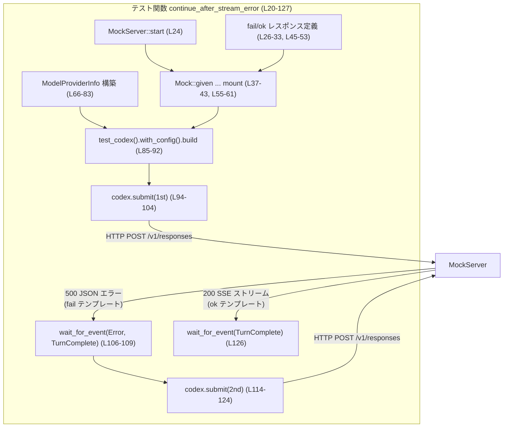
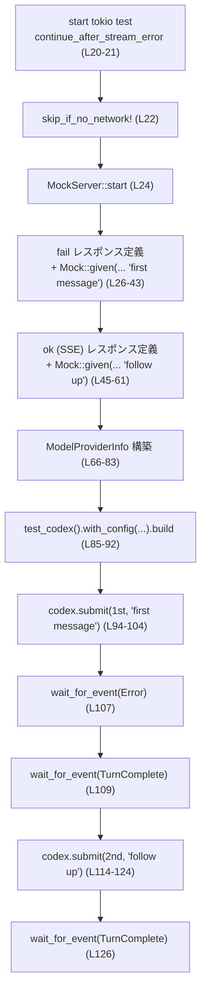
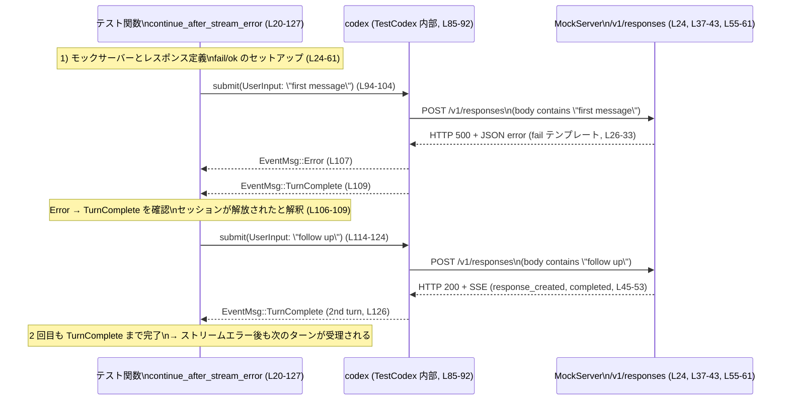

# core/tests/suite/stream_error_allows_next_turn.rs コード解説

## 0. ざっくり一言

- モデルプロバイダのストリーミング通信がエラーで失敗したあとでも、**次のユーザーターン（会話の続き）を正常に受け付けられるか**を検証する非同期テストです（core/tests/suite/stream_error_allows_next_turn.rs:L20-21, L106-113）。

---

## 1. このモジュールの役割

### 1.1 概要

- このモジュールは Codex エージェントが **外部モデルプロバイダ（Responses API）との SSE ストリーム中にエラーが発生した場合**でも、内部状態を適切に解放し、次の `Op::UserInput` を受け付けられることを確認するために存在します（L35-36, L106-113）。
- `wiremock` によるモック HTTP サーバーを用いて、**1 回目のプロンプトは HTTP 500 エラー**、**2 回目のプロンプトは SSE ストリームで成功**という挙動をシミュレートします（L26-43, L45-61）。
- Codex のテスト用ラッパー `TestCodex` を使ってエージェントを立ち上げ、発行される `EventMsg` を監視することで、エラーとターン完了イベントの順序と有無を検証します（L85-92, L94-104, L106-109, L114-126）。

### 1.2 アーキテクチャ内での位置づけ

このテストは以下のコンポーネント間のやり取りを検証します。

- `MockServer`: 外部モデルプロバイダの代わりに HTTP エンドポイント `/v1/responses` を提供（L24, L37-43, L55-61）。
- `ModelProviderInfo`: Codex に「どの URL にどの API 形式で接続するか」を教える設定（L66-83）。
- `TestCodex` / `codex`: Codex 本体をテスト用にラップしたオブジェクト（L85-92）。
- `codex.submit(Op::UserInput { ... })`: ユーザー入力を 1 回目・2 回目の「ターン」として送信（L94-104, L114-124）。
- `wait_for_event`: Codex からの `EventMsg` を待ち、エラーとターン完了のイベントを観測（L106-109, L126）。

依存関係を簡略化した図です。



### 1.3 設計上のポイント

- **非同期 & 並行性**  
  - `#[tokio::test(flavor = "multi_thread", worker_threads = 2)]` により、Tokio のマルチスレッドランタイム上でテストが動作します（L20）。  
    これにより、Codex 内部での非同期タスクやストリーム処理も並行に実行されます。
- **外部依存のモック化**  
  - 外部モデルプロバイダとの HTTP 通信はすべて `wiremock::MockServer` でモックされます（L24, L37-43, L55-61）。
  - エラー応答（HTTP 500, JSON ボディ）と成功応答（HTTP 200, SSE ストリーム）を明示的に定義しています（L26-33, L45-53）。
- **リトライ・タイムアウト設定の明示**  
  - `ModelProviderInfo` で `request_max_retries`, `stream_max_retries`, `stream_idle_timeout_ms` などのパラメータを指定し、Codex の再試行やストリームアイドルタイムアウト挙動に依存したテストになっています（L66-83）。
- **エラー後の状態解放の検証**  
  - 1 回目のストリームエラー後に `EventMsg::Error` と `EventMsg::TurnComplete` の順でイベントが発生することを確認し（L106-109）、その後の 2 回目の `submit` が拒否されず正常に `TurnComplete` まで進むことを確認します（L114-126）。

---

## 2. コンポーネント一覧（インベントリー）と主要機能

### 2.1 本ファイルで定義される要素

| 名前 | 種別 | 役割 / 用途 | 定義行 |
|------|------|------------|--------|
| `continue_after_stream_error` | 非公開 `async fn`（テスト） | ストリームエラー発生後も次のユーザーターンを受け付けられるかを検証する統合テスト | core/tests/suite/stream_error_allows_next_turn.rs:L20-127 |

### 2.2 外部から利用している主な型・関数

| 名前 | 種別 | 概要 / このテスト内での役割 | 根拠行 |
|------|------|----------------------------|--------|
| `ModelProviderInfo` | 構造体 | モデルプロバイダのエンドポイントや認証情報、リトライ等の設定を保持し、Codex に渡す | L1, L66-83 |
| `WireApi` | 列挙体 | 使用するワイヤプロトコル種別。ここでは `WireApi::Responses` を指定して "Responses API" を利用 | L2, L73 |
| `EventMsg` | 列挙体 | Codex から発行されるイベント。`Error`, `TurnComplete` バリアントをマッチして順序と存在を確認 | L3, L106-109, L126 |
| `Op` | 列挙体 | Codex への操作を表す。ここではユーザー入力を送る `Op::UserInput` を使用 | L4, L95, L115 |
| `UserInput` | 列挙体 | ユーザー入力データ。ここでは `UserInput::Text` でテキストプロンプトを送信 | L5, L96-99, L116-119 |
| `ev_completed` | 関数 | SSE イベントとして「完了」を表すイベントを生成（Responses API 用） | L6, L50 |
| `ev_response_created` | 関数 | SSE イベントとして「レスポンス生成開始」を表すイベントを生成 | L7, L49 |
| `sse` | 関数 | 複数の SSE イベントを HTTP レスポンスボディとして連結するヘルパ | L8, L48-51 |
| `skip_if_no_network` | マクロ | テスト環境にネットワークが無い場合にテストをスキップするためのガード | L9, L22 |
| `TestCodex` | 構造体 | Codex をテストで簡単に立ち上げるためのラッパー。`codex` 本体などをフィールドとして提供 | L10, L85 |
| `test_codex` | 関数 | `TestCodex` ビルダーを返すファクトリ。設定クロージャ等をチェーンできる | L11, L85-92 |
| `wait_for_event` | 関数 | Codex から特定の条件を満たす `EventMsg` が届くまで待機するヘルパ | L12, L106-109, L126 |
| `Mock` | 構造体 | `wiremock` で HTTP リクエストマッチャとレスポンスを定義するための型 | L13, L37-43, L55-61 |
| `MockServer` | 構造体 | `wiremock` のモック HTTP サーバー。`start()` で起動し、`uri()` をテスト対象に渡す | L14, L24, L68 |
| `ResponseTemplate` | 構造体 | `wiremock` の HTTP レスポンス定義。ステータスコード、ヘッダ、ボディを設定 | L15, L26-33, L45-53 |
| `body_string_contains` | 関数 | HTTP リクエストボディに特定文字列が含まれるかでマッチさせるマッチャ | L16, L39, L57 |
| `method` | 関数 | HTTP メソッド（ここでは "POST"）でマッチさせるマッチャ | L17, L37, L55 |
| `path` | 関数 | HTTP リクエストパス（ここでは `/v1/responses`）をマッチさせるマッチャ | L18, L38, L56 |

### 2.3 主要な機能一覧

- ストリーミングエラーのシミュレーション: モックサーバーに HTTP 500 の JSON エラーと SSE 成功レスポンスを設定（L26-33, L45-53）。
- Codex のモックプロバイダ設定: `ModelProviderInfo` による Responses API + モックサーバーへの接続設定（L66-83）。
- 1 回目のターンでのエラー + ターン解放検証: 最初の `submit` の後に `EventMsg::Error` と `EventMsg::TurnComplete` を順に観測（L94-104, L106-109）。
- 2 回目のターンの正常完了検証: 続けて `submit` して、`EventMsg::TurnComplete` が再度観測できることを確認（L114-124, L126）。

---

## 3. 公開 API と詳細解説

このファイル自体はテストコードであり、外部に公開される API は定義されていません。  
ただし、Codex の「振る舞い契約（Contract）」を暗黙的に規定しているため、その観点でテスト関数を詳細に説明します。

### 3.1 型一覧（補足）

このファイル内で新たな構造体・列挙体の定義はありません（すべて外部クレート／モジュールからのインポートです）。

---

### 3.2 関数詳細: `continue_after_stream_error()`

#### シグネチャ

```rust
#[tokio::test(flavor = "multi_thread", worker_threads = 2)]
async fn continue_after_stream_error() { /* ... */ }
```

（core/tests/suite/stream_error_allows_next_turn.rs:L20-127）

#### 概要

- 非同期テストとして、次の **シナリオ全体が期待どおり成立すること**を検証します。
  1. モデルプロバイダ（モック）が最初のリクエストに対してストリーミングエラー（HTTP 500）を返す。
  2. Codex がそのエラーを `EventMsg::Error` として通知し、続けて `EventMsg::TurnComplete` でターンを終了する。
  3. その後、別のユーザー入力（2 回目のターン）を送ると、正常にストリーミングが行われ `EventMsg::TurnComplete` まで到達する。

#### 引数

- なし（テスト関数であり、外部からパラメータは受け取りません）。

#### 戻り値

- 暗黙的に `()`（ユニット型）を返します。  
  `tokio::test` マクロにより、テストランナーがこの `async fn` を起動し、内部の `await` がすべて完了すればテスト成功です（L20-21）。

#### 内部処理の流れ（アルゴリズム）

1. **ネットワーク環境チェック**  
   - `skip_if_no_network!();` により、ネットワークが利用できない環境ではテスト自体をスキップします（L22）。

2. **モックサーバーの起動**  
   - `MockServer::start().await` で HTTP モックサーバーを起動し、ハンドル `server` を取得します（L24）。

3. **失敗レスポンス（HTTP 500）の定義とマウント**  
   - `ResponseTemplate::new(500)` でステータスコード 500 のレスポンステンプレートを作成（L26）。
   - `insert_header("content-type", "application/json")` で JSON エラーを返すことを示すヘッダを追加（L27）。
   - `set_body_string(serde_json::json!({ ... }).to_string())` で、OpenAI API 風の `"error": {"type": "bad_request", ...}` を持つ JSON をボディに設定（L28-33）。
   - `Mock::given(method("POST")).and(path("/v1/responses")).and(body_string_contains("first message"))` で、POST `/v1/responses` かつボディに `"first message"` を含むリクエストをマッチさせる（L37-39）。
   - `.respond_with(fail).up_to_n_times(2).mount(&server).await;` で、上記条件にマッチする最初の最大 2 回のリクエストに対して、`fail` レスポンスを返すようサーバーに登録（L40-43）。

4. **成功 SSE レスポンス（HTTP 200）の定義とマウント**

   - `ResponseTemplate::new(200)` でステータスコード 200 のレスポンステンプレート（L45）。
   - `insert_header("content-type", "text/event-stream")` で SSE ストリームであることを示すヘッダを付与（L46）。
   - `set_body_raw(sse(vec![ ev_response_created("resp_ok2"), ev_completed("resp_ok2") ]), "text/event-stream")` で、レスポンスボディとして SSE イベント列（レスポンス生成→完了）を設定（L47-53）。
   - `Mock::given(method("POST")).and(path("/v1/responses")).and(body_string_contains("follow up"))` で、2 回目のプロンプト `"follow up"` に対応するリクエストをマッチ（L55-57）。
   - `.respond_with(ok).expect(1).mount(&server).await;` で、その条件にマッチするリクエストが **ちょうど 1 回** 発生することを期待しつつ、`ok` SSE レスポンスを返すよう登録（L58-61）。

5. **モデルプロバイダ設定 (`ModelProviderInfo`) の構築**

   - `name: "mock-openai".into()` などの基本情報を設定（L66-67）。
   - `base_url: Some(format!("{}/v1", server.uri()))` で、モックサーバーの `/v1` ベース URL を Codex の接続先として指定（L68）。
   - `env_key: Some("PATH".into())` とすることで、認証に使う環境変数キーとして実在する `PATH` を渡し、「実在するが秘密ではない値」で認証周りの実装を満たします（コメント参照: L63-65, 値設定: L69）。
   - `wire_api: WireApi::Responses` により、Responses API 経由での通信であることを示します（L73）。
   - `request_max_retries: Some(1)`, `stream_max_retries: Some(1)` などで再試行回数を制御し（L77-78）、`stream_idle_timeout_ms: Some(2_000)` でストリームのアイドルタイムアウトを 2 秒に設定（L79）。
   - WebSocket 関連は無効化（`supports_websockets: false` など、L80-82）。

6. **TestCodex の構築**

   - `test_codex()` でテスト用 Codex ビルダーを取得（L85）。
   - `.with_config(move |config| { ... })` で設定クロージャを渡し、ベースプロンプトとモデルプロバイダ情報を注入（`config.base_instructions = Some("You are a helpful assistant".to_string());` と `config.model_provider = provider;`、L86-88）。`move` により `provider` がクロージャにムーブされるため、ライフタイムの問題を避けています。
   - `.build(&server).await.unwrap();` で、モックサーバーを参照しつつ Codex を起動し、`TestCodex { codex, .. }` にパターンマッチして `codex` ハンドルを取得（L85-92）。

7. **1 回目のユーザーターン送信**

   - `codex.submit(Op::UserInput { ... }).await.unwrap();` を呼び出し、テキスト `"first message"` のプロンプトを含むユーザー入力を送信（L94-104）。
   - `UserInput::Text { text: "first message".into(), text_elements: Vec::new() }` として、付随情報のない純粋なテキスト入力を構築（L96-99）。

8. **1 回目のターンに対するイベント検証**

   - コメントで「Error の後に TurnComplete を期待する」と明示（L106）。
   - `wait_for_event(&codex, |ev| matches!(ev, EventMsg::Error(_))).await;` で、Codex から `EventMsg::Error` が届くまで待機（L107）。
   - 続けて `wait_for_event(&codex, |ev| matches!(ev, EventMsg::TurnComplete(_))).await;` により、同じセッションのターン完了を表す `EventMsg::TurnComplete` を待機（L109）。
   - この 2 イベントにより、「エラーがセッションを壊すのではなく、きちんとターンを終了させている」という挙動を検証しています。

9. **2 回目のユーザーターン送信**

   - コメントで「エラー後に再度プロンプトを送っても拒否されず、SSE ストリームで成功するべき」という意図を説明（L111-113）。
   - `codex.submit(Op::UserInput { ... }).await.unwrap();` でテキスト `"follow up"` の 2 回目プロンプトを送信（L114-124）。
   - `UserInput::Text { text: "follow up".into(), text_elements: Vec::new() }` として入力を構築（L116-119）。

10. **2 回目のターンに対するイベント検証**

    - `wait_for_event(&codex, |ev| matches!(ev, EventMsg::TurnComplete(_))).await;` により、2 回目のターンが正常完了して `EventMsg::TurnComplete` が届くことを確認（L126）。

#### 内部処理フロー図（関数内）



#### Examples（使用例）

このテスト自体が使用例ですが、パターンとしては以下のような類似テストが書けます。

```rust
#[tokio::test(flavor = "multi_thread", worker_threads = 2)]
async fn example_similar_test() {
    // ネットワークが必須ならスキップガード
    skip_if_no_network!();

    // モックサーバー起動
    let server = MockServer::start().await;

    // （必要に応じて失敗・成功レスポンスを定義してモックをマウント）

    // モデルプロバイダ設定
    let provider = ModelProviderInfo {
        name: "mock-openai".into(),
        base_url: Some(format!("{}/v1", server.uri())),
        env_key: Some("PATH".into()),
        // ...他フィールドもこのテストと同様に設定...
        wire_api: WireApi::Responses,
        request_max_retries: Some(1),
        stream_max_retries: Some(1),
        stream_idle_timeout_ms: Some(2_000),
        websocket_connect_timeout_ms: None,
        requires_openai_auth: false,
        supports_websockets: false,
        query_params: None,
        http_headers: None,
        env_http_headers: None,
        experimental_bearer_token: None,
        auth: None,
    };

    // Codex のセットアップ
    let TestCodex { codex, .. } = test_codex()
        .with_config(move |config| {
            config.base_instructions = Some("You are a helpful assistant".to_string());
            config.model_provider = provider;
        })
        .build(&server)
        .await
        .unwrap();

    // ユーザー入力を送信
    codex.submit(Op::UserInput {
        items: vec![UserInput::Text {
            text: "hello".into(),
            text_elements: Vec::new(),
        }],
        final_output_json_schema: None,
        responsesapi_client_metadata: None,
    })
    .await
    .unwrap();

    // 任意のイベントを待つ
    wait_for_event(&codex, |ev| matches!(ev, EventMsg::TurnComplete(_))).await;
}
```

上記は、同じテスト基盤を用いて「単一ターンが正常完了すること」を検証する簡易例です。

#### Errors / Panics

- `unwrap()` の使用:
  - `build(&server).await.unwrap();`（L90-92）
  - `codex.submit(...).await.unwrap();`（L103-104, L123-124）  
  いずれも `Result` を返す非同期処理に対して `.unwrap()` を呼んでいるため、テスト実行時にこれらの操作が失敗した場合はその場でパニックします。
- `wait_for_event` の失敗条件:
  - このチャンクには `wait_for_event` の実装が現れないため、イベントが永遠に来ない場合等にどう振る舞うか（タイムアウトするか否か）は不明です（関数の定義は別ファイルにあると考えられますが、ここからは断定できません）。
- モックサーバーの期待違反:
  - `Mock::expect(1)` により、 `"follow up"` を含む POST がちょうど 1 回来ることが期待されています（L55-61）。  
    実際の `wiremock` の動作として、期待が満たされない場合の挙動（テスト失敗のさせ方）はこのチャンクからは分かりませんが、一般にはテストが失敗扱いになる実装が多いです。

#### Edge cases（エッジケース）

- ネットワーク未使用環境:
  - `skip_if_no_network!();` により、ネットワークが利用できない環境ではテストがスキップされるため、「エラー後の次ターン受付」が検証されないケースがあります（L22）。  
    ただし、モックサーバーしか使っていないように見えるため、「何をもってネットワーク有無と判定しているか」はこのチャンクからは不明です。
- モデルプロバイダのリトライ設定:
  - コメントでは「request_max_retries = 0 によってリクエストの再試行を無効化」すると説明していますが（L35-36）、実際の値は `Some(1)` になっています（L77）。  
    この不一致により、1 回目のエラー時に **再試行が 1 回行われる可能性** があり、モック側も `up_to_n_times(2)` としてそれを許容する設定になっています（L41）。  
    どの挙動が正として想定されているかは、コメントとコードのどちらを信頼すべきかによって変わります。
- ストリームタイムアウト:
  - `stream_idle_timeout_ms: Some(2_000)` により、SSE ストリームが 2 秒以上アイドルになるとタイムアウト扱いになる可能性があります（L79）。  
    しかし、SSE ボディは即座に `ev_response_created` → `ev_completed` の 2 イベントを返すだけのため、通常はタイムアウトしないと考えられます。
- イベント順序:
  - テストは `Error` → `TurnComplete` という順序を期待しており（L106-109）、この順序が変わると不正とみなされます。  
    他のイベント（例: ストリーム中の中間イベント等）が存在するかどうかは、このチャンクからは分かりません。

#### 使用上の注意点

- この関数は **テスト専用** であり、アプリケーションコードから直接呼び出す用途はありません。
- Codex の挙動契約として、「ストリームエラー時、必ず `EventMsg::Error` と `EventMsg::TurnComplete` が発行され、セッションが開放される」ことを前提にしているため、Codex 側の仕様変更時にはこのテストも合わせて見直す必要があります（L106-109, L111-113）。
- モデルプロバイダ設定のコメントと実際の値が異なるため（L35-36 vs L77）、リトライ絡みの仕様を変更する際にはコメントの更新も含めて整合性を保つ必要があります。
- `tokio::test` で `worker_threads = 2` を指定しているため、テスト内で共有する `codex` やモックサーバーなどはスレッド間で安全に扱える前提（`Send + Sync`）になっていると推測されますが、その保証は外部コンポーネントの実装に依存します（このチャンクには現れません）。

---

### 3.3 その他の関数

- このファイル内で定義されている関数は `continue_after_stream_error` のみです（L20-127）。
- 他にヘルパー関数等はありません。

---

## 4. データフロー

### 4.1 シナリオ概要

代表的なシナリオは「1 回目のストリーミングエラー後に 2 回目のターンが成功する」フローです。

1. テスト関数が `codex.submit` で 1 回目のユーザー入力を送る（L94-104）。
2. Codex はモデルプロバイダ（ここでは MockServer）に HTTP POST `/v1/responses` を行う。
3. モックサーバーは HTTP 500 JSON エラーを返し、Codex が `EventMsg::Error` → `EventMsg::TurnComplete` を発行（L106-109）。
4. テスト関数は 2 回目のユーザー入力を送る（L114-124）。
5. 今度はモックサーバーが HTTP 200 + SSE ストリームを返し、Codex が `EventMsg::TurnComplete` を再び発行（L126）。

### 4.2 シーケンス図



この図から分かる通り、テストが観測しているのは **Codex ↔ MockServer 間の通信結果が Codex からの `EventMsg` としてどのように現れるか** に集中しています。

---

## 5. 使い方（How to Use）

このファイルはテスト専用ですが、**Codex に対する統合テストの書き方**のパターンとして参考になります。

### 5.1 基本的な使用方法

1. `MockServer::start()` でモック HTTP サーバーを起動する（L24）。
2. `ResponseTemplate` と `Mock::given` を組み合わせて、特定のリクエストに対するレスポンスを定義・マウントする（L26-43, L45-61）。
3. `ModelProviderInfo` でモックサーバーを指す `base_url` などを設定する（L66-83）。
4. `test_codex().with_config(...).build(&server)` で Codex を起動し、`codex` ハンドルを取得する（L85-92）。
5. `codex.submit(Op::UserInput { ... })` でユーザー入力を送信する（L94-104, L114-124）。
6. `wait_for_event(&codex, |ev| ...)` で期待するイベントが発生するまで待つ（L106-109, L126）。

### 5.2 よくある使用パターン

- **異なるエラー条件の検証**  
  同様のパターンで、HTTP 429 や 401 など別種のエラーをモックし、Codex の挙動（リトライ・イベント発行）を検証するテストを追加できます。  
  その場合も、`Mock::given(...).respond_with(fail_429_or_401)` の部分だけを変えれば良い形になっています（L37-43）。

- **リトライ回数による違いの検証**  
  `request_max_retries` や `stream_max_retries` を変えた `ModelProviderInfo` を用意することで、Codex のリトライ挙動をテストすることができます（L77-78）。  
  ただし、このチャンク内にはリトライ回数を直接検証するロジックはなく、追加する場合はモック側の `expect` 回数や `up_to_n_times` を慎重に調整する必要があります（L41, L59）。

- **SSE イベント順序の検証**  
  `sse(vec![ ev_response_created(...), ev_completed(...) ])` の内容を変えることで、Codex が SSE の順序や内容にどう反応するかをテストできます（L48-51）。

### 5.3 よくある間違い

```rust
// 誤り例: モックサーバーの URL を ModelProviderInfo に渡し忘れる
let provider = ModelProviderInfo {
    name: "mock-openai".into(),
    base_url: None, // ← モックサーバーを指していない
    // ...
};

// 正しい例: MockServer の URI から base_url を構成する
let provider = ModelProviderInfo {
    name: "mock-openai".into(),
    base_url: Some(format!("{}/v1", server.uri())), // (L68)
    // ...
};
```

```rust
// 誤り例: テストでネットワークが必要なのに skip_if_no_network! を入れ忘れる
#[tokio::test(flavor = "multi_thread", worker_threads = 2)]
async fn my_network_test() {
    // skip_if_no_network!(); を呼ばない
    // ネットワークが制限された CI 環境でハング・失敗する可能性
}

// 正しい例: ネットワーク依存テストでは冒頭でスキップガードを置く (L22)
#[tokio::test(flavor = "multi_thread", worker_threads = 2)]
async fn my_network_test() {
    skip_if_no_network!();
    // ...
}
```

### 5.4 使用上の注意点（まとめ）

- **スレッド安全性**  
  - `tokio::test` がマルチスレッドランタイムを使うため、`codex` や TestCodex 内部の構造は `Send` / `Sync` であることが前提となります。これはこのファイルでは保証されておらず、外部実装に依存します。
- **タイムアウトとテストの不安定さ**  
  - `stream_idle_timeout_ms` や（もし `wait_for_event` 内にタイムアウトがあれば）環境によっては遅延によりテストが不安定になる可能性がありますが、このチャンクからは実際のタイムアウトの扱いは分かりません（L79）。
- **コメントと実装の整合性**  
  - request_max_retries についてコメントと値が異なるため（L35-36, L77）、将来的なメンテナンス時には「どちらが仕様か」をまず確認する必要があります。

---

## 6. 変更の仕方（How to Modify）

### 6.1 新しい機能（テストケース）を追加する場合

1. **どこにコードを追加するか**
   - 同様の統合テストを追加したい場合は、このファイル（`core/tests/suite/stream_error_allows_next_turn.rs`）または同じディレクトリ内に新しいテストファイルを作成するのが自然です。

2. **既存のどの関数・型に依存すべきか**
   - モック HTTP 振る舞い: `MockServer`, `Mock`, `ResponseTemplate`, `method`, `path`, `body_string_contains`（L13-18, L24-43, L45-61）。
   - Codex セットアップ: `ModelProviderInfo`, `test_codex`, `TestCodex`（L1-2, L10-11, L66-83, L85-92）。
   - イベント待機: `wait_for_event` と `EventMsg`（L3, L12, L106-109, L126）。

3. **新しい機能をどこから呼び出すか**
   - 追加するのはテスト関数のみなので、テストランナー（`cargo test`）が自動で検出します。特別な呼び出しコードを追加する必要はありません。
   - テスト名は `fn` 名で決まるため、意図が分かる名前を付けるとよいです（例: `stream_error_retries_request` など）。

### 6.2 既存の機能（テスト内容）を変更する場合

- **影響範囲の確認方法**
  - このテストが依存しているのは Codex のイベントシステム（`EventMsg`）とモデルプロバイダ設定（`ModelProviderInfo`）です。  
    これらの仕様が変わると、テストも失敗する可能性があります。
  - 特に、「エラー発生時に必ず `EventMsg::Error` の後に `EventMsg::TurnComplete` が出る」という挙動は、このテストの前提条件です（L106-109）。

- **変更時に注意すべき契約**
  - **エラー後でも新しいターンを受理できる**ことが Codex の契約であると、このテストは仮定しています（L111-113, L114-126）。  
    仕様変更で「エラー後はセッションを完全にクローズし、新しいターンは別セッションにする」などの挙動に変える場合、このテストの意味合いも見直す必要があります。
  - `ModelProviderInfo` の `request_max_retries` / `stream_max_retries` / `stream_idle_timeout_ms` の解釈が変更される場合、本テストの期待も影響を受けます（L77-79）。

- **関連するテストや使用箇所の再確認**
  - このファイル以外にも類似のテストが存在する可能性がありますが、このチャンクにはそれらは現れません。  
    ディレクトリ `core/tests/suite/` 全体を検索し、一貫した挙動を期待しているテストがないか確認するのがよいと考えられます（ただし、このチャンクからは存在は分かりません）。

---

## 7. 関連ファイル

このモジュールと密接に関係するファイル・ディレクトリは、インポートパスから以下のように推測できます（中身はこのチャンクには現れません）。

| パス | 役割 / 関係 |
|------|------------|
| `codex_model_provider_info` クレート | `ModelProviderInfo`, `WireApi` を提供し、モデルプロバイダ設定を定義します（L1-2）。 |
| `codex_protocol::protocol` | `EventMsg`, `Op` を提供し、Codex とクライアント間のプロトコルメッセージ型を定義していると考えられます（L3-4）。 |
| `codex_protocol::user_input` | `UserInput` 型を提供し、ユーザーからの入力表現を定義していると考えられます（L5）。 |
| `core_test_support::responses` | `ev_completed`, `ev_response_created`, `sse` など Responses API 向けの SSE テストヘルパを提供します（L6-8）。 |
| `core_test_support::test_codex` | `TestCodex`, `test_codex` を定義し、Codex のテスト用セットアップを簡略化します（L10-11, L85-92）。 |
| `core_test_support::wait_for_event` | `wait_for_event` を定義し、Codex からのイベントを待機するためのユーティリティを提供します（L12, L106-109, L126）。 |
| `core_test_support::skip_if_no_network` | `skip_if_no_network!` マクロを提供し、ネットワーク有無でテストをスキップします（L9, L22）。 |
| `wiremock` クレート | `MockServer`, `Mock`, `ResponseTemplate` および各種マッチャを提供し、HTTP モックサーバーによる外部 API のエミュレーションを可能にします（L13-18, L24-61）。 |

※ これらのファイル／モジュールの具体的な実装はこのチャンクには現れないため、詳細な挙動はここからは分かりません。
