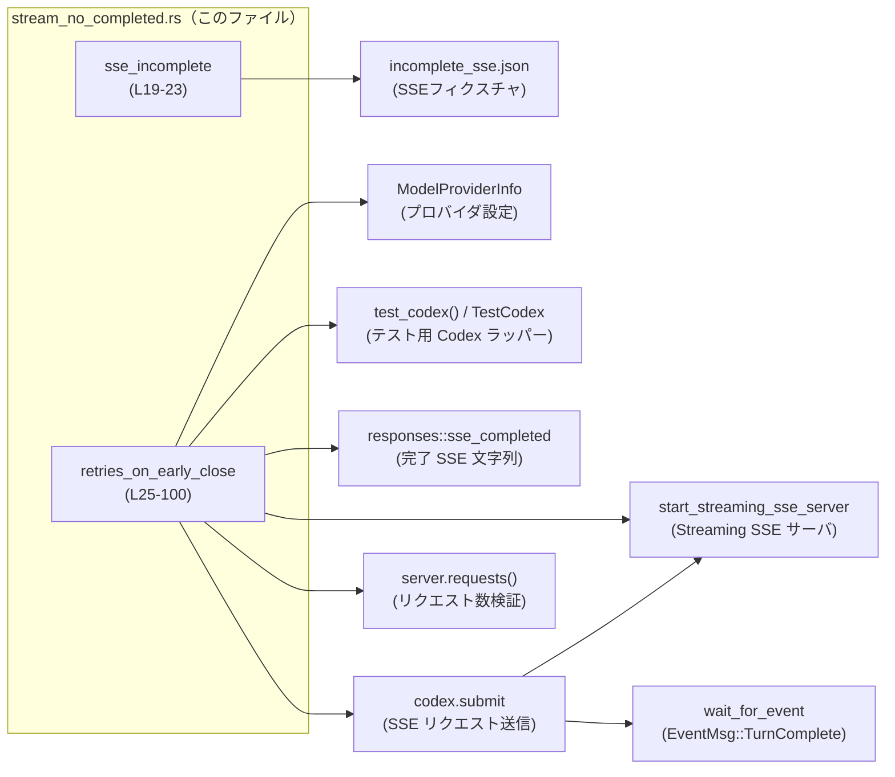
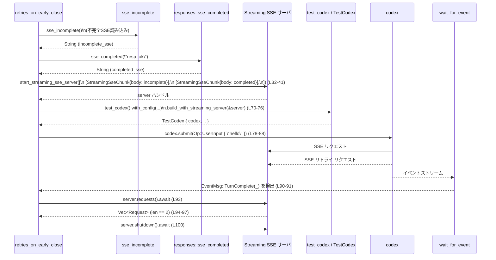

# core/tests/suite/stream_no_completed.rs コード解説

## 0. ざっくり一言

SSE（Server-Sent Events）ストリームが `response.completed` イベントを受け取る前に終了した場合に、エージェント（`codex`）がストリームをリトライすることを検証する統合テストです（`core/tests/suite/stream_no_completed.rs:L1-2`）。  
テスト用の SSE フィクスチャとモックサーバ、`TestCodex` を組み合わせて、実際のストリーミング処理を end-to-end で確認しています。

---

## 1. このモジュールの役割

### 1.1 概要

- このモジュールは **SSE ストリームが途中で切断された場合の再試行動作** を検証するためのテストを提供します。
- 不完全な SSE フィクスチャから 1 回目のリクエストを行い、再試行後に正常な SSE フィクスチャから `TurnComplete` イベントを受信できることを確認します（`core/tests/suite/stream_no_completed.rs:L29-41,L90-98`）。
- また、**リトライ回数を環境変数ではなく構造体フィールドで明示的に設定する**パターンを示しています（`core/tests/suite/stream_no_completed.rs:L44-45,L47-68`）。

### 1.2 アーキテクチャ内での位置づけ

このテストファイルは、テスト用の Codex ラッパーとモック SSE サーバを介して、Codex のストリーミング処理の一部を検証します。



- `retries_on_early_close` がテスト全体のオーケストレーションを行います（`core/tests/suite/stream_no_completed.rs:L25-100`）。
- `sse_incomplete` は 1 回目に使う不完全な SSE フィクスチャ文字列を読み込みます（`core/tests/suite/stream_no_completed.rs:L19-23`）。
- `start_streaming_sse_server` で 2 回分の SSE レスポンス（不完全 + 完了）を返すモックサーバを立ち上げます（`core/tests/suite/stream_no_completed.rs:L32-41`）。
- `test_codex` と `TestCodex` 経由で Codex をこのモックサーバに接続し、`codex.submit` でユーザー入力を送信します（`core/tests/suite/stream_no_completed.rs:L70-88`）。
- 最後に、モックサーバが 2 回呼び出されていることを `server.requests()` の結果で検証します（`core/tests/suite/stream_no_completed.rs:L93-98`）。

### 1.3 設計上のポイント

- **テスト用ユーティリティの活用**  
  フィクスチャ読み込み (`load_sse_fixture`)、SSE サーバ起動 (`start_streaming_sse_server`)、Codex 構築 (`test_codex`)、イベント待ち (`wait_for_event`) など、テスト専用のサポート関数を組み合わせて高レベルな統合テストを構成しています（`core/tests/suite/stream_no_completed.rs:L9-17,L32-41,L70-76,L90-91`）。
- **環境変数のグローバル状態を回避**  
  リトライ設定を `ModelProviderInfo` のフィールドで直接指定し、「環境変数を変更しない」方針がコメントで明示されています（`core/tests/suite/stream_no_completed.rs:L44-45,L47-68`）。
- **非同期・並行実行**  
  テストは `#[tokio::test(flavor = "multi_thread", worker_threads = 2)]` でマルチスレッドランタイム上に実行され、SSE サーバとクライアントが並行動作する前提です（`core/tests/suite/stream_no_completed.rs:L25`）。
- **明示的なリトライ条件の検証**  
  モックサーバへのリクエスト数を 2 回と主張することで、「1 回目が不完全 → 2 回目で成功」というリトライシナリオのみを検証対象にしています（`core/tests/suite/stream_no_completed.rs:L32-41,L93-98`）。

---

## 2. 主要な機能一覧

- `sse_incomplete`: 不完全な SSE イベント列を含む JSON フィクスチャファイルを読み込み、`String` として返します（`core/tests/suite/stream_no_completed.rs:L19-23`）。
- `retries_on_early_close`:  
  1. 不完全な SSE と完了 SSE を返すモックサーバを起動し、  
  2. Codex にユーザー入力を送信し、  
  3. `TurnComplete` イベントを待ち、  
  4. モックサーバへのリクエスト数が 2 回であることを検証する非同期テストです（`core/tests/suite/stream_no_completed.rs:L25-100`）。

---

## 3. 公開 API と詳細解説

### 3.1 コンポーネント一覧（関数・外部型・マクロ）

#### 3.1.1 このファイル内で定義されている関数

| 名前 | 種別 | 行範囲 (ファイル) | 役割 / 用途 |
|------|------|-------------------|-------------|
| `sse_incomplete` | 通常関数 | `core/tests/suite/stream_no_completed.rs:L19-23` | 不完全な SSE フィクスチャファイルを読み込み、その内容を `String` で返す |
| `retries_on_early_close` | 非同期テスト関数（`#[tokio::test]`） | `core/tests/suite/stream_no_completed.rs:L25-100` | SSE ストリームが早期終了した際に Codex がストリームのリトライを行うことを検証する |

#### 3.1.2 このファイルで使用している主な外部コンポーネント

このファイル自身は新しい型を定義していませんが、以下の外部型・マクロを利用しています。

| 名前 | 種別 | 行範囲 (使用箇所) | 役割 / 用途（このファイルの範囲で分かること） |
|------|------|-------------------|----------------------------------------------|
| `ModelProviderInfo` | 構造体 | `core/tests/suite/stream_no_completed.rs:L47-68` | モデルプロバイダに関する設定をまとめた構造体。`name`, `base_url`, `env_key`, `wire_api`, `request_max_retries`, `stream_max_retries` などのフィールドが利用されている |
| `WireApi` | 列挙体と思われる型 | `core/tests/suite/stream_no_completed.rs:L5,L57` | `WireApi::Responses` というバリアントが使用されている。詳細な意味はこのチャンクには現れません |
| `EventMsg` | 列挙体 | `core/tests/suite/stream_no_completed.rs:L6,L91` | イベント種別を表す型で、`EventMsg::TurnComplete(_)` へのマッチングに使用されている |
| `Op` | 列挙体 | `core/tests/suite/stream_no_completed.rs:L7,L79` | Codex に送る操作を表す型で、`Op::UserInput` バリアントが使用されている |
| `UserInput` | 列挙体 | `core/tests/suite/stream_no_completed.rs:L8,L80-83` | ユーザー入力を表す型で、`UserInput::Text` バリアントが使用されている |
| `find_resource!` | マクロ | `core/tests/suite/stream_no_completed.rs:L9,L20` | `"tests/fixtures/incomplete_sse.json"` へのパスを解決するマクロ。失敗時は `Result` を返し、`unwrap_or_else` でパニックに変換されている |
| `load_sse_fixture` | 関数 | `core/tests/suite/stream_no_completed.rs:L10,L22` | フィクスチャパスから SSE 用の `String` を読み込む関数 |
| `responses::sse_completed` | 関数 | `core/tests/suite/stream_no_completed.rs:L11,L30` | 正常に完了する SSE レスポンス文字列を返すテスト用ユーティリティ |
| `skip_if_no_network!` | マクロ | `core/tests/suite/stream_no_completed.rs:L12,L27` | ネットワークが利用できない環境でテストをスキップするためのマクロと推測されるが、具体的な挙動はこのチャンクには現れません |
| `StreamingSseChunk` | 構造体 | `core/tests/suite/stream_no_completed.rs:L13,L33-40` | SSE サーバが返すチャンクを表す構造体。`gate` と `body` フィールドが使われている |
| `start_streaming_sse_server` | 関数 | `core/tests/suite/stream_no_completed.rs:L14,L32-42` | `StreamingSseChunk` のベクタ列を受け取り、非同期に SSE サーバを起動し、`server` ハンドルなどを返す |
| `TestCodex` | 構造体 | `core/tests/suite/stream_no_completed.rs:L15,L70` | テスト用の Codex ラッパー。少なくとも `codex` フィールドを持つ |
| `test_codex` | 関数 | `core/tests/suite/stream_no_completed.rs:L16,L70-76` | Codex を構築するためのビルダーを返すテストユーティリティ |
| `wait_for_event` | 関数 | `core/tests/suite/stream_no_completed.rs:L17,L90-91` | Codex から特定のイベントが届くまで待機するヘルパ関数 |

> ※ これら外部コンポーネントの内部実装や詳細な契約は、このチャンクには現れないため不明です。

---

### 3.2 関数詳細

#### `sse_incomplete() -> String`

**概要**

- `"tests/fixtures/incomplete_sse.json"` というフィクスチャファイルを探し、その内容を `String` として読み込んで返すヘルパ関数です（`core/tests/suite/stream_no_completed.rs:L19-23`）。
- 不完全な SSE ストリームデータを 1 回目のリクエスト用に供給する役割を担います（`core/tests/suite/stream_no_completed.rs:L29`）。

**引数**

- 引数はありません。

**戻り値**

- `String`  
  フィクスチャファイルから読み込まれた SSE データ（文字列）です（`core/tests/suite/stream_no_completed.rs:L22`）。

**内部処理の流れ**

1. `find_resource!("tests/fixtures/incomplete_sse.json")` を呼び出し、フィクスチャファイルへのパスを解決しようとします（`core/tests/suite/stream_no_completed.rs:L20`）。
2. `unwrap_or_else(|err| panic!(...))` で、パスの解決に失敗した場合には即座にパニックを発生させます（`core/tests/suite/stream_no_completed.rs:L20-21`）。
3. 解決された `fixture` パスを `load_sse_fixture(fixture)` に渡し、ファイル内容を読み込んで `String` として返します（`core/tests/suite/stream_no_completed.rs:L22`）。

**Examples（使用例）**

この関数はテスト内でのみ利用されていますが、同様の使い方を以下に示します。

```rust
// 不完全な SSE フィクスチャを読み込む                             // tests/fixtures/incomplete_sse.json を読み込む
let sse_data: String = sse_incomplete();                             // sse_incomplete 関数を呼び出し、String を受け取る

// 受け取った文字列をモックサーバなどに渡す                        // 読み込んだ SSE データはこの後、モックサーバ構築などに利用できる
println!("fixture length = {}", sse_data.len());                     // 長さを出力して確認
```

**Errors / Panics**

- **パス解決失敗時にパニック**  
  `find_resource!` がエラーを返した場合、`unwrap_or_else` の中で `panic!` が呼ばれ、テストごとプロセスがパニック終了します（`core/tests/suite/stream_no_completed.rs:L20-21`）。
- `load_sse_fixture` 内部のエラー処理については、このチャンクには現れないため不明です。ここでは `Result` ではなく `String` を直接返しているため、エラーが発生する場合は内部でパニック、またはエラーを吸収して何らかの `String` を返している可能性がありますが、推測はできません（`core/tests/suite/stream_no_completed.rs:L22`）。

**Edge cases（エッジケース）**

- フィクスチャファイルが存在しない / パスが解決できない場合  
  → 即座にパニックし、テストが失敗します（`core/tests/suite/stream_no_completed.rs:L20-21`）。
- フィクスチャファイルの内容が空や不正なフォーマットである場合  
  → `load_sse_fixture` の実装に依存し、このチャンクからは挙動が分かりません（`core/tests/suite/stream_no_completed.rs:L22`）。

**使用上の注意点**

- この関数はテスト用であり、パス解決エラーを `panic!` によって処理します。そのため、**本番コードから利用する場合には適しません**。（`core/tests/suite/stream_no_completed.rs:L20-21`）
- フィクスチャファイルのパスや内容を変更する場合は、この関数と同じパスを前提にしている他のテストがないか確認する必要があります。

---

#### `retries_on_early_close()`

```rust
#[tokio::test(flavor = "multi_thread", worker_threads = 2)]
async fn retries_on_early_close() { /* ... */ }
```

**概要**

- マルチスレッドな `tokio` ランタイム上で実行される非同期テストです（`core/tests/suite/stream_no_completed.rs:L25`）。
- 不完全な SSE を返す 1 回目のストリームと、完了 SSE を返す 2 回目のストリームを用意し、Codex がストリームを 1 回リトライして `TurnComplete` イベントまで到達することを検証します（`core/tests/suite/stream_no_completed.rs:L29-41,L70-91,L93-98`）。

**引数**

- 引数はありません（テストランナーから直接呼び出されます）。

**戻り値**

- 戻り値型は暗黙に `()` です（`async fn ...` のため実際には `impl Future<Output = ()>` として扱われます）。  
  全ての処理が成功すれば `()` で終了し、途中の `unwrap` などでパニックするとテスト失敗になります（`core/tests/suite/stream_no_completed.rs:L70-76,L78-88`）。

**内部処理の流れ（アルゴリズム）**

1. **ネットワーク環境のチェック**  
   `skip_if_no_network!();` を実行し、ネットワークがない環境ではテストをスキップする想定です（`core/tests/suite/stream_no_completed.rs:L27`）。  
   実際のスキップ方法はマクロの実装に依存し、このチャンクからは分かりません。

2. **SSE フィクスチャの準備**  
   - `sse_incomplete()` を呼び、不完全な SSE データを取得します（`core/tests/suite/stream_no_completed.rs:L29`）。
   - `responses::sse_completed("resp_ok")` を呼び、完了 SSE データを取得します（`core/tests/suite/stream_no_completed.rs:L30`）。

3. **モック SSE サーバの起動**  
   `start_streaming_sse_server` に `Vec<Vec<StreamingSseChunk>>` を渡してサーバを起動します（`core/tests/suite/stream_no_completed.rs:L32-42`）。
   - 1 回目のレスポンスとして `StreamingSseChunk { gate: None, body: incomplete_sse }` を 1 要素持つベクタを指定（`core/tests/suite/stream_no_completed.rs:L32-36`）。
   - 2 回目のレスポンスとして `StreamingSseChunk { gate: None, body: completed_sse }` を 1 要素持つベクタを指定（`core/tests/suite/stream_no_completed.rs:L37-40`）。
   - `.await` でサーバが起動完了するまで待機し、`(server, _)` を受け取ります（`core/tests/suite/stream_no_completed.rs:L41-42`）。

4. **モデルプロバイダ設定の構築**  
   `ModelProviderInfo` 構造体を初期化し、以下のフィールドを設定します（`core/tests/suite/stream_no_completed.rs:L47-68`）。
   - `name`: `"openai".into()`（`core/tests/suite/stream_no_completed.rs:L48`）
   - `base_url`: `Some(format!("{}/v1", server.uri()))`（`core/tests/suite/stream_no_completed.rs:L49`）
   - `env_key`: `Some("PATH".into())`（`core/tests/suite/stream_no_completed.rs:L53`）  
     コメントでは、テスト環境に存在する前提の環境変数であること、および環境変数が未設定の場合は `ModelClient` がエラーを返すことが示されています（`core/tests/suite/stream_no_completed.rs:L50-52`）。
   - `wire_api`: `WireApi::Responses`（`core/tests/suite/stream_no_completed.rs:L57`）
   - `request_max_retries`: `Some(0)`（`core/tests/suite/stream_no_completed.rs:L62`）
   - `stream_max_retries`: `Some(1)`（`core/tests/suite/stream_no_completed.rs:L63`）
   - `stream_idle_timeout_ms`: `Some(2000)`（`core/tests/suite/stream_no_completed.rs:L64`）
   - その他のフィールドは `None` または `false` で初期化されています（`core/tests/suite/stream_no_completed.rs:L54-56,L58-60,L65-67`）。

5. **Codex インスタンスの構築**  
   - `test_codex()` を呼び、ビルダーオブジェクトを取得します（`core/tests/suite/stream_no_completed.rs:L70`）。
   - `.with_config(move |config| { config.model_provider = model_provider; })` で設定関数を渡し、`config.model_provider` に先ほど構築した `model_provider` を代入します（`core/tests/suite/stream_no_completed.rs:L71-73`）。
   - `.build_with_streaming_server(&server).await.unwrap()` で、モック SSE サーバに接続された `TestCodex` を構築し、`codex` フィールドを取り出します（`core/tests/suite/stream_no_completed.rs:L70-76`）。

6. **ユーザー入力の送信**  
   - `codex.submit(Op::UserInput { ... }).await.unwrap();` を呼び出して、ユーザー入力 `"hello"` をストリームとして送信します（`core/tests/suite/stream_no_completed.rs:L78-88`）。
   - `Op::UserInput` の `items` に `UserInput::Text { text: "hello".into(), text_elements: Vec::new() }` を指定し、その他フィールドは `None` です（`core/tests/suite/stream_no_completed.rs:L79-85`）。

7. **TurnComplete イベントの待機**  
   - `wait_for_event(&codex, |event| matches!(event, EventMsg::TurnComplete(_))).await;` を実行し、`EventMsg::TurnComplete(_)` が現れるまで待機します（`core/tests/suite/stream_no_completed.rs:L90-91`）。

8. **リトライ回数の検証**  
   - `let requests = server.requests().await;` でモックサーバに届いたリクエストの一覧を取得します（`core/tests/suite/stream_no_completed.rs:L93`）。
   - `assert_eq!(requests.len(), 2, "expected retry after incomplete SSE stream");` で、リクエスト数が 2 回であることを検証します（`core/tests/suite/stream_no_completed.rs:L94-97`）。

9. **サーバのシャットダウン**  
   - 最後に `server.shutdown().await;` を呼び、モック SSE サーバを停止します（`core/tests/suite/stream_no_completed.rs:L100`）。

**Examples（使用例）**

この関数自体はテストランナーから直接呼び出されるため、外部から明示的に呼ぶ想定はありません。  
同様のテストを追加する場合のパターンを簡略化した例を示します。

```rust
#[tokio::test(flavor = "multi_thread", worker_threads = 2)]       // マルチスレッド tokio ランタイム上のテスト
async fn my_stream_retry_test() {                                 // 独自のストリームリトライテスト
    skip_if_no_network!();                                        // ネットワークがなければスキップ（実際の挙動はマクロ次第）

    let incomplete_sse = sse_incomplete();                        // 不完全 SSE フィクスチャを読み込み
    let completed_sse = responses::sse_completed("resp_ok");      // 完了 SSE フィクスチャを取得

    let (server, _) = start_streaming_sse_server(vec![            // 2 回分の SSE 応答を設定してモックサーバ起動
        vec![StreamingSseChunk { gate: None, body: incomplete_sse }],
        vec![StreamingSseChunk { gate: None, body: completed_sse }],
    ]).await;

    let model_provider = ModelProviderInfo {                      // モデルプロバイダ設定を構築
        name: "openai".into(),
        base_url: Some(format!("{}/v1", server.uri())),
        env_key: Some("PATH".into()),
        wire_api: WireApi::Responses,
        request_max_retries: Some(0),
        stream_max_retries: Some(1),
        stream_idle_timeout_ms: Some(2000),
        ..Default::default()                                      // 実際には Default 実装の有無はこのチャンクからは不明
    };

    let TestCodex { codex, .. } = test_codex()                    // Codex ビルダーを取得
        .with_config(move |config| {                              // コンフィグを上書き
            config.model_provider = model_provider;
        })
        .build_with_streaming_server(&server)                     // モックサーバと接続
        .await
        .unwrap();                                                // 構築失敗時はパニックさせてテスト失敗

    codex.submit(Op::UserInput {                                  // ユーザー入力を送信
        items: vec![UserInput::Text {
            text: "hello".into(),
            text_elements: Vec::new(),
        }],
        final_output_json_schema: None,
        responsesapi_client_metadata: None,
    })
    .await
    .unwrap();

    wait_for_event(&codex, |event|                               // TurnComplete イベントを待つ
        matches!(event, EventMsg::TurnComplete(_))
    ).await;

    let requests = server.requests().await;                       // 送信されたリクエスト一覧を取得
    assert_eq!(requests.len(), 2);                                // リクエストが 2 回であることを確認

    server.shutdown().await;                                      // サーバを停止
}
```

> 上記の `Default::default()` の行については、このファイルには `ModelProviderInfo` の `Default` 実装が現れないため、実際に利用できるかどうかは不明です。サンプルとしてのイメージに留まります。

**Errors / Panics**

このテスト関数では、以下の箇所でパニックが発生しうることが分かります。

- Codex 構築時  
  `.build_with_streaming_server(&server).await.unwrap();` により、ビルドが `Err` を返した場合はパニックします（`core/tests/suite/stream_no_completed.rs:L70-76`）。
- ユーザー入力送信時  
  `codex.submit(...).await.unwrap();` により、送信または処理中にエラーが発生した場合はパニックします（`core/tests/suite/stream_no_completed.rs:L78-88`）。
- アサーション失敗時  
  `assert_eq!(requests.len(), 2, ...)` により、リクエスト数が 2 でない場合はテスト失敗（パニック）となります（`core/tests/suite/stream_no_completed.rs:L94-97`）。
- `skip_if_no_network!` マクロや `start_streaming_sse_server`、`wait_for_event` 内部のエラー処理はこのチャンクには現れないため、エラー発生時の挙動は不明です。

**Edge cases（エッジケース）**

- **ネットワークが利用できない環境**  
  `skip_if_no_network!();` により、テストをスキップするか、あるいはパニックするかなどの挙動が想定されますが、詳細は不明です（`core/tests/suite/stream_no_completed.rs:L27`）。
- **2 回目の SSE ストリームが正しく返ってこない場合**  
  - `wait_for_event` がどう挙動するか（タイムアウトするか無限待ちか）は、このチャンクからは分かりません（`core/tests/suite/stream_no_completed.rs:L90-91`）。
- **Codex がリトライを実行しない場合**  
  - `requests.len()` が 1 となり、`assert_eq!` が失敗してテストが落ちます（`core/tests/suite/stream_no_completed.rs:L93-98`）。
- **リクエストが 3 回以上送信される場合**  
  - このテストでは `requests.len() == 2` を期待しているため、3 回以上であれば同様にテスト失敗となります（`core/tests/suite/stream_no_completed.rs:L94-97`）。

**使用上の注意点（言語特有の観点を含む）**

- **非同期 / 並行性**  
  - テストは `tokio` のマルチスレッドランタイムで実行され、SSE サーバとクライアントが別スレッドで並行動作する可能性があります（`core/tests/suite/stream_no_completed.rs:L25,L32-42`）。
  - 共有リソース（環境変数など）を直接変更しないように、`ModelProviderInfo` のフィールドで設定を完結させている点は、**グローバル状態による競合を避ける**という意味で安全性に配慮した設計といえます（`core/tests/suite/stream_no_completed.rs:L44-45,L47-68`）。
- **環境変数とセキュリティ**  
  - テストでは `env_key: Some("PATH".into())` としており、既存の `PATH` 環境変数を用いています（`core/tests/suite/stream_no_completed.rs:L53`）。  
    コメントには「プロバイダ用の環境変数が設定されていないと `ModelClient` がエラーを返す」とあるだけで、値の具体的な用途やセキュリティ的性質はこのチャンクには現れません（`core/tests/suite/stream_no_completed.rs:L50-52`）。
- **パニックベースのエラーハンドリング**  
  - テストであるため、`unwrap` や `assert_eq!` によるパニックを許容しており、エラーは「テスト失敗」として扱われます。  
    本番コードに同様の書き方を持ち込む場合は注意が必要です。

---

### 3.3 その他の関数

- このファイルには、上記 2 つ以外の関数定義はありません（`core/tests/suite/stream_no_completed.rs` 全体）。

---

## 4. データフロー

このテストにおける典型的なデータフローをシーケンス図で示します。



**要点**

- ユーザー入力 `"hello"` は `codex.submit` を通じて SSE サーバへ送信されます（`core/tests/suite/stream_no_completed.rs:L78-88`）。
- モック SSE サーバは 1 回目に不完全な SSE を返し、Codex は内部でストリームを再接続して 2 回目の完全な SSE を取得します。この内部ロジック自体はこのファイルには現れませんが、`requests.len() == 2` という検証結果から「2 回接続された」ことのみが確認されています（`core/tests/suite/stream_no_completed.rs:L32-41,L93-98`）。
- `wait_for_event` は Codex からのイベントストリームを監視し、`EventMsg::TurnComplete(_)` が届いたタイミングで完了します（`core/tests/suite/stream_no_completed.rs:L90-91`）。

---

## 5. 使い方（How to Use）

### 5.1 基本的な使用方法

このモジュールはテスト専用であり、通常はテストランナーから一括実行されます。

- テストの基本的な実行方法（一般論）  
  `cargo test` などでテストスイートを実行すると、このファイルの `retries_on_early_close` も含めて実行される設定が想定されますが、実際のテストターゲット名や構成は Cargo.toml 側の定義に依存するため、このチャンクからは分かりません。

テストコード内での典型的なフローは以下のようになります。

```rust
// 1. フィクスチャの読み込み                                      // 不完全な SSE と完了 SSE を準備する
let incomplete_sse = sse_incomplete();                             // 不完全 SSE フィクスチャを読み込み
let completed_sse = responses::sse_completed("resp_ok");           // 完了 SSE フィクスチャを取得

// 2. モック SSE サーバの起動                                     // 2 回分のストリーム応答を持つサーバを起動
let (server, _) = start_streaming_sse_server(vec![
    vec![StreamingSseChunk { gate: None, body: incomplete_sse }],
    vec![StreamingSseChunk { gate: None, body: completed_sse }],
]).await;

// 3. Codex の構築                                                 // ModelProviderInfo を設定して Codex を構築
let model_provider = /* ModelProviderInfo の初期化（本テストと同様） */;
let TestCodex { codex, .. } = test_codex()
    .with_config(move |config| { config.model_provider = model_provider; })
    .build_with_streaming_server(&server)
    .await
    .unwrap();

// 4. ユーザー入力を送信                                           // "hello" という入力を送信
codex.submit(Op::UserInput {
    items: vec![UserInput::Text {
        text: "hello".into(),
        text_elements: Vec::new(),
    }],
    final_output_json_schema: None,
    responsesapi_client_metadata: None,
})
.await
.unwrap();

// 5. 完了イベントを待機                                           // TurnComplete イベントを待つ
wait_for_event(&codex, |event| matches!(event, EventMsg::TurnComplete(_))).await;

// 6. リクエスト回数を検証                                         // サーバへの接続回数を検証
let requests = server.requests().await;
assert_eq!(requests.len(), 2);

// 7. サーバの停止                                                 // モックサーバを停止
server.shutdown().await;
```

### 5.2 よくある使用パターン

このファイルのパターンから、以下のようなテストパターンが抽出できます。

1. **SSE ストリームの異常系テスト**
   - 不完全な SSE、エラーを含む SSE、タイムアウトする SSE など複数のフィクスチャを用意し、`StreamingSseChunk` のリストを変えることで、ストリームの異常時挙動を検証できます（`core/tests/suite/stream_no_completed.rs:L32-41`）。
2. **リトライ設定のバリエーションテスト**
   - `ModelProviderInfo` の `request_max_retries` や `stream_max_retries` の値を変更し、リトライ回数による挙動の違いを確認できます（`core/tests/suite/stream_no_completed.rs:L61-63`）。  
     ただし、これらフィールドの意味や実際の利用方法はこのチャンクには現れないため、正確な契約は外部ドキュメントや実装を参照する必要があります。

### 5.3 よくある間違い（想定される誤用）

このチャンクから読み取れる範囲で、起こりそうな誤用と正しいパターンの対比です。

```rust
// 誤り例: モックサーバを Codex に紐付けずに submit している
let TestCodex { codex, .. } = test_codex().build().await.unwrap(); // これはこのチャンクには現れない仮の呼び方
// codex は実際の外部エンドポイントに接続されるかもしれない
let _ = codex.submit(/* ... */).await;

// 正しい例: build_with_streaming_server(&server) を使ってモックサーバに接続
let (server, _) = start_streaming_sse_server(/* ... */).await;
let TestCodex { codex, .. } = test_codex()
    .with_config(move |config| { config.model_provider = model_provider; })
    .build_with_streaming_server(&server)
    .await
    .unwrap();
let _ = codex.submit(/* ... */).await;
```

> 上記の「誤り例」の `build()` のような関数は、このファイルには登場しません。  
> 「モックサーバを渡さない場合の違い」を説明するための仮想的な例であり、実在の関数はテストサポートコードを確認する必要があります。

### 5.4 使用上の注意点（まとめ）

- **フィクスチャとテストの整合性**  
  - `sse_incomplete` が読み込むフィクスチャは、「`response.completed` を含まない不完全なストリーム」であることがテストの前提になっています（モジュールコメントより、`core/tests/suite/stream_no_completed.rs:L1-2,L19-23`）。  
    フィクスチャの内容を変更する場合は、テストの意図と整合しているか確認する必要があります。
- **環境変数への依存**  
  - `env_key: Some("PATH".into())` により、テスト環境の `PATH` が存在することに依存しています（`core/tests/suite/stream_no_completed.rs:L50-53`）。  
    別の環境変数を用いるように変更する場合は、テスト環境全体への影響を考慮する必要があります。
- **非同期テストと共有状態**  
  - `#[tokio::test(flavor = "multi_thread")]` により、複数のテストが並行して実行される可能性があります（`core/tests/suite/stream_no_completed.rs:L25`）。  
    グローバル状態（環境変数やシングルトン）を変更しない方針は、並行実行時の競合やテスト間干渉を避けるために重要です。
- **パフォーマンス上の観点**  
  - このテストでは `stream_idle_timeout_ms: Some(2000)` として 2 秒のタイムアウトらしき値が設定されています（`core/tests/suite/stream_no_completed.rs:L64`）。  
    実際にタイムアウトとして扱われるかは実装依存ですが、値を大きくするとテストが遅くなる可能性があります。

---

## 6. 変更の仕方（How to Modify）

### 6.1 新しい機能（テストケース）を追加する場合

このファイルと同様のテストを追加する場合、次のステップが自然です。

1. **新しい SSE フィクスチャを追加**
   - `tests/fixtures/` 配下に新しい JSON フィクスチャファイルを作成します。  
     ファイル名・形式は既存の `incomplete_sse.json` を参考にする必要がありますが、その中身はこのチャンクには現れないため不明です。
2. **フィクスチャ読み込み関数の追加**
   - `sse_incomplete` と同様の関数を追加し、新しいフィクスチャを読み込むようにします（`core/tests/suite/stream_no_completed.rs:L19-23` を参照）。
3. **新しい `#[tokio::test]` 関数の追加**
   - `retries_on_early_close` をコピーして名前を変更し、新しいフィクスチャやリトライ設定に合わせて内部処理を変更します（`core/tests/suite/stream_no_completed.rs:L25-100`）。
   - 特に、`start_streaming_sse_server` に渡す `StreamingSseChunk` の構成と `ModelProviderInfo` の各フィールドを調整します（`core/tests/suite/stream_no_completed.rs:L32-41,L47-68`）。
4. **検証内容の調整**
   - 新たに検証したい条件（リクエスト回数、イベント種別など）に応じて、`assert_eq!` や `wait_for_event` の条件を変更します（`core/tests/suite/stream_no_completed.rs:L90-98`）。

### 6.2 既存の機能（このテスト）を変更する場合

- **影響範囲の確認**
  - このテスト自体は他のテストから参照されていないため（関数は `pub` ではない、`core/tests/suite/stream_no_completed.rs` 全体）、直接の依存はありません。
  - ただし、`test_codex` や `start_streaming_sse_server` の API 仕様が変わると、このテストも修正が必要になります。
- **契約（前提条件・返り値）の確認**
  - `ModelProviderInfo` の各フィールドの意味やデフォルト値、`request_max_retries` / `stream_max_retries` の契約については、このチャンクには現れないため、実装側またはドキュメントを参照する必要があります（`core/tests/suite/stream_no_completed.rs:L47-68`）。
  - `wait_for_event` がどの程度の時間待機し、タイムアウト時にどう振る舞うかも確認が必要です（`core/tests/suite/stream_no_completed.rs:L90-91`）。
- **テストの安定性への配慮**
  - タイムアウト値（`stream_idle_timeout_ms` など）を短くしすぎると、環境によってはテストが不安定になる可能性があります。逆に長くしすぎるとテスト全体が遅くなる可能性があります（`core/tests/suite/stream_no_completed.rs:L64`）。
  - ネットワーク依存部分（`skip_if_no_network!`）の挙動変更は、CI 環境などでのテスト結果に影響するため注意が必要です。

---

## 7. 関連ファイル

このモジュールと密接に関係するファイル・ディレクトリ（このチャンクから分かる範囲）をまとめます。

| パス / コンポーネント | 役割 / 関係 |
|-----------------------|------------|
| `tests/fixtures/incomplete_sse.json` | `sse_incomplete` が読み込む SSE フィクスチャファイル（`core/tests/suite/stream_no_completed.rs:L19-23`）。内容はこのチャンクには現れませんが、不完全な SSE ストリームを表すことがコメントから示唆されています（`core/tests/suite/stream_no_completed.rs:L1-2`）。 |
| `core_test_support::load_sse_fixture` | フィクスチャパスから SSE 文字列を読み込むヘルパ関数（`core/tests/suite/stream_no_completed.rs:L10,L22`）。 |
| `core_test_support::streaming_sse` モジュール | `StreamingSseChunk` および `start_streaming_sse_server` を提供し、モック SSE サーバの構築を担います（`core/tests/suite/stream_no_completed.rs:L13-14,L32-41`）。 |
| `core_test_support::test_codex` モジュール | `test_codex` 関数と `TestCodex` 構造体を提供し、テスト用の Codex インスタンスを構築します（`core/tests/suite/stream_no_completed.rs:L15-16,L70-76`）。 |
| `core_test_support::responses` モジュール | `responses::sse_completed` を提供し、正常完了する SSE レスポンス文字列を生成します（`core/tests/suite/stream_no_completed.rs:L11,L30`）。 |
| `core_test_support::wait_for_event` | Codex から特定のイベントが届くまで非同期に待機するヘルパ関数です（`core/tests/suite/stream_no_completed.rs:L17,L90-91`）。 |
| `codex_model_provider_info` クレート | `ModelProviderInfo` と `WireApi` を提供し、モデルプロバイダ設定のために利用されています（`core/tests/suite/stream_no_completed.rs:L4-5,L47-68`）。 |
| `codex_protocol` クレート | `EventMsg`, `Op`, `UserInput` といったプロトコル関連の型を提供します（`core/tests/suite/stream_no_completed.rs:L6-8,L79-83,L90-91`）。 |

> これら関連ファイル・モジュールの内部実装や詳細な仕様は、このチャンクには現れないため、「役割」の説明はこのテストコードから読み取れる範囲に留めています。
