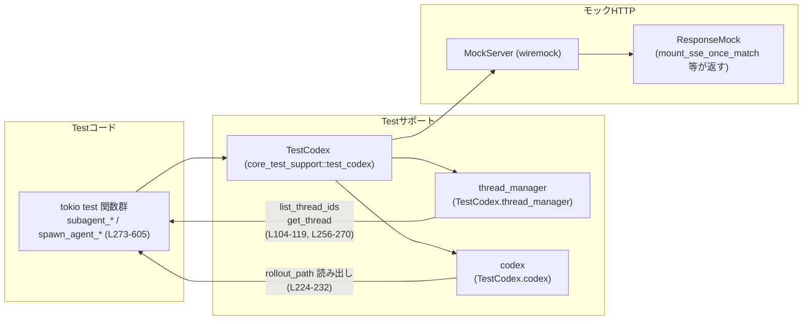
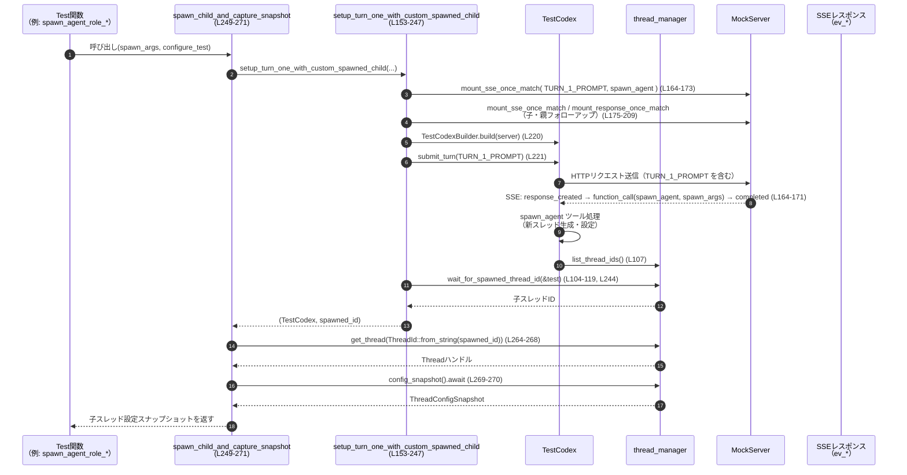

# core/tests/suite/subagent_notifications.rs コード解説

## 0. ざっくり一言

このファイルは、`spawn_agent` ツールでサブエージェント（子スレッド）が生成されるときの **通知・コンテキスト継承・モデル設定・ロール設定・開発者コンテキスト** の挙動を、モック HTTP サーバとテスト用ランタイム `TestCodex` を使って検証する統合テスト群です。

---

## 1. このモジュールの役割

### 1.1 概要

- このモジュールは **サブエージェント（サブスレッド）をスポーンする機能** の仕様をテストするために存在し、以下の点を検証します。
  - サブエージェント通知 `<subagent_notification>` が適切なタイミングで親スレッドに反映されること
  - サブエージェントに **フォークされた親コンテキスト** や **開発者インストラクション** が期待通りに渡ること
  - スポーン時に指定する `model` / `reasoning_effort` と、継承設定・ロール設定との優先順位
  - `spawn_agent` ツールの `agent_type` パラメータ説明文に、ロックされたロール設定が明示されること

### 1.2 アーキテクチャ内での位置づけ

このテストは、テストサポートの `TestCodex` とモック HTTP サーバ `wiremock::MockServer` を中心に構成されています。テスト → Codex → モックサーバ → 応答モック の流れで LLM の振る舞いを再現し、その中でサブエージェント生成や通知の挙動を確認します。



※ 行番号は `core/tests/suite/subagent_notifications.rs` のものです。

### 1.3 設計上のポイント

- **責務分割**
  - `body_contains` / `has_subagent_notification` / `tool_parameter_description` / `role_block` が **HTTPリクエスト内容やテキストの検査ユーティリティ** を担います（L40-88, L90-102）。
  - `wait_for_spawned_thread_id` / `wait_for_requests` が **非同期ポーリングとタイムアウト** を一元的に扱います（L104-119, L121-135）。
  - `setup_turn_one_with_custom_spawned_child` / `spawn_child_and_capture_snapshot` が **テストシナリオのセットアップ（モックSSE・TestCodex構築・サブスレッド取得）** を共通化します（L153-247, L249-271）。
- **状態管理**
  - このファイル自体は状態を持たず、状態はすべて `TestCodex`・`thread_manager`・モックサーバ側に保持されます。
- **エラーハンドリング**
  - すべての非テスト関数は `anyhow::Result` を返し、`?` と `anyhow::bail!` でエラーを伝播・生成します（例: L115, L131, L237-239）。
  - デコードなど失敗しやすい箇所は `Option` に落として安全に無視しています（`body_contains`, L50-57）。
- **並行性**
  - すべてのテストは `#[tokio::test(flavor = "multi_thread", worker_threads = 2)]` でマルチスレッド・ランタイム上で実行されます（L273, L299, L391, L417, L510, L552）。
  - ポーリング処理は `Instant` による締め切りと `sleep(Duration::from_millis(10))` により、ビジーウェイトを避けつつ **有限時間で必ず終了** するようになっています（L105-118, L124-134, L228-242, L367-384, L475-495）。

---

## 2. 主要な機能一覧（コンポーネントインベントリー）

### 2.1 関数・テスト一覧

| 名前 | 種別 | 役割 / 用途 | 行範囲 |
|------|------|-------------|--------|
| `body_contains` | ヘルパー関数 | HTTPリクエストボディ（zstd対応）に特定文字列が含まれるか検査 | `subagent_notifications.rs:L40-58` |
| `has_subagent_notification` | ヘルパー関数 | `ResponsesRequest` 内の user メッセージに `<subagent_notification>` が含まれるか検査 | `L60-64` |
| `tool_parameter_description` | ヘルパー関数 | ツール一覧 JSON から特定ツール・パラメータの description を取り出す | `L66-88` |
| `role_block` | ヘルパー関数 | 説明テキストから `role_name: { ... }` ブロックのみを抽出 | `L90-102` |
| `wait_for_spawned_thread_id` | ヘルパー関数（async） | 親とは異なる thread ID が作成されるのを一定時間ポーリング | `L104-119` |
| `wait_for_requests` | ヘルパー関数（async） | `ResponseMock` に少なくとも1件のリクエストが届くまでポーリング | `L121-135` |
| `setup_turn_one_with_spawned_child` | セットアップ関数（async） | 1ターン目でサブエージェントをスポーンする標準シナリオの構築 | `L137-151` |
| `setup_turn_one_with_custom_spawned_child` | セットアップ関数（async） | spawn 引数・遅延・ロール等をカスタマイズ可能な1ターン目セットアップ | `L153-247` |
| `spawn_child_and_capture_snapshot` | セットアップ関数（async） | サブスレッド生成後、その thread の `ThreadConfigSnapshot` を取得 | `L249-271` |
| `subagent_notification_is_included_without_wait` | テスト | 子の完了を待たなくても `<subagent_notification>` が次ターンに含まれるか検証 | `L273-297` |
| `spawned_child_receives_forked_parent_context` | テスト | 子スレッドが親のコンテキストをフォークして受け取り、spawn 呼び出し情報は含まないことを検証 | `L299-389` |
| `spawn_agent_requested_model_and_reasoning_override_inherited_settings_without_role` | テスト | ロール指定なしでは spawn 引数の `model`/`reasoning_effort` が継承設定を上書きすることを検証 | `L391-415` |
| `spawned_multi_agent_v2_child_receives_xml_tagged_developer_context` | テスト | MultiAgentV2 有効時に、XMLタグ付きの開発者コンテキストが子に渡ることを検証 | `L417-508` |
| `spawn_agent_role_overrides_requested_model_and_reasoning_settings` | テスト | `agent_type` によるロール設定が、spawn 引数のモデル設定より優先されることを検証 | `L510-550` |
| `spawn_agent_tool_description_mentions_role_locked_settings` | テスト | `spawn_agent` ツールの `agent_type` パラメータ説明にロールのロック設定が反映されることを検証 | `L552-605` |

※ このファイル内で新規に定義される構造体・列挙体はありません。

---

## 3. 公開 API と詳細解説

このファイルはテストモジュールのため、**外部モジュールから利用される公開 API は想定されていません**。ここでは、再利用性が高く「コアロジック」といえるヘルパー関数と、代表的なテスト関数を対象に詳細を記述します。

### 3.1 型一覧（参照している主な外部型）

| 名前 | 種別 | 役割 / 用途 | 定義元 |
|------|------|-------------|--------|
| `TestCodex` | 構造体 | Codex コアを統合テストしやすくするテストラッパー。スレッド管理・設定などにアクセス可能 | `core_test_support::test_codex` |
| `ThreadConfigSnapshot` | 構造体 | 特定スレッドの設定スナップショット（モデル名や reasoning_effort など） | `codex_core` |
| `AgentRoleConfig` | 構造体 | エージェントロール（`agent_type`）の設定情報。外部 TOML ファイルを指す | `codex_core::config` |
| `ResponsesRequest` | 構造体 | モックサーバに送られた LLM リクエストを表すテスト用型 | `core_test_support::responses` |
| `MockServer` | 構造体 | `wiremock` による HTTP モックサーバ | `wiremock` |
| `ReasoningEffort` | 列挙体 | モデルの推論強度 (`Low`/`High` など) を表す | `codex_protocol::openai_models` |
| `ThreadId` | 構造体 | スレッドIDを表すラッパー型 | `codex_protocol` |

### 3.2 重要関数の詳細

#### `body_contains(req: &wiremock::Request, text: &str) -> bool`  （L40-58）

**概要**

- HTTP リクエスト `req` のボディに、指定した文字列 `text` が含まれているか判定します。
- `content-encoding: zstd` の場合は zstd 展開してから UTF-8 文字列として検査します。

**引数**

| 引数名 | 型 | 説明 |
|--------|----|------|
| `req` | `&wiremock::Request` | モックサーバに届いた HTTP リクエスト |
| `text` | `&str` | ボディ中に含まれるかどうか確認するサブ文字列 |

**戻り値**

- `bool`: 展開・デコードに成功し、ボディ中に `text` が含まれていれば `true`、そうでなければ `false`。

**内部処理の流れ**

1. ヘッダ `content-encoding` を調べ、`zstd` が含まれているか判定する（L41-49）。
2. `zstd` の場合は `zstd::stream::decode_all` でボディを展開し、失敗した場合は `None` にする（L50-52）。
3. 非圧縮の場合はそのまま `req.body` をクローンする（L52-54）。
4. `bytes` を `String::from_utf8` で UTF-8 文字列に変換し、失敗時は `None` にする（L55-56）。
5. 変換に成功した場合は `body.contains(text)` で部分一致を判定し、その結果を返す（L56-57）。

**Examples（使用例）**

```rust
// MockServer から取得した request に "spawn_agent" という文字が含まれるか確認する
if body_contains(&request, "spawn_agent") {
    // spawn_agent ツール呼び出しを含むリクエストと判定できる
}
```

**Errors / Panics**

- この関数は `Result` を返さず、内部で起こりうるエラー（zstd展開・UTF-8変換失敗）はすべて `None` として扱い、結果として `false` を返します。
- panic を起こしません（`unwrap` や `expect` は使用していません）。

**Edge cases（エッジケース）**

- `content-encoding` が存在しない場合: 非圧縮として扱います（L50-54）。
- ボディが zstd 以外の圧縮形式でエンコードされている場合: 展開に失敗し `None` となり、`false` が返ります。
- ボディが UTF-8 でない場合: `String::from_utf8` が失敗し `false` を返します。
- `text` が空文字列 `""` の場合: `body.contains("")` は常に `true` なので、UTF-8変換に成功すれば `true` になります。

**使用上の注意点**

- 圧縮形式が zstd 以外の場合は対応していないため、テストで他形式を使う場合は別のヘルパーが必要です。
- ボディサイズに対する特別な制限はありませんが、`decode_all` は全体をメモリに展開するため、非常に大きなボディではメモリ消費が増加します。

---

#### `wait_for_spawned_thread_id(test: &TestCodex) -> Result<String>` （L104-119）

**概要**

- `TestCodex` が管理するスレッド一覧を監視し、**親スレッドとは異なる thread ID（子スレッド）** が登場するのを最大2秒まで待ちます。
- 最初に見つかった子スレッド ID を `String` として返します。

**引数**

| 引数名 | 型 | 説明 |
|--------|----|------|
| `test` | `&TestCodex` | テスト用 Codex ランタイム。`thread_manager` にアクセスします |

**戻り値**

- `Result<String>`:
  - `Ok(spawned_id)`: 親とは異なる thread ID が見つかった場合、その ID 文字列。
  - `Err(anyhow::Error)`: 2秒以内に子スレッドが見つからなかった場合（タイムアウト）。

**内部処理の流れ**

1. 現在時刻に 2 秒を加えた `deadline` を計算（L105）。
2. ループで `test.thread_manager.list_thread_ids().await` を呼び、全スレッドIDを取得（L107）。
3. 親スレッド `test.session_configured.session_id` と異なる ID を `.find` で探す（L108-110）。
4. 見つかれば `Ok(spawned_id.to_string())` を返して終了（L112）。
5. 現在時刻が `deadline` を超えていれば `anyhow::bail!` でエラー終了（L114-115）。
6. それ以外の場合は 10ms スリープして再試行（L117）。

**Examples（使用例）**

```rust
// setup_turn_one_with_custom_spawned_child 内部での利用（L244）
let spawned_id = wait_for_spawned_thread_id(&test).await?;
// 以降、spawned_id を ThreadId に変換して設定を取得する（L264-270）
```

**Errors / Panics**

- 子スレッドが 2 秒以内に生成されない場合に `Err("timed out waiting for spawned thread id")` を返します（L115）。
- panic は発生しません。

**Edge cases**

- 複数の子スレッドが存在する場合: 最初に見つかった1つだけを返します。
- 親以外のスレッドが最初から存在している場合: 最初のループでその ID が返されます。
- システム時間の変更に対する特別な保護はありませんが、`Instant` はモノトニッククロックを使うため安全です。

**使用上の注意点**

- **契約**: この関数を呼ぶ前に、何らかの操作（`submit_turn` など）で子スレッド生成がトリガーされていることが前提です。
- テスト環境が極端に遅い場合、2秒では足りずテストが失敗する可能性があります。必要に応じてタイムアウト値を調整することが考えられます。

---

#### `wait_for_requests(mock: &core_test_support::responses::ResponseMock) -> Result<Vec<ResponsesRequest>>` （L121-135）

**概要**

- SSE/HTTP モック (`ResponseMock`) に対して、少なくとも1件のリクエストが到着するまでポーリングし、そのリクエスト一覧を返します。

**引数**

| 引数名 | 型 | 説明 |
|--------|----|------|
| `mock` | `&core_test_support::responses::ResponseMock` | `mount_sse_once_match` や `mount_response_once_match` が返すモック |

**戻り値**

- `Result<Vec<ResponsesRequest>>`:
  - `Ok(requests)`: 1件以上のリクエストが観測された場合、そのスナップショット。
  - `Err(anyhow::Error)`: 2秒以内に1件も届かなかった場合。

**内部処理の流れ**

1. 2秒後の締め切り `deadline` を計算（L124）。
2. ループ内で `mock.requests()` を呼び出し、現在までに届いたリクエスト一覧を取得（L126）。
3. ベクタが空でなければ `Ok(requests)` を返す（L127-128）。
4. 締め切りを過ぎていれば `anyhow::bail!` でエラーを返す（L130-131）。
5. そうでなければ 10ms スリープして再試行（L133）。

**Examples（使用例）**

```rust
// 例: 2ターン目のリクエストにサブエージェント通知が含まれるか検証（L281-295）
let turn2 = mount_sse_once_match(&server, /* ... */).await;
test.submit_turn(TURN_2_NO_WAIT_PROMPT).await?;
let turn2_requests = wait_for_requests(&turn2).await?;
assert!(turn2_requests.iter().any(has_subagent_notification));
```

**Errors / Panics**

- タイムアウト時は `"expected at least 1 request, got 0"` などのメッセージで `Err` を返します（L131）。
- panic はありません。

**Edge cases**

- `mock.requests()` が常に空のままの場合: 2秒後にタイムアウト。
- 2秒以内に複数リクエストが届いた場合: すべてを含む `Vec` が返ります。
- `mock.requests()` がスレッドセーフな内部実装であることが前提です（このファイルからは実装詳細は分かりません）。

**使用上の注意点**

- **契約**: 事前に該当するリクエストを発生させる操作（`submit_turn` 等）が実行されている必要があります。
- 高頻度に呼び出しても CPU 使用率は低く抑えられますが、スリープ間隔やタイムアウト値はテストの安定性に影響します。

---

#### `setup_turn_one_with_custom_spawned_child(...) -> Result<(TestCodex, String)>` （L153-247）

```rust
async fn setup_turn_one_with_custom_spawned_child(
    server: &MockServer,
    spawn_args: serde_json::Value,
    child_response_delay: Option<Duration>,
    wait_for_parent_notification: bool,
    configure_test: impl FnOnce(TestCodexBuilder) -> TestCodexBuilder,
) -> Result<(TestCodex, String)>
```

**概要**

- 「1ターン目のユーザー入力で `spawn_agent` を呼び出し、子スレッドを作成する」統合テストシナリオを柔軟に構成するための中核ヘルパーです。
- モックサーバへの SSE 応答・子/親のメッセージ・子のレスポンス遅延・親ロールアウトへの通知反映・`TestCodex` 構築までを一手に担います。

**引数**

| 引数名 | 型 | 説明 |
|--------|----|------|
| `server` | `&MockServer` | Wiremock のモックサーバ |
| `spawn_args` | `serde_json::Value` | `spawn_agent` に渡す JSON 引数（`message`, `model`, `agent_type` など） |
| `child_response_delay` | `Option<Duration>` | 子スレッドに対する応答の遅延。`Some` なら遅延付き、`None` なら即時応答 |
| `wait_for_parent_notification` | `bool` | 親スレッドのロールアウトに `<subagent_notification>` が含まれるまで待つかどうか |
| `configure_test` | クロージャ | `TestCodexBuilder` に対する追加設定（ロール設定など）を適用するクロージャ |

**戻り値**

- `Result<(TestCodex, String)>`:
  - `Ok((test, spawned_id))`: 構築済み `TestCodex` と、生成された子スレッド ID 文字列。
  - `Err(anyhow::Error)`: モック設定・ビルド・送信・待機のどこかで失敗した場合。

**内部処理の流れ（アルゴリズム）**

1. `spawn_args` を JSON 文字列に変換（L162）。
2. 親ターン（`TURN_1_PROMPT`）への SSE 応答をセットアップ:
   - `body_contains(req, TURN_1_PROMPT)` にマッチするリクエストに対し、
   - `ev_response_created` → `ev_function_call(spawn_agent, spawn_args)` → `ev_completed` の SSE を返す（L164-173）。
3. 子スレッド用 SSE（完了メッセージを含む）を構築（L175-179）。
4. 子リクエストのモックを設定:
   - フィルタ: `CHILD_PROMPT` を含み、かつ `SPAWN_CALL_ID` を含まないリクエスト（L183-185）。
   - `child_response_delay` に応じて `mount_response_once_match` + `set_delay` または `mount_sse_once_match` を使用（L180-198）。
5. 親のフォローアップ（`SPAWN_CALL_ID` を含むリクエスト）に対する SSE 応答を設定（L200-209）。
6. `test_codex()` に対し `Feature::Collab` を有効化し、継承用の `model` / `model_reasoning_effort` を設定（L211-219）。
7. 呼び出し側から渡された `configure_test` を適用してビルダーを拡張し、`TestCodex` を構築（L211-220）。
8. 親スレッドで `TURN_1_PROMPT` を送信し、サブエージェントをスポーン（L221）。
9. `child_response_delay.is_none() && wait_for_parent_notification` の場合:
   - `wait_for_requests` で子リクエストが来るまで待つ（L222-223）。
   - `test.codex.rollout_path()` を取得し、ロールアウトファイルに `<subagent_notification>` が含まれるまで最大6秒ポーリング（L224-242）。
10. `wait_for_spawned_thread_id` を呼び出し、子スレッドの ID を取得（L244）。
11. `(test, spawned_id)` を返す（L246）。

**Examples（使用例）**

- デフォルトの spawn 引数で子を生成するヘルパー（`setup_turn_one_with_spawned_child`, L137-151）は、この関数をラップしています。

```rust
// 子レスポンス即時・親ロールアウト通知を待つ標準ケース（L137-151）
let (test, spawned_id) = setup_turn_one_with_spawned_child(&server, None).await?;

// モデルやロールをカスタマイズして子を生成し、設定スナップショットを取得（L249-271）
let snapshot = spawn_child_and_capture_snapshot(
    &server,
    json!({ "message": CHILD_PROMPT, "model": "gpt-custom" }),
    |builder| builder, // 追加設定なし
).await?;
```

**Errors / Panics**

- モックのセットアップ・Codex ビルド・HTTP送信・スレッド取得・ロールアウト読込が失敗した場合は `Err(anyhow::Error)` を返します。
- ロールアウト待ちで6秒経過しても `<subagent_notification>` が現れない場合、`"timed out waiting for parent rollout..."` で `bail!` します（L236-239）。
- `#[allow(clippy::expect_used)]` のもとで `expect` を使用していますが、これはテスト設定が不正な場合のみ panic を生じます（L213-216）。

**Edge cases**

- `child_response_delay = Some(d)` の場合:
  - 子レスポンスは遅延付きで返されますが、`wait_for_parent_notification` が `true` でもこのコード経路では親ロールアウトの待機は行われません（`setup_turn_one_with_spawned_child` は常に `None` を渡すため）。
- `rollout_path()` が `None` を返した場合:
  - `"expected parent rollout path"` というエラーで即座に失敗します（L224-227）。
- 子スレッドが生成されなかった場合:
  - `wait_for_spawned_thread_id` 内で 2 秒タイムアウトとなります（L104-119, L244）。

**使用上の注意点**

- **契約**:
  - 呼び出し前に `server` が起動済みである必要があります（本ファイルでは `start_mock_server().await` を使用）。
  - `configure_test` は少なくとも `Feature::Collab` を無効化しないことが前提です（有効化はこの関数側で行っています）。
- テストが遅い環境ではタイムアウト値（2秒 / 6秒）が不足する場合があります。変更する場合は、関連する関数の期待を合わせる必要があります。

---

#### `spawn_child_and_capture_snapshot(...) -> Result<ThreadConfigSnapshot>` （L249-271）

**概要**

- `setup_turn_one_with_custom_spawned_child` を使って子スレッドを生成し、そのスレッドの設定スナップショット（`ThreadConfigSnapshot`）を取得する高レベルヘルパーです。
- モデル・reasoning_effort・ロール設定の効果をテストするために使用されます。

**引数**

| 引数名 | 型 | 説明 |
|--------|----|------|
| `server` | `&MockServer` | モックサーバ |
| `spawn_args` | `serde_json::Value` | `spawn_agent` に渡す引数 |
| `configure_test` | クロージャ | `TestCodexBuilder` の追加設定 |

**戻り値**

- `Result<ThreadConfigSnapshot>`: 生成された子スレッドの設定スナップショット。

**内部処理の流れ**

1. `setup_turn_one_with_custom_spawned_child` を `child_response_delay=None`、`wait_for_parent_notification=false` で呼び出し、`(test, spawned_id)` を取得（L256-263）。
2. `ThreadId::from_string(&spawned_id)?` で文字列を `ThreadId` 型に変換（L264）。
3. `test.thread_manager.get_thread(thread_id).await?` でスレッドハンドルを取得（L266-268）。
4. `config_snapshot().await` でスレッドの設定スナップショットを取得し、そのまま返す（L269-270）。

**Examples（使用例）**

```rust
// ロール指定なしで spawn 引数が継承設定を上書きすることの検証（L391-415）
let child_snapshot = spawn_child_and_capture_snapshot(
    &server,
    json!({
        "message": CHILD_PROMPT,
        "model": REQUESTED_MODEL,
        "reasoning_effort": REQUESTED_REASONING_EFFORT,
    }),
    |builder| builder,
).await?;
assert_eq!(child_snapshot.model, REQUESTED_MODEL);
assert_eq!(child_snapshot.reasoning_effort, Some(REQUESTED_REASONING_EFFORT));
```

**Errors / Panics**

- 子スレッドの生成に失敗した場合、または `ThreadId::from_string` / `get_thread` / `config_snapshot` が失敗した場合は `Err` を返します。
- panic はありません。

**Edge cases**

- スレッド ID 文字列が不正な形式の場合: `ThreadId::from_string` でエラーとなります（L264）。
- 子スレッドが GC 等により存在しない場合（テストでは想定されていませんが）: `get_thread` がエラーになります。

**使用上の注意点**

- モデルやロール設定の挙動をテストするために利用されており、**スレッドの他の状態**（メッセージ履歴など）は含まれていません。
- `configure_test` でロールファイルを書き込む際は、フィールド `config.codex_home` 配下に書き込むことが期待されています（L525-530 など）。

---

#### `spawned_child_receives_forked_parent_context() -> Result<()>` （テスト, L299-389）

**概要**

- `fork_context: true` で spawn された子スレッドのリクエストボディに、親の最初のユーザーメッセージ（`TURN_0_FORK_PROMPT`）が含まれていることを検証します。
- 逆に、親の `spawn_agent` 呼び出しに固有の `SPAWN_CALL_ID` が子コンテキストに含まれていないことも検証します。

**ポイントとなる処理フロー**

1. 親のシードターン（`TURN_0_FORK_PROMPT`）に対する SSE をセットアップ（L305-314）。
2. `spawn_args` として `{"message": CHILD_PROMPT, "fork_context": true}` を構築（L316-319）。
3. `TURN_1_PROMPT` に対し `spawn_agent` を返す SSE をセットアップ（L320-329）。
4. `CHILD_PROMPT` を含むリクエストに対して子の SSE を設定（L331-340）。
5. `SPAWN_CALL_ID` を含むリクエストに対する親フォローアップ SSE を設定（L342-351）。
6. `TestCodex` を構築し、`Feature::Collab` を有効化（L353-359）。
7. 親スレッドで2ターンの `submit_turn` を行い、各ターンで `single_request()` を呼び出してモックが消費されたことを確認（L361-365）。
8. `server.received_requests().await` をループし、`CHILD_PROMPT` を含み `SPAWN_CALL_ID` を含まないリクエストを探す（L367-377）。
9. 2 秒の締め切りまで見つからなければ `bail!("timed out waiting for forked child request")`（L380-381）。
10. 見つかったリクエストに対し、
    - `TURN_0_FORK_PROMPT` が含まれていること（親コンテキストがフォークされている）（L385）。
    - `SPAWN_CALL_ID` が含まれていないこと（spawn 呼び出しメタ情報が漏洩していない）（L386）。
    を assert する。

**Edge cases / 契約**

- `fork_context: true` が正しく処理されないと、このテストは失敗します。
- 子リクエストが発生しない場合、2秒でタイムアウトします。
- `server.received_requests()` のエラーは `.unwrap_or_default()` で空ベクタに変換されるため、根本原因の HTTP エラーが隠される可能性があります（L371-372）。

**並行性・安全性の観点**

- ポーリングは `Instant` + `sleep` による非同期ループで行われ、他タスクをブロックしません（L367-384）。
- `body_contains` が zstd/UTF-8 のエラーを全て `false` にフォールバックすることにより、パニックを避けています。

---

#### `spawned_multi_agent_v2_child_receives_xml_tagged_developer_context() -> Result<()>` （テスト, L417-508）

**概要**

- `Feature::MultiAgentV2` 有効時に、spawn された子スレッドのリクエストボディに次の要素が含まれることを検証します。
  - 親の `developer_instructions` 文字列
  - `<spawned_agent_context>` XML タグ
  - サブエージェント向け定型インストラクション `SPAWNED_AGENT_DEVELOPER_INSTRUCTIONS`
  - 子プロンプト `CHILD_PROMPT`

**ポイントとなる処理フロー**

1. `spawn_args` として `{"message": CHILD_PROMPT, "task_name": "worker"}` を構築（L422-425）。
2. `TURN_1_PROMPT` に対し `spawn_agent` を返す SSE を設定（L426-435）。
3. 子リクエスト（`CHILD_PROMPT` を含み `SPAWN_CALL_ID` を含まない）に対する SSE を設定（L437-447）。
4. 親フォローアップ（`SPAWN_CALL_ID` を含む）に対する SSE を設定（L449-458）。
5. `TestCodex` を構築し、
   - `Feature::Collab` と `Feature::MultiAgentV2` を有効化（L460-468）。
   - `config.developer_instructions` に `"Parent developer instructions."` を設定（L469）。
6. 親スレッドで `TURN_1_PROMPT` を送信（L473）。
7. `server.received_requests()` をポーリングし、次の条件を満たすリクエストを探す（L476-487）。
   - `CHILD_PROMPT`
   - `<spawned_agent_context>`
   - `SPAWNED_AGENT_DEVELOPER_INSTRUCTIONS`
   - かつ `SPAWN_CALL_ID` を含まない
8. 見つかったリクエストに対して、上記に加えて **親の developer_instructions 文字列** も含まれていることを `assert!` で確認（L496-505）。

**Edge cases / 契約**

- `Feature::MultiAgentV2` が有効でない場合、この挙動は保証されません（テストでは常に有効化）。
- 条件に一致するリクエストが2秒以内に来ない場合、タイムアウトエラーになります（L491-492）。

**言語固有の安全性**

- 読み出しループや文字列検索は panic-free で実装されています。
- 非同期処理と `Result` により、失敗は明示的にテスト失敗として扱われます。

---

#### `spawn_agent_tool_description_mentions_role_locked_settings() -> Result<()>` （テスト, L552-605）

**概要**

- `spawn_agent` ツールの `agent_type` パラメータ description に、ロール `custom` のモデル / reasoning_effort がロックされている旨が明示されることを確認します。

**ポイントとなる処理フロー**

1. `TURN_1_PROMPT` に対する SSE を、単に `"done"` と応答するよう設定（L557-565）。
2. `TestCodex` の設定で:
   - `Feature::Collab` を有効化（L568-572）。
   - `config.codex_home` 配下に `custom-role.toml` を作成し、次を記述（L573-579）。
     - `developer_instructions = "Stay focused"`
     - `model = ROLE_MODEL`
     - `model_reasoning_effort = ROLE_REASONING_EFFORT`
   - `config.agent_roles["custom"]` に `AgentRoleConfig { description: Some("Custom role"), config_file: Some(role_path), ... }` を挿入（L581-588）。
3. `TestCodex` をビルドし `TURN_1_PROMPT` を送信（L589-592）。
4. `resp_mock.single_request()` で送信されたリクエストを取得（L594）。
5. `tool_parameter_description(&request, "spawn_agent", "agent_type")` で `agent_type` パラメータの説明文を取得（L595-596）。
6. `role_block(&agent_type_description, "custom")` で `"custom: { ... }"` ブロックを取り出す（L597-598）。
7. その内容が期待される文字列と完全一致することを `assert_eq!` で確認（L599-602）。

**期待される description ブロック**

```text
custom: {
Custom role
- This role's model is set to `gpt-5.1-codex-max` and its reasoning effort is set to `high`. These settings cannot be changed.
}
```

**契約**

- `tool_parameter_description` は JSON の形に強く依存しているため、プロトコル側で `tools` 配列のスキーマが変更された場合は、このテストも更新が必要になります。

---

### 3.3 その他の関数

| 関数名 | 役割（1 行） | 行範囲 |
|--------|--------------|--------|
| `has_subagent_notification` | `ResponsesRequest` 内の user メッセージに `<subagent_notification>` が含まれるか判定 | `L60-64` |
| `tool_parameter_description` | `ResponsesRequest` の JSON ボディから特定ツール・パラメータの description を抽出 | `L66-88` |
| `role_block` | description テキストから `role_name: { ... }` ブロックを抽出 | `L90-102` |
| `setup_turn_one_with_spawned_child` | デフォルト spawn_args で `setup_turn_one_with_custom_spawned_child` を呼び出す簡易ヘルパー | `L137-151` |
| `subagent_notification_is_included_without_wait` | 子レスポンスを待たずに次ターンを送ってもサブエージェント通知が含まれるか検証 | `L273-297` |
| `spawn_agent_requested_model_and_reasoning_override_inherited_settings_without_role` | ロール指定なしで spawn 引数のモデル設定が継承設定を上書きすることを検証 | `L391-415` |
| `spawn_agent_role_overrides_requested_model_and_reasoning_settings` | ロール指定ありでロール側モデル設定が spawn 引数より優先されることを検証 | `L510-550` |

---

## 4. データフロー

ここでは、`spawn_child_and_capture_snapshot` を通じて **サブエージェント生成と設定スナップショット取得** が行われる流れを例として説明します。

### 4.1 処理の要点

1. テストコードが `spawn_child_and_capture_snapshot`（L249-271）を呼び出す。
2. その内部で `setup_turn_one_with_custom_spawned_child`（L153-247）が呼ばれ、MockServer に SSE 応答が仕込まれた `TestCodex` が構築される。
3. `TestCodex.submit_turn(TURN_1_PROMPT)` により LLM への HTTP リクエストが MockServer に送られ、SSE ストリーム中で `spawn_agent` ツール呼び出しが返される（L164-171）。
4. Codex 側が `spawn_agent` を処理し、新しいスレッドを作成・設定する。
5. `wait_for_spawned_thread_id`（L104-119）が `thread_manager.list_thread_ids` をポーリングし、子スレッド ID を取得する（L244）。
6. `spawn_child_and_capture_snapshot` は `thread_manager.get_thread(thread_id)` → `config_snapshot()` を呼び出し、子スレッドのモデル設定等を取得して返す（L264-270）。

### 4.2 シーケンス図



---

## 5. 使い方（How to Use）

### 5.1 基本的な使用方法（新しいテストを追加する場合）

このモジュールにテストを追加する典型的な流れは次の通りです。

1. `start_mock_server().await` でモックサーバを起動（L277, L303, L396, L421, L514, L556）。
2. 必要な SSE / HTTP 応答を `mount_sse_once_match` / `mount_response_once_match` でセットアップ。
3. `test_codex()` を使って `TestCodex` を構築し、必要な `Feature` やロール設定を追加。
4. `test.submit_turn(...)` でターンを送信し、`wait_for_requests` や `server.received_requests()` で挙動を観察。
5. `body_contains` / `has_subagent_notification` などでリクエスト内容を検査し、`assert!` / `assert_eq!` で期待と照合。

簡略化した例:

```rust
#[tokio::test(flavor = "multi_thread", worker_threads = 2)]
async fn example_test() -> Result<()> {
    skip_if_no_network!(Ok(()));

    let server = start_mock_server().await;

    // 1. SSE 応答を設定
    let resp_mock = mount_sse_once_match(
        &server,
        |req: &wiremock::Request| body_contains(req, "my prompt"),
        sse(vec![
            ev_response_created("resp-1"),
            // 必要に応じて ev_function_call(...) などを追加
            ev_completed("resp-1"),
        ]),
    ).await;

    // 2. TestCodex を構築
    let mut builder = test_codex().with_config(|config| {
        config.features.enable(Feature::Collab)
            .expect("test config should allow feature update");
        // ロールやモデル設定を追加
    });
    let test = builder.build(&server).await?;

    // 3. ターン送信
    test.submit_turn("my prompt").await?;

    // 4. リクエスト検証
    let request = resp_mock.single_request();
    assert!(body_contains(&request, "my prompt"));

    Ok(())
}
```

### 5.2 よくある使用パターン

- **サブエージェントの設定検証**
  - `spawn_child_and_capture_snapshot` を使って子スレッド設定を取得し、`model` / `reasoning_effort` / ロールの影響をテストする（L391-415, L510-550）。
- **コンテキスト継承検証**
  - `server.received_requests()` と `body_contains` を組み合わせ、子リクエストに親のメッセージが含まれているか、不要な情報（`SPAWN_CALL_ID`）が含まれていないかを検証（L367-386）。
- **通知や開発者コンテキストの検証**
  - `has_subagent_notification` や `<spawned_agent_context>` タグの有無を確認（L293-295, L483-505）。

### 5.3 よくある間違い

```rust
// 間違い例: MockServer に SSE 応答を設定する前に submit_turn を呼んでいる
let server = start_mock_server().await;
let test = test_codex().build(&server).await?;
test.submit_turn(TURN_1_PROMPT).await?; // ← ここでリクエストが飛ぶが、モックが何も返さない

// 正しい例: 先に mount_sse_once_match などで応答を設定する
let server = start_mock_server().await;
let resp_mock = mount_sse_once_match(&server, /* ... */).await;
let test = test_codex().build(&server).await?;
test.submit_turn(TURN_1_PROMPT).await?;
let req = resp_mock.single_request();
```

```rust
// 間違い例: サブスレッド生成前に wait_for_spawned_thread_id を呼ぶ
let spawned_id = wait_for_spawned_thread_id(&test).await?; // ← 子がまだ生成されていないと2秒でタイムアウト

// 正しい例: submit_turn などで spawn_agent を実行した後に呼び出す
test.submit_turn(TURN_1_PROMPT).await?;
let spawned_id = wait_for_spawned_thread_id(&test).await?;
```

### 5.4 使用上の注意点（まとめ）

- **非同期とタイムアウト**
  - ほとんどの待機ロジックは `Instant` ベースのタイムアウトを持つため、遅い環境では値の調整が必要になる可能性があります。
- **ロール設定ファイル**
  - ロール設定のテストでは、`config.codex_home.join("*.toml")` にファイルを書き込んでいます（L525-530, L573-579）。テスト間で競合しないようにディレクトリ管理がされている前提です（このファイルからは詳細不明）。
- **スレッド安全性**
  - `TestCodex` や `MockServer` の内部実装はこのファイルからは分かりませんが、マルチスレッド tokio ランタイム上で同時に複数の非同期タスクを扱えるよう設計されている前提です。

---

## 6. 変更の仕方（How to Modify）

### 6.1 新しい機能を追加する場合

サブエージェント関連の新しい仕様をテストしたい場合のステップ例です。

1. **どのヘルパーを使うか決める**
   - サブスレッド設定を検証したい → `spawn_child_and_capture_snapshot`（L249-271）。
   - 1ターン目の spawn シナリオをカスタムしたい → `setup_turn_one_with_custom_spawned_child`（L153-247）。
2. **モックの追加**
   - 新しいプロンプトやツール呼び出しに応じた SSE 応答を `mount_sse_once_match` / `mount_response_once_match` で追加。
   - 条件に `body_contains` を用いることで、zstd 圧縮にも対応できます（L40-58）。
3. **設定の拡張**
   - 新しい `Feature` フラグやロール設定を `configure_test` クロージャ内で追加（L522-541, L568-588）。
4. **アサーションの追加**
   - `server.received_requests()` や `ResponseMock` を使って、子スレッドへのリクエストボディを検査する。
   - 必要なら新しいヘルパー（例: 特定 XML タグ検査）をこのファイルに追加。

### 6.2 既存の機能を変更する場合

- **影響範囲の確認**
  - 変更したい挙動に対応するテスト関数を特定し、そのテストで利用しているヘルパー関数・モック設定を辿ります。
  - 例: モデル継承ロジックを変更するなら、`spawn_agent_requested_model_and_reasoning_override_inherited_settings_without_role`（L391-415）と `spawn_agent_role_overrides_requested_model_and_reasoning_settings`（L510-550）が影響範囲です。
- **契約の確認**
  - サブエージェント通知の有無、コンテキストのフォーク有無、ロールの優先順位など、**仕様として固定されている前提**（このファイルの `assert!` 群）を変更する場合は、仕様書と整合を取る必要があります。
- **テストの更新**
  - 振る舞いの変更に合わせて、対応する `assert!(...)` / `assert_eq!(...)` を更新します。
  - `tool_parameter_description` のスキーマ変更がある場合、JSON パスと `role_block` の抽出ロジック（L71-87, L90-102）を合わせて見直す必要があります。

---

## 7. 関連ファイル

このモジュールと密接に関係する外部ファイル・モジュールは以下の通りです。

| パス / モジュール | 役割 / 関係 |
|-------------------|------------|
| `core_test_support::test_codex` | `TestCodex` と `TestCodexBuilder` を提供し、Codex コアを統合テスト用にラップします。`build(server)` でモックサーバと連携します（L211-220, L353-359, L460-471, L589-590）。 |
| `core_test_support::responses` | `mount_sse_once_match`, `mount_response_once_match`, `ResponsesRequest`, `ResponseMock` などを提供し、HTTP/SSE モックとリクエスト記録の仕組みを担います（L7-16, L121-135, L164-209 他）。 |
| `codex_core::ThreadConfigSnapshot` | スレッドの設定状態（モデル名, reasoning_effort など）をスナップショットとして取得するために使用されます（L249-271, L396-415, L515-547）。 |
| `codex_core::config::AgentRoleConfig` | エージェントロール（`agent_type`）のメタデータと設定ファイルパスを表します。テストではロールTOMLファイルを書き、`agent_roles` に挿入しています（L525-540, L573-588）。 |
| `codex_features::Feature` | `Collab`, `MultiAgentV2` といった機能フラグを表す列挙体で、テストで機能を有効化するために使用されます（L213-216, L355-357, L461-468, L570-572）。 |
| `codex_protocol::{ThreadId, openai_models::ReasoningEffort}` | スレッドIDとモデル推論強度を表し、サブスレッドの識別とモデル設定検証に使われます（L33, L35, L264）。 |
| `wiremock::MockServer` | HTTP モックサーバ。Codex が外部 LLM に送るリクエストを受け取り、テスト側で用意した SSE を返します（L25, L137-151, L249-251, テスト各所）。 |

---

## Bugs / Security / Contracts / Edge Cases のまとめ（このファイルから読み取れる範囲）

- **潜在的なバグ候補（テスト観点）**
  - `server.received_requests().await.unwrap_or_default()` により、モックサーバ側のエラーが「空リクエスト」として扱われるため、根本的な通信エラーが見えにくくなります（L371-372, L479-480）。
  - `wait_for_spawned_thread_id` は「親ではない最初の ID」を返すだけなので、将来的にテスト環境に別のスレッドが存在するようになると、意図しないスレッドを拾う可能性があります（L108-112）。
- **セキュリティ**
  - このファイルはテストコードであり、外部からの入力を直接扱っていません。TOML ファイル生成も `codex_home` 配下の制御されたパスに対して行っています（L525-530, L573-579）。
- **契約の明示**
  - サブエージェント通知は **子の完了を待たなくても** 親の次ターンに含まれるべき（L273-297）。
  - `fork_context: true` の子は親の過去メッセージを含むが、spawn 呼び出し ID は含まないべき（L385-386）。
  - ロールのモデル・reasoning は spawn 引数より優先され、「変更不可」とツール説明で宣言されるべき（L510-550, L552-602）。
- **エッジケース**
  - 時刻関連: 全てのポーリングが `Instant` に依存するため、極端に遅い CI 環境などではタイムアウト調整が必要になる可能性があります。
  - 圧縮: `body_contains` は `zstd` のみサポートしているため、別形式の圧縮を導入した場合はヘルパーの拡張が必要です。
