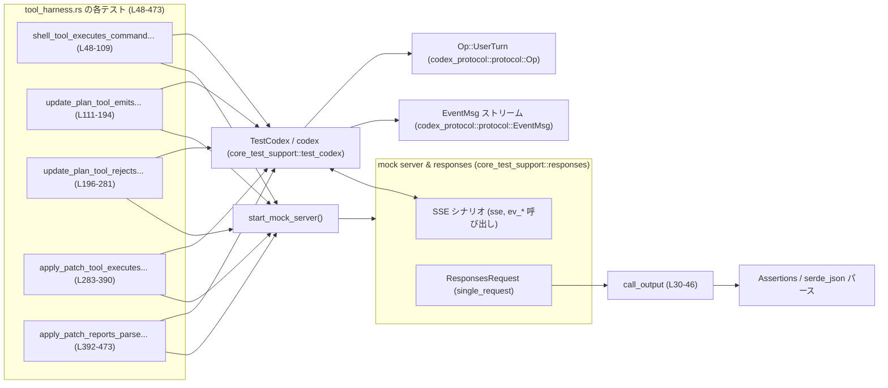
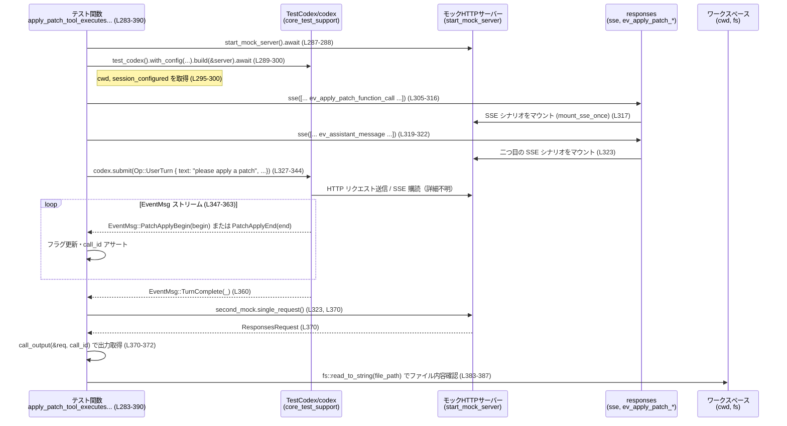

# core/tests/suite/tool_harness.rs

---

## 0. ざっくり一言

Codex の「ツール」機能（ローカルシェル、プラン更新ツール、apply_patch ツール）が、HTTP/SSE ベースのモックサーバーと連携して正しく動作し、期待どおりのイベント・出力を生成するかを検証する統合テスト群です（`core/tests/suite/tool_harness.rs:L48-473`）。

---

## 1. このモジュールの役割

### 1.1 概要

- このモジュールは **Codex のツール実行ハーネス（tool harness）** が正しく機能するかを確認するための非 Windows 向けテストです（`#![cfg(not(target_os = "windows"))]`；`tool_harness.rs:L1`）。
- 具体的には、以下を検証します。
  - ローカルシェルツールの実行と出力ストリーミング（`shell_tool_executes_command_and_streams_output`；`tool_harness.rs:L48-109`）
  - プラン更新ツール `update_plan` の正常系イベント (`PlanUpdate`) とツール戻り値（`tool_harness.rs:L111-194`）
  - `update_plan` の不正ペイロード時のエラー処理（PlanUpdate を出さない / エラーメッセージ / success=false；`tool_harness.rs:L196-281`）
  - `apply_patch` ツールの正常適用・イベント (`PatchApplyBegin/End`)・ファイル更新（`tool_harness.rs:L283-390`）
  - `apply_patch` のパッチ解析失敗時の診断メッセージと success=false（`tool_harness.rs:L392-473`）

### 1.2 アーキテクチャ内での位置づけ

このファイルはテストコードであり、以下のコンポーネントと連携しています。

- `core_test_support::test_codex::TestCodex` 経由で Codex 本体をテスト用に起動（`tool_harness.rs:L54-60, L117-123, L202-208, L295-300, L404-409`）
- `core_test_support::responses` による SSE レスポンスのモックとリクエストの記録（`tool_harness.rs:L14-23, L64-69, L71-75, L135-140, L142-146, L216-221, L223-227, L312-317, L319-323, L416-421, L423-427`）
- `codex_protocol::protocol::EventMsg` による Codex からのイベント監視（`tool_harness.rs:L9, L99, L170-184, L251-259, L349-362, L451`）
- `codex_protocol::protocol::Op::UserTurn` によるツール呼び出し開始（`tool_harness.rs:L79-96, L150-167, L231-248, L327-344, L431-448`）

依存関係の概要を Mermaid で示します。



### 1.3 設計上のポイント

コードから読み取れる設計上の特徴です。

- **テストハーネス中心**
  - Codex 自体のロジックではなく、`TestCodex`・モック SSE・`EventMsg` のやり取りを通じた「ツールハーネスのふるまい」を検証しています（`tool_harness.rs:L54-60, L64-69, L79-96` など）。
- **非同期・マルチスレッドテスト**
  - 各テストは `#[tokio::test(flavor = "multi_thread", worker_threads = 2)]` で実行され、Tokio のマルチスレッドランタイムを使用します（`tool_harness.rs:L48, L111, L196, L283, L392`）。
- **ネットワーク依存のガード**
  - 最初に `skip_if_no_network!(Ok(()));` を呼び、ネットワーク環境がない場合はテストをスキップします（`tool_harness.rs:L50, L113, L198, L285, L394`）。`start_mock_server()` は HTTP ベースのモックサーバーと推測されますが、コードからは詳細は分かりません。
- **イベント駆動の検証**
  - `wait_for_event` で `EventMsg` ストリームを監視し、特定のイベント (`PlanUpdate`, `PatchApplyBegin`, `PatchApplyEnd`, `TurnComplete`) をトリガーにテストを進めています（`tool_harness.rs:L99, L170-185, L251-260, L349-363, L451`）。
- **ツール結果の HTTP 側検証**
  - モックサーバーに届いたリクエストを `ResponsesRequest::single_request` で取得し、`call_output` を通じてツールの標準出力や成功フラグを検証します（`tool_harness.rs:L101-106, L189-191, L267-278, L370-381, L453-470`）。

---

## 2. 主要な機能一覧

このファイルが提供する主要な「機能」（テストケース）です。

- `call_output`: モック HTTP リクエストからツール呼び出しの出力 JSON と success フラグを取り出すヘルパー（`tool_harness.rs:L30-46`）
- `shell_tool_executes_command_and_streams_output`: ローカルシェルツールがコマンドを実行し、exit code 0 と期待どおりの stdout を返すことを検証（`tool_harness.rs:L48-109`）
- `update_plan_tool_emits_plan_update_event`: `update_plan` ツールが正しい `PlanUpdate` イベントとツール出力 `"Plan updated"` を生成することを検証（`tool_harness.rs:L111-194`）
- `update_plan_tool_rejects_malformed_payload`: `update_plan` ツールが不正な JSON ペイロードを拒否し、`PlanUpdate` を出さず、エラーメッセージと `success=false` を返すことを検証（`tool_harness.rs:L196-281`）
- `apply_patch_tool_executes_and_emits_patch_events`: `apply_patch` ツールがパッチを適用し、`PatchApplyBegin/End` イベントと成功メッセージ、ファイル作成を行うことを検証（`tool_harness.rs:L283-390`）
- `apply_patch_reports_parse_diagnostics`: 解析できないパッチに対し、検証失敗メッセージと詳細な診断 (`invalid hunk`) を出し、`success=false` を返すことを検証（`tool_harness.rs:L392-473`）

---

## 3. 公開 API と詳細解説

### 3.1 型一覧（構造体・列挙体など）

このファイル内に新たな構造体・列挙体定義はありませんが、テストが依存する主要な外部型を整理します。

| 名前 | 種別 | 定義元（モジュール） | 役割 / 用途 | 根拠 |
|------|------|----------------------|-------------|------|
| `TestCodex` | 構造体 | `core_test_support::test_codex` | Codex 本体をテスト用に構築するビルダーと関連情報（`codex`, `cwd`, `session_configured`）を提供 | 構造体パターンでフィールドを取り出している（`tool_harness.rs:L55-60, L118-123, L203-208, L295-300, L404-409`） |
| `ResponsesRequest` | 構造体 | `core_test_support::responses` | モックサーバーに送られた 1 回分のリクエストを表し、ツール呼び出し出力の取得メソッドを提供 | 型エイリアスのように `use` された後、`call_output` 内でメソッド呼び出し（`tool_harness.rs:L15, L31, L37`） |
| `EventMsg` | 列挙体 | `codex_protocol::protocol` | Codex から送出されるイベント（`TurnComplete`, `PlanUpdate`, `PatchApplyBegin`, `PatchApplyEnd` 等）を表現 | `wait_for_event` のマッチ対象として使用（`tool_harness.rs:L99, L171-183, L252-259, L349-362, L451`） |
| `Op::UserTurn` | 列挙体バリアント | `codex_protocol::protocol::Op` | ユーザーからのターンを表す操作。本文でツール実行のトリガーとして利用 | フィールド `items`, `cwd`, `sandbox_policy` 等を指定して submit している（`tool_harness.rs:L79-96, L150-167, L231-248, L327-344, L431-448`） |
| `UserInput::Text` | 列挙体バリアント | `codex_protocol::user_input` | 自然言語のテキスト入力を表現するユーザー入力種別 | `items` ベクタに格納されている（`tool_harness.rs:L81-84, L152-155, L233-236, L329-332, L433-436`） |
| `StepStatus` | 列挙体 | `codex_protocol::plan_tool` | プランの各ステップの状態（`InProgress`, `Pending` 等）を表す | `PlanUpdate` イベントのフィールドを `assert_matches!` で検証（`tool_harness.rs:L176-179`） |

※ 実際の定義場所のファイルパスは、このチャンクからは分かりません（モジュールパスのみ判明）。

### 3.2 関数詳細（6 件）

#### `call_output(req: &ResponsesRequest, call_id: &str) -> (String, Option<bool>)`

**概要**

- モック HTTP リクエスト (`ResponsesRequest`) から、特定のツール呼び出し ID (`call_id`) に対応する出力 JSON 文字列と、成功フラグ（あれば）を取り出します（`tool_harness.rs:L30-46`）。
- call_id の整合性およびコンテンツの存在を `assert_eq!` と `panic!` で厳密にチェックします。

**引数**

| 引数名 | 型 | 説明 | 根拠 |
|--------|----|------|------|
| `req` | `&ResponsesRequest` | モックサーバーから取得した 1 回分のレスポンス情報。`function_call_output*` メソッドを呼び出す対象 | `req.function_call_output(call_id)` など（`tool_harness.rs:L31, L37`） |
| `call_id` | `&str` | 期待するツール呼び出し ID。レスポンスの `call_id` フィールドと照合する | `raw.get("call_id").and_then(Value::as_str)` と比較（`tool_harness.rs:L33-35`） |

**戻り値**

- `(String, Option<bool>)`
  - `String`: ツールの出力コンテンツ（JSON 文字列として返される）です（`tool_harness.rs:L41-45`）。
  - `Option<bool>`: ツール出力に `success` フラグが含まれている場合は `Some(true/false)`、含まれていない場合は `None`（`tool_harness.rs:L37-38`）。

**内部処理の流れ**

1. `req.function_call_output(call_id)` により、生の JSON オブジェクトを取得します（`tool_harness.rs:L31`）。
2. そのオブジェクトの `"call_id"` フィールドが引数 `call_id` と一致することを `assert_eq!` で検証します（`tool_harness.rs:L32-35`）。  
   一致しない場合はテストが失敗します。
3. `req.function_call_output_content_and_success(call_id)` で `(Option<String>, Option<bool>)` と思われる値を取得し、`match` で `Some(values)` の場合のみ受理します（`tool_harness.rs:L37-40`）。
4. さらに `content_opt` が `Some(c)` であることを確認し、`None` の場合は `panic!` します（`tool_harness.rs:L41-44`）。
5. 最終的に `(content, success)` を返します（`tool_harness.rs:L45`）。

**Errors / Panics**

- 以下の場合に `panic!` または `assert_eq!` によるテスト失敗が発生します。
  - `raw["call_id"]` が `call_id` と一致しない（`tool_harness.rs:L32-36`）。
  - `req.function_call_output_content_and_success(call_id)` が `None` を返した場合（`tool_harness.rs:L37-40`）。
  - `content_opt` が `None` の場合（`tool_harness.rs:L41-44`）。

**Edge cases（エッジケース）**

- ツールが `success` フィールドを返さないケース：
  - `success` は `None` になり、呼び出し側で `if let Some(success_flag) = success_flag` のように条件付きで検査されています（`tool_harness.rs:L273-278, L465-470`）。
- `call_id` ミスマッチ：
  - 即座にアサーション失敗となるため、「違うツール呼び出しの出力を誤って検査する」といったバグを防ぐ役割があります。

**使用上の注意点**

- `ResponsesRequest` 側で `function_call_output*` が正しく実装されていることが前提であり、実装不備があるとこの関数で panic します。
- `call_id` 文字列をテストコード側と SSE モック側で一致させる必要があります（`tool_harness.rs:L62, L66, L101-103` など）。

---

#### `shell_tool_executes_command_and_streams_output() -> anyhow::Result<()>`

**概要**

- ローカルシェルツールが `/bin/echo "tool harness"` を実行し、exit code 0 と期待どおりの stdout を JSON で返すことを確認する非同期テストです（`tool_harness.rs:L48-109`）。

**引数 / 戻り値**

- 引数なし（`#[tokio::test]` によりテストフレームワークから呼び出されます）。
- 戻り値は `anyhow::Result<()>`。エラー時には `?` 演算子経由でテストを失敗させます（`tool_harness.rs:L52, L60, L103, L383` など）。

**内部処理の流れ**

1. ネットワークチェック：`skip_if_no_network!(Ok(()));` でネットワーク環境がなければテストスキップ（`tool_harness.rs:L50`）。
2. モックサーバー起動：`start_mock_server().await` でモック HTTP サーバーを起動（`tool_harness.rs:L52`）。
3. Codex セッション構築：
   - `test_codex().with_model("gpt-5")` でビルダーを作成（`tool_harness.rs:L54`）。
   - `builder.build(&server).await?` で `TestCodex { codex, cwd, session_configured, .. }` を取得（`tool_harness.rs:L55-60`）。
4. SSE モックレスポンス定義：
   - 1 回目の SSE：ツール呼び出しを含むレスポンス（`ev_response_created`, `ev_local_shell_call`, `ev_completed`）（`tool_harness.rs:L62-69`）。
   - 2 回目の SSE：アシスタントメッセージと `resp-2` の完了（`tool_harness.rs:L71-75`）。
5. ユーザーターン送信：
   - `codex.submit(Op::UserTurn { ... })` で「please run the shell command」というテキストを送信（`tool_harness.rs:L79-96`）。
6. イベント待ち：
   - `wait_for_event` で `EventMsg::TurnComplete(_)` に達するまで待機（`tool_harness.rs:L99`）。
7. ツール出力検証：
   - モックサーバーの 2 回目のリクエストを取得（`second_mock.single_request()`；`tool_harness.rs:L101`）。
   - `call_output` で `call_id` に対応する JSON を取得（`tool_harness.rs:L102`）。
   - `serde_json::from_str` で JSON パースし、`metadata.exit_code == 0` を検証（`tool_harness.rs:L103-104`）。
   - `output` フィールドが `"tool harness\n"` であることを正規表現マッチで検証（`tool_harness.rs:L105-106`）。

**Errors / Panics**

- `call_output` 内の各種アサーションにより、`call_id` 不一致や出力欠如時はテスト失敗となります（`tool_harness.rs:L30-46`）。
- JSON フォーマットが期待どおりでない場合、`serde_json::from_str` の `?` により `Err` が返り、テストが失敗します（`tool_harness.rs:L103`）。

**Edge cases**

- Windows ではテスト自体がコンパイル対象外です（`cfg(not(target_os = "windows"))`；`tool_harness.rs:L1`）。
- `/bin/echo` が存在しない環境は想定していません。存在しない場合、exit code や stdout が変わりテストは失敗します。

**使用上の注意点**

- このテストはローカルシェルに `SandboxPolicy::DangerFullAccess` を与えています（`tool_harness.rs:L89`）。テスト環境以外で同等設定を用いる場合は安全性に留意する必要があります。
- 実行時間のばらつきを考慮したタイムアウト設定などはこのファイルからは読み取れません（`wait_for_event` の実装は不明です）。

---

#### `update_plan_tool_emits_plan_update_event() -> anyhow::Result<()>`

**概要**

- `update_plan` ツールが、与えられたプラン情報を反映した `EventMsg::PlanUpdate` を送り、ツール出力として `"Plan updated"` を返すことを確認するテストです（`tool_harness.rs:L111-194`）。

**内部処理の流れ（ポイント）**

1. モックサーバーと Codex セッションを起動（`tool_harness.rs:L115-123`）。
2. `plan_args` として `explanation` と 2 つのステップを含む JSON 文字列を作成（`tool_harness.rs:L125-133`）。
3. SSE モックで `ev_function_call(call_id, "update_plan", &plan_args)` を流す（`tool_harness.rs:L135-139`）。
4. ユーザーターン `"please update the plan"` を送信（`tool_harness.rs:L150-167`）。
5. `wait_for_event` で `PlanUpdate` イベントを検出し、内容を逐一検証（`tool_harness.rs:L170-180`）。
6. `TurnComplete` イベントでループを終了（`tool_harness.rs:L182-184`）。
7. 最終的に `saw_plan_update` が `true` であることと、ツール出力が `"Plan updated"` であることを確認（`tool_harness.rs:L187-191`）。

**契約（事実上の仕様）**

このテストから読み取れる `update_plan` ツールの契約（Contract）は次のとおりです。

- 正常系:
  - `explanation` と `plan` 配列（各要素が `step` と `status` を持つ）を渡すと、`PlanUpdate` イベントが発生し、その内容は引数と一致する（`tool_harness.rs:L125-133, L170-180`）。
  - ツール出力として `"Plan updated"` が返される（`tool_harness.rs:L189-191`）。

**Errors / Edge cases**

- このテスト自体は正常系のみを扱い、不正ペイロードは別テスト（`update_plan_tool_rejects_malformed_payload`）が担当します。
- `PlanUpdate` が来ない場合は `assert!(saw_plan_update)` が失敗し、テストが落ちます（`tool_harness.rs:L187`）。

---

#### `update_plan_tool_rejects_malformed_payload() -> anyhow::Result<()>`

**概要**

- `update_plan` ツールに `plan` フィールドを含まない不正 JSON を渡した場合、`PlanUpdate` イベントを送出せず、出力に解析エラーメッセージと `success=false` を含めることを確認するテストです（`tool_harness.rs:L196-281`）。

**内部処理の流れ（ポイント）**

1. 正常系と同様に Codex セッションとモックサーバーを用意（`tool_harness.rs:L200-208`）。
2. `invalid_args` として `{"explanation": "Missing plan data"}` の JSON を用意（`tool_harness.rs:L210-214`）。
3. SSE モックで `ev_function_call(call_id, "update_plan", &invalid_args)` を流す（`tool_harness.rs:L216-220`）。
4. ユーザーターンを送信（`tool_harness.rs:L231-248`）。
5. `wait_for_event` で `PlanUpdate` を監視し、出現した場合は `saw_plan_update = true` として `false` を返し待機を継続、`TurnComplete` で終了（`tool_harness.rs:L251-260`）。
6. `saw_plan_update` が `false` のままであることをアサート（`tool_harness.rs:L262-265`）。
7. `call_output` からツール出力を取得し、`"failed to parse function arguments"` を含むこと、`success_flag` が `Some(false)` ならそれを確認（`tool_harness.rs:L267-278`）。

**契約（事実上の仕様）**

- 不正な引数（少なくとも `plan` 欠如）に対しては：
  - `PlanUpdate` イベントを発生させない（`tool_harness.rs:L251-260, L262-265`）。
  - ツール出力テキストに `"failed to parse function arguments"` を含める（`tool_harness.rs:L269-271`）。
  - もし `success` フラグを返す場合は `false` である（`tool_harness.rs:L273-277`）。
    - `success` フラグを返さない実装も許容しているため、`if let Some(...)` で検査しています。

**Edge cases**

- 出力テキストにエラーメッセージが含まれない場合や `success=true` で返ってきた場合、テストは失敗します。
- `PlanUpdate` イベントが誤って送出された場合もテストが失敗します。

---

#### `apply_patch_tool_executes_and_emits_patch_events() -> anyhow::Result<()>`

**概要**

- `Feature::ApplyPatchFreeform` を有効にした状態で、`apply_patch` ツールがファイル追加パッチを正しく適用し、`PatchApplyBegin` / `PatchApplyEnd` イベントを送出し、標準出力とファイル内容が期待どおりになるかを検証するテストです（`tool_harness.rs:L283-390`）。

**内部処理の流れ（ポイント）**

1. ビルダー設定で `config.features.enable(Feature::ApplyPatchFreeform)` を行い、apply_patch 機能を有効化（`tool_harness.rs:L289-294`）。
2. `file_name = "notes.txt"` とし、ワークスペース内のパス `file_path` を決定（`tool_harness.rs:L302-303`）。
3. `patch_content` として、`*** Add File: notes.txt` と `+Tool harness apply patch` を含む unified patch 風文字列を作成（`tool_harness.rs:L305-310`）。
4. SSE モックで `ev_apply_patch_function_call(call_id, &patch_content)` を流す（`tool_harness.rs:L312-316`）。
5. ユーザーターン `"please apply a patch"` を送信（`tool_harness.rs:L327-344`）。
6. `wait_for_event` で以下を監視（`tool_harness.rs:L347-363`）:
   - `PatchApplyBegin(begin)`：`begin.call_id == call_id` を確認・フラグ `saw_patch_begin=true`。
   - `PatchApplyEnd(end)`：`end.call_id == call_id` を確認・`patch_end_success = Some(end.success)` を記録。
   - `TurnComplete` に到達したら終了。
7. `saw_patch_begin` が真であり、`patch_end_success == true` であることを確認（`tool_harness.rs:L365-368`）。
8. ツール出力テキストを取得し、正規表現で以下の形式を確認（`tool_harness.rs:L370-381`）：
   - `Exit code: 0`
   - `Wall time: <number> seconds`
   - `Output:\nSuccess. Updated the following files:\nA notes.txt`
9. 実際のファイル内容が `"Tool harness apply patch\n"` となっていることを `fs::read_to_string` で確認（`tool_harness.rs:L383-387`）。

**契約（事実上の仕様）**

- apply_patch ツールは正常時に:
  - `PatchApplyBegin` と `PatchApplyEnd` イベントを必ず対で送出し、`call_id` を一致させる（`tool_harness.rs:L347-359`）。
  - `PatchApplyEnd.success == true` をセットする（`tool_harness.rs:L355-358, L365-368`）。
  - 出力に exit code 0・実行時間・更新ファイルリストを含める（`tool_harness.rs:L373-380`）。
  - パッチで指定されたファイル内容にワークスペースを更新する（`tool_harness.rs:L383-387`）。

**安全性／エラー**

- ファイルシステムへの書き込み（`fs::read_to_string` を通じて結果を確認）を伴いますが、`cwd` はテスト専用の一時ディレクトリと推測されます（`tool_harness.rs:L295-300`）。コード上からは実ディレクトリかどうかは断定できません。
- パッチ適用や検証の失敗はこのテストではカバーしておらず、別テストが担当します（次項）。

---

#### `apply_patch_reports_parse_diagnostics() -> anyhow::Result<()>`

**概要**

- 解析不能なパッチ（更新対象ファイルを示すが変更内容を含まない）に対して、apply_patch ツールが検証失敗メッセージと具体的な診断 (`invalid hunk`) を出力し、`success=false` を返すことをテストします（`tool_harness.rs:L392-473`）。

**内部処理の流れ（ポイント）**

1. apply_patch 機能を有効化した Codex セッションを構築（`tool_harness.rs:L398-409`）。
2. `patch_content` として `*** Update File: broken.txt` のみを含むパッチを用意（`tool_harness.rs:L411-414`）。
3. SSE モックで `ev_apply_patch_function_call(call_id, patch_content)` を流す（`tool_harness.rs:L416-420`）。
4. ユーザーターン `"please apply a patch"` を送信（`tool_harness.rs:L431-448`）。
5. `wait_for_event` で `TurnComplete` まで待機（`tool_harness.rs:L451`）。`PatchApply*` イベントの有無についてはこのテストからは読み取れません。
6. ツール出力を取得し、以下を検証（`tool_harness.rs:L453-470`）:
   - `"apply_patch verification failed"` を含む。
   - `"invalid hunk"` を含む（パッチ解析エラーの具体的診断）。
   - `success_flag` が `Some(false)` の場合、それを確認。

**契約（事実上の仕様）**

- 解析不能なパッチに対し:
  - ツール出力に「検証失敗」のメッセージと原因の診断文字列が含まれる（`tool_harness.rs:L456-463`）。
  - `success` フラグを返す場合は必ず `false`（`tool_harness.rs:L465-470`）。

---

### 3.3 その他の関数

このファイルでは上記 6 関数のみが定義されています。補助的な関数としては `call_output` があり、それ以外のロジックはすべて各テスト関数に直書きされています。

---

## 4. データフロー

代表的なシナリオとして、`apply_patch_tool_executes_and_emits_patch_events` のデータフローを示します。

このテストは「ユーザーがパッチ適用を依頼 → Codex が apply_patch ツールを呼び出し → 結果イベントとファイル更新が行われる」流れを検証します（`tool_harness.rs:L283-390`）。



要点：

- テストコードは Codex に対して一度だけ `Op::UserTurn` を送信し、その過程でツール実行とパッチ適用が行われます。
- `wait_for_event` を通じて、Codex が発行する `EventMsg::PatchApplyBegin`・`PatchApplyEnd`・`TurnComplete` を順に観測しています（`tool_harness.rs:L347-363`）。
- HTTP 側のツール出力はモックサーバー側に蓄積され、`single_request` → `call_output` で取り出されます（`tool_harness.rs:L370-372`）。
- ファイルシステムの変更結果は `fs::read_to_string` により検証されます（`tool_harness.rs:L383-387`）。

---

## 5. 使い方（How to Use）

このファイル自体はテストであり、外部から直接呼び出す API はありません。ただし、「Codex のツール機構をテストするためのパターン」として有用です。

### 5.1 基本的な使用方法（新しいツールテストを追加する場合）

新しいツールをテストしたい場合、このファイルのテストはおおよそ次のようなパターンになっています。

```rust
#[tokio::test(flavor = "multi_thread", worker_threads = 2)]
async fn my_tool_behaves_as_expected() -> anyhow::Result<()> {
    skip_if_no_network!(Ok(()));                         // ネットワークがなければスキップ（L50 等）

    let server = start_mock_server().await;              // モックサーバー起動（L52, L115, ...）

    let mut builder = test_codex();                      // TestCodex ビルダー作成（L54, L117, ...）
    let TestCodex { codex, cwd, session_configured, .. } =
        builder.build(&server).await?;                   // Codex インスタンスなど取得（L55-60）

    let call_id = "my-tool-call";

    // 1回目の SSE: ツール呼び出しイベントを含むストリームを定義（L64-69 など）
    let first_response = sse(vec![
        ev_response_created("resp-1"),
        /* ev_my_tool_function_call(call_id, args) など */
        ev_completed("resp-1"),
    ]);
    responses::mount_sse_once(&server, first_response).await;

    // 2回目の SSE: アシスタントの最終応答など（L71-75 等）
    let second_response = sse(vec![
        ev_assistant_message("msg-1", "done"),
        ev_completed("resp-2"),
    ]);
    let second_mock = responses::mount_sse_once(&server, second_response).await;

    let session_model = session_configured.model.clone(); // モデル名を取得（L77, L148, ...）

    codex
        .submit(Op::UserTurn {
            items: vec![UserInput::Text {
                text: "please call my tool".into(),
                text_elements: Vec::new(),
            }],
            final_output_json_schema: None,
            cwd: cwd.path().to_path_buf(),
            approval_policy: AskForApproval::Never,
            approvals_reviewer: None,
            sandbox_policy: SandboxPolicy::DangerFullAccess,
            model: session_model,
            effort: None,
            summary: None,
            service_tier: None,
            collaboration_mode: None,
            personality: None,
        })
        .await?;                                         // ツール実行をトリガー（L79-96 等）

    // 必要に応じて wait_for_event で EventMsg を監視（L170-185 等）

    // HTTP 側のツール出力を検証（L101-106 等）
    let req = second_mock.single_request();
    let (output_text, success_flag) = call_output(&req, call_id);

    // output_text / success_flag に対するアサートを記述

    Ok(())
}
```

### 5.2 よくある使用パターン

このファイルから読み取れる主なパターンは次の 3 種です。

1. **正常系ツール実行 + 標準出力検証**
   - 例：`shell_tool_executes_command_and_streams_output`（`tool_harness.rs:L48-109`）
   - ツールの実行結果を JSON としてパースし、exit code や stdout を検証します。

2. **状態更新ツール + EventMsg 検証**
   - 例：`update_plan_tool_emits_plan_update_event`（`tool_harness.rs:L111-194`）
   - `wait_for_event` を用いて `PlanUpdate` イベントのペイロードを厳密にチェックします。

3. **エラー系ツール実行 + 診断メッセージと success フラグ検証**
   - 例：
     - `update_plan_tool_rejects_malformed_payload`（`tool_harness.rs:L196-281`）
     - `apply_patch_reports_parse_diagnostics`（`tool_harness.rs:L392-473`）
   - エラーメッセージの部分文字列と `success_flag` の組み合わせで、エラー処理の契約を検証しています。

### 5.3 よくある間違い

このファイルの実装から想定される誤用例と正しいパターンです。

```rust
// 誤り例: call_id の不一致
let call_id = "my-tool-call";
// ...
// モック側で別の call_id を使ってしまう
let first_response = sse(vec![
    ev_function_call("other-call-id", "my_tool", &args),
    ev_completed("resp-1"),
]);
// ...
let (output_text, _) = call_output(&req, call_id); // L30-46
// -> raw["call_id"] と call_id が一致せずアサート失敗

// 正しい例: テストコードとモック SSE で call_id を合わせる
let call_id = "my-tool-call";
let first_response = sse(vec![
    ev_function_call(call_id, "my_tool", &args),
    ev_completed("resp-1"),
]);
let (output_text, _) = call_output(&req, call_id); // 問題なくデータ取得
```

```rust
// 誤り例: success_flag を必須だと決めつける
let (_output_text, success_flag) = call_output(&req, call_id);
assert_eq!(success_flag, Some(true)); // success フラグがない実装では失敗

// 正しい例: Option<bool> として条件付きで扱う（L273-278, L465-470）
let (_output_text, success_flag) = call_output(&req, call_id);
if let Some(success_flag) = success_flag {
    assert!(success_flag);
}
```

### 5.4 使用上の注意点（まとめ）

- **前提条件**
  - ネットワーク（少なくともローカルホスト）が利用可能である必要があります（`skip_if_no_network!`；`tool_harness.rs:L50, L113, L198, L285, L394`）。
  - `test_codex()` や `start_mock_server()` が正しく設定されたテストユーティリティであることが前提です（定義はこのチャンクにはありません）。
- **並行性**
  - テストは Tokio のマルチスレッドランタイム上で動作します（`tool_harness.rs:L48, L111, L196, L283, L392`）。`wait_for_event` が内部でどのようにブロックするかは実装依存です。
- **エラー処理**
  - すべてのテストは `anyhow::Result<()>` を返し、`?` 演算子でエラーを透過します。
  - テスト用の契約違反は `assert!`・`assert_eq!`・`panic!` で検出されます（`tool_harness.rs:L32-36, L40, L44, L187, L262-265, L365-368` 等）。
- **安全性**
  - `SandboxPolicy::DangerFullAccess` を使用しているため（`tool_harness.rs:L89, L160, L241, L337, L441`）、本番環境で同様の設定を使う場合は、テストとの違いに注意が必要です。

---

## 6. 変更の仕方（How to Modify）

### 6.1 新しい機能を追加する場合（新ツールのテスト）

1. **テスト関数の追加**
   - 本ファイルに `#[tokio::test(...)] async fn new_tool_test() -> anyhow::Result<()>` を追加します（既存テストと同じシグネチャ）。
2. **モックサーバーと Codex セッションの準備**
   - `start_mock_server` と `test_codex().with_config(...)` を使って `TestCodex` を構築します（`tool_harness.rs:L287-300` を参考）。
3. **SSE モックシナリオの定義**
   - `sse(vec![ev_response_created(...), ev_*_function_call(call_id, ...), ev_completed(...)])` のようにして、ツール呼び出しをトリガーする SSE を作成し、`mount_sse_once` で登録します（`tool_harness.rs:L312-317` など）。
4. **ユーザーターンの送信**
   - `Op::UserTurn` に適切な `UserInput::Text` を設定し、`codex.submit` で送信します（`tool_harness.rs:L327-344`）。
5. **イベント / 出力の検証**
   - 必要に応じて `wait_for_event` で `EventMsg` を検証し、`second_mock.single_request()` → `call_output` でツールの戻り値を確認します。
6. **契約の明文化**
   - 正常系と異常系の両方をテストし、ツールの契約（イベント・出力・success フラグ）を明確にします（`tool_harness.rs:L196-281, L392-473` が参考になります）。

### 6.2 既存の機能を変更する場合（契約変更など）

- **影響範囲の確認**
  - ツールの出力フォーマットやイベントの形を変える場合、このファイルの該当テストのアサート部分（文字列一致・正規表現・イベントフィールド検証）をすべて確認します。
- **契約の維持 / 更新**
  - 例：
    - `update_plan` のエラーメッセージ文言を変える場合は、`"failed to parse function arguments"` に対する `contains` アサート（`tool_harness.rs:L269-271`）を更新する必要があります。
    - `apply_patch` の診断メッセージを変更する場合は、`"invalid hunk"` 検査（`tool_harness.rs:L461-462`）を修正します。
- **後方互換性**
  - `success_flag` が `Option<bool>` であるように、過去の実装では `success` フィールドが存在しない可能性も考慮されています。完全に必須フィールドにしたい場合は、`if let Some(success_flag)` のロジックとテストがどうあるべきかを検討する必要があります（`tool_harness.rs:L273-278, L465-470`）。
- **テストユーティリティの変更**
  - `call_output` の挙動を変えると、このファイル内の全テストに影響します。例えば `call_id` チェックを緩めると、意図しない出力を検査してしまうリスクが増えるため、意図的かどうか慎重に判断する必要があります。

---

## 7. 関連ファイル

このモジュールと密接に関係すると思われるモジュールパスを示します。実際のファイルパスはこのチャンクからは分かりません。

| モジュール / パス（不完全） | 役割 / 関係 |
|----------------------------|------------|
| `core_test_support::test_codex` | `TestCodex` 型と `test_codex()` 関数を提供し、Codex 本体のテスト用ラッパーを構築する（`tool_harness.rs:L25-26, L54-60, L117-123, L202-208, L295-300, L404-409`）。 |
| `core_test_support::responses` | SSE モックレスポンスの作成・マウント、`ResponsesRequest` 型によるリクエスト検査機能を提供する（`tool_harness.rs:L14-23, L31, L37, L64-69, L71-75, L135-140, L142-146, L216-221, L223-227, L312-317, L319-323, L416-421, L423-427`）。 |
| `core_test_support::wait_for_event` | Codex のイベントストリームから条件に合致する `EventMsg` が出るまで待機するユーティリティ（`tool_harness.rs:L27, L99, L170-185, L251-260, L349-363, L451`）。 |
| `codex_protocol::protocol` | `Op::UserTurn`, `EventMsg`, `AskForApproval`, `SandboxPolicy` などの基本プロトコル型を定義する（`tool_harness.rs:L8-11`）。 |
| `codex_protocol::plan_tool` | `StepStatus` など、プラン更新関連の型を提供する（`tool_harness.rs:L7, L176-179`）。 |
| `codex_features` | `Feature::ApplyPatchFreeform` などの機能フラグを定義する（`tool_harness.rs:L6, L289-294, L398-403`）。 |

---

## Bugs / Security / Contracts / Edge Cases（まとめ）

- **潜在的なバグ**
  - `call_output` の `panic!("function_call_output present")` のメッセージ文は、`None` のときに呼ばれているため、「present」という文言はやや不自然ですが、機能的には問題ありません（`tool_harness.rs:L37-40`）。
  - `success_flag` を `Option<bool>` として扱うテストは、「success フラグがなくてもテストが通る」ため、フラグを必須にしたい将来の設計とはズレる可能性があります（`tool_harness.rs:L273-278, L465-470`）。

- **セキュリティ面**
  - `SandboxPolicy::DangerFullAccess` を利用しているため、実際のファイルシステム・シェルへのアクセスを許可する設定になっていますが、テスト用ワークスペースとモックサーバーのみを対象としていると推測されます（`tool_harness.rs:L86-90, L157-161, L238-242, L334-338, L438-442`）。
  - テスト以外で同様の設定を再利用する際には、任意コマンド実行やファイル改変のリスクを考慮する必要があります。

- **言語固有の安全性 / 並行性**
  - すべての非同期処理は `async fn` と Tokio ランタイム上で実行され、`?` 演算子でエラーが伝播します。所有権・借用に関する unsafe コードは含まれていません。
  - `wait_for_event` に渡すクロージャでは外側の可変変数（例：`saw_plan_update`, `patch_end_success`）をキャプチャしており、FnMut として扱われていると考えられますが、型定義はこのチャンクには現れません（`tool_harness.rs:L170-185, L251-260, L347-363`）。

- **エッジケース**
  - 不正ペイロードやパッチ解析失敗に対する動作は専用テストでカバーされています（`tool_harness.rs:L196-281, L392-473`）。
  - タイムアウトやネットワークエラーなど、低レベルの異常系はこのファイル単体からは判別できません。`skip_if_no_network` や `wait_for_event` の内部実装依存になります。
