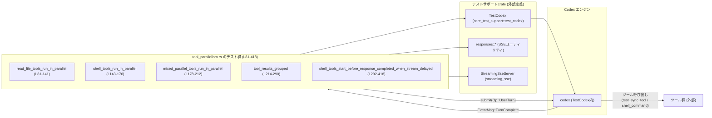
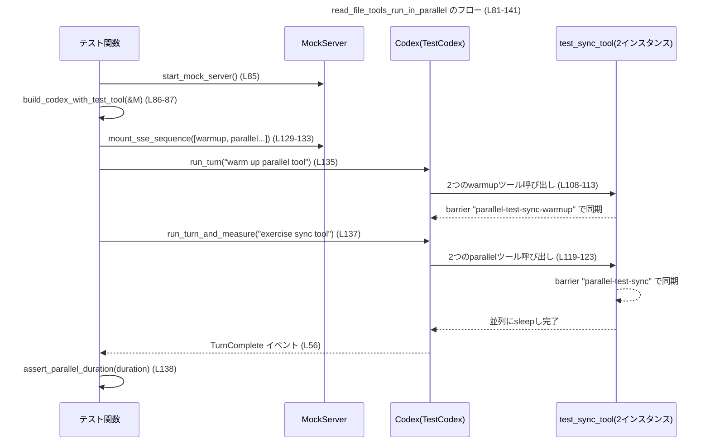
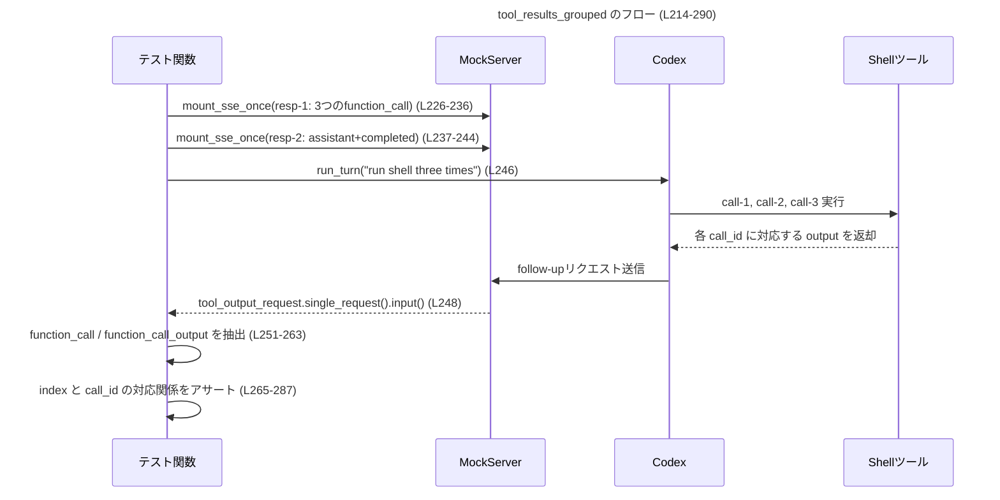
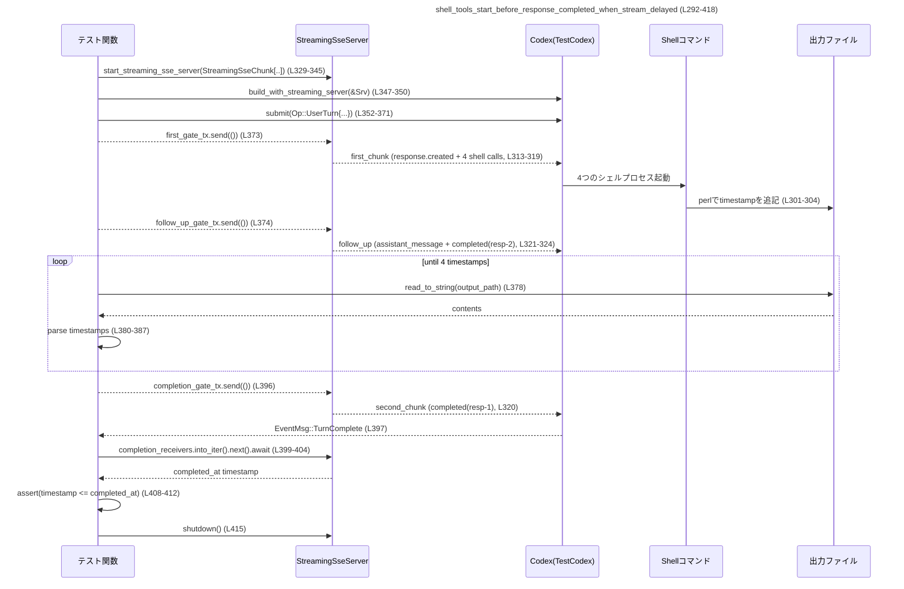

# core/tests/suite/tool_parallelism.rs

## 0. ざっくり一言

Codex の「ツール呼び出し」が **並列に実行されること** と、**ツール結果のストリーミング順序** が契約どおりであることを検証する非 Windows 向けのテストモジュールです。

---

## 1. このモジュールの役割

### 1.1 概要

- このモジュールは、Codex エンジンが外部ツール（同期ツール・シェルコマンド）をどのように実行・ストリームするかについて、次の点を検証します。
  - 同種ツール（ファイル読み取りツール / シェルツール）の **並列実行**（wall-clock 時間から検証）  
  - 異種ツール（同期ツール + シェルツール）の **混在並列実行**
  - ツール呼び出しとその出力イベントの **グルーピング／順序保証**
  - ストリーミング SSE が遅延しても、シェルツールが **レスポンス完了前に起動している** こと

### 1.2 アーキテクチャ内での位置づけ

このファイルはテスト専用コードであり、本体ロジックには依存されません。主な関係は次のとおりです。

- `TestCodex`（テスト用 Codex ラッパー）を使い、`Op::UserTurn` を送信します（L33-54, L352-371）。
- `core_test_support::responses::*` 群で **モック SSE レスポンス** を構築し、`mount_sse_sequence` / `mount_sse_once` / `start_streaming_sse_server` でモックサーバに登録します（L108-133, L160-171, L196-207, L226-244, L313-345）。
- `wiremock::MockServer` / 独自 `StreamingSseServer` 上で、Codex とツールのやり取りを **HTTP SSE としてシミュレート** します。
- `wait_for_event` を使い、Codex からの `EventMsg::TurnComplete` を待機します（L56-56, L397-397）。

依存関係の概要は次の mermaid 図のとおりです。



> 図はこのファイル全体（L1-418）の関係を表しています。

### 1.3 設計上のポイント

コードから読み取れる特徴は以下のとおりです。

- **非 Windows 限定**  
  - 冒頭で `#![cfg(not(target_os = "windows"))]` が指定されており、Windows ではコンパイルされません（L1）。  
    シェルコマンドや `sleep` などの OS 依存挙動を前提としたテストであることがわかります。
- **状態を持たないテスト関数群**  
  - 共有ミュータブル状態は使わず、各テストで `TestCodex` とモックサーバを個別に生成します（例: L85-87, L147-150, L182-183, L218-219, L347-350）。
- **非同期 + マルチスレッド**  
  - すべてのテストは `#[tokio::test(flavor = "multi_thread", worker_threads = 2)]` を用い、Tokio マルチスレッドランタイム上で実行されます（L81, L143, L178, L214, L292）。
  - 並列性は wall-clock 時間とツールの障壁 (`barrier`)・`sleep` を組み合わせて検証します（例: L88-105）。
- **エラーハンドリング**  
  - すべてのテスト・ヘルパーは `anyhow::Result` を返し、`?` 演算子でエラーを伝播します（例: L33, L61, L68, 各テストの戻り値）。
  - アサーション失敗は通常の `assert!` / `assert_eq!` パニックに依存しています（例: L75-78, L265-266）。
- **タイミングベースの検証**  
  - `Instant::now()` と `Duration` で実行時間を測定し、`assert_parallel_duration` で上限を 1.6 秒に制限します（L61-65, L73-79）。
  - `tokio::time::timeout` を利用し、シェルコマンドが一定時間内に完了することも保証します（L376-394）。

---

## 2. 主要な機能一覧（コンポーネントインベントリー）

### 2.1 このファイル内で定義される関数一覧

| 名前 | 種別 | 役割 / 用途 | 定義位置 |
|------|------|------------|----------|
| `run_turn` | 非公開 async 関数 | `TestCodex` に 1 回のユーザーターン (`Op::UserTurn`) を送信し、`TurnComplete` まで待機する | `tool_parallelism.rs:L33-59` |
| `run_turn_and_measure` | 非公開 async 関数 | `run_turn` の実行時間を測定して `Duration` を返す | `tool_parallelism.rs:L61-65` |
| `build_codex_with_test_tool` | 非公開 async 関数 | `test_sync_tool` を含むモデル `"test-gpt-5.1-codex"` で `TestCodex` を構築する | `tool_parallelism.rs:L67-71` |
| `assert_parallel_duration` | 非公開関数 | 実行時間が 1.6 秒未満であることをアサートし、並列性を検証する | `tool_parallelism.rs:L73-79` |
| `read_file_tools_run_in_parallel` | `#[tokio::test]` | 同期テストツール `test_sync_tool` を 2 回呼び出したときに並列実行されることを確認 | `tool_parallelism.rs:L81-141` |
| `shell_tools_run_in_parallel` | `#[tokio::test]` | シェルツール `shell_command` を 2 回呼び出したときに並列実行されることを確認 | `tool_parallelism.rs:L143-176` |
| `mixed_parallel_tools_run_in_parallel` | `#[tokio::test]` | `test_sync_tool` と `shell_command` を混在させても並列実行されることを確認 | `tool_parallelism.rs:L178-212` |
| `tool_results_grouped` | `#[tokio::test]` | 3 回の `shell_command` 呼び出しとその出力が順序どおりにグルーピングされることを検証 | `tool_parallelism.rs:L214-290` |
| `shell_tools_start_before_response_completed_when_stream_delayed` | `#[tokio::test]` | ストリーミング SSE が遅延しても、シェルツールがレスポンス完了前に開始されていることをタイムスタンプで検証 | `tool_parallelism.rs:L292-418` |

### 2.2 主な外部コンポーネント（このチャンクには定義なし）

| モジュール / 型 | 種別 | 役割 | 備考 |
|-----------------|------|------|------|
| `core_test_support::test_codex::TestCodex` | 構造体 | テスト用の Codex クライアントラッパー | 定義場所はこのチャンクからは不明 |
| `core_test_support::responses::*` | 関数群 | SSE レスポンス (`sse`、`ev_function_call` 等) のヘルパー | 同上 |
| `core_test_support::streaming_sse::StreamingSseChunk` | 構造体 | ストリーミング SSE チャンク（ゲート付き）を表す | 同上 |
| `core_test_support::streaming_sse::start_streaming_sse_server` | 関数 | ゲート付き SSE モックサーバを起動する | 同上 |
| `codex_protocol::protocol::{Op, EventMsg, AskForApproval, SandboxPolicy}` | 列挙体/構造体 | Codex とのプロトコル定義（操作種別・イベント種別など） | 同上 |
| `core_test_support::wait_for_event` | 関数 | Codex からのイベントストリームを監視し、条件に一致するまで待機 | 同上 |

---

## 3. 公開 API と詳細解説

このファイルには `pub` な API はありませんが、テストから再利用可能なヘルパー関数と、Codex の並列実行契約を示すテストが含まれています。ここでは重要な 7 関数を詳細に解説します。

### 3.1 型一覧（このファイル内定義）

このファイル内で新たに定義される型（構造体・列挙体）はありません。

---

### 3.2 関数詳細（7件）

#### `run_turn(test: &TestCodex, prompt: &str) -> anyhow::Result<()>`

**概要**

- `TestCodex` に対して 1 回のユーザーターンを送信し、そのターンが完了 (`EventMsg::TurnComplete`) するまで待つヘルパーです（L33-59）。

**引数**

| 引数名 | 型 | 説明 |
|--------|----|------|
| `test` | `&TestCodex` | Codex エンジンへの接続情報や作業ディレクトリを含むテスト用ラッパー |
| `prompt` | `&str` | ユーザー入力として送るテキストプロンプト |

**戻り値**

- `anyhow::Result<()>`  
  - 成功時は `Ok(())`。  
  - Codex への送信やイベント待機で失敗した場合は `Err(anyhow::Error)` を返します。

**内部処理の流れ**

1. セッションモデルをコピー  
   - `let session_model = test.session_configured.model.clone();`（L34）
2. `Op::UserTurn` を構築し、`test.codex.submit` で送信（L36-53）。  
   - `items` に `UserInput::Text` を 1 要素で渡す（L38-41）。  
   - `cwd` に `test.cwd.path()` を指定（L43）。  
   - 承認/サンドボックス等のポリシーを設定（L44-47）。
3. `await?` で送信エラーを呼び出し元に伝播（L54）。
4. `wait_for_event` で `EventMsg::TurnComplete(_)` が現れるまで待機（L56）。
5. `Ok(())` を返す（L58）。

**Examples（使用例）**

```rust
// テストの中で、単純に 1 ターンの対話を実行する例
async fn simple_turn(test: &TestCodex) -> anyhow::Result<()> {
    // Codex に "hello" というユーザーターンを送り、完了まで待機する
    run_turn(test, "hello").await?;
    Ok(())
}
```

**Errors / Panics**

- `Errors`:
  - `submit` 呼び出しが失敗した場合（ネットワークエラーなど）、`?` により `anyhow::Error` として返ります（L36-54）。
  - `wait_for_event` 内部でエラーが発生した場合も `?` により伝播します（L56）。
- `Panics`:
  - この関数内で直接 `panic!` は使用されていません。

**Edge cases（エッジケース）**

- `prompt` が空文字列であっても、コード上で特別扱いはされません（L38-40）。
- Codex が `EventMsg::TurnComplete` を送信しない場合、`wait_for_event` の挙動はこのチャンクからは不明です（タイムアウト等は外部実装依存）。

**使用上の注意点**

- この関数は **非同期コンテキスト**（Tokio ランタイム等）でのみ呼び出せます。
- 複数回連続して呼び出すときも、`TestCodex` は同じセッションモデルで再利用されます（L34）。
- I/O やネットワークを伴うため、高頻度で呼び出すとテスト全体の実行時間が増加します。

---

#### `run_turn_and_measure(test: &TestCodex, prompt: &str) -> anyhow::Result<Duration>`

**概要**

- `run_turn` をラップして実行時間を計測し、`Duration` を返すヘルパーです（L61-65）。  
  並列実行検証で実行時間の上限をチェックするために使われます。

**引数**

| 引数名 | 型 | 説明 |
|--------|----|------|
| `test` | `&TestCodex` | Codex テストラッパー |
| `prompt` | `&str` | ユーザーターンのテキスト |

**戻り値**

- `anyhow::Result<Duration>`  
  - 成功時: `run_turn` の開始から終了までの経過時間。  
  - 失敗時: `run_turn` 由来の `anyhow::Error`。

**内部処理の流れ**

1. `let start = Instant::now();` で開始時刻を記録（L62）。
2. `run_turn(test, prompt).await?;` を呼び出し、失敗した場合はエラーを伝播（L63）。
3. `Ok(start.elapsed())` で経過時間を返す（L64）。

**Examples（使用例）**

```rust
// 並列実行の目安を簡易的に測る例
async fn measure_example(test: &TestCodex) -> anyhow::Result<()> {
    let duration = run_turn_and_measure(test, "do something").await?;
    println!("duration = {:?}", duration);
    Ok(())
}
```

**Errors / Panics**

- `Errors`:
  - `run_turn` が失敗した場合のエラーがそのまま返ります（L63）。
- `Panics`:
  - ありません。

**Edge cases**

- 実行時間が非常に短い場合でも問題なく動作します（`Duration` は 0 も表現可能）。
- システムクロックの変化に依存せず、`Instant` ベースで測定しているため、NTP などの時刻補正の影響を受けません（L62-64）。

**使用上の注意点**

- テスト環境の負荷やスケジューリングにより実行時間は変動するため、利用側が持つ閾値（`assert_parallel_duration`）には余裕が設けられています（L73-78）。

---

#### `build_codex_with_test_tool(server: &wiremock::MockServer) -> anyhow::Result<TestCodex>`

**概要**

- テスト専用の同期ツール `test_sync_tool` を利用するための `TestCodex` を構築するヘルパーです（L67-71）。

**引数**

| 引数名 | 型 | 説明 |
|--------|----|------|
| `server` | `&wiremock::MockServer` | Codex が接続するモック HTTP サーバ |

**戻り値**

- `anyhow::Result<TestCodex>`  
  - 成功時: `TestCodex` インスタンス。  
  - 失敗時: ビルド処理からの `anyhow::Error`。

**内部処理の流れ**

1. `let mut builder = test_codex().with_model("test-gpt-5.1-codex");` でビルダーを作成し、使用するモデル名を指定（L69）。
2. `builder.build(server).await` を呼び出して `TestCodex` を構築し、その結果を返す（L70）。

**Examples（使用例）**

```rust
// test_sync_tool を使った Codex を構築する簡単なテストセットアップ
async fn setup_with_test_tool() -> anyhow::Result<TestCodex> {
    let server = start_mock_server().await;
    let codex = build_codex_with_test_tool(&server).await?;
    Ok(codex)
}
```

**Errors / Panics**

- `Errors`:
  - `builder.build(server).await` が失敗した場合、`anyhow::Error` が返されます（L70）。
- `Panics`:
  - `#[allow(clippy::expect_used)]` が付いていますが、関数本体内に `expect` は見当たりません（L67）。  
    おそらくビルダー内部での `expect` 使用を想定した lint 抑制と推測できます（ただしこのチャンクからは断定不可）。

**Edge cases**

- `server` が未起動である場合や、期待されるエンドポイントがマウントされていない場合の挙動はビルダー側実装に依存し、このチャンクからは不明です。

**使用上の注意点**

- `test_sync_tool` を使うテスト（例: `read_file_tools_run_in_parallel`, `mixed_parallel_tools_run_in_parallel`）で再利用されます（L86, L183, L219）。
- モデル名 `"test-gpt-5.1-codex"` はテスト用の固定値であり、本番コードとは異なる可能性があります。

---

#### `assert_parallel_duration(actual: Duration)`

**概要**

- 実行時間 `actual` が 1.6 秒未満であることをアサートし、2 つのツールが直列ではなく並列で実行されたとみなせるかを検証します（L73-79）。

**引数**

| 引数名 | 型 | 説明 |
|--------|----|------|
| `actual` | `Duration` | 測定された実行時間 |

**戻り値**

- 返り値はありません（`()`)。アサーションに失敗すると `panic!` します。

**内部処理の流れ**

1. コメントで 1.6 秒という閾値に余裕を持たせた理由を説明（L74）。
2. `assert!(actual < Duration::from_millis(1_600), "...")` で条件をチェック（L75-78）。

**Examples（使用例）**

```rust
let duration = run_turn_and_measure(&test, "some prompt").await?;
assert_parallel_duration(duration); // 1.6秒未満であればテスト成功
```

**Errors / Panics**

- `Errors`:
  - ありません。
- `Panics`:
  - `actual >= 1.6s` の場合に `assert!` がパニックします（L75-78）。

**Edge cases**

- 実行時間が 0 秒に近い場合も問題なく通過します。
- 実環境が極端に遅い CI などでは、実際には並列でもテストが失敗する可能性がありますが、コメント上で「headroom」を設けていることが明示されています（L74）。

**使用上の注意点**

- この関数は **並列／直列の判定ロジックを時間だけに依存している** ため、テスト用にのみ適しています。
- 閾値を変更する場合は、ツール側の `sleep` 設定や CI 環境の特性も合わせて検討する必要があります。

---

#### `read_file_tools_run_in_parallel() -> anyhow::Result<()>`

**概要**

- 同期テストツール `test_sync_tool` を 2 回呼び出した場合、**バリア同期を使って確実に重なりを作りつつ** 並列に実行されていることを、実行時間を通じて検証します（L81-141）。

**引数 / 戻り値**

- テスト関数のため引数はありません。
- 戻り値は `anyhow::Result<()>` で、内部の I/O エラーなどを `?` で伝播します（L82, L140）。

**内部処理の流れ**

1. ネットワークが利用可能でない場合はスキップ（`skip_if_no_network!`、L83）。
2. モックサーバを起動し、`TestCodex` を構築（L85-87）。
3. ウォームアップ用引数 `warmup_args` を構築（短い sleep + バリア ID `parallel-test-sync-warmup`、L88-96）。
4. 本番測定用引数 `parallel_args` を構築（長い sleep + バリア ID `parallel-test-sync`、L98-106）。
5. ウォームアップ用 SSE ストリーム `warmup_first`, `warmup_second` を定義（L108-117）。
6. 並列テスト用 SSE ストリーム `first_response`, `second_response` を定義（L119-128）。
7. これら 4 シーケンスを `mount_sse_sequence` でモックサーバに登録（L129-133）。
8. ウォームアップターンを実行（L135）。
9. 測定ターンを `run_turn_and_measure` で実行し、実行時間を取得（L137）。
10. `assert_parallel_duration(duration)` で 1.6 秒未満であることを確認（L138）。

**並行性（Parallelism）の検証メカニズム**

- `sleep_after_ms`: ツール内部の実行時間を模擬するための sleep（ウォームアップ: 10ms, 本番: 300ms, L88-90, L98-99）。
- `barrier`: ツール呼び出し間で同期するためのバリア（L90-94, L100-104）。  
  これにより 2 つのツール呼び出しは同時に進行し、直列実行では 600ms を超える想定の処理が並列ならば 1.6s 以下で終わるはず、という前提で検証しています。

**Mermaid 図（処理フロー, L81-141）**



**Errors / Panics**

- `Errors`:
  - モックサーバ起動失敗、Codex ビルド失敗、JSON シリアライズ失敗などは `?` で `anyhow::Error` として返されます（L85-87, L88-96, L98-106）。
- `Panics`:
  - ネットワークがある前提で `skip_if_no_network!` が内部で panic するかどうかはマクロ実装に依存し、このチャンクからは不明です。
  - 実行時間が閾値を超えると `assert_parallel_duration` 内の `assert!` がパニックします（L138）。

**Edge cases**

- モックサーバにマウントした SSE の順序は固定ですが、ツールの内部実装次第ではバリアに到達しないなどのケースがあり得ます。  
  それに対する挙動はツール実装に依存します。
- CI が極端に遅いと、並列でも 1.6 秒以上かかる可能性があります。

**使用上の注意点**

- 並列検証は **バリア + `sleep_after_ms`** の組み合わせに依存しているため、ツール実装側を変更する際はここも合わせて確認する必要があります。
- 新たに類似のテストを追加する場合、`run_turn_and_measure` と `assert_parallel_duration` を再利用すると一貫した検証が可能です。

---

#### `tool_results_grouped() -> anyhow::Result<()>`

**概要**

- 3 回の `shell_command` 呼び出しと、その `function_call_output` が **全ての call が output より前に現れること** および **call と output が同じ `call_id` で 1 対 1 に対応していること** を検証します（L214-290）。

**内部処理の流れ**

1. ネットワークチェック・`TestCodex` 構築（L215-219）。
2. `"echo 'shell output'"` を実行するシェル引数を JSON 文字列化（L221-224）。
3. 1 回目 SSE: `response.created` + 3 つの `shell_command` 呼び出し + `completed` を `mount_sse_once` で登録（L226-236）。
4. 2 回目 SSE: ツール結果をまとめて送る応答を別の `mount_sse_once` で登録（L237-244）。
5. `run_turn(&test, "run shell three times")` を実行（L246）。
6. `tool_output_request.single_request().input()` から Codex への follow-up リクエストの JSON 入力を取得（L248）。
7. `type == "function_call"` な要素を列挙・収集（L251-255）。
8. `type == "function_call_output"` な要素を列挙・収集（L257-263）。
9. call / output が 3 件ずつであることを `assert_eq!` で検証（L265-266）。
10. すべての call のインデックスが、すべての output のインデックスより前であることを検証（L268-275）。
11. call と output を zip し、`call_id` が一致することを検証（L278-287）。

**Mermaid 図（データフロー, L214-290）**



**Errors / Panics**

- `Errors`:
  - Codex ビルドや JSON シリアライズ、`run_turn` が失敗した場合に `anyhow::Error` が返ります（L219-224, L246）。
- `Panics`:
  - call / output の数が 3 でない場合（L265-266）。
  - call の後に output が現れない場合（L268-275）。
  - 対応する `call_id` が一致しない場合（L282-286）。

**Edge cases**

- `input` の JSON 構造に `type` や `call_id` が存在しない場合、`Value::get` / `as_str` の結果が `None` となり、フィルタ／比較で単に除外されます（L254-255, L261-262, L283-285）。
- `input` に `function_call_output` だけが存在し `function_call` が無いようなケースでは、件数アサーションが失敗します。

**使用上の注意点**

- JSON のキー名 (`"type"`, `"call_id"`) に依存したテストであるため、プロトコル仕様が変わった場合はここも更新が必要になります。
- call と output の順序・対応が契約仕様であることを前提にしており、ここでのアサーションによりその契約が守られているか確認できます。

---

#### `shell_tools_start_before_response_completed_when_stream_delayed() -> anyhow::Result<()>`

**概要**

- ストリーミング SSE の **`completed` イベントを意図的に遅延** させた場合でも、シェルツールがレスポンス完了より前に起動していることを、ファイルに書き出されたタイムスタンプと Codex の完了タイミングを比較することで検証します（L292-418）。

**内部処理の流れ（アルゴリズム）**

1. ネットワークチェック（L293）。
2. 一時ファイルを作成し、そのパスを取得（L296-297）。
3. `perl` を使ってミリ秒タイムスタンプを標準出力し、ファイルに追記するシェルコマンドを組み立て（L301-304）。
4. `shell_command` 用の JSON 引数 `args` を構築（L307-311）。
5. 1 つ目の SSE チャンク `first_chunk`（`response.created` + 4 回の shell call）を作成（L313-319）。
6. 2 つ目の SSE チャンク `second_chunk`（`completed(first_response)` のみ）を作成（L320）。
7. フォローアップ用 `follow_up`（アシスタントメッセージ + `completed(second_response)`）を作成（L321-324）。
8. `oneshot::channel` を 3 つ作成（first, completion, follow_up gate）（L326-328）。
9. `start_streaming_sse_server` に `StreamingSseChunk` のリストを渡し、ゲート付きストリーミング SSE サーバを起動（L329-345）。
10. `test_codex().with_model("gpt-5.1")` からビルダーを取得し、`build_with_streaming_server` で `TestCodex` を構築（L347-350）。
11. `Op::UserTurn` を送信（`submit` 呼び出し、L352-371）。
12. `first_gate_tx.send(())` で最初のチャンク送信を解放（L373）。
13. `follow_up_gate_tx.send(())` でフォローアップチャンクも解放（L374）。
14. `tokio::time::timeout(Duration::from_secs(5), async { ... })` で 5 秒以内にファイル内のタイムスタンプが 4 件揃うまでポーリング（L376-394）。
    - 10ms 間隔でファイルを読み込み、行をパースして `i64` ベクタに変換（L378-387）。
    - 4 件揃ったらそれを返す（L388-390）。
15. `completion_gate_tx.send(())` により、`first_response` の `completed` SSE を解放（L396）。
16. `wait_for_event` で `TurnComplete` を待機（L397）。
17. `completion_receivers.into_iter().next().await` で Codex 内部の「completion timestamp」を受信（L399-404）。
18. タイムスタンプ数が 4 であることを確認（L405-406）。
19. すべての `timestamp` が `completed_at` 以下であることをアサート（L408-412）。
20. `streaming_server.shutdown().await;` でモックサーバを停止（L415）。

**Mermaid 図（データフロー, L292-418）**



**Errors / Panics**

- `Errors`:
  - 一時ファイル作成（L296）、`start_streaming_sse_server`（L329-345）、Codex ビルド（L347-350）、`submit`、ファイル読み込み（L378）、文字列→数値変換（L383-386）などが失敗した場合に `anyhow::Error` が返ります（`?` 利用）。
  - `tokio::time::timeout` がタイムアウトした場合は `Err(elapsed)` が返り、それも `?` で伝播します（L376-394）。
- `Panics`:
  - `completion_receivers.into_iter().next().expect("completion receiver missing")` でレシーバが存在しない場合に panic（L400-402）。
  - `.await.expect("completion timestamp missing")` で `None` の場合に panic（L403-404）。
  - `i64::try_from(timestamps.len()).expect("timestamp count fits in i64")` は現実的には panic しませんが、理論上は `usize` が `i64` に収まらない極端なケースで panic し得ます（L405）。

**Edge cases**

- ファイル読み込み時、まだ一部しか書き込まれていない場合を考慮し、空行を除外しつつ `len() == 4` になるまでループしています（L381-389）。
- タイムスタンプ行が不正な文字列の場合は `parse::<i64>` でエラーとなり、`anyhow::anyhow!` に包んで返しています（L383-386）。
- シェルコマンドの実行順序自体は OS に依存しますが、ここでは「すべて completed_at 以下であるか」だけを確認しているため、順序は検証していません（L408-412）。

**使用上の注意点**

- このテストは OS シェル・`perl` コマンド・ファイル I/O に依存しているため、環境によっては実行できないことがあります（Windows を除外している理由の一つと考えられます, L1）。
- タイミングに依存するテストであるため、CI 環境での負荷によっては不安定になる可能性があります。`timeout` で 5 秒の上限を設けることで、ハングを防いでいます（L376-394）。
- `oneshot::channel` を「ゲート」として使うパターンは、SSE のストリームタイミングを細かく制御するための典型的な手法として再利用できます（L326-345）。

---

### 3.3 その他の関数（簡易一覧）

| 関数名 | 役割（1 行） | 定義位置 |
|--------|--------------|----------|
| `shell_tools_run_in_parallel` | `shell_command` を 2 回呼び出し、`sleep 0.25` の 2 つのコマンドが並列に実行されて 1.6 秒未満で完了することを検証 | `tool_parallelism.rs:L143-176` |
| `mixed_parallel_tools_run_in_parallel` | `test_sync_tool` と `shell_command` を 1 回ずつ同時に呼び出し、異種ツール間でも並列実行されることを検証 | `tool_parallelism.rs:L178-212` |

---

## 4. データフロー

ここでは代表的なシナリオとして、**ツールの並列実行と結果ストリーミング** の流れを整理します。

### 4.1 並列ツール実行（`read_file_tools_run_in_parallel`）

- 入力プロンプト: `"exercise sync tool"`（L137）
- モックサーバが 2 回の `function_call(test_sync_tool)` を含む SSE を返却（L119-123）。
- ツール内部でバリア同期しつつ、各呼び出しが 300ms 前後の処理を実行。
- 並列実行であれば全体のターンが 1.6 秒未満で完了し、`TurnComplete` が届く（L137-138）。

### 4.2 ツール結果のグルーピング（`tool_results_grouped`）

- Codex は 3 回の `function_call(shell_command)` を一つのレスポンスにまとめて送られ（L226-233）、後続でその結果をまとめて `function_call_output` として送ります（L239-242）。
- テストでは Codex からの「ツール出力要求」JSON を取得し、`function_call` と `function_call_output` の順序・対応関係（`call_id`）を検証することで、**クライアントにとって扱いやすいグルーピング** が行われていることを確認します（L251-287）。

### 4.3 遅延ストリーミングとシェル起動（`shell_tools_start_before_response_completed_when_stream_delayed`）

- ストリーミング SSE サーバは 3 つのゲートで出力タイミングを制御します（L326-345）。
- テストはまず shell call を含む `first_chunk` と、完了後の `follow_up` を解放します（L373-374）。  
  これにより Codex はレスポンス完了 SSE（`completed(resp-1)`）を受け取る前に 4 件のシェルコマンドを起動できます。
- ファイルに書かれた 4 件のタイムスタンプと、Codex 内部の `completed_at` を比較することで、「ツールプロセスの開始がレスポンス完了より前に起きている」ことを保証します（L399-412）。

---

## 5. 使い方（How to Use）

このモジュール自体はテストですが、**Codex のツール並列実行を検証したい** 場合の参考実装として利用できます。

### 5.1 基本的な使用方法（ヘルパー関数の再利用）

`run_turn` と `run_turn_and_measure` を使って、独自の並列テストを書く例です。

```rust
use core_test_support::test_codex::{TestCodex, test_codex};
use core_test_support::responses::{sse, mount_sse_sequence};
use codex_protocol::protocol::{Op, AskForApproval, SandboxPolicy};
use codex_protocol::user_input::UserInput;
use std::time::{Duration, Instant};

// tool_parallelism.rs の run_turn / run_turn_and_measure を利用する想定
async fn my_parallel_tool_test() -> anyhow::Result<()> {
    let server = start_mock_server().await;
    let test = test_codex().with_model("my-model").build(&server).await?;

    // 自前の SSE シーケンスを定義する（ここでは詳細省略）
    let first_response = sse(vec![ /* function_call を2つ含む */ ]);
    let second_response = sse(vec![ /* assistantメッセージ + completed */ ]);
    mount_sse_sequence(&server, vec![first_response, second_response]).await;

    // 実行時間を計測
    let duration = run_turn_and_measure(&test, "exercise my tool").await?;
    assert_parallel_duration(duration);

    Ok(())
}
```

### 5.2 よくある使用パターン

- **同期ツールの並列検証**  
  - `sleep_after_ms` と `barrier` を組み合わせ、意図的に「並列でなければ間に合わない」シナリオを構成（L88-105）。
- **シェルツールの並列検証**  
  - `command: "sleep 0.25"` のような OS コマンドを使って、実時間で並列性を確認（L151-156, L189-194）。
- **ストリーミング制御**  
  - `StreamingSseChunk` + `oneshot::channel` により、SSE のチャンク配信タイミングを細かく制御（L326-345）。

### 5.3 よくある間違い

```rust
// 間違い例: 実行時間を測らずに並列性を検証したつもりになる
async fn wrong_parallel_test(test: &TestCodex) -> anyhow::Result<()> {
    run_turn(test, "do something twice").await?;
    // 実行時間を見ていないため、直列でも検知できない
    Ok(())
}

// 正しい例: run_turn_and_measure + assert_parallel_duration で時間を検証
async fn correct_parallel_test(test: &TestCodex) -> anyhow::Result<()> {
    let duration = run_turn_and_measure(test, "do something twice").await?;
    assert_parallel_duration(duration); // 直列ならここで失敗しうる
    Ok(())
}
```

### 5.4 使用上の注意点（まとめ）

- **非同期コンテキスト必須**: すべてのテスト・ヘルパーは `async fn` であり、Tokio などのランタイム上で実行する必要があります。
- **環境依存性**:
  - シェルコマンド (`sleep`, `perl`) や POSIX 的挙動に依存しており、Windows では無効化されています（L1）。
  - CI 環境の負荷によりタイミングが変動するため、閾値には余裕が取られています（L74-78）。
- **プロトコル仕様依存**:
  - `"type"`, `"call_id"` など JSON のキーに依存したテストが存在するため、Codex プロトコルを変更する際にはテストの更新が必要です（L251-263, L283-286）。

---

## 6. 変更の仕方（How to Modify）

### 6.1 新しい並列ツールテストを追加する場合

1. **テスト関数の追加場所**
   - このファイルに `#[tokio::test(flavor = "multi_thread", worker_threads = 2)]` 付きの関数を追加するのが自然です。
2. **Codex セットアップ**
   - `start_mock_server` でモックサーバを起動し、`test_codex().with_model("...")` で `TestCodex` を構築します（例: L85-87, L147-150）。
3. **SSE シーケンスの定義**
   - `sse` と `ev_function_call` / `ev_shell_command_call_with_args` などで必要なレスポンスを組み立て、`mount_sse_sequence` や `mount_sse_once` で登録します（例: L108-133, L226-236）。
4. **実行と検証**
   - `run_turn_and_measure` で実行時間を測定し、`assert_parallel_duration` などで想定時間内に収まっているか検証します（L137-138, L172-173）。

### 6.2 既存のテストを変更する場合の注意点

- **影響範囲の確認**
  - モデル名やツール名（`"test_sync_tool"`, `"shell_command"`）を変更すると、他のテストやサポートコードにも影響する可能性があります（L110-111, L162-163, L198-199）。
- **契約の保持**
  - `tool_results_grouped` が前提としている「function_call がすべて output より前に来る」「call_id が 1 対 1 で対応する」といった契約を破ると、テストが失敗します（L268-287）。
- **タイミング系の変更**
  - `sleep_after_ms` や `timeout_ms` を変更する場合、`assert_parallel_duration` の閾値や `tokio::time::timeout` の値も見直す必要があります（L88-99, L151-156, L307-311, L376-394）。
- **ストリーミング制御**
  - `StreamingSseChunk` の `gate` を削除・変更すると、`shell_tools_start_before_response_completed_when_stream_delayed` の前提が変わり、テストが意味をなさなくなる可能性があります（L329-345）。

---

## 7. 関連ファイル

このモジュールと密接に関係するコンポーネント（モジュールパス単位）の一覧です。実際のファイルパスはこのチャンクからは分かりません。

| パス（モジュール） | 役割 / 関係 |
|--------------------|------------|
| `core_test_support::test_codex` | `TestCodex` と `test_codex()` ビルダーを提供し、Codex テスト環境を構築する（L25-26, L68-70, L147-149, L347-349） |
| `core_test_support::responses` | SSE レスポンス生成ヘルパー（`sse`, `ev_function_call`, `ev_completed` など）を提供し、モックサーバのシナリオを構築する（L13-21, L108-133, L160-171, L196-207, L226-236, L313-324） |
| `core_test_support::streaming_sse` | `StreamingSseChunk` と `start_streaming_sse_server` を提供し、ゲート付きストリーミング SSE サーバを実現する（L23-24, L329-345） |
| `core_test_support::wait_for_event` | Codex のイベントストリームから特定条件のイベント（ここでは `EventMsg::TurnComplete`）を待機する関数（L27, L56, L397） |
| `codex_protocol::protocol` | `Op::UserTurn`, `EventMsg`, `AskForApproval`, `SandboxPolicy` などの Codex プロトコル型を定義し、テストから直接利用される（L8-11, L33-53, L352-369） |
| `codex_protocol::user_input::UserInput` | ユーザー入力（テキスト）を表す型であり、`items` フィールドに渡される（L12, L38-41, L355-358） |
| `core_test_support::skip_if_no_network` | ネットワークが利用できない環境でテストをスキップするマクロ（L22, L83, L145, L180, L216, L293） |

このレポートは、あくまでこのファイルに現れるコード（`tool_parallelism.rs:L1-418`）から読み取れる事実のみを元に作成しています。
