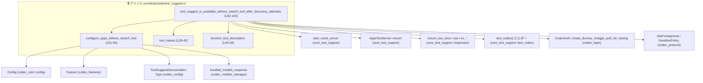
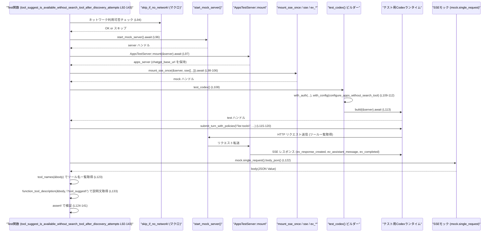

# core/tests/suite/tool_suggest.rs

## 0. ざっくり一言

Codex の「ツールサジェスト (tool_suggest)」機能について、  
**検索ツール (`tool_search`) 非対応モデルでも discovery 後に `tool_suggest` が提供されること**と、  
その **説明文の内容** を検証する非 Windows 向けの統合テストです。  
（`core/tests/suite/tool_suggest.rs:L1-2, L24-26, L92-143`）

---

## 1. このモジュールの役割

### 1.1 概要

- このテストモジュールは、Codex が ChatGPT Apps プラットフォームに対して送る「ツール一覧取得」リクエストの中身を観察し、
  - モデルが `tool_search` をサポートしていない設定でも
  - `tool_suggest` ツールが **リストに含まれること**
  - `tool_suggest` の説明文が **期待した文言を含み、不要な文言を含まないこと**
- を検証します。（`core/tests/suite/tool_suggest.rs:L61-90, L92-143`）

### 1.2 アーキテクチャ内での位置づけ

このテストは、テスト用 Codex ランタイム、モックサーバ、Apps テストサーバと連携して動作します。  
主な依存関係を簡略化した図です。



この図は、本テスト関数 `tool_suggest_is_available_without_search_tool_after_discovery_attempts`（`L92-143`）を中心に、  
どのヘルパー関数や外部コンポーネントに依存しているかを示しています。

### 1.3 設計上のポイント

- **テスト専用モジュール**
  - ファイル先頭に `#![cfg(not(target_os = "windows"))]` があり、Windows ではビルドされません。（`L1-1`）
  - Clippy の `unwrap` / `expect` 警告を許可しており、テスト内の簡便なパニック許容を明示しています。（`L2-2`）
- **責務の分割**
  - JSON からツール名／説明を抽出する処理を `tool_names` と `function_tool_description` に分離。（`L28-43, L45-59`）
  - モデル設定と機能フラグの調整を `configure_apps_without_search_tool` に切り出し。（`L61-90`）
- **エラーハンドリング方針**
  - テスト関数は `anyhow::Result<()>` を返し、`?` 演算子で非致命的な I/O エラー等を呼び出し元（テストランナー）に伝播。（`L92-93, L96-113, L115-121`）
  - 前提が壊れている場合（モデル定義がない等）は `.expect()` や `panic!` による **即時失敗** とし、テスト環境の不整合を早期に検出。（`L64-73, L81-89`）
- **並行性**
  - `#[tokio::test(flavor = "multi_thread", worker_threads = 2)]` により、Tokio のマルチスレッドランタイム上で実行。（`L92-92`）
  - このファイル内では共有可変状態は持たず、`async/await` で I/O 待ちを行うだけの設計です。

---

## 2. 主要な機能一覧

このファイルに定義されている主なコンポーネントです。

| 名前 | 種別 | 役割 / 機能 | 位置 |
|------|------|-------------|------|
| `TOOL_SEARCH_TOOL_NAME` | 定数 | 検索ツールのツール名 `"tool_search"` を保持 | `core/tests/suite/tool_suggest.rs:L24-24` |
| `TOOL_SUGGEST_TOOL_NAME` | 定数 | サジェストツールのツール名 `"tool_suggest"` を保持 | `L25-25` |
| `DISCOVERABLE_GMAIL_ID` | 定数 | テストで使用する Gmail コネクタ ID を保持 | `L26-26` |
| `tool_names` | 関数 | ChatGPT から送信される JSON ボディからツール名一覧を抽出 | `L28-43` |
| `function_tool_description` | 関数 | ツール名を指定して、その説明文 (`description`) を抽出 | `L45-59` |
| `configure_apps_without_search_tool` | 関数 | Codex `Config` を、`tool_search` 非対応モデルかつ `tool_suggest` 有効な状態に設定 | `L61-90` |
| `tool_suggest_is_available_without_search_tool_after_discovery_attempts` | 非同期テスト関数 | モックサーバとテストランタイムを立ち上げ、ツール一覧に `tool_suggest` が含まれることと説明文を検証 | `L92-143` |

---

## 3. 公開 API と詳細解説

このファイルはテストコードであり、クレート外に公開される API はありませんが、  
テスト内で再利用可能なヘルパー関数を「公開 API 相当」として整理します。

### 3.1 型一覧（構造体・列挙体など）

このファイル内で **新しく定義された構造体・列挙体はありません**。  
外部型（`Config`, `Feature`, `ToolSuggestDiscoverable` など）はインポートのみです。（`L4-22`）

### 3.2 関数詳細

#### `tool_names(body: &Value) -> Vec<String>`

**概要**

- `serde_json::Value` 型の JSON から、`tools` 配列内の各要素の `"name"` または `"type"` フィールドを文字列として取り出し、一覧にして返します。（`core/tests/suite/tool_suggest.rs:L28-43`）

**引数**

| 引数名 | 型 | 説明 |
|--------|----|------|
| `body` | `&Value` | HTTP リクエストの JSON ボディを表す `serde_json::Value`。`"tools"` キーを含むことを想定。 |

**戻り値**

- `Vec<String>`  
  `body["tools"]` が配列の場合、その各要素から `"name"` もしくは `"type"` フィールドの文字列を抽出し、ベクタで返します。  
  `tools` が存在しない・配列でない場合は **空ベクタ** を返します。（`L28-31, L42-42`）

**内部処理の流れ**

1. `body.get("tools")` で `"tools"` キーを取得。（`L29-29`）
2. `and_then(Value::as_array)` で配列型か確認し、配列スライスを得る。（`L30-30`）
3. 配列がある場合は `map(|tools| { ... })` 内で:
   - 各 `tool` 要素に対して `tool.get("name")` を試し、なければ `tool.get("type")` を試す。（`L35-36`）
   - それらを `Value::as_str` で文字列参照に変換し、`str::to_string` で `String` にコピー。（`L37-38`）
   - 取得できなかった要素は `filter_map` によりスキップ。（`L34-39`）
   - すべて `collect()` して `Vec<String>` にする。（`L32-33, L40-40`）
4. `tools` キーがない、または配列でない場合は `unwrap_or_default()` で空 `Vec` を返す。（`L42-42`）

**Examples（使用例）**

```rust
use serde_json::json;
use serde_json::Value;

// ダミーの tools 配列を持つ JSON を用意する
let body: Value = json!({
    "tools": [
        { "name": "tool_search" },
        { "name": "tool_suggest" },
        { "type": "legacy_tool_without_name" }
    ]
});

// ツール名の一覧を取得する
let tools = tool_names(&body); // ["tool_search", "tool_suggest", "legacy_tool_without_name"]

assert!(tools.contains(&"tool_suggest".to_string()));
```

**Errors / Panics**

- この関数内で `unwrap` や `expect` は使用していません。
- `body` がオブジェクトでない場合でも、`Value::get` は `None` を返すだけなので panic しません。

**Edge cases（エッジケース）**

- `body` に `tools` キーがない場合: 空ベクタを返します。（`L29-31, L42-42`）
- `tools` が配列でない場合（例: 文字列やオブジェクト）: `Value::as_array` が `None` になり、同様に空ベクタを返します。
- 各要素に `"name"` も `"type"` も存在しない場合: その要素はスキップされます。（`L34-39`）
- `"name"`/`"type"` が文字列でない場合: `Value::as_str` が `None` となり、その要素はスキップされます。

**使用上の注意点**

- `name` が存在しない場合は自動で `type` にフォールバックします。そのため、「名前」と「種類」を厳密に区別したい用途には適しません。
- `tools` の欠如＝エラーとみなしたい場合は、戻り値が空かどうかを呼び出し側でチェックする必要があります。

---

#### `function_tool_description(body: &Value, name: &str) -> Option<String>`

**概要**

- `body["tools"]` 配列の中から、指定した `name` と一致する `"name"` フィールドを持つツールを探し、その `"description"` フィールドの文字列を返します。（`core/tests/suite/tool_suggest.rs:L45-59`）

**引数**

| 引数名 | 型 | 説明 |
|--------|----|------|
| `body` | `&Value` | ツール定義を含む JSON ボディ。 |
| `name` | `&str`   | 探索対象のツール名（`"name"` フィールドの値）。 |

**戻り値**

- `Option<String>`  
  一致するツールが見つかり、かつ `"description"` が文字列であれば `Some(description)`。  
  見つからない場合や `description` がない／文字列でない場合は `None`。

**内部処理の流れ**

1. `body.get("tools")` で `"tools"` キーを取得。（`L46-46`）
2. `and_then(Value::as_array)` で配列かどうかを確認。（`L47-47`）
3. 配列がある場合は `tools.iter().find_map(...)` で:
   - 各 `tool` 要素について `tool.get("name").and_then(Value::as_str)` を評価し、`name` と一致するか判定。（`L49-51`）
   - 一致した場合、その `tool` から `tool.get("description")` を取り出し、文字列に変換して `Some(String)` を返す。（`L51-53`）
   - 一致しない場合は `None` を返し、次の要素へ。（`L54-56`）
4. どの要素もマッチしない場合は `None` が返ってきます。（`L49-57`）

**Examples（使用例）**

```rust
use serde_json::json;
use serde_json::Value;

let body: Value = json!({
    "tools": [
        {
            "name": "tool_suggest",
            "description": "Suggests tools based on prior discovery attempts."
        }
    ]
});

// "tool_suggest" ツールの説明文を取り出す
let desc = function_tool_description(&body, "tool_suggest");
assert!(desc.is_some());
assert!(desc.unwrap().contains("Suggests tools"));
```

**Errors / Panics**

- 関数内で panic を発生させるコードはありません。
- `tools` キーの欠如や想定外の型に対しても `None` を返すだけです。

**Edge cases（エッジケース）**

- `tools` キーが存在しない／配列でない: 直ちに `None` を返します。（`L46-48`）
- `name` に一致する `"name"` を持つ要素がない: `None` を返します。
- `"description"` キーが存在しない、または文字列でない: その要素はマッチしても `map` が `None` を返すため、結果として `None` になります。（`L51-53`）

**使用上の注意点**

- ツールを `"name"` ではなく `"type"` で識別しているケースはサポートしていません（`tool_names` とは異なり `type` フォールバックがない点に注意）。
- この関数をテスト外で使う場合、`None` をエラーとするかどうかを呼び出し側で決める必要があります。

---

#### `configure_apps_without_search_tool(config: &mut Config, apps_base_url: &str)`

**概要**

- Codex の `Config` オブジェクトを、次の条件になるように初期化します。（`core/tests/suite/tool_suggest.rs:L61-90`）
  - 機能フラグ `Apps`, `Plugins`, `ToolSuggest` を有効化（`Feature` の利用）。
  - ChatGPT ベース URL とモデル `"gpt-5-codex"` を設定。
  - `tool_suggest` の discoverable に Gmail コネクタを 1 つだけ登録。
  - モデルカタログから `"gpt-5-codex"` の `supports_search_tool` を `false` に書き換える。

**引数**

| 引数名 | 型 | 説明 |
|--------|----|------|
| `config` | `&mut Config` | テスト中の Codex 設定オブジェクト。可変参照で渡され、直接書き換えられる。 |
| `apps_base_url` | `&str` | ChatGPT Apps のベース URL。`AppsTestServer` から渡されます。 |

**戻り値**

- なし（`()`）。`config` がインプレースで更新されます。

**内部処理の流れ**

1. `config.features.enable(Feature::Apps)` を呼び出し、結果に対して `.expect("test config should allow feature update")` を実行。（`L62-65`）
2. 同様に `Feature::Plugins`, `Feature::ToolSuggest` を有効化。（`L66-73`）
3. `config.chatgpt_base_url` に `apps_base_url.to_string()` を代入。（`L74-74`）
4. `config.model = Some("gpt-5-codex".to_string())` として使用モデルを指定。（`L75-75`）
5. `config.tool_suggest.discoverables` に `ToolSuggestDiscoverable { kind: Connector, id: DISCOVERABLE_GMAIL_ID }` を 1 要素だけ格納。（`L76-79`）
6. `bundled_models_response()` を呼び出し、失敗した場合は `panic!("bundled models.json should parse: {err}")`。（`L81-82`）
7. 取得した `model_catalog.models` から `slug == "gpt-5-codex"` のモデルを検索し、見つからない場合 `expect("gpt-5-codex exists in bundled models.json")` で panic。（`L83-87`）
8. 見つかったモデルの `supports_search_tool` フィールドを `false` に設定。（`L88-88`）
9. 更新された `model_catalog` を `config.model_catalog` にセット。（`L89-89`）

**Examples（使用例）**

（テスト内で実際に行っている使い方）

```rust
use codex_core::config::Config;

// どこかでデフォルトの Config を作成したとする
let mut config = Config::default();

// AppsTestServer などから取得したベース URL
let apps_base_url = "https://apps.example.test";

// 検索ツール非対応モデルとして設定しつつ、ToolSuggest を有効化
configure_apps_without_search_tool(&mut config, apps_base_url);

// ここで config.model は Some("gpt-5-codex") になり、
// 選択モデルは supports_search_tool == false の状態になります。
```

**Errors / Panics**

- `features.enable(...)` が失敗した場合、`expect("test config should allow feature update")` により **panic** します。（`L62-73`）
- `bundled_models_response()` のパースに失敗した場合、`panic!("bundled models.json should parse: {err}")`。（`L81-82`）
- モデルカタログに `"gpt-5-codex"` が存在しない場合、`expect("gpt-5-codex exists in bundled models.json")` により **panic** します。（`L83-87`）

これらの panic はテスト環境の不整合を早期に検出する意図で使われています。

**Edge cases（エッジケース）**

- `bundled_models_response()` が空のモデルリストを返した場合: `"gpt-5-codex"` が見つからず、panic となります。
- `Config` が既に何らかのモデルや機能フラグを持っている場合: この関数が上書きします（前の値は保持されません）。

**使用上の注意点**

- 本来テスト用のヘルパーであり、プロダクションコードからの利用は前提としていません。
- panic ベースの設計のため、**信頼できるテスト環境**（正しい `bundled models.json` 等）が整っていることが前提条件です。
- `config` は可変参照で渡され、内部で多くのフィールドが書き換えられます。呼び出し前の設定状態には戻せません。

---

#### `tool_suggest_is_available_without_search_tool_after_discovery_attempts() -> Result<()>`

```rust
#[tokio::test(flavor = "multi_thread", worker_threads = 2)]
async fn tool_suggest_is_available_without_search_tool_after_discovery_attempts() -> Result<()> { ... }
```

**概要**

- マルチスレッド Tokio ランタイム上で動作する非同期テストです。（`core/tests/suite/tool_suggest.rs:L92-92`）
- テスト用モックサーバと Apps テストサーバを起動し、Codex テストランタイムを構成した上で、
  - ユーザー入力 `"list tools"` を送信
  - モックサーバが受け取ったリクエストボディからツール一覧を抽出
  - `tool_search` が含まれず、`tool_suggest` が含まれること
  - `tool_suggest` の説明文が期待する文言を含むこと
- を検証します。（`L96-141`）

**引数**

- なし（テスト関数なので引数は取りません）。

**戻り値**

- `anyhow::Result<()>`  
  - 成功時: `Ok(())`
  - モックサーバの起動やテストランタイム構築などでエラーが起きた場合: `Err(anyhow::Error)` としてテスト失敗。

**内部処理の流れ（アルゴリズム）**

1. **ネットワーク環境のチェック**  
   `skip_if_no_network!(Ok(()));` マクロにより、ネットワークが利用できない環境ではテストをスキップします。（`L94-94`）

2. **モックサーバと Apps サーバの起動**  
   - `let server = start_mock_server().await;` でテスト用 HTTP モックサーバを起動。（`L96-96`）
   - `let apps_server = AppsTestServer::mount(&server).await?;` で Apps 用のテストサーバをモックサーバ上にマウント。（`L97-97`）

3. **SSE モックの設定**  
   - `mount_sse_once(&server, sse(vec![ ... ])).await;` を呼び出し、1 回だけ SSE エンドポイントがモックされるように設定します。（`L98-106`）
   - SSE のイベント列として、`ev_response_created`, `ev_assistant_message`, `ev_completed` を指定しています。

4. **Codex テストランタイムの構築**  
   - `let mut builder = test_codex()` でビルダーを取得。（`L108-108`）
   - `.with_auth(CodexAuth::create_dummy_chatgpt_auth_for_testing())` でダミー認証情報を設定。（`L109-109`）
   - `.with_config(move |config| { configure_apps_without_search_tool(config, apps_server.chatgpt_base_url.as_str()) })` により、先述のヘルパーで Config を調整。（`L110-112`）
   - `let test = builder.build(&server).await?;` でテスト用 Codex ランタイムインスタンスを構築。（`L113-113`）

5. **ユーザー入力の送信**  
   - `test.submit_turn_with_policies("list tools", AskForApproval::Never, SandboxPolicy::DangerFullAccess).await?;`  
     で、ポリシー付きのユーザーターン `"list tools"` を送信。（`L115-120`）

6. **送信されたリクエストの検査**  
   - `let body = mock.single_request().body_json();` で、SSE モックに対して送られた HTTP リクエストの JSON ボディを取得。（`L122-122`）
   - `let tools = tool_names(&body);` でツール名一覧を抽出。（`L123-123`）

7. **ツールリストに対する検証**  
   - `tools` に `"tool_search"` が含まれていないことを `assert!` で検証。（`L124-127`）
   - `tools` に `"tool_suggest"` が含まれていることを `assert!` で検証。（`L128-131`）

8. **tool_suggest の説明文に対する検証**  
   - `let description = function_tool_description(&body, TOOL_SUGGEST_TOOL_NAME).expect("description");` で `tool_suggest` の説明文を取得。（`L133-134`）
   - 以下を `assert!` で検証。（`L135-141`）
     - `"You've already tried to find a matching available tool for the user's request"` を含む。
     - `"This includes`tool_search`(if available) and other means."` を含む。
     - `"tool_search fails to find a good match"` を含ま **ない**。

9. 最後に `Ok(())` を返し、テスト成功を示します。（`L143-143`）

**Examples（使用例）**

この関数自体はテストランナーから自動的に呼ばれるため、直接呼び出すコード例はありません。  
処理の一部（ツールリスト検査）のパターンは、他のテストでも利用できます。

```rust
// 他のテスト関数内でツールリストを検査する例（パターンの再利用）
let body = mock.single_request().body_json(); // モックサーバが受け取った JSON
let tools = tool_names(&body);

assert!(tools.contains(&"tool_suggest".to_string()));
assert!(!tools.contains(&"tool_search".to_string()));
```

**Errors / Panics**

- `start_mock_server().await` や `AppsTestServer::mount().await`、`builder.build().await` などでエラーが発生した場合、`?` により `Err` が返され、テストは失敗します。（`L96-97, L113-113`）
- `mock.single_request()` が内部で panic する可能性（要求が飛んでいない等）はありますが、このファイルからは分かりません（このチャンクには `single_request` の実装は現れません）。
- `assert!` や `expect("description")` によって、期待が満たされない場合はテストが panic します。（`L124-141`）

**Edge cases（エッジケース）**

- ネットワーク不可の場合: `skip_if_no_network!` によりテストがスキップされることが想定されますが、マクロの詳細はこのチャンクには現れません。（`L94-94`）
- `tool_suggest` ツールがリストに含まれない場合: `function_tool_description(...).expect("description")` が panic し、テストは失敗します。（`L133-134`）
- モックが複数回呼ばれる／呼ばれないといった状態: `mock.single_request()` の挙動は外部依存ですが、おそらく 1 回だけのリクエストを期待しています（関数名からの推測であり、実装はこのチャンクには現れません）。

**使用上の注意点**

- Tokio の `multi_thread` ランタイム上で動きますが、この関数内で共有可変状態を扱っていないため、Rust の所有権・借用ルールによりデータ競合は発生しません。
- テストが外部ネットワークやファイル (`bundled models.json`) に依存しているため、環境差によるテストの不安定さには注意が必要です。

---

### 3.3 その他の関数

上記 4 関数以外に、このファイルに定義された関数はありません。

---

## 4. データフロー

### 4.1 シナリオ概要

代表的なシナリオは、テスト関数  
`tool_suggest_is_available_without_search_tool_after_discovery_attempts`（`L92-143`）が実行される際のフローです。

- テストがモックサーバを起動し、Apps テストサーバと SSE モックを設定。
- Codex テストランタイムを構築し、ユーザー入力 `"list tools"` を送信。
- そのリクエストがモックサーバ経由で Apps テストサーバに届き、SSE レスポンスを返す。
- テスト側が、そのとき送信された HTTP リクエストボディからツール定義を解析し、期待どおりか検証します。

### 4.2 シーケンス図



この図は、本ファイルのコードだけから読み取れる呼び出し関係を示しています。  
`MockServer`, `Apps`, `SSE`, `Builder`, `CodexRT`, `Mock` の内部動作は他ファイルにあり、このチャンクには現れません。

---

## 5. 使い方（How to Use）

### 5.1 基本的な使用方法

このファイルの関数は主にテスト用ですが、  
「ツール一覧を返す JSON から名前や説明文を取り出す」パターンとして再利用できます。

```rust
use serde_json::Value;

// どこかで HTTP リクエストボディを JSON として取得したとする
let body: Value = mock.single_request().body_json();

// ツール名の一覧を取得
let tools = tool_names(&body);

// 特定ツールの説明を取得
if let Some(desc) = function_tool_description(&body, "tool_suggest") {
    println!("tool_suggest description: {desc}");
}
```

`configure_apps_without_search_tool` は、テスト用の `Config` に特化した初期化関数です。

```rust
let server = start_mock_server().await;
let apps_server = AppsTestServer::mount(&server).await?;
let mut config = Config::default();

// Apps ベース URL を元に、検索ツール非対応モデルを設定
configure_apps_without_search_tool(&mut config, apps_server.chatgpt_base_url.as_str());
```

### 5.2 よくある使用パターン

- **ツールリスト検証パターン**
  - モックサーバが受け取ったリクエストの JSON を `tool_names` で解析し、  
    期待するツールが含まれているか／含まれていないかを `assert!` で検証。（`L122-131`）
- **説明文の部分一致検証**
  - `function_tool_description` で取り出した説明文に対して `contains` を用い、  
    特定の文言を含む／含まないことを検証。（`L133-141`）
- **モデル機能フラグの切替テスト**
  - `configure_apps_without_search_tool` で `supports_search_tool = false` に変更した状態で  
    アプリケーションの挙動を検証するパターン。（`L61-90`）

### 5.3 よくある間違い（想定される誤用例）

このファイルから推測できる誤用パターンを挙げます。

```rust
// 誤り例: "name" ではなく "type" で説明を取ろうとする
let desc = function_tool_description(&body, "some_tool_type");
// tools 要素に "name": "some_tool_type" がない場合は None になる

// 正しい例: "name" フィールドの値を指定する
let desc = function_tool_description(&body, "tool_suggest");
```

```rust
// 誤り例: Config のモデルカタログに "gpt-5-codex" が存在しない前提で configure を呼ぶ
// （bundled_models_response の仕様を変えた場合など）
configure_apps_without_search_tool(&mut config, apps_base_url);
// -> "gpt-5-codex exists in bundled models.json" の expect で panic する可能性がある

// この関数は bundled_models_response に "gpt-5-codex" が存在する前提で書かれています。
// 前提を変える場合は、この関数の実装を合わせて更新する必要があります。
```

### 5.4 使用上の注意点（まとめ）

- **テスト専用設計**
  - `configure_apps_without_search_tool` やテスト関数は、panic による失敗を前提としており、  
    プロダクションコードでの利用には適していません。
- **並行性**
  - `#[tokio::test(flavor = "multi_thread")]` により、非同期処理は複数スレッドでスケジューリングされますが、  
    このファイル内では共有可変データを扱っていないため、Rust の借用規則によりデータ競合は防がれています。
- **エラーハンドリング**
  - 非 I/O 条件（設定ミス、モデルファイル不整合など）は panic (`expect`, `panic!`) で処理されます。
  - I/O エラーや外部コンポーネントからのエラーは `anyhow::Result` 経由で伝播します。
- **環境依存性**
  - ネットワーク環境・`bundled models.json` の内容・Apps テストサーバ実装に依存するため、  
    これらが変化した場合にはテストの期待値（`assert!` の条件）を見直す必要があります。

---

## 6. 変更の仕方（How to Modify）

### 6.1 新しい機能を追加する場合（例: 別のツール関連テスト）

1. **新テスト関数の追加**
   - 本ファイル、または同ディレクトリ内に新たなテスト関数を追加します。
   - 既存パターンにならい、`#[tokio::test(...)]` で非同期テストとするかを決めます。

2. **設定の流用**
   - `tool_search` の有無や別モデルに関するテストであれば、
     - `configure_apps_without_search_tool` を流用・拡張するか、
     - 新しい `configure_...` ヘルパー関数を追加します。（`L61-90`）

3. **JSON 検査の流用**
   - ツール名や説明文を検査する場合は `tool_names` / `function_tool_description` を再利用し、  
     新たな `assert!` 条件を書きます。

### 6.2 既存の機能を変更する場合

- **`tool_suggest` の説明文仕様が変わった場合**
  - テストの `assert!(description.contains(...))` の文字列リテラルを新仕様に合わせて更新します。（`L135-141`）
  - 仕様変更に伴い、否定チェック（含まれてはならない文言）が不要／追加される場合も適宜調整します。

- **モデル名や機能フラグの扱いが変わった場合**
  - `configure_apps_without_search_tool` 内の `config.model` の値や `supports_search_tool` の扱いを変更します。（`L75-88`）
  - 同時に、他のテスト（存在する場合）への影響を確認します。

- **エラー契約・前提条件の確認**
  - `expect`/`panic!` 文言は、「何が前提なのか」を表すメッセージでもあります。（`L64-65, L69-70, L73-73, L81-82, L83-87`）
  - 前提条件を変更する場合は、これらのメッセージも合わせて更新すると、将来のデバッグが容易になります。

---

## 7. 関連ファイル

このテストモジュールと密接に関係する外部ファイル・モジュール（インポート先）です。  
内部実装はこのチャンクには現れませんが、呼び出し方から役割を推測できる範囲で記載します。

| パス / モジュール | 役割 / 関係 | 根拠 |
|-------------------|------------|------|
| `codex_core::config::Config` | Codex 全体の設定を表す構造体。テスト用に書き換えられる。 | `core/tests/suite/tool_suggest.rs:L7, L61-90` |
| `codex_features::Feature` | 機能フラグ列挙体。`Apps`, `Plugins`, `ToolSuggest` を有効化するために使用。 | `L8, L62-73` |
| `codex_config::types::ToolSuggestDiscoverable` / `ToolSuggestDiscoverableType` | `tool_suggest` が利用可能な外部ツール（コネクタ）を表す設定項目。 | `L5-6, L76-79` |
| `codex_models_manager::bundled_models_response` | `bundled models.json` を読み込んでモデルカタログを返す関数。テストでは `gpt-5-codex` モデルの `supports_search_tool` を変更するために使用。 | `L10, L81-89` |
| `codex_login::CodexAuth` | Codex の認証情報を扱う型。テスト用ダミー認証を生成するメソッドを使用。 | `L9, L109` |
| `codex_protocol::protocol::AskForApproval`, `SandboxPolicy` | テスト用の送信ターンに付与するポリシー設定。 | `L11-12, L115-118` |
| `core_test_support::apps_test_server::AppsTestServer` | テスト用 Apps サーバをモックサーバ上にマウントするためのユーティリティ。 | `L13, L97` |
| `core_test_support::responses::{ev_response_created, ev_assistant_message, ev_completed, mount_sse_once, sse}` | SSE レスポンス用のイベントやマウント関数。Codex -> Apps へのリクエストを観測するために利用。 | `L14-18, L98-106` |
| `core_test_support::responses::start_mock_server` | HTTP モックサーバを起動する関数として利用されています。 | `L19, L96` |
| `core_test_support::skip_if_no_network` | ネットワーク利用不可環境でテストをスキップするマクロ。 | `L20, L94` |
| `core_test_support::test_codex::test_codex` | Codex テストランタイム用のビルダを返す関数。 | `L21, L108-113` |
| `serde_json::Value` | JSON の柔軟な表現に用いる型。ツール一覧のパースに使用。 | `L22, L28-59, L122-134` |

これらのコンポーネントの具体的な実装は本チャンクには含まれていませんが、  
このテストファイルはそれらを組み合わせて「`tool_search` 非対応モデルにおける `tool_suggest` 提供および説明文」を検証する構造になっています。
