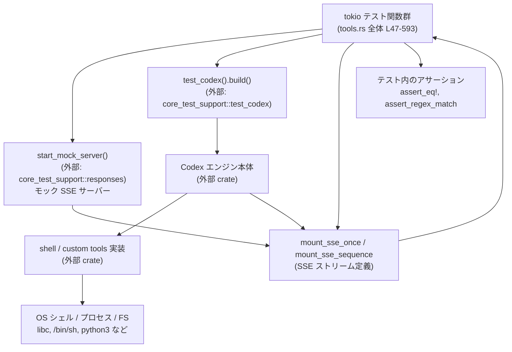

core/tests/suite/tools.rs

---

## 0. ざっくり一言

非 Windows 環境で、Codex の「シェル実行系ツール」と「カスタムツール」の挙動（権限・サンドボックス・タイムアウト・エラー・仕様フラグ）を、エンドツーエンドで検証するための非公開テスト群です（core/tests/suite/tools.rs:L1-2, L47-48 ほか）。

---

## 1. このモジュールの役割

### 1.1 概要

- このモジュールは、Codex が提供する「shell ツール」「統合 exec（UnifiedExec）」およびカスタムツールの **一連の仕様を破壊しないこと** を確認するテストを集約しています。
- 主に次の性質を検証します（core/tests/suite/tools.rs:L94-189, L191-282, L347-593）。
  - エスカレート権限要求の拒否と再実行の成功
  - サンドボックス拒否時に **元のツール出力が表に出ること**
  - タイムアウト時の exit code / メッセージ整形
  - spawn 失敗時のエラーメッセージ長の上限
  - UnifiedExec 機能フラグに応じたツール一覧の変化
  - 未知のカスタムツール呼び出しのエラー

### 1.2 アーキテクチャ内での位置づけ

このテストモジュールは、テスト用 Codex インスタンスとモック SSE サーバーを仲介し、モデルから見た「ツール呼び出し → 実 OS コマンド実行 → 結果フォーマット」の流れを検証します。



- すべてのテストが `#[tokio::test(flavor = "multi_thread", worker_threads = 2)]` で実行され、マルチスレッドな Tokio ランタイム上で非同期に振る舞います（core/tests/suite/tools.rs:L47, L94, L191, L320, L347, L418, L515）。
- モック SSE サーバーに、ツール呼び出しやアシスタントメッセージのイベント列を差し込み、その結果として Codex がどうレスポンスするかを確認します（L58-74, L116-149, L217-228, L362-378 など）。

### 1.3 設計上のポイント

- **非 Windows 限定**  
  冒頭の `#![cfg(not(target_os = "windows"))]` により、Windows ではビルドされません（core/tests/suite/tools.rs:L1）。`/bin/sh` や `libc::kill` など POSIX 依存の処理を前提にしているためと考えられます。
- **unwrap/expect の許容**  
  テストコードであるため、`#![allow(clippy::unwrap_used, clippy::expect_used)]` で `unwrap` / `expect` の使用が許容されています（L2）。
- **権限とサンドボックス**  
  - `SandboxPolicy`, `SandboxPermissions::RequireEscalated` を使い、権限エスカレーション要求時の挙動を検証（L106-110, L151-161）。
  - `SandboxPolicy::new_read_only_policy()` を用いて、読み取り専用サンドボックス下での拒否出力を検証（L231-235）。
- **エラーハンドリングとメタデータ**  
  - `anyhow::Result` と `Context` により、テスト失敗時に分かりやすい追加情報をエラーに付加しています（L8-9, L237-249, L485-487）。
  - exit code, stdout, エラー文字列などを JSON やプレーンテキストとして解析し、仕様どおりの構造になっているかを確認します（L178-185, L398-407, L490-495, L574-590）。
- **並行性とタイムアウト**  
  - 実際の OS プロセス（子・孫プロセス）を起動し、Tokio の `timeout` で「ハングしない」ことを確認するテストがあります（L471-487）。
  - `Instant` と `Duration` を用いて、タイムアウト後に一定時間以内に戻ることを検証しています（L471-489, L501-504）。

---

## 2. 主要な機能一覧

このモジュールが提供する「機能」は、すべてテストとして定義されています。

- 未知カスタムツールのエラー検証  
  `custom_tool_unknown_returns_custom_output_error`: 未サポートのカスタムツール呼び出しが、期待されたエラーメッセージを返すかを確認（L47-92）。
- 権限エスカレーションの拒否と再実行  
  `shell_escalated_permissions_rejected_then_ok`: エスカレート権限要求が方針上拒否され、その後通常権限で成功することを確認（L94-189）。
- サンドボックス拒否時の元出力の維持  
  `sandbox_denied_shell_returns_original_output`: 読み取り専用サンドボックスで拒否された際に、元のツール出力が返り、fallback メッセージに置き換わらないことを確認（L191-282）。
- UnifiedExec フラグによるツール一覧の切り替え  
  `collect_tools` + `unified_exec_spec_toggle_end_to_end`: `Feature::UnifiedExec` の ON/OFF により `exec_command` / `write_stdin` の有無が切り替わることを確認（L284-318, L320-345）。
- タイムアウト時の exit code とメッセージ整形  
  `shell_timeout_includes_timeout_prefix_and_metadata`: タイムアウト時に exit code 124 と timeout メッセージ、もしくは signal ベースのエラー文字列となることを確認（L347-415）。
- 孫プロセスが生きていてもハングしないこと  
  `shell_timeout_handles_background_grandchild_stdout`: detached な孫プロセスが stdout/stderr を持ち続けても、タイムアウト後に短時間で戻ることを確認（L418-513）。
- spawn 失敗時エラーの truncation  
  `shell_spawn_failure_truncates_exec_error`: 非常に長いパスによる spawn 失敗時、エラー出力が 10 KiB 以内に収まることを確認（L515-593）。
- ツール名抽出ユーティリティ  
  `tool_names`: SSE リクエストボディからツール名リストを抽出するヘルパー関数（L30-45）。

### コンポーネントインベントリー（関数）

| 名前 | 種別 | 役割 / 用途 | 定義位置 |
|------|------|-------------|----------|
| `tool_names` | 関数 | SSE リクエスト JSON から `tools` 配列の `name` / `type` を抽出 | core/tests/suite/tools.rs:L30-45 |
| `custom_tool_unknown_returns_custom_output_error` | Tokio 非同期テスト | 未知カスタムツール呼び出しのエラーメッセージ検証 | core/tests/suite/tools.rs:L47-92 |
| `shell_escalated_permissions_rejected_then_ok` | Tokio 非同期テスト | エスカレート権限要求の拒否と非エスカレート再実行の成功検証 | core/tests/suite/tools.rs:L94-189 |
| `sandbox_denied_shell_returns_original_output` | Tokio 非同期テスト | サンドボックス拒否時に元のツール出力が返ることを検証 | core/tests/suite/tools.rs:L191-282 |
| `collect_tools` | 非公開 async 関数 | UnifiedExec の ON/OFF ごとのツール一覧を取得 | core/tests/suite/tools.rs:L284-318 |
| `unified_exec_spec_toggle_end_to_end` | Tokio 非同期テスト | UnifiedExec フラグに応じたツール一覧を E2E で検証 | core/tests/suite/tools.rs:L320-345 |
| `shell_timeout_includes_timeout_prefix_and_metadata` | Tokio 非同期テスト | タイムアウト時の exit code / メッセージ整形を検証 | core/tests/suite/tools.rs:L347-415 |
| `shell_timeout_handles_background_grandchild_stdout` | Tokio 非同期テスト | 孫プロセスが生存してもタイムアウト後にハングしないことを検証 | core/tests/suite/tools.rs:L418-513 |
| `shell_spawn_failure_truncates_exec_error` | Tokio 非同期テスト | spawn 失敗時のエラー出力が 10 KiB 以内であることを検証 | core/tests/suite/tools.rs:L515-593 |

---

## 3. 公開 API と詳細解説

このファイル内で定義される関数はすべて `pub` ではなく、テストモジュール内部でのみ使用されます。ただし、テストが前提とする「仕様」は、外部の公開 API（Codex のツール機構）に対する契約として重要です。

### 3.1 型一覧（このファイルで利用する主な外部型）

| 名前 | 種別 | 役割 / 用途 | 根拠 |
|------|------|-------------|------|
| `SandboxPolicy` | 構造体（推定） | サンドボックスの権限ポリシーを表現。`DangerFullAccess` や `new_read_only_policy()` を通じて権限レベルを指定 | 利用: core/tests/suite/tools.rs:L13, L151-155, L231-235, L423-428, L561-564 |
| `SandboxPermissions` | 列挙体（推定） | 個々のツール呼び出しでの追加権限指定。ここでは `RequireEscalated` が使われる | 利用: L10, L106-110 |
| `AskForApproval` | 列挙体（推定） | コマンド実行に対するユーザー承認ポリシー。`Never` が使われ、エスカレーション要求拒否のトリガーになる | 利用: L12, L76-79, L151-154, L309-313, L381-384, L473-477, L561-564 |
| `Feature::UnifiedExec` | 列挙体のバリアント | UnifiedExec 機能フラグを ON/OFF し、ツール一覧の内容を変える | 利用: L11, L295-305 |
| `Value` (`serde_json`) | JSON 値型 | SSE ボディやツール出力の JSON 表現を扱う | 利用: L27, L30-45, L84-87, L178-185, L397-405, L389-392 |
| `Regex` (`regex_lite`) | 構造体 | エラー出力が期待フォーマットにマッチするか検証 | 利用: L26, L574-590 |
| `Result<()>` (`anyhow`) | 戻り値型 | テスト関数のエラー情報を一元的に扱う | 利用: 各 `async fn ... -> Result<()>` 定義 |

※ 型の正確な定義は他ファイルにあります。ここではモジュール内での使われ方に基づき役割を記述しています。

---

### 3.2 関数詳細（7 件）

#### `tool_names(body: &Value) -> Vec<String>`

**概要**

SSE リクエストボディに含まれる `"tools"` 配列から、各ツールの `"name"` または `"type"` フィールドを取り出し、ツール名のリストとして返すユーティリティ関数です（core/tests/suite/tools.rs:L30-45）。

**引数**

| 引数名 | 型 | 説明 |
|--------|----|------|
| `body` | `&Value` | SSE リクエストボディを表す JSON 値。`"tools"` フィールドを含むことを期待 |

**戻り値**

- `Vec<String>`: `"tools"` 配列に含まれる各要素の `"name"` または `"type"` の文字列。該当プロパティや `"tools"` 自体が存在しない場合は空ベクタ。

**内部処理の流れ**

1. `body.get("tools")` で `"tools"` フィールドを取り出す（L31）。
2. `and_then(Value::as_array)` で JSON 配列なら `&[Value]` に変換し、それ以外なら `None`（L32）。
3. 配列がある場合のみ `map` で処理し、各 `tool` について（L33-41）:
   - `tool.get("name")` または `tool.get("type")` を優先順に取得（L37-38）。
   - `Value::as_str` で文字列かどうか判定し、`str::to_string` で `String` に変換（L39-40）。
4. `filter_map` で文字列にならない要素をスキップし、`collect()` で `Vec<String>` に収集（L35-42）。
5. `"tools"` が配列でない／存在しない場合は `unwrap_or_default()` で空ベクタを返す（L44）。

**Examples（使用例）**

```rust
use serde_json::json;

// tools 配列を含む JSON からツール名を抽出する例
let body = json!({
    "tools": [
        { "name": "exec_command" },
        { "type": "write_stdin" },
        { "name": "other_tool", "type": "ignored" },
    ]
});

let names = tool_names(&body); // ["exec_command", "write_stdin", "other_tool"]
```

**Errors / Panics**

- この関数内では `unwrap` / `expect` を使用しておらず、`Value` からの取得も安全に行っています。パニック要因はありません（L30-45）。
- `body` に任意の JSON を渡しても、型不一致はすべて `None` として扱われます。

**Edge cases（エッジケース）**

- `"tools"` フィールドが存在しない、もしくは配列でない場合: 空の `Vec` を返します（L31-32, L44）。
- 各要素に `"name"` も `"type"` もない、または非文字列の場合: その要素は結果から除外されます（L37-41）。
- `"name"` と `"type"` が両方ある場合: `"name"` を優先します（`get("name").or_else(|| get("type"))` の順序、L37-38）。

**使用上の注意点**

- この関数はテスト補助用であり、エラーを投げずに静かに空ベクタを返すため、呼び出し側で「ツール一覧が必須かどうか」を考慮する必要があります。
- JSON スキーマが変化した場合（フィールド名変更など）、結果が空になる可能性があるため、テストが落ちた場合はまず `"tools"` 配列構造を確認するのが有用です。

---

#### `collect_tools(use_unified_exec: bool) -> Result<Vec<String>>`

**概要**

`Feature::UnifiedExec` の有効／無効を切り替えた Codex テストインスタンスを起動し、「list tools」というターンを送信して返ってきた SSE リクエストボディからツール名一覧を収集します（core/tests/suite/tools.rs:L284-318）。`unified_exec_spec_toggle_end_to_end` テストから利用されます。

**引数**

| 引数名 | 型 | 説明 |
|--------|----|------|
| `use_unified_exec` | `bool` | `true` なら `Feature::UnifiedExec` を enable、`false` なら disable する |

**戻り値**

- `Result<Vec<String>>`（`anyhow::Result`）:
  - `Ok(Vec<String>)`: ツール名一覧。
  - `Err(_)`: モックサーバ起動失敗、Codex 構築失敗、ターン送信失敗などで発生。

**内部処理の流れ**

1. モック SSE サーバーを起動（`start_mock_server().await`、L285）。
2. `responses` に、1 回だけの SSE シーケンス（レスポンス作成 → assistant メッセージ → completed）を定義し（L287-291）、`mount_sse_sequence` でモックに登録（L292）。
3. `test_codex().with_config` に `move |config|` クロージャを渡し、`use_unified_exec` に応じて `config.features.enable/disable(Feature::UnifiedExec)` を実行（L294-305）。
4. `builder.build(&server).await?` でテスト用 Codex インスタンスを構築（L307）。
5. `submit_turn_with_policies` で `"list tools"` というプロンプトを送り、`AskForApproval::Never`, `SandboxPolicy::DangerFullAccess` で実行（L309-314）。
6. `mock.single_request().body_json()` でモック SSE に記録された最初のリクエストボディの JSON を取り出し（L316）、`tool_names(&first_body)` でツール名ベクタに変換して返す（L317-318）。

**Examples（使用例）**

テスト内での実際の呼び出し例（簡略化）:

```rust
// UnifiedExec 無効時のツール一覧を取得
let tools_disabled = collect_tools(false).await?;

// UnifiedExec 有効時のツール一覧を取得
let tools_enabled = collect_tools(true).await?;
```

**Errors / Panics**

- `build`, `submit_turn_with_policies`, `Regex::new` など、`?` 演算子経由で `anyhow::Error` が返る可能性があります（L307, L309-314）。
- `expect("test config should allow feature update")` が feature 更新失敗時にパニックします（L298-300, L302-304）。これはテスト用前提条件です。

**Edge cases（エッジケース）**

- SSE モックからのリクエストが 1 件もない場合、`mock.single_request()` の挙動はこのファイルだけでは分かりませんが、テストが panic または error になる可能性があります（実装は別ファイル）。
- `"tools"` フィールドが無い、または構造が変わっている場合、結果が空ベクタとなり、上位テストで検出されます（`tool_names` の挙動、L30-45）。

**使用上の注意点**

- `use_unified_exec` 切り替えにより、Codex の内部仕様に依存したツール一覧を検証しているため、仕様変更時にはこの関数を利用するテスト (`unified_exec_spec_toggle_end_to_end`) の期待値を更新する必要があります（L320-344）。
- SSE モックは 1 シーケンスを前提としているため、追加のターンを送る場合には `mount_sse_sequence` の定義を変更する必要があります（L287-292）。

---

#### `shell_escalated_permissions_rejected_then_ok() -> Result<()>`

**概要**

エスカレート権限 (`SandboxPermissions::RequireEscalated`) を要求する `shell` ツール呼び出しが、承認ポリシー `AskForApproval::Never` の元では拒否され、その後同じコマンドを権限要求なしで再実行すると成功することを検証します（core/tests/suite/tools.rs:L94-189）。

**引数**

- なし（Tokio テスト関数）。

**戻り値**

- `Result<()>`: テスト成功時は `Ok(())`、どこかで失敗すれば `Err(_)` またはアサーションで panic。

**内部処理の流れ**

1. ネットワークが使えない環境では `skip_if_no_network!(Ok(()))` によってテストをスキップ（L96）。
2. モックサーバ起動・Codex ビルド（L98-100）。
3. 実行するシェルコマンド `["/bin/echo", "shell ok"]` を定義（L102）。
4. `first_args`: `sandbox_permissions: RequireEscalated` を含む JSON を構築（L106-110）。
5. `second_args`: 権限指定なしの JSON を構築（L111-114）。
6. 1 回目 SSE: `call_id_blocked` で `shell` ツールを `first_args` 付きで呼び出すイベントを登録（L116-127）。
7. 2 回目 SSE: `call_id_success` で `shell` ツールを `second_args` 付きで呼び出すイベントを登録（L129-141）。
8. 3 回目 SSE: アシスタントメッセージと completed を登録（L142-149）。
9. `"run the shell command"` というターンを `AskForApproval::Never`, `SandboxPolicy::DangerFullAccess` で送信（L151-156）。
10. 期待される拒否メッセージを `format!` で組み立て（L158-161）。
11. `second_mock` から `call_id_blocked` の出力文字列を取得し（L163-167）、期待メッセージと一致することを `assert_eq!`（L168-171）。
12. `third_mock` から `call_id_success` の出力を取得し（L173-177）、JSON としてパース（L178）。
13. `metadata.exit_code == 0` であることを確認（L179-183）。
14. `output` フィールドから stdout を取得し、正規表現 `^shell ok\n?$` にマッチすることを検証（L184-186）。

**Examples（使用例）**

テスト関数の利用は `cargo test` による自動実行となるため、直接呼び出す想定はありません。パターンとして:

```rust
#[tokio::test(flavor = "multi_thread", worker_threads = 2)]
async fn test_permission_escalation_behavior() -> Result<()> {
    // setup
    // mount_sse_once(...)

    // act
    // test.submit_turn_with_policies(...).await?;

    // assert
    // 出力から拒否メッセージと成功メッセージを検証
    Ok(())
}
```

**Errors / Panics**

- `builder.build`, `serde_json::to_string`, `serde_json::from_str` が `?` 経由で `Err` を返す可能性があります（L100, L123, L136, L178）。
- `expect("blocked output string")`, `expect("success output string")` が出力取得に失敗した場合に panic します（L167, L177）。
- 仕様と異なるメッセージや exit code, stdout が返された場合、`assert_eq!`, `assert_regex_match` により panic します（L168-171, L179-186）。

**Edge cases（エッジケース）**

- ツール側が `SandboxPermissions::RequireEscalated` を無視する仕様になった場合、このテストは失敗し、仕様変更を検知します。
- `AskForApproval` のデフォルトフォーマット（`{policy:?}` の Debug 表現）が変わると、期待メッセージが一致しなくなりテストが失敗します（L158-161）。

**使用上の注意点**

- このテストは「エスカレート権限要求 + 承認ポリシー `Never` の組み合わせ」を拒否することを前提条件としており、もし仕様として許容する方向に変更する場合は、テスト内容の更新が必要です。
- 並行性の観点では、Tokio のマルチスレッドランタイム上で `mount_sse_once` と `submit_turn_with_policies` を使っているため、同時に実行される他テストとの SSE 競合がないように、モックサーバーはテストごとに新規起動されています（L98, L285, L351 など）。

---

#### `sandbox_denied_shell_returns_original_output() -> Result<()>`

**概要**

読み取り専用サンドボックスで拒否される書き込みコマンドを `shell` ツールで実行し、**元のツール出力（exit code やエラーメッセージ）がそのまま表に出ること** を確認するテストです（core/tests/suite/tools.rs:L191-282）。

**引数**

- なし。

**戻り値**

- `Result<()>`。

**内部処理の流れ**

1. ネットワークチェック・モックサーバー起動・Codex ビルド（L193-197）。
2. `call_id`, `target_path`, `sentinel` を定義（L199-202）。
3. `/bin/sh -c` を使い、
   - `sentinel` を標準出力に書き出しつつ
   - `target_path` へ `"sandbox denied"` を redirect するコマンド文字列を `format!` で作成（L203-211）。
4. コマンドと `timeout_ms` を含む `args` JSON を構築（L212-215）。
5. 2 つの SSE シーケンス（`shell` 呼び出しとアシスタントメッセージ）を `mount_sse_sequence` で登録（L217-228）。
6. `SandboxPolicy::new_read_only_policy()` を使い、読み取り専用サンドボックスでターンを送信（L230-235）。
7. `mock.function_call_output_text(call_id)` でツール出力テキスト全体を取得し（L237-239）、`anyhow::Context` で存在チェック付きにする。
8. 1 行目を `Exit code: <n>` としてパースし、`i32` に変換（L240-249）。
9. 本文全体 `body` を小文字化し、以下を確認（L252-279）。
   - `"permission denied"`, `"operation not permitted"`, `"read-only file system"` のいずれかを含む（L254-260）。
   - `sentinel` 文字列を含む（L261-264）。
   - `target_path` の文字列表現を含む（L265-271）。
   - `"failed in sandbox"` を含まない（L272-275）。
   - `exit_code != 0`（L276-279）。

**Examples（使用例）**

このテストはサンドボックス実装の契約を検証するもので、直接呼び出すケースはありません。利用パターンとしては:

```rust
// 書き込みを含む shell コマンドを read-only sandbox で実行し、
// "permission denied" などのメッセージと非 0 の exit code を期待する
```

**Errors / Panics**

- `workspace_path`, `submit_turn_with_policy`, 出力取得などが `?` で `Err` を返す可能性があります（L197-198, L231-235, L237-249, L265-267）。
- 各 `assert!` / `assert_ne!` によって契約違反が検出されると panic します（L257-279）。

**Edge cases（エッジケース）**

- OS によってエラーメッセージが異なるため、複数の候補文字列を OR 条件でチェックしています（L254-256）。新しい OS のメッセージが異なる場合、テスト追加が必要になります。
- サンドボックス実装が「独自のラップされたメッセージ（例: `failed in sandbox`）」みのみにする仕様に変わった場合、`!body_lower.contains("failed in sandbox")` の条件でテストが失敗します（L272-275）。

**使用上の注意点**

- このテストは「ツール実装からの元エラーが見えること」を前提にしており、ユーザー向けに抽象化したメッセージを返す設計に変更する場合は、テストも合わせて見直す必要があります。
- `target_path` に実際にファイルが書かれることはサンドボックスによって阻止される想定ですが、テスト内ではファイル存在有無をチェックしていないため、その点を検証したい場合は追加のアサーションが必要です。

---

#### `unified_exec_spec_toggle_end_to_end() -> Result<()>`

**概要**

UnifiedExec 機能フラグが OFF のときは `exec_command` / `write_stdin` ツールが公開されず、ON のときは公開されることを、`collect_tools` を通じてエンドツーエンドに検証するテストです（core/tests/suite/tools.rs:L320-345）。

**引数**

- なし。

**戻り値**

- `Result<()>`。

**内部処理の流れ**

1. ネットワークチェック（L322）。
2. `collect_tools(false).await?` を呼び出し、UnifiedExec 無効時のツール一覧を取得（L324）。
3. `exec_command`, `write_stdin` が **含まれない** ことを `assert!(!iter().any(...))` で検証（L325-332）。
4. `collect_tools(true).await?` を呼び出し、有効時のツール一覧を取得（L334）。
5. `exec_command`, `write_stdin` が **含まれる** ことを `assert!(iter().any(...))` で検証（L335-342）。

**Errors / Panics**

- `collect_tools` の内部エラーが `?` で伝播します（L324, L334）。
- `tools_disabled` / `tools_enabled` に期待したツールが含まれていない場合、`assert!` により panic します（L325-342）。

**Edge cases**

- ツール名が変更された場合（たとえば `exec_command` → `exec`）、このテストは失敗し、仕様変更を検知します。
- UnifiedExec による制御対象ツールが増減した場合も、期待値更新が必要です。

**使用上の注意点**

- UnifiedExec フラグの意味（どのツールを統合するか）はこのファイルからは分からないため、仕様変更時には Codex 本体のドキュメントと併読が必要です。
- 機能フラグが複数ある場合、`collect_tools` のようなヘルパーを増やすとテスト可読性が維持しやすくなります。

---

#### `shell_timeout_includes_timeout_prefix_and_metadata() -> Result<()>`

**概要**

一定時間でタイムアウトする長時間コマンドを `shell` ツールで実行し、タイムアウト時の出力が「exit code 124 + `command timed out` を含む JSON」または「signal ベースの `execution error` 文字列」のいずれかになることを検証します（core/tests/suite/tools.rs:L347-415）。

**内部処理の流れ**

1. ネットワークチェックと Codex ビルド（L349-353）。
2. `call_id`, `timeout_ms=50` を設定し、`/bin/sh -c "yes line | head -n 400; sleep 1"` を実行する JSON 引数 `args` を構築（L355-360）。
3. SSE モックに `shell` ツール呼び出しと completed のシーケンスを登録（L362-369）。
4. 2 回目 SSE で assistant メッセージと completed を登録（L371-378）。
5. ターン `"run a long command"` を送信（L380-385）。
6. `second_mock.single_request().function_call_output(call_id)` でツール出力 `timeout_item` を取得（L387）。
7. `timeout_item["output"]` を文字列として読み出し（L389-392）。
8. `serde_json::from_str::<Value>(output_str)` を試みる（L397）。
   - 成功した場合（構造化 JSON 出力のケース）:
     - `metadata.exit_code == 124` であることを検証（L398-402）。
     - `output` フィールドに `"command timed out"` が含まれることを検証（L404-408）。
   - 失敗した場合（signal ベースのエラーメッセージのケース）:
     - 正規表現 `^execution error:.*signal.*$` にマッチすることを `assert_regex_match` で検証（L410-412）。

**Errors / Panics**

- Codex ビルド、シリアライズ／デシリアライズ失敗などは `?` で `Err` が返る可能性（L353, L366, L399）。
- 条件が満たされない場合、`assert_eq!` または `assert!` / `assert_regex_match` により panic します（L398-408, L411-412）。

**Edge cases**

- タイムアウト判定のタイミングによって、JSON 出力とプレーンエラー出力のどちらになるかが変わるため、テストは両方を許容しています（コメント L394-397）。
- もし将来、タイムアウト exit code やメッセージ形式が変わる場合（例えば exit code 124 を使わない）、このテストは仕様変更を示す形で失敗します。

**並行性・安全性の観点**

- コマンドは外部プロセスとして実行されますが、短い `timeout_ms` とテスト全体の非同期実行により、プロセスが暴走しても長時間ブロックしないよう設計されています（L355-360）。

---

#### `shell_timeout_handles_background_grandchild_stdout() -> Result<()>`

**概要**

タイムアウト後も stdio を握った孫プロセスが生き続けている場合に、`shell` ツールが **ハングせずに短時間で戻る** ことを検証するテストです。Python スクリプトで detached な孫プロセスを起動し、Tokio の `timeout` で全体が 10 秒以内に完了することを確認します（core/tests/suite/tools.rs:L418-513）。

**内部処理の流れ**

1. ネットワークチェックと Codex ビルド。SandboxPolicy を `DangerFullAccess` に設定（L420-430）。
2. `call_id`, `pid_path`, `script_path` を定義（L432-434）。
3. Python スクリプト文字列 `script` を `format!` で生成（L435-445）:
   - `/bin/sh -c "sleep 60"` を `start_new_session=True` で起動（detached な孫プロセス、L441）。
   - 孫プロセス PID を `pid_path` に書き込む（L442）。
   - 60 秒 sleep（L443）。
4. `fs::write` で `script_path` にスクリプトを書き出し（L446）。
5. `args` として `["python3", script_path]` と `timeout_ms: 200` を JSON で構築（L448-451）。
6. SSE モックに `shell` 呼び出しと completed を登録（L453-461）、さらに assistant メッセージのシーケンスを登録（L462-469）。
7. `Instant::now()` で開始時刻を取得（L471）。
8. `tokio::time::timeout(Duration::from_secs(10), async { ... })` で、以下の処理が 10 秒以内に終わることを要求（L472-486）:
   - `test.submit_turn_with_policies(...).await?` でターン送信（L473-478）。
   - `second_mock.single_request().function_call_output(call_id)` から `output` フィールドを取得し `String` に変換（L479-485）。
9. `output_str` を JSON としてパースし、成功すれば `metadata.exit_code == 124` を検証（L490-495）。失敗すれば `command timed out` や `timeout` を含む文字列であることを正規表現で確認（L497-498）。
10. `elapsed = start.elapsed()` を計測し、`elapsed < 9 seconds` であることを `assert!`（L501-504）。これにより、孫プロセスの stdout/stderr が開いたままでもコマンドが速やかに戻ることを確認。
11. 後始末として、`pid_path` から PID を読み取り、`libc::kill(pid, SIGKILL)` で孫プロセスを kill（L506-510）。ここは `unsafe` ブロックです。

**Errors / Panics**

- 内部で多数の `?` と `Context` を使用しており、ファイル I/O 失敗、Codex 実行失敗、タイムアウト失敗などが `anyhow::Error` として伝播します（L446, L473-478, L485-487）。
- `tokio::time::timeout` がタイムアウトした場合、`context("exec call should not hang...")` を通じたエラーになります（L486-487）。
- `elapsed >= 9s` の場合や exit code / メッセージが期待通りでない場合、`assert!` / `assert_eq!` / `assert_regex_match` によって panic します（L490-504）。

**Edge cases**

- 実行環境の負荷により、`elapsed` が 9 秒以上になる可能性があるとテストが flake になるかもしれませんが、ここでは 10 秒の hard timeoutに対して 9 秒のしきい値になっています（L472-472, L501-504）。
- `pid_path` 読み取りや PID パースが失敗した場合、`if let Ok(...) && let Ok(...)` により kill をスキップするため、`unsafe` ブロックで不正 PID を扱うリスクを軽減しています（L506-510）。

**並行性・安全性の観点**

- 子 → 孫プロセス構造で stdout/stderr が残っている典型的なハング条件を、Tokio の timeout + ツール実装のタイムアウト処理で回避できていることを検証しており、**非同期実行環境でのリソース解放の健全性**を確認する重要なテストです。
- `unsafe { libc::kill }` の使用はテストが残した孫プロセスを確実に終了させるためで、`if let` で PID の妥当性を確認した上で最小限に留められています（L506-510）。

---

#### `shell_spawn_failure_truncates_exec_error() -> Result<()>`

**概要**

非常に長いパス名のバイナリ実行を試みて spawn に失敗させ、そのエラーメッセージが 10 KiB 以内に truncate されていること、およびフォーマットが期待どおりであることを正規表現で検証するテストです（core/tests/suite/tools.rs:L515-593）。

**内部処理の流れ**

1. ネットワークチェックと Codex ビルド。SandboxPolicy を `DangerFullAccess` に設定（L517-526）。
2. `bogus_component = "missing-bin-".repeat(700)` によって非常に長いパス要素を作成（L529）。
3. テスト作業ディレクトリ `test.cwd.path()` に `bogus_component` を連結し、実在しないパス `bogus_exe` を作成（L530-535）。
4. コマンド引数として `[bogus_exe]`, `timeout_ms: 1000` の JSON を構築（L537-540）。
5. SSE モックに `shell` 呼び出しと completed、その後の assistant メッセージシーケンスを登録（L542-558）。
6. `"spawn a missing binary"` というターンを送信（L560-565）。
7. `second_mock.single_request().function_call_output(call_id)` から出力オブジェクトを取得（L567）。
8. `output` フィールドを文字列として取得（L569-572）。
9. spawn 失敗メッセージの形式を 2 つの正規表現で定義（L574-583）:
   - 通常のフォーマット（exit code, wall time, output に `execution error: ...` が続く）。
   - truncate されたフォーマット（`Total output lines` を含み、空行を挟んで `execution error: ...` が続く）。
10. `spawn_error_regex` と `spawn_truncated_regex` をコンパイルし（L584-585）、どちらにもマッチしない場合は fallback パターン `^execution error: ...` だけを許容（L586-589）。
11. 最後に `output.len() <= 10 * 1024` を強制し、出力サイズが 10 KiB 以下であることを確認（L590）。

**Errors / Panics**

- Regex コンパイルで `?` により `Result` が返る可能性がありますが、パターンがハードコードされているため通常は発生しません（L584-585）。
- `function_call_output(call_id)` から `output` を取得できない場合、`expect("spawn failure output string")` が panic します（L572）。
- 正規表現にマッチしない場合や出力サイズが 10 KiB 超の場合、`assert_regex_match` や `assert!` が panic します（L586-590）。

**Edge cases**

- OS によって spawn 失敗メッセージの詳細が異なる可能性があるため、フォーマットの検証は比較的緩く、fallback パターンも用意されています（L586-589）。
- truncate の行数表現 `Total output lines: \d+` が仕様変更された場合、このテストが失敗し、その変更を検知します。

**使用上の注意点**

- ここでの「10 KiB」はツール実装の上限値を表しており、変更するとこのテストも更新が必要です。
- 長大なエラー出力がログや UI を圧迫しないよう設計されていることを保証するテストであり、セキュリティの観点でも DoS 的な出力膨張を防ぐ意味があります。

---

### 3.3 その他の関数（簡易一覧）

| 関数名 | 役割（1 行） | 定義位置 |
|--------|--------------|----------|
| `custom_tool_unknown_returns_custom_output_error` | 未知カスタムツール呼び出しが特定フォーマットのエラーメッセージを返すことを検証 | core/tests/suite/tools.rs:L47-92 |
| `shell_timeout_includes_timeout_prefix_and_metadata` | タイムアウト時の exit code とメッセージ整形を検証 | core/tests/suite/tools.rs:L347-415 |

※ これらも上記で部分的に説明済みですが、詳細はコード本体を参照してください。

---

## 4. データフロー

ここでは、もっとも複雑な `shell_timeout_handles_background_grandchild_stdout` のデータフローを例に説明します（core/tests/suite/tools.rs:L418-513）。

### 処理の要点

- テストコード → Codex テストインスタンス → ツール実装 → OS プロセス（子・孫） → 逆方向の出力 → テスト側アサーション  
という流れが、Tokio のタイムアウト制御のもとで行われます。
- 孫プロセスが stdout/stderr を握ったままでも、`shell` ツールがタイムアウト後にストリームをクローズし、結果を返すことが期待されています。

```mermaid
sequenceDiagram
    autonumber
    participant T as テスト関数<br/>shell_timeout_handles_background_grandchild_stdout<br/>(L418-513)
    participant S as モック SSE サーバー<br/>(start_mock_server)
    participant C as Codex テストインスタンス<br/>(test_codex().build)
    participant Tool as shell ツール実装<br/>(外部)
    participant OS as OS プロセス<br/>子/孫プロセス
    participant M as SSE モックハンドラ<br/>second_mock

    T->>S: start_mock_server().await (L422-423)
    T->>C: test_codex().with_model(...).build(&server).await (L423-430)
    T->>T: Python スクリプト生成 & fs::write(script_path, script) (L435-446)
    T->>S: mount_sse_once / mount_sse_once で SSE シーケンス登録 (L453-469)
    T->>T: start = Instant::now() (L471)
    T->>T: tokio::time::timeout(10s, async { ... }) (L472-486)
    T->>C: submit_turn_with_policies("run...", Never, DangerFullAccess) (L473-478)
    C->>Tool: shell(command=["python3", script_path], timeout_ms=200) (L448-451)
    Tool->>OS: 子プロセス python3 起動 → 孫プロセス /bin/sh -c "sleep 60" 起動
    OS-->>Tool: stdout/stderr ストリーム (開きっぱなし)
    Tool-->>C: タイムアウト判定 → exit_code 124 等を含む結果出力
    C-->>S: SSE 経由で function_call_output を送信
    T->>M: second_mock.single_request().function_call_output(call_id) (L479-485)
    M-->>T: output フィールド文字列 (L480-485)
    T->>T: serde_json::from_str で JSON or 文字列パターンを検証 (L490-499)
    T->>T: elapsed = start.elapsed(); assert!(elapsed < 9s) (L501-504)
    T->>OS: unsafe { libc::kill(pid, SIGKILL) } (L506-510)
```

この図から分かるように、テストは **外部プロセスのライフサイクルと非同期 I/O** の両方に跨った振る舞いを検証しており、並行性とタイムアウト処理が正しく実装されていることを保証します。

---

## 5. 使い方（How to Use）

このファイルはテスト専用ですが、ここでのパターンは新しいツールテストを追加する際のテンプレートとして利用できます。

### 5.1 基本的な使用方法（新しいツールテストの骨格）

以下は、このファイルのパターンを参考にした新規テストの最小コード例です。

```rust
use anyhow::Result;
use codex_protocol::protocol::{AskForApproval, SandboxPolicy};
use core_test_support::responses::{
    ev_response_created, ev_function_call, ev_completed,
    mount_sse_once, sse, start_mock_server,
};
use core_test_support::test_codex::test_codex;
use serde_json::json;

#[tokio::test(flavor = "multi_thread", worker_threads = 2)]
async fn my_tool_behaves_as_expected() -> Result<()> {
    // モック SSE サーバーを起動する
    let server = start_mock_server().await;

    // Codex テストインスタンスを構築する
    let mut builder = test_codex();
    let test = builder.build(&server).await?;

    // ツール呼び出しイベントを SSE シーケンスとして登録する
    let call_id = "my-tool-call";
    let args = json!({
        "some": "args",
    });
    let mock = mount_sse_once(
        &server,
        sse(vec![
            ev_response_created("resp-1"),
            ev_function_call(call_id, "my_tool", &serde_json::to_string(&args)?),
            ev_completed("resp-1"),
        ]),
    )
    .await;

    // モデルにターンを送信する
    test.submit_turn_with_policies(
        "use my_tool",
        AskForApproval::Never,
        SandboxPolicy::DangerFullAccess,
    )
    .await?;

    // SSE モックからツール出力を取得し、検証する
    let item = mock.single_request().function_call_output(call_id);
    let output = item
        .get("output")
        .and_then(serde_json::Value::as_str)
        .unwrap_or_default();

    // 期待する形式や内容を assert する
    assert!(output.contains("expected content"));

    Ok(())
}
```

この例は、`custom_tool_unknown_returns_custom_output_error` や `shell_escalated_permissions_rejected_then_ok` と同じ構造を持っています（core/tests/suite/tools.rs:L47-92, L94-189）。

### 5.2 よくある使用パターン

- **機能フラグの切り替えテスト**  
  `collect_tools` のように、`with_config` で `config.features.enable/disable` を切り替え、`tools` 一覧や挙動の違いを検証する（L294-305, L320-345）。
- **サンドボックスポリシーの検証**  
  - `SandboxPolicy::DangerFullAccess` でフル権限を与えた場合の挙動（L151-155, L423-428, L561-564）。
  - `SandboxPolicy::new_read_only_policy()` で書き込みが拒否されることを検証（L231-235）。
- **タイムアウトとエラー整形**  
  `shell_timeout_includes_timeout_prefix_and_metadata` のように、時間のかかるコマンドと `timeout_ms` を組み合わせて仕様どおりのエラー出力を確認（L347-415）。

### 5.3 よくある間違い

このファイルのコードから推測できる典型的な誤用と正しい使い方です。

```rust
// 間違い例: SSE シーケンスを登録せずに submit_turn_with_policies を呼ぶ
let server = start_mock_server().await;
let mut builder = test_codex();
let test = builder.build(&server).await?;
test.submit_turn_with_policies("prompt", AskForApproval::Never, SandboxPolicy::DangerFullAccess).await?;
// ↑ モック側にリクエストが記録されない/エラーになる可能性が高い

// 正しい例: 先に mount_sse_once / mount_sse_sequence で期待する SSE を登録する
let mock = mount_sse_once(&server, sse(vec![
    ev_response_created("resp-1"),
    // ... ツール呼び出しイベント ...
    ev_completed("resp-1"),
])).await;
test.submit_turn_with_policies(...).await?;
// その後 mock.single_request() で検証
```

```rust
// 間違い例: sandbox ポリシーに依存するテストなのにポリシーを明示的に設定しない
let mut builder = test_codex();
// config.permissions.sandbox_policy を意図せずデフォルトのままにしてしまう

// 正しい例: 期待するサンドボックス条件を明示
let mut builder = test_codex().with_config(|cfg| {
    cfg.permissions
        .sandbox_policy
        .set(SandboxPolicy::DangerFullAccess)
        .expect("set sandbox policy");
});
```

### 5.4 使用上の注意点（まとめ）

- **ネットワーク依存**  
  すべてのテストは `skip_if_no_network!` でガードされていますが、新規テストを追加する場合も同様のマクロを使うか検討が必要です（L49, L96, L193, L322, L349, L420, L517）。
- **非 Windows 前提**  
  `/bin/sh`, `/bin/echo`, `libc::kill`, `python3` に依存しているため、他 OS（特に Windows）への移植性はありません（L1, L102-103, L203-211, L435-443）。
- **unsafe の扱い**  
  `libc::kill` の呼び出しは `unsafe` ですが、`if let` で PID のパースが成功した場合のみ実行されます（L506-510）。このパターンは安全性を高めるための前提条件になっています。
- **並行実行**  
  すべてのテストが `multi_thread` フレーバーで実行されるため、グローバル状態を仮定したテストを追加する場合は競合に注意が必要です（L47, L94, L191, L320, L347, L418, L515）。

---

## 6. 変更の仕方（How to Modify）

### 6.1 新しい機能を追加する場合（新規ツールや挙動のテスト）

1. **SSE シナリオの設計**
   - `core_test_support::responses` が提供する `ev_*` 関数（`ev_function_call`, `ev_custom_tool_call`, `ev_assistant_message`, `ev_completed` など）を組み合わせて、期待するツール呼び出しシーケンスを設計します（L58-64, L116-126, L217-227, L362-368）。
2. **モックサーバーと Codex のセットアップ**
   - 既存テストと同様に `start_mock_server`, `test_codex().with_model(...)` などを使い、必要に応じて `with_config` や feature フラグを設定します（L98-100, L195-197, L294-305）。
3. **ターン送信**
   - `submit_turn_with_policies` / `submit_turn_with_policy` を用いて、テキストプロンプトと承認ポリシー、サンドボックスポリシーを指定します（L76-80, L151-155, L231-235）。
4. **結果検証**
   - `mock.single_request().function_call_output` や `custom_tool_call_output` などでツール出力を取得し、`assert_eq!`, `assert!`, `assert_regex_match`, `serde_json::from_str` などを用いて期待値を検証します（L83-89, L163-171, L237-279, L389-412）。
5. **エッジケースのカバー**
   - タイムアウト、spawn 失敗、サンドボックス拒否などのエッジケースを別テストとして切り分けると、テストの責務が明確になります（L347-415, L418-513, L515-593）。

### 6.2 既存の機能を変更する場合（ツール仕様変更など）

- **影響範囲の確認**
  - `shell` ツールや UnifiedExec の仕様を変更する場合、このファイルの以下のテストが影響を受ける可能性があります:
    - 権限・サンドボックス関連: `shell_escalated_permissions_rejected_then_ok`, `sandbox_denied_shell_returns_original_output`（L94-189, L191-282）。
    - タイムアウト関連: `shell_timeout_includes_timeout_prefix_and_metadata`, `shell_timeout_handles_background_grandchild_stdout`（L347-415, L418-513）。
    - 出力フォーマット・長さ: `shell_spawn_failure_truncates_exec_error`（L515-593）。
    - UnifiedExec: `unified_exec_spec_toggle_end_to_end` / `collect_tools`（L284-345）。
- **契約（前提条件・返り値の意味）の確認**
  - exit code の意味（124 がタイムアウトであることなど）、エラー文字列のフォーマット、ツール名一覧に含まれるべき項目などは、このテストが暗黙に契約として持っています。仕様変更時は、まずこのテストが要求している条件を読み解く必要があります。
- **テスト更新の手順**
  - 仕様変更に合わせてアサーション内容（正規表現・期待文字列・exit code など）を更新し、コメントを追加して新しい仕様を明示することが望ましいです（例: L394-397 のような説明コメント）。
- **関連するテスト・使用箇所**
  - 同じツールを扱う他のテストファイル（ここには現れませんが）や、ユニットテスト・プロパティテストがあれば、それらも併せて確認が必要です。パスはこのチャンクからは不明です。

---

## 7. 関連ファイル

このモジュールと密接に関係するのは、主にテスト支援クレートと Codex 本体のツール実装です。ファイルパスはこのチャンクには現れないため、モジュールパスで記述します。

| パス / モジュール | 役割 / 関係 |
|-------------------|------------|
| `core_test_support::responses` | `start_mock_server`, `mount_sse_once`, `mount_sse_sequence`, `sse`, 各種 `ev_*` 関数を提供し、SSE ベースのモックサーバーとイベント構築をサポートします（利用箇所: core/tests/suite/tools.rs:L19-23, L58-74, L116-149, L217-228, L287-292, L362-378, L453-469, L542-558）。 |
| `core_test_support::test_codex::test_codex` | テスト用 Codex インスタンスのビルダーを返し、`with_model`, `with_config`, `build` を通じて多様な設定の Codex を構築します（利用: L25, L52-53, L99-100, L196-197, L294-307, L351-353, L423-430, L520-526）。 |
| `codex_core::sandboxing` | `SandboxPermissions` など、ツール実行時の追加権限指定に関する型を提供します（利用: L10, L106-110）。 |
| `codex_protocol::protocol` | `AskForApproval`, `SandboxPolicy` など、実行ポリシーとサンドボックス設定を表現する型を提供し、本テストから直接利用されています（利用: L12-13, L76-80, L151-155, L231-235, L309-313, L381-384, L423-428, L561-564）。 |
| `codex_features::Feature` | `UnifiedExec` 機能フラグを定義し、`collect_tools` 内の `config.features.enable/disable` で利用されています（利用: L11, L295-305）。 |
| `core_test_support::skip_if_no_network` | ネットワーク接続が必要なテストを環境に応じてスキップするマクロを提供します（利用: L24, L49, L96, L193, L322, L349, L420, L517）。 |
| `regex_lite` / `serde_json` / `anyhow` | 出力フォーマット検証（正規表現）、JSON シリアライズ／デシリアライズ、エラー管理を提供し、本テストのコアロジックの一部となっています（利用: L8-9, L26-28, L178-185, L397-405, L574-590）。 |

このファイルは、これらのコンポーネントを組み合わせて Codex のツール挙動を網羅的に検証するテストモジュールとして機能しています。
