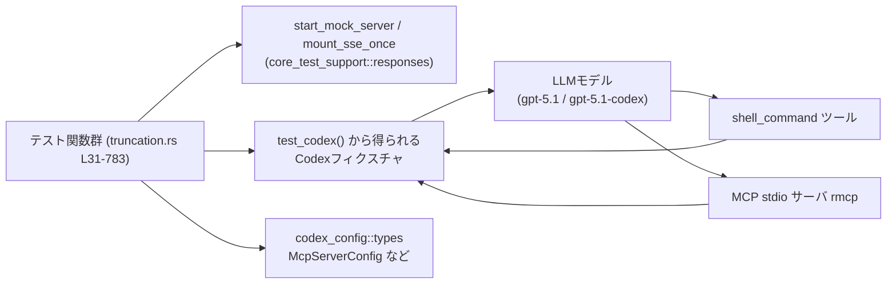
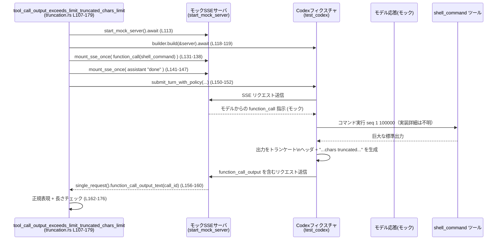

# core/tests/suite/truncation.rs コード解説

## 0. ざっくり一言

`shell_command` ツールと MCP ツールの**出力トランケーション（切り詰め）挙動**を、トークン数/文字数ベースの制限やモデル種別ごとに検証する非同期テスト群です（`tokio::test`）。  
外部シェルコマンドと MCP stdio サーバをモックサーバ経由で呼び出し、その結果としてモデルに返される `function_call_output` の内容を詳細にチェックします。

---

## 1. このモジュールの役割

### 1.1 概要

このモジュールは **ツール呼び出し結果のフォーマットとトランケーション** に関する仕様を検証するために存在し、次のような機能をテストします。

- `shell_command` ツールの大きな標準出力が、モデルに返される前にどのように**文字数/トークン数ベースで切り詰められるか**（あるいは切り詰められないか）を検証する（例: `tool_call_output_exceeds_limit_truncated_chars_limit`、`truncation.rs:L107-179`）。
- MCP stdio サーバ（`rmcp`）からのテキスト/画像ツール出力が、`function_call_output` として**どの形式でシリアライズされるか**、およびトランケーション時のマーカーの付き方を検証する（例: `mcp_tool_call_output_exceeds_limit_truncated_for_model`、`truncation.rs:L316-408`）。
- **トークンベースの制限**と**バイト（文字数）ベースの制限**の両方に対して、「…tokens truncated…」「…chars truncated…」といったマーカーが正しく含まれるかを確認する（`truncation.rs:L518-619`）。

### 1.2 アーキテクチャ内での位置づけ

このファイル自体はテスト専用であり、実装本体は他モジュールにあります。テストは主に `core_test_support` と `codex_config` / `codex_protocol` に依存し、モックの SSE サーバ経由で「モデル ↔ Codex ↔ ツール」のやり取りを再現しています。



- 各テストは `start_mock_server().await` でモック SSE サーバを起動し（`truncation.rs:L37`, `L113`, `L187` など）、`mount_sse_once` / `sse` を使って「モデルからのレスポンス」を事前に差し込みます（例: `truncation.rs:L58-74`）。
- `test_codex()` で Codex のテスト用フィクスチャを構築し（`truncation.rs:L40-45` ほか）、`tool_output_token_limit` や MCP サーバ設定を通じて**ツール出力の制限ポリシー**を切り替えます（例: `truncation.rs:L40-42`, `L381-382`）。
- その後、`submit_turn_with_policy` または `Op::UserTurn` を送信し（`truncation.rs:L76-78`, `L385-390`, `L481-499`）、モック SSE 側にキャプチャされた `function_call_output` を検査します（`truncation.rs:L82-86`, `L393-397`）。

### 1.3 設計上のポイント

- **非同期 & 並行性**
  - すべてのテストは `#[tokio::test]` で実装されており、`flavor = "multi_thread"` かつ `worker_threads = 1 or 2` を指定しています（例: `truncation.rs:L33`, `L109`, `L319`）。
  - これにより、モックサーバとの通信や Codex 処理が**非同期に実行**されます。
  - 各テスト内の状態（サーバ・builder・fixture）はローカル変数として持ち、共有可変状態は登場しないため、データ競合の可能性は低い構造になっています。

- **エラーハンドリング**
  - すべてのテスト関数は `anyhow::Result<()>` を返し（例: `truncation.rs:L34`, `L110`）、内部で `?` 演算子を多用しています（`builder.build(&server).await?` など、`truncation.rs:L44`, `L118`）。
  - 失敗時には `anyhow::Context` を使った追加メッセージ付きのエラーも発生しうる（例: `.context("function_call_output present for shell call")?`, `truncation.rs:L85`, `L159`）。

- **外部ツール呼び出しのテスト**
  - `shell_command` については `seq 1 100000` 等のシェルコマンドを使って**巨大な標準出力**を生成する構造です（`truncation.rs:L47-55`）。
  - MCP サーバについては、`McpServerConfig` で stdio サーバ用のコマンドや環境変数を設定し（`truncation.rs:L353-375`, `L446-471`, `L717-740`）、エコー/画像ツールの挙動を検証します。

- **安全性・セキュリティの観点**
  - テストでは `SandboxPolicy::DangerFullAccess` も使用されており（`truncation.rs:L76-78`, `L151-152`, `L298-299`, `L555-557`, `L607-608`, `L661-664`）、本番コード側ではサンドボックス機構による安全確保が前提とされています。
  - 実際の `shell_command` 実装やサンドボックス実装はこのチャンクには現れないため、コマンドインジェクション等の安全性評価は行えません。

---

## 2. 主要な機能一覧

このテストモジュールが検証している主な機能は次のとおりです。

- `shell_command` ツール出力の **文字数ベースのトランケーション** と、その際の「…chars truncated…」マーカーの付与（`truncation.rs:L107-179`）。
- `gpt-5.1-codex` 等、**トークン駆動のモデル**に対するトランケーション結果と「…tokens truncated…」マーカーの付与（`truncation.rs:L181-257`, `L518-569`）。
- MCP stdio サーバ経由のツール（エコー/画像）についての
  - 大きなテキスト出力のトランケーション（`truncation.rs:L316-408`）
  - 画像出力のみの際に**テキストサマリが付かないこと**（`truncation.rs:L410-516`）
- `tool_output_token_limit` を増やした際に、**ツール出力が一切トランケートされないこと**（`truncation.rs:L622-682`, `L684-783`）。
- 同じ出力に対して**トランケーションが二重に適用されない**こと（`truncation.rs:L259-314`）。

### 2.1 関数インベントリー（このチャンクの関数）

| 名前 | 種別 | 役割 / シナリオ | 定義位置 |
|------|------|-----------------|----------|
| `tool_call_output_configured_limit_chars_type` | `async fn` テスト | `tool_output_token_limit` を大きくした場合、`shell_command` 出力がトランケートされず、プレーンテキストのまま返ることを検証 | `truncation.rs:L31-105` |
| `tool_call_output_exceeds_limit_truncated_chars_limit` | `async fn` テスト | デフォルト設定で `shell_command` 出力が**文字数ベース**にトランケートされ、`…chars truncated…` マーカーを含むことを検証 | `truncation.rs:L107-179` |
| `tool_call_output_exceeds_limit_truncated_for_model` | `async fn` テスト | `gpt-5.1-codex` モデルでの `shell_command` トランケーション結果が、具体的なトークン数を含む形で表現されることを検証 | `truncation.rs:L181-257` |
| `tool_call_output_truncated_only_once` | `async fn` テスト | 行数制限等で `shell_command` 出力がトランケートされる場合でも、`tokens truncated` マーカーが**1回だけ**含まれることを検証 | `truncation.rs:L259-314` |
| `mcp_tool_call_output_exceeds_limit_truncated_for_model` | `async fn` テスト | MCP `echo` ツールの巨大なテキスト出力が、JSON 文字列としてトランケートされ、`tokens truncated` マーカーを含むことを検証 | `truncation.rs:L316-408` |
| `mcp_image_output_preserves_image_and_no_text_summary` | `async fn` テスト | MCP `image` ツールの画像出力が `content_items` 配列としてシリアライズされ、テキスト要素やトランケーションサマリが付与されないことを検証 | `truncation.rs:L410-516` |
| `token_policy_marker_reports_tokens` | `async fn` テスト | トークンベースの制限ポリシー時に、バイト推定でトランケートしていても「tokens truncated」とトークン数を報告するマーカーが付くことを検証 | `truncation.rs:L518-569` |
| `byte_policy_marker_reports_bytes` | `async fn` テスト | バイト（文字数）ベースの制限ポリシー時に「chars truncated」マーカーが付くことを検証 | `truncation.rs:L571-619` |
| `shell_command_output_not_truncated_with_custom_limit` | `async fn` テスト | `tool_output_token_limit` を十分大きくすると、`shell_command` の 1000 行出力が**完全な形で**返ることを検証 | `truncation.rs:L622-682` |
| `mcp_tool_call_output_not_truncated_with_custom_limit` | `async fn` テスト | MCP `echo` ツールに対しても大きな `tool_output_token_limit` を設定すると、出力がトランケートされないことを検証 | `truncation.rs:L684-783` |

### 2.2 外部コンポーネント一覧（このチャンクに定義はない）

| 名前 | 種別 | 本ファイルでの役割 | 定義状況 |
|------|------|--------------------|----------|
| `test_codex` | 関数 | Codex 本体をラップしたテスト用ビルダーを返す | 定義は `core_test_support::test_codex`（このチャンクには現れない） |
| `start_mock_server` | 関数 | モック SSE サーバを起動し、テスト用に HTTP エンドポイントを提供 | `core_test_support::responses` 内（このチャンクには定義が現れない） |
| `mount_sse_once`, `sse` | 関数 | モデルからの SSE ストリームを模倣するレスポンスをサーバに1回分登録 | 同上、定義はこのチャンクには現れない |
| `ev_response_created`, `ev_function_call`, `ev_assistant_message`, `ev_completed` | 関数 | SSE メッセージ (`EventMsg`) を構築するヘルパー | `core_test_support::responses` 内で定義、ここには現れない |
| `McpServerConfig` | 構造体 | MCP stdio サーバの設定（コマンド、環境変数等）を保持 | `codex_config::types` 内で定義、ここには現れない |
| `McpServerTransportConfig::Stdio` | 列挙体バリアント | MCP サーバのトランスポート方式として stdio を指定 | 同上 |
| `SandboxPolicy` | 型（おそらく struct/enum） | ツール実行時のサンドボックス権限を表す（`DangerFullAccess`, `new_read_only_policy` を使用） | `codex_protocol::protocol` 内、定義は本チャンクには現れない |
| `AskForApproval` | 型 | ユーザー承認ポリシーを表し、`AskForApproval::Never` を使用 | 同上 |
| `UserInput::Text` | 列挙体バリアント | Codex へのテキスト入力を表現 | `codex_protocol::user_input::UserInput` の一部（本チャンクには定義なし） |

---

## 3. 公開 API と詳細解説

このファイルはテスト専用であり、「外部に公開される API」はありません。  
ここでは **テスト関数自身が検証している契約（仕様）** を API 的な観点で説明します。

### 3.1 型一覧（このファイルで直接定義される型）

このファイル内に新たな構造体・列挙体定義はありません（テスト関数のみ）。  
上記 2.2 の外部コンポーネントを参照してください。

### 3.2 関数詳細（代表的な 7 件）

#### `async fn tool_call_output_configured_limit_chars_type() -> Result<()>`

**概要**

- `shell_command` ツールの非常に大きな出力に対して、`tool_output_token_limit = Some(100_000)` を設定した場合でも**モデルに返す形式がプレーンテキストであり、トランケーションマーカーが付かない**ことを検証します（`truncation.rs:L31-105`）。

**引数**

- 引数はありません。`tokio::test` としてテストランナーから呼び出されます。

**戻り値**

- `anyhow::Result<()>`  
  テストが成功すれば `Ok(())` を返し、エラー発生時には `Err(anyhow::Error)` を返します。

**内部処理の流れ**

1. ネットワークが利用可能かどうかを `skip_if_no_network!(Ok(()));` でチェック（`truncation.rs:L35`）。  
   - マクロの実際の挙動はこのチャンクには現れませんが、名前から「ネットワーク利用不可ならテストスキップ」といった目的が推測されます（断定はできません）。
2. `start_mock_server().await` でモック SSE サーバを起動（`truncation.rs:L37`）。
3. `test_codex().with_model("gpt-5.1").with_config(|config| { … })` で Codex のテスト用フィクスチャビルダーを作成し、`tool_output_token_limit = Some(100_000)` に設定（`truncation.rs:L40-42`）。
4. `builder.build(&server).await?` でフィクスチャを生成（`truncation.rs:L44`）。
5. `call_id`・`command`・`args` を組み立て、Windows / 非 Windows で異なるシェルコマンド文字列を用意（`truncation.rs:L46-55`）。
6. `mount_sse_once` で 2 つの SSE シナリオをセット：
   - 1 回目: モデルが `shell_command` の `function_call` を指示（`truncation.rs:L57-64`）。
   - 2 回目: モデルが最終的に `"done"` というアシスタントメッセージを返す（`truncation.rs:L67-73`）。
7. `fixture.submit_turn_with_policy("trigger big shell output", SandboxPolicy::DangerFullAccess).await?` を呼び、ツール実行～応答生成までを実行（`truncation.rs:L76-78`）。
8. 2 回目の SSE モック `mock2` から `function_call_output_text(call_id)` を取得し、`\r\n` を `\n` に置き換えた上で（`truncation.rs:L82-86`）：
   - JSON としてパースできない（＝プレーンテキスト）ことを検証（`serde_json::from_str::<Value>(&output).is_err()`, `truncation.rs:L89-92`）。
   - 出力長が約 400,000〜401,000 文字であることを確認（`truncation.rs:L94-97`）。
   - `"tokens truncated"` というマーカーを含まないことを確認（`truncation.rs:L99-102`）。

**Examples（使用例）**

このテストは `cargo test` から通常通り実行されます。

```bash
# truncation.rs を含むテストスイート全体を実行
cargo test --test core-tests-suite-truncation tool_call_output_configured_limit_chars_type
```

※ 実際のテストバイナリ名はプロジェクト設定によります。このチャンクからは断定できません。

**Errors / Panics**

- `builder.build(&server).await?`、`serde_json::to_string(&args)?` などで I/O・シリアライズ関連のエラーが発生すると `Err(anyhow::Error)` としてテスト失敗になります（`truncation.rs:L44`, `L62`）。
- `.context("function_call_output present for shell call")?` により、`function_call_output_text` がエラーを返した場合は文脈付きエラーになります（`truncation.rs:L83-85`）。
- この関数内に `unwrap` はなく、パニックは基本的に外部関数の内部実装次第です（本チャンクには現れません）。

**Edge cases（エッジケース）**

- Windows 環境: ファイル先頭に `#![cfg(not(target_os = "windows"))]` があるため、このテストモジュールは Windows ではコンパイルされない想定です（`truncation.rs:L1`）。  
  `if cfg!(windows)` の分岐は常に `false` になりますが、両方の文字列リテラルはコンパイルされます（`truncation.rs:L47-51`）。
- ネットワーク非利用環境: `skip_if_no_network!` の挙動が不明なため、この状況での具体的な動作はこのチャンクからは分かりません。

**使用上の注意点**

- 非常に大きな出力（約 400k 文字）を扱うため、テスト時間やメモリ使用量が相対的に大きくなりえます。
- `DangerFullAccess` サンドボックスを使用しているため（`truncation.rs:L76-78`）、実コードではより制限の強いポリシーが必要になる可能性がありますが、ここでは挙動検証のための設定です。

---

#### `async fn tool_call_output_exceeds_limit_truncated_chars_limit() -> Result<()>`

**概要**

- 通常の `gpt-5.1` モデル設定で `shell_command` の巨大な出力を生成し、**文字数制限によりトランケーションされるケース**を検証します（`truncation.rs:L107-179`）。
- 出力がプレーンテキストでありつつ、ヘッダ + トランケーションマーカー付きのフォーマットになっているかを確認します。

**戻り値**

- `anyhow::Result<()>`（エラー時はテスト失敗）。

**内部処理の流れ**

1. ネットワークチェック → モックサーバ起動（`truncation.rs:L111-113`）。
2. `test_codex().with_model("gpt-5.1")` でフィクスチャビルダーを作成し、特別な `tool_output_token_limit` は設定しない（`truncation.rs:L115-118`）。
3. `seq 1 100000` 相当のコマンドと `timeout_ms` を args に設定（`truncation.rs:L120-129`）。
4. 2 回の `mount_sse_once` で
   - 1 回目: `function_call(shell_command)` を指示（`truncation.rs:L131-138`）
   - 2 回目: `"done"` 応答（`truncation.rs:L141-147`）
   をセット。
5. `fixture.submit_turn_with_policy(...DangerFullAccess)` を実行（`truncation.rs:L150-152`）。
6. `mock2` から `function_call_output_text(call_id)` を取得（`truncation.rs:L156-160`）。
7. 出力が JSON ではなくプレーンテキストであることを確認したうえで（`truncation.rs:L162-166`）、次の正規表現にマッチすることを検証（`truncation.rs:L168-170`）。

   ```rust
   let truncated_pattern = r#"(?s)^Exit code: 0\nWall time: [0-9]+(?:\.[0-9]+)? seconds\nTotal output lines: 100000\nOutput:\n.*?…\d+ chars truncated….*$"#;
   ```

8. 出力長が約 9,900〜10,100 文字の範囲に収まることを検証（`truncation.rs:L172-176`）。

**Errors / Panics**

- 上記と同様に `builder.build`, `serde_json::to_string`, `function_call_output_text` などで `?` によりエラーが伝播します。
- 正規表現がマッチしない場合は `assert_regex_match` がテスト失敗を引き起こします（`truncation.rs:L170`）。

**Edge cases**

- `Wall time` の値は `[0-9]+(?:\.[0-9]+)?` としてマッチさせているため、秒数が整数・小数いずれでも許容される（`truncation.rs:L168-170`）。
- 出力の先頭・末尾の細部（何行残すか）は正規表現では曖昧にマッチさせており、内部仕様変更にある程度追従できる形になっています。

**使用上の注意点**

- テストは出力長・正規表現で仕様を縛っているため、トランケーションフォーマット仕様を変更した際には、このテストを併せて更新する必要があります。

---

#### `async fn tool_call_output_truncated_only_once() -> Result<()>`

**概要**

- `shell_command` 出力が行数制限などによりトランケートされる場合でも、`"tokens truncated"` というマーカーが**1回だけ**出現することを検証します（`truncation.rs:L259-314`）。

**内部処理の流れ**

1. ネットワークチェック後、モックサーバと `gpt-5.1-codex` モデルのフィクスチャを構築（`truncation.rs:L262-268`）。
2. 10,000 行の `seq` 出力を生成するコマンドを設定（`truncation.rs:L269-277`）。
3. 1 回目の `mount_sse_once` で `function_call(shell_command)` を指示し（`truncation.rs:L279-285`）、2 回目で `"done"` 応答をセット（`truncation.rs:L288-294`）。
4. `submit_turn_with_policy` を実行（`truncation.rs:L297-299`）。
5. `function_call_output_text(call_id)` を取得し（`truncation.rs:L301-304`）、文字列中の `"tokens truncated"` の出現回数を `output.matches("tokens truncated").count()` で数える（`truncation.rs:L306`）。
6. `assert_eq!(truncation_markers, 1, ...)` で 1 回のみであることを確認（`truncation.rs:L308-311`）。

**Errors / Panics**

- 出現回数が 1 でない場合（0 または 2 回以上）にテスト失敗となります。

**Edge cases**

- トランケーションマーカーの文言自体（`"tokens truncated"`) に依存しているため、メッセージを変更するとこのテストを更新する必要があります。

**使用上の注意点**

- 「単一マーカーであること」を仕様として固定しているため、将来サマリ情報を複数個所に入れたいような仕様変更の際には、このテストの見直しが必要になります。

---

#### `async fn mcp_tool_call_output_exceeds_limit_truncated_for_model() -> Result<()>`

**概要**

- MCP stdio サーバ `rmcp` の `echo` ツールに対して巨大なメッセージを送り、モデル側に返される `function_call_output` が**JSON 文字列としてトランケーションされ、「tokens truncated」マーカーを含む**ことを検証します（`truncation.rs:L316-408`）。

**内部処理の流れ**

1. ネットワークチェック → モックサーバ起動（`truncation.rs:L320-323`）。
2. `call_id = "rmcp-truncated"`、`server_name = "rmcp"`、`tool_name = format!("mcp__{server_name}__echo")` を定義（`truncation.rs:L324-326`）。
3. `"long-message-with-newlines-"` を 6000 回繰り返した巨大な文字列 `large_msg` を作成し（`truncation.rs:L328-329`）、`{"message": large_msg}` の JSON を `args_json` に格納（`truncation.rs:L330`）。
4. 1 回目の `mount_sse_once` で、モデルに `function_call(call_id, tool_name, args_json)` を指示（`truncation.rs:L332-338`）。
5. 2 回目の `mount_sse_once` で `"rmcp echo tool completed."` 応答をセット（`truncation.rs:L341-347`）。
6. `stdio_server_bin()` で `rmcp` テストサーバのバイナリパスを取得（`truncation.rs:L350-351`）。
7. `test_codex().with_config(move |config| { … })` の中で、`config.mcp_servers` に `McpServerConfig { transport: Stdio { command: rmcp_test_server_bin, ... } }` を挿入し、`tool_output_token_limit = Some(500)` を設定（`truncation.rs:L353-382`）。
8. フィクスチャを `builder.build(&server).await?` で生成（`truncation.rs:L383`）。
9. `submit_turn_with_policy` で `rmcp echo tool` を呼び出す（`truncation.rs:L385-390`）。
10. 2 回目のモック `mock2` から `function_call_output_text(call_id)` を取得（`truncation.rs:L393-396`）。
11. 出力に `"Total output lines:"` が含まれないことを確認（行ベースのヘッダがないことの確認, `truncation.rs:L398-401`）。
12. 次の正規表現にマッチすることを検証（`truncation.rs:L403-405`）。

    ```rust
    let truncated_pattern = r#"(?s)^\{"echo":\s*"ECHOING: long-message-with-newlines-.*tokens truncated.*long-message-with-newlines-.*$"#;
    ```

13. 出力長が 2500 文字未満であることを確認（`truncation.rs:L405`）。

**Errors / Panics**

- MCP サーバ設定で `mcp_servers.set(servers)` が `expect(...)` を使っているため、設定に失敗した場合はパニックとなります（`truncation.rs:L377-380`）。
- それ以外は `?` によりエラーが伝播します。

**Edge cases**

- 正規表現は `"ECHOING: long-message-with-newlines-"` から始まる文字列に `tokens truncated` を含むかどうかのみを見ているため、トランケーション位置や残存データの量には自由度があります。
- `Total output lines:` を含まないことを明示的に検証することで、`shell_command` 用の行ベースヘッダフォーマットが MCP の JSON 出力に混ざらないことを保証しています（`truncation.rs:L398-401`）。

**使用上の注意点**

- MCP サーバ用バイナリ `rmcp_test_server_bin` のビルド手順や実装はこのチャンクには現れないため、環境構築の詳細は別ファイルを参照する必要があります。

---

#### `async fn mcp_image_output_preserves_image_and_no_text_summary() -> Result<()>`

**概要**

- MCP `image` ツールの出力が **画像のみの content_items 配列**としてシリアライズされ、テキストベースのトランケーションサマリが付かないことを検証します（`truncation.rs:L410-516`）。

**内部処理の流れ**

1. ネットワークチェック → モックサーバ起動（`truncation.rs:L413-417`）。
2. `call_id = "rmcp-image-no-trunc"`, `tool_name = "mcp__rmcp__image"` を定義（`truncation.rs:L418-420`）。
3. 1 回目の `mount_sse_once` で `function_call(call_id, tool_name, "{}")` を差し込み（`truncation.rs:L422-428`）、2 回目で `"done"` 応答を登録（`truncation.rs:L431-437`）。
4. `stdio_server_bin()` で rmcp stdio サーババイナリを取得（`truncation.rs:L440-441`）。
5. 1x1 PNG の data URL `openai_png` を定義（`truncation.rs:L443-444`）。
6. `test_codex().with_config(move |config| { … })` の中で、MCP サーバ設定に `env: Some(HashMap::from([("MCP_TEST_IMAGE_DATA_URL", openai_png)]))` を含めることで、テストサーバに画像データを渡す（`truncation.rs:L446-471`）。
7. フィクスチャを構築し（`truncation.rs:L478`）、`session_model` を保存（`truncation.rs:L479`）。
8. `fixture.codex.submit(Op::UserTurn { … })` にて、`UserInput::Text` で `"call the rmcp image tool"` を送信（`truncation.rs:L481-499`）。
9. `wait_for_event` で `EventMsg::TurnComplete(_)` が来るまで待機し（`truncation.rs:L503`）、SSE モック `final_mock` から `function_call_output(call_id)` を取得（`truncation.rs:L504`）。
10. `output_item.get("output")` を取り出し（`truncation.rs:L506`）、配列であることを `assert!(output.is_array())` で確認（`truncation.rs:L507`）。
11. 配列長が 1 であることを確認し（`truncation.rs:L508-509`）、その要素が `{ "type": "input_image", "image_url": openai_png }` と一致することを `assert_eq!` で検証（`truncation.rs:L511-512`）。

**Errors / Panics**

- `output.as_array().unwrap()` を呼び出す前に `assert!(output.is_array())` でチェックしているため、論理が正しければパニックは起こりません（`truncation.rs:L507-508`）。
- MCP サーバ設定の `set(servers).expect(...)` が失敗した場合はパニックとなります（`truncation.rs:L473-476`）。

**Edge cases**

- content_items 配列にテキストサマリ（トランケーション説明）が追加された場合、このテストは配列長 1 を前提としているため失敗します。
- `image_url` の値は data URL の完全一致をテストしているため、実装側で base64 エンコードや前処理を変えた場合は合わせてこのテストの更新が必要になります。

**使用上の注意点**

- 画像出力が「テキストを一切含まない場合」にトランケーションサマリを付けないという仕様を固定しており、今後仕様が変わる場合にはこのテストが強く制約となりえます。

---

#### `async fn token_policy_marker_reports_tokens() -> Result<()>`

**概要**

- `gpt-5.1-codex` + `tool_output_token_limit = Some(50)` という**トークンベースの制限**環境で `shell_command` を実行し、出力のトランケート時に「tokens truncated」マーカーが付き、末尾に未トランケートの行が残ることを検証します（`truncation.rs:L518-569`）。

**内部処理の流れ**

1. モックサーバ起動・`test_codex().with_model("gpt-5.1-codex")`・`tool_output_token_limit = Some(50)` 設定（`truncation.rs:L523-528`）。
2. `seq 1 150` を実行するコマンドを args に設定（`truncation.rs:L531-535`）。
3. `mount_sse_once` ×2 により `function_call(shell_command)` と `"done"` 応答をセット（`truncation.rs:L537-543`, `L546-552`）。
4. `submit_turn_with_policy("run the shell tool", SandboxPolicy::DangerFullAccess)` を実行（`truncation.rs:L555-557`）。
5. `function_call_output_text(call_id)` を取得（`truncation.rs:L559-562`）。
6. 次の正規表現 `pattern` にマッチすることを `assert_regex_match` で検証（`truncation.rs:L564-566`）。

   ```rust
   let pattern = r"(?s)^Exit code: 0\nWall time: [0-9]+(?:\.[0-9]+)? seconds\nTotal output lines: 150\nOutput:\n1\n2\n3\n4\n5\n6\n7\n8\n9\n10\n11\n12\n13\n14\n15\n16\n17\n18\n19.*tokens truncated.*129\n130\n131\n132\n133\n134\n135\n136\n137\n138\n139\n140\n141\n142\n143\n144\n145\n146\n147\n148\n149\n150\n$";
   ```

   これにより、先頭数行・末尾数行が残され、中間にトランケーションマーカーが入るフォーマットが保証されます。

**使用上の注意点**

- このテストは具体的な行番号（1〜19、129〜150）を文字列として固定しているため、トランケーションのアルゴリズム（どの範囲を残すか）を変更する場合はテスト更新が必要です。

---

#### `async fn shell_command_output_not_truncated_with_custom_limit() -> Result<()>`

**概要**

- `gpt-5.1-codex` + `tool_output_token_limit = Some(50_000)` という十分なトークン予算のもとで `seq 1 1000` を実行し、`shell_command` 出力が**トランケーションされず完全に残る**ことを検証します（`truncation.rs:L622-682`）。

**内部処理の流れ**

1. モックサーバ起動・`test_codex().with_model("gpt-5.1-codex")`・`tool_output_token_limit = Some(50_000)` 設定（`truncation.rs:L627-633`）。
2. `seq 1 1000` コマンドを args に設定（`truncation.rs:L635-639`）。
3. `expected_body: String = (1..=1000).map(|i| format!("{i}\n")).collect();` で期待される出力全文を構築（`truncation.rs:L640`）。
4. `mount_sse_once` ×2 により `function_call(shell_command)` と `"done"` 応答をセット（`truncation.rs:L642-648`, `L651-657`）。
5. `submit_turn_with_policy("run big output without truncation", DangerFullAccess)` を実行（`truncation.rs:L660-665`）。
6. `function_call_output_text(call_id)` を取得（`truncation.rs:L667-670`）。
7. `output.ends_with(&expected_body)` を検証し（`truncation.rs:L672-675`）、`"truncated"` を含まないことを確認（`truncation.rs:L676-678`）。

**Edge cases**

- 期待値は**末尾がちょうど `1\n2\n…1000\n`** になることを前提としているため、フォーマットの微細な変更（追加ヘッダ/フッタなど）でもこのテストが失敗します。

**使用上の注意点**

- このテストは「十分な予算を設定するとトランケートされない」という仕様を保証しており、上限仕様を変える（例えば安全のため必ず一部要約する）場合には見直しが必須です。

---

### 3.3 その他の関数

以下のテスト関数は本ファイルに存在しますが、上記で詳細説明していません。役割のみ簡単に触れます。

| 関数名 | 役割（1 行） | 定義位置 |
|--------|--------------|----------|
| `tool_call_output_exceeds_limit_truncated_for_model` | `gpt-5.1-codex` モデルでの `shell_command` 出力トランケーション（トークン数明示マーカー付き）のフォーマットを検証 | `truncation.rs:L181-257` |
| `byte_policy_marker_reports_bytes` | バイトベース制限ポリシー下で「chars truncated」マーカーが付くことを検証 | `truncation.rs:L571-619` |
| `mcp_tool_call_output_not_truncated_with_custom_limit` | MCP `echo` ツールに対して高い `tool_output_token_limit` を設定した場合に出力が完全に保持されることを検証 | `truncation.rs:L684-783` |

---

## 4. データフロー

ここでは代表として `tool_call_output_exceeds_limit_truncated_chars_limit`（`truncation.rs:L107-179`）におけるデータフローを示します。

1. テスト関数が `start_mock_server().await` でモック SSE サーバを起動（`truncation.rs:L113`）。
2. `test_codex().with_model("gpt-5.1")` で Codex のテストフィクスチャビルダーを作成し、`build(&server).await` でサーバと接続された `fixture` を得る（`truncation.rs:L115-119`）。
3. `mount_sse_once` により、「モデルが `function_call(shell_command)` を返す SSE ストリーム」をモックサーバに登録（`truncation.rs:L131-138`）。
4. テストは `fixture.submit_turn_with_policy(...)` を呼び出し（`truncation.rs:L150-152`）、Codex はモックサーバとの間で SSE をやり取りしながら:
   - ユーザー入力から `shell_command` ツールの呼び出しを指示するモデル応答を読み取り、
   - 実際に `seq 1 100000` を実行（実装詳細はこのチャンクには現れない）し、その出力をトランケート、
   - トランケート済みの `function_call_output` をモデルへ送り返すリクエストをモックサーバへ送信します。
5. テストは 2 回目の `mount_sse_once` でキャプチャしていた `mock2` から `single_request().function_call_output_text(call_id)` を呼び出し、返送された `function_call_output` の本文を取得（`truncation.rs:L156-160`）。
6. その本文に対し、正規表現や長さチェックで仕様どおりであることを確認します（`truncation.rs:L162-176`）。



---

## 5. 使い方（How to Use）

このファイルはテストモジュールなので、「使い方」は主に **新しいトランケーション仕様を追加/変更する際のテストの追加方法**という意味になります。

### 5.1 基本的な使用方法（新しいテストの書き方のパターン）

新しいツール出力トランケーション仕様をテストする場合、既存テストと同様の枠組みを利用します。

```rust
// 例: 新しいトランケーションポリシーを検証するテストの骨格
#[tokio::test(flavor = "multi_thread", worker_threads = 2)]
async fn my_new_truncation_test() -> anyhow::Result<()> {
    skip_if_no_network!(Ok(()));                        // ネットワーク必須ならスキップ用マクロ（挙動は本チャンクには現れない）

    let server = start_mock_server().await;             // モック SSE サーバ起動 (truncation.rs:L37 等と同様)

    let mut builder = test_codex()                      // Codex テスト用ビルダー取得
        .with_model("gpt-5.1")                         // 使用するモデル指定
        .with_config(|config| {                        // 設定を変更
            config.tool_output_token_limit = Some(123); // 例えば新しい上限値を設定
        });

    let fixture = builder.build(&server).await?;        // フィクスチャ構築（エラー時は Result で伝播）

    let call_id = "my-call";
    let args = serde_json::json!({                     // ツール引数を JSON で構築
        "command": "seq 1 1000",
        "timeout_ms": 5_000,
    });

    mount_sse_once(                                    // 1回目: モデルからの function_call を模倣
        &server,
        sse(vec![
            ev_response_created("resp-1"),
            ev_function_call(call_id, "shell_command", &serde_json::to_string(&args)?),
            ev_completed("resp-1"),
        ]),
    )
    .await;

    let mock2 = mount_sse_once(                        // 2回目: モデル最終応答を登録
        &server,
        sse(vec![
            ev_assistant_message("msg-1", "done"),
            ev_completed("resp-2"),
        ]),
    )
    .await;

    fixture
        .submit_turn_with_policy("run my tool", SandboxPolicy::DangerFullAccess)
        .await?;                                       // 実際の turn を実行

    let output = mock2                                 // モックサーバに届いた function_call_output を取得
        .single_request()
        .function_call_output_text(call_id)
        .context("shell output present")?;

    // ここで output に対して正規表現や長さチェックを行い、
    // 新しいトランケーション仕様を検証する。
    // ...

    Ok(())
}
```

このコードは既存テストと同じパターンを簡略化したもので、ツール・モデル・トランケーション設定を変えることでさまざまなシナリオに対応できます。

### 5.2 よくある使用パターン

- **シェルツール (`shell_command`) のトランケーション**
  - `seq 1 N` のようなシーケンス出力を利用し、行数・文字数・トークン数の制限をチェック（`truncation.rs:L47-55`, `L120-129`, `L269-277`, `L531-535`）。
  - 行ベースのヘッダ `"Exit code: 0\nWall time: ...\nTotal output lines: ...\nOutput:\n"` を正規表現で検証。

- **MCP ツール (`echo` / `image`) のトランケーション**
  - `McpServerConfig` + `McpServerTransportConfig::Stdio` でテスト用サーバを登録し（`truncation.rs:L353-375`, `L446-471`, `L717-740`）、JSON 出力・画像出力のフォーマットとトランケーション有無を検証。

### 5.3 よくある間違い（起こり得る誤用）

このチャンクから推測できる、テスト追加時に起こりそうな誤りを挙げます（実際の挙動は外部実装に依存する点があるため、一部は推測であり断定できません）。

- **`call_id` の不一致**
  - `mount_sse_once` で登録した `call_id` と、`function_call_output_text(call_id)` で参照する `call_id` が異なると、目的の出力が取得できない可能性があります（`truncation.rs:L46`, `L82-85` など）。
- **SSE モックの順序ミス**
  - 1 回目の `mount_sse_once` で `function_call` を返し、2 回目で最終応答を返すという順序が崩れると、テストの前提が崩れます（`truncation.rs:L58-74`, `L131-148` など）。
- **`tool_output_token_limit` の設定漏れ**
  - トランケーション仕様を検証したいのに `with_config` で制限値を変更していない場合、テストが意図したパスを通らない可能性があります（`truncation.rs:L40-42`, `L527-528` などを参照）。

### 5.4 使用上の注意点（まとめ）

- **非同期実行と並行性**
  - 各テストは `tokio` のマルチスレッドランタイム上で実行されます（`worker_threads = 1 or 2`, `truncation.rs:L33`, `L109`, `L319` など）。  
    テスト同士は原則独立ですが、外部リソース（ポート・ファイルなど）を共有する場合は干渉に注意が必要です。
- **ネットワーク依存**
  - すべてのテストの冒頭で `skip_if_no_network!(Ok(()));` が呼ばれており（`truncation.rs:L35`, `L111`, `L185`, …）、ネットワークが使えない環境ではスキップされる意図が推測されます。CI 環境ではネットワーク設定が重要になります。
- **外部プロセス起動**
  - `shell_command` や MCP stdio サーバは実際に外部プロセスを起動する可能性があります（実装はこのチャンクには現れません）。テスト環境での実行負荷・権限設定に注意が必要です。

---

## 6. 変更の仕方（How to Modify）

### 6.1 新しい機能（トランケーション仕様）を追加する場合

1. **どの種別のツールかを決める**
   - `shell_command` のようなシェルツールか、MCP 経由のツールかを選びます。
2. **既存テストを出発点にする**
   - 似たシナリオのテストをコピーし、`call_id`・`tool_name`・`args`・`tool_output_token_limit` を変更します（例: `truncation.rs:L635-641` や `L328-331`）。
3. **仕様に沿ったアサーションを書く**
   - 正規表現や長さチェックを用いて、期待するヘッダ/マーカー/残存部分を検証します（`truncation.rs:L168-176`, `L403-405` などを参考にします）。
4. **エッジケースもカバー**
   - 「トランケートされないケース」も併せてテストするため、`tool_output_token_limit` を大きくした別テストを用意すると仕様が明確になります（`truncation.rs:L622-682`, `L684-783` 参照）。

### 6.2 既存の機能（トランケーションフォーマット）を変更する場合

- **影響範囲の確認**
  - 行ベースヘッダ（`Exit code`, `Wall time`, `Total output lines`）やマーカー文言（`tokens truncated`, `chars truncated`）を変更する場合、該当するすべての正規表現を検索して更新します（例: `truncation.rs:L168-170`, `L240-253`, `L564-565`, `L615-615`）。
- **契約の見直し**
  - どの行を残すか（先頭 N 行 + 末尾 M 行）や、マーカーの出現回数（1 回のみ）が仕様として適切かを検討し、それに応じて `tool_call_output_truncated_only_once` 等のテストを更新します（`truncation.rs:L259-314`）。
- **テストの安定性確認**
  - `Wall time` など非決定的な値を含む部分は正規表現で緩くマッチさせており、仕様変更時に過度に厳しくならないよう配慮が必要です（`truncation.rs:L168-170`, `L240-242`）。

---

## 7. 関連ファイル

このモジュールと密接に関係するコンポーネントは次のとおりです（いずれもこのチャンクには定義が現れません）。

| パス / モジュール | 役割 / 関係 |
|-------------------|------------|
| `core_test_support::test_codex` | Codex のテスト用ビルダーを提供し、本ファイルの全テストでフィクスチャ生成に使用されています（例: `truncation.rs:L40-45`, `L115-118`, `L353-383`, `L446-478`, `L523-529`, `L627-633`, `L717-747`）。 |
| `core_test_support::responses` | `start_mock_server`, `mount_sse_once`, `sse`, `ev_response_created`, `ev_function_call`, `ev_assistant_message`, `ev_completed` など、SSE ベースのモックサーバ機能を提供します。 |
| `core_test_support::skip_if_no_network` | ネットワークが利用できない環境でテストをスキップするためのマクロと推測されます（実装はこのチャンクには現れません）。すべてのテストの冒頭で呼び出されています。 |
| `core_test_support::stdio_server_bin` | MCP stdio サーバ（`rmcp` テストサーバ）の実行バイナリパスを返すヘルパーです（`truncation.rs:L350-351`, `L440-441`, `L715-715`）。 |
| `codex_config::types::{McpServerConfig, McpServerTransportConfig}` | MCP サーバ設定を表現する型で、テスト内で `transport: Stdio { command, args, env, ... }` を構成する際に使用されています（`truncation.rs:L357-375`, `L450-471`, `L722-740`）。 |
| `codex_protocol::protocol::{Op, SandboxPolicy, AskForApproval, EventMsg}` | Codex への操作要求（`Op::UserTurn`）、サンドボックスポリシー、承認ポリシー、イベントメッセージ型を表すプロトコル定義です（`truncation.rs:L8-11`, `L481-499`, `L503`）。 |
| `codex_protocol::user_input::UserInput` | ユーザー入力（テキスト等）を表現する型で、`mcp_image_output_preserves_image_and_no_text_summary` で使用されています（`truncation.rs:L12`, `L483-487`）。 |

このファイルは、これらのコンポーネントが提供する実装の**期待される外部挙動（契約）**をテストとして固定する役割を果たしています。
