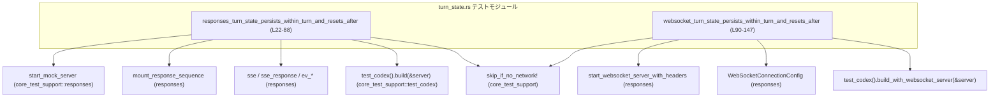
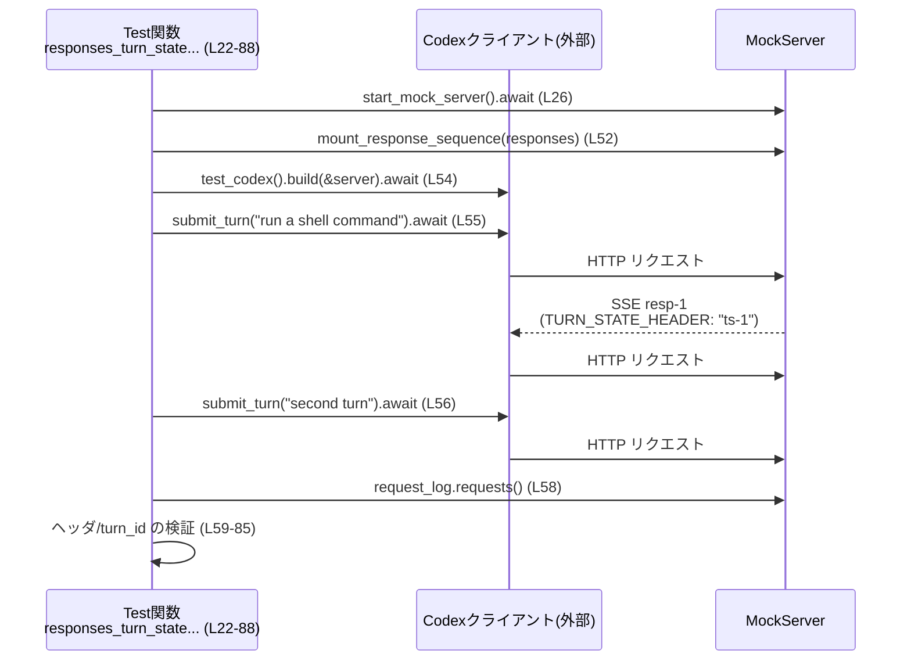
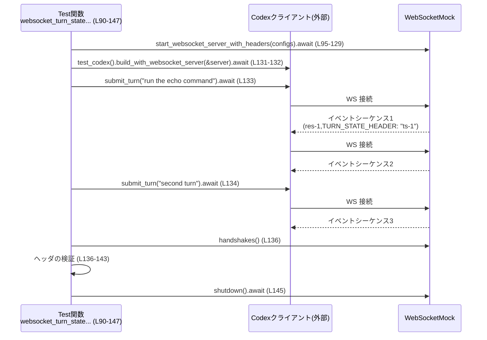

# core/tests/suite/turn_state.rs コード解説

## 0. ざっくり一言

HTTP(SSE) と WebSocket の両方について、`x-codex-turn-state` というヘッダ（ターン状態）が **同一ターン内では引き継がれ、新しいターン開始時にはリセットされること** を検証する非公開テストモジュールです。  
あわせて、`x-codex-turn-metadata` ヘッダに含まれる `turn_id` がターン単位で一貫していることも確認します。  
（`core/tests/suite/turn_state.rs:L20-88`, `L90-147`）

---

## 1. このモジュールの役割

### 1.1 概要

- このモジュールは、クライアント（`test_codex` が構築するテスト用 Codex クライアント）が、サーバから渡されたターン状態ヘッダ `x-codex-turn-state` を **同じターン内の追撃リクエストで再送し、別ターンでは送らない** という振る舞いを検証します。  
  （`responses_turn_state_persists_within_turn_and_resets_after`, `websocket_turn_state_persists_within_turn_and_resets_after` のアサーションより：`L59-66`, `L136-143`）
- HTTP SSE ベースの API と WebSocket ベースの API の両方に対して、同じ性質（ターン状態の保持とリセット）が担保されていることを確認します。  
  （SSE 系は `start_mock_server` / `mount_response_sequence` の利用：`L26-53`、WebSocket 系は `start_websocket_server_with_headers` / `WebSocketConnectionConfig` の利用：`L94-129`）
- また、`x-codex-turn-metadata` ヘッダの JSON から `turn_id` を取り出し、**同一ターン内で不変・異なるターン間で変化する** ことをテストします。  
  （`parse_turn_id` クロージャとその利用、および `assert_eq!` / `assert_ne!`：`L68-85`）

### 1.2 アーキテクチャ内での位置づけ

このファイルはテスト専用であり、実際のビジネスロジックではなく **クライアントと擬似サーバの間のプロトコル挙動** を検証します。依存関係は概ね次のようになります。



- `core_test_support::responses` モジュールは、モックサーバ・SSE/WebSocket のイベント・ヘッダ設定など、テスト用の I/O を抽象化して提供します。（インポート：`L4-14`）
- `core_test_support::test_codex::test_codex` は、テスト対象となる Codex クライアントを構築するビルダです。（`L16`, `L54`, `L131-132`）
- `skip_if_no_network!` マクロは、ネットワークが利用できない環境でテストをスキップするための仕組みであると名前から推測できますが、このチャンクには実装がなく、詳細な挙動は断定できません。（`L15`, `L24`, `L92`）

### 1.3 設計上のポイント

- **非同期テスト + Tokio ランタイム**  
  両テストは `#[tokio::test(flavor = "multi_thread", worker_threads = 2)]` で定義され、Tokio のマルチスレッドランタイム上で実行されます。テスト内の非同期処理はすべて `.await` で逐次的に待機しています。  
  （`L22`, `L90`）
- **結果型に `anyhow::Result<()>` を採用**  
  テスト本体は `Result<()>` を返し、テスト中で発生したエラー（ビルダや I/O）が `?` 演算子で呼び出し元（テストランナー）へ伝播されます。  
  （関数シグネチャ：`L23`, `L91`）
- **ネットワーク依存のテストの明示的スキップ**  
  冒頭で `skip_if_no_network!(Ok(()));` を呼び、ネットワークがない場合に早期に `Ok(())` を返すことが意図されていると考えられます（実装はこのチャンクにはありません）。  
  （`L24`, `L92`）
- **ヘッダベースのプロトコル検証**  
  モックサーバ（HTTP クライアント側から見たサーバ）のリクエストログや WebSocket のハンドシェイクから、ターン状態ヘッダの有無と値を検証しています。  
  （`request_log.requests()` とヘッダ検査：`L58-66`、`server.handshakes()` とヘッダ検査：`L136-143`）
- **JSON メタデータの安全なパース + テスト固有の `expect`**  
  `x-codex-turn-metadata` ヘッダは JSON としてパースされ、`Option` チェーンで `turn_id` 取得を試みます。取得に失敗した場合は `None` が返り、その後 `.expect(...)` によってテストを失敗させます。  
  パース失敗をランタイムエラーとして扱うのではなく、「仕様違反」としてテストを落とす設計です。  
  （`parse_turn_id` の定義と利用：`L68-82`）

---

## 2. 主要な機能一覧

- SSE ベースのターン状態検証: `responses_turn_state_persists_within_turn_and_resets_after`  
  HTTP SSE 経由での応答に含まれる `x-codex-turn-state` ヘッダが、同一ターン内の追撃リクエストで再送され、別ターンでは消えることを検証します。（`L22-88`）
- SSE における `turn_id` メタデータ検証: 同一ターン内のリクエストが同じ `turn_id` を共有し、ターンが変わると新しい `turn_id` になることを確認します。（`L68-85`）
- WebSocket ベースのターン状態検証: `websocket_turn_state_persists_within_turn_and_resets_after`  
  WebSocket 接続ごとのハンドシェイクヘッダを検査し、同一ターン内の 2 回目の接続ではターン状態ヘッダが送信され、新しいターンでの接続では送信されないことをテストします。（`L90-147`）

---

## 3. 公開 API と詳細解説

このファイルはテスト専用であり、外部から利用される公開 API はありません。ただし、テストのエントリポイントとなる非公開関数を「コンポーネント」として整理します。

### 3.1 型・コンポーネント一覧

このチャンクで **定義** されているコンポーネントは以下の通りです。

| 名前 | 種別 | 役割 / 用途 | 定義位置 |
|------|------|-------------|----------|
| `TURN_STATE_HEADER` | 定数 `&'static str` | ターン状態ヘッダ名 `"x-codex-turn-state"` を一元管理するための定数です。 | `core/tests/suite/turn_state.rs:L20-20` |
| `responses_turn_state_persists_within_turn_and_resets_after` | 非公開 async 関数（Tokio テスト） | HTTP SSE ベースの API でターン状態が同一ターン内で保持・新ターンでリセットされること、および `turn_id` の一貫性を検証します。 | `core/tests/suite/turn_state.rs:L22-88` |
| `websocket_turn_state_persists_within_turn_and_resets_after` | 非公開 async 関数（Tokio テスト） | WebSocket ベースの API に対して、同様のターン状態の保持・リセットを検証します。 | `core/tests/suite/turn_state.rs:L90-147` |

ローカルに定義される補助クロージャ：

- `parse_turn_id: |header: Option<String>| -> Option<String>`  
  `x-codex-turn-metadata` ヘッダ（JSON 文字列想定）から `turn_id` を安全に抽出するためのクロージャです。`Option` チェーンと `serde_json` を用いています。  
  （`core/tests/suite/turn_state.rs:L68-75`）

### 3.2 関数詳細

#### `responses_turn_state_persists_within_turn_and_resets_after() -> Result<()>`

**概要**

HTTP SSE ベースのモックサーバを用いて、以下を検証する非同期テストです。  
（`L22-88`）

1. 1 回目のターンでは、クライアントが **最初のリクエストで `x-codex-turn-state` を送らず**、サーバからターン状態 `"ts-1"` を受け取った後の **追撃リクエストではヘッダに `"ts-1"` を付与** すること。  
   （`responses[0]` にヘッダを付与：`L47-51`、リクエストヘッダ検査：`L59-66`）
2. 2 回目のターンでは、クライアントがターン状態ヘッダを **送らない** こと。  
   （同じくリクエストヘッダ検査：`L59-66`）
3. `x-codex-turn-metadata` に含まれる `turn_id` が、1 回目ターンの 2 つのリクエスト間で一致し、2 回目ターンのリクエストでは異なる値になること。  
   （`parse_turn_id` と `assert_eq!` / `assert_ne!`：`L68-85`）

**引数**

引数は取りません。テスト関数として、テストランナーから直接呼び出されます。  
（関数シグネチャ：`L23`）

**戻り値**

- 戻り値の型は `anyhow::Result<()>` です。（`L23`）  
- 内部での非同期処理やビルダ処理が失敗した場合は `Err(anyhow::Error)` が返り、テストは失敗します。  
- 正常に検証が完了すると `Ok(())` を返します。（`L87`）

**内部処理の流れ（アルゴリズム）**

1. ネットワーク環境のチェック  
   - `skip_if_no_network!(Ok(()));` を呼び出します。（`L24`）  
     実装は別モジュールですが、マクロ名と `Ok(())` の引数から、「ネットワークが利用不可ならここで早期に `Ok(())` を返す」用途と推測できます（断定はできません）。

2. モック HTTP SSE サーバの起動  
   - `let server = start_mock_server().await;` でモックサーバを非同期起動します。（`L26`）

3. 3 つの SSE レスポンスシーケンスの構築  
   - `first_response`：レスポンス作成 → reasoning イベント → shell コマンド呼び出し → completed の一連の SSE イベント。（`L29-34`）  
   - `second_response`：レスポンス作成 → assistant メッセージ → completed。（`L35-39`）  
   - `third_response`：同様に別の assistant メッセージ → completed。（`L40-44`）

4. レスポンスとヘッダの組み立て + モックへのマウント  
   - `responses` ベクタに 3 つの `sse_response` を詰めます。（`L47-51`）  
   - 1 件目にのみ `TURN_STATE_HEADER`（`"x-codex-turn-state"`） と値 `"ts-1"` を付加します。  
   - `mount_response_sequence(&server, responses).await` で、これらのレスポンスが順に返されるようモックサーバを設定し、リクエストログを取得可能なハンドルを受け取ります。（`L52`）

5. テスト用 Codex クライアントの構築とターン送信  
   - `let test = test_codex().build(&server).await?;` でクライアントを構築します。（`L54`）  
   - `test.submit_turn("run a shell command").await?;` で 1 回目のターンを送信します。（`L55`）  
     - これにより内部で 2 回のリクエストが発生していることが、後続のログ検査から読み取れます（`requests.len() == 3` のうち、1 回目のターンで 2 リクエストを使っていると解釈できます）。  
   - `test.submit_turn("second turn").await?;` で 2 回目のターンを送信します。（`L56`）

6. リクエストログからのヘッダ検証  
   - `let requests = request_log.requests();` でリクエストの一覧を取得します。（`L58`）  
   - `assert_eq!(requests.len(), 3);` でリクエストが 3 件であることを確認します。（`L59`）  
   - 続いて、`TURN_STATE_HEADER` の値をインデックスごとに検査します。（`L60-66`）
     - 0 番目: `None`（ヘッダなし）であること。
     - 1 番目: `Some("ts-1".to_string())` であること。
     - 2 番目: 再び `None` であること。

7. `turn_id` の抽出と検証  
   - `parse_turn_id` クロージャを定義し、`Option<String>` のヘッダ値を JSON としてパースし `turn_id: String` を `Option<String>` として返すようにしています。（`L68-75`）
   - 3 件のリクエストそれぞれに対し、`x-codex-turn-metadata` ヘッダから `turn_id` を取り出し、`.expect("...")` で必須であることを主張します。（`L77-82`）
   - `assert_eq!(first_turn_id, second_turn_id);` で 0 番目・1 番目のリクエストが同一ターンであることを確認し、  
     `assert_ne!(second_turn_id, third_turn_id);` で 2 番目のリクエストが別ターンであることを検証します。（`L84-85`）

**Examples（使用例）**

この関数自体はテスト関数のため、通常のコードから直接呼び出すことはありません。  
実行例としては、プロジェクトルートから次のようにテストを実行します：

```bash
# このモジュールを含むテストをすべて実行する
cargo test --test suite  # 実際のテストターゲット名はこのチャンクからは不明です
```

**Errors / Panics**

- `build(&server).await?` や `submit_turn(...).await?` でエラーが発生すると、`?` により `Err(anyhow::Error)` が返され、その時点でテストは失敗します。（`L54-56`）
- `parse_turn_id(...)` は `Option<String>` を返し、その後 `.expect("...")` を呼び出すため、以下の場合に **panic** します。（`L77-82`）
  - 該当ヘッダが存在しない。
  - ヘッダ値が不正な JSON である。
  - JSON に `"turn_id"` キーが存在しない、または文字列でない。
- Clippy の `expect_used` をファイル全体で許可しており、この `expect` によるパニックはテストの仕様違反検出のため意図的なものと読み取れます。（`L1`, `L68-82`）

**Edge cases（エッジケース）**

- ヘッダが付与されない / 不正 JSON  
  → `parse_turn_id` 内部では `serde_json::from_str(&value).ok()?` を用いており、JSON パース失敗時には `None` を返しますが、その後 `.expect(...)` によりテストが失敗します。（`L68-75`）  
- リクエスト数が 3 件でない場合  
  → `assert_eq!(requests.len(), 3);` が失敗し、テストが即座に落ちます。（`L59`）  
  これは、クライアントが想定と異なる数のリクエストやフォローアップを行った場合に検知する仕組みです。

**使用上の注意点**

- テストコード内で `start_mock_server` や `mount_response_sequence` の詳細な振る舞いはこのチャンクには現れないため、これらの関数の契約（何をすると何件のリクエストが発生するか）を変更する際は、テストの期待する `requests.len()` やヘッダの付き方と整合性を取る必要があります。（`L26-53`, `L59-66`）
- このテストはプロトコル（ヘッダ）の仕様に密接に依存しており、ヘッダ名や JSON フォーマット (`"turn_id"`) を変更すると、その仕様変更に合わせてテストも修正する必要があります。（`L20`, `L68-75`）

---

#### `websocket_turn_state_persists_within_turn_and_resets_after() -> Result<()>`

**概要**

WebSocket ベースのモックサーバを用いて、以下を検証する非同期テストです。  
（`L90-147`）

1. 1 回目のターンでは、最初の WebSocket 接続のハンドシェイクに `x-codex-turn-state` が含まれず、サーバから `"ts-1"` を受け取った後の **同一ターン内の 2 回目接続では `"ts-1"` をヘッダとして送信** すること。  
2. 2 回目のターン（3 回目の接続）では、再びターン状態ヘッダが送られないこと。  
   （この挙動は `handshakes[i].header(TURN_STATE_HEADER)` に対するアサーションから読み取れます：`L136-143`）

**引数**

- 引数はありません。テストランナーから直接呼び出されます。（`L91`）

**戻り値**

- `anyhow::Result<()>`。SSE テストと同様に、内部エラーがあれば `Err(anyhow::Error)` を返し、正常終了時には `Ok(())` を返します。（`L91`, `L146-147`）

**内部処理の流れ（アルゴリズム）**

1. ネットワーク環境のチェック  
   - `skip_if_no_network!(Ok(()));` を呼び出します。（`L92`）

2. WebSocket モックサーバの構成と起動  
   - `call_id` を `"ws-shell-turn-state"` として定義します。（`L94`）  
   - `start_websocket_server_with_headers(vec![ ... ])` に 3 つの `WebSocketConnectionConfig` を渡し、3 回の接続シナリオを設定します。（`L95-129`）
     - 1 つ目の構成：  
       - レスポンスイベント：`resp-1` の SSE 風イベント列（reasoning + shell コマンド + completed）。（`L97-103`）  
       - `response_headers` に `(TURN_STATE_HEADER.to_string(), "ts-1".to_string())` を設定し、最初の接続で `"ts-1"` を返すようにします。（`L104`）  
       - `close_after_requests: true` により、レスポンス送信後に接続を閉じる想定です。（`L107`）
     - 2 つ目・3 つ目の構成：  
       - いずれも assistant メッセージ + completed のイベント列で、`response_headers` は空です。（`L108-117`, `L118-127`）
   - `await` によってモック WebSocket サーバインスタンスを取得します。（`L128-129`）

3. テスト用 Codex クライアントの構築とターン送信  
   - `let mut builder = test_codex();` でビルダを取得し、`build_with_websocket_server(&server).await?` で WebSocket サーバに接続するクライアントを構築します。（`L131-132`）  
   - `submit_turn("run the echo command").await?;` で 1 回目のターン、`submit_turn("second turn").await?;` で 2 回目のターンを送信します。（`L133-134`）  
   - この 2 回の呼び出しにより、3 回の WebSocket 接続が行われていることは `handshakes.len() == 3` から読み取れます。（`L136-137`）

4. ハンドシェイクヘッダの検証  
   - `let handshakes = server.handshakes();` で過去の WebSocket ハンドシェイク情報を取得します。（`L136`）  
   - `assert_eq!(handshakes.len(), 3);` で接続が 3 回行われたことを確認します。（`L136-137`）  
   - 各ハンドシェイクの `TURN_STATE_HEADER` 値を検査します。（`L138-143`）
     - 0 番目: `None`（ターン状態ヘッダなし）
     - 1 番目: `Some("ts-1".to_string())`
     - 2 番目: `None`

5. サーバのシャットダウン  
   - `server.shutdown().await;` を呼び出してモックサーバを明示的に終了します。（`L145`）  
   - 最後に `Ok(())` を返してテストを終了します。（`L146-147`）

**Examples（使用例）**

こちらもテスト関数であり、通常は `cargo test` 経由で実行されます。

```bash
# WebSocket 関連テストのみフィルタして実行する例
cargo test websocket_turn_state_persists_within_turn_and_resets_after
```

**Errors / Panics**

- `build_with_websocket_server(&server).await?` や `submit_turn(...).await?` 内でエラーが発生すると、`?` により `Err(anyhow::Error)` が伝播しテストが失敗します。（`L132-134`）
- このテスト関数内では `expect` や `unwrap` は使用されていません。  
  パニックは基本的に `assert_eq!` / `assert_ne!` の失敗時のみ発生します。（`L136-143`）

**Edge cases（エッジケース）**

- `handshakes.len() != 3` の場合は、`assert_eq!(handshakes.len(), 3);` により即座にテストが失敗します。（`L136-137`）  
  クライアントの接続回数が変わった場合の検出に相当します。
- サーバから返す `response_headers` の有無や値を変えると、想定される `TURN_STATE_HEADER` の送信タイミングも変わり得るため、その場合はテストの期待値（`assert_eq!` の内容）も合わせて変更する必要があります。（`L104`, `L138-143`）

**使用上の注意点**

- `WebSocketConnectionConfig` の `close_after_requests: true` は、各シナリオごとに接続がクローズされる前提でテストが書かれています。ここを変更すると、クライアント側の接続再利用ロジックや `handshakes.len()` の前提が崩れる可能性があります。（`L97-107`, `L108-117`, `L118-127`, `L136-137`）
- モックサーバの `handshakes()` API の戻り値の順序に依存しているため、この順序が変わるような変更（並行接続の導入など）を行う場合は、テストのロジックも見直す必要があります。（`L136-143`）

### 3.3 その他の関数・補助要素

このチャンク内の補助的な要素をまとめます。

| 名前 | 役割（1 行） | 定義位置 |
|------|--------------|----------|
| `parse_turn_id` クロージャ | `x-codex-turn-metadata` ヘッダ（JSON 文字列想定）から `turn_id` を `Option<String>` として抽出する。 | `core/tests/suite/turn_state.rs:L68-75` |

内部ロジック（`parse_turn_id`）は次のような流れです。（`L68-75`）

1. `header: Option<String>` が `None` の場合は、そのまま `None` を返す。  
2. `Some(value)` の場合は、`serde_json::from_str(&value).ok()?` で JSON パースを試みる。失敗した場合は `None`。  
3. パースできた `Value` から `.get("turn_id").and_then(Value::as_str)` で文字列型の `turn_id` を取り出し、`str::to_string` で `String` に変換する。  
4. 上記いずれかのステップが失敗すると `None` が返る。

---

## 4. データフロー

ここでは、SSE ベースのテストにおける代表的な処理の流れを示します。

### 4.1 SSE テストのデータフロー（`responses_turn_state_persists_within_turn_and_resets_after`）

このテストでは、1 回目のターンが内部的に 2 つの HTTP リクエスト（初回 + フォローアップ）を発行し、2 回目のターンで 1 つの HTTP リクエストを発行していると解釈できます。これは `requests.len() == 3` と各リクエストのヘッダの有無から推測されます。（`L58-66`）



- リクエスト #0 と #1 が同じ `turn_id` を共有し（`L77-80, L84`）、#2 は別の `turn_id` になります（`L81-85`）。
- `TURN_STATE_HEADER` の値が、0 → なし、1 → `"ts-1"`、2 → なし となることを検証しています。（`L61-66`）

### 4.2 WebSocket テストのデータフロー（`websocket_turn_state_persists_within_turn_and_resets_after`）

WebSocket テストでは、1 回目のターンで 2 回の接続を行い（初回 + 同一ターン内の再接続）、2 回目のターンで 1 回の接続を行うと解釈できます。（`L95-117`, `L136-143`）



- `handshakes[0]` と `handshakes[2]` では `TURN_STATE_HEADER` が存在せず、`handshakes[1]` では `"ts-1"` が設定されていることを確認します。（`L138-143`）

---

## 5. 使い方（How to Use）

このファイルはテストモジュールであり、アプリケーションコードから直接利用することはありませんが、「ターン状態ヘッダの保持・リセットを検証するテスト」を追加・変更するときの参考になります。

### 5.1 基本的な使用方法（テストの追加イメージ）

SSE ベースのテストを新たに追加する場合のパターンは、既存テストをほぼ踏襲します。

```rust
#[tokio::test(flavor = "multi_thread", worker_threads = 2)]   // Tokio のマルチスレッドランタイムを使うテスト
async fn my_turn_state_test() -> anyhow::Result<()> {         // anyhow::Result<()> でエラーを伝播する
    skip_if_no_network!(Ok(()));                             // ネットワーク環境がない場合はテストをスキップする想定

    let server = start_mock_server().await;                  // モック HTTP サーバを起動する
    let responses = vec![
        // 必要な SSE イベント列を構築し、sse_response でラップする
        sse_response(sse(vec![ev_response_created("resp-1"), ev_completed("resp-1")])),
    ];
    let request_log = mount_response_sequence(&server, responses).await; // レスポンスシーケンスをサーバにマウントしてログハンドルを取る

    let test = test_codex().build(&server).await?;           // テスト用 Codex クライアントを構築
    test.submit_turn("some instruction").await?;             // ターンを送信する

    let requests = request_log.requests();                   // 送信されたリクエスト一覧を取得
    // requests[i].header(TURN_STATE_HEADER) などを使ってヘッダを検証する

    Ok(())
}
```

この例は既存テストのパターンを簡略化したものであり、実際にどのイベントを送るべきかは仕様に依存します。

### 5.2 よくある使用パターン

- **SSE / WebSocket 双方に対する同種のテスト**  
  - SSE 用に `start_mock_server` + `mount_response_sequence` を使うテスト。  
  - WebSocket 用に `start_websocket_server_with_headers` + `build_with_websocket_server` を使うテスト。  
  双方で同じ仕様（ここではターン状態ヘッダの扱い）を検証することができます。（`L26-56`, `L95-134`）

- **ヘッダからの JSON メタ情報の抽出**  
  - `parse_turn_id` のように、`serde_json::from_str` と `Option` チェーンを組み合わせ、構造が変わったときに `None` となるように実装しておけば、`.expect(...)` によって仕様違反を即座に検出することができます。（`L68-75`）

### 5.3 よくある間違い（想定される誤用）

```rust
// 誤りの例: ターン状態ヘッダ名を直接文字列で埋め込む
assert_eq!(requests[1].header("x-codex-turn-state"), Some("ts-1".to_string()));

// 正しい例: 定数 TURN_STATE_HEADER を利用する
assert_eq!(
    requests[1].header(TURN_STATE_HEADER),
    Some("ts-1".to_string())
);
```

- 定数 `TURN_STATE_HEADER` を利用することで、ヘッダ名を変更したときにテストコード全体を修正する必要がなくなります。（`L20`, `L61-66`, `L138-143`）

### 5.4 使用上の注意点（まとめ）

- **並行性 / 非同期性**  
  - テストは Tokio のマルチスレッドランタイム上で動作しますが、このファイル内ではテスト本体が逐次 `.await` しており、明示的な並行タスクはありません。（`L22`, `L90`）  
  - ただし、モックサーバやテストクライアント内部では並行処理が行われている可能性があり、API のスレッドセーフ性や接続のライフタイムについてはそれらの実装に依存します（このチャンクには記述がありません）。

- **エラーハンドリング**  
  - `anyhow::Result` を利用しており、詳細なエラー型は `anyhow::Error` に隠蔽されます。テストが落ちたときには、スタックトレースやエラーメッセージから原因を特定する必要があります。（`L23`, `L91`）  
  - 仕様違反（ヘッダ欠落・JSON 形式の変更など）は、`assert_*` および `expect` によるパニックとして検出されます。（`L59-66`, `L68-85`, `L136-143`）

- **パフォーマンス**  
  - テスト自体は小規模であり、パフォーマンス上の問題は通常想定されませんが、ネットワークや WebSocket を伴うため、CI 環境などで多数の類似テストを追加する場合にはテスト時間の増加に注意が必要です。

---

## 6. 変更の仕方（How to Modify）

### 6.1 新しい機能を追加する場合

ターン状態やメタデータ関連のプロトコルに新しい仕様を追加する場合、次のようなステップでテストを拡張できます。

1. **テストシナリオの拡張**
   - SSE の場合は `responses` ベクタ（`L47-51`）に新しい `sse_response` を追加し、モックサーバが返すイベントシーケンスを増やします。
   - WebSocket の場合は `WebSocketConnectionConfig` の配列（`L97-127`）に新しい要素を追加します。

2. **期待されるリクエスト／ハンドシェイク数の調整**
   - リクエスト数が増える場合は、`requests.len()` や `handshakes.len()` のアサーションを更新します。（`L59`, `L136-137`）

3. **ヘッダおよびメタデータの検証追加**
   - 新しいヘッダやメタフィールドを検証したい場合は、`parse_turn_id` と同じパターンで補助クロージャを定義し、`Option` チェーン + `expect` で仕様を明示します。（`L68-75`）

4. **仕様変更に伴う定数・文字列の見直し**
   - ヘッダ名が変わる場合には `TURN_STATE_HEADER` を修正し、それに依存するアサーションが正しく動作するか確認します。（`L20`, `L61-66`, `L138-143`）

### 6.2 既存の機能を変更する場合

- **ターン状態の保持ルールを変更する場合**
  - 例えば、「同一ターン内でも 2 回目以降はターン状態ヘッダを送らない」といった仕様に変える場合、  
    - SSE テスト: `requests[1]` のヘッダが `None` であることを期待するようにアサーションを変更します。（`L61-66`）  
    - WebSocket テスト: `handshakes[1]` のヘッダが `None` であることを期待するようにアサーションを変更します。（`L138-143`）

- **検証対象のターン数を増やす場合**
  - `submit_turn(...)` 呼び出し回数を増やし、モック側のレスポンスシナリオ・リクエスト／ハンドシェイク数のアサーションを合わせて拡張します。（`L55-56`, `L133-134`, `L59`, `L136-137`）

- **関連するテストや使用箇所の確認**
  - `core_test_support::test_codex::test_codex` や `responses` モジュールの API を変更する場合、同様のテストが他にも存在する可能性があります。このチャンク内だけでは全体像は分からないため、`core/tests/suite` 以下など関連ディレクトリを横断的に検索することが推奨されます（パス構成はこのチャンクには現れません）。

---

## 7. 関連ファイル・モジュール

このモジュールと密接に関係する外部モジュール・型をまとめます。

| パス / モジュール | 役割 / 関係 |
|-------------------|------------|
| `core_test_support::responses::start_mock_server` | HTTP SSE 用モックサーバを起動する関数です。SSE テスト側で利用されています。（`L13`, `L26`） |
| `core_test_support::responses::mount_response_sequence` | モックサーバにレスポンスシーケンスをマウントし、リクエストログへのアクセスを提供します。（`L10`, `L52`） |
| `core_test_support::responses::{sse, sse_response, ev_*}` | SSE イベントやレスポンスオブジェクトを生成する補助関数群です。実際の型や詳細はこのチャンクには現れません。（`L5-12`, `L29-44`, `L47-51`） |
| `core_test_support::responses::WebSocketConnectionConfig` | WebSocket モックサーバの接続シナリオを構成するための設定構造体です。各接続ごとにレスポンスイベントとレスポンスヘッダ、クローズ条件などを指定します。（`L4`, `L97-107`, `L108-117`, `L118-127`） |
| `core_test_support::responses::start_websocket_server_with_headers` | `WebSocketConnectionConfig` の配列から WebSocket モックサーバを起動し、ハンドシェイクログ等にアクセスできるハンドルを返す関数です。（`L14`, `L95-129`, `L136-143`） |
| `core_test_support::test_codex::test_codex` | テスト対象となる Codex クライアントのビルダを返す関数です。SSE/WS 双方のテストで利用されています。（`L16`, `L54`, `L131-132`） |
| `core_test_support::skip_if_no_network` | マクロ `skip_if_no_network!` を提供するモジュールです。ネットワーク環境に依存するテストを安全にスキップするための機構と推測されますが、実装はこのチャンクには現れません。（`L15`, `L24`, `L92`） |
| `pretty_assertions::assert_eq` | 通常の `assert_eq!` に対し、差分を見やすく表示するためのマクロです。リクエスト数やヘッダの検証に使用されています。（`L17`, `L59-66`, `L84-85`, `L136-143`） |
| `serde_json::Value` | JSON パース結果を表す汎用値型で、`x-codex-turn-metadata` ヘッダの解析に利用されています。（`L18`, `L68-75`） |

ファイルパス（例: `core_test_support/src/responses.rs` 等）はこのチャンクには明示されていないため、正確なパスは不明です。モジュールパスのみを根拠として記載しています。
