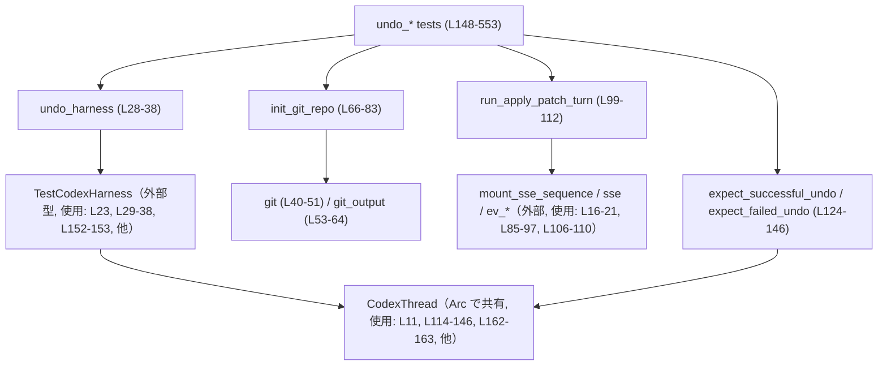
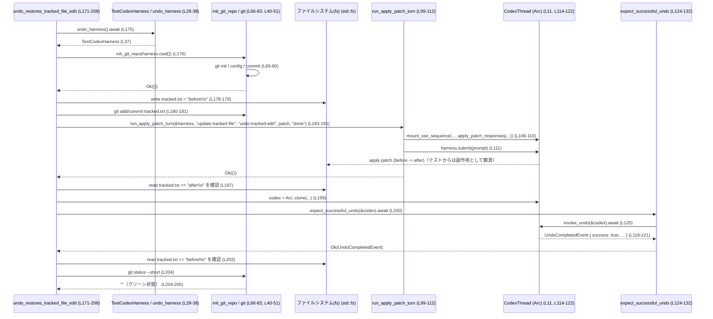

# core/tests/suite/undo.rs コード解説

## 0. ざっくり一言

Git リポジトリ上で動作する Codex の「Undo（Op::Undo）」機能について、さまざまなシナリオで期待どおりに動くかを検証する非 Windows 向け統合テスト群です（`#![cfg(not(target_os = "windows"))]`、`core/tests/suite/undo.rs:L1-1`）。  

---

## 1. このモジュールの役割

### 1.1 概要

- このモジュールは **Codex の「ゴーストスナップショット（GhostCommit）」を使った Undo 機能** が、Git リポジトリとファイルシステムに対して正しく作用するかを検証するために存在します。
- テストでは、`TestCodexHarness` を用いて Codex スレッドを起動し（`undo_harness`、`core/tests/suite/undo.rs:L28-38`）、`Op::Undo` を送信して `UndoCompletedEvent` がどう返るかを観察します（`invoke_undo`、`core/tests/suite/undo.rs:L114-122`）。
- 新規ファイル追加・追跡ファイルの編集・未追跡ファイルの編集・リネーム・.gitignore で無視されたディレクトリ・ユーザーの手動編集／ステージングなど、多様なケースを網羅しています（各テスト `core/tests/suite/undo.rs:L148-553`）。

### 1.2 アーキテクチャ内での位置づけ

このファイルは「テストコード」であり、プロダクションコード（Codex 本体）に対して以下のように依存しています。



- テスト本体（`undo_*` 関数群）はヘルパー関数 (`undo_harness`, `init_git_repo`, `run_apply_patch_turn`, `expect_*`) を通じて Codex と Git / ファイルシステムを操作します。
- `CodexThread` との通信は `Op::Undo` のサブミットと `EventMsg::UndoCompleted` の受信を通じて行われます（`core/tests/suite/undo.rs:L13-15, L114-121`）。
- Git の状態確認には、実際の `git` コマンドを `std::process::Command` から実行するヘルパー関数を使用します（`git`, `git_output`、`core/tests/suite/undo.rs:L40-64`）。

### 1.3 設計上のポイント（安全性・エラー・並行性を含む）

- **責務分割**
  - Codex のセットアップは `undo_harness` に集約（`core/tests/suite/undo.rs:L28-38`）。
  - Git リポジトリの初期化は `init_git_repo` に集約（`core/tests/suite/undo.rs:L66-83`）。
  - 「AI の 1 ターン（apply_patch 呼び出しを含む応答）」のシミュレーションは `run_apply_patch_turn` に集約（`core/tests/suite/undo.rs:L99-112`）。
  - Undo 呼び出しとアサートは `invoke_undo` / `expect_successful_undo` / `expect_failed_undo` に集約（`core/tests/suite/undo.rs:L114-146`）。

- **エラーハンドリング**
  - すべてのヘルパーとテスト関数は `anyhow::Result` を返し、`?` で I/O やコマンド実行失敗を伝播させます（`use anyhow::Result;`、`core/tests/suite/undo.rs:L8-9`）。
  - `git` と `git_output` では `with_context` と `bail!` を使い、どのコマンドがどのように失敗したかをメッセージに含めます（`core/tests/suite/undo.rs:L41-46, L53-61`）。
  - Undo の成功可否は `UndoCompletedEvent.success` と `UndoCompletedEvent.message` を `assert!` / `assert_eq!` で検証します（`core/tests/suite/undo.rs:L124-145`）。

- **並行性 / 非同期**
  - すべてのテストは `#[tokio::test(flavor = "multi_thread", worker_threads = 2)]` で実行され、Tokio のマルチスレッドランタイム上で非同期に動作します（`core/tests/suite/undo.rs:L148, L171, ...`）。
  - Codex スレッドへのハンドルは `Arc<CodexThread>` で共有されます（`core/tests/suite/undo.rs:L6, L114-116, L162-163, 他`）。共有は参照カウントのみであり、テスト内では明示的なロックやミューテックスは登場しません。
  - 非同期境界はすべて `async fn` + `.await` で明示されており、`unsafe` コードは一切使用していません（全ファイル）。

- **環境依存と安全性**
  - Windows ではビルドされないよう `#![cfg(not(target_os = "windows"))]` でガードされています（`core/tests/suite/undo.rs:L1-1`）。
  - ネットワーク依存のため、すべてのテストの先頭で `skip_if_no_network!` マクロを用いて環境に応じてスキップ可能にしています（例：`core/tests/suite/undo.rs:L150, L173, L212, ...`）。
  - Git コマンドの実行対象ディレクトリは `harness.cwd()` に限定されており（例：`core/tests/suite/undo.rs:L153, L180, L216, ...`）、外部の任意ディレクトリを操作するコードは含まれていません。

---

## 2. 主要な機能一覧

このモジュールがテストしている主な Undo 機能は次のとおりです（括弧内は代表的なテスト関数と行番号）。

- 新規ファイルの追加を Undo で削除できる  
  - `undo_removes_new_file_created_during_turn`（`core/tests/suite/undo.rs:L148-169`）
- 追跡済みファイルの編集を Undo で元に戻し、Git 状態もクリーンに戻る  
  - `undo_restores_tracked_file_edit`（`core/tests/suite/undo.rs:L171-208`）
- 未追跡ファイル（Git に追加されていない）への編集を Undo で元の内容に戻せる  
  - `undo_restores_untracked_file_edit`（`core/tests/suite/undo.rs:L210-243`）
- 直近のターンのみを Undo し、それ以前のターンは残る  
  - `undo_reverts_only_latest_turn`（`core/tests/suite/undo.rs:L245-270`）
- 関連しないファイルや .gitignore で無視されているファイルは Undo で変更されない  
  - `undo_does_not_touch_unrelated_files`（`core/tests/suite/undo.rs:L272-323`）  
  - `undo_does_not_touch_ignored_directory_contents`（`core/tests/suite/undo.rs:L422-458`）
- 複数ターン分の Undo を順に消費し、それ以上はエラーになる  
  - `undo_sequential_turns_consumes_snapshots`（`core/tests/suite/undo.rs:L325-380`）
- スナップショットがない状態で Undo を呼ぶと、失敗イベントと専用メッセージが返る  
  - `undo_without_snapshot_reports_failure`（`core/tests/suite/undo.rs:L382-392`）
- ファイルの Move / Rename を含むパッチを Undo で元に戻せる  
  - `undo_restores_moves_and_renames`（`core/tests/suite/undo.rs:L394-420`）
- ターンの後にユーザーが手動で行った編集は、Undo によって上書きされる（スナップショット基準に戻る）  
  - `undo_overwrites_manual_edits_after_turn`（`core/tests/suite/undo.rs:L460-490`）
- ターンとは無関係なユーザーのステージ済み変更は、Undo 後もステージされたまま残る  
  - `undo_preserves_unrelated_staged_changes`（`core/tests/suite/undo.rs:L493-553`）

### 2.1 関数インベントリー（ローカル定義）

| 名前 | 種別 | 役割 / 用途 | 行範囲（根拠） |
|------|------|-------------|----------------|
| `undo_harness` | 非公開 async 関数 | Codex テスト用ハーネス（`TestCodexHarness`）を、`gpt-5.1` モデルと `Feature::GhostCommit` 有効化、および apply_patch ツールを含める設定で構築する | `core/tests/suite/undo.rs:L28-38` |
| `git` | 非公開関数 | 指定ディレクトリで `git` コマンドを実行し、成功／失敗を `Result<()>` で返すヘルパー | `core/tests/suite/undo.rs:L40-51` |
| `git_output` | 非公開関数 | 指定ディレクトリで `git` コマンドを実行し、標準出力を UTF-8 文字列として返すヘルパー | `core/tests/suite/undo.rs:L53-64` |
| `init_git_repo` | 非公開関数 | 一貫した設定（初期ブランチ main, autocrlf 無効, 固定 user.name/email）でリポジトリを初期化し、README.txt をコミットする | `core/tests/suite/undo.rs:L66-83` |
| `apply_patch_responses` | 非公開関数 | apply_patch ツール呼び出し + assistant メッセージを含む SSE レスポンス列を生成する | `core/tests/suite/undo.rs:L85-97` |
| `run_apply_patch_turn` | 非公開 async 関数 | 上記 SSE シーケンスをサーバにマウントし、プロンプトを Codex に送信することで「1 ターン分の apply_patch 実行」をシミュレートする | `core/tests/suite/undo.rs:L99-112` |
| `invoke_undo` | 非公開 async 関数 | `CodexThread` に `Op::Undo` を送信し、`EventMsg::UndoCompleted` が返るまで待つ | `core/tests/suite/undo.rs:L114-122` |
| `expect_successful_undo` | 非公開 async 関数 | `invoke_undo` を呼び出し、`success == true` であることをアサートしてからイベントを返す | `core/tests/suite/undo.rs:L124-132` |
| `expect_failed_undo` | 非公開 async 関数 | `invoke_undo` を呼び出し、`success == false` と、エラーメッセージが `"No ghost snapshot available to undo."` であることをアサートしてからイベントを返す | `core/tests/suite/undo.rs:L134-146` |
| `undo_removes_new_file_created_during_turn` | Tokio テスト | ターン中に新規作成されたファイルが Undo によって削除されることを検証 | `core/tests/suite/undo.rs:L148-169` |
| `undo_restores_tracked_file_edit` | Tokio テスト | 追跡済みファイルの内容変更が Undo により元のコミット状態に戻り、`git status --short` が空になることを検証 | `core/tests/suite/undo.rs:L171-208` |
| `undo_restores_untracked_file_edit` | Tokio テスト | 未追跡ファイルに対する変更が Undo により元の内容に戻ることを検証 | `core/tests/suite/undo.rs:L210-243` |
| `undo_reverts_only_latest_turn` | Tokio テスト | 複数ターン分の変更のうち、直近のターンのみが Undo されることを検証 | `core/tests/suite/undo.rs:L245-270` |
| `undo_does_not_touch_unrelated_files` | Tokio テスト | ターンで操作していないファイル（追跡・未追跡・無視ファイル）が Undo により変更されないことを検証 | `core/tests/suite/undo.rs:L272-323` |
| `undo_sequential_turns_consumes_snapshots` | Tokio テスト | 3 ターン分の変更を順次 Undo でき、4 回目の Undo ではスナップショットがなくエラーになることを検証 | `core/tests/suite/undo.rs:L325-380` |
| `undo_without_snapshot_reports_failure` | Tokio テスト | 事前にターンを行っていない状態で Undo を呼ぶと失敗イベントが返ることを検証 | `core/tests/suite/undo.rs:L382-392` |
| `undo_restores_moves_and_renames` | Tokio テスト | ファイルの Move/Rename を含む変更を Undo により元の場所・内容に戻せることを検証 | `core/tests/suite/undo.rs:L394-420` |
| `undo_does_not_touch_ignored_directory_contents` | Tokio テスト | `.gitignore` で無視されているディレクトリ内のファイルが Undo で変更されないことを検証 | `core/tests/suite/undo.rs:L422-458` |
| `undo_overwrites_manual_edits_after_turn` | Tokio テスト | ターン後にユーザーが手動で行った編集が Undo によってスナップショット状態に上書きされることを検証 | `core/tests/suite/undo.rs:L460-490` |
| `undo_preserves_unrelated_staged_changes` | Tokio テスト | ターンとは無関係なユーザーのステージ済み変更が Undo 後もインデックスに残ることを検証 | `core/tests/suite/undo.rs:L493-553` |

---

## 3. 公開 API と詳細解説

このファイル自体はライブラリ API を公開していませんが、テストで繰り返し利用されるヘルパー関数群と、外部型とのインターフェースが実質的な「API」として振る舞います。

### 3.1 型一覧（外部依存）

このファイルで利用している主要な外部型です。型の定義自体は他 crate にあり、このチャンクには現れません。

| 名前 | 種別 | 役割 / 用途 | 出現個所 |
|------|------|-------------|----------|
| `TestCodexHarness` | 構造体（推測） | Codex をテスト用に起動・操作するためのハーネス。`cwd()` や `submit()`, `server()`, `path()` などのメソッドが利用されている | 使用: `core/tests/suite/undo.rs:L23, L29-38, L152-159, 他` |
| `CodexThread` | 構造体（推測） | Codex のスレッドまたは非同期タスクを表すハンドル。`submit` メソッドで `Op` を送信できる | 使用: `core/tests/suite/undo.rs:L11, L114-116, L162-163, 他` |
| `Feature` | 列挙体または構造体 | Codex の機能フラグ。ここでは `Feature::GhostCommit` を有効化している | 使用: `core/tests/suite/undo.rs:L12, L34-35` |
| `EventMsg` | 列挙体 | Codex からのイベントメッセージ種別。ここでは `EventMsg::UndoCompleted` のみマッチ対象として使用 | 使用: `core/tests/suite/undo.rs:L13, L116-118` |
| `Op` | 列挙体 | Codex に送信可能な操作。ここでは `Op::Undo` のみ使用 | 使用: `core/tests/suite/undo.rs:L14, L115` |
| `UndoCompletedEvent` | 構造体 | Undo 操作完了時のイベントペイロード。`success` と `message` フィールドが参照されている | 使用: `core/tests/suite/undo.rs:L15, L114, L124-145` |
| `Path` | 標準ライブラリ構造体 | ファイルシステム上のパスを表現する | 使用: `core/tests/suite/undo.rs:L4, L40, L53, L66` |
| `Arc<T>` | 標準ライブラリ構造体 | 参照カウント型。ここでは `Arc<CodexThread>` を共有 | 使用: `core/tests/suite/undo.rs:L6, L114-116, L162-163, 他` |

> 型定義そのものの詳細（フィールドやメソッド）は、すべて外部 crate にあり、このチャンクからは読み取れません。

---

### 3.2 関数詳細（重要な 7 件）

#### `undo_harness() -> Result<TestCodexHarness>` （core/tests/suite/undo.rs:L28-38）

**概要**

- Codex 用のテストハーネスを構築し、Undo テストに必要な設定（モデル指定・機能フラグ）を有効にした `TestCodexHarness` を返します。

**引数**

- なし

**戻り値**

- `Result<TestCodexHarness>`  
  テスト用 Codex ハーネス。エラーの場合は `anyhow::Error`。

**内部処理の流れ**

1. `test_codex()` を呼び出し、Codex のテスト用ビルダーを取得する（`core/tests/suite/undo.rs:L30`）。
2. `.with_model("gpt-5.1")` で使用するモデル名を設定する（`core/tests/suite/undo.rs:L30`）。
3. `.with_config(|config| { ... })` で設定変更用クロージャを登録し、以下を実施（`core/tests/suite/undo.rs:L30-36`）:
   - `config.include_apply_patch_tool = true` で apply_patch ツールを有効化（`core/tests/suite/undo.rs:L31`）。
   - `config.features.enable(Feature::GhostCommit)` で GhostCommit 機能をオンにし、`expect` でエラーを許容しない（`core/tests/suite/undo.rs:L32-35`）。
4. `TestCodexHarness::with_builder(builder).await` を呼んでハーネスを非同期に生成し、その結果を返す（`core/tests/suite/undo.rs:L37`）。

**Examples（使用例）**

この関数はすべてのテストで同じパターンで呼ばれています。例えば:

```rust
// Codex ハーネスを初期化する（Undo テストに必要な機能を有効化）
let harness = undo_harness().await?; // core/tests/suite/undo.rs:L152 に類似
// 作業ディレクトリを取得して Git リポジトリを初期化
init_git_repo(harness.cwd())?;       // core/tests/suite/undo.rs:L153
```

**Errors / Panics**

- `TestCodexHarness::with_builder` がエラーを返した場合、`Result::Err` として伝播します（`?` による暗黙の return、`core/tests/suite/undo.rs:L37`）。
- `config.features.enable(Feature::GhostCommit)` が `Err` を返した場合、`expect("test config should allow feature update")` によりパニックします（`core/tests/suite/undo.rs:L34-35`）。

**Edge cases（エッジケース）**

- この関数自体には分岐はありませんが、外部要因として:
  - GhostCommit 機能が利用できない設定になっている場合、必ずパニックします。
  - モデル名 `"gpt-5.1"` が利用できない環境では、ハーネス構築時にエラーとなる可能性があります（詳細は外部 crate 依存）。

**使用上の注意点**

- このテスト群は `undo_harness` を前提としているため、Undo 実装の仕様変更に合わせてハーネス設定を変更する際は、GhostCommit や apply_patch ツールが不要になるかどうかを慎重に確認する必要があります。
- `expect` によるパニックはテストコードとしては妥当ですが、ライブラリコードに転用する場合は `Result` ベースの処理に書き換える必要があります。

---

#### `init_git_repo(path: &Path) -> Result<()>` （core/tests/suite/undo.rs:L66-83）

**概要**

- 指定ディレクトリに対して Git リポジトリを初期化し、一定の設定と README.txt の初期コミットを行います。

**引数**

| 引数名 | 型 | 説明 |
|--------|----|------|
| `path` | `&Path` | リポジトリを初期化するディレクトリ |

**戻り値**

- `Result<()>`  
  成功時は `Ok(())`、失敗時は `anyhow::Error` を返します。

**内部処理の流れ**

1. `git(path, &["init", "--initial-branch=main"])` でリポジトリを main ブランチで初期化（`core/tests/suite/undo.rs:L69`）。
2. `core.autocrlf` を `"false"` に設定し、環境依存の改行変換を無効化（`core/tests/suite/undo.rs:L70`）。
3. `user.name`, `user.email` を固定値に設定（`core/tests/suite/undo.rs:L71-72`）。
4. `README.txt` を作成し、固定の内容を書き込む（`core/tests/suite/undo.rs:L74-76`）。
5. `README.txt` を `git add` し（`core/tests/suite/undo.rs:L79`）、コミットする（`core/tests/suite/undo.rs:L80`）。
6. すべて成功したら `Ok(())` を返す（`core/tests/suite/undo.rs:L82`）。

**Examples（使用例）**

```rust
// ハーネスから作業ディレクトリを取得
let harness = undo_harness().await?;              // core/tests/suite/undo.rs:L152 など
let repo_dir = harness.cwd();                     // 作業用ディレクトリ

// Git リポジトリを初期化
init_git_repo(repo_dir)?;                         // 多数のテストで使用: L153, L176, L215, ...
```

**Errors / Panics**

- `git` ヘルパー内で実行した `git` コマンドが非ゼロ終了ステータスの場合、`bail!` により `Err(anyhow::Error)` が返されます（`core/tests/suite/undo.rs:L40-51`）。
- `fs::write` などの I/O が失敗した場合も `?` により `Err` として伝播します（`core/tests/suite/undo.rs:L76`）。

**Edge cases**

- `path` ディレクトリが存在しない場合、`Command::current_dir` や `fs::write` がエラーになります。
- すでに Git リポジトリが存在するディレクトリに対して呼び出した場合の挙動は、このテストファイルからは分かりません（`git init` の仕様に依存）。

**使用上の注意点**

- テストではすべて `harness.cwd()` に対して呼び出されており（例: `core/tests/suite/undo.rs:L153, L176, L215, ...`）、他ディレクトリでの使用は想定されていません。
- Windows での改行差異を避けるために `core.autocrlf=false` を設定しているため、異なる設定でテストすると期待する Undo 挙動と差異が生じる可能性があります。

---

#### `run_apply_patch_turn(harness: &TestCodexHarness, prompt: &str, call_id: &str, patch: &str, assistant_msg: &str) -> Result<()>` （core/tests/suite/undo.rs:L99-112）

**概要**

- apply_patch ツール呼び出しを含む SSE レスポンス列を Codex サーバにマウントし、その後プロンプトを送信して「1 ターン分の AI 操作」を実行します。

**引数**

| 引数名 | 型 | 説明 |
|--------|----|------|
| `harness` | `&TestCodexHarness` | Codex テストハーネス |
| `prompt` | `&str` | Codex に送信するプロンプト（例: `"create file"`） |
| `call_id` | `&str` | apply_patch ツール呼び出しの call_id（ログ識別用） |
| `patch` | `&str` | apply_patch に渡されるパッチ文字列 |
| `assistant_msg` | `&str` | apply_patch 結果後に返すアシスタントメッセージ内容 |

**戻り値**

- `Result<()>`  
  SSE マウントおよび `harness.submit(prompt)` が成功した場合は `Ok(())`。

**内部処理の流れ**

1. `apply_patch_responses(call_id, patch, assistant_msg)` で 2 本の SSE レスポンス文字列のベクタを生成（`core/tests/suite/undo.rs:L106-109`）。
2. `mount_sse_sequence(harness.server(), ...).await` で、生成した SSE シーケンスをハーネスのサーバに登録（`core/tests/suite/undo.rs:L106-110`）。
3. `harness.submit(prompt).await` を呼び、Codex にプロンプトを送信（`core/tests/suite/undo.rs:L111`）。
4. `submit` の結果を `Result<()>` として返す（`core/tests/suite/undo.rs:L111`）。

**Examples（使用例）**

```rust
// パッチ文字列を用意（新規ファイルの追加）
let call_id = "undo-create-file";                                         // L155
let patch = "*** Begin Patch\n*** Add File: new_file.txt\n+from turn\n*** End Patch";

// シミュレートされた AI ターンを実行
run_apply_patch_turn(
    &harness,              // テスト用ハーネス
    "create file",         // プロンプト
    call_id,               // 関数呼び出し ID
    patch,                 // apply_patch に渡すパッチ
    "ok",                  // assistant メッセージ
).await?;                  // core/tests/suite/undo.rs:L155-157 と同様
```

**Errors / Panics**

- `mount_sse_sequence` や `harness.submit` が `Err` を返した場合、そのまま `Err` として伝播します（`?`、`core/tests/suite/undo.rs:L106-112`）。
- この関数自身には `assert!` などのパニックを起こすコードは含まれていません。

**Edge cases**

- `patch` 文字列の内容と実際のファイル状態が矛盾している場合の挙動は、このチャンクには現れません。テストでは常に一致するように書かれています（例: `core/tests/suite/undo.rs:L183-190` など）。
- `call_id` は文字列識別子として使用されるだけで、形式に制約があるかどうかは外部実装に依存します。

**使用上の注意点**

- このヘルパーは「AI ターン」をシミュレートするためのものであり、常に `apply_patch_responses` で用意した決まった SSE を流します（`core/tests/suite/undo.rs:L85-97`）。実際のネットワーク経由の LLM 応答とは異なる可能性があります。
- 新しいテストケースを追加する際には、対象ファイルの事前状態と `patch` の内容が整合しているかを確認する必要があります。

---

#### `invoke_undo(codex: &Arc<CodexThread>) -> Result<UndoCompletedEvent>` （core/tests/suite/undo.rs:L114-122）

**概要**

- Codex に対して `Op::Undo` を送信し、`EventMsg::UndoCompleted` イベントが届くまで待ってから、そのペイロード `UndoCompletedEvent` を返します。

**引数**

| 引数名 | 型 | 説明 |
|--------|----|------|
| `codex` | `&Arc<CodexThread>` | Codex スレッドへの共有ハンドル |

**戻り値**

- `Result<UndoCompletedEvent>`  
  成功時に受信した `UndoCompletedEvent` を返します。

**内部処理の流れ**

1. `codex.submit(Op::Undo).await?` で Undo 操作を送信（`core/tests/suite/undo.rs:L115`）。
2. `wait_for_event_match(codex, |msg| match msg { ... }).await` を呼び、イベントストリームから `EventMsg::UndoCompleted(done)` を探す（`core/tests/suite/undo.rs:L116-120`）。
   - `UndoCompleted(done)` を見つけたら `Some(done.clone())` を返し、それ以外のイベントは `None` として無視。
3. マッチしたイベントを `event` として受け取り、`Ok(event)` で返す（`core/tests/suite/undo.rs:L121`）。

**Examples（使用例）**

`expect_successful_undo` や `expect_failed_undo` 内部で使用されています：

```rust
// Codex スレッドへのハンドルを取得
let codex = Arc::clone(&harness.test().codex); // core/tests/suite/undo.rs:L162 など

// Undo を直接呼び出し、その結果イベントを取得
let event = invoke_undo(&codex).await?;        // core/tests/suite/undo.rs:L125 相当
```

**Errors / Panics**

- `codex.submit` がエラーを返した場合、`?` により `Err` として伝播します（`core/tests/suite/undo.rs:L115`）。
- `wait_for_event_match` がエラーを返す可能性があるかどうかは、このチャンクには現れません。返り値の型からは `Result<_>` であることがうかがえますが、詳細は不明です（`core/tests/suite/undo.rs:L25, L116-120`）。

**Edge cases**

- `EventMsg::UndoCompleted` がイベントストリームに一度も現れない場合の挙動は、このチャンクからは分かりません。`wait_for_event_match` の実装依存です。
- 複数の Undo イベントが届く場合の扱いも、`wait_for_event_match` の実装に依存します（最初にマッチしたものを返すと推測できますが、コード上の根拠はこのチャンクにはありません）。

**使用上の注意点**

- テストでは `invoke_undo` の結果に対して、必ず成功／失敗をアサートするラッパー関数を通じて利用しています（`expect_successful_undo`, `expect_failed_undo`）。直接 `invoke_undo` を使う場合には、自分で `success` フラグやメッセージを検証する必要があります。

---

#### `expect_successful_undo(codex: &Arc<CodexThread>) -> Result<UndoCompletedEvent>` （core/tests/suite/undo.rs:L124-132）

**概要**

- Undo 操作を送信して `UndoCompletedEvent` を取得し、`success == true` であることをアサートしたうえでイベントを返します。

**引数**

| 引数名 | 型 | 説明 |
|--------|----|------|
| `codex` | `&Arc<CodexThread>` | Codex スレッドへの共有ハンドル |

**戻り値**

- `Result<UndoCompletedEvent>`  
  成功した Undo の完了イベント。Undo 自体が失敗した場合や I/O エラー時には `Err` またはパニックとなります。

**内部処理の流れ**

1. `invoke_undo(codex).await?` で Undo を実行し、`event` を取得（`core/tests/suite/undo.rs:L125`）。
2. `assert!(event.success, ...)` により `event.success` が `true` であることを検証（`core/tests/suite/undo.rs:L126-130`）。
3. 検証後の `event` を `Ok(event)` で返す（`core/tests/suite/undo.rs:L131`）。

**Examples（使用例）**

```rust
// Undo が成功することを前提としたテスト例
let codex = Arc::clone(&harness.test().codex);       // ハンドルを取得
let completed = expect_successful_undo(&codex).await?; // Undo を実行し成功を検証

assert!(completed.success);                          // ここでは常に true のはず
```

（実使用は `core/tests/suite/undo.rs:L162-164, L200-201, L237-238, ...`）

**Errors / Panics**

- `invoke_undo` 中のエラー（送信失敗など）は `Result::Err` として返されます。
- `event.success` が `false` の場合、`assert!` によりパニックします（テスト失敗、`core/tests/suite/undo.rs:L126-130`）。

**Edge cases**

- Undo がロジック上失敗するケース（例: スナップショットがない）は、この関数では扱わず、`expect_failed_undo` 側で検証します（`core/tests/suite/undo.rs:L134-146`）。

**使用上の注意点**

- Undo の成功を前提とするテストでのみ使用すべきです。失敗を期待するケースには `expect_failed_undo` を使用してください。
- Undo が予期せず失敗した場合、この関数はパニックを起こすため、詳細なエラー調査の際には `invoke_undo` を直接呼び出して `event` 内容をログ出力するなどの手段も検討できます。

---

#### `expect_failed_undo(codex: &Arc<CodexThread>) -> Result<UndoCompletedEvent>` （core/tests/suite/undo.rs:L134-146）

**概要**

- Undo 操作が失敗することを期待し、そのときのメッセージが `"No ghost snapshot available to undo."` であることを検証します。

**引数**

| 引数名 | 型 | 説明 |
|--------|----|------|
| `codex` | `&Arc<CodexThread>` | Codex スレッドへの共有ハンドル |

**戻り値**

- `Result<UndoCompletedEvent>`  
  失敗した Undo の完了イベント。

**内部処理の流れ**

1. `invoke_undo(codex).await?` で Undo を実行し、`event` を取得（`core/tests/suite/undo.rs:L135`）。
2. `assert!(!event.success, ...)` で `success == false` を検証（`core/tests/suite/undo.rs:L136-140`）。
3. `assert_eq!(event.message.as_deref(), Some("No ghost snapshot available to undo."));` でエラーメッセージを検証（`core/tests/suite/undo.rs:L141-144`）。
4. `Ok(event)` を返す（`core/tests/suite/undo.rs:L145`）。

**Examples（使用例）**

```rust
// スナップショットがない状態での Undo 失敗を検証するテスト
let harness = undo_harness().await?;                    // L386
let codex = Arc::clone(&harness.test().codex);          // L387

// Undo が失敗し、特定のメッセージが返ることを検証
let event = expect_failed_undo(&codex).await?;          // L389
assert!(!event.success);                                // true のはず
```

**Errors / Panics**

- `invoke_undo` がエラーを返した場合は `Result::Err` になります。
- Undo が成功してしまった場合、もしくはメッセージが期待値と異なる場合は `assert!` / `assert_eq!` によりパニックします（`core/tests/suite/undo.rs:L136-144`）。

**Edge cases**

- エラーメッセージは文字列比較で検証しているため、Undo 実装側でメッセージ文言を変更するとテストが失敗します（`core/tests/suite/undo.rs:L141-144`）。
- メッセージが `None` の場合（`message` が設定されない場合）も `assert_eq!` により失敗します。

**使用上の注意点**

- 文言ベースでの検証は実装変更に対して脆くなりがちです。Undo のエラー状態を識別する別のフィールド（エラーコードなど）が追加された場合は、それに基づく検証に切り替えると、テストの保守性が向上します。

---

#### `undo_sequential_turns_consumes_snapshots() -> Result<()>` （core/tests/suite/undo.rs:L325-380）

**概要**

- 3 回連続の AI ターンでファイル内容を変更し、3 回分の Undo でそれぞれ 1 段階ずつ元に戻ったあと、4 回目の Undo で「スナップショットがない」エラーになることを検証します。

**引数**

- なし（Tokio テスト関数）

**戻り値**

- `Result<()>`  
  すべてのアサーションが通れば `Ok(())`。

**内部処理の流れ（アルゴリズム）**

1. ハーネス初期化と Git リポジトリ初期化（`undo_harness`, `init_git_repo`）（`core/tests/suite/undo.rs:L327-330`）。
2. `story.txt` を `"initial\n"` で作成し、追跡・コミット（`core/tests/suite/undo.rs:L332-335`）。
3. 1 回目のターン: `"initial\n"` → `"turn one\n"` に更新し、内容をアサート（`run_apply_patch_turn`、`core/tests/suite/undo.rs:L337-345`）。
4. 2 回目のターン: `"turn one\n"` → `"turn two\n"` に更新し、内容をアサート（`core/tests/suite/undo.rs:L347-355`）。
5. 3 回目のターン: `"turn two\n"` → `"turn three\n"` に更新し、内容をアサート（`core/tests/suite/undo.rs:L357-365`）。
6. `expect_successful_undo` を 3 回連続で呼び、各 Undo 後に内容が `"turn two\n"`, `"turn one\n"`, `"initial\n"` に戻ることを確認（`core/tests/suite/undo.rs:L367-375`）。
7. 4 回目の Undo として `expect_failed_undo` を呼び、スナップショットが存在しないことによる失敗を検証（`core/tests/suite/undo.rs:L377`）。

**Examples（パターンの転用例）**

同様の「複数段階の変更と Undo」を検証したい場合、以下のようにパターン化できます。

```rust
// 事前状態を作る
let story = harness.path("story.txt");
fs::write(&story, "state 0\n")?;
git(harness.cwd(), &["add", "story.txt"])?;
git(harness.cwd(), &["commit", "-m", "seed story"])?;

// 変更 1,2 を apply_patch で行う（run_apply_patch_turn を利用）
// ...

// Undo を順に呼び、期待する状態に戻ることを検証
let codex = Arc::clone(&harness.test().codex);
expect_successful_undo(&codex).await?;
// fs::read_to_string(&story)? == "state 1\n" を検証
```

**Errors / Panics**

- Git やファイル操作に失敗した場合は `Result::Err`。
- 各ステップの `assert_eq!` が失敗した場合はテストがパニックします（`core/tests/suite/undo.rs:L345, L355, L365, L369, L372, L375`）。

**Edge cases**

- 4 回目の Undo が失敗することを `expect_failed_undo` で検証しているため、「スナップショット数 == 最大 Undo 回数」であることが前提になっています（`core/tests/suite/undo.rs:L377`）。
- 変更の途中で Git の状態が手動で書き換えられた場合の挙動は、このテストでは扱っていません。

**使用上の注意点**

- Undo が「直近から順番に」しか適用できない仕様を前提としています。別の Undo ポリシー（任意のターンを指定して Undo する等）に変更した場合は、このテストの見直しが必要です。
- スナップショットの実装方法（GhostCommit）の内部詳細には依存しておらず、ファイル内容という外部観測のみを検証している点は、仕様変更に対して比較的頑健です。

---

### 3.3 その他の関数

- すべてのテスト関数およびヘルパー関数の一覧と役割は、すでに §2.1 の関数インベントリー表にまとめています。
- それぞれのテストは、「事前状態の準備 → `run_apply_patch_turn` でターン実行 → `expect_successful_undo`/`expect_failed_undo` で Undo → ファイルシステム・Git 状態の検証」という共通パターンに従っています（具体的な例: `core/tests/suite/undo.rs:L148-169, L171-208` など）。

---

## 4. データフロー

ここでは、代表的なシナリオとして「追跡ファイルの編集を Undo で元に戻す」テスト (`undo_restores_tracked_file_edit`, `core/tests/suite/undo.rs:L171-208`) のデータフローを示します。

### 処理の要点（テキスト）

1. テスト関数が `undo_harness` で Codex を起動し、`init_git_repo` で Git リポジトリを初期化します（`core/tests/suite/undo.rs:L175-177`）。
2. テストは `tracked.txt` を作成し、Git に追加・コミットします（`core/tests/suite/undo.rs:L178-181`）。
3. `run_apply_patch_turn` を用いて、「before\n」→「after\n」への変更パッチを apply_patch 経由で適用し、ファイル内容が変わったことを確認します（`core/tests/suite/undo.rs:L183-191, L197`）。
4. Codex に対して `expect_successful_undo` を呼び、Undo 操作を実行します（`core/tests/suite/undo.rs:L199-201`）。
5. Undo 後に `tracked.txt` の内容が「before\n」に戻り、`git status --short` が空であることを確認します（`core/tests/suite/undo.rs:L203-205`）。

### シーケンス図



> Codex 内部の処理（SSE の解釈やパッチ適用の詳細）はこのチャンクには現れず、テスト側からはファイル内容の変化としてのみ観測されています。

---

## 5. 使い方（How to Use）

ここでは、このテストモジュール内のヘルパー関数を利用して **新しい Undo シナリオのテストを書く場合** の基本パターンを整理します。

### 5.1 基本的な使用方法

典型的なテストの流れは以下のとおりです。

```rust
#[tokio::test(flavor = "multi_thread", worker_threads = 2)]
async fn my_undo_test() -> Result<()> {
    skip_if_no_network!(Ok(()));                 // ネットワーク環境がなければスキップ (L150 など)
                                                 
    let harness = undo_harness().await?;         // Codex ハーネスを準備 (L152)
    init_git_repo(harness.cwd())?;               // Git リポジトリを初期化 (L153)

    // 1. 事前状態の準備（ファイル作成やコミットなど）
    let path = harness.path("example.txt");      // 作成するファイルのパス
    fs::write(&path, "base\n")?;                 // 初期内容
    git(harness.cwd(), &["add", "example.txt"])?;// 追跡開始
    git(harness.cwd(), &["commit", "-m", "base"])?; // ベースコミット

    // 2. AI ターンのシミュレーション（apply_patch で変更）
    let patch = "*** Begin Patch\n*** Update File: example.txt\n@@\n-base\n+changed\n*** End Patch";
    run_apply_patch_turn(
        &harness,
        "modify example",
        "undo-example",
        patch,
        "ok",
    ).await?;

    // 3. Undo 実行と結果検証
    let codex = Arc::clone(&harness.test().codex); // Codex スレッドへのハンドル
    expect_successful_undo(&codex).await?;         // Undo が成功することを期待

    assert_eq!(fs::read_to_string(&path)?, "base\n"); // 元に戻っていることを検証

    Ok(())
}
```

このパターンは、多くのテスト（`undo_restores_tracked_file_edit`, `undo_reverts_only_latest_turn` など）で同じ構造を持っています。

### 5.2 よくある使用パターン

- **新規ファイルの追加と Undo**  
  `*** Add File: ...` パッチを使う（`undo_removes_new_file_created_during_turn`, `core/tests/suite/undo.rs:L155-157`）。

- **追跡ファイルの更新と Undo**  
  `*** Update File: ...` + `@@` セクションで差分を指定（`undo_restores_tracked_file_edit`, `core/tests/suite/undo.rs:L183-190`）。

- **Move / Rename を伴う更新と Undo**  
  `*** Move to: ...` を含むパッチでファイル移動＋内容変更を行う（`undo_restores_moves_and_renames`, `core/tests/suite/undo.rs:L406`）。

- **.gitignore を考慮した Undo**  
  `.gitignore` を先にコミットし、無視対象ディレクトリ内のファイルをテストする（`undo_does_not_touch_ignored_directory_contents`, `core/tests/suite/undo.rs:L429-437, L439-445`）。

### 5.3 よくある間違いとこのファイルから読み取れる前提

コードから読み取れる「前提条件」を破ると、Undo の挙動テストが意図どおりに動かない可能性があります。

- **`init_git_repo` を呼ばずに Git を前提としたテストを書く**  
  - 多くのテストはまず `init_git_repo(harness.cwd())?` を呼んでいます（`core/tests/suite/undo.rs:L153, L176, L215, ...`）。
  - この前提を外すと、`git` コマンドが失敗し、Undo の挙動以前にテストが落ちます。
- **ベースコミットを作らずに「追跡ファイルの変更」を期待する**  
  - `undo_restores_tracked_file_edit` では `fs::write` → `git add` → `git commit` の順でベースコミットを作成しています（`core/tests/suite/undo.rs:L178-181`）。
  - 追跡前のファイルに対して「追跡ファイルの Undo」を期待すると、挙動が異なる可能性があります。
- **Undo の成功／失敗を取り違える**  
  - 失敗を期待するケースでは常に `expect_failed_undo` が使われています（`core/tests/suite/undo.rs:L377, L389`）。
  - 成功／失敗の条件が変わった場合、どちらのヘルパーを使うべきか見直す必要があります。

### 5.4 使用上の注意点（まとめ）

- **環境依存**
  - 非 Windows 環境でのみコンパイルされます（`core/tests/suite/undo.rs:L1`）。
  - Git コマンドが利用可能であることが前提です（`core/tests/suite/undo.rs:L40-51, L53-64`）。
  - ネットワーク接続が必要なため、`skip_if_no_network!` を必ずテストの冒頭で呼んでいます（`core/tests/suite/undo.rs:L150, L173, ...`）。

- **安全性（Rust 的な観点）**
  - すべて安全な Rust コードで書かれており、`unsafe` ブロックはありません。
  - 共有状態は `Arc` による参照共有のみで、明示的なロックは登場しません。

- **バグ・保守性上のリスク**
  - Undo エラーのメッセージを文字列で厳密に検証しているため、文言変更に弱い構造です（`core/tests/suite/undo.rs:L141-144`）。
  - Git の `status --porcelain` 出力に対する判定も文字列部分一致に基づいており（`core/tests/suite/undo.rs:L220-221, L521-523, L533-539`）、Git の出力フォーマットが変わるとテストが壊れる可能性があります。
  - 最後のテストで `status_after.contains("MM user_file.txt")` などを使っているため（`core/tests/suite/undo.rs:L538`）、Git の挙動に依存した繊細なロジックになっています。

- **観測性**
  - `undo_restores_tracked_file_edit` では `println!` で apply_patch の stdout を出力しており、デバッグに利用できます（`core/tests/suite/undo.rs:L192-195`）。

---

## 6. 変更の仕方（How to Modify）

### 6.1 新しい Undo シナリオを追加する場合

1. **テスト関数の追加**
   - 新しいシナリオを検証する `#[tokio::test(flavor = "multi_thread", worker_threads = 2)]` 付きの `async fn` を追加します（既存テストと同じアトリビュート、例: `core/tests/suite/undo.rs:L148, L171`）。

2. **環境前提のセットアップ**
   - 必ず `skip_if_no_network!(Ok(()));` を最初に書く（`core/tests/suite/undo.rs:L150, L173, ...`）。
   - `let harness = undo_harness().await?;` でハーネスを取得（`core/tests/suite/undo.rs:L152, L175, ...`）。
   - Git が必要なら `init_git_repo(harness.cwd())?;` を呼ぶ（`core/tests/suite/undo.rs:L153, L176, ...`）。

3. **事前状態の構築**
   - ファイル作成・コミット・ステージングなどを `fs::write` と `git` ヘルパーで行います（例: `core/tests/suite/undo.rs:L178-181, L279-289`）。

4. **AI ターンのシミュレーション**
   - `run_apply_patch_turn` を使って apply_patch ベースの変更を行います（`core/tests/suite/undo.rs:L183-191, L296-303`）。
   - 必要に応じて `call_id` や `assistant_msg` をユニークな値にします。

5. **Undo の実行と検証**
   - `let codex = Arc::clone(&harness.test().codex);` で Codex ハンドルを取得（例: `core/tests/suite/undo.rs:L162-163`）。
   - 成功を期待するなら `expect_successful_undo(&codex).await?;`、失敗を期待するなら `expect_failed_undo(&codex).await?;` を使います。
   - Undo 後のファイル内容や Git 状態を `fs::read_to_string` / `git_output` で検証します。

### 6.2 既存のテストを変更する場合の注意点

- **契約（前提条件・返り値の意味）**
  - `expect_failed_undo` はメッセージ文字列まで検証しているので、Undo 実装側のエラーメッセージを変更した場合はテストの期待値も合わせて更新する必要があります（`core/tests/suite/undo.rs:L141-144`）。
  - `undo_preserves_unrelated_staged_changes` は Git のステージング状態をかなり厳密に検証しています（`core/tests/suite/undo.rs:L520-523, L533-539`）。Undo 実装がインデックスへの影響を変える場合、このテストとの整合を確認する必要があります。

- **影響範囲の確認**
  - `git` / `git_output` / `init_git_repo` を変更すると、多くのテストに影響します（使用箇所は §2.1 の表および行番号参照）。
  - `run_apply_patch_turn` のシグネチャや動作を変えると、ほぼすべての Undo テストが影響を受けます（`core/tests/suite/undo.rs:L155-157, L184-191, L225-231, ...`）。

- **バグ／セキュリティの観点**
  - `git` ヘルパーはテストディレクトリに対してのみコマンドを実行していますが、引数は文字列スライスで自由に指定できるため、万一ユーザー入力を渡すような変更を行うと任意コマンド実行のリスクが生まれます（現状そうしたコードはありません）。
  - Undo 実装の変更によって、テストが通らなくなった場合、「テストが厳しすぎるのか」「実装の挙動が変わったのか」を切り分けるために、`invoke_undo` を使った詳細な検証を追加することが有用です。

---

## 7. 関連ファイル・モジュール

このモジュールと密接に関係する外部モジュール / crate は以下のとおりです（定義自体はこのチャンクには現れません）。

| パス / クレート | 役割 / 関係 |
|-----------------|------------|
| `core_test_support::test_codex` | `TestCodexHarness`, `test_codex` を提供し、Codex のテスト用インスタンス構築を担当（使用: `core/tests/suite/undo.rs:L23-24, L28-38`）。 |
| `core_test_support::responses` | `ev_apply_patch_function_call`, `ev_assistant_message`, `ev_completed`, `ev_response_created`, `mount_sse_sequence`, `sse` など、SSE ベースのレスポンス生成・マウントを担当（使用: `core/tests/suite/undo.rs:L16-21, L85-97, L106-110`）。 |
| `core_test_support::wait_for_event_match` | Codex のイベントストリームから特定のイベントを待ち受けるユーティリティ（`invoke_undo` で使用、`core/tests/suite/undo.rs:L25, L116-120`）。 |
| `core_test_support::skip_if_no_network` | ネットワーク環境がない場合にテストをスキップするマクロ（使用: `core/tests/suite/undo.rs:L150, L173, L212, ...`）。 |
| `codex_core::CodexThread` | Codex の実行スレッド／コンテキストを表す型。Undo 操作を受け付ける（使用: `core/tests/suite/undo.rs:L11, L114-116, L162-163, 他`）。 |
| `codex_features::Feature` | Codex の機能フラグ定義。ここでは `Feature::GhostCommit` が Undo の前提となっている（使用: `core/tests/suite/undo.rs:L12, L34-35`）。 |
| `codex_protocol::protocol::{EventMsg, Op, UndoCompletedEvent}` | Codex とテスト間の通信プロトコル型。Undo 操作の送信と完了イベントの受信に用いられる（使用: `core/tests/suite/undo.rs:L13-15, L114-121, L124-145`）。 |

> これらのモジュールの内部実装はこのチャンクには現れないため、詳細な挙動はここからは判断できませんが、Undo テストの観測結果を通じて、期待される挙動（新規ファイル削除、リネーム復元、未追跡・無視ファイルの扱いなど）が間接的に検証されています。
