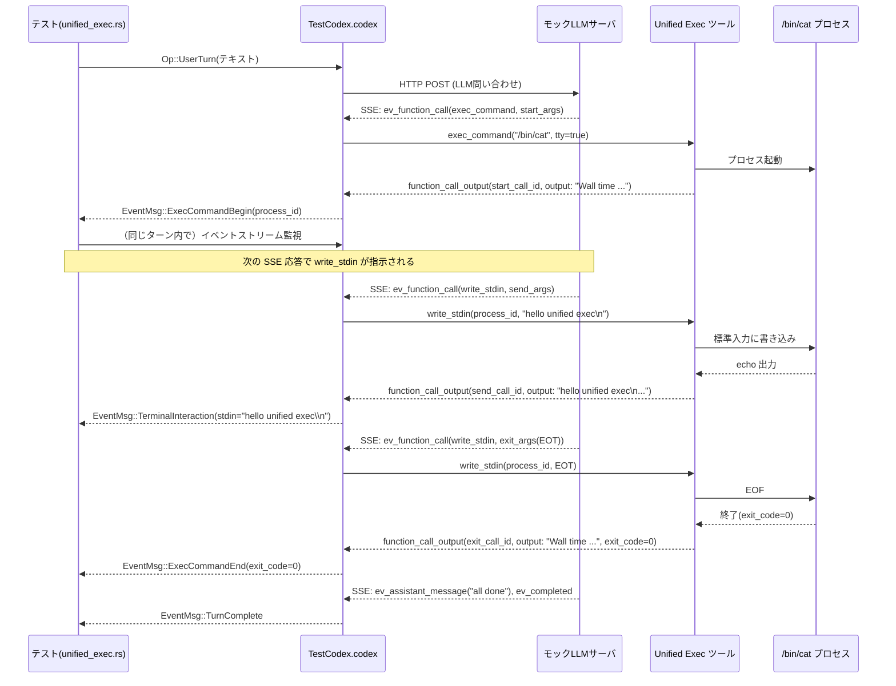

# core/tests/suite/unified_exec.rs コード解説

## 0. ざっくり一言

Codex の「Unified Exec」ツール（`exec_command` / `write_stdin`）まわりの **統合実行機能の振る舞い** を検証する、非同期テスト群のファイルです。  
プロセスの開始・終了イベント、TTY/パイプ、セッション再利用、サンドボックス運転、大量出力のトランケーションなどを網羅的に確認します。

> ※この回答では、行番号情報がコード断片に含まれていないため、  
> `unified_exec.rs:L?` のように「ファイル名のみ + 行番号不明」で場所を示します。

---

## 1. このモジュールの役割

### 1.1 概要

このテストモジュールは、Codex コアが提供する **Unified Exec 機能**（LLM が「exec_command」「write_stdin」などの関数呼び出しとして外部プロセスを扱う機構）について、以下を検証します。

- LLM サーバからの **SSE（Server-Sent Events）応答** と `EventMsg::*` の対応
- 長寿命／短寿命プロセスの **セッション管理**（`process_id` / `session_id`）
- **TTY / パイプ** モードの切り替えと端末インタラクションイベント
- **出力トランケーション**・メタデータ（`chunk_id`, `wall_time_seconds`, `original_token_count`）
- **サンドボックス／シートベルト（macOS seatbelt）** 下での動作

### 1.2 アーキテクチャ内での位置づけ

このファイルは **テストスイート** であり、本番コードではなく、以下のコンポーネントに依存して Unified Exec の挙動を確認します。

- `TestCodex` / `TestCodexHarness`（`core_test_support::test_codex`）  
  Codex コアとのやり取りを抽象化したテスト用ハーネス
- `core_test_support::responses`  
  モック LLM サーバの SSE レスポンスを組み立てるユーティリティ
- `codex_protocol::protocol::{Op, EventMsg, SandboxPolicy, ExecCommandSource, AskForApproval}`  
  Codex に送る操作と、受け取るイベント型
- `codex_exec_server::CreateDirectoryOptions` / `test.fs()`  
  テスト用のファイルシステム操作

全体像を簡略図にすると次のようになります。

```mermaid
flowchart LR
    subgraph Tests["本ファイルのテスト群 (unified_exec.rs)"]
        T["tokio::test\n(各 unified_exec_* テスト)"]
        H["Helper関数\nparse_unified_exec_output 等"]
    end

    T -->|Op::UserTurn / Op::Shutdown 等| C["TestCodex.codex"]
    C -->|HTTP(S) リクエスト| M["モックLLMサーバ\nstart_mock_server()"]
    M -->|SSE 応答\n(ev_function_call など)| C

    C -->|EventMsg::* ストリーム| T

    T -->|JSONボディ| H
    H -->|ParsedUnifiedExecOutput| T

    T -->|exec_command / write_stdin| P["Unified Exec サーバ\n(外部プロセス起動)"]
    P -->|プロセスID, 出力, 終了コード| C
```

> 図は、このファイルだけでなく `core_test_support` や Unified Exec サーバとの関係も含めた概念図です。

### 1.3 設計上のポイント

コードから読み取れる設計上の特徴は次のとおりです。

- **責務分割**
  - ヘルパー関数（`parse_unified_exec_output`, `collect_tool_outputs`, `submit_unified_exec_turn`, `create_workspace_directory`, `assert_command`）で共通処理を切り出し
  - 個々のテストは「どのシナリオを検証するか」に集中して記述
- **状態の扱い**
  - テストファイル自体はグローバルな可変状態をほぼ持たず、  
    セッション状態は `TestCodex` / Unified Exec サーバ側に保持される
  - 例外は `OnceLock<Regex>` による正規表現の遅延初期化（スレッド安全な静的状態）
- **エラーハンドリング**
  - テスト関数は `anyhow::Result<()>` を返し、`?` 演算子と `anyhow::Context` で失敗理由を付加
  - パースや JSON 構造が期待通りでない場合は即座に `Err` を返してテスト失敗とする
- **並行性**
  - すべてのテストは `#[tokio::test(flavor = "multi_thread", worker_threads = 2)]` による非同期テスト
  - `OnceLock<Regex>` を使い、正規表現コンパイルをスレッド安全に一度だけ行う
  - `wait_for_event` などのヘルパーでイベントストリームを逐次消費し、競合を避けつつ検証

---

## 2. 主要な機能一覧（コンポーネントインベントリ）

### 2.1 型・関数の一覧

> 行番号はコード断片から特定できないため、`L?` と表記します。

| 名前 | 種別 | 役割 / 用途 | 定義位置 |
|------|------|-------------|----------|
| `ParsedUnifiedExecOutput` | 構造体 | Unified Exec の標準出力テキストから抽出したメタデータ（`chunk_id`, `wall_time_seconds`, `process_id`, `exit_code`, `original_token_count`, `output`）を保持 | `unified_exec.rs:L?` |
| `extract_output_text` | 関数 | JSON のツール出力アイテムから `"output"` または `"content"` フィールドの文字列を取り出す | `unified_exec.rs:L?` |
| `parse_unified_exec_output` | 関数 | Unified Exec の標準出力フォーマットを正規表現でパースし、`ParsedUnifiedExecOutput` に変換する | `unified_exec.rs:L?` |
| `collect_tool_outputs` | 関数 | モックサーバからの SSE リクエストボディ配列から、各 `call_id` ごとの Unified Exec 出力を `HashMap<String, ParsedUnifiedExecOutput>` にまとめる | `unified_exec.rs:L?` |
| `submit_unified_exec_turn` | `async fn` | `TestCodex` に対して `Op::UserTurn` を送信し、Unified Exec を使ったターンを開始する共通ヘルパー | `unified_exec.rs:L?` |
| `create_workspace_directory` | `async fn` | テスト用の作業ディレクトリを `test.fs().create_directory` で作成し、絶対パスを返す | `unified_exec.rs:L?` |
| `assert_command` | 関数 | `ExecCommandBegin` イベントの `command: Vec<String>` が期待通りの `/bin/bash -lc <cmd>` 形式であるかを検証 | `unified_exec.rs:L?` |
| `unified_exec_intercepts_apply_patch_exec_command` | `#[tokio::test] async fn` | `apply_patch` 経由のコマンドが Unified Exec によってインターセプトされ、`exec_command` イベントが発火しないことを検証 | `unified_exec.rs:L?` |
| `unified_exec_emits_exec_command_begin_event` | テスト | `exec_command` 実行時に `ExecCommandBegin` イベントが正しいコマンド・cwd で発火することを検証 | 同上 |
| `unified_exec_resolves_relative_workdir` | テスト | Unified Exec の `workdir` パラメータがターンの `cwd` に対する相対パスとして解決されることを検証 | 同上 |
| `unified_exec_respects_workdir_override` | テスト（`#[ignore = "flaky"]`） | 絶対パスで `workdir` を指定した場合に、そのディレクトリが `ExecCommandBegin.cwd` に反映されることを検証 | 同上 |
| `unified_exec_emits_exec_command_end_event` | テスト | プロセス終了時に `ExecCommandEnd` イベントが exit code と出力を含んで発火することを検証 | 同上 |
| `unified_exec_emits_output_delta_for_exec_command` | テスト | `ExecCommandEnd.stdout`（及び内部の delta イベント）がコマンド出力テキストを含むことを検証 | 同上 |
| `unified_exec_full_lifecycle_with_background_end_event` | テスト | 長寿命 PTY セッションについて、Begin イベント・バックグラウンド監視による End イベント・集約出力の一貫性を検証 | 同上 |
| `unified_exec_emits_terminal_interaction_for_write_stdin` | テスト | `write_stdin` 呼び出しに対して `TerminalInteraction` イベントが `stdin` 内容と `process_id` を含んで発火することを検証 | 同上 |
| `unified_exec_terminal_interaction_captures_delayed_output` | テスト | 遅延して出力される TTY セッションで、複数回の `write_stdin` と端末出力が `ExecCommandOutputDelta` / `TerminalInteraction` / `ExecCommandEnd` に正しく反映されることを検証 | 同上 |
| `unified_exec_emits_one_begin_and_one_end_event` | テスト | セッション開始 + `write_stdin` ポーリングの組み合わせでも、`ExecCommandBegin`/`ExecCommandEnd` がそれぞれ一度だけ発火することを検証 | 同上 |
| `exec_command_reports_chunk_and_exit_metadata` | テスト | `max_output_tokens` による出力トランケーション時のメタデータ（`chunk_id`, `wall_time_seconds`, `exit_code`, `original_token_count`, `output`中のメッセージ）を検証 | 同上 |
| `unified_exec_defaults_to_pipe` | テスト | `tty` 未指定時に標準入力が TTY ではなくパイプになる（`sys.stdin.isatty() == False`）ことを検証 | 同上 |
| `unified_exec_can_enable_tty` | テスト | `tty: true` 指定時に標準入力が TTY になる（`isatty() == True`）ことを検証 | 同上 |
| `unified_exec_respects_early_exit_notifications` | テスト | `yield_time_ms` が大きくても、短命プロセスでは `wall_time_seconds` が実際の実行時間に近い値になること、`process_id` が残らないことを検証 | 同上 |
| `write_stdin_returns_exit_metadata_and_clears_session` | テスト | `exec_command`→`write_stdin`→EOF の流れで、セッション ID の再利用・exit コード・`chunk_id` 生成などのメタデータが期待通りになることを検証 | 同上 |
| `unified_exec_emits_end_event_when_session_dies_via_stdin` | テスト | EOF によるセッション終了時、最初の `exec_command` の `call_id` に紐づく `ExecCommandEnd` イベントが発火することを検証 | 同上 |
| `unified_exec_keeps_long_running_session_after_turn_end` | テスト | ターン終了後も長寿命プロセスが生き続け、`Op::Shutdown` まで外部 PID が存続することを検証 | 同上 |
| `unified_exec_interrupt_preserves_long_running_session` | テスト | `Op::Interrupt` によりターンが中断されても、Unified Exec プロセスは生き残り、その後 `Op::CleanBackgroundTerminals` で終了することを検証 | 同上 |
| `unified_exec_reuses_session_via_stdin` | テスト | `exec_command` の `process_id` が後続の `write_stdin` のレスポンスでも維持される（セッション再利用）ことを検証 | 同上 |
| `unified_exec_streams_after_lagged_output` | テスト | 大量バイナリ出力 + 遅延テキスト出力のケースで、トランケーションと後続ポーリングによる tail 取得が正しく動作することを検証 | 同上 |
| `unified_exec_timeout_and_followup_poll` | テスト | 短い `yield_time_ms` によるタイムアウト後、後続の `write_stdin` ポーリングで溜まった出力を取得できることを検証 | 同上 |
| `unified_exec_formats_large_output_summary` | テスト（macOS arm 以外） | 非常に大きな標準出力の要約フォーマット（先頭/末尾の一部と「…N tokens truncated…」形式）が正しく整形されることを検証 | 同上 |
| `unified_exec_runs_under_sandbox` | テスト | Read-Only サンドボックスポリシー下でも Unified Exec が `echo hello` を実行できることを検証 | 同上 |
| `unified_exec_python_prompt_under_seatbelt` | テスト（macOS のみ） | macOS seatbelt サンドボックス下で Python REPL を TTY で起動し、プロンプト表示と終了が正しく動作することを検証 | 同上 |
| `unified_exec_runs_on_all_platforms` | テスト | Windows 以外の全プラットフォームで、`exec_command` を用いた単純な echo が動作することを検証 | 同上 |
| `unified_exec_prunes_exited_sessions_first` | テスト（`#[ignore]`） | セッション上限到達時のキャッシュプリuningが、既に終了しているセッションから優先的に行われることを検証（UnknownProcessId エラーを期待） | 同上 |

---

## 3. 公開 API と詳細解説

このファイルはテストコードですが、**他のテストや将来の拡張から再利用されうるヘルパー**を「公開 API」とみなして説明します。

### 3.1 型一覧

| 名前 | 種別 | 役割 / 用途 | フィールド概要 |
|------|------|-------------|----------------|
| `ParsedUnifiedExecOutput` | 構造体 | Unified Exec の標準出力テキストをパースして得られる情報を保持するためのテスト用型 | `chunk_id: Option<String>`（出力チャンクID）、`wall_time_seconds: f64`（経過時間）、`process_id: Option<String>`（継続セッションID）、`exit_code: Option<i32>`（終了コード）、`original_token_count: Option<usize>`（トランケーション前のトークン数）、`output: String`（ユーザ向けメッセージも含むテキスト） |

### 3.2 重要関数の詳細

ここでは、テスト全体の理解に重要な 7 関数を詳しく説明します。

---

#### `parse_unified_exec_output(raw: &str) -> Result<ParsedUnifiedExecOutput>`

**概要**

Unified Exec ツールが標準出力に吐き出す **統一フォーマットのテキスト**を、正規表現で解析して `ParsedUnifiedExecOutput` 構造体に変換します。  
（根拠: `Regex::new(concat!(...))` によるパターン定義と、その `captures` の使用。`unified_exec.rs:L?`）

**引数**

| 引数名 | 型 | 説明 |
|--------|----|------|
| `raw` | `&str` | Unified Exec の「Output」セクションを含む生の標準出力文字列（`\r` を含む可能性あり） |

**戻り値**

- `Ok(ParsedUnifiedExecOutput)`  
  `chunk_id`, `wall_time_seconds`, `process_id`, `exit_code`, `original_token_count`, `output` が必要に応じて埋められた構造体。
- `Err(anyhow::Error)`  
  期待したフォーマットにマッチしなかった場合や数値変換に失敗した場合。

**内部処理の流れ**

1. `OnceLock<Regex>` を使って、初回呼び出し時にのみ正規表現をコンパイルし、その後は再利用します。  
   - スレッド安全で、複数テストから同時に呼ばれても二重初期化されません。
2. `raw.trim_matches('\r')` で CR を除去し、`captures = regex.captures(cleaned)` を実行。
   - マッチしなかった場合は `anyhow::anyhow!("missing Output section ...")` でエラー。
3. 各ネームドキャプチャグループを取り出し、必要に応じて `parse::<f64>()`, `parse::<i32>()`, `parse::<usize>()` を行う。
   - 数値変換失敗時には `context("failed to parse ...")` を付加した `Err` を返す。
4. `output` キャプチャグループを `String` に変換し、`ParsedUnifiedExecOutput` を組み立てて返却。

**Examples（使用例）**

以下は、単純な Unified Exec 出力をパースする例です。

```rust
use anyhow::Result;

// テスト用の簡略化された Unified Exec 出力
let raw = "\
Wall time: 0.123 seconds
Process exited with code 0
Original token count: 10
Output:
tokens truncated from original output
";

// パースを実行
let parsed: ParsedUnifiedExecOutput = parse_unified_exec_output(raw)?;

// 結果の利用
assert_eq!(parsed.exit_code, Some(0));
assert!(parsed.output.contains("tokens truncated"));
```

**Errors / Panics**

- `regex.captures(cleaned)` が `None` の場合  
  → `Err(anyhow!("missing Output section in unified exec output {raw}"))` を返します。
- `wall_time` が存在しない / 数値に変換できない場合  
  → `context("failed to parse wall time seconds")` 付きの `Err`。
- `exit_code` / `original_token_count` の数値パースに失敗した場合も同様に `Err`。
- `OUTPUT_REGEX` の初期化時に正規表現が無効であれば `expect("valid unified exec output regex")` でパニックしますが、テストに埋め込まれたリテラルのため実質的に発生しない前提です。

**Edge cases（エッジケース）**

- `chunk_id` や `process_id` 行が存在しない出力  
  → `Option::None` として扱われます（例: 短命プロセスで `process_id` が不要なケース）。
- `Original token count` 行が無い場合  
  → `original_token_count` は `None`。
- 出力末尾に余分な空行があっても、`(?P<output>.*)$` がすべて取り込みます。

**使用上の注意点**

- この関数は **フォーマット前提** です。Unified Exec の出力形式が変わった場合、正規表現を更新しないとパースに失敗します。
- テスト以外で使う場合も、同じフォーマットに統一されていることを前提にする必要があります。

---

#### `collect_tool_outputs(bodies: &[Value]) -> Result<HashMap<String, ParsedUnifiedExecOutput>>`

**概要**

モック LLM サーバのリクエストログから得た **JSON ボディ配列**を走査し、  
`"type": "function_call_output"` のアイテムを抽出して `call_id` ごとに `ParsedUnifiedExecOutput` をまとめます。  
（根拠: `if let Some(items) = body.get("input").and_then(Value::as_array)` 以降のループ。`unified_exec.rs:L?`）

**引数**

| 引数名 | 型 | 説明 |
|--------|----|------|
| `bodies` | `&[serde_json::Value]` | SSE 経由で送信された LLM 応答（POST リクエストボディ）を JSON に変換したものの配列 |

**戻り値**

- `Ok(HashMap<String, ParsedUnifiedExecOutput>)`  
  キーが `call_id`（「uexec-...」などの文字列）、値がパース結果。
- `Err(anyhow::Error)`  
  統一フォーマットでない出力や、`parse_unified_exec_output` が失敗した場合。

**内部処理の流れ**

1. 空の `HashMap<String, ParsedUnifiedExecOutput>` を作成。
2. 各 `body` について:
   - `body["input"]` が配列であれば、その要素 `item` を走査。
   - `item["type"] == "function_call_output"` でない場合はスキップ。
   - `call_id` を `item["call_id"]` から取得（文字列でなければスキップ）。
3. `extract_output_text(item)` で出力テキストを取得し、`trim()` して空文字列ならスキップ。
4. `parse_unified_exec_output(content)` を呼び出し、失敗時は  
   `with_context(|| format!("failed to parse unified exec output for {call_id}"))` でエラーを補足して返す。
5. パースに成功したら、`outputs.insert(call_id.to_string(), parsed)` でマップに追加。
6. 最後に `Ok(outputs)` を返す。

**Examples（使用例）**

```rust
use serde_json::json;
use anyhow::Result;

fn example() -> Result<()> {
    // モックされた LLM 応答ボディ
    let body = json!({
        "input": [{
            "type": "function_call_output",
            "call_id": "uexec-test",
            "output": "Wall time: 0.1 seconds\nOutput:\nhello\n",
        }]
    });

    let outputs = collect_tool_outputs(&[body])?;
    let info = outputs.get("uexec-test").expect("call id not found");

    assert_eq!(info.exit_code, None);     // exit_code 行がないので None
    assert!(info.output.contains("hello"));

    Ok(())
}
```

**Errors / Panics**

- `extract_output_text` が `None` を返した場合  
  → `anyhow!("missing tool output content")` で `Err`。
- `parse_unified_exec_output` が `Err` の場合  
  → そのエラーに `failed to parse unified exec output for {call_id}` というコンテキストが付与されて再スロー。
- パニックは使用していません（`expect` は一切使っていません）。

**Edge cases**

- `input` キーが存在しない / 配列でない JSON ボディは quietly スキップされます。
- `type != "function_call_output"` のアイテム（例えば別種のメッセージ）は無視します。
- 出力テキストが空（スペースのみ）の場合もスキップされ、マップに登録されません。

**使用上の注意点**

- **同じ `call_id` が複数回出現すると、最後のものが上書きされる** ため、テスト側で `call_id` をユニークに管理する前提になっています。
- この関数は JSON のスキーマを暗黙に前提としているため、モックサーバのフォーマットを変更した場合はここも合わせて見直す必要があります。

---

#### `submit_unified_exec_turn(test: &TestCodex, prompt: &str, sandbox_policy: SandboxPolicy) -> Result<()>`

**概要**

`TestCodex` に対して `Op::UserTurn` を送信し、  
Unified Exec を利用する 1 ターン分の対話を開始するための小さなヘルパーです。  
（根拠: `test.codex.submit(Op::UserTurn { ... }).await?;` 部分。`unified_exec.rs:L?`）

**引数**

| 引数名 | 型 | 説明 |
|--------|----|------|
| `test` | `&TestCodex` | テスト用 Codex クライアントと設定をまとめた構造体 |
| `prompt` | `&str` | ユーザーからの入力テキスト（LLM に渡されるプロンプト） |
| `sandbox_policy` | `SandboxPolicy` | Unified Exec がどの程度のファイルシステム/プロセス権限を持つかを表すポリシー |

**戻り値**

- `Ok(())`  
  `submit` が成功した場合。
- `Err(anyhow::Error)`  
  内部の `submit` 呼び出しが失敗した場合。

**内部処理の流れ**

1. `let session_model = test.session_configured.model.clone();` でモデル名を取得。
2. `test.codex.submit(Op::UserTurn { ... }).await?;` を実行し、以下のフィールドを設定:
   - `items`: `UserInput::Text` 一件（`text: prompt.into()`）
   - `cwd`: `test.config.cwd.to_path_buf()`（テスト用の作業ディレクトリ）
   - `approval_policy: AskForApproval::Never` など、統一設定
   - `sandbox_policy`: 引数からそのまま渡す
3. `Ok(())` を返して終了。

**Examples（使用例）**

このモジュール内では多くのテストが直接 `codex.submit` を書いていますが、  
`unified_exec_emits_exec_command_begin_event` などは本ヘルパーを利用しています。

```rust
// DangerFullAccess で Unified Exec を実行するテストから呼び出し
submit_unified_exec_turn(
    &test,
    "emit begin event",
    SandboxPolicy::DangerFullAccess,
).await?;
```

**Errors / Panics**

- `test.codex.submit(...)` が `Err` を返した場合、そのまま `?` で伝播しテストを失敗させます。
- パニック要素（`expect` など）はありません。

**Edge cases**

- `prompt` が空文字列でも特にチェックをしておらず、そのまま Codex に渡されます。
- `sandbox_policy` によっては Unified Exec が制限される可能性がありますが、この関数自体はその成否を気にせず送信のみ行います。

**使用上の注意点**

- テストで `cwd` や `model` を変えたい場合、本ヘルパーではなく直に `codex.submit` を構築する必要があります。
- 追加のオプション（`service_tier`, `collaboration_mode` など）が必要な場合も同様です。

---

#### `create_workspace_directory(test: &TestCodex, rel_path: impl AsRef<Path>) -> Result<PathBuf>`

**概要**

テスト用の作業ディレクトリ（Unified Exec の `workdir` で利用）を、  
`TestCodex` の `cwd` 配下に **再帰的に作成** し、その絶対パスを返します。  
（根拠: `let abs_path = test.config.cwd.join(rel_path.as_ref());` など。`unified_exec.rs:L?`）

**引数**

| 引数名 | 型 | 説明 |
|--------|----|------|
| `test` | `&TestCodex` | Codex テスト環境 |
| `rel_path` | `impl AsRef<std::path::Path>` | `test.config.cwd` からの相対パスまたは任意のパス |

**戻り値**

- `Ok(PathBuf)`  
  作成された（または既に存在する）ディレクトリの絶対パス。
- `Err(anyhow::Error)`  
  ディレクトリ作成に失敗した場合（Permission denied など）。

**内部処理の流れ**

1. `let abs_path = test.config.cwd.join(rel_path.as_ref());` で絶対パスを計算。
2. `test.fs().create_directory(&abs_path, CreateDirectoryOptions { recursive: true }).await?;`  
   再帰的にディレクトリを作成。
3. `Ok(abs_path.into_path_buf())` を返す。

**Examples（使用例）**

```rust
let workdir_rel = std::path::PathBuf::from("uexec_relative_workdir");
let workdir = create_workspace_directory(&test, &workdir_rel).await?;

// ここで workdir は絶対パス。Unified Exec の workdir パラメータに利用。
let args = json!({
    "cmd": "pwd",
    "yield_time_ms": 250,
    "workdir": workdir_rel.to_string_lossy().to_string(),
});
```

**Errors / Panics**

- `create_directory` が失敗した場合、`?` 経由でエラーが伝播しテストが失敗します。
- パニックはありません。

**Edge cases**

- 既にディレクトリが存在する場合も `recursive: true` により成功します（エラーにはなりません）。
- 書き込み権限のない場所を指している場合はエラーになります。

**使用上の注意点**

- `SandboxPolicy::new_read_only_policy()` 下では、ファイルシステム操作が制限される可能性があるため、そのようなテストと組み合わせる際には注意が必要です。

---

#### テスト: `unified_exec_full_lifecycle_with_background_end_event()`

**概要**

長時間動作するコマンド（`sleep 0.5; printf 'HELLO-FULL-LIFECYCLE'`）に対し、Unified Exec の **フルライフサイクル**:

- `ExecCommandBegin`（`process_id` 付き）
- バックグラウンド監視による `ExecCommandEnd`（`process_id` 付き）
- 集約された `aggregated_output` 内の完全な PTY トランスクリプト

が正しく生成されることを検証します。  
（根拠: `assert!(begin_event.process_id.is_some(), ...)`, `assert!(end_event.aggregated_output.contains(...))` 等。`unified_exec.rs:L?`）

**引数 / 戻り値**

- 引数なし（`#[tokio::test]`）
- 戻り値: `Result<()>`（`anyhow::Result<()>`）

**内部処理の流れ（要約）**

1. ネットワーク・サンドボックス・Windows を条件によりスキップ。
2. `start_mock_server()` と `test_codex().with_config(...)` で Unified Exec を有効化した環境を構築。
3. `call_id = "uexec-full-lifecycle"` で `exec_command` を 1 回呼ぶ SSE レスポンスをモック。
4. `submit_unified_exec_turn` でターンを開始。
5. ループで `wait_for_event(&test.codex, |_| true)` を繰り返し:
   - `ExecCommandBegin` (対象 `call_id`) を受け取ったら `begin_event` に保存。
   - `ExecCommandEnd` (対象 `call_id`) を受け取ったら `end_event` に保存し、重複を禁止するアサート。
   - `TurnComplete` を検出したら `task_completed = true`。
   - `task_completed && end_event.is_some()` でループ終了。
6. `begin_event` / `end_event` の諸フィールドをアサート。

**Errors / Panics**

- `begin_event` や `end_event` が `None` のままの場合は `expect("expected ... event")` でパニック。
- `end_event.exit_code != 0` の場合や `aggregated_output` にマーカー文字列がない場合など、複数の `assert!` によりテスト失敗。

**Edge cases**

- イベントの到着順序は `ExecCommandEnd` が `TurnComplete` より前・後いずれも許可するよう、  
  `task_completed` フラグとの組み合わせでループ終了条件を柔軟にしています。  
  （根拠: `if task_completed && end_event.is_some() { break; }` が Begin/End/TurnComplete の両方のマッチ分岐にある。）
- 同じ `call_id` に対して複数の `ExecCommandEnd` が来た場合は `assert!(end_event.is_none(), ...)` により検出されます。

**使用上の注意点**

- イベントを **1 つずつ逐次消費**しているため、他のテストコードと並走させる場合、イベントストリームの共有に注意が必要です。
- 実装変更でイベント順序が変わると、このテストは重要な退行検知になります。

---

#### テスト: `write_stdin_returns_exit_metadata_and_clears_session()`

**概要**

TTY セッション `/bin/cat` に対する

1. 起動 (`exec_command`)
2. 入力 (`write_stdin` でテキスト送信)
3. EOF 送信 (`write_stdin` で `\u{0004}`)

という流れで、Unified Exec の **セッション再利用と終了メタデータ** が期待通りになるかを検証します。  
（根拠: `start_output.process_id`, `send_output.process_id`, `exit_output.exit_code` などのアサート。`unified_exec.rs:L?`）

**内部処理の流れ（要約）**

1. Unified Exec を有効化した `TestCodex` を作成し、`start_mock_server` でモックサーバを用意。
2. 3 つの `call_id` に対して `exec_command` / `write_stdin` / `write_stdin` を順に呼ぶ SSE シナリオを構築。
3. `submit_unified_exec_turn` を実行し、`TurnComplete` までイベントを待機。
4. `request_log.requests()` から JSON ボディを抽出し、`collect_tool_outputs` で `HashMap` に変換。
5. 各 `call_id` の `ParsedUnifiedExecOutput` について次を検証:
   - 起動時 (`start_output`):
     - `process_id` が存在し、一定以上の桁数を持つ。
     - `exit_code` は `None`（まだ終了していない）。
   - 入力送信時 (`send_output`):
     - 出力文字列に送信したテキスト `"hello unified exec"` が含まれる。
     - `process_id` は起動時と同じ。
     - `exit_code` は `None`。
   - EOF 送信時 (`exit_output`):
     - `process_id` は `None`（終了したためセッション解放）。
     - `exit_code == 0`。
     - `chunk_id` は 16 進の文字のみから成る。

**Contracts / Edge cases（契約・エッジケース）**

このテストから読み取れる Unified Exec の **契約** は次の通りです。

- セッションが生きている間は、レスポンスに **`process_id` が含まれるが `exit_code` は含まれない**。
- 終了時の最後のレスポンスでは、**`exit_code` は設定され、`process_id` は消える**。
- `write_stdin` 呼び出しは、既存セッションを **再利用** し、新しい `process_id` は発行しない。

**使用上の注意点**

- `session_id` 側（リクエスト JSON 内）は 1000 など固定値を使っていますが、レスポンスの `process_id` がそのまま 1000 であるとは限らない実装も考えられます。そのため、テストコードは「起動時と同一であること」のみを検証し、具体的な数値には依存しない設計です。

---

#### テスト: `unified_exec_streams_after_lagged_output()`

**概要**

大量の先行出力（トランケーション対象）と、その後に遅れて流れる「テキストの末尾（tail）」がある場合でも、Unified Exec が:

- 初回レスポンスでセッション ID を返しつつ大量出力を処理し、
- 後続の `write_stdin` で **tail テキスト（"TAIL-MARKER\n"）を取得**できる

ことを検証します。  
（根拠: Python スクリプトと `"TAIL-MARKER"` に対するアサート。`unified_exec.rs:L?`）

**内部処理の流れ（要約）**

1. Python スクリプトで以下を実行:
   - 大量のバイナリ相当出力（`chunk = ... * (1 << 10)` を 4 回書き込み）
   - 小さなテキスト `"TAIL-MARKER\n"` を 5 回、0.05 秒おきに書き込み
2. 最初の `exec_command` に `yield_time_ms: 25` を設定し、短時間で戻るようにする。
3. 2 回目の `write_stdin` は `yield_time_ms: 2000` で長めに待機し、溜まった tail 出力を取得する。
4. `collect_tool_outputs` で `start_output` と `poll_output` を取得。
5. 次を検証:
   - `start_output.process_id` が非空（長寿命セッション）。
   - `poll_output.output` に `"TAIL-MARKER"` が含まれる。

**使用上の注意点**

- このテストはトランケーションロジックと tail 取得ロジックの **最悪ケース** を意図しており、`wait_for_event_with_timeout` で 10 秒まで待っています。Unified Exec の実装変更によりタイミングが変わると、テストがタイムアウトする可能性があります。
- 実装としては「大量出力でトランケーションしても、その後の `write_stdin` によるストリーミングで tail まで追いつける」ことを保証するためのリグレッションテストになっています。

---

### 3.3 その他の関数・テストの一覧

その他のテスト関数は、主に特定のユースケースやエッジケースを 1 〜 2 個ずつ検証する構造です。概要は以下の通りです。

| 関数名 | 役割（1 行） |
|--------|--------------|
| `unified_exec_intercepts_apply_patch_exec_command` | `apply_patch` ツールが Unified Exec によってインターセプトされ、`ExecCommandBegin/End` が発火しないことを確認する |
| `unified_exec_emits_exec_command_begin_event` | `exec_command` 呼び出しで `ExecCommandBegin` イベントの `command` と `cwd` が期待通りであることを検証 |
| `unified_exec_resolves_relative_workdir` | `workdir` に相対パスを指定したとき、ターンの `cwd` からの相対パスとして解決されることを検証 |
| `unified_exec_respects_workdir_override` | `workdir` に絶対パスを指定したとき、そのパスが `ExecCommandBegin.cwd` に反映されることを検証（flaky のため ignore） |
| `unified_exec_emits_exec_command_end_event` | `write_stdin` を含むシナリオで `ExecCommandEnd` が exit code 0 と出力を含んで発火することを検証 |
| `unified_exec_emits_output_delta_for_exec_command` | 短い出力コマンドで `ExecCommandEnd.stdout` に出力が含まれることを検証 |
| `unified_exec_emits_terminal_interaction_for_write_stdin` | `write_stdin` に対して `TerminalInteraction` イベントが `stdin` 内容と `process_id` を含んで発火することを検証 |
| `unified_exec_terminal_interaction_captures_delayed_output` | 遅延出力を伴う TTY セッションで、複数の `TerminalInteraction` と出力 delta の整合性を検証 |
| `unified_exec_emits_one_begin_and_one_end_event` | セッション開始＋ポーリングでも Begin/End イベントがそれぞれ 1 回のみであることを検証 |
| `exec_command_reports_chunk_and_exit_metadata` | `max_output_tokens` を指定したときのチャンク ID・壁時計時間・トークン数・トランケーションメッセージを検証 |
| `unified_exec_defaults_to_pipe` | `tty` 未指定で `sys.stdin.isatty()` が `False` になることを Python で確認 |
| `unified_exec_can_enable_tty` | `tty: true` 指定で `sys.stdin.isatty()` が `True` かつ `process_id` が最終レスポンスに含まれないこと（即終了）を検証 |
| `unified_exec_respects_early_exit_notifications` | `yield_time_ms` が長くても、短命プロセスでは `wall_time_seconds` が短い値になり `process_id` が返されないことを検証 |
| `unified_exec_emits_end_event_when_session_dies_via_stdin` | EOF によるセッション終了で、起動時の `call_id` に紐づく `ExecCommandEnd` が 1 回だけ発火することを検証 |
| `unified_exec_keeps_long_running_session_after_turn_end` | 長寿命プロセスが `TurnComplete` 後も生き残ることを PID ファイルと `process_is_alive` で検証 |
| `unified_exec_interrupt_preserves_long_running_session` | `Op::Interrupt` による中断後もプロセスが生き残り、`Op::CleanBackgroundTerminals` で終了することを検証 |
| `unified_exec_reuses_session_via_stdin` | `exec_command` の後続 `write_stdin` が同じ `process_id` を返し、echo 出力を得られることを検証 |
| `unified_exec_timeout_and_followup_poll` | 短いタイムアウトで一度応答を返した後、フォローアップの `write_stdin` で最終出力を取得できることを検証 |
| `unified_exec_formats_large_output_summary` | 大量の行出力に対して「Total output lines: N」「…tokens truncated…」形式の要約が正規表現にマッチすることを検証 |
| `unified_exec_runs_under_sandbox` | Read-only サンドボックス下でも簡単な `echo` コマンドが動作することを検証 |
| `unified_exec_python_prompt_under_seatbelt` | macOS seatbelt 下で Python REPL プロンプト (`>>>`) が表示されることを検証 |
| `unified_exec_runs_on_all_platforms` | プラットフォーム間での最小限な Unified Exec の互換性を検証 |
| `unified_exec_prunes_exited_sessions_first` | セッションキャッシュのプリuning順が「終了済みセッション優先」であることを検証（現在 ignore） |
| `extract_output_text` | ツール出力 JSON から `"output"` 文字列またはオブジェクト内 `"content"` を取り出す補助関数 |
| `assert_command` | `ExecCommandBegin.command` の 3 要素（bash のパス、`-lc`、実行コマンド文字列）を検証するヘルパー |

---

## 4. データフロー

ここでは、代表的なシナリオとして  
「長寿命 TTY セッション + write_stdin + 終了」  
（例: `write_stdin_returns_exit_metadata_and_clears_session`）におけるデータフローを示します。

### 4.1 処理の要点

1. テストは `test.codex.submit(Op::UserTurn { ... })` を呼び出す。
2. モックサーバは SSE で `exec_command` と `write_stdin` の関数呼び出しを返す。
3. Unified Exec サーバは `/bin/cat` を起動し、セッション ID/プロセス ID を割り当てる。
4. 入力テキスト・EOF を `write_stdin` 経由で送り、そのたびに Unified Exec が出力チャンクをまとめたテキストを返す。
5. Codex コアは `EventMsg::ExecCommandBegin/End` や `TerminalInteraction` を発火し、テストはそれを監視する。
6. テストは HTTP リクエストログを `collect_tool_outputs` でパースし、メタデータを検証する。

### 4.2 シーケンス図



テストはこのフローに沿って:

- `EventMsg` を逐次受信・検証（`wait_for_event`, `wait_for_event_match`）
- HTTP リクエストログから Unified Exec のテキスト出力を解析（`collect_tool_outputs` + `parse_unified_exec_output`）

することで Unified Exec の挙動を確認しています。

---

## 5. 使い方（How to Use）

このファイル自体はテストコードですが、ここでは主に:

- **ヘルパー関数の使い方**
- **Unified Exec 向けテストの典型パターン**

を整理します。

### 5.1 基本的な使用方法（ヘルパーと Unified Exec テストパターン）

#### 5.1.1 `collect_tool_outputs` + `parse_unified_exec_output` の利用例

SSE ベースのテストで Unified Exec のメタデータを検証する最小例です。

```rust
use anyhow::Result;
use serde_json::json;
use std::collections::HashMap;

// ここでは unified_exec.rs 内の関数が use されているものとする
// use crate::unified_exec::{collect_tool_outputs, ParsedUnifiedExecOutput};

async fn check_exec_metadata() -> Result<()> {
    // 1. モック LLM サーバから得た request_log を JSON に変換した配列とする
    let bodies = vec![
        json!({
            "input": [{
                "type": "function_call_output",
                "call_id": "uexec-metadata-example",
                "output": "\
Wall time: 0.05 seconds
Process exited with code 0
Original token count: 10
Output:
example output
",
            }]
        }),
    ];

    // 2. call_id ごとの ParsedUnifiedExecOutput を取得
    let outputs: HashMap<String, ParsedUnifiedExecOutput> = collect_tool_outputs(&bodies)?;

    // 3. 必要な call_id のメタデータを取り出して検証
    let meta = outputs
        .get("uexec-metadata-example")
        .expect("output not found");

    assert_eq!(meta.exit_code, Some(0));
    assert!(meta.output.contains("example output"));
    assert!(meta.wall_time_seconds >= 0.0);

    Ok(())
}
```

#### 5.1.2 Unified Exec 用テストの典型フロー（擬似コード）

```rust
// 設定・ハーネスの用意
let server = start_mock_server().await;
let mut builder = test_codex().with_config(|config| {
    config.features.enable(Feature::UnifiedExec).unwrap(); // Unified Exec を有効化
});
let test = builder.build_remote_aware(&server).await?;

// モック LLM 応答（exec_command 1 回）の SSE シーケンス
let call_id = "uexec-basic";
let args = json!({
    "cmd": "echo hello",
    "yield_time_ms": 500,
});
let responses = vec![
    sse(vec![
        ev_response_created("resp-1"),
        ev_function_call(call_id, "exec_command", &serde_json::to_string(&args)?),
        ev_completed("resp-1"),
    ]),
    sse(vec![
        ev_assistant_message("msg-1", "done"),
        ev_completed("resp-2"),
    ]),
];
let request_log = mount_sse_sequence(&server, responses).await;

// ターンの送信（ヘルパーを使う場合）
submit_unified_exec_turn(
    &test,
    "run basic unified exec",
    SandboxPolicy::DangerFullAccess,
).await?;

// TurnComplete まで待機
wait_for_event(&test.codex, |event| matches!(event, EventMsg::TurnComplete(_))).await;

// リクエストログから Unified Exec 出力を取得して検証
let bodies = request_log
    .requests()
    .into_iter()
    .map(|req| req.body_json())
    .collect::<Vec<_>>();

let outputs = collect_tool_outputs(&bodies)?;
let output = outputs.get(call_id).expect("missing unified exec output");
assert!(output.output.contains("hello"));
```

### 5.2 よくある使用パターン

1. **一回限りの短命コマンド**
   - `yield_time_ms` を短め（〜数百 ms）に設定し、結果を即座に取得。
   - 期待: `process_id` は `None`、`exit_code` は `Some(0)`、出力は完全。

2. **長寿命 TTY セッション**
   - `cmd`: `/bin/bash -i`, `/bin/cat`, `python -i` など
   - `tty: true` を指定し、`write_stdin` で対話的にやり取り。
   - 期待: 起動時レスポンスに `process_id` が含まれ、その後の `write_stdin` でも同じ `process_id` が続く。

3. **大量出力 + トランケーション**
   - `max_output_tokens` を小さめに設定し、大量の標準出力を生成するスクリプトを実行。
   - 期待: `output` に「Total output lines: N」「…tokens truncated…」が含まれ、`original_token_count` が `max_output_tokens` を超える。

### 5.3 よくある間違いと正しい例

```rust
// 誤り例: Unified Exec 機能を有効化していない
let mut builder = test_codex().with_config(|config| {
    // config.features.enable(Feature::UnifiedExec); // ← 抜けている
});
let test = builder.build_remote_aware(&server).await?;

// この状態で exec_command を期待するテストを書くと、
// ツール自体が呼ばれずテストが失敗する可能性がある。

// 正しい例: Unified Exec 機能を明示的に有効化する
let mut builder = test_codex().with_config(|config| {
    config
        .features
        .enable(Feature::UnifiedExec)
        .expect("test config should allow feature update");
});
let test = builder.build_remote_aware(&server).await?;
```

```rust
// 誤り例: write_stdin の session_id が、実際に起動されたセッションと無関係
let args = json!({
    "chars": "data\n",
    "session_id": 9999, // 実際のセッションIDと一致しない
    "yield_time_ms": 500,
});

// この場合、Unified Exec 側で UnknownProcessId 相当のエラーとなる（
// テスト unified_exec_prunes_exited_sessions_first の assert より推測）。

// 正しい例: 最初の exec_command のレスポンスが持つセッションIDに対応する値を使う
// （このファイルでは session_id は「LLM 側が指定する ID」という前提で 1000 を固定で利用）
let args = json!({
    "chars": "data\n",
    "session_id": 1000,
    "yield_time_ms": 500,
});
```

### 5.4 使用上の注意点（まとめ）

- このテストファイルは **OS 非依存ではありません**。  
  `/bin/bash`, `/bin/cat`, `/bin/echo`, `python3`, `sleep` など多数の POSIX コマンドに依存します。
  - Windows では `skip_if_windows!` によりスキップされるテストが多いです。
- 多くのテストは **時間依存（`sleep`, `yield_time_ms`）** なため、CI 環境の負荷状況によっては flakiness の原因になります。
  - 実際に `#[ignore = "flaky"]` が付与されたテストもあります。
- Unified Exec の実装仕様（イベント順序・メタデータなど）が変わると、このテスト群は大量に失敗し、  
  それが仕様変更の影響範囲を知る上でのシグナルになります。

---

## 6. 変更の仕方（How to Modify）

### 6.1 新しい機能（テストシナリオ）を追加する場合

1. **どこに追加するか**
   - このファイル `core/tests/suite/unified_exec.rs` の末尾付近に、新しい `#[tokio::test] async fn` を追加するのが自然です。
   - 既存テストと同じく、`skip_if_no_network!`, `skip_if_sandbox!`, `skip_if_windows!` などの前提条件を必要に応じて追加します。

2. **利用すべき既存ヘルパー**
   - Codex 環境構築: `test_codex()`, `TestCodexHarness::with_builder`, `start_mock_server`.
   - Unified Exec 出力解析: `collect_tool_outputs`, `parse_unified_exec_output`, `extract_output_text`.
   - 作業ディレクトリ: `create_workspace_directory`.
   - コマンド検証: `assert_command`.

3. **呼び出し元**
   - 新しいテストは、通常以下のパターンに従います。
     1. モックサーバ起動 → `test_codex().with_config(|config| { ...UnifiedExec... })`。
     2. SSE レスポンスシーケンスを `mount_sse_sequence` で登録。
     3. `submit_unified_exec_turn` もしくは `codex.submit(Op::UserTurn { ... })` でターンを開始。
     4. `wait_for_event` / `wait_for_event_match` / `wait_for_event_with_timeout` / `next_event` などでイベントを監視。
     5. `request_log.requests()` から JSON ボディを取得し、`collect_tool_outputs` で解析してアサート。

### 6.2 既存の機能（テスト）を変更する場合

- **影響範囲の確認**
  - 各テストは基本的に独立ですが、`call_id` 文字列が被ると `collect_tool_outputs` の結果を読む際に混乱が生じます。
  - `call_id` を変更する場合は、そのテスト内の `expect("missing ...")` 文を含めて一貫して更新する必要があります。

- **契約（前提条件・返り値の意味）に関する注意**
  - Unified Exec の仕様から見て重要な契約例:
    - Begin イベントには開始時の `process_id` が含まれる（長寿命セッション）。
    - 終了時のレスポンスには `exit_code` が含まれ、`process_id` は消える。
    - `write_stdin` は既存 `process_id` を再利用し、新しいセッションを作らない。
    - TTY モードでは `TerminalInteraction` イベントが発火する。
  - テストを変更する際は、これらの契約を変えるかどうかを意識し、必要であれば **他のテストも合わせて更新**する必要があります。

- **関連するテストや使用箇所の再確認**
  - 例えば TTY/パイプのデフォルト挙動を変更した場合:
    - `unified_exec_defaults_to_pipe`
    - `unified_exec_can_enable_tty`
    - `unified_exec_python_prompt_under_seatbelt`
  - など複数のテストが失敗する可能性があります。検索で `tty` や `isatty` を含む箇所を確認するのが有効です。

---

## 7. 関連ファイル・モジュール

このモジュールと密接に関連するモジュール（Rust のモジュールパスで記載）をまとめます。

| パス | 役割 / 関係 |
|------|------------|
| `core_test_support::test_codex` | `TestCodex`, `TestCodexHarness`, `test_codex()` を提供し、Codex コアとのテスト用セッションを構築する |
| `core_test_support::responses` | `sse`, `ev_function_call`, `ev_response_created`, `ev_assistant_message`, `ev_completed`, `mount_sse_sequence` など SSE モックレスポンスを生成するユーティリティ |
| `core_test_support::process` | `process_is_alive`, `wait_for_pid_file`, `wait_for_process_exit` など、外部プロセスの存否や終了待ちを行うテスト用ヘルパー |
| `core_test_support::{wait_for_event, wait_for_event_match, wait_for_event_with_timeout}` | Codex のイベントストリームから `EventMsg` を待機・抽出する非同期ヘルパー |
| `codex_protocol::protocol` | `Op`, `EventMsg`, `SandboxPolicy`, `ExecCommandSource`, `AskForApproval` など、Codex プロトコルの型定義 |
| `codex_protocol::user_input::UserInput` | `Op::UserTurn` で利用するユーザー入力（テキストなど）を表す型 |
| `codex_exec_server::CreateDirectoryOptions` | Unified Exec 用ワークスペースディレクトリの作成オプションを表す型 |
| `core_test_support::skip_if_no_network`, `skip_if_sandbox`, `skip_if_windows` | 実行環境条件によってテストを動的にスキップするためのマクロ |
| `regex_lite::Regex` / `std::sync::OnceLock` | Unified Exec 出力パース用の正規表現をスレッド安全に遅延初期化するために使用 |

---

## 安全性・エラー・並行性に関する補足

- **安全性（Rust 言語的）**
  - このファイルには `unsafe` ブロックは登場せず、所有権・借用は標準的なパターンに従っています。
  - `OnceLock<Regex>` により静的な正規表現もスレッド安全に初期化されます。

- **エラーハンドリング**
  - すべてのテスト関数は `anyhow::Result<()>` を返し、`?` 演算子でエラーを伝播させています。
  - パースや JSON 構造の不整合は `anyhow::Context` で補足情報を付加して検出しやすくしています。

- **並行性**
  - `#[tokio::test(flavor = "multi_thread", worker_threads = 2)]` により各テストは並行実行可能ですが、  
    `TestCodex.codex` ごとにイベントストリームを個別に消費しているため、テスト間でイベントが取り合いになる設計ではありません。
  - `wait_for_event` などは「条件に合うまでストリームを順次消費する」スタイルで書かれており、  
    イベント順序をテストで厳密に制御・検証しています。

このように、本ファイルは Unified Exec 機能の仕様とライフサイクルを **実行レベルで検証する総合的なテストスイート**になっています。
