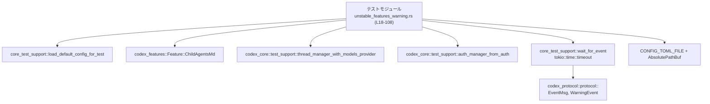
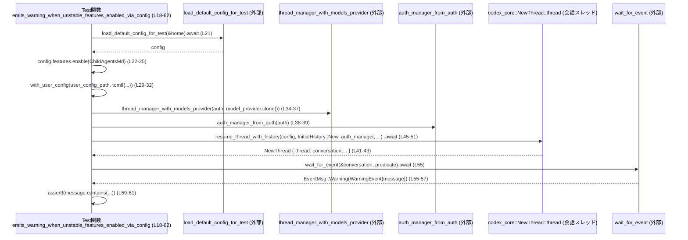

# core/tests/suite/unstable_features_warning.rs

## 0. ざっくり一言

不安定機能 `child_agents_md` を設定ファイルから有効化したときに警告イベントが発行されること、および抑制フラグでその警告を抑制できることを検証する **非同期統合テスト** のモジュールです（`core/tests/suite/unstable_features_warning.rs:L18-62,64-107`）。

---

## 1. このモジュールの役割

### 1.1 概要

- このモジュールは、「開発中（unstable）機能が有効な場合に、利用者へ警告を出す」という仕様をテストで保証するために存在します。
- 具体的には、設定ファイル（`CONFIG_TOML_FILE`）経由で不安定機能 `child_agents_md` を有効化したときに警告イベントが発行されること（`emits_warning_when_unstable_features_enabled_via_config`）、および `suppress_unstable_features_warning` フラグが立っている場合には警告が出ないこと（`suppresses_warning_when_configured`）を検証します（`core/tests/suite/unstable_features_warning.rs:L22-32,L59-61,L68-79,L102-107`）。

### 1.2 アーキテクチャ内での位置づけ

このテストモジュールは、複数のクレートにまたがる機能をまとめて検証する「統合テスト」の位置づけです。

主な依存関係は以下です（`use` 行より）:

- `core_test_support`  
  - `load_default_config_for_test` でテスト用デフォルト設定をロード（`L12,L21,L67`）。
  - `wait_for_event` で会話スレッドからイベントを待ち受け（`L13,L55,L104`）。
- `codex_core::test_support`  
  - `thread_manager_with_models_provider` でスレッド管理オブジェクトを生成（`L34-37,L81-84`）。
  - `auth_manager_from_auth` で認証マネージャを生成（`L38-39,L85-86`）。
  - `NewThread` 構造体で新規スレッドのハンドルを受け取る（`L4,L41-43,L88-90`）。
- `codex_config::CONFIG_TOML_FILE` と `codex_utils_absolute_path::AbsolutePathBuf`  
  - ユーザ設定ファイルの絶対パス生成に使用（`L3,L10,L26-32,L73-79`）。
- `codex_features::Feature::ChildAgentsMd`  
  - 対象の不安定機能を表すフラグ（`L5,L24,L70`）。
- `codex_protocol::protocol::{EventMsg, InitialHistory, WarningEvent}`  
  - 会話履歴の初期化と、イベント/警告メッセージの型に使用（`L7-9,L47,L55-57,L94`）。
- `tokio` / 非同期ランタイム  
  - `#[tokio::test(flavor = "multi_thread", worker_threads = 2)]` を通じて、マルチスレッドの非同期テストとして実行（`L18,L64`）。
  - `tokio::time::timeout` によるタイムアウト付き待ち合わせ（`L15,L102-106`）。

依存関係の概要図（本ファイルのテスト関数に限定）:



### 1.3 設計上のポイント

- **非同期 + マルチスレッドテスト**  
  両テストは `#[tokio::test(flavor = "multi_thread", worker_threads = 2)]` でマルチスレッドランタイム上の `async fn` として実行されます（`L18,L64`）。これにより、実際の運用に近い並行実行環境での挙動を検証しています。
- **設定レイヤの上書きによるシナリオ再現**  
  デフォルト設定を読み込み（`L21,L67`）、`features.enable` や `config_layer_stack.with_user_config`、`toml!` マクロを使ってユーザ設定ファイル経由の上書きをシミュレートしています（`L22-32,L68-79`）。
- **イベント駆動の観測**  
  スレッドマネージャから `resume_thread_with_history` で会話スレッドを起動し（`L45-53,L92-100`）、`wait_for_event` + `EventMsg::Warning` で警告の有無を観測しています（`L55-57,L102-107`）。
- **明示的なエラー/パニック条件**  
  テストとして、`expect` や `assert!` を多用し、前提を満たさない状態では即座にテスト失敗（パニック）させています（`L1,L20,L25,L28,L52-53,L56-58,L59-61,L72,L75,L100,L107`）。

---

## 2. 主要な機能一覧

このモジュールが提供する（= 定義している）機能は 2 つのテスト関数です。

- `emits_warning_when_unstable_features_enabled_via_config`:  
  設定ファイル経由で不安定機能 `child_agents_md` を有効化したときに、警告イベントが発行され、そのメッセージ内容が期待どおりであることを検証します（`L18-62`）。
- `suppresses_warning_when_configured`:  
  上記とほぼ同じ条件だが `config.suppress_unstable_features_warning = true` を設定した場合に、一定時間内に警告イベントが発行されないことを検証します（`L64-107`）。

---

## 3. 公開 API と詳細解説

このファイル自体はライブラリ API ではなくテストコードですが、理解のために「このモジュールのコンポーネント一覧」として整理します。

### 3.1 型・関数インベントリー

#### このモジュールで定義している関数

| 名前 | 種別 | 役割 / 用途 | 行範囲 |
|------|------|-------------|--------|
| `emits_warning_when_unstable_features_enabled_via_config` | 非同期テスト関数 | 不安定機能有効時に警告イベントが発行されることとメッセージ内容を検証 | `core/tests/suite/unstable_features_warning.rs:L18-62` |
| `suppresses_warning_when_configured` | 非同期テスト関数 | 警告抑制フラグ設定時に警告イベントが一定時間内に発行されないことを検証 | `core/tests/suite/unstable_features_warning.rs:L64-107` |

#### このモジュールで使用している主な外部型・関数

> ※ 定義本体はこのチャンクには現れません。名前と使用箇所から用途を推測できる範囲で記述します。

| 名前 | 種別 | 役割 / 用途 | 根拠 |
|------|------|-------------|------|
| `NewThread` | 構造体（外部） | `resume_thread_with_history` の戻り値の 1 つで、`thread` フィールドから会話スレッドハンドルを取得するために使用されています。定義場所は `codex_core` クレートです。 | 使用: `core/tests/suite/unstable_features_warning.rs:L4,L41-43,L88-90` |
| `EventMsg` | 列挙体（外部） | 会話スレッドから流れてくるイベントの種類を表す型と解釈できます。ここでは `EventMsg::Warning` のバリアントに対してパターンマッチしています。 | 使用: `L7,L55-57` |
| `WarningEvent` | 構造体（外部） | 警告イベントの詳細（ここでは `message` フィールド）を保持する型と解釈できます。 | 使用: `L9,L56-57` |
| `InitialHistory` | 列挙体（外部） | 会話スレッドの初期履歴の指定に使用されており、`InitialHistory::New` から新規スレッドを開始しています。 | 使用: `L8,L47,L94` |
| `AbsolutePathBuf` | 構造体（外部） | 絶対パスを安全に表す型と解釈できます。ユーザ設定ファイルの絶対パス生成に使用されています。 | 使用: `L10,L26-28,L73-75` |
| `TempDir` | 構造体（外部） | テスト用の一時ディレクトリを作成し、スコープ終了時に自動削除するためのユーティリティです。 | 使用: `L14,L20,L66` |
| `load_default_config_for_test` | 非同期関数（外部） | テスト用のデフォルト設定オブジェクトを生成する関数です。戻り値の具体的な型はこのチャンクでは不明ですが、`config` という名前で使用されています。 | 使用: `L12,L21,L67` |
| `wait_for_event` | 非同期関数（外部） | 会話スレッドから流れてくるイベントを待ち受け、指定したプレディケートを満たすものが来るまで待機するユーティリティと解釈できます。 | 使用: `L13,L55,L104` |

### 3.2 関数詳細

2 関数ともテスト関数ですが、仕様理解のため、テンプレートに沿って詳しく解説します。

---

#### `emits_warning_when_unstable_features_enabled_via_config()`

**概要**

- 不安定機能 `child_agents_md` を設定上で有効化した状態で会話スレッドを起動し、警告イベント (`EventMsg::Warning`) が 1 度発行され、そのメッセージに特定の文言が含まれることを検証します（`L18-62`）。

**引数**

- なし（`#[tokio::test]` によりテストランナーから呼ばれる非同期関数です）。

**戻り値**

- `()`（ユニット）。  
  実際には `#[tokio::test]` によって、`Future<Output = ()>` として実行されます。

**内部処理の流れ（アルゴリズム）**

1. **テスト用ホームディレクトリと設定の準備**  
   - 一時ディレクトリ `home` を作成します。失敗すると `expect("tempdir")` によりパニックします（`L20`）。  
   - `load_default_config_for_test(&home).await` でテスト用のデフォルト設定 `config` をロードします（`L21`）。
2. **不安定機能の有効化**  
   - `config.features.enable(Feature::ChildAgentsMd)` で対象機能を有効化し、`expect("test config should allow feature update")` で失敗時にパニックさせます（`L22-25`）。
3. **ユーザ設定ファイル層の差し替え**  
   - `config.codex_home.join(CONFIG_TOML_FILE)` で設定ファイルパスを作り、`AbsolutePathBuf::from_absolute_path(...)` で絶対パス化します。ここも `expect` で失敗時はパニックです（`L26-28`）。  
   - `config.config_layer_stack = config.config_layer_stack.with_user_config(&user_config_path, toml! { features = { child_agents_md = true } }.into())` により、ユーザ設定レイヤとして `features.child_agents_md = true` を持つ TOML を合成します（`L29-32`）。
4. **スレッド/認証マネージャの生成**  
   - `thread_manager_with_models_provider` を `CodexAuth::from_api_key("test")` と `config.model_provider.clone()` から生成します（`L34-37`）。  
   - 同様に `auth_manager_from_auth` で認証マネージャを生成します（`L38-39`）。
5. **会話スレッドの起動**  
   - `thread_manager.resume_thread_with_history(config, InitialHistory::New, auth_manager, false, None)` を `await` し、新規スレッドを起動します（`L45-51`）。  
   - 戻り値 `NewThread { thread: conversation, .. }` から `thread` フィールドを取り出し `conversation` として保持します（`L41-43`）。  
   - 呼び出しが `Err` を返した場合は `.expect("spawn conversation")` によりパニックします（`L52-53`）。
6. **警告イベントの待ち受けと検証**  
   - `wait_for_event(&conversation, |ev| matches!(ev, EventMsg::Warning(_))).await` で、`EventMsg::Warning` にマッチするイベントが届くまで待機し、そのイベントを `warning` として受け取ります（`L55`）。  
   - `let EventMsg::Warning(WarningEvent { message }) = warning else { panic!("expected warning event"); };` により、警告イベントでなければパニックし、そうであれば `message` 文字列を取り出します（`L56-58`）。  
   - `assert!` で `message` が以下 3 つの文字列をそれぞれ含むことを検証します（`L59-61`）：  
     - `"child_agents_md"`  
     - `"Under-development features enabled"`  
     - `"suppress_unstable_features_warning = true"`

**Examples（使用例）**

この関数自体が使用例になっていますが、要点だけを抜き出したパターンを示します。

```rust
#[tokio::test(flavor = "multi_thread", worker_threads = 2)]
async fn example_warns_on_unstable_feature() {
    // 一時ディレクトリの作成（失敗するとパニック）           // core/tests/suite/unstable_features_warning.rs:L20
    let home = TempDir::new().expect("tempdir");              

    // テスト用デフォルト設定を読み込む                        // L21
    let mut config = load_default_config_for_test(&home).await;

    // 不安定機能 child_agents_md を有効化                      // L22-25
    config
        .features
        .enable(Feature::ChildAgentsMd)
        .expect("test config should allow feature update");

    // ユーザ設定レイヤとして features.child_agents_md = true を追加 // L26-32
    let user_config_path = AbsolutePathBuf::from_absolute_path(
        config.codex_home.join(CONFIG_TOML_FILE),
    )
    .expect("absolute user config path");
    config.config_layer_stack = config
        .config_layer_stack
        .with_user_config(&user_config_path, toml! { features = { child_agents_md = true } }.into());

    // スレッド・認証マネージャの作成                            // L34-39
    let thread_manager = codex_core::test_support::thread_manager_with_models_provider(
        CodexAuth::from_api_key("test"),
        config.model_provider.clone(),
    );
    let auth_manager =
        codex_core::test_support::auth_manager_from_auth(CodexAuth::from_api_key("test"));

    // 新規スレッドを起動し、会話スレッドハンドルを取得           // L41-53
    let NewThread { thread: conversation, .. } = thread_manager
        .resume_thread_with_history(
            config,
            InitialHistory::New,
            auth_manager,
            false,
            None,
        )
        .await
        .expect("spawn conversation");

    // Warning イベントが届くまで待つ                            // L55-58
    let warning =
        wait_for_event(&conversation, |ev| matches!(ev, EventMsg::Warning(_))).await;
    let EventMsg::Warning(WarningEvent { message }) = warning else {
        panic!("expected warning event");
    };
    // メッセージ内容の検証                                      // L59-61
    assert!(message.contains("child_agents_md"));
}
```

**Errors / Panics**

この関数は以下の条件でパニックし得ます。

- 一時ディレクトリの作成失敗  
  `TempDir::new().expect("tempdir")`（`L20`）。
- 機能フラグの有効化失敗  
  `config.features.enable(...).expect("test config should allow feature update")`（`L22-25`）。
- ユーザ設定ファイルパスの絶対パス変換失敗  
  `AbsolutePathBuf::from_absolute_path(...).expect("absolute user config path")`（`L26-28`）。
- スレッド起動失敗  
  `resume_thread_with_history(...).await.expect("spawn conversation")`（`L45-53`）。
- 受信したイベントが `EventMsg::Warning` でない  
  `let EventMsg::Warning(WarningEvent { message }) = warning else { panic!(...) };`（`L56-58`）。
- `message` に期待する文字列が含まれていない  
  `assert!(message.contains(...))` によるテスト失敗（`L59-61`）。

**Edge cases（エッジケース）**

- **警告が発行されない場合**  
  - `wait_for_event` がどのようにタイムアウト/エラー処理を行うかは、このチャンクには定義がないため不明です（`L13,L55`）。  
  - 実装によってはテストが長時間ブロックしたり、内部でエラーを返す可能性がありますが、このファイルからは判断できません。
- **複数の警告が発行される場合**  
  - `wait_for_event` が最初の `EventMsg::Warning` を返す仕様であれば、最初に到着した警告のみを検証することになります（`L55-57`）。  
  - 複数回の発行の有無はこのテストでは検証していません。
- **メッセージの文言変更**  
  - `"child_agents_md"` や `"Under-development features enabled"` などの文言が実装側で変更されると、このテストは失敗します（`L59-61`）。

**使用上の注意点**

- テストでは Clippy の `unwrap_used` / `expect_used` を明示的に許可しています（`#![allow(...)]`、`L1`）。テストコードとして前提が崩れたら即失敗させる設計です。
- 非同期かつマルチスレッド環境で動作するため、共有リソースに関するスレッドセーフティは `codex_core` などの実装側に依存します。このファイルからその安全性の詳細は分かりません。
- イベント待ちにタイムアウトを設けていないため（`L55`）、`wait_for_event` がタイムアウトを提供しない実装であれば、イベントが来ない場合にテストが長時間かかる可能性があります。この挙動もこのチャンクだけでは不明です。

---

#### `suppresses_warning_when_configured()`

**概要**

- 不安定機能 `child_agents_md` を有効にした上で、`config.suppress_unstable_features_warning = true` を設定した場合に、一定時間（150ms）以内に警告イベントが届かないことを `tokio::time::timeout` を使って検証します（`L64-107`）。

**引数**

- なし（`#[tokio::test]` によりテストランナーから呼ばれる非同期関数です）。

**戻り値**

- `()`（ユニット）。`#[tokio::test]` により `Future<Output = ()>` として実行されます。

**内部処理の流れ（アルゴリズム）**

1. **テスト用ホームディレクトリと設定の準備**  
   - `TempDir::new().expect("tempdir")` で一時ディレクトリを作成（`L66`）。  
   - `load_default_config_for_test(&home).await` でテスト用デフォルト設定 `config` を取得（`L67`）。
2. **不安定機能の有効化 + 警告抑制フラグ設定**  
   - `config.features.enable(Feature::ChildAgentsMd).expect(...)` で不安定機能を有効化（`L68-71`）。  
   - `config.suppress_unstable_features_warning = true;` で警告表示の抑制フラグを有効にする（`L72`）。
3. **ユーザ設定ファイル層の差し替え**  
   - 最初のテストと同様に、`CONFIG_TOML_FILE` と `AbsolutePathBuf` を用いてユーザ設定ファイルの絶対パスを作成し（`L73-75`）、  
   - `features.child_agents_md = true` を設定した TOML を `with_user_config` で設定レイヤに追加する（`L76-79`）。
4. **スレッド/認証マネージャの生成とスレッド起動**  
   - `thread_manager_with_models_provider` と `auth_manager_from_auth` を用いてマネージャを生成（`L81-86`）。  
   - `resume_thread_with_history` を呼び出して会話スレッドを起動し、`NewThread { thread: conversation, .. }` から会話ハンドルを取得（`L88-90,L92-100`）。  
   - 起動失敗時には `.expect("spawn conversation")` でパニック（`L99-100`）。
5. **タイムアウト付きでの警告イベント待ち**  
   - `tokio::time::timeout(Duration::from_millis(150), wait_for_event(&conversation, |ev| matches!(ev, EventMsg::Warning(_))))` を `await` し、結果を `warning` として受け取る（`L102-106`）。  
     - 150ms 以内に `wait_for_event` が `EventMsg::Warning` を返した場合、`timeout` は `Ok(...)` になります。  
     - 150ms を経過しても完了しない場合、`timeout` は `Err(tokio::time::error::Elapsed)` を返します（Tokio の仕様に基づく）。
   - `assert!(warning.is_err());` により、150ms 以内に警告イベントが届かなかった（= `Err` だった）ことを検証します（`L107`）。

**Examples（使用例）**

この関数もそのままが使用例ですが、タイムアウト付きのパターンだけ抜き出した例です。

```rust
#[tokio::test(flavor = "multi_thread", worker_threads = 2)]
async fn example_suppresses_unstable_warning() {
    // 前半は emits_warning_when_unstable_features_enabled_via_config とほぼ同じ        // L66-79
    let home = TempDir::new().expect("tempdir");
    let mut config = load_default_config_for_test(&home).await;
    config
        .features
        .enable(Feature::ChildAgentsMd)
        .expect("test config should allow feature update");
    config.suppress_unstable_features_warning = true; // 警告抑制フラグを有効化            // L72

    let user_config_path =
        AbsolutePathBuf::from_absolute_path(config.codex_home.join(CONFIG_TOML_FILE))
            .expect("absolute user config path");
    config.config_layer_stack = config.config_layer_stack.with_user_config(
        &user_config_path,
        toml! { features = { child_agents_md = true } }.into(),
    );

    // スレッド起動は前と同様なので省略                           // L81-100

    // 150ms のタイムアウト付きで Warning イベントが来ないことを確認                  // L102-107
    let warning = tokio::time::timeout(
        Duration::from_millis(150),
        wait_for_event(&conversation, |ev| matches!(ev, EventMsg::Warning(_))),
    )
    .await;
    assert!(warning.is_err()); // Err(Elapsed) であるべき
}
```

**Errors / Panics**

- 一時ディレクトリ作成失敗 → `expect("tempdir")` によりパニック（`L66`）。
- 機能フラグの有効化失敗 → `expect("test config should allow feature update")` によりパニック（`L68-71`）。
- ユーザ設定ファイルパスの絶対パス化失敗 → `expect("absolute user config path")` によりパニック（`L73-75`）。
- スレッド起動失敗 → `expect("spawn conversation")` によりパニック（`L99-100`）。
- `timeout(...).await` 自体は `Result<_, tokio::time::error::Elapsed>` を返しますが、ここでは返り値 `warning` に対して `assert!(warning.is_err())` を行うだけで、`Ok` の場合はテスト失敗（パニック）となります（`L107`）。

**Edge cases（エッジケース）**

- **警告が遅れて届く場合**  
  - 150ms を超えてから `Warning` イベントが発行される場合、このテストはそれを検出しません。`timeout` が `Err(Elapsed)` を返した時点でテストは成功となるためです（`L102-107`）。  
  - 実際の仕様として「まったく警告を出さない」のか「一定時間以内に出さないだけ」なのかは、このテストからは判別できません。
- **非常に遅い環境**  
  - 環境が極端に遅く、通常は出ないはずの警告が 150ms 以内に届かないだけ、というシナリオも理論上はあり得ます。その場合も `warning.is_err()` は `true` となりテストは成功します。  
  - 逆に、実装が誤って警告を出してしまった場合でも、それが 150ms より後に発火する実装だと、このテストでは検出できません。
- **`wait_for_event` の実装依存**  
  - `wait_for_event` がキャンセル（`timeout` による）された場合の挙動や、その後のリソースクリーンアップがどうなっているかは、このチャンクには現れません（`L104`）。

**使用上の注意点**

- 「警告がまったく出ないこと」を保証しているわけではなく、「150ms 以内に `EventMsg::Warning` が観測されないこと」をテストしている点に注意が必要です（`L102-107`）。
- タイムアウト値 150ms は固定でハードコーディングされています（`L102-104`）。  
  一般に、実行環境や負荷によってはこの値が小さすぎる/大きすぎる可能性もありますが、このテスト自体はその調整機構を持っていません。
- 非同期キャンセル (`timeout` による内部 Future のキャンセル) による副作用がある場合は、それを考慮した実装・テストが必要ですが、その詳細は `wait_for_event` 側に依存し、このチャンクからは分かりません。

### 3.3 その他の関数

このモジュール内に補助的なローカル関数の定義はありません。  
外部関数呼び出し（`load_default_config_for_test`, `wait_for_event` など）は上記で説明した通りです。

---

## 4. データフロー

ここでは、代表的なシナリオとして「不安定機能有効時に警告が出る」テストのデータフローを示します。

### 4.1 `emits_warning_when_unstable_features_enabled_via_config` のシーケンス



**要点**

- 設定オブジェクト `config` は、`load_default_config_for_test` → 機能有効化 → ユーザ設定レイヤ追加という順序で更新されます（`L21-32`）。
- その `config` は `resume_thread_with_history` に渡され、そこで実際のコアロジックが「不安定機能が有効な状態」で起動されます（`L45-47`）。
- 会話スレッドからの出力は `EventMsg` として流れ、`wait_for_event` が `EventMsg::Warning` を見つけた時点でテスト関数に戻します（`L55-57`）。
- テストは受け取った `WarningEvent.message` の内容で仕様を検証しており、テキストベースで「どの設定が警告されるか」を保証しています（`L59-61`）。

---

## 5. 使い方（How to Use）

このファイルはテストコードですが、「不安定機能の警告仕様をどのように検証するか」という観点での使い方を整理します。

### 5.1 基本的な使用方法（テストパターン）

典型的な流れは次のようになります（両テストに共通、`L20-32,L34-39,L41-53` および `L66-79,L81-86,L88-100`）。

1. テスト用ホームディレクトリを `TempDir` で作成。
2. `load_default_config_for_test` でテスト用設定を取得。
3. `config.features.enable(Feature::ChildAgentsMd)` で対象の不安定機能を有効化。
4. `config.config_layer_stack.with_user_config(...)` で TOML のユーザ設定レイヤを追加し、設定ファイル経由でも機能を有効化している状態をシミュレート。
5. `thread_manager_with_models_provider` / `auth_manager_from_auth` でマネージャを準備。
6. `resume_thread_with_history` で新規会話スレッドを起動し、`NewThread { thread, .. }` から `conversation` ハンドルを取得。
7. `wait_for_event`（必要に応じて `timeout` でラップ）でイベントを観測し、`EventMsg::Warning` の有無または内容を検証。

### 5.2 よくある使用パターン

このモジュール自体が 2 つの代表的パターンを提供しています。

1. **警告を期待するパターン**（`emits_warning_when_unstable_features_enabled_via_config`）  
   - 前提: 不安定機能が有効、警告抑制フラグは `false`（デフォルト）であると想定（`L22-25,L72` に抑制フラグなし）。  
   - 動作: `wait_for_event` で `EventMsg::Warning` を待ち、`WarningEvent.message` の内容を検証（`L55-61`）。
2. **警告が出ないことを期待するパターン**（`suppresses_warning_when_configured`）  
   - 前提: 不安定機能は有効だが、`config.suppress_unstable_features_warning = true` が設定されている（`L68-72`）。  
   - 動作: `tokio::time::timeout` + `wait_for_event` で 150ms の間 `EventMsg::Warning` が観測されないことを確認（`L102-107`）。

新しいテストを書く場合も、この 2 パターンを組み合わせて「条件によって警告が出る/出ない」を確認することができます。

### 5.3 よくある間違い（想定される誤用）

このチャンクから推測できる範囲で、起こりうる誤用と正しいパターンを対比します。

```rust
// 誤り例: 機能フラグを enable せずに、TOML 側だけで有効化したつもりになる
config.config_layer_stack = config.config_layer_stack.with_user_config(
    &user_config_path,
    toml! { features = { child_agents_md = true } }.into(),
);
// config.features.enable(...) を呼んでいない

// 正しいパターン: config 内部の features とユーザ設定レイヤの両方を整合させる
config
    .features
    .enable(Feature::ChildAgentsMd)
    .expect("test config should allow feature update"); // L22-25, L68-71
config.config_layer_stack = config.config_layer_stack.with_user_config(
    &user_config_path,
    toml! { features = { child_agents_md = true } }.into(), // L31, L78
);
```

- このモジュール内の両テストとも、`features.enable` と TOML レイヤの両方を設定しています（`L22-32,L68-79`）。  
  これは、「内部状態としての機能フラグ」と「ユーザ設定ファイルとしての機能フラグ」が一致している前提で実装が動いている可能性を示唆します。
- どちらか片方だけを変更したテストは、実装の実際の前提と食い違う可能性があります。

### 5.4 使用上の注意点（まとめ）

- **前提条件**  
  - テストは `load_default_config_for_test` が有効なデフォルト設定を返すことを前提としています（`L21,L67`）。  
  - `Feature::ChildAgentsMd` が `config.features.enable` で有効化可能であることを前提としています（`L22-25,L68-71`）。
- **非同期・並行性**  
  - `#[tokio::test(flavor = "multi_thread", worker_threads = 2)]` により、テストはマルチスレッドの Tokio ランタイムで実行されます（`L18,L64`）。  
  - 会話スレッドやマネージャの内部でどのようにスレッドやタスクが扱われているかはこのチャンクには現れませんが、テスト側はその並行性を意識せず、高水準 API のみを利用しています。
- **エラー/パニックの扱い**  
  - テストでは多くの箇所で `expect` / `assert!` を使い、条件が満たされない場合はすべて「テスト失敗（パニック）」として扱っています（`L20,L25,L28,L52-53,L56-58,L59-61,L66,L71,L75,L100,L107`）。
- **パフォーマンス/スケーラビリティ**  
  - 個々のテストは、1 つの会話スレッドを起動して 1 つの警告イベントの挙動を確認するだけであり、負荷テストやスケーラビリティ検証を目的としていません。  
  - `suppress_warning` 側のテストは 150ms のタイムアウトを持つため、CI 環境などで大量に実行してもそれほど時間はかからない設計になっています（`L102-104`）。

---

## 6. 変更の仕方（How to Modify）

### 6.1 新しい機能を追加する場合

例えば、新しい不安定機能 `Feature::NewUnstableX` に対して同様の警告仕様を検証したい場合、以下のようなステップが自然と考えられます。

1. **新機能用のテスト関数を追加**  
   - 本ファイルに `#[tokio::test(...)] async fn emits_warning_for_new_unstable_x()` のような関数を追加します。  
   - 中身は `emits_warning_when_unstable_features_enabled_via_config` をベースに、`Feature::ChildAgentsMd` → `Feature::NewUnstableX`、`child_agents_md` → `new_unstable_x` に置き換えます。
2. **TOML レイヤのキー名の変更**  
   - `toml! { features = { child_agents_md = true } }` を、新しい機能に合わせたキー名に変更します（`L31,L78` を参照）。
3. **期待するメッセージ内容の調整**  
   - `assert!(message.contains("child_agents_md"));` のような文字列検証を、新機能に対応した文言に変更します（`L59-61`）。  
   - 実装側のメッセージ仕様に合わせる必要があります。
4. **必要なら抑制フラグ側のテストも追加**  
   - 新しい抑制フラグや共通の抑制フラグで挙動が変わる場合は、`suppresses_warning_when_configured` と同様の構造で「警告が出ないこと」を検証するテストを追加できます（`L64-107`）。

### 6.2 既存の機能を変更する場合

`child_agents_md` に関する仕様変更が行われた場合に、テストを変更する際の注意点です。

- **影響範囲の確認**  
  - このテストファイル内では、`Feature::ChildAgentsMd` と文字列 `"child_agents_md"` の両方がハードコードされています（`L24,L31,L59,L70,L78`）。  
  - 実装側で名前やメッセージが変わった場合は、テスト内のこれらの文字列と列挙値を一貫して変更する必要があります。
- **契約（前提条件）の維持**  
  - `config.suppress_unstable_features_warning` の意味が変わる場合（例: 「すべての不安定機能に対して」から「一部だけ」に変わるなど）は、`suppresses_warning_when_configured` のテストが新しい仕様と合致しているかを再検討する必要があります（`L72,L102-107`）。
- **タイムアウト値の調整**  
  - 警告の発行タイミングや非同期処理の設計が変わる場合、150ms のタイムアウトが妥当かどうかを再検討し、必要に応じて値を変更します（`L102-104`）。
- **関連テストや使用箇所の再確認**  
  - このファイル以外にも `Feature::ChildAgentsMd` や `suppress_unstable_features_warning` を参照しているテスト・コードがある可能性があります。  
  - それらの参照箇所はこのチャンクには現れないため、コードベース全体で検索して影響範囲を確認する必要があります。

---

## 7. 関連ファイル

このモジュールと密接に関係するファイル/モジュール（クレート）を、`use` 句を手がかりに整理します。

| パス / モジュール | 役割 / 関係 |
|-------------------|------------|
| `codex_config::CONFIG_TOML_FILE` | 設定ファイル名を表す定数。`config.codex_home.join(CONFIG_TOML_FILE)` によりユーザ設定 TOML ファイルのパスを組み立てるのに使用されています（`L3,L26-27,L73-74`）。 |
| `codex_core::NewThread` | `resume_thread_with_history` の戻り値の一部で、`thread` フィールドから会話スレッドハンドルを取り出すために用いられます（`L4,L41-43,L88-90`）。定義ファイルの実パスはこのチャンクには現れません。 |
| `codex_core::test_support::thread_manager_with_models_provider` | テスト用にスレッドマネージャを構築するためのヘルパ。モデルプロバイダと認証情報から `thread_manager` を生成します（`L34-37,L81-84`）。 |
| `codex_core::test_support::auth_manager_from_auth` | `CodexAuth` から `auth_manager` を生成するテスト用ヘルパ（`L38-39,L85-86`）。 |
| `codex_features::Feature` | 機能フラグを表す列挙体と考えられます。このテストでは `Feature::ChildAgentsMd` のみを使用しています（`L5,L24,L70`）。 |
| `codex_login::CodexAuth` | API キーなどから認証情報を表現する型と解釈できます。ここでは `"test"` という固定文字列の API キーからテスト用の認証情報を生成しています（`L6,L35,L39,L82,L86`）。 |
| `codex_protocol::protocol::{EventMsg, InitialHistory, WarningEvent}` | 会話履歴の初期化 (`InitialHistory::New`) と、イベントストリームから届くイベント（`EventMsg::Warning(WarningEvent { message })`）を表すプロトコル定義です（`L7-9,L47,L55-57,L94`）。 |
| `core_test_support::{load_default_config_for_test, wait_for_event}` | コアテスト専用のサポート関数群。デフォルト設定のロードと、イベントストリームから特定のイベントを待つユーティリティを提供します（`L12-13,L21,L55,L67,L104`）。 |
| `tokio::time::timeout` | 非同期処理にタイムアウトを設けるための Tokio 標準関数です。このテストでは警告が出ないことの検証に使用されています（`L15,L102-106`）。 |

> これらのモジュールの実ファイルパス（例: `core/src/...`）は、このチャンクには現れないため「不明」です。クレート構成やビルド設定を確認することで特定できます。

以上が、このテストモジュールの構造・役割・データフローと、使用するコンポーネントの整理です。
