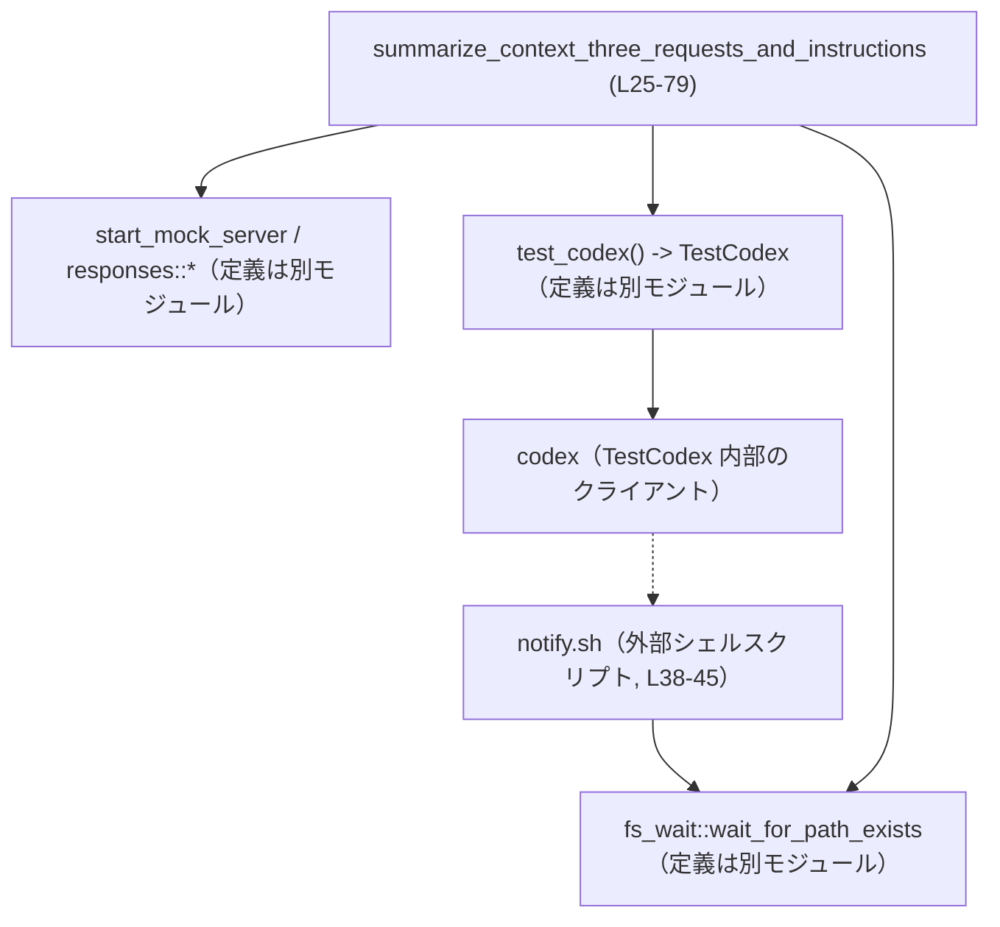
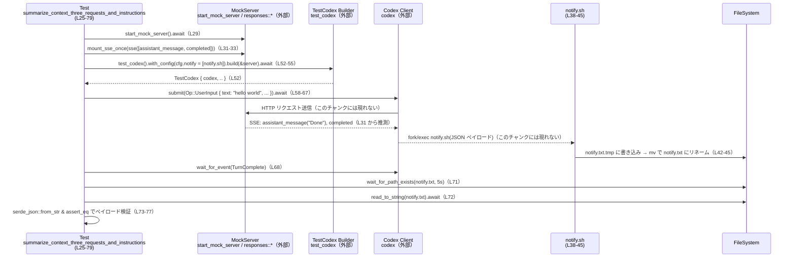

# core/tests/suite/user_notification.rs

## 0. ざっくり一言

非 Windows 環境で、Codex の「ユーザー通知スクリプト」機能が、エージェントのターン完了時に期待どおりの JSON ペイロードを外部シェルスクリプトに渡しているかを検証する非同期統合テストです（`core/tests/suite/user_notification.rs:L1-79`）。

---

## 1. このモジュールの役割

### 1.1 概要

- このテストモジュールは、Codex を `notify` スクリプト付きで起動し、ユーザー入力を処理した結果として通知スクリプトに渡される JSON が正しいかどうかを確認します（`L35-55`）。
- モック SSE サーバと、Unix シェルスクリプト `notify.sh` を組み合わせ、Codex の通知経路全体をエンドツーエンドで検証しています（`L29-33`, `L38-47`, `L52-55`）。
- 非 Windows 環境限定で動作し、Tokio のマルチスレッドランタイム上で非同期に実行されます（`L1`, `L25`）。

### 1.2 アーキテクチャ内での位置づけ

このファイルは **テストスイート** の一部であり、本体のユーザー通知機構（`cfg.notify` 設定を解釈してスクリプトを実行する部分）をブラックボックスとして扱います。

- Codex 本体の構成はこのチャンクには現れませんが、`TestCodex` ビルダー経由で Codex を構築しています（`L52-55`）。
- HTTP/SSE 通信は `start_mock_server`, `responses::mount_sse_once`, `sse`, `ev_assistant_message`, `ev_completed` などのヘルパーに委譲しています（`L29-33`）。
- 通知は、Codex が外部スクリプト `notify.sh` をフォーク・実行し、そのスクリプトがファイル `notify.txt` にペイロードを書き出すことで観測しています（`L38-47`, `L49`, `L71-73`）。

依存関係を簡略化した図は次のとおりです。



> ここで破線 `C -.-> N` は、Codex 内部で `notify.sh` が実行されていると解釈できる呼び出し関係を示しますが、その内部実装はこのチャンクには現れません（`L52-55`, `L58-68`）。

### 1.3 設計上のポイント

- **プラットフォーム制約の明示**  
  - Unix 専用 API `std::os::unix::fs::PermissionsExt` を利用するため、`#![cfg(not(target_os = "windows"))]` で Windows をコンパイル対象から除外しています（`L1`, `L3`, `L47`）。
- **一時ディレクトリを用いた隔離された実行環境**  
  - `TempDir` を使って通知スクリプトと出力ファイルを一時ディレクトリ内に作成し、テスト終了時に自動でクリーンアップされるようにしています（`L35`, `L37`, `L49`）。
- **外部スクリプトとの連携**  
  - 短い bash スクリプトをテスト内で生成し、「最後のコマンドライン引数を JSON ペイロードとして受け取り、`notify.txt` に書き込む」という単純な通知インターフェースを定義しています（`L38-45`）。
- **非同期・マルチスレッド実行**  
  - `#[tokio::test(flavor = "multi_thread", worker_threads = 2)]` により、テスト本体は Tokio のマルチスレッドランタイム上で `Send` な Future として実行されます（`L25`）。  
    そのため、`codex` や関連オブジェクトは `Send` である必要がありますが、その定義はこのチャンクには現れません。
- **エラー処理の一元化**  
  - 戻り値型に `anyhow::Result<()>` を採用し、`?` 演算子で IO やビルド処理のエラーをそのままテスト失敗として伝播させています（`L26`, `L35`, `L38`, `L46`, `L52-55`, `L58-67`, `L71-73`）。
- **競合条件の回避**  
  - 通知スクリプトは別プロセスとしてフォークされる想定のため、`fs_wait::wait_for_path_exists` でファイル生成完了を待ち、競合条件を避けています（`L70-71`）。

---

## 2. 主要な機能一覧

このモジュールが提供する（= このテストが検証する）主な機能は次のとおりです。

- ユーザー通知スクリプト連携テスト: Codex が `cfg.notify` に設定されたスクリプトを呼び出し、JSON 形式の通知ペイロードを渡していることの検証（`L35-55`, `L58-77`）。
- モック SSE サーバ連携: モックサーバからの SSE イベント（アシスタントメッセージ、完了イベント）受信後に通知が送られることの検証（`L29-33`, `L31`）。
- ファイルシステムを通じた通知結果の観測: `notify.txt` の生成と内容を通じて、外部スクリプトに渡されたデータを確認（`L49`, `L71-73`, `L75-77`）。

---

## 3. 公開 API と詳細解説

### 3.1 コンポーネントインベントリー

#### 3.1.1 このファイル内で定義される要素

| 名前 | 種別 | 役割 / 用途 | 定義箇所 |
|------|------|-------------|-----------|
| `summarize_context_three_requests_and_instructions` | 非公開関数（Tokio テスト） | Codex のユーザー通知スクリプト機能を、モック SSE サーバと bash スクリプトを用いて統合テストする | `core/tests/suite/user_notification.rs:L25-79` |

このファイル内で新たな構造体や列挙体の定義はありません。

#### 3.1.2 外部で定義され、このモジュールで重要な型・関数

> 以下は **利用しているが定義がこのチャンクに無い** 主なコンポーネントです。役割は名前と使用箇所からの解釈であり、厳密な仕様はこのチャンクからは分かりません。

| 名前 | 種別 | 想定される役割 / 用途 | このチャンク内の利用箇所 |
|------|------|------------------------|---------------------------|
| `TestCodex` | 構造体 | テスト用 Codex ラッパーであり、`codex` クライアントなどを保持していると解釈できます | デストラクチャで `codex` を取得（`L52-55`） |
| `test_codex` | 関数 | `TestCodex` ビルダーを返すヘルパー | Codex の構築（`L52-55`） |
| `Op` | 列挙体 | Codex に対する操作（ここでは `Op::UserInput`）を表す型 | `codex.submit` の引数（`L59`） |
| `UserInput` | 列挙体 | ユーザー入力の種類（ここではテキスト）を表す型 | `UserInput::Text` の作成（`L60-63`） |
| `EventMsg` | 列挙体 | Codex からのイベント（ここでは `TurnComplete`）を表す型 | `wait_for_event` のフィルタ（`L68`） |
| `TempDir` | 構造体 | 一時ディレクトリを生成し、スコープ終了時に削除するユーティリティ | 通知スクリプト用ディレクトリの生成（`L35`） |
| `fs_wait::wait_for_path_exists` | 非同期関数 | 指定パスのファイルが生成されるまで待機するユーティリティ | 通知ファイル生成の待機（`L71`） |
| `responses::{sse, ev_assistant_message, ev_completed, start_mock_server, mount_sse_once}` | 関数群 | モック SSE サーバとイベント列を構成するテストヘルパーと解釈できます | サーバ起動と SSE ルート設定（`L29-33`） |
| `wait_for_event` | 非同期関数 | Codex から特定条件のイベントがくるまで待機するテストヘルパー | `TurnComplete` を待機（`L68`） |

### 3.2 関数詳細

#### `summarize_context_three_requests_and_instructions() -> anyhow::Result<()>`

**概要**

- Codex を通知スクリプト付きで構築し、ユーザー入力 `"hello world"` を送信した後、通知スクリプトに渡される JSON ペイロードが期待どおりであることを検証する非同期テストです（`L52-55`, `L58-77`）。
- テストは非 Windows 環境でのみコンパイルされ、Tokio のマルチスレッドランタイムで実行されます（`L1`, `L25`）。

**引数**

このテスト関数は引数を取りません。

| 引数名 | 型 | 説明 |
|--------|----|------|
| なし | - | - |

**戻り値**

- 戻り値型: `anyhow::Result<()>`（`L26`）  
  - 正常終了時は `Ok(())` を返し、テストは成功します（`L79`）。  
  - 途中で発生した IO やビルド等のエラーは `?` 演算子によって `Err(_)` として伝播し、テスト失敗となります（`L35`, `L38`, `L46`, `L52-55`, `L58-67`, `L71-73`）。

**内部処理の流れ（アルゴリズム）**

1. **環境前提のチェック**  
   - `skip_if_no_network!(Ok(()));` を呼び出します（`L27`）。  
     このマクロの定義はこのチャンクにはありませんが、ネットワーク利用可否に応じた挙動を意図していると解釈できます。

2. **モック SSE サーバの準備**  
   - `start_mock_server().await` でモックサーバを起動し、`server` 変数に保持します（`L29`）。  
   - `sse1` として、`ev_assistant_message("m1", "Done")` と `ev_completed("r1")` を含む SSE イベント列を構築します（`L31`）。  
   - `responses::mount_sse_once(&server, sse1).await` で、この SSE イベント列をサーバに一度だけ配信するルートとして登録します（`L33`）。

3. **通知スクリプトと出力ファイルのセットアップ**  
   - `TempDir::new()?` で一時ディレクトリを作成し、`notify_dir` として保持します（`L35`）。  
   - `notify.sh` のフルパスを組み立て（`L37`）、`std::fs::write` で以下の bash スクリプトを書き込みます（`L38-45`）。

     ```bash
     #!/bin/bash
     set -e
     payload_path="$(dirname "${0}")/notify.txt"
     tmp_path="${payload_path}.tmp"
     echo -n "${@: -1}" > "${tmp_path}"
     mv "${tmp_path}" "${payload_path}"
     ```

     - 最後の引数（`${@: -1}`）をペイロードとして `.tmp` ファイルに書き込み、その後 `mv` で `notify.txt` にアトミックに置き換える挙動です（`L42-45`）。
   - `std::fs::set_permissions(&notify_script, std::fs::Permissions::from_mode(0o755))?` により、実行権限付きのパーミッションを設定します（`L47`）。
   - `notify_file` として `notify.txt` のパスを準備し（`L49`）、`notify_script` を UTF-8 文字列に変換して `notify_script_str` に格納します（`L50`）。  
     ここで `to_str().unwrap()` を使用しているため、パスが UTF-8 でない場合はパニックが発生します。

4. **Codex インスタンスの構築**  
   - `test_codex()` からビルダーを取得し（`L52`）、`.with_config(move |cfg| cfg.notify = Some(vec![notify_script_str]))` で `cfg.notify` にスクリプトパスを設定します（`L53`）。  
   - `.build(&server).await?` でモックサーバと接続された Codex インスタンスを構築し、`TestCodex { codex, .. }` として `codex` を取得します（`L52-55`）。

5. **ユーザー入力の送信とエージェントターン完了までの待機**  
   - コメントに「Normal user input – should hit server once.」とあるように、通常のユーザー入力を一度送信します（`L57`）。  
   - `codex.submit(Op::UserInput { ... }).await?` で、`"hello world"` というテキスト入力を Codex に送信します（`L58-66`）。
   - `wait_for_event(&codex, |ev| matches!(ev, EventMsg::TurnComplete(_))).await;` で、`EventMsg::TurnComplete` イベントが届くまで待機します（`L68`）。

6. **通知スクリプトの実行完了待ちと出力検証**  
   - コメントにもあるように、通知スクリプトはフォークされて非同期に実行されるため、`fs_wait::wait_for_path_exists(&notify_file, Duration::from_secs(5)).await?` で最大 5 秒間 `notify.txt` の生成を待機します（`L70-71`）。
   - `tokio::fs::read_to_string(&notify_file).await?` で `notify.txt` の内容を読み取り（`L72`）、`serde_json::from_str` で `serde_json::Value` としてパースします（`L73`）。
   - 以下の 3 つのフィールドについて `assert_eq!` で期待値を検証します（`L75-77`）。
     - `payload["type"] == "agent-turn-complete"`
     - `payload["input-messages"] == ["hello world"]`
     - `payload["last-assistant-message"] == "Done"`

7. **終了**  
   - 全ての検証が成功した場合、`Ok(())` を返してテストを終了します（`L79`）。

**Examples（使用例）**

この関数自体はテストランナーから自動的に呼ばれるため、通常コードから直接呼び出すことはありません。  
ただし「通知スクリプト付き Codex を構築し、ユーザー入力を送って通知結果をファイルで確認する」というパターンは、他のテストケースでもほぼ同じ形で利用できます。

以下は、このテストの流れを簡略化した「通知スクリプト付き Codex を用いたテスト」の例です。

```rust
// 非 Windows 環境前提のテスト例
#[tokio::test(flavor = "multi_thread", worker_threads = 2)]
async fn example_notify_test() -> anyhow::Result<()> {
    // ネットワーク前提を満たさない場合の挙動はこのチャンクからは不明だが、
    // 実際のコードでは skip_if_no_network! などのマクロでガードしている（L27）。
    skip_if_no_network!(Ok(()));

    // モックサーバを起動する（L29）
    let server = start_mock_server().await;

    // 通知スクリプトを一時ディレクトリ内に作成する（L35-47）
    let tmp = tempfile::TempDir::new()?;
    let script = tmp.path().join("notify.sh");
    std::fs::write(&script, r#"#!/bin/bash
set -e
echo -n "${@: -1}" > "$(dirname "${0}")/notify.txt""#)?;
    std::fs::set_permissions(&script, std::fs::Permissions::from_mode(0o755))?;

    // Codex を通知スクリプト付きで構築する（L52-55）
    let script_str = script.to_str().unwrap().to_string();
    let TestCodex { codex, .. } = test_codex()
        .with_config(move |cfg| cfg.notify = Some(vec![script_str]))
        .build(&server)
        .await?;

    // ユーザー入力を送信する（L58-66）
    codex.submit(Op::UserInput {
        items: vec![UserInput::Text {
            text: "hello world".into(),
            text_elements: Vec::new(),
        }],
        final_output_json_schema: None,
        responsesapi_client_metadata: None,
    }).await?;

    // 通知ファイルを読み取って検証する（L71-77）
    let notify_file = tmp.path().join("notify.txt");
    fs_wait::wait_for_path_exists(&notify_file, Duration::from_secs(5)).await?;
    let body = tokio::fs::read_to_string(&notify_file).await?;
    println!("notify payload = {}", body);

    Ok(())
}
```

> 上記はこのファイルのパターンを踏襲した簡略例であり、実際の本体コードに新しい依存は追加していません。

**Errors / Panics**

- **`?` によるエラー伝播**  
  次の呼び出しは `?` により、失敗時に即座に `Err` を返します（テスト失敗）:

  - `TempDir::new()`（一時ディレクトリの作成に失敗した場合。`L35`）
  - `std::fs::write`（スクリプトファイル書き込み失敗。`L38`）
  - `std::fs::set_permissions`（パーミッション変更失敗。`L47`）
  - `test_codex().build(&server).await`（Codex 構築失敗。`L52-55`）
  - `codex.submit(...).await`（リクエスト送信や応答処理の失敗。`L58-67`）
  - `fs_wait::wait_for_path_exists(...).await`（タイムアウトや IO エラー。`L71`）
  - `tokio::fs::read_to_string(...).await`（ファイル読み取り失敗。`L72`）
  - `serde_json::from_str(&notify_payload_raw)`（JSON パース失敗。`L73`）

- **パニックが起こりうる箇所**

  - `notify_script.to_str().unwrap()`（`L50`）  
    - パスが UTF-8 でエンコードできない場合にパニックします。  
      通常の一時ディレクトリパスでは問題ないことが多いですが、理論上のパニック要因です。
  - `assert_eq!`（`L75-77`）  
    - 期待値と異なる場合にパニックし、テスト失敗となります。

**Edge cases（エッジケース）**

- **ネットワーク未使用 / 利用不可**  
  - `skip_if_no_network!(Ok(()));` の挙動はこのチャンクからは分かりませんが、ネットワークが利用できない環境ではテストがスキップされる、または即時に `Ok(())` を返すことを意図していると解釈できます（`L27`）。
- **通知スクリプトが失敗する場合**  
  - `set -e` が設定されているため、スクリプト内のどこかでエラー（例: 書き込み不可）が発生すると即時終了します（`L41`）。  
    - その場合、`notify.txt` が生成されず、`wait_for_path_exists` がタイムアウトしてエラーを返す可能性があります（`L71`）。
- **JSON 形式でない出力**  
  - スクリプトが JSON 以外の文字列を書き出した場合、`serde_json::from_str` が失敗しエラーになります（`L73`）。
- **イベント順序の変化**  
  - このテストは `ev_assistant_message("m1", "Done")` → `ev_completed("r1")` という順番のイベントを前提としています（`L31`）。  
    順序が変わったり、`TurnComplete` イベントが発生しない場合、`wait_for_event` の挙動によってはテストがハングまたは失敗する可能性があります（`L68`）。

**使用上の注意点（安全性・並行性・その他）**

- **非 Windows 専用**  
  - Unix 固有のパーミッション API と `/bin/bash` を前提にしているため、Windows ではコンパイルされないようガードされています（`L1`, `L3`, `L38`）。
- **並行性**  
  - マルチスレッド Tokio ランタイム上で実行されるため、内部で使用するオブジェクトは基本的に `Send` である必要がありますが、このチャンクからはその型定義は確認できません（`L25`）。  
  - 通知スクリプトは別プロセスとしてフォークされるため、Codex 側の非同期処理と OS レベルのプロセス実行が並行して進みます。そのため `wait_for_path_exists` を使って同期を取っています（`L70-71`）。
- **ファイル出力を介した検証**  
  - テストでは通知ペイロードをファイル経由で検証しているため、ファイルシステムの遅延やパーミッション設定の問題に左右される可能性があります。  
- **潜在的な不具合・セキュリティ上の観点（テストコードとして）**
  - スクリプトは最後の引数 `${@: -1}` をそのままファイルに書き出しており、内容に対する検証やサニタイズは行っていません（`L44`）。  
    テストでは Codex が渡す JSON 文字列をそのまま信頼する前提です。
  - `to_str().unwrap()` はパス文字列が UTF-8 でない場合にパニックしますが、テスト環境では許容されていると考えられます（`L50`）。

### 3.3 その他の関数

このファイルには、`summarize_context_three_requests_and_instructions` 以外に新たな関数定義はありません。  
`skip_if_no_network!` などのマクロ、`start_mock_server` などの関数はすべて外部モジュールからのインポートです（`L5-23`, `L27`, `L29-33`）。

---

## 4. データフロー

このテストにおける代表的なデータフローは、次のように整理できます。

1. テスト関数がモック SSE サーバと Codex を立ち上げる（`L29-33`, `L52-55`）。
2. Codex にユーザー入力 `"hello world"` を送信し、SSE を通じてアシスタントメッセージ `"Done"` と完了イベントを受信する（`L31`, `L58-67`）。
3. Codex 内部の通知処理が JSON ペイロードを生成し、それを引数として `notify.sh` を実行する（Codex 内部実装はこのチャンクには現れません）。
4. `notify.sh` が最後の引数を `notify.txt` に書き出し、テストがそのファイルを読み取って JSON として検証する（`L38-45`, `L49`, `L71-77`）。

これをシーケンス図で示します。



> Codex 内部がどのように `notify.sh` を起動し JSON を生成しているかは、このテストファイルからは分かりません。ここでは「Codex が外部スクリプトを最後の引数に JSON を渡して実行する」というインターフェースだけを前提としています（`L38-45`, `L52-55`）。

---

## 5. 使い方（How to Use）

### 5.1 基本的な使用方法

このモジュール自体はテスト専用です。  
ただし、「Codex に通知スクリプトを設定し、その挙動をテストで検証する」という観点では、次のようなフローが基本パターンになります。

1. 一時ディレクトリを作成し、そこに通知スクリプト `notify.sh` を生成する（`L35-47`）。
2. スクリプトパスを文字列に変換し、`cfg.notify` に `Some(vec![path])` として設定した `TestCodex` を構築する（`L50-55`）。
3. `codex.submit(Op::UserInput { ... }).await` でユーザー入力を送信する（`L58-67`）。
4. 内部で発火するイベントを `wait_for_event` などで待ち、通知スクリプトによる副作用（ここではファイル生成）を検証する（`L68-77`）。

### 5.2 よくある使用パターン

- **通知ペイロードのフィールド追加をテストしたい場合**  
  - Codex 側で通知ペイロードにフィールドが追加された場合、このテストを拡張して `payload["new-field"]` についても `assert_eq!` で検証できます（`L75-77` を参考）。
- **別の入力パターンを検証したい場合**  
  - `UserInput::Text` の `text` を `"another input"` に変えることで、入力メッセージ配列の内容が変化するかを検証できます（`L60-62`）。

### 5.3 よくある間違い

```rust
// 誤り例: 通知スクリプトに実行権限を付与していない
let notify_script = notify_dir.path().join("notify.sh");
std::fs::write(&notify_script, /* スクリプト内容 */)?;
// std::fs::set_permissions を呼んでいない → スクリプトが実行できず、notify.txt が生成されない可能性がある

// 正しい例: 書き込み後に実行権限を付与する（L38-47 と同様）
let notify_script = notify_dir.path().join("notify.sh");
std::fs::write(&notify_script, /* スクリプト内容 */)?;
std::fs::set_permissions(&notify_script, std::fs::Permissions::from_mode(0o755))?;
```

```rust
// 誤り例: 通知ファイルを即座に読み取ろうとする
let notify_file = notify_dir.path().join("notify.txt");
// ここで直ちに read_to_string を呼ぶと、まだスクリプトが書き込みを終えておらず失敗する可能性がある

// 正しい例: fs_wait::wait_for_path_exists でファイルの出現を待機する（L71）
fs_wait::wait_for_path_exists(&notify_file, Duration::from_secs(5)).await?;
let body = tokio::fs::read_to_string(&notify_file).await?;
```

### 5.4 使用上の注意点（まとめ）

- 通知スクリプトは OS のシェル環境（bash）に依存するため、シェルの有無やパスに注意が必要です（`L38`）。
- スクリプトの終了ステータスが 0 でない場合、`notify.txt` が生成されずにテストがタイムアウトする可能性があります（`L41`, `L71`）。
- マルチスレッドランタイム上で実行されるため、Codex やテストヘルパーが内部で共有状態を扱う場合はスレッド安全性に注意が必要です（ただし、その詳細はこのチャンクには現れません）。

---

## 6. 変更の仕方（How to Modify）

### 6.1 新しい機能を追加する場合

例: 通知ペイロードに新しいフィールド `session-id` を追加したい場合

1. **Codex 本体**  
   - 通知ペイロードを生成する箇所（このチャンクには現れない）で `session-id` を JSON に追加する。
2. **テストスクリプト**  
   - 現在の `notify.sh` は「最後の引数をそのまま書き出す」だけなので、追加変更は不要である可能性が高い（`L44`）。  
   - もし引数の形式を変える場合は、ここも合わせて変更する必要があります。
3. **本テストファイル**  
   - JSON 検証に `assert_eq!(payload["session-id"], json!("expected-id"));` のような行を追加する（`L75-77` に倣う）。
4. **影響範囲の確認**  
   - 他の通知関連テスト（このチャンクには現れない）が同じペイロード構造を期待していないかを確認する。

### 6.2 既存の機能を変更する場合

- **通知スクリプトのインターフェースを変える場合**
  - 例えば「最後の引数」ではなく「環境変数」で JSON を渡すような仕様変更を行う場合、以下の変更が必要です。
    - `notify.sh` の中身を変更し、環境変数からペイロードを読むようにする（`L38-45`）。
    - Codex 本体の通知処理で、その環境変数を設定するように変更する（このチャンクには現れません）。
    - このテストで「最後の引数」に依存している前提があれば、コメントや説明文を更新する。
- **タイムアウト値を調整する場合**
  - 通知スクリプトの実行時間が長くなった場合、`wait_for_path_exists` のタイムアウト秒数（5 秒）を変更する必要があります（`L71`）。
- **注意すべき契約（前提条件・戻り値の意味）**
  - `codex.submit` は、正常にサーバと通信できた場合にのみ `Ok(…)` を返すと前提していますが、その具体的な契約はこのチャンクには現れません（`L58-67`）。  
  - `wait_for_event` が `EventMsg::TurnComplete` を必ず一度は発行する前提で設計されています（`L68`）。

---

## 7. 関連ファイル

| パス / モジュール | 役割 / 関係 |
|-------------------|------------|
| `core/tests/suite/user_notification.rs` | 本ドキュメントの対象ファイル。ユーザー通知スクリプト機能の統合テストを定義します。 |
| `core_test_support::test_codex` | `TestCodex` 型および `test_codex` ビルダーを提供し、Codex インスタンス構築とテスト用ユーティリティを担います（定義ファイルはこのチャンクには現れません）。 |
| `core_test_support::responses` | `start_mock_server`, `sse`, `ev_assistant_message`, `ev_completed`, `mount_sse_once` など、モック SSE サーバとレスポンス構築用ヘルパーを提供します（定義ファイルはこのチャンクには現れません）。 |
| `core_test_support::fs_wait` | `wait_for_path_exists` など、ファイルシステム上のパス出現を待機する非同期ユーティリティを提供します（定義ファイルはこのチャンクには現れません）。 |
| `core_test_support::wait_for_event` | Codex からのイベントストリームを監視し、条件を満たすイベントまで待機するヘルパーです（定義ファイルはこのチャンクには現れません）。 |
| `codex_protocol::protocol` | `EventMsg`, `Op` など、Codex プロトコルのコア型を定義するモジュールです（このチャンクからはインポートのみ確認できます。`L5-6`）。 |
| `codex_protocol::user_input` | `UserInput` 型を提供し、ユーザー入力データの表現を担います（`L7`）。 |

> 上記のうち、本ファイル以外の具体的なファイルパスや内部実装は、このチャンクには現れません。そのため、役割はモジュール名と使用状況からの解釈に基づいています。
